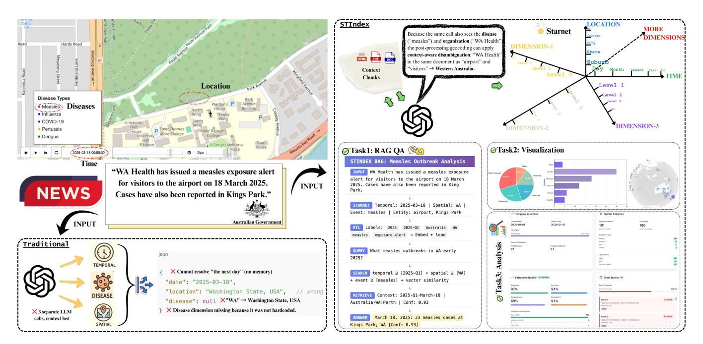
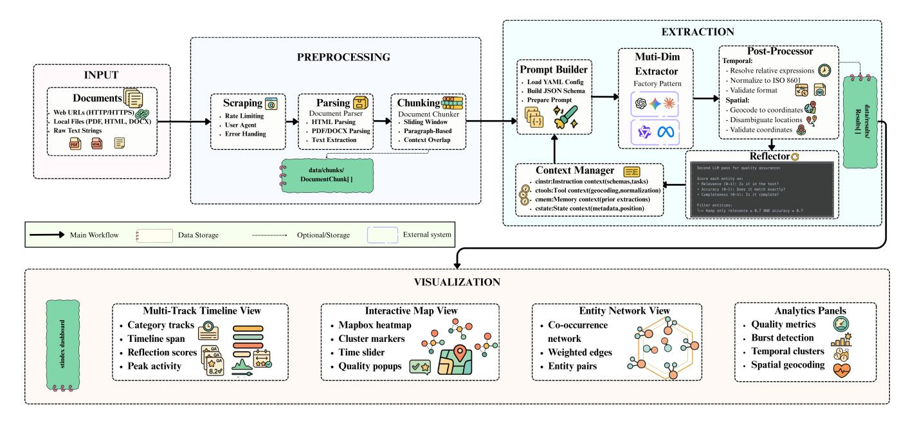
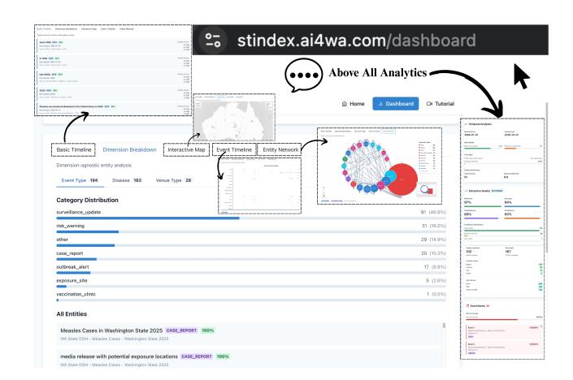

# STIndex: A Context-Aware Multi-Dimensional Spatiotemporal Information Extraction System

Wenxiao Zhang†,∗ wenxiao.zhang@research.uwa.edu.au The University of Western Australia Perth, Australia

Yu Liu†,∗ liuyu@iie.ac.cn Institute of Information Engineering, Chinese Academy of Sciences University of Chinese Academy of Sciences, Beijing, China

Qiang Sun pascal.sun@research.uwa.edu.au The University of Western Australia Perth, Australia

Yihao Ding yihao.ding@uwa.edu.au The University of Western Australia Perth, Australia

Sirui Li sirui.li@murdoch.edu.au Murdoch University Perth, Australia

Yanbing Liu liuyanbing@iie.ac.cn Institute of Information Engineering, Chinese Academy of Sciences University of Chinese Academy of Sciences, Beijing, China

Jin B. Hong† jin.hong@uwa.edu.au The University of Western Australia Perth, Australia

Wei Liu†

wei.liu@uwa.edu.au The University of Western Australia Perth, Australia

#### Abstract

Extracting structured knowledge from unstructured data still faces practical limitations: entity and event extraction pipelines remain brittle, knowledge graph construction requires costly ontology engineering, and cross-domain generalization is rarely productionready. In contrast, space and time provide universal contextual anchors that naturally align heterogeneous information and benefit downstream tasks such as retrieval and reasoning. We introduce STIndex, an end-to-end system that structures unstructured content into a multidimensional spatiotemporal data warehouse. Users define domain-specific analysis dimensions with configurable hierarchies, while large language models perform context-aware extraction and grounding. STIndex integrates document-level memory, geocoding correction, and quality validation, and offers an interactive analytics dashboard for visualization, clustering, burst detection, and entity network analysis. In evaluation on a public health benchmark, STIndex improves spatiotemporal entity extraction F1 by 4.37% (GPT-4o-mini) and 3.60% (Qwen3-8B). A live demonstration and open-source code are available at [https:](https://stindex.ai4wa.com/dashboard) [//stindex.ai4wa.com/dashboard.](https://stindex.ai4wa.com/dashboard)

# CCS Concepts

## • Computing methodologies → Information extraction.

© 2026 Copyright held by the owner/author(s). ACM ISBN 979-8-4007-2308-7/2026/04 <https://doi.org/10.1145/3774905.3793103>

## Keywords

Spatiotemporal Extraction, LLM Reflection, Event Clustering, Interactive Visualization

#### ACM Reference Format:

Wenxiao Zhang†,∗ , Yu Liu†,∗ , Qiang Sun, Yihao Ding, Sirui Li, Yanbing Liu, Jin B. Hong† , and Wei Liu† . 2026. STIndex: A Context-Aware Multi-Dimensional Spatiotemporal Information Extraction System. In Companion Proceedings of the ACM Web Conference 2026 (WWW Companion '26), April 13–17, 2026, Dubai, United Arab Emirates. ACM, New York, NY, USA, [4](#page-3-0) pages. <https://doi.org/10.1145/3774905.3793103>

# 1 Introduction

Unstructured data continues to grow rapidly across domains, yet real-world adoption of structured extraction remains limited. Despite progress in entity and relation extraction, event detection, and knowledge graph construction [\[4\]](#page-3-1), existing pipelines still struggle with ambiguity, domain transfer, and production-level robustness [\[2\]](#page-3-2). In contrast, spatiotemporal information is naturally shared across domains and offers a stable organizational context for unstructured data. Motivated by the success of data warehouses, we propose to treat space and time as universal anchoring dimensions and define domain-specific analysis dimensions as configurable hierarchies. Instead of requiring complex ontologies, this multidimensional and hierarchical design enables scalable cross-domain adoption and supports downstream tasks such as retrieval-augmented generation (RAG), visualization, analysis, and reasoning.

However, existing systems to extract spatial and temporal information remain fragmented: temporal [\[3,](#page-3-3) [8\]](#page-3-4) and spatial [\[5,](#page-3-5) [6\]](#page-3-6) extractors usually operate independently, creating pipeline composition errors, context loss, and lacking unified frameworks for downstream analytics. Existing approaches face three critical gaps. First, specialized extractors lack preprocessing for diverse inputs (PDF,

∗Equal contribution.

†Corresponding author.

[This work is licensed under a Creative Commons Attribution 4.0 International License.](https://creativecommons.org/licenses/by/4.0) WWW Companion '26, Dubai, United Arab Emirates

Figure 1: Public health alert example: a split pipeline loses context and misreads "WA" as Washington, while STIndex's unified, context-aware extraction correctly resolves it as Western Australia.

HTML, DOCX) and fail to provide complete pipelines from source to insight. Second, architectural fragmentation causes temporal and spatial systems to work separately, losing the inter-dimensional context needed for disambiguation across document chunks. Third, quality control challenges arise from noisy LLM outputs with false positives requiring manual verification.

We present STIndex, an end-to-end system that enables users to define domain-specific multidimensional schemas—composed of spatial, temporal, and additional semantic dimensions—and leverage them for context-aware information extraction and interactive analytics. Our key contributions are: (1) a domain-agnostic extraction framework that supports configurable multidimensional schemas without code modifications; (2) unified single-call LLM extraction with document-level memory to resolve ambiguous references, enhanced by specialized post-processing modules; and (3) an out-of-the-box analytics interface providing spatiotemporal visualization together with clustering, burst detection, and graphbased relation analysis. STIndex is publicly available on PyPI and can be installed via pip install stindex, enabling immediate deployment for researchers and practitioners.

#### 2 Related Work

Spatiotemporal Information Extraction. Spatiotemporal information extraction traditionally separates temporal and spatial processing. Temporal systems like HeidelTime [\[8\]](#page-3-4) provide rule-based normalization with high precision but limited recall, while neural approaches achieve 83.5% F1 on clinical temporal relations [\[3\]](#page-3-3) using typed markers with BERT. Spatial extraction evolved from geoparsing like Mordecai [\[5\]](#page-3-5) to LLM-based approaches fine-tuning Mistral and Llama2 with LoRA, achieving 91% Accuracy@161km [\[6\]](#page-3-6), which

is 17% better than prior methods. These systems operate independently, losing inter-dimensional context for disambiguation. End-to-End Information Extraction. End-to-end systems demonstrate comprehensive pipeline integration. IEPile [\[4\]](#page-3-1) created the largest schema-based IE corpus with 0.32B tokens across 33 datasets using instruction tuning. LLM-AIx [\[10\]](#page-3-7) provides complete medical document processing with 87–92% accuracy, incorporating OCR, parsing, and web interfaces. While these systems address preprocessing and usability, neither specifically targets spatiotemporal information nor provides visualizations revealing temporal-spatial patterns. Domain-specific systems remain fragmented, requiring users to chain separate tools for their specific use cases.

#### 3 System Architecture

STIndex. employs a three-stage architecture with three modules: (1) unstructured data preprocessing, (2) spatiotemporal-aware information extraction, and (3) downstream analysis and visualization. The overall workflow is illustrated in Figure [2.](#page-2-0)

# 3.1 Unstructured Data Preprocessing Module

The PREPROCESSING module provides unified document ingestion from heterogeneous sources, transforming diverse formats into structured text suitable for extraction. Three input types are supported: web URLs with rate-limited scraping, local files (HTML, PDF, DOCX, TXT) via the unstructured library, and raw text. Document metadata (publication date, source location) is preserved for context-aware extraction. Four chunking strategies, sliding window, paragraph-based, element-based, and semantic chunking, are supported to process long documents, with default configuration using 2000, character chunks with 200, character overlap.

Figure 2: The Overview of the STIndex System Architecture

# 3.2 Context-Aware Extraction

The EXTRACTION module implements unified multi-dimensional extraction with context awareness across document chunks, resolving relative temporal expressions ("the next day") and ambiguous spatial references ("the city") through extraction memory.

Context Engineering. The system uses four types of context. Memory context (Cmem) keeps track of previously mentioned entities to resolve relative references. State context (Cstate) holds document metadata, and instruction context (Cinstr) makes sure extractions stay consistent with what came before. Tool context (Ctools) allows

post-processing tools to access the complete document context. Unified Extraction. A single LLM call processes all dimensions simultaneously, avoiding context loss and enabling cross-dimensional disambiguation, where custom dimensions like venues constrain spatial extraction, and temporal context resolves ambiguities. Four extraction types: normalized extraction converts temporal expressions to ISO 8601, geocoded extraction resolves coordinates using multi-level fallback, categorical extraction maps to controlled vocabularies, and structured extraction handles multi-attribute entities. LLM Backend Flexibility. The system supports multiple LLM backends: propriety APIs for state-of-the-art accuracy with per-token costs, and open-source models for self-hosted deployment with multi-GPU support. The unified interface ensures that the extraction logic remains independent of the backend provider.

2-Pass Reflection. Quality filtering employs 2-pass reflection: a first pass extracts candidate entities with confidence scores, and a second pass scores them on relevance, accuracy, and consistency (0–1 each). Entities below configurable thresholds (default: 0.7) are filtered out, at the cost of one extra LLM call per chunk but with fewer false positives.

Figure 3: STIndex Dashboard Demonstration

## 3.3 Interactive Analysis Dashboard

The VISUALIZATION module is built with Next.js, React, and Type-

Script; the dashboard features 5 tabbed visualization modes. Visualization Components. Interactive Map uses Mapbox GL for heatmap clusters; Multi-Track Timeline employs D3.js for categorybased events; Entity Network renders ReactFlow co-occurrence graphs; Basic Timeline lists temporal entities chronologically; Dimension Breakdown shows frequency distributions.

Spatiotemporal Analytics. Built-in spatiotemporal algorithms include DBSCAN-inspired clustering with 50km spatial and 7-day temporal radii, sliding-window burst detection, and co-occurrence network analysis. Four analytics panels provide quality metrics, burst detection, temporal analytics, and spatial visualization.

Table 1: Overall Evaluation Results (500 Document Chunks)

| Model           | Mode        | T-P   | T-R   | T-F1  | Comb-F1  |
|-----------------|-------------|-------|-------|-------|----------|
| GPT-4o-mini [7] | Baseline    | 67.83 | 65.44 | 66.61 | 70.72    |
|                 | STIndex     | 71.05 | 68.32 | 69.66 | 73.81    |
|                 | Improvement | +3.22 | +2.88 | +3.05 | +4.37%   |
| Qwen3-8B [9]    | Baseline    | 59.80 | 56.82 | 58.27 | 69.81    |
|                 | STIndex     | 67.84 | 65.22 | 66.50 | 72.32    |
|                 | Improvement | +8.04 | +8.40 | +8.23 | +3.60%   |
| Model           | Mode        | S-P   | S-R   | S-F1  | MDE (km) |
| GPT-4o-mini [7] | Baseline    | 87.11 | 65.59 | 74.83 | 377.32   |
|                 | STIndex     | 92.00 | 67.65 | 77.97 | 369.02   |
|                 | Improvement | +4.89 | +2.06 | +3.14 | +2.2%    |
| Qwen3-8B [9]    | Baseline    | 89.40 | 74.63 | 81.35 | 1371.88  |
|                 | STIndex     | 88.39 | 70.03 | 78.15 | 444.15   |
|                 | Improvement | -1.01 | -4.60 | -3.20 | +67.6%   |

T-P/R/F1: Temporal Precision/Recall/F1 (%), S-P/R/F1: Spatial Precision/Recall/F1 (%)

Comb-F1: Combined F1 (%), MDE: Mean Distance Error (km)

# 4 Demonstration

# 4.1 Case Study: Public Health Surveillance

We demonstrate STIndex on public health surveillance using Qwen3- 8B, processing 10 real-world documents with 115 chunks. The system extracts 801 entities across five dimensions: 229 temporal, 167 spatial, 183 disease, 194 event types, and 28 venue types. Contextaware extraction preserves inter-dimensional relationships within single calls—each measles exposure event maintains linked temporal, spatial, event type, venue, and disease attributes. DBSCAN clustering generates 91 spatiotemporal clusters with 2–4 events each (mean: 2.3), successfully grouping related exposures while distinguishing outbreak waves. Figure [3](#page-2-1) showcases the analytical and visualisation components. Details are available in the deployed dashboard at [https://stindex.ai4wa.com/dashboard.](https://stindex.ai4wa.com/dashboard)

# 4.2 Evaluation

Setup. We evaluate STIndex against a baseline approach that processes each document chunk independently without context. The baseline extracts spatiotemporal entities from each chunk in isolation, while STIndex maintains extraction context across chunks within the same document, enabling resolution of relative temporal expressions and disambiguation of location mentions. We use a synthetic dataset of 500 document chunks annotated with ground truth spatiotemporal entities, generated by Claude Sonnet 4.5 [\[1\]](#page-3-10) and followed by human review. We group chunks into 6 categories, from straightforward/baseline to standard cases. Harder types involve overlapping temporal/spatial references, relative time expressions, and underspecified locations. We compare GPT-4o-mini vs. Qwen3- 8B in baseline vs. STIndex mode. Temporal values normalized to ISO 8601 and evaluated by exact match. Spatial matching evaluated by fuzzy match with a substring/word overlap threshold of ≥50%. We compute precision, recall, and F1 scores for each dimension, plus

normalization accuracy for temporal entities, geocoding success rate, and mean distance error (MDE) for spatial entities.

Results. Table [1](#page-3-11) presents results across 100 documents. STIndex improves combined F1 by 4.37% for GPT-4o-mini and 3.60% for Qwen3-8B over baseline. GPT-4o-mini shows temporal precision improvements (+3.22 percentage points) and spatial precision gains (+4.89 pp), while Qwen3-8B achieves larger temporal F1 gains (+8.23 pp) from improved recall. Notably, STIndex improves spatial geocoding accuracy, reducing MDE by 67.6% for Qwen3-8B (1372km → 444km) compared to GPT-4o-mini's 2.2% reduction, demonstrating STIndex's context-aware extraction better handles ambiguous location names despite extracting fewer spatial entities. GPT-4omini achieves higher precision (temporal: 71.05% vs. 67.84%, spatial: 92.00% vs. 88.39%) and combined F1 (73.81% vs. 72.32%). However, Qwen3-8B shows superior geocoding accuracy, with a 67.6% MDE reduction compared to GPT-4o-mini's 2.2%.

# 5 Conclusion

STIndex addresses fragmentation in spatiotemporal information extraction by unifying preprocessing, extraction, and visualization in an end-to-end system. Innovations include configurable dimensions for domain-agnostic extraction, context-aware processing with document-level memory for resolving ambiguous references, and client-side dashboard implementation for visualization and analytics. We demonstrate and validate the system through a real-world case study and a systematic evaluation of synthetic documents. Future work will integrate backend APIs for real-time extraction, enable cross-component filtering for synchronized exploration across views, and add export capabilities for extracted data.

## References

[1] Anthropic. 2024. Claude Code: Command Line Tool for Agentic Coding. [https:](https://docs.claude.com/en/docs/claude-code) [//docs.claude.com/en/docs/claude-code.](https://docs.claude.com/en/docs/claude-code) Accessed: 2025-11-16. [2] Muhao Chen, Lifu Huang, Manling Li, Ben Zhou, Heng Ji, and Dan Roth. 2022. New Frontiers of Information Extraction. In NAACL 2022 - 2022 Conference of the North American Chapter of the Association for Computational Linguistics: Human Language Technologies, Tutorial Abstracts. Association for Computational Linguistics, 14–25. [doi:10.18653/v1/2022.naacl-tutorials.3](https://doi.org/10.18653/v1/2022.naacl-tutorials.3) [3] Cheng Cheng and Jeremy C. Weiss. 2023. Typed Markers and Context for Clinical Temporal Relation Extraction. In Proceedings of the 8th Machine Learning for Healthcare Conference (Proceedings of Machine Learning Research, Vol. 219). PMLR, New York, USA, 94–109. [4] Honghao Gui, Lin Yuan, Hongbin Ye, Ningyu Zhang, Mengshu Sun, Lei Liang, and Huajun Chen. 2024. IEPile: Unearthing Large-Scale Schema-Based Information Extraction Corpus. In Proceedings of the 62nd Annual Meeting of the Association for Computational Linguistics (Volume 2: Short Papers). Association for Computational Linguistics, Bangkok, Thailand, 127–146. [5] Andrew Halterman. 2017. Mordecai: Full Text Geoparsing and Event Geocoding. Journal of Open Source Software 2, 9 (2017), 91. [doi:10.21105/joss.00091](https://doi.org/10.21105/joss.00091) [6] Yujie Hu, Jens Kersten, Friederike Klan, and Sheikh Mastura Farzana. 2024. Toponym Resolution Leveraging Lightweight and Open-Source Large Language Models and Geo-Knowledge. International Journal of Geographical Information Science 39, 1 (2024), 1–28. [doi:10.1080/13658816.2024.2405182](https://doi.org/10.1080/13658816.2024.2405182) [7] OpenAI. 2024. GPT-4o mini. [https://openai.com/index/gpt-4o-mini-advancing](https://openai.com/index/gpt-4o-mini-advancing-cost-efficient-intelligence/)[cost-efficient-intelligence/.](https://openai.com/index/gpt-4o-mini-advancing-cost-efficient-intelligence/) Accessed: 2025-11-16. [8] Jannik Strötgen and Michael Gertz. 2013. Multilingual and Cross-domain Temporal Tagging. Language Resources and Evaluation 47, 2 (2013), 269–298. [9] Qwen Team. 2025. Qwen3 Technical Report. arXiv[:2505.09388](https://arxiv.org/abs/2505.09388) [cs.CL] [https:](https://arxiv.org/abs/2505.09388) [//arxiv.org/abs/2505.09388](https://arxiv.org/abs/2505.09388) [10] Isabel C. Wiest, Fabian Wolf, Marie-Elisabeth Leßmann, Marko van Treeck, Alessa S. Becker, Ralf Schmitz, Sebastian Butz, et al. 2025. A Software Pipeline for Medical Information Extraction with Large Language Models. npj Precision Oncology 9 (2025), 313. [doi:10.1038/s41698-025-01103-4](https://doi.org/10.1038/s41698-025-01103-4)