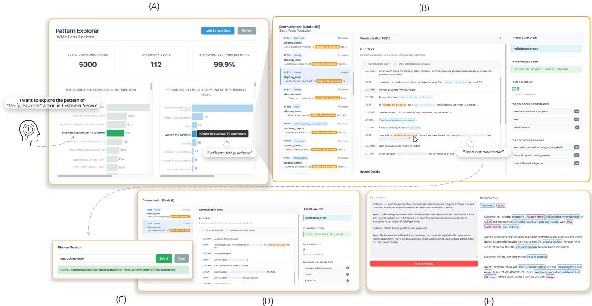
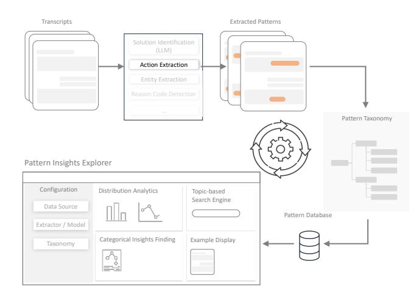

# Pattern Discovery with Wide-Lens Analysis and Sharp-Focus Validation

Li Liu∗ University of California, Santa Cruz Santa Cruz, USA lliu112@ucsc.edu

Omar Alonso Amazon Santa Clara, USA omralon@amazon.com Giorgio Ballardin† Amazon Santa Clara, USA giobal@amazon.com

# Abstract

Given an unfamiliar dataset without ground truth annotations or established taxonomies, how do we systematically discover meaningful patterns? Even with large language models providing initial categorization suggestions, it remains challenging to capture patterns and standardize them into consistent representations across unstructured data. This persistent challenge highlights the need for systematic discovery approaches. We present Pattern Insights Explorer, a modularized framework that facilitates pattern discovery through complementary wide-lens analysis and sharp-focus validation. Our multi-granularity approach follows the natural rhythm of discovery through iterative zoom-out and zoom-in perspectives: wide-lens views first reveal where promising patterns cluster across data landscapes, then sharp-focus examination validates whether our extraction methods precisely identify meaningful patterns. Through iterative refinement between these perspectives, the framework evolves rough sketches into validated taxonomic structures without requiring any external ground truth. Pattern Insights Explorer bridges the fundamental gap between having rough pattern awareness and building precise discovery systems.

# CCS Concepts

• Human-centered computing → Interactive systems and tools; Visualization systems and tools.

## Keywords

Pattern discovery, interactive visualization, unsupervised validation

#### ACM Reference Format:

Li Liu, Omar Alonso, and Giorgio Ballardin. 2026. Pattern Discovery with Wide-Lens Analysis and Sharp-Focus Validation. In Companion Proceedings of the ACM Web Conference 2026 (WWW Companion '26), April 13–17, 2026, Dubai, United Arab Emirates. ACM, New York, NY, USA, [4](#page-3-0) pages. [https:](https://doi.org/10.1145/3774905.3793105) [//doi.org/10.1145/3774905.3793105](https://doi.org/10.1145/3774905.3793105)

# 1 Introduction

How do we organize thousands of text documents from an unfamiliar domain without knowing what patterns exist? We must try initial groupings, adjust when they don't work, and find the right

© 2026 Copyright held by the owner/author(s). ACM ISBN 979-8-4007-2308-7/2026/04 <https://doi.org/10.1145/3774905.3793105>

balance between scanning too many documents superficially and getting lost analyzing individual texts too deeply.

Successful organization requires two complementary perspectives: wide-lens to see the emerging big picture and identify promising regions where pieces might belong, then sharp-focus to examine individual pieces closely and validate whether they fit correctly in their specific locations. This natural rhythm of wide exploration and focused validation applies whether we're organizing books, solving puzzles, or allocating unstructured data into categories.

Patterns in unstructured data often exist in diverse forms that resist simple categorization. This presents a circular dependency issue: we need taxonomic frameworks to guide pattern extraction and analysis, but building these frameworks requires comprehensive understanding of the very patterns that we'd like to capture.

The challenge of pattern discovery lies in iterative pattern discovery: how do we systematically evolve from vague taxonomic intuitions to robust structures that authentically represent data's intrinsic pattern distribution? In practice, pattern discovery often involves iterative manual exploration and modification through data browsing, which not only scales poorly but also provides limited systematic guidance for the discovery process, such as exploratory data analysis, hypothesis formation, validation, and refinement.

This problem exists across domains where we need to transform raw information into structured knowledge without ground-truth annotations. Even when labels and quantitative metrics exist, they often fail to provide intuitive understanding of pattern quality and distribution. Numeric precision and recall scores may mask fundamental misalignments between imposed categories and data's intrinsic pattern structure, potentially driving researchers toward metrics, such as raw precision or recall on trivial patterns, that don't reflect true discovery goals like finding novel or high-value insights. The essential need is for systematic methods that embrace uncertainty as a discovery signal and guide the iterative refinement process from rough sketches to validated taxonomic structures through natural dual-perspective exploration.

We present Pattern Insights Explorer, an interactive framework that transforms taxonomic bootstrapping through complementary perspectives: wide-lens views reveal where promising patterns cluster across data landscapes, while sharp-focus examination validates whether our extraction methods precisely identify meaningful patterns and whether our matching mechanisms work correctly.

The framework implements 0-to-1 bootstrapping, which evolves from complete taxonomic uncertainty to validated pattern frameworks through three modules that co-evolve through human assistance: Extraction Models begin with broad sensitivity parameters and be iteratively refined based on discovered pattern characteristics, enabling increasingly precise capture of domain-specific

∗Work done during internship at Amazon

†Current affiliation: Waymo

[This work is licensed under a Creative Commons Attribution 4.0 International License.](https://creativecommons.org/licenses/by/4.0) WWW Companion '26, Dubai, United Arab Emirates

Figure 1: Pattern Discovery Pipeline flows from (A) wide-lens analysis to (B) sharp-focus validation, supported by (C) free-text search, (D) co-occurrence pattern discovery, and (E) stand-alone extraction components.

structures. Evolutionary Taxonomy Systems emerge from distributional analysis rather than pre-defined categories, allowing natural pattern boundaries to guide classification structures while maintaining flexibility for boundary refinement. Matching Mechanisms optimize pattern-to-category mapping through iterative validation, improving precision through collaborative human-AI feedback loops rather than static rule-based assignment.

Our work contributes three key innovations:

- We introduce Pattern Insights Explorer, a modular framework for 0-to-1 bootstrapping that systematically evolves taxonomic uncertainty into validated pattern structures with minimal seed examples.
- We implement a visualization interface that enables iterative wide-lens and sharp-focus validation for human-readable taxonomy refinement.
- We demonstrate the system on the ABCD dataset, showing how it evolves rough pattern sketches into validated taxonomies.

Our methodology shows that taxonomic uncertainty is not a roadblock. Instead, by analyzing the data at both a broad (widelens) and detailed (sharp-focus) level, this uncertainty can be used to systematically guide the discovery process.

# 2 Related Work

Modern methods create powerful but opaque representations. Our work focuses on distilling complex, unstructured data into humanreadable taxonomic structures that are verifiable, editable, and ready

to be used in knowledge-based applications. Recent advances in emergent categorization focus on discovering natural boundaries in data distributions [\[2,](#page-3-1) [9\]](#page-3-2). However, these approaches typically operate at single granularity levels and provide limited support for iterative refinement based on domain expertise.

Automatic taxonomy construction approaches attempt to build hierarchical classification systems from data [\[1,](#page-3-3) [8\]](#page-3-4). Recent work includes distributional methods for concept hierarchy learning [\[7\]](#page-3-5) and neural approaches for taxonomy construction [\[3\]](#page-3-6).

Traditional methods typically require extensive seed examples, fully specified ontological relationships, or complete category hierarchies defined a priori, limiting their applicability to novel domains where such knowledge may not exist or may be incomplete. These approaches often assume taxonomic structures are relatively stable and can be learned through supervised or semi-supervised methods with substantial human annotation effort.

Our approach differs in both the nature and extent of initial requirements. While we utilize minimal seeds, such as a handful of 3-5 keywords or a single exploratory query, these serve as starting points for discovery rather than constraints on final taxonomic structure. The framework then enables iterative taxonomy evolution through dual-granularity analysis, allowing natural pattern boundaries to emerge from data distributions while systematically validating and refining initial hypotheses. This approach transforms rough conceptual seeds into validated taxonomic structures through human-guided optimization cycles, rather than requiring complete taxonomic specification upfront.

Figure 2: The workflow of our pattern discovery pipeline.

Our work bridges these research streams by providing the first systematic framework for bootstrapping pattern discovery from taxonomic uncertainty to validated structures. Unlike existing approaches that address individual aspects of the challenge, Pattern Insights Explorer integrates multi-scale analysis, human-AI collaboration, and iterative refinement into a unified methodology for systematic pattern discovery without ground truth dependency.

#### 3 Method

We propose a pattern discovery pipeline shown in Fig. [2](#page-2-0) that implements multi-granularity analysis through three modular components: extraction models, evolutionary taxonomies, and matching mechanisms. As shown in Algorithm [1,](#page-3-7) these components enable flexible bootstrapping configurations that can be independently refined and replaced until achieving satisfactory performance.

Building on these modules, we implement the Pattern Insights Explorer that provides interactive analytical capabilities including distribution analytics for pattern landscapes, topic-based search engines for targeted retrieval, and contextual example displays for validation support. This architecture enables continuous bootstrap learning through iterative cycles between broad pattern identification and focused validation, progressively building taxonomic understanding without ground truth annotations.

While we demonstrate our method on the ABCD dataset, its core components are designed to be adaptable to other domains. The extraction model (Sec. 3.2.1) and matching mechanism (Sec. 3.2.3) rely on linguistic patterns and semantic similarity, making the framework adaptable to other knowledge-rich text corpora.

#### 3.1 Problem Formalization and Data Source

3.1.1 Action Pattern Definition. We exemplify the pattern discovery task as extracting action patterns from conversational transcripts, where an action pattern represents a recurring behavior or intent expressed through natural language.

Input: Given a dataset D = {��1, ��2, . . . , ����} of conversational data, where each ���� represents a single conversational record between customer and agents, such as customer service transcripts, chat logs, or dialogue systems.

Output: A set of action patterns P = {��1, ��2, . . . , ���� }, where each pattern ���� is defined as a triple: ���� = ⟨���� , V�� , C��⟩, where:

- Action phrase ���� : A canonical form of the behavioral intent (e.g., process\_refund, schedule\_appointment). This serves as the final abstracted identifier derived from raw conversational expressions.
- Semantic variants V�� = {����,1, ����,2, . . . , ����,��}: A set of extracted natural language expressions from the original transcripts that are semantically equivalent to the standardized action phrase ���� . These variants represent the intermediate linguistic expressions before taxonomic standardization.
- Context markers C�� = {����,1, ����,2, . . . , ����,��}: A set of positional metadata entries, where each ����,�� records the document identifier and textual span coordinates (����������, ������) that correspond to the original locations in the raw transcripts from which semantic variants were extracted.

This formulation captures a three-level abstraction hierarchy: from original span locations in raw transcripts C�� , to extracted linguistic expressions V�� , to standardized taxonomic categories ���� . The objective is twofold: (1) to discover patterns that maximize coverage of behavioral intents in D while maintaining semantic coherence within each pattern and distinctiveness across different patterns, and (2) to construct a structured taxonomy T that organizes these action patterns into a coherent hierarchical classification system.

3.1.2 Dataset Specifications. Customer-agent interactions offer particularly rich insights for pattern discovery, as they contain diverse action phrases, problem-solving strategies, and conversational flows that reflect real-world complexity. For empirical demonstration, we utilize the Action-Based Conversations Dataset (ABCD) [\[4\]](#page-3-8), an open-source collection of over 10K human-to-human dialogues simulating realistic customer-agent interactions. We work with 5,000 conversations from the training set, which represent authentic conversational patterns from scenarios such as online shopping support and customer service inquiries. ABCD provides high-quality simulated dialogues that capture the natural complexity of real human interactions, making it an ideal testbed for action phrase extraction. Our framework's design enables application to any conversational transcript source across diverse domains.

#### 3.2 System Implementation

3.2.1 Extraction Model. Our framework includes a pluggable Information Extraction (IE) component that supports multiple extraction models. In our current implementation, we utilize a rule-based approach leveraging spaCy's [\[5\]](#page-3-9) dependency parsing with custom linguistic rules to systematically identify action phrases within conversational transcripts. The extraction pipeline applies both syntactic and semantic constraints through a comprehensive process spanning text normalization, phrase construction, and position tracking to extract meaningful action patterns while filtering non-informative conversational elements. This component is also available as a standalone demonstration tool (Fig. [1](#page-1-0) (E)) with dual modes: Generic Mode employs restrictive filtering to isolate fundamental action-object relationships for cross-domain applicability, while Specific Mode captures comprehensive contexts including domain entities and modifiers for detailed pattern characterization.

#### Algorithm 1 Pattern Discovery Framework

Require: Conversational dataset �� = {��1, ��2, . . . , ����}

Ensure: Structured patterns �� = {��1, ��2, . . . , ���� }, taxonomy T

1: Initialize IE module ��0, matching mechanism ��0, taxonomy T0 2: repeat 3: �� ← ��(��) {Extract semantic variants ���� } 4: �� ← ��(�� , T ) {Match to taxonomy} 5: Visualize �� in Pattern Insights Explorer 6: Conduct wide-lens analysis 7: Perform sharp-focus validation 8: if error or inconsistency detected then 9: Refine (��, ��, T ) through human-guided feedback 10: end if 11: until validation successful 12: �� ← Validated action patterns with standardized forms 13: return ��, T

This proof-of-concept extraction model generates candidate action phrases for our pattern discovery pipeline, demonstrating bootstrap learning capabilities through iterative refinement via the Pattern Insights Explorer. The rule-based approach delivers results without LLM API dependencies or the labeled data required for fine-tuning, enabling rapid scalability and continuous iteration. Our modular design supports flexible replacement with other domain-specific models for diverse pattern types.

3.2.2 Evolutionary Taxonomy Construction. The extraction model captures action patterns as free-text expressions from conversational transcripts, and we construct an evolutionary taxonomy to transform these unstructured patterns into a controlled vocabulary for systematic organization and analysis. We develop the taxonomy with three stages: Initial Seed Creation begins with manual identification of frequent action patterns from transcripts, establishing foundational categories across core actions. LLM-Driven Expansion broadens this seed taxonomy to generate comprehensive hierarchical structures with detailed semantic descriptions for each category. Continuous Evolution refines the taxonomy through human-in-the-loop observation, where analysts monitor pattern-taxonomy mismatches and manually incorporate corrections when existing labels prove inadequate for emerging patterns.

3.2.3 Matching Mechanism. The third component bridges extracted free-text patterns with taxonomic categories through semantic similarity matching. Each taxonomy category includes detailed semantic descriptions that capture the solution context and operational scope. The matching system employs sentence transformers [\[6\]](#page-3-10) to compute similarity scores between extracted action phrases and category descriptions, enabling systematic pattern classification.

For example, the free-text pattern "I will initiate a full refund for you" matches with taxonomy label "Financial.Refund.Process\_Refund" through semantic alignment with its description "Processing money back to customers, process refund money back return payment." Human analysts validate and refine matching results when semantic similarity produces inappropriate classifications.

This modular design allows the matching mechanism to be replaced with alternative approaches (e.g., keyword-based, rulebased, or other embedding methods) based on domain requirements

and performance considerations, maintaining framework flexibility while enabling systematic pattern organization.

Distribution Analytics (Fig. [1](#page-1-0) (A)) displays pattern frequency landscapes through a two-panel layout: the left panel shows standardized taxonomic labels with occurrence frequencies. With a selected label, the right panel reveals variant free-text patterns from actual transcripts. Clicking on one free-text pattern, the sharp-focus panel presents individual conversations with highlighted action phrases (Fig. [1](#page-1-0) (B)). The interface visualizes co-occurring action phrases using gradient intensity to denote frequency, with clickable buttons that trigger new queries for pattern exploration. For each pattern, statistics and detailed information is presented. Metadata Navigation supports exploration through metadata browsing.

The validation in the system is an intrinsic, qualitative part of the sharp-focus workflow (Fig. 1(B)). Human editors validate patterns and matches as part of the iterative discovery loop, rather than a separate, one-time quantitative evaluation.

## 4 Conclusion and Future Work

Pattern Insights Explorer is designed for broad generalizability across diverse domains and stakeholder needs through its modular architecture and interactive visualization capabilities. The framework serves as an intuitive tool for scientists developing pattern extractors, knowledge management experts constructing taxonomic structures, and business stakeholders tracking operational trends, fostering collaborative development through shared pattern understanding and transparent analytical workflows. By enabling systematic pattern discovery without ground truth dependencies, the system bridges technical analysis with strategic decision-making across organizational levels. Future work will focus on conducting quantitative evaluations and validating the framework's efficiency across different domains and scales, while developing agentic selfiterative refinement capabilities that can automatically evolve extraction models, taxonomies, and matching mechanisms based on usage patterns and feedback, reducing human intervention while maintaining interpretability and control.

#### References

[1] Chris Biemann. 2005. Ontology Learning from Text: A Survey of Methods. LDV Forum 20, 2 (2005), 75–93. [2] Ricardo J. G. B. Campello, Peer Kröger, Jörg Sander, and Arthur Zimek. 2020. Density-based clustering. WIREs Data Mining Knowl. Discov. 10, 2 (2020). [3] Boqi Chen, Fandi Yi, and Dániel Varró. 2023. Prompting or Fine-tuning? A Comparative Study of Large Language Models for Taxonomy Construction. In ACM/IEEE International Conference on Model Driven Engineering Languages and Systems, MODELS. 588–596. [4] Derek Chen, Howard Chen, Yi Yang, Alex Lin, and Zhou Yu. 2021. Action-Based Conversations Dataset: A Corpus for Building More In-Depth Task-Oriented Dialogue Systems. In Proc. of NAACL-HLT. 3002–3017. [5] Matthew Honnibal, Ines Montani, Sofie Van Landeghem, and Adriane Boyd. 2020. spaCy: Industrial-strength Natural Language Processing in Python. [doi:10.5281/](https://doi.org/10.5281/zenodo.1212303) [zenodo.1212303](https://doi.org/10.5281/zenodo.1212303) [6] Nils Reimers and Iryna Gurevych. 2019. Sentence-BERT: Sentence Embeddings using Siamese BERT-Networks. In Proc. of EMNLP. [7] Stephen Roller, Douwe Kiela, and Maximilian Nickel. 2018. Hearst Patterns Revisited: Automatic Hypernym Detection from Large Text Corpora. In Proc. of ACL, Iryna Gurevych and Yusuke Miyao (Eds.). 358–363. [8] Yangqiu Song, Shixia Liu, Xueqing Liu, and Haixun Wang. 2015. Automatic Taxonomy Construction from Keywords via Scalable Bayesian Rose Trees. IEEE Trans. Knowl. Data Eng. 27, 7 (2015), 1861–1874. [9] Ulrike von Luxburg. 2007. A tutorial on spectral clustering. Stat. Comput. 17, 4 (2007), 395–416.