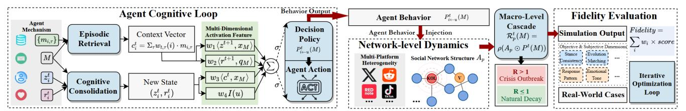
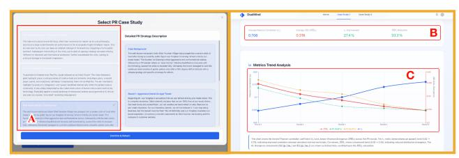
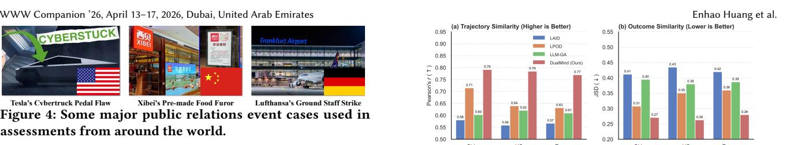

# **DualMind**: Towards Understanding Cognitive-Affective Cascades in Public Opinion Dissemination via Multi-Agent Simulation

[Enhao Huang](https://orcid.org/0009-0008-8059-3892)∗ huangenhao@zju.edu.cn Zhejiang University Hangzhou, China

[Tongtong Pan](https://orcid.org/0009-0008-2866-7145)∗ pantongtong@zju.edu.cn Zhejiang University Hangzhou, China

[Shuhuai Zhang](https://orcid.org/0009-0001-4737-5921)∗ shuhuaizhang@zju.edu.cn Zhejiang University Hangzhou, China

[Qishu Jin](https://orcid.org/0009-0008-0871-4186) brucejin@zju.edu.cn Zhejiang University Hangzhou, China

[Liheng Zheng](https://orcid.org/0009-0007-1387-905X) lihengzheng@zju.edu.cn Zhejiang University Hangzhou, China

[Kaichun Hu](https://orcid.org/0009-0007-6547-6260) tauhkc@zju.edu.cn Zhejiang University Hangzhou, China

[Yiming Li](https://orcid.org/0000-0002-2258-265X)† liyiming.tech@gmail.com Nanyang Technological University Singapore

[Zhan Qin](https://orcid.org/0000-0001-7872-6969) qinzhan@zju.edu.cn Zhejiang University Hangzhou, China

[Kui Ren](https://orcid.org/0000-0002-1969-2591) kuiren@zju.edu.cn Zhejiang University Hangzhou, China

# Abstract

Forecasting public opinion during PR crises is challenging, as existing frameworks often overlook the interaction between transient affective responses and persistent cognitive beliefs. To address this, we propose DualMind, an LLM-driven multi-agent platform designed to model this dual-component interplay. We evaluate the system on 15 real-world crises occurring post-August 2024 using social media data as ground truth. Empirical results demonstrate that DualMind faithfully reconstructs opinion trajectories, significantly outperforming state-of-the-art baselines. This work offers a high-fidelity tool for proactive crisis management. Code is available at [https://github.com/EonHao/DualMind.](https://github.com/EonHao/DualMind)

# CCS Concepts

### • Computing methodologies → Multi-agent systems.

# Keywords

Public Opinion Dissemination, LLM Agent, Multi-Agent Systems, Social Simulation, Computational Social Science

#### ACM Reference Format:

Enhao Huang, Tongtong Pan, Shuhuai Zhang, Qishu Jin, Liheng Zheng, Kaichun Hu, Yiming Li, Zhan Qin, and Kui Ren. 2026. DualMind: Towards Understanding Cognitive-Affective Cascades in Public Opinion Dissemination via Multi-Agent Simulation. In Companion Proceedings of the ACM Web Conference 2026 (WWW Companion '26), April 13–17, 2026, Dubai, United Arab Emirates. ACM, New York, NY, USA, [4](#page-3-0) pages. [https://doi.org/10.1145/](https://doi.org/10.1145/3774905.3793106) [3774905.3793106](https://doi.org/10.1145/3774905.3793106)

[This work is licensed under a Creative Commons Attribution-NonCommercial-](https://creativecommons.org/licenses/by-nc-nd/4.0)[NoDerivatives 4.0 International License.](https://creativecommons.org/licenses/by-nc-nd/4.0)

WWW Companion '26, Dubai, United Arab Emirates © 2026 Copyright held by the owner/author(s). ACM ISBN 979-8-4007-2308-7/2026/04 <https://doi.org/10.1145/3774905.3793106>

# 1 Introduction

In the contemporary digital environment, the diffusion of public opinion across online social networks is highly influential yet difficult to anticipate. Public relations (PR) crises can escalate with exceptional speed, posing significant risks to organizational stability [\[7\]](#page-3-1). Recent high-profile cases illustrate how even single misjudgments can trigger consumer boycotts, substantial losses in market capitalization, and enduring reputational damage [\[9\]](#page-3-2). Beyond corporate impacts, the rapid circulation of polarizing narratives can also undermine public trust and exacerbate societal tensions. Forecasting these dynamics remains a major hurdle, as they are shaped by heterogeneous user groups, intricate social structures, and platformspecific algorithmic curation. Traditional assessment methods, like surveys and focus groups, are too slow and coarse-grained for real-time discourse. Even computational and agent-based models, while faster, typically oversimplify human interaction by reducing complex, nuanced opinions to single numerical values or predefined categories [\[11\]](#page-3-3). This failure to model the rich semantic and emotional context of online conversations underscores an urgent need for advanced simulation tools capable of supporting proactive strategic planning and effective risk assessment [\[1\]](#page-3-4).

The advent of Large Language Models (LLMs) has accelerated progress in computational social science, leading to the widespread application of LLM-based autonomous agents in research [\[5\]](#page-3-5). In particular, a growing body of work demonstrates that these agents can effectively simulate human social behaviors [\[2\]](#page-3-6). When instantiated within simulated environments, LLM-based agents serve as viable computational subjects, capable of replacing or augmenting human participants in scientific studies and social simulations [\[8\]](#page-3-7). This agent-based simulation approach offers a novel and scalable avenue for exploring complex societal dynamics, such as opinion formation and information diffusion, in a controlled yet realistic manner.

Despite this potential, existing simulations often lack the specific architecture for high-stakes PR crises. Current LLM-based agent studies typically focus on general belief evolution through

∗These authors contributed equally to this research. †Corresponding author.

Figure 2: User interface of Scenario 1 (Real-world Cases). (A) The user selects a real-world event from the "Select PR Case Study" window to set the ground truth; (B) The "Comparative Analysis Report" provides immediate, top-level fidelity metrics (e.g., overall Pearson's �� and JSD); (C) The "Metrics Trend Analysis" graph allows the user to assess the fidelity of the opinion trajectory as it evolves over simulation rounds.

opinion waves; subcritical regimes attenuate. This spectral control parameter provides a principled, platform-aware knob for intervention design: PR strategies generated by the LLM planner are accepted when they reduce R �� (��) below unity without degrading alignment with desired narrative constraints.

### 2.2 System Architecture

The system employs a decoupled front-end/back-end architecture, comprising a React front-end, a FastAPI back-end, and an agent layer based on LangChain and LangGraph.

The front-end utilizes a React (v19.1.1) and TypeScript stack with Ant Design.Social network visualization leverages the native Canvas API, chosen over libraries like D3.js for high-performance dynamic propagation effects.

The back-end simulator runs in a Python environment, employing the high-performance asynchronous framework FastAPI (over traditional Flask or Django) to serve RESTful APIs via Uvicorn.

The core agent layer utilizes LangChain and LangGraph to establish a structured cognitive workflow. Agent execution follows a controlled concurrency model: active agents execute sequentially in random order per round to avoid API concurrency limits. Besides, we use a multi-model LLM strategy: the lightweight gpt-4o-mini handles high-frequency agent tasks (e.g., generating posts, evaluating stances), while the more powerful gemini-1.5-pro is used for post-hoc analysis, generating the final fidelity reports.

# 3 Demonstration and Case Studies

To validate the effectiveness of DualMind in simulating complex public relations (PR) crisis dynamics and to demonstrate its core functionalities, we designed and implemented an interactive demonstration system. The core of this system is its high-fidelity public opinion simulation capability, which is built upon a validated cognitive-affective agent architecture. This system supports two core application scenarios, focusing respectively on analyzing past events and simulating future strategies.

# 3.1 Demonstration

3.1.1 Scenario 1: Retrospective Analysis of Real-World Cases. This scenario focuses on analyzing and reproducing past, real-world events to help users understand how public opinion evolved and how interventions shaped the final outcome (see Fig. [2\)](#page-2-0).

Figure 3: User interface for Scenario 2. (A) The user iteratively inputs natural language PR strategies in the left panel; (B) The center panel provides a real-time visualization of the opinion propagation network; (C) The right "Message Propagation History" panel tracks agent posts. Users analyze feedback from (C) to refine strategies in (A) and observe the new strategy's diffusion in (B).

The system first presents a Select PR Case Study window. The user selects from 15 representative corporate PR crises curated from public data streams across major social media platforms in the U.S., China, and Europe. All cases occurred after August 2024 and were intentionally chosen beyond mainstream LLM knowledge cutoffs to avoid prior exposure to outcomes.

Upon selection, the user sees the detailed background and real strategy nodes. After confirmation, the simulation starts automatically and follows an authentic day-level timeline. The system ingests each critical event (e.g., the Day-1 official statement) to drive the agent cohort's simulation. After each node, the user can proceed to the next event or click Generate Report.

The system then presents a Comparative Analysis Report. Similarity scores, Pearson's correlation coefficient (��) and Jensen– Shannon Divergence (JSD), summarize proximity to the Ground Truth. The user can further browse the Metrics Trend Analysis graph to assess fidelity at the trajectory level.

3.1.2 Scenario 2: User-specified Simulation. This scenario targets user-specified PR events and functions as an interactive strategy rehearsal sandbox that generates actionable recommendations to support decision-making (see Fig. [3\)](#page-2-1).

The user can conduct a custom simulation. The user defines an event in the Event Description text box and inputs the first intervention strategy in the Next Round Strategy field. After clicking Start Next Round Simulation, the system samples agents from an integrated persona library aligned with real-world demographic statistics and instantiates a dynamic social network of heterogeneous actors, enabling real-time visualization of opinion diffusion.

The Message Propagation History sidebar provides a step-bystep trace of cross-platform message spread through actors, including amplification by Key Opinion Leaders. After each round, the user reviews opinion dynamics and revises Next Round Strategy.

At any time, clicking Generate Report & View Results generates an analytical report—including stance trajectories and topic trends—allowing the user to evaluate cumulative impacts and identify strategies most effective for the desired PR objectives.

## 3.2 Case Study and Evaluation

We hereby perform quantitative evaluations to assess DualMind's ability to faithfully replicate both the temporal evolution of public opinion (i.e., opinion trajectories) and the eventual outcomes (i.e.,

Figure 4: Some major public relations event cases used in assessments from around the world.

aggregate stance distributions) of real-world PR crises, using realworld data as ground truth.

3.2.1 Baselines and Settings. We evaluate our system on a curated dataset of 15 real-world PR crises (late 2024–2025), evenly distributed across the United States (5), China (5), and Europe (5) (see Fig. [4\)](#page-3-12). All models are instantiated using LLMs with knowledge cutoffs prior to August 2024 to avoid data contamination. For each crisis, we simulate 100 agents that represent heterogeneous social media users interacting over a crisis-specific network, and we apply the same agent population size and interaction protocol to all baselines for a fair comparison. We benchmark DualMind against three state-of-the-art (SOTA) baselines, including:

- LAID [\[4\]](#page-3-9): An LLM-enhanced agent model for information propagation, evaluated on four hypothetical scenarios (e.g., viral marketing) rather than real-world crises.
- LPOD [\[11\]](#page-3-3): A non-LLM agent-based model that treats agents as social media users and updates their opinions and network links through equation-driven rules. It incorporates event spreading, link prediction, and trust estimation, and demonstrates high predictive accuracy on both synthetic and real Weibo datasets.
- LLM-GA [\[3\]](#page-3-8): A framework that simulates opinion dynamics using networks of LLM-driven agents engaging in natural-language interactions. It evaluates 15 topics with known ground truth and identifies a systematic truth-convergence tendency in LLM agents during belief updates.

All simulated outputs, ��ˆ�� and ��ˆ�� , are generated using the same protocol across models and averaged over 5 stochastic seeds.

3.2.2 Metrics. We measure process fidelity using Pearson's correlation coefficient ���� between the empirical trajectory ���� and the simulated trajectory ��ˆ�� ; higher ���� indicates better temporal alignment. We measure outcome fidelity using the Jensen–Shannon Divergence JSD�� (���� ∥��ˆ�� ) between the final stance distributions, where lower JSD�� indicates a closer match.

3.2.3 Results. As visualized in Figure [5,](#page-3-13) DualMind consistently and significantly outperforms all baselines across all 15 cases. Our model achieves the highest average trajectory similarity (overall ��≈0.78) and the lowest average outcome divergence (overall JSD≈0.27).

This result highlights two key findings. Firstly, the model demonstrates strong cross-cultural robustness, showing high-fidelity performance across the distinct media environments of US, China, and Europe. Secondly, DualMind shows clear superiority over SOTA models, significantly outperforming even the strong LPOD baseline [\[11\]](#page-3-3) in its own validated domain.

In particular, whereas the LLM-GA framework [\[3\]](#page-3-8) reported a persistent 'truth-bias' that drives agents toward factual consensus, our real-world PR case studies demonstrate that DualMind overcomes this structural limitation. By integrating cognitive–affective cascades with realistic multi-agent social simulations, it faithfully

Figure 5: Fidelity comparison. **DualMind** achieves the highest trajectory similarity and the lowest outcome divergence.

captures the complex and fact-resistant opinion dynamics observed in human social networks.

# 4 Conclusion and Future Works

In this demo, We presented DualMind, an LLM-driven multi-agent simulator for cognitive-affective opinion cascades in PR crises. On real-world crises after August 2024, DualMind demonstrates high fidelity in reproducing both opinion trajectories and stance distributions, outperforming SOTA baselines. Limitations arise from simplified cognition, abstracted platform algorithms and network scales. Next, we will enrich agent reasoning, incorporate external information streams, and use the platform to automatically explore and evaluate PR intervention strategies.

# Ethical Use of Data and Informed Consent

This study relies solely on publicly available data for analysis. No human subjects were involved, and informed consent was not required. The work complies with all applicable ACM policies.

# Acknowledgments

This research is supported in part by the "Pioneer" and "Leading Goose" R&D Program of Zhejiang (2024C01169), the Kunpeng-Ascend Science and Education Innovation Excellence/Incubation Center, and the National Natural Science Foundation of China under Grants (625B1032, 62441238, U2441240).

# References

[1] Sinan Aral. 2021. The hype machine: How social media disrupts our elections, our economy, and our health–and how we must adapt. Crown Currency. [2] Erica Cau, Valentina Pansanella, Dino Pedreschi, and Giulio Rossetti. 2025. Language-Driven Opinion Dynamics in Agent-Based Simulations with LLMs. arXiv preprint arXiv:2502.19098 (2025). [3] Yun-Shiuan Chuang, Agam Goyal, Nikunj Harlalka, Siddharth Suresh, et al. 2024. Simulating Opinion Dynamics with Networks of LLM-based Agents. In NAACL. [4] Yuxuan Hu, Gemju Sherpa, Lan Zhang, Weihua Li, et al. 2024. An LLM-enhanced agent-based simulation tool for information propagation. In IJCAL. [5] Feiran Jia, Ziyu Ye, Shiyang Lai, Kai Shu, Jindong Gu, et al. 2024. Can Large Language Model Agents Simulate Human Trust Behavior?. In NeurIPS. [6] David Kempe, Jon Kleinberg, and Eva Tardos. 2005. Influential Nodes in a Diffusion Model for Social Networks. J. Comput. System Sci. (2005). [7] Samuel Stäbler and Marc Fischer. 2020. When Does Corporate Social Irresponsibility Become News? Evidence from More Than 1,000 Brand Transgressions Across Five Countries. Journal of Marketing (2020). [8] Lu Sun, Shihan Fu, Bingsheng Yao, Yuxuan Lu, Wenbo Li, et al. 2025. LLM Agent Meets Agentic AI: Can LLM Agents Simulate Customers to Evaluate Agentic-AIbased Shopping Assistants? arXiv preprint arXiv:2509.21501 (2025). [9] Soroush Vosoughi, Deb Roy, and Sinan Aral. 2018. The spread of true and false news online. Science (2018). [10] Yiben Wang, Deepayan Chakrabarti, Chenxi Wang, and Christos Faloutsos. 2003. Epidemic Spreading in Real Networks: An Eigenvalue Viewpoint. In INFOCOM. [11] Guo-Rui Yang, Xueqing Wang, Ru-Xi Ding, Jin-Tao Cai, Jingjun (David) Xu, and Enrique Herrera-Viedma. 2024. A method of predicting and managing public opinion on social media: An agent-based simulation. Information Sciences (2024).