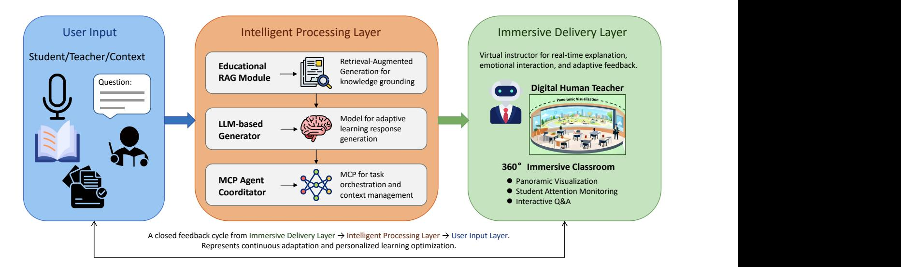
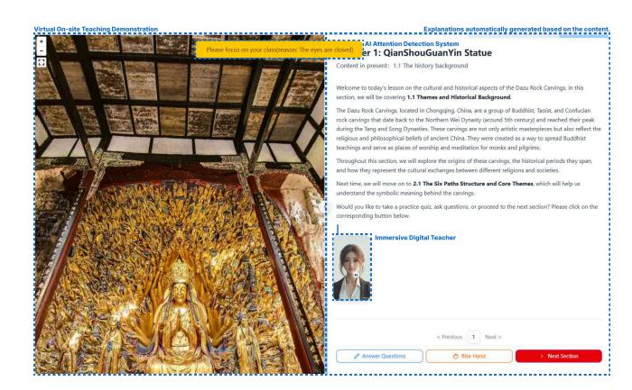
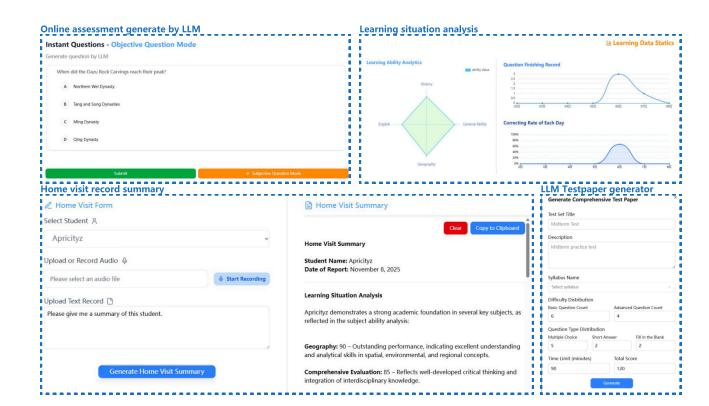

# Rise: A Retrieval-Augmented Generation Enhanced Immersive System for Education

Guo Chen Southwest University Chongqing, China cg1281838223@email.swu.edu.cn

Haowei Tang Southwest University Chongqing, China a222023321062106@email.swu.edu.cn

Yan Wei Southwest University Chongqing, China wy222023321062117@email.swu.edu.cn

Yuming Wang Southwest University Chongqing, China syanwang@email.swu.edu.cn

Haoyang Zhang Southwest University Chongqing, China z2418013844@email.swu.edu.cn

Yikang Hou Southwest University Chongqing, China jh0321@email.swu.edu.cn

Maolin Zheng Southwest University Chongqing, China zml778922461@email.swu.edu.cn

Junjie Huang∗ Southwest University Chongqing, China junjiehuang@swu.edu.cn

## Abstract

The rapid development of intelligent education has created new opportunities, yet many existing systems still struggle with limited hardware resources, constrained interactivity, and insufficient immersion. To address these challenges, we propose Rise (Retrieval-Augmented Generation Enhanced Immersive System for Education), a lightweight web-based intelligent learning system capable of delivering adaptive and interactive educational experiences even under strict device constraints. Rise integrates Retrieval-Augmented Generation (RAG), Model Context Protocol (MCP), and Digital Human (DH) technologies to provide high-quality, personalized educational experiences. Deployed on a lightweight web platform, it ensures accessibility even under hardware constraints and offers key functions including learning analytics, interactive Q&A, immersive classrooms, and attention monitoring. Beyond its technical contributions, Rise demonstrates strong social and educational value. Enabling immersive cultural and contextual learning experiences, it helps students from geographically or economically constrained regions access diverse educational resources. Overall, Rise represents a practical step toward next-generation intelligent education that unites technological advancement with social impact.

## CCS Concepts

• Applied computing → Learning management systems.

## Keywords

Smart Education, Retrieval-Augmented Generation, Model Context Protocol, Digital Human

∗ Junjie Huang is the Corresponding author.

[This work is licensed under a Creative Commons Attribution-NonCommercial-](https://creativecommons.org/licenses/by-nc-nd/4.0)[NoDerivatives 4.0 International License.](https://creativecommons.org/licenses/by-nc-nd/4.0) WWW Companion '26, Dubai, United Arab Emirates © 2026 Copyright held by the owner/author(s). ACM ISBN 979-8-4007-2308-7/2026/04 <https://doi.org/10.1145/3774905.3793107>

#### ACM Reference Format:

Guo Chen, Haowei Tang, Yan Wei, Yuming Wang, Haoyang Zhang, Yikang Hou, Maolin Zheng, and Junjie Huang. 2026. Rise: A Retrieval-Augmented Generation Enhanced Immersive System for Education. In Companion Proceedings of the ACM Web Conference 2026 (WWW Companion '26), April 13–17, 2026, Dubai, United Arab Emirates. ACM, New York, NY, USA, [4](#page-3-0) pages. <https://doi.org/10.1145/3774905.3793107>

## 1 Introduction

Intelligent education has made notable progress with advances in AI, robotics, and big data, enabling applications such as automated essay scoring and OCR-based assessment [\[4\]](#page-3-1). However, its benefits remain unevenly distributed. Urban schools have access to advanced infrastructures and abundant digital resources, while rural and underdeveloped regions are constrained by limited budgets, geographic isolation, and outdated hardware. At the same time, many existing intelligent education systems rely on high-performance devices, making them difficult to deploy in resource-limited environments. This gap highlights the need for lightweight, adaptive systems capable of delivering high-quality, interactive, and immersive learning experiences across diverse hardware conditions.

To address these challenges, we introduce Rise, an innovative web-based framework that leverages Large Language Models (LLMs) to build adaptive, interactive, and context-rich learning environments. Rise integrates Retrieval-Augmented Generation (RAG) for knowledge grounding, Model Context Protocol (MCP) for multiagent interaction, and Digital Human (DH) technologies for immersive communication [\[1](#page-3-2)[–3\]](#page-3-3). Through these integrations, the system offers lightweight deployment with high interactivity and personalization, effectively bridging the gap between technological innovation and educational equity. Our demo showcases how Rise enable education to co-create engaging, accessible, and culturally inclusive learning experiences.

As shown in Figure [1,](#page-1-0) Rise is organized into two primary components that together realize a closed-loop, AI-assisted teaching workflow. a) Immersive Teaching Environment provides an interactive 360° panoramic space in which a digital human instructor

Figure 1: Rise overall pipeline. The system integrates an immersive 360° teaching environment with an intelligent processing layer. A digital human instructor delivers interactive, attention-aware lessons, while backend RAG and orchestration modules process multi-modal learning data. Bidirectional feedback enables closed-loop, adaptive and personalized instruction.

delivers narrative-led lessons driven by prepared lecture content; this module also embeds a webcam-based real-time attention detection module that analyzes head pose and gaze to produce lightweight attention scores and refocus alerts. b) Intelligent Learning Management aggregates multi-modal classroom traces, including behavioral logs and learning or assessment records. It then forms comprehensive learner profiles, powers analytics dashboards for teachers, and enables virtual home-visit communication. Data and insights flow bidirectionally between the two components: real-time telemetry from the immersive environment informs analytics and adaptive assessment, while management-level feedback updates instructor behavior, scene sequencing, and personalized practice. Together, these components implement a human-AI collaborative paradigm that enhances engagement, supports timely pedagogical interventions, and scales equitable learning opportunities.

Our main contributions are as follows:

- We design a novel LLM-driven virtual educational framework, Rise, that integrates RAG, MCP, and DH technologies to enable natural and emotionally adaptive instruction. Built as a lightweight web-based system, RISE can be easily deployed across diverse hardware environments, effectively overcoming device and resource limitations.
- We develop an immersive and interactive classroom environment featuring panoramic visualization and real-time attention detection. It allows learners to experience cultural and scientific content through dynamic, context-aware virtual scenes while maintaining engagement through adaptive attention feedback.
- We implement an intelligent learning management module that unifies learning analytics, virtual home visits, and online assessment into a data-driven feedback loop. By providing personalized insights and transparent communication between teachers, students, and parents, this module promotes educational equity and supports sustainable digital learning.

#### 2 Rise Design

In this section, we present the design of the proposed Rise framework, which unifies Retrieval-Augmented Generation (RAG), Model Context Protocol (MCP), and Digital Human interaction (DH). Together, these components enable adaptive, explainable, and immersive educational experiences through an architecture that seamlessly connects knowledge grounding with intelligent collaboration and human–AI engagement.

# 2.1 Educational Adaptation with RAG

The integration of Retrieval-Augmented Generation (RAG) into intelligent education systems enables more adaptive, responsive, and up-to-date learning experiences. LLMs often struggle with domain drift and factual inconsistency when applied to specialized educational settings such as curriculum-based learning or examination preparation. In contrast, RAG enhances educational adaptability by grounding model responses in structured pedagogical resources—such as textbooks, syllabi, and verified problem sets—thus bridging the gap between open-domain knowledge and curriculum-aligned instruction. The retrieval process allows the system to personalize learning materials according to learners' context, cognitive level, and current progress, addressing a key challenge in adaptive education: combining general reasoning with curriculum-aligned accuracy.

Formally, the educational RAG framework is denoted as F:

F = (MG,MR), F (��;��) = MG ��,MR(��, ��) , (1)

where MG is the Generator module that produces adaptive learning responses, which is typically an LLM; MR is the Retriever module that identifies relevant pedagogical content from an external database ��. The query �� represents the learner's input—such as a question, learning goal, or misconception.

#### 2.2 Multi-Agent Coordination by MCP

In immersive educational experiences, effective pedagogy often requires the orchestration of multiple collaborating agents—such as a virtual tutor and content generator. Traditional multi-agent systems frequently suffer from state information fragmentation and inconsistent communication formats, severely undermining the realism and responsiveness essential for immersion. To address this, we introduce the Model Context Protocol (MCP) as the standardized backbone for multi-agent coordination. The core function of MCP is to unify the format of information transfer, ensure the synchronization of session states, and provide a mechanism for context-driven function calling.

MCP addresses the challenge of state inconsistency by encapsulating the complete interaction history and real-time environment status. This allows the agent collective to base their decisions and responses on a unified understanding of the context C. By embedding descriptions of tools or functions in natural language, MCP enables LLMs to dynamically invoke external resources. This capability surpasses the inherent limitations of traditional language models, facilitating advanced actions like real-time physics calculations, specialized knowledge retrieving, or function calling.

We abstract MCP as a triplet protocol framework PMCP that defines the norms for multi-agent interaction, comprising the context process server (��), large language models (��), and the generated Response (��). Formally, the Model Context Protocol (MCP) framework is denoted as PMCP:

PMCP = ⟨��, ��, ��⟩, ���� , Tcall = ����(C�� ), C��+1 = �� (C�� , ���� , Tcall), (2)

where �� is the server responsible for maintaining and updating the unified context C; ���� is an LLM or function module (e.g., the virtual tutor) that receives the context C�� at time step �� to generate a structured response ���� along with a potential function call Tcall. C��+1 represents the context updated by the server for the subsequent time step. The core data structure driving this protocol is the unified context C, which integrates essential and standardized components for model decision-making:

C = {ContextRes, ContextTool, ContextPrompts, . . .}, (3)

where ContextRes provides factual and situational resources such as student state and RAG-retrieved information, ContextTool defines all available external functions or tools in the current environment (enabling Tcall), and ContextPrompts contains system prompts and role-specific guidance. This mechanism ensures that the immersive environment remains dynamic, responsive, and functionally rich.

## 2.3 Virtual Teaching with Digital Human

To address the long-standing challenges of teacher overload, uneven educational resource distribution, and low engagement in remote learning, we introduce a digital human–driven virtual teaching system. Powered by LLMs, multi-modal interaction, and real-time motion synthesis, the digital human acts as an intelligent teaching assistant capable of delivering lectures, guiding discussions, and providing emotional companionship to learners.

Unlike conventional AI tutors limited to text-based interaction, the proposed digital human embodies expressive facial gestures, natural speech, and adaptive behavioral responses (based on MCP), enabling a more immersive and human-like learning experience. This advancement enhances immersion and emotional engagement, while also allowing educators to delegate repetitive tasks such as Q&A, content explanation, and formative assessment. In our implementation, the digital human delivers narrative lessons, answers questions, and reacts to learner states (e.g., attention level) through MCP-managed context updates.

From a societal perspective, digital humans contribute to narrowing the urban–rural education gap and democratizing access to high-quality learning resources. In regions with limited teaching staff, they can continuously deliver personalized, curriculumaligned lessons, ensuring that every learner receives consistent educational support regardless of geographic or economic barriers. This aligns with the broader vision of "Education for All", which means promoting equitable and sustainable learning opportunities through human-centered AI innovation.

#### 3 System Implementation and Demonstration

In this section, we demonstrate the implementation of Rise through two representative modules: an immersive teaching environment and an intelligent learning management system. Together, they showcase how the proposed design translates into practical educational applications, enabling interactive, data-driven, and inclusive learning experiences that bridge virtual and real-world classrooms.

#### 3.1 Immersive Teaching Environment

We develop an immersive teaching environment that integrates virtual human instruction, panoramic visualization, and real-time attention monitoring to create a deeply engaging learning experience. As shown in Figure [2,](#page-3-4) we present a digital humanities lesson on the Dazu Rock Carvings in Chongqing, a UNESCO World Heritage site, as a demonstration case. Within this demonstration, the system renders the scene as an interactive 360-degree panoramic space that learners can freely drag, zoom, and explore, while the digital human teacher dynamically explains the cultural and artistic features of the carvings according to the automatically generated lecture content. As the lesson progresses, the system automatically switches between panoramic scenes to match the narrative flow, simulating a virtual field trip experience.

To maintain engagement in this immersive environment, we incorporate a real-time attention detection module based on webcam input. The module analyzes facial orientation and eyegaze features to estimate students' attentiveness. When signs of distraction are detected, the system gently issues an on-screen reminder, helping students refocus.

The immersive classroom removes traditional limits of time and space, enabling students to access otherwise unreachable cultural and learning environments. It addresses scarce teaching resources and unequal learning opportunities, especially in remote areas. By integrating digital instructors with immersive visualization environments, it demonstrates how AI can create more inclusive and engaging education.

Figure 2: Demonstration of Immersive Teaching Environment for Dazu Rock Carvings.

Figure 3: Overview of Intelligent Learning Management, including Q&A, learning situation analysis, home-visit generation, and exam generation.

# 3.2 Intelligent Learning Management

As shown in Figure [3,](#page-3-5) Intelligent Learning Management consists of three components: learning data analysis, virtual home visits, and online assessment. Serving as the analytical and feedback core of the system, it continuously collects multi-modal data from student behaviors, attention levels, and answering records to form a comprehensive and exclusive learning profile. Through Rise, teachers can gain insights into learners' cognitive progress, participation patterns, and potential difficulties, enabling more precise and efficient instructional adjustments. This data-driven feedback effectively reduces repetitive workload of teachers and enhances the adaptability of teaching strategies.

Beyond in-class analytics, the virtual home visit function enables teachers, students, and parents to communicate through an online interactive platform. By integrating performance summaries and behavioral indicators, it provides timely, evidence-based feedback that bridges the gap between home and school, ensuring continuous emotional and educational support even across geographical distances. Meanwhile, the online assessment component offers a

unified environment for exercises and examinations, where question generation, automatic scoring, and personalized feedback are seamlessly integrated.

#### 4 Conclusion

In this paper, we introduce Rise, a Retrieval-Augmented Generation enhanced Immersive System for Education. By leveraging the reasoning and contextual understanding capabilities of LLMs, Rise provides adaptive, interactive, and knowledge-grounded learning experiences. The system integrates RAG, MCP, and DH technologies into a lightweight web-based framework that enables natural and adaptive instruction across diverse hardware settings. Through panoramic visualization and real-time attention detection, it creates an immersive classroom experience that enhances engagement and allows learners to explore cultural and scientific content beyond spatial and temporal boundaries. Furthermore, its intelligent learning management module unifies analytics, virtual home visits, and online assessment, fostering personalized feedback, teacher–student collaboration, and educational equity.

Together, these capabilities demonstrate how Rise can make intelligent education more inclusive, sustainable, and human-centered, while remaining practical and readily deployable in real-world educational environments.

## 5 Ethical Use of Data and Informed Consent

Rise strictly follows the ACM guidelines on the ethical use of data and research involving human participants. All user data in our system, including webcam-based attention signals and learning behavior logs, are collected solely for educational purposes with explicit user consent. No biometric information is stored, and all collected data are processed locally or anonymized before analysis to prevent personal identification. Participants can opt out at any time, and all demonstration data shown in this paper were generated with synthetic or consented samples. The system is designed to uphold privacy, transparency, and responsible data usage in realworld educational deployments.

## Acknowledgments

This work is supported by Natural Science Foundation of China (No.62402398), the Technological Innovation and Application Development Project of Chongqing (No.CSTB2025TIAD-KPX0027), Lab of High Confidence Embedded Software Engineering Technology and the High Performance Computing clusters at Southwest University.

## References

[1] Xinyi Hou, Yanjie Zhao, Shenao Wang, and Haoyu Wang. 2025. Model context protocol (mcp): Landscape, security threats, and future research directions. arXiv preprint arXiv:2503.23278 (2025). [2] Patrick Lewis, Ethan Perez, Aleksandra Piktus, Fabio Petroni, Vladimir Karpukhin, Naman Goyal, Heinrich Küttler, Mike Lewis, Wen-tau Yih, Tim Rocktäschel, et al. 2020. Retrieval-augmented generation for knowledge-intensive nlp tasks. Advances in neural information processing systems 33 (2020), 9459–9474. [3] Xueyang Wang, Nan Cao, Qing Chen, and Shixiong Cao. 2024. The interaction design of 3D virtual humans: A survey. Computer Science Review 53 (2024), 100653. [4] Zhi-Ting Zhu, Ming-Hua Yu, and Peter Riezebos. 2016. A Research Framework of Smart Education. Smart Learning Environments 3, 1 (2016), 4. [https://doi.org/10.](https://doi.org/10.1186/s40561-016-0026-2) [1186/s40561-016-0026-2.](https://doi.org/10.1186/s40561-016-0026-2)