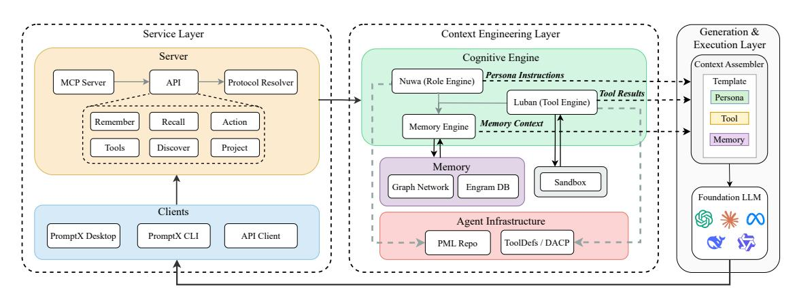

# PromptX: A Cognitive Agent Platform with Long-term Memory

| Binhao Wang ∗           |                         |
|-------------------------|-------------------------|
| City University of Hong |                         |
| Hong Kong SAR., China   |                         |
| Jianglin Huang ∗        |                         |
| Deepractice AI Limited  |                         |
| Hong Kong SAR., China   |                         |
|                         | Xiao Hu ∗               |
| Deepractice             | AI Limited              |
| Hong                    | Kong SAR., China        |
|                         | Shan Jiang †            |
|                         | Deepractice AI Limited  |
|                         | Hong Kong SAR., China   |
| Maolin Wang ∗‡          |                         |
| City University of Hong |                         |
| Hong Kong SAR., China   |                         |
| Ching-ho Yang ∗         |                         |
| Deepractice AI Limited  |                         |
| Hong Kong SAR., China   |                         |
| Jian                    | Jiang                   |
| Deepractice             | Artificial              |
| Intelligence            | Technology              |
|                         | Co., Ltd.               |
| Nanjing,                | Jiangsu, China          |
|                         | Junhao Ye               |
|                         | Deepractice Artificial  |
|                         | Intelligence Technology |
|                         | Co., Ltd.               |
|                         | Nanjing, Jiangsu, China |
| Yaozu Cen               |                         |
| Deepractice Artificial  |                         |
| Intelligence Technology |                         |
| Co., Ltd.               |                         |
| Nanjing, Jiangsu, China |                         |
| Rui Zeng                |                         |
| Deepractice Artificial  |                         |
| Intelligence Technology |                         |
| Co., Ltd.               |                         |
| Nanjing, Jiangsu, China |                         |
| Yingtong                | Zhou                    |
| Deepractice             | Artificial              |
| Intelligence            | Technology              |
|                         | Co., Ltd.               |
| Nanjing,                | Jiangsu, China          |
|                         | Yingjie Luo             |
|                         | Deepractice Artificial  |
|                         | Intelligence Technology |
|                         | Co., Ltd.               |
|                         | Nanjing, Jiangsu, China |
| Guanjie Wu              |                         |
| Deepractice Artificial  |                         |
| Intelligence Technology |                         |
| Co., Ltd.               |                         |
| Nanjing, Jiangsu, China |                         |
| Wangzhong Xu            |                         |
| Deepractice Artificial  |                         |
| Intelligence Technology |                         |
| Co., Ltd.               |                         |
| Nanjing, Jiangsu, China |                         |
| Feiyu                   | Zhou                    |
| Deepractice             | Artificial              |
| Intelligence            | Technology              |
|                         | Co., Ltd.               |
| Nanjing,                | Jiangsu, China          |
|                         | Xiangyu Zhao            |
|                         | City University of Hong |
|                         | Hong Kong SAR., China   |

#### Abstract

While large language models (LLMs) demonstrate impressive contextual understanding, their limitations in long-term memory and personalized reasoning constrain their practical impact in industrial settings. To address these gaps, we introduce PromptX, a cognitive platform that enables AI agents to construct structured memory and develop their reasoning over time. PromptX integrates three core technologies: (1) A new prompt markup language to define agent personas and memory organization; (2) Engrambased activation-diffusion memory networks that unify raw experiences with conceptual sequences, enabling associative retrieval through graph network propagation; (3) a protocol-driven orchestration layer enabling dynamic tool discovery and coordination, inspired by HATEOAS principles from web-engineering. During

[This work is licensed under a Creative Commons Attribution-NonCommercial-](https://creativecommons.org/licenses/by-nc-nd/4.0)[NoDerivatives 4.0 International License.](https://creativecommons.org/licenses/by-nc-nd/4.0)

WWW Companion '26, Dubai, United Arab Emirates © 2026 Copyright held by the owner/author(s). ACM ISBN 979-8-4007-2308-7/2026/04 <https://doi.org/10.1145/3774905.3793108>

five months of real-world deployment across a range of 15+ enterprises in 6 industries" PromptX has been validated in multiple industry domains (e.g., software engineering, education, healthcare), accumulating 50K+ downloads and 3K+ GitHub stars and evidencing practical feasibility and commercial value in production workflows. Our demo and initial product are available at [https:](https://promptx.deepractice.ai/) [//promptx.deepractice.ai/](https://promptx.deepractice.ai/). The source code and documentation are available online at <https://github.com/Deepractice/PromptX>. The supplementary materials are also available online [1](#page-0-0) .

# CCS Concepts

• Human-centered computing → Interaction design; • Information systems → Web applications.

## Keywords

AI Agents; Memory Networks; Agent Context Protocol

#### ACM Reference Format:

Binhao Wang, Jianglin Huang, Xiao Hu, Shan Jiang, Maolin Wang, Ching-ho Yang, Jian Jiang, Junhao Ye, Yaozu Cen, Rui Zeng, Yingtong Zhou, Yingjie Luo, Guanjie Wu, Wangzhong Xu, Feiyu Zhou, and Xiangyu Zhao. 2026. PromptX: A Cognitive Agent Platform with Long-term Memory. In Companion Proceedings of the ACM Web Conference 2026 (WWW Companion '26),

∗Core Contributors †Project Leader

‡Corresponding Author

1[https://drive.google.com/drive/folders/1wPhEQCKeaZIsQAcFnC7XKmXTtwY1gJL1?](https://drive.google.com/drive/folders/1wPhEQCKeaZIsQAcFnC7XKmXTtwY1gJL1?usp=sharing) [usp=sharing](https://drive.google.com/drive/folders/1wPhEQCKeaZIsQAcFnC7XKmXTtwY1gJL1?usp=sharing)

April 13–17, 2026, Dubai, United Arab Emirates. ACM, New York, NY, USA, [4](#page-3-0) pages.<https://doi.org/10.1145/3774905.3793108>

#### 1 Introduction

Despite the power of Large Language Models (LLMs), their inherent limitations—including high computational costs, catastrophic forgetting, and a deficiency in logical reasoning [\[10\]](#page-3-1)—fundamentally constrain their potential in real-world applications requiring persistent knowledge accumulation. Consequently, while Retrieval-Augmented Generation (RAG) has become the dominant paradigm, recent work has made it clear that a shift from simple "retrieval augmentation" to true "memory systems" is necessary for continual learning [\[5,](#page-3-2) [6\]](#page-3-3). This aligns with industry analysis suggesting that successful AI agents depend more on structured data organization than on purely algorithmic breakthroughs [\[2\]](#page-3-4).

However, current RAG and its variants still face significant challenges. Basic RAG methods rely on "flat" text chunk retrieval, which prevents them from capturing complex inter-dependencies and leads to fragmented answers [\[4\]](#page-3-5). This issue is part of a broader challenge of cognitive fragmentation, where the prompts used to guide agents are brittle and difficult to manage, hindering the construction of complex behaviors [\[8\]](#page-3-6). Even advanced Knowledge Graph-Augmented RAG (KG-RAG) faces a difficult trade-off: a choice between efficient but rigid static graphs, and flexible but slow and expensive dynamic graph traversal [\[7\]](#page-3-7).

To break through these limitations, we advocate a paradigm shift from "retrieval augmentation" to a "cognitive architecture" inspired by human memory mechanisms [\[10\]](#page-3-1). While existing solutions like LangChain and MemGPT offer fragmented approaches, PromptX provides a unified platform built on three core innovations: 1) Prompt Markup Language (PML) for defining a parsable, structured cognitive model; 2) an associative memory network that operationalizes the cognitive process of "ecphory" [\[3,](#page-3-8) [7\]](#page-3-7) for dynamic and long-term multi-hop retrieval; and 3) autonomous tool discovery via the Agent Context Protocol (ACP), leveraging hypermedia principles for navigation and action [\[9\]](#page-3-9).

This work makes three primary contributions:

- We propose the first open-source implementation integrating PML-based cognitive architecture, Engram activation-diffusion memory, and the ACP protocol [\[1\]](#page-3-10), providing production-ready support for AI applications like Claude and Cursor.
- We demonstrate reproducible end-to-end scenarios including conversational role evolution and autonomous tool orchestration, validated by system internals and algorithms.
- We provide comprehensive real-world deployment evidence spanning 5 months, 50K+ downloads, 15+ enterprises, and 6 industry verticals, proving engineering feasibility and commercial value.

# 2 Design and Framework

PromptX unifies cognitive structure, associative memory, and autonomous tool orchestration into a three-layer architecture. The identity layer defines machine-parsable personas through PML syntax; the memory layer implements graph-based activation for conceptual retrieval beyond text similarity, and the capability layer enables hypermedia-driven tool discovery.

#### 2.1 Core Capabilities

Conversational Role Creation (Nuwa). We propose a human-AI collaboration paradigm ISSUE designed to structure intelligent teamwork, which consists of five steps: Initiate (humans define the problem and set priorities), structure (select an appropriate methodology or framework), Socratic (AI engages in guided questioning to refine understanding), Unify (integrate insights into a coherent plan), and Execute (transform the plan into actionable tasks). Guided by the ISSUE, the role creation engine creates PML roles in 2-3 minutes via 3-5 questions, automatically generating structured cognitive architectures with modular components for reuse and version control.

Rapid Tool Integration (Luban). Integrate any API into AIcallable tools within 3 minutes, generating secure capability specifications, validated in sandbox for dynamic discovery.

Engram Memory Networks. Memory units containing four fields: content (raw experience), schema (conceptual sequence), strength (importance), type (ATOMIC/LINK/PATTERN). These units are organized in a graph database, where schemas define how concepts connect to one another. A graph neural network operates on the structure, allowing information to spread across related nodes - a process we called activation-diffusion - so that the system can retrieve associated memories through conceptual relationships, rather than relying on embedding similarity.

#### 2.2 System Architecture

PromptX adopts a three-layer architecture (Figure [1\)](#page-2-0). The Clients in Service Layer provides Desktop (Electron), CLI (Node.js) and API clients. The Server implements protocol parsing and request routing. The Cognitive Engine in Context Engineering Layer contains Nuwa and Luban. The Memory provides PML-based Repository, Engram Database, Graph Networks and Sandbox. The Context Assembler integrates memory retrieval, persona instructions, tool feedback and session episodes. The Foundation LLM supports multiple LLMs.

## 2.3 PML Parsing Mechanism

PML (Prompt Markup Language) declares cognitive architecture as machine-parsable XML documents. The PML ContentParser parses role files to extract reference arrays, ResourceManager recursively loads thought/execution/knowledge files, and SemanticRenderer composes unified prompts. The reference mechanism implements single source of truth: each concept is defined once, modifications propagate globally, avoiding duplication. For example, a query optimizer role referencing an "explain-plan-analysis" thought file can be reused by multiple related roles; updating that file immediately affects all referrers.

## 2.4 ACP and Tool Definitions

PromptX introduces the Agent Context Protocol (ACP), a serviceoriented extension of the MCP paradigm that transforms AI models from passive tool operators into active, professional agents. Unlike traditional methods that hardcode tool lists, ACP is inspired by HATEOAS principles, enabling dynamic tool discovery. It provides context-aware links that guide the agent to appropriate tools based on its current state. Responses contain an available\_actions array, where each action specifies its relationship (rel), endpoint

Figure 1: The System Architecture of PromptX. The diagram illustrates the three primary layers of our framework: the Service Layer for handling client interactions, the Context Engineering Layer for cognitive processing and memory management, and the Generation & Execution Layer for producing the final output.

#### Algorithm 1 Remember Agent: Experience Encoding

Require: Raw experience ��, Role ��

Ensure: Engram �� = (��, ��,��, ��)

1: �� ← �� ⊲ Preserve original content 2: ���������������� ← ExtractKeywords(��) 3: �� ← Join(����������������) ⊲ Schema as keyword sequence 4: �� ← ComputeStrength(��, ��) ⊲ Recency, frequency, importance 5: �� ← ClassifyType(��) ⊲ ATOMIC/LINK/PATTERN 6: ���������� ← ExtractNodes(��) 7: for all pairs (���� , ����) co-occurring in �� do 8: AddEdge(���� , ���� , weight) 9: end for 10: UpdateCentrality(��������ℎ) 11: return �� = (��, ��,��, ��)

(href ), and parameters. This allows the AI to autonomously match needs to tool capabilities based on dialogue context, shifting the interaction from merely "using tools" to "delegating tasks."

This design boasts key advantages: dynamic tool discovery for runtime extension (no code changes), context/capability-based invocation (not static signatures), and auditable, traceable actions. Fundamentally, ACP adds the missing procedural accountability to existing frameworks, making LLM agents process-bound service entities rather than stateless APIs.

### 2.5 Core Flow: Memory System

PromptX's memory system is managed by two core agents that are integrated into Server API: Remember and Recall. As illustrated in Algorithm [1,](#page-2-1) the Remember agent transforms raw experiences into structured Engrams, our fundamental memory units. Each Engram encapsulates the original content, its conceptual schema (extracted keywords), and its calculated importance. These schemas are interconnected within a graph network, forming the structural basis for associative memory.

The Recall agent retrieves relevant memories not through simple keyword matching, but via a graph-based activation-process. When a query is received, activation spreads from the query's core concepts through the graph network across multiple hops. This allows the system to uncover causally or conceptually related Engrams, even if they are not textually similar. For example, given the query "orders slow," the system can traverse the graph to recall a three-day-old Engram suggesting an "index optimization," demonstrating associative reasoning that goes far beyond direct keyword search. Detailed algorithms and implementation specifics are available in our online documentation and project repository.

#### 3 Demonstration Scenario

An end-to-end scenario demonstrates PromptX's capabilities through a user, Bob, who creates a stock analysis agent with long-term memory from scratch without writing any code[2](#page-2-2) ..

Step 1: Rapid Tool Integration (t=0–2.5 min). Bob first activates Luban, the tool creation expert, requesting: "I need a tool that can query real-time stock data from Alpha Vantage." Luban autonomously researches the API documentation, completes the tool's creation, and completes validation via a dry-run test within 3 minutes, all without manual coding.

Step 2: Conversational Role Creation (t=2.5–4 min). Next, Bob activates Nuwa, the role creation expert, instructing: "Create a stock trading character and use the tool you just created." Nuwa understands the composite request, automatically plans and executes a series of tasks, and ultimately generates a new "Stock Trading Analyst" AI role bound to the new tool.

Step 3: Task Execution & Memory Formation (t=4–7 min, Session 1). Bob activates the new role and informs it of his holdings: "I currently hold Tesla and Amazon stocks, I hope to make a profit." The agent analyzes the stocks and saves this core fact ("I hold TSLA and AMZN") into memory as a structured Engram.

Step 4: Cross-Session Memory Recall (t=2 hours later, Session 2). To verify its long-term memory, Bob starts a new session and issues a compound command: "Activate the stock analyst, first recall the stocks I hold, then analyze today's market." The agent successfully precisely recalls Bob's portfolio (Tesla and Amazon)

2A video walkthrough of this scenario is available at: <https://youtu.be/R6ENaj9i0oE>

Figure 2: PromptX Desktop Interface. The main dashboard (left) provides dynamic resource discovery with 9 activatable roles, 32 executable tools, and hierarchical source organization (system/user). The settings panel (right) demonstrates multi-language support and server configuration, showcasing the system's production-ready deployment capabilities.

from its memory network and then provides a fresh market analysis focused only on those two stocks, perfectly continuing the context.

Comparison. Unlike stateless LLMs that lose context or RAG systems struggling with unstructured history, PromptX uses structured memory to enable precise cross-session recall and robust long-term continuity.

# 4 Implementation and Deployment

The PromptX demo is implemented in Node.js/TypeScript with an MCP server supporting streaming HTTP and PML parsing via xml2js. Its memory system supports both filesystem (JSON) and database (SQLite/PostgreSQL) storage, utilizing graph networks through in-memory adjacency lists and optimized activationdiffusion algorithms. The tool sandbox operates on Docker with 0.5 CPU cores, 512MB memory, and 30s timeout under whitelisted network access. Both Desktop (Electron) and CLI (Commander.js) clients are available. Released under MIT license, PromptX is available as a Docker image (deepracticexs/promptx:latest). The interface design is illustrated in Figure [2.](#page-3-11)

PromptX underwent a 5-month deployment across 15+ enterprises in 6 industries, attracting over 3K+ GitHub stars and 50K+ downloads. Applications span programming, law, education, tourism, fiction writing, and medicine. Table [1](#page-3-12) summarizes key industrial deployments, integrating quantitative outcomes with qualitative feedback from our partners. Specific application certification documents are included in the supplementary materials[3](#page-3-13) .

The system's technical design was further validated by the opensource community, with one developer noting: "The activationdiffusion retrieval finds conceptual connections I didn't explicitly program—it reasons about relationships."

# 5 Conclusion

PromptX marks a paradigm shift from retrieval-augmented generation to cognitive architecture, transforming agents into persistent collaborators that accumulate expertise. Our platform integrates

Table 1: Real-World Deployment Cases and Feedback

| Industry Application | Reported Impact & Feed           |
|----------------------|-----------------------------------|
| Tourism End-to-end   | Content                           |
| & service            | agent                             |
|                      | Cost -30%, revenue 2 × “Cre      |
|                      | ated 6 specialized agents... in   |
|                      | one afternoon , code-free .”      |
| Education Memory    |                                   |
| augmented            | AI                                |
| teaching             | assistant                         |
|                      | Personalized tutoring. “Mem      |
|                      | ory networks enable AI to re     |
|                      | member each student’s learn      |
|                      | ing trajectory... Students report |
|                      | feeling ‘understood’.”            |
| Consulting Sales     | knowledge                         |
| and                  | onboarding                        |
|                      | Recruitment acceleration.         |
|                      | “Reduced ramp-up time from 6      |
|                      | months to 6 weeks... Impossi     |
|                      | ble with traditional RAG.”        |

three innovations: PML for cognitive modeling, Engram activationdiffusion memory for associative reasoning, and MCP-based tool discovery. Validated by 50K+ downloads across 15+ enterprises, it demonstrates strong engineering feasibility. Future work includes multi-agent collaboration and memory refinement. We invite contributions at <https://github.com/Deepractice/PromptX> to advance evolvable AI.

#### Acknowledgments

This research was partially supported by National Natural Science Foundation of China (No.62502404), Hong Kong Research Grants Council (Research Impact Fund No.R1015-23, Collaborative Research Fund No.C1043-24GF, General Research Fund No.11218325), and Institute of Digital Medicine of City University of Hong Kong (No.9229503).

## References

[1] Anthropic. 2024. Model Context Protocol (MCP) Specification. [https://](https://modelcontextprotocol.io/) [modelcontextprotocol.io/.](https://modelcontextprotocol.io/) [2] CB Insights. 2025. AI Agent Bible: The Essential Guide to Agentic AI. [https:](https://www.cbinsights.com/research/ai-agent-bible/) [//www.cbinsights.com/research/ai-agent-bible/.](https://www.cbinsights.com/research/ai-agent-bible/) [3] Allan M. Collins and Elizabeth F. Loftus. 1975. A spreading-activation theory of semantic processing. Psychological Review 82, 6 (1975), 407–428. [4] Zirui Guo, Lianghao Xia, Yanhua Yu, Tu Ao, and Chao Huang. 2024. LightRAG: Simple and Fast Retrieval-Augmented Generation. (2024). arXiv[:2410.05779](https://arxiv.org/abs/2410.05779) [cs.IR] [5] Bernal Jiménez Gutiérrez, Yiheng Shu, Yu Gu, Michihiro Yasunaga, and Yu Su. 2024. HippoRAG: Neurobiologically Inspired Long-Term Memory for Large Language Models. In Proceedings of the Thirty-eighth Annual Conference on Neural Information Processing Systems (NeurIPS '24). [6] Bernal Jiménez Gutiérrez, Yiheng Shu, Weijian Qi, Sizhe Zhou, and Yu Su. 2025. From RAG to Memory: Non-Parametric Continual Learning for Large Language Models. arXiv preprint arXiv:2502.14802 (2025). arXiv[:2502.14802](https://arxiv.org/abs/2502.14802) [cs.CL] [7] Zirui Liao. 2025. EcphoryRAG: Re-Imagining Knowledge-Graph RAG via Human Associative Memory. arXiv[:2510.08958](https://arxiv.org/abs/2510.08958) [cs.AI] [8] Hari Subramonyam, Roy Pea, Christopher Pondoc, Maneesh Agrawala, and Colleen Seifert. 2024. Bridging the Gulf of Envisioning: Cognitive Challenges in Prompt Based Interactions with LLMs. In Proceedings of the 2024 CHI Conference on Human Factors in Computing Systems (CHI '24). ACM, Article 1039, 19 pages. [9] Danai Vachtsevanou, Jérémy Lemee, Raffael Rot, Simon Mayer, Andrei Ciortea, and Ganesh Ramanathan. 2023. HyperBrain: Human-inspired Hypermedia Guidance using a Large Language Model. In Proceedings of the 34th ACM Conference on Hypertext and Social Media. 1–5. [10] Qinghua Zheng, Huan Liu, Xiaoqing Zhang, Caixia Yan, Xiangyong Cao, Tieliang Gong, Yong-Jin Liu, Bin Shi, Zhen Peng, Xiaocen Fan, Ying Cai, and Jun Liu. 2025. Machine Memory Intelligence: Inspired by Human Memory Mechanisms. Engineering (2025). [doi:10.1016/j.eng.2025.01.012](https://doi.org/10.1016/j.eng.2025.01.012)

3[https://drive.google.com/drive/folders/1wPhEQCKeaZIsQAcFnC7XKmXTtwY1gJL1?](https://drive.google.com/drive/folders/1wPhEQCKeaZIsQAcFnC7XKmXTtwY1gJL1?usp=sharing) [usp=sharing](https://drive.google.com/drive/folders/1wPhEQCKeaZIsQAcFnC7XKmXTtwY1gJL1?usp=sharing)