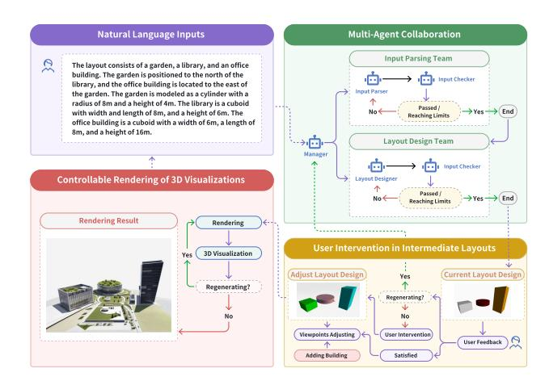

# Lang2Plan: An LLM-Powered Multi-Agent System for Building Layout Planning

Fangyong Pan College of Design and Innovation, Tongji University Shanghai, China 2280216@tongji.edu.cn

Xi Chen∗

Shanghai Key Laboratory of Data Science, College of Computer Science and Artificial Intelligence, Fudan University Shanghai, China x\_chen21@m.fudan.edu.cn

Weiqi Xu College of Computer Science and Artificial Intelligence, Fudan University Shanghai, China 21302010059@m.fudan.edu.cn

Yifeng Xu

Shanghai Key Laboratory of Data Science, College of Computer Science and Artificial Intelligence, Fudan University Shanghai, China 25213050431@m.fudan.edu.cn

Haofen Wang College of Design and Innovation, Tongji University Shanghai, China

# Abstract

Natural language–guided layout design has recently attracted increasing attention, as it can improve design efficiency and lower the expertise barrier for non-professional users. Recent methods leverage LLMs to translate user instructions into layout results. While effective in principle, these methods impose strict requirements on the quality and formality of natural language input, lack support for user intervention during the design process, and present results only in 2D or fixed-view layouts without immersive visualization. To address these limitations, we present a building layout planning system (Lang2Plan) that integrates multi-agent reasoning, interactive 3D editing, and controllable generative rendering. Specifically, an LLM-powered multi-agent framework decomposes natural language instructions into simpler sub-tasks, enabling robust and fault-tolerant layout generation from imperfect input. Second, we introduce a web-based 3D interface that allows users to interactively adjust intermediate design before final rendering, significantly improving controllability and user satisfaction. Third, we employ ControlNet-guided diffusion models to generate realistic 3D renderings from user-selected viewpoints, going beyond conventional fixed 2D plans. We implement these components into a unified system that transforms natural language descriptions into high-quality 3D layout plans through a reliable, intuitive and userfriendly interface. To further illustrate the capabilities and usability of our proposed system, we provide a [Demo Video.](https://youtu.be/xnIuvFBiTwc)

WWW Companion '26, Dubai, United Arab Emirates © 2026 Copyright held by the owner/author(s). ACM ISBN 979-8-4007-2308-7/2026/04 <https://doi.org/10.1145/3774905.3793111>

# CCS Concepts

• Applied computing → Computer-aided design; • Computing methodologies → Multi-agent planning.

# Keywords

Building Layout Planning; LLMs; Agents; Diffusion Model

### ACM Reference Format:

Fangyong Pan, Xi Chen, Weiqi Xu, Yifeng Xu, and Haofen Wang. 2026. Lang2Plan: An LLM-Powered Multi-Agent System for Building Layout Planning. In Companion Proceedings of the ACM Web Conference 2026 (WWW Companion '26), April 13–17, 2026, Dubai, United Arab Emirates. ACM, New York, NY, USA, [3](#page-2-0) pages.<https://doi.org/10.1145/3774905.3793111>

## 1 Introduction

Building Layout Planning refers to the task of arranging structural entities within a spatial environment to satisfy functional and aesthetic requirements [\[5\]](#page-2-1). Unlike other layout design tasks (e.g., UI layout) [\[2,](#page-2-2) [3,](#page-2-3) [18\]](#page-2-4), building layout planning must handle 3D entities and generate realistic renderings that conform to architectural styles, rather than simplified schematic drawings. Traditionally, this task requires experienced professionals and involves repeated adjustments, making the process time-consuming and inaccessible to non-experts [\[13\]](#page-2-5).

Recent advances in AI-generated content [\[1,](#page-2-6) [4\]](#page-2-7), particularly diffusion models such as Stable Diffusion [\[12\]](#page-2-8) and ControlNet [\[19\]](#page-2-9), have opened new possibilities for building layout planning by enabling controllable, high-quality visual content generation from natural language descriptions. However, existing methods are fragile to ambiguous or incomplete natural language input [\[8\]](#page-2-10), lack interactivity since users cannot adjust intermediate designs [\[9\]](#page-2-11), and offer only restricted 2D or fixed-view visualizations [\[7\]](#page-2-12). Recently, LLM-driven agents have gained increasing attention across diverse domains, owing to their ability to couple the powerful reasoning and language understanding capabilities of LLMs with the modularity of agent-based systems [\[6,](#page-2-13) [11\]](#page-2-14).

∗Corrsponding Author.

[This work is licensed under a Creative Commons Attribution-NonCommercial-](https://creativecommons.org/licenses/by-nc-nd/4.0)[NoDerivatives 4.0 International License.](https://creativecommons.org/licenses/by-nc-nd/4.0)

Figure 1: The pipeline of Lang2Plan.

Thus, we develop an LLM-powered multi-agent system, called Lang2Plan (Language to Building Layout Planning), that integrates natural language understanding, interactive 3D visualization, and controllable generative modeling. Specifically, we propose: (i) a multi-agent [\[10,](#page-2-15) [16,](#page-2-16) [17\]](#page-2-17) collaborative method that decomposes complex or conflicting natural language requirements into simpler sub-tasks to improve robustness and fault tolerance; (ii) a web-based 3D interaction framework that visualizes intermediate layouts and allows users to adjust building properties or directly manipulate objects; and (iii) a controllable diffusion-based rendering approach with ControlNet that ensures both semantic alignment and structural consistency in realistic 3D images. These components are integrated into a unified system with an intuitive interface, providing a reliable, interactive, and user-friendly solution.

### 2 System Overview

The proposed Lang2Plan aims to transform natural language descriptions of user requirements into high-quality building layout designs and realistic 3D renderings. The pipeline consists of three key stages. First, the input text is decomposed into a structured intermediate layout representation through LLM-guided parsing and validation agents, which extracts entities, attributes, and relations while checking for consistency with the original description. This intermediate state, represented as a directed graph with nodes denoting buildings and edges encoding spatial relations, provides a robust foundation even when user input is complex, ambiguous, or partially contradictory. Then, the system presents the intermediate layout through a web-based 3D interface, enabling real-time visualization, inspection, and user-driven adjustments. This interactive stage not only reduces errors from the automated process but also empowers users to refine the design and select their preferred viewpoint for rendering. Finally, the system leverages diffusion models with ControlNet to generate realistic 3D renderings that align with both the refined layout structure and the textual descriptions, overcoming the limitations of prior methods that only produce 2D plans or fixed-view renderings. Although our focus is on building layout

design, the same multi-agent collaborative strategy can be generalized to other layout tasks by adapting the parsing and design rules to domain-specific requirements. The pipeline of Lang2Plan and corrsponding examples are shown in Figure [1.](#page-1-0)

Multi-Agent Collaboration for Layout Design. We design 4 functional agents coordinated by a lightweight manager agent. (i) The Input Parser extracts valid information from raw user descriptions, determining the number of buildings (graph nodes), their attributes (ID, description, shape, size), as well as spatial relations (graph edges with directional prepositions such as "east of"). (ii) The Parser Checker validates this intermediate graph against the original text, identifying potential issues such as missing or fabricated buildings, incorrect spatial relations, or attribute errors, and provides feedback for correction. (iii) Once parsing is complete, the Layout Designer assigns spatial coordinates to buildings, aiming to satisfy the relational constraints represented by edges. (iv) Finally, the Layout Checker verifies whether the assigned positions meet all spatial constraints and flags inconsistencies for refinement.

Together, these agents are organized into 2 collaborative teams: an Input Parsing Team (manager, parser, checker) and a Layout Design Team (manager, designer, checker). This modular design enhances robustness and fault tolerance, ensuring that even under ambiguous or conflicting requirements, the system can generate a layout that is both faithful to user intent and structurally consistent.

User Intervention in Intermediate Layouts. After the multiagent system generates an initial layout from natural language, a web-based 3D interface is introduced to present the intermediate design in real time. It integrates editing tools that allow users to directly adjust the generated layout before proceeding to final rendering. This design choice supports user intervention at the intermediate stage, ensuring that the final 3D rendering better reflects user intent.

Controllable Rendering of 3D Visualizations. After the layout adjustment stage, the system generates the final visualization using Stable Diffusion combined with ControlNet. Unlike conventional approaches that render 3D models from a few pre-defined viewpoints and then apply diffusion-based re-drawing, our method allows users to freely select their preferred viewpoints for rendering. This flexibility enhances user satisfaction by enabling diverse perspectives of the same layout. Once a base image is captured from the chosen viewpoint, the system constructs prompts from building attributes—including descriptions, shapes, and automatically assigned colors—and performs image-to-image generation through the diffusion model API.

### 3 System Implementation Details

The Lang2Plan system is designed using a three-tier architecture that separates presentation, business logic, and storage. Frontend: The web interface is implemented with JavaScript and Three.js, providing a modern and intuitive environment that integrates three main functions—layout generation, building management, and rendering visualization. A 3D scene container allows users to inspect and edit layouts, while a side panel provides text input, property editing, and rendering results. Backend: The business layer coordinates a multi-agent system for layout generation and a diffusion-based rendering module. The multi-agent framework, built on deepseek-chat [\[15\]](#page-2-18) with the AutoGen [\[14\]](#page-2-19) framework, includes five specialized agents which organized into two teams alization, the backend invokes Stable Diffusion with ControlNet, using user-selected viewpoints and building attributes to generate realistic 3D images while preserving structural outlines. Storage: Intermediate layout data and final renderings are stored locally, while base images for rendering are managed via Alibaba Cloud OSS for API access. Together, these components provide a robust, fault-tolerant, and user-friendly solution for generating interactive

to iteratively refine results. Rendering Module: For final visu-3D building layouts from natural language descriptions. 4 Conclusion and Future Work In this paper, we present Lang2Plan for building layout planning that integrates multi-agent collaboration, interactive 3D editing, and controllable generative rendering, delivering a streamlined and user-friendly solution for natural language-driven layout design. By coupling LLM-driven agents with structured planning and interactive generation, Lang2Plan lowers the barrier for non-experts, enhances collaboration between humans and AI, and points toward a future of AI-assisted architectural design where creativity and structural consistency can be balanced in an accessible manner. The future work includes incorporating aesthetic design principles through collaboration with experts, enhancing the 3D interface to support more complex structures, and leveraging advances in multimodal generative models for finer control. Acknowledgements This work was supported by the National Natural Science Foundation of China (U23B2057), and Shanghai Pilot Program for Basic Research (22TQ1400300). References [1] Yunning Cao, Ye Ma, Min Zhou, Chuanbin Liu, Hongtao Xie, Tiezheng Ge, and Yuning Jiang. 2022. Geometry aligned variational transformer for imageconditioned layout generation. In Proceedings of the 30th ACM International Conference on Multimedia. 1561–1571. [2] Ata Çelen, Guo Han, Konrad Schindler, Luc Van Gool, Iro Armeni, Anton Obukhov, and Xi Wang. 2024. I-design: Personalized llm interior designer. In European Conference on Computer Vision. Springer, 217–234. [3] Jian Chen, Ruiyi Zhang, Yufan Zhou, Jennifer Healey, Jiuxiang Gu, Zhiqiang Xu, and Changyou Chen. 2024. Textlap: Customizing language models for text-tolayout planning. arXiv preprint arXiv:2410.12844 (2024). [4] Jian Chen, Ruiyi Zhang, Yufan Zhou, Rajiv Jain, Zhiqiang Xu, Ryan Rossi, and Changyou Chen. 2024. Towards aligned layout generation via diffusion model with aesthetic constraints. arXiv preprint arXiv:2402.04754 (2024). [5] Xi Chen, Yun Xiong, Siqi Wang, Haofen Wang, Tao Sheng, Yao Zhang, and Yu Ye. 2023. ReCo: A dataset for residential community layout planning. In Proceedings of the 31st ACM international conference on multimedia. 397–405. [6] Mohamed Amine Ferrag, Norbert Tihanyi, and Merouane Debbah. 2025. From llm reasoning to autonomous ai agents: A comprehensive review. arXiv preprint arXiv:2504.19678 (2025). [7] Naoto Inoue, Kotaro Kikuchi, Edgar Simo-Serra, Mayu Otani, and Kota Yamaguchi. 2023. Layoutdm: Discrete diffusion model for controllable layout generation. In Proceedings of the IEEE/CVF Conference on Computer Vision and Pattern Recognition. 10167–10176. [8] Sicong Leng, Yang Zhou, Mohammed Haroon Dupty, Wee Sun Lee, Sam Conrad Joyce, and Wei Lu. 2023. Tell2design: A dataset for language-guided floor plan generation. arXiv preprint arXiv:2311.15941 (2023). [9] Pengzhi Li, Baijuan Li, and Zhiheng Li. 2024. Sketch-to-architecture: Generative ai-aided architectural design. arXiv preprint arXiv:2403.20186 (2024). [10] Tian Liang, Zhiwei He, Wenxiang Jiao, Xing Wang, Yan Wang, Rui Wang, Yujiu Yang, Shuming Shi, and Zhaopeng Tu. 2023. Encouraging divergent thinking in large language models through multi-agent debate. arXiv preprint arXiv:2305.19118 (2023). [11] Junyu Luo, Weizhi Zhang, Ye Yuan, Yusheng Zhao, Junwei Yang, Yiyang Gu, Bohan Wu, Binqi Chen, Ziyue Qiao, Qingqing Long, et al. 2025. Large language model agent: A survey on methodology, applications and challenges. arXiv preprint arXiv:2503.21460 (2025). [12] Robin Rombach, Andreas Blattmann, Dominik Lorenz, Patrick Esser, and Björn Ommer. 2022. High-resolution image synthesis with latent diffusion models. In Proceedings of the IEEE/CVF conference on computer vision and pattern recognition. 10684–10695. [13] Tao Sheng, Yun Xiong, Haofen Wang, Yao Zhang, Siqi Wang, and Weinan Zhang. 2025. Deep reinforcement learning for community architectural layout generation. Knowledge and Information Systems 67, 3 (2025), 2453–2480. [14] Qingyun Wu, Gagan Bansal, Jieyu Zhang, Yiran Wu, Beibin Li, Erkang Zhu, Li Jiang, Xiaoyun Zhang, Shaokun Zhang, Jiale Liu, et al. 2024. Autogen: Enabling next-gen LLM applications via multi-agent conversations. In First Conference on Language Modeling. [15] Luolin Xiong, Haofen Wang, Xi Chen, Lu Sheng, Yun Xiong, Jingping Liu, Yanghua Xiao, Huajun Chen, Qing-Long Han, and Yang Tang. 2025. DeepSeek: Paradigm Shifts and Technical Evolution in Large AI Models. IEEE/CAA Journal of Automatica Sinica 12, 5 (2025), 841–858. [16] Hui Yang, Sifu Yue, and Yunzhong He. 2023. Auto-gpt for online decision making: Benchmarks and additional opinions. arXiv preprint arXiv:2306.02224 (2023). [17] Shunyu Yao, Jeffrey Zhao, Dian Yu, Nan Du, Izhak Shafran, Karthik Narasimhan, and Yuan Cao. 2023. React: Synergizing reasoning and acting in language models. In International Conference on Learning Representations (ICLR). [18] Xiaoan Zhan, Yang Xu, and Yingchia Liu. 2024. Personalized UI layout generation using deep learning: An adaptive interface design approach for enhanced user experience. Journal of Artificial Intelligence General science (JAIGS) ISSN: 3006- 4023 6, 1 (2024), 463–478. [19] Lvmin Zhang, Anyi Rao, and Maneesh Agrawala. 2023. Adding conditional control to text-to-image diffusion models. In Proceedings of the IEEE/CVF international conference on computer vision. 3836–3847.

