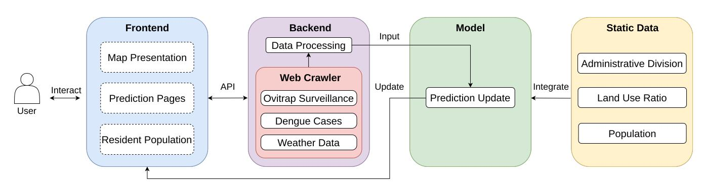
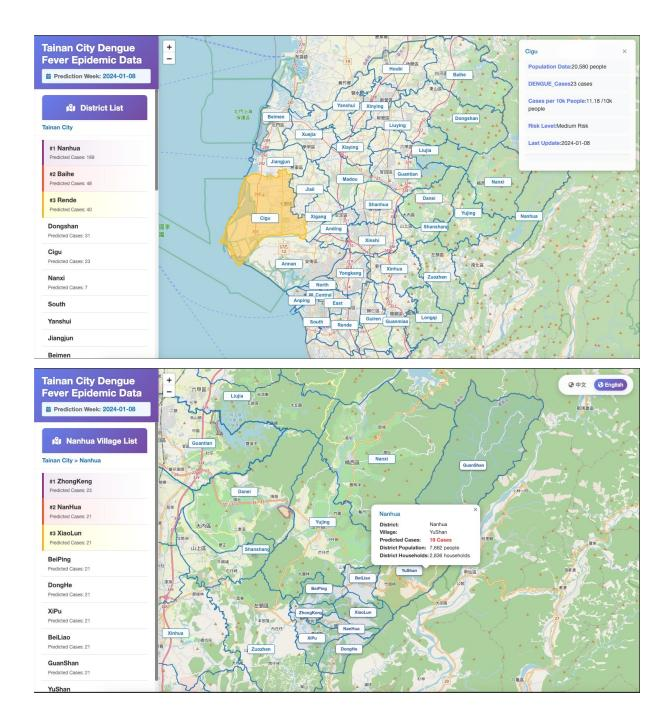
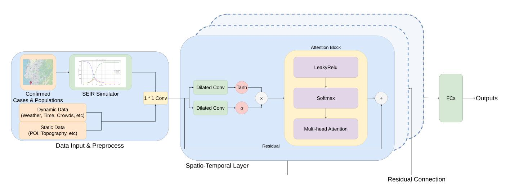
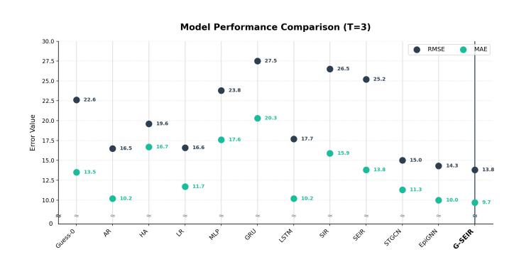
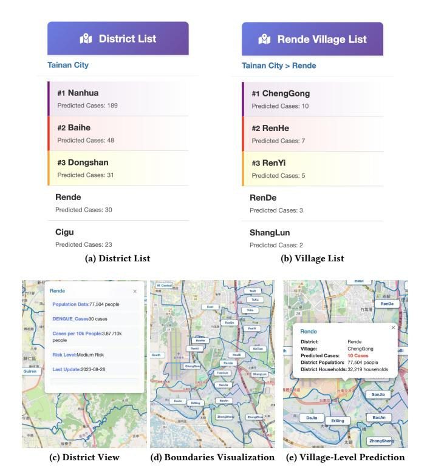

# G-SEIR: A Graph-Enhanced Epidemic Forecasting System for Dengue Intervention

| Cheng-Ru Chou                        |          |            |                                      |
|--------------------------------------|----------|------------|--------------------------------------|
| National Cheng Kung University       |          |            |                                      |
| Department of Electrical Engineering |          |            |                                      |
| Tainan, Taiwan                       |          |            |                                      |
|                                      | Shou-Po  |            | Tsai                                 |
| National                             | Cheng    | Kung       | University                           |
| Department                           | of       | Electrical | Engineering                          |
|                                      | Tainan,  | Taiwan     |                                      |
|                                      |          |            | Jing-Zhe Huang                       |
|                                      |          |            | National Cheng Kung University       |
|                                      |          |            | Department of Electrical Engineering |
|                                      |          |            | Tainan, Taiwan                       |
| Hsu-Han Tu                           |          |            |                                      |
| National Cheng Kung University       |          |            |                                      |
| Department of Electrical Engineering |          |            |                                      |
| Tainan, Taiwan                       |          |            |                                      |
|                                      | Pei-Xuan |            | Li                                   |
| National                             | Cheng    | Kung       | University                           |
| Department                           | of       | Electrical | Engineering                          |
|                                      | Tainan,  | Taiwan     |                                      |
|                                      |          |            | Hsun-Ping Hsieh †                    |
|                                      |          |            | National Cheng Kung University       |
|                                      |          |            | Department of Electrical Engineering |
|                                      |          |            | Tainan, Taiwan                       |

### Abstract

Dengue fever poses significant public-health risks in tropical regions, with recent outbreaks in Tainan City underscoring the need for timely, fine-grained forecasting. We introduce Graph-SEIR (G-SEIR), an end-to-end epidemic forecasting system that integrates a learnable SEIR simulator with a spatio-temporal graph neural network. The system automatically collects and processes multi-source environmental, demographic, and entomological data and generates weekly forecasts for 37 districts and 752 villages. Experiments on the 2015 and 2023 outbreaks show that G-SEIR outperforms eleven baselines in Root Mean Squared Error and Mean Absolute Error. A web-based interface provides interactive, district-level risk visualization, enabling authorities to detect emerging hotspots and support early intervention. These capabilities position G-SEIR as a practical AI-driven decision-support module for smart-city governance in dengue-endemic regions, strengthening municipal capacity for proactive disease control and resource allocation.

## CCS Concepts

• Applied computing → Health care information systems; • Computing methodologies → Information extraction; • Information systems → Geographic information systems.

## Keywords

Dengue Fever, SEIR Simulation, Spatio-Temporal Graph Neural Networks, Public Health Surveillance, Early-Warning Systems

#### ACM Reference Format:

Cheng-Ru Chou, Shou-Po Tsai, Jing-Zhe Huang, Hsu-Han Tu, Pei-Xuan Li, and Hsun-Ping Hsieh† . 2026. G-SEIR: A Graph-Enhanced Epidemic Forecasting System for Dengue Intervention. In Companion Proceedings of the ACM Web Conference 2026 (WWW Companion '26), April 13–17, 2026,

© 2026 Copyright held by the owner/author(s). ACM ISBN 979-8-4007-2308-7/2026/04 <https://doi.org/10.1145/3774905.3793113>

Dubai, United Arab Emirates. ACM, New York, NY, USA, [4](#page-3-0) pages. [https:](https://doi.org/10.1145/3774905.3793113) [//doi.org/10.1145/3774905.3793113](https://doi.org/10.1145/3774905.3793113)

### 1 Introduction

Dengue fever is a mosquito-borne viral disease that affects countries across tropical and subtropical regions. The disease has become a growing global public-health challenge due to its rapid geographic expansion and recurring seasonal outbreaks. In 2023, over 6.5 million cases and 6,800 deaths were reported, underscoring the urgent need for early-warning systems that enable timely interventions and effective resource allocation [\[2\]](#page-3-1). In Taiwan, Tainan City experienced severe dengue outbreaks in both 2015 and 2023, emphasizing the necessity of immediate, fine-grained forecasting tools to assist local public health authorities in outbreak prevention.

Traditionally, public health intervention for Dengue fever relies on lagging indicators (confirmed case numbers) or manual assessments, leading to delayed resource mobilization. These conventional workflows struggle with integrating disparate data sources (weather, population, forecast models) in real time. This lack of timely, location-specific intelligence complicates planning and contributes to suboptimal task allocation among field personnel.

To address this problem, we present the Graph-SEIR (G-SEIR) System, an end-to-end spatio-temporal forecasting and visualization platform for dengue epidemic management. The system integrates an SEIR-based [\[5\]](#page-3-2) epidemiological simulator, a spatio-temporal Graph Neural Network (GNN) prediction engine, and an interactive web-based frontend that visualizes district/village-level risk forecasts. By coupling epidemiological priors with data-driven learning, G-SEIR bridges the gap between mechanistic disease modeling and actionable decision support, enabling health officials to monitor potential hotspots and plan targeted interventions.

Unlike prior research that focuses solely on model accuracy, our system emphasizes operational usability and deployment readiness. It automates data ingestion, simulation, forecasting, and visualization in a unified pipeline, providing real-time situational awareness for government agencies. Users can explore temporal trends, spatial correlations, and risk levels interactively through the web interface.

The key contributions of this system are as follows:

† Advisor and Corresponding Author.

[This work is licensed under a Creative Commons Attribution 4.0 International License.](https://creativecommons.org/licenses/by/4.0) WWW Companion '26, Dubai, United Arab Emirates

Figure 1: Overview of G-SEIR system framework.

- We present a dengue early-warning system that integrates epidemiological simulation with GNN-based forecasting.
- We design a web interface for regional risk visualization, supporting decision-making for public-health authorities.
- The system demonstrates strong generalization and applicability for epidemic prevention and early intervention.

## 2 System Architecture

The proposed system is developed to be a robust, full-fledged web application, where the data preparation pipeline, backend API, and interactive frontend work seamlessly together. This modular design enables continuous data processing and ensures that the web interface remains consistently up to date.

## 2.1 Frontend and User Interaction Layer

The user interface provides an interactive geospatial visualization of the dengue data and predicted outbreak risks.

- Geospatial Visualization: The interactive map is built on top of OpenStreetMap [\[4\]](#page-3-3) and support two administrative levels: 37 districts and 752 villages.
- Risk Classification and Representation: The visualization employs color-coded risk levels to represent the severity of epidemic threats, with thresholds that can be adjusted.
- Bilingual Support: The interface supports both Traditional Chinese (zh-TW) and English (en-US), facilitating accessibility for different user groups.

### 2.2 Backend Services

The backend is supported by an automated data aggregation pipeline that continuously retrieves recent dengue case data from official public websites to provide model forecasting. This pipeline operates without manual intervention and integrates multiple dynamic data sources, including:

(1) Dengue Case Records: Automatically downloaded from government websites, providing the most recent confirmed cases to support timely model updates and forecasting.

(2) Ovitrap Surveillance Data: Collected from around 3,500 ovitraps distributed across Tainan City. Ovitrap is a passive, low-cost device used to attract and collect eggs of mosquitoes (e.g., Aedes aegypti) for surveillance purposes.

Figure 2: Visualization of district-level (top) and village-level (bottom) prediction results in the system interface.

(3) Meteorological Data: Gathered from 61 weather stations covering the Tainan metropolitan area.

After crawling data from the official website, the system automatically organizes and transforms it into a model-ready format, enabling end-to-end automation.

## 2.3 Summary of System Architecture

The System adopts a modular, data-driven design, enables realtime forecasting and frontend updates. Combined with interactive map rendering and informative visual analytics, it provides local authorities with an intuitive decision-support tool for monitoring epidemic trends and planning timely interventions.

Figure 3: Overview of the G-SEIR's model framework.

#### 3 Model Architecture

We formulate dengue forecasting as a district/village-level spatiotemporal regression task to predict next week dengue cases from past 5 weeks of historical multi-source features. Figure [3](#page-2-0) presents the architecture of the proposed G-SEIR model, which comprises two core components: a learnable epidemic simulation module, and spatio-temporal layers integrating gated dilated temporal convolutions and spatial attention mechanisms.

## 3.1 Input Data and Preprocessing

Our system integrates a wide range of spatio-temporal features from the Tainan City Government and open data sources. These include the Breteau Index [\[1\]](#page-3-4), Ovitrap Index [\[3\]](#page-3-5), confirmed cases, Points of Interest, insecticide spraying records, population demographics, meteorological data, and district/village boundaries. During preprocessing, all datasets are harmonized into weekly temporal sequences and aggregated at both district/village spatial levels.

## 3.2 Epidemic Simulator

The SEIR module models disease progression across the Susceptible, Exposed, Infectious, and Recovered compartments. We treat the epidemiological parameters ��, ��, and �� as learnable variables optimized during training. Specifically, the confirmed case counts and population data for each district or village are fed into the differential equations of the SEIR model to generate dynamic infection trajectories. These simulated epidemic signals are then integrated with other contextual features and forwarded to the spatio-temporal layers for joint learning. This design enables the model to capture realistic transmission dynamics while adapting the epidemic parameters to data-driven contexts.

## 3.3 Spatio-Temporal Graph Neural Network

Traditional SEIR models provide temporal dynamics but lack spatial resolution. Our spatio-temporal block addresses this by combining gated dilated temporal convolutions with a multi-head spatial attention mechanism that dynamically learns inter-district relationships. Unlike prior graph-based methods that rely on static adjacency matrices, our attention design adapts to evolving spatial dependencies. Building on concepts from Spatio-Temporal Graph Convolution Network (STGCN) [\[9\]](#page-3-6) and Graph WaveNet [\[7\]](#page-3-7), our model further integrates SEIR epidemic modulation, enabling a tighter coupling between mechanistic simulation and data-driven learning.

#### 3.4 Loss Function

Since our prediction task is a regression problem, we adopt Root Mean Squared Error (RMSE) and Mean Absolute Error (MAE) to construct the loss function. The final loss is defined as: L = �� · RMSE + (1 − ��) · MAE. In this study, we experimentally found that setting �� = 0.5 (as equal weighted) yields the best performance.

## 4 Experimental Result

We evaluate G-SEIR on dengue datasets from the 2015 and 2023 outbreaks in Tainan City across 37 districts and 752 villages. A five-week historical data is used, and split chronologically into 60% training, 20% validation, and 20% testing. We compare our model against eleven baselines, including naïve predictors, statistical models, an epidemiological simulator (SEIR [\[5\]](#page-3-2)), neural architectures (Multilayer Perceptron (MLP), Gated Recurrent Unit (GRU), Long Short-Term Memory (LSTM) [\[6\]](#page-3-8)), and several spatio-temporal GNN approaches (STGCN [\[9\]](#page-3-6), EpiGNN [\[8\]](#page-3-9)). Evaluation follows standard regression metrics as defined in Section [3.4.](#page-2-1) As shown in Figure [4,](#page-3-10) G-SEIR achieves the lowest RMSE (13.8) and MAE (9.7), demonstrating the advantage of combining SEIR-based priors with adaptive spatio-temporal modeling.

#### 5 Demonstration Scenario

The demonstration scenario outlines a practical workflow that the related authorities, susceptible citizens or anyone interested can take advantage of the system. The process focuses on the seamless integration of the data preparation pipeline, epidemic forecasting mechanism and the flexible visualization in the frontend website.

Figure 4: Performance comparison across selected models under a 5-week historical input. (Lower is better.)

(1) Automated Data Refresh and Forecasting: Our system constantly updates dynamic data via web scraper in a fixed period. This automatic renew mechanism ensures the page is loaded with the latest forecast data and map configuration, guaranteeing maximum data freshness for decision-making.

(2)Risk Visualization: The interactive map allows supervisors to instantly assess risk in the 37 administrative districts, or the more detailed 752 village-level boundaries. By color coding the regions based on the breakout probability, it provides supervisors with an intuitive overview of the districts and villages currently at highest risk, enabling rapid and targeted preventative interventions.

## 5.1 System Demonstration

We take Rende district as an example to show the G-SEIR system's functionality and its real-world use cases in a governmental context.

The system interfaces are designed to support both quick numerical prioritization and detailed geographical analysis. Figure [5](#page-3-11) (a) and (b) showcase the data summary lists, presenting the ranked risk and predicted case counts for both the administrative districts and the specific village level (e.g., Rende District). This list-based view supports rapid, non-geospatial decision-making. Conversely, Figure [5](#page-3-11) (c), (d), and (e) demonstrate the system's interactive geospatial capabilities. Figure [5](#page-3-11) (c) and (d) visualize the color-coded risk and the district/village boundaries directly on the map. Finally, Figure [5](#page-3-11) (e) illustrates the crucial interactive function, where clicking on a specific area triggers a popup to display the detailed data, such as predicted cases, for that exact location.

### 6 Conclusion and Future Work

We presented G-SEIR, a system that integrates a learnable SEIRbased epidemic simulator with a spatio-temporal GNN to capture incubation-driven temporal effects and cross-region interactions. The model incorporates learnable SEIR-derived embeddings to embed epidemiological dynamics directly into the learning pipeline, enabling more interpretable and robust forecasting. Experimental results show that G-SEIR achieves state-of-the-art performance, outperforming eleven baseline models across multiple outbreak years. To support real-world applicability, we also develop an interactive web interface that visualizes district-level risk and facilitates early preventive action by public-health authorities.

Figure 5: Detailed illustration of the system interfaces.

## Acknowledgments

This work was partially supported by National Science and Technology Council (NSTC) of Taiwan under Grants 114-2628-E-006 -005 -MY3 and 112-2221-E-006 -150 -MY3.

#### References

[1] Vindhya S. Aryaprema and Rui-De Xue. 2019. Breteau index as a promising early warning signal for dengue fever outbreaks in the Colombo District, Sri Lanka. Acta Tropica 199 (2019), 105155. [doi:10.1016/j.actatropica.2019.105155](https://doi.org/10.1016/j.actatropica.2019.105155) [2] Najmul Haider, Mohammad Nayeem Hasan, Joshua Onyango, and Md Asaduzzaman. 2024. Global landmark: 2023 marks the worst year for dengue cases with millions infected and thousands of deaths reported. IJID Regions 13 (2024), 100459. [doi:10.1016/j.ijregi.2024.100459](https://doi.org/10.1016/j.ijregi.2024.100459) [3] Kauani Larissa Campana Nascimento, João Fernando Marques da Silva, João Antonio Cyrino Zequi, and José Lopes. 2020. Comparison Between Larval Survey Index and Positive Ovitrap Index in the Evaluation of Populations of Aedes (Stegomyia) aegypti (Linnaeus, 1762) North of Paraná, Brazil. Environmental Health Insights 14 (2020), 1178630219886570. arXiv[:https://doi.org/10.1177/1178630219886570](https://arxiv.org/abs/https://doi.org/10.1177/1178630219886570) [doi:10.1177/1178630219886570](https://doi.org/10.1177/1178630219886570) PMID: 31933523. [4] OpenStreetMap contributors. 2017. [https://www.openstreetmap.org.]( https://www.openstreetmap.org ) [5] Mojeeb Osman, Isaac Kwasi Adu, and Cuihong Yang. 2017. A Simple SEIR Mathematical Model of Malaria Transmission. Asian Research Journal of Mathematics 7 (01 2017), 1–22. [doi:10.9734/ARJOM/2017/37471](https://doi.org/10.9734/ARJOM/2017/37471) [6] Alex Sherstinsky. 2020. Fundamentals of Recurrent Neural Network (RNN) and Long Short-Term Memory (LSTM) network. Physica D: Nonlinear Phenomena 404 (March 2020), 132306. [doi:10.1016/j.physd.2019.132306](https://doi.org/10.1016/j.physd.2019.132306) [7] Zonghan Wu, Shirui Pan, Guodong Long, Jing Jiang, and Chengqi Zhang. 2019. Graph WaveNet for Deep Spatial-Temporal Graph Modeling. arXiv[:1906.00121](https://arxiv.org/abs/1906.00121) [cs.LG]<https://arxiv.org/abs/1906.00121> [8] Feng Xie, Zhong Zhang, Liang Li, Bin Zhou, and Yusong Tan. 2022. EpiGNN: Exploring Spatial Transmission with Graph Neural Network for Regional Epidemic Forecasting. arXiv[:2208.11517](https://arxiv.org/abs/2208.11517) [q-bio.QM]<https://arxiv.org/abs/2208.11517> [9] Bing Yu, Haoteng Yin, and Zhanxing Zhu. 2018. Spatio-Temporal Graph Convolutional Networks: A Deep Learning Framework for Traffic Forecasting. In Proceedings of IJCAI-2018. International Joint Conferences on Artificial Intelligence Organization, 3634–3640. [doi:10.24963/ijcai.2018/505](https://doi.org/10.24963/ijcai.2018/505)