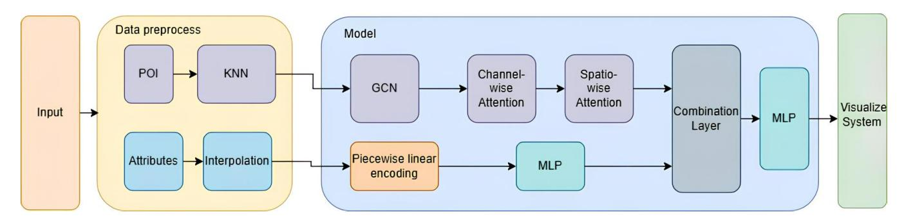
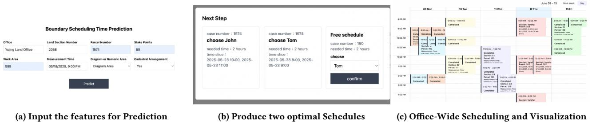
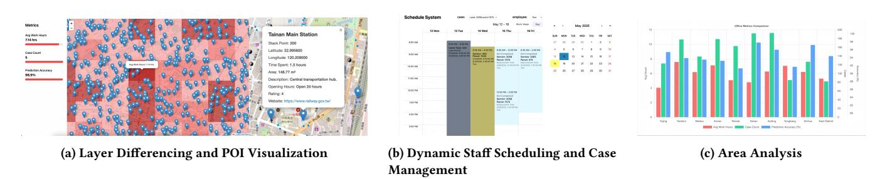

# SAMPLE: A Spatial/Channel-wise Attention GCN with MLP and Periodic Linear Encoding for Land Boundary Demarcation System

[Min-Huan Tsai](https://orcid.org/0009-0003-3562-0533) National Cheng Kung University Department of Electrical Engineering Tainan, Taiwan N26131994@gs.ncku.edu.tw

[Cheng-Ru Chou](https://orcid.org/0009-0001-6394-0986) National Cheng Kung University Department of Electrical Engineering Tainan, Taiwan N26140870@gs.ncku.edu.tw

[Chia-Chen Tsai](https://orcid.org/0009-0008-4595-9393) National Cheng Kung University Department of Electrical Engineering Tainan, Taiwan N26131994@gs.ncku.edu.tw

[Yu-Yin Wang](https://orcid.org/0009-0002-6175-9021) National Cheng Kung University Department of Electrical Engineering Tainan, Taiwan N26150930@gs.ncku.edu.tw

[Pei-Xuan Li](https://orcid.org/0000-0002-6014-4191) National Cheng Kung University Department of Electrical Engineering Tainan, Taiwan N28121107@gs.ncku.edu.tw

[Hsun-Ping Hsieh](https://orcid.org/0000-0001-6924-1337)† National Cheng Kung University Department of Electrical Engineering Tainan, Taiwan hphsieh@mail.ncku.edu.tw

[Tzu-Chang Lee](https://orcid.org/0000-0001-9517-7017) National Cheng Kung University Department of Urban Planning Tainan, Taiwan jtclee@mail.ncku.edu.tw

# Abstract

Defining legal property rights and supporting effective land management heavily rely on accurate land boundary demarcation, a key responsibility of the government in Taiwan. However, conventional processes are hindered by key human resource management challenges, such as inaccurate forecasting of fieldwork duration, suboptimal task allocation, inequitable workload distribution, and limited capacity for data-driven decision-making in resource planning. To overcome these limitations, we present SAM-PLE (A Spatial/Channel-wise Attention Graph Convolutional Networks with Multi-layer Perceptron and Periodic Linear Encoding for Land Boundary Demarcation System), a web-based platform designed to enhance field-task scheduling and time-forecasting by integrating spatial and tabular data into a predictive modeling and visualization system. The system leverages a novel model architecture that combines Periodic Linear Encoding, Graph Convolutional Networks (GCN), spatial/channel-wise attention mechanisms, and Multi-Layer Perceptrons (MLP). Compared to baseline models such as XGBoost, TabPFN, TabNet, and GCN+MLP, our model achieves superior accuracy, as demonstrated through multiple experiments and ablation studies. In direct comparison with a conventional unstructured data pipeline, SAMPLE achieved up to a 88% reduction in time and labor costs, highlighting its efficiency and effectiveness.

†Corresponding Authors.

[This work is licensed under a Creative Commons Attribution 4.0 International License.](https://creativecommons.org/licenses/by/4.0) WWW Companion '26, Dubai, United Arab Emirates

© 2026 Copyright held by the owner/author(s). ACM ISBN 979-8-4007-2308-7/2026/04 <https://doi.org/10.1145/3774905.3793114>

Furthermore, SAMPLE's intuitive visualization platform allows anyone, even without specialized knowledge, to effortlessly create and explore spatial forecasts. Users can compare historical and forecasted changes, visualize workloads in specific areas, and interpret results on a map.

# CCS Concepts

• Information systems → Information retrieval; Data mining; Geographic information systems; • Computing methodologies → Neural networks.

# Keywords

land boundary demarcation, geographic information systems (GIS), graph neural networks (GNNs), spatial data mining, geospatial AI, information retrieval

#### ACM Reference Format:

Min-Huan Tsai, Cheng-Ru Chou, Chia-Chen Tsai, Yu-Yin Wang, Pei-Xuan Li, Hsun-Ping Hsieh† , and Tzu-Chang Lee. 2026. SAMPLE: A Spatial/Channelwise Attention GCN with MLP and Periodic Linear Encoding for Land Boundary Demarcation System. In Companion Proceedings of the ACM Web Conference 2026 (WWW Companion '26), April 13–17, 2026, Dubai, United Arab Emirates. ACM, New York, NY, USA, [4](#page-3-0) pages. [https://doi.org/10.1145/](https://doi.org/10.1145/3774905.3793114) [3774905.3793114](https://doi.org/10.1145/3774905.3793114)

# 1 Introduction

Land boundary demarcation, a critical public service in Taiwan, plays a key role in defining legal property rights and ensuring effective land management. Demarcation refers to the official process of identifying, confirming, and recording land parcel boundaries, typically conducted by professional land surveyors under the supervision of local land administration authorities. It involves field

Figure 1: The architecture of SAMPLE, illustrating the data preprocessing pipeline, prediction model, and visualization system.

inspections, cadastral map comparison, stakeholder coordination, and legal validation to resolve boundary disputes and ensure cadastral data accuracy. The outcomes of this process directly impact property ownership clarity, dispute resolution, and the efficiency of land transactions or public infrastructure development.

However, conventional processes face significant human resource management challenges, including inaccurate forecasting of fieldwork durations, suboptimal task allocation, inequitable workload distribution among surveyors, and delays caused by limited capacity for data-driven decision making . These challenges primarily arise from outdated workflows and limited capacity to leverage operational data effectively. Addressing these issues highlights the pressing need for digital transformation. Solutions such as Geographic Information Systems (GIS), predictive analytics, and automated scheduling hold significant potential, with their true value realized through seamless integration into a unified and cohesive system. Recent advances demonstrate the power of such integration. Machine learning and Deep learning models can significantly improve the prediction of task duration, while algorithmic scheduling optimizes resource utilization and timeliness. Furthermore, GIS-based spatial analysis improves task allocation by factoring in location intelligence, reducing travel time, and balancing assignments. However, applying these techniques effectively to the unique constraints of land demarcation requires a tailored approach.

To address these issues, we introduce SAMPLE, a web-based platform designed to support land boundary demarcation workflows by integrating predictive modeling, automated scheduling, and case management into a unified system. At its core, SAMPLE features a fieldwork duration prediction model that leverages historical and spatial data (GIS) to produce more accurate time estimates than traditional methods [\[4\]](#page-3-1). These predictions inform a scheduling algorithm that dynamically allocates tasks based on estimated durations, personnel availability, and spatial constraints, allowing more efficient resource planning and adjustment.

SAMPLE also provides a centralized interface for managing the full case lifecycle, with tools for monitoring task progress and visualizing performance metrics. Designed for both non-experts and technical users, the system supports government agencies can plan fieldwork more effectively, planners can oversee workload distribution, and external stakeholders can access projected outcomes through a user-friendly, visualization-driven interface.

#### 2 Methodologies

The general architecture of the proposed system is illustrated in Figure [1.](#page-1-0) It consists of three main components: data pre-processing module, prediction model, and visualization system. The system first preprocesses the Point-of-Interest (POI) data and other relevant features independently. These processed inputs are then fed into the prediction model. The final outputs are presented via an interactive visualization interface, enabling intuitive interpretation and supporting informed decision making.

# 2.1 Input Data and Preprocessing

In this study, we employed a real-world dataset provided by the Tainan City Government (Taiwan), containing approximately 15,000 records with numerical attributes, boolean indicators, geographic coordinates, and land-use information. To enrich spatial context, we further incorporated around 20 categories of Points of Interest (POI), including commercial facilities, transportation stops, educational institutions, and land section codes. The POI data were collected from heterogeneous sources such as Google Maps API, web crawlers, and government open data platforms. These geographic features support temporal computations and inform the construction of spatial relationships. Specifically, POI-based features were used to construct a ��-nearest neighbors (KNN) graph, which serves as input to the Graph Convolutional Network (GCN) for modeling spatial proximity and regional dependencies. Missing values in the dataset were imputed using Inverse Distance Weighting (IDW) interpolation [\[5\]](#page-3-2), ensuring data completeness for downstream predictions.

# 2.2 Prediction Model

We propose a hybrid architecture designed to effectively capture informative patterns from both geographic information and structured tabular data. Tabular features are encoded using Periodic Linear Encoding (PLE) [\[6\]](#page-3-3), which has been demonstrated to be highly effective for learning from tabular data. To represent spatial structure, we construct a graph based on POI coordinates using k-nearest neighbors (KNN) [\[8\]](#page-3-4), which is then processed by GCN. The use of GCN to POI-based spatial data has yielded promising results in spatiotemporal forecasting tasks [\[9\]](#page-3-5). To further enhance representational capacity, we incorporate spatial-wise and channelwise attention mechanisms, which are effective in extracting critical

spatial dependencies and identifying salient feature dimensions, respectively [\[2\]](#page-3-6). The outputs from the tabular and graph branches are then fused by a combination layer and passed through a Multi-Layer Perceptron (MLP) to generate the final prediction.

#### 3 Experiment

Table 1: Prediction performance comparison.

| Model   | MAE   | MSE   | RMSE  |
|---------|-------|-------|-------|
| XGBoost | 0.116 | 0.024 | 0.157 |
| TabPFN  | 0.102 | 0.023 | 0.155 |
| TabNet  | 0.190 | 0.086 | 0.211 |
| GCN+MLP | 0.145 | 0.057 | 0.170 |
| Ours    | 0.080 | 0.021 | 0.144 |

Table 2: Prediction performance of three ablation scenarios.

|     | Model     | MAE   | MSE   | RMSE  |
|-----|-----------|-------|-------|-------|
|     | Ours      | 0.080 | 0.021 | 0.144 |
| w/o | Embedding | 0.135 | 0.039 | 0.167 |
| w/o | GCN       | 0.141 | 0.053 | 0.171 |
| w/o | ATT       | 0.103 | 0.031 | 0.155 |

### 3.1 Model Comparisons

We compare our model with commonly used tabular-based models and graph-based models, including XGBoost [\[3\]](#page-3-7), TabPFN [\[7\]](#page-3-8), TabNet [\[1\]](#page-3-9), and GCN+MLP. We evaluate the effectiveness of each approach using key regression metrics, including Mean Absolute Error (MAE), Mean Squared Error (MSE), and Root Mean Squared Error (RMSE). As the results shown in Table [1,](#page-2-0) our proposed model consistently outperforms these baselines.

#### 3.2 Ablation Studies

We evaluate the impact of key components by removing: (w/o Embedding): Remove PLE in prediction model. (w/o GCN): Remove KNN and replaces GCN with MLP.

(w/o ATT): Remove attention mechanism.

Ablation studies show that all key components have positive effects on prediction performance, and the MLP module alone is insufficient to effectively capture complex spatial features. In contrast, in the full model we proposed, integrating both spatial-wise and channel-wise attention mechanisms markedly enhances the model's information-extraction capability and overall performance. Moreover, PLE further enhances the model's ability to learn and capture the complex patterns within tabular features, which in turn improves predictive accuracy.

# 4 Implementation

SAMPLE is a web-based platform that enhances field-task scheduling and time forecasting by integrating spatial and tabular data into a predictive modeling and visualization system (Figure [2,](#page-3-10) [3\)](#page-3-11).

#### 4.1 System Features

The system is implemented using Flask for the backend and React for the frontend, with MySQL serving as the primary database. The user interface features a multi-layered calendar view that visualizes scheduled shifts, leave records, and assigned tasks. It supports automated scheduling via Simulated Annealing and overlays both historical and predicted shift data. For predictive modeling, we employ both traditional machine learning algorithms and deep learning architectures. Models are implemented using frameworks such as PyTorch, XGBoost, and scikit-learn. In particular, our deep learning pipeline incorporates GCNs and attention mechanisms to capture spatial dependencies and salient feature representations from both geographic and structured tabular data.

### 4.2 Model Prediction and Schedule Generation

The platform enables users to input case-specific information, including spatial and contextual characteristics, to obtain modelgenerated predictions of expected task duration as shown in Fig. [2\(](#page-3-10)a). Based on predicted values, the system follows a scheduling workflow comprising: (1) applying a Simulated Annealing algorithm to generate two optimized schedules, taking into account fairness in workload distribution, regional assignment constraints, and employee leave information, allowing users to flexibly select the preferred outcome as shown in Fig. [2\(](#page-3-10)b); and (2) visualizing assigned shifts within a responsive calendar interface for intuitive inspection and adjustment as shown in Fig. [3\(](#page-3-11)b).

### 4.3 Shift Visualization and Management

To facilitate automated comparison between predicted and historical schedules, users can interact with the schedule view by selecting corresponding layers, specifying the temporal granularity, e.g., weekly or daily, and choosing relevant employees or tasks as shown in Fig. [3\(](#page-3-11)b). This interface enables users to: (1) review modelpredicted shift assignments; (2) record actual working hours for each scheduled task, supporting future model refinement; (3) manually edit shift details, such as updating case delays or modifying scheduling assignments; and (4) visualize the current scheduling status for an entire office daily, offering an overview of overall task distribution and workforce allocation as shown in Fig. [2\(](#page-3-10)c).

#### 4.4 Regional Layer Differencing Visualization

The system includes a dedicated interface to visualize historical fieldwork cases on a GIS-based grid map, implemented using the Leaflet JavaScript library as shown in Fig. [3\(](#page-3-11)b). Within this interface, users can select specific geographic regions to analyze localized prediction outcomes. The map overlays offer an intuitive view of regional task distributions and forecast accuracy, supporting more effective personnel deployment and helping identify areas with low predictive performance. These insights can guide future model refinement and data improvement efforts.

# 4.5 Area Analysis and Interactive Insights

Our platform allows users to click on any grid to inspect its scheduling in detail. The system then calculates and displays the average working hours and actual accuracy of that grid in the left menu, revealing the patterns of work intensity in different areas as shown in

Figure 2: The workflows of SAMPLE. It merges spatial visualization and PLE-Attention-GCN+MLP, offering key features: (a) input the features for prediction, (b) produce two optimal schedules, (c) office-wide scheduling and visualization.

Figure 3: The visualization of SAMPLE, offering key features: (a) layer differencing and POI visualization, (b) dynamic staff scheduling and case management, (c) area analysis. Dark to light red indicates accuracy from high to low.

Fig. [3\(](#page-3-11)a). Once a grid is selected, detailed information about nearby POI, plotted by latitude and longitude, appears, intuitively presenting local spatial and temporal data such as area facilities as shown in Fig. [3\(](#page-3-11)a). Because the system supports multiple scheduling and leave data formats, it can be applied to scenarios such as workforce management, project scheduling, and service site planning. By incorporating historical records, it can also clearly present the time series variations in the accuracy of the case counts of work hours between regions, visualized as bar charts as shown in Figure [3\(](#page-3-11)c).

### 4.6 User Applications and Benefits

Users can examine grid-level workloads, visualize the spatial distribution of facilities, and export results in GeoJSON format for downstream spatial analysis. The system supports rapid scenariobased comparisons and allows dynamic adjustment of scheduling plans. Verified by domain experts, SAMPLE shows a reduction of 88% in planning time and labor cost, while concurrently improving transparency and operational adaptability.

# 5 Conclusion

SAMPLE offers an intuitive visualization platform and accurate predictions to support land-boundary and value analysis. It operates on grid-based data and integrates GCN, PLE, mechanisms, and MLP, while incorporating POI distributions and land-related features. Experimental results demonstrate that our approach outperforms baseline methods. By unifying advanced modeling with

user-friendly visual exploration, our system empowers even nonexpert users to generate and inspect spatial predictions with ease.

# Acknowledgments

This work was partially supported by National Science and Technology Council (NSTC) of Taiwan under Grants 114-2628-E-006 -005 -MY3 and 112-2221-E-006 -150 -MY3.

#### References

[1] Sercan O. Arik and Tomas Pfister. 2020. TabNet: Attentive Interpretable Tabular Learning. arXiv[:1908.07442](https://arxiv.org/abs/1908.07442) [2] Long Chen, Hanwang Zhang, Jun Xiao, Liqiang Nie, Jian Shao, Wei Liu, and Tat-Seng Chua. 2017. SCA-CNN: Spatial and Channel-wise Attention in Convolutional Networks for Image Captioning. arXiv[:1611.05594](https://arxiv.org/abs/1611.05594) [cs.CV] [https://arxiv.org/abs/](https://arxiv.org/abs/1611.05594) [1611.05594](https://arxiv.org/abs/1611.05594) [3] Tianqi Chen and Carlos Guestrin. 2016. XGBoost: A Scalable Tree Boosting System. In 22nd ACM International Conference on Knowledge Discovery and Data Mining. [4] Bujar Fetai, Dejan Grigillo, and Anka Lisec. 2022. Revising Cadastral Data on Land Boundaries Using Deep Learning in Image-Based Mapping. ISPRS International Journal of Geo-Information 11, 5 (2022). [doi:10.3390/ijgi11050298](https://doi.org/10.3390/ijgi11050298) [5] GISGeography. 2016. Inverse Distance Weighting (IDW) Interpolation. [https:](https://gisgeography.com/inverse-distance-weighting-idw-interpolation/) [//gisgeography.com/inverse-distance-weighting-idw-interpolation/.](https://gisgeography.com/inverse-distance-weighting-idw-interpolation/) [6] Yury Gorishniy, Ivan Rubachev, and Artem Babenko. 2023. On Embeddings for Numerical Features in Tabular Deep Learning. arXiv[:2203.05556](https://arxiv.org/abs/2203.05556) [7] Noah Hollmann, Samuel Müller, Katharina Eggensperger, and Frank Hutter. 2023. TabPFN: A Transformer That Solves Small Tabular Classification Problems in a Second. arXiv[:2207.01848](https://arxiv.org/abs/2207.01848) [cs.LG]<https://arxiv.org/abs/2207.01848> [8] Guangyin Jin, Yuxuan Liang, Yuchen Fang, Zezhi Shao, Jincai Huang, Junbo Zhang, and Yu Zheng. 2023. Spatio-Temporal Graph Neural Networks for Predictive Learning in Urban Computing: A Survey. arXiv[:2303.14483](https://arxiv.org/abs/2303.14483) [cs.LG] [https://arxiv.](https://arxiv.org/abs/2303.14483) [org/abs/2303.14483](https://arxiv.org/abs/2303.14483) [9] Huaxiu Yao, Fei Wu, Jintao Ke, Xianfeng Tang, Yitian Jia, Siyu Lu, Pinghua Gong, Jieping Ye, and Zhenhui Li. 2018. Deep Multi-View Spatial-Temporal Network for Taxi Demand Prediction. arXiv[:1802.08714](https://arxiv.org/abs/1802.08714) [cs.LG] [https://arxiv.org/abs/1802.](https://arxiv.org/abs/1802.08714) [08714](https://arxiv.org/abs/1802.08714)