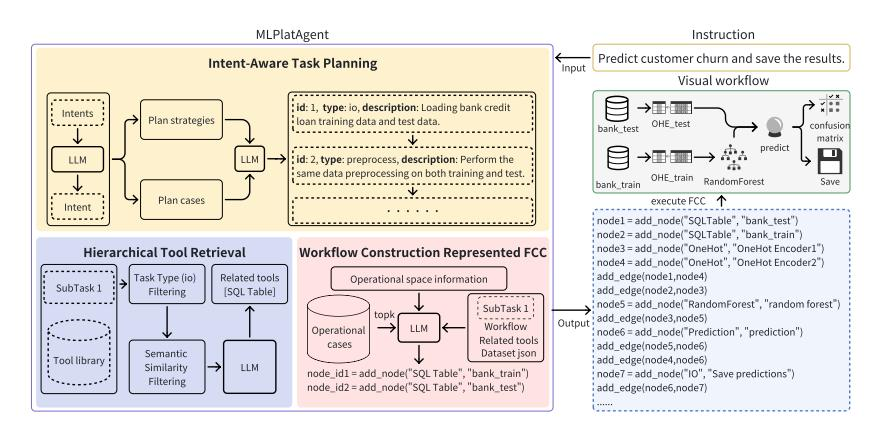
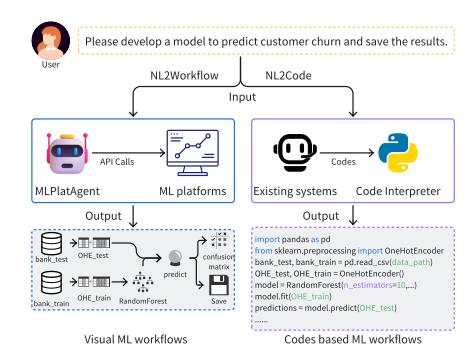
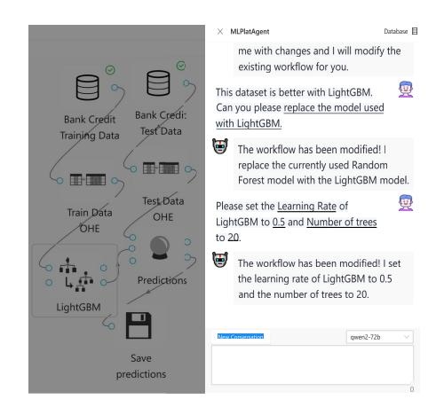
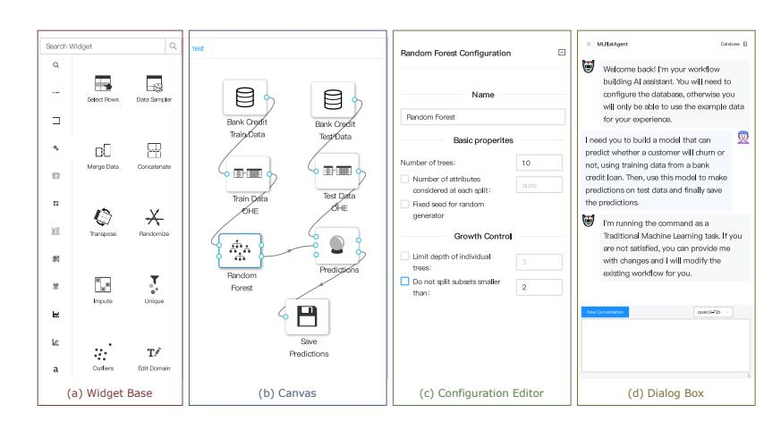

# A Large Language Model-based Agent for Automated Machine Learning Workflow Construction

Yutian Xu Guizhou University Guiyang, China gs.ytxu25@gzu.edu.cn

Yanhao Wang East China Normal University Shanghai, China yhwang@dase.ecnu.edu.cn

Hui Li∗ Guizhou University Guiyang, China cse.huili@gzu.edu.cn

Shengjie Xia Uniplore Co., Ltd. Guiyang, China xiasj@uniplore.io

Shengtian Min Uniplore Co., Ltd. Guiyang, China minst@uniplore.io

# Abstract

In this demonstration, we present MLPlatAgent, a large language model (LLM)-based agent that uses a natural language-to-workflow paradigm to take task descriptions as input and construct codefree visual workflows based on machine learning (ML) platforms. MLPlatAgent emphasizes intent-driven task planning, hierarchical tool retrieval, and workflow generation based on function calls to enhance the accuracy of task alignment, tool selection, and workflow construction, rather than improving the accuracy of ML code generation through reasoning or knowledge enhancement. We showcase two scenarios for the usability of MLPlatAgent in real-world applications. We also present preliminary experimental results to validate that MLPlatAgent outperforms existing LLM-based agents in satisfying user requirements and achieving higher ML model performance. A demo video is available at [https://youtu.be/aN-5xPOluyU.](https://youtu.be/aN-5xPOluyU)

# CCS Concepts

• Computing methodologies → Discourse, dialogue and pragmatics; Machine learning.

# Keywords

Agentic AI, Large Language Models (LLMs), Workflow Construction, Automated Machine Learning

#### ACM Reference Format:

Yutian Xu, Yanhao Wang, Hui Li, Shengjie Xia, and Shengtian Min. 2026. A Large Language Model-based Agent for Automated Machine Learning Workflow Construction. In Companion Proceedings of the ACM Web Conference 2026 (WWW Companion '26), April 13–17, 2026, Dubai, United Arab Emirates. ACM, New York, NY, USA, [4](#page-3-0) pages.<https://doi.org/10.1145/3774905.3793115>

## 1 Introduction

Recently, large language models (LLMs) have been widely used to build user-friendly agents to automatically perform different machine learning (ML) tasks [\[3\]](#page-3-1). They allow users to enter text

∗Corresponding author.

© 2026 Copyright held by the owner/author(s). ACM ISBN 979-8-4007-2308-7/2026/04 <https://doi.org/10.1145/3774905.3793115>

instructions that describe their requirements and prompt LLMs to generate executable code or workflows. Existing methods can generally be categorized into two classes. The first type focuses on the use of LLMs to automate a single ML stage (e.g., feature engineering [\[2\]](#page-3-2), hyperparameter optimization [\[5,](#page-3-3) [10\]](#page-3-4), and model selection [\[1,](#page-3-5) [3\]](#page-3-1)), which reduces human effort yet does not generate complete ML workflows without additional manual operations. The second type relies mainly on a scheme that translates task descriptions into executable code to complete ML tasks (i.e., NL2Code) [\[6,](#page-3-6) [8\]](#page-3-7). Such an NL2Code paradigm suffers from two inherent limitations. First, they show very limited task fulfillment and adaptability. LLMs often generate code that only partially fulfills user requirements or fails to capture nuanced task intents. Moreover, the generated workflows cannot be iteratively modified or extended based on user feedback, restricting users from refining or optimizing ML tasks. Second, their workflows are often low in usability and reusability. Due to hallucination issues [\[12\]](#page-3-8), the code generated by existing NL2Code methods may contain errors or bugs; users without programming proficiency find it difficult to review or correct the code. This further hinders their adoption in real-world scenarios.

In practice, an automated ML system should be capable of constructing workflows on demand, supporting both end-to-end generation and independent execution of individual steps. Furthermore, the constructed ML workflows can be easily reviewed and modified by users with limited or even no programming skills. To achieve these requirements, integrating LLM-based agents with ML platforms, e.g., RapidMiner [\(https://altair.com/altair-rapidminer\)](https://altair.com/altair-rapidminer), and KNIME [\(https://www.knime.com/\)](https://www.knime.com/) becomes a viable approach to automating the ML process. As shown in [Figure 1,](#page-1-0) ML platforms can generate visual ML workflows as flowcharts that users can review or edit. In addition, ML platforms have implemented a collection of industrially validated, performance-optimized algorithmic tools. Enabling LLMs to learn how to invoke and configure these tools is more feasible than executing end-to-end NL2Code generation. Therefore, leveraging LLMs to operate ML platforms for workflow construction represents a more promising approach, referred to as the NL2Workflow paradigm. Nevertheless, it still faces the following key challenges:

- High Complexity of ML Task Planning: Planning strategies typically differ according to the various demands. For example, workflow modifications require planning based on historical records, whereas such information is irrelevant

[This work is licensed under a Creative Commons Attribution 4.0 International License.](https://creativecommons.org/licenses/by/4.0) WWW Companion '26, Dubai, United Arab Emirates.

Figure 1: Comparison of the NL2Code and

NL2Workflow paradigms. Figure 2: Overview of the MLPlatAgent framework.

when designing a new modeling task. Similarly, in modeling tasks, statistical ML approaches require explicit feature engineering, whereas deep neural network training is typically performed without it. Thus, unlike the predefined planning structures of existing methods, on-demand workflow construction requires flexibility to adapt to diverse user needs.

- Excessive Overhead for Workflow Construction: Operations of workflow construction, e.g., adding nodes and edges, can be abstracted as tool invocations. While LLMbased reasoning frameworks, such as ReAct [\[9\]](#page-3-9), support tool calling, their sequential execution mechanisms often incur high overheads. The function call feature offered by recent LLMs [\[4\]](#page-3-10) has enabled parallel tool invocation. However, in ML workflows, multiple operations often exhibit sequential dependencies, which means that the input parameters of subsequent steps depend on the results of previous steps. As a result, the LLM lacks contextual information when planning parallel tool calls. Consequently, existing methods are generally limited to either sequential tool invocation or parallel calls without dependency constraints. There remains a lack of practical approaches capable of handling parallel tool invocations with complex dependencies.

To address these challenges, we propose MLPlatAgent, which leverages LLM-based agents integrated with ML platforms to automatically construct workflows for solving complex ML tasks. Specifically, we develop an intent-aware task planning strategy to reduce its complexity. It adaptively decomposes user requests based on their intent types and generates a structured list of subtasks. Subsequently, to reduce the overhead of workflow construction, we introduce a method based on function call code. Using code variables to propagate intermediate results between tool calls enables parallel orchestration of operations even under sequential dependencies, significantly reducing the number of LLM invocations and token consumption. Finally, we demonstrate the practicality of MLPlatAgent and verify its effectiveness in the experiments.

# 2 MLPlatAgent Overview

As shown in [Figure 2,](#page-1-0) MLPlatAgent consists of three components: 1) Intent-aware task planning that uses the LLM to parse the

task description into one of the four intent types, decompose it into a subtask list based on different intents, and determine the execution order; 2) hierarchical tool retrieval that leverages the LLM to assign appropriate tools to subtasks based on task type and tool description on the ML platform; and 3) FCC-based workflow construction that invokes the LLM to plan the operations required to build the workflow by generating the function call code. Finally, it performs the generated operations to obtain a visual flowchart on the ML platform. Next, we will introduce the design of each module in the MLPlatAgent framework.

Intent-aware Task Planning: MLPlatAgent decomposes an ML task into smaller subtasks, allowing it to focus on each easier subtask and thereby enhancing the accuracy of workflow generation. In addition, task decomposition facilitates subsequent widget retrieval based on subtask types. Since different types of tasks have their particular task decomposition strategies, after receiving the input text from a user, MLPlatAgent first prompts the LLM to classify the instruction into one of the following four intentions: (1) traditional machine learning, i.e., support vector machines, random forests, and logistic regression for tabular or time-series data prediction; (2) deep learning, i.e., image classification, object detection, text classification, and machine translation; (3) modification, i.e., instructions to modify an existing workflow; and (4) others including all instructions irrelevant to ML. Then, it prompts the LLM to decompose user instructions into a list of subtasks. The prompt consists primarily of four parts: current workflow information, user instruction, type of intent, and task decomposition strategy, which is decided by the type of intention.

Hierarchical Tool Retrieval Mechanism: Given the vast number of widgets on the ML platform and the limit on context length, MLPlatAgent cannot directly feed all widget information to the LLM for widget retrieval. Alternatively, it retrieves widgets relevant to each subtask after performing task decomposition. In particular, widget retrieval involves a stepwise filtering process across three stages: task-type filtering, semantic-similarity filtering, and LLMbased selection.

FCC-based Workflow Construction: After acquiring the tools for the current subtask, we need to generate a sequence of operations to complete it. Each operation can be regarded as a call to a tool to

Figure 3: Illustration of the user interface and basic functionality of Uniplore.

Figure 4: Workflow Modification Based on User Feedback.

complete a specific action, thereby transforming the problem into a tool invocation. However, existing tool learning methods based on prompt engineering suffer from excessive token consumption. To address this issue, we introduce a function call code (FCC) to represent tool invocations, allowing the LLM to obtain the results of previous tool calls by defining code variables. It first instructs the LLM to generate the function call code required to complete the subtask and subsequently translates it into API calls on the platform, thereby completing the workflow construction. With informative prompts, the LLM automatically analyzes current workflow status and data information and performs appropriate operations, such as node addition and deletion, edge addition and deletion, and node parameter updates based on user instructions.

#### 3 System Demonstration

In this section, we demonstrate the integration between MLPlatAgent and the Uniplore ML platform [\(https://docs.uniplore.com\)](https://docs.uniplore.com). We will introduce the user interface and demonstrate Uniplore's usability in two scenarios.

User Interface: As shown in [Figure 3,](#page-2-0) the integrated platform interface can be divided into the following areas:

a) Widget Base: A comprehensive collection of widgets, organized into two hierarchies by their types of functionalities, such as data access, data processing, machine learning model, and visualization. Users should select the appropriate widgets from the widget base and add them as nodes in the workflow.

b) Canvas: The area designated to create and visualize the ML workflow. It allows users or agents to create nodes and edges in a drag-and-drop manner or via APIs to build the workflow and visualize it in real time using a flowchart.

c) Configuration Editor: When the user clicks on a node on the canvas, the editor displays the configurable parameters and attributes of the node, such as name, dataset path, and parameters.

d) Dialog Box: Users can manually build workflows in the aforementioned workspaces. Additionally, if users want to automate the process, they can chat with MLPlatAgent by entering textual instructions in the dialog box. Then, MLPlatAgent can construct and adjust workflows based on user instructions.

Table 1: Performance evaluation of ML workflow construction with different LLM-based agents. The best and secondbest results are highlighted in bold and underlined fonts.

| Method           |          | RCR  | ↑      | AMR ↓ | Cost ↓  | Time  | ↓   |
|------------------|----------|------|--------|-------|---------|-------|-----|
| TaskWeaver       | [6]      | 0.76 | ± 0.17 | 2.98  | \$2.35  | 4.87  | min |
| Data Interpreter | [3]      | 0.70 | ± 0.21 | 2.80  | \$1.45  | 2.56  | min |
| DS-Agent         | [1]      | 0.43 | ± 0.25 | 3.79  | \$1.98  | 25.18 | min |
| AutoML-Agent     | [8]      | 0.47 | ± 0.25 | 3.68  | \$3.45  | 38.41 | min |
| MLPlatAgent      | (* Ours) | 0.88 | ± 0.06 | 2.57  | \$ 0.81 | 4.75  | min |

Scenario 1: Automated Workflow Construction Based on User Instructions. We show how Uniplore automates the workflow construction process for an exemplar ML task. As shown in [Figure 3,](#page-2-0) the user first describes the ML task in the dialog box; Uniplore then invokes MLPlatAgent, driven by Qwen2-72B, to automatically complete the workflow based on the task description.

Scenario 2: Workflow Modification Based on User Feedback. We observe that the workflows generated by Uniplore do not always fully meet the user requirements. Thus, we consider optimizing the workflow in the first scenario based on user feedback. As shown in [Figure 4,](#page-2-0) LightGBM may be a more appropriate model to predict customer churn risk. The user instructs MLPlatAgent to modify the workflow by replacing Random Forest with LightGBM and updating the hyperparameters.

#### 4 Preliminary Experiments

We perform some preliminary experiments to evaluate the performance of MLPlatAgent. In the experiments, we conducted five trials for each instruction. We selected Qwen2.5-72B-Instruct [\[4\]](#page-3-10) as the default LLMs, with the temperature parameter set to 0.

Datasets. The two existing benchmark datasets that we use are ML-Benchmark [\[3\]](#page-3-1) and DSEval-Kaggle [\[11\]](#page-3-11). We used all eight tasks in the ML-Benchmark. Since DSEval-Kaggle contains some computational and open-ended question-answering tasks, we excluded them and used the remaining ten ML tasks.

Table 2: Performance of FCC in MLPlatAgent with other tool learning methods.

| Method            | RCR ↑        | Cost ↓   |
|-------------------|--------------|----------|
| ReAct [9]         | 0.717 ± 0.06 | \$1.805  |
| Function Call [4] | 0.660 ± 0.11 | \$1.919  |
| DFSDT [7]         | 0.798 ± 0.03 | \$2.216  |
| FCC (MLPlatAgent) | 0.878 ± 0.06 | \$ 0.809 |

Table 3: Ablation results on MLPlatAgent. "w/o planning" indicates the removal of the task planning module; "w/o Tool retrieval" signifies the removal of the tool retrieval module; "workflow construction" denotes that only the operation sequence generation module is retained.

| Method                | RCR ↑        | Cost ↓   |
|-----------------------|--------------|----------|
| w/o planning          | 0.458 ± 0.11 | \$ 0.407 |
| w/o tool retrieval    | 0.708 ± 0.12 | \$34.420 |
| workflow construction | 0.762 ± 0.07 | \$0.681  |
| Full (MLPlatAgent)    | 0.878 ± 0.06 | \$0.809  |

Evaluation Metrics. We used the following three evaluation metrics: i) Requirement Coverage Ratio (RCR): First, each task description is manually decomposed into �� requirements. After creating a workflow, we check whether each requirement is met and use a score ���� (0 for not satisfied and 1 for satisfied) to denote the status of the ��-th requirement. Then, the RCR is calculated to quantify the degree to which the workflow meets the task's requirements, i.e., RCR = �� ��=1 ���� ; ii) Average Mean Rank (AMR): Differences in units and numerical ranges of various metrics (e.g., F1 and RMSE) can lead to inconsistent comparisons. For a fair comparison, we use the relative ranking of model performance across methods. The mean rank MR���� is the average rank achieved by the ��-th method for the ��-th task. AMR�� denotes the average mean rank for all �� tasks, i.e., AMR�� = �� �� ��=1 MR���� ; iii) Cost & Time: We compute

the average token cost and the average running time per task. Results. We have the following observations from the results. First, as shown in [Table 1,](#page-2-1) MLPlatAgent achieves the best performance while maintaining a relatively high efficiency. It achieved an RCR of 0.88, surpassing all baselines, which we attribute to its intent-aware task planning strategy. This strategy adaptively selects a planning strategy based on the user's specific intent, ensuring the plans remain aligned with the user's needs. MLPlatAgent also exceeded all baselines for AMR because invoking performance-optimization tools on the ML platform yields better model performance compared to the original code and parameters generated by LLMs. Second, as shown in [Table 2,](#page-3-13) the token consumption of existing tool learning methods is more than double that of FCC, and this indicates that generating operation sequences through the function call code can significantly reduce token consumption, as it can complete multiple workflow construction operations in a single call. Third, as shown in [Table 3,](#page-3-14) MLPlatAgent outperforms directly constructing workflows based on prompts with LLMs; the task planning removal leads

to significant RCR degradation, and the tool retrieval is removed, resulting in a sharp increase in resource overhead.

#### 5 Conclusion

This paper presents an LLM-based agent, MLPlatAgent, for automated workflow construction. MLPlatAgent introduced an intentdriven task decomposition strategy to address the high complexity of task planning in on-demand workflow construction. Then, we devised a hierarchical tool retrieval mechanism with improved accuracy. Furthermore, we designed a workflow construction method based on function call code, significantly reducing resource consumption. The effectiveness and efficiency of MLPlatAgent have been validated through preliminary experiments.

## Acknowledgments

This work was supported by the National Natural Science Foundation of China (No. 61562010), National Key Research and Development Program of China (No. 2023YFC3341205), Guizhou Provincial Major Scientific and Technological Program (No. [2024]003), Guizhou Provincial Program on Commercialization of Scientific and Technological Achievements (No. [2025]008, No. [2023]010), Research Projects of the Science and Technology Plan of Guizhou Province (No. [2023]276).

#### References

[1] Siyuan Guo, Cheng Deng, Ying Wen, Hechang Chen, Yi Chang, and Jun Wang. 2024. DS-Agent: Automated Data Science by Empowering Large Language Models with Case-Based Reasoning. In Proceedings of the Forty-first International Conference on Machine Learning. 16813–16848. [2] Noah Hollmann, Samuel Müller, and Frank Hutter. 2023. Large Language Models for Automated Data Science: Introducing CAAFE for Context-Aware Automated Feature Engineering. Adv. Neural Inf. Process. Syst. 36 (2023), 44753–44775. [3] Sirui Hong, Yizhang Lin, Bang Liu, Bangbang Liu, Binhao Wu, Ceyao Zhang, Danyang Li, Jiaqi Chen, Jiayi Zhang, Jinlin Wang, et al. 2025. Data Interpreter: An LLM Agent for Data Science. In Proceedings of the Eighteenth Findings of the Association for Computational Linguistics. 19796–19821. [4] Binyuan Hui, Jian Yang, Zeyu Cui, Jiaxi Yang, Dayiheng Liu, Lei Zhang, Tianyu Liu, Jiajun Zhang, Bowen Yu, Kai Dang, et al. 2024. Qwen2.5-Coder Technical Report. arXiv:2409.12186 (2024). [5] Tennison Liu, Nicolás Astorga, Nabeel Seedat, and Mihaela van der Schaar. 2024. Large Language Models to Enhance Bayesian Optimization. In Proceedings of the Twelfth International Conference on Learning Representations. 1–33. [6] Bo Qiao, Liqun Li, Xu Zhang, Shilin He, Yu Kang, Chaoyun Zhang, Fangkai Yang, Hang Dong, Jue Zhang, Lu Wang, et al. 2023. TaskWeaver: A Code-First Agent Framework. arXiv:2311.17541 (2023). [7] Yujia Qin, Shihao Liang, Yining Ye, Kunlun Zhu, Lan Yan, Yaxi Lu, Yankai Lin, Xin Cong, Xiangru Tang, Bill Qian, et al. 2024. ToolLLM: Facilitating Large Language Models to Master 16000+ Real-world APIs. In Proceedings of the Twelfth International Conference on Learning Representations. 1–23. [8] Patara Trirat, Wonyong Jeong, and Sung Ju Hwang. 2025. AutoML-Agent: A Multi-Agent LLM Framework for Full-Pipeline AutoML. In Proceedings of the 42nd International Conference on Machine Learning. 60099–60146. [9] Shunyu Yao, Jeffrey Zhao, Dian Yu, Nan Du, Izhak Shafran, Karthik R. Narasimhan, and Yuan Cao. 2023. ReAct: Synergizing Reasoning and Acting in Language Models. In Proceedings of the Eleventh International Conference on Learning Representations. 1–33. [10] Lei Zhang, Yuge Zhang, Kan Ren, Dongsheng Li, and Yuqing Yang. 2024. MLCopilot: Unleashing the Power of Large Language Models in Solving Machine Learning Tasks. In Proceedings of the Eighteenth Conference of the European Chapter of the Association for Computational Linguistics (Volume 1: Long Papers). 2931–2959. [11] Yuge Zhang, Qiyang Jiang, XingyuHan XingyuHan, Nan Chen, Yuqing Yang, and Kan Ren. 2024. Benchmarking Data Science Agents. In Proceedings of the Sixtysecond Annual Meeting of the Association for Computational Linguistics (Volume 1: Long Papers). 5677–5700. [12] Ziyao Zhang, Chong Wang, Yanlin Wang, Ensheng Shi, Yuchi Ma, Wanjun Zhong, Jiachi Chen, Mingzhi Mao, and Zibin Zheng. 2025. LLM Hallucinations in Practical Code Generation: Phenomena, Mechanism, and Mitigation. Proc. ACM Softw. Eng. 2, ISSTA (2025), 481–503.