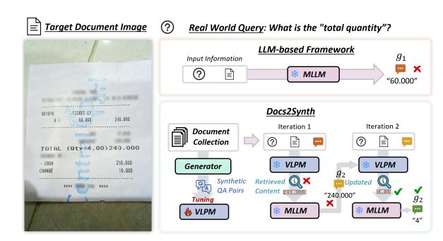
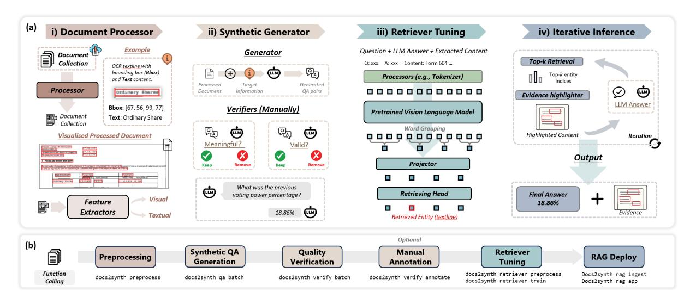
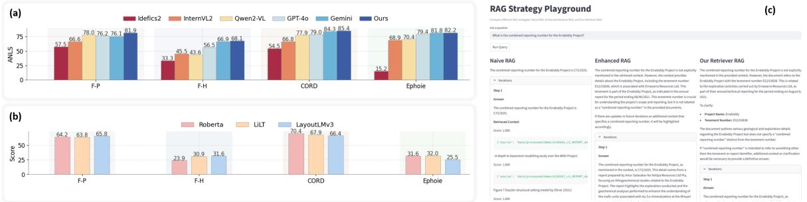

# Docs2Synth: A Synthetic Data Trained Retriever Framework for Scanned Visually Rich Documents Understanding

Yihao Ding1\*, Qiang Sun1\*, Puzhen Wu2 , Sirui Li3 , Siwen Luo1 , Wei Liu1†

1University of Western Australia, 2The University of Hong Kong, 3Murdoch University

{yihao.ding,pascal.sun,siwen.luo,wei.liu}@uwa.edu.au,

puzhenwu8@connect.hku.hk, sirui.li@murdoch.edu.au

### Abstract

Document understanding (VRDU) in regulated domains is particularly challenging, since scanned documents often contain sensitive, evolving, and domain specific knowledge. This leads to two major challenges: the lack of manual annotations for model adaptation and the difficulty for pretrained models to stay up-todate with domain-specific facts. While Multimodal Large Language Models (MLLMs) show strong zero-shot abilities, they still suffer from hallucination and limited domain grounding. In contrast, discriminative Vision-Language Pre-trained Models (VLPMs) provide reliable grounding but require costly annotations to cover new domains. We introduce Docs2Synth, a synthetic-supervision framework that enables retrieval-guided inference for private and low-resource domains. Docs2Synth automatically processes raw document collections, generates and verifies diverse QA pairs via an agent-based system, and trains a lightweight visual retriever to extract domainrelevant evidence. During inference, the retriever collaborates with an MLLM through an iterative retrieval–generation loop, reducing hallucination and improving response consistency. We further deliver Docs2Synth as an easy-to-use Python package, enabling plugand-play deployment across diverse real-world scenarios. Experiments on multiple VRDU benchmarks show that Docs2Synth substantially enhances grounding and domain generalization without requiring human annotations. Our open-source implementation is available at: [https://docs2synth.ai4wa.](https://docs2synth.ai4wa.com) [com](https://docs2synth.ai4wa.com), and the demonstration video is available at [https://docs2synth.ai4wa.com/](https://docs2synth.ai4wa.com/video) [video](https://docs2synth.ai4wa.com/video).

# 1 Introduction

The demand for automatic information extraction from visually rich documents has grown rapidly

Figure 1: Typical MLLM-based VRDU and Docs2Synth.

across diverse domains, including finance [\(Ding](#page-4-0) [et al.,](#page-4-0) [2023\)](#page-4-0), retail [\(Park et al.,](#page-4-1) [2019\)](#page-4-1), and politics [\(Wang et al.,](#page-4-2) [2023\)](#page-4-2). Multimodal Large Language Models (MLLMs) [\(Luo et al.,](#page-4-3) [2024;](#page-4-3) [Team](#page-4-4) [et al.,](#page-4-4) [2024\)](#page-4-4) have been widely explored to meet this need, demonstrating promising performance and being applied in practice. However, applying these generative frameworks to knowledgeintensive tasks remains challenging due to issues such as hallucination and insufficient grounding [\(Nourbakhsh et al.,](#page-4-5) [2024\)](#page-4-5). These challenges are further exacerbated in scanned documents—such as handwritten forms and invoices—which introduce additional complexities due to Optical Character Recognition (OCR) inaccuracies, document skew or rotation, and handwriting variability.

In recent years, layout-aware Vision–Language Pre-trained Models (VLPMs) [\(Huang et al.,](#page-4-6) [2022;](#page-4-6) [Bai et al.,](#page-4-7) [2022\)](#page-4-7), have achieved promising performance in key information extraction (KIE) when fine-tuned on carefully curated, taskspecific datasets. However, the practicality of these discriminative models is limited in realworld settings, where high-quality annotations are scarce—particularly for new, domain-specific document collections. To overcome this annotation bottleneck, recent efforts have turned to synthetic data generated by MLLMs [\(Liu et al.,](#page-4-8) [2024;](#page-4-8) [Hu](#page-4-9)

\*Equally contributed.

†Corresponding author.

Figure 2: Design overview of the Docs2Synth framework. (a) Backend architecture. (b) End-to-end data flow and function execution pipeline.

[et al.,](#page-4-9) [2024b\)](#page-4-9), which can automatically produce diverse instruction–response pairs to enhance model generalization and instruction-following capabilities. A recent study [\(Ding et al.,](#page-4-10) [2025\)](#page-4-10) suggests that such synthetic corpora can support the domain adaptation of VLPMs under few-shot scenarios. Some VRDU-oriented MLLMs have also constructed large-scale synthetic datasets for selfsupervised pretraining [\(Feng et al.,](#page-4-11) [2024\)](#page-4-11) and instruction-tuning [\(Hu et al.,](#page-4-12) [2024a\)](#page-4-12). Nonetheless, a significant gap remains in understanding: (1) the effectiveness of fine-tuning lightweight discriminative VLPMs on large-scale, synthetic, domainspecific corpora to handle newly scanned documents without manual annotations, and (2) the potential of fine-tuned models in supporting or enhancing stronger MLLMs during inference.

In this paper, we address the challenge of adapting VRDU systems to new, privately scanned documents without manual annotations. We design a retrieval-guided paradigm in which a lightweight visual retriever is first adapted to the new domain through adaptive tuning, and then used to ground MLLM responses during inference, improving reliability in knowledge-intensive queries.

# Our contributions are as follows:

i) We propose Docs2Synth, a novel framework that automatically digests new document collections, generates high-quality synthetic QA pairs, and trains a domain-adapted visual retriever to support retrieval-guided iterative MLLM inference, ensuring reliable and well-grounded responses in private and low-resource domains.

ii) We provide Docs2Synth as an easy-to-use

*open source Python package* that automates data processing, synthetic corpus creation, retriever training, and retrieval-enhanced inference, enabling scalable and practical deployment of MLLM-based VRDU across diverse real-world domains.

# 2 Docs2Synth Framework

*i) Document Processor.* Given a new document collection D, each document image d ∈ D is processed by an OCR tool P to extract a set of semantic entities L = P(d) = {l1, . . . , ln}, where each entity li is a pair (ci , bi) consisting of text content ci and its bounding box bi . Using XY-cut reading order methods, the full document text is aggregated as T and corresponding bounding box list B. The entities are then passed through pretrained language and vision backbones to obtain textual features ET = {Et1 , . . . , Etn } and visual features EV = {Ev1 , . . . , Evn }.

*ii) Synthetic QA Generator.* To reduce manual annotation efforts, we employ a MLLM G to create synthetic question-answer (QA) pairs based on the extracted entity set L. For each entity li ∈ L, we prompt G to generate a question qi such that the answer is ci : G(ci , d) → qi . For example, given the context "*Ordinary Shares*" in document D, G may generate the question "*What is the type of shares listed in the document?"*. To ensure the quality of the QA pairs, we allow the MLLM to act as a verifier by (1) evaluating the relevance and clarity of the generated question qi , and (2) confirming whether ci is a valid answer to qi . Each document image yields a QA pair set P = (Q, C), where Q = {q1, . . . , qm} and C = {c1, . . . , cm} are the generated questions and corresponding answers, with m as an adjustable parameter.

*iii) Retriever Tuning.* To train a high-quality retriever, we fine-tune a layout-aware pretrained VRDU model R using synthetic QA pairs. Each training sample consists of a question qi , its corresponding document image d, full text content T, bounding box list B, entity-level features ET and EV , and an initial answer prediction ai generated by a MLLM. The retriever aims to identify the correct answer entity li from the candidate set L = l1, . . . , ln by predicting its index. Formally, R learns a scoring function :

R(qi , D, T, B, ai , ET , EV ) → yˆi ∈ {1, . . . , n},

, where yˆi is the predicted index of the answer entity, and the model is trained by minimizing the cross-entropy loss between yˆi and the ground-truth index yi corresponding to the true answer content ci .

*iv) Iterative Inference.* At each iteration step t, the model predicts a set of top-k entity indices, denoted by, Yˆ t i = {i1, . . . , ik}. Using these indices, we collect the corresponding text contents to form the retrieved content set, C t i = {cj | j ∈ Yˆ t i }, where each cj is the text content of entity lj ∈ L. To visually emphasize the selected entities, their bounding boxes are highlighted in red on the document image, resulting in a modified image D′ .

The multimodal LLM F then takes as input the question qi , updated document image D′ , full text T, and the retrieved content C t i , and generates an updated answer a t i :

F(qi , D′ , T, Ct i ) → a t i . (1)

This predicted answer is used to refine the next set of top-k entity predictions via the retriever R:

Yˆ t+1 i = R(qi , D, T, B, at i , ET , EV ), (2) |Yˆ t+1 i | = k, Yˆ t+1 i ⊆ L. (3)

The process continues iteratively. Both the number of retrieved entities k and the total number of iterations can be specified by the user. The top-k entities are selected based on the logits produced by the retriever model.

# 3 Evaluation

# 4 Docs2Synth Implementation

a modular, extendable, and production-ready Python package. It enables a fully automated pipeline from document ingestion to retrievalguided inference, supported by the following components:

i) Preprocessing: Multiple OCR backends (Docling [1](#page-2-0) , PaddleOCR[2](#page-2-1) , etc) are supported to extract text and layout from both scanned and digitallygenerated documents. Additional OCR engines can be seamlessly integrated.

ii) Agent Wrapper: A unified interface abstracts different LLM providers, allowing smooth switching between proprietary APIs (OpenAI, Gemini, QwenVL) and local inference providers (Ollama, vLLM, HuggingFace). This design ensures scalability and extensibility to future providers while supporting deployment in privacy-sensitive environments.

iii) Synthetic generator: High-quality synthetic QA pairs are generated and verified through LLMdriven agents. An optional lightweight human annotation interface further refines and supervises the generation process, improving reliability for private domains.

iv) Retriever Tuning: Verified QA data is automatically transformed into training sets for lightweight VLPM retrievers. One-command training, validation, and packaging enable efficient domain adaptation.

v) Retrieval-Augmented Inference: During deployment, the retriever collaborates with an MLLM under an iterative retrieval-generation strategy to ensure grounded and trustworthy responses. We also support simple RAG baselines and provide a side-by-side interface for comparing and customizing retrieval strategies, enabling users to further enhance performance.

All components are configured through a single config.yml, and the entire workflow—from preprocessing to production-ready inference—can be executed with a unified command (e.g., docs2synth run). This design ensures practical adoption in real-world systems while preserving flexibility for research and development. The system is lightweight in computation. With proprietary LLM APIs, only retriever training requires moderate resources and can run on CPU. Fully local deployment requires a GPU for inference; our

1[https://github.com/docling-project/](https://github.com/docling-project/docling) [docling](https://github.com/docling-project/docling)

2[https://github.com/PaddlePaddle/](https://github.com/PaddlePaddle/PaddleOCR) [PaddleOCR](https://github.com/PaddlePaddle/PaddleOCR)

Figure 3: Quantitative results and frontend examples.

experiments on an RTX 5090 (32 GB) show that the system remains feasible even with limited onpremise GPU capacity.

#### 4.1 Setup

Datasets Several benchmark datasets support key information extraction in scanned documents. Form-NLU [\(Ding et al.,](#page-4-0) [2023\)](#page-4-0) targets financial forms with printed and handwritten formats, extracting 12 key fields like "Substantial Holder Name." CORD [\(Park et al.,](#page-4-1) [2019\)](#page-4-1) focuses on receipts, identifying fine-grained data such as "store name". Ephoie [\(Wang et al.,](#page-4-13) [2021\)](#page-4-13) handles scanned Chinese exam headers with handwritten elements, extracting fields like "Score" and "Student Name." Implementation Details Our system supports flexible document parsing and encoding configurations, and we release all tools and checkpoints used to produce the results in Section [4.2.](#page-3-0) By default, PaddleOCR is used to extract text and bounding boxes We benchmark against strong open-source (Qwen2- VL [\(Wang et al.,](#page-4-14) [2024\)](#page-4-14), Idefics2 [\(Laurençon et al.,](#page-4-15) [2024\)](#page-4-15), InternVL2 [\(Chen et al.,](#page-4-16) [2024\)](#page-4-16)) and proprietary MLLMs (GPT-4o [\(OpenAI,](#page-4-17) [2024\)](#page-4-17), Gemini 1.5 [\(Team et al.,](#page-4-4) [2024\)](#page-4-4)), all evaluated under their default HuggingFace inference settings. For optional warmer tuning, we use a batch size of 16, a learning rate of 2 × 10−5 , and AdamW as the optimizer.

### 4.2 Backend Performance

To demonstrate the system's improved performance, we evaluate its effectiveness and generalizability across three benchmark datasets spanning multiple domains in Figure [3.](#page-3-1)

Overall Performance. As shown in Figure [3](#page-3-1) (a), the system equipped with a syntheticdata–tuned retriever consistently outperforms the best-performing MLLM across various scenarios. The improvement is particularly notable on the

FormNLU-printed (F-P) set, likely due to the higher fidelity of the generated synthetic samples, which better capture the visual and structural characteristics of the printed domain.

Retriever Performance. We further present the performance of the synthetic-data–tuned retriever in Figure [3](#page-3-1) (b). Overall, the tuned retriever achieves solid and reliable performance. While occasional retrieval errors remain, the consistent improvement highlights the value of incorporating synthetic data to enhance retrieval quality and downstream task accuracy. With ongoing advances in document parsing and data synthesis technologies, we expect the retriever to deliver even greater benefits for future document understanding tasks.

Qualitative Example. We provide a qualitative case study in Figure [3](#page-3-1) (c) to illustrate how iterative tuning enhances both MLLM and retriever performance. Initially, the MLLM produces an incomplete student name. However, once the retriever supplies more focused and relevant content as supplementary context, the MLLM is able to generate the correct prediction. This example demonstrates the bidirectional flow of information between the MLLM and the retriever, highlighting how iterative refinement leads to mutual performance improvements.

# 5 Conclusion

We introduce a unified framework that leverages synthetic data to adaptively fine tune a domainadapted multimodal retriever, which in turn iteratively enhances LLM inference quality on VRDU. In particular, we provide a fully packaged Python library that allows users to automatically execute the entire pipeline with minimal configuration. Experimental results demonstrate that our syntheticdata–driven adaptation strategy consistently improves downstream performance across various domains. These findings highlight the robustness,

practicality, and effectiveness of the proposed approach, offering a generalizable pathway for boostdocument-centric applications. References Haoli Bai, Zhiguang Liu, Xiaojun Meng, Wentao Li, Shuang Liu, Nian Xie, Rongfu Zheng, Liangwei Wang, Lu Hou, Jiansheng Wei, and 1 others. 2022. [Wukong-reader: Multi-modal pre-training for fine](https://doi.org/10.18653/v1/2023.acl-long.748)[grained visual document understanding.](https://doi.org/10.18653/v1/2023.acl-long.748) In *Proceedings of the 61st Annual Meeting of the Association for Computational Linguistics (Volume 1: Long Papers), ACL 2023, Toronto, Canada, July 9-14, 2023*. Association for Computational Linguistics. Zhe Chen, Jiannan Wu, Wenhai Wang, Weijie Su, Guo Chen, Sen Xing, Muyan Zhong, Qinglong Zhang, Xizhou Zhu, Lewei Lu, and 1 others. 2024. [Internvl:](https://doi.org/10.48550/arXiv.2312.14238) [Scaling up vision foundation models and aligning](https://doi.org/10.48550/arXiv.2312.14238) [for generic visual-linguistic tasks.](https://doi.org/10.48550/arXiv.2312.14238) In *Proceedings of the IEEE/CVF Conference on Computer Vision and Pattern Recognition*, pages 24185–24198. Yihao Ding, Soyeon Caren Han, Zechuan Li, and Hyunsuk Chung. 2025. Synjac: Synthetic-data-driven joint-granular adaptation and calibration for domain specific scanned document key information extraction. *Information Fusion*, page 104074. Yihao Ding, Siqu Long, Jiabin Huang, Kaixuan Ren, Xingxiang Luo, Hyunsuk Chung, and Soyeon Caren Han. 2023. [Form-nlu: Dataset for the form natural](https://doi.org/10.1145/3539618.3591886) [language understanding.](https://doi.org/10.1145/3539618.3591886) In *Proceedings of the 46th International ACM SIGIR Conference on Research and Development in Information Retrieval*, pages 2807–2816. ACM. Hao Feng, Qi Liu, Hao Liu, Jingqun Tang, Wengang Zhou, Houqiang Li, and Can Huang. 2024. [Docpe](https://doi.org/10.48550/arXiv.2311.11810)[dia: Unleashing the power of large multimodal model](https://doi.org/10.48550/arXiv.2311.11810) [in the frequency domain for versatile document un](https://doi.org/10.48550/arXiv.2311.11810)[derstanding.](https://doi.org/10.48550/arXiv.2311.11810) *Science China Information Sciences*, 67(12):1–14. Anwen Hu, Haiyang Xu, Jiabo Ye, Ming Yan, Liang Zhang, Bo Zhang, Ji Zhang, Qin Jin, Fei Huang, and Jingren Zhou. 2024a. [mplug-docowl 1.5: Unified](https://aclanthology.org/2024.findings-emnlp.175) [structure learning for ocr-free document understand](https://aclanthology.org/2024.findings-emnlp.175)[ing.](https://aclanthology.org/2024.findings-emnlp.175) In *Findings of the Association for Computational Linguistics: EMNLP 2024*, pages 3096–3120. Association for Computational Linguistics. Anwen Hu, Haiyang Xu, Liang Zhang, Jiabo Ye, Ming Yan, Ji Zhang, Qin Jin, Fei Huang, and Jingren Zhou. 2024b. [mplug-docowl2: High-resolution compress](https://arxiv.org/abs/2409.03420)[ing for ocr-free multi-page document understanding.](https://arxiv.org/abs/2409.03420) *Preprint*, arXiv:2409.03420. Yupan Huang, Tengchao Lv, Lei Cui, Yutong Lu, and Furu Wei. 2022. [Layoutlmv3: Pre-training for doc](https://doi.org/10.1145/3503161.3548112)[ument ai with unified text and image masking.](https://doi.org/10.1145/3503161.3548112) In *Proceedings of the 30th ACM International Conference on Multimedia*, pages 4083–4091. ACM. Hugo Laurençon, Léo Tronchon, Matthieu Cord, and Victor Sanh. 2024. [What matters when building](http://papers.nips.cc/paper_files/paper/2024/hash/a03037317560b8c5f2fb4b6466d4c439-Abstract-Conference.html) [vision-language models?](http://papers.nips.cc/paper_files/paper/2024/hash/a03037317560b8c5f2fb4b6466d4c439-Abstract-Conference.html) In *Advances in Neural Information Processing Systems 38: Annual Conference on Neural Information Processing Systems 2024, NeurIPS 2024, Vancouver, BC, Canada, December 10 - 15, 2024*. Haotian Liu, Chunyuan Li, Yuheng Li, and Yong Jae Lee. 2024. [Improved baselines with visual instruc](https://doi.org/10.1109/CVPR52733.2024.02484)[tion tuning.](https://doi.org/10.1109/CVPR52733.2024.02484) In *Proceedings of the IEEE/CVF Conference on Computer Vision and Pattern Recognition*, pages 26296–26306. IEEE. Chuwei Luo, Yufan Shen, Zhaoqing Zhu, Qi Zheng, Zhi Yu, and Cong Yao. 2024. [Layoutllm: Layout](https://doi.org/10.1109/CVPR52733.2024.01480) [instruction tuning with large language models for](https://doi.org/10.1109/CVPR52733.2024.01480) [document understanding.](https://doi.org/10.1109/CVPR52733.2024.01480) In *IEEE/CVF Conference on Computer Vision and Pattern Recognition, CVPR 2024, Seattle, WA, USA, June 16-22, 2024*, pages 15630–15640. IEEE. Armineh Nourbakhsh, Sameena Shah, and Carolyn Rose. 2024. Towards a new research agenda for multimodal enterprise document understanding: What are we missing? *Findings of the Association for Computational Linguistics ACL 2024*, pages 14610– 14622. OpenAI. 2024. Hello gpt-4o. [https://openai.](https://openai.com/index/hello-gpt-4o/) [com/index/hello-gpt-4o/](https://openai.com/index/hello-gpt-4o/). Seunghyun Park, Seung Shin, Bado Lee, Junyeop Lee, Jaeheung Surh, Minjoon Seo, and Hwalsuk Lee. 2019. [Cord: a consolidated receipt dataset for post-ocr](https://openreview.net/pdf?id=SJl3z659UH) [parsing.](https://openreview.net/pdf?id=SJl3z659UH) In *Workshop on Document Intelligence at NeurIPS 2019*. Gemini Team, Petko Georgiev, Ving Ian Lei, Ryan Burnell, Libin Bai, and et al. 2024. [Gemini 1.5: Un](https://arxiv.org/abs/2403.05530)[locking multimodal understanding across millions of](https://arxiv.org/abs/2403.05530) [tokens of context.](https://arxiv.org/abs/2403.05530) *Preprint*, arXiv:2403.05530. Jiapeng Wang, Chongyu Liu, Lianwen Jin, Guozhi Tang, Jiaxin Zhang, Shuaitao Zhang, Qianying Wang, Yaqiang Wu, and Mingxiang Cai. 2021. [Towards](https://doi.org/10.1609/aaai.v35i4.16378) [robust visual information extraction in real world:](https://doi.org/10.1609/aaai.v35i4.16378) [New dataset and novel solution.](https://doi.org/10.1609/aaai.v35i4.16378) In *Proceedings of the AAAI Conference on Artificial Intelligence*, volume 35, pages 2738–2745. AAAI Press. Peng Wang, Shuai Bai, Sinan Tan, Shijie Wang, Zhihao Fan, Jinze Bai, Keqin Chen, Xuejing Liu, Jialin Wang, Wenbin Ge, Yang Fan, Kai Dang, Mengfei Du, Xuancheng Ren, Rui Men, Dayiheng Liu, Chang Zhou, Jingren Zhou, and Junyang Lin. 2024. [Qwen2](https://doi.org/10.48550/arXiv.2409.12191) [vl: Enhancing vision-language model's perception](https://doi.org/10.48550/arXiv.2409.12191) [of the world at any resolution.](https://doi.org/10.48550/arXiv.2409.12191) *arXiv preprint arXiv:2409.12191*. Zilong Wang, Yichao Zhou, Wei Wei, Chen-Yu Lee, and Sandeep Tata. 2023. [Vrdu: A benchmark for visually](https://doi.org/10.1145/3580305.3599929)[rich document understanding.](https://doi.org/10.1145/3580305.3599929) In *Proceedings of the*

ing multimodal LLM performance in real-world

*29th ACM SIGKDD Conference on Knowledge Discovery and Data Mining*, pages 5184–5193. ACM.