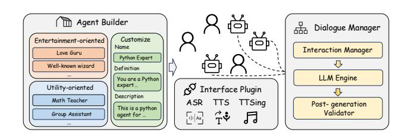
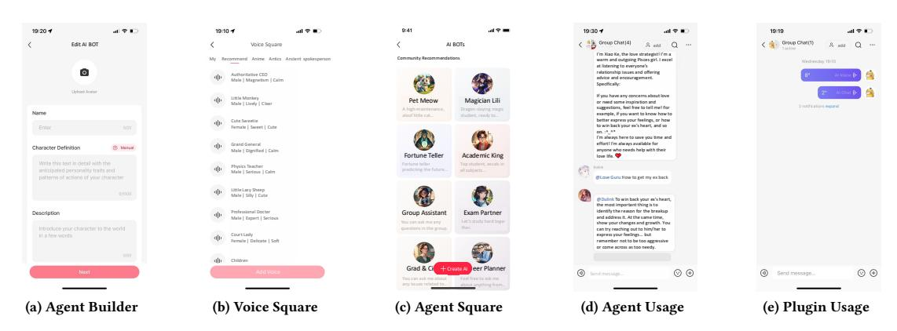
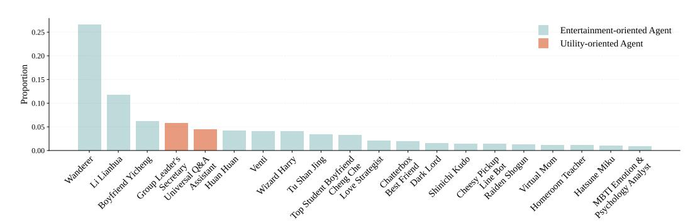

# GCAgent: Enhancing Group Chat Communication through Dialogue Agents System

Zijie Meng∗ Zhejiang University Hangzhou, China zijie.22@intl.zju.edu.cn

Zheyong Xie∗ Xiaohongshu Inc. Shanghai, China xiezheyong@xiaohongshu.com

Zheyu Ye Xiaohongshu Inc. Shanghai, China yezheyu@xiaohongshu.com

Chonggang Lu Xiaohongshu Inc. Shanghai, China luchonggang@xiaohongshu.com

Zuozhu Liu Zhejiang University Hangzhou, China zuozhuliu@intl.zju.edu.cn

Zihan Niu University of Science and Technology of China, Hefei, China niuzihan@mail.ustc.edu.cn

Yao Hu Xiaohongshu Inc. Shanghai, China xiahou@xiaohongshu.com

Shaosheng Cao† Xiaohongshu Inc. Shanghai, China caoshaosheng@xiaohongshu.com

# Abstract

As a key form in online social platforms, group chat is a popular space for interest exchange or problem-solving, but its effectiveness is often hindered by inactivity and management challenges. While recent large language models (LLMs) have powered impressive one-to-one conversational agents, their seamlessly integration into multi-participant conversations remains unexplored. To address this gap, we introduce GCAgent, an LLM-driven system for enhancing group chats communication with both entertainmentand utility-oriented dialogue agents. The system comprises three tightly integrated modules: Agent Builder, which customizes agents to align with users' interests; Dialogue Manager, which coordinates dialogue states and manage agent invocations; and Interface Plugins, which reduce interaction barriers by three distinct tools. Through extensive experiment, GCAgent achieved an average score of 4.68 across various criteria and was preferred in 51.04% of cases compared to its base model. Additionally, in real-world deployments over 350 days, it increased message volume by 28.80%, significantly improving group activity and engagement. Overall, this work presents a practical blueprint for extending LLM-based dialogue agent from one-party chats to multi-party group scenarios.

### CCS Concepts

• Computing methodologies → Discourse, dialogue and pragmatics; • Human-centered computing → Collaborative and social computing; • Information systems → Users and interactive retrieval.

∗Both authors contributed equally to this research. †Corresponding author.

[This work is licensed under a Creative Commons Attribution-NonCommercial-](https://creativecommons.org/licenses/by-nc-nd/4.0)[NoDerivatives 4.0 International License.](https://creativecommons.org/licenses/by-nc-nd/4.0)

WWW Companion '26, Dubai, United Arab Emirates © 2026 Copyright held by the owner/author(s). ACM ISBN 979-8-4007-2308-7/2026/04 <https://doi.org/10.1145/3774905.3793118>

# Keywords

Group chat, Dialogue agent, Large language model

#### ACM Reference Format:

Zijie Meng, Zheyong Xie, Zheyu Ye, Chonggang Lu, Zuozhu Liu, Zihan Niu, Yao Hu, and Shaosheng Cao. 2026. GCAgent: Enhancing Group Chat Communication through Dialogue Agents System. In Companion Proceedings of the ACM Web Conference 2026 (WWW Companion '26), April 13–17, 2026, Dubai, United Arab Emirates. ACM, New York, NY, USA, [4](#page-3-0) pages. <https://doi.org/10.1145/3774905.3793118>

# 1 Introduction

With the development of digital communication platforms, group chat has attracted significant attention due to its distinctive multiparticipant interactive nature [\[19,](#page-3-1) [22\]](#page-3-2). Unlike traditional one-toone communication, group chat facilitates diverse conversational content, ranging from interactions among acquaintances to communications with strangers. However, the lack of fresh and engaging content from partially or entirely silent members often leads to inactivity within the group chat [\[15\]](#page-3-3). Additionally, the complex composition of members results in management difficulties, significantly impacting the effectiveness of group chat as a platform for interest exchange or problem-solving [\[12,](#page-3-4) [16\]](#page-3-5).

As the rapid advancement of Large Language Models (LLMs) [\[7,](#page-3-6) [18\]](#page-3-7), the emergence of numerous dialogue agents built upon these models presents promising opportunities. However, mainstream AI agents from social platorms (such as Glow, Character AI, and My AI)[1](#page-0-0) and academic community [\[1,](#page-3-8) [13\]](#page-3-9) are still predominantly limited to two-party dialogue scenarios. Moreover, GIFT [\[5\]](#page-3-10) injects conversational graph edges into attention for multi-party understanding but with limited performance. MUCA [\[11\]](#page-3-11) brings LLM into group chats to decide what to say, when to respond and whom to answer, but without exploring post-training and deployment. Therefore, effectively integrating dialogue agents into real-world

1Glow: [https://glowconnect.org.uk,](https://glowconnect.org.uk) Character AI: [https://character.ai,](https://character.ai) My AI: [https:](https://my.ai.se) [//my.ai.se.](https://my.ai.se)

Figure 1: The overview of our GCAgent system.

group chat to enhance both content generation and operational assistance remains underexplored.

To address this gap, we propose GCAgent to enhance group chat communication through dialogue agents system, with a focus on delivering engaging content and supporting daily management, which is also defined as entertainment-oriented and utility-oriented. GCAgent system comprises three core components: Agent Builder, Dialogue Manager, and Interface Plugins. Specifically, the Agent Builder customizes agents according to personal interests. The Dialogue Manager coordinates the multi-party dialogue processes within group chats. Finally, the Interface Plugins facilitate smoother interaction through tools such as Automatic Speech Recognition (ASR) [\[23\]](#page-3-12), Text-to-Speech (TTS) [\[8\]](#page-3-13) and Text-to-Sing (TTSing) [\[6\]](#page-3-14), offering diverse communication modes to enhance user experience.

Through both offline and online evaluations, GCAgent achieved an average score of 4.68 across various evaluation criteria and a win rate of 51.04% compared to its base model. It has also demonstrated consistent improvements in group activity, new group creation, message readership and message volumes, especially increases 28.80% for message volumes. Furthermore, it has been deployed in real-world environments for over 350 days, providing exceptional service to numerous users. We also delivered a live demonstration on YouTube[2](#page-1-0) . Our contributions can be summarized as follows:

- We developed GCAgent encompassing Agent Builder, Dialogue Manager, and Interface Plugins, to enhance group chat communication.
- Through extensive evaluation, we demonstrate its effectiveness across various dimensions.
- GCAgent has been seamlessly integrated into real-world group chat environments over 350 days, providing users an improved conversational experiences.

# 2 Design and Implementation of System

# 2.1 Agent Builder

The Agent Builder is a powerful tool designed for customizing and creating group chat agent. As shown in Figures [2a](#page-2-0) and [2b,](#page-2-1) users can easily design agents by filling in the required fields and selecting a preferred voice style. Additionally, we provide a range of predefined agents, categorized into two primary types: entertainment-oriented and utility-oriented, as shown in Figure [2c.](#page-2-2) They encompass a broad spectrum of personality traits, thereby enhancing community engagement, fostering emotional connections, improving group interactions and addressing specific demands.

### 2.2 Dialogue Manager

The Dialogue Manager is composed of the Interaction Manager to manage dialogue states and agent invocations, the LLM Engine to generate natural, context-aware responses using LLMs, and the Post-generation Validator to ensure the quality and relevance of responses through automated checks and error corrections. They work together to ensure the stability of agent dialogue management and the high quality of generated responses.

Interaction Manager coordinates dialogue collection, agent invocation, and information recording to ensure coherent and personalized responses in group chat communication. Specifically, it tracks complex conversation threads by incorporating historical dialogue records, user behavior, and relevant contextual information. In multi-parity scenarios, as shown in Figure [2d,](#page-2-3) users can invoke specific agents by "@" tag, prompting their participation in group chat sessions. Additionally, the Interaction Manager monitors message sequencing, participant management, and session tracking to ensure orderly and effective interactions across all chat scenarios.

LLM Engine is the core component for understanding and generating responses. Our developed model builds upon Qwen2-7B-Instruct [\[18\]](#page-3-7) through fine-tuning using a vast corpus of real dialogue data, resulting in enhanced conversational abilities and better contextual adaptation.

Post-generation Validator ensures the agent's generated responses quality through automated checks. It corrects grammatical and semantic errors using advanced regular expressions and evaluation methods, and implements a retry mechanism to regenerate responses that fail to meet quality standards, ultimately enhancing content reliability and user satisfaction.

# 2.3 Interface Plugins

Plugins serve as essential tools that complement these agents by enabling specific functionalities and improving conversational transitions. We provide three distinct plugins: ASR [\[23\]](#page-3-12), TTS [\[8\]](#page-3-13), and TTSing [\[6\]](#page-3-14). The first two plugins facilitate seamless communication between users and dialogue agents through bidirectional conversion between speech and text. Meanwhile, TTSing provides both users and agents with the ability to convert text into songs, addressing entertainment demands during group conversations and significantly enhancing the overall user experience.

# 3 Experiments

# 3.1 Offline Evaluation

3.1.1 Experimental Setting. In the offline experiments, we compared GCAgent with its base model, Qwen2-7B-Instruct (Qwen) [\[18\]](#page-3-7). Specifically, we curated 36,569 anonymized group-chat samples, using 3,000 for testing and the remainder for fine-tuning. Each entry includes the role configuration of GCAgent, historical conversations, the most recent user message, and the corresponding LLMgenerated responses, all of which were manually validated. Then, we devised two methodologies: direct scoring and indirect comparison, and we adopted a GPT4o-based [\[7\]](#page-3-6) LLM-as-a-judge framework, which has a high correlation with human judgments [\[2,](#page-3-15) [4\]](#page-3-16), to balance quality and efficiency. In the direct scoring, we used four commonly adopted criteria: 1) Correctness [\[17,](#page-3-17) [21\]](#page-3-18): assessing whether

2<https://www.youtube.com/shorts/dsbQtNMqecc>

Figure 2: The user interface of GCAgent. And a brief live demonstration is available on [YouTube.](https://www.youtube.com/shorts/dsbQtNMqecc)

Table 1: Results of direct scoring in offline evaluation.

Table 2: Results of indirect comparison in offline evaluation.

the model accurately comprehends user intent and provides correct solutions or information in its responses. 2) Consistency [\[9\]](#page-3-19): evaluating whether the model's responses align with its predefined role and context, maintaining conversational coherence and logical flow in multi-turn dialogues. 3) Fairness [\[10,](#page-3-20) [24\]](#page-3-21): determining whether the model generates unbiased, non-discriminatory, and ethically appropriate content, avoiding fabricated or inappropriate material. 4) Engagement [\[3,](#page-3-22) [20\]](#page-3-23): measuring whether the responses are readable, comprehensible, concise, and emotionally satisfying. Each dimension was scored discretely from 1 to 5, with 1 for poor, 2 for fair, 3 for moderate, 4 for good, and 5 for excellent. In the indirect comparison, these four criteria were used to guide GPT4o [\[7\]](#page-3-6) to identify a winner or declare a tie between two candidate responses. To mitigate position bias [\[14\]](#page-3-24), each pair was evaluated twice in reversed order, with contradictory outcomes marked as ties. Additionally, to enhance the evaluation accuracy, we implemented an "analyze-rate" method [\[2\]](#page-3-15), prompting the LLM to present a detailed rationale before final scoring.

3.1.2 Experimental Result. As shown in Table [1](#page-2-4) and Table [2,](#page-2-5) we compared GCAgent and its base model (Qwen) from multiple perspectives. In the direct scoring, GCAgent outperformed Qwen by an average of 0.26 across four criteria, demonstrating superior adaptability to group chat scenarios. And GCAgent achieved 4.94 in fairness, indicating strong adherence to community guidelines and a low likelihood of generating inappropriate content. GCAgent

Table 3: Online evaluation results. Unique user views is used to assess message readership, and amount to others.

| Metric          | Group |           |        |        |
|-----------------|-------|-----------|--------|--------|
|                 |       | New Group |        |        |
| Improvement (%) | +4.02 | +6.27     | +11.07 | +28.80 |

also surpassed the base model in consistency by 0.46, reflecting a more nuanced understanding of role definitions and conversational context, which further contributes to higher scores in correctness and engagement. In the indirect comparison, Qwen was preferred in only 19.39% of the entries, whereas GCAgent performed better in over half. Overall, these experiments demonstrate that GCAgent can effectively maintain a healthy and safe chat environment while fostering deeper user interactions, enhancing group activity.

### 3.2 Online Evaluation

We deployed GCAgent across numerous chat groups and conducted A/B test. As shown in Table [3,](#page-2-6) integrating agents into group chats significantly enhanced activity. Specifically, it increased the proportion of groups activity by 4.02%, newly group creation by 6.27%, message readership by 11.07%, and the messages volumes role by 28.80%. In terms of user retention, over 12% of users initiated conversations with GCAgents when they joined an agent-enabled group. And the retention rates exceeded 30% for next-day, 15% for three-day, and 10% for seven-day. Additionally, weekly active users consisted of 35% adults and 65% minors, with minors nearly twice as active as adults on weekends and holidays.

### 3.3 User Analysis

The current system has generated over one million agents, of which 97% are entertainment-oriented agents designed for emotional companionship and casual conversation. In contrast, only 3% are utilityoriented agents, typically serving as group assistants or domainspecific problem solvers. Analysis of user interaction data reveals that entertainment-oriented agents participate in an average of 18 conversations per day and maintain a next-day retention rate of 25%. In highly active, entertainment-focused group chats, more than 10%

Figure 3: Role distribution of top 20 most popular agents.

of conversations involve agents, highlighting their central role in icantly lower engagement levels. As illustrated in Figure [3,](#page-3-25) among the top 20 most popular agents, 18 are entertainment-oriented, with only two—"Group Leader's Secretary" and "Universal Q&A Expert"—falling into the utility-oriented category. These two agents respond with an average of only 3 messages per user and achieve a modest 9% next-day retention rate, which is substantially lower

social interaction. Conversely, utility-oriented agents exhibit signifthan their entertainment-oriented counterparts. 4 Conclusion and Future Work GCAgent demonstrates the feasibility of deploying LLM based agents into group chat scenarios. By integrating the Agent Builder, Dialogue Manager, and Interface Plugins, it increased message volume by 28.80% and maintained high user satisfaction over a 350-day deployment, revitalizing dormant groups into active spaces for interest exchange and problem-solving. In the future, we will extend it to multilingual, multimodal, cross-platform environments, incorporating enhanced safety, provenance, and consent mechanisms, along with vision- and document-aware plugins that enable agents to ground their responses in shared media. 5 Acknowledgement This work is partially supported by the National Key R&D Program of China (Grant No. 2024YFC3308304), the "Pioneer" and "Leading Goose" R&D Program of Zhejiang (Grant no. 2025C01128). References [1] Petter Bae Brandtzaeg, Marita Skjuve, and Asbjørn Følstad. 2022. My AI friend: How users of a social chatbot understand their human–AI friendship. Human Communication Research 48, 3 (2022), 404–429. [2] Cheng-Han Chiang and Hung-yi Lee. 2023. A closer look into using large language models for automatic evaluation. In Findings of the Association for Computational Linguistics: EMNLP 2023. 8928–8942. [3] Sarik Ghazarian, Ralph Weischedel, Aram Galstyan, and Nanyun Peng. 2020. Predictive engagement: An efficient metric for automatic evaluation of opendomain dialogue systems. In Proceedings of the AAAI Conference on Artificial Intelligence, Vol. 34. 7789–7796. [4] Jiawei Gu, Xuhui Jiang, Zhichao Shi, Hexiang Tan, Xuehao Zhai, Chengjin Xu, Wei Li, Yinghan Shen, Shengjie Ma, Honghao Liu, et al. 2024. A survey on llm-as-a-judge. arXiv preprint arXiv:2411.15594 (2024). [5] Jia-Chen Gu, Zhen-Hua Ling, Quan Liu, Cong Liu, and Guoping Hu. 2023. GIFT: graph-induced fine-tuning for multi-party conversation understanding. arXiv preprint arXiv:2305.09360 (2023). [6] Zhiqing Hong, Rongjie Huang, Xize Cheng, Yongqi Wang, Ruiqi Li, Fuming You, Zhou Zhao, and Zhimeng Zhang. 2024. Text-to-song: Towards controllable music generation incorporating vocals and accompaniment. arXiv preprint arXiv:2404.09313 (2024). [7] Aaron Hurst, Adam Lerer, Adam P Goucher, Adam Perelman, Aditya Ramesh, Aidan Clark, AJ Ostrow, Akila Welihinda, Alan Hayes, Alec Radford, et al. 2024. Gpt-4o system card. arXiv preprint arXiv:2410.21276 (2024). [8] Yogesh Kumar, Apeksha Koul, and Chamkaur Singh. 2023. A deep learning approaches in text-to-speech system: a systematic review and recent research perspective. Multimedia Tools and Applications 82, 10 (2023), 15171–15197. [9] Xue Li, Jia Su, Yang Yang, Zipeng Gao, Xinyu Duan, and Yi Guan. 2024. Dialogues are not just text: Modeling cognition for dialogue coherence evaluation. In Proceedings of the AAAI Conference on Artificial Intelligence, Vol. 38. 18573–18581. [10] Zi Lin, Zihan Wang, Yongqi Tong, Yangkun Wang, Yuxin Guo, Yujia Wang, and Jingbo Shang. 2023. Toxicchat: Unveiling hidden challenges of toxicity detection in real-world user-ai conversation. arXiv preprint arXiv:2310.17389 (2023). [11] Manqing Mao, Paishun Ting, Yijian Xiang, Mingyang Xu, Julia Chen, and Jianzhe Lin. 2024. Multi-user chat assistant (MUCA): a framework using LLMS to facilitate group conversations. arXiv preprint arXiv:2401.04883 (2024). [12] Azadeh Nematzadeh, Giovanni Luca Ciampaglia, Yong-Yeol Ahn, and Alessandro Flammini. 2019. Information overload in group communication: from conversation to cacophony in the Twitch chat. Royal Society open science 6, 10 (2019), 191412. [13] Zihan Niu, Zheyong Xie, Shaosheng Cao, Chonggang Lu, Zheyu Ye, Tong Xu, Zuozhu Liu, Yan Gao, Jia Chen, Zhe Xu, et al. 2025. PaRT: Enhancing Proactive Social Chatbots with Personalized Real-Time Retrieval. In Proceedings of the 48th International ACM SIGIR Conference on Research and Development in Information Retrieval. 4269–4274. [14] Pouya Pezeshkpour and Estevam Hruschka. 2023. Large language models sensitivity to the order of options in multiple-choice questions. arXiv preprint arXiv:2308.11483 (2023). [15] Lindsay Popowski, Yutong Zhang, and Michael S Bernstein. 2024. Commit: Online Groups with Participation Commitments. Proceedings of the ACM on Human-Computer Interaction 8, CSCW2 (2024), 1–28. [16] Yuqing Ren, Jilin Chen, and John Riedl. 2016. The impact and evolution of group diversity in online open collaboration. Management Science 62, 6 (2016), 1668–1686. [17] Shuaijie She, Shujian Huang, Xingyun Wang, Yanke Zhou, and Jiajun Chen. 2023. Exploring the Factual Consistency in Dialogue Comprehension of Large Language Models. arXiv preprint arXiv:2311.07194 (2023). [18] Qwen Team et al. 2024. Qwen2 technical report. arXiv preprint arXiv:2407.10671 2, 3 (2024). [19] Katey Warran and Laura HV Wright. 2023. Online 'chats': fostering communitas and psychosocial support for people working across arts and play for health and wellbeing. Frontiers in Psychology 14 (2023), 1198635. [20] Guangxuan Xu, Ruibo Liu, Fabrice Harel-Canada, Nischal Reddy Chandra, and Nanyun Peng. 2022. EnDex: Evaluation of Dialogue Engagingness at Scale. arXiv preprint arXiv:2210.12362 (2022). [21] Boyang Xue, Weichao Wang, Hongru Wang, Fei Mi, Rui Wang, Yasheng Wang, Lifeng Shang, Xin Jiang, Qun Liu, and Kam-Fai Wong. 2023. Improving factual consistency for knowledge-grounded dialogue systems via knowledge enhancement and alignment. arXiv preprint arXiv:2310.08372 (2023). [22] Lu Yan, Kenta Ono, Makoto Watanabe, and Weijia Wang. 2024. Why Do People Gather? A Study on Factors Affecting Emotion and Participation in Group Chats. In Informatics, Vol. 11. MDPI, 75. [23] Dong Yu and Lin Deng. 2016. Automatic speech recognition. Vol. 1. Springer. [24] Jiaxu Zhao, Meng Fang, Zijing Shi, Yitong Li, Ling Chen, and Mykola Pechenizkiy. 2023. Chbias: Bias evaluation and mitigation of chinese conversational language models. arXiv preprint arXiv:2305.11262 (2023).

