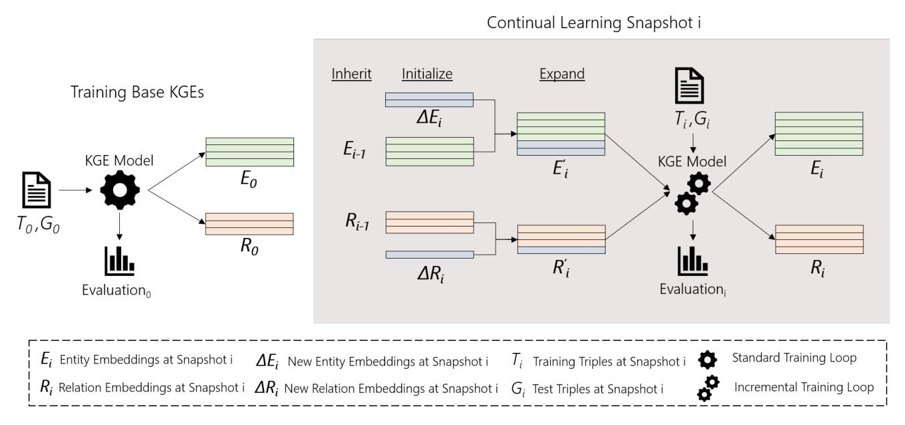
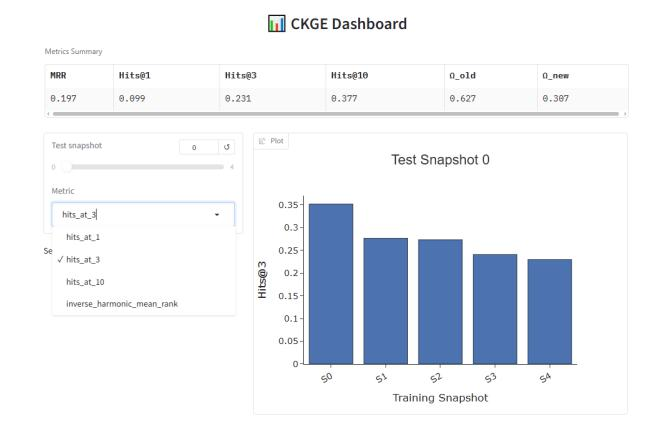

# A Framework for Continual Knowledge Graph Embedding

Gerard Pons

gerard.pons.recasens@upc.edu Universitat Politècnica de Catalunya Barcelona, Catalunya, Spain

Besim Bilalli besim.bilalli@upc.edu Universitat Politècnica de Catalunya Barcelona, Catalunya, Spain

Anna Queralt

anna.queralt@upc.edu Universitat Politècnica de Catalunya Barcelona, Catalunya, Spain

# Abstract

Knowledge Graph Embeddings (KGEs) are widely used to support downstream tasks over Knowledge Graphs (KGs) by representing entities and relations in a low-dimensional vector space. However, real-world KGs are not static, as new facts are continuously added, requiring old embeddings to be updated and new embeddings to be learned without forgetting previously acquired information. Existing KGE libraries focus on the static KG scenario. Moreover, while recent works on Continual Knowledge Graph Embedding (CKGE) propose strategies to address this problem, they rely on standalone frameworks and only support simple KGE models, such as TransE, limiting their potential.

We extended the KGE library PyKEEN to enable continual learning in KGs. Our extension (i) expands any unimodal KGE model in PyKEEN with new entities and relations, (ii) introduces an informed initialization method to improve the addition of new embeddings, (iii) incorporates CKGE-oriented evaluation metrics to assess both performance and knowledge forgetting and acquisition, and (iv) offers an intuitive training function with dashboard support, enabling easy experimentation and tracking of the evolution of embeddings across updates. A repository containing the scripts, an interactive notebook tutorial, and an accompanying video are available.[1](#page-0-0)

# CCS Concepts

• Computing methodologies → Knowledge representation and reasoning; Learning paradigms.

# Keywords

knowledge graph, knowledge graph embedding, continual learning

#### ACM Reference Format:

Gerard Pons, Besim Bilalli, and Anna Queralt. 2026. A Framework for Continual Knowledge Graph Embedding. In Companion Proceedings of the ACM Web Conference 2026 (WWW Companion '26), April 13–17, 2026, Dubai, United Arab Emirates. ACM, New York, NY, USA, [4](#page-3-0) pages. [https:](https://doi.org/10.1145/3774905.3793120) [//doi.org/10.1145/3774905.3793120](https://doi.org/10.1145/3774905.3793120)

# 1 Introduction

Knowledge Graphs (KGs) provide a structured way of representing knowledge by capturing the relationships between entities, offering a semantic understanding of the stored data. In order to leverage

1https://github.com/gerardponsrecasens/CKGE-Lab

[This work is licensed under a Creative Commons Attribution 4.0 International License.](https://creativecommons.org/licenses/by/4.0) WWW Companion '26, Dubai, United Arab Emirates

© 2026 Copyright held by the owner/author(s). ACM ISBN 979-8-4007-2308-7/2026/04 <https://doi.org/10.1145/3774905.3793120>

these data for downstream tasks (e.g., information retrieval, recommendation, etc.), the entities and relations in the KG are usually transformed into low-dimensional vectors, known as Knowledge Graph Embeddings (KGEs) [\[13\]](#page-3-1). As real-world KGs continually experience changes in terms of new entities, relations or facts (e.g., the DBpedia [\[3\]](#page-3-2)), their KGEs should also be modified to reflect these changes. However, existing KGE models assume static KGs [\[2\]](#page-3-3), and the functionalities provided in KGE libraries (e.g., PyKEEN [\[1\]](#page-3-4) or LibKGE [\[5\]](#page-3-5)) are aligned with this static vision.

Recently, some works [\[6,](#page-3-6) [9\]](#page-3-7) have proposed different strategies to deal with embeddings in evolving KGs, a problem known as Continual Learning of KGE (CKGE). Their goal is to acquire the new information that comes with KG updates, both by learning embeddings for new elements and updating existing embeddings, while preserving old knowledge (i.e., alleviating catastrophic forgetting). However, they implement their own CKGE frameworks without relying on existing KGE libraries, which poses two main limitations. First, they implement the simplest KGE model, TransE [\[4\]](#page-3-8), hindering the ability to leverage more powerful or expressive models. For instance, in PyKEEN, the library with the broadest KGE model support, there are more than 30 KGE model implementations available, the vast majority of them proposed as improvements for TransE [\[4\]](#page-3-8), and additional implementations will probably be included in the future. Second, existing CKGE strategies present fixed training processes, which do not take full advantage of KGE-specific negative samplers, filters or optimizers, among others, which are present in KGE libraries. This limits the ability to obtain the best final embeddings. Moreover, as existing libraries do not focus on CKGE, the initialization of embeddings as a first step in the learning process is typically random, and does not leverage already acquired knowledge to accelerate and improve the learning of new embeddings.

With these problems in mind, this demo extends the functionalities of the KGE library PyKEEN, enabling KG engineers to simulate, test, and compare how the different models would perform under continual learning conditions, assisting in the choice of the most appropriate one for their problem. Concretely:

- We expanded all the unimodal KGE models in PyKEEN to allow adapting to the CKGE setting. The mechanism is generic and can be applied to new KGE models to come.
- We implemented a CKGE-oriented evaluation of the embeddings, focusing on KGE and continual learning metrics.
- We provide a CKGE training function which allows to easily conduct experiments, and a dashboard to assess the embedding performance throughout incremental learning steps.
- We introduced the option to initialize the embeddings of new entities by using the KG's schema, in order to improve predictive performance and efficiency of the continual learning process.

Figure 1: Overview of a Continual Knowledge Graph Embedding training process.

## 2 Method

### 2.1 CKGE Overview

A KG is a collection of triples S ⊆ E × R × E, where E and R denote the sets of entities and relations, respectively. When KGs evolve over time, they can be represented as a series of snapshots KG = {S0, S1, . . . , S��}, where each snapshot expands on the previous one, i.e., S��−1 ⊆ S�� , E��−1 ⊆ E�� , and R��−1 ⊆ R�� . The newly introduced triples, entities, and relations at snapshot �� are denoted as ΔS�� = S�� \ S��−1, ΔE�� = E�� \ E��−1, and ΔR�� = R�� \ R��−1, respectively. The new set of triples ΔS�� is split in a training set T�� and a testing set G�� . In the CKGE setting (see Figure [1\)](#page-1-0), using a KGE model M, embeddings are first produced for the entities and relations of the base snapshot by using the triples T0. These embeddings are typically represented with matrices E0 ∈ R | E0 |×���� and R0 ∈ R | R0 |×���� , where ���� and ���� are the embedding dimensions for the entities and relations, respectively. When new triples arrive at time step �� (i.e., S�� ), embeddings must be learned for the newly introduced entities ΔE�� and relations ΔR�� , while the embeddings of existing entities E��−1 and relations R��−1 need to be updated. In order to achieve that, a continual learning function ������ (e.g., fine-tuning or the ones introduced for CKGE [\[6,](#page-3-6) [9\]](#page-3-7)) must be used:

E�� , R�� = ������ (M, E ′ �� , R ′ , T��) (1)

E ′ and R ′ �� are the expanded embeddings, which contain the inherited embeddings learned for entities and relations in E��−1 and R��−1 and the initialized embeddings for entities and relations in ΔE�� and ΔR�� . Finally, in each snapshot the continual learning performance must be evaluated by using the test snapshots G�� for �� = 0, . . . ,��.

# 2.2 Embedding and Model Expansion

As seen in Figure [1,](#page-1-0) when training an incremental snapshot ��, the embedding matrices must be expanded to accommodate the new entities and relations. In the most simple setting (e.g., TransE), this involves expanding the entity and relation embedding matrices from R | E��−1 |×���� and R | R��−1 |×���� to R | E�� |×���� and R | R�� |×���� , respectively. However, other KGE models may have more than one matrix associated to the embeddings (e.g., TransD [\[8\]](#page-3-9) has two matrices for each entity, depending on it acting as a head or tail of the triple, and TransH [\[14\]](#page-3-10) models the relations as hyperplanes, thus it additionally stores their normal vectors) or use more expressive embedding spaces (e.g., ComplEx [\[12\]](#page-3-11) models the embeddings in the complex space while QuatE [\[16\]](#page-3-12) uses quaternions). From now on, we consider the embeddings as all the elements associated with entities or relations learned by a KGE model. To produce the expanded embeddings two steps are needed:

- Inherit: the embeddings for the entities and relations present in E��−1 and R��−1 must be transferred to the ones of the new snapshot.
- Initialize: the embeddings for new entities ΔE�� and relations ΔR�� must be initialized prior to training. This initialization is typically random, but the generation procedure depends on the KGE model. For instance, gaussian or uniform initializations are commonly used in various models, some use Xavier initialization [\[7\]](#page-3-13) and others additionally clamp or normalize the initialized embeddings. However, given that embeddings already exist for entities and relations appearing in past snapshots, the initialization does not need to be random. As shown in [\[10\]](#page-3-14), using an informed initialization based on the schema of the KG, new embeddings can be obtained faster and with higher predictive performance.

Finally, the PyKEEN model object also needs to be updated, as some of its parameters need to be inherited (e.g., optimizer state) or updated (e.g., number of entities).

Implemented Features: Embedding and model expansion functionalities have been implemented for the unimodal KGE models available in PyKEEN, taking into account the differences in number and type of associated objects and initialization procedures. Additionally, an informed-initialization method has been implemented for all the models to improve embedding performance (see Section [3.2\)](#page-2-0).

#### 2.3 Continual Learning

Once the embeddings are expanded, training can start. At this stage, a continual learning method ������ must be used to update past embeddings for entities and relations of E��−1 and R��−1, and to obtain the ones for the entities and relations in ΔE�� and ΔR�� , respectively, according to model M.

Implemented Features: A CKGE training process built on top of PyKEEN has been implemented to obtain the updated embeddings, containing both old and new entities and relations.

### 2.4 CKGE Evaluation

Static KGEs are typically evaluated through Link Prediction metrics such as Mean Reciprocal Rank (MRR) and Hits@k [\[11\]](#page-3-15). In the CKGE setting, these metrics are also reported, but need to be evaluated over all the current training snapshots G�� for �� = 0, . . . , ��, being �� the number of the last snapshot. Therefore, the CKGE metrics are defined as:

���������� = ∑︁�� ��=0 �� |T�� Í�� ��=0 |T�� (2)

where �� �� is the evaluation of metric �� (e.g., MRR or Hits@3) on the test set G�� with the embeddings obtained in the final snapshot ��. Additionally, some CKGE-specific metrics exist to monitor the acquisition of new knowledge (������) and catastrophic forgetting (������ ):

Ω������ = 1 �� − 1 ∑︁�� ��=1 �� �� �� T�� Í�� ��=1 T�� (3)

Ω������ = 1 �� − 1 ∑︁−1 ��=�� (�� �� − �� �� ) T�� Í��−1 ��=0 T�� (4)

Implemented Features: KGE embedding metrics have been adapted to the CKGE setting, and the CKGE-specific metrics ������ and ������ have been incorporated. Additionally, a dashboard view has been implemented to graphically observe the embedding behavior throughout snapshots (see Section [3.1\)](#page-2-1).

## 3 Demonstration

# 3.1 Running Experiments

One of the main features of the framework isthe ability to easily conduct CKGE experiments. To support this, we provide a streamlined training functionality that allows users to obtain trained embeddings and their evaluation by simply specifying the KGE model,

Figure 2: Dashboard of the CKGE experiment.

embedding dimension, dataset, continual learning strategy, initialization method, and the learning rates and number of training epochs for both the initial and incremental snapshots.

Additionally, as seen in Figure [2,](#page-2-2) a dashboard is generated. Besides reporting standard CKGE evaluation metrics, it provides visualizations that allow users to interactively monitor how embedding performance evolves across snapshots and metrics. This makes it easy to identify snapshots that cause abrupt performance drops, helping users decide when retraining or other corrective actions may be required. Forinstance, in Figure [2](#page-2-2) it can be seen that the evaluation on the base snapshot test set G0 experiences some forgetting when introducing the first and third additional snapshots.

Implemented Features: Easy-to-run CKGE experiments requiring only high-level configuration of the model, dataset, and continual training parameters.

## 3.2 Informed Initialization

As explained in Section [2.2,](#page-1-1) embedding initialization does not need to be random as it can leverage already learned embeddings. To this end, the method proposed in [\[10\]](#page-3-14) has been implemented as a continual initialization strategy. Briefly, this method computes the centroid embeddings for the entity classes, which requires the KG to have a defined schema. Then, it uses these centroids to initialize new entities depending on the classes they belong to. This method positions the initial embeddings closer to their final positions, reducing the time needed for training while improving knowledge acquisition and retention. To exemplify the benefits, an experiment has been conducted with random and informed initialization for translational (i.e., TransE [\[4\]](#page-3-8) and TransH [\[14\]](#page-3-10)) and semantic (e.g., DistMult [\[15\]](#page-3-16) and ComplEx [\[12\]](#page-3-11)) KGE models. The results for three datasets with snapshots of different sizes (i.e., FBinc-S, FBinc-M and FBinc-L [\[10\]](#page-3-14)) can be seen in Table [1.](#page-3-17) Across all models and dataset scales, informed initialization consistently outperforms random initialization. As a general trend, it can be seen that the larger the dataset, the more pronounced the catastrophic forgetting is (i.e., ������ ). Additionally, by using the Informed initialization,

Table 1: Results on the continual FBinc datasets. The entity and relation dimensions are set to 200, and a grid search is performed over learning rates [1e-3, 5e-4, 1e-4]. The results are reported as the average over 5 runs.

catastrophic forgetting can be attenuated while at the same time improving knowledge acquisition (i.e., ������). This is important for small continual datasets, where the model struggles to incorporate Finally, the semantic model ComplEx performs poorly for all the

this new knowledge (e.g., see translational models with FBinc-S). datasets with random initialization, but it is able to obtain acceptable results when Informed initialization is applied. 4 Conclusions We address a significant exiting gap in KGE learning, which is the lack of support for CKGE, by introducing various functionalities that integrate seamlessly with the PyKEEN library. First, we introduce methods to expand KGE and KGE models when new triples containing new entities and relations arrive. Also, we create a convenient end-to-end CKGE training function which facilitates conducting CKGE experiments. Moreover, we expand the evaluation metrics to contain CKGE-specific metrics, and provide a dashboard to visually assess the changes in performance throughout snapshots. Finally, we add the ability to perform informed initializations for the entity embeddings in all KGE unimodal models, which can improve the performance of the obtained embeddings. Importantly, the framework is designed to be easily extensible, allowing new KGE models, initialization strategies, and evaluation metrics to be incorporated with minimal effort. Given the growth that the CKGE field is recently experiencing, we believe that to obtain their full potential, experiments should be conducted with the most powerful and expressive models, by leveraging the KGE-specific training techniques available in KGE libraries. This demo presents the framework for that, and we expect it to facilitate more rigorous and comparable evaluations in future research. Acknowledgments This work is supported by the Horizon Europe Programme under GA.101135513 (CyclOps) and the Spanish Ministerio de Ciencia e Innovación under project PID2023-152841OA-I00/AEI/10.13039/50110 0011033 (TALC). for Training and Evaluating Knowledge Graph Embeddings. Journal of Machine Learning Research 22, 82 (2021), 1–6.<http://jmlr.org/papers/v22/20-825.html> [2] Russa Biswas, Lucie-Aimée Kaffee, Michael Cochez, Stefania Dumbrava, Theis E Jendal, Matteo Lissandrini, Vanessa Lopez, Eneldo Loza Mencía, Heiko Paulheim, Harald Sack, et al. 2023. Knowledge graph embeddings: open challenges and opportunities. Transactions on Graph Data and Knowledge 1, 1 (2023), 4–1. [3] Christian Bizer, Jens Lehmann, Georgi Kobilarov, Sören Auer, Christian Becker, Richard Cyganiak, and Sebastian Hellmann. 2009. Dbpedia-a crystallization point for the web of data. Journal of web semantics 7, 3 (2009), 154–165. [4] Antoine Bordes, Nicolas Usunier, Alberto Garcia-Duran, Jason Weston, and Oksana Yakhnenko. 2013. Translating embeddings for modeling multi-relational data. Advances in neural information processing systems 26 (2013). [5] Samuel Broscheit, Daniel Ruffinelli, Adrian Kochsiek, Patrick Betz, and Rainer Gemulla. 2020. LibKGE - A Knowledge Graph Embedding Library for Reproducible Research. In Proceedings of the 2020 Conference on Empirical Methods in Natural Language Processing: System Demonstrations. 165–174. [https:](https://www.aclweb.org/anthology/2020.emnlp-demos.22) [//www.aclweb.org/anthology/2020.emnlp-demos.22](https://www.aclweb.org/anthology/2020.emnlp-demos.22) [6] Yuanning Cui, Yuxin Wang, Zequn Sun, Wenqiang Liu, Yiqiao Jiang, Kexin Han, and Wei Hu. 2023. Lifelong Embedding Learning and Transfer for Growing Knowledge Graphs. In AAAI. [7] Xavier Glorot and Yoshua Bengio. 2010. Understanding the difficulty of training deep feedforward neural networks. In Proceedings of the thirteenth international conference on artificial intelligence and statistics. JMLR Workshop and Conference Proceedings, 249–256. [8] Guoliang Ji, Shizhu He, Liheng Xu, Kang Liu, and Jun Zhao. 2015. Knowledge graph embedding via dynamic mapping matrix. In Proceedings of the 53rd annual meeting of the association for computational linguistics and the 7th international joint conference on natural language processing (volume 1: Long papers). 687–696. [9] Jiajun Liu, Wenjun Ke, Peng Wang, Ziyu Shang, Jinhua Gao, Guozheng Li, Ke Ji, and Yanhe Liu. 2024. Towards Continual Knowledge Graph Embedding via Incremental Distillation. In AAAI. [10] Gerard Pons, Besim Bilalli, and Anna Queralt. 2025. Improving Continual Learning of Knowledge Graph Embeddings via Informed Initialization. [https:](https://arxiv.org/abs/2511.11118) [//arxiv.org/abs/2511.11118](https://arxiv.org/abs/2511.11118) [11] Daniel Ruffinelli, Samuel Broscheit, and Rainer Gemulla. 2020. You CAN Teach an Old Dog New Tricks! On Training Knowledge Graph Embeddings. In International Conference on Learning Representations. [12] Théo Trouillon, Christopher R Dance, Éric Gaussier, Johannes Welbl, Sebastian Riedel, and Guillaume Bouchard. 2017. Knowledge graph completion via complex tensor factorization. Journal of Machine Learning Research 18, 130 (2017), 1–38. [13] Quan Wang, Zhendong Mao, Bin Wang, and Li Guo. 2017. Knowledge graph embedding: A survey of approaches and applications. IEEE transactions on knowledge and data engineering 29, 12 (2017), 2724–2743. [14] Zhen Wang, Jianwen Zhang, Jianlin Feng, and Zheng Chen. 2014. Knowledge graph embedding by translating on hyperplanes. In Proceedings of the AAAI conference on artificial intelligence, Vol. 28. [15] Bishan Yang, Wen-tau Yih, Xiaodong He, Jianfeng Gao, and Li Deng. 2015. Embedding Entities and Relations for Learning and Inference in Knowledge Bases. In 3rd International Conference on Learning Representations, ICLR 2015, San Diego, CA, USA, May 7-9, 2015, Conference Track Proceedings, Yoshua Bengio and Yann LeCun (Eds.).<http://arxiv.org/abs/1412.6575> [16] Shuai Zhang, Yi Tay, Lina Yao, and Qi Liu. 2019. Quaternion knowledge graph embeddings. Advances in neural information processing systems 32 (2019).

# References

[1] Mehdi Ali, Max Berrendorf, Charles Tapley Hoyt, Laurent Vermue, Sahand Sharifzadeh, Volker Tresp, and Jens Lehmann. 2021. PyKEEN 1.0: A Python Library