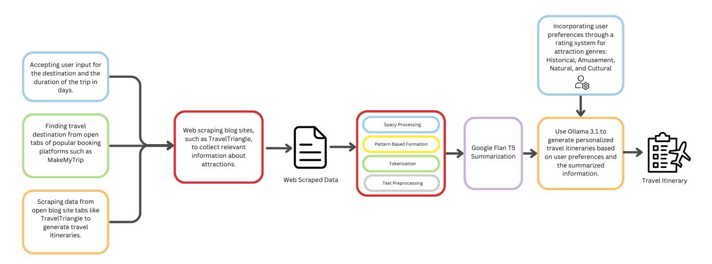
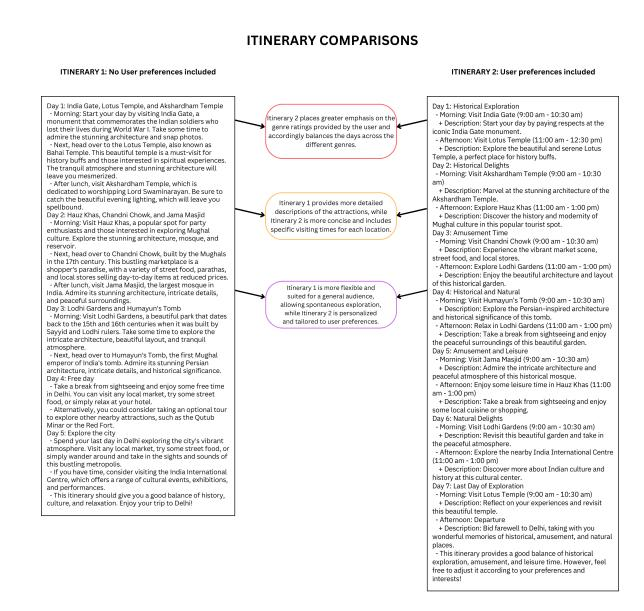

# Roamify: An Interactive Browser Extension for Real-Time LLM-Based Travel Itinerary Generation

| Vikranth Udandarao ∗                  |            |                                       |
|---------------------------------------|------------|---------------------------------------|
| Indraprastha Institute of Information |            |                                       |
| Technology Delhi                      |            |                                       |
| New Delhi, India                      |            |                                       |
| Muthuraj                              | Vairamuthu | ∗                                     |
| Indraprastha                          | Institute  | of Information                        |
| Technology                            |            | Delhi                                 |
| New                                   | Delhi,     | India                                 |
|                                       |            | Noel Abraham Tiju ∗                   |
|                                       |            | Indraprastha Institute of Information |
|                                       |            | Technology Delhi                      |
|                                       |            | New Delhi, India                      |
| Harsh Mistry ∗                        |            |                                       |
| Indraprastha Institute of Information |            |                                       |
| Technology Delhi                      |            |                                       |
| New Delhi, India                      |            |                                       |
| Armaan                                |            | Singh ∗                               |
| Indraprastha                          | Institute  | of Information                        |
| Technology                            |            | Delhi                                 |
| New                                   | Delhi,     | India                                 |
|                                       |            | Dhruv Kumar                           |
|                                       |            | Birla Institute of Technology and     |
|                                       |            | Science Pilani                        |
|                                       |            | Pilani, India                         |
|                                       |            | Indraprastha Institute of Information |
|                                       |            | Technology Delhi                      |
|                                       |            | New Delhi, India                      |

#### Abstract

We present Roamify, a browser-embedded demonstration system for real-time, web-conditioned travel itinerary generation. Roamify converts live travel blogs and articles into structured multi-day itineraries by integrating large-scale Web scraping, neural summarisation, explicit preference modelling, and in-browser LLM generation. The system continuously retrieves fresh attraction data, summarises it using a finetuned T5 model, and composes coherent itineraries through LLaMA 3, guided by user-controlled sliders that encode historical, natural, cultural, and amusement preferences. Unlike static trip planning tools or chatbot-only assistants, Roamify enables interactive, controllable, and dynamically updated itinerary creation directly within the Chrome environment. This demo showcases a complete Web intelligence pipeline, from live data acquisition to human-in-the-loop LLM prompting, operating entirely on the client side for transparency and low-latency interaction.

#### CCS Concepts

• Information systems → Web interfaces; Web searching and information discovery; Recommender systems; • Computing methodologies → Natural language processing; Machine learning approaches.

#### Keywords

Web intelligence, Large Language Models, Personalisation, Travel recommendation, Browser extension, Generative AI

∗These authors contributed equally to this work.

© 2026 Copyright held by the owner/author(s). ACM ISBN 979-8-4007-2308-7/2026/04 <https://doi.org/10.1145/3774905.3793121>

#### ACM Reference Format:

Vikranth Udandarao, Muthuraj Vairamuthu, Noel Abraham Tiju, Harsh Mistry, Armaan Singh, and Dhruv Kumar. 2026. Roamify: An Interactive Browser Extension for Real-Time LLM-Based Travel Itinerary Generation. In Companion Proceedings of the ACM Web Conference 2026 (WWW Companion '26), April 13–17, 2026, Dubai, United Arab Emirates. ACM, New York, NY, USA, [4](#page-3-0) pages.<https://doi.org/10.1145/3774905.3793121>

### 1 Introduction and Motivation

Online trip planning remains a fragmented and time-consuming activity [\[9\]](#page-3-1). Travellers often sift through numerous blogs, forums, and booking platforms to extract attraction details and manually construct coherent itineraries [\[4,](#page-3-2) [5\]](#page-3-3). Most existing trip planning systems rely on static databases, template-based recommendations, or offline corpora, which limit their ability to adapt to user preferences or newly published Web content [\[13\]](#page-3-4). Meanwhile, advances in Large Language Models (LLMs) have demonstrated strong potential in personalised recommendation and contextual reasoning [\[14\]](#page-3-5), yet current AI-driven travel assistants typically operate as isolated chatbots without direct integration with live Web data or user browsing behaviour [\[8\]](#page-3-6).

Roamify addresses this gap by introducing a browser-integrated, end-to-end pipeline for real-time Web conditioned itinerary generation. The system automatically scrapes travel webpages, summarises attraction descriptions using a fine-tuned T5 model, and generates multi-day itineraries through LLaMA 3 conditioned on explicit user preferences. A lightweight Chrome extension enables users to express their interests through four intuitive sliders: Historical, Natural, Cultural, and Amusement, with itinerary updates appearing instantly as preferences change[1](#page-0-0) .

This demonstration presents a form of Web scale generative interaction, where retrieval, summarisation, and LLM-based synthesis operate directly within a user's browsing workflow. Unlike static

[This work is licensed under a Creative Commons Attribution 4.0 International License.](https://creativecommons.org/licenses/by/4.0) WWW Companion '26, Dubai, United Arab Emirates

1Demo[: https://drive.google.com/drive/folders/1nUqBuNWV9kCfBKa7JKlN5MfxK5Gec](https://drive.google.com/drive/folders/1nUqBuNWV9kCfBKa7JKlN5MfxK5GecFnW?usp=sharing)FnW? [usp=sharing](https://drive.google.com/drive/folders/1nUqBuNWV9kCfBKa7JKlN5MfxK5GecFnW?usp=sharing)

trip planning systems, Roamify incorporates newly published content in real time, ensuring that itineraries remain current, contextually grounded, and aligned with evolving web sources [\[7\]](#page-3-7). By situating the generative process inside the browser, the system reduces latency, improves transparency, and illustrates how LLMs can extend conventional web search toward interactive, human-inthe-loop content generation [\[1\]](#page-3-8).

#### 2 System Overview and Architecture

Roamify combines live web extraction, lightweight NLP processing, and LLM-based itinerary generation into a browser-embedded system for personalised travel planning. It demonstrates how generative AI can transform unstructured online content into structured, user-adaptive recommendations within an interactive browsing experience. The architecture (Figure [1\)](#page-2-0) follows a modular pipeline consisting of four stages: Data Collection, Preprocessing, Summarisation, and Itinerary Generation. These components communicate through simple service endpoints, supporting clarity, reproducibility, and ease of deployment [\[7,](#page-3-7) [14\]](#page-3-5).

#### 2.1 Data Collection and Preprocessing

Roamify identifies the user's destination either through direct input or by detecting active travel-related browser tabs. We use the FireCrawl web extraction service[2](#page-1-0) to extract relevant webpage text while filtering out non-informative elements, such as advertisements and boilerplate sections. This ensures that only meaningful attraction content is passed to the downstream pipeline.

Preprocessing uses spaCy [\[6\]](#page-3-9) and NLTK [\[2\]](#page-3-10) for tokenisation and lemmatisation. Attraction segments are identified using simple pattern-based rules commonly found in travel blogs (e.g., numbered sections or bullet lists). The result is a structured mapping from attraction titles to descriptive text blocks, standardising input for summarisation.

#### 2.2 Summarisation

The summarisation module condenses attraction descriptions into concise factual snippets that serve as inputs for itinerary generation. Roamify uses Flan-T5-Small [\[11\]](#page-3-11), a lightweight encoder–decoder model selected for its balance of speed and factuality in shortform content. Larger generative models (e.g., LLaMA variants [\[12\]](#page-3-12)) can also be supported, but the T5-based configuration provides the latency characteristics preferred for an in-browser interactive system.

#### 2.3 Itinerary Generation and Personalisation

Summarised attractions are passed to the itinerary generation module, powered by LLaMA 3 (8B) [\[12\]](#page-3-12) through the Hugging Face Inference API[3](#page-1-1) . The system constructs structured prompts that include destination, trip duration, and attraction summaries. A four-slider interface (Historical, Natural, Cultural, and Amusement) enables users to explicitly express their interests. These values are embedded directly into the prompt, enabling the model to adapt its

recommendations in real time. In addition to slider-based conditioning, Roamify includes a lightweight chat-based refinement interface that allows users to iteratively modify the generated itinerary while keeping the generation grounded in the extracted attraction summaries. This supports an interactive human-in-the-loop workflow where users can quickly converge on a preferred plan.

Generate a detailed itinerary for a X-day trip to Destination based on the following suggested attractions:

- Attraction 1: Brief summary.
- Attraction 2: Brief summary.
- Attraction N: Brief summary.

The generated itinerary is displayed directly in the browser. Users can adjust preferences, regenerate itineraries, and export results in multiple formats. This interactive loop highlights Roamify's focus on transparent, user-controlled generation.

## 2.4 Deployment and Reproducibility

Each module operates as an independent Docker microservice orchestrated via docker-compose. The backend supports both cloud deployment (GPU-backed inference) and offline local operation using Ollama for on-device inference [\[10\]](#page-3-13). All components, datasets, and trained models are publicly available for transparency and reproducibility. [4](#page-1-2) [5](#page-1-3) [6](#page-1-4)

This architecture demonstrates how generative systems can unify live web content, fine-tuned models, and human interaction to deliver adaptive and reproducible AI experiences.

#### 3 Demonstration Setup

Roamify is structured for direct, hands-on user interaction. They will engage with the complete end-to-end pipeline, from live web content acquisition to personalised itinerary generation, through a Chrome extension and an accompanying visual dashboard. The setup is designed to highlight transparency, reproducibility, and user-driven control, illustrating how LLM-powered Web applications can deliver dynamic and personalised travel-planning experiences [\[3,](#page-3-14) [5\]](#page-3-3).

#### Installation and Access.

Users begin by installing the Roamify Chrome extension on any Chromium-based browser. The system operates entirely clientside, relying on lightweight API endpoints for summarisation and itinerary generation while keeping all interaction local to the browser. No sign-in or account creation is required, ensuring immediate accessibility. The backend services can be executed locally or deployed on any standard server environment.

FireCrawl:<https://www.firecrawl.dev>

3HuggingFace Inference API: [https://huggingface.co/docs/inference-providers/en/](https://huggingface.co/docs/inference-providers/en/index) [index](https://huggingface.co/docs/inference-providers/en/index)

4Machine Learning Pipeline: NLP processing, recommender modules, and LLM fine-tuning — [https://github.com/Roamify-Research/Machine-Learning.](https://github.com/Roamify-Research/Machine-Learning)

5Extension Codebase: Complete Chrome extension source — [https://github.com/](https://github.com/Roamify-Research/Extension) [Roamify-Research/Extension.](https://github.com/Roamify-Research/Extension)

6Models and Datasets: Finetuned LLaMA-3 and T5 models, as well as curated datasets, are hosted on Hugging Face — [https://huggingface.co/Roamify.](https://huggingface.co/Roamify) Key assets include: [https://huggingface.co/Roamify/llama-3-finetuned-model,](https://huggingface.co/Roamify/llama-3-finetuned-model) [https://huggingface.](https://huggingface.co/Roamify/finetuned-summarization_t5) [co/Roamify/finetuned-summarization\\_t5,](https://huggingface.co/Roamify/finetuned-summarization_t5) [https://huggingface.co/datasets/Roamify/](https://huggingface.co/datasets/Roamify/Summarized-Attractions) [Summarized-Attractions,](https://huggingface.co/datasets/Roamify/Summarized-Attractions) and [https://huggingface.co/datasets/Roamify/Finetuning-](https://huggingface.co/datasets/Roamify/Finetuning-QA)[QA.](https://huggingface.co/datasets/Roamify/Finetuning-QA)

Figure 1: Overall architecture of Roamify, connecting browser-based user interaction with backend NLP and LLM modules, covering the data collection, summarisation, and itinerary generation pipeline.

Context: Cubbon Park, situated over 300 acres and constructed by Richard Sankey, features lawns and statues of famous personalities. It is popular among visitors in Bangalore.

T5 Output: Cubbon Park spans 300 acres in Bangalore, offering lawns and statues, popular among visitors daily at no entry fee.

LLaMA Output: Cubbon Park, created by Richard Sankey, is a large green area with lawns and statues, located at Kasturba Road in Bangalore.

Figure 2: Example attraction summaries produced by the system.

Interactive Workflow. Users may (1) manually specify a destination and trip duration, or (2) open a travel article, which Roamify automatically detects via contextual parsing. Once a webpage is identified, the extension scrapes attraction information in real time and displays the extracted content. Attendees can then observe the summarisation stage, followed by the generation of the itinerary conditioned on user preferences. The four preference sliders (Historical, Natural, Cultural, Amusement) dynamically update the itinerary within seconds, demonstrating how explicit user intent modulates LLM behaviour in an interactive loop. Attendees can further refine the itinerary through a chat interface that applies constrained edits and regenerates updated plans in seconds.

Visualisation Dashboard. A dedicated dashboard provides introspection into Roamify's internal pipeline, including retrieved

Figure 3: Comparison of itineraries generated without (left) and with (right) user preference conditioning.

text segments, model prompts, intermediate summaries, and final LLM outputs. This visibility emphasises interpretability and responsible Web intelligence practices [\[7,](#page-3-7) [14\]](#page-3-5). Attendees can directly compare outputs generated with and without personalisation, observing how preference signals influence narrative structure and the prioritisation of attraction.

Demo Materials. A recorded walkthrough accompanies the live demonstration, together with links to public code repositories, datasets, and model checkpoints. All assets are openly released to support academic replication, instructional use, and further research on interactive LLM-driven Web applications.

#### 4 Key Technical Contributions

Roamify demonstrates how Web-scale retrieval, neural summarisation, and generative reasoning can be unified into an interactive, browser-native application. Its technical novelty arises from the integration of dynamic Web content, controllable LLM prompting, and transparent in-browser execution.

- Real-Time Web Adaptation: Roamify continuously extracts attraction information from live travel blogs and articles, enabling itineraries that remain aligned with newly published and contextually relevant Web content [\[5,](#page-3-3) [7\]](#page-3-7).
- Dual-Model Generative Pipeline: A hybrid architecture combines Flan-T5 [\[11\]](#page-3-11) for factual, concise summarisation with LLaMA-3 [\[12\]](#page-3-12) for coherent, narrative itinerary generation. This separation of roles strikes a balance between precision and fluency, while maintaining low-latency inference.
- Explicit Preference Modelling: A four-dimensional slider interface (Historical, Natural, Cultural, Amusement) encodes user interests as quantitative conditioning signals within LLM prompts, enabling transparent and reproducible personalisation [\[3\]](#page-3-14).
- Browser-Level Integration: The entire workflow from scraping and summarisation to LLM-based itinerary generation executes within the Chrome extension sandbox. This design showcases how generative AI can augment traditional Web search through immediate, in-context interaction.
- Open and Reproducible Design: All components, datasets, fine-tuned models, and source code are publicly released to support transparency, community benchmarking, and further research on interactive Web intelligence.

Collectively, these contributions position Roamify as a representative example of generative Web applications, in which retrieval, reasoning, and human control jointly enable adaptive, trustworthy AI-driven experiences.

### 5 Limitations and Future Work

Roamify is presented as an interactive demonstration system, with clear directions for future improvement. The current itinerary generation is primarily text-driven and does not yet enforce hard spatiotemporal constraints, such as travel time, distance, or opening hours. Integrating external services (e.g., mapping or routing APIs) to improve feasibility is a natural next step. While the system uses lightweight pattern-based web extraction for efficiency, extending robustness across diverse webpage structures and incorporating explicit policy-aware access mechanisms are planned enhancements. In addition, future work will include systematic benchmarking against existing solutions, reporting of performance metrics such as end-to-end latency, and small-scale user studies to validate the effectiveness of preference-based personalisation. Finally, upcoming versions will further clarify data flow and explore stronger privacypreserving deployments, including expanded on-device inference options.

#### 6 Conclusion

Roamify illustrates how Web-scale content extraction, neural summarisation, and LLM-based reasoning can be combined into an

interactive, browser-embedded system for real-time travel itinerary generation. By bridging the divide between static trip planning platforms and adaptive generative models, the system demonstrates how retrieval, synthesis, and user-driven control can coexist effectively within the modern Web ecosystem.

The modular architecture, which includes scraping, summarisation, preference modelling, and itinerary generation, emphasises transparency and reproducibility while aligning with principles of open and responsible Web intelligence. During the demonstration, users will interact directly with Roamify and observe how preference-driven controls influence LLM behaviour in response to live Web content.

All assets, including source code, datasets, and finetuned models, are publicly released to enable openness, replication, and further community experimentation.

#### References

[1] Michael Adelusola. 2023. Efficient Model Deployment Strategies for LLMs in Web Applications. (06 2023). [2] Steven Bird, Edward Loper, and Ewan Klein. 2009. Natural Language Processing with Python: Analyzing Text with the Natural Language Toolkit. O'Reilly Media, Inc. [3] Jordi Borràs, Antonio Moreno, and Aida Valls. 2014. Intelligent tourism recommender systems: A survey. Expert Systems with Applications 41, 16 (2014), 7370–7389. [4] Adrian Brown, Zheng Xiang, and Daniel R. Fesenmaier. 2020. Personalisation of travel experiences: Opportunities and challenges in travel research. Journal of Travel Research 59, 5 (2020), 749–756. [5] Dimitrios Buhalis, Tracy Harwood, Vanja Bogicevic, Giampaolo Viglia, Srikanth Beldona, and Charles Hofacker. 2020. Technology-driven consumer behaviour in tourism: A systematic review and future research agenda. Tourism Management 78 (2020), 104–113. [6] Explosion. 2023. spaCy: Industrial-strength Natural Language Processing in Python. [https://spacy.io.](https://spacy.io) [7] Shengyu Gu, Cheng Li, Yu Zhang, Jia Liu, and Weiming Zhang. 2024. A survey on large language models in tourism: applications and challenges. Journal of Hospitality and Tourism Technology 15, 2 (2024), 175–190. [8] José Magano, Joana Alegria Quintela, and Neelotpaul Banerjee. 2025. Driving Consumer Engagement Through AI Chatbot Experience: The Mediating Role of Satisfaction Across Generational Cohorts and Gender in Travel Tourism. Sustainability 17 (08 2025), 7673. [doi:10.3390/su17177673](https://doi.org/10.3390/su17177673) [9] Sai Mohith S, HemaMalini H, Karthik .K, Nithin N, and Sanath . R. 2025. A Review Paper On AI-Driven Travel Planning. (01 2025). [doi:10.5281/zenodo.14591573](https://doi.org/10.5281/zenodo.14591573) [10] Ollama Inc. [n. d.]. Ollama — Chat & build with open models. [https://ollama.com/.](https://ollama.com/) Accessed: 2025-11-17. [11] Colin Raffel, Noam Shazeer, Adam Roberts, Katherine Lee, Sharan Narang, Michael Matena, Yanqi Zhou, Wei Li, and Peter J. Liu. 2020. Exploring the Limits of Transfer Learning with a Unified Text-to-Text Transformer. Journal of Machine Learning Research 21 (2020), 1–67. [12] Hugo Touvron, Louis Martin, Kevin Stone, Peter Albert, Amjad Almahairi, Yasmine Babaei, Nikolay Bashlykov, Soumya Batra, Prajjwal Bhargava, et al. 2023. LLaMA: Open and Efficient Foundation Language Models. arXiv preprint arXiv:2302.13971 (2023). [13] Balázs Varga, Tamás Ormándi, Tamás Tettamanti, Attila Aba, and Domokos Esztergár-Kiss. 2025. Strategic trip planning for commuting considering user preferences of employees in organizations 11orcid(s):. Cities 165 (2025), 106097. [doi:10.1016/j.cities.2025.106097](https://doi.org/10.1016/j.cities.2025.106097) [14] Qikai Wei, Mingzhi Yang, Jinqiang Wang, Wenwei Mao, Jiabo Xu, and Huansheng Ning. 2024. TourLLM: Enhancing LLMs with Tourism Knowledge. arXiv preprint arXiv:2407.12791 (2024).