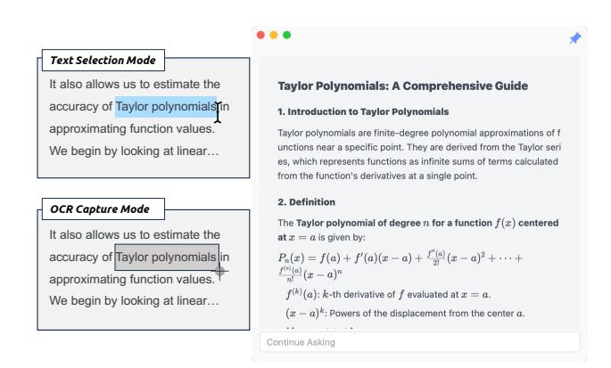
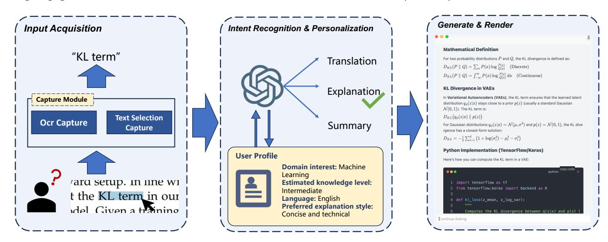
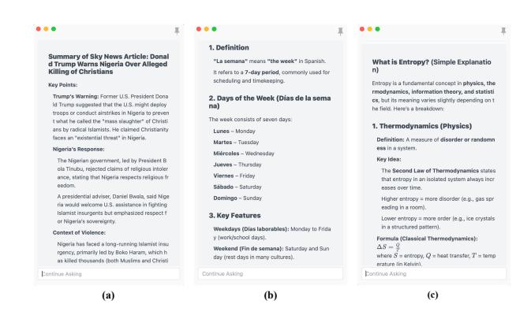
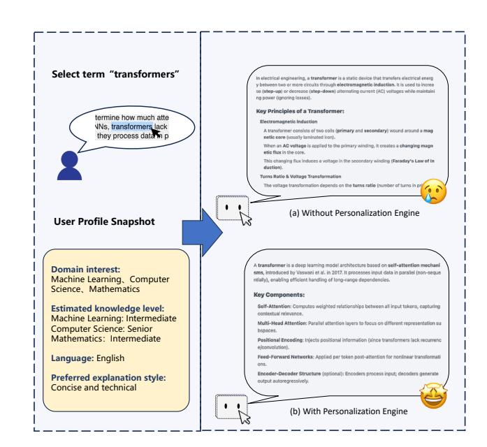

# Swen: A Cross-Platform Desktop Assistant for Instant and Personalized Large-Language-Model Interaction

Wenjun Feng fengwenjun@mail.ustc.edu.cn University of Science and Technology of China Hefei, China

Rui Li

ruili2000@mail.ustc.edu.cn University of Science and Technology of China Hefei, China

Zheng Zhang zhangzheng@mail.ustc.edu.cn University of Science and Technology of China Hefei, China

Zhenya Huang huangzhy@ustc.edu.cn University of Science and Technology of China Hefei, China

Qi Liu∗

qiliuql@ustc.edu.cn University of Science and Technology of China Hefei, China

# Abstract

Large Language Models (LLMs) have become indispensable tools for knowledge acquisition and text interpretation in everyday learning and work. However, in current usage, users must repeatedly switch between applications, copy or paste text, and manually craft prompts whenever they encounter unfamiliar content. Such fragmented interaction greatly reduces the overall efficiency and disrupts natural reading and learning workflows.

We present Swen, a cross-platform desktop assistant designed to provide instant, personalized LLMs assistance directly within any desktop environment. After configuring the desired LLM API and defining a shortcut key, users can simply select any piece of text on their screen and press the shortcut to summon an on-screen window with on-the-spot explanations. Swen automatically performs intent recognition—identifying whether the user's goal is translation, concept explanation, or text summarization and generates the response accordingly. The system further maintains an evolving user profile that records background information and answer preferences, enabling increasingly personalized and context-aware responses over time.

Swen could reduce the average time spent on knowledge lookup and comprehension tasks significantly, compared to conventional prompt-based workflows. This demonstrates the system's effectiveness in transforming LLM interaction from a disruptive, manual process into a seamless part of everyday digital reading and learning. The source code are available at https://github.com/USTCKevinF/Swen.

# CCS Concepts

• Human-centered computing → Interaction design process and methods; • Computing methodologies → Natural language processing.

[This work is licensed under a Creative Commons Attribution-NonCommercial-](https://creativecommons.org/licenses/by-nc-nd/4.0)[NoDerivatives 4.0 International License.](https://creativecommons.org/licenses/by-nc-nd/4.0) WWW Companion '26, Dubai, United Arab Emirates © 2026 Copyright held by the owner/author(s). ACM ISBN 979-8-4007-2308-7/2026/04 <https://doi.org/10.1145/3774905.3793133>

# Keywords

Large Language Models, Intelligent Tutoring System, Personalized Learning

#### ACM Reference Format:

Wenjun Feng, Rui Li, Zheng Zhang, Zhenya Huang, and Qi Liu. 2026. Swen: A Cross-Platform Desktop Assistant for Instant and Personalized Large-Language-Model Interaction. In Companion Proceedings of the ACM Web Conference 2026 (WWW Companion '26), April 13–17, 2026, Dubai, United Arab Emirates. ACM, New York, NY, USA, [4](#page-3-0) pages. [https://doi.org/10.1145/](https://doi.org/10.1145/3774905.3793133) [3774905.3793133](https://doi.org/10.1145/3774905.3793133)

# 1 Introduction

In recent years, Large Language Models (LLMs) such as GPT-4 [\[1\]](#page-3-1) have rapidly become indispensable tools for learning, research, and professional work. They serve as versatile assistants capable of explaining technical concepts, providing learning material, and summarizing lengthy materials across a variety of domains [\[4\]](#page-3-2). However, despite their wide adoption and impressive capability, the current way[1](#page-0-0)[2](#page-0-1) that users interact with these models remains largely manual and disruptive. When encountering an unfamiliar term or a complex paragraph, users typically need to copy the text, switch to a separate chat or browser interface, write an appropriate prompt, and then wait for the response from LLM. These repetitive steps not only interrupt the user's cognitive flow but also significantly reduce the overall efficiency of knowledge acquisition.

This workflow introduces several persistent limitations: i) frequent context switching fragments the workflow, ii) prompt composition demands extra cognitive effort, and iii) existing interfaces ignore cumulative user context and preferences. Although numerous plug-ins and browser extensions [\[5\]](#page-3-3) attempt to streamline the experience, most remain confined to specific applications or websites and thus lack the generality and personalized adaptation necessary to make model responses broadly applicable, relevant, and comprehensible.

To address these limitations, we present Swen, a lightweight and intelligent desktop assistant that embeds LLM capabilities directly into the user's operating environment. As illustrated in Figure [1,](#page-1-0) users simply select text and press a predefined shortcut key, Swen

1https://chatgpt.com

2https://claude.ai

Figure 1: User Workflow of Swen.

will instantly displays an overlay window with the model's explanation, translation, or summary. Users no longer need to leave their current application or manually formulate prompts—LLM assistance becomes continuous, context-aware, and seamlessly integrated into everyday reading and learning.

The core of Swen lies in two components: an automatic intentrecognition module that identifies the user's goal (e.g., summarization, translation, or understanding), and a personalized user profile that records background attributes, task domains, and stylistic preferences. The profile is updated incrementally with interaction, enabling the underlying model to refine both intent estimation and response generation over time. The main contributions of this work are summarized as follows:

- Seamless Interaction. Swen transforms LLM usage into a one-step operation through text selection and shortcut-based invocation, eliminating disruptive context switches.
- Automatic Intent Recognition. The system distinguishes user's asking intents without requiring explicit prompting.
- Personalized Knowledge Profiling. An adaptive user profile captures background knowledge and presentation preferences to generate context-aware, individualized responses.
- Cross-Platform Implementation. Built with Tauri 2.0, Swen provides a consistent experience on Windows, macOS with minimal resource overhead.

# 2 Related Work

Recent advances in Large Language Models (LLMs), such as Chat-GPT [\[10\]](#page-3-4), have greatly improved human–computer interaction and learning efficiency. Domain-oriented variants have been developed for specialized contexts, including ChatDoctor [\[6\]](#page-3-5), FinGPT [\[9\]](#page-3-6), and ChatLaw [\[2\]](#page-3-7). However, these systems are typically bound to fixed platforms or domains, limiting their flexibility in everyday information access.

The integration of LLMs into conversational Intelligent Tutoring Systems (ITSs) has enhanced adaptive learning. Systems such as SocraticLM [\[8\]](#page-3-8), PAI [\[3\]](#page-3-9), and PACE [\[7\]](#page-3-10) exploit dialogue-based LLMs to teach reasoning and complex concepts with personalized feedback. Yet these educational agents generally operate inside dedicated interfaces and rely on explicit prompts rather than immediate, context-aware interaction within users' workflows.

Swen differs by embedding LLM assistance directly into the desktop operating system, allowing users to highlight any on-screen text and receive instant, personalized explanations without switching context or crafting prompts, thus extending LLM benefits from specialized platforms to everyday digital reading and work.

#### 3 System Overview

### 3.1 Workflow

As shown in Figure [2.](#page-2-0) When a user encounters unfamiliar text during reading or work, they simply press a predefined shortcut key to invoke Swen. Upon activation, the system first checks whether any text is currently selected on the screen. If selected content is detected, Swen automatically employs the system-level text selection mode to retrieve the text directly through operating-system APIs or clipboard access. If no selectable text is found, the system seamlessly switches to the OCR-based capture mode, prompting the user to frame a region on the screen and extract text from static sources such as images or PDF pages. In this way, a single key operation intelligently covers both dynamic and static content without requiring the user to choose a specific mode. The obtained text is then forwarded to the Intent Recognition module, which determines whether the user's intention is to summarize, translate, or explain the input.

Once the intent is identified, the system constructs an appropriate query using both the extracted text and the user's background record maintained in the Personalization Engine. This user profile includes information about language preference, domain expertise, and stylistic choices for responses. The profile parameters are continuously refined as the user interacts with Swen, enabling the system to generate increasingly tailored outputs. The query is then passed through the LLM Interface, which communicates with the configured model API (e.g., OpenAI or other providers) and returns an adaptive response.

Finally, the Response Renderer presents the model output through a Markdown-based rendering engine. It supports rich content display, including formatted text, code blocks with syntax highlighting, mathematical expressions, and diagram structures such as mermaid flowcharts generated by the model. Then the rendered content is shown in an overlay pop-up window on the desktop. Users may continue the conversation with follow-up queries, enabling multi-turn question–answering with preserved context.

# 3.2 Input Acquisition Module

3.2.1 Text-Selection Capture. When the user highlights text and presses the configured text selection shortcut key, Swen intercepts the event through its global hot-key listener implemented in Rust. The application then calls the operating system's native interfaces to retrieve the currently selected content from the clipboard or memory buffer. This mode supports plain text extraction in word processors, web browsers, and programming environments with almost no latency (average &lt; 100 ms), making it suitable for frequent, lightweight queries. The captured text is normalized and immediately forwarded to the Intent Recognition module for further processing.

Figure 2: Swen System Architecture.

Figure 3: Three intent types supported by Swen: (a) Summarization, (b) Translation, and (c) Explanation, showing how the system varies its response style for different user intents.

3.2.2 OCR-Based Capture. For scenarios where the target content is not directly selectable, such as scanned documents, embedded images, or slides. The user can instead press the same shortcut key to activate an overlay selection tool. The tool allows drawing a rectangular region on the screen; Swen captures this segment as an image and passes it to the integrated OCR engine. The current implementation interfaces with an embedded OCR model, which performs text extraction asynchronously to maintain responsiveness. This approach enables comprehensive coverage for non-editable materials at the cost of a slightly longer processing time (typically 0.1–0.5 s).

# 3.3 Intent Recognition and Personalization Engine

After text is captured, Swen determines the user's underlying purpose and adapts the subsequent query through the Intent Recognition and Personalization Engine. This module links the raw textual

input with the large language model interface, ensuring that every request is interpreted in a context-aware and user-specific manner.

3.3.1 Intent Recognition. Based on extensive analysis of everyday knowledge-seeking behavior [\[11\]](#page-3-11) and empirical observations of how users interact with LLMs in real-world scenarios, we identify that translation, explanation, and summarization represent the three most frequent information-seeking intents when people consult LLMs while reading or working. Swen therefore generalizes users' information needs into these three fundamental scenarios, as illustrated in Figure [3.](#page-2-1) These high-frequency categories naturally cover the vast majority of knowledge acquisition tasks in daily use.

Figure 4: Comparison of Swen's responses with (a) and without (b) the Personalization Engine.

Instead of separating intent classification from response generation, Swen employs an end-to-end approach in which the LLM jointly infers and produces the output by integrating multiple contextual signals. The model considers the highlighted text, the user's configured language, characteristic attributes stored in the personal profile, and the textual length to determine the most suitable form of response. For example, a short foreign term directly triggers a translation, a technical phrase yields a focused explanation, and a long paragraph automatically produces a concise summarization within a single inference step.

3.3.2 Personalization Engine. Swen maintains a continuously evolving personal profile for each user, periodically updated based on questions and follow-up inquiries while excluding LLM-generated replies to avoid unnecessary token usage. This mechanism automatically reflects the user's knowledge patterns and learning trajectory without explicit configuration.

As illustrated in Figure [4,](#page-2-2) the personal profile captures four key dimensions that collectively define how information should be delivered: language (what terminology to use), domain (which field-specific interpretation to apply), depth (how detailed the explanation should be), and style (what format the user prefers). These dimensions systematically cover the essential aspects of user-specific information needs:

- Domain interests inferred from recurring query subjects to disambiguate terms across fields. For example, "transformer" yields voltage conversion explanations for electrical engineering users, but neural-network architecture descriptions for machine learning users.
- Estimated knowledge level derived from question depth and follow-up frequency to adjust explanation granularity, from key mechanisms for intermediate users to mathematical formulations for advanced users.
- Language identified from configuration settings, ensuring consistent output language and terminology.
- Preferred explanation style inferred from follow-up patterns, indicating preference for concise results, detailed reasoning, or example-driven descriptions.

# 4 Performance Evaluation

To evaluate Swen's efficiency gains, we compared the time required to obtain LLM assistance through Swen versus conventional methods. Traditional workflows—involving copying text, switching to a separate LLM interface, manually composing prompts, and waiting for responses—consistently require over 10 second before users receive output. In contrast, through empirical testing, Swen achieves an average end-to-end latency in 2.5 seconds from text selection to displaying the LLM's explanation, representing a 4× speedup and demonstrating substantial efficiency improvements for knowledge acquisition tasks in everyday scenarios.

# 5 Implementation

Swen is implemented as a cross-platform desktop application using Tauri 2.0, combining a high-performance Rust back end with a Vue 3 and TypeScript front end. The Rust service manages all system-level operations and streaming interaction with LLM APIs.

Data Privacy and Ethics. All user data are stored exclusively in a local SQLite database with encryption. No personal information is transmitted to external servers except anonymized queries to the configured LLM API. Users maintain full control to view, export, or delete their data at any time, ensuring compliance with ethical data use principles.

# 6 Conclusion

This paper presents Swen, a cross-platform desktop assistant that embeds LLMs seamlessly into everyday reading and working scenarios. By unifying text acquisition from both system-level selection and OCR, Swen enables users to obtain instant assistance without context switching. Its intent recognition and personalization engine abstracts common knowledge-seeking activities into translation, explanation, and summarization, while continuously updating a local user profile to deliver adaptive responses. Implemented with Tauri 2.0, Rust, and Vue3, Swen provides a lightweight yet powerful environment for real-time, personalized human–LLM interaction. The system transforms LLM usage from a disruptive, prompt-based workflow into an integrated and context-aware experience, leading to significantly improved learning efficiency and smoother knowledge acquisition in daily digital life.

Acknowledgements. This work was supported by the National Key Research and Development Program of China (Grant No. 2024YFC3308200), the Key Technologies R&D Program of Anhui Province (Grant No. 202423k09020039), and the Fundamental Research Funds for the Central Universities (Grant No. WK2150110032).

### References

[1] Josh Achiam, Steven Adler, Sandhini Agarwal, Lama Ahmad, Ilge Akkaya, Florencia Leoni Aleman, Diogo Almeida, Janko Altenschmidt, Sam Altman, Shyamal Anadkat, et al. 2023. Gpt-4 technical report. arXiv preprint arXiv:2303.08774 (2023). [2] Jiaxi Cui, Zongjian Li, Yang Yan, Bohua Chen, and Li Yuan. 2023. Chatlaw: Opensource legal large language model with integrated external knowledge bases. CoRR (2023). [3] Yang Deng, Zifeng Ren, An Zhang, Wenqiang Lei, and Tat-Seng Chua. 2023. Towards goal-oriented intelligent tutoring systems in online education. arXiv preprint arXiv:2312.10053 (2023). [4] Weibo Gao, Qi Liu, Linan Yue, Fangzhou Yao, Rui Lv, Zheng Zhang, Hao Wang, and Zhenya Huang. 2025. Agent4edu: Generating learner response data by generative agents for intelligent education systems. In Proceedings of the AAAI Conference on Artificial Intelligence, Vol. 39. 23923–23932. [5] Tomoki Ito and Shun Nakagawa. 2024. Tender document analyzer with the combination of supervised learning and llm-based improver. In Companion Proceedings of the ACM Web Conference 2024. 995–998. [6] Yunxiang Li, Zihan Li, Kai Zhang, Ruilong Dan, Steve Jiang, and You Zhang. 2023. Chatdoctor: A medical chat model fine-tuned on a large language model meta-ai (llama) using medical domain knowledge. Cureus 15, 6 (2023). [7] Ben Liu, Jihai Zhang, Fangquan Lin, Xu Jia, and Min Peng. 2025. One size doesn't fit all: A personalized conversational tutoring agent for mathematics instruction. In Companion Proceedings of the ACM on Web Conference 2025. 2401–2410. [8] Jiayu Liu, Zhenya Huang, Tong Xiao, Jing Sha, Jinze Wu, Qi Liu, Shijin Wang, and Enhong Chen. 2024. SocraticLM: Exploring socratic personalized teaching with large language models. Advances in Neural Information Processing Systems 37 (2024), 85693–85721. [9] Xiao-Yang Liu, Guoxuan Wang, Hongyang Yang, and Daochen Zha. 2023. Fingpt: Democratizing internet-scale data for financial large language models. arXiv preprint arXiv:2307.10485 (2023). [10] John Schulman, Barret Zoph, Christina Kim, Jacob Hilton, Jacob Menick, Jiayi Weng, Juan Felipe Ceron Uribe, Liam Fedus, Luke Metz, Michael Pokorny, et al. 2022. Chatgpt: Optimizing language models for dialogue. OpenAI blog 2, 4 (2022). [11] Alex Tamkin, Miles McCain, Kunal Handa, Esin Durmus, Liane Lovitt, Ankur Rathi, Saffron Huang, Alfred Mountfield, Jerry Hong, Stuart Ritchie, et al. 2024. Clio: Privacy-preserving insights into real-world ai use. arXiv preprint arXiv:2412.13678 (2024).