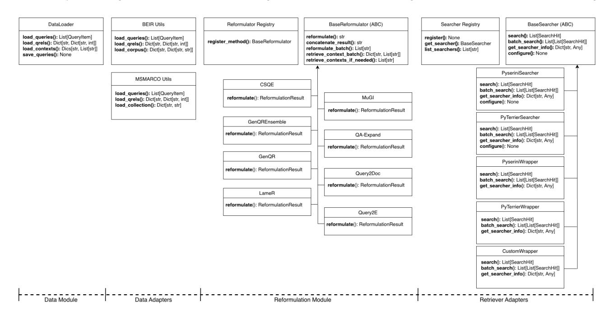

# QueryGym: A Toolkit for Reproducible LLM-Based Query Reformulation

[Amin Bigdeli](https://orcid.org/0009-0003-8977-9312)∗ University of Waterloo Waterloo, Ontario, Canada abigdeli@uwaterloo.ca

[Radin Hamidi Rad](https://orcid.org/0000-0002-9044-3723)∗ Mila – Quebec AI Institute Montreal, Quebec, Canada radin.hamidi-rad@mila.quebec

Mert Incesu University of Toronto Toronto, Ontario, Canada mert.incesu03@gmail.com

[Negar Arabzadeh](https://orcid.org/0000-0002-4411-7089) University of California, Berkeley Berkeley, California, USA negara@berkeley.edu

[Charles L. A. Clarke](https://orcid.org/0000-0001-8178-9194) University of Waterloo Waterloo, Ontario, Canada claclark@gmail.com

[Ebrahim Bagheri](https://orcid.org/0000-0002-5148-6237) University of Toronto Toronto, Ontario, Canada ebrahim.bagheri@utoronto.ca

### Abstract

We present QueryGym, a lightweight, extensible Python toolkit that supports large language model (LLM)-based query reformulation. This is an important tool development since recent work on llm-based query reformulation has shown notable increase in retrieval effectiveness. However, while different authors have sporadically shared the implementation of their methods, there is no unified toolkit that provides a consistent implementation of such methods, which hinders fair comparison, rapid experimentation, consistent benchmarking and reliable deployment. QueryGym addresses this gap by providing a unified framework for implementing, executing, and comparing llm-based reformulation methods. The toolkit offers: (1) a Python API for applying diverse LLMbased methods, (2) a retrieval-agnostic interface supporting integration with backends such as Pyserini and PyTerrier, (3) a centralized prompt management system with versioning and metadata tracking, (4) built-in support for benchmarks like BEIR and MS MARCO, and (5) a completely open-source extensible implementation available to all researchers. QueryGym is publicly available at [https://github.com/radinhamidi/QueryGym.](https://github.com/radinhamidi/QueryGym)

## 1 Introduction

Query reformulation and expansion play a central role in Information Retrieval (IR), particularly in scenarios where the initial user query is underspecified, ambiguous, or contextually sparse [\[1,](#page-3-0) [4,](#page-3-1) [9,](#page-3-2) [10\]](#page-3-3). Building on recent advances in large language models (LLMs), a growing body of work has introduced techniques that employ LLMs to generate enriched or contextualized variants of user queries, with the goal of improving alignment between query intent and relevant documents [\[2,](#page-3-4) [12,](#page-3-5) [14,](#page-3-6) [15\]](#page-3-7). These approaches frequently demonstrate strong retrieval gains in zero-shot and few-shot settings, largely due to their reliance on prompt-based generation rather than supervised training [\[3,](#page-3-8) [5,](#page-3-9) [11,](#page-3-10) [16\]](#page-3-11).

Despite increasing interest in LLM-driven query expansion, progress in this area is constrained by the absence of a dedicated, reusable software framework that enables systematic development and reproducible experimentation. Existing methods [\[5,](#page-3-9) [12,](#page-3-5) [14,](#page-3-6) [16\]](#page-3-11) present three recurring limitations. First, many approaches lack publicly released implementations [\[3,](#page-3-8) [12,](#page-3-5) [14,](#page-3-6) [15\]](#page-3-7), and the limited codebases that are available are often tightly bound to specific datasets, prompt

templates, or retrieval backends, reducing their applicability across benchmarks and domains [\[5,](#page-3-9) [16\]](#page-3-11). Second, current implementations typically do not provide standardized interfaces, modular components, or extensible system abstractions. As a result, adapting these methods to new datasets, modifying prompting strategies, or integrating with alternative retrieval pipelines requires substantial engineering overhead. Third, reproducibility remains difficult due to undocumented dependencies, hardcoded configurations and prompts, ad hoc scripts, and inconsistent output formats. These challenges, among others, necessitate a unified and extensible toolkit that would facilitate rapid experimentation, systematic assessment of prompt and model variations, and ensures reproducible work in LLM-based query reformulation.

To address these challenges, we propose QueryGym[1](#page-0-0) , a wellstructured, extensible, and publicly available toolkit designed to support research on LLM-based query reformulation. QueryGym is designed to facilitate the development of LLM-based query expansion strategies within a unified software framework. At its core, the toolkit is built around four key capabilities: (1) a unified reformulation framework for standardizing the implementation of methods; (2) a retrieval-agnostic interface for seamless integration with diverse IR retrieval libraries; (3) a centralized prompt bank for reproducible prompt engineering and template management; and (4) LLM compatibility and reproducibility support to enable implementation across diverse LLMs and prompting strategies.

At the center of QueryGym is the unified reformulation framework, which provides a standardized execution flow for implementing reformulation methods, managing prompts, interacting with LLMs, and formatting outputs. The toolkit supports batch reformulation with flexible concatenation strategies and robust handling of inputs and outputs. It also offers native support for popular IR datasets, including MS MARCO and BEIR, while also supporting custom and local formats through flexible loaders.

QueryGym also leverages a retrieval-agnostic interface that enables seamless integration with diverse IR pipelines, such as Pyserini [\[6\]](#page-3-12) and PyTerrier [\[7\]](#page-3-13). This design ensures that query reformulation process can be performed through a standardized retrieval setting without requiring any pipeline reimplementation.

To support prompt experimentation, QueryGym introduces a centralized Prompt Bank, which manages versioned templates along with structured metadata. This enables prompt sharing and reuse

∗Both authors contributed equally to this research.

1<https://querygym.readthedocs.io/>

Figure 1: Inheritance hierarchy for the main classes in the **QueryGym** Python package.

across models and datasets and ensures reproducibility and transparency in prompt design. Importantly, the toolkit is fully LLMcompatible and supports both open-source models and API-based LLMs that can be accessed through OpenAI-compatible endpoints. These makes QueryGym a suitable toolkit to assess the impact of various LLMs and prompt variations.

Finally, the toolkit is built to help with reproducibility and scale. All experiments are driven by structured configuration files that control prompt version, model parameters, and retrieval settings. Reformulated queries are saved in both retrieval-ready and structured formats, while a CLI and high-level Python API provide flexible entry points for rapid prototyping and large-scale batch runs. Metadata, including prompt identifiers, LLM generation traces, and configuration parameters, is automatically logged to ensure that experimental results can be reliably audited and reproduced.

In our demo presentation, we will present QueryGym as a principled, flexible, and reproducible toolkit for LLM-based query reformulation. We (1) introduce the reformulation methods supported by QueryGym and illustrate how different methods can be employed; (2) demonstrate how new prompting methods and LLMs can be seamlessly integrated into the framework; (3) show how the unified interface enables fair, reproducible experimentation across datasets and retrieval backends; and (4) walk through real-world usage scenarios using the provided CLI and API, highlighting QueryGym's value for both fast experimentation and scalable pipeline deployment.

#### 2 Toolkit Overview

QueryGym is a modular and extensible Python toolkit designed to facilitate systematic research and development in LLM-based query reformulation. It can be easily installed via "pip install querygym". The toolkit is organized into four loosely coupled modules including Data Module and Data Adapters, Reformulation Module, Retriever Adapters, and Configuration Utilities. It exposes a consistent object-oriented interface for defining reformulation strategies, loading benchmark datasets, integrating with retrieval engines, and managing input/output workflows. Figure [1](#page-1-0) presents an overview of QueryGym core classes and their relationships.

Data Module and Data Adapters. The data module provides a lightweight, dependency-free interface for ingesting benchmark datasets. At its core is the DataLoader class, which handles the loading and saving of queries, qrels, and context passages in TSV or JSONL formats. To streamline experimentation on widely used benchmarks, QueryGym includes specialized adapters for datasets like BEIR [\[13\]](#page-3-14) and MS MARCO [\[8\]](#page-3-15), with utilities tailored to their respective file structures. This abstraction simplifies switching between datasets and ensures compatibility with retrieval pipelines and experimentation frameworks. The modular design also allows additional dataset adapters to be added with minimal effort, en-

abling broader applicability across IR benchmarks. Reformulation Module. At the core of QueryGym is a unified reformulation framework centered on an abstract base class that standardizes method execution and encapsulates shared functionality for prompt rendering, context retrieval, and output formatting. The toolkit includes implementations of recent LLM-based reformulation methods drawn from literature, including Query2Doc [\[14\]](#page-3-6), GenQR [\[15\]](#page-3-7), GenQREnsemble [\[2\]](#page-3-4), MuGI [\[16\]](#page-3-11), QA-Expand [\[11\]](#page-3-10), LameR [\[12\]](#page-3-5), Query2E [\[3\]](#page-3-8), and CSQE [\[5\]](#page-3-9). Each method is implemented as a modular subclass, adhering to a common interface, enabling consistent usage, extensibility, and integration.

To support extensibility, QueryGym adopts a lightweight decoratorbased registration mechanism that allows new methods to be seamlessly added without altering the core framework. Once registered,

these methods are immediately accessible through the toolkit's Python API and CLI. This design facilitates rapid experimentation with novel prompting techniques while ensuring compatibility with the surrounding infrastructure for dataset management and retrieval integration.

Retriever Integration and Wrappers. For query reformulation methods that rely on retrieval context, such as those requiring passages or pseudo-relevance feedback, QueryGym defines a dedicated retriever abstraction through the BaseSearcher interface. This interface decouples reformulation logic from backend retrieval, supporting both single-query and batch retrieval workflows. It is compatible with widely-used IR toolkits such as Pyserini [\[6\]](#page-3-12) and PyTerrier [\[7\]](#page-3-13), which are integrated via dedicated wrappers.

Searchers can be instantiated dynamically through a registrybased mechanism, allowing flexible configuration at runtime. Provided wrappers, including support for Pyserini, PyTerrier, and custom search engines, enable seamless interoperability with existing IR tools. This retrieval-agnostic architecture ensures that reformulation methods can operate consistently across different retrieval backends without requiring changes to their core implementation. Prompt Management and Configuration. Prompting logic is centralized through a YAML-based Prompt Bank, which stores template definitions along with metadata, role formatting (system/user/assistant), and version identifiers. Prompts are rendered dynamically with variable and are logged for full traceability. This enables systematic prompt tuning and sharing across experiments.

Overall, QueryGym has a clear separation between data handling, reformulation logic, retrieval integration, and prompt configuration, which allows researchers to experiment with new methods, prompts, and retrieval strategies without entangling components. By providing a consistent API, structured configuration, and interoperability with widely used IR toolkits, QueryGym lowers the barrier to reproducible experimentation and scalable deployment.

#### 3 Demonstrating Use Cases

To illustrate the utility of QueryGym, we present several representative use cases that demonstrate how the toolkit facilitates query reformulation across different levels of complexity and integration. These examples highlight QueryGym's suitability for both rapid prototyping and scalable experimentation in realistic setting.

Basic Query Reformulation. Figure [2](#page-2-0) shows a basic example in which a set of user queries is reformulated using a single method and a specified LLM. This simple workflow is representative of lightweight experimentation, where researchers can iterate over prompting strategies and inspect reformulation outputs with minimal setup. The toolkit automatically handles batch processing, progress tracking, and result formatting. Results include both reformulated queries and method-specific metadata, enabling comprehensive downstream analysis and evaluation.

Context-Based Reformulation with Retrieval. Query reformulation methods that rely on external context such as top-ranked passages can be directly integrated with retrieval engines using QueryGym's retriever abstraction. Figure [3](#page-2-1) illustrates an end-to-end pipeline where a context-aware method is applied to a benchmark dataset using a prebuilt Pyserini index. The retrieval system is seamlessly wrapped using QueryGym's utility functions, allowing

 import querygym as qg # Load queries queries = qg.load\_queries("examples/tiny\_queries.tsv") # Create reformulator reformulator = qg.create\_reformulator("query2doc", model="gpt -4") # Reformulate results = reformulator.reformulate\_batch(queries) # Show results for r in results: print(f"{r.qid}: {r.original} -> {r.reformulated}")

Figure 2: Example usage of **QueryGym** for query reformulation.

reformulation strategies to incorporate retrieved content without altering core logic or re-implementing IR components.

This retrieval-agnostic integration allows researchers to run retrieval-augmented prompting methods in realistic scenarios using widely adopted toolkits. QueryGym's interface ensures compatibility with both batch and single-query workflows and supports configuration of retrieval parameters such as ranking models and passage cutoffs. By bridging LLM-based reformulation with established IR infrastructure, QueryGym enables reproducible experimentation within modular and extensible pipelines.

 import querygym as qg from pyserini.search.lucene import LuceneSearcher # User configuration DATA\_DIR = "data" # Load queries queries = qg.loaders.msmarco.load\_queries(f"{DATA\_DIR}/queries. tsv") # Initialize searcher searcher = LuceneSearcher.from\_prebuilt\_index('msmarco-v1 passage') searcher.set\_bm25(k1=0.9, b=0.4) # Wrap searcher and create reformulator wrapped\_searcher = qg.wrap\_pyserini\_searcher(searcher, answer\_key="contents") reformulator = qg.create\_reformulator( method\_name="csqe", model="gpt-4", 15 params={ "searcher": wrapped\_searcher, "retrieval\_k": 10, "gen\_passages": 5, 19 }, llm\_config={ "temperature": 1.0, "max\_tokens": 128, 23 } 24 ) # Reformulate results = reformulator.reformulate\_batch(queries)

Figure 3: Integrated pipeline for Pyserini retrieval and **QueryGym** reformulation.

Leaderboard and Benchmarking. QueryGym facilitates reproducible method comparison across datasets under controlled experimental conditions. Figure [4](#page-3-16) demonstrates a systematic experimentation pipeline that benchmarks six reformulation methods on three MS MARCO datasets with identical LLM configurations.

The pipeline enforces identical experimental configurations across all runs through centralized parameter management. Method-specific requirements are handled programmatically, while outputs are organized hierarchically for immediate downstream evaluation with standard IR tools.

 import querygym as qg from pyserini.search.lucene import LuceneSearcher # Benchmark configuration DATASETS = ["dev\_small", "trecdl2019", "trecdl2020"] METHODS = ["genqr", "genqr\_ensemble", "query2doc", "qa\_expand" , "lamer", "csqe"] CONTEXT\_METHODS = {"lamer", "csqe"} DATA\_DIR = "data" LLM\_CONFIG = { "model": "gpt-4o", "temperature": 0.8, "max\_tokens": 256, "seed": 42 13 } # Initialize shared index for all MS MARCO datasets searcher = LuceneSearcher.from\_prebuilt\_index('msmarco-v1 passage') searcher.set\_bm25(k1=0.9, b=0.4) wrapped\_searcher = qg.wrap\_pyserini\_searcher(searcher, answer\_key="contents") for dataset in DATASETS: queries = qg.loaders.msmarco.load\_queries(f"{DATA\_DIR}/{ dataset}/queries.tsv") for method in METHODS: method\_params = ( {"searcher": wrapped\_searcher, "retrieval\_k": 10} if method in CONTEXT\_METHODS else {} 24 ) reformulator = qg.create\_reformulator( 26 method, model=LLM\_CONFIG["model"], params=method\_params, llm\_config={k: v for k, v in LLM\_CONFIG.items() if k != "model"}, seed=LLM\_CONFIG["seed"] 31 ) reformulated = reformulator.reformulate\_batch(queries) # Export reformulated queries qg.DataLoader.save\_queries( [qg.QueryItem(r.qid, r.reformulated) for r in reformulated], f"benchmark/{dataset}/{method}.tsv" 37 )

Figure 4: Multi-method benchmarking pipeline across datasets under controlled conditions.

This workflow illustrates how QueryGym facilitates systematic IR research, enabling researchers to scale from single-method to multi-method, multi-dataset experimentation while preserving reproducibility and methodological consistency.

## 4 Concluding Remarks

QueryGym provides a cohesive and practical environment for investigating LLM-based query reformulation, designed to facilitate extensibility, controlled experimentation, and seamless interoperability with modern retrieval pipelines. The demo will guide attendees through the core capabilities of the toolkit and illustrate how its unified abstractions simplify the development of reformulation strategies. Our demonstration will showcase the following:

- • interactive execution of reformulation methods via both the Python API and command-line interface, highlighting the ease of iterating over models, prompts, and reformulation strategies;
- • end-to-end workflows that integrate reformulation with retrieval tools such as Pyserini and PyTerrier, illustrating retrieval-agnostic design choices and straightforward backend substitution;
- prompt selection, versioning, and metadata inspection enabled by the centralized prompt bank, demonstrating how prompt management supports transparent and reproducible experimentation;

- benchmarking pipelines that compare multiple reformulation methods across datasets under consistent settings, enabling fair and repeatable experimentation;
- incorporation of a new reformulation method or LLM backend to demonstrate the lightweight extensibility mechanism and the clarity of the underlying abstractions;

Through these examples, the demonstration aims to show how QueryGym enables both rapid prototyping and systematic experimentation of LLM-driven query reformulation, providing a reproducible, modular, and extensible foundation for future research. The complete open-source implementation of QueryGym is available at [https://github.com/radinhamidi/QueryGym.](https://github.com/radinhamidi/QueryGym)

#### References

[1] Nasreen Abdul-Jaleel, James Allan, W Bruce Croft, Fernando Diaz, Leah Larkey, Xiaoyan Li, Mark D Smucker, and Courtney Wade. 2004. UMass at TREC 2004: Novelty and HARD. (2004). [2] Kaustubh D Dhole and Eugene Agichtein. 2024. Genqrensemble: Zero-shot llm ensemble prompting for generative query reformulation. In European Conference on Information Retrieval. Springer, 326–335. [3] Rolf Jagerman, Honglei Zhuang, Zhen Qin, Xuanhui Wang, and Michael Bendersky. 2023. Query expansion by prompting large language models. arXiv preprint arXiv:2305.03653 (2023). [4] Victor Lavrenko and W Bruce Croft. 2017. Relevance-based language models. In ACM SIGIR Forum, Vol. 51. ACM New York, NY, USA, 260–267. [5] Yibin Lei, Yu Cao, Tianyi Zhou, Tao Shen, and Andrew Yates. 2024. Corpus-Steered Query Expansion with Large Language Models. In Proceedings of the 18th Conference of the European Chapter of the Association for Computational Linguistics (Volume 2: Short Papers), Yvette Graham and Matthew Purver (Eds.). Association for Computational Linguistics, St. Julian's, Malta, 393–401. [doi:10.](https://doi.org/10.18653/v1/2024.eacl-short.34) [18653/v1/2024.eacl-short.34](https://doi.org/10.18653/v1/2024.eacl-short.34) [6] Jimmy Lin, Xueguang Ma, Sheng-Chieh Lin, Jheng-Hong Yang, Ronak Pradeep, and Rodrigo Nogueira. 2021. Pyserini: A Python Toolkit for Reproducible Information Retrieval Research with Sparse and Dense Representations. In Proceedings of the 44th Annual International ACM SIGIR Conference on Research and Development in Information Retrieval (SIGIR 2021). 2356–2362. [7] Craig Macdonald and Nicola Tonellotto. 2020. Declarative Experimentation inInformation Retrieval using PyTerrier. In Proceedings of ICTIR 2020. [8] Tri Nguyen, Mir Rosenberg, Xia Song, Jianfeng Gao, Saurabh Tiwary, Rangan Majumder, and Li Deng. 2016. Ms marco: A human-generated machine reading comprehension dataset. (2016). [9] Gustavo Penha, Arthur Câmara, and Claudia Hauff. 2022. Evaluating the robustness of retrieval pipelines with query variation generators. In European conference on information retrieval. Springer, 397–412. [10] Joseph John Rocchio Jr. 1971. Relevance feedback in information retrieval. The SMART retrieval system: experiments in automatic document processing (1971). [11] Wonduk Seo and Seunghyun Lee. 2025. QA-Expand: Multi-Question Answer Generation for Enhanced Query Expansion in Information Retrieval. arXiv preprint arXiv:2502.08557 (2025). [12] Tao Shen, Guodong Long, Xiubo Geng, Chongyang Tao, Yibin Lei, Tianyi Zhou, Michael Blumenstein, and Daxin Jiang. 2024. Retrieval-Augmented Retrieval: Large Language Models are Strong Zero-Shot Retriever. In Findings of the Association for Computational Linguistics: ACL 2024, Lun-Wei Ku, Andre Martins, and Vivek Srikumar (Eds.). Association for Computational Linguistics, Bangkok, Thailand, 15933–15946. [doi:10.18653/v1/2024.findings-acl.943](https://doi.org/10.18653/v1/2024.findings-acl.943) [13] Nandan Thakur, Nils Reimers, Andreas Rücklé, Abhishek Srivastava, and Iryna Gurevych. 2021. BEIR: A Heterogeneous Benchmark for Zero-shot Evaluation of Information Retrieval Models. In Thirty-fifth Conference on Neural Information Processing Systems Datasets and Benchmarks Track (Round 2). [https://openreview.](https://openreview.net/forum?id=wCu6T5xFjeJ) [net/forum?id=wCu6T5xFjeJ](https://openreview.net/forum?id=wCu6T5xFjeJ) [14] Liang Wang, Nan Yang, and Furu Wei. 2023. Query2doc: Query expansion with large language models. arXiv preprint arXiv:2303.07678 (2023). [15] Xiao Wang, Sean MacAvaney, Craig Macdonald, and Iadh Ounis. 2023. Generative query reformulation for effective adhoc search. arXiv preprint arXiv:2308.00415 (2023). [16] Le Zhang, Yihong Wu, Qian Yang, and Jian-Yun Nie. 2024. Exploring the Best Practices of Query Expansion with Large Language Models. In Findings of the Association for Computational Linguistics: EMNLP 2024, Yaser Al-Onaizan, Mohit Bansal, and Yun-Nung Chen (Eds.). Association for Computational Linguistics, Miami, Florida, USA, 1872–1883. [doi:10.18653/v1/2024.findings-emnlp.103](https://doi.org/10.18653/v1/2024.findings-emnlp.103)