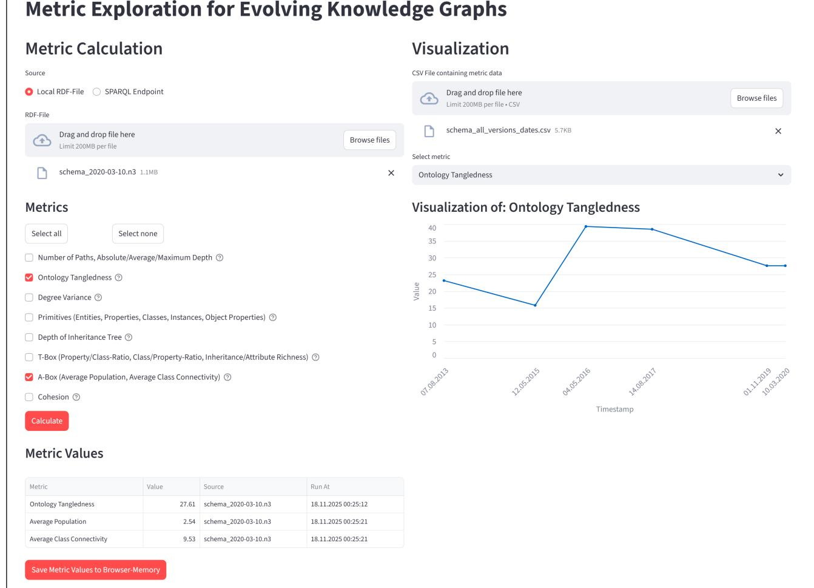
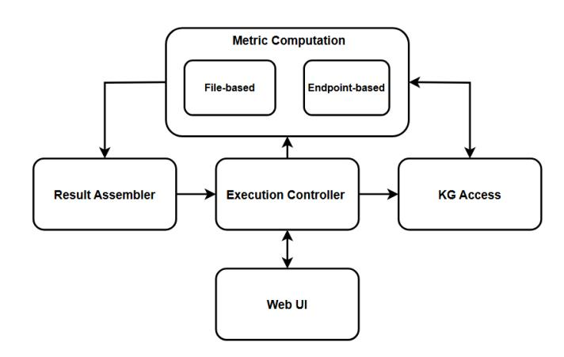

# MetriKG: Profiling Static and Evolving Knowledge Graphs

[Hasan H. Günes](https://orcid.org/0009-0005-5277-1119) TU Wien Vienna, Austria e12229237@student.tuwien.ac.at

[Milos Jovanovik](https://orcid.org/0000-0001-7360-8015) TU Wien Vienna, Austria Ss. Cyril and Methodius University Skopje, N. Macedonia milos.jovanovik@tuwien.ac.at

[Katja Hose](https://orcid.org/0000-0001-7025-8099) TU Wien Vienna, Austria katja.hose@tuwien.ac.at

### Abstract

Knowledge graphs (KGs) are a foundational technology for representing and integrating information across heterogeneous domains. As some KGs evolve, understanding how their structural and semantic properties change over time is crucial for ensuring quality, consistency, and interpretability. Existing methods for KG evaluation often focus on static graphs or analyze evolution solely at the data level, leaving schema-level dynamics underexplored. To address this gap, we introduce MetriKG, a web-based application that computes a comprehensive set of metrics for both static and evolving KGs. MetriKG enables users to evaluate KGs provided as RDF files or through SPARQL endpoints, allowing for multi-dimensional analysis of aspects such as cohesion, connectivity, and inheritance depth. By supporting metric computation at both data and schema levels, MetriKG allows for systematic profiling, classification, and temporal monitoring of KGs. MetriKG is open-source and publicly available.

#### CCS Concepts

#### • Information systems → Information integration; Resource Description Framework (RDF).

#### Keywords

Knowledge Graph Metrics; Evolving Knowledge Graphs; Knowledge Graphs; RDF

#### ACM Reference Format:

Hasan H. Günes, Milos Jovanovik, and Katja Hose. 2026. MetriKG: Profiling Static and Evolving Knowledge Graphs. In Companion Proceedings of the ACM Web Conference 2026 (WWW Companion '26), April 13–17, 2026, Dubai, United Arab Emirates. ACM, New York, NY, USA, [4](#page-3-0) pages. [https://doi.org/10.](https://doi.org/10.1145/3774905.3793136) [1145/3774905.3793136](https://doi.org/10.1145/3774905.3793136)

#### 1 Introduction and Motivation

Knowledge graphs (KGs) are widely used for representing and integrating information across domains [\[7\]](#page-3-1). They are structured in a graph format, using the Resource Description Framework (RDF) as a technical foundation [\[6\]](#page-3-2).

Since knowledge in many systems evolves over time, the concept of evolving knowledge graphs has emerged, representing KGs in which the content is dynamically updated [\[11\]](#page-3-3). One research topic

[This work is licensed under a Creative Commons Attribution 4.0 International License.](https://creativecommons.org/licenses/by/4.0) WWW Companion '26, Dubai, United Arab Emirates © 2026 Copyright held by the owner/author(s). ACM ISBN 979-8-4007-2308-7/2026/04 <https://doi.org/10.1145/3774905.3793136>

that is prevalent is how does knowledge change over time in evolving KGs and which patterns of structural and semantic evolution can be observed. In order to determine precisely how the structural and semantic characteristics of evolving KGs change over time, certain graph metrics need to be calculated and monitored. These metrics enable the evaluation of various aspects of the KG, such as cohesion, connectivity, and inheritance depth, as well as the ways in which these aspects change with time [\[11\]](#page-3-3).

Additionally, not all knowledge graphs share the same structural or semantic characteristics [\[7,](#page-3-1) [11\]](#page-3-3). When developing AI-based systems that rely on data semantically represented with knowledge graphs, it is important to use the correct knowledge graph embedding techniques for the correct type of knowledge graphs [\[9\]](#page-3-4). In order to enable such profiling of KGs and classify them into different categories, we need to measure their relevant characteristics.

Therefore we introduce MetriKG, an open-source web-based application that computes a range of important metrics for both static KGs and evolving KGs. Metrics can be evaluated either for an uploaded RDF file or by specifying a live SPARQL endpoint. Using MetriKG, KGs and snapshots of evolving KGs can be analyzed in multiple dimensions, allowing for both profiling of KGs and the monitoring of structural and semantic changes over time in evolving KGs.

There have been other approaches addressing different dimensions of evolving KGs, but most do not consider evolution at both the data and schema level [\[11\]](#page-3-3). For instance, OntoQA [\[13\]](#page-3-5) introduces a set of metrics focused on ontology characteristics, most of which are also covered by MetriKG. It evaluates multiple ontologies by applying these defined metrics. Unlike OntoQA which focuses on ontologies, MetriKG calculates metrics for both entire knowledge graphs and ontologies.

ABSTAT-HD [\[2\]](#page-3-6) is a similar tool that provides profiling of large knowledge graphs, but it is based on statistics and RDF pattern summaries [\[4\]](#page-3-7). In contrast, MetriKG uses a comprehensive set of metrics carefully designed to create a full profile of a given KG, based on both structural and semantic characteristics.

This paper is structured as follows: Section [2](#page-0-0) outlines the set of metrics we measure in MetriKG, Section [3](#page-1-0) presents the architecture and interface of MetriKG and Section [4](#page-3-8) concludes the paper with an outlook on future work.

# 2 Metrics

A selected set of structural and semantic metrics that are important for static and evolving knowledge graphs was presented in [\[11\]](#page-3-3). MetriKG is based on these metrics. The paper categorizes them into two main groups: (i) graph-based metrics, and (ii) knowledgegraph-based metrics.

### 2.1 Graph-Based Metrics

Graph-based metrics describe attributes that can be applied to any graph consisting of nodes and edges, independent of the graph type [\[11\]](#page-3-3). They measure the general characteristics of a graph.

Number of Paths [\[15\]](#page-3-9): Computes the total number of paths in a graph. A path is defined as a sequence of connected nodes, where each pair of consecutive nodes is linked by an edge. In our implementation, any connection that adds cycles to a path is excluded from the calculation. This metric is implemented using the recursive depth-first search (DFS) algorithm. After identifying all root nodes in the RDF graph, it explores all possible paths starting from these root nodes down to the leaf nodes. Any node that does not appear as an object in any triple is considered a root node.

Absolute Depth [\[8\]](#page-3-10): It is defined as the sum of the lengths of all paths existing in the graph. The path length is defined as the number of edges in a path.

Average Depth [\[5\]](#page-3-11): Measures the average length of the paths within the graph.

Maximal Depth [\[8\]](#page-3-10): Describes the length of the longest path in the graph.

Degree Variance [\[3\]](#page-3-12): Measures the variance of the degree distribution in a graph. More precisely, the formula below is used to compute this metric for a graph ��. In it, ������(��) represents the degree of any node ��. Then, ���� is the number of nodes within the graph, while ���� represents the number of edges.

�� = Í ��∈�� (������(��) − 2∗���� ���� ) 2 ���� − 1 (1)

#### 2.2 Knowledge-Graph-Based Metrics

In contrast to graph metrics, KG metrics focus on the semantic characteristics of a knowledge graph. This category can be further grouped into three parts [\[11\]](#page-3-3): (i) primitive metrics, (ii) schema metrics, and (iii) data metrics.

2.2.1 Primitive Metrics. These metrics describe single, raw characteristics of a KG.

Number of Entities [\[12\]](#page-3-13): Measures the total number of unique resources (IRIs or blank nodes), that appear as a node within the graph.

Number of Properties [\[10\]](#page-3-14): Refers to both the explicitly defined properties in the T-Box and those occurring in the A-Box triples of the knowledge graph.

Number of Classes [\[15\]](#page-3-9): Measures the number of classes in a graph. Several criteria are used for identifying an entity as a class:

- (1) Any resource that appears as the object of an rdf:type triple.
- (2) Any resource that appears as the subject or object of a rdfs:subClassOf or owl:equivalentClass triple.
- (3) The subject of a triple declaring an owl:Restriction.
- (4) The subject of complex class definitions using owl:unionOf, owl:intersectionOf, owl:complementOf or owl:oneOf.
- (5) The subject of an owl:hasValue restriction.

Number of Instances [\[14\]](#page-3-15): Counts the total number of individuals / instances in the A-Box of a KG.

Number of Object Properties [\[8\]](#page-3-10): Is defined as the sum of two counts: The properties explicitly declared as an Object Property in the T-Box and all unique predicates in the A-Box that are connecting to a non-literal object.

2.2.2 Schema Metrics. These metrics focus on the T-Box characteristics of the KG.

Ontology Tangledness [\[1\]](#page-3-16): This metric is defined as the ratio of the Number of Classes to the number of tangled classes. A class is considered tangled if it has more than one direct superclass. If there is no tangled class in the RDF graph, the metric value is defined as zero.

Depth of Inheritance Tree [\[10\]](#page-3-14): It measures the maximum depth of the class inheritance hierarchy, only considering class relationships. Potential root classes of the tree are those (rdf:Class or owl:Class) that do not have any superclass. Similar to the approach used for the Number of Paths metric, this measure is computed by using a recursive DFS algorithm. During the traversal, the global maximum depth is updated accordingly.

Property Class Ratio [\[10\]](#page-3-14): Divides the Number of Properties by the Number of Classes.

Class Property Ratio [\[1\]](#page-3-16): Represents the inverse relationship by dividing the Number of Classes by the Number of Properties.

Inheritance Richness [\[14\]](#page-3-15): Measures the ratio of the number of subclass relationships to the Number of Classes.

Attribute Richness [\[14\]](#page-3-15): Calculates the ratio of explicitly declared datatype properties to the Number of Classes. This metric is a more specific version of the Property Class Ratio, since the only difference is the property type.

2.2.3 Data Metrics. These metrics refer to both T-Box and A-Box characteristics of the KG.

Average Population [\[14\]](#page-3-15): Represents the average number of individuals / instances per class.

Average Class Connectivity [\[15\]](#page-3-9): Measures the average number of relationships that instances of a class have with instances belonging to other classes. It is computed by dividing the number of such relationships by the Number of Classes.

Cohesion [\[14\]](#page-3-15): Quantifies the number of connected components in the KG. A component is defined as a set of nodes that are mutually reachable, either directly or through paths, independent of the direction of the edges. Each component is identified by exploring all nodes reachable from a randomly selected starting node.

### 3 MetriKG

MetriKG is an application developed in Python, which provides a web-based interface that allows users to specify a knowledge graph and calculate the desired metrics for it. The code is open-source and is publicly available on GitHub[1](#page-1-1) .

#### 3.1 Architecture

Figure [2](#page-3-17) depicts the five main components of the MetriKG architecture. The Web UI, implemented using the Streamlit[2](#page-1-2) framework, handles user interaction, input validation, and result visualization.

1https://github.com/dmki-tuwien/metriKG 2https://streamlit.io/

Figure 1: Tool interface with results for metrics computed on a KG from an uploaded RDF file and a visualization of the evolution of the Ontology Tangledness of the same KG, at different points in time

The Execution Controller acts as the central coordinator and interacts with all other components. Using the Papermill[3](#page-2-0) and Scrapbook[4](#page-2-1) frameworks, it exchanges data with the Web UI, triggers graph access and metric computations, and retrieves results from the Result Assembler.

The KG Access component has the ability to load and manipulate local RDF graphs using the RDFLib[5](#page-2-2) library, and to communicate with a remote SPARQL endpoint using the SPARQLWrapper[6](#page-2-3) library. When SPARQL endpoints are used, this component uses SPARQL queries to retrieve the necessary data from the KG.

The Metric Computation layer calculates the selected metrics, using the KG Access component to retrieve the necessary graph data. Finally, the pandas-based[7](#page-2-4) Result Assembler merges all metric

outputs and prepares them for display in the Web UI component.

### 3.2 Interface

The MetriKG interface (Figure [1\)](#page-2-5) allows the user to first provide a knowledge graph. This can be done either by uploading an RDF file (Turtle, JSON-LD, RDF/XML, N3, etc.) containing the KG, or by specifying a SPARQL endpoint.

The next step is to select the metrics to be computed. For convenience, tooltips (Figure [3\)](#page-3-18) offer additional information about the definition and implementation of each metric within a metric group. The calculations can then be started. During the calculation, the user is continuously informed about the calculation status through a progress component on the webpage.

After the calculations finish, the results are dynamically displayed in a table on the same webpage. The table contains the timestamp of when the calculation was done. Additionally, the user has the opportunity to download the content of the results table in

3https://papermill.readthedocs.io/en/latest/

4https://nteract-scrapbook.readthedocs.io/en/latest/

5https://rdflib.readthedocs.io/en/stable/

6https://sparqlwrapper.readthedocs.io/en/latest/

7https://pandas.pydata.org/

Figure 2: MetriKG architecture diagram

a CSV format or save them in the browser memory. The results can be combined with previous results for a given KG, and then used for visualizing evolution. MetriKG can visualize any chosen metric that is present in the uploaded CSV results and provide insight into the evolution of the KG in question.

Figure [1](#page-2-5) illustrates a case in which MetriKG is used to calculate the ontology tangledness, the average population, and the average class connectivity for a KG uploaded as an RDF file. The results table shows the computed metric value along with the source file and the timestamp of the calculation. The same figure illustrates how the ontology tangledness of the same KG has evolved over time.

Figure [3](#page-3-18) shows the tooltip for the T-Box metrics, for instance, providing a description of each metric included in this group.

Figure 3: Example tooltip for T-Box metrics

# 4 Conclusion and Future Work

In this paper, we present MetriKG, a web-based application for computing a broad range of knowledge graph metrics. It simplifies the evaluation of static and evolving KGs - whether provided as RDF files or accessible through SPARQL endpoints - from both structural and semantic perspectives. MetriKG offers an intuitive interface and an automated computation of metrics across multiple dimensions that have not been addressed by many existing tools. The calculation of metrics provided by MetriKG enables both profiling and classification of KGs, as well as monitoring the dynamics of evolving KGs over time.

Planned improvements include user logins and improved usability in terms of saving, combining and visualizing metrics for (evolving) KGs. An automated periodic evaluation of metrics for evolving KGs from public SPARQL endpoints could further enhance the tool. Another set of extensions could allow creation of profiles of KGs based on their characteristics, which would then help the user classify a newly tested KG within the defined profile.

#### Acknowledgments

This project was partially funded by the European Union [Horizon Europe, TARGET, grant agreement no. 101136244], Vienna Science and Technology Fund (WWTF) [DORSET, grant id: 10.47379/ICT25032], and the Faculty of Computer Science and Engineering, Ss. Cyril and Methodius University in Skopje.

#### References

[1] Rebekka Alm, Sven Kiehl, Birger Lantow, and Kurt Sandkuhl. 2013. Applicability of Quality Metrics for Ontologies on Ontology Design Patterns. In International Conference on Knowledge Engineering and Ontology Development. 48–57. [2] Renzo Arturo Alva Principe, Andrea Maurino, Matteo Palmonari, Michele Ciavotta, and Blerina Spahiu. 2022. ABSTAT-HD: A Scalable Tool for Profiling Very Large Knowledge Graphs. The VLDB Journal 31, 5 (2022), 851–876. [3] Ekaterina S. Bolotnikova, Tatiana A. Gavrilova, and Vladimir A. Gorovoy. 2011. To a Method of Evaluating Ontologies. Journal of Computer and Systems Sciences International 50, 3 (2011), 448–461. [4] Šejla Čebirić, François Goasdoué, Haridimos Kondylakis, Dimitris Kotzinos, Ioana Manolescu, Georgia Troullinou, and Mussab Zneika. 2019. Summarizing Semantic Graphs: A Survey. The VLDB journal 28, 3 (2019), 295–327. [5] Aldo Gangemi, Carola Catenacci, Massimiliano Ciaramita, and Jos Lehmann. 2006. Modelling Ontology Evaluation and Validation. In The Semantic Web: Research and Applications. 140–154. [6] RDF Working Group. 2014. RDF 1.1 Concepts and Abstract Syntax. [https:](https://www.w3.org/TR/rdf11-concepts/) [//www.w3.org/TR/rdf11-concepts/.](https://www.w3.org/TR/rdf11-concepts/) [7] Aidan Hogan, Eva Blomqvist, Michael Cochez, Claudia D'amato, Gerard De Melo, Claudio Gutierrez, Sabrina Kirrane, José Emilio Labra Gayo, Roberto Navigli, Sebastian Neumaier, Axel-Cyrille Ngonga Ngomo, Axel Polleres, Sabbir M. Rashid, Anisa Rula, Lukas Schmelzeisen, Juan Sequeda, Steffen Staab, and Antoine Zimmermann. 2021. Knowledge Graphs. Comput. Surveys 54, 4, Article 71 (2021). [8] Birger Lantow and Kurt Sandkuhl. 2015. An Analysis of Applicability using Quality Metrics for Ontologies on Ontology Design Patterns. Intelligent Systems in Accounting, Finance and Management 22, 1 (2015), 81–99. [9] Mojtaba Nayyeri, Chengjin Xu, Sahar Vahdati, Nadezhda Vassilyeva, Emanuel Sallinger, Hamed Shariat Yazdi, and Jens Lehmann. 2020. Fantastic Knowledge Graph Embeddings and How to Find the Right Space for Them. In International Semantic Web Conference. 438–455. [10] Anthony M Orme, Haining Yao, and Letha H Etzkorn. 2007. Indicating Ontology Data Quality, Stability, and Completeness Throughout Ontology Evolution. Journal of Software Maintenance and Evolution: Research and Practice 19, 1 (2007), 49–75. [11] Axel Polleres, Romana Pernisch, Angela Bonifati, Daniele Dell'Aglio, Daniil Dobriy, Stefania Dumbrava, Lorena Etcheverry, Nicolas Ferranti, Katja Hose, Ernesto Jiménez-Ruiz, et al. 2023. How Does Knowledge Evolve in Open Knowledge Graphs? Transactions on Graph Data and Knowledge 1, 1 (2023), 11–1. [12] Ying Shen, Daoyuan Chen, Buzhou Tang, Min Yang, and Kai Lei. 2018. EAPB: Entropy-Aware Path-Based Metric for Ontology Quality. Journal of Biomedical Semantics 9, 1 (2018), 20. [13] Samir Tartir, I. Budak Arpinar, Michael Moore, Amit P. Sheth, and Boanerges Aleman-Meza. 2005. OntoQA: Metric-Based Ontology Quality Analysis. In IEEE ICDM Workshop on Knowledge Acquisition from Distributed, Autonomous, Semantically Heterogeneous Data and Knowledge Sources. [14] Samir Tartir, I. Budak Arpinar, and Amit P. Sheth. 2010. Ontological Evaluation and Validation. In Theory and Applications of Ontology: Computer Applications. 115–130. [15] Yang Zhe, Dalu Zhang, and YE Chuan. 2006. Evaluation Metrics for Ontology Complexity and Evolution Analysis. In IEEE International Conference on e-Business Engineering. 162–170.