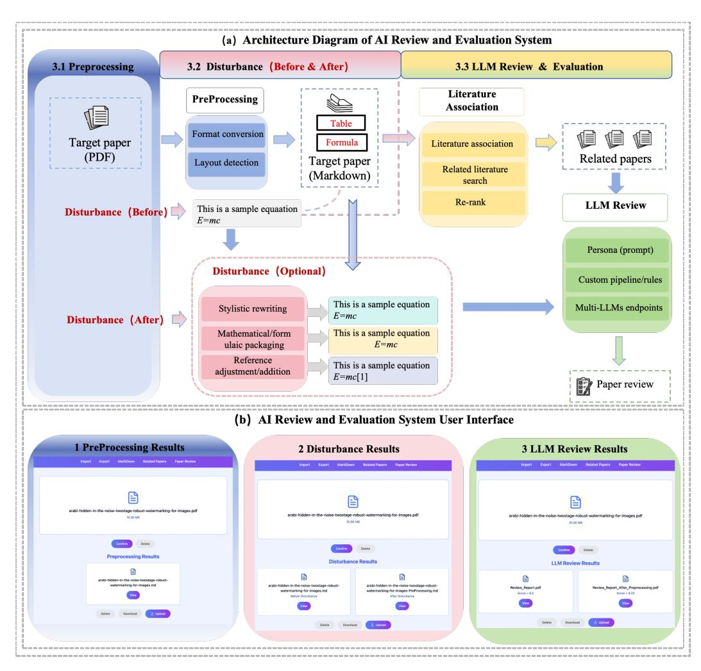

# RobustReviewAI: A Robustness Evaluation System for AI-Powered Peer Review

Siming Yuan Zhejiang University Hangzhou, China 12521269@zju.edu.cn

Yuchen Liu Hong Kong University of Science and Technology (Guangzhou) Guangzhou, China yliu356@connect.hkust-gz.edu.cn

Qinan Zheng Zhejiang University Hangzhou, China 3230104532@zju.edu.cn

Wangze Ni∗† Zhejiang University Hangzhou, China niwangze@zju.edu.cn

Shimin Di Southeast University Nanjing, China shimin.di@seu.edu.cn

Lei Chen‡ Hong Kong University of Science and Technology (Guangzhou) Guangzhou, China leichen@hkust-gz.edu.cn

Kui Ren Zhejiang University Hangzhou, China kuiren@zju.edu.cn

#### Abstract

With the rise of artificial intelligence, limited reviewing capacity cannot keep up with the rapidly growing number of papers to be reviewed. As a result, AI-based peer review systems have been adopted. However, existing robustness evaluation methods are limited by how perturbations are constructed. They only support text perturbations and cannot handle tables or formulas. As a result, the evaluation cannot fully cover all types of information. To address this gap, this paper proposes an AI review robustness evaluation system that integrates perturbation construction, evaluation, and automated generation into a closed-loop process, coupled with an intuitive interface to enhance evaluation efficiency. Based on this system, we reveal behavioral differences in AI-based peer review under various perturbations, highlighting robustness issues. [1](#page-0-0)

#### CCS Concepts

• Computing methodologies → Machine learning → Evaluation of machine learning models; • Software and its engineering → Software evaluation and testing → Robustness;

#### Keywords

LLM, AI evaluation system, Robustness evaluation, Disturbance construction

∗Wangze Ni is the corresponding author.

†Wangze Ni is also with The State Key Laboratory of Blockchain and Data Security; Hangzhou High-Tech Zone (Binjiang) Institute of Blockchain and Data Security. ‡Lei Chen is also with The Hong Kong University of Science and Technology. 1RobustReviewAI Demo video available at: [https://1drv.ms/v/c/9b5e0b3f59ef5edb/](https://1drv.ms/v/c/9b5e0b3f59ef5edb/EZlkXqn3aqxKptcTHV6wbvEBiIZQyRkK4oazLkPB184iwA?e=uOJWgF) [EZlkXqn3aqxKptcTHV6wbvEBiIZQyRkK4oazLkPB184iwA?e=uOJWgF](https://1drv.ms/v/c/9b5e0b3f59ef5edb/EZlkXqn3aqxKptcTHV6wbvEBiIZQyRkK4oazLkPB184iwA?e=uOJWgF)

[This work is licensed under a Creative Commons Attribution 4.0 International License.](https://creativecommons.org/licenses/by/4.0) WWW Companion '26, Dubai, United Arab Emirates © 2026 Copyright held by the owner/author(s). ACM ISBN 979-8-4007-2308-7/2026/04 <https://doi.org/10.1145/3774905.3793138>

#### ACM Reference Format:

Siming Yuan, Yuchen Liu, Qinan Zheng, Wangze Ni, Shimin Di, Lei Chen, and Kui Ren. 2026. RobustReviewAI: A Robustness Evaluation System for AI-Powered Peer Review. In Companion Proceedings of the ACM Web Conference 2026 (WWW Companion '26), April 13–17, 2026, Dubai, United Arab Emirates. ACM, New York, NY, USA, [4](#page-3-0) pages.<https://doi.org/10.1145/3774905.3793138>

# 1 Introduction

With the rapid development of artificial intelligence, research output has grown quickly. As a result, academic conferences and journals, such as top venues like WWW, face a rapidly increasing number of submissions. However, the review process still relies heavily on human reviewers. Limited reviewing resources can no longer keep up with this growth, placing strong pressure on review efficiency and consistency. To address this challenge, AI-based peer review systems have been introduced to support review decisions and reduce reviewer workload [\[1\]](#page-3-1).

Existing AI peer review systems mainly follow two directions. One line focuses on improving the review process through multiagent mechanisms, such as MAMORX [\[6\]](#page-3-2). The other line improves review performance through data construction and model training, such as DeepReview [\[8\]](#page-3-3) and SEA [\[7\]](#page-3-4). Despite these advances, robustness evaluation of AI peer review systems remains largely unexplored. Most prior work focuses on generating reviews, rather than evaluating the robustness and reliability of review outcomes under different disturbances.

Robustness evaluation critically depends on how perturbations are constructed. In real review scenarios, disturbances are not limited to textual changes. They often involve variations in tables and formulas. However, existing perturbation methods operate mainly at the text level. They cannot jointly handle text, tables, and formulas, which limits the coverage and effectiveness of robustness evaluation. To address this gap, we propose RobustReviewAI, an interactive system for evaluating the robustness of AI-based peer review systems. Our system supports coordinated perturbations of

text, tables, and formulas while preserving overall semantic consistency. Using RobustReviewAI, we demonstrate that AI reviewers are relatively stable under content changes but sensitive to non-content factors such as writing style.

#### 2 Related Work

Existing academic peer review systems based on large language models generally follow a structured PDF parsing and progressive review pipeline. REVIEWER2 [\[2\]](#page-3-5) uses a PGE pipeline to implement a two-stage structured review, covering the process from generating review points to producing complete reviews. DeepReviewYuan074 employs a three stage reasoning chain and multi-step inference strategies to better assess the novelty and reliability of papers. AGENTREVIEW [\[4\]](#page-3-6) simulates three roles—reviewers, authors, and area chairs—in a five-stage interaction process, expanding review dimensions and capturing more factors that influence decisions. REMOR [\[5\]](#page-3-7) combines supervised fine-tuning with multi-objective reinforcement learning to align model outputs with human preferences. Although these systems have made progress in workflow optimization, review coverage, and model capabilities, they still have significant limitations in robustness and bias resistance. So far, only DeepReview has conducted basic anti-interference tests, while most other systems do not account for real review scenarios, such as semantic misleading, score shifts caused by author rebuttals, or the influence of institutional reputation.

# 3 System Design

We propose a decoupled architecture to evaluate the robustness of AI-based peer review systems. Assesses LLM stability and reliability in academic review scenarios. The design follows three principles—input normalization, customizable perturbations, and blackbox evaluation—allowing flexible adaptation to different frameworks while producing consistent, comparable results. Figure 1 (a) shows the architecture.

# 3.1 Preprocessing Module

PDF Parsing. This module preprocesses papers through a PDF-tostructured-format pipeline. We parse PDFs using Mineru to support multi-column layouts and reduce content loss, and convert the results into structured Markdown, with tables and formulas preserved in standard formats.

Robust Table and Formula Extraction. To improve the accuracy of table and formula parsing, we enhance a Transformer-based VAST [\[3\]](#page-3-8) model with three key components. We add geometric consistency constraints during coordinate decoding. We introduce hard negative sampling in the visual alignment InfoNCE loss. We also include an auxiliary prediction head to estimate the row and column indices of table cells. These designs improve the modeling of complex table structures.

This design provides complete and stable structured inputs for subsequent perturbation construction and robustness evaluation.The module functionality is illustrated in Scenario 1, Section 4.

# 3.2 Disturbance Module

Semantic Perturbation Design. This module works on the structured Markdown content produced by the Preprocessing module. Constructs semantic-level perturbations to simulate information interference in real peer review scenarios without changing the core research logic of the paper. The strategies include: stylistic rewriting, which adjusts text style (e.g., academic formality and terminology density) and formula notation while keeping the main conclusions and logic intact; associative perturbation, which jointly perturbs text, tables, and formulas (e.g., fine-tuning table cells slightly while keeping overall trends) to test sensitivity to crosscontent consistency; and data annotation and formatting errors, such as changing the order of formula derivations or slightly modifying citation formats and order. These strategies address common multi-dimensional interference in academic reviews and enable robustness evaluation.

Quantitative Evaluation. To measure the impact of perturbations, this module automatically generates original and perturbed versions of papers and submits them to the target LLM review system. We compare the review scores and perform paired-samples�� −���������� and calculate the effect size �� 2 to quantify the robustness. This approach allows us to systematically evaluate how the model responds to different types of perturbations.The module functionality is illustrated in Scenario 2, Section 4.

# 3.3 Literature Association Module.

The literature association module is a key step for assessing the originality of a paper. It provides reference support to mitigate LLM hallucinations and establishes a baseline for evaluating the paper's novelty in later review stages. The module takes the Markdownformatted paper as input and performs three main steps. First, it extracts keywords to identify the core research concepts. Second, it uses these keywords to search for relevant literature on academic platforms (e.g., arXiv). Finally, it re-ranks the retrieved results and outputs a set of papers most relevant to the target research topic.

# 3.4 Robustness Evaluation for LLM Review.

This module evaluates the robustness of LLM-based review systems using a black-box adaptation approach. By standardizing outputs, it produces numeric review scores (0–10) and quantitative metrics such as average score deviation and significance P-values, without relying on the internal reasoning of any specific LLM system. The module provides Multi-LLM endpoints, allowing direct integration with mainstream review frameworks like AGENTREVIEW and DeepReview. This ensures interface compatibility and reduces the cost of cross-system integration. In addition, users can define custom review parameters. The module stores parameter combinations in YAML configuration files and uses a configurable workflow to maintain consistency and reproducibility across different evaluation scenarios. Scenario 3 (Section 4) illustrates the module functionality.

#### 3.5 Core Technique

We randomly selected 100 papers from ICLR 2025 for our experiments. The dataset includes 25 papers from each category: Oral, Spotlight, Poster, and Reject. All papers were reviewed using the Gemini-2.5-Flash model with the High configuration. The temperature was set to 0.2, and no maximum token limit was applied.

Mathematical Formalization Disturbance (Disturbance 1). The first disturbance focuses on mathematical formalization. We keep the original document structure and work on the Markdown

Figure 1: AI-Based Robustness Evaluation System for LLM Peer Review

format. Each paper is split into basic units such as titles, lists, paragraphs, and code blocks. To ensure consistent symbol usage, we first ask the LLM to generate a global symbol glossary. For example, the symbol �� is used to represent model weights.

We then rewrite the paper paragraph by paragraph using promptbased instructions. Each rewrite combines the rewrite rules, the symbol glossary, a short context summary, and the original paragraph. This produces a modified Markdown version of the paper. We review both the original and the modified papers using the same review prompt. The scores are recorded for statistical analysis.

The results are shown in Table 1. The average score of the original version is 8.43, while the modified version scores 8.37. A pairedsample t-test gives a P-value of 0.4509 and an effect size �� 2 of 0.004. Both versions have a median score of 8.5. The paired score difference is −0.063 ± 0.465 These results show that mathematical formalization does not significantly affect LLM review scores. This indicates that the model is robust to this type of writing change. The same pattern holds across all four paper categories, showing no dependence on paper quality.

Table 1: Comparison of evaluation results for mathematically described disturbances

| Indicator          | Original | Modified     | P      | 2 ��  |
|--------------------|----------|--------------|--------|-------|
| Average score      | 8.43     | 8.37         | 0.4509 | 0.004 |
| Median             | 8.5      | 8.5          |        |       |
| Pairing difference |          | -0.063±0.465 |        |       |

Table 2: Comparison of review results for strength adjustment of assertions

Ind.: Indicator; Orig.: Original; Caut.: Cautious; Neut.: Neutral; Ovl.: Overall;

Assertion Strength Adjustment (Disturbance 2). The second disturbance adjusts the strength of author claims. We first segment the paper and identify paragraphs that describe contributions or compare results using keyword matching. These paragraphs are then rewritten into three styles using prompt-based rewriting. The Cautious style uses conservative wording such as "suggests," "may," and "preliminary evidence."The Neutral style uses objective and factual statements.The Bold style uses confident expressions such as "significantly," "robustly," and "decisively." After rewriting, we score the original paper and all three modified versions separately. We then compare the results.

Table 2 reports the results. The original version scores 8.46 on average, the Neutral version 8.43, the Bold version 8.36, and the Cautious version 7.94. Overall, the test yields �� = 0.0002 with effect size �� 2 = 0.169, indicating a statistically significant medium-to-large effect. Across the four paper categories, �� ranges from 0.0002 to 0.0006, all strongly significant. Paired analysis shows the Cautious version scores 0.516 points lower than the original, while differences among the other versions are small and not significant. These results suggest LLMs penalize cautious wording but do not reward overconfident language, consistent across papers of different quality.

# 4 Demo Scenarios

The AI review system interface follows principles of visualized processes and clear logic. It has a modular layout with three areas—top navigation, core processing, and bottom auxiliary modules—each with defined boundaries. System functionality is shown in three representative scenarios (Figure 1 (b)), each tied to a core module. Scenario 1: Preprocessing. The first scenario demonstrates the Preprocessing module for PDF-to-Markdown conversion. Users upload a paper via a central file upload area. After uploading, two buttons—"Confirm" and "Delete"—are generated. The Confirm button initiates PDF Preprocessing, including format conversion and content parsing, with real-time progress feedback. The Delete button allows users to remove or replace uploaded files, improving usability and fault tolerance.

Scenario 2: Disturbance. The second scenario demonstrates the perturbation module, which applies semantic-level disturbances based on structured Markdown content.After Preprocessing, users select the perturbation module through the upload interface. The system executes a sequence of sub-processes in a fixed order:stylized rewriting, formula representation adjustment, and reference modification. Each sub-process reports its execution status through a realtime progress bar. The system displays pre- and post-perturbation paper versions for direct comparison.

Scenario 3: Robustness Evaluation for LLM Review. The third scenario focuses on the LLM-based robustness evaluation moduleThis module adopts a black-box adaptation mechanism and is compatible with multiple mainstream LLM-based review frameworks.Its core outputs are numerical review scores and quantitative indicators of score differences. Based on the processed paper versions, users activate the review module. The system then automatically starts the review process. The final output includes two sets of results: review scores for the original paper and review scores for the perturbed paper. These results illustrate how information disturbances affect LLM-based reviewers' evaluations.

Demonstration Effect. To support robust evaluation, the system outputs intermediate results at each processing stage. All results can be downloaded for inspection and verification. From the final LLM review outcomes, we observe that information disturbances can significantly affect evaluation robustness. This finding highlights an important limitation of current AI review systems and provides guidance for future robustness-oriented optimization.

#### 5 Conclusion

We propose a decoupled robustness evaluation framework for AIbased peer review, enabling structured parsing and semantic-level disturbances across text, tables, and formulas. Experiments on 100 ICLR 2025 papers show that LLM reviewers are robust to mathematical expression variations but consistently penalize cautious writing styles, independent of paper quality. These findings reveal a systematic style-related bias and highlight the need for robustness-aware evaluation of AI-assisted peer review.

#### Acknowledgments

We thank all anonymous reviewers. Shimin Di was supported by the National Natural Science Foundation of China (NSFC) under Grant No. 62506075. Kui Ren was supported by the NSFC Regional Joint Key Project "Key Technologies for Privacy Data Trading Oriented to Vertical Domain Large Models" (U25A20430), the Zhejiang Provincial Key R&D Program – Leading Goose Project "Security Training and Active Defense Technologies for AI Large Models" (2026C01020), the National Key R&D Program of China "Research and Experiment on Endogenous Security Mechanisms of Multimodal Networks" (2023YFB2904000), and the NSFC Regional Joint Key Project "Privacy Computing Models and Data Element Analysis Methods" (U23A20306). Lei Chen was partially supported by the National Key R&D Program of China (2023YFF0725100), NSFC (U22B2060), Guangdong–Hong Kong Technology Innovation Joint Funding Scheme (2024A0505040012), RGC AoE Project (AoE/E-603/18), RGC TRS Project (T41-603/20R), RGC CRF Project (C2004- 21G), Key Areas Special Project of Guangdong Provincial Universities (2024ZDZX1006), Guangdong Science and Technology Plan Project (2023A0505030011), Guangzhou Municipal Big Data Intelligence Key Laboratory (2023A03J0012), HKUST(GZ)–CMCC Metaverse Joint Innovation Lab (P00659), Hong Kong ITC ITF Grant (PRP/004/22FX), Zhujiang Scholar Program (2021JC02X170), and HKUST–WeBank Joint Research Laboratory.

#### References

[1] Lutz Bornmann, Robin Haunschild, and Rüdiger Mutz. 2021. Growth rates of modern science: a latent piecewise growth curve approach to model publication numbers from established and new literature databases. Humanities and Social Sciences Communications 8, 1 (2021), 1–15. [2] Zhaolin Gao, Kianté Brantley, and Thorsten Joachims. 2024. Reviewer2: Optimizing review generation through prompt generation. arXiv preprint arXiv:2402.10886 (2024). [3] Yongshuai Huang, Ning Lu, Dapeng Chen, Yibo Li, Zecheng Xie, Shenggao Zhu, Liangcai Gao, and Wei Peng. 2023. Improving table structure recognition with visual-alignment sequential coordinate modeling. In Proceedings of the IEEE/CVF Conference on Computer Vision and Pattern Recognition. 11134–11143. [4] Yiqiao Jin, Qinlin Zhao, Yiyang Wang, Hao Chen, Kaijie Zhu, Yijia Xiao, and Jindong Wang. 2024. Agentreview: Exploring peer review dynamics with llm agents. arXiv preprint arXiv:2406.12708 (2024). [5] Pawin Taechoyotin and Daniel Acuna. 2025. REMOR: Automated Peer Review Generation with LLM Reasoning and Multi-Objective Reinforcement Learning. arXiv preprint arXiv:2505.11718 (2025). [6] Pawin Taechoyotin, Guanchao Wang, Tong Zeng, Bradley Sides, and Daniel Acuna. 2024. MAMORX: Multi-agent multi-modal scientific review generation with external knowledge. In NeurIPS 2024 Workshop Foundation Models for Science: Progress, Opportunities, and Challenges. [7] Jianxiang Yu, Zichen Ding, Jiaqi Tan, Kangyang Luo, Zhenmin Weng, Chenghua Gong, Long Zeng, Renjing Cui, Chengcheng Han, Qiushi Sun, et al. 2024. Automated peer reviewing in paper sea: Standardization, evaluation, and analysis. arXiv preprint arXiv:2407.12857 (2024). [8] Minjun Zhu, Yixuan Weng, Linyi Yang, and Yue Zhang. 2025. Deepreview: Improving llm-based paper review with human-like deep thinking process. arXiv preprint arXiv:2503.08569 (2025).