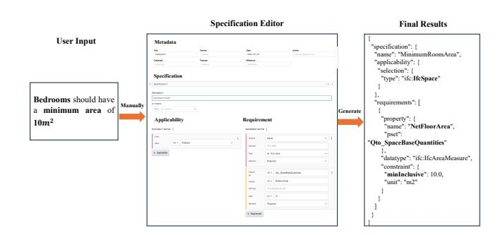
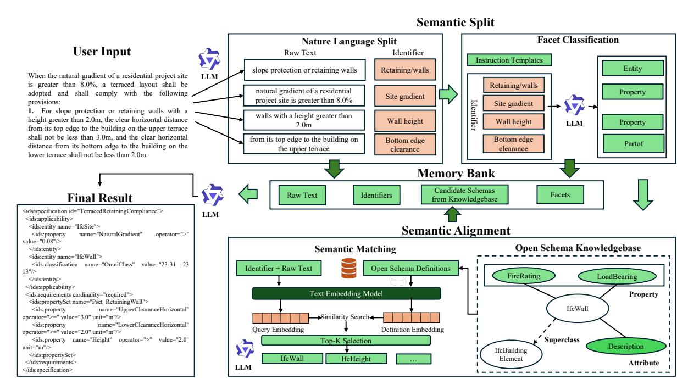
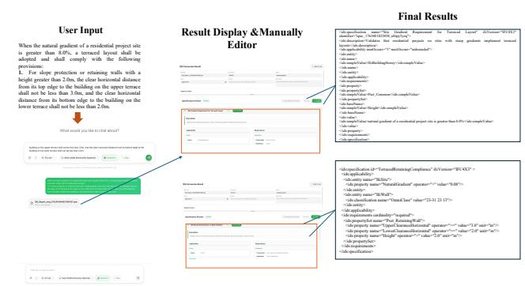
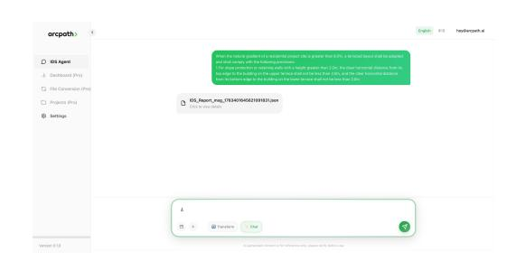
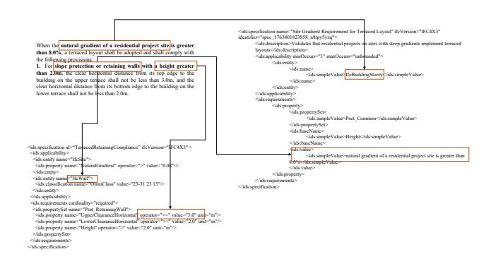

# LLM-Powered Structurer: Normalizing Natural Language to Information Delivery Specification for Industrial Data Exchange

Jiqian Yang jiqian.yang@outlook.com Shenzhen International Graduate School, Tsinghua University Shenzhen, Guangdong, China

Sujie Yan S.Yan22@student.liverpool.ac.uk University of Liverpool Liverpool, UK

Zhi Li∗ zhilizl@sz.tsinghua.edu.cn Shenzhen International Graduate School, Tsinghua University Shenzhen, Guangdong, China

Mingyu Liu liumy24@mails.tsinghua.edu.cn Shenzhen International Graduate School, Tsinghua University Shenzhen, Guangdong, China

Yousheng Wang yousheng.wang@buildingsmart.org buildingSMART International London, UK

Wei He harvey@ctrlpath.co CtrlPath Limited Hong Kong, China

# Abstract

In the architecture and construction industries, efficient information exchange is crucial, yet standards like Industry Foundation Classes and Information Delivery Specification pose challenges due to XMLbased format, which is cumbersome for human users and requires extensive standards knowledge and abstract entity definitions. Existing tools exacerbate this with high learning curves, hindering widespread adoption. To address this, we introduce our demonstration named Schema-Grounded Semantic Structurer (SGSS), an innovative LLM-driven framework that normalizes natural language industry information requirements directly into valid IDS XML, leveraging large language models' semantic understanding to bridge human-friendly inputs with structured standards. The proposed SGSS framework improves the accessibility of industrial information requirements exchanges across global construction workflows, thereby unlocking the full potential of automated information exchange in the industry.

# CCS Concepts

• Information systems → Information extraction; Information integration; • Computing methodologies → Natural language generation.

# Keywords

Information Delivery Specification (IDS), IFC, Information Requirements, Large Language Models, Schema Grounding

#### ACM Reference Format:

Jiqian Yang, Sujie Yan, Zhi Li, Mingyu Liu, Yousheng Wang, and Wei He. 2026. LLM-Powered Structurer: Normalizing Natural Language to Information Delivery Specification for Industrial Data Exchange. In Companion Proceedings of the ACM Web Conference 2026 (WWW Companion '26), April

∗Corresponding author.

© 2026 Copyright held by the owner/author(s). ACM ISBN 979-8-4007-2308-7/2026/04 <https://doi.org/10.1145/3774905.3793139>

13–17, 2026, Dubai, United Arab Emirates. ACM, New York, NY, USA, [4](#page-3-0) pages. <https://doi.org/10.1145/3774905.3793139>

# 1 Introduction

The efficient and accurate exchange of information is a cornerstone of the modern built asset industry, underpinning processes from design and construction to operation and compliance checking. Industrial construction projects, in particular, rely on the seamless flow of data among a multitude of stakeholders, including asset owners, architects, engineers, and contractors. However, the transmission of information requirements—such as regulatory constraints, client specifications, and performance criteria—remains a significant challenge. Traditionally, these requirements are communicated through static, human-readable documents like PDFs and spreadsheets, which are not machine-interpretable. This creates a fragmented landscape where critical data is difficult to access, verify, and reuse, leading to inefficiencies, increased project risk, and delays in decision-making.

To address this interoperability gap, several open communities, such as buildingSMART international[1](#page-0-0) , are developing the Information Delivery Specification (IDS) [2](#page-0-1) standard. An IDS provides a standardized, computer-interpretable framework for defining information requirements[\[4\]](#page-3-1). It enables stakeholders to specify precisely what information is needed, in what format, and for which objects, using concepts like entity types, properties, classifications, and materials. By adding clarity and certainty to data exchanges, IDS ensures that asset owners can accurately define their demands and project participants clearly understand their deliverables. This moves the industry beyond ambiguous natural language and unstructured data to reliable, automated data validation and use.

Despite the power of the IDS standard, the process of creating these specifications remains a critical bottleneck. As illustrated in Figure [1,](#page-1-0) the current workflow is labor-intensive and highly manual. Practitioners must first interpret natural language statements (e.g., "Bedrooms should have a minimum area of 10��2 ") and then manually map them into structured schema-based templates using tools like Specification Editors. This workflow demands not only domain

[This work is licensed under a Creative Commons Attribution 4.0 International License.](https://creativecommons.org/licenses/by/4.0) WWW Companion '26, Dubai, United Arab Emirates.

1https://www.buildingsmart.org/

2https://www.buildingsmart.org/standards/bsi-standards/information-deliveryspecification-ids/

Figure 1: Traditional Approaches for Expressing Information Requirements.

expertise but also deep familiarity with complex data standards, including knowledge of entities , property sets, and data types creating a significant barrier to entry for non-specialists.

Furthermore, semantic ambiguity remains a critical challenge. The same requirement may be expressed using different languages or terms (e.g., "bedroom" vs. "Zimmer"), yet must be mapped to standardized concepts. For example, "bedroom" is typically mapped to a broader entity such as "Space", because prevailing standards do not define most room types explicitly. Such mismatches can cause inconsistent interpretations and manual errors, ultimately undermining interoperability[\[1,](#page-3-2) [9\]](#page-3-3).

To overcome the above limitations, we propose an automated approach named Schema-Grounded Semantic Structurer (SGSS), which leverages the generative capabilities of large language models (LLMs) augmented with external industrial knowledge. Rather than relying on human experts to manually populate specification templates, SGSS facilitates the direct translation of natural language input into machine-readable, semantically aligned structures. This approach eliminates the prerequisite for deep schema literacy and mitigates semantic misalignment through enhanced contextual understanding. We posit that this shift will democratize information exchange, accelerate regulatory compliance, and enhance semantic interoperability across global construction workflows.

#### 2 Methods

Directly translating natural language requirements into IDS is challenging, and prompting-only generation is often unreliable. As shown in Figure [2,](#page-2-0) SGSS decomposes the task into semantic split, semantic alignment, and memory-based generation.

### 2.1 Semantic Split

The translation of natural language requirements such as those found in construction regulatory guidelines, into a structured format presents a formidable challenge[\[5,](#page-3-4) [7\]](#page-3-5). This challenge is primarily rooted in the inherent semantic ambiguity and contextual dependencies of natural language. The Semantic Split module is architected as the foundational stage to address this. It employs a Large Language Model (LLM)[\[10,](#page-3-6) [12\]](#page-3-7) to systematically deconstruct the raw text. This module's objective is to parse and partition the input while meticulously preserving the relational context between clauses. This process facilitates the critical transition from unstructured text to a set of discrete, semantically-grounded components amenable to subsequent alignment.

2.1.1 Natural Language Split. In this initial sub-module, the LLM performs a linguistic analysis of the raw input text to extract core identifiers. Leveraging its advanced natural language understanding capabilities[\[3,](#page-3-8) [6\]](#page-3-9), encompassing tokenization and dependency parsing, the LLM isolates pivotal phrases that represent atomic units of information. For instance, given a regulatory passage, it identifies and extracts clauses such as "slope protection or retaining walls", "natural gradient...is greater than 8.0%", and "walls with a height greater than 2.0m". This operation is not merely string extraction; it is a context-aware segmentation designed to isolate discrete requirements, which form the structured basis for subsequent classification and semantic mapping.

2.1.2 Facet Classification. Following the extraction of identifiers, the Facet Classification sub-module addresses the challenge of imposing a structured, hierarchical interpretation upon these discrete elements. The identifiers, while discrete, lack explicit semantic categorization. To resolve this, the LLM is tasked with mapping each identifier to a predefined facet (e.g., Entity, Property, Attribute) based on instruction templates. This classification is guided by and aligned with the definitional structures of open schemas (e.g., Industry Foundation Classes, IFC[3](#page-1-1) ). For example, "Retaining/walls" is classified as an Entity, while "Site gradient" and "Wall height" are classified as Property. The LLM's role here is the disambiguation of terms, ensuring that the resulting set of facets is not only structured but also semantically prepared for integration into the Memory Bank and robust alignment with canonical standards.

#### 2.2 Semantic Alignment

The Semantic Alignment module constitutes the core integration phase of the SGSS. Its primary objective is to bridge the semantic gap between the locally-defined, ad-hoc facets (derived from the input text) and the formalized, canonical representations within structured open schemas. This process is essential for resolving terminological heterogeneity and semantic inconsistencies, which are significant barriers to interoperability. The LLM orchestrates this alignment, ensuring that the natural language elements are accurately and verifiably mapped to their corresponding schemadefined counterparts, a prerequisite for achieving data interoperability and compliance accuracy.

2.2.1 Open Schema Knowledgebase. To enable precise semantic alignment in industrial data exchange, we construct an Open Schema Knowledgebase that aggregates public standards and schema definitions. The knowledge is organized as a semantic graph: nodes represent entities, properties, values, and textual definitions, while edges capture relations such as inheritance, part-of, and has-property. We index these definitions and associations to support retrieval of normalized descriptions, aliases, constraints, and hierarchical context. For instance, for IfcWall the knowledgebase provides its superclass (IfcBuildingElement) and related properties (e.g., FireRating and LoadBearing) together with their definitions, which are used to ground downstream semantic matching.

2.2.2 Semantic Matching. After the Semantic Split stage, the input text is categorized into a set of discrete, semantically precise

3https://www.buildingsmart.org/standards/bsi-standards/industry-foundationclasses/

Figure 2: Framework of the Schema-Grounded Semantic Structurer: Semantic Split, Memory Bank, Semantic Alignment with Open Schema Knowledgebase.

identifiers, such as Retaining/walls, Site gradient, and Wall height. To align these identifiers with the entities, properties, and values in the structured Open Schema Knowledgebase, we employ an embedding-based semantic similarity matching pipeline[\[2,](#page-3-10) [8,](#page-3-11) [11\]](#page-3-12). The algorithm encodes the query identifiers, together with the raw text, alongside schema definitions as high-dimensional vectors; it computes their semantic similarity, and retrieves the Top-K most relevant candidate entities. The LLM then identifies the most plausible matches among these candidates. This embedding-driven approach is robust to lexical variations and synonyms, thereby improving alignment accuracy. The selected candidates are cached in the Memory Bank component and subsequently used by the generation module to produce the final structured outputs.

#### 2.3 Memory Bank

After completing Semantic Split and Semantic Alignment, the system gains a grounded understanding of the natural-language intent and its mapping to entities, properties, and values in the Open Schema Knowledgebase. Before producing the final result, we assemble these intermediate signals and transform them into a structured output that conforms to the Information Delivery Specification (IDS). To prevent omissions and preserve the decomposition trace, the intermediate outputs from both stages are persisted as a cache—the Memory Bank shown in the framework. The generation module reads this Memory Bank, which stores the raw input, the classified identifiers with their facet types, and the candidate Open Schema entities, then fills a predefined template to produce the final IDS-compliant specification.

By leveraging the Memory Bank, we significantly strengthen the model's context during generation, effectively mitigating hallucination and forgetting. In addition, the Memory Bank serves as an

Figure 3: Demonstration of our service platform.

effective log/audit trail, facilitating system analysis and debugging.

### 3 Demonstration of SGSS Service Platform

Figure [3](#page-2-1) shows a typical conversion from natural language to IDScompliant output. SGSS is deployed on the ArcPath platform[4](#page-2-2) (Figure [4\)](#page-3-13) and provides two modes: Transform (paste text, select schema profile, generate IDS) and Chat (query schema concepts and usage guidance). Users can inspect and lightly edit the generated specification in the Manual Editor before exporting. The Manual Editor provides a structured view of the information delivery requirements and supports in-place editing. Users can adjust entities, properties, thresholds, units, and applicability scopes if the auto-generated content is not fully appropriate for their context. Edits are immediately reflected in the preview and can be saved or exported. As part of

4https://ids.arcpath.ai

Figure 4: SGSS has been deployed in the ArcPath platform for IDS generation.

our roadmap, we plan to introduce automated validation: a Validate tool will check the specification for consistency and completeness and feed diagnostics back into the assistant to suggest corrections, further increasing the level of automation.

#### 4 Case Study

The case shown in Figure [5](#page-3-14) covers two typical constraints"Site Gradient Requirement for Terraced Layout" and "Retaining Wall Clearance to Upper Building".

Both requirements encode layered semantics (scope, entities, thresholds, operators, and units) and mix descriptive text with implicit rules. Our pipeline resolves ambiguity (e.g., gradient/slope terminology and conditional applicability) by extracting facets such as entity ("IfcBuildingStorey"), property ("NaturalGradient"), operator (≥), and unit (%), then grounding them against schema definitions.

"Upper/lower horizontal clearance" is context-dependent: it references the building on the upper terrace versus the lower terrace, and the measurement is horizontal rather than vertical. The word "height" may ambiguously refer to wall height or building height. We disambiguate via cross-entity consistency checks between "IfcWall" and its associated clearance/height properties and by enforcing unit normalization (m/mm) and operator (≥, =). Cross-language specifications introduce additional drift: non-isomorphic terminology, synonym and morphological variants, mixed scripts with unit tokens, and sentence-level references that shift meaning across translations. In this case, "Site Gradient" aligns to "IfcBuildingStorey" with correct threshold semantics; "Retaining Wall Clearance" maps to the corresponding "IfcWall" properties.

### 5 Ethical Considerations

This work transforms natural-language requirements into IDS XML. Our examples are derived from publicly available regulations and do not involve personal data or human-subject studies. Generated IDS should be reviewed by practitioners before use.

#### 6 Conclusion

We present the SGSS, a novel framework that leverages large language models to automatically generate Information Delivery Specifications from natural language requirements. By decoupling semantic understanding from schema matching, we achieve fine-grained control over the LLM and ground the final generation with end-toend context, substantially reducing hallucinations and omissions. Compared with traditional rule-based or single-stage approaches, our agent delivers higher alignment accuracy, better auditability, and stronger multilingual robustness. Our system has been initially available to the public; some users have joined our waiting list, and

Figure 5: Industry Application Case Study: In a large-scale building project with complex information requirement exchange.

some have already begun using it. Future work will focus on expanding the agent's capabilities to handle more complex requirements and integrating it into existing engineering tools.

## Acknowledgments

This work was partially supported by grants from the National Natural Science Foundation of China (No. 62206155), and the Shenzhen Science and Technology Program (Grant No. RCBS20231211090700004).

#### References

[1] N Chungoora and Robert IM Young. 2008. Semantic interoperability requirements for manufacturing knowledge sharing. In Enterprise interoperability III: new challenges and industrial approaches. Springer, 411–422. [2] Matthijs Douze, Alexandr Guzhva, Chengqi Deng, Jeff Johnson, Gergely Szilvasy, Pierre-Emmanuel Mazaré, Maria Lomeli, Lucas Hosseini, and Hervé Jégou. 2025. The faiss library. IEEE Transactions on Big Data (2025). [3] Darren Edge, Ha Trinh, Newman Cheng, Joshua Bradley, Alex Chao, Apurva Mody, Steven Truitt, Dasha Metropolitansky, Robert Osazuwa Ness, and Jonathan Larson. 2024. From local to global: A graph rag approach to query-focused summarization. arXiv preprint arXiv:2404.16130 (2024). [4] Simon Fischer, Harald Urban, Christian Schranz, Patrick Loibl, and Léon van Berlo. 2024. Extending Information Delivery Specifications for digital building permit requirements. Developments in the Built Environment 20 (2024), 100560. [5] S Fuchs, J Dimyadi, M Witbrock, and R Amor. 2023. Improving the semantic parsing of building regulations through intermediate representations. In Proceedings of 30th annual meeting of EG-ICE. 1–10. [6] Sayed Hoseini, Andreas Burgdorf, Alexander Paulus, Tobias Meisen, Christoph Quix, and André Pomp. 2024. Towards LLM-augmented creation of semantic models for dataspaces. In The Second International Workshop on Semantics in Dataspaces, co-located with the Extended Semantic Web Conference. [7] Zarina Kabzhan, Alexandr Shakhnovich, Nazym Shogelova, Yevgeniya Glyzno, Sergey Gorshkov, and Fedor Gorshkov. 2025. Semantic and ontology-based analysis of regulatory documents for construction industry digitalization. Frontiers in Built Environment 11 (2025), 1575913. [8] Patrick Lewis, Ethan Perez, Aleksandra Piktus, Fabio Petroni, Vladimir Karpukhin, Naman Goyal, Heinrich Küttler, Mike Lewis, Wen-tau Yih, Tim Rocktäschel, et al. 2020. Retrieval-augmented generation for knowledge-intensive nlp tasks. Advances in neural information processing systems 33 (2020), 9459–9474. [9] Jacob Nilsson and Fredrik Sandin. 2018. Semantic interoperability in industry 4.0: Survey of recent developments and outlook. In 2018 IEEE 16th international conference on industrial informatics (INDIN). IEEE, 127–132. [10] Alec Radford, Karthik Narasimhan, Tim Salimans, Ilya Sutskever, et al. 2018. Improving language understanding by generative pre-training. (2018). [11] Songhao Wu, Quan Tu, Hong Liu, Jia Xu, Zhongyi Liu, Guannan Zhang, Ran Wang, Xiuying Chen, and Rui Yan. 2024. Unify graph learning with text: Unleashing llm potentials for session search. In Proceedings of the ACM Web Conference 2024. 1509–1518. [12] Wayne Xin Zhao, Kun Zhou, Junyi Li, Tianyi Tang, Xiaolei Wang, Yupeng Hou, Yingqian Min, Beichen Zhang, Junjie Zhang, Zican Dong, et al. 2023. A survey of large language models. arXiv preprint arXiv:2303.18223 1, 2 (2023).