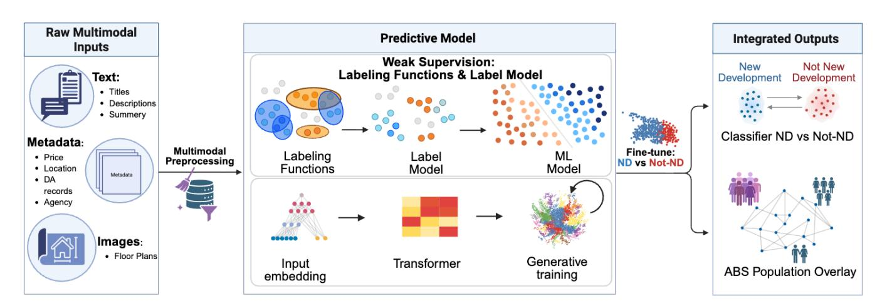
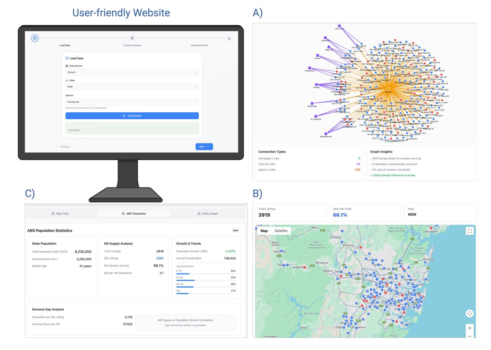

# Weakly Supervised Multimodal Claim Verification with Entity-Graph Inference

Kiana Bagheri-Lotfabad∗ Macquarie University School of Computing Sydney, NSW, Australia kiana.bagherilotfabad@students.mq.edu.au

Amin Beheshti∗ Macquarie University School of Computing Sydney, NSW, Australia amin.beheshti@mq.edu.au

Milad Mosharraf Domain Group Sydney, NSW, Australia Milad.Mosharraf@domain.com.au

Min Li Domain Group Sydney, NSW, Australia Min.Li@domain.com.au

Pooyan Asgari Domain Group Sydney, NSW, Australia pooyan.asgari@domain.com.au

Guanfeng Liu Macquarie University School of Computing Sydney, NSW, Australia guanfeng.liu@mq.edu.au

### Abstract

Claim verification across text, metadata, and signals derived from images is critical for trust, safety, and compliance on large platforms. In practice, high-quality labels are scarce, while many cheap but noisy signals such as lexicons, heuristics, legacy flags, and partial records are widely available. Existing approaches often assume large supervised datasets, focus on a single modality, or ignore relationships between items and entities, which leads to unstable decisions and poorly calibrated probabilities. We present a weakly supervised, multimodal framework that turns heterogeneous weak signals into probabilistic labels, trains lightweight text and tabular models, and uses entity-graph inference to keep decisions consistent at the project and organisation level. We instantiate the framework on real-estate listings and verify "brand new" new development (ND) claims against renovation or existing stock. Our demo shows the full pipeline from labeling functions to calibrated ND scores on a map, an entity-graph view, and Australian Bureau of Statistics (ABS) population overlays so that analysts can explore signals, model behaviour, and suspicious projects in an interactive way.

### CCS Concepts

• Information systems → World Wide Web; • Computing methodologies → Artificial intelligence; Search methodologies.

### Keywords

weak supervision, claim verification, multimodal learning, entity graphs, real-estate analytics, explainable AI

#### ACM Reference Format:

Kiana Bagheri-Lotfabad, Amin Beheshti, Milad Mosharraf, Min Li, Pooyan Asgari, and Guanfeng Liu. 2026. Weakly Supervised Multimodal Claim Verification with Entity-Graph Inference. In Companion Proceedings of the ACM Web Conference 2026 (WWW Companion '26), April 13–17, 2026, Dubai,

∗Corresponding authors.

© 2026 Copyright held by the owner/author(s). ACM ISBN 979-8-4007-2308-7/2026/04 <https://doi.org/10.1145/3774905.3793141>

United Arab Emirates. ACM, New York, NY, USA, [4](#page-3-0) pages. [https://doi.org/10.](https://doi.org/10.1145/3774905.3793141) [1145/3774905.3793141](https://doi.org/10.1145/3774905.3793141)

# 1 Introduction

Structured claims, such as labelling a property listing as "brand new," have direct effects on analytics and decisions about housing supply [\[2,](#page-3-1) [3,](#page-3-2) [6\]](#page-3-3). When these labels are wrong, new projects can be hidden or existing dwellings misrepresented, which harms both customers and downstream analysis. At the same time, obtaining reliable ground-truth labels at scale is expensive and slow, especially as platforms and evidence sources change over time [\[9\]](#page-3-4).

Large platforms still hold many inexpensive but noisy signals: phrases in listing descriptions, metadata rules over completion dates and project size, legacy ND flags, and small internal audits. Modern multimodal models can combine text and image information [\[1,](#page-3-5) [8\]](#page-3-6), but they usually assume clean labels and treat items independently, without considering projects, developers, or agencies [\[7\]](#page-3-7). This can produce inconsistent decisions inside the same project and probabilities that are difficult to interpret.

In simple terms, we ask how to verify structured claims using many cheap, noisy signals across text, metadata, and signals derived from images, while keeping decisions consistent at the entity level. We want a solution that can run in production with limited labels and still provide explanations that are useful for analysts.

We present a weakly supervised, multimodal framework and an interactive demo in a real-estate setting. Weak signals are encoded as labeling functions and combined by a label model to form probabilistic targets that supervise compact text and tabular learners. We enrich the tabular features with information derived from images, such as whether there are renders or floorplans and how many of each, without using raw pixels. An entity graph over listings, projects, suburbs, developers, and agencies then propagates evidence and enforces basic consistency.

The main novelty is threefold. First, we integrate weak supervision and entity-centric inference in a production-like multimodal setting for real-estate claim verification, rather than studying each component in isolation. Second, the demo makes labeling functions, graph structure, and calibrated scores first-class objects that analysts can inspect, configure, and act on, instead of hiding them inside a black-box model. Third, the focus is on system design and

[This work is licensed under a Creative Commons Attribution 4.0 International License.](https://creativecommons.org/licenses/by/4.0) WWW Companion '26, Dubai, United Arab Emirates.

an end-to-end demo; the underlying probabilistic and graph-based components build on existing work such as Snorkel [\[6\]](#page-3-3) and standard collective inference [\[7\]](#page-3-7).

The rest of the paper is organised as follows. Section [2](#page-1-0) describes the problem setting. Section [3](#page-1-1) explains the framework. Section [4](#page-1-2) presents the real-estate scenario, Section [5](#page-2-0) outlines the demo system, and Section [6](#page-2-1) discusses limitations and future work.

# 2 Problem Setting

We consider a collection of items ���� , where each item is a property listing with a Boolean target ���� indicating whether it is part of a brand new development. Direct expert labels for ���� are scarce, so we rely on a range of weak signals that provide partial and noisy evidence.

Some signals come from text, such as phrases in titles or descriptions that suggest ND or renovation. Others are rules over metadata, such as completion year, project size, or bedroom counts. There are also legacy ND flags, small internal audits, and reference lists for some projects or developers. Each signal on its own is unreliable: some rules fire too often or in the wrong places, others cover only narrow cases, and many are correlated. Writing a single global rule that combines all of them is difficult to design and hard to maintain.

Weak supervision offers a way to use these signals without a large hand-labelled dataset [\[6,](#page-3-3) [9\]](#page-3-4). Each signal is written as a labeling function that inspects a listing and optionally its context, and outputs a positive vote, a negative vote, or abstains. A label model learns the accuracies and correlations of these functions from unlabeled data and produces a probabilistic label ���� = �� (����=1) for each listing.

Evidence for each claim is also spread across several modalities and levels. Listings contain text fields such as titles and descriptions that may mention new development or renovation explicitly or implicitly. They also have structured metadata, including location, price, property type, number of bedrooms and bathrooms, and sometimes indicative construction dates.

In addition, we have information derived from images. We do not use the raw images themselves. Instead, we use simple tags and counts such as whether a listing has marketing renders, floorplans, or only photos of an existing dwelling. These tags are treated as part of the tabular feature set.

Items are also linked through shared entities. Many listings belong to the same project. Developers and agencies have typical patterns over time, and some specialise in ND or in certain corridors. A model that treats each listing in isolation can miss these patterns and produce conflicting labels for listings that clearly belong to the same project.

### 3 Framework Overview

Our framework combines weak supervision, multimodal learning, and entity-graph inference into a single pipeline, as shown in Figure [1.](#page-2-2)

First, we encode weak signals as labeling functions. ND lexicon functions fire on phrases such as "off-the-plan" or "brand new," renovation functions fire negative on phrases such as "new kitchen" or "fully renovated," metadata functions use completion year, project size, and property type, and entity functions use knowledge about

projects or developers that are almost always ND or almost never ND. A label model converts these noisy votes into a probabilistic label for each listing.

Second, the probabilistic labels supervise lightweight modalityspecific learners. We use a text model, such as TF–IDF with logistic regression or a compact transformer, over titles and descriptions, and a tabular model over structured metadata and image-derived attributes such as the presence and number of renders and floorplans. These models generalise beyond explicit rules. For example, the text model can recognise paraphrases, and the tabular model can learn that certain combinations of property type, price, and suburb are unlikely to be ND even when no labeling function fires. Their outputs are combined through a simple calibration or stacking layer to yield an updated ND probability for each listing.

Third, we construct an entity graph whose nodes represent listings, projects, suburbs, developers, and agencies, with edges for relationships such as a listing belonging to a project or being advertised by an agency. We run an iterative inference procedure on this graph. Listing-level scores are aggregated to entity-level scores, and strong entity-level beliefs are propagated back to listings. This reduces contradictions, such as one listing in a project labelled ND while its siblings are confidently non-ND, and surfaces suspicious clusters of projects or agencies [\[5,](#page-3-8) [7\]](#page-3-7).

Finally, we calibrate ND probabilities on a small, high-quality audit set of listings with expert labels. This improves probability estimates and stabilises thresholds. Calibrated scores, labeling-function statistics, and entity-level aggregates are written to tables in the data warehouse and exposed to dashboards, APIs, and the demo website.

# 4 Real-Estate Scenario

Our case study uses production-like real-estate data from two major Australian property portals. Each listing includes free-text titles and descriptions, structured metadata, project and developer identifiers where available, and simple attributes derived from associated images that indicate whether renders or floorplans are present and how many of each. Listings span multiple states and several years. A small, curated audit set with reliable ND labels, prepared by domain experts, is reserved for evaluation and calibration.

We build the library of labeling functions and run the label model to obtain probabilistic labels for each portal–state slice. These labels supervise the multimodal learners, and entity-graph inference refines predictions using project, developer, agency, and suburb structure. The same pipeline runs for each portal and state, which allows ND scores to be compared across different regions of Australia.

To understand the value of each component, we compare the framework against common baselines, including simple keyword rules over text fields, models that treat existing ND flags as perfect ground truth, and supervised models that rely only on text or only on metadata from the audit set. Such baselines either ignore multimodal features, neglect entity structure, or place too much trust in noisy labels. Internal experiments (omitted for space) show that combining weak supervision, multimodal learning, and entitygraph inference improves both accuracy and calibration, reduces inconsistencies within projects and suburbs, and handles subtle

Figure 1: End-to-end framework for weakly supervised multimodal ND claim verification. Raw inputs (left) include text, metadata, and features derived from images. Labeling functions generate noisy votes that a label model converts into probabilistic targets. Compact text and tabular models use these targets to learn beyond the hand-crafted rules, and an entity-graph layer propagates scores across related listings, projects, and organisations.

renovation cases that keyword systems often misclassify as new development.

#### 5 Demo System

We wrap the framework in a web-based demo aimed at analysts and product stakeholders. The demo exposes the pipeline as a guided workflow and presents ND scores together with context that supports human decision-making, as shown in Figure [2.](#page-3-9)

On the landing page, a user chooses a portal (Domain or REA) and an Australian state. The system then loads a prepared slice of listings for that combination. Time window and dataset settings are fixed in the backend so that the demo remains simple and reproducible, and there are no extra user-facing filters at this stage.

The next screen lets the user review and configure labeling functions. Related functions, such as renovation or entity-based rules, can be turned on or off as groups. Basic statistics such as coverage and disagreement rates make the weak supervision layer visible and help users see how different families of weak signals interact.

When the user triggers a model run, the demo applies the label model, trains the lightweight text and tabular learners, runs entity-graph inference, and writes calibrated ND probabilities into a temporary workspace, with a compact progress indicator instead of low-level logs. Users then move between three main views. In the entity-graph view, nodes represent listings, suburbs, developers, and agencies. For a selected project or developer, the demo shows ND probabilities, disagreement between weak signals and learned models, and short summaries such as counts of ND and non-ND listings. In the map view, ND and non-ND listings appear as coloured markers over the road network for the selected state. In the ABS dashboard, ND supply metrics for a state or region are shown alongside ABS population statistics, giving a simple demand-gap view that combines inferred ND supply with population growth.

For any suburb or project of interest, the demo presents a compact explanation panel that highlights influential phrases in the

text, key metadata features, and entity-level context that push the prediction towards ND or non-ND. These explanations help analysts decide where to trust automated scores and where to escalate cases for manual review or additional data checks.

Demo video: <https://youtu.be/o6UekEcEuWk>

#### 6 Discussion and Future Work

The framework is designed to be practical for production teams that work with limited labels, noisy signals, and multimodal, entitycentric data. Weak supervision reduces annotation costs by turning many small rules and partial records into a coherent probabilistic view. Lightweight multimodal models capture patterns that rules cannot easily express, without requiring very large training runs, and the entity-graph layer enforces simple consistency constraints and surfaces patterns at the project and developer level that are invisible from listing-level scores alone.

Although our case study focuses on real estate, the same pattern can be applied to other domains where structured claims must be checked against messy evidence, such as product attribute verification in e-commerce, content labelling on media platforms, and compliance checks in finance and healthcare. In each case, there are many weak signals and rich relational structure, but only a small number of high-quality labels.

Future work includes integrating richer visual models where pixel-level image content is directly incorporated, experimenting with more expressive graph neural networks for the entity layer, and closing the loop with analyst feedback so that corrections automatically refine labeling functions and models over time. Another direction is to study how calibrated ND probabilities and entitylevel summaries change over time, which can give planners a clearer picture of supply pipelines and marketing behaviour. More broadly, generative AI is increasingly used to support operational workflows and decision-making in data-intensive systems [\[4\]](#page-3-10).

Figure 2: User-facing interface and outputs of the ND detection system. The main page guides analysts through loading data, configuring signals, running the model, and visualising results. Panel A) shows the entity-graph view; Panel B) shows a map-based view of inferred ND and non-ND listings; Panel C) shows an ABS population dashboard with ND supply metrics and a simple demand-gap view.

Acknowledgments We acknowledge the Centre for Applied Artificial Intelligence at Macquarie University and Domain Holdings Pty Ltd for funding this research. References [1] Tadas Baltrušaitis, Chaitanya Ahuja, and Louis-Philippe Morency. 2019. Multimodal Machine Learning: A Survey and Taxonomy. IEEE Transactions on Pattern Analysis and Machine Intelligence 41, 2 (2019), 423–443. [2] Amin Beheshti, Boualem Benatallah, Quan Z. Sheng, and Francesco Schiliro. 2020. Intelligent knowledge lakes: the age of Artificial Intelligence and big data. In Web Information Systems Engineering: WISE 2019 Workshop, Demo, and Tutorial, Revised Selected Papers (Communications in Computer and Information Science, Vol. 1155). Springer, Springer Nature, 24–34. [doi:10.1007/978-981-15-3281-8\\_3](https://doi.org/10.1007/978-981-15-3281-8_3) [3] Amin Beheshti, Amit Sheth, Guanfeng Liu, Rui Zhang, Xin Luna Dong, and Pedro Szekely. 2021. Knowledge Lake: an Entity-based, Weakly Supervised Knowledge Graph Construction System. In In Proceedings of the 37th IEEE International Conference on Data Engineering (ICDE). [4] Amin Beheshti, Jian Yang, Quan Z. Sheng, Boualem Benatallah, Fabio Casati, Schahram Dustdar, Hamid Reza Motahari Nezhad, Xuyun Zhang, and Shan Xue. 2023. ProcessGPT: Transforming Business Process Management with Generative Artificial Intelligence. arXiv preprint arXiv:2306.01771 (2023). arXiv[:2306.01771](https://arxiv.org/abs/2306.01771) [doi:10.48550/arXiv.2306.01771](https://doi.org/10.48550/arXiv.2306.01771) [5] William L. Hamilton, Rex Ying, and Jure Leskovec. 2017. Inductive Representation Learning on Large Graphs. In Proceedings of the 31st Conference on Neural Information Processing Systems (NeurIPS). [6] Alexander Ratner, Stephen Bach, Henry Ehrenberg, Jason Fries, Sen Wu, and Christopher Ré. 2016. Data Programming: Creating Large Training Sets, Quickly. In Proceedings of the 30th Conference on Neural Information Processing Systems (NeurIPS). [7] Prithviraj Sen, Galileo Namata, Mustafa Bilgic, Lise Getoor, Brian Galligher, and Tina Eliassi-Rad. 2008. Collective classification in network data. AI magazine 29, 3 (2008), 93–106. [8] Tao Xu and et al. 2018. AttnGAN: Fine-Grained Text to Image Generation with Attentional Generative Adversarial Networks. In Proceedings of the IEEE Conference on Computer Vision and Pattern Recognition (CVPR). [9] Zhi-Hua Zhou. 2018. A brief introduction to weakly supervised learning. National Science Review 5, 1 (2018), 44–53.

