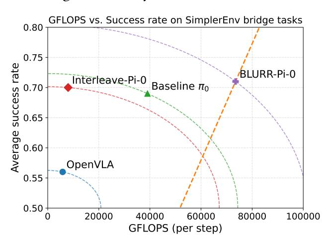
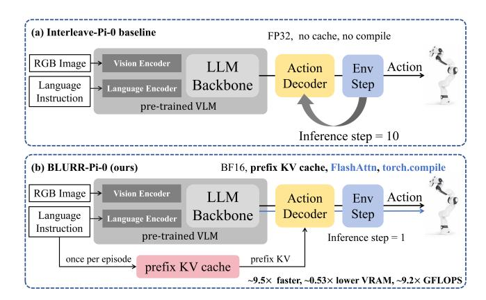
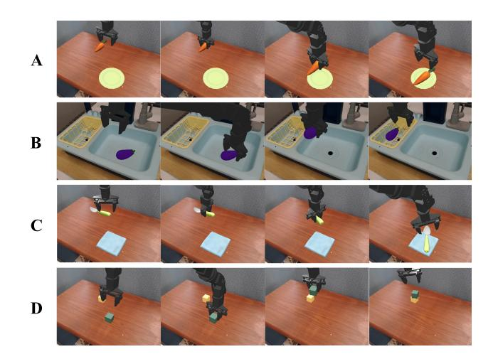

# BLURR: A Boosted Low-Resource Inference for Vision-Language-Action Model

Xiaoyu Ma∗,† , Zhengqing Yuan1,∗ , Zheyuan Zhang1 , Kaiwen Shi1 , Lichao Sun2 , Yanfang Ye1

1University of Notre Dame, 2Lehigh University

# Abstract

Vision–Language–Action (VLA) models enable impressive zeroshot manipulation, but their inference stacks are often too heavy for responsive web demos or high-frequency robot control on commodity GPUs. We present BLURR, a lightweight inference wrapper that plugs into existing VLA controllers without retraining. Instantiated on ��0, BLURR keeps the original checkpoints and observation interfaces, and accelerates control by combining an instruction-prefix KV cache, mixed-precision execution, and a single-step rollout schedule. Our demo lets attendees switch between controllers and toggle inference options in real time while watching SimplerEnv episodes. We will release BLURR and integration scripts as open source at [https://github.com/JijiKing-Sam/BLURR-A-Boosted-Low-](https://github.com/JijiKing-Sam/BLURR-A-Boosted-Low-Resource-Inference-for-Vision-Language-Action-Model)[Resource-Inference-for-Vision-Language-Action-Model.](https://github.com/JijiKing-Sam/BLURR-A-Boosted-Low-Resource-Inference-for-Vision-Language-Action-Model)

# Keywords

Vision-Language-Action, Inference Acceleration, Robot Policy Deployment, Interactive Web Demonstration

# 1 Introduction

Large, generalist policies pretrained on diverse robot data, such as Octo [\[10\]](#page-4-0), OpenVLA [\[6\]](#page-4-1), and Pi-0 [\[3\]](#page-4-2), have recently made Vision-Language-Action (VLA) control an accessible abstraction for realworld manipulation. By conditioning on natural-language instructions and multi-view images, these models can generate joint-space or end-effector actions and adapt to new embodiments with modest in-domain data. However, despite their impressive capability, the heavy vision encoders (e.g., SigLIP) and multimodal decoders (e.g., PaliGemma-style backbones) impose substantial computational overhead: per-step inference can exceed 30–50,Hz latency requirements, especially when hundreds of visual tokens and long language prefixes are processed at every control cycle [\[4,](#page-4-3) [6\]](#page-4-1). This gap between model capacity and system responsiveness creates a practical barrier for interactive deployment, e.g., browser demos or real-time teleoperation, where slow control loops can degrade user experience and even compromise task feasibility. As a result, there is a growing need for methods that retain the strengths of existing VLA checkpoints while improving inference-time efficiency to support reliable, real-time robotic control.

Several recent works attempt to address this latency issue, but existing approaches face notable limitations. 1) First, many efficiencyoriented methods require substantial changes to the underlying architecture or training pipeline, for example, TinyVLA [\[11\]](#page-4-4) redesigns the backbone and action head for compactness, and MiniVLA [\[1\]](#page-4-5)

Figure 1: Efficiency–performance landscape on four SimplerEnv bridge tasks. Each marker shows a controller's perstep compute throughput (GFLOPS, ��-axis) and average task success rate (0–1, ��-axis). The dashed circular guides are centered at the origin and pass through each model, so that larger radii qualitatively indicate a more extreme operating regime in the (compute, success) plane.The orange dashed ray is the line through the origin and BLURR-Pi-0, highlighting that our inference wrapper moves along a high-efficiency direction.

compresses OpenVLA through structural modifications. Such interventions force practitioners to retrain models from scratch, often demanding hundreds of GPU-hours and risking performance regressions on downstream tasks. 2) Second, token-reduction or actionreparameterization techniques (e.g., FAST [\[9\]](#page-4-6)) introduce new tokenization schemes that are incompatible with released checkpoints, preventing them from serving as drop-in optimizers for widely used VLA models. 3) Third, methods that improve reasoning or spatialtemporal grounding—such as CoA-VLA's chain-of-affordance [\[7\]](#page-4-7) or TraceVLA's visual-trace prompting [\[12\]](#page-4-8), enhance capability but do not meaningfully reduce the per-step compute cost in interactive control loops. Consequently, none of these techniques directly provide a lightweight inference acceleration layer that preserves existing model checkpoints while achieving real-time responsiveness. Therefore, there is a clear need for a technique that preserves existing VLA checkpoints without retraining, delivers substantial reductions in per-step inference latency, and maintains the original policy's accuracy and manipulation performance.

To address these limitations, we introduce BLURR, a lightweight inference wrapper designed to accelerate VLA controllers while preserving their original checkpoints. Instead of modifying network

∗Equal contribution

†Xiaoyu Ma is an independent researcher student, remotely working with Yanfang Ye.

Figure 2: High-level comparison of the Interleave-Pi-0 [\[5\]](#page-4-9) baseline and our BLURR-Pi-0 inference stack. In (a), RGB images and language instructions are jointly encoded by a pre-trained vision–language model and decoded into actions over a 10-step control rollout using an FP32 action decoder without caching or compilation. In (b), BLURR-Pi-0 keeps the same pre-trained VLM backbone but moves instruction processing into a one-time prefix KV cache, runs the action decoder in BF16 with FlashAttention and **torch.compile**, and reduces the control horizon to a single inference step.

weights or redesigning tokenization schemes, BLURR focuses solely on the inference pipeline, reorganizing how visual and language tokens are processed during control. 1) First, BLURR requires no architectural changes and no retraining: any existing OpenVLA- , Pi-0–, or TraceVLA-style checkpoint can be wrapped without altering model parameters or task logic. 2) Second, BLURR substantially reduces per-step latency through a combination of BF16 execution, compiled decoder graphs, prefix KV caching for instructions, and a single-step control horizon. These inference-side optimizations collectively yield order-of-magnitude speedups while lowering memory consumption. 3) Third, despite its aggressive acceleration, BLURR maintains the original policy's accuracy and manipulation performance, enabling real-time, browser-based VLA interaction without sacrificing task success. In practice, BLURR preserves SOTA manipulation performance while delivering up to 9.5× lower latency, 0.53× peak VRAM, and 9.2× higher effective GFLOPS, setting a new efficiency bar for VLA inference.

Pi-0 [\[3\]](#page-4-2) proposes a flow-matching action head for more dexterous, high-frequency control. TraceVLA [\[12\]](#page-4-8) augments OpenVLA with visual trace prompting to improve spatial-temporal awareness in both simulation and real-robot experiments.

MiniVLA [\[1\]](#page-4-5) shrinks the OpenVLA backbone while preserving performance on LIBERO benchmarks. TinyVLA [\[11\]](#page-4-4) targets fast and data-efficient VLAs via compact backbones and diffusion decoders. FAST [\[9\]](#page-4-6) focuses on efficient action tokenization, and CoA-VLA [\[7\]](#page-4-7) improves generalization via a visual-text chain-of-affordance.

It has quickly become a standard testbed for VLA evaluation, including TraceVLA [\[12\]](#page-4-8) and several follow-up works. We adopt SimplerEnv for our demo because it lets us measure both success rate and system-level latency while keeping the control loop realistic.

Table 1: Single-step efficiency comparison across the original Pi-0 controller, our Interleave-Pi-0 baseline, and the proposed BLURR-Pi-0 variant, using the same input resolution and token budget (224×224 RGB, 256 tokens) on single H100 GPU. BLURR nearly doubles the effective GFLOPS compared to the Pi-0 baseline.

| Configuration    | Latency (ms) | VRAM (GB) | GFLOPS |
|------------------|--------------|-----------|--------|
| OpenVLA          | 217.8        | 14.33     | 5,835  |
| OpenVLA-OFT      | 91.2         | 14.48     | 49,886 |
| Pi-0 baseline    | 111.6        | 13.58     | 39,038 |
| Interleave-Pi-0  | 162.1        | 13.61     | 7,989  |
| BLURR-Pi-0(ours) | 17.1         | 7.20      | 73,525 |

#### 2 BLURR Architecture

Our goal is to accelerate existing Vision–Language–Action (VLA) models at inference time without modifying their parameters, training procedure, or API. BLURR keeps all model weights unchanged, but restructures the computational pathway to eliminate redundant work, minimize memory traffic, and exploit hardware-efficient kernels. As shown in Figure 1, our method is built around three principles: 1) reduce redundant prefix computation, 2) minimize per-step token cost, and 3) maximize tensor-core utilization.

#### 2.1 Single-step control with prefix-cached instructions

BLURR keeps the underlying controller's 224×224 vision encoder and token budget, and instead reduces per-step compute by reusing instruction tokens across the whole episode. Let �� be the language instruction and ���� = (���� , ���� ) the observation at time �� (RGB image ���� and state ���� ). We write

�� =�� (��) ∈ R ���� ×�� , ���� = ���� (���� , ���� ) ∈ R ����×�� , (1)

where �� and ���� are the frozen text and vision–state encoders. The input sequence to the Transformer backbone at step �� is

���� = [��;���� ] ∈ R (����+���� )×�� . (2)

During control. A standard Interleave-Pi-0 controller recomputes keys and values for all (����+���� ) tokens at every step. BLURR-Pi-0 instead caches the instruction prefix once per episode:

�� (ℓ) pref = ���� (ℓ) �� , �� (ℓ) pref = ���� (ℓ) �� , (3)

and at step �� only projects the visual–state tokens

�� (ℓ) step,�� = ������ (ℓ) �� , �� (ℓ) step,�� = ������ (ℓ) �� , (4)

forming

�� (ℓ) �� = " �� (ℓ) pref �� (ℓ) step,��# , �� (ℓ) �� = " �� (ℓ) pref �� (ℓ) step,��# . (5)

With BLURR's single-step rollout (one forward pass per environment step), the instruction cost is paid once per episode instead of at every control step, yielding the per-step latency reductions reported in Table [2.](#page-3-0)

#### 2.2 Efficient BF16 Decoder with Compilation and FlashAttention

The action decoder remains the main performance bottleneck, and BLURR accelerates it through three inference-time techniques: 1) BF16 execution. All decoder layers are executed in BF16, which reduces memory bandwidth requirements by roughly 2× and enables full utilization of contemporary tensor-core accelerators (e.g., H100). Weights remain unchanged; only runtime casting is used. 2) Compiled computation graph. We wrap the entire forward pass in a torch.compile graph, enabling kernel fusion and eliminating Python overhead. This converts the decoder into a streamlined compute pipeline with significantly fewer dispatch points. 3) FlashAttention kernels. When attention shapes allow, BLURR enables fused, IO-aware attention kernels via the PyTorch SDPA backend. FlashAttention greatly reduces memory I/O during multihead attention, improving both latency and VRAM efficiency. Together, these optimizations convert the decoder into a high-throughput inference engine capable of sub-20 ms per-step latency on a single modern GPU, without altering the model's parameters. At the same time, all major inference knobs are exposed as configuration flags (e.g., use\_bf16, use\_compile, num\_inference\_steps), so that users can directly see how each choice affects latency, memory, and task success. Concretely, we target sub-20 ms per control step on an H100 GPU, corresponding to ∼50–60 Hz control. We therefore track approximate per-step GFLOPS and peak VRAM for each configuration, and design BLURR to substantially increase effective throughput while basically keeping the underlying ��0 checkpoint fixed.

In the baseline design (Figure [2a](#page-1-0)), RGB observations and language instructions are concatenated and fed through a pre-trained vision–language backbone, after which an VLA decoder produces a sequence of actions over a 10-step control rollout in FP32. Every control step re-encodes the full instruction prompt, runs the decoder in eager mode without KV caching, and executes on standard attention kernels. This yields a responsive but relatively heavy inference stack: on our H100 setup the Interleave-Pi-0 baseline requires roughly 162 ms per step and 13.6 GB of peak VRAM. The wrapped controller, which we denote BLURR-��0, runs the decoder in BF16, uses a compiled forward graph, and reduces the control horizon to a single step. Instructions are processed once at the beginning of an episode to build a prefix KV cache, and subsequent control steps only inject fresh visual and proprioceptive tokens. Under this configuration we measure roughly 17 ms per step and 7.2 GB of peak VRAM on the same H100 GPU, corresponding to about 9.5× lower latency and 0.53× peak memory while retaining the original ��0 weights.

For short tabletop manipulation tasks in SimplerEnv, we found that this horizon is over-provisioned: a single-step controller can achieve comparable success rates while drastically reducing compute. BLURR therefore sets inference steps to 1 and delegates temporal smoothing to the underlying environment and low-level controllers. This immediately removes a 10× factor in wall-clock latency for many tasks. We further wrap the full image–text–action forward pass in torch.compile using a reduce-overhead mode, which fuses kernels and reduces Python dispatch overhead. Where

Figure 3: Example rollouts of BLURR-Pi-0 on the four SimplerEnv Bridge manipulation tasks. Rows A–D show successful episodes for carrot-on-plate, eggplant-in-rack, spoonon-cloth, and block-stacking respectively, with frames progressing from left to right in time. Despite the aggressively accelerated inference stack, BLURR-Pi-0 produces smooth, goal-directed behaviours that closely match the intended task specifications.

available, we enable efficient attention kernels such as FlashAttention [\[4\]](#page-4-3) through PyTorch's SDPA backend. Together, BF16 + compilation turn the decoder into a high-throughput inference engine that delivers the measured 9.5× latency and 9.2× GFLOPS improvements over the FP32 eager baseline. BLURR isolates the instruction into a prefix segment that is encoded once per episode. We run a short forward pass to build a KV cache for these prompt tokens, then reuse this cache at every subsequent control step by appending fresh visual and proprioceptive tokens on top. This design requires careful tokenizer alignment and attention-mask construction to keep positions consistent, but it amortizes instruction processing and makes per-step cost depend primarily on the number of visual tokens. The same checkpoint can be evaluated as either Interleave-Pi-0 or BLURR-��0 by flipping a small set of flags, and the demo UI simply exposes these flags as interactive toggles. As a result, BLURR demonstrates that substantial gains in VLA responsiveness can be achieved by re-engineering the inference stack alone, without altering architectures or retraining models.

### 3 Implementation

# 3.1 Runtime Stack and Demo Integration

Our implementation is built on PyTorch and HuggingFace-style model hubs. On the vision and VLA side we reuse: (i) OpenVLA checkpoints [\[6\]](#page-4-1) implemented with PaliGemma-style multimodal decoders [\[2\]](#page-4-10), and (ii) official reference implementations for Pi-0 [\[3\]](#page-4-2) and TraceVLA [\[12\]](#page-4-8). BLURR is implemented as a thin wrapper around these existing model classes and their Hydra configuration files. The wrapper preserves the original observation and action interfaces of Interleave-style controllers, while exposing additional inference flags such as use\_bf16, use\_compile, and num\_inference\_steps. At the system level, Figure [2](#page-1-0) illustrates how BLURR intercepts the

standard perception–language–action loop: camera observations and low-dimensional state are encoded by the frozen backbone, the instruction prompt is processed once per episode to build a prefix KV cache, and subsequent control steps only inject fresh visual and proprioceptive tokens. Where available, we route attention through PyTorch's SDPA backend with FlashAttention kernels [\[4\]](#page-4-3); otherwise we fall back to standard attention without changing model code. For the WWW demo, we deploy this runtime inside a small client–server stack. A backend process runs the VLA policy and SimplerEnv [\[8\]](#page-4-11) instances on a single GPU. A lightweight WebSocket bridge streams RGB frames, actions, and scalar metrics. On the front end, the web UI in Figure [3](#page-2-0) visualizes live trajectories and exposes BLURR's inference knobs (BF16, compilation, control horizon, KV caching) as interactive toggles. Each toggle change triggers a short warm-up phase and then logs per-step latency, peak VRAM, and task outcomes, allowing attendees to directly observe the speed or accuracy trade-offs. GFLOPS is the FLOP count reported by PyTorch's profiler divided by per-step latency.

#### 3.2 Experimental Setup

We evaluate BLURR on four in-domain SimplerEnv bridge tasks [\[8\]](#page-4-11): Carrot-on-plate, Eggplant-in-container, Spoon-on-plate, and Stackblocks. All experiments share the same Pi-0 checkpoint [\[3\]](#page-4-2) and differ only in the control architecture and inference configuration. We compare:

- Pi-0 baseline, which directly decodes actions from images and language without fine-tuning through interleaving inputs.
- Interleave-Pi-0, our reproduction of an Interleave-VLA controller.
- BLURR-Pi-0, our accelerated variant.

Unless otherwise noted, we profile per-step latency, peak reserved GPU memory, and approximate GFLOPS on an NVIDIA H100 GPU by repeatedly running the same image–prompt pair through the controller. For each configuration and task we then run 100 closedloop evaluation episodes in SimplerEnv to measure task success rates.

#### 4 Evaluation

# 4.1 Overall Efficiency and Throughput

Table [1](#page-1-1) summarizes the efficiency of our three controllers when evaluated with a fixed input resolution (224×224 RGB) and token budget (256 tokens). Despite sharing the same Pi-0 checkpoint, the three stacks exercise the hardware very differently:

Interleave-Pi-0 incurs additional decoding overhead from its 10 step rollout and eager FP32 execution, yielding higher latency and lower effective GFLOPS than the Pi-0 baseline. In contrast, BLURR-Pi-0 combines a single-step controller, BF16 Tensor Core execution, and compiled graphs to reduce per-step latency by roughly 9.5× and peak VRAM by about 0.53× relative to Interleave-Pi-0, while nearly doubling the effective GFLOPS compared to the original Pi-0 controller.

# 4.2 Ablation: BLURR Inference Components

To isolate which parts of the BLURR stack matter most, we treat the "Impact of BLURR components on per-step latency and VRAM"

Table 2: Impact of BLURR components on per-step latency and peak VRAM usage for a single Interleave-Pi-0 checkpoint evaluated on a SimplerEnv task [\[8\]](#page-4-11) on an NVIDIA H100 GPU.

| Configuration   |                |                  | Latency (ms) | VRAM (GB) |
|-----------------|----------------|------------------|--------------|-----------|
| Interleave-Pi-0 |                | (FP32, 10 steps) | 162.1        | 13.61     |
| +               | BF16 only      | (10 steps)       | 88.2         | 13.58     |
| +               | torch.compile  | (10 steps)       | 56.7         | 6.15      |
| +               | fewer flow     | steps (6 steps)  | 44.7         | 7.28      |
| +               | fewer flow     | steps (4 steps)  | 34.8         | 7.29      |
| +               | KV cache       |                  | 31.9         | 7.32      |
| +               | FlashAttention | [4]              | 27.4         | 7.30      |
| Full            | BLURR          | (ours, 1 step)   | 17.1         | 7.20      |

Table 3: Bridge task success rates for five controllers on four SimplerEnv in-domain tasks. All entries are success probabilities (0–1) over 100 evaluation episodes per task.

| Model             | Carrot | Spoon | Blocks | Eggplant | Avg. |
|-------------------|--------|-------|--------|----------|------|
| OpenVLA           | 0.47   | 0.44  | 0.63   | 0.68     | 0.56 |
| MiniVLA           | 0.42   | 0.67  | 0.69   | 0.18     | 0.49 |
| Baseline �� 0     | 0.53   | 0.84  | 0.53   | 0.88     | 0.69 |
| Interleave-Pi-0   | 0.59   | 0.89  | 0.53   | 0.79     | 0.70 |
| BLURR-Pi-0 (ours) | 0.54   | 0.91  | 0.46   | 0.93     | 0.71 |

table as a small ablation study. Rather than changing network architecture or retraining, we progressively enable inference-side optimizations on top of the Interleave-Pi-0 baseline:

In the current demo, the same ablations are exposed as toggles in the user interface, and Table [2](#page-3-0) summarizes their cumulative effect on latency and memory. Conceptually, this breakdown matches our implementation: BF16 primarily reduces memory traffic, efficient attention and torch.compile reduce kernel launch and Python overhead, and the single-step controller with prefix KV caching removes redundant prompt processing.

#### 4.3 Closed-loop Success Rates and Demo Experience

Finally, we assess whether these efficiency gains come at the cost of task performance. Table [3](#page-3-1) reports success rates over 100 evaluation episodes for each of the four bridge tasks, comparing the original Pi-0 controller, our Interleave-Pi-0 baseline, and BLURR-pi-0:

Across these four tasks, BLURR-Pi-0 matches or slightly exceeds the average success rate of Interleave-Pi-0 while delivering an order-of-magnitude reduction in per-step latency. In the demo UI, attendees can switch between the three controllers and immediately observe the qualitative differences in control frequency: the BLURR-Pi-0 variant updates at roughly 50–60 Hz and can react to sudden obstacles or perturbations much more quickly, while the Interleave-Pi-0 baseline produces visibly "chunkier" motion at around 6 Hz. This side-by-side comparison complements the quantitative results above and highlights BLURR's main message: substantial VLA speedups are achievable by re-engineering the inmodel checkpoints. Our future work includes porting BLURR-style inference wrappers to other VLA families and real robot platforms, beyond our current SimplerEnv-based evaluation. We also plan to move to longer-horizon, multi-stage manipulation tasks where control frequency and latency may interact more strongly with task difficulty. Another direction is to explore adaptive scheduling and mixedprecision policies that react to hardware load in real time, rather than using fixed configurations. Finally, we are interested in tighter integration with distillation or compression techniques so that model design and inference wrappers can be co-optimized instead of tuned in isolation. Instead, it acts as a thin inference layer that can be combined with existing and future efficiency-oriented VLAs. Our current implementation focuses on manipulation tasks in SimplerEnv [\[8\]](#page-4-11); extending it to mobile manipulation and long-horizon planning would require additional engineering and may interact with the assumptions made by Pi-0 [\[3\]](#page-4-2) and TraceVLA [\[12\]](#page-4-8). References [1] Suneel Belkhale and Dorsa Sadigh. 2024. MiniVLA: A Better VLA with a Smaller Footprint. [https://ai.stanford.edu/blog/minivla/.](https://ai.stanford.edu/blog/minivla/) [2] Lucas Beyer, Andreas Steiner, André Susano Pinto, Alexander Kolesnikov, Xiao Wang, Daniel Salz, Maxim Neumann, Ibrahim Alabdulmohsin, Michael Tschannen, Emanuele Bugliarello, et al. 2024. Paligemma: A versatile 3b vlm for transfer. arXiv preprint arXiv:2407.07726 (2024). [3] Kevin Black, Noah Brown, Danny Driess, Adnan Esmail, Michael Equi, Chelsea Finn, Niccolo Fusai, Lachy Groom, Karol Hausman, Brian Ichter, et al. [n. d.]. ��0: A vision-language-action flow model for general robot control. CoRR, abs/2410.24164, 2024. doi: 10.48550. arXiv preprint ARXIV.2410.24164 ([n. d.]). [4] Tri Dao, Dan Fu, Stefano Ermon, Atri Rudra, and Christopher Ré. 2022. Flashattention: Fast and memory-efficient exact attention with io-awareness. Advances in neural information processing systems 35 (2022), 16344–16359. [5] Cunxin Fan, Xiaosong Jia, Yihang Sun, Yixiao Wang, Jianglan Wei, Ziyang Gong, Xiangyu Zhao, Masayoshi Tomizuka, Xue Yang, Junchi Yan, et al. 2025. Interleavevla: Enhancing robot manipulation with interleaved image-text instructions. arXiv preprint arXiv:2505.02152 (2025). [6] Moo Jin Kim, Karl Pertsch, Siddharth Karamcheti, Ted Xiao, Ashwin Balakrishna, Suraj Nair, Rafael Rafailov, Ethan Foster, Grace Lam, Pannag Sanketi, et al. 2024. Openvla: An open-source vision-language-action model. arXiv preprint arXiv:2406.09246 (2024). [7] Jinming Li, Yichen Zhu, Zhibin Tang, Junjie Wen, Minjie Zhu, Xiaoyu Liu, Chengmeng Li, Ran Cheng, Yaxin Peng, Yan Peng, et al. 2025. CoA-VLA: Improving Vision-Language-Action Models via Visual-Text Chain-of-Affordance. In Proceedings of the IEEE/CVF International Conference on Computer Vision. 9759–9769. [8] Xuanlin Li, Kyle Hsu, Jiayuan Gu, Oier Mees, Karl Pertsch, Homer Rich Walke, Chuyuan Fu, Ishikaa Lunawat, Isabel Sieh, Sean Kirmani, et al. 2025. Evaluating Real-World Robot Manipulation Policies in Simulation. In Conference on Robot Learning. PMLR, 3705–3728. [9] Karl Pertsch, Kyle Stachowicz, Brian Ichter, Danny Driess, Suraj Nair, Quan Vuong, Oier Mees, Chelsea Finn, and Sergey Levine. 2025. Fast: Efficient action tokenization for vision-language-action models. arXiv preprint arXiv:2501.09747 (2025). [10] Octo Model Team, Dibya Ghosh, Homer Walke, Karl Pertsch, Kevin Black, Oier Mees, Sudeep Dasari, Joey Hejna, Tobias Kreiman, Charles Xu, et al. 2024. Octo: An open-source generalist robot policy. arXiv preprint arXiv:2405.12213 (2024). [11] Junjie Wen, Yichen Zhu, Jinming Li, Minjie Zhu, Zhibin Tang, Kun Wu, Zhiyuan Xu, Ning Liu, Ran Cheng, Chaomin Shen, et al. 2025. Tinyvla: Towards fast, data-efficient vision-language-action models for robotic manipulation. IEEE Robotics and Automation Letters (2025). [12] Ruijie Zheng, Yongyuan Liang, Shuaiyi Huang, Jianfeng Gao, Hal Daumé III, Andrey Kolobov, Furong Huang, and Jianwei Yang. 2024. Tracevla: Visual trace prompting enhances spatial-temporal awareness for generalist robotic policies. arXiv preprint arXiv:2412.10345 (2024).

ference stack alone, without retraining or modifying the underlying