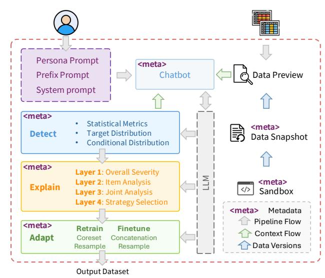
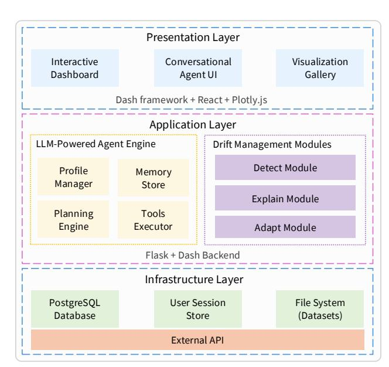
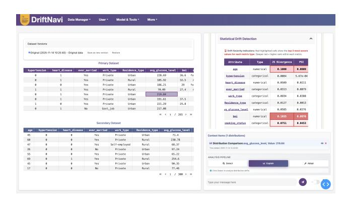

# DriftNavi: Talk through Your Data Drift with LLMs

Zixin Wang zixin.wang@uq.edu.au The University of Queensland Brisbane, Australia

Junliang Yu junl.yu@outlook.com Griffith University Brisbane, Australia

Tong Chen tong.chen@uq.edu.au The University of Queensland Brisbane, Australia

Yadan Luo y.luo@uq.edu.au The University of Queensland Brisbane, Australia

Shazia Sadiq∗ shazia@eecs.uq.edu.au The University of Queensland Brisbane, Australia

#### Abstract

Data drift is a pervasive issue in real-world machine learning applications. While models often perform well on in-distribution data, their performance can degrade significantly when deployed in new environments where the input distribution has shifted. But how can users with varying knowledge backgrounds effectively track and interpret these changes? We present DriftNavi, a lightweight conversational tool powered by LLMs that enables personalized, structured, model-free analysis of dataset drift. DriftNavi integrates a reasoning agent that guides users through the full drift detection pipeline, detect, explain, and adapt, in an interactive dialogue. The tool not only helps users navigate drift, but also enhances their understanding of the process. We conduct case studies on stroke prediction dataset to validate the tool's effectiveness. The code and demo video is publicly available at [here.](https://github.com/Jo-wang/CIRES-DriftNavi)

## CCS Concepts

•Information systems→Data management systems;• Humancentered computing → User interface toolkits.

#### Keywords

Dataset Drift, Large Language Model, Agent, Conversational, Data Management

#### ACM Reference Format:

Zixin Wang, Junliang Yu, Tong Chen, Yadan Luo, and Shazia Sadiq. 2026. DriftNavi: Talk through Your Data Drift with LLMs. In Companion Proceedings of the ACM Web Conference 2026 (WWW Companion '26), April 13–17, 2026, Dubai, United Arab Emirates. ACM, New York, NY, USA, [4](#page-3-0) pages. <https://doi.org/10.1145/3774905.3793123>

## 1 Introduction

Machine learning models play a central role in real-world systems due to their ability to process large-scale data and generate accurate predictions. However, models are limited by their training data, and real-world data often exhibit unpredictable distribution shifts. For example, medical datasets drawn from different demographic groups may reflect distinct patterns [\[4\]](#page-3-1), creating substantial risks

∗Corresponding author

Figure 1: The DriftNavi pipeline consisting of three stages: Detect, Explain, and Adapt. It is orchestrated by an LLM agent with contextual reasoning.

when deployed models encounter such shifts, commonly referred to as data drift. In practice, monitoring and diagnosing data drift are typically handled by data scientists, who may lack sufficient domain expertise to interpret patterns within specific contexts. Meanwhile, domain experts often lack the computational knowledge to interpret model behaviors across varying datasets. This gap highlights the need for a collaborative and interpretable tool that bridges data science and domain knowledge—helping data experts understand the domain and enabling domain experts to reason about data-driven systems.

Large Language Models (LLMs) have emerged as powerful assistants capable of facilitating human-AI collaboration across complex multi-step process. LLMs allow non-experts to interactively explore data, interpret patterns, and ask questions in natural language. However, most existing LLM-based interfaces for data analysis lack structured guidance and procedural consistency, especially for complex processes such as data drift detection and mitigation. This is particularly problematic in high-stake domains such as healthcare, where both transparency and accuracy are critical.

To this end, we introduce DriftNavi, an interactive LLM-powered tool that leverages the reasoning capability of LLMs to provide a structured, personalized, and conversational pipeline for data drift analysis. The system helps non-expert users gain both a holistic

[This work is licensed under a Creative Commons Attribution 4.0 International License.](https://creativecommons.org/licenses/by/4.0) WWW Companion '26, Dubai, United Arab Emirates

© 2026 Copyright held by the owner/author(s).

ACM ISBN 979-8-4007-2308-7/2026/04 <https://doi.org/10.1145/3774905.3793123>

Figure 2: System architecture of DriftNavi.

understanding of their datasets and contextual insights into the underlying domain. DriftNavi organizes the analysis process into a three-stage conversational pipeline: Detect, Explain, and Adapt. Users can explore data drift through statistical measures and interact with the LLM to interpret results. The system then provides structured reasoning about the causes and risks of drift, along with actionable suggestions for mitigation. Finally, users are guided to make informed decisions based on system feedback, while retaining full control over the process. DriftNavi acts as a collaborative assistant, translating data-driven signals into actionable insights and putting human users back in control of the model-data loop.

To summarize, this paper makes the following contributions:

- We present DriftNavi, a model-free LLM-powered tool for dataset drift detection and mitigation, designed with a usercentric, conversational interface.
- We design a structured and interactive three-stage pipeline (Detect, Explain, Adapt) that guides users through the drift analysis process with transparency and flexibility.
- We integrate statistical tests, visualizations, and sampling methods within the LLM reasoning loop, allowing for grounded explanations and user-driven actions.
- We support persona-based customization, enabling tailored interactions based on user background.
- We demonstrate the system through real-world case studies and showcase its usability in helping non-experts navigate data drift.

#### 2 System Design

## 2.1 An Overview of DriftNavi

DriftNavi is a modular system for dataset drift detection, explanation, and mitigation via natural language interaction. The system follows a three-layer architecture (Figure [2\)](#page-1-0), consisting of a presentation layer for user interaction, an application layer for LLM reasoning and pipeline control, and an infrastructure layer for data persistence and external services. This design enables non-expert users to interactively explore distribution drift through natural

language while maintaining access to powerful statistical tools and automated mitigation strategies.

#### 2.2 Core Components

2.2.1 Presentation Layer. The presentation layer serves as the user-facing interface. It includes:

- A conversational agent UI, where users interact with the LLM to request drift analysis, ask questions, and receive feedback in natural language.
- An interactive dashboard, which displays dataset metadata and drift statistics.
- A visualization gallery, where statistical plots (e.g., distribution comparisons) are rendered.

The frontend is built using Dash and Plotly.js on top of React components, enabling responsive updates during the user interaction.

2.2.2 Application Layer. At the core of DriftNavi lies the LLMpowered agent engine, which manages user interaction, maintains context, and orchestrates system components. It consists of four key sub-modules:

- Profile Manager: Tracks user persona (e.g., domain expert, data scientist) and adjusts explanation depth accordingly (See persona prompt below).
- Memory Store: Maintains session context, including prior messages, uploaded datasets, and current pipeline stage.
- Planning Engine: Determines the current pipeline step and dispatches appropriate actions.
- Tools Executor: Invokes downstream modules such as statistical tests, visualization routines, or sampling strategies, and integrates their outputs into LLM responses.

To facilitate role-aware interaction, we define three prompt types:

Persona prompt "I work as a {professional\_role} in the {industry\_sector} industry. I have a {expertise\_level} level of expertise in data science, a {technical\_level} technical proficiency, and a {drift\_level} awareness of data distribution shifts in my work."

With the system prompt below, the system will act as a professional scientist that has rich knowledge about data drift:

System prompt "You are a skilled data scientist specializing in managing distribution shifts for tabular datasets, and is integrated into our toolkit named DriftNavi · · ·"

To interact with the chat box directly, we design:

Prefix prompt "You have already been provided with the dataframe df1 and df2, · · · . Do not create dataframe. Do not read dataframe from any other sources. Do not use pd.read\_clipboard. If your response includes code, it will be executed, so you should define the code clearly. · · ·"

as such we ensure the code generated by chat box is executable in the designed python sandbox, ensure a smooth utilization of code.

Parallel to the agent engine, the Drift Management Modules encapsulate core functionalities of the system's analytical pipeline:

- Detect Module runs distributional comparisons between datasets by statistical metrics and conditional distribution visualizations.

- Explain Module utilizes the LLM to generate 4-layer explanations about drift severity, affected features, and potential causes, as well as recommended executions.
- Adapt Module executes mitigation strategies (e.g., coreset selection, resampling) based on user prompts, while preserving human control over final decisions.

2.2.3 Infrastructure Layer. This layer supports backend data operations and API access. It includes:

- A PostgreSQL database for storing datasets and user logs.
- A session store that retains per-user interaction settings.
- A file system module for temporary dataset storage and outputs.
- An external API gateway that connects to OpenAI's GPT-based models for response generation. Responses are streamed, parsed, and formatted before being presented to the user.

DriftNavi adopts a hybrid execution design to balance portability, persistence, and developer usability. The data storage layer is containerized and orchestrated via Docker Compose to ensure reproducible database environments across machines, while the application layer runs locally, supporting rapid iteration.

## 2.3 Implementation Highlights

(1) Context-Aware Prompting: Unlike generic LLMs, our agent injects domain-specific information, such as user role, domain expertise, and drift awareness, into each prompt to reduce hallucinations and improve response relevance.

(2) Context-Grounded Chat Interaction: Beyond free-form Q&A, DriftNavi enables users to build up and edit contextual elements (e.g., metadata descriptions, statistical outputs) that persist across the session and guide the LLM's answers. This bridges the gap between ad hoc queries and structured reasoning.

(3) Hybrid Adaptation Strategies: We propose a model-free approach that combines coreset selection [\[3\]](#page-3-2) with multi-attribute stratified resampling, enabling both fine-tuning and full retraining to achieve robust distribution alignment.

(4) Executable Explanations: Explanations include copy-paste Python snippets that are directly executable in the embedded sandbox, with outputs immediately available for downstream analysis. This enables seamless transition from reasoning to computation, a feature rarely supported by existing LLM-based data assistants.

## 3 A Case Study on Stroke Prediction

## 3.1 Setup and Scenario

To demonstrate the usage of DriftNavi, we select the publicly available Stroke Prediction Dataset[1](#page-2-0) . The dataset contains demographic and health-related attributes for patients, along with a binary label indicating whether a patient experienced a stroke. To simulate a realistic domain drift scenario, we partition the dataset by gender [\[2\]](#page-3-3), treating male samples as the primary (historical) dataset df1 and female samples as the newly collected secondary dataset df2. We further split df2 into an 80% comparison set and a 20% test set. In this setup, we assume a model has been previously trained on the primary dataset (df1). Before applying this model to the new female samples, DriftNavi first examines potential drift between the two datasets to prevent risky or unreliable predictions.

Figure 3: Detect stage interface with statistical summaries and optional context injection (bottom-right context items).

## 3.2 User Persona and System Interaction

In this case, we simulate a novice healthcare professional exploring dataset drift. The user registers in DriftNavi with the following persona profile: professional\_role = Researcher, industry\_sector = Healthcare, expertise\_level = Beginner, technical\_level = Beginner, drift\_level = Low. Based on this profile, DriftNavi adjusts the language complexity and explanation depth.

The user uploads df1 and df2 to initiate the pipeline. Through the interactive dashboard, they can preview dataset distributions and select key attributes for comparison. These distributional summaries can be added directly as context into the conversational interface, allowing the LLM agent to reason and explain drift patterns using grounded evidence.

## 3.3 Conversational Drift Exploration

Users can directly inject selected context items into the chat interface (Figure [3,](#page-2-1) bottom right) to facilitate further inspection of statistical differences between the two datasets. Through dialogue with the LLM agent, users receive tailored explanations of drift severity and potential causes. Suggested follow-up questions are dynamically generated based on the conversation context, guiding novice users through the mitigation pipeline in an intuitive and structured manner.

#### 3.4 Drift Detection

The Detect stage in DriftNavi enables users to identify distributional differences between datasets via two complementary mechanisms: statistical measurement and interactive visualization.

First, the system leverages Evidently[2](#page-2-2) to compute multiple statistical metrics including Population Stability Index (PSI), Wasserstein distance, Hellinger distance, and chi-square statistics. These metrics are applied across matched features in df1 and df2 to quantify drift severity. Second, the system offers visualization-based drift inspection. Users can select a target variable (e.g., stroke = 1) and compare the conditional distributions of other attributes (e.g., age, BMI, smoking status) across datasets. Figure [3](#page-2-1) shows an example of the interface where users examine distributional differences and directly add selected visual or statistical elements as contextual inputs into the chat interface. This stage supports flexible interaction: users can choose which drift signals to carry forward for

1<https://www.kaggle.com/datasets/fedesoriano/stroke-prediction-dataset>

2<https://github.com/evidentlyai/evidently>

Figure 4: Explain Stage: Layer 2 (top), Layers 3 and 4 (bottom)

explanation, or explore them further via natural language dialogue with the LLM. In our stroke prediction scenario, features such as smoking\_status, bmi, age, and avg\_glucose\_level showed moderate to severe distributional changes between genders.

#### 3.5 Drift Explanation

The Explain stage enables users to interpret the implications of detected drift by organizing selected context items into a four-layer explanation paradigm. This process helps users, especially those with limited technical background—understand whether drift is critical, where it occurs, and what actions may be necessary.

After users select drift signals (e.g., PSI results or attribute visualizations) during the Detect stage, these context items are automatically carried into the explanation pipeline. Users may further filter or refine these items based on their interest or expertise. The LLM agent then generates structured reasoning across four layers:

- Layer 1 Overall Severity: Summarizes the global drift situation and classifies it into High, Medium, or Low severity based on aggregated statistical signals.
- Layer 2 Item-Level Analysis: For each selected attribute, the system provides natural language explanations on the drift pattern, supported by evidence (e.g., PSI scores). Explanations are customized based on the user's persona.
- Layer 3 Joint Analysis: Synthesizes insights across multiple context items to reveal compound effects (e.g., age–glucose interaction), enabling more holistic risk assessment in Layer 4.
- Layer 4 Suggested Strategy: Drawing on insights from Layers 1–3, the system recommends one action from: Retrain (severe drift), Finetune (moderate drift), or No Operation (minimal drift).

As shown in Figure [4,](#page-3-4) the agent's explanations are layered in a structured textual formats. Based on severe divergence observed, the system recommends a retraining procedure.

## 3.6 Drift Adaptation

In the Adapt stage, we assume a model has already been trained on the primary dataset (df1). DriftNavi supports data-level interventions to mitigate drift without the underlying model. While the

system recommends an appropriate strategy in the previous stage, users retain full control to override or refine the suggested actions. Retrain Path. If the user selects Retrain, the system concatenates the source (df1) and target (df2) datasets. Users are then prompted to select attributes for rebalancing. The system supports multiple resampling strategies [\[1\]](#page-3-5) to generate a drift-mitigated dataset suitable for retraining. The final output is exported in CSV format. Finetune Path. If Finetune is chosen, DriftNavi initiates a twostep pipeline: (1) a coreset selection procedure [\[3\]](#page-3-2) is applied to the source dataset, based on a user-specified retention ratio (e.g., keeping 20% of df1); and (2) the target dataset is resampled as in the retrain path. The resulting datasets are then concatenated to form a balanced finetuning set to minimize catastrophic forgetting.

In our case study, the user chose to follow the system's recommendation and executed a Retrain path. After attribute-level undersampling, the user exported the balanced dataset for downstream model development.

#### 3.7 Results

We preprocess all datasets using a unified pipeline to ensure consistency across training and test splits. An XGBoost classifier with fixed hyperparameters and imbalance handling is trained separately on (1) the original male dataset (i.e., the primary dataset), and (2) the refined dataset produced by DriftNavi. Both models are evaluated on the same held-out female test set to enable a fair comparison under controlled distribution shift. The results indicate that the DriftNavi-refined dataset leads to improved performance, demonstrating the system's effectiveness in mitigating domain shift through data-level adaptation.

#### 4 Conclusion

We presented DriftNavi, an interactive, LLM-powered system designed to support data drift detection, explanation, and adaptation through a structured, conversational interface. By combining statistical analysis, visualization, and personalized guidance, DriftNavi enables non-expert users to better navigate drift in real-world datasets. Our system demonstrates how LLMs can be embedded into analytical workflows not just as passive assistants, but as active agents in data-centric decision-making. In future work, we will conduct a user study to assess DriftNavi's impact on performance and productivity across different user profiles.

## Acknowledgments

This work was supported by ARC Training Centre for Information Resilience (CIRES) IC200100022.

#### References

[1] Guillaume Lemaître et al. 2017. Imbalanced-learn: A Python Toolbox to Tackle the Curse of Imbalanced Datasets in Machine Learning. JMLR (2017). [2] Josh Gardner, Zoran Popović, and Ludwig Schmidt. 2023. Benchmarking distribution shift in tabular data with TableShift (NIPS '23). Article 2324, 48 pages. [3] Aviv Hadar, Tova Milo, and Kathy Razmadze. 2024. Datamap-Driven Tabular Coreset Selection for Classifier Training. Proc. VLDB Endow. 18, 3 (2024), 876–888. [4] Irving Zucker and Brian J Prendergast. 2020. Sex differences in pharmacokinetics predict adverse drug reactions in women. Biology of sex differences 11 (2020), 32.