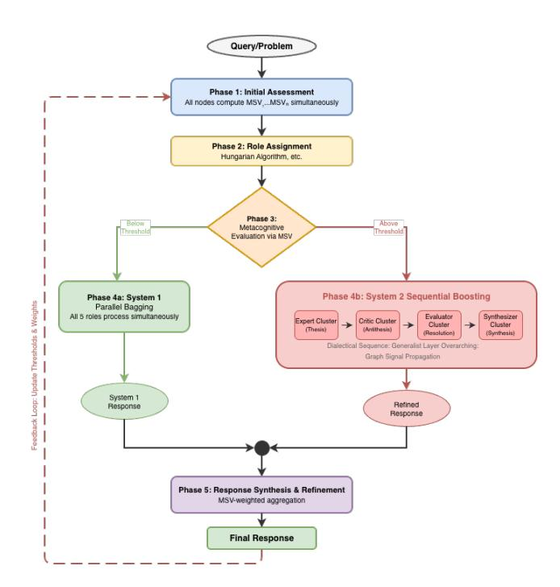
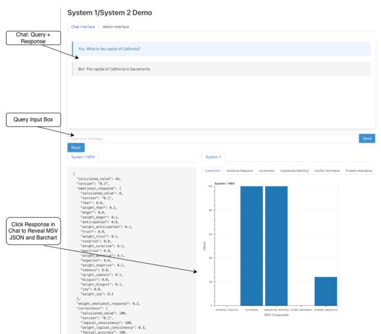
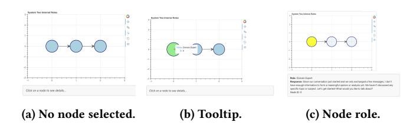
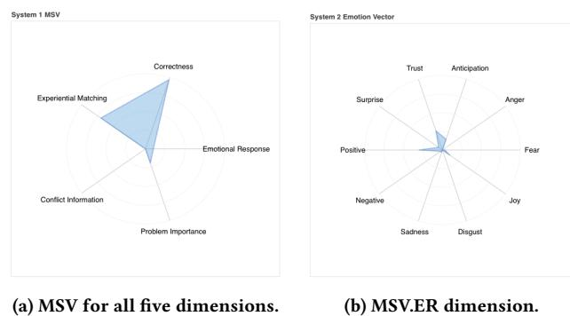
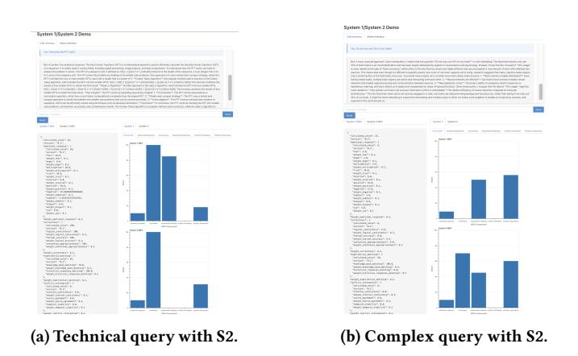

# Implementation of a Metacognition Framework for Self-Awareness and Self-Regulation in Ensembles of LLMs

Charles Courchaine∗ Fitchburg State University, National University Portland, OR, USA charles@courchaine.dev

Ricky J. Sethi∗ Fitchburg State University, Worcester Polytechnic Institute Fitchburg, MA, USA rickys@sethi.org

Hefei Qiu Fitchburg State University Fitchburg, MA, USA hqiu@fitchburgstate.edu

# Abstract

Large Language Models (LLMs) are notorious for struggling with assessing their own uncertainty, detecting knowledge conflicts, or recognizing when problems exceed their expertise; such limitations inevitably undermine reliability and trust in LLMs. In this paper, we present the first implementation[1](#page-0-0) of a metacognitive framework for ensembles of LLMs that addresses these challenges through explicit monitoring and control mechanisms.

Our system computes a Metacognitive State Vector (MSV) quantifying self-awareness for monitoring across five dimensions derived from cognitive psychology: Emotional Response, Correctness Evaluation, Experiential Match, Conflicting Information, and Problem Importance. MSV values also provide self-regulation for control, automatically switching between System 1 (fast, single- or multinode) and System 2 (deliberative, multi-node) processing based on query complexity. For System 2 execution, graph-theoretic algorithms control the assignment of specialized roles (Domain Expert, Critic, Evaluator, Synthesizer, and Generalist) to ensemble nodes according to their MSV-quantified metacognitive states.

Our implementation allows users to explore how different query types trigger distinct processing modes. The Proof-of-Concept (PoC) demo showcases the framework with illustrative examples showing appropriate System 1/System 2 routing and helps visualize the metacognitive process via real-time radar charts and decision indicators. This PoC implementation demonstrates the feasibility of creating a framework for metacognitive self-awareness and selfregulation in LLM systems.

## CCS Concepts

• Computing methodologies → Cognitive science; Ensemble methods; • Theory of computation → Machine learning theory.

#### Keywords

Large Language Models, Metacognition, LLM Ensemble Methods, LLM Emotions, Teacher-Student Model, Dual-Process Theory, Cognitive Psychology, Neuroscience, Neural Framework

WWW Companion '26, Dubai, United Arab Emirates © 2026 Copyright held by the owner/author(s). ACM ISBN 979-8-4007-2308-7/2026/04 <https://doi.org/10.1145/3774905.3793124>

#### ACM Reference Format:

Charles Courchaine, Ricky J. Sethi, and Hefei Qiu. 2026. Implementation of a Metacognition Framework for Self-Awareness and Self-Regulation in Ensembles of LLMs. In Companion Proceedings of the ACM Web Conference 2026 (WWW Companion '26), April 13–17, 2026, Dubai, United Arab Emirates. ACM, New York, NY, USA, [5](#page-4-0) pages.<https://doi.org/10.1145/3774905.3793124>

# 1 Introduction

In humans, metacognition can be seen as the dynamic interplay between self-awareness, which provides monitoring capabilities, and self-regulation, which enables control mechanisms; together, they form an adaptive feedback system for cognition [\[1–](#page-3-0)[4,](#page-3-1) [6\]](#page-3-2).

In our previous work [\[9\]](#page-4-1), we proposed an analogous metacognition framework for LLMs based on the Metacognitive State Vector (MSV), which supports both monitoring and control in LLMs; we further incorporated ideas from the Dual-Process Cognitive theory to map System 1/System 2 processing onto ensembles of LLMs mediated by the MSV. Our main contributions were defining the MSV-based state-monitoring framework for allowing self-awareness and designing a complementary control architecture that enables self-regulation.

This kind of metacognitive framework is crucial for addressing LLMs' inability to assess their own uncertainty [\[10\]](#page-4-2) and their tendency to systematically generate hallucinated content [\[5\]](#page-3-3). By operationalizing explicit monitoring and control mechanisms through the MSV, our approach directly targetted these metacognitive deficits that undermine current LLMs' reliability and trustworthiness.

## 1.1 Contributions

In this work, we now implement a proof-of-concept (PoC) of the entire system above, as shown in Figure [1.](#page-1-0) We provide the full codebase, installation video, and demo video at the above link[1](#page-0-0) and present the following contributions:

- Implementation of the MSV-based Metacognition Framework, including facilitating automatic System 1/2 switching and role assignment to nodes in ensembles of LLMs
- Functional user interface demo, including: Query Input, MSV Radar Charts, System 1/System 2 decision indicator with threshold-based explanation, network graph visualization of node role assignments, and expandable interface for node contributions and synthesis.
- Illustrative examples showing the framework's capabilities through qualitative demonstrations of different system behaviors across query types with varying metacognitive complexity

∗Both authors contributed equally to this research. 1<https://research.sethi.org/metacognition/>

[This work is licensed under a Creative Commons Attribution-NonCommercial-](https://creativecommons.org/licenses/by-nc-nd/4.0)[NoDerivatives 4.0 International License.](https://creativecommons.org/licenses/by-nc-nd/4.0)

Table 1: The Metacognitive State Vector (MSV)

#### 2 Metacognition Framework Implementation

Central to our metacognition framework is the Metacognitive State Vector (MSV), a 5-dimensional vector that quantifies metacognition on a common scale, with explicit formulas for each component, as seen below and in Table [1:](#page-1-1)

- ER (Emotional Response): Aggregates affective states as intensities of multiple emotion categories, each weighted by its contextual importance in order to represent the computational analogue of affective metacognitive experiences.
- CE (Correctness Evaluation): Weighted composite of logical consistency, factual accuracy, and contextual appropriateness; forms an uncertainty signal = 1 − ���� that triggers deeper analysis.
- EM (Experiential Matching): Measures similarity of the current response to prior knowledge and experience; yields unfamiliarity signal = 1 − ���� to promote exploration when novelty is detected.
- CI (Conflicting Information): Degree of internal, sourcelevel, or temporal inconsistency that flags potential contradictions requiring higher-order deliberation.
- PI (Problem Importance): Evaluates the potential consequences, urgency, and scope of a problem to prioritize cognitive and computational resources toward higher-impact or time-sensitive tasks.

In the PoC, these are self-reported and single-channel validation of state-of-the-art approaches for each dimension are relegated to future work.

# 2.1 Dual-Process Mapping Implementation

We map ensembles of LLMs to either System 1 (fast, low-cost, bagged ensemble or single node) or System 2 (slow, deliberative, boosted ensemble). The MSV values govern when to escalate from System 1 to System 2. The control flow for deciding between a System 1 output or a deeper System 2 output operates through a five-phase orchestration protocol as seen in Figure [1,](#page-1-0) where we also see a feedback loop in anticipation of extension to meta-reasoning and which also underlies computational thinking [\[7,](#page-3-4) [8\]](#page-3-5):

- 1. Parallel MSV computation where each node independently evaluates the query to generate its own metacognitive assessment MSV;
- 2. Role assignment using a conflict resolution mechanism (e.g., Hungarian algorithm) to ensure role diversity while considering MSV-derived fitness scores;

- 3. System mode selection: aggregated MSV values are compared against configurable thresholds to determine System 1 (fast, parallel) versus System 2 (slow, sequential) activation;
- 4. Query execution following either parallel bagging (System
  - 1) or sequential boosting (System 2) patterns; and
- 5. Final response synthesis with MSV-weighted aggregation; also handles early-stopping verification and formatting.

The MSV aggregation can employ complex strategies (like boosting) but initially uses:

- 1. arithmetic mean for System 1 decisions (MSVavg = Í MSV�� ),
- 2. weighted average by confidence for System 2 MSVweighted = Í (CE�� · MSV��)/Í CE�� ), and
- 3. percentile-based aggregation for conflict detection (e.g., using the 75th percentile of CI values as a control signal to trigger more deliberation or synthesis prompts that surfaces disagreement rather than forcing false consensus).

The System 2 sequential execution can specifically order roles, e.g., as Domain Expert → Critic → Evaluator → Synthesizer, with each node's output enriching the context for subsequent processing

Figure 1: 5-phase Ensemble Control Flow Process.

and early stopping triggers, e.g., when consecutive MSV confidence scores might exceed 85% or conflict scores drop, say, below 20%.

#### 2.2 Graph-Theoretic Control Layer

In our framework, nodes (LLMs/agents) assume roles (Domain Expert, Critic, Evaluator, etc.); role transitions are driven by MSVweighted softmax policies and edge activations (sigmoid with temperature).

The graph-theoretic control system is implemented as a directed graph G(V, E, W) where the vertices V represent individual LLM nodes, edges E denote communication pathways between nodes, and edge weights �� (��) = (��(��), ��(��) (��)) combine static base weights (��(��)) with dynamic metacognitive transition functions (��(��) (��)).

The base weights are the fixed, pre-determined weight that represents the inherent connection strength between two nodes, regardless of their current state, and can be initialized based on things like the topology structure (e.g., 1.0 for direct neighbors or 0.5 for distant neighbors) or node similarity (e.g., two Expert nodes might have w=0.8) or historical preference (this would be closest to biological neurons where neurons that fire together, wire together; e.g., Node1 → Node2 historically produces good results, etc.) or perhaps manually based on use-case context or expert domain knowledge (e.g., we always want Critics to influence Evaluators strongly or some such).

The dynamic weights change in real-time based on the source node's current metacognitive state and can be calculated each time based on current MSV as a weighted sum (as seen below). The final edge weight currently combines both as multiplicative (but could be additive or weighted, as well).

Each node maintains a local Metacognitive State Vector (MSV) computed across the five dimensions (ER, CE, EM, CI, PI) and can dynamically assume roles from the set R = {Domain Expert, Critic, Evaluator, Synthesizer, Generalist}.

The edge activation function is

��(������) (����) = ��(��1 · ������ +��2 ·������ +��3 · ������ +��4 · ������ +��5 ·������) or, more generally: ��(������) (����) = ��( Í ���� · MSV�� ) with: ��(��) = 1 1+�� −��/�� where the sigmoid uses a temperature parameter �� to modulate information flow based on the source node's metacognitive state. Role transition probabilities are calculated using �� (�� ′ |��, ��) = ���� �� �������� (�� (��, ��′ , ��)), where

�� (��, ��′ , ����) = ��1 · ������ +��2 · ������ +��3 · ������ +��4 · ������ +��5 · ������ or, more generally: �� (��, ��′ , ����) = Í ���� · MSV��

represents the transition score from current role �� to target role �� ′ , with role-specific weight vectors �� learned or manually configured (e.g., Critic→Expert transition weights CE heavily at 0.4 while CI at 0.1, reflecting that high confidence triggers expert consultation). The system persists state history to enable continuous learning (can update base weights or dynamic weights with time) and maintains both synchronous (for System 2 sequential boosting deliberation) and asynchronous (for System 1 processing via parallel bagging) execution paths.

The main thing is that the source node's metacognitive state determines how strongly it "broadcasts" to its neighbors; e.g., a node with high uncertainty might reduce its outgoing edge weights (quieter voice) but a node with high confidence and low conflict might increase them (louder voice), etc.

Resolving Role Conflicts: Suppose both Node 1 and Node 3 want to be Expert and Node 2 and Node 4 both prefer the Critic role. The Hungarian algorithm solves this as an assignment problem and, in larger ensembles (or perhaps more importantly in smaller ones), the conflict resolution ensures we don't end up with situations like five Critics and no Expert, or five Experts with no one to challenge their assumptions, etc. In addition, the ensemble itself can be assigned a role, or a distribution of final role assignments within the ensemble, showing how it "thinks" overall.

Scalability and Role-Based Clustering. For ensembles beyond 5 nodes, the framework supports hierarchical organization where nodes with the same role assignment can naturally form functional clusters. At scale, the Hungarian algorithm's role assignments can produce multiple Critics, multiple Experts, etc., which then operate as coordinated subgroups. E.g., high CI scores (>70) might result in more Critic role assignments, effectively forming a "critic caucus" that engages in intra-cluster deliberation before presenting unified challenges to Expert clusters. High EM scores (>80) across multiple nodes might similarly create collaborative synthesis clusters where confident nodes reinforce each other's contributions through the existing edge activation mechanism. High PI scores (>75) could trigger increased Evaluator role assignments, establishing hierarchical validation structures where Expert clusters propose and Evaluator clusters verify. Importantly, this role-based clustering operates within the stable graph topology established during initialization; i.e., the structure remains fixed while activation patterns and role distributions adapt to metacognitive demands. This separation of stable structure from dynamic role assignment preserves learning continuity while enabling emergent functional organization at scale. The inter-role flow remains a fixed sequential pipeline while the graph-theoretic machinery operates within intra-role clusters as an overlay on stable base topology, as seen in Figure [1.](#page-1-0)

# 2.3 Implementation Details

The framework is implemented in Python and consists of a codebase of ˜1,500 LOC, publicly available at the above link[1](#page-0-1) . All LLM calls are made to llama 3.2 via ollama and all MSV visualizations are done utilizing FastAPI, HTMX, and Bokeh. Hardware requirements are also simple: a Macbook M3 Pro with 18GB of RAM for this initial implementation with possible secondary farming out of calls to the Google Cloud infrastructure.

Our system can optionally employ a hybrid architecture where System 1 queries execute locally via ollama for minimal latency, while System 2 deliberations can then distribute node execution across Google Cloud Vertex AI instances, enabling parallel processing of multiple roles (e.g., Critic, Evaluator, Synthesizer running concurrently). This hybrid approach would balance response time with resource constraints: simple queries complete locally but complex multi-node deliberations can then leverage cloud parallelization to reduce System 2 processing.

# 3 User Interface Demo

The user interface for a simple query which does not trigger System 2 activation is shown in Figure [2;](#page-3-6) this query asks for the capital of

Figure 2: UI for Factual query with only System 1 response.

California and it shows the breakdown of the MSV in both JSON format as well as with bar graphs.

We can also visualize node contributions via radar charts, as shown in Figure [4.](#page-3-7) As seen there, all radar charts are on the scale 0-100, reflecting the normalized score of the overall MSV and the component vectors, with rings at 25, 50, 75, and 100.

Finally, we can visualize node contributions and synthesis as seen in Figure [3](#page-3-8) where we initally see in Figure [3a](#page-3-8) the System Two Internal Role nodes with no node selected. In Figure [3b,](#page-3-8) we see the first node with a tooltip indicating that it assumed the role of Domain Expert. In Figure [3c,](#page-3-8) we see that the first node was selected, showing the detail of the node's role and the response it generated.

# 4 Illustrative Examples & Scenarios

We illustrate the system's metacognitive capabilities through three representative query types that exercise different decision pathways. These examples demonstrate how MSV values drive System 1/System 2 transitions and would inform role assignments in the complete ensemble implementation. Three scenarios shown are:

- (1) Simple Factual Query: "What is the capital of California?": Requires no deliberation and System 2 is not activated: see Figure [2](#page-3-6)

Figure 3: Node contributions and synthesis.

Figure 4: Radar charts for MSV for all five dimensions (left) and just the emotion vector breakdown (right).

- (2) Technical Query: "How does the FFT work?": More complex query that requires deliberation and activates System 2: see Figure [5a](#page-3-9)
- (3) Complex Query: "Do we use 10% of our brain?": Multi-faceted query that requires complex and nuanced reflection with System 2 activated: see Figure [5b](#page-3-9)

## References

[1] Charles S. Carver and Michael F. Scheier. On the self-regulation of behavior. Cambridge University Press, 1998. [2] Anastasia Efklides. Metacognition: Defining its facets and levels of functioning in relation to self-regulation and co-regulation. European Psychologist, 13(4): 277–287, 2008. doi: 10.1027/1016-9040.13.4.277. [3] John H. Flavell. Metacognition and cognitive monitoring: A new area of cognitivedevelopmental inquiry. American Psychologist, 34(10):906–911, 1979. [4] Stephen M. Fleming and Chris D. Frith, editors. The Cognitive Neuroscience of Metacognition. Springer, 2014. [5] Lei Huang, Weijiang Yu, Weitao Ma, and et al. Zhong. A survey on hallucination in large language models: Principles, taxonomy, challenges, and open questions. ACM Transactions on Information Systems, 43:1–55, 2025. doi: 10.1145/3703155. [6] Thomas O. Nelson and Louis Narens. Metamemory: A theoretical framework and new findings. In Psychology of Learning and Motivation, volume 26, pages 125–173. Academic Press, 1990. [7] Stuart J. Russell and Eric Wefald. Principles of metareasoning. Artificial Intelligence, 49(1-3):361–395, 1991. doi: 10.1016/0004-3702(91)90015-C. URL [https://www.sciencedirect.com/science/article/abs/pii/000437029190015C.](https://www.sciencedirect.com/science/article/abs/pii/000437029190015C) [8] Ricky J Sethi. Essential computational thinking: Computer science from scratch, 2020.

Figure 5: UI for complex queries with System 2 activation.

[9] Ricky J. Sethi, Hefei Qiu, Charles Courchaine, and Joshua Iacoboni. Do llms dream of electric emotions? towards quantifying metacognition and generalizing the teacher-student model using ensembles of llms. In Proceedings of the 34th ACM International Conference on Information and Knowledge Management (CIKM). ACM, 2025. [10] Mark Steyvers and Megan A. K. Peters. Metacognition and uncertainty communication in humans and large language models. Current Directions in Psychological Science, 2025.