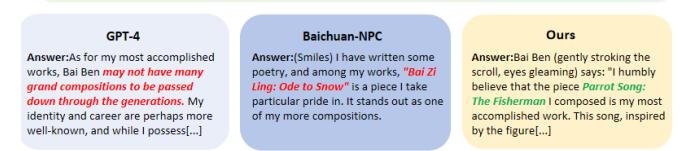

# BaiJia: An Open Role-Playing Platform of Chinese Historical Characters

Ting Bai\* Beijing University of Posts and Telecommunications Beijing, China baiting@bupt.edu.cn

Jiazheng Kang Beijing University of Posts and Telecommunications Beijing, China kjz@bupt.edu.cn

Jiayang Fan Beijing University of Posts and Telecommunications Beijing, China fjy01@bupt.edu.cn

Hengzhi Lan Beijing University of Posts and Telecommunications Beijing, China lansnowz@bupt.edu.cn

Yutian Zhong Beijing University of Posts and Telecommunications Beijing, China pelom@bupt.edu.cn

#### Abstract

We develop an open large-scale role-playing agent platform, termed BaiJia, that comprises 19,281 role-playing agents of Chinese historical characters. This platform is noteworthy for being the pioneering compilation of low-resource historical data that can be utilized in large language models (LLMs) to engage in AI-driven historical role-playing agents. BaiJia addresses the challenges in terms of fragmented historical textual records in different forms, integrating various characters' information, including their biographical, literary, family relations, historical events, and so on. BaiJia's innovative design offers an intriguing and engaging way to interact with Chinese historical characters, enhancing their understanding and appreciation of China's rich historical heritage. Comprehensive experiments demonstrate BaiJia platform's role-playing enhancements, achieving an average 10.2% improvement across six metrics compared with diverse foundational LLMs. The open agent platform can be accessed at [baijia.online.](http://baijia.online) The project is open-sourced at [https://github.com/BAI-LAB/BaiJia.](https://github.com/BAI-LAB/BaiJia) A video demonstration of the BaiJia platform is available at [https://youtu.be/ItJv9gHwSOw.](https://youtu.be/ItJv9gHwSOw)

### CCS Concepts

#### • Computing methodologies → Natural language processing.

#### Keywords

Large language model, Role-playing, Chinese Historical Characters

#### ACM Reference Format:

Ting Bai\*, Jiazheng Kang, Jiayang Fan, Hengzhi Lan, and Yutian Zhong. 2026. BaiJia: An Open Role-Playing Platform of Chinese Historical Characters. In Companion Proceedings of the ACM Web Conference 2026 (WWW Companion '26), April 13–17, 2026, Dubai, United Arab Emirates. ACM, New York, NY, USA, [4](#page-3-0) pages.<https://doi.org/10.1145/3774905.3793125>

\*Corresponding author.

WWW Companion '26, Dubai, United Arab Emirates © 2026 Copyright held by the owner/author(s). ACM ISBN 979-8-4007-2308-7/2026/04 <https://doi.org/10.1145/3774905.3793125>

#### 1 Introduction

Large language models (LLMs) show great potential to mimic human responses in role-playing research areas, enabling individuals to engage with historical characters in a lifelike and immersive manner. Equipping LLMs with role-playing capabilities provides a distinctive means of communicating with historical characters, fostering a deeper comprehension of their thoughts, actions, and the historical backgrounds of those who have made notable contributions to human history.

Table 1: Comparisons of role-playing LLMs.

| LLMs          | # Characters            | Source            |         | Authentic?        |
|---------------|-------------------------|-------------------|---------|-------------------|
| ChatHaruhi    | 32                      | Anime,            | TV      | ✗                 |
| InCharacter   | 32                      | Novels,           | Scripts | ✗                 |
| CharacterEval | 77                      | Novels,           | Scripts | ✗                 |
| RoleLLM       | 100                     | Novels,           | Scripts | ✗                 |
| BaiJia        | 19,281                  | History           |         | ✓                 |
| Platforms     | Target                  | Users             |         | Role Type         |
| Baichuan-NPC  | Game                    | developers        |         | User-created      |
| Xingchen      | Entertainment&Emotional |                   | support | User-created      |
| Character.ai  | Entertainment&Emotional |                   | support | User-created      |
| BaiJia        | Chinese                 | cultural heritage |         | Platform-provided |

The most famous role-playing system is Character.AI[1](#page-0-0) , which achieves great successful and mainly focuses on fictional characters. Chinese e-commercial role-playing systems, e.g., BaiChuan-NPC[2](#page-0-1) , Xingchen[3](#page-0-2) , support character self-creation, in which most characters are self-constructed by users. While enabling flexible interactions, they often result in fragmented cultural representations due to insufficient oversight. Efforts have been made in research studies to empower LLMs with role-playing abilities, such as RoleLLM [\[7\]](#page-3-1), InCharacter [\[8\]](#page-3-2), CharacterEval [\[6\]](#page-3-3), and ChatHaruhi [\[4\]](#page-3-4), have focused on Supervised Fine-Tuning (SFT) foundational LLM models using collected or generated dialogues of characters. However, all of these approaches encounter the significant challenge of the high

[This work is licensed under a Creative Commons Attribution 4.0 International License.](https://creativecommons.org/licenses/by/4.0)

1<https://character.ai>

2<https://npc.baichuan-ai.com/index>

3<https://tongyi.aliyun.com/xingchen>

Figure 1: The core functional interfaces and the pipeline of role-playing agent construction in BaiJia platform.

costs associated with data collection, which is a crucial resource in facilitating LLMs with role-playing capability.

We summarize the data properties in existing role-playing studies, and highlight the differences of our BaiJia platform in Table [1.](#page-0-3) We can see that most characters in existing studies are modern, anime, or fictional characters, and there has been a notable lack of a large-scale development system dedicated for role-playing of Chinese historical characters. Building role-playing agents with historical characters raises great challenges from the vast historical timelines they inhabit and the intricacies associated with the preservation of historical materials. In this paper, we develop a large-scale role-playing agent platform with the low-resource data corpus of Chinese historical culture, termed BaiJia. To the best of our knowledge, BaiJia is the largest role-playing agent platform for Chinese historical characters, with 19,281 historical role options from five dynasties, i.e., Tang, Song, Yuan, Ming, and Qing dynasties.

By integrating characters' information from different sources, e.g., historical documents, ancient books, artworks, folklore, and oral traditions, BaiJia systematically constructs resume templates for each character and generates the dialogue data for instructiontuning of foundation LLMs to gain the role-playing capability. Beyond the specialized agents for Chinese historical characters, we introduce a general historical agent named XiaoBai, which leverages retrieval-augmented generation (RAG) over a historical character knowledge graph constructed from multi-source biographical data and chronological event records. Our contributions are as follows:

- We develop the largest Chinese historical characters roleplaying agent platform (BaiJia), comprising 19,281 specific agents and a general historical agent XiaoBai.

- We design comprehensive evaluation metrics and release an evaluation benchmark[4](#page-1-0) for the role-playing task of historical characters.
- We conduct extensive experiments to demonstrate the effectiveness of our agent platform in role-playing tasks compared with various LLMs, achieving an average improvement of 10.2% across six evaluation metrics.

#### 2 BaiJia Platform

The BaiJia platform provides interactive interfaces that allow users to engage in dialogue with 19,281 Chinese historical characters and a general historical agent, XiaoBai.

#### 2.1 Interfaces Overview

The core functional interfaces in the BaiJia platform are shown in subfigures (a)-(c) in Fig. [1.](#page-1-1)

- Homepage of BaiJia-subfigure(a): the function options are displayed on the homepage, including a conversing function with specific Chinese historical characters, an evaluating function to compare integrated LLMs, and an interacting function to chat with the general historical agent XiaoBai.
- Conversation interface-subfigure(b): users can select different characters from the platform and initiate conversations in a natural and intuitive manner. Once a character is selected, users can enter queries, and the platform will generate responses based on the BaiJia role-playing LLM.

4The evaluation benchmark is publicly available at [https://github.com/BAI-LAB/](https://github.com/BAI-LAB/BaiJia) [BaiJia.](https://github.com/BAI-LAB/BaiJia)

- Evaluation interface-subfigure(c): a visualization from six evaluation metrics to show the comparisons of dialogues generated from our BaiJia and a selected LLM.

#### 2.2 Implementment Details

The implemented pipeline for the construction and evaluation of our role-playing platform BaiJia is illustrated in Fig. [1.](#page-1-1) We highlight the key steps in the processes of data construction, dialogue generation, and model evaluation. The construction of the BaiJia platform includes two crucial parts: the instruction fine-tuning of LLMs based on the generated dialogues and collected character resumes, and the construction of questions that were used to evaluate the role-playing capability of LLMs.

2.2.1 Instruction Fine-tuning. We utilize the LLaMA-Factory framework [\[10\]](#page-3-5) to perform LoRA fine-tuning on LLMs with resumes and the generated dialogue information of characters. This process enables the LLMs to acquire the ability for role-playing.

Resume Collection. We collect diverse character information from multiple sources, e.g., CBDB[5](#page-2-0) , Wikipedia[6](#page-2-1) , Gushiwen website[7](#page-2-2) , to construct Informative and comprehensive character resume in role-playing agent construction. The characters are from five major dynasties in Chinese history: 3,020 characters from Tang, 5,964 characters from Song, 972 characters from Yuan, 4,564 characters from Ming, and 4,761 characters from Qing dynasties. The resumes of each character consist of information about their profiles, relationships, and authored works, covering the basic profile, relations, career, and achievements of characters.

Dialogue Generation. After constructing the resumes of characters, we generate the dialogues that are used for fine-tuning of LLMs. Following the generation process in Character-LLM [\[5\]](#page-3-6), we adopt a two-step dialogue generation approach: (1) extracting the character's dialogue scenes: we adopt GPT-4o-mini to extract 10 unique scenes based on the resume of each character. These scenes include palace dialogues, family conversations, and literary debates. The prompts focus on the character's social relations, life events, and works, ensuring an authentic historical setting; (2) generating dialogues related to these scenes: under the background of different scenes, we use GPT-4o-mini to automatically generate the questions and simulate responses that align with the historical context of characters.

2.2.2 Evaluation Benchmark. To evaluate the performance of our role-playing agent platform, we construct a question dataset that is used for historical role-playing agent evaluation, and introduce multi-dimensional evaluation metrics that enable comprehensive comparisons with existing role-playing LLMs.

Question Construction. For each character, we construct 15 questions from five thematic aspects: Personal Background, Era Background, Family & Social Connections, Thoughts, Personality & Values, Achievements & Contributions. We use GPT-4o-mini to generate knowledge-oriented questions, ensuring that the questions do not directly reveal specific information. For example, instead of asking, "Your hometown is Yong'an; how did it influence you?" we phrase

it as, "Where is your hometown? How did it influence you?" This approach ensures that questions remain open-ended, allowing for a more accurate assessment of the model's ability to acquire and understand character knowledge in the development of role-playing agents of role-playing.

Evaluation Mertrics. We release a comprehensive evaluation benchmark to assess the capabilities of LLMs on 6 evaluation metrics: i.e., Character Consistency (CC), Dialogue Ability (DA), Character Appeal (CA), Emotional Expression & Intellectual Depth (EI), Creativity & Role Depth Expansion (CR), and Cultural & Historical Appropriateness (CHA). In addition to the evaluation dimensions, i.e., CC, DA and CA, which are proposed in existing role-playing benchmarks [\[7,](#page-3-1) [8\]](#page-3-2), we propose three new metrics, i.e., EI, CR, and CHA, that are specifically designed to evaluate the deep-level spiritual aspect of historical characters, including their emotion, creation and culture understanding. Each of these 6 metrics contains two subdimensions, forming a comprehensive assessment of role-playing performance with a total of 12 sub-dimensions.

LLM Assessment and Human Validation. To evaluate the responses generated from LLMs, as referenced in [\[1\]](#page-3-7), we adopt LLMbased assessments of the responses from the above evaluation dimensions. Specifically, GPT-4o-mini is employed to assign scores on a 1–5 scale for each sub-dimension. To evaluate the scoring quality of ChatGPT-4o-mini, we conduct human validations of the LLM-based assessments on a subset of question-response pairs. Following the human validation procedure in [\[9\]](#page-3-8), we invite two experts in classical Chinese literature to manually score the subset of 40 characters (selected randomly from the five dynasties, with eight characters from each dynasty). We compute Pearson, Spearman, and Kendall's Tau correlation coefficients between human scores and GPT-4o-mini scores. All three metrics show strong positive correlations greater than 0.5 with statistical significance that p-values less than 0.01, which collectively validate that GPT-4o-mini is a reliable evaluator within our experimental framework.

#### 3 Experiment

This section introduces comparative role-playing LLMs and the experimental results. To validate our constructed instruction tuning data, an ablation study is conducted, with several case studies provided to illustrate qualitative insights.

### 3.1 Compared Methods

To verify the effectiveness of our role-playing LLM BaiJia, we conduct experiments and make comparison with different kinds of LLMs, including the Naive LLMs: i.e., ChatGLM, Qwen[8](#page-2-3) , Lama [\[3\]](#page-3-9), DeepSeek [\[2\]](#page-3-10), and the role-playing LLMs (RP-LLM): i.e., BaiChuan-NPC and Xingchen. BaiJia has been fine-tuned on Qwen2.5-7B with our constructed resume and dialogue information, ensuring our LLM remains lightweight and highly specialized.

## 3.2 Experimental Results

The experimental results of different kinds of LLMs are shown in Table [2.](#page-3-11) We have the following observations:

5<https://projects.iq.harvard.edu/cbdb>

6<https://en.wikipedia.org/wiki>

7<https://www.gushiwen.cn>

8<https://qwenlm.github.io/blog/qwen2.5>

Table 2: Performance comparisons of different LLMs with parameter sizes.

| Type Model      | CC    | DA    | CA   | EI   | CR   | CHA   | Avg   | #Param |
|-----------------|-------|-------|------|------|------|-------|-------|--------|
| Naive LLM       |       |       |      |      |      |       |       |        |
| ChatGLM3        | 3.66  | 3.64  | 3.50 | 3.57 | 3.15 | 3.68  | 3.53  | 6B     |
| Qwen2.5         | 4.10  | 4.20  | 4.04 | 4.07 | 3.94 | 4.39  | 4.12  | 7B     |
| Llama-3.1       | 3.58  | 3.63  | 3.60 | 3.69 | 3.37 | 3.47  | 3.56  | 8B     |
| Llama-3.1       | 4.00  | 3.94  | 3.82 | 3.84 | 3.60 | 3.93  | 3.86  | 70B    |
| DeepSeekV2.5    | 4.03  | 4.11  | 4.01 | 3.88 | 3.97 | 4.15  | 4.03  | 236B   |
| Baichuan        | 4.04  | 3.71  | 3.56 | 3.56 | 3.30 | 4.11  | 3.71  | –      |
| Xingchen RP-LLM | 3.29  | 3.30  | 3.08 | 3.18 | 2.74 | 3.38  | 3.17  | –      |
| BaiJia          | 4.98  | 4.69  | 4.26 | 4.16 | 4.17 | 4.98  | 4.54  | 7B     |
| Gain (%)        | 21.5% | 11.7% | 5.4% | 2.2% | 5.0% | 13.4% | 10.2% |        |

Figure 2: Comparison of responses from different LLMs for the question to character Bai Ben. We highlight the correct answers in green. The red color indicates the fabricated answer or false answers.

(1) After fine-tuning with our constructed dialogue information based on character resumes, the role-playing capabilities of BaiJia gain significant improvements over six evaluation metrics.

(2) Despite the advancements in LLMs with larger parameter scales, such as the contrast between Llama-3.1-70B and Llama-3.1- 8B, the performance of these models in the historical character role-playing task remains limited. This phenomenon underscores the necessity of domain-specific data construction and fine-tuning in this specialized field.

(3) Qwen2.5-7B outperforms larger parameter-scale LLMs (e.g., DeepSeekV2.5 and Llama-3.1-70B) in all evaluation metrics except for CR (Creativity & Role Depth Expansion). This may be attributed to its advanced Chinese language processing capabilities. Thus, it is

selected as the foundational model for instruction tuning of BaiJia. (4) For LLMs specialized for role-playing applications, such as BaichuanNPC and Xingchen, we observe that they are unable to portray Chinese historical characters effectively. This may be attributed to the fragmented distribution and restricted accessibility of primary historical source materials, which are difficult to digitize and integrate into AI training datasets.

#### 3.3 Case Study

To intuitively show the effectiveness of BaiJia, we present a case study of a historical character Bai Ben and compare the responses generated from various LLMs. As shown in Fig. [2,](#page-3-12) for the question "What is the literary work you are most proud of?", Baichuan-NPC generates a title of work ( i.e., "Ode to Snow") in the responses, but it is fictional. GPT-4 is unable to provide responses, i.e., "may not have many grand compositions to be passed down" from GPT-4 , owing to their deficiency in relevant knowledge. BaiJia accurately responds "Parrot Song: The Fisherman" as Bai Ben's most accomplished work. This response aligns with historical records and demonstrates the superiority of BaiJia in capturing and reproducing historical character information. Additionally, our contribution enriches the interaction by providing a more immersive and expressive answer, enhancing the user experience in role-playing interactions. This case study shows the efficacy of our agent corpus in improving the factual accuracy and expressive capabilities of LLMs for historical role-playing tasks.

#### 4 Conclusion

We develop BaiJia, the largest Chinese historical character roleplaying agent platform, which aggregates fragmented historical data from diverse sources and constructs a high-quality dialogue corpus to address data scarcity challenges in historical AI research. Comprising 19,281 specialized historical agents and a general historical agent XiaoBai, BaiJia enables large-scale AI-driven role-playing interactions by integrating contextual historical information and leveraging instruction-tuned LLMs. BaiJia platform not only develops a foundational interface for low-resource historical AI but also integrates the first comprehensive multi-dimensional evaluation benchmark for systematic assessment of historical character role-playing performance.

#### Acknowledgments

This work is sponsored by the CCF-Tencent RAGR20240108, the National Natural Science Foundation of China under Grant No. 62236003, and the Tencent Basic Platform Technology Rhino-Bird Focused Research Program.

#### References

[1] Nuo Chen, Yan Wang, Yang Deng, and Jia Li. 2025. The Oscars of AI Theater: A Survey on Role-Playing with Language Models. arXiv[:2407.11484](https://arxiv.org/abs/2407.11484) [cs.AI] <https://arxiv.org/abs/2407.11484> [2] DeepSeek-AI. 2024. DeepSeek-V2: A Strong, Economical, and Efficient Mixtureof-Experts Language Model. arXiv[:2405.04434](https://arxiv.org/abs/2405.04434) [3] Aaron Grattafiori et al. 2024. The Llama 3 Herd of Models. arXiv[:2407.21783](https://arxiv.org/abs/2407.21783) [4] Cheng Li, Ziang Leng, et al. 2023. Chatharuhi: Reviving anime character in reality via large language model. arXiv preprint arXiv:2308.09597 (2023). [5] Yunfan Shao, Linyang Li, Junqi Dai, and Xipeng Qiu. 2023. Character-LLM: A Trainable Agent for Role-Playing. In Proceedings of the 2023 Conference on Empirical Methods in Natural Language Processing (EMNLP). [6] Quan Tu, Shilong Fan, Zihang Tian, et al. 2024. CharacterEval: A Chinese Benchmark for Role-Playing Conversational Agent Evaluation. In Proceedings of the 62nd Annual Meeting of the Association for Computational Linguistics. [7] Noah Wang, Z.y. Peng, Haoran Que, et al. 2024. RoleLLM: Benchmarking, Eliciting, and Enhancing Role-Playing Abilities of Large Language Models. In Findings of the Association for Computational Linguistics: ACL 2024. 14743–14777. [8] Xintao Wang, Yunze Xiao, et al. 2024. Incharacter: Evaluating personality fidelity in role-playing agents through psychological interviews. In Proceedings of the 62nd Annual Meeting of the Association for Computational Linguistics. 1840–1873. [9] Chengyue Yu, Lei Zang, Jiaotuan Wang, Chenyi Zhuang, and Jinjie Gu. 2024. CharPoet: A Chinese Classical Poetry Generation System Based on Token-free LLM. In Proceedings of the 62nd Annual Meeting of the Association for Computational Linguistics (Volume 3: System Demonstrations), Yixin Cao, Yang Feng, and Deyi Xiong (Eds.). Association for Computational Linguistics, Bangkok, Thailand, 315–325. [doi:10.18653/v1/2024.acl-demos.30](https://doi.org/10.18653/v1/2024.acl-demos.30) [10] Yaowei Zheng, Richong Zhang, Junhao Zhang, et al. 2024. LlamaFactory: Unified Efficient Fine-Tuning of 100+ Language Models. In Proceedings of the 62nd Annual Meeting of the Association for Computational Linguistics. Association for Computational Linguistics.