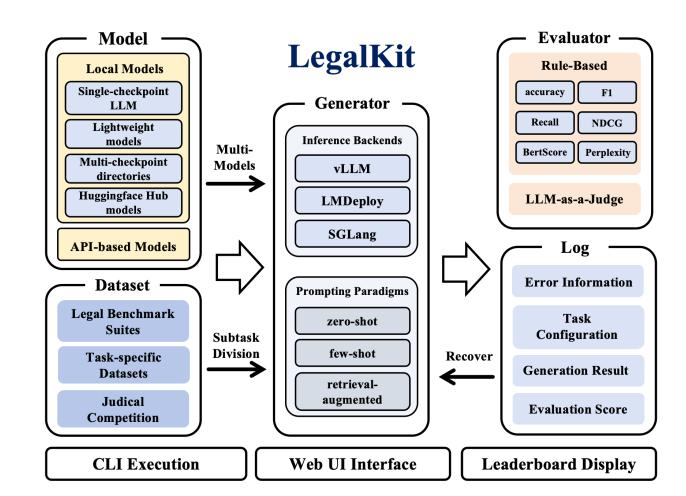
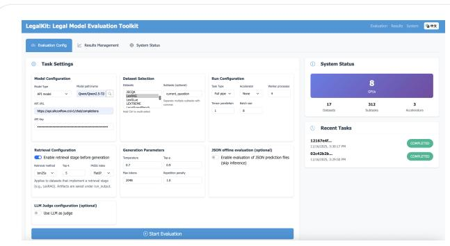
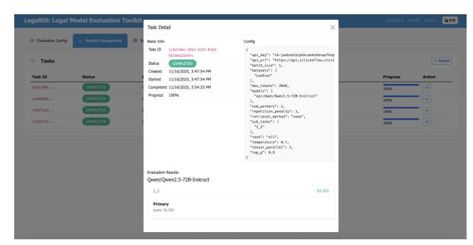

# LegalKit: A Modular Toolkit for Efficient Legal AI Evaluation

Shuo Miao DCST, Tsinghua University Beijing, China Quan Cheng Laboratory Jinan, China miaos22@mails.tsinghua.edu.cn

Haitao Li DCST, Tsinghua University Beijing, China liht22@mails.tsinghua.edu.cn

Yueyue Wu∗ Quan Cheng Laboratory Jinan, China DCST, Tsinghua University Beijing, China wuyueyue@mail.tsinghua.edu.cn

Qingyao Ai∗ Quan Cheng Laboratory Jinan, China DCST, Tsinghua University Beijing, China aiqy@tsinghua.edu.cn

Yiqun Liu Quan Cheng Laboratory Jinan, China DCST, Tsinghua University Beijing, China yiqunliu@tsinghua.edu.cn

# Abstract

The rise of large language models (LLMs) has created unprecedented opportunities for legal AI research. However, progress has been hindered by the absence of standardized, lightweight, and extensible evaluation frameworks capable of supporting the growing diversity of legal tasks. We present LegalKit[1](#page-0-0) , an efficient toolkit that unifies the evaluation of LLMs across a comprehensive spectrum of legal scenarios. LegalKit integrates heterogeneous benchmarks, and offers a flexible configuration system and a user-friendly web interface for interactive evaluation. Its compatibility with multiple acceleration backends and recoverable evaluation pipelines enables scalable experimentation. LegalKit lowers the barrier to rigorous legal NLP research by promoting transparency, reproducibility, and comparability across studies. Designed as community-oriented infrastructure, LegalKit aims to catalyze future extensions and foster collective progress toward trustworthy legal AI.

# CCS Concepts

### • Computing methodologies → Artificial intelligence.

# Keywords

Evaluation Toolkit, Legal AI, Large Language Models, Benchmark

### ACM Reference Format:

Shuo Miao, Haitao Li, Yueyue Wu, Qingyao Ai, and Yiqun Liu. 2026. LegalKit: A Modular Toolkit for Efficient Legal AI Evaluation. In Companion Proceedings of the ACM Web Conference 2026 (WWW Companion '26), April 13–17, 2026, Dubai, United Arab Emirates. ACM, New York, NY, USA, [4](#page-3-0) pages. <https://doi.org/10.1145/3774905.3793126>

© 2026 Copyright held by the owner/author(s). ACM ISBN 979-8-4007-2308-7/2026/04 <https://doi.org/10.1145/3774905.3793126>

# 1 Introduction

The great potential of large language models (LLMs) in legal applications has led to the construction of multiple benchmarks. Recent efforts like LawBench[\[5\]](#page-3-1), LegalBench[\[6\]](#page-3-2), LexEval[\[10\]](#page-3-3), and LAIW[\[4\]](#page-3-4) introduce diverse task collections for legal AI evaluation, reflecting the growing need for domain-specific assessment. These benchmarks highlight unique challenges in evaluating LLMs on professional legal tasks (e.g., case analysis, statute reasoning, etc.) that are not addressed by general NLP benchmarks[\[7\]](#page-3-5). Unfortunately, existing LLM evaluation frameworks remain heavyweight and poorly aligned with the needs of legal AI. General-purpose platforms such as OpenCompass[\[3\]](#page-3-6) and EvalScope[\[16\]](#page-3-7) offer broad evaluation coverage, yet their tightly coupled architectures, steep learning curves, and high operational complexity make them difficult to adapt to legal-specific tasks and benchmarks. This rigidity not only increases development and maintenance costs but also slows iteration for domain-focused research.

To this end, we introduce LegalKit, a lightweight and extendable evaluation toolkit for legal LLMs and systems. LegalKit follows a modular design philosophy to track the essential components of legal LLM evaluation. It keeps dataset handling, inference, and evaluation largely separated, reducing implementation overhead and making it easy to extend or replace individual components. This lightweight structure improves maintainability and enables rapid adaptation to the emerging legal tasks and model types. Grounded in this unified architecture, LegalKit supports a wide range of evaluation paradigms, such as rule-based metrics, LLM-as-judge evaluation, offline scoring and retrieval-augmented evaluation. In the current release, It covers 18 widely used legal datasets and benchmarks with heterogeneous formats and objectives. To facilitate fast and scalable evaluation, LegalKit supports three types of acceleration backends and provides recoverable execution functions to conduct long-term experiments in pieces separately. It also provides a simple web interface with which users can select tasks, adjust model settings, and launch evaluations with just a few clicks. This greatly lowers the entry barrier for legal researchers and practitioners without extensive programming experience, while also enabling broader community engagement.

∗Co-corresponding authors.

1The toolkit is available at [https://github.com/DavidMiao1127/LegalKit.](https://github.com/DavidMiao1127/LegalKit)

[This work is licensed under a Creative Commons Attribution 4.0 International License.](https://creativecommons.org/licenses/by/4.0) WWW Companion '26, Dubai, United Arab Emirates.

| Toolkit     |              | Real-time Resumable | Multi-models Subtask Div. | Web UI    | Leaderboard | #Legal Bench. |
|-------------|--------------|---------------------|---------------------------|-----------|-------------|---------------|
| OpenCompass | [3]          | ✓ ×                 | ✓ ×                       | ✓         | ✓           | 1             |
| EvalScope   | [16]         | × ×                 | × ×                       | ✓         | partially   | 0             |
| HELM        | [13]         | × ×                 | × ✓                       | ✓         | ✓           | 3             |
| LM Eval     | Harness [15] | × ×                 | × ×                       | partially | partially   | 1             |
| LegalKit    | (ours)       | ✓ ✓                 | ✓ ✓                       | ✓         | ✓           | 18            |

Table 1: Feature comparison of LegalKit vs. other open-source LLM evaluation toolkits.

# 2 System Framework and Functionalities

As illustrated in Figure [1,](#page-1-0) our system adopts a modular architecture comprising five key components: the Dataset Module, Model Module, Generator Module, Evaluator Module, and Log Module. Each module handles a specific aspect of the benchmarking pipeline, and new functionalities or data can be integrated by extending the corresponding module without affecting others. In this section, we describe the functionalities of each module in detail.

# 2.1 Dataset Module

The Dataset Module is responsible for transforming raw legal benchmarks into a standardized format suitable for LegalKit's generation and evaluation pipeline. LegalKit supports a wide range of datasets spanning multiple languages and task types, which fall into three major categories:

- Legal Benchmark Suites: Benchmarks that aggregate diverse legal tasks and evaluate broad legal reasoning capabilities across multiple dimensions. These suites serve as the foundation for assessing overall model competence in the legal domain.
- Task-specific Datasets: Benchmarks targeting specific abilities, including case generation, retrieval-augmented question answering, ethical and fairness compliance, and agent-based decision-making. These datasets enable fine-grained evaluation of capabilities crucial for real-world legal applications.
- Judicial Competition Datasets (CAIL Series[2](#page-1-1) ): Annual competition datasets that reflect practical judicial AI challenges, including charge prediction, law article recommendation, case similarity analysis, and judgment generation. These benchmarks provide difficult, realistic evaluation scenarios aligned with real-world judicial workflows.

A key design principle of the module is its ability to decompose complex benchmarks into independent subtasks. Many legal datasets contain heterogeneous or multi-part task groups, and splitting them into subtasks supports focused evaluation of specific abilities without requiring the full benchmark to be executed. Each subtask is processed independently through the generation and evaluation pipeline, enabling faster feedback, lower memory usage, and reliable preservation of partial results.

The complete list of supported benchmarks is provided in Table [2.](#page-1-2)

Figure 1: An overview of LegalKit framework.

| Dataset         | Year        | #Subtasks Tasks         | Language           |
|-----------------|-------------|-------------------------|--------------------|
| Legal Benchmark | Suite       |                         |                    |
| LawBench        | [5] 2023    | 20 Comprehensive        | Chinese            |
| LegalBench      | [6] 2024    | 162 Comprehensive       | English            |
| LexEval [10]    | 2024        | 23 Comprehensive        | Chinese            |
| LAiW [4]        | 2023        | 14 Comprehensive        | Chinese            |
| Task-specific   | Datasets    |                         |                    |
| CaseGen         | [12] 2025   | 4 Document              | generation Chinese |
| JEC-QA [19]     | 2019        | 2 Question answering    | Chinese            |
| LexRAG          | [11] 2025   | 4 RAG                   | Chinese            |
| LexGLUE         | [1] 2022    | 7 Reading comprehension | English            |
| LEXTREME        | [14] 2023   | 18 Text classification  | Multilingual       |
| LegalAgent-     | 2024        | 17 Comprehensive        | Chinese            |
| Bench [9]       |             |                         |                    |
| Judicial        | Competition | Datasets                |                    |
| CAIL2018        | [17] 2018   | 3                       |                    |
|                 |             | Charge prediction,      | statute            |
|                 |             | recommendation,         | element            |
|                 |             | extraction,             | reading            |
|                 |             | comprehension,          | text               |
|                 |             | summarization,          | case               |
|                 |             | retrieval, event        | detection,         |
| CAIL2019        | 2019        | 3                       | Chinese            |
| CAIL2020        | 2020        | 4                       | Chinese            |
| CAIL2021        | 2021        | 7                       | Chinese            |
| CAIL2022        | 2022        | 8                       | Chinese            |
| CAIL2023        | 2023        | 8                       | Chinese            |
| CAIL2024        | 2024        | 8                       | Chinese            |
| CAIL2025        | 2025        | 6                       | Chinese            |

Table 2: Supported legal datasets in LegalKit.

# 2.2 Model Module

The Model Module provides a unified interface for loading and invoking models from different sources. LegalKit supports two major categories of model backends:

2CAIL (Challenge of AI in Law) is one of China's largest legal AI evaluation initiatives, attracting over 6,000 participants and promoting interdisciplinary advances in legal NLP. More information is available at [http://cail.cipsc.org.cn/.](http://cail.cipsc.org.cn/)

- Local models: loaded directly from the local filesystem. This category includes:
  - Single-checkpoint LLMs, loaded directly from a specified model file.
  - Lightweight models, including classifiers or embedding models, supported via the same unified interface.
  - Multi-checkpoint directories, in which the system scans a directory and evaluates each discovered checkpoint.
  - HuggingFace Hub models, automatically downloaded and cached locally when referenced by name.
- API-based models: accessed through remote inference services, including cloud-hosted or self-hosted LLM APIs.

The Model Module automatically parses a model identifier, allowing users to load models by specifying their path or name. All models expose a unified generate() method, enabling seamless integration with the Generator Module. New models can be added by implementing a minimal adapter that conforms to the base interface, preserving extensibility for future model families.

# 2.3 Generator Module

The Generator Module is responsible for carrying out model inference, producing outputs for each input prompt in a unified and backend-agnostic manner. To balance performance, scalability, and deployment flexibility, LegalKit integrates three optimized inference backends in addition to direct model execution: vLLM[\[8\]](#page-3-17), LMDeploy[\[2\]](#page-3-18), and SGLang[\[18\]](#page-3-19). All these backends provide highthroughput generation through efficient memory management and optimized scheduling.

The module is also meticulously designed to leverage multilevel parallelism. It can distribute different portions of the dataset across multiple workers to accelerate large-scale evaluations, and it can also utilize model parallel execution when working with very large language models. These forms of parallelism can operate simultaneously, enabling efficient use of multi-GPU environments and improving throughput.

The Generator Module supports various prompting paradigms, including zero-shot, few-shot, and retrieval-augmented generation. For each evaluation item, it constructs the appropriate prompt, incorporating demonstrations or retrieved context when required, and then invokes the selected model backend to generate the final response.

# 2.4 Evaluator Module

Once model outputs are generated, the Evaluator Module assesses their quality according to the task's evaluation criteria. The module provides a set of fully encapsulated, ready-to-use evaluation paradigms, allowing each dataset to specify its preferred evaluation mode without additional user-side implementation.

- Rule-based evaluation: The evaluator provides a set of built-in automatic metrics (such as accuracy, exact match, token-level F1, n-gram metrics, and semantic similarity scores) for tasks with deterministic ground truth.
- LLM-based evaluation (LLM-as-a-judge): For open-ended or reasoning-intensive tasks, the evaluator provides a preconfigured LLM-as-a-judge pipeline, where a secondary model scores or critiques generated answers and outputs structured

evaluation results. This pipeline reuses the same inference infrastructure as the Generator Module, allowing judge models to benefit from identical batching and acceleration optimizations.

### 2.5 Log Module

The Log Module is responsible for reliably and consistently recording all intermediate and final outputs produced during evaluation. As subtasks are processed, their predictions, references and corresponding evaluation scores are saved incrementally within a pre-designed structure. By preserving them, the module facilitates post-hoc manual inspection and human evaluation workflows that are often indispensable in legal AI research.

This design also enables seamless recovery: if an evaluation run is interrupted even within a subtask, the system can seamlessly recover from the previous interruption point without recomputing finished portions. Such fault tolerance is essential for large-scale experiments involving long-running model evaluations.

Beyond persistence, the Log Module provides mechanisms for aggregation and summarization. It consolidates evaluation metrics across subtasks to produce unified performance reports and supports downstream analysis such as cross-model comparison.

## 3 User Interface

In this section, we outline how LegalKit is used via a scriptable command-line interface, an optional graphical web interface, and a leaderboard workflow for aggregating results.

# 3.1 Command-Line Execution Interface

LegalKit provides a command-line interface that enables fully configurable and reproducible evaluations. A single entry-point script orchestrates the entire evaluation pipeline. Users can supply a YAML configuration file specifying all parameters, which ensures consistent reruns of experiments and easy sharing of settings. The toolkit's documentation and configuration examples further support easy adoption of the CLI for legal model benchmarking.

# 3.2 Web Interface

In addition to the CLI, LegalKit provides a lightweight web-based interface[3](#page-2-0) for users who prefer a graphical workflow. The Web UI exposes the same configuration options as the CLI, allowing users to inspect resources, set up evaluation jobs, submit tasks, and browse results interactively, all without coding. It presents outputs in structured and interpretable views, lowering the barrier for legal practitioners and broadening access to model benchmarking. An overview of the interface is shown in Figure [2.](#page-3-20)

## 3.3 Leaderboard

LegalKit includes a built-in leaderboard mechanism for tracking and comparing model performance across benchmarks. When enabled, each evaluation run updates a central leaderboard file that can be version-controlled, allowing teams to maintain an evolving and auditable performance record without requiring a dedicated server or heavyweight infrastructure.

3A static demonstration of the Web UI is available at [https://davidmiao1127.github.io/](https://davidmiao1127.github.io/LegalKit_UI/) [LegalKit\\_UI/.](https://davidmiao1127.github.io/LegalKit_UI/)

(a) Evaluation configuration interface, where users select model types, choose datasets and subtasks, configure retrieval and generation settings, and enable optional features such as LLM-as-judge or JSON-based offline evaluation.

(b) Results management interface, where shows completed tasks, status, timestamps, and detailed configurations. Each run provides per-model and per-subtask scores, enabling convenient inspection and comparison across evaluations.

Figure 2: Illustration of LegalKit's bilingual web interface: (a) evaluation configuration page and (b) results management page. The web UI can be quickly launched locally using a built-in deployment script included in the toolkit.

4 Conclusion In this paper, we introduce LegalKit, a lightweight, modular, and extensible framework for evaluating legal-domain language models across diverse tasks and benchmarks. As a comprehensive opensource toolkit dedicated to the legal domain, LegalKit provides a unified evaluation pipeline that integrates heterogeneous benchmarks, metrics, and prompting paradigms. By establishing a common evaluative platform, LegalKit lowers technical barriers, enhances reproducibility, and enables more meaningful comparison across legal AI systems. We plan to further expand task coverage, improve analysis and visualization tools, and refine the user experience, and we welcome contributions from the community to help evolve LegalKit into a widely adopted standard for evaluating legal LLMs. Acknowledgments This work was supported by the National Key Research and Development Program of China(Grant No. 2024YFC3307101) and the Research Project of Quan Cheng Laboratory(Grant No. QCL20250105). References [1] Ilias Chalkidis, Abhik Jana, Dirk Hartung, Michael Bommarito, Ion Androutsopoulos, Daniel Martin Katz, and Nikolaos Aletras. 2022. LexGLUE: A Benchmark Dataset for Legal Language Understanding in English. arXiv[:2110.00976](https://arxiv.org/abs/2110.00976) [cs.CL] <https://arxiv.org/abs/2110.00976> [2] LMDeploy Contributors. 2023. LMDeploy: A Toolkit for Compressing, Deploying, and Serving LLM. [https://github.com/InternLM/lmdeploy.](https://github.com/InternLM/lmdeploy) [3] OpenCompass Contributors. 2023. OpenCompass: A Universal Evaluation Platform for Foundation Models. [https://github.com/open-compass/opencompass.](https://github.com/open-compass/opencompass) [4] Yongfu Dai, Duanyu Feng, Jimin Huang, Haochen Jia, Qianqian Xie, Yifang Zhang, Weiguang Han, Wei Tian, and Hao Wang. 2024. LAiW: A Chinese Legal Large Language Models Benchmark. arXiv[:2310.05620](https://arxiv.org/abs/2310.05620) [cs.CL] [https:](https://arxiv.org/abs/2310.05620) [//arxiv.org/abs/2310.05620](https://arxiv.org/abs/2310.05620) [5] Zhiwei Fei, Xiaoyu Shen, Dawei Zhu, Fengzhe Zhou, Zhuo Han, Songyang Zhang, Kai Chen, Zongwen Shen, and Jidong Ge. 2023. LawBench: Benchmarking Legal Knowledge of Large Language Models. arXiv[:2309.16289](https://arxiv.org/abs/2309.16289) [cs.CL] [https:](https://arxiv.org/abs/2309.16289) [//arxiv.org/abs/2309.16289](https://arxiv.org/abs/2309.16289) [6] Neel Guha, Julian Nyarko, Daniel E. Ho, et al. 2023. LegalBench: A Collaboratively Built Benchmark for Measuring Legal Reasoning in Large Language Models. arXiv[:2308.11462](https://arxiv.org/abs/2308.11462) [cs.CL] <https://arxiv.org/abs/2308.11462> [7] Yiran Hu, Huanghai Liu, Chong Wang, Kunran Li, Tien-Hsuan Wu, Haitao Li, Xinran Xu, Siqing Huo, Weihang Su, Ning Zheng, Siyuan Zheng, Qingyao Ai, Yun Liu, Renjun Bian, Yiqun Liu, Charles L. A. Clarke, Weixing Shen, and Ben Kao. 2026. Evaluation of Large Language Models in Legal Applications: Challenges, Methods, and Future Directions. arXiv[:2601.15267](https://arxiv.org/abs/2601.15267) [cs.CY] [https:](https://arxiv.org/abs/2601.15267) [//arxiv.org/abs/2601.15267](https://arxiv.org/abs/2601.15267) [8] Woosuk Kwon, Zhuohan Li, Siyuan Zhuang, Ying Sheng, Lianmin Zheng, Cody Hao Yu, Joseph E. Gonzalez, Hao Zhang, and Ion Stoica. 2023. Efficient Memory Management for Large Language Model Serving with PagedAttention. arXiv[:2309.06180](https://arxiv.org/abs/2309.06180) [cs.LG] <https://arxiv.org/abs/2309.06180> [9] Haitao Li, Junjie Chen, Jingli Yang, Qingyao Ai, Wei Jia, Youfeng Liu, Kai Lin, Yueyue Wu, Guozhi Yuan, Yiran Hu, Wuyue Wang, Yiqun Liu, and Minlie Huang. 2024. LegalAgentBench: Evaluating LLM Agents in Legal Domain. arXiv[:2412.17259](https://arxiv.org/abs/2412.17259) [cs.CL] <https://arxiv.org/abs/2412.17259> [10] Haitao Li, You Chen, Qingyao Ai, Yueyue Wu, Ruizhe Zhang, and Yiqun Liu. 2024. LexEval: A Comprehensive Chinese Legal Benchmark for Evaluating Large Language Models. arXiv[:2409.20288](https://arxiv.org/abs/2409.20288) [cs.CL] <https://arxiv.org/abs/2409.20288> [11] Haitao Li, Yifan Chen, Yiran Hu, Qingyao Ai, Junjie Chen, Xiaoyu Yang, Jianhui Yang, Yueyue Wu, Zeyang Liu, and Yiqun Liu. 2025. LexRAG: Benchmarking Retrieval-Augmented Generation in Multi-Turn Legal Consultation Conversation. arXiv[:2502.20640](https://arxiv.org/abs/2502.20640) [cs.CL] <https://arxiv.org/abs/2502.20640> [12] Haitao Li, Jiaying Ye, Yiran Hu, Jia Chen, Qingyao Ai, Yueyue Wu, Junjie Chen, Yifan Chen, Cheng Luo, Quan Zhou, and Yiqun Liu. 2025. CaseGen: A Benchmark for Multi-Stage Legal Case Documents Generation. arXiv[:2502.17943](https://arxiv.org/abs/2502.17943) [cs.CL] <https://arxiv.org/abs/2502.17943> [13] Percy Liang, Rishi Bommasani, Tony Lee, et al. 2023. Holistic Evaluation of Language Models. Transactions on Machine Learning Research (2023). [https:](https://openreview.net/forum?id=iO4LZibEqW) [//openreview.net/forum?id=iO4LZibEqW](https://openreview.net/forum?id=iO4LZibEqW) Featured Certification, Expert Certification. [14] Joel Niklaus, Veton Matoshi, Pooja Rani, Andrea Galassi, Matthias Stürmer, and Ilias Chalkidis. 2023. LEXTREME: A Multi-Lingual and Multi-Task Benchmark for the Legal Domain. In Findings of the Association for Computational Linguistics: EMNLP 2023. Association for Computational Linguistics, 3016–3054. [doi:10.18653/](https://doi.org/10.18653/v1/2023.findings-emnlp.200) [v1/2023.findings-emnlp.200](https://doi.org/10.18653/v1/2023.findings-emnlp.200) [15] Lintang Sutawika, Hailey Schoelkopf, Leo Gao, et al. 2024. EleutherAI/lmevaluation-harness: v0.4.3. [doi:10.5281/zenodo.12608602](https://doi.org/10.5281/zenodo.12608602) [16] ModelScope Team. 2024. EvalScope: Evaluation Framework for Large Models. <https://github.com/modelscope/evalscope> [17] Chaojun Xiao, Haoxi Zhong, Zhipeng Guo, Cunchao Tu, Zhiyuan Liu, Maosong Sun, Yansong Feng, Xianpei Han, Zhen Hu, Heng Wang, and Jianfeng Xu. 2018. CAIL2018: A Large-Scale Legal Dataset for Judgment Prediction. arXiv[:1807.02478](https://arxiv.org/abs/1807.02478) [cs.CL] <https://arxiv.org/abs/1807.02478> [18] Lianmin Zheng, Liangsheng Yin, Zhiqiang Xie, Chuyue Sun, Jeff Huang, Cody Hao Yu, Shiyi Cao, Christos Kozyrakis, Ion Stoica, Joseph E. Gonzalez, Clark Barrett, and Ying Sheng. 2024. SGLang: Efficient Execution of Structured Language Model Programs. arXiv[:2312.07104](https://arxiv.org/abs/2312.07104) [cs.AI] <https://arxiv.org/abs/2312.07104> [19] Haoxi Zhong, Chaojun Xiao, Cunchao Tu, Tianyang Zhang, Zhiyuan Liu, and Maosong Sun. 2019. JEC-QA: A Legal-Domain Question Answering Dataset. arXiv[:1911.12011](https://arxiv.org/abs/1911.12011) [cs.CL] <https://arxiv.org/abs/1911.12011>

