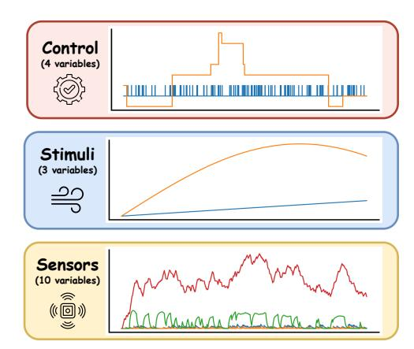
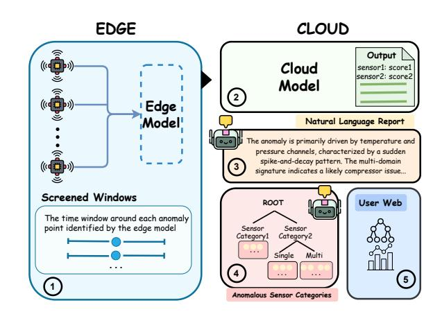
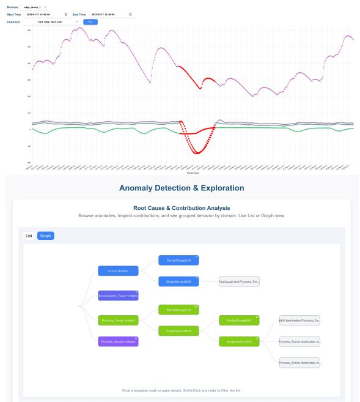

# ECLAD: An Edge-Cloud Collaborative Agentic Framework for Interpretable Anomaly Detection in Predictive Maintenance

Songyuan Sui∗ Rice University Houston, Texas, USA ss275@rice.edu

Zhanqi Deng∗ Yale University New Haven, Connecticut, USA danielzdeng01@gmail.com

Yamin Zhuang Rice University Houston, Texas, USA yz285@rice.edu

Serena Liu Rice University Houston, Texas, USA sl287@rice.edu

Leisheng Yu Rice University Houston, Texas, USA ly50@rice.edu

Alfredo Costilla Reyes University of California, Davis Davis, California, USA acostillareyes@ucdavis.edu

Xia Hu Rice University Houston, Texas, USA xia.hu@rice.edu

## Abstract

Modern industrial machinery generates massive multivariate sensor data, creating opportunities for predictive maintenance but also posing challenges for real-time anomaly detection and interpretability. Cloud-centric solutions suffer from bandwidth and latency limitations, while purely edge-centric models lack the capacity to deliver accurate and explainable results. We introduce ECLAD, an edge–cloud collaborative framework for interpretable anomaly detection in predictive maintenance. ECLAD combines lightweight edge anomaly screening, cloud-based verification using a higher-capacity sequence model, and LLM-based interpretability agents that generate natural-language diagnostic reports and maintain a self-evolving anomaly classification tree. This hybrid design preserves real-time responsiveness at the edge while leveraging cloud resources for high-precision and interpretable analysis. We demonstrate the end-to-end system through a web-based interface supporting interactive time-series exploration and anomaly category browsing. Code and demonstration video are available at: [https://github.com/SongyuanSui/EdgeCloud-AD.](https://github.com/SongyuanSui/EdgeCloud-AD)

#### CCS Concepts

• Information systems → Data mining; • Computing methodologies → Intelligent agents.

## Keywords

Anomaly Detection, Deep Learning, Large Language Models, AI Agents, Interpretability

∗Both authors contributed equally to this work.

[This work is licensed under a Creative Commons Attribution 4.0 International License.](https://creativecommons.org/licenses/by/4.0) WWW Companion '26, Dubai, United Arab Emirates © 2026 Copyright held by the owner/author(s). ACM ISBN 979-8-4007-2308-7/2026/04 <https://doi.org/10.1145/3774905.3793127>

#### ACM Reference Format:

Songyuan Sui, Zhanqi Deng, Yamin Zhuang, Serena Liu, Leisheng Yu, Alfredo Costilla Reyes, and Xia Hu. 2026. ECLAD: An Edge-Cloud Collaborative Agentic Framework for Interpretable Anomaly Detection in Predictive Maintenance. In Companion Proceedings of the ACM Web Conference 2026 (WWW Companion '26), April 13–17, 2026, Dubai, United Arab Emirates. ACM, New York, NY, USA, [4](#page-3-0) pages.<https://doi.org/10.1145/3774905.3793127>

### 1 Introduction

Modern industrial machinery is increasingly equipped with Internet of Things (IoT) sensors that generate massive streams of timeseries data, such as temperature, vibration, and humidity, a defining characteristic of Industry 4.0 [\[7\]](#page-3-1). These data can be leveraged for predictive maintenance: detecting failures and breakdowns in a timely manner, allowing technicians to troubleshoot quickly and avoid costly downtime [\[1\]](#page-3-2). Given the widespread use of machine learning for time-series analysis [\[2\]](#page-3-3), many efforts have focused on developing time-series anomaly detection models for industrial predictive maintenance [\[5\]](#page-3-4).

However, practical deployment remains challenging. First, cloudcentric systems require transmitting large streams of raw sensor data, incurring latency, bandwidth, and reliability constraints [\[9\]](#page-3-5). Purely edge-centric methods operate on resource-limited devices (e.g., Raspberry Pi) and cannot support high-capacity models, limiting detection accuracy [\[4\]](#page-3-6). Moreover, running large language models (LLMs) solely on the edge is infeasible, even though LLMs offer strong interpretability for time-series tasks [\[11\]](#page-3-7). These limitations motivate a hybrid edge–cloud architecture that balances responsiveness and accuracy [\[12\]](#page-3-8).

We present ECLAD, an Edge–Cloud coLlaborative framework for interpretable Anomaly Detection in predictive maintenance with three components: (1) Edge Anomaly Screening, where a lightweight model flags high-scoring time windows and forwards only these candidates to the cloud; (2) Cloud Anomaly Verification, which applies a higher-capacity sequence model to confirm true anomalies; and (3) LLM-based Interpretability Agents, which produce concise natural-language reports [\[8\]](#page-3-9) and populate a self-evolving

Figure 1: Illustration of multivariate industrial time-series data, consisting of multiple data domains.

anomaly classification tree. This design retains the low-latency benefits of on-device screening while leveraging cloud-scale models for accurate verification and interpretable diagnostics. We implement a complete web-based system that integrates these modules end-to-end for real-time monitoring and technician-facing analysis.

#### 2 Framework

#### 2.1 Data

We target real-world industrial environments where IoT devices generate a large volume of multivariate time-series data from heterogeneous sensor domains (Figure [1\)](#page-1-0). These streams can contain millions of samples, making on-device screening essential for reducing latency, bandwidth usage, and cloud processing load.

#### 2.2 Overview of ECLAD

Figure [2](#page-1-1) summarizes our edge–cloud collaborative framework. Sensor data pass through three stages: (1) edge anomaly screening, (2) cloud anomaly verification, and (3) LLM-based interpretability that produces natural-language reports and structured anomaly categories. Results are presented through an interactive web dashboard. We detail each component in the following subsections.

#### 2.3 Edge Anomaly Screening

The edge module performs lightweight real-time screening to reduce communication overhead while preserving timely anomaly detection. We employ a compact LSTM Autoencoder [\[14\]](#page-3-10), which learns normal multivariate patterns using reconstruction loss and does not require pre-training with labeled anomalies.

Given an input window ����−ℎ:�� ∈ R ℎ×�� , the model encodes the sequence and reconstructs it as ��ˆ ��−ℎ:�� . The reconstruction error

���� = ∥����−ℎ:�� − ��ˆ ��−ℎ:�� ∥

serves as the window-level anomaly score. During inference, sensor data are segmented into sliding windows and scored independently.

To improve robustness, the edge module applies two simple filters: (1) a threshold on window-level scores (e.g., a high percentile of the training error distribution), and (2) a point-level voting rule

Figure 2: Overview of ECLAD's edge–cloud collaborative framework.

that marks a timestamp as anomalous only if it appears in multiple anomalous windows. These steps stabilize detection under noise while keeping computational cost minimal.

Only the highest-scoring windows and their center timestamps are forwarded to the cloud for verification. This selective transmission preserves all potentially abnormal segments while reducing bandwidth usage by more than an order of magnitude in practice.

#### 2.4 Cloud Anomaly Verification

The cloud module performs second-stage anomaly verification using a higher-capacity sequence model inspired by DeepLog [\[6\]](#page-3-11). Although originally designed for system logs, the idea of learning normal behavior through next-step prediction naturally applies to multivariate time-series data. Each candidate window forwarded from the edge is treated as a short sequence of high-dimensional readings, and a stacked LSTM network is used to capture long-range temporal structure and cross-channel dependencies.

Given a window ����−ℎ:�� , the cloud model predicts the next-step reading ��ˆ ��+1. The anomaly score is defined as the prediction error

A (�� + 1) = ∥����+1 − ��ˆ ��+1 ∥2

a standard measure for detecting deviations in multivariate time series [\[3\]](#page-3-12). Because only pre-filtered segments reach the cloud, the model can operate with greater complexity while maintaining realtime throughput.

For each verified anomaly, we compute per-channel contribution scores to support downstream interpretability. For channel ��, we isolate its component and compute the L2 prediction discrepancy:

Contrib�� (�� + 1) = �� (�� ) ��+1 − ��ˆ (�� ) ��+1

These scores are normalized within the window to produce a channellevel attribution profile, which is passed to the LLM agents (Section [2.5\)](#page-2-0) for diagnostic report generation and anomaly classification.

Compared with the lightweight LSTM Autoencoder used on the edge, the cloud model employs a substantially larger stacked LSTM architecture with higher hidden dimensionality and more layers. This difference in model capacity allows the cloud stage to

Table 1: ECLAD's screening and verification performance on a 12-hour CATS subset.

| Metric                         | Edge Model | Cloud Model |
|--------------------------------|------------|-------------|
| Recall (%)                     | 100.00     | 100.00      |
| Precision (%)                  | 71.43      | 100.00      |
| Windows forwarded to cloud (%) | 8.37       | –           |

capture richer temporal dependencies that are infeasible to model on resource-constrained edge devices.

#### 2.5 LLM Agents for Interpretability

Recently, LLM agents have shown strong reasoning abilities beyond text data in smart systems [\[10\]](#page-3-13). We thereby use LLM agents to strengthen the interpretability for time series data.

2.5.1 LLM-Based Interpretability Agent. After the cloud verifies an anomaly, an LLM agent generates a natural-language report based on a compact record containing per-channel contribution scores, aggregated domain-level scores, and the anomalous sensor values. Using these structured inputs, the agent identifies dominant channels, distinguishes single- vs. multi-domain behavior, summarizes salient patterns, and provides recommended actions. The schema remains fixed across devices, and each report is displayed in the web interface and reused as a prototype for classification.

2.5.2 Self-Evolving Classification Tree. To help technicians better identify diverse anomaly types and their relationships, we maintain a Self-Evolving Classification Tree inspired by prior template-based systems [\[15\]](#page-3-14). Each node corresponds to an anomaly category, and leaves store representative LLM-generated reports.

Classification proceeds in two steps: (1) the contribution vector and domain summary route the anomaly to the closest matching node; (2) if no suitable node exists, the taxonomy expands through either horizontal addition of new subtypes or vertical splitting of an existing leaf. The resulting hierarchical classification structure enables technicians to quickly locate similar past anomalies, understand recurring failure patterns, and trace how issues evolve across different sensor domains.

#### 3 Implementation

Our system integrates edge data acquisition, cloud anomaly verification, LLM-based interpretability, and a web interface. We briefly describe the edge device, cloud backend, and front-end modules.

#### 3.1 Edge Device

The edge device performs real-time sampling and lightweight preprocessing. We deploy this module on a Raspberry Pi 4 Model B (64-bit quad-core Cortex-A72 CPU, 1GB LPDDR4 RAM), representative of low-power embedded IoT hardware. Sensor data are collected via a daqhats interface and stored in a local TDengine database [\[13\]](#page-3-15), which supports efficient sliding-window retrieval. A Python program executes the screening model on each window and uploads only high-scoring segments to the cloud, substantially reducing bandwidth and computation.

Figure 3: Screenshots from the deployed web interface: (top) time-series visualization with cloud-verified anomaly markers; (bottom) the Self-Evolving Classification Tree with representative LLM-generated reports.

#### 3.2 Cloud Backend

The cloud backend runs the DeepLog-inspired verification model, producing anomaly scores and per-channel contribution vectors for each uploaded time window. A lightweight Python service exposes REST endpoints for receiving candidate segments and serving results to the front-end. Verified anomalies, their reports, and the Self-Evolving Classification Tree are maintained centrally and updated as new templates arrive. The LLM agents are implemented by building prompt templates and calling LLMs through APIs.

#### 3.3 Front-End Interface

The front-end, implemented in React, provides two views. The Time-Series Visualization module displays selectable devices, channels, and time ranges, overlaying cloud-verified anomalies on interactive plots. The Anomaly Explorer presents the Self-Evolving Classification Tree rendered with D3.js, allowing users to inspect categories, traverse subtypes, and view representative LLM-generated reports. We also provide a timestamp-ordered list of all anomaly reports for an additional exploration view.

#### 4 Demonstration and Results

### 4.1 Dataset & Experiments

We evaluate ECLAD on the Controlled Anomalies Time Series (CATS) dataset[1](#page-2-1) , a 17-channel benchmark containing telemetry

1[https://www.kaggle.com/datasets/patrickfleith/controlled-anomalies-time-series](https://www.kaggle.com/datasets/patrickfleith/controlled-anomalies-time-series-dataset?resource=download&select=metadata.csv)[dataset?resource=download&select=metadata.csv](https://www.kaggle.com/datasets/patrickfleith/controlled-anomalies-time-series-dataset?resource=download&select=metadata.csv)

readings, control commands, and environmental stimuli, along with 200 precisely annotated anomaly segments. Its heterogeneous channel composition and rich metadata make it well-suited for assessing both anomaly detection and interpretability.

For system evaluation, we extract a 12-hour subset sampled every 10 seconds (∼4,300 timestamps). The edge LSTM Autoencoder serves as a recall-first screener, assigning reconstruction-based anomaly scores and forwarding only high-scoring time windows.

Table [1](#page-2-2) summarizes the screening and verification results. At the edge, all ground-truth anomaly intervals were hit by at least one detected window, yielding 100% interval-level recall, with 71.43% precision across reported intervals. Only 8.37% of all sliding windows were forwarded to the cloud, meaning over 90% of data remained local. The cloud verification model then processes only these candidate segments. For this 12-hour subset, it confirmed all true anomalies and rejected all false ones, achieving 100% recall and 100% precision on the screened data. These results demonstrate that edge filtering preserves anomaly coverage while substantially reducing bandwidth and cloud computation.

Forwarding only 8.37% of windows reduces transmitted data volume by 91.6%, enabling efficient cloud operation while supporting the interpretability agents described in Section [2.5.](#page-2-0)

### 4.2 One-Hour Demonstration Case Study

To illustrate end-to-end system behavior, we conduct an interactive demonstration using a one-hour segment of the CATS dataset (sampled every 10 seconds). This scenario shows how ECLAD responds to streaming inputs in real time. During this run, the edge Autoencoder detected all ground-truth anomalies, achieving 100% intervallevel recall. The flagged windows were forwarded to the cloud model, which confirmed the true anomalies and produced domainlevel contribution scores and natural-language reports. These LLM outputs were incorporated into the Self-Evolving Classification Tree for anomaly category exploration.

Figure [3](#page-2-3) shows two screenshots from the deployed web interface. The time-series visualization allows users to browse devices, channels, and time ranges, with cloud-verified anomaly markers overlaid on raw signals. The anomaly explorer displays the evolving classification tree, enabling navigation across categories, inspection of representative reports, and viewing of associated sensor windows. Together, these components demonstrate real-time monitoring, accurate verification, and interpretable diagnostics in a unified interface.

### 5 Conclusion

We propose ECLAD, an edge–cloud collaborative framework for real-time anomaly detection and interpretability in industrial sensor systems. By combining lightweight edge screening with cloudbased verification and LLM-based diagnostics, the system achieves high anomaly coverage, efficient bandwidth usage, and humanreadable explanations. Our web-based interface demonstrates the full end-to-end workflow, enabling interactive monitoring and category exploration. The framework provides a practical foundation for deploying intelligent predictive maintenance tools in real industrial environments.

#### 6 Ethical Use of Data and Informed Consent

We evaluate and demonstrate our framework solely on the public CATS dataset, which contains no personal or human-related information. No informed consent is required, and the work complies with ACM policies on research involving human subjects.

#### Acknowledgments

This work was partially supported by the National Science Foundation (NSF) under Awards No. 2335642 and 2136679.

#### References

- [1] Sérgio F Chevtchenko, Elisson Da Silva Rocha, Monalisa Cristina Moura Dos Santos, Ricardo Lins Mota, Diego Moura Vieira, Ermeson Carneiro De Andrade, and Danilo Ricardo Barbosa De Araújo. 2023. Anomaly detection in industrial machinery using IoT devices and machine learning: a systematic mapping. IEEE Access 11 (2023), 128288–128305. [2] Yu-Neng Chuang, Songchen Li, Jiayi Yuan, Guanchu Wang, Kwei-Herng Lai, Songyuan Sui, Leisheng Yu, Sirui Ding, Chia-Yuan Chang, Alfredo Costilla Reyes, Daochen Zha, and Xia Hu. 2026. LTSM-Bundle: A Toolbox and Benchmark on Large Language Models for Time Series Forecasting. SIGKDD Explor. Newsl. 27, 2 (Dec. 2026), 43–61. [doi:10.1145/3787470.3787475](https://doi.org/10.1145/3787470.3787475) [3] Lucas Correia, Jan-Christoph Goos, Philipp Klein, Thomas Bäck, and Anna V. Kononova. 2024. Online model-based anomaly detection in multivariate time series: Taxonomy, survey, research challenges and future directions. Eng. Appl. Artif. Intell. 138, PA (Dec. 2024), 20 pages. [doi:10.1016/j.engappai.2024.109323](https://doi.org/10.1016/j.engappai.2024.109323) [4] Ronit Das and Tie Luo. 2023. LightESD: Fully-automated and lightweight anomaly detection framework for edge computing. In 2023 IEEE International Conference on Edge Computing and Communications (EDGE). IEEE, 150–158. [5] Marcel Dix, Ashish Chouhan, Srishti Ganguly, Sripada Pradhan, Devika Saraswat, Surbhi Agrawal, and Ajinkya Prabhune. 2021. Anomaly detection in the timeseries data of industrial plants using neural network architectures. In 2021 IEEE Seventh International Conference on Big Data Computing Service and Applications (BigDataService). IEEE, 222–228. [6] Min Du, Feifei Li, Guineng Zheng, and Vivek Srikumar. 2017. DeepLog: Anomaly Detection and Diagnosis from System Logs through Deep Learning. In Proceedings of the 2017 ACM SIGSAC Conference on Computer and Communications Security (Dallas, Texas, USA) (CCS '17). Association for Computing Machinery, New York, NY, USA, 1285–1298. [doi:10.1145/3133956.3134015](https://doi.org/10.1145/3133956.3134015) [7] Pooja Kamat and Rekha Sugandhi. 2020. Anomaly detection for predictive maintenance in industry 4.0-A survey. In E3S web of conferences, Vol. 170. EDP Sciences, 02007. [8] Jun Liu, Chaoyun Zhang, Jiaxu Qian, Minghua Ma, Si Qin, Chetan Bansal, Qingwei Lin, Saravan Rajmohan, and Dongmei Zhang. 2025. Large language models can deliver accurate and interpretable time series anomaly detection. In Proceedings of the 31st ACM SIGKDD Conference on Knowledge Discovery and Data Mining V.
- 2. 4623–4634. [9] Jinke Ren, Guanding Yu, Yinghui He, and Geoffrey Ye Li. 2019. Collaborative cloud and edge computing for latency minimization. IEEE Transactions on Vehicular Technology 68, 5 (2019), 5031–5044. [10] Songyuan Sui, Hongyi Liu, Serena Liu, Li Li, Soo-Hyun Choi, Rui Chen, and Xia Hu. 2025. Chain-of-Query: Unleashing the Power of LLMs in SQL-Aided Table Understanding via Multi-Agent Collaboration. arXiv preprint arXiv:2508.15809 (2025). [11] Songyuan Sui, Zihang Xu, Yu-Neng Chuang, Kwei-Herng Lai, and Xia Hu. 2025. Training-Free Time Series Classification via In-Context Reasoning with LLM Agents. arXiv[:2510.05950](https://arxiv.org/abs/2510.05950) [12] Zhengjie Sun, Hui Yang, Chao Li, Qiuyan Yao, Danshi Wang, Jie Zhang, and Athanasios V Vasilakos. 2021. Cloud-edge collaboration in industrial internet of things: A joint offloading scheme based on resource prediction. IEEE Internet of Things Journal 9, 18 (2021), 17014–17025. [13] TDengine Team. 2020. TDengine: An Open-Source Time-Series Database. [https:](https://github.com/taosdata/TDengine) [//github.com/taosdata/TDengine.](https://github.com/taosdata/TDengine) Accessed: Oct 2025. [14] Yuanyuan Wei, Julian Jang-Jaccard, Wen Xu, Fariza Sabrina, Seyit Camtepe, and Mikael Boulic. 2022. LSTM-Autoencoder based Anomaly Detection for Indoor Air Quality Time Series Data. arXiv[:2204.06701](https://arxiv.org/abs/2204.06701) [cs.LG] [https://arxiv.org/abs/](https://arxiv.org/abs/2204.06701) [2204.06701](https://arxiv.org/abs/2204.06701) [15] Peiying Yu, Guoxin Chen, and Jingjing Wang. 2025. Table-Critic: A Multi-Agent Framework for Collaborative Criticism and Refinement in Table Reasoning. In Proceedings of the 63rd Annual Meeting of the Association for Computational Linguistics (Volume 1: Long Papers), Wanxiang Che, Joyce Nabende, Ekaterina Shutova, and Mohammad Taher Pilehvar (Eds.). Association for Computational Linguistics, Vienna, Austria, 17432–17451. [doi:10.18653/v1/2025.acl-long.853](https://doi.org/10.18653/v1/2025.acl-long.853)