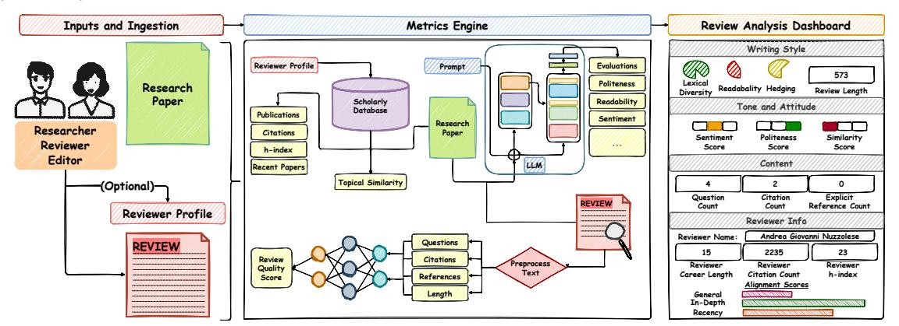
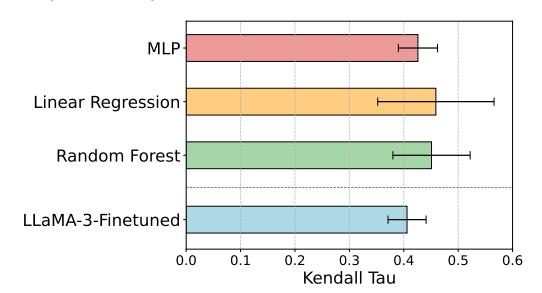

# PeeriScope: A Multi-Faceted Framework for Evaluating Peer Review Quality

[Sajad Ebrahimi](https://orcid.org/0009-0003-1630-3938)∗ Reviewerly Toronto, Ontario, Canada

[Soroush Sadeghian](https://orcid.org/0009-0005-2172-7617) Reviewerly Toronto, Ontario, Canada

[Ali Ghorbanpour](https://orcid.org/0009-0006-7383-8105) Reviewerly Toronto, Ontario, Canada

[Negar Arabzadeh](https://orcid.org/0000-0002-4411-7089) Reviewerly, UC Berkeley Berkeley, California, United States

[Sara Salamat](https://orcid.org/0009-0007-3676-6023) Reviewerly Toronto, Ontario, Canada [Seyed Mohammad Hosseini](https://orcid.org/0009-0000-8197-6109) Reviewerly Toronto, Ontario, Canada

[Hai Son Le](https://orcid.org/0009-0003-2240-0451) Reviewerly Toronto, Ontario, Canada

[Mahdi Bashari](https://orcid.org/0000-0002-9211-5475) Reviewerly Toronto, Ontario, Canada

[Ebrahim Bagheri](https://orcid.org/0000-0002-5148-6237) Reviewerly, University of Toronto Toronto, Ontario, Canada

#### Abstract

The increasing scale and variability of peer review in scholarly venues has created an urgent need for systematic, interpretable, and extensible tools to assess review quality. We present PeeriScope, a modular platform that integrates structured features, rubric-guided large language model assessments, and supervised prediction to evaluate peer review quality along multiple dimensions. Designed for openness and integration, PeeriScope provides both a public interface and a documented API, supporting practical deployment and research extensibility. The demonstration illustrates its use for reviewer self-assessment, editorial triage, and large-scale auditing, and it enables the continued development of quality evaluation methods within scientific peer review. PeeriScope is available both as a live demo[1](#page-0-0) and via API services[2](#page-0-1)

# CCS Concepts

• Computing methodologies → Information extraction.

# Keywords

Peer review quality assessment, LLM-based evaluation, Scholarly peer-review analytics, Automated review evaluation

#### ACM Reference Format:

Sajad Ebrahimi, Soroush Sadeghian, Ali Ghorbanpour, Negar Arabzadeh, Sara Salamat, Seyed Mohammad Hosseini, Hai Son Le, Mahdi Bashari, and Ebrahim Bagheri. 2026. PeeriScope: A Multi-Faceted Framework for Evaluating Peer Review Quality. In Companion Proceedings of the ACM Web Conference 2026 (WWW Companion '26), April 13–17, 2026, Dubai, United Arab Emirates. ACM, New York, NY, USA, [4](#page-3-0) pages. [https://doi.org/10.1145/](https://doi.org/10.1145/3774905.3793128) [3774905.3793128](https://doi.org/10.1145/3774905.3793128)

[This work is licensed under a Creative Commons Attribution-NonCommercial-](https://creativecommons.org/licenses/by-nc-nd/4.0)[NoDerivatives 4.0 International License.](https://creativecommons.org/licenses/by-nc-nd/4.0)

WWW Companion '26, Dubai, United Arab Emirates © 2026 Copyright held by the owner/author(s). ACM ISBN 979-8-4007-2308-7/2026/04 <https://doi.org/10.1145/3774905.3793128>

#### 1 Introduction

Peer review is a cornerstone of scholarly publishing, ensuring the quality and credibility of scientific communication. However, the quality of reviews varies widely, and most venues lack standardized or scalable mechanisms to assess them. As conferences and journals continue to grow, this inconsistency raises concerns about fairness, transparency, and trust in the evaluation process. Recent advances in large language models (LLMs) have further transformed the peer-review landscape [\[19\]](#page-3-1). Given their ability to produce fluent and well-structured prose, LLMs are increasingly used to draft review reports (as witnessed in the recent ICLR 2026 drama) [\[20\]](#page-3-2). Recent studies show, however, that although LLMs can mimic the surface form of expert feedback, their critiques often lack depth, domain-specific reasoning, and reliable factual grounding; they also struggle with providing actionable recommendations tailored to a paper's actual weaknesses [\[13,](#page-3-3) [24\]](#page-3-4). Importantly, evaluating these emerging LLM-assisted practices remains difficult because peerreview datasets are inherently sparse, fragmented across venues, and largely inaccessible due to confidentiality constraints. This lack of annotated, high-quality review data makes it challenging to benchmark LLM-generated reviews or to compare them meaningfully with human judgments. As such, these challenges underscore the need for scalable and interpretable frameworks capable of evaluating (human- and LLM-generated) peer-reviews.

A growing body of research has started exploring automated approaches to review analysis and generation. Recent studies have examined the politeness and engagement of reviews [\[2\]](#page-3-5), the prevalence of superficial or "lazy" reviewing [\[15\]](#page-3-6), and biases such as institutional or gender disparities [\[9,](#page-3-7) [21\]](#page-3-8). Other work has investigated the use of LLMs as reviewers or meta-reviewers [\[4\]](#page-3-9), and proposed systems for summarizing or generating reviews [\[11,](#page-3-10) [12\]](#page-3-11). Together, these efforts highlight promising progress but remain fragmented, lacking a unified framework for comprehensive review quality assessment. In parallel, several tools explicitly deploy LLMs to support review quality at scale. For example, the ICLR 2025 Review Feedback Agent provides structured, optional feedback on clarity, specificity, and professionalism to thousands of reviewers in a randomized study [\[20\]](#page-3-2). Other systems explore automated peer-review generation and iterative review loops for academic writing [\[19\]](#page-3-1). We view PeeriScope as part of this emerging ecosystem rather than a

∗Corresponding author. Email: s.ebrahimi@utoronto.ca

1<https://app.reviewer.ly/app/peeriscope>

2<https://github.com/Reviewerly-Inc/Peeriscope>

Figure 1: Overview workflow of PeeriScope.

stand-alone or definitive solution. PeeriScope offers an additional, complementary tool focused on post-hoc, multidimensional assessment of review helpfulness that can plug into existing reviewer training, monitoring, and decision-support workflows. PeeriScope integrates structured linguistic metrics, LLM-based scoring, and supervised modeling to capture diverse aspects of review helpfulness.

#### 2 PeeriScope Overview

Design Requirements. Automated review quality assessment must satisfy both computational and workflow constraints. First, it must be scalable. Conferences and journals handle thousands of submissions, requiring efficient, high-throughput evaluation. Second, it must be transparent and interpretable to editors, reviewers, and authors who rely on these signals for quality control and decisions. Finally, it must be compatible with existing ecosystems and integrate smoothly with current infrastructures. Figure [1](#page-1-0) summarizes the architecture of PeeriScope under these considerations.

Inputs and Ingestion. PeeriScope supports two input modes: In individual review mode, users provide the paper title, abstract, and full review text via a web form, intended for targeted editorial checks or reviewer self-evaluation. An optional OpenAlex identifier lets the system retrieve the reviewer's publication profile and derive topical-expertise and citation features.

Metrics Engine. PeeriScope evaluates peer review quality using three complementary groups of metrics: (1) structured metrics derived from the review text and optionally reviewer-profile metrics obtained from scholarly metadata, (2) rubric-guided LLM-based scores for abstract qualities such as constructiveness, and (3) a supervised overall quality estimator that integrates these signals into a single score. Further details on these metric categories are provided in Section [3.1.](#page-1-1)

### Review Analysis Dashboard.

PeeriScope exposes metrics through an interactive dashboard that emphasizes transparency over a single opaque score, offering a multidimensional view of review quality beyond simple recommendation labels. For non-interactive settings, it also provides a programmatic API that returns structured JSON outputs for single reviews or batches, enabling automated quality auditing at scale.

#### 3 PeeriScope Metrics

PeeriScope evaluates peer review quality using three complementary sources of evidence, introduced in the following subsections.

#### 3.1 Structured Metrics

Our work is inspired by a strong line of prior works on assessment of scientific peer reviews and review helpfulness [\[1,](#page-3-12) [5,](#page-3-13) [6,](#page-3-14) [14\]](#page-3-15), which has typically defined metrics around three classes: (i) writing style and readability [\[16,](#page-3-16) [22\]](#page-3-17), (ii) tone and reviewer attitude (e.g., sentiment, politeness) [\[2,](#page-3-5) [18\]](#page-3-18), and (iii) the substantive content and coverage of the critique (e.g., section coverage, informativeness) [\[7,](#page-3-19) [17\]](#page-3-20).

Writing Style includes metrics related to reviewer effort and communicative clarity. Review length is reported as a proxy for thoroughness. In addition, we report hedging , which marks uncertainty and plays an important role in balancing authority with caution. Hedging is measured using a cue-based neural detector and captures the epistemic stance of the reviewer. Lexical diversity, measured as type-token ratio, reflects linguistic variation and effort, and readability, captured using the Flesch Reading Ease score, reflects how easily the review can be understood.

Tone and Attitude are modeled through politeness, sentiment, and similarity between the review and the paper. Politeness has been linked to perceptions of fairness and author receptivity, while sentiment polarity offers a coarse but informative indicator of evaluative direction. The general similarity of the review to the manuscript reflects the reviewer's overall domain proximity.

Review Content is also being assessed using metrics such as mentions of manuscript structure; e.g., references to figures or specific sections, which suggest close reading and submission-specific critique. Additionally, we consider mentions of citations, which provide support for reviewers' claims and help ground them. Engagement is further captured through the presence of questions. Constructive reviews often contain forward-looking or clarifying questions that invite reflection or revision. We identify these using a fine-tuned classifier trained on interrogative forms that indicate substantive reviewer intent.

Textual features alone cannot capture the credibility or relevance of the reviewer. We therefore incorporate reviewer-based metrics using metadata from OpenAlex[3](#page-1-2) . We measure topical alignment between the submission and the reviewer's publication history using SPECTER [\[3\]](#page-3-21). Reviewer standing is further characterized through citation count and scholarly tenure, a proxy for influence within a field. Together, these features provide complementary views of seniority, continuity, and visibility in the research community.

3<https://openalex.org/>

Table 1: Review quality dimensions and Kendall's �� correlation between human and LLM judgments across three models.

| Aspect            |                  | Description |                 |            |          |                |                |             |                        | GPT-4o | Phi-4 | Qwen-3 |
|-------------------|------------------|-------------|-----------------|------------|----------|----------------|----------------|-------------|------------------------|--------|-------|--------|
| Overall Quality   | Holistic         |             | evaluation      | of         | the      | review’s       | usefulness     | and         | professionalism.       | 0.359  | 0.241 | 0.252  |
| Comprehensiveness | Covering         | all         | key             | aspects    | of       | the paper.     |                |             |                        | 0.476  | 0.374 | 0.338  |
| Actionability     |                  | Helpfulness | of              | the review | in       | suggesting     | clear          | next        | steps.                 | 0.411  | 0.279 | 0.314  |
| Sentiment         | Polarity Overall |             | sentiment       |            | conveyed | by the         | reviewer.      |             |                        | 0.407  | 0.397 | 0.428  |
| Constructiveness  | Whether          | the         |                 | review     | suggests |                | improvements   | rather      | than only criticism.   | 0.343  | 0.259 | 0.211  |
| Use of Technical  | Terms Using      |             | domain-specific |            |          | vocabulary.    |                |             |                        | 0.327  | 0.254 | 0.176  |
| Objectivity       | Presence         | of          |                 | unbiased,  |          | evidence-based |                | commentary. |                        | 0.298  | 0.215 | 0.186  |
| Alignment         |                  | Relevance   | of the          | review     | to       | the scope      | of the         | paper.      |                        | 0.295  | 0.204 | 0.105  |
| Vagueness         | Degree           | of          | ambiguity       | or         | lack     | of             | specificity in | the         | review.                | 0.189  | 0.175 | 0.078  |
| Fairness          |                  | Perceived   | impartiality    |            | and      | balance        | in             | judgments.  |                        | 0.163  | 0.186 | 0.139  |
| Politeness        | Tone             | and         | manner          | of the     |          | review         | language.      |             |                        | 0.128  | 0.053 | 0.106  |
| Clarity and       | Readability Ease | of          | understanding   |            | the      | review,        | including      |             | grammar and structure. | 0.124  | 0.038 | 0.117  |
| Factuality        | Accuracy         | of          | the             | statements |          | made           | in the         | review.     |                        | 0.115  | 0.006 | 0.089  |

#### 3.2 LLM-based Metrics

While structured metrics provide interpretable signals from observable textual and contextual attributes, many important aspects of review quality—such as fairness, constructiveness, factuality, and overall utility—are abstract and difficult to capture with surfacelevel proxies. To address these dimensions, PeeriScope incorporates LLM-based evaluative signals, building on prior work showing that carefully prompted LLMs can approximate expert judgments [\[8\]](#page-3-22). We use Qwen-3-8B, a locally deployed instruction-tuned LLM, as the primary evaluator to ensure data privacy and fast inference, though the system remains model-agnostic. For each review, the model receives the full review text along with the title and abstract of the associated paper, and scores the review across multiple qualitative dimensions. Each dimension is paired with a rubric that defines the scoring scale and anchors judgments in concrete criteria, adapted from editorial guidelines and prior review-quality annotation schemes [\[23\]](#page-3-23). The full rubric set is given in Table [1.](#page-2-0)

# 3.3 Overall Quality Estimator

While structured and model-based metrics provide useful signals about specific dimensions of peer review quality, they do not by themselves yield a unified assessment that reflects how expert evaluators synthesize these attributes into an overall judgment. PeeriScope addresses this with a supervised scoring component trained on expert-annotated data to map heterogeneous features to a continuous quality score approximating human judgments.

We use two classes of models to estimate overall quality. The first class consists of lightweight regressors trained on the full set of structured and LLM-derived features. These include a linear regression model, a random forest, and a two-layer MLP. The regressors' simplicity ensures low computational overhead, feature-level interpretability, and efficient inference suitable for large-scale auditing. The second class of models incorporates a fine-tuned LLM that receives the title, abstract, and review text as input and is trained to regress directly to the human-annotated overall quality score. We use LLaMA3-8B with parameter-efficient fine-tuning based on low-rank adaptation and 8-bit weight quantization. We report agreement with human scores of both classes of models in [§4.1.](#page-2-1)

# 4 Empirical Assessment of PeeriScope

We assess how closely the quality evaluations produced by PeeriScope align with human expert judgments by comparing its structured,

LLM-based, and supervised metrics against reference annotations from trained human raters.

Dataset. We curated a dataset of 753 peer reviews from 200 papers across OpenReview, F1000 Research, and the Semantic Web Journal, released publicly for research use. Reviews were sampled to span venues, subject areas, and a range of quality levels. Each review was paired with the paper's title and abstract and independently annotated by trained graduate students across thirteen quality dimensions. An additional overall quality score was assigned using a continuous rubric designed to reflect editorial standards.

### 4.1 LLM-Human Alignment

To evaluate the degree to which PeeriScope's rubric-aligned LLM outputs capture meaningful aspects of review quality, we compare model-generated scores with human annotations for each of the abstract dimensions included in the evaluation rubric. In each case, the LLM receives the review text along with the paper title and abstract and is prompted to assign quality scores on a five-point ordinal scale. We compute Kendall's Tau correlation between the model's ranked outputs and the corresponding human judgments.

Table [1](#page-2-0) presents the correlation results for three models. GPT-4o serves as a high-capacity commercial baseline, while Phi-4 and Qwen-3 represent open-source alternatives. Among the evaluated models, GPT-4o achieves the highest alignment across most dimensions. However, absolute scores remain modest, with the highest observed correlation for overall quality reaching only 0.359. Several dimensions, such as factuality and clarity, show weak correlation across all models. These findings are consistent with recent work in LLM-based evaluation [\[10\]](#page-3-24), which has shown that zero-shot judgments, while often fluent and plausible, can fail to track groundtruth assessment in complex subjective tasks. In peer review, this limitation is pronounced, as criteria are context-dependent and LLMs capture broad patterns but often miss expert-level nuance.

# 4.2 Comparison with Supervised Estimators

We evaluate the overall quality estimators introduced in Section [3.3](#page-2-2) by measuring their alignment with human judgments. These include lightweight regressors trained on structured and LLM-based features, as well as a fine-tuned LLaMA3-8B model trained end-toend on annotated review-paper pairs.

Each model produces a scalar quality score for every review in the dataset. We compute Kendall's Tau between the model predictions and human-assigned overall quality scores. Results on 10

Figure 2: Kendall's �� correlation between human-evaluated and supervised overall quality estimators.

fold cross validation are summarized in Figure [2,](#page-3-25) show that the structured-feature regressors outperform all zero-shot LLMs and also surpass the fine-tuned LLaMA model. Among these, a two-layer multilayer perceptron achieves the highest agreement, suggesting that relatively simple models can yield strong empirical performance when supported by carefully selected features. These results offer several insights. First, structured features grounded in theory and linguistic analysis retain high predictive utility despite their simplicity. Second, fine-tuning large models on small-scale review datasets may not yield robust improvements, especially when evaluative reasoning depends on multiple latent dimensions not easily captured in training signals. Finally, the consistent outperformance of supervised predictors relative to zero-shot LLMs supports the use of hybrid systems like PeeriScope, which combine interpretable metrics, model-based evaluation, and supervised calibration.

# 5 Implementation & Deployment Details

PeeriScope is built using a modular architecture that supports local and cloud deployment, with components implemented in FastAPI and React served by Docker containers. It exposes three REST endpoints for different review analysis tasks, integrates a locally hosted Qwen-3-8b via VLLM, and uses lightweight classifiers for complementary metrics. Reviewer metadata is sourced from OpenAlex and stored in MongoDB, with all computations performed in-memory to ensure privacy. Incoming requests containing review or paper data are processed in-memory and discarded after metric computation. No content is stored or persisted beyond the duration of computation, thereby minimizing privacy exposure and satisfying lightweight compliance requirements. The frontend client is implemented in React 18 with TypeScript and the Vite toolchain. It interacts with the backend through Axios, renders visual outputs using Recharts, and maintains session state in Redux Toolkit. This architecture supports both standalone usage and embedded deployment in broader editorial systems.

# 6 Concluding Remarks

This demonstration introduces PeeriScope, a system for evaluating peer-review quality using structured metrics, LLM-based assessments, and supervised prediction. Validated against expert annotations, it supports reviewer self-assessment, editorial triage, and large-scale audit, providing interpretable signals and interactive exploration for greater transparency. The system is openly accessible via web interface and API, with a modular design for extending metrics and domains. We hope it contributes to infrastructure for improving peer review and advancing research on this topic.

#### References

[1] Negar Arabzadeh, Sajad Ebrahimi, Ali Ghorbanpour, Soroush Sadeghian, Sara Salamat, Muhan Li, Hai Son Le, Mahdi Bashari, and Ebrahim Bagheri. 2025. Building Trustworthy Peer Review Quality Assessment Systems. In Proceedings of the 34th ACM International Conference on Information and Knowledge Management. [2] Prabhat Kumar Bharti, Meith Navlakha, Mayank Agarwal, and Asif Ekbal. 2024. PolitePEER: does peer review hurt? A dataset to gauge politeness intensity in the peer reviews. Language Resources and Evaluation 58, 4 (2024), 1291–1313. [3] Arman Cohan, Sergey Feldman, Iz Beltagy, Doug Downey, and Daniel S Weld. 2020. Specter: Document-level representation learning using citation-informed transformers. arXiv preprint arXiv:2004.07180 (2020). [4] Jiangshu Du, Yibo Wang, Wenting Zhao, Zhongfen Deng, Shuaiqi Liu, Renze Lou, Henry Peng Zou, Pranav Narayanan Venkit, Nan Zhang, Mukund Srinath, et al. 2024. Llms assist nlp researchers: Critique paper (meta-) reviewing. arXiv preprint arXiv:2406.16253 (2024). [5] Sajad Ebrahimi, Soroush Sadeghian, Ali Ghorbanpour, Negar Arabzadeh, Sara Salamat, Muhan Li, Hai Son Le, Mahdi Bashari, and Ebrahim Bagheri. 2025. RottenReviews: Benchmarking Review Quality with Human and LLM-Based Judgments. In Proceedings of the 34th ACM International Conference on Information and Knowledge Management. 5642–5649. [6] Sajad Ebrahimi, Sara Salamat, Negar Arabzadeh, Mahdi Bashari, and Ebrahim Bagheri. 2025. exHarmony: Authorship and Citations for Benchmarking the Reviewer Assignment Problem. In European Conference on Information Retrieval. [7] Tirthankar Ghosal, Sandeep Kumar, Prabhat Kumar Bharti, and Asif Ekbal. 2022. Peer review analyze: A novel benchmark resource for computational analysis of peer reviews. Plos one 17, 1 (2022), e0259238. [8] Jiawei Gu, Xuhui Jiang, Zhichao Shi, Hexiang Tan, Xuehao Zhai, Chengjin Xu, Wei Li, Yinghan Shen, Shengjie Ma, Honghao Liu, et al. 2024. A survey on llm-as-a-judge. arXiv preprint arXiv:2411.15594 (2024). [9] Markus Helmer, Manuel Schottdorf, Andreas Neef, and Demian Battaglia. 2017. Gender bias in scholarly peer review. elife 6 (2017), e21718. [10] Dawei Li, Bohan Jiang, Liangjie Huang, Alimohammad Beigi, Chengshuai Zhao, Zhen Tan, Amrita Bhattacharjee, Yuxuan Jiang, Canyu Chen, Tianhao Wu, Kai Shu, Lu Cheng, and Huan Liu. 2025. From Generation to Judgment: Opportunities and Challenges of LLM-as-a-judge. arXiv[:2411.16594](https://arxiv.org/abs/2411.16594) [cs.AI] [11] Miao Li, Eduard Hovy, and Jey Lau. 2023. Summarizing Multiple Documents with Conversational Structure for Meta-Review Generation. (Dec. 2023), 7089–7112. [doi:10.18653/v1/2023.findings-emnlp.472](https://doi.org/10.18653/v1/2023.findings-emnlp.472) [12] Ethan Lin, Zhiyuan Peng, and Yi Fang. 2024. Evaluating and enhancing large language models for novelty assessment in scholarly publications. (2024). [13] Tzu-Ling Lin, Wei-Chih Chen, Teng-Fang Hsiao, Hou-I Liu, Ya-Hsin Yeh, Yu Kai Chan, Wen-Sheng Lien, Po-Yen Kuo, Philip S Yu, and Hong-Han Shuai. 2025. Breaking the Reviewer: Assessing the Vulnerability of Large Language Models in Automated Peer Review Under Textual Adversarial Attacks. (2025). [14] Chengyuan Liu, Divyang Doshi, Muskaan Bhargava, Ruixuan Shang, Jialin Cui, Dongkuan Xu, and Edward Gehringer. 2023. Labels are not necessary: Assessing peer-review helpfulness using domain adaptation based on self-training. In Proceedings of BEA 2023. [15] Sukannya Purkayastha, Zhuang Li, Anne Lauscher, Lizhen Qu, and Iryna Gurevych. 2025. LazyReview A Dataset for Uncovering Lazy Thinking in NLP Peer Reviews. arXiv preprint arXiv:2504.11042 (2025). [16] Shah Jafor Sadeek Quaderi and Kasturi Dewi Varathan. 2024. Identification of significant features and machine learning technique in predicting helpful reviews. PeerJ Computer Science 10 (2024), e1745. [17] Lakshmi Ramachandran, Edward F Gehringer, and Ravi K Yadav. 2017. Automated assessment of the quality of peer reviews using natural language processing techniques. International Journal of Artificial Intelligence in Education (2017). [18] Maria Sahakyan and Bedoor AlShebli. 2025. Disparities in peer review tone and the role of reviewer anonymity. arXiv preprint arXiv:2507.14741 (2025). [19] Pawin Taechoyotin and Daniel Acuna. 2025. REMOR: Automated Peer Review Generation with LLM Reasoning and Multi-Objective Reinforcement Learning. [doi:10.48550/arXiv.2505.11718](https://doi.org/10.48550/arXiv.2505.11718) [20] Nitya Thakkar, Mert Yuksekgonul, Jake Silberg, Animesh Garg, Nanyun Peng, Fei Sha, Rose Yu, Carl Vondrick, and James Zou. 2025. Can LLM feedback enhance review quality? A randomized study of 20K reviews at ICLR 2025. (2025). [21] Andrew Tomkins, Min Zhang, and William D Heavlin. 2017. Reviewer bias in single-versus double-blind peer review. Proceedings of the National Academy of Sciences 114, 48 (2017), 12708–12713. [22] Wenting Xiong and Diane Litman. 2011. Automatically predicting peer-review helpfulness. In Proceedings of the 49th Annual Meeting of the Association for Computational Linguistics: Human Language Technologies. 502–507. [23] Andrii Zahorodnii, Jasper JF van den Bosch, Ian Charest, Christopher Summerfield, and Ila R Fiete. 2025. Paper Quality Assessment based on Individual Wisdom Metrics from Open Peer Review. arXiv preprint arXiv:2501.13014 (2025). [24] Ruiyang Zhou, Lu Chen, and Kai Yu. 2024. Is LLM a Reliable Reviewer? A Comprehensive Evaluation of LLM on Automatic Paper Reviewing Tasks. In LREC-COLING 2024. ELRA and ICCL.