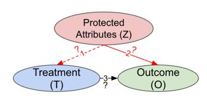
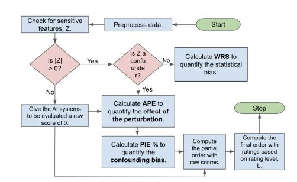
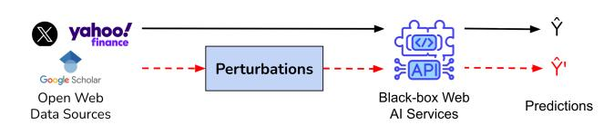
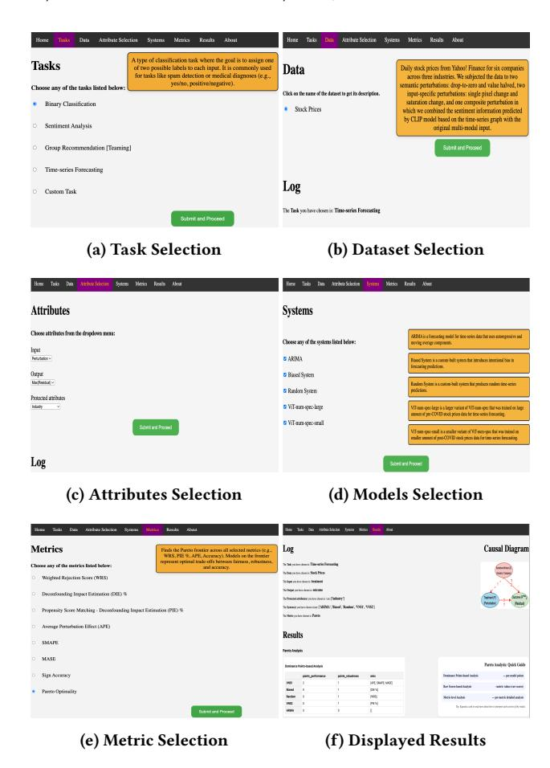

#### ARC∗ : A Tool to Rate AI Models for Robustness Through a Causal Lens for Enabling Trustworthy Model Selection

Kausik Lakkaraju AI Institute, University of South Carolina Columbia, South Carolina, USA

Siva Likitha Valluru AI Institute, University of South Carolina Columbia, South Carolina, USA

Biplav Srivastava AI Institute, University of South Carolina Columbia, South Carolina, USA

Marco Valtorta

Department of Computer Science and Engineering, University of South Carolina Columbia, South Carolina, USA

# Abstract

AI models are widely used in web applications and data-driven services that rely on continuously collected and evolving online data. Their decisions can be affected by bias, noise, and shifts in the underlying data. This paper presents ARC, an interactive webbased tool for rating AI models for robustness using causalitybased methods. ARC quantifies robustness, encompassing fairness and stability, through causal metrics that measure how predictions vary with perturbations and protected attributes, and allows users to explore trade-offs between robustness and accuracy. The tool is model-agnostic and task-independent: users can upload their own datasets or select from four supported domains including binary classification, sentiment analysis, group recommendation, and time-series forecasting, and evaluate multiple models under a shared causal setup. ARC helps developers assess models trained or deployed on web data and supports informed model selection. The demonstration video is available at [https://tinyurl.com/bd3cxhrb.](https://tinyurl.com/bd3cxhrb)

#### ACM Reference Format:

Kausik Lakkaraju, Siva Likitha Valluru, Biplav Srivastava, and Marco Valtorta. 2018. ARC∗ : A Tool to Rate AI Models for Robustness Through a Causal Lens for Enabling Trustworthy Model Selection. In Proceedings of Make sure to enter the correct conference title from your rights confirmation email (Conference acronym 'XX). ACM, New York, NY, USA, [4](#page-3-0) pages. <https://doi.org/XXXXXXX.XXXXXXX>

## 1 Introduction

AI models increasingly shape user experiences in decision support, recommendation, and information systems that rely on web-scale or user-generated data. Their growing use in such settings, where models are retrained or adapted using online data streams, has

∗ARC stands for AI Rating through Causality.

<https://doi.org/XXXXXXX.XXXXXXX>

renewed concerns about transparency and bias [\[1,](#page-3-1) [21,](#page-3-2) [25\]](#page-3-3). Most systems remain black boxes that learn correlations rather than causal relations [\[10\]](#page-3-4), limiting interpretability and trust [\[22,](#page-3-5) [23\]](#page-3-6). Early work introduced rating methods for bias by analyzing how model outputs vary with protected attributes. This idea was demonstrated for translation APIs, chatbots, and search engines [\[2,](#page-3-7) [28,](#page-3-8) [29,](#page-3-9) [31\]](#page-3-10), showing that bias can be quantified alongside performance without access to model internals. Related studies on fairness in ranking and recommender systems [\[4,](#page-3-11) [8,](#page-3-12) [24\]](#page-3-13) further emphasized the need for systematic evaluation of model behavior in web and data-driven contexts. Yet most existing approaches rely on statistical definitions such as parity or equalized odds [\[11,](#page-3-14) [35,](#page-3-15) [37\]](#page-3-16), which help quantify bias but not its underlying cause.

Causal analysis provides a way to assess how changes in input or protected attributes affect model outcomes [\[5,](#page-3-17) [7,](#page-3-18) [30\]](#page-3-19). Our earlier work applied this idea to rating AI models for robustness [\[13,](#page-3-20) [27\]](#page-3-21) across sentiment analysis [\[17\]](#page-3-22), composite tasks [\[14\]](#page-3-23), and time-series forecasting [\[15,](#page-3-24) [16\]](#page-3-25), though each was treated separately. We define robustness as comprising three dimensions: sensitivity to confounders that create spurious correlations between input and output, sensitivity to changes in protected attributes, and sensitivity to perturbations in input attributes. Building on these works, ARC unifies causal evaluation across tasks, allowing users to explore trade-offs between accuracy and robustness through Pareto frontiers and to upload their own datasets for computing metrics and ratings within the same interface.

Key benefits of ARC: (a) provides a single interface for applying causal robustness metrics across different AI tasks; (b) enables exploration of accuracy–robustness trade-offs through Pareto frontiers; and (c) supports user-supplied datasets for evaluating model outcomes using ARC's built-in metrics. We contribute (1) a general, extensible tool for rating AI models through causal analysis; (2) demonstrations across four tasks: binary classification, sentiment analysis, group recommendation, and time-series forecasting, showing its generalizability; and (3) discussion of how the resulting ratings and Pareto frontiers enable informed model selection.

# 2 Problem

In this section, we introduce the generalized causal model used by ARC and the key research questions it addresses. The formulation provides a unified view of how robustness and accuracy can be jointly analyzed through causal reasoning. Such a formulation is particularly relevant for web-scale and data-driven AI systems,

Permission to make digital or hard copies of all or part of this work for personal or classroom use is granted without fee provided that copies are not made or distributed for profit or commercial advantage and that copies bear this notice and the full citation on the first page. Copyrights for components of this work owned by others than the author(s) must be honored. Abstracting with credit is permitted. To copy otherwise, or republish, to post on servers or to redistribute to lists, requires prior specific permission and/or a fee. Request permissions from permissions@acm.org.

Conference acronym 'XX, Woodstock, NY © 2018 Copyright held by the owner/author(s). Publication rights licensed to ACM. ACM ISBN 978-1-4503-XXXX-X/2018/06

Figure 1: Generalized causal model used by ARC. The validity of link (1) depends on the conditional distribution ��(�� | ��), while links (2) and (3) are tested using ARC's metrics.

Figure 2: Data-to-predictions workflow showing how open web data sources are processed and passed through black-box AI services to obtain unperturbed and perturbed predictions (��ˆ and ��ˆ′ ), which form the input for ARC's causal evaluation.

where models are often used as black boxes and evaluated only through observed input-output behavior.

ARC assumes that model predictions ��ˆ depend on a treatment variable�� (representing different input conditions or perturbations) and may be indirectly affected by protected attributes �� such as gender or age. The observed outcome ��, for example, prediction accuracy or residual error, varies with �� and can also depend on ��. The causal model M (Figure [1\)](#page-1-0) captures these relationships. If �� influences both �� and ��, it introduces a confounding effect, creating a backdoor path that biases the estimated effect of�� on��. Backdoor adjustment methods [\[9,](#page-3-26) [19,](#page-3-27) [36\]](#page-3-28) are used to isolate the true causal effect, denoted by ��(�� | ���� (�� )). In the figure, solid arrows represent testable causal links evaluated through ARC's metrics, while the dotted arrow indicates a potential indirect dependence between �� and ��. The framework helps answer four central research questions: RQ1: Does �� influence ��, even when �� has no effect on �� ? Measures the statistical bias exhibited by the model.

RQ2: Does �� affect the relationship between �� and �� when �� influences �� ? Measures confounding bias that arises when protected attributes alter how treatments affect outcomes.

RQ3: Does �� affect �� when �� may also influence ��? Measures the causal effect of treatments on outcomes while controlling for protected attributes, capturing robustness under varying conditions. RQ4: Does �� affect the accuracy of the model? Measures model performance across treatment conditions.

## 3 System Demonstration

## 3.1 Workflow Overview

Figures [2](#page-1-1) and [3](#page-1-2) show the prerequisite data-to-predictions stage and the main ARC predictions-to-ratings stage. The first stage represents how data from open web sources such as Yahoo! Finance or Google Scholar are processed through black-box AI models to obtain predictions on both unperturbed (��ˆ) and perturbed (��ˆ′ ) inputs. These pairs form the evaluation data for ARC but are not part of its internal workflow. Figure [3](#page-1-2) illustrates ARC's core operation, which converts predictions into final ratings. Using protected attributes

Figure 3: Predictions-to-ratings workflow showing how ARC processes predictions to compute metrics, raw scores, and final ratings.

| Tasks Data Attributes | Models          |
|-----------------------|-----------------|
| German Credit         |                 |
| Dataset [6]           |                 |
| Treatment             | : Credit        |
| Amount                | (low,           |
| medium,               | high);          |
| Protected             | : Age,          |
| Gender;               | Outcome :       |
| Risk                  | (good/bad).     |
| EEC Dataset [12]      |                 |
| with emotion          |                 |
| word variations       |                 |
| and protected at     |                 |
| tributes (Gender,     |                 |
| Treatment             | : Emo          |
| tion                  | Word (positive, |
| negative);            | Pro            |
| tected                | : Gender,       |
| Race;                 | Outcome :       |
|                       | TextBlob, NR   |
|                       | CLex, Biased,   |
| Public data from      |                 |
| funding agencies      |                 |
| (RFPs) and re        |                 |
| searcher profiles     |                 |
| [32, 33]              |                 |
| Treatment             | : Re           |
| quest                 | For Proposals   |
| (RFPs)                | and re         |
| searcher              | profiles;       |
| Protected             | : Gen          |
| der;                  | Outcome :       |
| Goodness              | Scores          |
| (for                  | recommended     |
|                       | ( M0 ), String  |
|                       | ( M1 ), Seman  |
|                       | tic Matching    |
|                       | ( M2 ), Boosted |
|                       | Bandit Learn   |
|                       | ing ( M3 )      |
| Stock prices (Mar     |                 |
| 2023 Apr 2024)        |                 |
| from Yahoo! Fi       |                 |
| Treatment             | :               |
| Semantic,             | Input          |
| specific,             | and             |
| Composite             | pertur         |
| bations;              | Protected :     |
| Company,              | Indus          |
| try;                  | Outcome :       |
|                       | ARIMA, Ran     |
|                       | dom, Biased,    |
|                       | ( VNS1 ),       |
|                       | ( VNS2 )        |

Table 1: Summary of tasks that include Binary Classification, Sentiment Analysis [\[17\]](#page-3-22), Group Recommendation [\[26,](#page-3-33) [34\]](#page-3-34), and Time-series Forecasting [\[16\]](#page-3-25), data attributes, AI models, and references with implementation details used in the ARC tool.

�� identified by the user, ARC computes causal metrics to answer the research questions defined in Section [2.](#page-0-0) The resulting values are aggregated into a partial order and mapped to final ratings at a chosen rating level ��, allowing comparison across AI models under similar causal assumptions.

ARC implements four causal metrics in addition to standard accuracy measures. Weighted Rejection Score (WRS) measures

statistical bias by testing if outcomes differ significantly across protected groups. Propensity Score Matching - based Impact Estimation (PIE%) quantifies confounding bias by comparing the average treatment effect before and after adjustment using propensity score matching. For continuous treatments, the same effect can be estimated via G-computation, referred to as Deconfounding Impact Estimation (DIE%) in the tool. Average Perturbation Effect (APE) evaluates how model outcomes vary across treatments, capturing the direct causal effect of different input variations or perturbations. Task-specific accuracy metrics (e.g., precision, recall, or SMAPE) complement these causal measures, allowing joint evaluation of performance and robustness.

## 3.2 Demonstration

The ARC tool was implemented in Django. Table [1](#page-1-3) summarizes the supported tasks, datasets, and AI models. The demonstration uses the time-series forecasting task as a running example [\[16\]](#page-3-25). The interface allows users to select tasks, upload datasets, specify attributes (treatment (or input), outcome (or output), protected), choose models and metrics, and view results. ARC outputs raw metric scores, final ratings, and Pareto frontier comparisons, allowing interactive exploration of trade-offs between robustness and accuracy within a web-based environment.

1. Select a Task (Figure [4a\)](#page-2-0): The user begins by selecting a task, such as Binary Classification, Sentiment Analysis, Group Recommendation, Time-Series Forecasting, or Custom Task. 2. Choose a Dataset (Figure [4b\)](#page-2-0): The user selects a dataset relevant to the chosen task, either from pre-loaded options or by uploading their own. 3. Choose Attributes (Figure [4c\)](#page-2-0): The user specifies the treatment or input, outcome or output, and protected attributes that will be used in the causal analysis. 4. Select AI Models (Figure [4d\)](#page-2-0): The user picks one or more AI models from the available options for comparison. 5. Choose Evaluation Metrics (Figure [4e\)](#page-2-0): The user selects evaluation metrics defined in Section ?? that address the research questions in Section [2.](#page-0-0) The tool provides brief descriptions of each metric in an interactive popup window, as shown in Figure [4e.](#page-2-0) Complete formulations of these metrics are detailed in [\[16\]](#page-3-25). 6. View Results (Figure [4f\)](#page-2-0): The tool presents a structured log of user selections, computed causal results, and an accompanying causal diagram. ARC outputs both detailed scores, the robustness vs. performance trade-offs, and overall ratings for comparison across AI models within the same interface.

The interface shown in Figure [4](#page-2-0) will be available for live interaction, allowing conference attendees to select tasks, upload sample datasets, and view resulting causal metrics and Pareto analyses in real time. The hosted version of the ARC tool will be shared at the conference venue.

# 4 Discussion

In this paper, we applied ARC to four diverse tasks, showing that its causal rating methodology generalizes across domains and can also be applied to user-provided datasets. ARC revealed the following key insights: 1. On the German Credit dataset, known to be biased with respect to gender and age [\[3,](#page-3-35) [18\]](#page-3-36), ARC identified both statistical and confounding biases, with logistic regression emerging as the most balanced model on the Pareto

Figure 4: Step-by-step workflow of the ARC tool, illustrating task setup, dataset upload, attribute and model selection, metric choice, and results visualization.

frontier; 2. For sentiment analysis systems, it quantified gender- and race-related biases, with TextBlob and NRCLex the least biased; 3. In group recommendation task, ARC exposed gender bias, with M2 being the most biased; 4. Among time-series forecasting models, ARC revealed that ViT-based models (VNS1 and VNS2) achieved lower confounding bias and smaller prediction errors, positioning them closer to the Pareto-optimal region compared to baselines. ARC allows users not only to reproduce these evaluations but also to upload their own datasets and analyze models under the same causal setup. This capability broadens its relevance to real-world applications where training data and evaluation contexts vary continuously, such as financial forecasting, search, or recommendation systems. The integrated Pareto analysis provides a multi-metric view of performance and robustness, identifying models that balance fairness, stability, and predictive quality rather than optimizing for a single metric. These capabilities make ARC a practical environment for comparative and explainable evaluation of AI models that operate on web-scale or user-generated data.

374 375 376

Conclusion. ARC is an extensible tool that rates AI models through how practitioners interpret ARC's causal ratings [\[16\]](#page-3-25). References [1] Amina Adadi and Mohammed Berrada. 2018. Peeking inside the black-box: a survey on explainable artificial intelligence (XAI). IEEE access 6 (2018), 52138– 52160. [2] Mariana Bernagozzi, Biplav Srivastava, Francesca Rossi, and Sheema Usmani. 2021. VEGA: a Virtual Environment for Exploring Gender Bias vs. Accuracy Trade-offs in AI Translation Services. Proceedings of the AAAI Conference on Artificial Intelligence 35, 18 (May 2021), 15994–15996. [https://doi.org/10.1609/](https://doi.org/10.1609/aaai.v35i18.17991) [aaai.v35i18.17991](https://doi.org/10.1609/aaai.v35i18.17991) [3] Vaishnavi Bhargava, Miguel Couceiro, and Amedeo Napoli. 2020. LimeOut: An Ensemble Approach To Improve Process Fairness. arXiv[:2006.10531](https://arxiv.org/abs/2006.10531) [cs.LG] [4] Asia J Biega, Krishna P Gummadi, and Gerhard Weikum. 2018. Equity of attention: Amortizing individual fairness in rankings. In The 41st international acm sigir conference on research & development in information retrieval. 405–414. [5] Alycia N Carey and Xintao Wu. 2022. The causal fairness field guide: Perspectives from social and formal sciences. Frontiers in Big Data 5 (2022). [6] Dheeru Dua and Casey Graff. 2017. UCI Machine Learning Repository. [http:](http://archive.ics.uci.edu/ml) [//archive.ics.uci.edu/ml](http://archive.ics.uci.edu/ml) [7] Ahmad-Reza Ehyaei, Golnoosh Farnadi, and Samira Samadi. 2023. Causal fair metric: Bridging causality, individual fairness, and adversarial robustness. arXiv preprint arXiv:2310.19391 (2023). [8] Michael D Ekstrand, Mucun Tian, Ion Madrazo Azpiazu, Jennifer D Ekstrand, Oghenemaro Anuyah, David McNeill, and Maria Soledad Pera. 2018. All the cool kids, how do they fit in?: Popularity and demographic biases in recommender evaluation and effectiveness. In Conference on fairness, accountability and transparency. PMLR, 172–186. [9] Junpeng Fang, Gongduo Zhang, Qing Cui, Caizhi Tang, Lihong Gu, Longfei Li, Jinjie Gu, and Jun Zhou. 2024. Backdoor Adjustment via Group Adaptation for Debiased Coupon Recommendations. In Proceedings of the AAAI Conference on Artificial Intelligence, Vol. 38. 11944–11952. [10] Lukas Fischer, Lisa Ehrlinger, Verena Geist, Rudolf Ramler, Florian Sobiezky, Werner Zellinger, David Brunner, Mohit Kumar, and Bernhard Moser. 2020. Ai system engineering—key challenges and lessons learned. Machine Learning and Knowledge Extraction 3, 1 (2020), 56–83. [11] Pratyush Garg, John Villasenor, and Virginia Foggo. 2020. Fairness metrics: A comparative analysis. In 2020 IEEE international conference on big data (Big Data). IEEE, 3662–3666. [12] Svetlana Kiritchenko and Saif Mohammad. 2018. Examining Gender and Race Bias in Two Hundred Sentiment Analysis Systems. In Proceedings of the Seventh Joint Conference on Lexical and Computational Semantics. Association for Computational Linguistics, New Orleans, Louisiana, 43–53. [https:](https://doi.org/10.18653/v1/S18-2005) [//doi.org/10.18653/v1/S18-2005](https://doi.org/10.18653/v1/S18-2005) [13] Kausik Lakkaraju. 2022. Why is My System Biased?: Rating of AI Systems through a Causal Lens. In Proceedings of the 2022 AAAI/ACM Conference on AI, Ethics, and Society (Oxford, United Kingdom) (AIES '22). Association for Computing Machinery, New York, NY, USA, 902.<https://doi.org/10.1145/3514094.3539556> [14] K. Lakkaraju, A. Gupta, B. Srivastava, M. Valtorta, and D. Wu. 2023. The Effect of Human v/s Synthetic Test Data and Round-Tripping on Assessment of Sentiment Analysis Systems for Bias. In 2023 5th IEEE International Conference on Trust, Privacy and Security in Intelligent Systems and Applications (TPS-ISA). IEEE Computer Society, Los Alamitos, CA, USA, 380–389. [https://doi.org/10.1109/TPS-](https://doi.org/10.1109/TPS-ISA58951.2023.00053)[ISA58951.2023.00053](https://doi.org/10.1109/TPS-ISA58951.2023.00053) [15] Kausik Lakkaraju, Rachneet Kaur, Parisa Zehtabi, Sunandita Patra, Siva Likitha Valluru, Zhen Zeng, Biplav Srivastava, and Marco Valtorta. 2025. On Creating a Causally Grounded Usable Rating Method for Assessing the Robustness of Foundation Models Supporting Time Series. arXiv preprint arXiv:2502.12226 (2025). [16] Kausik Lakkaraju, Rachneet Kaur, Zhen Zeng, Parisa Zehtabi, Sunandita Patra, Biplav Srivastava, and Marco Valtorta. 2024. Rating Multi-Modal Time-Series Forecasting Models (MM-TSFM) for Robustness Through a Causal Lens. arXiv preprint arXiv:2406.12908 (2024). [17] Kausik Lakkaraju, Biplav Srivastava, and Marco Valtorta. 2024. Rating Sentiment Analysis Systems for Bias Through a Causal Lens. IEEE Transactions on Technology and Society (2024), 1–1.<https://doi.org/10.1109/TTS.2024.3375519> [18] Yiqiao Liao and Parinaz Naghizadeh. 2023. Social Bias Meets Data Bias: The Impacts of Labeling and Measurement Errors on Fairness Criteria. arXiv[:2206.00137](https://arxiv.org/abs/2206.00137) [cs.LG] [19] Taoran Liu, Winghei Tsang, Yifei Xie, Kang Tian, Fengqiu Huang, Yanhui Chen, Oiying Lau, Guanrui Feng, Jianhao Du, Bojia Chu, et al. 2021. Preferences for artificial intelligence clinicians before and during the COVID-19 pandemic: discrete choice experiment and propensity score matching study. Journal of medical Internet research 23, 3 (2021), e26997. [20] Ana Rita Nogueira, Andrea Pugnana, Salvatore Ruggieri, Dino Pedreschi, and João Gama. 2022. Methods and tools for causal discovery and causal inference. Wiley interdisciplinary reviews: data mining and knowledge discovery 12, 2 (2022), e1449. [21] Dino Pedreschi, Fosca Giannotti, Riccardo Guidotti, Anna Monreale, Salvatore Ruggieri, and Franco Turini. 2019. Meaningful explanations of black box AI decision systems. In Proceedings of the AAAI conference on artificial intelligence, Vol. 33. 9780–9784. [22] Philipp Schmidt and Felix Biessmann. 2019. Quantifying interpretability and trust in machine learning systems. arXiv preprint arXiv:1901.08558 (2019). [23] Donghee Shin. 2021. The effects of explainability and causability on perception, trust, and acceptance: Implications for explainable AI. International journal of human-computer studies 146 (2021), 102551. [24] Ashudeep Singh and Thorsten Joachims. 2018. Fairness of exposure in rankings. In Proceedings of the 24th ACM SIGKDD international conference on knowledge discovery & data mining. 2219–2228. [25] Parvathaneni Naga Srinivasu, N Sandhya, Rutvij H Jhaveri, and Roshani Raut. 2022. From blackbox to explainable AI in healthcare: existing tools and case studies. Mobile Information Systems 2022, 1 (2022), 8167821. [26] Biplav Srivastava, Tarmo Koppel, Sai Teja Paladi, Siva Likitha Valluru, Rohit Sharma, and Owen Bond. 2022. ULTRA: A Data-driven Approach for Recommending Team Formation in Response to Proposal Calls. In 2022 IEEE International Conference on Data Mining Workshops (ICDMW). IEEE, 1002–1009. [27] Biplav Srivastava, Kausik Lakkaraju, Mariana Bernagozzi, and Marco Valtorta. 2023. Advances in Automatically Rating the Trustworthiness of Text Processing Services. arXiv[:2302.09079](https://arxiv.org/abs/2302.09079) [cs.HC] [28] Biplav Srivastava and Francesca Rossi. 2019. Towards Composable Bias Rating of AI Services. arXiv[:1808.00089](https://arxiv.org/abs/1808.00089) [cs.AI] [29] Biplav Srivastava, Francesca Rossi, Sheema Usmani, and Mariana Bernagozzi. 2020. Personalized Chatbot Trustworthiness Ratings. IEEE Transactions on Technology and Society 1, 4 (2020), 184–192. [https://doi.org/10.1109/TTS.2020.](https://doi.org/10.1109/TTS.2020.3023919) [3023919](https://doi.org/10.1109/TTS.2020.3023919) [30] Cong Su, Guoxian Yu, Jun Wang, Zhongmin Yan, and Lizhen Cui. 2022. A review of causality-based fairness machine learning. Intelligence & Robotics 2, 3 (2022), 244–274. [31] Xinran Tian, Bernardo Pereira Nunes, Katrina Grant, and Marco Antonio Casanova. 2023. Mitigating Bias in GLAM Search Engines: A Simple Rating-Based Approach and Reflection. In Proceedings of the 34th ACM Conference on Hypertext and Social Media (Rome, Italy) (HT '23). Association for Computing Machinery, New York, NY, USA, Article 25, 5 pages.<https://doi.org/10.1145/3603163.3609043> [32] Siva Likitha Valluru, Biplav Srivastava, Sai Teja Paladi, Siwen Yan, and Sriraam Natarajan. 2024. Promoting Research Collaboration with Open Data Driven Team Recommendation in Response to Call for Proposals. In Proceedings of the AAAI Conference on Artificial Intelligence, Vol. 38. 22833–22841. [33] Siva Likitha Valluru, Michael Widener, Biplav Srivastava, and Sugata Gangopadhyay. 2024. ULTRA: Exploring Team Recommendations in Two Geographies Using Open Data in Response to Call for Proposals. In Proceedings of the 7th Joint International Conference on Data Science & Management of Data (11th ACM IKDD CODS and 29th COMAD). 547–552. [34] Siva Likitha Valluru, Michael Widener, Biplav Srivastava, Sriraam Natarajan, and Sugata Gangopadhyay. 2024. AI-assisted research collaboration with open data for fair and effective response to call for proposals. AI Magazine 45, 4 (2024), 457–471. [35] Sahil Verma and Julia Rubin. 2018. Fairness definitions explained. In 2018 ieee/acm international workshop on software fairness (fairware). IEEE, 1–7. [36] Liyuan Xu and Arthur Gretton. 2022. A neural mean embedding approach for back-door and front-door adjustment. arXiv preprint arXiv:2210.06610 (2022). [37] Sirui Yao and Bert Huang. 2017. Beyond parity: Fairness objectives for collaborative filtering. Advances in neural information processing systems 30 (2017).

a causal lens for trust and performance assessment. It combines causal reasoning with interactive evaluation to quantify robustness, encompassing fairness and stability, across both benchmark and user-supplied data. By integrating Pareto frontier, ARC helps users interpret model behavior along multiple dimensions and identify systems that achieve optimal trade-offs between robustness and accuracy. Although ARC assumes a predefined causal model, this design supports systematic investigation of well-scoped questions without requiring exhaustive causal discovery. In practice, such models can be refined using expert knowledge, controlled experiments, or causal structure learning [\[20\]](#page-3-37). Future work will focus on extending ARC's causal model library, scaling its Pareto analysis for larger model families, and conducting user studies to evaluate