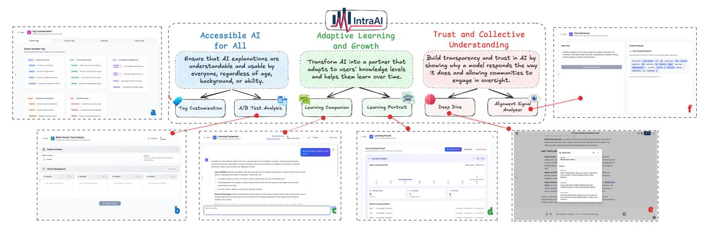
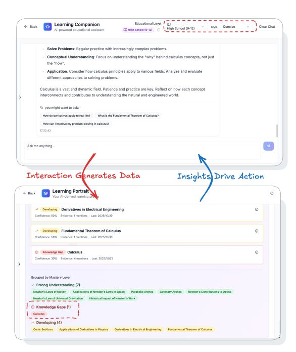

# IntraAI: Bridging Human-AI Understanding Through Intelligent Interface Design

Han Bao University of Notre Dame South Bend, USA hbao@nd.edu

Yue Huang University of Notre Dame South Bend, USA yhuang37@nd.edu

Xiangliang Zhang University of Notre Dame South Bend, USA xzhang33@nd.edu

Yanfang Ye University of Notre Dame South Bend, USA yye7@nd.edu

#### Abstract

The rapid proliferation of Generative AI and LLM-based chatbots necessitates interfaces that go beyond simple utility to foster user autonomy and understanding. Current "black box" interactions often obscure critical model behaviors, such as situational awareness and strategic conformity, hindering the development of interaction literacy. This paper presents IntraAI, an intelligent interface system designed to bridge this transparency gap through interactive visualization and reflective analysis. IntraAI is organized around three core design principles: Accessible AI for All, Adaptive Learning and Growth, and Trust and Collective Understanding. By making hidden alignment signals and reasoning patterns visible, the platform empowers users to interpret complex model behaviors and build calibrated trust. Through its modular and user-centric design, IntraAI demonstrates how intelligent interfaces can transform passive consumption into active, critical human-AI collaboration. The system is available at [https://github.com/wad3birch/Intra\\_AI.](https://github.com/wad3birch/Intra_AI)

# CCS Concepts

• Human-centered computing → Human computer interaction (HCI).

# Keywords

AI Transparency, Interactive Learning, User Interface Design

#### ACM Reference Format:

Han Bao, Yue Huang, Xiangliang Zhang, and Yanfang Ye. 2026. IntraAI: Bridging Human-AI Understanding Through Intelligent Interface Design. In Companion Proceedings of the ACM Web Conference 2026 (WWW Companion '26), April 13–17, 2026, Dubai, United Arab Emirates. ACM, New York, NY, USA, [4](#page-3-0) pages.<https://doi.org/10.1145/3774905.3793130>

#### 1 Introduction

The rapid proliferation of Generative AI (GenAI) and Large Language Model (LLM) chatbots has fundamentally reshaped human computer interaction. As these systems become embedded in daily

[This work is licensed under a Creative Commons Attribution 4.0 International License.](https://creativecommons.org/licenses/by/4.0) WWW Companion '26, Dubai, United Arab Emirates © 2026 Copyright held by the owner/author(s). ACM ISBN 979-8-4007-2308-7/2026/04 <https://doi.org/10.1145/3774905.3793130>

tasks, effective collaboration depends not only on model capability but also on interface designs that help users understand, control, and reason about AI behavior [\[3\]](#page-3-1).

Yet most existing GenAI interfaces remain opaque. They present a simple query–response format that reveals little about how inputs shape outputs or how the model adapts to context [\[4\]](#page-3-2). This opacity limits users' ability to develop interaction literacy, including the skill to diagnose model behavior, refine prompts, distinguish factual reasoning from strategic conformity, and build appropriately calibrated trust. Without tools to surface internal patterns or provide structured guidance, users often remain passive consumers rather than active collaborators.

Human–Computer Interaction (HCI) research emphasizes that interfaces should make intelligent systems not only useful but also learnable and interpretable [\[1\]](#page-3-3). Although explainable AI (XAI) has advanced model debugging, practical systems that combine transparency, personalization, and reflective tools within a unified conversational interface are still rare.

This paper presents IntraAI, an intelligent interface system designed to operationalize these principles through interactive visualization, adaptive guidance, and reflection-oriented analytics. IntraAI integrates six functional modules—including tag customization, comparative evaluation, a learning companion, a learning portrait, deep-dive exploration, and alignment signal analysis—that together enable users to observe how models behave, understand how prompting strategies influence outcomes, and engage in more deliberate, informed interaction.

Our contributions are twofold:

- We introduce a framework for calibrated trust that characterizes not only the correctness of AI outputs but also the communicative signals through which models express caution, deference, or strategic adaptation.
- We design and implement the IntraAI platform, which unifies alignment-sensitive visualization with adaptive personalization and reflective analytics, offering a holistic environment for understanding and improving human–AI interaction.

Together, these contributions position IntraAI as a step toward transparent, educational, and human-centered AI collaboration.

# 2 IntraAI Architecture and Design

The IntraAI system translates three guiding visions into a modular, human-centered architecture: Accessible AI for All, Adaptive Learning and Growth, and Trust and Collective Understanding. Each design vision is realized through two complementary modules (labeled a through f in [Figure 1\)](#page-2-0), structured by three layers of reasoning: its design principle, implementation method, and interface integration. This layered design ensures that technical innovation and educational value remain intertwined throughout the system.

Table 1: Evaluation dimensions and domain-specific criteria in the Comparative Evaluation Analyzer.

| Category   | Components  |             |              |                |                         |
|------------|-------------|-------------|--------------|----------------|-------------------------|
| General    | Content     | quality,    | readability, | engagement,    | clarity                 |
| E-commerce | Conversion  | rate,       | product      | appeal,        | trustworthiness         |
| Tech       | Technical   | accuracy,   | innovation,  | usability,     | security                |
| Healthcare | Medical     | accuracy,   | safety,      | trust, clarity |                         |
| Education  | Educational | value,      | clarity,     | engagement     |                         |
| Finance    | Financial   | accuracy,   | trust,       | compliance     |                         |
| Criteria   | Accuracy,   | creativity, | clarity,     | completeness   |                         |
| Output     | Summary,    | key         | differences, | strengths,     | weaknesses, recommenda |

#### 2.1 Accessible AI for All

2.1.1 (a) Tag Customization. Design Principle. This module lowers the barrier to effective AI control by offering intuitive, visual tools that let users adjust model behavior without technical expertise.

Implementation. Tags encode semantic, stylistic, or procedural parameters across five categories (identity, style, level, values, task). Each tag may include configurable fields (text, select, number, boolean), and selecting multiple tags triggers an automatic promptassembly mechanism that merges fragments into a coherent instruction. AI-assisted tag generation supports users in creating and refining custom tags with minimal manual effort.

Interface Integration. Panel (a) of [Figure 1](#page-2-0) shows the tag palette for browsing, filtering, and composing tag sets with realtime preview of the synthesized prompt. When applied, the system prepends the composed prompt to the user's message, enabling immediate observation of how different tag configurations alter tone, depth, and reasoning style. This workflow democratizes prompt engineering through visual configuration rather than manual editing.

2.1.2 (b) Comparative Evaluation Analyzer. Design Principle. This module is designed to help users move beyond intuition-based evaluation by providing a structured, side-by-side comparison environment for multiple AI outputs. Its goal is to transparently expose the distinctive characteristics, strengths, and weaknesses of different responses, enabling more objective, evidence-driven decision-making.

Implementation. The Comparative Evaluation Analyzer supports simultaneous comparison of up to four versions (A/B/C/D) based on different models, prompts, or configurations. Users can choose from six domain-specific evaluation frameworks (shown in [Table 1\)](#page-1-0) or define custom criteria. The system automatically

Table 2: Learning Levels and Preferences in Learning Companion.

| Category | Components    |           |                      |               |
|----------|---------------|-----------|----------------------|---------------|
| Learning | Levels        |           |                      |               |
| Elem.    | Ages          | 5–11;     | Remember/Understand; | basic facts   |
| Middle   | Ages          | 11–14;    | Understand/Apply;    | intermediate  |
| High     | Ages          | 14–18;    | Apply/Analyze;       | advanced      |
| Under.   | Ages          | 18–22;    | Analyze/Create;      | specialized   |
| Grad.    | Ages          | 22+;      | Evaluate/Create;     | research      |
| Expert   | Professional; |           | Create;              | cutting-edge  |
| Learning | Preferences   |           |                      |               |
| Styles   | Concise,      | Detailed, | Examples,            | Steps, Visual |

computes metrics such as response time, token length, and rubricbased scores across selected dimensions. A large language model synthesizes these metrics into comprehensive comparative analyses, including executive summaries, key differences, per-version strengths and weaknesses, confidence indicators, and actionable recommendations. Industry-specific templates supply tailored evaluation prompts and scoring rubrics to ensure domain-relevant assessments.

Interface Integration. Panel (b) of [Figure 1](#page-2-0) displays the evaluation workspace, which presents synchronized side-by-side outputs for each version. Users can add or remove versions, select industryspecific analysis modes, and explore results through interactive visualizations such as score bars, confidence markers, and structured metric grids. The workspace supports exporting results in JSON and PDF formats for sharing or reporting. Real-time updates accompany changes in configuration and provide immediate analytical feedback. By combining quantitative scoring with qualitative insights, this module transforms evaluation from ad-hoc trial and error into a systematic, transparent, and data-driven process.

# 2.2 Adaptive Learning and Growth

2.2.1 (c) Learning Companion. Design Principle. The Learning Companion reflects the idea that AI should function as a responsive and adaptive tutor that adjusts its explanations, reasoning style, and cognitive scaffolding according to a learner's developmental stage and preferred learning modalities. Instead of generating uniform responses, the system continuously calibrates its behavior to align with the user's educational context and evolving learning trajectory.

Implementation. The module models user learning characteristics using a hierarchical taxonomy derived from established K–12 and higher-education frameworks[1](#page-1-1) . Supported levels and styles are summarized in [Table 2.](#page-1-2) Users may specify their level and preferred learning style directly, or allow the system to infer them from conversation patterns. Each level and style maps to templates governing vocabulary complexity, reasoning depth, example frequency, and structural organization of explanations. During interaction, the module dynamically modulates output complexity and scaffolding based on user inputs and contextual cues. Over time, the system incorporates longitudinal interaction data to refine future tutoring behavior, enabling consistent adaptation across sessions.

Interface Integration. Panel (c) o[f Figure 1](#page-2-0) shows the configuration interface where users can select learning levels, switch among explanation styles, or adjust complexity sliders. The interface also

1<https://nces.ed.gov/pubs2005/2005025.pdf>

Figure 1: The IntraAI interface integrates six functional modules: (a) Tag Customization, (b) Comparative Evaluation Analyzer, (c) Learning Companion, (d) Learning Portrait, (e) Deep Dive, and (f) Alignment Signal Analyzer.

Table 3: Best Model Performance: Mean Squared Error (MSE) and Mean Absolute Error (MAE) Metrics by Level.

exposes adaptive features such as Socratic questioning, reflective prompts, and stepwise hints embedded in responses. These mechanisms transform conventional AI conversations into interactive, personalized learning experiences that promote long-term understanding and active engagement.

2.2.2 (d) Learning Portrait. Design Principle. To support selfregulated learning and informed instruction, learners and educators need accessible, longitudinal insights into learning behaviors, including knowledge growth, engagement trends, and evolving strategies.

Implementation. The Learning Portrait aggregates longitudinal interaction data, including conversation logs, learning milestones, preference selections, and engagement patterns, to construct a dynamic profile of a learner's strengths, challenges, and domain mastery. Machine learning analytics identify trends in pacing, shifts in cognitive strategies, trajectories of skill acquisition, and recurring areas of difficulty. These analyses are compiled into interpretable summaries that highlight meaningful progress and reveal opportunities for targeted intervention.

Interface Integration. Panel (d) of [Figure 1](#page-2-0) provides an interactive dashboard featuring temporal charts, skill development timelines, and learning summaries. Users may filter by domain, expand specific time windows, or inspect detailed progress markers. Personalized recommendations for next steps are generated based on observed trajectories. This design encourages reflection, goal-setting, and continuous improvement throughout the learning process.

## 2.3 Trust and Collective Understanding

2.3.1 (e) Deep Dive. Design Principle. Deep Dive enhances transparency by letting users interrogate specific text segments and uncover the reasoning behind model outputs.

Implementation. When a user highlights part of a response, the system identifies the content type, such as code, data, conceptual material, or general explanation, and generates targeted followup questions accordingly. These prompts focus on debugging and best practices for code, data interpretation for numerical content, and explanation or application for conceptual material. Selecting a question produces a contextualized explanation that integrates the highlighted text with the surrounding conversation.

Interface Integration. Panel (e) of [Figure 1](#page-2-0) displays an inquiry overlay that appears upon text selection. Suggested questions and expandable answer panels enable iterative, inquiry-driven exploration that promotes deeper understanding.

2.3.2 (f ) Alignment Signal Analyzer. Design Principle. As large language models evolve, they increasingly exhibit behaviors such as situational awareness, strategic framing, or deferential communication—sometimes appearing "aligned" without genuine reasoning consistency. Building calibrated trust requires exposing the subtle linguistic cues through which models signal alignment, caution, persuasion, or strategic conformity.

Implementation. We formulate alignment–signal detection as a token-level regression task. A BERT-based model [\[2\]](#page-3-4) is fine-tuned to predict a continuous alignment score (0–1) for each token, where lower values represent factual or reasoning cues, mid-range values mark emotional or relational signals, and higher values represent persuasive, hedging, or strategically adaptive communication.

Data Curation: Training data were collected by prompting multiple LLMs with items from benchmarks designed to elicit strategic or value-sensitive responses, including PsychometricBench [\[5\]](#page-3-5), and EQ-Bench [\[6\]](#page-3-6). Annotation: Each token received three independent model annotations (GPT-4o, Gemini-2.5-Flash, Claude-3.7-Sonnet), and scores were averaged when inter-annotator agreement was high. Training: The regression model was optimized with MSE loss and outputs continuous token-level alignment scores. These are mapped to a color gradient—green to red—for visualization.

Interface Integration. Panel (f) o[f Figure 1](#page-2-0) overlays color-coded alignment scores directly on generated text. Hovering reveals exact

numeric scores and short explanations describing the communicative intent (e.g., hedging, persuasion, emotional appeal). This interface enables users to discern strategic framing, detect potential "over-alignment," and develop more calibrated trust in AI-generated explanations.

## 3 System Implementation

The system is implemented as a full-stack web application using TypeScript, Next.js, and React for the frontend and backend, with Tailwind CSS for styling and Supabase (PostgreSQLbased) for data persistence and authentication. The user interface is adapted from the open-source Chatbot-UI[2](#page-3-7) template. The architecture supports integration with multiple LLM providers (e.g., OpenAI, Google, Anthropic and Meta) via cloud-based and local endpoints.

Figure 2: A case study demonstrating how insights from the Learning Portrait guide targeted re-engagement with the Learning Companion.

## 4 System Demonstration

This section illustrates how IntraAI operates in practice through two complementary demonstrations: (1) representative analytical outputs and (2) a user case study.

## 4.1 Module Output: Alignment Analysis

To validate analytical performance, the Alignment Signal Analyzer provides quantitative regression metrics from its BERT-based alignment signal model, as shown in [Table 3.](#page-2-1) These results demonstrate the system's capability to perform fine-grained, token-level analysis and to support reliable interpretability tools. The analytical output also illustrates the system's ability to surface subtle communicative

signals, including hedging, persuasion, and strategic conformity, directly within model-generated text.

### 4.2 Case Study: From Insight to Action

[Figure 2](#page-3-8) illustrates how a simulated high-school learner engages with two core modules. (1) The learner begins by interacting with the (c) Learning Companion at the Beginner level using a concise style, receiving simplified explanations in physics and mathematics. (2) They then review their (d) Learning Portrait, which identifies a key growth area in calculus mastery and provides specific recommendations for improvement. (3) Acting on these insights, the learner returns to the Learning Companion to request concise calculus summaries and derivative-focused practice, and the system adapts accordingly.

This loop illustrates the central principle of IntraAI: insights from the Learning Portrait guide targeted re-engagement with the Learning Companion, supporting effective and personalized learning cycles.

#### 5 Conclusion & Future Work

IntraAI illustrates how thoughtful interface design can make AI systems not only usable but understandable. By integrating visualization, personalization, and reflection into a unified platform, it reframes human–AI interaction as a process of shared learning and interpretation rather than simple query–response exchange. Looking forward, we hope the community will engage with IntraAI, offer feedback, and contribute ideas for new modules, evaluation practices, and design conventions. Such collective input can help shape IntraAI into a shared experimental ground for studying flexible alignment and user-centered AI design. We see this as a step toward AI that is more transparent, adaptive, and genuinely supportive of diverse users.

#### 6 Ethical Use of Data and Informed Consent

This work uses only model-generated or open-source data; no human participants or identifiable information were involved.

#### References

[1] Amina Adadi and Mohammed Berrada. 2018. Peeking inside the black-box: a survey on explainable artificial intelligence (XAI). IEEE access 6 (2018), 52138– 52160. [2] Jacob Devlin, Ming-Wei Chang, Kenton Lee, and Kristina Toutanova. 2019. Bert: Pre-training of deep bidirectional transformers for language understanding. In Proceedings of the 2019 conference of the North American chapter of the association for computational linguistics: human language technologies, volume 1 (long and short papers). 4171–4186. [3] Finale Doshi-Velez and Been Kim. 2017. Towards a rigorous science of interpretable machine learning. arXiv preprint arXiv:1702.08608 (2017). [4] Upol Ehsan, Q Vera Liao, Michael Muller, Mark O Riedl, and Justin D Weisz. 2021. Expanding explainability: Towards social transparency in ai systems. In Proceedings of the 2021 CHI conference on human factors in computing systems. 1–19. [5] Yuan Li, Yue Huang, Hongyi Wang, Ying Cheng, Xiangliang Zhang, James Zou, and Lichao Sun. 2024. Evaluating Large Language Models with Psychometrics. In Large Language Models for Scientific and Societal Advances. [6] Samuel J Paech. 2023. Eq-bench: An emotional intelligence benchmark for large language models. arXiv preprint arXiv:2312.06281 (2023).