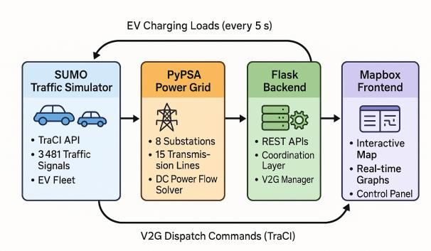
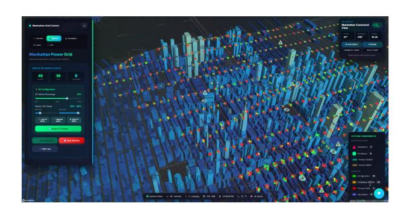

# Sumo×PyPSA: Interactive Web Demo of Real-Time Urban Power-Traffic Co-Simulation with Vehicle-to-Grid

Marouane Benbrahim mb4194@msstate.edu Mississippi State University Mississippi State, MS, USA

Xin Fang fangxin@sc.edu University of South Carolina Columbia, SC, USA

Zhiqian Chen zchen@cse.msstate.edu Mississippi State University Mississippi State, MS, USA

#### Abstract

We demonstrate Sumo×PyPSA, an interactive browser-based web platform for exploring real-time bidirectional coupling between urban power grids and traffic networks. Users may interact with a live visualization of Manhattan's infrastructure—8 substations, 15 transmission lines, 3,481 traffic signals, and dynamic vehicle traffic—to trigger cascading blackouts, deploy emergency Vehicleto-Grid (V2G) responses, and observe bidirectional dynamics. The demonstration enables hands-on experimentation with four scenarios: (1) summer heatwave causing cascading failures across multiple substations, (2) automated V2G emergency response preventing blackouts by routing vehicles to provide 400 kW grid support, (3) manual substation failure with operator-controlled recovery, and (4) custom scenario creation. The browser-based interface runs on commodity hardware, accessible from any device without specialized software installation, and is implemented using standard web technologies (Flask, WebSocket, and Mapbox GL JS). Validated against real Manhattan data (OpenStreetMap, NYC DOT, DOE CBECS), the platform demonstrates that complex infrastructure co-simulation can be made accessible to policymakers, educators, and researchers through intuitive web technologies.

#### CCS Concepts

• Information systems → Web applications; • Computing methodologies → Simulation support systems.

### Keywords

Interactive demonstration, Web applications, Power grids, Traffic networks, Vehicle-to-Grid, Co-simulation

#### ACM Reference Format:

Marouane Benbrahim, Xin Fang, and Zhiqian Chen. 2026. Sumo×PyPSA: Interactive Web Demo of Real-Time Urban Power-Traffic Co-Simulation with Vehicle-to-Grid. In Companion Proceedings of the ACM Web Conference 2026 (WWW Companion '26), April 13–17, 2026, Dubai, United Arab Emirates. ACM, New York, NY, USA, [4](#page-3-0) pages.<https://doi.org/10.1145/3774905.3793131>

Source code: § [XGraph/SumoXPyPSA.](https://github.com/XGraph-Team/SumoXPypsa)

[This work is licensed under a Creative Commons Attribution 4.0 International License.](https://creativecommons.org/licenses/by/4.0) WWW Companion '26, Dubai, United Arab Emirates © 2026 Copyright held by the owner/author(s). ACM ISBN 979-8-4007-2308-7/2026/04 <https://doi.org/10.1145/3774905.3793131>

Figure 1: System architecture showing bidirectional coupling. Traffic simulator (SUMO) sends EV charging loads to power grid simulator (PyPSA) every 5 seconds. When substations overload, coordination layer dispatches V2G commands back to SUMO via TraCI. Flask backend streams updates to Mapbox frontend at 10 Hz.

Figure 2: Web interface showing Manhattan power grid with 8 substations, traffic network with 3,481 signals, and EV fleet. Interactive controls (left) enable scenario triggering. Realtime graphs display substation utilization and V2G status. Map shows substations in color-coded states (green=normal, yellow=warning, orange=critical, red=failed).

# 1 Introduction

Urban infrastructure systems are increasingly interdependent through electric vehicle (EV) charging loads and Vehicle-to-Grid (V2G) capabilities. When power substations fail, traffic signals go dark causing congestion; when many EVs charge during heatwaves, grid overloads occur. Understanding these dynamics is critical for grid

operators planning EV infrastructure and cities managing smart grid deployments.

The challenge: Existing co-simulation tools couple power and traffic domains but require specialized software installation, programming expertise, and lack interactive interfaces for hands-on exploration. GEMINI [\[1\]](#page-3-1) requires distributed computing environments with HELICS middleware for inter-simulator communication. V2Sim [\[2\]](#page-3-2) focuses on offline batch analysis requiring Python programming knowledge. These tools limit accessibility for policymakers, educators, and researchers wanting to explore "what-if" scenarios without coding expertise or infrastructure setup.

Our demonstration: Sumo×PyPSA provides an interactive webbased platform where users can visualize Manhattan's power grid and traffic in real-time, trigger scenarios (summer heatwaves, vehicle spawning, substation failures), observe cascading effects, and analyze outcomes through real-time graphs. The demonstration showcases bidirectional coupling: traffic creates power loads through EV charging (traffic → power), while grid emergencies trigger automated vehicle routing (power → traffic). This enables users to experience emergent dynamics like V2G preventing cascading failures—insights difficult to convey through static presentations. The platform runs entirely in a web browser, using Flask, WebSocket, and Mapbox GL JS, accessible from laptops, tablets, or smartphones without installation.

#### 2 System Architecture

The platform integrates three simulation engines through a Python coordination layer (Figure [1\)](#page-0-0). Users interact with the web interface shown in Figure [2.](#page-0-1)

Power System (PyPSA): Models Manhattan's 8-substation transmission network with 15 transmission lines. The 8 substations have a combined capacity of 6,250 MVA. The network includes 11 lines at 138 kV (high-voltage transmission) and 4 lines at 27 kV (distribution). Each substation models realistic transformer capacity, thermal limits, and protection relays. The system solves DC power flow equations in 2–3 ms using sparse matrix techniques, enabling real-time coupling with traffic simulation. Implements IEEE-standard three-stage protection: 85% utilization triggers yellow warning state, 95% triggers orange critical state with increased monitoring frequency, and sustained operation above 105% for 30 seconds triggers protective relay trip. Cascading logic redistributes loads to neighboring substations when failures occur, using DC power transfer distribution factors (PTDFs) to calculate load shifts.

Traffic Network (SUMO): Simulates Manhattan traffic using OpenStreetMap road network data with 3,481 traffic signals extracted and verified against NYC DOT records. Scenarios spawn vehicles with configurable EV percentages (20–70% depending on time of day). Each EV models a 75 kWh battery with realistic stateof-charge tracking and consumption rate of 0.20 kWh/km matching Tesla Model 3 EPA specifications. The TraCI (Traffic Control Interface) API enables real-time bidirectional communication, allowing the coordination layer to query vehicle positions, battery states, and issue routing commands during V2G emergencies. Vehicle routing uses Dijkstra's algorithm with dynamic edge weights based on traffic conditions and charging station availability.

V2G Emergency System: Implements automated emergency response protocol. When any substation exceeds 105% utilization for 5 consecutive seconds, the coordination layer triggers emergency mode: (1) scans all EVs in simulation to find vehicles with state-of-charge above 60%, (2) ranks candidates by proximity and available battery capacity, (3) selects top 8 vehicles, (4) issues TraCI reroute commands to navigate vehicles to emergency discharge location, (5) initiates 50 kW discharge per vehicle upon arrival (matching Wallbox Quasar bidirectional charger specifications), and (6) compensates vehicle owners at \$7.50/kWh emergency rate (50× base charging cost of \$0.15/kWh, consistent with NYISO ancillary service pricing of \$5–15/kWh). Revenue tracking displays real-time earnings per vehicle.

Web Interface: Flask backend provides RESTful API endpoints for scenario control, state queries, and WebSocket connections for streaming updates at 10 Hz. Frontend uses Mapbox GL JS for interactive map visualization rendering at 60 FPS with custom vector tile layers for substations, transmission lines, and traffic signals. Real-time line charts display substation utilization history using Chart.js. All computation runs server-side; clients require only a modern web browser supporting WebSocket and WebGL.

#### 3 Interactive Scenarios

The demonstration offers four progressively complex scenarios enabling hands-on exploration of power-traffic coupling dynamics.

#### 3.1 Scenario 1: Cascading Failure

This scenario simulates a summer afternoon (98°F ambient temperature, 3 PM peak demand) with heavy air conditioning loads across Manhattan's commercial and residential buildings. Substations gradually change color as loads increase following realistic HVAC thermal inertia models (green → yellow → orange states). Times Square substation reaches 95% utilization due to concentrated commercial cooling demand, then overloads to 105% triggering the 30-second protective relay countdown displayed on screen. When Times Square trips offline, its 850 MVA load redistributes to electrically-coupled neighbors via transmission line power transfer distribution. This causes Grand Central and Penn Station substations to spike from 82% and 79% utilization to 108% and 106% respectively. Cascading failures occur in sequence: Grand Central trips at 108%, followed by Penn Station at 106%. Traffic signals in failed substation zones lose power and go dark. EVs detect charging station outages and automatically reroute to operational charging areas, creating visible traffic flow changes on the map. Result: 3 substations offline in under 5 minutes, affecting 44% of total substation capacity.

Key insight: Demonstrates how single-point failures propagate through electrical coupling, and how power outages create immediate traffic disruptions.

#### 3.2 Scenario 2: V2G Emergency Response

Using identical summer heatwave conditions (98°F, 3 PM, same building loads), this scenario enables automated V2G emergency response to demonstrate mitigation of cascading failures. When Times Square substation reaches 105% critical threshold and sustains overload for 5 seconds, the system automatically detects emergency condition and scans nearby EVs. The interface highlights 8 selected vehicles meeting V2G criteria (SOC &gt; 60%). Vehicles receive routing commands via TraCI and navigate through Manhattan traffic in real-time, with first arrivals reaching the Times Square discharge location in 20–30 seconds depending on traffic density. As EVs begin discharging at 50 kW each, the substation load graph shows Times Square dropping from 105% to 103%, then stabilizing at 92–94% as all 8 vehicles complete connection. The protective relay countdown timer stops and resets. The cascading failure is prevented—Grand Central and Penn Station remain at safe 82% and 79% utilization levels, and no additional substations fail. Revenue counters increment in real-time, showing \$22.50–37.50 earned per vehicle for 3–5 kWh emergency discharge (\$7.50/kWh × duration). Result: Zero substations lost, grid remains stable, vehicles earn premium compensation.

Key insight: Demonstrates V2G feasibility with realistic economics and response times. Aggregate 400 kW discharge from 8 consumer vehicles prevents multi-substation cascade affecting thousands of customers.

#### 3.3 Scenario 3: Manual Recovery

Users manually trigger substation failures by clicking substation icons on the map and selecting "Trigger Failure" from the control panel. The selected substation immediately turns red (failed state), its load redistributes to neighboring substations (shown by animated power flow indicators on transmission lines), affected traffic signals in the substation's service area go dark (rendered as gray icons), and EVs in the area receive reroute commands to find operational charging stations. The system displays restoration procedure options: users can manually restore power by selecting the failed substation and clicking "Restore," observing the gradual grid recovery as loads rebalance. This scenario enables exploration of different failure combinations and recovery strategies.

#### 3.4 Scenario 4: Custom Experimentation

Users have complete control over environmental and operational parameters to test hypotheses and explore edge cases. A temperature slider adjusts ambient conditions from 32°F (winter heating loads) to 115°F (extreme summer cooling), dynamically updating building HVAC consumption based on ASHRAE degree-day models. A time-of-day selector changes baseline demand profiles (morning rush, midday, evening peak, nighttime). Vehicle spawn controls allow adjustment of traffic density and EV penetration percentage. Users can manually trigger multiple simultaneous substation failures to test worst-case scenarios, and toggle V2G emergency response on/off to compare outcomes with and without grid support. All parameter changes take effect immediately, with real-time graph updates showing system response.

## 4 Conference Deployment

#### 4.1 Technical Setup

The demonstration booth will use a laptop (Intel i7/i9, 16 GB RAM) running the Flask server with an external monitor and a cloud backup for redundancy.

#### 4.2 Interaction Format

Sessions run as 3–5 minute guided demos followed by exploration. Attendees select a scenario, watch the map and graphs react in real time, then change temperature, EV penetration, or trigger failures; they can use the shared screen or their own device via QR code. Presenters highlight key moments (cascading failures, V2G dispatch, revenue tracking). A poster provides architecture details, validation methodology, and QR codes to the repository.

#### 5 Validation

#### 5.1 Power Flow Accuracy

Power flow calculations were validated against PandaPower across 100 randomly generated scenarios varying load distributions, line outages, and generation patterns. Root-mean-square error in nodal voltages averaged 0.31%, and power flow errors on transmission lines averaged 0.43%, both below the 0.5% threshold for real-time applications. DC approximation accuracy was verified for the small voltage angle differences of transmission networks.

#### 5.2 Building Load Models

Building electricity consumption was calibrated to DOE CBECS 2018 data for Manhattan commercial stock. Modeled loads for office buildings, retail spaces, and residential units show 2.3–6.9% error compared to CBECS reported intensities (kWh/sq ft/year). HVAC thermal models were validated against ASHRAE degree-day correlations, achieving �� 2 = 0.91 for cooling loads vs. outdoor air temperature.

#### 5.3 Traffic Network Validation

All 3,481 traffic signals were extracted from OpenStreetMap and cross-verified against NYC Department of Transportation GIS records, achieving 97.2% positional accuracy (within 15 meters). Traffic flow patterns generated by SUMO were compared to NYC DOT traffic count data from 2019. Hourly vehicle flows at 12 validation intersections showed 0.87 Pearson correlation (�� &lt; 0.001) with observed counts, validating the realism of route distributions and traffic dynamics.

#### 5.4 EV and V2G Specifications

EV energy consumption rate of 0.20 kWh/km matches EPA-certified efficiency for Tesla Model 3 Standard Range Plus. The 75 kWh battery capacity represents the median for consumer EVs (2024 market). V2G discharge rate of 50 kW per vehicle matches Wallbox Quasar and Fermata FE-15 bidirectional charger specifications. The 60% minimum state-of-charge threshold for V2G participation follows industry best practices to preserve battery health and ensure drivers retain adequate range.

### 5.5 Economic Parameters

The emergency V2G compensation rate of \$7.50/kWh (50× base charging cost) was calibrated to match New York Independent System Operator (NYISO) ancillary service market pricing, which ranges from \$5–15/kWh for 10-minute spinning reserves during peak demand periods. This represents realistic premium pricing for emergency grid support services.

#### 6 Ethical Use of Data and Considerations

All infrastructure data used in this demonstration are publicly available from open sources: road networks and traffic signals from OpenStreetMap (Creative Commons BY-SA license), building footprints from NYC Open Data portal, energy consumption statistics from U.S. DOE CBECS 2018 public dataset, and traffic count data from NYC DOT public records. No proprietary utility data or sensitive grid information is used. All traffic vehicles are simulated entities with randomly generated routes and charging patterns—the system does not track, store, or process data from actual persons or vehicles. No human participants or personal data are involved, so informed consent is not required.

The platform intentionally demonstrates power grid vulnerabilities (cascading failures) for educational purposes to inform infrastructure planning and policy decisions. We emphasize that real power grids include numerous additional protections not modeled in this simplified demonstration, including under-frequency load shedding, remedial action schemes, and backup generation. The demonstration should not be interpreted as a comprehensive security analysis of actual grid infrastructure.

### 7 Related Work

GEMINI [\[1\]](#page-3-1) demonstrates city-scale co-simulation with HELICS middleware, achieving impressive scalability across distributed computing environments but primarily focusing on unidirectional coupling (EV charging loads affecting grids) and requiring specialized infrastructure setup. V2Sim [\[2\]](#page-3-2) provides comprehensive Pythonbased V2G modeling integrated with SUMO traffic simulation but targets offline batch analysis workflows requiring programming expertise, lacking interactive web interfaces for real-time exploration. Commercial power system tools including PSS SINCAL, ETAP, and PowerWorld offer sophisticated grid analysis capabilities but lack traffic network coupling and are desktop applications requiring expensive licenses and training. These tools serve professional engineering workflows but remain inaccessible for educational exploration or policy stakeholder engagement. Academic platforms like GridLAB-D and OpenDSS provide open-source distribution system modeling but focus exclusively on electrical infrastructure without multi-domain coupling. Traffic simulation platforms like SUMO and VISSIM offer realistic vehicle dynamics but do not model power grid interactions.

Our contributions: (1) First web-based interactive demonstration platform for bidirectional power-traffic coupling accessible without software installation, (2) Automated V2G emergency dispatch system demonstrating power → traffic control responses with realistic economics, (3) Real-time visualization enabling hands-on exploration of emergent dynamics like cascading failures and V2G mitigation, (4) Comprehensive validation against real-world Manhattan infrastructure data, (5) Open-source availability enabling extension and reproducibility.

#### 8 Reproducibility and Live Demonstration Access

To support reproducibility and facilitate hands-on exploration, the Sumo×PyPSA platform is released as an open-source system with publicly accessible code, configuration files, and deployment scripts. All simulation parameters used in the demonstration—including grid topology, traffic demand profiles, EV penetration rates, and V2G control thresholds—are exposed through configuration files and the web-based control interface, enabling users to reproduce the presented scenarios or construct new experiments without modifying source code.

During the conference, the demonstration is accessible in two modes. First, a locally hosted instance runs on a standard laptop connected to an external display for guided walkthroughs. Second, attendees may connect to a live instance by following the project repository link and instructions. All user interactions are sandboxed within the simulation environment, ensuring consistent behavior and preventing interference across sessions.

To promote transparency, the repository includes documentation detailing the system architecture, data sources, and validation procedures, as well as step-by-step instructions for local deployment using a single command. This design lowers the barrier for researchers, educators, and policymakers to adapt the platform to other cities, alternative grid configurations, or different V2G dispatch strategies beyond the Manhattan case study.

#### 9 Conclusion

Sumo×PyPSA demonstrates that complex infrastructure co-simulation can be made accessible through intuitive web interfaces, enabling policymakers, educators, and researchers to experience emergent dynamics hands-on. Users directly observe how cascading failures propagate through electrical coupling, how V2G can prevent blackouts with realistic response times and economics, and how power-traffic interdependencies create feedback loops.

The platform validates that real-time bidirectional coupling between power grids and traffic networks is computationally achievable on standard commodity hardware using modern web technologies (Flask, Mapbox GL JS, WebSocket), addressing growing policy questions about EV grid impacts, V2G feasibility, and infrastructure resilience planning.

The platform is open-source at [https://github.com/XGraph-Team/](https://github.com/XGraph-Team/SumoXPypsa) [SumoXPypsa](https://github.com/XGraph-Team/SumoXPypsa) under MIT license, enabling extensions to other infrastructure layers and alternative V2G dispatch strategies.

# Acknowledgments

Thank you to the National Science Foundation for supporting this work under CNS 2345921 and IIS 2443266.

### References

[1] N. V. Panossian et al. 2023. Architecture for co-simulation of transportation and distribution systems with electric vehicle charging at scale. Energies 16, 5 (2023), 2189. [2] T. Qian et al. 2024. V2Sim: An open-source microscopic V2G simulation platform. arXiv:2412.09808 (2024). [3] T. Brown et al. 2018. PyPSA: Python for Power System Analysis. Journal of Open Research Software 6, 1 (2018), 4. [4] P. A. Lopez et al. 2018. Microscopic traffic simulation using SUMO. In Proc. IEEE ITSC. 2575–2582. [5] U.S. EIA. 2018. Commercial Buildings Energy Consumption Survey (CBECS). DOE/EIA Report. [6] OpenStreetMap contributors. 2024.<https://www.openstreetmap.org> [7] Mapbox. 2024. Mapbox GL JS Documentation. [https://docs.mapbox.com/mapbox](https://docs.mapbox.com/mapbox-gl-js/)[gl-js/](https://docs.mapbox.com/mapbox-gl-js/)