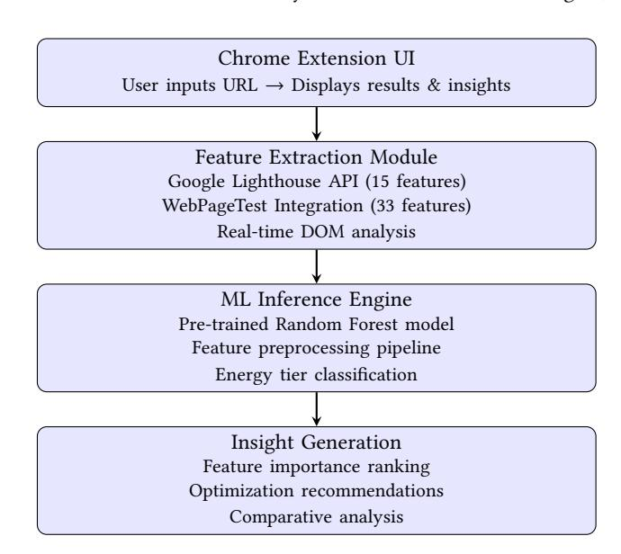
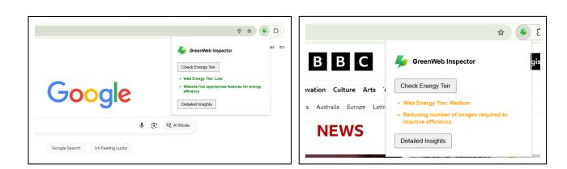

# GreenWebInspector: A Tool for Real-Time Web Energy Efficiency Assessment

Muhammad Sohaib Ayub

Insight Research Ireland Centre for Data Analytics, Data Science Institute, University of Galway Galway, Ireland muhammadsohaib.ayub@universityofgalway.ie

Umair ul Hassan

J.E. Cairnes School of Business & Economics, University of Galway, Insight Research Ireland Centre for Data Analytics, Data Science Institute, University of Galway Galway, Ireland umair.ulhassan@universityofgalway.ie

Imdad Ullah Khan

Department of Computer Science, Lahore University of Management Sciences Lahore, Pakistan imdad.khan@lums.edu.pk

Edward Curry

Insight Research Ireland Centre for Data Analytics, Data Science Institute, University of Galway Galway, Ireland edward.curry@universityofgalway.ie

# Abstract

Mobile devices now account for over 60% of global web traffic, making the energy consumption of web applications a critical concern for both user experience and environmental sustainability. While existing tools focus primarily on performance metrics, energy consumption doesn't always correlate with performance. We present GreenWebInspector, a tool that provides real-time energy tier predictions and actionable insights for any website using static design features. Unlike performance-based approaches, our tool leverages device-independent features extracted from web page structure and content, achieving 9.7% higher accuracy than performancescore-based methods. The extension allows developers, researchers, and environmentally conscious users to instantly assess and understand the energy footprint of web applications during the design and browsing phases.

# CCS Concepts

#### • Information systems → Web applications.

#### Keywords

Web Energy Efficiency, Energy Consumption, Sustainable Computing, Green Software, Machine Learning

#### ACM Reference Format:

Muhammad Sohaib Ayub, Umair ul Hassan, Imdad Ullah Khan, and Edward Curry. 2026. GreenWebInspector: A Tool for Real-Time Web Energy Efficiency Assessment. In Companion Proceedings of the ACM Web Conference 2026 (WWW Companion '26), April 13–17, 2026, Dubai, United Arab Emirates. ACM, New York, NY, USA, [4](#page-3-0) pages.<https://doi.org/10.1145/3774905.3793132>

# 1 Introduction

The web infrastructure consumes 416.2 TWh of electricity annually, contributing 1.6 billion tons of greenhouse gas emissions [\[6\]](#page-3-1).

[This work is licensed under a Creative Commons Attribution 4.0 International License.](https://creativecommons.org/licenses/by/4.0) WWW Companion '26, Dubai, United Arab Emirates © 2026 Copyright held by the owner/author(s). ACM ISBN 979-8-4007-2308-7/2026/04 <https://doi.org/10.1145/3774905.3793132>

With battery-constrained mobile devices accounting for over 60% of global web traffic [\[16\]](#page-3-2), understanding and optimizing web energy consumption has become critical for both environmental sustainability and user experience. However, current performance analysis tools, such as Google Lighthouse [\[5\]](#page-3-3) and WebPageTest [\[12\]](#page-3-4), primarily focus on metrics, such as load time and interactivity, that do not always correlate with actual power consumption [\[4\]](#page-3-5).

Previous research demonstrates critical limitations in existing approaches. Chan et al. [\[4\]](#page-3-5) found that performance scores correlate with energy at only -0.59 using Spearman's correlation, and betterperforming websites may actually consume more energy due to increased CPU utilization [\[3\]](#page-3-6). Furthermore, performance metrics are inherently dependent on device specifications, network conditions, and geographical location, making them unreliable predictors across different contexts [\[13\]](#page-3-7). Most importantly, no readily available tools provide real-time, fine-grained energy assessment that developers can integrate into their workflow without specialized hardware [\[10\]](#page-3-8).

GreenWebInspector addresses these limitations by providing real-time energy tier predictions for any URL, giving developers immediate feedback during development. Unlike performance metrics that vary with device and network conditions, our approach uses static design features that remain consistent across contexts. The extension operates entirely client-side, with no data collection or transmission, and analyzes only publicly accessible website features. This approach provides actionable insights about specific features driving energy consumption, helping developers prioritize their optimization efforts. The tool is research-backed, based on rigorous analysis of 689 websites achieving 68% classification accuracy and demonstrating 9.7% improvement over performance-based baseline methods. As a free Chrome extension that requires no specialized hardware or technical setup, it makes energy efficiency assessment accessible to developers worldwide.

# 2 System Architecture

Figure [1](#page-1-0) shows the architecture of our extension, which combines four main components to provide comprehensive energy analysis. Chrome Extension UI is where users interact with the tool. They enter URLs and see results through an intuitive interface that displays

color-coded energy tier badges (green, yellow, red) alongside interactive visualizations. The Feature Extraction Module serves as the core data-collection mechanism, integrating 15 features from the Google Lighthouse API and 33 from WebPageTest, supplemented by real-time DOM analysis to capture a total of 48 static design features. At the core of the system is the ML Inference Engine,

Figure 1: System Architecture of GreenWebInspector

which processes extracted features through a pre-trained Random Forest model converted to TensorFlow.js for efficient client-side execution. The engine implements feature preprocessing through zscore normalization, performs three-tier energy classification (low, moderate, high), and computes confidence scores to indicate prediction reliability. The Insight Generation component turns raw predictions into actionable recommendations. It ranks features by importance, generates website-specific optimization recommendations, provides benchmark comparisons, and displays detailed breakdowns by feature category.

# 2.1 Static Design Feature Extraction

The system extracts 48 static features organized into three distinct categories, each capturing different aspects of web design that influence energy consumption. Content structure features obtained from WebPageTest provide fundamental information about the website's composition, including the total number of requests (RQS), the number of DOM elements (DOM), and total bytes received (BIN). Type-specific metrics further refine this analysis, including JavaScript requests (RQJ), image requests (RQI), and HTML requests (RQH), along with their corresponding byte metrics such as JavaScript bytes (BYJ), image bytes (BYI), and CSS bytes (BYC).

Optimization metrics from Google Lighthouse capture how well the website implements best practices for resource efficiency. These features include unminified CSS (UMC) and JavaScript (UMJ), which indicate opportunities for file size reduction, unused CSS rules (UCR) identifying potential for code elimination, uncompressed text resources (UTC) highlighting missing compression opportunities, cache lifetime of static resources (ULC) measuring how effectively the site leverages browser caching, and render-blocking resources (RBR) identifying scripts and stylesheets that delay page rendering [\[15\]](#page-3-9).

Compression and delivery features from WebPageTest assess the efficiency of content delivery mechanisms. The percentage of static assets leveraging caching (SCC) indicates browser cache utilization, the percentage of possible gzip compression done (SGZ) measures text compression effectiveness, and the percentage of static resources using CDN (SCD) evaluates content distribution network adoption for faster, more energy-efficient delivery [\[7\]](#page-3-10).

# 2.2 Ground Truth Power Measurements

Ground-truth power consumption was measured using PowerAPI's SmartWatts power meter [\[2\]](#page-3-11) on a Linux system equipped with an Intel Core i5 processor, 4GB RAM, and a 100 Mbps Ethernet connection. Our measurement protocol began with a 5-minute warm-up period to allow system stabilization, followed by cache clearing before each measurement. We used Selenium automation to load URLs and measured power consumption from page start to the OnLoad event. Between measurements, we maintained a 30-second idle period, and each website was measured three times with results averaged to ensure reliability. The browser ran in a dedicated cgroup, which isolated it from other system processes and ensured our measurements captured only browser activity.

# 2.3 Machine Learning Model

The prediction model builds on extensive empirical research involving 689 real-world websites selected from Alexa rankings to ensure diversity in website types and implementation approaches [\[1\]](#page-3-12). Ground-truth power consumption measurements were obtained using the PowerAPI toolkit [\[2\]](#page-3-11), a widely adopted tool for fine-grained energy measurement in software systems. The Random Forest classifier was selected for its ability to handle non-linear relationships and provide interpretable feature importance rankings crucial for generating actionable insights.

The model uses 48 static features correlated with energy consumption, achieving 68% accuracy and 73% AUC-ROC, representing a 9.7% improvement over performance-based baseline methods. A key characteristic of the model is its ability to avoid false positives for low-power websites, ensuring that energy-efficient sites are correctly identified and not misclassified as high-consumption sites. This conservative approach prevents unnecessary optimization efforts on already-efficient websites.

#### 3 Implementation Details

The extension's frontend uses React.js to create a responsive, intuitive popup interface that gives immediate feedback to users. Feature extraction integrates multiple established tools, including the Lighthouse Node CLI for programmatic access to Google Lighthouse metrics, the WebPageTest API for comprehensive performance and optimization data, and the Chrome DevTools Protocol for real-time DOM inspection and resource monitoring. The machine learning model consists of a carefully optimized Random

Forest classifier trained on our extensive dataset, converted to TensorFlow.js to enable efficient client-side inference without requiring server-side processing.

Feature extraction follows three stages. We start by running a Lighthouse audit focused on performance metrics, then query WebPageTest using consistent settings to keep results reproducible. We extract and organize static features from both sources, capturing 15 features related to optimization opportunities from Google Lighthouse and 33 features covering request counts, byte sizes, and compression metrics from WebPageTest.

The inference process converts raw feature data into actionable energy classifications through several steps. After loading the pretrained TensorFlow.js model, the system normalizes features using z-score standardization to ensure consistent scaling. The system converts normalized features into a tensor suitable for model input, runs inference to produce probability distributions across the three energy tiers, and computes confidence scores to provide users with insight into prediction certainty.

The extension popup displays five key components designed for maximum information density while maintaining visual clarity. The energy tier badge uses universally recognized color coding with green indicating low energy consumption, yellow indicating moderate consumption, and red indicating high consumption. The feature importance chart visualizes the top five features contributing to the website's energy consumption using an intuitive bar chart format. The recommendations panel gives specific, actionable suggestions tailored to the website's particular characteristics rather than generic advice. Figure [2](#page-2-0) shows the extension interface analyzing a website.

Figure 2: Screenshot of GreenWebInspector extension showing energy tier classification and optimization recommendations

#### 4 Evaluation & Validation

Our model performs substantially better than baseline approaches across several metrics.Table [1](#page-2-1) shows the comparison between our static features approach (STATF) and the performance-based baseline (PERFS) that relies solely on Google Lighthouse performance scores. Compared to the baseline, STATF achieves 68% accuracy versus 62%, representing a 9.7% improvement. The AUC-ROC metric reaches 0.73 compared to 0.69, indicating a 5.8% improvement in the model's ability to distinguish between different energy tiers. Precision reaches 71% versus 66%, demonstrating a 7.6% gain, while recall achieves 65% versus 60%, representing an 8.3% improvement.

Analysis of feature importance reveals that certain design characteristics consistently dominate energy consumption patterns, as shown in Table [2.](#page-2-2) The total number of requests (RQS) emerges as

Table 1: Performance Comparison: Static Features vs. Performance Score

| Metric    | STATF | PERFS | Improvement |
|-----------|-------|-------|-------------|
| Accuracy  | 68.0% | 62.0% | +9.7%       |
| AUC-ROC   | 0.73  | 0.69  | +5.8%       |
| Precision | 71.0% | 66.0% | +7.6%       |
| Recall    | 65.0% | 60.0% | +8.3%       |

Table 2: Feature Importance Rankings

| Rank | Feature |              |           | Importance |
|------|---------|--------------|-----------|------------|
| 1    | RQS     | (Total       | Requests) | 0.124      |
| 2    | RQJ     | (JavaScript  | Requests) | 0.089      |
| 3    | BIN     | (Total       | Bytes)    | 0.087      |
| 4    | ULC     | (Cache       | Lifetime) | 0.076      |
| 5    | DOM     | (DOM         | Elements) | 0.068      |
| 6    | GZT     | (Text        | Size)     | 0.061      |
| 7    | SCC     | (Cache       | Coverage) | 0.054      |
| 8    | RQO     | (Other       | Requests) | 0.048      |
| 9    | BYJ     | (JavaScript  | Bytes)    | 0.045      |
| 10   | SGZ     | (Compression | %)        | 0.042      |

the single most important feature with a relative importance of 0.124, reflecting the energy cost of network activity and connection management. JavaScript requests specifically (RQJ) rank second at 0.089, highlighting the energy impact of interactive functionality and client-side computation. Total bytes (BIN) ranks third at 0.087, demonstrating that overall data transfer volume significantly affects energy consumption. Cache lifetime (ULC) appears fourth at 0.076, emphasizing the efficiency gains from properly leveraging browser caching.

#### 5 Novel Contributions

GreenWebInspector occupies a unique position in the web development tool ecosystem by focusing specifically on energy efficiency rather than treating it as a byproduct of performance optimization. Table [3](#page-2-3) compares our tool with existing solutions. Google Light-

Table 3: Comparison with Existing Tools

| Tool              | Focus  | Dev.-Dep. | Realtime | Energy   |
|-------------------|--------|-----------|----------|----------|
| GLH               | Perf.  | Yes       | Yes      | No       |
| WebPageTest       | Perf.  | Yes       | No       | No       |
| Greenspector      | Energy | Yes       | No       | Limited  |
| GreenWebInspector | Energy | No        | Yes      | Detailed |

house, while providing valuable performance metrics, primarily focuses on user experience metrics like loading time and interactivity. Its real-time analysis capabilities come at the cost of devicedependent measurements that vary significantly across different hardware and network conditions. WebPageTest offers comprehensive performance analysis but operates as a remote testing service

rather than an integrated development tool. Greenspector is the most direct alternative, offering energy measurement capabilities, but it requires specialized hardware and proprietary software, limiting accessibility [\[14\]](#page-3-13).

### 5.1 Key Differentiators

GreenWebInspector combines the best aspects of these tools while addressing their limitations through several key differentiators. Its energy-first approach provides direct energy prediction rather than relying on performance proxies that may not correlate well with actual power consumption. The static feature focus gives device and network-independent analysis that remains consistent across different contexts. Zero hardware requirements eliminate barriers to adoption, as developers need only install a browser extension rather than acquiring specialized equipment. The browser integration ensures seamless incorporation into existing developer workflows, enabling early-stage insights when changes are least expensive to implement. As an open-source project built on peer-reviewed methodology, it invites community contributions and independent validation.

# 5.2 Demonstration Scenarios

Developers can use the tool throughout their workflow to compare implementations, track changes, and verify optimizations. A developer analyzing a staging site classified as "High Energy Tier" might find 220 requests (versus 89 for low-tier sites), 94% uncompressed text, and 51% cache usage. After enabling gzip compression, implementing caching headers, and consolidating 42 JavaScript files into 3, the site improves to "Moderate Energy Tier," helping developers build intuition about energy-efficient patterns [\[8\]](#page-3-14). Researchers gain standardized measurements for large-scale studies examining design-energy relationships across website categories and time periods. An HCI researcher comparing e-commerce platforms might observe that Amazon.com receives a "Moderate" classification while a competitor shows "High," with side-by-side comparison revealing differences in compression, caching, and request patterns [\[9\]](#page-3-15). Users can view energy tiers for current tabs, compare alternatives like news sites, and bookmark efficient options. This reduces mobile battery drain and creates market pressure for sustainable design. If just 1% of websites reduce their energy tier, savings would reach approximately 4.16 TWh/year and 16 million tons of CO22 reduction annually, supporting UN Sustainable Development Goals [\[11\]](#page-3-16).

# 6 Conclusion

GreenWebInspector bridges the critical gap between web performance tools and energy efficiency analysis by providing real-time, device-independent energy predictions. The 9.7% improvement in accuracy over performance-based methods validates our hypothesis that static design features are superior predictors of energy consumption compared to performance metrics alone. By empowering developers to build sustainable web applications from the design phase, the tool democratizes web energy measurement by eliminating specialized hardware requirements.

As the web continues to grow and environmental concerns intensify, tools like GreenWebInspector represent necessary steps toward a sustainable digital future. Future work will explore integration

with continuous integration pipelines for automated energy regression testing, mobile device support with device-specific models, and enhanced recommendations using context-aware optimization suggestions. By continuing to evolve these tools, we can build a more sustainable web that serves users' needs while minimizing environmental impact. We invite the WWW community to use, extend, and contribute to this open-source project, collectively reducing the web's carbon footprint. Complete source code and implementation details are available at [https://github.com/sohaibayub/](https://github.com/sohaibayub/GreenWebInspector) [GreenWebInspector,](https://github.com/sohaibayub/GreenWebInspector) along with the training dataset and models at<https://github.com/sohaibayub/StatF> for independent validation and future research.

#### Funding

This work is supported by the Taighde Éireann - Research Ireland under Grant number SFI/12/RC/2289\_P2 and the European Union Digital Europe Programme under Grant number 101083412.

#### References

[1] Muhammad Sohaib Ayub, Nimrah Mustafa, Sarwan Ali, Jawad Ahmad, Muhammad Asad Khan, Safiullah Faizullah, and Imdad Ullah Khan. 2026. Optimizing Energy Efficiency of Web Apps Using Predictive Modeling with Static Design Features. [doi:10.13140/RG.2.2.26119.06560/2](https://doi.org/10.13140/RG.2.2.26119.06560/2) [2] Aurelien Bourdon, Adel Noureddine, Romain Rouvoy, and Lionel Seinturier. 2013. PowerAPI: A Software Library to Monitor the Energy Consumed at the Process-Level. ERCIM News 92 (2013), 43–44. [3] Yingying Cao, Javad Nejati, Muhammad Wajahat, Aruna Balasubramanian, and Anshul Gandhi. 2017. Deconstructing the Energy Consumption of the Mobile Page Load. In Proceedings of the ACM on Measurement and Analysis of Computing Systems. ACM, Switzerland, 1–25. [doi:10.1145/3084443](https://doi.org/10.1145/3084443) [4] Kris Chan, Tanvir Islam, Matias Exposito, Suresh Sheombar, Carolina Valladares, Olivier Philippot, Eoin Grua, and Ivano Malavolta. 2020. Investigating the Correlation Between Performance Scores and Energy Consumption of Mobile Web Apps. In Proceedings of the 24th International Conference on Evaluation and Assessment in Software Engineering. ACM, NY, USA, 190–199. [doi:10.1145/3383219.3383239](https://doi.org/10.1145/3383219.3383239) [5] Google Developers. 2023. Lighthouse: Automated Auditing, Performance Metrics, and Best Practices for Web.<https://developers.google.com/web/tools/lighthouse> [6] Sarah Griffiths. 2020. Why Your Internet Habits Are Not as Clean as You Think. [https://www.bbc.com/future/article/20200305-why-your-internet-habits](https://www.bbc.com/future/article/20200305-why-your-internet-habits-are-not-as-clean-as-you-think)[are-not-as-clean-as-you-think](https://www.bbc.com/future/article/20200305-why-your-internet-habits-are-not-as-clean-as-you-think) [7] Ilya Grigorik. 2013. High Performance Browser Networking. O'Reilly Media, Sebastopol, CA, USA. [8] Abram Hindle. 2015. Green Mining: A Methodology of Relating Software Change and Configuration to Power Consumption. Empirical Software Engineering 20, 2 (2015), 374–409. [doi:10.1007/s10664-013-9276-6](https://doi.org/10.1007/s10664-013-9276-6) [9] Janne Kalliola and Juho Vepsäläinen. 2025. Challenges related to approximating the energy consumption of a website. IEEE Access 13 (2025), 139001–139017. [doi:10.1109/ACCESS.2025.3596459](https://doi.org/10.1109/ACCESS.2025.3596459) [10] Ivano Malavolta, Giuseppe Procaccianti, Paul Noorland, and Petar Vukmirović. 2017. Assessing the Impact of Service Workers on the Energy Efficiency of Progressive Web Apps. In International Conference on Mobile Software Engineering and Systems. IEEE Press, Argentina, 35–45. [doi:10.1109/MOBILESoft.2017.7](https://doi.org/10.1109/MOBILESoft.2017.7) [11] Eric Masanet, Arman Shehabi, Nuoa Lei, Sarah Smith, and Jonathan Koomey. 2020. Recalibrating Global Data Center Energy-Use Estimates. Science 367, 6481 (2020), 984–986. [doi:10.1126/science.aba3758](https://doi.org/10.1126/science.aba3758) [12] Patrick Meenan. 2023. WebPageTest: Website Performance and Optimization Test.<https://www.webpagetest.org/> [13] Javad Nejati and Aruna Balasubramanian. 2016. An In-Depth Study of Mobile Browser Performance. In International Conference on World Wide Web (WWW). ACM, Switzerland, 1305–1315. [doi:10.1145/2872427.2883014](https://doi.org/10.1145/2872427.2883014) [14] Olivier Philippot, Amaury Anglade, and Thomas Leboucq. 2014. Characterization of the Energy Consumption of Websites: Impact of Website Implementation on Resource Consumption. In ICT for Sustainability. Atlantis Press, France, 171–178. [doi:10.2991/ict4s-14.2014.21](https://doi.org/10.2991/ict4s-14.2014.21) [15] Steve Souders. 2007. High Performance Web Sites: Essential Knowledge for Front-End Engineers. O'Reilly Media, Sebastopol, CA, USA. [16] StatCounter. 2023. Mobile and Tablet Internet Usage Exceeds Desktop for First Time Worldwide. [https://gs.statcounter.com/press/mobile-and-tablet-internet](https://gs.statcounter.com/press/mobile-and-tablet-internet-usage-exceeds-desktop-for-first-time-worldwide)[usage-exceeds-desktop-for-first-time-worldwide](https://gs.statcounter.com/press/mobile-and-tablet-internet-usage-exceeds-desktop-for-first-time-worldwide)