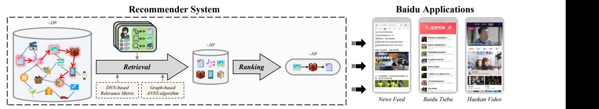
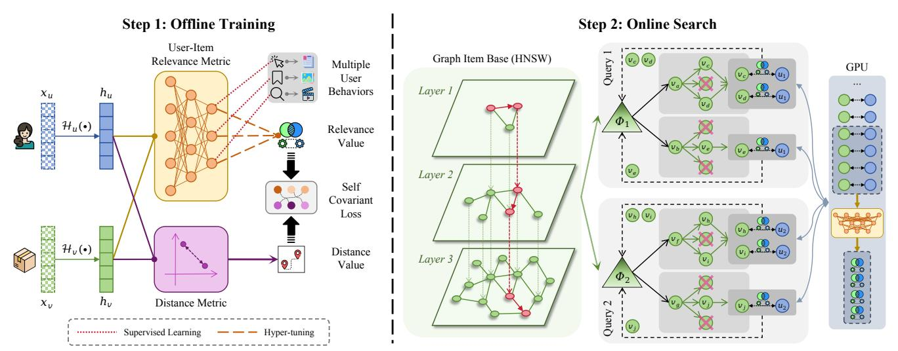
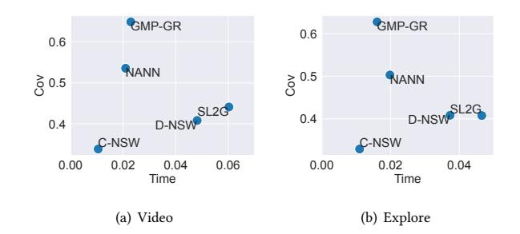
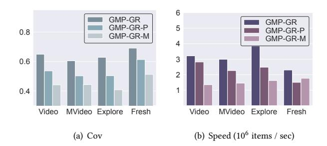
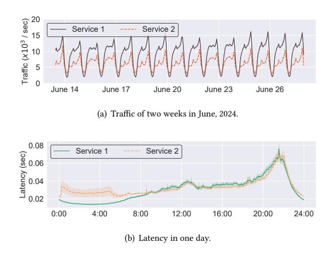
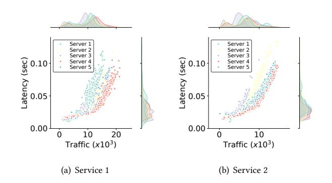
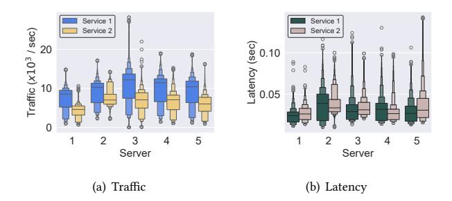
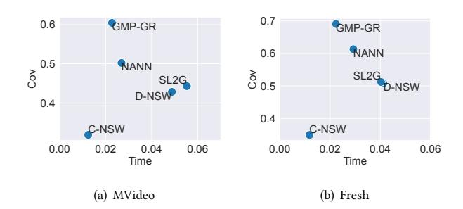
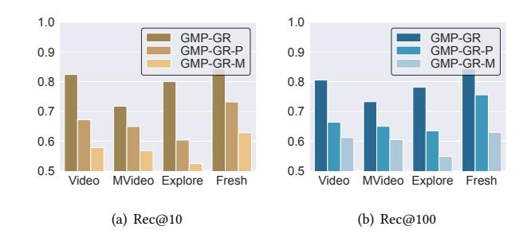

# GPU-accelerated Multi-relational Parallel Graph Retrieval for Web-scale Recommendations

Zhuoning Guo1 , Guangxing Chen2 , Qian Gao2 , Xiaochao Liao2 , Jianjia Zheng2 , Lu Shen2 , Hao Liu1,3 1The Hong Kong University of Science and Technology (Guangzhou), 2Baidu Inc.,

3The Hong Kong University of Science and Technology

zguo772@connect.hkust-gz.edu.cn,

{chenguangxing,gaoqian05,liaoxiaochao,zhengjianjia,shenlu}@baidu.com,liuh@ust.hk

# Abstract

Web recommendations provide personalized items from massive catalogs for users, which rely heavily on retrieval stages to trade off the effectiveness and efficiency of selecting a small relevant set from billion-scale candidates in online digital platforms. As one of the largest Chinese search engine and news feed providers, Baidu resorts to Deep Neural Network (DNN) and graph-based Approximate Nearest Neighbor Search (ANNS) algorithms for accurate relevance estimation and efficient search for relevant items. However, current retrieval at Baidu fails in comprehensive user-item relational understanding due to dissected interaction modeling, and performs inefficiently in large-scale graph-based ANNS because of suboptimal traversal navigation and the GPU computational bottleneck under high concurrency. To this end, we propose a GPUaccelerated Multi-relational Parallel Graph Retrieval (GMP-GR) framework to achieve effective yet efficient retrieval in web-scale recommendations. First, we propose a multi-relational user-item relevance metric learning method that unifies diverse user behaviors through multi-objective optimization and employs a self-covariant loss to enhance pathfinding performance. Second, we develop a hierarchical parallel graph-based ANNS to boost graph retrieval throughput, which conducts breadth-depth-balanced searches on a large-scale item graph and cost-effectively handles irregular neural computation via adaptive aggregation on GPUs. In addition, we integrate system optimization strategies in the deployment of GMP-GR in Baidu. Extensive experiments demonstrate the superiority of GMP-GR in retrieval accuracy and efficiency. Deployed across more than twenty applications at Baidu, GMP-GR serves hundreds of millions of users with a throughput exceeding one hundred million requests per second.

# Keywords

Recommender system, information retrieval, approximate nearest neighbor search, parallel computing

# 1 Introduction

Recently, recommender systems have become essential tools for helping users navigate various options and discover relevant products or content [\[30\]](#page-8-0). However, large-scale relevance evaluation based on user preference is computationally prohibitive in realworld recommendation applications [\[36\]](#page-8-1). For timely answering requirements, computing relevance values of billions of items is unacceptable [\[16\]](#page-8-2). To balance effectiveness and efficiency, retrievaland-ranking recommendation frameworks [\[4,](#page-8-3) [19\]](#page-8-4) have gained widespread adoption in modern industrial systems, such as YouTube [\[5\]](#page-8-5), LinkedIn [\[2\]](#page-8-6), and Pinterest [\[7\]](#page-8-7). The first stage (i.e., retrieval) focuses on retrieving a thousand-scale relevant subset from the entire billion-scale item catalog, which then serves as the candidates for further ordering in the second stage (i.e., ranking). In particular, retrieval plays an important role in real-time and satisfactory answers for large-scale queries. Effective retrieval can significantly simplify the search space for potential answers while maintaining personalization and serendipity, thus reducing the ranking difficulty in producing reliable final recommendations.

In this work, we focus on the retrieval stage in Baidu's web-scale recommendation scenarios, e.g., news feed, Tieba, and video clips. Recent works [\[3,](#page-8-8) [26\]](#page-8-9) establish the retrieval framework in a trainingand-search manner. Based on the complex relational dependencies modeling ability of Deep Neural Network (DNN) [\[34\]](#page-8-10), they attempt to train a DNN-based metric for more accurate user-item relevance estimation compared with simple functions [\[6,](#page-8-11) [27\]](#page-8-12). Nevertheless, real-time retrieval is difficult due to complicated neural computations on massive candidates. To solve the problem, researchers have been exploring the potential of Approximate Nearest Neighbor Search (ANNS) algorithms to mitigate extensive computations, which search for relatively relevant items for each query user by selectively visiting instead of the entire item base. Early works propose tree-based ANNS to organize data points in a tree-like structure by recursively splitting the dimensional space [\[10\]](#page-8-13). However, they underperform in web-scale recommendations that aim to retrieve divergent and high-dimensional information. Because they are sensitive to complex feature space and item relationships [\[29\]](#page-8-14). To improve retrieval effectiveness, the latest frameworks leverage graph-based ANNS algorithms that build similarity-based candidate graphs to efficiently expand the candidate set via graph traversal. For example, HNSW [\[21\]](#page-8-15) hierarchically establishes a multi-layer indexing graph, grounding coarse-to-fine navigation towards the most satisfactory candidates.

However, we confront three challenges in developing an accurate and efficient retrieval framework for web-scale recommendations. (1) Unified modeling of multi-relational user-item relevance. Baidu recommendation applications consist of dozens of distinct and related behaviors (e.g., click, browse) that are typically modeled by a tailored metric for estimating relevance between users and items. However, the independent modeling of these user-item interactions fails to capture the semantic relations of diverse user behaviors, which are mutually beneficial between them [\[26\]](#page-8-9). Besides, training multiple behavior-specific metrics incurs exponential efforts in system updates. Thus, the first challenge lies in cost-effectively multi-relational metric joint training for more accurate relevance estimation. (2) Efficient search on large-scale graph item base. Baidu

Figure 1: Applications of recommender systems at Baidu.

devises Graph-based ANNS to traverse relevant candidate items from a graph item base. Practically, a trade-off problem arises that increasing the online retrieval throughput will restrict the search efforts, i.e., the graph traversal steps. However, existing methods make delivering satisfactory items in limited steps difficult, especially for billion-scale graphs in web-scale recommender systems. On the one hand, neural relevance metrics often violate the triangle inequality, a property that ensures optimal pathfinding in graph traversal [\[3\]](#page-8-8). This violation forces the exploration of redundant edges, decreasing the possibility of reaching distant yet relevant candidates. On the other hand, graph-based ANNS usually search for relevant items greedily, which may be stuck in a narrow space after a short-length traversal among a large-scale graph. The inability to balance search depth and breadth degrades the quality of real-time recommendations. Addressing this challenge requires developing a search-compatible relevance metric and a deep-and-broad traversal algorithm for efficient graph search. (3) Accelerating irregular neural computation in high concurrency. At Baidu, users raise hundreds of millions of recommendation requests per second. These request executions are irregular because divergent user profiling drives distinct search paths, where the visited items should be estimated for their relevance by the neural metric. Baidu has developed a GPUaccelerated framework for web-scale recommendations to leverage the computational economy of GPUs [\[17\]](#page-8-16). However, their performance degrades under highly concurrent, non-uniform workloads because of frequent kernel launches, a process with fixed latency overhead that dominates runtime when computations are small and irregular [\[8\]](#page-8-17). Millions of sequential processes of deep relevance computations on a GPU cluster introduce bottlenecks of recommendation throughput. Therefore, the third challenge is redesigning computation scheduling to accelerate large-scale irregular neural computations for higher throughput.

To this end, we propose a GPU-accelerated Multi-relational Parallel Graph Retrieval (GMP-GR) framework for effective and efficient retrieval in web-scale recommendations. Specifically, we first devise a Multi-relational User-Item Relevance Metric Learning (MUIRML) to generate a practical DNN-based metric via multiobjective optimization. The metric extracts multi-relational knowledge in inter-dependent user behaviors to capture nuanced user preferences for accurate relevance measurement. We also infuse our metric's approximate triangle inequality property via a selfcovariant loss to navigate large graphs with shorter paths. Second, we design a Hierarchically Parallel Approximate Nearest Neighbor Search (HiPANNS) algorithm to achieve timely and accurate retrieval for highly concurrent queries. HiPANNS broadens the search

space of the large graph item base by divergent parallel and cooptimized search processes, which can efficiently generate more relevant candidates in real-time retrieval. Based on it, HiPANNS accelerates irregular neural computations from asynchronous requests by adaptive aggregation in a GPU-based cluster for higher retrieval throughput. In Baidu recommendation applications, we further apply several system optimization strategies, including traffic dispersal, compilation optimization, model quantization, and timely stream update. Extensive experiments demonstrate the superior retrieval effectiveness and efficiency of GMP-GR in offline retrieving evaluations and online recommendation services. Our framework has been deployed in more than twenty web-scale recommender systems at Baidu, where it efficiently handles over one hundred billion requests per day, improving more than 3% time of page for hundreds of millions of users.

The main contributions of our work are concluded as follows: (1) We propose a GPU-accelerated Multi-relational Parallel Graph Retrieval framework to achieve accurate and efficient retrieval for web-scale recommendations. (2) We devise a DNN-based metric to estimate user-item relevance via capturing inter-dependency among complex user-item relations, which can also improve the search efficiency on a large-scale graph for shorter navigation. (3) We design a GPU-accelerated parallel graph-based ANNS algorithm for highly concurrent retrieval by billion-scale breadth-depth balanced graph search and parallel irregular computations with adaptive aggregation. (4) We conduct extensive experiments to demonstrate retrieval effectiveness and efficiency improvements in offline and online recommendations at Baidu.

## 2 Preliminaries

Baidu has developed a recommendation framework as a comprehensive funnel mechanism to efficiently retrieve and rank items for users from a web-scale database for over twenty internet products (e.g., news feed, short video clips, search engine, and online advertising) [\[16\]](#page-8-2). The recommendation framework has served over one hundred billion requests for online recommendations made by hundreds of millions of users per day. Next, we detail the retrieval framework for Baidu recommendations, including the retrieval problem and the retrieval pipeline.

### 2.1 Online Retrieval at Baidu

Given ���� users {��1, ��2, · · · , ������ } and ���� items {��1, ��2, · · · , ������ }. Consider a query from a user �� with raw feature ����, the objective of the retrieval stage is to recommend the top-�� items that are most

Inter-candidate HiPANNS (C-HiPANNS) allows parallel search within the large-scale graph item base to broaden the global search space for more comprehensive retrieval. For each query ��, we aim to execute �� parallel search processes with different initial seeds ��. Each search process traverses the graph item base by visiting the most relevant neighbors. We jointly maintain candidates by a shared max heap �� that ranks �� current most relevant items among processes. In this work, we carry out the multi-processing at each layer of the HNSW graph, seeded with top-�� candidates ranked by �� of the last layer. The parallelized traversal achieves a ��-fold expansion of the search space, which yields more effective retrieval results.

Inter-query HiPANNS (Q-HiPANNS) adaptively aggregates irregular neural computations for more efficient GPU-accelerated retrieval against launch bound from extreme concurrency. We adaptively synchronize the irregular user-item relevance evaluation by a queuing aggregation scheme and parallelize batched neural computation on GPU for acceleration. First, we initialize a queue Ψ to persistently listen to neural computations. Ψ will record the computations orderly for the following sequential batching, i.e., the element received first will be batched first. Each element in Ψ is produced from C-HiPANNS as a group of (��, ��) pairs for measuring neighbor embedding similarity. We dynamically generate batches for parallel computing the GPU cluster �� . However, the elements of Ψ vary in amounts due to divergent connections in the graph item base, causing difficulties in aggregating fixed batches that are beneficial to fully utilize the computational ability of GPUs. To address that, we synthesize batches by adaptively slicing (��, ��) groups to fit certain configurations. Specifically, we set the maximum size of the computing batch as ���� . If the size of current batch ���� , ������ , is larger than the remaining space ��, we split it into two elements, including �� [1,�� ] �� = {(����,1, ����,1), · · · , (����,��, ����,�� )} and �� [��+1,������ = {(����,��+1, ����,��+1), · · · , (����,������ , ����,������ )}. �� [1,�� ] �� will be computed in the current executive round of �� while �� [��+1,������ will be computed in the next. The output values will be returned as estimations of the relevance between users and items during the processes of C-HiPANNS.

More details are presented in Appendix [A.1.](#page-9-0)

### 4 System Optimization

We devise various system optimization strategies to accelerate our retrieval framework deployed at Baidu.

### 4.1 Traffic Dispersal

We construct a communicative computing cluster composed of multiple interconnected servers designed to facilitate traffic dispersal and mitigate the effects of extreme query loads. Each server is equipped with a monitoring module that continuously assesses its computing load by analyzing available memory and current query traffic levels. When a server reaches its saturation point, it proactively requests assistance from its peer servers to redistribute the excess queries. The receiving servers will accept these queries if they possess adequate computational resources at that time. This approach significantly enhances overall system efficiency by optimizing the utilization of distributed computational resources.

#### 4.2 Compilation Optimization

Metric learning and graph search algorithms employ fundamental operators. To accelerate retrieval processes, we integrate these operators to minimize redundant computations based on existing techniques of computational graph optimization and pattern recognition [\[22\]](#page-8-20). Our system includes an automatic analysis module for operator kernel compilation, which aids in the optimization of neural computations for specific hardware configurations. Moreover, to address the launch bound issue that may affect computational performance on GPUs [\[28\]](#page-8-21), we abstract the execution process of DNN-based operations as a graph. This approach utilizes an adaptive bucketing mechanism to aggregate independent submissions of individual operations into a single, cohesive submission, thereby enhancing computational efficiency.

# 4.3 Model Quantization

We utilize a post-training quantization technique on the DNNbased relevance metric to decrease the computing costs with little accuracy loss. Specifically, we reduce the size of the entire MLP connection layers by quantizing the weights from 32-bit floating point numbers to 16-bit. After reductions, the metric only requires half of the size for computing and memorization and supports faster operators tailored for lower precise calculation. In large-scale recommendations, this method can reduce retrieval latency and significantly conserve computational resources on participating processing units for higher throughput.

# 4.4 Timely Stream Update

The user and item information is time-varying. To deliver accurate recommendations over time, it is crucial for the system to maintain up-to-date user and item representations and model parameters to reflect the evolving knowledge. However, increasing the freshness of this information necessitates more frequent updates, which can lead to higher training costs. To balance freshness and training costs, we first design a stepwise entry scheme to select active users and items via a dynamic threshold for timely updates. Besides, we use a click trigger that activates updates of the item base to incorporate items that occurred initially. Fresh data is then cumulatively integrated with the original item base in a batched manner to ensure both responsiveness and efficiency in handling data updates.

# 5 Experiments

This section introduces the experiments of GMP-GR under offline and online settings. Our goal is to answer the following questions through the investigation of results. Specifically, for offline experiments, (1) How accurate is GMP-GR in retrieving precisely relevant items? (2) How does the efficiency of GMP-GR compare to baseline retrieval frameworks? (3) What is the effectiveness of MUIRML and HiPANNS within GMP-GR? For online experiments, how does GMP-GR affect real-world recommendation statistics?

# 5.1 Experimental Setup

We present datasets, baselines, and metrics in our offline and online experiments. Besides, implementation details are provided in Appendix [A.2.](#page-9-1)

Table 1: Offline retrieval performance of different methods on four datasets for three metrics.

|        | Cov    | Video Rec@10 | Rec@100 | Cov    | MVideo Rec@10 | Rec@100 | Cov    | Explore Rec@10 | Rec@100 | Cov    | Fresh Rec@10 | Rec@100 |
|--------|--------|--------------|---------|--------|---------------|---------|--------|----------------|---------|--------|--------------|---------|
| C-NSW  | 0.3386 | 0.3829       | 0.4028  | 0.3185 | 0.3775        | 0.3986  | 0.3288 | 0.3486         | 0.3674  | 0.3493 | 0.3823       | 0.4084  |
| D-NSW  | 0.4084 | 0.5527       | 0.6094  | 0.4283 | 0.5428        | 0.5908  | 0.4081 | 0.5265         | 0.5376  | 0.5083 | 0.6075       | 0.6344  |
| SL2G   | 0.4413 | 0.5784       | 0.6121  | 0.4428 | 0.5684        | 0.6049  | 0.4076 | 0.5249         | 0.5485  | 0.5123 | 0.6285       | 0.6298  |
| NANN   | 0.5368 | 0.6717       | 0.6635  | 0.5021 | 0.6491        | 0.6498  | 0.5029 | 0.6038         | 0.6345  | 0.6130 | 0.7318       | 0.7555  |
| GMP-GR | 0.6492 | 0.8239       | 0.8052  | 0.6044 | 0.7175        | 0.7325  | 0.6279 | 0.7999         | 0.7810  | 0.6906 | 0.8420       | 0.8428  |

5.1.1 Datasets. We collect real-world video resources from Baidu applications and construct four datasets according to their potential of user satisfaction, including (1) Video: popular landscape videos, (2) MVideo: popular portrait videos, (3) Explore: videos that are potentially favorable but not popular, and (4) Fresh: videos that are uncommon and infrequently discovered.

5.1.2 Baselines. We adopt four retrieval baselines in offline experiments, including (1) C-NSW: a basic retrieval framework with cosine function as the relevance metric based on NSW [\[20\]](#page-8-22); (2) D-NSW: a DNN-based retrieval framework based on NSW, supervised by single user-item interaction; (3) SL2G [\[26\]](#page-8-9): a DNN-based retrieval framework based on HNSW [\[21\]](#page-8-15); and (4) NANN [\[3\]](#page-8-8): an industrial retrieval framework improved on SL2G with adversarial training and more efficient ANNS.

5.1.3 Metrics. For offline experiments, we involve three metrics in our evaluations on retrieval performance, including Coverage (Cov), Recall@10 (Rec@10), and Recall@100 (Rec@100). We take the bruteforce-sorted items as the ground truths of retrieval. Cov describes the percentage of retrieved items that rank in the top 100 items of the ground truths. Rec@10 and Rec@100 measure the percentage of the top 10 and 100 items of the ground truths in the top 10 and 100 retrieved items, respectively. Moreover, we evaluate the speed by the number of items retrieved per second. For online testing, we collect query traffic, latency, and throughput of servers for different services across timestamps.

### 5.2 Offline Evaluation

We evaluate the retrieval performance and efficiency of GMP-GR and baseline frameworks on four datasets in an offline environment.

5.2.1 Retrieval performance. Overall, GMP-GR consistently outperformed the baseline methods across all settings. For instance, GMP-GR demonstrated improvements of at least 20.94%, 22.66%, and 21.36% in terms of Cov, Rec@10, and Rec@100, respectively, on the Video dataset. Notably, significant improvements are also evident on other datasets. Specifically, compared to SL2G and NANN, two typical industrial retrieval frameworks consistently based on HNSW, GMP-GR produces more accurate retrieved results. GMP-GR achieved performance improvements of 20.37%, 24.86%, and 12.66% over SL2G and NANN on Cov on MVideo, Explore, and Fresh, respectively. The potential reasons are that (1) GMP-GR overcomes the shortage of SL2G that the neural metric may harm graph search efficiency due to the unsatisfaction of triangle inequality, and (2) GMP-GR incorporates valuable insights from dimensional

Figure 3: Analysis of correlations between retrieval performance and efficiency on Video and Explore datasets. Methods close to the left top (↖) have better retrieval performance, i.e., Cov (↑), with less time costs (←).

Table 2: Retrieval speed (items per second).

|        | Video   | MVideo  | Explore | Fresh   |
|--------|---------|---------|---------|---------|
| C-NSW  | 520,390 | 405,096 | 521,639 | 345,577 |
| D-NSW  | 163,093 | 163,821 | 199,163 | 170,889 |
| NANN   | 281,758 | 226,280 | 248,118 | 150,022 |
| SL2G   | 134,947 | 145,312 | 162,033 | 176,316 |
| GMP-GR | 321,352 | 299,242 | 384,458 | 229,902 |

interactive information in metric learning and leverages a broader search space for higher possibility of effective retrieval.

5.2.2 Efficiency analysis. This part analyzes the efficiency by testing their inference time and search speed. We first analyze the correlation between retrieval performance and time by scattering five methods in Figure [3.](#page-5-0) More results on MVideo and Fresh datasets are in Appendix [A.3.](#page-10-0) Intuitively, a method is considered more efficient if it achieves higher performance (here we use Cov to evaluate) with lower time consumption. Results reveal that GMP-GR outperforms the four baseline methods in terms of efficiency, as evidenced by its proximity to the upper left quadrant in the scatter plots. Notably, C-NSW stands out for its minimal retrieval time, attributed to its reliance on the cosine similarity metric which is computationally lightweight than DNNs. However, C-NSW underperforms in retrieval accuracy due to the limitation that the simple metric is unable to capture complex user-item relationships. Then, we compare the retrieval speed in Table [2,](#page-5-1) which reflects the number

Figure 4: Ablation study of GMP-GR on retrieval performance (Cov) and speed.

Table 3: Online user statistics for two services.

|        | Time on Page        | Daily Active Users  |
|--------|---------------------|---------------------|
|        | Service 1 Service 2 | Service 1 Service 2 |
| GMP-GR | +1.13% 1.19%        | +0.23% +0.50%       |

of nodes that methods traverse on HNSW per second. GMP-GR also exhibits the capability to search through more nodes (i.e., larger search space) than any DNN-based approach. In summary, GMP-GR successfully defeats all baseline methods, striking an optimal balance between retrieval efficiency and accuracy.

5.2.3 Ablation study. We conduct an ablation study on GMP-GR in Figure [4,](#page-6-0) by comparing it with two variants, i.e., GMP-GR-P and GMP-GR-M. Evaluations on Rec@10 and Rec@100 are provided in Appendix [A.4.](#page-10-1) GMP-GR-P replaces MUIRML with a single supervision of the behavior in which a user visits an item, and GMP-GR-M substitutes HiPANNS with a standard HNSW search algorithm. Specifically, we find that GMP-GR consistently outperforms both GMP-GR-P and GMP-GR-M across different datasets. This superiority can be attributed to two key factors. First, MUIRML significantly enhances the relevance estimation accuracy and pathfinding efficiency. Second, HiPANNS prevents the graph-based ANNS process from succumbing to local optima by distributed and co-optimized search. In addition, GMP-GR also shows a notable advantage in retrieval speed that replacing HiPANNS with a standard HNSW search algorithm can result in a great degradation of retrieval speed. This observation underscores the pivotal role of HiPANNS in acceleration. Furthermore, a more effective user-item relevance metric not only enhances the accuracy but also reduces traversal steps to converge to optimal candidates.

### 5.3 Online Testing

We deploy GMP-GR in the Baidu Mobile APP for two services supported by five servers for online testing. Service 1 is for the main recommendation list on the initial page. Service 2 is for the next recommendation sequence that can be accessed after clicking on a video in immersive mode.

5.3.1 Time on page and daily active users. Table [3](#page-6-1) depicts the impact of deploying GMP-GR on time on page and daily active users. Our

Figure 5: Temporal statistics of traffic and latency.

Figure 6: Analysis of distributions of traffic and latency.

results indicate a significant improvement in time on page and daily active users across the two services. The integral components of GMP-GR, MUIRML, and HiPANNS, contribute to a 0.57% and 0.23% improvement in time on page, respectively. Our findings suggest that the deployment of GMP-GR with improved modules has positively impacted user engagement and satisfaction.

5.3.2 Query throughput. We also examine the query throughput influenced by the system acceleration strategies. The results demonstrate a strong improvement in query throughput, with an approximate doubling of throughput in the two services. Specifically, our analysis shows that the compilation optimization has led to a 74% and 75% increase in throughput by simplifying the computational graphs. Similarly, the model quantization has resulted in a 26% and 25% increase in throughput by decreasing DNN-based calculations. These findings underscore the effectiveness of GMP-GR in optimizing query processing and system efficiency.

5.3.3 Statistical analysis of traffic and latency. We collect traffic and latency statistics per second, which are distributedly recorded

Figure 7: Traffic and latency distributions.

at five servers in two services. First, we examine the temporal patterns as shown in Figure [5.](#page-6-2) Specifically, Figure [5\(a\)](#page-6-3) illustrates the traffic trends over a two-week period, highlighting periodic fluctuations in query volumes. Meanwhile, Figure [5\(b\)](#page-6-4) provides a more granular view of latency statistics over a 24-hour cycle, revealing variations in online response times in one day. Moreover, we investigate the distributions of traffic and latency and explore their correlations in Figure [6.](#page-6-5) The result indicates a direct relationship between query traffic and latency, with higher traffic volumes leading to longer response times. Furthermore, we observe distinct patterns in the latency-traffic relationships across five servers, reflecting divergence in computational resources and workload distribution. Finally, we summarize the traffic and latency statistics across five servers in Figure [7,](#page-7-0) providing insights into the performance characteristics in terms of query processing and response times.

#### 6 Related Works

In this section, we review the related works for our study, including deep neural network-based recommender systems and approximate nearest neighbor search.

### 6.1 Deep Neural Network-based Recommender Systems

Deep Neural Network (DNN) has become a popular tool for recommendation systems due to its ability to capture intricate user-item interaction patterns through nonlinear transformations [\[34\]](#page-8-10). For example, [\[33\]](#page-8-23) leverages convolutional and recurrent neural networks for recommendations to extract features from images and deep sequential models to learn text features from tweets. Recently, neural collaborative filtering has been increasingly adopted, where a Multi-layer Perceptron (MLP) is deployed to approximate the interaction function and has significant performance gains over traditional methods [\[12\]](#page-8-24). Along with the idea, two-tower architectures have become popular in DNN-based recommender systems [\[32\]](#page-8-25). They train dual encoders for users and items, respectively, which generate user and item representations for downstream operations such as relevance evaluation. With two sets of high-dimensional embeddings, the DNN-based system can provide recommendations in user-based or item-based paradigms [\[15\]](#page-8-26). User-based collaborative filtering compares similarities between users based on their past ratings and recommends items liked by similar users [\[35\]](#page-8-27). In contrast, item-based collaborative filtering computes similarities

between items rather than between users [\[31\]](#page-8-28). We design a DNNbased metric optimized in a multi-objective way to incorporate comprehensive behaviors and triangle inequality for better recommendation accuracy and efficiency.

#### 6.2 Approximate Nearest Neighbor Search

Approximate Nearest Neighbor Search (ANNS) is a fundamental problem in computer science, particularly within domains that handle high-dimensional data such as computer vision [\[1\]](#page-8-29) and multimedia [\[9\]](#page-8-30). ANNS aims to find points in a dataset that are close to a query point, typically in high-dimensional spaces, where searching the exact nearest neighbor is computationally prohibitive [\[18\]](#page-8-31). One of the early approaches, KD-tree [\[10\]](#page-8-13), performs well in lowdimensional spaces. But their efficiency decreases significantly as dimensionality increases, a phenomenon known as the "curse of dimensionality". To address the limitation, more sophisticated treebased structures like Randomized KD-trees [\[25\]](#page-8-32) attempt to partition the data space more effectively and offer improved performance in higher-dimensional spaces. As research progressed, hashingbased methods emerged as a powerful alternative for ANNS, with Locality-Sensitive Hashing (LSH) being a prominent technique to hash input items by mapping similar items to the same "buckets" with high probability [\[13\]](#page-8-33). More recently, graph-based methods have gained popularity for their effectiveness in handling highdimensional ANNS [\[29\]](#page-8-14). The idea is to construct a graph where nodes represent the dataset points, and edges connect points close to each other. Navigating this graph allows for efficient ANN searches. Notably, the Navigable Small World (NSW) [\[20\]](#page-8-22) and its improved variant, Hierarchical Navigable Small World (HNSW) [\[21\]](#page-8-15), have shown remarkable performance, significantly outperforming previous methods on large-scale datasets. Besides, instead of Delaunay graphs, other graph-based approaches choose K-nearest neighbor graph [\[11\]](#page-8-34) and relative neighborhood graph [\[14\]](#page-8-35) for index construction. In industrial applications, SL2G [\[26\]](#page-8-9) first leverages DNN as the relevance metric for graph-based ANNS in real-world recommendations. NANN [\[3\]](#page-8-8) extends SL2G by improving the DNN-based metric for better accuracy and adaptivity and working ANNS with controllable costs for industrial requirements. In this work, we propose a parallel retrieval algorithm for web-scale recommendations with wider search space and better concurrent computational efficiency.

#### 7 Conclusion

This work investigates the retrieval stage optimization for the webscale recommendation. We propose a GMP-GR framework to enhance the retrieval accuracy and efficiency. First, we devise multirelational user-item relevance metric learning to improve user-item multi-relational understanding and graph search efficiency in a multi-objective way. Second, we design a tailored parallel graphbased ANNS algorithm to distributedly broaden search space and parallelize irregular neural computations on GPUs. Besides, we employ system optimization strategies to improve online recommendation performance. We conduct extensive experiments on offline datasets and online services to demonstrate the outperformance of GMP-GR. We have implemented GMP-GR in the recommender systems at Baidu, where it serves hundreds of millions of users and processes more than one hundred billion online requests per day.

References [1] Nir Ben-Zrihem and Lihi Zelnik-Manor. 2015. Approximate nearest neighbor fields in video. In Proceedings of the IEEE Conference on Computer Vision and Pattern Recognition. 5233–5242. [2] Fedor Borisyuk, Krishnaram Kenthapadi, David Stein, and Bo Zhao. 2016. CaS-MoS: A framework for learning candidate selection models over structured queries and documents. In Proceedings of the 22nd ACM SIGKDD International Conference on Knowledge Discovery and Data Mining. 441–450. [3] Rihan Chen, Bin Liu, Han Zhu, Yaoxuan Wang, Qi Li, Buting Ma, Qingbo Hua, Jun Jiang, Yunlong Xu, Hongbo Deng, et al. 2022. Approximate nearest neighbor search under neural similarity metric for large-scale recommendation. In Proceedings of the 31st ACM International Conference on Information & Knowledge Management. 3013–3022. [4] Heng-Tze Cheng, Levent Koc, Jeremiah Harmsen, Tal Shaked, Tushar Chandra, Hrishi Aradhye, Glen Anderson, Greg Corrado, Wei Chai, Mustafa Ispir, et al. 2016. Wide & deep learning for recommender systems. In Proceedings of the 1st workshop on deep learning for recommender systems. 7–10. [5] Paul Covington, Jay Adams, and Emre Sargin. 2016. Deep neural networks for youtube recommendations. In Proceedings of the 10th ACM conference on recommender systems. 191–198. [6] Mostafa Dehghani, Hamed Zamani, Aliaksei Severyn, Jaap Kamps, and W Bruce Croft. 2017. Neural ranking models with weak supervision. In Proceedings of the 40th international ACM SIGIR conference on research and development in information retrieval. 65–74. [7] Chantat Eksombatchai, Pranav Jindal, Jerry Zitao Liu, Yuchen Liu, Rahul Sharma, Charles Sugnet, Mark Ulrich, and Jure Leskovec. 2018. Pixie: A system for recommending 3+ billion items to 200+ million users in real-time. In Proceedings of the 2018 world wide web conference. 1775–1784. [8] Izzat El Hajj, Juan Gómez-Luna, Cheng Li, Li-Wen Chang, Dejan Milojicic, and Wen-mei Hwu. 2016. KLAP: Kernel launch aggregation and promotion for optimizing dynamic parallelism. In 2016 49th Annual IEEE/ACM International Symposium on Microarchitecture (MICRO). IEEE, 1–12. [9] Hakan Ferhatosmanoglu, Ertem Tuncel, Divyakant Agrawal, and Amr El Abbadi. 2001. Approximate nearest neighbor searching in multimedia databases. In Proceedings 17th International Conference on Data Engineering. IEEE, 503–511. [10] Jerome H Friedman, Jon Louis Bentley, and Raphael Ari Finkel. 1977. An algorithm for finding best matches in logarithmic expected time. ACM Transactions on Mathematical Software (TOMS) 3, 3 (1977), 209–226. [11] Cong Fu and Deng Cai. 2016. Efanna: An extremely fast approximate nearest neighbor search algorithm based on knn graph. arXiv preprint arXiv:1609.07228 (2016). [12] Xiangnan He, Lizi Liao, Hanwang Zhang, Liqiang Nie, Xia Hu, and Tat-Seng Chua. 2017. Neural collaborative filtering. In Proceedings of the 26th international conference on world wide web. 173–182. [13] Piotr Indyk and Rajeev Motwani. 1998. Approximate nearest neighbors: towards removing the curse of dimensionality. In Proceedings of the thirtieth annual ACM symposium on Theory of computing. 604–613. [14] Suhas Jayaram Subramanya, Fnu Devvrit, Harsha Vardhan Simhadri, Ravishankar Krishnawamy, and Rohan Kadekodi. 2019. Diskann: Fast accurate billion-point nearest neighbor search on a single node. Advances in Neural Information Processing Systems 32 (2019). [15] Hyeyoung Ko, Suyeon Lee, Yoonseo Park, and Anna Choi. 2022. A survey of recommendation systems: recommendation models, techniques, and application fields. Electronics 11, 1 (2022), 141. [16] Hao Liu, Qian Gao, Jiang Li, Xiaochao Liao, Hao Xiong, Guangxing Chen, Wenlin Wang, Guobao Yang, Zhiwei Zha, Daxiang Dong, et al. 2021. Jizhi: A fast and cost-effective model-as-a-service system for web-scale online inference at baidu. In Proceedings of the 27th ACM SIGKDD Conference on Knowledge Discovery & Data Mining. 3289–3298. [17] Hao Liu, Qian Gao, Xiaochao Liao, Guangxing Chen, Hao Xiong, Silin Ren, Guobao Yang, and Zhiwei Zha. 2022. Lion: A GPU-accelerated online serving system for web-scale recommendation at Baidu. In Proceedings of the 28th ACM SIGKDD Conference on Knowledge Discovery and Data Mining. 3388–3397. [18] Ting Liu, Andrew Moore, Ke Yang, and Alexander Gray. 2004. An investigation of practical approximate nearest neighbor algorithms. Advances in neural information processing systems 17 (2004). [19] Jiaqi Ma, Zhe Zhao, Xinyang Yi, Ji Yang, Minmin Chen, Jiaxi Tang, Lichan Hong, and Ed H Chi. 2020. Off-policy learning in two-stage recommender systems. In Proceedings of The Web Conference 2020. 463–473. [20] Yury Malkov, Alexander Ponomarenko, Andrey Logvinov, and Vladimir Krylov. 2014. Approximate nearest neighbor algorithm based on navigable small world graphs. Information Systems 45 (2014), 61–68. [21] Yu A Malkov and Dmitry A Yashunin. 2018. Efficient and robust approximate nearest neighbor search using hierarchical navigable small world graphs. IEEE transactions on pattern analysis and machine intelligence 42, 4 (2018), 824–836. [22] Wei Niu, Jiexiong Guan, Yanzhi Wang, Gagan Agrawal, and Bin Ren. 2021. Dnnfusion: accelerating deep neural networks execution with advanced operator fusion. In Proceedings of the 42nd ACM SIGPLAN International Conference on Programming Language Design and Implementation. 883–898. [23] Hiroyuki Ootomo, Akira Naruse, Corey Nolet, Ray Wang, Tamas Feher, and Yong Wang. 2024. Cagra: Highly parallel graph construction and approximate nearest neighbor search for gpus. In 2024 IEEE 40th International Conference on Data Engineering (ICDE). IEEE, 4236–4247. [24] Zaifeng Pan, Zhen Zheng, Feng Zhang, Ruofan Wu, Hao Liang, Dalin Wang, Xiafei Qiu, Junjie Bai, Wei Lin, and Xiaoyong Du. 2023. Recom: A compiler approach to accelerating recommendation model inference with massive embedding columns. In Proceedings of the 28th ACM International Conference on Architectural Support for Programming Languages and Operating Systems, Volume 4. 268–286. [25] Chanop Silpa-Anan and Richard Hartley. 2008. Optimised KD-trees for fast image descriptor matching. In 2008 IEEE Conference on Computer Vision and Pattern Recognition. IEEE, 1–8. [26] Shulong Tan, Zhixin Zhou, Zhaozhuo Xu, and Ping Li. 2020. Fast item ranking under neural network based measures. In Proceedings of the 13th International Conference on Web Search and Data Mining. 591–599. [27] Yi Tay, Luu Anh Tuan, and Siu Cheung Hui. 2018. Latent relational metric learning via memory-based attention for collaborative ranking. In Proceedings of the 2018 world wide web conference. 729–739. [28] Jin Wang and Sudhakar Yalamanchili. 2014. Characterization and analysis of dynamic parallelism in unstructured GPU applications. In 2014 IEEE International Symposium on Workload Characterization (IISWC). IEEE, 51–60. [29] Mengzhao Wang, Xiaoliang Xu, Qiang Yue, and Yuxiang Wang. 2021. A comprehensive survey and experimental comparison of graph-based approximate nearest neighbor search. Proceedings of the VLDB Endowment 14, 11 (2021), 1964–1978. [30] Le Wu, Xiangnan He, Xiang Wang, Kun Zhang, and Meng Wang. 2022. A survey on accuracy-oriented neural recommendation: From collaborative filtering to information-rich recommendation. IEEE Transactions on Knowledge and Data Engineering 35, 5 (2022), 4425–4445. [31] Feng Xue, Xiangnan He, Xiang Wang, Jiandong Xu, Kai Liu, and Richang Hong. 2019. Deep item-based collaborative filtering for top-n recommendation. ACM Transactions on Information Systems (TOIS) 37, 3 (2019), 1–25. [32] Ji Yang, Xinyang Yi, Derek Zhiyuan Cheng, Lichan Hong, Yang Li, Simon Xiaoming Wang, Taibai Xu, and Ed H Chi. 2020. Mixed negative sampling for learning two-tower neural networks in recommendations. In Companion proceedings of the web conference 2020. 441–447. [33] Qi Zhang, Jiawen Wang, Haoran Huang, Xuanjing Huang, and Yeyun Gong. 2017. Hashtag recommendation for multimodal microblog using co-attention network. In Proceedings of the 26th International Joint Conference on Artificial Intelligence. 3420–3426. [34] Shuai Zhang, Lina Yao, Aixin Sun, and Yi Tay. 2019. Deep learning based recommender system: A survey and new perspectives. ACM computing surveys (CSUR) 52, 1 (2019), 1–38. [35] Zhipeng Zhang, Mianxiong Dong, Kaoru Ota, and Yasuo Kudo. 2020. Alleviating new user cold-start in user-based collaborative filtering via bipartite network. IEEE Transactions on Computational Social Systems 7, 3 (2020), 672–685. [36] Han Zhu, Xiang Li, Pengye Zhang, Guozheng Li, Jie He, Han Li, and Kun Gai. 2018. Learning tree-based deep model for recommender systems. In Proceedings of the 24th ACM SIGKDD international conference on knowledge discovery & data mining. 1079–1088.

|       |   | Video     | MVideo    | Explore   | Fresh   |
|-------|---|-----------|-----------|-----------|---------|
| Layer | 1 | 281       | 214       | 210       | 78      |
| Layer | 2 | 4,676     | 3,560     | 3,530     | 1,249   |
| Layer | 3 | 79,249    | 61,246    | 60,679    | 20,874  |
| Layer | 4 | 1,335,473 | 1,033,857 | 1,024,531 | 355,585 |

### A.3 Additional Efficiency Analysis

Here we analyze the efficiency in terms of inference time and search speed on MVideo and Fresh datasets by scattering results of five methods in Figure [8.](#page-10-2)

Figure 8: Analysis of correlations between retrieval performance and efficiency on four datasets. Methods close to the left top (↖) have better retrieval performance, i.e., Cov (↑), with less time costs (←).

### A.4 Additional Ablation Study

In this subsection, we conduct a further ablation study by comparing GMP-GR with GMP-GR-P and GMP-GR-M according to the evaluated results by Rec@10 and Rec@100 in Figure [9.](#page-10-3)

Figure 9: Additional ablation study of GMP-GR on retrieval performance (Rec@10 and Rec@100).