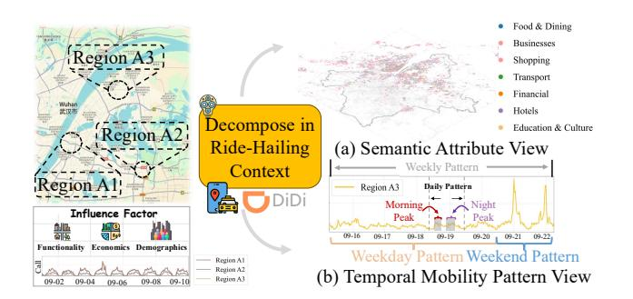
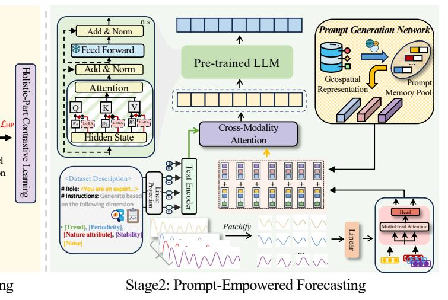
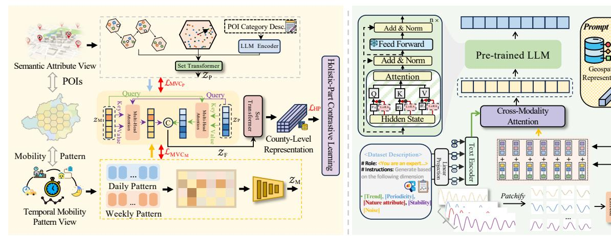
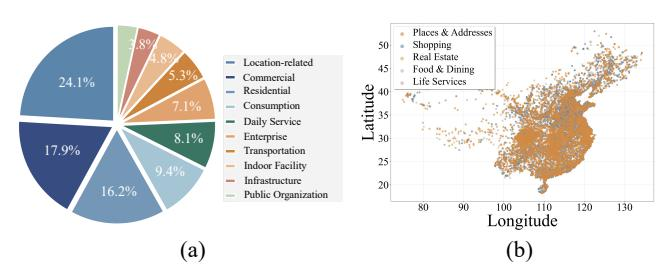
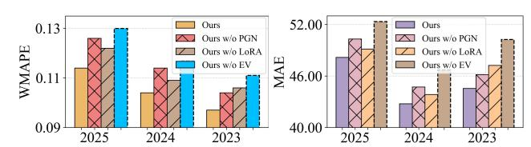
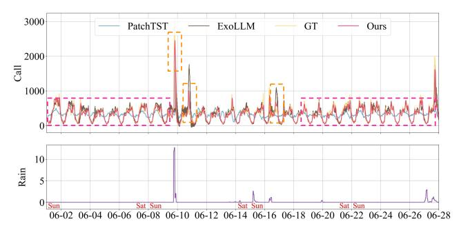
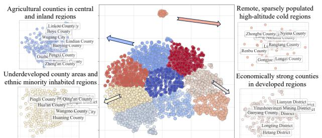
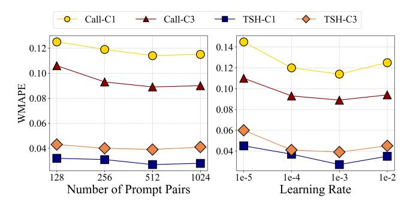
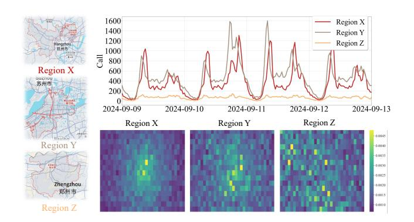
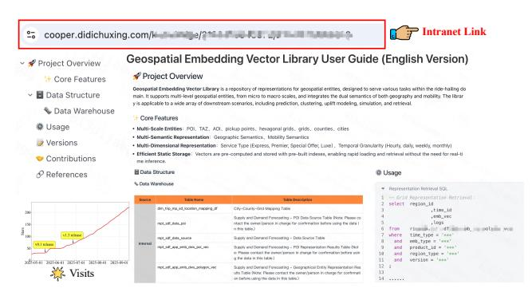

# Enhancing Ride-Hailing Forecasting at DiDi with Multi-View Geospatial Representation Learning from the Web

Xixuan Hao† The Hong Kong University of Science and Technology (Guangzhou) Guangzhou, China xhao390@connect.hkust-gz.edu.cn

Guicheng Li† China University of Geoscience (Wuhan) Wuhan, China liguicheng@cug.edu.cn

Daiqiang Wu Didichuxing Co. Ltd Beijing, China wudaiqiang@didiglobal.com

Xusen Guo The Hong Kong University of Science and Technology (Guangzhou) Guangzhou, China xguo796@connect.hkust-gz.edu.cn

Yumeng Zhu Didichuxing Co. Ltd Beijing, China zhuyumeng@didiglobal.com

Zhichao Zou Didichuxing Co. Ltd Beijing, China zouzhichao@didiglobal.com

Peng Zhen Didichuxing Co. Ltd Beijing, China zhenpeng@didiglobal.com

Yao Yao China University of Geoscience (Wuhan) Wuhan, China yaoy@cug.edu.cn

Yuxuan Liang‡ The Hong Kong University of Science and Technology (Guangzhou) Guangzhou, China yuxliang@outlook.com

# Abstract

The proliferation of ride-hailing services has fundamentally transformed urban mobility patterns, making accurate ride-hailing forecasting crucial for optimizing passenger experience and urban transportation efficiency. However, ride-hailing forecasting faces significant challenges due to geospatial heterogeneity and high susceptibility to external events. This paper proposes MVGR-Net (Multi-View Geospatial Representation Learning), a novel framework that addresses these challenges through a two-stage approach. In the pretraining stage, we learn comprehensive geospatial representations by integrating Points-of-Interest and temporal mobility patterns to capture regional characteristics from both semantic attribute and temporal mobility pattern views. The forecasting stage leverages these representations through a prompt-empowered framework that fine-tunes Large Language Models while incorporating external events. Extensive experiments on DiDi's real-world datasets demonstrate the state-of-the-art performance.

# CCS Concepts

• Mathematics of computing → Time series analysis.

## Keywords

Web Mining; Ride-Hailing Forecasting; Geospatial Representation; LLMs; Prompt Learning; Heterogeneity

© 2026 Copyright held by the owner/author(s). ACM ISBN 979-8-4007-2307-0/2026/04 <https://doi.org/10.1145/3774904.3792789>

### ACM Reference Format:

Xixuan Hao, Guicheng Li, Daiqiang Wu, Xusen Guo, Yumeng Zhu, Zhichao Zou, Peng Zhen, Yao Yao, and Yuxuan Liang. 2026. Enhancing Ride-Hailing Forecasting at DiDi with Multi-View Geospatial Representation Learning from the Web. In Proceedings of the ACM Web Conference 2026 (WWW '26), April 13–17, 2026, Dubai, United Arab Emirates. ACM, New York, NY, USA, [12](#page-11-0) pages. <https://doi.org/10.1145/3774904.3792789>

Figure 1: Geospatial Heterogeneity and its two principal view in the context of ride-hailing services.

# 1 Introduction

With the rapid expansion of the World Wide Web, interconnectivity has induced a profound transformation in the way humans live. The subsequent emergence and rapid development of mobile Internet have given rise to a multitude of online services, among which ride-hailing platforms serve as prominent representatives. As an exemplary web-data-driven service, the proliferation of ridehailing has fundamentally reshaped urban mobility patterns. It has significantly enhanced transportation accessibility and flexibility, while simultaneously catalyzing innovations in intelligent transportation systems (ITS) and urban governance. Ride-hailing forecasting [\[15,](#page-8-0) [41,](#page-8-1) [42,](#page-8-2) [62\]](#page-9-0) endeavors to predict temporal dynamics

†Equal Contribution.

‡Corresponding author. Email: yuxliang@outlook.com

[This work is licensed under a Creative Commons Attribution 4.0 International License.](https://creativecommons.org/licenses/by/4.0) WWW '26, Dubai, United Arab Emirates.

of key supply-demand indicators, such as Calls and Total Supply Hours (TSH), by leveraging historical transactional data in conjunction with exogenous variables including seasonal holidays and meteorological conditions. Accurate ride-hailing forecasting enables optimization of passenger experience, enhancement of platform operational efficiency, mitigation of traffic congestion, and advancement of urban intelligent transportation ecosystems.

However, ride-hailing indicators, due to their close relationship with urban mobility patterns, exhibit unique inherent characteristics such as significant geospatial heterogeneity, and high susceptibility to external events [\[42,](#page-8-2) [50,](#page-9-1) [68\]](#page-9-2). These properties render the task of achieving accurate ride-hailing forecasting a formidable challenge. Existing studies [\[26,](#page-8-3) [36,](#page-8-4) [39,](#page-8-5) [67\]](#page-9-3) commonly formulate ridehailing forecasting as a spatio-temporal prediction problem [\[27\]](#page-8-6), influenced by both historical time-series patterns and spatial dependencies across regions. However, our empirical analysis of DiDi's operational data reveals that temporal dependencies exert a dominant role, driven by human mobility patterns across daily, weekly, and seasonal cycles. Conversely, given that the spatial hierarchy of ride-hailing forecasting extends down to the county level, the geographic distance between counties and variations in their internal transportation conditions lead to a relatively limited impact on ridehailing indicators of adjacent counties. Consequently, we formulate ride-hailing forecasting as a time series forecasting problem.

As a specific application of time series forecasting, ride-hailing forecasting possesses a unique and pronounced characteristic: Geospatial Heterogeneity. As illustrated in the left panel of Figure [1,](#page-0-0) three regions with diverse urban contexts exhibit varying Call patterns that are correlated with regional factors encompassing functionality, economics, and demographics. From our industrial practice, a region's identity can be characterized by two fundamental aspects, as shown in the right panel of Figure [1:](#page-0-0) (1) Semantic Attribute View. The static identity of a region is characterized by its semantic attributes, exemplified by the distribution of Points-of-Interest (POIs), which encapsulate its functional characteristics and operational purpose. (2) Temporal Mobility Pattern View. The dynamic essence of a region is captured through temporal mobility patterns, which delineate its operational rhythm across various temporal cycles, from intra-day patterns (e.g., morning / evening peaks) to weekly trends (e.g., weekday / weekend shifts). Effectively synergizing these static and dynamic dimensions is crucial for achieving accurate ride-hailing forecasting.

In recent years, the advent of Large Language Models (LLMs) [\[2,](#page-8-7) [12,](#page-8-8) [40\]](#page-8-9) has begun to shift the paradigm in time series forecasting [\[30\]](#page-8-10). Characterized by their profound generalization abilities [\[5\]](#page-8-11) and world-scale knowledge bases [\[45\]](#page-8-12), LLMs exhibit a distinct advantage in this domain [\[30\]](#page-8-10). Nevertheless, in specialized domains with a scarcity of open-source data, such as ride-hailing forecasting, the direct application of these models faces significant challenges due to their inherent deficiency in specialized domain knowledge. Therefore, to enhance the adaptability of LLMs for ride-hailing forecasting tasks, we propose augmenting them with the following two types of priors: (1) Geospatial Heterogeneity Prior. As previously analyzed, geospatial heterogeneity, reflecting intrinsic disparities in urban functionality, economic profiles, and demographic composition, underpins the diverse demand patterns across a region. Consequently, explicitly introducing this factor is crucial

for developing more precise and context-aware forecasting models. (2) External Event Prior. Ride-hailing supply-demand dynamics are shaped not only by the platform's own operational cycles but also by exogenous events including weather, holidays, and special activities (e.g., concerts, sporting events) [\[42,](#page-8-2) [50,](#page-9-1) [68\]](#page-9-2). The sporadic and often unpredictable nature of such events makes them notoriously difficult to model using methods that rely solely on historical pattern mining. Therefore, incorporating an External Event Prior stays essential for enhancing the responsiveness to external events of ride-hailing forecasting systems.

In this paper, we propose a Multi-View Geospatial Representation Learning (MVGR-Net) framework for Ride-Hailing Forecasting. The proposed framework comprises two sequential stages: a pretraining stage designed to address the challenge of geospatial heterogeneity by learning comprehensive geospatial representations, and a subsequent forecasting stage that leverages these representations and further incorporates external events and textual descriptions to enhance ride-hailing forecast performance. In the pretraining stage, we incorporate two complementary data modalities — POIs and temporal mobility patterns — to capture geospatial heterogeneity across different regions from both semantic attribute and temporal mobility pattern views. A dual cross-attention mechanism, coupled with an attentional pooling module, produces the final comprehensive geospatial representations. In the subsequent ride-hailing forecasting stage, through the integration of multi-view geospatial representation, an elaborated prompt generation network effectively identifies underlying and shared regional properties, and subsequently learns to adaptively utilize these properties to generate informative prompt features that enhance predictive performance. Additionally, contextual factors are captured by integrating three key external variables: rainfall, holidays, and special events.

In summary, our contributions lie in the following aspects:

- Multi-View Geospatial Representation Learning. To the best of our knowledge, this is the first attempt to conduct pre-trained modeling from both semantic attribute view and temporal mobility pattern view to enhance ride-hailing forecasting.
- Prompt-Empowered Ride-Hailing Forecasting. We propose a promptempowered framework for fine-tuning LLMs on the task of ridehailing forecasting, which simultaneously incorporates both external factors and textual descriptions.
- Extensive empirical studies. We conduct extensive experiments over DiDi's real-world datasets. The results demonstrate that our model achieves state-of-the-art performance with an average improvement of 1.8% for Call and 1.5% for TSH prediction.
- Practical deployment. Our proposed method has been successfully deployed on the DiDi platform. We demonstrate the system's user interface, geospatial embedding vector library, and an Intelligent Subsidy Allocation experiment to showcase our practicality.

# 2 Preliminary

Problem Setting. In ride-hailing forecasting, we are given a historical ride-hailing series �� = {����−��+1:�� } ∈ R ��×���� , where �� is the look-back window size, ���� denotes the number of regions. Our goal is to learn a forecasting model �� (·), which predicts the future �� time steps of the series, ��ˆ = {����+1:��+�� } ∈ R �� ×���� , based on historical observations ��.

Stage1: Multi-View Geospatial Representation Learning

Figure 2: The Overall Framework of **MVGR-Net**.

Ride-hailing indicators can be classified into two categories: supply-side and demand-side.

- Call: The total number of passenger-initiated ride requests within a specified time frame, acting as the core indicator of user demand.
- Total Supply Hour (TSH): The aggregate in-service duration of all drivers on the platform. It serves as a core indicator for measuring transport capacity supply.

We also incorporate three external variables identified through operational practice as most impactful on ride-hailing forecasting: Rainfall, Holidays, and Special Events (e.g., concerts and national examinations). More details can be found in Appendix [D.](#page-10-0)

### 3 Methodology

In this section, we present details of our proposed MVGR-Net in Figure [2,](#page-2-0) which consists of two main stages:

- Stage 1: Our proposed Multi-View Geospatial Representation Learning framework comprises two complementary branches that model geospatial heterogeneity from semantic attribute view and temporal mobility pattern view, respectively. The framework then facilitates cross-view adaptive interaction through a dual attention mechanism coupled with gated fusion operations.
- Stage 2: In the forecasting phase, the time series data initially interacts with external variables and is then augmented with prompt-empowered geospatial representations from Stage 1. Subsequently, this enhanced representation undergoes cross-modal interaction with domain-specific text features. Finally, the resulting feature is fed into a pre-trained LLM, which is fine-tuned using Low-Rank Adaptation (LoRA) to generate predictions.

In industrial applications, the DiDi platform's ride-hailing forecasts currently operate fundamentally at the county level. However, China's county-level administrative units' size disparities (hundreds to thousands of square kilometers [\[1\]](#page-8-13)) hinder fine-grained geospatial heterogeneity modeling. As a result, we commence our representation learning at a finer-grained grid level (hexagonal cells with 600m edge length) and subsequently aggregate incrementally upward to the county level.

### 3.1 Multi-View Geospatial Representation Learning

Semantic Attribute View Modeling. The distribution of POIs reflects a region's functional characteristics and operational purpose [\[56\]](#page-9-4). To comprehensively model the semantic information behind POIs, we construct a multi-faceted representation by capturing their features from three diverse perspectives. ❶ Spatial Proximity [\[59\]](#page-9-5). Leveraging a K-Nearest Neighbors (KNN) approach, we capture the distributional characteristics of POIs within their local spatial context. For each POI �� , its �� nearest neighbors �� ∈ N�� (�� ) are retrieved based on spatial distance. �� is the corresponding onehot category vector associated with �� �� , which are then passed through an encoder ���� (·) to obtain their feature representations. The encoder consists of an embedding layer followed by a multilayer perceptron (MLP). We denote the final spatial proximity representation as Z��1 = ���� (�� ). �� �� primarily contributes during training, with details provided in Appendix [C.1.](#page-10-1) ❷ Hierarchical Category Semantics [\[24\]](#page-8-14). To capture hierarchical semantic relationships between POI categories, we construct a POI graph where nodes are POIs and edges are spatially weighted. Random walks [\[33\]](#page-8-15) are used to sample spatial co-occurring sequences. For each sequence, the first node is the target POI �� ℎ �� , and the rest �� ℎ �� ∈ N�� (�� ℎ �� ) form its context. Each POI is associated with its secondary category one-hot vector �� , and encoded by ��ℎ (·) to obtain feature representations. We denote the final hierarchical category semantics representation as Z��2 = ��ℎ (�� ℎ �� ). �� �� primarily contributes during training, with details provided in Appendix [C.2.](#page-10-2) ❸ Textual Semantics. To extract the semantic characteristics of POI categories from a natural language perspective, we developed a specialized prompt that exploits the inherent knowledge embedded within LLMs. The prompt (Appendix [A\)](#page-10-3) is specifically designed to generate comprehensive descriptions that precisely capture the distinct urban functional roles of individual POI categories. These generated POI descriptions are subsequently encoded by the LLM [\[49\]](#page-9-6) to obtain the feature representation Z��3 . An attentional pooling mechanism [\[34,](#page-8-16) [63\]](#page-9-7) is then utilized to capture complex inter-feature dependencies and

Prompt Generation Network to maintain a globally shared memory pool, which consists of �� Key-Value pairs:

MP = {(��0, ��0), (��1, ��1), ..., (����−1, ����−1)}, (10)

where MP ∈ R ��×�� , (���� , ����) are all learnable parameters. These are continuously optimized throughout the entire training process to store universal geospatial patterns. The keys will ultimately learn to become various distinct prototypes, with each key representing a type of urban area that shares similar urban characteristics and intrinsic rhythms. The values store a set of mobility behavioral biases tailored to specific spatio-temporal prototypes.

Within this network, the learned geospatial representation functions as the query, which is used to match all Keys in the prompt memory pool, selecting the ���� highest-scoring candidates, yielding a set of attention weights. The computed attention weights are then used to perform a weighted summation of all corresponding Values in the memory pool. Specifically, for the geospatial representation H�� corresponding to region ��, we have:

P�� = �� ∑︁�� −1 ��=0 ���� ���� , {���� } ���� −1 ��=0 = arg max �� ⊆ [0, ��−1] �� H�� , ���� , (11)

where �� (H, ��) calculates cosine similarity. Hereby, we establish a dynamic mapping from geospatial representations to model mobility behavioral heterogeneity, enabling the model to flexibly adapt to the ever-changing urban spatio-temporal scenarios, thus achieving exceptional generalization capability.

Finally, we concatenate the obtained prompt features P ∈ R ���� ×�� and ride-hailing time series features to get U ∈ R ���� ×�� , and then interact them with text features.

�� = Softmax (���� T ) (����U)�� √ �� ! (���� U), (12)

where ���� ,���� ,���� are learnable matrices. Since the fusion of pretrained geospatial representations with time series features differs from pure temporal feature distributions and semantic structures, unlike [\[23,](#page-8-18) [29\]](#page-8-19), we adopt LoRA [\[21\]](#page-8-20) to perform efficient fine-tuning in a parameter-efficient fine-tuning manner, thereby better leveraging the introduced spatiotemporal prior knowledge to enhance prediction performance. LoRA facilitates the adaptation of Large Models (LMs) by injecting trainable, low-rank matrices into their Transformer layers to approximate weight updates. For a given pre-trained weight matrix W ∈ R ��×�� , its update Δ�� is represented by a low-rank factorization: W + Δ�� = W + WdownWup. Here, Wdown ∈ R ��×�� and Wup ∈ R ��×�� are the trainable low-rank matrices, with �� ≪ min(��, ��). This method is specifically applied to the query (���� ), key (���� ) and value (���� ) projection matrices in the multi-head attention sub-layer, modifying the output projection h for any given input ��.

ℎ = ℎ + �� · ����down��up, (13)

where �� ≥ 1 is a tunable scalar hyperparameter.

### 4 Experiments

In our experiments, we aim to address the following research questions (RQs):

- RQ1: Can MVGR-Net outperform prior approaches under DiDi's real-world oper- ational datasets? ⇒ Sec. 4.2.

- RQ2: What are the individual contributions of the various components of MVGR-Net to its overall effectiveness?⇒ Sec. 4.3.
- RQ3: What does qualitative analysis reveal about the performance and interpretability of MVGR-Net? ⇒ Sec. 4.4.
- RQ4: How is the practical application of MVGR-Net in real-world business? ⇒ Sec. 4.5.

### 4.1 Experimental Setup

4.1.1 Datasets. We study our problem on DiDi's real-world operational datasets encompassing two ride-hailing indicators: Call and TSH. We focus on two core service categories: C1 (Regular Express) and C3 (Economy Express). The data is collected from 392 key counties of business interest across China, with records taken at 30-minute intervals. To ensure broad temporal span coverage, we select data spanning from 2023, 2024 and 2025. The division of the dataset into train, val, and test sets is shown in Table [2.](#page-5-0) The effective time window for evaluation is from 6:00 to 22:30 each day. We also incorporate external variables including rainfall, holidays, and special events, with temporal coverage consistent with the ridehailing indicators in the dataset. Specifically, rainfall and special events are county-specific, while holidays are nationally uniform.

The dataset employed for pre-training consists of 93,441,589 POI entries with nationwide coverage across China. These entries are classified according to a two-tiered categorical system, which includes 18 primary and 218 secondary categories. Figure [3](#page-4-0) demonstrates the proportional distribution and geographic distribution of POI primary categories. More details can be found in Appendix [B.](#page-10-4)

Ride-hailing forecasting faces an inherent data insufficiency problem. Given that COVID-19's unprecedented impact [\[14\]](#page-8-21) induced highly irregular consumption patterns during 2020-2022, data from this pandemic period proves unsuitable for operational forecasting applications. Additionally, earlier data from before 2019 represent outdated economic environments incompatible with present-day conditions. Consequently, the effective volume of applicable historical data remains severely constrained.

Figure 3: The proportional distribution of top-10 and geographic distribution of top-5 POI primary categories.

4.1.2 Baselines. We compare MVGR-Net with the following baselines on our dataset: deep learning based models like PatchTST [\[46\]](#page-8-22), DLinear [\[66\]](#page-9-10), CrossFormer [\[71\]](#page-9-11) and LLM-based model ExoLLM [\[23\]](#page-8-18). In addition, we also compared the traditional statistical learning method: XGB [\[10\]](#page-8-23), ARIMA [\[51\]](#page-9-12) and Weekly Counterpart. Weekly Counterpart utilizes the value from the corresponding day of the preceding week, serving as a common baseline in industrial applications, as ride-hailing time series data characteristically exhibit strong daily and weekly seasonality. Building upon the original

Table 1: Ride-hailing indicators prediction results. The best results are in bold and the second-best results are underlined.

| Methods Metric |       | WMAPE | Ours MAE | WMAPE | ExoLLM MAE | WMAPE | iTransformer MAE | WMAPE | PatchTST MAE | WMAPE | DLinear MAE | WMAPE | CrossFormer MAE | WMAPE | XGB MAE | Weekly WMAPE | Counterpart MAE | WMAPE | ARIMA MAE |
|----------------|-------|-------|----------|-------|------------|-------|------------------|-------|--------------|-------|-------------|-------|-----------------|-------|---------|--------------|-----------------|-------|-----------|
| Call           | C1    | 0.114 | 48.158   | 0.141 | 59.377     | 0.192 | 74.621           | 0.210 | 81.321       | 0.213 | 81.389      | 0.178 | 69.042          | 0.165 | 70.155  | 0.293        | 124.262         | 0.191 | 81.085    |
|                | C3    | 0.089 | 50.762   | 0.105 | 60.244     | 0.127 | 67.520           | 0.139 | 73.903       | 0.139 | 73.751      | 0.122 | 64.676          | 0.127 | 78.937  | 0.170        | 97.263          | 0.125 | 71.359    |
| TSH            | C1    | 0.027 | 14.419   | 0.043 | 22.664     | 0.061 | 29.447           | 0.070 | 34.509       | 0.070 | 33.966      | 0.062 | 29.976          | 0.057 | 29.908  | 0.075        | 39.583          | 0.059 | 30.869    |
|                | C3    | 0.039 | 15.414   | 0.055 | 21.773     | 0.089 | 32.592           | 0.092 | 33.804       | 0.091 | 33.434      | 0.085 | 31.390          | 0.089 | 34.879  | 0.124        | 48.844          | 0.090 | 35.239    |
| Call           | C1    | 0.104 | 42.762   | 0.122 | 50.083     | 0.153 | 55.924           | 0.166 | 60.587       | 0.170 | 60.680      | 0.137 | 49.932          | 0.190 | 80.643  | 0.194        | 82.507          | 0.193 | 81.462    |
|                | C3    | 0.078 | 47.662   | 0.089 | 54.230     | 0.111 | 61.956           | 0.119 | 66.266       | 0.118 | 66.069      | 0.106 | 59.056          | 0.124 | 71.126  | 0.142        | 88.115          | 0.135 | 80.278    |
| TSH            | C1    | 0.028 | 14.196   | 0.029 | 14.403     | 0.052 | 23.505           | 0.059 | 26.388       | 0.057 | 25.593      | 0.055 | 24.866          | 0.055 | 27.721  | 0.053        | 26.501          | 0.057 | 26.283    |
|                | C3    | 0.032 | 13.122   | 0.050 | 20.405     | 0.070 | 26.384           | 0.075 | 28.275       | 0.074 | 27.820      | 0.070 | 26.220          | 0.077 | 31.306  | 0.083        | 33.886          | 0.075 | 30.740    |
| Call           | C1    | 0.097 | 44.548   | 0.116 | 53.154     | 0.157 | 63.842           | 0.168 | 68.462       | 0.167 | 68.333      | 0.151 | 61.462          | 0.178 | 76.432  | 0.217        | 100.558         | 0.183 | 83.225    |
|                | C3    | 0.088 | 41.611   | 0.103 | 48.673     | 0.136 | 58.143           | 0.145 | 62.200       | 0.147 | 62.112      | 0.128 | 54.916          | 0.145 | 64.902  | 0.175        | 82.709          | 0.158 | 71.324    |
| TSH            | C1    | 0.028 | 13.520   | 0.049 | 23.847     | 0.076 | 33.250           | 0.083 | 36.357       | 0.082 | 35.887      | 0.074 | 32.418          | 0.084 | 37.514  | 0.090        | 44.740          | 0.087 | 41.256    |
|                | C3    | 0.040 | 13.583   | 0.057 | 19.395     | 0.097 | 29.342           | 0.099 | 30.101       | 0.098 | 29.814      | 0.092 | 27.984          | 0.102 | 33.070  | 0.131        | 44.168          | 0.114 | 36.251    |
| st             | Count |       | 24       |       | 0          |       | 0                |       | 0            |       | 0           |       | 0               |       | 0       |              | 0               |       | 0         |

models, we also introduce external variables as supplementary input features.

Table 2: Dataset Division across training, validation, and test sets by time period.

| Date | Train       | Val         | Test        | Frequency | # Counties |
|------|-------------|-------------|-------------|-----------|------------|
| 2023 | 01/01-05/15 | 05/16-05/31 | 06/01-06/30 | half-hour | 392        |
| 2024 | 07/01-11/15 | 11/16-11/30 | 12/01-12/30 | half-hour | 392        |
| 2025 | 01/01-05/15 | 05/16-05/31 | 06/01-06/30 | half-hour | 392        |

4.1.3 Metrics and Implementation. To assess the prediction performance, we adopt two commonly used evaluation metrics: Weighted Mean Absolute Percentage Error (WMAPE) and Mean Absolute Error (MAE). The parameter initialization follows the setting from [\[23\]](#page-8-18). Adam [\[32\]](#page-8-24) optimizer is chosen to minimize the training loss during parameter learning. All experiments are conducted on Tesla P40 and RTX A6000 GPUs. In our experiments, we set the batch size to 128, number of prompt pairs to 512 with ���� set to 128. We set the look-back window �� to 336, corresponding to the past week, and the future timestep �� to 48. We utilize DeepSeek-R1 [\[16\]](#page-8-25) in POI category description generation.

## 4.2 RQ1: Overall Performance

To evaluate the effectiveness of our MVGR-Net framework, we conduct a comparison with existing state-of-the-art methods in Table [1.](#page-5-1) As can be seen, our model outperforms the other baselines across all years and in both categories. The performance gain is 1.7%,1.5%,2.2% for Call and 1.9%,1.0%,1.6% for TSH in 2023,2024,2025, respectively. Among the baseline methods, the LLM-based model (ExoLLM) demonstrates a clear advantage. Traditional deep learning methods (iTransformer, PatchTST, DLinear, CrossFormer) slightly outperform machine learning and statistical models (XGB, Weekly Counterpart, ARIMA). This progression indicates the evolutionary path and potential of model architectures for time series forecasting.

# 4.3 RQ2: Ablation Studies

As shown in Figure [4,](#page-5-2) we conduct ablation studies to examine each component in MVGR-Net on C1 category on our proposed dataset, including the Prompt Generation Network (PGN), LoRA adaptation, and External Variables (EV). The ablation study reveals that

all three components are integral to the performance of MVGR-Net. Specifically, without the Prompt Generation Network (PGN), the integration of geospatial representations becomes rigid and static, failing to capture dynamic spatial contexts. Without LoRA, the LLM cannot adapt to the specific variations introduced by regional heterogeneity, thereby constraining its expressive capability for local patterns. Without external variables, the model is unable to respond to the impact of external events in a timely manner. Quantitatively, the inclusion of external variables consistently yields the most significant performance gain across all three years. Meanwhile, the relative contributions of the PGN and LoRA fluctuate, with their importance varying between different years.

We further investigate the impact of key hyperparameters, including the number of prompt pairs in the Prompt Generation Network (PGN) and the learning rate, with the results presented in Figure [5.](#page-6-0) The experimental findings reveal a positive correlation between the number of prompt pairs and model performance, with performance gains plateau at 512 pairs. Further increasing the number of prompt pairs to 1024 yields no additional performance improvement, suggesting that 512 pairs are sufficient to capture the essential patterns for our forecasting task. The learning rate experiments exhibit a similar trend. This analysis validates the effectiveness of our chosen hyperparameter settings.

Figure 4: Results of ablation studies on both WMAPE and MAE metrics. PGN stands for Prompt Generation Network, EV denotes External Variables.

# 4.4 RQ3: Qualitative Analysis

4.4.1 Case Study for Predicted Results. To intuitively illustrate the performance of our proposed model, we present a visualization in Figure [6](#page-6-1) that compares its predicted call volumes against those of several baseline models. To aid in understanding the fluctuations in the time series, the plot also includes recorded precipitation and

Figure 5: Performance comparison for different hyperparameter setting on 2025.

indicates weekend periods. As depicted, our method's predictions most closely align with the ground truth curve, accurately capturing both the underlying periodic trends (highlighted in pink) and the abrupt spikes (highlighted in orange). This result highlights the superior capability of our model to effectively integrate geospatial heterogeneity with external variables.

Figure 6: Results of Region A210, Category C1 in 2025. GT denotes Ground Truth.

4.4.2 Geospatial Representation Visualization. In this section, to intuitively demonstrate the effectiveness of the geospatial representation learned in MVGR-Net, we map the representation into two-dimensional space using the T-SNE algorithm [\[44\]](#page-8-26) in Figure [8.](#page-6-2) Subsequently, we employed the K-Means algorithm [\[3\]](#page-8-27) to partition the region representations into 10 clusters. As we can see, the results reveal a high degree of clustering coherence, demonstrating that counties with similar attributes are effectively grouped together. For an intuitive and illustrative analysis, we highlight four representative clusters in detail. These clusters correspond precisely to key geo-economic archetypes within China: (1) Primarily Agricultural Counties, (2) Underdeveloped and Ethnic Minority Inhabited Regions, (3) Remote, High-Altitude Cold Regions, and (4) Economically Strong Counties. It is noteworthy that the model successfully isolated the remote, high-altitude cold regions—areas empirically characterized by a significantly low volume of ride-hailing orders—as a unique and well-separated cluster. This indicates that the learned geospatial representations successfully encapsulate the intrinsic attributes of the regions, functioning effectively as robust digital profiles for regional analysis.

Figure 7: Geospatial Representation Visualization.

4.4.3 Visualization of Prompt Memory Pools. We visualize the features learned by the prompt memory pool in Stage 2 to gain an intuitive understanding of its functionality in Figure [7.](#page-6-3) We selected three regions, Region X, Y, and Z, where X and Y are economically similar, developed regions located in China's coastal provinces, while Z exhibits a relatively lower level of economic development and is situated in the central inland area. The upper right panel displays the Call volume trends for these regions. The bottom right figure illustrates the similarity scores between the geospatial representations of the corresponding regions and the 512 learnable Keys in the Prompt Generation Network, which we reshape into matrix form. As shown, the visualization matrices for Region X and Y exhibit similar distributions, which differ from the visualization matrix of Region Z. This indicates that the learnable keys adaptively capture distinguishable socioeconomic characteristics.

Figure 8: Visualization of Prompt Memory Pool.

### 4.5 RQ4: Practicality

4.5.1 Deployment. Our proposed MVGR-Net has been deployed in DiDi's operational environments, supporting multiple business scenarios such as demand-supply forecasting, resource allocation, smart subsidies, and dynamic pricing. To illustrate its practical use, we present a dashboard interface demonstration in Figure [11](#page-11-1) in Appendix. The dashboard helps analysts and engineers visualize, monitor, and interactively analyze spatio-temporal mobility patterns. The data presented in the figure has been anonymized to protect sensitive information.

4.5.2 Geospatial Embedding Vector Library. The geospatial representation we developed has been operationalized within DiDi as a production-ready geospatial embedding vector library. To date, it

has undergone development across two generations, culminating in seven released versions. Figure [9](#page-7-0) illustrates our internal web portal for the library, which provides key information such as the project overview, data structure, usage guidelines, and version history. The line chart in the bottom-left corner plots the growth in the number of visits that our embedding vector library has received since its release in April of this year.

Figure 9: Demonstration of internal document for Geospatial Embedding Vector Library.

4.5.3 Online A/B Test. Our proposed MVGR-Net has been successfully deployed in live production environments to generate ridehailing forecasts, thereby supporting downstream operational decision making processes. We follow [\[22,](#page-8-28) [47,](#page-9-13) [75\]](#page-9-14) to conduct online A/B testing to validate the effectiveness of MVGR-Net. We report daily forecasting results conducted in August 2025. MVGR-Net achieves average WMAPE improvement of 3.6% and 2.3% in Call performance for C1 and C3 categories respectively; 2.7% and 2.8% in TSH performance for C1 and C3 category respectively.

To further validate the practical utility of our model, we report its performance in a significant downstream task: Intelligent Subsidy Allocation. Ride-hailing platforms commonly offer user subsidies to improve retention and operational efficiency. This task allocates subsidies based on demand forecasts to enhance overall conversion performance. More details are provided in Appendix [E.2.](#page-11-2)

## 5 Related Work

## 5.1 Urban Region Representation Learning.

Learning representations of urban regions [\[19,](#page-8-29) [77\]](#page-9-15) targets the creation of highly transferable region embeddings via the incorporation of regions alongside their attributes. Existing literature has leveraged various data modalities to capture the characteristics of regions, including visual imagery [\[17,](#page-8-30) [18,](#page-8-31) [76\]](#page-9-16), POI [\[57\]](#page-9-17), human mobility [\[74\]](#page-9-18), and knowledge graphs [\[43\]](#page-8-32). Pre-trained region features can be further adapted to various downstream tasks through finetuning, such as economic [\[9,](#page-8-33) [17,](#page-8-30) [58\]](#page-9-19), environmental [\[11,](#page-8-34) [70\]](#page-9-20), and demographic applications [\[69\]](#page-9-21). In this work, rooted in ride-hailing forecasting contexts, we combine POI data and temporal mobility patterns to model regional representations, infusing spatiotemporal heterogeneity into downstream applications.

# 5.2 Ride-Hailing Forecasting

In recent years, Ride-Hailing Forecasting [\[7,](#page-8-35) [15,](#page-8-0) [25,](#page-8-36) [26,](#page-8-3) [28,](#page-8-37) [36,](#page-8-4) [39,](#page-8-5) [42,](#page-8-2) [48,](#page-9-22) [54,](#page-9-23) [61,](#page-9-24) [62,](#page-9-0) [67\]](#page-9-3) has received widespread attention due to

its alignment with practical industry demands. [\[61\]](#page-9-24) integrates CNNs, LSTMs, and graph embeddings to capture spatial, temporal, and semantic regional dynamics. Regarding multi-relational learning, Geng et al. [\[15\]](#page-8-0) utilizes multi-graph convolution to represent inter-regional spatial, functional, and connectivity dependencies. For adaptive modeling, CCRNN [\[62\]](#page-9-0) enables dynamic learning of location-specific adjacency matrices. To address noise mitigation, ADFormer [\[54\]](#page-9-23) employs differential attention mechanisms at the architectural level for spatial correlation refinement. In this work, we formulate ride-hailing supply-demand forecasting as a time series forecasting problem, with detailed discussion in Section [1.](#page-0-1)

### 5.3 Prompt Learning

Prompt Learning [\[6,](#page-8-38) [13,](#page-8-39) [37,](#page-8-40) [38,](#page-8-41) [64,](#page-9-25) [65\]](#page-9-26) suggests a methodology for efficiently adapting large-scale pre-trained models to downstream tasks by introducing a small number of trainable prompt parameters, and its influence has rapidly expanded from Natural Language Processing (NLP) [\[35\]](#page-8-42) to Computer Vision (CV) [\[52,](#page-9-27) [73\]](#page-9-28) and even multi-modal learning [\[31\]](#page-8-43). Furthermore, researchers have explored dynamic mechanisms that go beyond static prompts, such as leveraging a shared prompt pool to facilitate continual learning without rehearsal buffer [\[55\]](#page-9-29). HimNet [\[13\]](#page-8-39) extracts spatio-temporal heterogeneity-informed prompt features through a query-pool paradigm. In this work, we deeply integrates dynamic prompts with the problem of spatio-temporal heterogeneity by proposing a novel, retrieval-based adaptive prompt framework.

# 6 Conclusion and Future Work

Accurate ride-hailing forecasting plays a pivotal role in the advancement of operational efficiency, the improvement of user experience, and the optimization of traffic management. To tackle the geospatial heterogeneity challenge inherent in ride-hailing demand forecasting, this work proposes learning comprehensive geospatial representations through two complementary viewpoints: semantic attributes and temporal mobility patterns. In subsequent ride-hailing forecasting, we integrate the geospatial representation into the time series forecasting through a dynamic prompt generation network, and combine it with external variables and domain-specific textual descriptions to enhance the prediction of ride-hailing indicators. Experiments on DiDi business data demonstrate the effectiveness of our method. Future directions include exploring the application of other types of data such as origindestination (OD) in ride-hailing forecasting, as well as applying novel backbones such as TabPFN [\[20\]](#page-8-44).

# Acknowledgments

This work is supported by CCF-DiDi GAIA Collaborative Research Funds for Young Scholars, the National Natural Science Foundation of China (No.62402414), the Guangdong Basic and Applied Basic Research Foundation (No. 2025A1515011994), the Guangzhou Municipal Science and Technology Project (No. 2023A03J0011), the Guangzhou Industrial Information and Intelligent Key Laboratory Project (No. 2024A03J0628), and the Guangdong Provincial Key Lab of Integrated Communication, Sensing and Computation for Ubiquitous Internet of Things (No. 2023B1212010007).

- References [1] [n. d.]. [http://xzqh.mca.gov.cn/map.](http://xzqh.mca.gov.cn/map) [2] Josh Achiam, Steven Adler, Sandhini Agarwal, Lama Ahmad, Ilge Akkaya, Florencia Leoni Aleman, Diogo Almeida, Janko Altenschmidt, Sam Altman, Shyamal Anadkat, et al. 2023. Gpt-4 technical report. arXiv preprint arXiv:2303.08774 (2023). [3] Mohiuddin Ahmed, Raihan Seraj, and Syed Mohammed Shamsul Islam. 2020. The k-means algorithm: A comprehensive survey and performance evaluation. Electronics 9, 8 (2020), 1295. [4] Mouloud Belbahri, Alejandro Murua, Olivier Gandouet, and Vahid Partovi Nia. 2021. Qini-based uplift regression. The Annals of Applied Statistics 15, 3 (2021), 1247–1272. [5] Mikhail Budnikov, Anna Bykova, and Ivan P Yamshchikov. 2025. Generalization potential of large language models. Neural Computing and Applications 37, 4 (2025), 1973–1997. [6] Defu Cao, Furong Jia, Sercan O Arik, Tomas Pfister, Yixiang Zheng, Wen Ye, and Yan Liu. 2024. TEMPO: Prompt-based Generative Pre-trained Transformer for Time Series Forecasting. In The Twelfth International Conference on Learning Representations. <https://openreview.net/forum?id=YH5w12OUuU> [7] Dun Cao, Kai Zeng, Jin Wang, Pradip Kumar Sharma, Xiaomin Ma, Yonghe Liu, and Siyuan Zhou. 2021. BERT-based deep spatial-temporal network for taxi demand prediction. IEEE Transactions on Intelligent Transportation Systems 23, 7 (2021), 9442–9454. [8] Chun-Fu Richard Chen, Quanfu Fan, and Rameswar Panda. 2021. Crossvit: Crossattention multi-scale vision transformer for image classification. In Proceedings of the IEEE/CVF international conference on computer vision. 357–366. [9] Meng Chen, Zechen Li, Weiming Huang, Yongshun Gong, and Yilong Yin. 2024. Profiling urban streets: A semi-supervised prediction model based on street view imagery and spatial topology. In Proceedings of the 30th ACM SIGKDD Conference on Knowledge Discovery and Data Mining. 319–328. [10] Tianqi Chen and Carlos Guestrin. 2016. Xgboost: A scalable tree boosting system. In Proceedings of the 22nd acm sigkdd international conference on knowledge discovery and data mining. 785–794. [11] Wei Chen, Xixuan Hao, Yuankai Wu, and Yuxuan Liang. 2024. Terra: A multimodal spatio-temporal dataset spanning the earth. Advances in Neural Information Processing Systems 37 (2024), 66329–66356. [12] Gheorghe Comanici, Eric Bieber, Mike Schaekermann, Ice Pasupat, Noveen Sachdeva, Inderjit Dhillon, Marcel Blistein, Ori Ram, Dan Zhang, Evan Rosen, et al. 2025. Gemini 2.5: Pushing the frontier with advanced reasoning, multimodality, long context, and next generation agentic capabilities. arXiv preprint arXiv:2507.06261 (2025). [13] Zheng Dong, Renhe Jiang, Haotian Gao, Hangchen Liu, Jinliang Deng, Qingsong Wen, and Xuan Song. 2024. Heterogeneity-informed meta-parameter learning for spatiotemporal time series forecasting. In Proceedings of the 30th ACM SIGKDD conference on knowledge discovery and data mining. 631–641. [14] Song Gao, Jinmeng Rao, Yuhao Kang, Yunlei Liang, and Jake Kruse. 2020. Mapping county-level mobility pattern changes in the United States in response to COVID-
- 19. SIGSpatial Special 12, 1 (2020), 16–26. [15] Xu Geng, Yaguang Li, Leye Wang, Lingyu Zhang, Qiang Yang, Jieping Ye, and Yan Liu. 2019. Spatiotemporal multi-graph convolution network for ride-hailing demand forecasting. In Proceedings of the AAAI conference on artificial intelligence, Vol. 33. 3656–3663. [16] Daya Guo, Dejian Yang, Haowei Zhang, Junxiao Song, Ruoyu Zhang, Runxin Xu, Qihao Zhu, Shirong Ma, Peiyi Wang, Xiao Bi, et al. 2025. Deepseek-r1: Incentivizing reasoning capability in llms via reinforcement learning. arXiv preprint arXiv:2501.12948 (2025). [17] Xixuan Hao, Wei Chen, Yibo Yan, Siru Zhong, Kun Wang, Qingsong Wen, and Yuxuan Liang. 2025. UrbanVLP: Multi-granularity vision-language pretraining for urban socioeconomic indicator prediction. In Proceedings of the AAAI Conference on Artificial Intelligence, Vol. 39. 28061–28069. [18] Xixuan Hao, Wei Chen, Xingchen Zou, and Yuxuan Liang. 2025. Nature makes no leaps: Building continuous location embeddings with satellite imagery from the web. In Proceedings of the ACM on Web Conference 2025. 2799–2812. [19] Xixuan Hao, Yutian Jiang, Xingchen Zou, Jiabo Liu, Yifang Yin, and Yuxuan Liang. 2025. Unlocking Location Intelligence: A Survey from Deep Learning to The LLM Era. arXiv preprint arXiv:2505.09651 (2025). [20] Noah Hollmann, Samuel Müller, Lennart Purucker, Arjun Krishnakumar, Max Körfer, Shi Bin Hoo, Robin Tibor Schirrmeister, and Frank Hutter. 2025. Accurate predictions on small data with a tabular foundation model. Nature (09 01 2025). [doi:10.1038/s41586-024-08328-6](https://doi.org/10.1038/s41586-024-08328-6) [21] Edward J Hu, Yelong Shen, Phillip Wallis, Zeyuan Allen-Zhu, Yuanzhi Li, Shean Wang, Lu Wang, Weizhu Chen, et al. 2022. Lora: Low-rank adaptation of large language models. ICLR 1, 2 (2022), 3. [22] Jun Hu, Wenwen Xia, Xiaolu Zhang, Chilin Fu, Weichang Wu, Zhaoxin Huan, Ang Li, Zuoli Tang, and Jun Zhou. 2024. Enhancing sequential recommendation via llm-based semantic embedding learning. In Companion Proceedings of the ACM Web Conference 2024. 103–111. [23] Qihe Huang, Zhengyang Zhou, Kuo Yang, and Yang Wang. 2025. Exploiting Language Power for Time Series Forecasting with Exogenous Variables. In Proceedings of the ACM on Web Conference 2025. 4043–4052. [24] Weiming Huang, Lizhen Cui, Meng Chen, Daokun Zhang, and Yao Yao. 2022. Estimating urban functional distributions with semantics preserved POI embedding. International Journal of Geographical Information Science 36, 10 (2022), 1905–1930. [25] Ziheng Huang, Weihan Zhang, Dujuan Wang, and Yunqiang Yin. 2022. A GAN framework-based dynamic multi-graph convolutional network for origin– destination-based ride-hailing demand prediction. Information Sciences 601 (2022), 129–146. [26] Guangyin Jin, Yan Cui, Liang Zeng, Hanbo Tang, Yanghe Feng, and Jincai Huang. 2020. Urban ride-hailing demand prediction with multiple spatio-temporal information fusion network. Transportation Research Part C: Emerging Technologies 117 (2020), 102665. [27] Guangyin Jin, Yuxuan Liang, Yuchen Fang, Zezhi Shao, Jincai Huang, Junbo Zhang, and Yu Zheng. 2023. Spatio-temporal graph neural networks for predictive learning in urban computing: A survey. IEEE transactions on knowledge and data engineering 36, 10 (2023), 5388–5408. [28] Guangyin Jin, Zhexu Xi, Hengyu Sha, Yanghe Feng, and Jincai Huang. 2022. Deep multi-view graph-based network for citywide ride-hailing demand prediction. Neurocomputing 510 (2022), 79–94. [doi:10.1016/j.neucom.2022.09.010](https://doi.org/10.1016/j.neucom.2022.09.010) [29] Ming Jin, Shiyu Wang, Lintao Ma, Zhixuan Chu, James Y Zhang, Xiaoming Shi, Pin-Yu Chen, Yuxuan Liang, Yuan-Fang Li, Shirui Pan, and Qingsong Wen. 2024. Time-LLM: Time series forecasting by reprogramming large language models. In International Conference on Learning Representations (ICLR). [30] Ming Jin, YiFan Zhang, Wei Chen, Kexin Zhang, Yuxuan Liang, Bin Yang, Jindong Wang, Shirui Pan, and Qingsong Wen. 2024. Position: What Can Large Language Models Tell Us about Time Series Analysis. In Forty-first International Conference on Machine Learning. <https://openreview.net/forum?id=iroZNDxFJZ> [31] Muhammad Uzair Khattak, Hanoona Rasheed, Muhammad Maaz, Salman Khan, and Fahad Shahbaz Khan. 2023. Maple: Multi-modal prompt learning. In Proceedings of the IEEE/CVF conference on computer vision and pattern recognition. 19113–19122. [32] Diederik P Kingma and Jimmy Ba. 2014. Adam: A method for stochastic optimization. arXiv preprint arXiv:1412.6980 (2014). [33] Gregory F Lawler and Vlada Limic. 2010. Random walk: a modern introduction. Vol. 123. Cambridge University Press. [34] Juho Lee, Yoonho Lee, Jungtaek Kim, Adam Kosiorek, Seungjin Choi, and Yee Whye Teh. 2019. Set transformer: A framework for attention-based permutation-invariant neural networks. In International conference on machine learning. PMLR, 3744–3753. [35] Brian Lester, Rami Al-Rfou, and Noah Constant. 2021. The Power of Scale for Parameter-Efficient Prompt Tuning. In Proceedings of the 2021 Conference on Empirical Methods in Natural Language Processing. Association for Computational Linguistics, 3045–3059. [doi:10.18653/v1/2021.emnlp-main.243](https://doi.org/10.18653/v1/2021.emnlp-main.243) [36] Jianbo Li, Zhiqiang Lv, Zhaobin Ma, Xiaotong Wang, and Zhihao Xu. 2024. Optimization of spatial-temporal graph: A taxi demand forecasting model based on spatial-temporal tree. Information Fusion 104 (2024), 102178. [37] Zhonghang Li, Long Xia, Lei Shi, Yong Xu, Dawei Yin, and Chao Huang. 2024. Opencity: Open spatio-temporal foundation models for traffic prediction. arXiv preprint arXiv:2408.10269 (2024). [38] Zhonghang Li, Lianghao Xia, Yong Xu, and Chao Huang. 2024. FlashST: A Simple and Universal Prompt-Tuning Framework for Traffic Prediction. In Forty-first International Conference on Machine Learning. [https://openreview.net/forum?](https://openreview.net/forum?id=vye4OgLaTy) [id=vye4OgLaTy](https://openreview.net/forum?id=vye4OgLaTy) [39] Hongyi Lin, Yixu He, Yang Liu, Kun Gao, and Xiaobo Qu. 2023. Deep demand prediction: An enhanced conformer model with cold-start adaptation for origin– destination ride-hailing demand prediction. IEEE Intelligent Transportation Systems Magazine 16, 3 (2023), 111–124. [40] Aixin Liu, Bei Feng, Bing Xue, Bingxuan Wang, Bochao Wu, Chengda Lu, Chenggang Zhao, Chengqi Deng, Chenyu Zhang, Chong Ruan, et al. 2024. Deepseek-v3 technical report. arXiv preprint arXiv:2412.19437 (2024). [41] Kai Liu, Zhiju Chen, and Yamamoto Liheng Tuo. 2023. Exploring the Impact of Spatiotemporal Granularity on the Demand Prediction of Dynamic Ride-Hailing. IEEE transactions on intelligent transportation systems 24, 1 (2023), 104–114. [42] Mengjin Liu, Yuxin Zuo, Yang Luo, Daiqiang Wu, Peng Zhen, Jiecheng Guo, and Xiaofeng Gao. 2025. Weather-Conditioned Multi-graph Network for Ride-Hailing Demand Forecasting. In Service-Oriented Computing. ICSOC 2025. [43] Yu Liu, Xin Zhang, Jingtao Ding, Yanxin Xi, and Yong Li. 2023. Knowledgeinfused contrastive learning for urban imagery-based socioeconomic prediction. In Proceedings of the ACM web conference 2023. 4150–4160. [44] Laurens van der Maaten and Geoffrey Hinton. 2008. Visualizing data using t-SNE. Journal of machine learning research 9, Nov (2008), 2579–2605. [45] Rohin Manvi, Samar Khanna, Gengchen Mai, Marshall Burke, David Lobell, and Stefano Ermon. 2023. Geollm: Extracting geospatial knowledge from large language models. arXiv preprint arXiv:2310.06213 (2023). [46] Yuqi Nie, Nam H Nguyen, Phanwadee Sinthong, and Jayant Kalagnanam. 2023. A Time Series is Worth 64 Words: Long-term Forecasting with Transformers.

In The Eleventh International Conference on Learning Representations. [https:](https://openreview.net/forum?id=Jbdc0vTOcol) [//openreview.net/forum?id=Jbdc0vTOcol](https://openreview.net/forum?id=Jbdc0vTOcol) [47] Wenjun Peng, Guiyang Li, Yue Jiang, Zilong Wang, Dan Ou, Xiaoyi Zeng, Derong Xu, Tong Xu, and Enhong Chen. 2024. Large language model based long-tail query rewriting in taobao search. In Companion Proceedings of the ACM Web Conference 2024. 20–28. [48] Weiguo Pian, Yingbo Wu, Xiangmou Qu, Junpeng Cai, and Ziyi Kou. 2022. Spatial-Temporal Dynamic Graph Attention Networks for Ride-hailing Demand Prediction. arXiv[:2006.05905](https://arxiv.org/abs/2006.05905) [cs.LG] <https://arxiv.org/abs/2006.05905> [49] Alec Radford, Jeffrey Wu, Rewon Child, David Luan, Dario Amodei, Ilya Sutskever, et al. 2019. Language models are unsupervised multitask learners. OpenAI blog 1, 8 (2019), 9. [50] Jimeng Shi, Azam Shirali, and Giri Narasimhan. 2024. Boosting Time Series Prediction of Extreme Events by Reweighting and Fine-tuning. In 2024 IEEE International Conference on Big Data (BigData). IEEE, 1450–1457. [51] Robert H Shumway and David S Stoffer. 2017. ARIMA models. In Time series analysis and its applications: with R examples. Springer, 75–163. [52] Kihyuk Sohn, Huiwen Chang, José Lezama, Luisa Polania, Han Zhang, Yuan Hao, Irfan Essa, and Lu Jiang. 2023. Visual prompt tuning for generative transfer learning. In Proceedings of the IEEE/CVF conference on computer vision and pattern recognition. 19840–19851. [53] Ashish Vaswani, Noam Shazeer, Niki Parmar, Jakob Uszkoreit, Llion Jones, Aidan N Gomez, Łukasz Kaiser, and Illia Polosukhin. 2017. Attention is all you need. Advances in neural information processing systems 30 (2017). [54] Haichen Wang, Liu Yang, Xinyuan Zhang, Haomin Yu, Ming Li, and Jilin Hu. 2025. ADFormer: Aggregation Differential Transformer for Passenger Demand Forecasting. In Proceedings of International Joint Conference on Artificial Intelligence, IJCAI-25. [55] Zifeng Wang, Zizhao Zhang, Chen-Yu Lee, Han Zhang, Ruoxi Sun, Xiaoqi Ren, Guolong Su, Vincent Perot, Jennifer Dy, and Tomas Pfister. 2022. Learning to prompt for continual learning. In Proceedings of the IEEE/CVF conference on computer vision and pattern recognition. 139–149. [56] Yanxin Xi, Tong Li, Huandong Wang, Yong Li, Sasu Tarkoma, and Pan Hui. 2022. Beyond the first law of geography: Learning representations of satellite imagery by leveraging point-of-interests. In Proceedings of the ACM web conference 2022. 3308–3316. [57] Yanxin Xi, Tong Li, Huandong Wang, Yong Li, Sasu Tarkoma, and Pan Hui. 2022. Beyond the first law of geography: Learning representations of satellite imagery by leveraging point-of-interests. In Proceedings of the ACM web conference 2022. 3308–3316. [58] Congxi Xiao, Jingbo Zhou, Yixiong Xiao, Jizhou Huang, and Hui Xiong. 2024. Refound: Crafting a foundation model for urban region understanding upon language and visual foundations. In Proceedings of the 30th ACM SIGKDD Conference on Knowledge Discovery and Data Mining. 3527–3538. [59] Bo Yan, Krzysztof Janowicz, Gengchen Mai, and Song Gao. 2017. From itdl to place2vec: Reasoning about place type similarity and relatedness by learning embeddings from augmented spatial contexts. In Proceedings of the 25th ACM SIGSPATIAL international conference on advances in geographic information systems. 1–10. [60] Jiaqi Yang, Lexiao Chen, Zicheng Su, Wanjing Ma, Zhichao Zou, and Kun An. 2025. Decision-focused learning for optimal subsidy allocation in ride-hailing services. Transportation Research Part C: Emerging Technologies 180 (2025), 105301. [61] Huaxiu Yao, Fei Wu, Jintao Ke, Xianfeng Tang, Yitian Jia, Siyu Lu, Pinghua Gong, Jieping Ye, and Zhenhui Li. 2018. Deep multi-view spatial-temporal network for taxi demand prediction. In Proceedings of the AAAI conference on artificial intelligence, Vol. 32. [62] Junchen Ye, Leilei Sun, Bowen Du, Yanjie Fu, and Hui Xiong. 2021. Coupled Layerwise Graph Convolution for Transportation Demand Prediction. Proceedings of the AAAI Conference on Artificial Intelligence 35, 5 (May 2021), 4617–4625. [doi:10.1609/aaai.v35i5.16591](https://doi.org/10.1609/aaai.v35i5.16591) [63] Jiahui Yu, Zirui Wang, Vijay Vasudevan, Legg Yeung, Mojtaba Seyedhosseini, and Yonghui Wu. 2022. Coca: Contrastive captioners are image-text foundation models. arXiv preprint arXiv:2205.01917 (2022). [64] Yuan Yuan, Jingtao Ding, Jie Feng, Depeng Jin, and Yong Li. 2024. Unist: A prompt-empowered universal model for urban spatio-temporal prediction. In Proceedings of the 30th ACM SIGKDD Conference on Knowledge Discovery and Data Mining. 4095–4106. [65] Yuan Yuan, Chonghua Han, Jingtao Ding, Depeng Jin, and Yong Li. 2025. Urbandit: A foundation model for open-world urban spatio-temporal learning. Advances in neural information processing systems (2025). [66] Ailing Zeng, Muxi Chen, Lei Zhang, and Qiang Xu. 2023. Are transformers effective for time series forecasting?. In Proceedings of the AAAI conference on artificial intelligence, Vol. 37. 11121–11128. [67] Chizhan Zhang, Fenghua Zhu, Yisheng Lv, Peijun Ye, and Fei-Yue Wang. 2021. MLRNN: Taxi demand prediction based on multi-level deep learning and regional heterogeneity analysis. IEEE Transactions on Intelligent Transportation Systems 23, 7 (2021), 8412–8422. [68] Junbo Zhang, Yu Zheng, and Dekang Qi. 2017. Deep spatio-temporal residual networks for citywide crowd flows prediction. In Proceedings of the AAAI conference on artificial intelligence, Vol. 31. [69] Liang Zhang, Cheng Long, and Gao Cong. 2022. Region embedding with intra and inter-view contrastive learning. IEEE Transactions on Knowledge and Data Engineering 35, 9 (2022), 9031–9036. [70] Ruixing Zhang, Bo Wang, Tongyu Zhu, Leilei Sun, and Weifeng Lv. 2025. Urban In-Context Learning: Bridging Pretraining and Inference through Masked Diffusion for Urban Profiling. arXiv preprint arXiv:2508.03042 (2025). [71] Yunhao Zhang and Junchi Yan. 2023. Crossformer: Transformer utilizing crossdimension dependency for multivariate time series forecasting. In The eleventh international conference on learning representations. [72] Haoyi Zhou, Shanghang Zhang, Jieqi Peng, Shuai Zhang, Jianxin Li, Hui Xiong, and Wancai Zhang. 2021. Informer: Beyond efficient transformer for long sequence time-series forecasting. In Proceedings of the AAAI conference on artificial intelligence, Vol. 35. 11106–11115. [73] Kaiyang Zhou, Jingkang Yang, Chen Change Loy, and Ziwei Liu. 2022. Learning to prompt for vision-language models. International Journal of Computer Vision 130, 9 (2022), 2337–2348. [74] Silin Zhou, Dan He, Lisi Chen, Shuo Shang, and Peng Han. 2023. Heterogeneous region embedding with prompt learning. In Proceedings of the AAAI conference on artificial intelligence, Vol. 37. 4981–4989. [75] Ding Zou, Wei Wei, Feida Zhu, Chuanyu Xu, Tao Zhang, and Chengfu Huo. 2024. Knowledge enhanced multi-intent transformer network for recommendation. In Companion proceedings of the ACM web conference 2024. 1–9. [76] Xingchen Zou, Jiani Huang, Xixuan Hao, Yuhao Yang, Haomin Wen, Yibo Yan, Chao Huang, and Yuxuan Liang. 2024. Learning geospatial region embedding with heterogeneous graph. arXiv e-prints (2024), arXiv–2405. [77] Xingchen Zou, Yibo Yan, Xixuan Hao, Yuehong Hu, Haomin Wen, Erdong Liu, Junbo Zhang, Yong Li, Tianrui Li, Yu Zheng, et al. 2025. Deep learning for cross-domain data fusion in urban computing: Taxonomy, advances, and outlook. Information Fusion 113 (2025), 102606.

where �� is the prediction horizon, ��ℎ correspond to the number of holiday types. The data is based on official holiday schedules announced by the Chinese government.

- Special Events. Special events meta data accounts for nonperiodic external events that can significantly impact travel demand. Examples include major concerts, sporting events, and national examinations.

E = (����+1, ����+2, . . . , ����+�� ) ∈ Z ��×1 , ���� ∈ [0, ���� ],

where ���� represents the number of special events. Data is sourced from Damai [\(https://www.damai.cn/\)](https://www.damai.cn/).

### E More Details for Deployment

### E.1 Deployment System Demonstration

As introduced in the main text, the interface allows flexible spatial and temporal exploration. Users can enter a grid ID in the top-left map to query the most similar grids from the embedding database. It also supports analysis of POI functions within the grid, helping to understand regional functionality and potential travel demand. For prediction, users can select any province-level, city-level, or county-level region to monitor future CALL, TSH and other relevant indicators such as ASP (Average Selling Price). This helps guide resource allocation, pricing strategies, and operational planning.

Figure 11: Deployment system demonstration of our **MVGR-Net** framework.

### E.2 Intelligent Subsidy Allocation Experiment

To evaluate the transferability of the geospatial representations learned by MVGR-Net across multiple tasks, we additionally introduce an Intelligent Subsidy Allocation Experiment [\[60\]](#page-9-30). To enhance operational efficiency and economic benefits, ride-hailing platforms typically provide subsidies to users in order to improve user retention. Intelligent Subsidy Allocation aims to effectively allocate subsidies and improve overall operational efficiency and conversion performance. This task is formulated as a multi-treatment causal inference problem (i.e., multiple subsidy strategies). The objective is to estimate the heterogeneous impact of different subsidy

strategies on user conversion behavior. We adopt a neural network architecture with multiple output heads, which allows the model to predict potential outcomes under all treatment conditions within a unified framework.

Let the strategy set be T = {����0, ����1, . . . , ���������� −1}, where ������ denotes the number of strategies such as 10% discount, fixed-amount reduction. ����0 denotes no strategy. For input feature xst of order and user interaction data, the model outputs the predicted conversion probability (the probability of a user taking a ride, conditional on receiving a subsidy) under each treatment: ��ˆ(������ | xst). Each prediction is generated by a separate output head corresponding to one treatment. During training, the model learns from historical samples Ω = (xst�� , ������ ,��ˆ ��), where ������ is the observed treatment and ��ˆ �� ∈ {0, 1} indicates whether the user converted. The cross-entropy loss function is used to optimize prediction accuracy under each treatment. During inference, the model computes the uplift effect of any treatment ������ relative to the strategy ���� = 0 as follows:

�� (������ | xst) = ��ˆ(������ | xst) − ��ˆ(����0 | xst). (18)

In business practice, user responses depend not only on order features but also on the spatial context, regional supply-demand conditions, and functional attributes. Therefore, we incorporate our proposed geospatial representations as features to capture these influences. We augment the feature vector for each order by concatenating it with the pre-trained geospatial representation of its originating region, yielding the final model input. The experiment results are demonstrated in Table [3.](#page-11-3) The online baseline model employs a neural network with multiple output heads. Based on this, the enhanced model Exp1 utilized our city-level region representations, while Exp2 utilized our county-level region representations. QINI coefficient [\[4\]](#page-8-45) and WMAPE are utilized to measure how well the model identifies high-response users. Results demonstrate that the enhanced model almost significantly outperforms baselines on both QINI coefficient and WMAPE metrics. Notably, optimal performance varies by strategy, with Exp1 excelling in some scenarios and Exp2 in others. These results confirm the effectiveness and transferability of our learned geospatial representations.

|           |       |       | 2025   | / 05  |       |        |
|-----------|-------|-------|--------|-------|-------|--------|
| Treatment |       | QINI  | ↓      |       | WMAPE | ↓      |
|           | Exp_1 | Exp_2 | Online | Exp_1 | Exp_2 | Online |
| 85%-x     | 0.239 | 0.220 | 0.239  | 0.167 | 0.192 | 0.248  |
| 80%-x     | 0.233 | 0.232 | 0.229  | 0.110 | 0.152 | 0.307  |
| 75%-x     | 0.241 | 0.238 | 0.239  | 0.063 | 0.126 | 0.126  |
| 70%-x     | 0.243 | 0.252 | 0.249  | 0.115 | 0.111 | 0.142  |
| 60%-x     | 0.247 | 0.245 | 0.245  | 0.038 | 0.086 | 0.121  |

Table 3: Geospatial representation enhanced intelligent subsidy experiment results for May 2025. Treatment name's first number represents the discount percentage, x stands for a direct reduction discount of x yuan. We set x to 5 here.