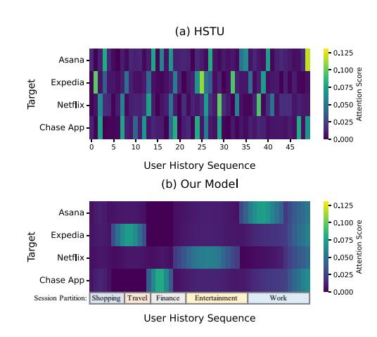
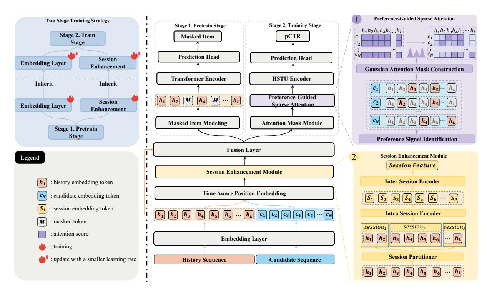
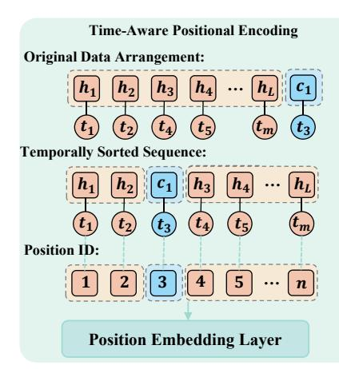
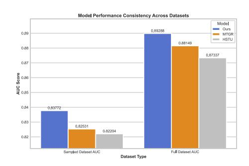
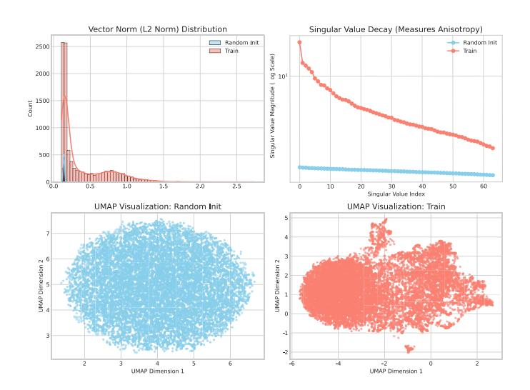
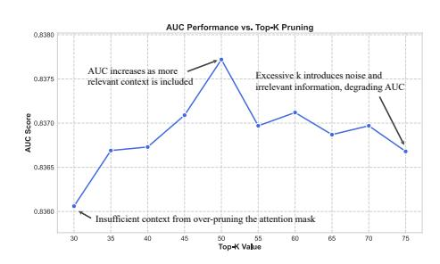
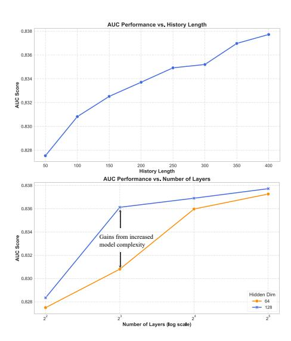
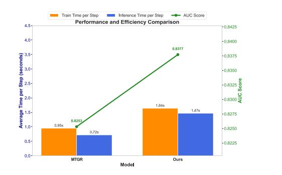

# Beyond the Flat Sequence: Hierarchical and Preference-Aware Generative Recommendations

[Zerui Chen](https://orcid.org/0009-0009-3226-619X)∗ zrchen@ir.hit.edu.cn Harbin Institute of Technology Harbin, China

[Heng Chang](https://orcid.org/0000-0002-4978-8041)∗ changh.heng@gmail.com Huawei Technologies Co., Ltd. Beijing, China

Tianying Liu tianying\_liu@outlook.com Huawei Technologies Co., Ltd. Shanghai, China

Chuantian Zhou alita@bupt.edu.cn Beijing University of Posts and Telecommunications Beijing, China

Yi Cao caoyi23@huawei.com Huawei Technologies Co., Ltd. Shanghai, China

Jiandong Ding dingjiandong2@huawei.com Huawei Technologies Co., Ltd. Shanghai, China

Ming Liu† mliu@ir.hit.edu.cn Harbin Institute of Technology Harbin, China

Bing Qin qinb@ir.hit.edu.cn Harbin Institute of Technology Harbin, China

### Abstract

Generative Recommenders (GRs), exemplified by the Hierarchical Sequential Transduction Unit (HSTU), have emerged as a powerful paradigm for modeling long user interaction sequences. However, we observe that their "flat-sequence" assumption overlooks the rich, intrinsic structure of user behavior. This leads to two key limitations: a failure to capture the temporal hierarchy of sessionbased engagement, and computational inefficiency, as dense attention introduces significant noise that obscures true preference signals within semantically sparse histories, which deteriorates the quality of the learned representations. To this end, we propose a novel framework named HPGR (Hierarchical and Preferenceaware Generative Recommender), built upon a two-stage paradigm that injects these crucial structural priors into the model to handle the drawback. Specifically, HPGR comprises two synergistic stages. First, a structure-aware pre-training stage employs a session-based Masked Item Modeling (MIM) objective to learn a hierarchicallyinformed and semantically rich item representation space. Second, a preference-aware fine-tuning stage leverages these powerful representations to implement a Preference-Guided Sparse Attention mechanism, which dynamically constrains computation to only the most relevant historical items, enhancing both efficiency and signal-to-noise ratio. Empirical experiments on a large-scale proprietary industrial dataset from APPGallery and an online A/B test verify that HPGR achieves state-of-the-art performance over multiple strong baselines, including HSTU and MTGR.

# CCS Concepts

### • Information systems → Recommender systems.

© 2026 Copyright held by the owner/author(s). ACM ISBN 979-8-4007-2307-0/2026/04 <https://doi.org/10.1145/3774904.3792790>

# Keywords

attention mechanism, generative recommendation

#### ACM Reference Format:

Zerui Chen, Heng Chang, Tianying Liu, Chuantian Zhou, Yi Cao, Jiandong Ding, Ming Liu, and Bing Qin. 2026. Beyond the Flat Sequence: Hierarchical and Preference-Aware Generative Recommendations. In Proceedings of the ACM Web Conference 2026 (WWW '26), April 13–17, 2026, Dubai, United Arab Emirates. ACM, New York, NY, USA, [9](#page-8-0) pages. [https://doi.org/10.1145/](https://doi.org/10.1145/3774904.3792790) [3774904.3792790](https://doi.org/10.1145/3774904.3792790)

Figure 1: A comparison of attention mechanisms visualizing how different models interpret user history. (a) The baseline HSTU model, which treats history as a "flat-sequence", exhibits scattered, item-level attention that fails to capture the underlying structure of user intent. (b) In contrast, HPGR learns to understand the hierarchical, session-based nature of user behavior.

# 1 Introduction

Recommendation systems form the cornerstone of modern internet platforms, personalizing experiences for billions of users daily.

Recently, the field has witnessed a paradigm shift from traditional Deep Learning Recommendation Models (DLRMs) [\[5,](#page-8-1) [7,](#page-8-2) [12,](#page-8-3)

∗Both authors contributed equally to this research.

†Corresponding author.

[This work is licensed under a Creative Commons Attribution 4.0 International License.](https://creativecommons.org/licenses/by/4.0) WWW '26, Dubai, United Arab Emirates

[26,](#page-8-4) [29,](#page-8-5) [37,](#page-8-6) [38\]](#page-8-7) towards Generative Recommenders (GRs) [\[35\]](#page-8-8). Spearheading this movement, the Hierarchical Sequential Transduction Unit (HSTU) [\[35\]](#page-8-8) has achieved monumental success, scaling recommendation models to trillions of parameters and demonstrating promising scaling laws akin to those of Large Language Models (LLMs) [\[1,](#page-8-9) [2,](#page-8-10) [22,](#page-8-11) [27\]](#page-8-12).

By reformulating recommendation as a sequential transduction task over long user histories, HSTU effectively overcomes the scalability bottlenecks of DLRMs and unifies the modeling of heterogeneous features into a single, powerful architecture.

Despite its impressive capabilities in processing long sequences, the success of HSTU is predicated on a fundamental yet implicit assumption: it models a user's history as a flat, undifferentiated stream of actions. Although effective, the "flat-sequence" perspective overlooks the rich intrinsic structure inherent in human behavior, leading to two significant challenges.

First, it neglects hierarchical temporal structure of user engagement. User activities are not uniformly distributed but are naturally clustered into sessions, each representing a focused, short-term intent. A flat model struggles to distinguish coherent intra-session patterns from broader inter-session interest shifts [\[33\]](#page-8-13).

Second, it overlooks the sparse nature of user preference, whereby the next action depends on a compact, highly relevant subset of past interactions instead of the full historical record. Compelling the model to compute dense attention across thousands of historical items is not only computationally redundant but also introduces significant noise that can impair the quality of learned representations [\[4\]](#page-8-14).

To address these limitations, we propose HPGR, a new framework that injects crucial structural priors into the generative recommendation process. Our core insight is that by explicitly modeling the temporal hierarchy and preference of user behavior, we can build recommenders that are both more effective and more efficient.

Specifically, we introduce a two-stage paradigm. In the first stage, called structure-aware pre-training, we introduce a Session Enhancement Module (SEM) and employ a session-based Masked Item Modeling (MIM) objective. The SEM explicitly models the temporal hierarchy of user behavior by processing interactions within and across sessions. This process compels the model to learn generalizable item semantics and complex behavioral dynamics, resulting in a powerful pre-trained embedding space.

In the second stage termed preference-aware fine-tuning, we adapt the pre-trained model for the downstream prediction task. It is achieved through our novel Preference-Guided Sparse Attention (PGSA) mechanism, which aims to reconstruct the most salient preference context for a given candidate item. Rather than applying dense attention to the entire history, PGSA treats the candidate as a query to retrieve a small, highly relevant subset of past interactions. Attention is then restricted to this preference-rich subset, sharply reducing computation and improving accuracy by amplifying genuine preference signals while suppressing historical noise.

Our work makes the following key contributions:

- We propose the Session Enhancement Module (SEM), a hierarchical transformer architecture, and a corresponding structure-aware pre-training strategy. This combined approach enables the model to explicitly capture both intra-

and inter-session dynamics, overcoming the critical "flatsequence" limitation of prior generative recommenders.

- We introduce the Preference-Guided Sparse Attention (PGSA) mechanism for the fine-tuning stage. PGSA replaces prior random sampling techniques with a preference-driven sparsity. This approach improves the accuracy of attention by focusing on the most relevant signals, while being inherently more computationally efficient than dense attention for long user sequences.
- We conduct extensive offline experiments and an online A/B test on a large-scale industrial recommender system. The results validate that HPGR substantially outperforms stateof-the-art baselines and achieves a significant +1.99% eCPM uplift in a real-world production environment, demonstrating its practical effectiveness and business value.

# 2 Related Work

# 2.1 Sequential and Generative Recommenders

Traditional sequential recommenders aim to capture user dynamics from interaction sequences, evolving from RNN-based models like GRU4Rec [\[15\]](#page-8-15) to attention-based architectures like SASRec [\[17\]](#page-8-16). In large-scale industrial systems, these approaches are often realized as target attention modules within a larger DLRM framework.

Recently, a paradigm shift towards generative recommenders has emerged, inspired by the success of Large Language Models [\[1,](#page-8-9) [2,](#page-8-10) [22,](#page-8-11) [27\]](#page-8-12). Instead of treating sequences as just one of many feature sources, GRs reformulate the entire recommendation task as a sequence-to-sequence problem over a unified stream of user actions. The seminal work on HSTU [\[35\]](#page-8-8) demonstrated that this approach can scale to trillions of parameters and exhibits promising scaling laws. Follow-up works like MTGR [\[13\]](#page-8-17) have further adapted this architecture to better incorporate the rich cross-features traditionally used in DLRMs. Our work builds directly upon this powerful GR paradigm. However, while existing GRs treat the user history as a "flat-sequence", we argue for the importance of incorporating explicit structural priors, a key distinction that our HPGR framework addresses.

# 2.2 Modeling Structure in User Sequences

The concept that user behavior is not monolithic but organized into sessions of intent is well-established in recommendation literature, particularly in session-based recommendation [\[14,](#page-8-18) [30\]](#page-8-19). These works typically focus on predicting the next action within a short, ongoing session. However, in the context of modeling very long user histories, as championed by the GR paradigm, explicitly modeling the hierarchical structure of multiple, interconnected sessions is a less explored area [\[18,](#page-8-20) [20\]](#page-8-21). Most long-sequence models either treat the sequence as flat [\[17,](#page-8-16) [25\]](#page-8-22) or use implicit mechanisms like positional biases [\[28\]](#page-8-23) to distinguish recent from older items. Our work addresses this gap by introducing the Session Enhancement Module (SEM), a hierarchical transformer architecture designed to explicitly model both intra- and inter-session dynamics within long user sequences, providing a richer, structurally-aware context for prediction.

otherwise. This ensures all items in the final sequence have a unique and temporally correct positional representation.

3.2.2 Preference-Guided Sparse Attention. To overcome the inefficiency of applying dense attention over long histories with thousands of items, we propose Preference-Guided Sparse Attention (PGSA). PGSA constructs a compact yet powerful preference context for each candidate item, and concentrates modeling capacity on the most salient signals of user preference. In particular, this is accomplished in three steps:

(i) Preference signal identification: For a given candidate item ��, we first identify potential preference signals within the user's history. Concretely, we compute the preference alignment between �� and every historical item ℎ�� through the dot product of their pre-trained embeddings: score�� = emb(��) · emb(ℎ��). A higher score indicates stronger preference alignment.

(ii) Preference subset selection: We then select the Top-K historical items with the highest preference alignment scores. The selected items with indices {��1, ��2, . . . , ���� } form a sparse subset that acts as the primary anchors of user preference for the candidate, moving beyond mere semantic similarity.

(iii) Gaussian attention mask construction: Rather than using a hard binary mask, we construct a soft attention mask that applies a gaussian-shaped influence around each preference anchor. The final mask value ���� for any position �� in the history is calculated as Equation [\(5\)](#page-4-0):

���� = max �� ∈ {1,...,��} exp − (�� − ���� ) 2 2�� (5)

where �� is a hyperparameter controlling the width of the influence. This mask is applied element-wise to the attention score matrix within the HSTU encoder, which concentrates computation on regions of high preference alignment, maintaining smooth gradients while effectively filtering out noise from irrelevant interactions.

The session-enhanced token embeddings, together with their time-aware positional embeddings and the gaussian mask, are fed into the main HSTU encoder. The resulting candidate representation is then passed through a multi-layer perceptron to produce the predicted score.

3.2.3 Fine-tuning Objective. The entire HPGR model is trained end-to-end in this stage to predict the click-through rate. Given a training batch of user-candidate pairs, the objective is to minimize the binary cross-entropy loss, defined as:

LpCTR = − 1 �� ∑︁�� ��=1 (���� log(��ˆ��) + (1 − ����) log(1 − ��ˆ��)) (6)

where �� is the batch size, ���� ∈ {0, 1} is the ground-truth label (click or no-click), and ��ˆ�� is the predicted CTR score for the ��-th pair, produced by the final MLP and a sigmoid activation function.

# 3.3 Training Strategy

Our two-stage approach ensures both general knowledge acquisition and task-specific adaptation. The process begins with the structure-aware pre-training stage, where the model is trained on a large corpus of unlabeled user interaction data to optimize LMIM (Eq. [3\)](#page-3-1).

Subsequently, in the preference-aware fine-tuning stage, we initialize the core modules with the learned weights and train the entire HPGR model on the labeled downstream task by optimizing LpCTR (Eq. [6\)](#page-4-1). During this second stage, we apply a smaller learning rate to the inherited weights (item embeddings and SEM) compared to the rest of the randomly-initialized model parts. This differential learning rate strategy is crucial: it preserves the rich, general-purpose semantic space learned during pre-training while allowing the model to effectively adapt to the specific supervised signals of the downstream task.

#### 4 Experiments

### 4.1 Experimental Setup

4.1.1 Dataset. To validate our approach in a real-world, large-scale industrial setting, we constructed a proprietary dataset from the production recommender system of the APPGallery application distribution platform. The full dataset captures one continuous month of user-interaction logs. Table [1](#page-4-2) summarizes the statistics of this complete, unsampled dataset, highlighting its massive scale.

To facilitate extensive experimentation, including hyperparameter tuning and ablation studies, our main experiments (reported in Table [2\)](#page-6-0) were conducted on a representative subset. This subset was created by randomly sampling 2.5% of the users, along with their complete interaction histories. All data was rigorously anonymized to protect user privacy.

To confirm that the conclusions drawn from the sampled data generalize to the full data distribution, we also conducted a final validation on the complete test set, as detailed in Section [4.3.](#page-5-0)

Table 1: Statistics of the APPGallery Dataset.

| Metric       |          |        | Value     |
|--------------|----------|--------|-----------|
| Number       | of Users | ∼ 45.8 | Million   |
| Number       | of Items |        | ∼ 200,000 |
| Interactions | (Train)  | ∼ 285  | Million   |
| Interactions | (Test)   | ∼ 7.38 | Million   |

4.1.2 Baselines. To comprehensively evaluate our proposed model, HPGR, we compare it against a wide range of baseline methods, which we categorize based on their underlying technical paradigm.

- Discriminative Recommendation Models: This group includes a spectrum of models that formulate recommendation as a scoring or classification task. It ranges from foundational architectures to the current state-of-the-art in high-order feature interaction modeling.
  - DNN [\[7\]](#page-8-2): A fundamental deep learning model that processes features with multi-layer perceptrons.
  - MoE [\[21\]](#page-8-39): An extension of DNN that uses a mixture-ofexperts architecture to handle diverse user populations.
  - GRU4Rec [\[15\]](#page-8-15): A classic model that uses gated recurrent units to capture temporal patterns in user behavior sequences.

- SASRec [\[17\]](#page-8-16): A seminal work that first introduced selfattention to effectively capture long-range dependencies in user sequences.
- BERT4Rec [\[25\]](#page-8-22): A model inspired by BERT that uses a deep bidirectional self-attention network for sequential recommendation.
- Wukong [\[36\]](#page-8-40): A state-of-the-art model that establishes a scaling law for recommendation via a "dense scaling" approach, using stacked Factorization Machines to capture high-order feature interactions.
- Generative Recommendation Models: This category represents the emerging paradigm that our work builds upon. These models reformulate recommendation as a sequence generation task, showing great promise in modeling long user histories.
  - HSTU [\[35\]](#page-8-8): The pioneering work on generative recommendations and the direct foundation of our research.
  - MTGR [\[13\]](#page-8-17): A powerful successor in the GR paradigm, which further enhances the architecture for handling long sequences in industrial systems.

For our proposed model, HPGR, we experiment with several configurations of different scales to validate its scalability, as detailed in our subsequent analyses.

### 4.2 Main Results

To evaluate the effectiveness of our proposed framework HPGR, we conducted a comprehensive comparison against all baseline models on the APPGallery dataset. The main results for the ranking task, grouped by their underlying paradigm, are presented in Table [2.](#page-6-0) From the table, we can draw several key observations:

- (1) Performance within the Discriminative Paradigm: The first group of models, representing the discriminative paradigm, shows a clear trend where explicitly modeling user sequences is beneficial. Sequential models like SASRec and GRU4Rec significantly outperform their non-sequential counterparts such as DNN. Notably, SASRec, with its self-attention mechanism, emerges as the strongest model within this entire paradigm, setting the performance ceiling for discriminative approaches on this dataset.
- (2) Superiority of the Generative Paradigm: A crucial finding is that the generative paradigm demonstrates a fundamental performance advantage. Even the baseline generative models, HSTU and MTGR, surpass the best-performing discriminative model, SASRec. This validates that reformulating recommendation as a sequence generation task is a more powerful approach for modeling long and complex user histories in large-scale industrial settings.
- (3) HPGR Sets a New State-of-the-Art: Our proposed model, HPGR, not only affirms the strength of the generative approach but also significantly pushes its boundary. The full HPGR model achieves the best performance overall with an AUC of 0.8377. This represents a substantial uplift over the strongest baseline, MTGR, with a +0.0124 absolute AUC gain and a +1.50% relative improvement. This result strongly demonstrates that explicitly injecting structural priors is a

critical and highly effective enhancement to the generative recommendation framework.

#### 4.3 Validation on the Full Dataset

To confirm that the superior performance observed on the sampled subset is robust and generalizable, we conducted a validation experiment on the complete, unsampled test dataset. As shown in Figure [4,](#page-5-1) the relative performance ranking of the top models remains consistent. On this full dataset, HPGR achieves an impressive AUC of 0.89288, maintaining a significant lead of +0.01139 absolute AUC points over the strongest baseline, MTGR. This result provides strong evidence that the advantages conferred by our architectural innovations are fundamental and translate effectively to the complete, real-world data distribution, confirming the generalizability of our main findings.

Figure 4: Performance consistency of the top models across the sampled and full test datasets.

# 4.4 Ablation Study

To dissect the individual contributions of our key innovations—the structure-aware pre-training, the PGSA mechanism, and the SEM architecture—we conducted a detailed ablation study. The results are presented in the lower section of Table [2,](#page-6-0) starting from a base configuration and progressively adding components.

- Impact of Pre-training: The HPGR (Base, Pre-training only) model utilizes the standard HSTU architecture but initializes its item embeddings from our structure-aware pre-training stage (using the MIM objective). It achieves an AUC of 0.8327. This result, which already outperforms the strongest baseline MTGR, powerfully validates that our pretraining objective alone produces a fundamentally superior and more generalizable item embedding space compared to task-specific end-to-end training.
- Impact of PGSA: Adding the PGSA mechanism to the base model (+ PGSA module) improves the AUC from 0.8327 to 0.8348. This gain demonstrates that dynamically focusing attention on a sparse, preference-rich subset of historical items is highly effective at reducing noise and amplifying relevant signals, especially for long sequences.
- Impact of SEM: When we instead add only the SEM to the base model (+ SEM module), the AUC rises substantially to 0.8374. This significant improvement underscores the critical importance of explicitly modeling the temporal hierarchy

Table 2: Performance comparison on our industrial dataset. The best result is in bold, and the second best is underlined. Impr.% represents the relative improvement of the best HPGR model compared to the strongest baselines (underlined).

| Category Model         |             |              |         |       | AUC ( ↑ ) |
|------------------------|-------------|--------------|---------|-------|-----------|
| Discriminative Models  |             |              |         |       |           |
| DNN                    | (Covington  | et           | al.     | 2016) | 0.7923    |
| MoE                    | (Ma et      | al. 2018)    |         |       | 0.8024    |
| GRU4Rec                | (Hidasi     | et           | al.     | 2015) | 0.8146    |
| BERT4Rec               | (Sun        | et           | al.     | 2019) | 0.8145    |
| SASRec                 | (Kang       | and          | McAuley | 2018) | 0.8194    |
| Wukong                 | (Zhang      | et           | al.     | 2024) | 0.8167    |
| Generative Models HSTU | (Zhai       | et al.       | 2024)   |       | 0.8220    |
| MTGR                   | (Han        | et al.       | 2025)   |       | 0.8253    |
| Our Model              |             |              |         |       |           |
| HPGR                   | (Base,      | Pre-training |         | only) | 0.8327    |
| +                      | PGSA module |              |         |       | 0.8348    |
| +                      | SEM module  |              |         |       | 0.8374    |
| HPGR                   | (Full)      |              |         |       | 0.8377    |
| Impr.                  |             |              |         |       | +1.50%    |

of user behavior, which is overlooked by the flat-sequence assumption of the base architecture.

- Synergy of All Components: Finally, the HPGR (Full) model, which integrates both SEM and PGSA, yields the best overall result. This demonstrates the synergy of our core innovations, highlighting the value of both capturing the hierarchical structure of user behavior and focusing attention on relevant historical items within the generative paradigm, leading to state-of-the-art performance.

### 4.5 Qualitative Analysis of the Pre-trained Embedding Space

To validate our structure-aware pre-training, we analyze the item embedding table before and after the MIM stage. Figure [5](#page-6-1) compares Xavier initialization ("Random Init") with our pre-trained embeddings ("Train"). This comparison reveals three key structural transformations:

- Learned magnitude shift: The L2 norm distribution (top left) shifts from uniform to highly skewed. Most items, likely representing the long-tail, collapse into a low-norm region. Conversely, a subset of semantically significant items differentiates with higher norms, indicating the model learns to compress less prominent items while highlighting important ones.
- Emergence of anisotropy: The singular value decay (top right) indicates a transition from an isotropic to an anisotropic structure. This confirms the model utilizes specific dimensions to capture principal axes of semantic variance rather than spanning the space uniformly.
- Structured Semantic Landscape: UMAP visualizations (bottom row) show a transformation from an unstructured cloud to distinct substructures. The pre-trained embeddings organize into high-density regions, demonstrating that semantically similar items are successfully pulled into proximity.

Figure 5: Comparison of embedding properties between Random Initialization and Pre-training. Top left: L2 norm distribution shifts to a high-density peak. Bottom row: UMAP visualization reveals that the embeddings organize into meaningful semantic patterns, in contrast to the initial random cloud.

### 4.6 Hyperparameter Study

We investigated the sensitivity of the Top-K value, ��, in our PGSA mechanism. As shown in Figure [6,](#page-7-0) performance peaks at �� = 50, indicating that captures sufficient context without excessive noise. We use �� = 50 for all other experiments.

# 4.7 Scalability Analysis

We analyzed the scaling properties of HPGR. As shown in Figure [7,](#page-7-1) performance consistently improves with longer user histories and with increased model depth and width. This demonstrates that

Figure 6: Hyperparameter analysis of AUC with respect to the Top-K value.

HPGR is a robust and scalable architecture, promising further gains with more data and computational resources.

Figure 7: Scalability of HPGR with respect to history length (top) and model size (bottom).

### 4.8 Efficiency Analysis

We also compared the computational efficiency of HPGR against MTGR. Figure [8](#page-7-2) shows that while our model incurs a manageable increase in training and inference time, this investment yields a substantial gain of +0.0124 in absolute AUC. This highly favorable trade-off demonstrates the practical value of our architectural enhancements.

# 5 Online Evaluation

To ultimately validate the real-world impact and practical value of our proposed HPGR framework, we deployed our model for an online A/B test on the APPGallery App recommendation platform. The experiment was conducted over a 7-day period, where traffic was split evenly between our proposed HPGR model and the incumbent, a highly optimized production DLRM, which served as the online baseline.

Figure 8: Comparison of training time, inference time, and AUC score between MTGR and our HPGR model.

We focused our evaluation on the primary business indicator, eCPM (Effective Cost Per Mille), which directly measures platform revenue and is a critical metric for industrial recommender systems. The aggregated results, reported as the relative improvement over the online baseline, are summarized in Table [3.](#page-7-3)

Table 3: Online A/B test results, with offline AUC evaluated on the full dataset. This comparison shows that HPGR's offline superiority translates to a significant online eCPM uplift.

| Model                      | Offline AUC | Online eCPM |
|----------------------------|-------------|-------------|
| Production DLRM (Baseline) | 0.8880      | Baseline    |
| HPGR (ours)                | 0.8929      | +1.99%      |

The online A/B test results robustly confirm the effectiveness of our model in an online production environment. As shown in the table, HPGR achieved a statistically significant +1.99% uplift in eCPM over the highly optimized baseline.

### 6 Conclusion

In this paper, we introduce HPGR, a novel framework that addresses the "flat-sequence" limitation in modern Generative Recommenders. HPGR injects crucial structural priors via a two-stage paradigm: a structure-aware pre-training stage with a Session Enhancement Module (SEM) to learn hierarchical representations, followed by a preference-aware fine-tuning stage using Preference-Guided Sparse Attention (PGSA) to focus on relevant history. This dual approach enables the model to capture complex, session-based user behavior. Extensive offline experiments and an online A/B test validate HPGR's effectiveness, demonstrating state-of-the-art performance and a significant +1.99% eCPM uplift in a production environment.

# Acknowledgments

The research in this article is supported by the National Science Foundation of China (U22B2059, 62276083), Key Research and Development Program of Heilongjiang Province (2024ZX01A05) and the 5G Application Innovation Joint Research Institute's Project (A003).

References [1] Josh Achiam, Steven Adler, Sandhini Agarwal, Lama Ahmad, Ilge Akkaya, Florencia Leoni Aleman, Diogo Almeida, Janko Altenschmidt, Sam Altman, Shyamal Anadkat, et al. 2023. Gpt-4 technical report. arXiv preprint arXiv:2303.08774 (2023). [2] Jinze Bai, Shuai Bai, Yunfei Chu, Zeyu Cui, Kai Dang, Xiaodong Deng, Yang Fan, Wenbin Ge, Yu Han, Fei Huang, et al. 2023. Qwen technical report. arXiv preprint arXiv:2309.16609 (2023). [3] Iz Beltagy, Matthew E Peters, and Arman Cohan. 2020. Longformer: The longdocument transformer. arXiv preprint arXiv:2004.05150 (2020). [4] Sneha Chaudhari, Varun Mithal, Gungor Polatkan, and Rohan Ramanath. 2021. An attentive survey of attention models. ACM Transactions on Intelligent Systems and Technology (TIST) 12, 5 (2021), 1–32. [5] Heng-Tze Cheng, Levent Koc, Jeremiah Harmsen, Tal Shaked, Tushar Chandra, Hrishi Aradhye, Glen Anderson, Greg Corrado, Wei Chai, Mustafa Ispir, et al. 2016. Wide & deep learning for recommender systems. In Proceedings of the 1st workshop on deep learning for recommender systems. 7–10. [6] Rewon Child, Scott Gray, Alec Radford, and Ilya Sutskever. 2019. Generating long sequences with sparse transformers. arXiv preprint arXiv:1904.10509 (2019). [7] Paul Covington, Jay Adams, and Emre Sargin. 2016. Deep neural networks for youtube recommendations. In Proceedings of the 10th ACM conference on recommender systems. 191–198. [8] Tri Dao. 2023. Flashattention-2: Faster attention with better parallelism and work partitioning. arXiv preprint arXiv:2307.08691 (2023). [9] Tri Dao, Dan Fu, Stefano Ermon, Atri Rudra, and Christopher Ré. 2022. Flashattention: Fast and memory-efficient exact attention with io-awareness. Advances in neural information processing systems 35 (2022), 16344–16359. [10] Jacob Devlin, Ming-Wei Chang, Kenton Lee, and Kristina Toutanova. 2019. Bert: Pre-training of deep bidirectional transformers for language understanding. In Proceedings of the 2019 conference of the North American chapter of the association for computational linguistics: human language technologies, volume 1 (long and short papers). 4171–4186. [11] Shijie Geng, Shuchang Liu, Zuohui Fu, Yingqiang Ge, and Yongfeng Zhang. 2022. Recommendation as language processing (rlp): A unified pretrain, personalized prompt & predict paradigm (p5). In Proceedings of the 16th ACM conference on recommender systems. 299–315. [12] Huifeng Guo, Ruiming Tang, Yunming Ye, Zhenguo Li, and Xiuqiang He. 2017. DeepFM: a factorization-machine based neural network for CTR prediction. arXiv preprint arXiv:1703.04247 (2017). [13] Ruidong Han, Bin Yin, Shangyu Chen, He Jiang, Fei Jiang, Xiang Li, Chi Ma, Mincong Huang, Xiaoguang Li, Chunzhen Jing, et al. 2025. MTGR: Industrial-Scale Generative Recommendation Framework in Meituan. arXiv preprint arXiv:2505.18654 (2025). [14] Balázs Hidasi and Alexandros Karatzoglou. 2018. Recurrent neural networks with top-k gains for session-based recommendations. In Proceedings of the 27th ACM international conference on information and knowledge management. 843–852. [15] Balázs Hidasi, Alexandros Karatzoglou, Linas Baltrunas, and Domonkos Tikk. 2015. Session-based recommendations with recurrent neural networks. arXiv preprint arXiv:1511.06939 (2015). [16] Gao Huang, Yu Sun, Zhuang Liu, Daniel Sedra, and Kilian Q Weinberger. 2016. Deep networks with stochastic depth. In European conference on computer vision. Springer, 646–661. [17] Wang-Cheng Kang and Julian McAuley. 2018. Self-attentive sequential recommendation. In 2018 IEEE international conference on data mining (ICDM). IEEE, 197–206. [18] Chao Li, Zhiyuan Liu, Mengmeng Wu, Yuchi Xu, Huan Zhao, Pipei Huang, Guoliang Kang, Qiwei Chen, Wei Li, and Dik Lun Lee. 2019. Multi-interest network with dynamic routing for recommendation at Tmall. In Proceedings of the 28th ACM international conference on information and knowledge management. 2615–2623. [19] Peng Liu, Lemei Zhang, and Jon Atle Gulla. 2023. Pre-train, prompt, and recommendation: A comprehensive survey of language modeling paradigm adaptations in recommender systems. Transactions of the Association for Computational Linguistics 11 (2023), 1553–1571. [20] Chen Ma, Peng Kang, and Xue Liu. 2019. Hierarchical gating networks for sequential recommendation. In Proceedings of the 25th ACM SIGKDD international conference on knowledge discovery & data mining. 825–833. [21] Jiaqi Ma, Zhe Zhao, Xinyang Yi, Jilin Chen, Lichan Hong, and Ed H Chi. 2018. Modeling task relationships in multi-task learning with multi-gate mixture-ofexperts. In Proceedings of the 24th ACM SIGKDD international conference on knowledge discovery & data mining. 1930–1939. [22] Shervin Minaee, Tomas Mikolov, Narjes Nikzad, Meysam Chenaghlu, Richard Socher, Xavier Amatriain, and Jianfeng Gao. 2024. Large language models: A survey. arXiv preprint arXiv:2402.06196 (2024). [23] Zhaopeng Qiu, Xian Wu, Jingyue Gao, and Wei Fan. 2021. U-BERT: Pre-training user representations for improved recommendation. In Proceedings of the AAAI Conference on Artificial Intelligence, Vol. 35. 4320–4327. [24] Jay Shah, Ganesh Bikshandi, Ying Zhang, Vijay Thakkar, Pradeep Ramani, and Tri Dao. 2024. Flashattention-3: Fast and accurate attention with asynchrony and low-precision. Advances in Neural Information Processing Systems 37 (2024), 68658–68685. [25] Fei Sun, Jun Liu, Jian Wu, Changhua Pei, Xiao Lin, Wenwu Ou, and Peng Jiang. 2019. BERT4Rec: Sequential recommendation with bidirectional encoder representations from transformer. In Proceedings of the 28th ACM international conference on information and knowledge management. 1441–1450. [26] Hongyan Tang, Junning Liu, Ming Zhao, and Xudong Gong. 2020. Progressive layered extraction (ple): A novel multi-task learning (mtl) model for personalized recommendations. In Proceedings of the 14th ACM conference on recommender systems. 269–278. [27] Hugo Touvron, Thibaut Lavril, Gautier Izacard, Xavier Martinet, Marie-Anne Lachaux, Timothée Lacroix, Baptiste Rozière, Naman Goyal, Eric Hambro, Faisal Azhar, et al. 2023. Llama: Open and efficient foundation language models. arXiv preprint arXiv:2302.13971 (2023). [28] Ashish Vaswani, Noam Shazeer, Niki Parmar, Jakob Uszkoreit, Llion Jones, Aidan N Gomez, Łukasz Kaiser, and Illia Polosukhin. 2017. Attention is all you need. Advances in neural information processing systems 30 (2017). [29] Ruoxi Wang, Rakesh Shivanna, Derek Cheng, Sagar Jain, Dong Lin, Lichan Hong, and Ed Chi. 2021. Dcn v2: Improved deep & cross network and practical lessons for web-scale learning to rank systems. In Proceedings of the web conference 2021. 1785–1797. [30] Shoujin Wang, Longbing Cao, Yan Wang, Quan Z Sheng, Mehmet A Orgun, and Defu Lian. 2021. A survey on session-based recommender systems. ACM Computing Surveys (CSUR) 54, 7 (2021), 1–38. [31] Sinong Wang, Belinda Z Li, Madian Khabsa, Han Fang, and Hao Ma. 2020. Linformer: Self-attention with linear complexity. arXiv preprint arXiv:2006.04768 (2020). [32] Likang Wu, Zhi Zheng, Zhaopeng Qiu, Hao Wang, Hongchao Gu, Tingjia Shen, Chuan Qin, Chen Zhu, Hengshu Zhu, Qi Liu, et al. 2024. A survey on large language models for recommendation. World Wide Web 27, 5 (2024), 60. [33] Wooseong Yang, Chen Wang, Zihe Song, Weizhi Zhang, and Philip S Yu. 2024. Item Cluster-aware Prompt Learning for Session-based Recommendation. arXiv preprint arXiv:2410.04756 (2024). [34] Zheni Zeng, Chaojun Xiao, Yuan Yao, Ruobing Xie, Zhiyuan Liu, Fen Lin, Leyu Lin, and Maosong Sun. 2021. Knowledge transfer via pre-training for recommendation: A review and prospect. Frontiers in big Data 4 (2021), 602071. [35] Jiaqi Zhai, Lucy Liao, Xing Liu, Yueming Wang, Rui Li, Xuan Cao, Leon Gao, Zhaojie Gong, Fangda Gu, Michael He, et al. 2024. Actions speak louder than words: Trillion-parameter sequential transducers for generative recommendations. arXiv preprint arXiv:2402.17152 (2024). [36] Buyun Zhang, Liang Luo, Yuxin Chen, Jade Nie, Xi Liu, Daifeng Guo, Yanli Zhao, Shen Li, Yuchen Hao, Yantao Yao, et al. 2024. Wukong: Towards a scaling law for large-scale recommendation. arXiv preprint arXiv:2403.02545 (2024). [37] Shuai Zhang, Lina Yao, Aixin Sun, and Yi Tay. 2019. Deep learning based recommender system: A survey and new perspectives. ACM computing surveys (CSUR) 52, 1 (2019), 1–38. [38] Guorui Zhou, Xiaoqiang Zhu, Chenru Song, Ying Fan, Han Zhu, Xiao Ma, Yanghui Yan, Junqi Jin, Han Li, and Kun Gai. 2018. Deep interest network for click-through rate prediction. In Proceedings of the 24th ACM SIGKDD international conference on knowledge discovery & data mining. 1059–1068. [39] Kun Zhou, Hui Wang, Wayne Xin Zhao, Yutao Zhu, Sirui Wang, Fuzheng Zhang, Zhongyuan Wang, and Ji-Rong Wen. 2020. S3-rec: Self-supervised learning for sequential recommendation with mutual information maximization. In Proceedings of the 29th ACM international conference on information & knowledge management. 1893–1902. [40] Bohan Zhuang, Jing Liu, Zizheng Pan, Haoyu He, Yuetian Weng, and Chunhua Shen. 2023. A survey on efficient training of transformers. arXiv preprint arXiv:2302.01107 (2023).