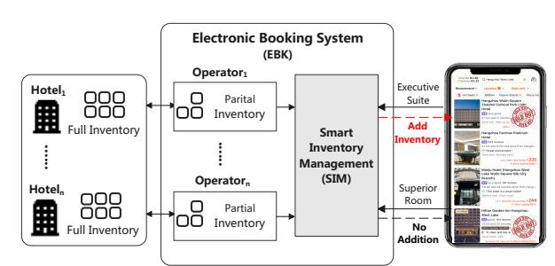
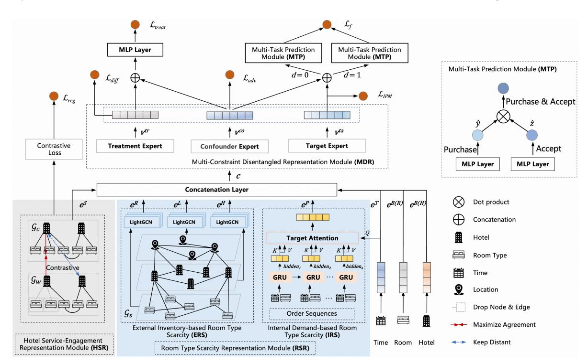
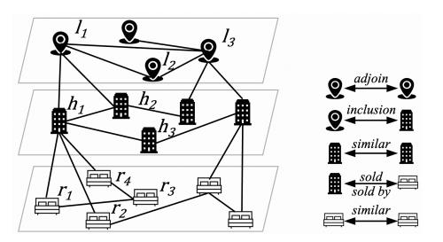
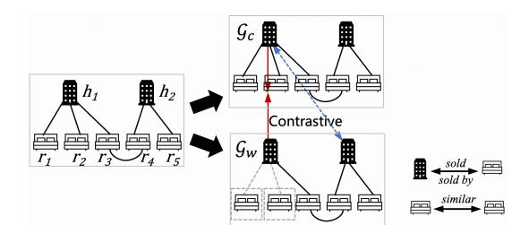
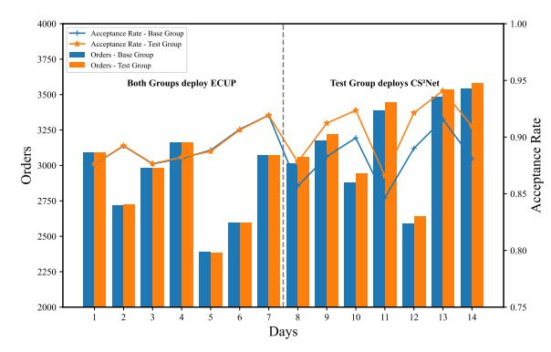
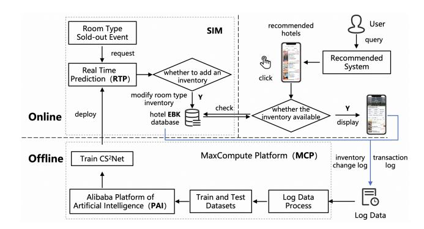
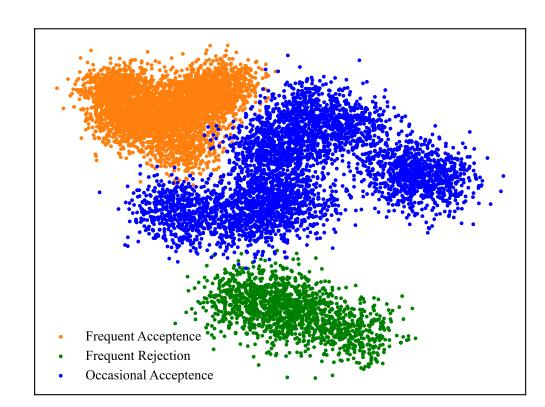
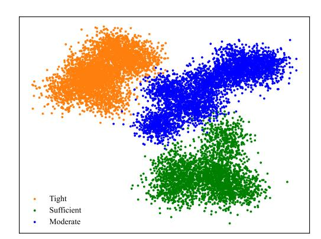

# From Sold-Out to Sales Uplift: Causal Inference for Intelligent Inventory Management on Online Travel Platforms

[Fanwei Zhu](https://orcid.org/)∗ Hangzhou City University Zhejiang, China zhufanwei@zju.edu.cn

[Zhuoran Zhuang](https://orcid.org/)∗ Alibaba Group Zhejiang, China nantian@alibaba-inc.com

[Detao Lv](https://orcid.org/)† Alibaba Group Zhejiang, China detao.ldt@alibaba-inc.com

[Manwei Li](https://orcid.org/) Alibaba Group Zhejiang, China limanwei.lmw@alibaba-inc.com

[Yao Yu](https://orcid.org/) Alibaba Group Zhejiang, China sichen.yy@alibaba-inc.com

# Abstract

Online Travel Platforms (OTPs) suffer significant revenue loss from "supply strikes", where rooms with physical vacancies appear sold out due to delays in manual inventory updates from hotels. While proactively adding inventory is a potential solution, this intervention faces a dual risk: hotels may later reject the booking, and more critically, the intervention might not generate platform-wide revenue, but merely shift sales from a competing hotel. This paper is the first to formalize the inventory decision on OTPs as a causal inference problem. We propose CS2Net, a Causality-Driven, Scarcity- and Service-Aware Network that estimates the platformwide Individual Treatment Effect of each inventory addition. CS2Net addresses the unique challenges of the OTP environment by integrating: (1) a Room Type Scarcity Representation module for inferring true room availability, (2) a Hotel Service-Engagement Representation module for predicting hotel acceptance, and (3) a bias-corrected causal framework to estimate platform-level uplift while mitigating selection bias. Extensive experiments and an online A/B test on a major OTP, demonstrate that CS2Net significantly increases confirmed bookings and platform revenue, generating over 10 million RMB in additional annual GMV. We also release the first causality dataset for third-party inventory management.

# CCS Concepts

- Applied computing → Decision analysis.

## Keywords

Sale shift, Causal Inference, Intelligent Inventory Management

### ACM Reference Format:

Fanwei Zhu, Zhuoran Zhuang, Detao Lv, Manwei Li, and Yao Yu. 2026. From Sold-Out to Sales Uplift: Causal Inference for Intelligent Inventory Management on Online Travel Platforms. In Proceedings of the ACM Web

Conference 2026 (WWW '26), April 13–17, 2026, Dubai, United Arab Emirates. ACM, New York, NY, USA, [12](#page-11-0) pages.<https://doi.org/10.1145/3774904.3792791>

# 1 Introduction

The proliferation of third-party online travel platforms (OTPs) like Booking.com, Airbnb, and Fliggy have revolutionized the hospitality industry. Serving as intermediaries between hoteliers and customers, they offer convenient booking experiences by aggregating room availability from various hoteliers, driving significant changes in how accommodations are booked and managed.

A key operational challenge for OTPs is inventory management. For reasons of data privacy, security, and a desire to maintain direct control over room distribution, hoteliers typically do not grant OTPs direct access to their property management systems [\[3\]](#page-8-0). Instead, they provide only partial inventory to the platform, reserving the remainder for direct bookings, walk-in guests, or alternative channels. Inventory updates on the OTPs must therefore be performed manually by hoteliers.

Figure 1: Intelligent Inventory Management on Fliggy.

This process introduces the risk of a supply strike- once the preallocated inventory is sold out on the platform, users can no longer book, even if the hotel still has vacant rooms. Supply strike leads to missed reservation opportunities and revenue loss for both the hotel and the platform. To mitigate these losses, it is important for OTPs to develop intelligent inventory management systems that can timely assist with inventory decisions for sold-out room types, determining whether to proactively add inventory unit for a sold-out room type?

∗Equal contribution

†Corresponding author

[This work is licensed under a Creative Commons Attribution 4.0 International License.](https://creativecommons.org/licenses/by/4.0) WWW '26, Dubai, United Arab Emirates © 2026 Copyright held by the owner/author(s). ACM ISBN 979-8-4007-2307-0/2026/04 <https://doi.org/10.1145/3774904.3792791>

Example of Inventory Management System. Fig. [1](#page-0-0) illustrates Fliggy's intelligent inventory management process. Hoteliers provide partial inventory via the Electronic Booking System (EBK). When a room type sells out, the Smart Inventory Management (SIM) system evaluates signals such as predicted availability and hotel acceptance to decide whether to add inventory. If positive, the room is relisted; otherwise, it remains sold out.

Challenges. Unlike traditional inventory management that optimizes revenue for a single hotel [\[9,](#page-8-1) [39\]](#page-8-2), OTPs should not only consider if adding inventory leads to a successful reservation for the target hotel, but more importantly, if it increases overall platform sales rather than merely shifting demand between competing hotels. Existing predictive models [\[22,](#page-8-3) [38\]](#page-8-4) cannot answer this counterfactual question: what is the platform-wide impact if we add inventory versus if we do not?

Specifically, for intelligent inventory management on OTPs, we must address three unique challenges:

- Inferring true inventory availability. Without direct access to a hotel's system, the OTP must estimate whether additional inventory exists for a sold-out room type.
- Predicting hotel acceptance. Even with availability, hotels may reject bookings for strategic reasons, harming user experience. The system must reliably predict the hotel's acceptance probability.
- Estimating platform-wide uplift. As many substitute hotels exist on the platform, adding inventory for a sold-out room may not increase total bookings, but simply shifting demand away from competing hotels. The system must avoid such sales shifts and ensure genuine platform-level sale uplift.

Our Proposal. In this paper, we formalize the inventory addition decision on third-party platforms as a causal inference problem. Our goal is to estimate the platform-level treatment effect for each soldout room type to ensure interventions create net-positive value. To achieve this, we propose CS2Net, a Causality-Driven, Scarcity- and Service-Aware Network. The architecture is specifically designed to address the core challenges of this problem: Firstly, to infer true inventory availability, a Room Type Scarcity Representation (RSR) module learns a room's actual scarcity by analyzing both its internal demand patterns and the inventory of external competitors. Secondly, to predict whether a hotel will accept the booking, a Hotel Service-Engagement Representation (HSR) module models the hotel's engagement or cooperation reliability in the OTP's inventory management service using a dedicated hotel-room type graph enriched with historical reservation and rejection statistics. Finally, these rich representations are fed into a bias-corrected, multi-task causal framework that jointly predicts purchase and acceptance probabilities, enabling precise estimation of platformlevel treatment effect.

Contributions. Our key contributions are threefold:

- We propose the first causal solution for third-party inventory management problem, aiming to estimate the net platform-wide impact of an intervention, explicitly modeling and mitigating sales shift effect- a critical challenge overlooked by traditional single-hotel revenue management.

- We propose CS2Net, a novel causal inference architecture that addresses the practical challenges of third-party platforms by introducing dedicated modules to infer true room availability and, crucially, to predict hotel acceptance behavior- a key but often ignored factor in the OTP booking process.
- We validate CS2Net through extensive offline experiments and a large-scale online A/B test, demonstrating significant business value with over 10 million RMB in additional annual GMV. We publicly release the code and the first causality dataset [1](#page-1-0) to facilitate further research on third-party inventory management.

# 2 Related Work

From the problem perspective, existing research on inventory management mainly focuses on revenue optimization for a single party, such as a hotel or an airline, using overbooking and pricing strategies. For example, Harris et al. [\[9\]](#page-8-1) predicted user no-show probabilities to make overbooking decisions safely. Zhu et al. [\[39\]](#page-8-2) proposed an elastic demand function for hotel occupancy prediction and derived optimal pricing strategies based on the estimated demand. In the airline industry, demand models have been proposed for dynamic seat allocation and pricing[\[1,](#page-8-5) [22\]](#page-8-3). These methods are powerful for a single business but are fundamentally ill-suited for a third-party OTP. Unlike prior work, our focus is on optimizing platform-wide uplift rather than single-hotel revenue. Beyond demand modeling, we also consider hotel service engagement to predict order acceptance, which is crucial for third-party platforms but overlooked in existing work.

From the technique perspective, traditional approaches often use handcrafted rules or optimization heuristics, which assume fixed demand patterns and lack adaptability to dynamic platform contexts. Recently, learning-based approaches have been introduced to handle the complexity of modern revenue management. For example, Shihab et al. [\[22\]](#page-8-3) employed reinforcement learning to manage airline seat inventory under cancellations and no-shows. In parallel, causal inference has emerged as a powerful tool for decision-making across various domains like medicine and economics [\[27,](#page-8-6) [40\]](#page-8-7). For example, Frauen et al. [\[4\]](#page-8-8) leveraged causal methods to assess treatment effects for low back pain, guiding better medical decisions. Wang et al.[\[27\]](#page-8-6) used causal effect estimation to improve recommendation quality by modeling counterfactual user behavior. Despite its success in other domains, causal inference remains largely unexplored in inventory optimization on OTPs. Existing methods cannot be adapted to model the platform-wide causal effects of adding inventory for a sold-out room. Our work address this by explicitly modeling the platform-level ITE of an inventory addition, accounting for both the direct effect on the target hotel and potential sales shifts across its competitors.

# 3 Preliminaries and Problem

# 3.1 Preliminary Experiments on Sales Shifts

As motivated in Section [1,](#page-0-1) the decision to add inventory should aim to increase overall platform sales rather than merely shifting demand between competing hotels. To empirically validate the

1Dataset and Code: https://github.com/CS2NET/CS2Net

|           | Category | Training  | Validation | Testing |
|-----------|----------|-----------|------------|---------|
| Room      | Types    | 482,612   | 144,326    | 163,570 |
| Hotels    |          | 93,972    | 38,140     | 48,884  |
| Total     | Samples  | 7,744,275 | 806,593    | 918,620 |
| Treatment | Samples  | 4,495,830 | 468,170    | 534,109 |
| Control   | Samples  | 3,248,446 | 338,423    | 384,511 |

across all metrics, demonstrating the effectiveness of adversarial and disentanglement losses in MDR.

Table 4: Ablation Study of CS2Net.

### 5.3 System Deployment & Online Test

With the success in offline experiments, we deploy CS2Net in the live environment of Fliggy and evaluate its real-world effectiveness.

System Deployment. The deployment of CS2Net involves both offline training and online serving, as shown in Fig. [5.](#page-7-1) For offline training, we first store and preprocess collected transaction behaviors, hotel interactions, and room-type inventory changes in our self-developed MaxCompute Platform (MCP) as structured log records. The processed data is used to generate training and test datasets. Distributed training is conducted on Alibaba's Platform of Artificial Intelligence (PAI), after which the trained CS2Net model is deployed on a Real-Time Prediction (RTP) platform for online inference.

Figure 5: Offline Training and Online Deployment.

During online serving, when a sold-out event occurs, contextual features (e.g., time, location, and inventory status of similar rooms) are sent to RTP, which invokes CS2Net to estimate the ITE of adding inventory. If the decision is positive, the Electronic Booking System (EBK) updates the inventory from 0 to 1, relisting the room type. Meanwhile, when users search and click a hotel in the app, a realtime inventory check ensures that only available room types are displayed, maintaining a seamless booking experience.

Online Test. A two-week online test was conducted from July 3 to July 16, 2025, using the strongest offline baseline ECUP as comparison model. We evaluate platform-wide uplift using two business-oriented metrics Order (i.e., the total number of confirmed bookings) and Acceptance Rate (i.e., the proportion of added inventory being accepted by hoteliers). We randomly assign hotels into two groups: Base group using ECUP and Test group using CS2Net for inventory interventions, To ensure a fair comparison, both groups run the baseline model during the first 7 days to validate that the hotel allocation was unbiased. From day 8 onward, the Test group switches to CS2Net for inventory decisions, while the Base group continues with ECUP.

As shown in Figure [6,](#page-7-2) switching the Test group to CS2Net resulted a 1.85% increase in confirmed bookings and a 2.87% improvement in the hotel acceptance rate compared to the Baseline group. This performance translates to over 10 million RMB in additional annual GMV, demonstrating substantial business impact.

Figure 6: Online Orders and Acceptance Rate Comparison.

We further conduct a randomized controlled trials and confirm that CS2Net effectively grows the overall platform revenue with minimal sales displacement in real setting (details in Appendix [G\)](#page-10-1).

### 6 Conclusion and Future Work

In this work, we propose CS2Net, a causality-driven framework for intelligent inventory addition. By modeling real-time room scarcity and hotel service quality, CS2Net uses a causal inference model to accurately estimate the net platform-wide impact of each potential inventory addition, effectively addressing the sale shifts issue on the OTP platform and achieving significant revenue growth.

For future work, we plan to advance our framework in two directions: (1) enhancing demand prediction by incorporating richer dynamic signals (e.g., local events and weather) and more expressive sequential models to better capture market dynamics; and (2) extending our causal framework beyond binary treatments to model dosage effects (e.g., the optimal number of rooms to add) and to support other platform interventions such as dynamic pricing, enabling a more general decision-support engine for OTPs.

### Acknowledgments

This work is supported by the Zhejiang Provincial Natural Science Foundation (No. LY24F020013), China. The authors would like to acknowledge the Supercomputing Center of Hangzhou City University and Zhejiang Provincial Engineering Research Center for Real-Time SmartTech in Urban Security Governance, for their support of the advanced computing resources.

References [1] Kavitha Balaiyan, RK Amit, Atul Kumar Malik, Xiaodong Luo, and Amit Agarwal. 2019. Joint forecasting for airline pricing and revenue management. Journal of Revenue and Pricing Management 18 (2019), 465–482. [2] Kyunghyun Cho, Bart Van Merriënboer, Caglar Gulcehre, Dzmitry Bahdanau, Fethi Bougares, Holger Schwenk, and Yoshua Bengio. 2014. Learning phrase representations using RNN encoder-decoder for statistical machine translation. arXiv preprint arXiv:1406.1078 (2014). [3] Yufeng Dong and Liuyi Ling. 2015. Hotel Overbooking and Cooperation with Third-Party Websites. Sustainability 7, 9 (Aug. 2015), 11696–11712. [4] Dennis Frauen, Tobias Hatt, Valentyn Melnychuk, and Stefan Feuerriegel. 2023. Estimating average causal effects from patient trajectories. In Proceedings of the AAAI Conference on Artificial Intelligence, Vol. 37. 7586–7594. [5] Lingyue Fu, Jianghao Lin, Weiwen Liu, Ruiming Tang, Weinan Zhang, Rui Zhang, and Yong Yu. 2023. An F-shape Click Model for Information Retrieval on Multiblock Mobile Pages. In Proceedings of the Sixteenth ACM International Conference on Web Search and Data Mining. 1057–1065. [6] Xavier Glorot and Yoshua Bengio. 2010. Understanding the difficulty of training deep feedforward neural networks. In Proceedings of the thirteenth international conference on artificial intelligence and statistics. JMLR Workshop and Conference Proceedings, 249–256. [7] Pierre Gutierrez and Jean-Yves Gérardy. 2017. Causal inference and uplift modelling: A review of the literature. In International conference on predictive applications and APIs. PMLR, 1–13. [8] Michael Gutmann and Aapo Hyvärinen. 2010. Noise-contrastive estimation: A new estimation principle for unnormalized statistical models. In Proceedings of the thirteenth international conference on artificial intelligence and statistics. JMLR Workshop and Conference Proceedings, 297–304. [9] Shannon L Harris and Michele Samorani. 2021. On selecting a probabilistic classifier for appointment no-show prediction. Decision Support Systems 142 (2021), 113472. [10] Negar Hassanpour and Russell Greiner. 2019. Learning disentangled representations for counterfactual regression. In International Conference on Learning Representations. [11] Xiangnan He, Kuan Deng, Xiang Wang, Yan Li, Yongdong Zhang, and Meng Wang. 2020. Lightgcn: Simplifying and powering graph convolution network for recommendation. In Proceedings of the 43rd International ACM SIGIR conference on research and development in Information Retrieval. 639–648. [12] Yinqiu Huang, Shuli Wang, Min Gao, Xue Wei, Changhao Li, Chuan Luo, Yinhua Zhu, Xiong Xiao, and Yi Luo. 2024. Entire chain uplift modeling with contextenhanced learningg for intelligent marketing. In Companion Proceedings of tthe ACM Web Conference 2024. 226–234. [13] Yangqin Jiang, Chao Huang, and Lianghao Huang. 2023. Adaptive graph contrastive learning for recommendation. In Proceedings of the 29th ACM SIGKDD Conference on Knowledge Discovery and Data Mining. 4252–4261. [14] Fredrik Johansson, Uri Shalit, and David Sontag. 2016. Learning representations for counterfactual inference. In International conference on machine learning. PMLR, 3020–3029. [15] Dugang Liu, Xing Tang, Han Gao, Fuyuan Lyu, and Xiuqiang He. 2023. Explicit Feature Interaction-aware Uplift Network for Online Marketing. In Proceedings of the 29th ACM SIGKDD Conference on Knowledge Discovery and Data Mining. 4507–4515. [16] Pengfei Liu, Xipeng Qiu, and Xuanjing Huang. 2017. Adversarial multi-task learning for text classification. arXiv preprint arXiv:1704.05742 (2017). [17] Xiao Ma, Liqin Zhao, Guan Huang, Zhi Wang, Zelin Hu, Xiaoqiang Zhu, and Kun Gai. 2018. Entire space multi-task model: An effective approach for estimating post-click conversion rate. In The 41st International ACM SIGIR Conference on Research & Development in Information Retrieval. 1137–1140. [18] Donald B Rubin. 2005. Causal inference using potential outcomes: Design, modeling, decisions. J. Amer. Statist. Assoc. 100, 469 (2005), 322–331. [19] Uri Shalit, Fredrik D Johansson, and David Sontag. 2017. Estimating individual treatment effect: generalization bounds and algorithms. In International conference on machine learning. PMLR, 3076–3085. [20] Xiao Shen, Dewang Sun, Shirui Pan, Xi Zhou, and Laurence T Yang. 2023. Neighbor contrastive learning on learnable graph augmentation. In Proceedings of the AAAI Conference on Artificial Intelligence, Vol. 37. 9782–9791. [21] Claudia Shi, David Blei, and Victor Veitch. 2019. Adapting neural networks for the estimation of treatment effects. Advances in neural information processing systems 32 (2019). [22] Syed Arbab Mohd Shihab, Caleb Logemann, Deepak-George Thomas, and Peng Wei. 2019. Autonomous airline revenue management: A deep reinforcement learning approach to seat inventory control and overbooking. arXiv preprint arXiv:1902.06824 (2019). [23] Ali Shiri, Asad YarAhmadi, Samira Keivanpour, and Amina Lamghari. 2024. Realtime RL-based Matching with H3 Geohash Partitioning in Smart Freight Platform. In 2024 IEEE 100th Vehicular Technology Conference (VTC2024-Fall). IEEE, 1–7. [24] Jie Shuai, Kun Zhang, Le Wu, Peijie Sun, Richang Hong, Meng Wang, and Yong Li. 2022. A review-aware graph contrastive learning framework for recommendation. In Proceedings of the 45th International ACM SIGIR Conference on Research and Development in Information Retrieval. 1283–1293. [25] Laurens van der Maaten and Geoffrey Hinton. 2008. Visualizing data using t-SNE. Journal of Machine Learning Research 9, Nov (2008), 2579–2605. [26] Haotian Wang, Wenjing Yang, Longqi Yang, Anpeng Wu, Liyang Xu, Jing Ren, Fei Wu, and Kun Kuang. 2022. Estimating Individualized Causal Effect with Confounded Instruments. In Proceedings of the 28th ACM SIGKDD Conference on Knowledge Discovery and Data Mining. 1857–1867. [27] Zhenlei Wang, Xu Chen, Rui Zhou, Quanyu Dai, Zhenhua Dong, and Ji-Rong Wen. 2023. Sequential recommendation with causal behavior discovery. In 2023 IEEE 39th International Conference on Data Engineering (ICDE). IEEE, 28–40. [28] Jiancan Wu, Xiang Wang, Fuli Feng, Xiangnan He, Liang Chen, Jianxun Lian, and Xing Xie. 2021. Self-supervised graph learning for recommendation. In Proceedings of the 44th international ACM SIGIR conference on research and development in information retrieval. 726–735. [29] Jia Xu, Fei Xiong, Zulong Chen, Mingyuan Tao, Liangyue Li, and Quan Lu. 2022. G2NET: A general geography-aware representation network for hotel search ranking. In Proceedings of the 28th ACM SIGKDD Conference on Knowledge Discovery and Data Mining. 4237–4247. [30] Liuyi Yao, Yaliang Li, Sheng Li, Mengdi Huai, Jing Gao, and Aidong Zhang. 2021. SCI: subspace learning based counterfactual inference for individual treatment effect estimation. In Proceedings of the 30th ACM International Conference on Information & Knowledge Management. 3583–3587. [31] Jinsung Yoon, James Jordon, and Mihaela Van Der Schaar. 2018. GANITE: Estimation of individualized treatment effects using generative adversarial nets. In International conference on learning representations. [32] Yuning You, Tianlong Chen, Yongduo Sui, Ting Chen, Zhangyang Wang, and Yang Shen. 2020. Graph contrastive learning with augmentations. Advances in neural information processing systems 33 (2020), 5812–5823. [33] Zhongqi Yue, Hanwang Zhang, Qianru Sun, and Xian-Sheng Hua. 2020. Interventional few-shot learning. Advances in neural information processing systems 33 (2020), 2734–2746. [34] Guozhen Zhang, Jinwei Zeng, Zhengyue Zhao, Depeng Jin, and Yong Li. 2022. A Counterfactual modeling framework for churn prediction. In Proceedings of the Fifteenth ACM International Conference on Web Search and Data Mining. 1424– 1432. [35] Jiaxing Zhang, Dongsheng Luo, and Hua Wei. 2023. Mixupexplainer: Generalizing explanations for graph neural networks with data augmentation. In Proceedings of the 29th ACM SIGKDD Conference on Knowledge Discovery and Data Mining. 3286–3296. [36] Yan Zhao, Xiao Fang, and David Simchi-Levi. 2017. Uplift modeling with multiple treatments and general response types. In Proceedings of the 2017 SIAM International Conference on Data Mining. SIAM, 588–596. [37] Kailiang Zhong, Fengtong Xiao, Yan Ren, Yaorong Liang, Wenqing Yao, Xiaofeng Yang, and Ling Cen. 2022. DESCN: Deep Entire Space Cross Networks for Individual Treatment Effect Estimation. In Proceedings of the 28th ACM SIGKDD Conference on Knowledge Discovery and Data Mining. 4612–4620. [38] Fanwei Zhu, Wendong Xiao, Yao Yu, Zemin Liu, Zulong Chen, and Weibin Cai. 2024. Dynamic Hotel Pricing at Online Travel Platforms: A Popularity and Competitiveness Aware Demand Learning Approach. In Proceedings of the 30th ACM SIGKDD Conference on Knowledge Discovery and Data Mining (Barcelona, Spain) (KDD '24). Association for Computing Machinery, New York, NY, USA, 4641–4651.<https://doi.org/10.1145/3637528.3671921> [39] Fanwei Zhu, Wendong Xiao, Yao Yu, Ziyi Wang, Zulong Chen, Quan Lu, Zemin Liu, Minghui Wu, and Shenghua Ni. 2022. Modeling Price Elasticity for Occupancy Prediction in Hotel Dynamic Pricing. In CIKM. 4742–4746. [40] Feng Zhu, Mingjie Zhong, Xinxing Yang, Longfei Li, Lu Yu, Tiehua Zhang, Jun Zhou, Chaochao Chen, Fei Wu, Guanfeng Liu, et al. 2023. DCMT: A Direct Entire-Space Causal Multi-Task Framework for Post-Click Conversion Estimation. In 2023 IEEE 39th International Conference on Data Engineering (ICDE). IEEE, 3113– 3125. Appendix A Derivation of Simplified Platform-Level ITE We derive a simplified expression of the platform-level ITE (Eq. [3\)](#page-2-1) used in the inventory addition decision. For a sold-out room type ���� , the treatment ���� ∈ {0, 1} indicates

whether an additional inventory unit is added (���� = 1) or not (���� = 0).

Table 5: Time Complexity Analysis of Different Methods.

| Method    | Training Time (h) | Inference Time (ms/batch) |
|-----------|-------------------|---------------------------|
| TARNet    | 0.517             | 950                       |
| GANITE    | 0.567             | 1050                      |
| Dragonnet | 0.517             | 970                       |
| DR-CFR    | 0.550             | 1030                      |
| DESCN     | 0.567             | 1052                      |
| EFIN      | 0.567             | 1053                      |
| ECUP      | 0.566             | 1052                      |
| CS 2 Net  | 0.583             | 1054                      |

Table 6: Hyperparameter Sensitivity Analysis of CS2Net.

that the adversarial loss requires a relatively small weight to prevent over-regularization, while the disentanglement loss benefits from a higher weighting to effectively separate treatment, confounder, and outcome representations. The contrastive loss and IPM loss exhibit moderate sensitivity, with optimal performance occurring at 10−4 and 10−2

For other parameters, all network parameters are initialized with Xavier Initialization [\[6\]](#page-8-39), where each parameter is sampled from �� (0, ��2 ) with �� = − √︁ 2/(������ + ��������). ������, �������� denote the number of input and output neurons, respectively. The input feature dimension is set to 8, and the fully connected layers in the MTP module have dimensions 256, 128, and 1, respectively. For training, we use the mini-batch size of 512 and Adam optimizer with a learning rate of 0.001 for training all models. The value of each experimental result is the average of 5 repeated tests.

### F Effectiveness of Learned Representations

To better understand the semantic quality of the representations learned by our modules, we conduct a visualization-based analysis of the embeddings generated by the Hotel Service Representation (HSR) and External Inventory-Based Scarcity Representation (ERS) modules.

For the hotel service representations, we randomly sample 10,000 hotels on the platform and project their embeddings into a twodimensional space using t-SNE [\[25\]](#page-8-40). We label each hotel based on its real-world reservation acceptance behavior—frequent acceptance, occasional acceptance, and frequent rejection. As shown in Fig. [7,](#page-10-3) hotels with similar acceptance behavior form well-separated

clusters in the embedding space, indicating that the HSR module effectively captures meaningful patterns related to hotel engagement and responsiveness. Similarly, for 10,000 randomly selected

Figure 7: Visualization of Hotel Embedding Learned by HSR.

room types, we visualize their embeddings learned by ERS model and label their actual inventory status-tight, moderate, and sufficient. As illustrated in Fig. [8,](#page-10-4) room types with similar scarcity levels are closely clustered, suggesting that the ERS module successfully learns inventory scarcity representations that align with real-world availability patterns.

Figure 8: Visualization of Room Type Embeddings Learned by ERS Module.

### G Sales Shifts Analysis in Online Test

In online test, we also conduct a randomized controlled trials (RCT) to assess platform-level effects and potential sales shifts. In this setting, the Test group served as the Treatment group (using CS2Net),

Table 7: Sales Shift Analysis in Online Test.

while newly onboarded hotels without inventory adjustments formed the Control group.

As shown in Table [7,](#page-11-1) CS2Net improved overall bookings with minimal sales shifts: the uplift for target hotels reached +1.122%, while similar hotels experienced a negligible decline (−0.006%). This again confirms that CS2Net effectively grows the overall platform revenue with minimal sales displacement.