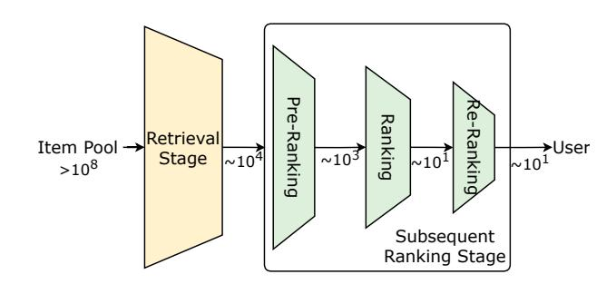
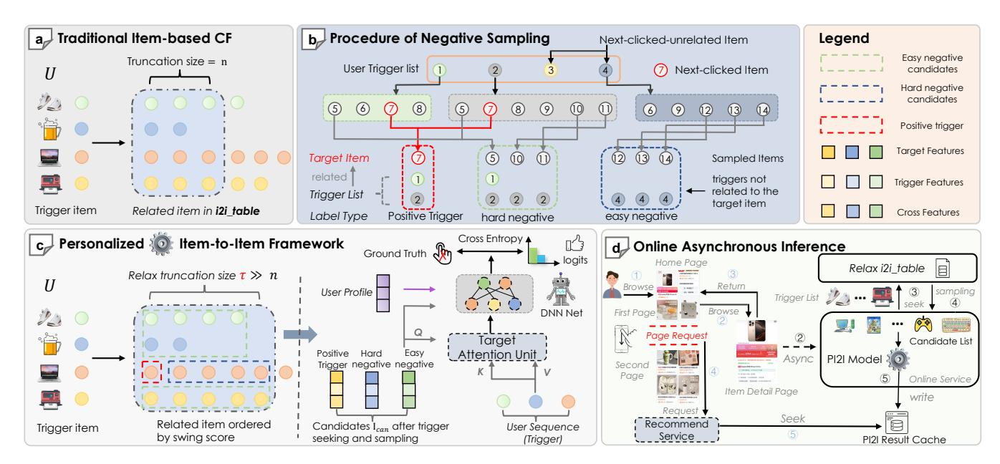
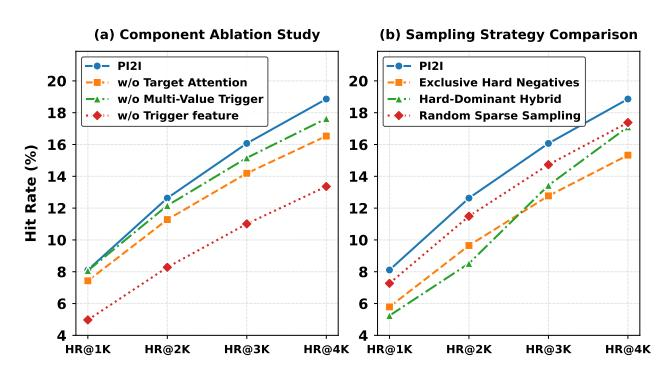
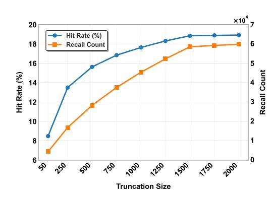
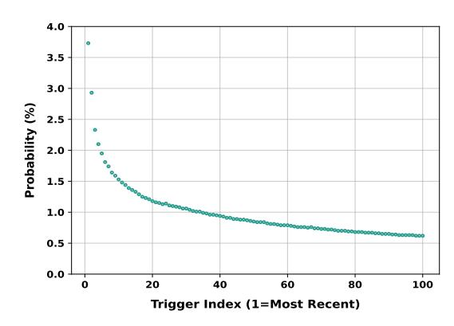
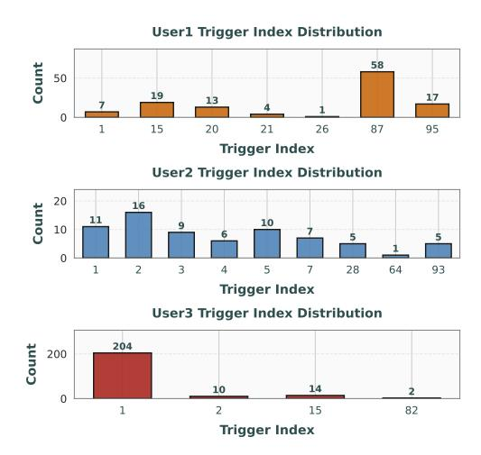

# PI2I: A Personalized Item-Based Collaborative Filtering Retrieval Framework

Shaoqing Wang∗ Alibaba Group Hangzhou, China wangshaoqing.wsq@alibaba-inc.com

Yingcai Ma∗ Alibaba Group Hangzhou, China yingcai.myc@alibaba-inc.com

Kairui Fu∗† Zhejiang University Hangzhou, China fukairui.fkr@zju.edu.cn

Ziyang Wang Alibaba Group Hangzhou, China shanyi.wzy@alibaba-inc.com

Dunxian Huang Alibaba Group Hangzhou, China dunxian.hdx@alibaba-inc.com

Yuliang Yan Alibaba Group Hangzhou, China yuliang.yyl@alibaba-inc.com

Jian Wu Alibaba Group Beijing, China joshuawu.wujian@alibaba-inc.com

## Abstract

Efficiently selecting relevant content from vast candidate pools is a critical challenge in modern recommender systems. Traditional methods, such as item-to-item collaborative filtering (CF) and two-tower models, often fall short in capturing the complex user-item interactions due to uniform truncation strategies and overdue user-item crossing. To address these limitations, we propose Personalized Item-to-Item (PI2I), a novel two-stage retrieval framework that enhances the personalization capabilities of CF. In the first Indexer Building Stage (IBS), we optimize the retrieval pool by relaxing truncation thresholds to maximize Hit Rate, thereby temporarily retaining more items users might be interested in. In the second Personalized Retrieval Stage (PRS), we introduce an interactive scoring model to overcome the limitations of inner product calculations, allowing for richer modeling of intricate user-item interactions. Additionally, we construct negative samples based on the trigger-target (item-to-item) relationship, ensuring consistency between offline training and online inference. Offline experiments on large-scale real-world datasets demonstrate that PI2I outperforms traditional CF methods and rivals Two-Tower models. Deployed in the "Guess You Like" section on Taobao, PI2I achieved a 1.05% increase in online transaction rates. In addition, we have released a large-scale recommendation dataset collected from Taobao, containing 130 million real-world user interactions used in the experiments of this paper. The dataset is publicly available at [https://huggingface.co/datasets/PI2I/PI2I,](https://huggingface.co/datasets/PI2I/PI2I) which could serve as a valuable benchmark for the research community.

© 2026 Copyright held by the owner/author(s). ACM ISBN 979-8-4007-2307-0/2026/04 <https://doi.org/10.1145/3774904.3792792>

# CCS Concepts

• Information systems → Recommender systems.

# Keywords

Large-scale Recommender System, Retrieval Method, Collaborative Filtering

### ACM Reference Format:

Shaoqing Wang, Yingcai Ma, Kairui Fu, Ziyang Wang, Dunxian Huang, Yuliang Yan, and Jian Wu. 2026. PI2I: A Personalized Item-Based Collaborative Filtering Retrieval Framework. In Proceedings of the ACM Web Conference 2026 (WWW '26), April 13–17, 2026, Dubai, United Arab Emirates. ACM, New York, NY, USA, [9](#page-8-0) pages.<https://doi.org/10.1145/3774904.3792792>

# 1 Introduction

In an era characterized by information overload, recommender systems (RS) [\[26\]](#page-8-1) have become crucial for online services like ecommerce [\[36\]](#page-8-2) and social media platforms [\[28\]](#page-8-3). To manage vast content and meet time constraints, industries often use multi-stage cascade ranking systems. These systems primarily consist of two stages: retrieval [\[13\]](#page-8-4) and ranking [\[24\]](#page-8-5). The retrieval, as shown in Figure [1,](#page-1-0) rapidly narrows down a large pool of candidates to a smaller, more relevant set with an emphasis on scalability and low computational complexity. Following retrieval, the pre-ranking and ranking stages occur, where more detailed scoring and refinement processes build on the initial filtering done by the retrieval stage.

As the first gateway for user-item filtering in recommender systems, the retrieval stage is crucial for optimizing recommendation quality to preserve the most precious items. However, due to large candidate pools and strict time constraints, many advanced models are impractical for industrial use during this phase. Current retrieval methods are primarily classified into collaborative filtering (CF) techniques [\[17\]](#page-8-6), neural network approaches [\[4,](#page-8-7) [21,](#page-8-8) [27\]](#page-8-9) and graph-based methods [\[5,](#page-8-10) [10\]](#page-8-11). CF typically leverages user behavior data to statistically or vectorially compute item similarity. The advantages of this approach include both high performance and excellent interpretability. However, it has the drawback of i)

∗Equal contribution

†Work is done during the internship at Alibaba Group.

[This work is licensed under a Creative Commons Attribution 4.0 International License.](https://creativecommons.org/licenses/by/4.0/legalcode) WWW '26, April 13–17, 2026, Dubai, United Arab Emirates

Figure 1: A general multi-stage architecture in modern recommender systems.

lacking user personalization information in the offline truncation[1](#page-1-1) process, and ii) consistent truncation size may also lead to the premature filtering of a large number of products that users might be interested in. Two-Tower neural models [\[4,](#page-8-7) [6,](#page-8-12) [14,](#page-8-13) [18\]](#page-8-14) separate user and item modeling for a balance of efficiency and effectiveness, utilizing deep learning but relying on Approximate Nearest Neighbors (ANN) for online inference. iii) The overdue user-item crossing limits their ability to fully capture user-item interactions. In recent times, Graph Neural Networks (GNNs) [\[10,](#page-8-11) [31,](#page-8-15) [33\]](#page-8-16) have been employed for different tasks to grasp detailed user-item interactions. Nonetheless, the complexity makes it quite challenging to implement GNNs in large-scale industrial contexts. Therefore, the development of a retrieval model that meets tight time criteria while adeptly capturing complex user-item interactions remains a formidable challenge.

Towards this end, we propose an innovative two-stage framework, PI2Ifor Personalized Item-to-Item collaborative filtering that balances scalability with model complexity for efficient user-item interaction capture. PI2I combines the strengths of collaborative filtering (CF) and advanced interaction models, optimizing both speed and precision in the retrieval stage. The whole process can be divided into the Indexer Building Stage (IBS) and Personalized Retrieval Stage (PRS). In the IBS, PI2I creates the initial item pool, strategically relaxing truncation thresholds to preserve a high Hit Rate while ensuring computational efficiency. This maximizes potential recommendations and provides a solid foundation for the next stage. As for the subsequent PRS, it employs an interactive model for more delicate scoring, surpassing simple inner product calculations to better capture complex user-item interactions. This interactive approach overcomes traditional limitations and significantly boosts retrieval performance. Additionally, we propose to construct negative samples using a Trigger-Target[2](#page-1-2) relationship, representing an improvement over traditional Two-Tower negative sampling techniques. The proposed sampling strategy improves alignment between offline training and online inference, thereby enhancing model consistency and effectiveness.

Our PI2I is not only a refinement of existing CF methods but also a strategic advancement that shows considerable performance improvements in offline experiments. It closes the gap with, and occasionally surpasses, mainstream Two-Tower models.

In summary, the main contributions are as follows:

- (1) We propose a two-stage retrieval framework named PI2I. i) Initially, a CF method is employed to delineate the retrieval item pool. This approach relaxes the truncation threshold and retains as much of the Hitrate of the candidate set as possible. ii) Subsequently, the negative samples are constructed using the Trigger-Target relationship. Compared to the Two-Tower negative sampling, this ensures consistency between offline training sampling and online inference. iii) Finally, an interactive model is utilized for retrieval scoring, surpassing the limitations of inner product calculations, thereby enhancing the model's capability.
- (2) This framework represents a personalized enhancement of the CF method. Offline experiments demonstrate that PI2I significantly outperforms CF and can exceed the performance of mainstream Two-Tower models.
- (3) We have implemented it for retrieval on Taobao's homepage "Guess You Like" recommendations, achieving a 1.05% online transaction improvement. Additionally, we plan to opensource a large-scale real retrieval dataset from Taobao.

# 2 Related Work

# 2.1 Collaborative Filtering

Collaborative filtering (CF) [\[17\]](#page-8-6) is a vital technique utilized during the retrieval phase of recommender systems, emphasizing the identification of similarities through collated feedback. Initial CF methods [\[3,](#page-8-17) [11\]](#page-8-18) concentrated on finding resemblances among users or items. In particular, user-based CF [\[30,](#page-8-19) [42\]](#page-8-20) often relies on metrics like cosine similarity or the Pearson correlation coefficient, which are derived from user evaluations within a user-item rating matrix. In contrast, item-based CF [\[20,](#page-8-21) [25\]](#page-8-22) evaluates the similarity between items by analyzing user interaction patterns with those items. By thoroughly examining user-item connections, Swing [\[38\]](#page-8-23) evaluates the bond between two items based on shared interactions. Subsequently, Matrix Factorization-based CF [\[16,](#page-8-24) [21,](#page-8-8) [23\]](#page-8-25) emerged to proficiently represent both users and items within a latent factor space. These techniques predict user-item interactions, such as ratings, by calculating the dot product of their latent factors.

# 2.2 Neural Network Methods

To maintain a balance between predictive accuracy and efficient inference, the Two-Tower method [\[37\]](#page-8-26), which segregates the computation of user-side and item-side features, stands as a leading approach in the retrieval phase. This technique capitalizes on the unique attributes of users and items to enhance retrieval performance, thus improving the system's overall effectiveness. For instance, DSSM [\[14\]](#page-8-13) transforms users and items into a shared dimensional semantic space. By maximizing the cosine similarity between their semantic vectors, it trains an implicit semantic model to facilitate retrieval tasks. YouTubeDNN [\[6\]](#page-8-12) applies mean pooling to handle sequential features on the user side, and subsequently utilizes several fully connected layers to derive representations of user features. Subsequently, certain researchers started investigating multi-interest models within retrieval algorithms. MIND [\[18\]](#page-8-14) and ComiRec [\[4\]](#page-8-7) employ capsule networks or attention networks to recognize users' varied interests. These methods facilitate retrieval,

1Truncation in the retrieval stage caps the most relevant items (e.g., Top-1,000) for each historical item to balance computational cost and relevance before further ranking. In this paper, the trigger can be regarded as the interacted item of each user.

This sampling method inherently introduces the association between triggers and the target, ensuring that the candidate set during inference and the sampling set during training are perfectly aligned, thereby optimizing both offline and online processes. Additionally, since the target items can be associated with multiple triggers simultaneously, this data information can further enhance the model's scoring capability, which will be elaborated in Section [4.4.](#page-6-1) However, it should be noted that if the next-clicked item does not exist among the target items of any triggers, the sample will be discarded. In practical scenarios of Taobao, approximately 15% of samples may not find such associations.

3.2.2 Light and Efficient Model. During online inference, the actual scoring volume is at the level of 100,000. PI2I needs to retain complex computational capabilities while maintaining highly efficient inference speed. Compared to the traditional approach, which takes several user behavioral sequences of different action types as input, PI2I utilizes only a single trigger list as the model sequence for efficiency. Moreover, in this stage, we employ target attention with complex interactions, including a cleverly pre-designed interaction between triggers and targets in terms of features.

The architecture of PI2I can be referred to in Figure [2\(](#page-3-0)c), which incorporates both user features and item features. User features encompass the user profile as well as the sequence of actions undertaken by the user over the past days. The behavioral sequence serves as a trigger for predicting subsequent items. To improve the responsiveness to these triggers and to amplify their influence on the activation of user interests, we concatenate the trigger features, target features, and cross-interaction features for prediction:

�� = ������ ��trigger ⊕ ��target ⊕ ��cross , (8)

where ⊕ denotes the concatenation operation between features. The trigger and target features include categorical side information regarding the items, such as seller ID and brand ID. The crossinteraction features include elements such as price differences, coclick occurrences, rankings within the indexing table, and other relevant metrics about the relationship between the trigger and target items.

The concatenated embeddings are fed into an MLP layer and then serve as the Query input to the Multi-Head Target Attention (MHA) module [\[29\]](#page-8-35), where user behavior sequences act as the corresponding Key and Value.

ℎ�������� = Softmax ������ seq �� �� seq √ ���� , (9)

������ = [ℎ������1 ⊕ ℎ������2 ⊕ . . . ⊕ ℎ��������] . (10)

After the Multi-Head Target Attention Module, the output vector is concatenated with user profile embedding and item embedding, and then fed into another MLP layer to get the final logits.

������������ = ������ ������ ⊕ ��profile ⊕ ��trigger ⊕ ��target ⊕ ��cross . (11)

3.2.3 Loss Function. In terms of model objectives, PI2I needs to ensure that the score of positive samples in the candidate set is greater than that of negative examples. Negative examples is denoted as V while the positive item is denoted as ��. The objective

function is to optimize the following negative likelihood:

L �� = ∑︁ ��∈�� − log exp�������������� exp�������������� + Í �� ∈V exp�������������� , (12)

where �� denotes the batch data for training.

3.2.4 Inference. Figure [2](#page-3-0) (d) depicts the online inference phase. Once a user clicks on an item, the asynchronous inference services would be triggered and PI2I dynamically leverages all items within the user's behavior sequence as contextual triggers. These triggers initiate a comprehensive retrieval process that systematically fetches all associated candidate items from the i2i\_table constructed in IBS, forming the complete scoring space of PRS. The model subsequently computes ranking scores across this isomorphic candidate set, with the top-K highest-scoring candidates constituting the final deterministic recommendation set. Further analysis of the process and data related to online inference can be found in Section [4.7.](#page-7-0)

### 4 Experiments

### 4.1 Dataset

- KuaiRec [\[8\]](#page-8-36) is a comprehensive, real-life dataset with high density, gathered from Kuaishou's online platform. It comprises millions of dense user interactions alongside extensive auxiliary information. After some processing by the authors, this dataset is relatively less sparse, and the number of interactions is relatively smaller than those in industrial settings.
- Taobao-Rec dataset was gathered from Taobao, an e-commerce recommender system that handles a billion-scale of users and items. It was randomly sampled from the Taobao Mobile App, which contains a user-item interaction matrix over 20 days. As a large-scale industrial dataset, it is extremely sparse and can reflect the characteristics of a real recommendation task. Furthermore, Table 1 shows both components of the dataset. Taobao-Large can be applied in large-scale distributed training models and is more closely aligned with the real-world recommendation task. Taobao-Small can be used to verify and test offline evaluation for recommendation methods.

Table 1: Statistics of the dataset.

|              | #users  | #Items     | #Interactions | Sparsity |
|--------------|---------|------------|---------------|----------|
| KuaiRec      | 7,176   | 10,728     | 12,530,806    | 83.7%    |
| Taobao-Large | 705,699 | 20,402,247 | 130,828,023   | 99.9%    |
| Taobao-Small | 36,535  | 2,897,861  | 6,434,021     | 99.9%    |

## 4.2 Experimental Setup

4.2.1 Evaluation Metrics. To assess the performance of the evaluated methods, the task is formulated as predicting a user's next interaction. We employ the Hit Rate (HR) described in Equation [5](#page-2-3) as the primary evaluation metric, as the proposed method is specifically designed to enhance retrieval effectiveness in the candidate matching phase. To align with this objective, we prioritize evaluating HR at larger top-K thresholds. Specifically, we set K=4000 for large-scale datasets and K=500 for smaller datasets to comprehensively measure coverage across both popular and long-tail items in the retrieved candidate sets.

Table 2: The performance of evaluated methods on Taobao Homepage. We use bold font to denote the best model and underline the next best-performing model.

| Dataset Method        | Hit@100 | Hit@200 | Hit@500 | Hit@1000 | Hit@2000 | Hit@3000 | Hit@4000 |
|-----------------------|---------|---------|---------|----------|----------|----------|----------|
| DSSM                  | 1.10%   | 1.53%   | 2.31%   | 3.13%    | 4.18%    | 4.95%    | 5.57%    |
| YoutubeDNN            | 1.17%   | 1.65%   | 2.51%   | 3.40%    | 4.58%    | 5.40%    | 6.06%    |
| SASRec Taobao-Large   | 2.65%   | 3.75%   | 5.61%   | 7.39%    | 9.51%    | 10.92%   | 12.00%   |
| Swing                 | 0.83%   | 1.15%   | 1.72%   | 2.31%    | 3.09%    | 3.67%    | 4.12%    |
| CORE                  | 1.18%   | 1.65%   | 2.50%   | 3.40%    | 4.60%    | 5.45%    | 6.15%    |
| PI2I                  | 1.55%   | 2.61%   | 5.03%   | 8.11%    | 12.63%   | 16.07%   | 18.86%   |
| DSSM                  | 1.41%   | 1.69%   | 2.14%   | 2.51%    | 3.07%    | 3.48%    | 3.74%    |
| YoutubeDNN            | 2.92%   | 3.36%   | 3.93%   | 4.45%    | 5.09%    | 5.48%    | 5.81%    |
| SASRec                | 2.82%   | 3.61%   | 4.61%   | 5.31%    | 6.02%    | 6.51%    | 6.87%    |
| Swing                 | 1.55%   | 2.07%   | 2.87%   | 3.56%    | 4.34%    | 4.92%    | 5.51%    |
| LightGCN Taobao-Small | 2.71%   | 3.28%   | 3.81%   | 4.43%    | 5.45%    | 6.47%    | 7.84%    |
| CORE                  | 3.26%   | 4.00%   | 4.81%   | 5.53%    | 6.34%    | 6.87%    | 7.25%    |
| DiffRec               | 2.84%   | 3.46%   | 4.57%   | 5.56%    | 6.48%    | 7.07%    | 7.51%    |
| RecDCL                | 2.01%   | 2.64%   | 3.63%   | 4.67%    | 5.69%    | 6.37%    | 6.97%    |
| PI2I                  | 1.52%   | 2.14%   | 3.46%   | 5.08%    | 7.72%    | 9.89%    | 11.92%   |

4.2.2 Baselines. For a complete evaluation of our method's performance, we conduct comparisons with item-based Collaborative Filtering methods, embedding-based retrieval (EBR-based) methods, and graph neural network (GNN-based) methods.

- (1) DSSM [\[14\]](#page-8-13) maps user & item into a low-dimensional semantic space, enabling efficient similarity calculation and matching through cosine similarity.
- (2) YoutubeDNN [\[6\]](#page-8-12) aggregates the user historical behavior through average pooling of item embeddings to generate a unified user representation for recommendation candidate generation.
- (3) SASRec [\[15\]](#page-8-37) leverages self-attention mechanisms to capture dynamic user behavior patterns and long-range dependencies in interaction sequences for next-item prediction.
- (4) Swing [\[38\]](#page-8-23) proposes that if multiple users purchase the same pair of items simultaneously, with relatively few other co-purchase behaviors, then the association between these items is more credible.
- (5) LightGCN [\[10\]](#page-8-11) is a simplified graph convolutional networkbased recommendation algorithm that enhances collaborative filtering by efficiently learning both user and item embeddings through neighbor aggregation.
- (6) CORE [\[12\]](#page-8-38) designs an encoder that uses a linear combination of item embeddings as the session embedding, ensuring that sessions and items reside in the same representation space.
- (7) DiffRec [\[32\]](#page-8-39) proposes a diffusion model-based method to generate user interaction, which adds noise to the user's historical interactions and then infers the interaction probabilities through a denoising process.
- (8) RecDCL [\[40\]](#page-8-40) is a contrastive learning based Self-supervised learning method for enhancing collaborative filtering. It combines batch contrastive learning and feature contrastive learning to optimize the unified distribution within users and items and enhance the robustness of these representations.

4.2.3 Implementation details. For all experimental configurations, the embedding dimension and mini-batch size were fixed at 64 and

512 across all models, respectively. Model optimization was conducted using the Adam optimizer [\[1\]](#page-8-41) with a fixed learning rate of 0.01. In GNN-based architectures, the graph neural network layer depth was set to 2, selected from 1,2,3 according to comprehensive validation. For transformer-based baselines, the number of transformer blocks is selected out of 1,2,3,4. For fair comparison, we implemented representative methods under the same framework RecBole [\[41\]](#page-8-42). For GNN-based and SSL-based methods, the implementation on the large dataset results in Out-Of-Memory error, so we only compare them on KuaiRec and Taobao-Small Dataset.

Table 3: The performance of evaluated methods on KuaiRec.

| Method     | Hit@20 | Hit@50 | Hit@100 | Hit@200 | Hit@500 |
|------------|--------|--------|---------|---------|---------|
| DSSM       | 1.65%  | 3.50%  | 5.91%   | 9.97%   | 19.03%  |
| YoutubeDNN | 1.90%  | 4.31%  | 7.42%   | 12.35%  | 23.86%  |
| SASRec     | 0.94%  | 2.31%  | 5.22%   | 11.94%  | 32.41%  |
| Swing      | 0.28%  | 0.51%  | 1.44%   | 2.53%   | 5.59%   |
| LightGCN   | 1.35%  | 4.44%  | 7.56%   | 13.95%  | 20.45%  |
| CORE       | 1.89%  | 4.09%  | 6.92%   | 11.79%  | 24.36%  |
| DiffRec    | 1.93%  | 3.90%  | 6.74%   | 10.92%  | 18.43%  |
| RecDCL     | 2.13%  | 4.27%  | 7.18%   | 11.77%  | 22.00%  |
| PI2I       | 2.33%  | 5.41%  | 9.96%   | 17.52%  | 34.26%  |

### 4.3 Overall Performance

In this subsection, we compare our proposed PI2I with the stateof-the-art and classic models on three datasets. The comparison results on the Taobao Dataset are presented in Table [4,](#page-7-1) and the comparison results on the KuaiRec Dataset [\[8\]](#page-8-36) are illustrated in Table [3.](#page-5-0) From the results, we have the following observations:

On the dense KuaiRec dataset, the proposed PI2I model demonstrates comprehensive superiority, significantly outperforming stateof-the-art baselines across all top-K HR metrics from HR@20 to HR@500, as evidenced by the benchmark results in Table [4.](#page-7-1) Meanwhile, we observe GNN-based methods such as LightGCN perform better than EBR-based methods on HR@top50-400, while EBRbased methods such as SASRec and CORE perform better than GNN-based methods on HR@top 500.

On the sparse Taobao dataset, the PI2I model demonstrates a clear performance trade-off: it significantly outperforms the baseline in HR at larger top-K thresholds (e.g., more than 40% improvements on HR@4000 compared to the second-best method), but fails to surpass the baseline at smaller ranges (e.g., HR@20). This disparity arises from its hybrid architecture, which integrates collaborative filtering (CF) and embedding-based retrieval (EBR) strategies, enabling it to balance the diversity of CF-based methods and personalization effectively. As a retrieval-stage model in industrial settings, PI2I is specifically designed to generate candidate sets containing thousands of items (K = 3000–4000) for the subsequent ranking phases. Therefore, its optimization aligns closely with maximizing largerange HR metrics. While its performance at smaller top-K values (e.g., 20) does not exceed that of pure EBR baselines, this limitation is compensated for by downstream ranking processes that enhance precision within the broader candidate pool.

Figure 3: Ablation study.

# 4.4 Ablation Study

The first ablation study is focused on three key components within the PRS stage: (1) Target Attention Ablation (w/o Target Attention), which eliminates the Target Attention (TA) module and substitutes it with standard self-attention mechanisms; (2) Multi-Value Trigger Simplification (w/o Multi-Value Trigger feature), where we discard the multi-value trigger representation and instead employ random selection from available triggers to maintain a single-value trigger feature; (3) Full Trigger Removal (w/o Trigger feature), which completely eliminates the trigger feature from the model architecture. We conducted ablation studies on the Taobao-Small dataset, with results shown in Figure [3.](#page-6-2) The key observations from it include:

- TA outperforms Self-Attention in the retrieval model. Replacing TA with Self-Attention results in a decrease in HR, highlighting the effectiveness of target interaction in the recommendation retrieval model.
- The Multi-Value Trigger feature enhances the scoring model. In contrast, the Single-Value Trigger approach, which randomly selects one trigger item per target item, reduces information gain and leads to lower performance. Furthermore, removing all triggers significantly degrades performance compared to the other setups.

The second ablation study is to investigate the impact of negative sample composition ratios on model performance, as illustrated in Figure [3\(](#page-6-2)b). Three distinct sampling strategies were systematically compared:

- Exclusive Hard Negatives: All negative samples (N=20 per positive) were drawn from the same triggers of the target item.
- Hard-Dominant Hybrid: Maintained baseline hard negative sample count (N=20) with only 10 easy negatives (1/8 of baseline easy negatives).
- Random Sparse Sampling: Employed random selection of both negative types at 50% baseline density (N=50), preserving original hard/easy ratio but reducing absolute quantities.

Based on the figure, we have the following conclusions: Both hard negatives and easy negatives are crucial elements in the sampling procedure. Relying exclusively on hard negative results in suboptimal outcomes, as these items differ from the prediction scoring space. Furthermore, a reduction in the quantity of negative samples may also contribute to a decline in model performance.

Figure 4: Truncation Parameter Trade-off.

### 4.5 Parameter Study

In this subsection, we study the impact of the key parameter truncation size T in the IBS stage. With the increase in the truncation size of the indexer table, the slope of the HR becomes slower. As a trade-off between performance and system efficiency, we need to select a proper parameter of truncation size. A much longer truncation size may result in delayed processing of user requests after the deployment of the retrieval model. The relationship of truncation size and HR is shown in Figure [4.](#page-6-3) By three key observations from the figure, T = 1250 is identified as the optimal truncation size for the IBS phase.

Performance Saturation. When the truncation size exceeds 1250, the HR exhibits marginal improvements of less than 0.5% per 250-unit increment, indicating diminishing returns.

Cost-Efficiency Threshold. Below T = 1500, total recall count as well as retrieval operations decrease exponentially (46% reduction when halving T), while HR degrades linearly (15% relative drop). Setting T = 1250 reduces retrieval operations by 12.5% compared to T = 1500, with only a 3.4% sacrifice in HR.

Operational Stability. The T = 1250 configuration preserves 97% of maximum HR while keeping latency and resource utilization within safe limits at Taobao platform. This balance ensures sustainable system performance without compromising recommendation quality.

Figure 5: Temporal Decay Pattern of Behavior Triggering.

### 4.6 Case Study

This subsection investigates the temporal decay characteristics of behavioral triggering mechanisms and demonstrates the personalized nature of trigger distributions among users. As evidenced in Figure [5,](#page-7-2) the observed exponential decay pattern reveals a strong inverse correlation between trigger probability and behavioral recency, where proximal interactions (index=1) exhibit 6.02× higher triggering likelihood than distant ones (index=100), confirming the critical role of temporal proximity in interaction modeling.

However, an examination of results across different users reveals significant personalization in trigger distributions, as illustrated in Figure [6.](#page-7-3) We counted the clicks of 3 users over a period of time, with the vertical axis representing the number of clicks and the horizontal axis representing the trigger index that triggered each click. This personalization suggests that different users may have varying trigger positions that influence their next-click items. For instance, a user who purchased colas a month ago may exhibit a tendency to re-buy them recently, resulting in a larger trigger index value within the 1-100 range. Conversely, another user with a strong recent interest in a variety of dresses would likely have a lower trigger index, closer to 1, reflecting her frequent clicks on dresses. The findings presented in Figure [6](#page-7-3) demonstrate that the PI2I model effectively captures these trends.

Furthermore, distinct users exhibit varying distributions of trigger indices, which underscores the efficacy of the PRS stage. Unlike traditional item-based collaborative filtering methods, which truncate the index at a uniform position, the model demonstrates the capability to adjust truncation in accordance with user profiles and their specific behaviors.

## 4.7 Online Deployment

4.7.1 Online Implementation. As illustrated in Figure [2\(](#page-3-0)d), we use the Nearline-Deployment [\[19\]](#page-8-43) to address the scalability challenges. When a user clicks a product detail page, an asynchronous PI2I inference request is triggered. Tens of thousands of candidates will be retrieved by the IBS stage. In order to obtain pertinent items, the PRS stage employs a scoring model to narrow down the pool of candidates. The inference writes PI2I results into the cache table in 200ms, ensuring no impact on the main recommendation service's performance. The recommendation service could search the cache table and get the matching results asynchronously when

Figure 6: Trigger Index Distribution Analysis.

browsing and requesting. During subsequent browsing, the main recommendation service cached PI2I results in 5ms with over 95% hit rate. PI2I's design ensures real-time application of user clicks to the next recommendation results.

4.7.2 Online A/B Tests. We carried out a 15-day randomized trial involving 5% of Taobao's traffic, focusing solely on PI2I recall as the differentiating factor between the control group (using base retrieval methods) and the test group (base retrieval plus PI2I). The base retrieval techniques included Swing and DM++ (deep match with industrial optimization enhancements). Our online system monitored HR, CTR, TPM (Transactions Per Mille), and PVR (proportion of exposure) to assess performance. The results, detailed in Table 4, demonstrate that PI2I outperforms the other methods, boosting user transaction intent and proving advantageous for large-scale services. On Taobao's homepage, which receives hundreds of millions of views daily, PI2I achieved an improvement of +0.8% in HR, contributing to a notable increase in product transactions by +1.05%.

Table 4: online HR, CTR, TPM and PVR performance.

| Methods | Recall Size | HR     | CTR     | TPM      | PVR    |
|---------|-------------|--------|---------|----------|--------|
| Swing   | 5,225       | 6.30%  | base    | base     | 10.59% |
| DM++    | 4,399       | 8.96%  | +11.27% | +57.30%  | 26.00% |
| PI2I    | 4,094       | 12.26% | +51.27% | +116.09% | 31.70% |

### 5 Conclusion

In this paper, we present a novel two-stage retrieval framework designed to enhance personalization in item-based collaborative filtering. Through our experimental setup, we have demonstrated the superior performance of our framework on both dense and sparse datasets. Additionally, we validated its effectiveness through long-term online A/B testing, leading to its deployment for all users in the "Guess You Like" section on the Taobao homepage. Looking ahead, we plan to further explore the information from the indexer table to enhance the performance of the online matching system.

### References

[1] Kingma DP Ba J Adam et al. 2014. A method for stochastic optimization. arXiv preprint arXiv:1412.6980 1412, 6 (2014). [2] Oren Barkan and Noam Koenigstein. 2016. Item2vec: neural item embedding for collaborative filtering. In 2016 IEEE 26th International Workshop on Machine Learning for Signal Processing (MLSP). IEEE, 1–6. [3] Robert M Bell and Yehuda Koren. 2007. Improved neighborhood-based collaborative filtering. In KDD cup and workshop at the 13th ACM SIGKDD international conference on knowledge discovery and data mining. sn, 7–14. [4] Yukuo Cen, Jianwei Zhang, Xu Zou, Chang Zhou, Hongxia Yang, and Jie Tang. 2020. Controllable multi-interest framework for recommendation. In Proceedings of the 26th ACM SIGKDD International Conference on Knowledge Discovery & Data Mining. 2942–2951. [5] Jianxin Chang, Chen Gao, Yu Zheng, Yiqun Hui, Yanan Niu, Yang Song, Depeng Jin, and Yong Li. 2021. Sequential recommendation with graph neural networks. In Proceedings of the 44th international ACM SIGIR conference on research and development in information retrieval. 378–387. [6] Paul Covington, Jay Adams, and Emre Sargin. 2016. Deep neural networks for youtube recommendations. In Proceedings of the 10th ACM conference on recommender systems. 191–198. [7] Wenqi Fan, Yao Ma, Qing Li, Yuan He, Eric Zhao, Jiliang Tang, and Dawei Yin. 2019. Graph neural networks for social recommendation. In The world wide web conference. 417–426. [8] Chongming Gao, Shijun Li, Wenqiang Lei, Jiawei Chen, Biao Li, Peng Jiang, Xiangnan He, Jiaxin Mao, and Tat-Seng Chua. 2022. KuaiRec: A fully-observed dataset and insights for evaluating recommender systems. In Proceedings of the 31st ACM International Conference on Information & Knowledge Management. 540–550. [9] Mihajlo Grbovic and Haibin Cheng. 2018. Real-time personalization using embeddings for search ranking at airbnb. In Proceedings of the 24th ACM SIGKDD international conference on knowledge discovery & data mining. 311–320. [10] Xiangnan He, Kuan Deng, Xiang Wang, Yan Li, Yongdong Zhang, and Meng Wang. 2020. Lightgcn: Simplifying and powering graph convolution network for recommendation. In Proceedings of the 43rd International ACM SIGIR conference on research and development in Information Retrieval. 639–648. [11] Jon Herlocker, Joseph A Konstan, and John Riedl. 2002. An empirical analysis of design choices in neighborhood-based collaborative filtering algorithms. Information retrieval 5 (2002), 287–310. [12] Yupeng Hou, Binbin Hu, Zhiqiang Zhang, and Wayne Xin Zhao. 2022. CORE: Simple and Effective Session-based Recommendation within Consistent Representation Space. arXiv[:2204.11067](https://arxiv.org/abs/2204.11067) [cs.IR]<https://arxiv.org/abs/2204.11067> [13] Junjie Huang, Jizheng Chen, Jianghao Lin, Jiarui Qin, Ziming Feng, Weinan Zhang, and Yong Yu. 2024. A Comprehensive Survey on Retrieval Methods in Recommender Systems. arXiv preprint arXiv:2407.21022 (2024). [14] Po-Sen Huang, Xiaodong He, Jianfeng Gao, Li Deng, Alex Acero, and Larry Heck. 2013. Learning deep structured semantic models for web search using clickthrough data. In Proceedings of the 22nd ACM international conference on Information & Knowledge Management. 2333–2338. [15] Wang-Cheng Kang and Julian McAuley. 2018. Self-Attentive Sequential Recommendation. arXiv[:1808.09781](https://arxiv.org/abs/1808.09781) [cs.IR]<https://arxiv.org/abs/1808.09781> [16] Yehuda Koren, Robert Bell, and Chris Volinsky. 2009. Matrix factorization techniques for recommender systems. Computer 42, 8 (2009), 30–37. [17] Yehuda Koren, Steffen Rendle, and Robert Bell. 2021. Advances in collaborative filtering. Recommender systems handbook (2021), 91–142. [18] Chao Li, Zhiyuan Liu, Mengmeng Wu, Yuchi Xu, Huan Zhao, Pipei Huang, Guoliang Kang, Qiwei Chen, Wei Li, and Dik Lun Lee. 2019. Multi-interest network with dynamic routing for recommendation at Tmall. In Proceedings of the 28th ACM international conference on information and knowledge management. 2615–2623. [19] Jin Li, Jie Liu, Shangzhou Li, Yao Xu, Ran Cao, Qi Li, Biye Jiang, Guan Wang, Han Zhu, Kun Gai, and Xiaoqiang Zhu. 2021. Truncation-Free Matching System for Display Advertising at Alibaba. arXiv[:2102.09283](https://arxiv.org/abs/2102.09283) [cs.IR] [https://arxiv.org/](https://arxiv.org/abs/2102.09283) [abs/2102.09283](https://arxiv.org/abs/2102.09283) [20] Greg Linden, Brent Smith, and Jeremy York. 2003. Amazon. com recommendations: Item-to-item collaborative filtering. IEEE Internet computing 7, 1 (2003), 76–80. [21] Jarana Manotumruksa, Craig Macdonald, and Iadh Ounis. 2017. A deep recurrent collaborative filtering framework for venue recommendation. In Proceedings of the 2017 ACM on Conference on Information and Knowledge Management. 1429–1438. [22] Tomas Mikolov, Kai Chen, Greg Corrado, and Jeffrey Dean. 2013. Efficient estimation of word representations in vector space. arXiv preprint arXiv:1301.3781 (2013). [23] Andriy Mnih and Russ R Salakhutdinov. 2007. Probabilistic matrix factorization. Advances in neural information processing systems 20 (2007). [24] Changhua Pei, Yi Zhang, Yongfeng Zhang, Fei Sun, Xiao Lin, Hanxiao Sun, Jian Wu, Peng Jiang, Junfeng Ge, Wenwu Ou, et al. 2019. Personalized re-ranking for recommendation. In Proceedings of the 13th ACM conference on recommender systems. 3–11. [25] Badrul Sarwar, George Karypis, Joseph Konstan, and John Riedl. 2001. Item-based collaborative filtering recommendation algorithms. In Proceedings of the 10th international conference on World Wide Web. 285–295. [26] Guy Shani and Asela Gunawardana. 2011. Evaluating recommendation systems. Recommender systems handbook (2011), 257–297. [27] Fei Sun, Jun Liu, Jian Wu, Changhua Pei, Xiao Lin, Wenwu Ou, and Peng Jiang. 2019. BERT4Rec: Sequential recommendation with bidirectional encoder representations from transformer. In Proceedings of the 28th ACM international conference on information and knowledge management. 1441–1450. [28] Shisong Tang, Qing Li, Xiaoteng Ma, Ci Gao, Dingmin Wang, Yong Jiang, Qian Ma, Aoyang Zhang, and Hechang Chen. 2022. Knowledge-based temporal fusion network for interpretable online video popularity prediction. In Proceedings of the ACM Web Conference 2022. 2879–2887. [29] Ashish Vaswani, Noam Shazeer, Niki Parmar, Jakob Uszkoreit, Llion Jones, Aidan N Gomez, Łukasz Kaiser, and Illia Polosukhin. 2017. Attention is all you need. Advances in neural information processing systems 30 (2017). [30] Jun Wang, Arjen P De Vries, and Marcel JT Reinders. 2006. Unifying userbased and item-based collaborative filtering approaches by similarity fusion. In Proceedings of the 29th annual international ACM SIGIR conference on Research and development in information retrieval. 501–508. [31] Jizhe Wang, Pipei Huang, Huan Zhao, Zhibo Zhang, Binqiang Zhao, and Dik Lun Lee. 2018. Billion-scale commodity embedding for e-commerce recommendation in alibaba. In Proceedings of the 24th ACM SIGKDD international conference on knowledge discovery & data mining. 839–848. [32] Wenjie Wang, Yiyan Xu, Fuli Feng, Xinyu Lin, Xiangnan He, and Tat-Seng Chua. 2023. Diffusion Recommender Model. arXiv[:2304.04971](https://arxiv.org/abs/2304.04971) [cs.IR] [https://arxiv.org/](https://arxiv.org/abs/2304.04971) [abs/2304.04971](https://arxiv.org/abs/2304.04971) [33] Xiang Wang, Xiangnan He, Meng Wang, Fuli Feng, and Tat-Seng Chua. 2019. Neural graph collaborative filtering. In Proceedings of the 42nd international ACM SIGIR conference on Research and development in Information Retrieval. 165–174. [34] Shiwen Wu, Fei Sun, Wentao Zhang, Xu Xie, and Bin Cui. 2022. Graph neural networks in recommender systems: a survey. Comput. Surveys 55, 5 (2022), 1–37. [35] Zonghan Wu, Shirui Pan, Fengwen Chen, Guodong Long, Chengqi Zhang, and S Yu Philip. 2020. A comprehensive survey on graph neural networks. IEEE transactions on neural networks and learning systems 32, 1 (2020), 4–24. [36] Yueqi Xie, Peilin Zhou, and Sunghun Kim. 2022. Decoupled side information fusion for sequential recommendation. In Proceedings of the 45th international ACM SIGIR conference on research and development in information retrieval. 1611– 1621. [37] Ji Yang, Xinyang Yi, Derek Zhiyuan Cheng, Lichan Hong, Yang Li, Simon Xiaoming Wang, Taibai Xu, and Ed H Chi. 2020. Mixed negative sampling for learning two-tower neural networks in recommendations. In Companion proceedings of the web conference 2020. 441–447. [38] Xiaoyong Yang, Yadong Zhu, Yi Zhang, Xiaobo Wang, and Quan Yuan. 2020. Large scale product graph construction for recommendation in e-commerce. arXiv preprint arXiv:2010.05525 (2020). [39] Xiaoyong Yang, Yadong Zhu, Yi Zhang, Xiaobo Wang, and Quan Yuan. 2020. Large Scale Product Graph Construction for Recommendation in E-commerce. arXiv[:2010.05525](https://arxiv.org/abs/2010.05525) [cs.IR]<https://arxiv.org/abs/2010.05525> [40] Dan Zhang, Yangliao Geng, Wenwen Gong, Zhongang Qi, Zhiyu Chen, Xing Tang, Ying Shan, Yuxiao Dong, and Jie Tang. 2024. RecDCL: Dual Contrastive Learning for Recommendation. In Proceedings of the ACM Web Conference 2024 (WWW '24). ACM, 3655–3666.<https://doi.org/10.1145/3589334.3645533> [41] Wayne Xin Zhao, Shanlei Mu, Yupeng Hou, Zihan Lin, Kaiyuan Li, Yushuo Chen, Yujie Lu, Hui Wang, Changxin Tian, Xingyu Pan, Yingqian Min, Zhichao Feng, Xinyan Fan, Xu Chen, Pengfei Wang, Wendi Ji, Yaliang Li, Xiaoling Wang, and Ji-Rong Wen. 2020. RecBole: Towards a Unified, Comprehensive and Efficient Framework for Recommendation Algorithms. arXiv preprint arXiv:2011.01731 (2020). [42] Zhi-Dan Zhao and Ming-Sheng Shang. 2010. User-based collaborative-filtering recommendation algorithms on hadoop. In 2010 third international conference on knowledge discovery and data mining. IEEE, 478–481. [43] Jie Zhou, Ganqu Cui, Shengding Hu, Zhengyan Zhang, Cheng Yang, Zhiyuan Liu, Lifeng Wang, Changcheng Li, and Maosong Sun. 2020. Graph neural networks: A review of methods and applications. AI open 1 (2020), 57–81.