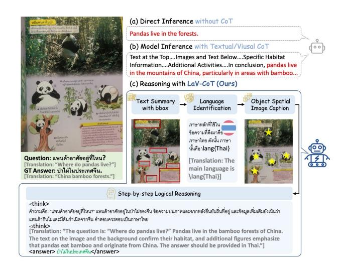
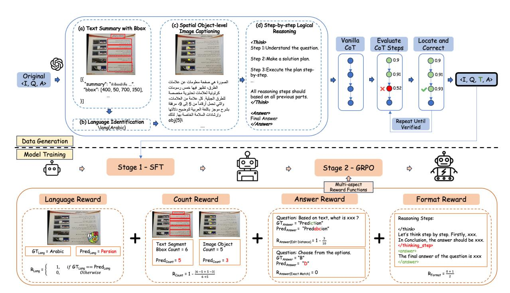
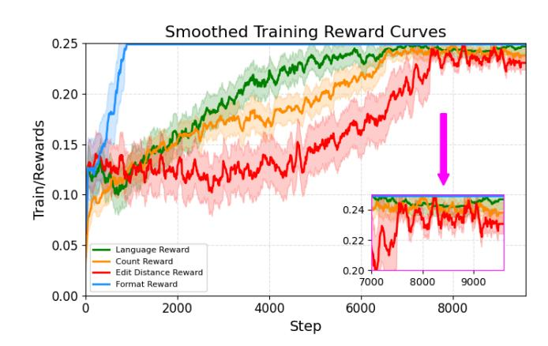
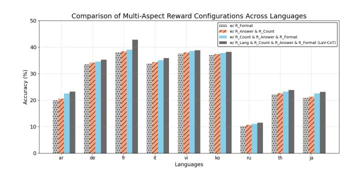

# LaV-CoT: Language-Aware Visual CoT with Multi-Aspect Reward Optimization for Multilingual Text-Centric VQA

[Jing Huang](https://orcid.org/0009-0005-5651-9033)∗ jh.jj@antgroup.com Ant Digital Technologies, Ant Group Singapore, Singapore

[Zhiya Tan](https://orcid.org/0009-0004-2433-1389)∗ zhiya001@e.ntu.edu.sg College of Computing and Data Science, Nanyang Technological University Singapore, Singapore Ant Digital Technologies, Ant Group Singapore, Singapore

[Shutao Gong](https://orcid.org/0009-0009-5643-0441) gongshutao.gst@digital-engine.com Ant Digital Technologies, Ant Group Changsha, China

[Fanwei Zeng](https://orcid.org/0009-0005-7872-8610) fanwei.zfw@antgroup.com Ant Digital Technologies, Ant Group Hangzhou, China

[Joey Tianyi Zhou](https://orcid.org/0000-0002-4675-7055) joey\_zhou@cfar.a-star.edu.sg CFAR, Agency for Science, Technology and Research Singapore, Singapore IHPC, Agency for Science, Technology and Research Singapore, Singapore

[Changtao Miao](https://orcid.org/0000-0002-7634-9992)† miaochangtao.mct@antgroup.com Ant Group Hangzhou, China

Huazhe Tan huazhe.thz@antgroup.com Ant Digital Technologies, Ant Group Beijing, China

Weibin Yao wenjing.ywb@antgroup.com Ant Digital Technologies, Ant Group Singapore, Singapore

[Jianshu Li](https://orcid.org/0000-0001-8554-6886)† jianshu.l@antgroup.com Ant Digital Technologies, Ant Group Singapore, Singapore

# Abstract

Multilingual Text-Centric Visual Question Answering (TEC-VQA) has become crucial for real-world applications, as it requires finegrained understanding and reasoning over multilingual scene text. Recent advances in vision-language models (VLMs) have demonstrated strong potential in tackling multimodal tasks. However, most existing approaches rely primarily on textual Chain-of-Thought (CoT) and provide limited support for multilingual multimodal reasoning. To address this gap, we introduce LaV-CoT, the first Language-aware Visual CoT framework with Multi-Aspect Reward Optimization. LaV-CoT incorporates an interpretable multi-stage reasoning pipeline consisting of text summary with bounding box, language identification, spatial object-level captioning, and step-bystep logical reasoning. To improve reasoning accuracy and crosslingual generalization, we propose a novel verifiable Multi-Aspect Reward Optimization in addition to supervised fine-tuning that incorporates rewards for linguistic consistency, structural fidelity, and response accuracy. Extensive evaluations on public datasets,

[This work is licensed under a Creative Commons Attribution-NonCommercial-](https://creativecommons.org/licenses/by-nc-nd/4.0)[NoDerivatives 4.0 International License.](https://creativecommons.org/licenses/by-nc-nd/4.0)

WWW '26, Dubai, United Arab Emirates © 2026 Copyright held by the owner/author(s). ACM ISBN 979-8-4007-2307-0/2026/04 <https://doi.org/10.1145/3774904.3792793>

including MMMB, Multilingual MMBench, and MTVQA, show that LaV-CoT outperforms open-source models of similar size by up to ∼9.5% accuracy, even surpassing open-source models more than twice its size, and further exceeding several state-of-the-art proprietary models. Moreover, LaV-CoT has been integrated into our online Intelligent Document Processing platform. A further online A/B test demonstrates an ∼8.7% improvement in acceptance rate, validating its effectiveness in industrial deployment and commercial applications. Our code is available at this [repository](https://github.com/HJNVR/LaV-CoT).

### CCS Concepts

- Computing methodologies → Machine learning; Computer vision; Natural language processing.

# Keywords

Multilingual Vision-Language Models; Multilingual Text-Centric VQA; Visual Chain-of-Thought Reasoning; Reinforcement Tuning

#### ACM Reference Format:

Jing Huang, Zhiya Tan, Shutao Gong, Fanwei Zeng, Joey Tianyi Zhou, Changtao Miao, Huazhe Tan, Weibin Yao, and Jianshu Li. 2026. LaV-CoT: Language-Aware Visual CoT with Multi-Aspect Reward Optimization for Multilingual Text-Centric VQA. In Proceedings of the ACM Web Conference 2026 (WWW '26), April 13–17, 2026, Dubai, United Arab Emirates. ACM, New York, NY, USA, [12](#page-11-0) pages.<https://doi.org/10.1145/3774904.3792793>

∗Both authors contributed equally to the paper.

†Corresponding authors.

Figure 1: Overview of LaV-CoT: (a) Direct model answers may be incorrect with limited interpretability. (b) Textual or Visual CoT reasoning improves reasoning transparency but still suffers from weak visual grounding and linguistic inconsistency. (c) Our method proposes an interpretable multi-stage reasoning pipeline and gets the correct final answer.

#### 1 Introduction

Large Vision-Language Models (VLMs) [\[1,](#page-8-0) [2,](#page-8-1) [9,](#page-8-2) [15,](#page-8-3) [17,](#page-8-4) [18,](#page-8-5) [21,](#page-8-6) [25,](#page-8-7) [34,](#page-9-0) [38,](#page-9-1) [40,](#page-9-2) [41,](#page-9-3) [53\]](#page-9-4) have advanced rapidly in recent years, demonstrating strong performance on multimodal tasks such as image captioning [\[15,](#page-8-3) [39,](#page-9-5) [52\]](#page-9-6), text–region grounding [\[37,](#page-9-7) [49\]](#page-9-8) and visual question answering [\[3,](#page-8-8) [52\]](#page-9-6). Driven by the growing demand from international industrial applications, multilingual Text-Centric Visual Question Answering (TEC-VQA) [\[29,](#page-8-9) [36,](#page-9-9) [48\]](#page-9-10) has emerged as a key task to evaluate models' ability to interpret and reason over multilingual text in images. Recent VLMs have begun to conduct preliminary evaluations on multilingual TEC-VQA benchmarks.

Although recent general VLMs are trained on an increasing number of VQA datasets, they still suffer from a scarcity of multilingual text-centric data. Expert models [\[18,](#page-8-5) [34\]](#page-9-0) include additional relevant datasets but remain limited in multimodal reasoning, leaving multilingual TEC-VQA a persistent challenge. As illustrated in Figure [1,](#page-1-0) three major issues persist: (i) Limited Interpretability. Direct answers produced by recent VLMs [\[2,](#page-8-1) [40\]](#page-9-2) remain as black boxes, hindering model transparency and interpretability. (ii) Visual–textual misalignment. Textual CoT approaches [\[42,](#page-9-11) [45\]](#page-9-12) introduce intermediate natural language reasoning steps to enhance performance. However, these text-only rationales often under-exploit visual cues, leading to weak visual grounding. (iii) Language inconsistency. Recent Visual CoT methods [\[31,](#page-9-13) [51\]](#page-9-14) incorporate visual cues to enable multimodal reasoning, but still suffer from inconsistency across languages. To address these challenges, we propose LaV-CoT, a Language-aware Visual CoT reasoning framework with Multi-Aspect Reward Optimization. LaV-CoT introduces an interpretable multi-stage reasoning pipeline that integrates four complementary components: (1) Text Summary with Bounding Box [\[46\]](#page-9-15), which localizes and extracts textual content from the image; (2) Language

Identification, which ensures accurate linguistic understanding and processing; (3) Spatial Object-level Captioning [\[16\]](#page-8-10), which grounds visual entities within the scene; and (4) Step-by-step Logical Reasoning [\[35,](#page-9-16) [45,](#page-9-12) [50\]](#page-9-17), where the model systematically analyzes the question and integrates information across modalities to reach the final answer. Together, these components form a structured and interpretable reasoning process, enabling fine-grained cross-modal alignment and improving interpretability in multilingual multimodal tasks. A further challenge lies in constructing high-quality multilingual reasoning data due to the high cost of manual annotation. To this end, we design an automatic data curation method that generates structured and verifiable multilingual multimodal CoT annotations through iterative generation, correction, and refinement [\[19,](#page-8-11) [31,](#page-9-13) [47\]](#page-9-18), thereby preserving both linguistic fidelity and reasoning quality at scale.

Recent studies have shown that reinforcement learning (RL) leads to better generalization in both rule-based and visual reasoning tasks [\[4\]](#page-8-12). However, existing RL approaches are often limited by coarse-grained, binary rewards that fail to capture fine-grained reasoning quality for multilingual TEC-VQA. Therefore, we propose a two-stage paradigm that combines supervised fine-tuning (SFT) [\[2,](#page-8-1) [3,](#page-8-8) [15\]](#page-8-3) with language-aware Group Relative Policy Optimization (GRPO) [\[24,](#page-8-13) [26,](#page-8-14) [32\]](#page-9-19). Unlike standard optimization methods, our GRPO variant is guided by verifiable multi-aspect rewards, including language consistency, text segment and object count accuracy, final answer edit distance, and format compliance. This multi-aspect reward design enables stable optimization and robust reasoning across diverse languages and modalities.

Extensive experiments demonstrate that a 3B-parameter model (Qwen2.5-VL-3B) trained under our framework outperforms comparable open-source baselines and advanced proprietary ones in multilingual visual reasoning. A further online A/B testing shows improvements in both answer acceptance rate and user satisfaction. Our main contributions are as follows:

- We propose LaV-CoT, the first framework to unify languageaware visual CoT reasoning with multi-aspect reward optimization for multilingual text-centric VQA tasks.
- We design an automatic data curation method that produces scalable, high-quality multilingual CoT annotations through iterative generation, correction, and refinement.
- We design a language-aware GRPO algorithm with verifiable multi-aspect rewards, enhancing reasoning robustness and cross-modal alignment.
- We validate our framework on public benchmarks and through an online A/B test, highlighting both state-of-the-art multilingual multimodal reasoning performance and its effectiveness in real-world deployment.

# 2 RELATED WORKS

### 2.1 Multilingual Text-Centric VQA in Vision-Language Models

Recent advances in vision-language models (VLMs) have significantly advanced visual question answering, particularly due to their strong zero-shot generalization capabilities. However, unlike conventional VQA, TEC-VQA represents a more complex challenge,

Figure 2: The framework includes an automated data generation pipeline, which leverages a multi-step reasoning process comprising (a) Text Summary with BBox, (b) Language Identification, (c) Spatial Object-level Image Captioning, and (d) Stepby-step Logical Reasoning. This reasoning pipeline first produces vanilla CoT annotations, which are then iteratively refined through rigorous verification to ensure high-quality supervision. The generated data subsequently supports a two-stage training paradigm combining SFT with GRPO. Multi-aspect Reward functions cover language consistency, count accuracy, the edit distance between predicted and ground-truth answers, and format compliance, collectively enhancing structural understanding and reinforcing robust reasoning capabilities.

particularly in multilingual settings, where cross-lingual text understanding and visual grounding must be performed jointly. Recent general models, such as Qwen2.5-VL [\[2\]](#page-8-1) and InternVL3.5 [\[40\]](#page-9-2), improve multilingual TEC-VQA performance by leveraging publicly available datasets spanning multiple languages. Expert models such as Parrot [\[34\]](#page-9-0) further target multilingual text-centric reasoning by conditioning visual tokens on diverse language inputs and employing a Mixture-of-Experts (MoE) approach to enhance alignment across multilingual tokens.

### 2.2 Chain-of-Thought Reasoning in Vision Language Models

CoT prompting [\[42\]](#page-9-11) provides intermediate steps to tackle challenging problems such as commonsense reasoning and logical deduction [\[5\]](#page-8-15). However, textual CoT methods rely solely on linguistic reasoning and often underutilize visual cues, resulting in weak visual grounding. Recent work, such as LLaVA-CoT [\[45\]](#page-9-12), employs a structured CoT mechanism that systematically decomposes complex reasoning tasks using textual CoT enhanced with visual inputs, improving multimodal reasoning accuracy. Moreover, studies have shown that integrating CoT strategies significantly enhances the reasoning capability of VLMs, particularly in TEC-VQA. For instance, Visual CoT [\[31\]](#page-9-13) improves interpretability by generating

bounding boxes that highlight relevant image regions alongside textual explanations, providing clearer visual grounding. Building upon these advancements, we propose a systematic and interpretable language-aware visual CoT pipeline specifically designed to address the challenges of multilingual vision-language reasoning.

#### 2.3 Visual Reinforcement Fine-Tuning

With the emergence of reasoning models such as OpenAI's o1 [\[30\]](#page-8-16) and DeepSeek-R1 [\[26\]](#page-8-14), research on large language models (LLMs) has increasingly focused on enhancing reasoning capabilities through reinforcement learning (RL). Recent studies extend this paradigm to vision-language models (VLMs) via RL-based posttraining, known as Visual Reinforcement Fine-Tuning (Visual-RFT). For instance, Visual-RFT [\[23\]](#page-8-17) extends reinforcement fine-tuning to visual domains by training VLMs with multiple reasoning trajectories and optimizing them using visually verifiable rewards and policy gradient methods such as GRPO. Furthermore, Visionary-R1 [\[43\]](#page-9-20) introduces a reinforcement learning framework that encourages visual understanding prior to reasoning by employing a structured caption–reason–answer training paradigm. In our work, we design verifiable multi-aspect reward functions to provide more granular and reliable feedback, enhancing reinforcement learning for multilingual TEC-VQA.

Table 1: The number of samples selected from each benchmark, along with the language categories covered.

| Dataset        | Language                   | Size |
|----------------|----------------------------|------|
| COCO2017       | EN,ZH,PT,AR,TR,RU          | 73k  |
| Visual-Genome  | EN,ZH,PT,AR,TR,RU          | 18k  |
| GQA            | EN,ZH,PT,AR,TR,RU          | 15k  |
| OCR-VQA        | EN,ZH,PT,AR,TR,RU          | 16k  |
| TextVQA        | EN,ZH,PT,AR,TR,RU          | 4.7k |
| Llava-Pretrain | EN,ZH,PT,AR,TR,RU          | 0.6k |
| MTVQA          | AR,DE,FR,IT,JA,KO,RU,TH,VI | 21k  |

# 3 Method

As illustrated in Figure [2,](#page-2-0) our framework supports a progressive, step-by-step reasoning process that enhances the reasoning capabilities of VLMs. Building on the reasoning traces, we introduce an automated data curation pipeline that iteratively evaluates and refines each CoT sequence to ensure high-quality training data. Finally, a two-stage training strategy with a novel multi-aspect reward design is applied to produce the fully optimized model.

### 3.1 Data Generation

3.1.1 Multi-stage Reasoning. The multi-stage reasoning design is motivated by the way humans naturally approach image understanding: when examining a document image, we first locate salient text regions and retain their summarized content, then identify the language, recognize objects and their spatial relationships, and finally integrate all information to reason step by step toward an answer. Here are the four structured stages:

- (a) Text Summary with Bounding Boxes. For text-centric images, we first detect text segments within the image. Since extracting the complete OCR content may be costly in terms of token usage, we apply a summarization strategy to generate concise yet informative representations of the detected text. The output is formatted as a list of bounding boxes paired with summarized text, where the length of the list is later used as a reward signal during training.
- (b) Language Identification. Following the saying that the best way to learn a foreign language is to think in that language, for images containing textual content in any language, we identify the primary language based on the summarized text obtained in the previous step. The identified target language is explicitly marked using a \lang{} tag, which allows reward calculation to directly compare the predicted and ground-truth languages.
- (c) Spatial Object-Level Image Captioning. To capture comprehensive information from the image, we describe not only the main objects but also their spatial positions, thereby providing a structured understanding of the visual scene. In addition, the model outputs a total object count, explicitly marked using an \obj{} tag, which provides a quantitative signal that can be evaluated during reward computation.
- (d) Step-by-Step Logical Reasoning. Leveraging the outputs from all previous steps as evidence, we first understand the given question, then devise a detailed solution plan, and

### Algorithm 1 Verified CoT Data Generation for Input ⟨��, ��, ��⟩

Require: Image ��, Question ��, Answer ��, Generator ��gen, Evaluator ��eval, Threshold ��

Ensure: Verified CoT data ⟨��, ��,�� , ��⟩ 1: Initialize ��init ← ��gen(⟨��, ��, ��⟩)

2: for �� = 1 to |��init| do 3: ���� ← ��init[��] 4: ���������� ← ��eval(����) 5: while ���������� &lt; �� do 6: ��error ← Locate(��eval(����)) 7: ���� ← Correct(��gen(��error)) 8: Update ��init[��] ← ���� 9: ���������� ← ��eval(����) 10: end while 11: end for

12: return ⟨��, ��,�� , ��⟩

finally execute the plan step-by-step until arriving at the final answer.

Once trained, our model can autonomously determine when to initiate each stage, requiring no additional prompts, and complete all stages within a single inference pass. This end-to-end structured reasoning process improves robustness and effectiveness while enabling multi-aspect reward computation, including boundingbox count, \lang{} tag correctness, and \obj{} count accuracy.

3.1.2 Dataset Curation. Most existing multilingual VQA datasets lack the detailed reasoning processes necessary to effectively train the multilingual reasoning VLM model. To address this limitation, we compile a new dataset by integrating samples from several widely used VQA benchmarks, resulting in a total of 148k image–question–CoT–answer pairs, as illustrated in Table [1.](#page-3-0)

Specifically, as shown in Algorithm [1,](#page-3-1) we start from the original question–answer triplets ⟨��, ��, ��⟩, where �� denotes the image, �� the question, and �� the corresponding answer. We first prompt a generator ��gen to produce an initial sequence of vanilla CoT steps ��init = {���� } |��init | ��=1 . Next, we prompt a evaluator ��eval to score each step ���� ∈ ��init. Both ��gen and ��eval use GPT-4o-2024-05-13 [\[12\]](#page-8-18) with default decoding settings. For any step whose score falls below the threshold ��, we iteratively perform the following procedure: First, we apply the evaluator to the step and then locate the erroneous part, denoted as ��error, using the function Locate(��eval(����)). Next, a corrected step ���� is generated by applying the function Correct to ��error, i.e., ���� is updated as Correct(��gen(��error)). The corrected step then replaces the original step in the sequence ��init. Finally, the updated step is re-evaluated to obtain the new score using ��eval(����). This evaluation–correction–update loop repeats until all steps in ��init exceed the threshold. The final verified Chain-of-Thought sequence is denoted as�� , and the output dataset consists of ⟨��, ��,�� , ��⟩. Detailed prompt designs are shown in Appendix [A.](#page-10-0)

Our dataset covers 13 languages, including English (EN), Chinese (ZH), Portuguese (PT), Arabic (AR), Turkish (TR), Russian (RU), German (DE), French (FR), Italian (IT), Japanese (JA), Korean (KO), Thai (TH), and Vietnamese (VI). These languages represent a diverse range of linguistic families. Our dataset is constructed from

Figure 3: Comparison between Qwen2.5-VL-7B and LaV-CoT. As illustrated, Qwen2.5-VL-7B demonstrates a step-by-step reasoning process; however, it fails to perform the reasoning in the target Arabic language and produces an incorrect final deduction. In contrast, LaV-CoT effectively follows its reasoning pipeline to produce the correct final answer.

were applied. Parameter-efficient fine-tuning was implemented via LoRA[\[10\]](#page-8-23), targeting the transformer modules q\_proj, k\_proj, v\_proj, o\_proj, gate\_proj, up\_proj, and down\_proj, with rank 32, alpha 64, and a dropout rate of 0.05. In the subsequent GRPO training stage, all reward components were uniformly scaled by 0.25 so that the total reward summed to 1, i.e.,

��Multi\_Aspect = 0.25 ��Lang +0.25 ��Count +0.25 ��Answer +0.25 ��Format

The number of generations per iteration was set to 4, while other hyperparameters were kept consistent with the SFT stage.

4.1.2 Evaluation Benchmark. For our experiments, MMMB [\[34\]](#page-9-0), Multilingual MMBench [\[34\]](#page-9-0), and MTVQA [\[36\]](#page-9-9) serve as the primary evaluation benchmarks. MTVQA is designed to specifically measure a model's ability to align textual and visual information in multilingual text-centric VQA scenarios. To verify LaV-CoT's broader applicability across multilingual VQA scenarios, we additionally evaluate on MMMB and Multilingual MMBench, which target general multilingual multimodal reasoning and a wide variety of question types. Together, these datasets form a complementary evaluation suite that assesses both broad multilingual reasoning capabilities and multilingual multimodal text understanding. For evaluation, we adopt VLMEvalKit [\[7\]](#page-8-24) with consistent configuration settings, thereby ensuring a fair and consistent comparison.

4.1.3 Comparison Models. We adopt Qwen2.5-VL-3B as our backbone model and train it under the LaV-CoT framework. For a comprehensive evaluation, we compare it against a diverse set of methods, categorized by model type. General models include

open-source models of comparable size, such as Qwen2-VL-2B [\[38\]](#page-9-1), InternVL3-2B [\[53\]](#page-9-4), InternVL3.5-2B [\[40\]](#page-9-2) and Qwen2.5-VL-3B [\[2\]](#page-8-1), as well as larger open-source models with more than twice the number of parameters, including DeepSeek-VL-7B [\[25\]](#page-8-7), GLM-4v-9B [\[9\]](#page-8-2), Qwen2-VL-7B [\[38\]](#page-9-1), Qwen2.5-VL-7B [\[2\]](#page-8-1), InternVL3-8B [\[53\]](#page-9-4) and InternVL3.5-8B [\[40\]](#page-9-2). We also include much larger proprietary frontier models, such as GPT-4o-2024-05-13 [\[12\]](#page-8-18) and Gemini-2.5-flash [\[6\]](#page-8-25). In addition, we compare with expert models that are either specialized for text-rich visual reasoning and multilingual VQA, which include BlueLM-V-3B [\[44\]](#page-9-22) Monkey-9.8B [\[18\]](#page-8-5), LLaVA-OneVision-7B [\[14\]](#page-8-26), PARROT-7B [\[34\]](#page-9-0), and Eagle2-9B [\[17\]](#page-8-4).

# 5 Main Results

# 5.1 Quantitative Analysis

Table [2](#page-6-0) presents the multilingual evaluation results of various methods based on general and expert vision-language models across three benchmarks: MMMB, Multilingual MMBench, and MTVQA. Several key observations can be made from both overall comparisons and benchmark-specific analyses.

5.1.1 Overall and comparative performance. Large proprietary models such as GPT-4o and Gemini-2.5-flash achieve strong performance across most benchmarks, with overall accuracy of 66.6% and 67.4%, respectively, establishing a strong upper bound for multilingual multimodal reasoning. Among open-source models, Qwen2.5- VL-7B, InternVL3.5-8B, and our proposed LaV-CoT variants deliver competitive performance, achieving overall scores of 64.4%, 64.9% and 67.5%, respectively. Notably, LaV-CoT (SFT + GRPO)

| Model Name         | en                | zh   | pt   | MMMB ar | tr   | ru   | en   | zh   | Multilingual pt General | ar Models | MMBench tr | ru   | ar   | de   | fr   | it   | MTVQA ja | ko   | ru   | th   | vi   | Overall |
|--------------------|-------------------|------|------|---------|------|------|------|------|-------------------------|-----------|------------|------|------|------|------|------|----------|------|------|------|------|---------|
| Qwen2-VL-2B        | 78.3              | 74.2 | 72.6 | 68.3    | 61.8 | 72.8 | 72.1 | 71.1 | 69.9                    | 61.1      | 54.4       | 69.3 | 7.1  | 27.0 | 27.5 | 32.6 | 12.9     | 23.7 | 11.0 | 3.9  | 24.1 | 52.8    |
| Qwen2.5-VL-3B      | 81.2              | 81.0 | 74.8 | 71.0    | 65.6 | 75.2 | 81.1 | 79.7 | 75.8                    | 69.3      | 62.4       | 72.6 | 11.7 | 27.3 | 33.3 | 31.7 | 12.7     | 26.2 | 10.3 | 10.4 | 35.6 | 57.3    |
| InternVL3-2B       | 81.9              | 78.3 | 75.4 | 68.6    | 62.9 | 74.6 | 81.3 | 77.8 | 75.9                    | 66.4      | 59.5       | 70.7 | 5.5  | 34.0 | 41.1 | 39.7 | 19.6     | 31.5 | 9.4  | 16.5 | 28.5 | 57.4    |
| InternVL3.5-2B     | 80.2              | 77.7 | 75.9 | 68.5    | 69.1 | 76.3 | 79.0 | 76.5 | 74.3                    | 64.4      | 63.1       | 72.2 | 9.2  | 34.5 | 42.3 | 39.8 | 20.9     | 32.7 | 10.8 | 17.9 | 29.8 | 58.0    |
| DeepSeek-VL-7B     | 72.6              | 65.9 | 64.4 | 49.7    | 49.0 | 67.5 | 70.7 | 64.0 | 62.6                    | 48.0      | 47.9       | 65.5 | 1.4  | 18.4 | 20.4 | 18.0 | 5.1      | 7.0  | 1.6  | 3.5  | 7.2  | 43.9    |
| GLM-4v-9B          | 69.2              | 62.8 | 61.5 | 47.2    | 46.9 | 64.3 | 67.9 | 61.3 | 60.0                    | 46.1      | 45.7       | 63.0 | 7.0  | 31.4 | 39.3 | 37.9 | 11.1     | 13.4 | 8.1  | 8.2  | 26.6 | 46.2    |
| Qwen2-VL-7B        | 83.9              | 82.4 | 81.2 | 79.0    | 74.7 | 82.4 | 81.8 | 81.6 | 79.1                    | 75.6      | 74.5       | 79.3 | 16.2 | 30.5 | 35.8 | 36.9 | 16.8     | 30.1 | 11.1 | 11.3 | 28.7 | 61.6    |
| Qwen2.5-VL-7B      | 85.0              | 83.6 | 82.1 | 83.3    | 76.4 | 83.2 | 85.3 | 85.8 | 83.0                    | 80.2      | 75.7       | 82.9 | 17.8 | 30.5 | 33.3 | 37.2 | 18.5     | 38   | 13.6 | 15.2 | 44.8 | 64.4    |
| InternVL3-8B       | 85.1              | 83.1 | 82.5 | 81.6    | 76.2 | 83.4 | 85.5 | 85.6 | 83.2                    | 79.2      | 75.9       | 82.6 | 9.8  | 37.4 | 45.5 | 41.4 | 22.3     | 31.9 | 11.4 | 18.2 | 38.5 | 64.7    |
| InternVL3.5-8B     | 84.9              | 83.0 | 81.4 | 79.6    | 77.4 | 83.1 | 84.5 | 85.7 | 80.9                    | 82.8      | 75.8       | 82.3 | 16.1 | 38.2 | 44.1 | 40.6 | 22.8     | 33.7 | 11.6 | 20.2 | 39.8 | 64.9    |
| GPT-4o-2024-05-13  | 84.9              | 84.3 | 82.8 | 82.3    | 79.0 | 83.3 | 87.6 | 88.2 | 85.5                    | 85.6      | 82.9       | 86.2 | 21.3 | 35.1 | 42.2 | 37.2 | 19.9     | 35.1 | 15.9 | 26.0 | 39.6 | 66.6    |
| Gemini-2.5-flash   | 85.2              | 84.5 | 83.1 | 81.8    | 79.6 | 84.0 | 88.3 | 89.0 | 86.1                    | 84.2      | 85.8       | 88.1 | 21.6 | 36.8 | 41.7 | 43.0 | 19.8     | 36.3 | 15.8 | 26.9 | 41.7 | 67.4    |
|                    |                   |      |      |         |      |      |      |      | Expert                  | Models    |            |      |      |      |      |      |          |      |      |      |      |         |
| BlueLM-V-3B        | –                 | –    | –    | –       | –    | –    | –    | –    | –                       | –         | –          | –    | 17.3 | 39.5 | 44.7 | 32.2 | 23.5     | 34.0 | 9.2  | 20.3 | 22.9 | –       |
| Monkey-9.8B        | 66.0              | 58.1 | 46.3 | 38.8    | 37.6 | 48.5 | 58.0 | 53.5 | 49.5                    | 31.0      | 31.3       | 45.1 | 1.1  | 16.4 | 21.2 | 21.7 | 4.3      | 5.4  | 5.3  | 6.1  | 8.4  | 35.0    |
| LLaVA-OneVision-7B | 79.0              | 78.2 | 75.9 | 73.3    | 67.7 | 76.3 | 76.7 | 75.3 | 73.4                    | 70.4      | 64.8       | 73.1 | 5.0  | 21.0 | 22.3 | 26.1 | 6.2      | 7.3  | 6.0  | 3.0  | 13.6 | 53.7    |
| PARROT-7B          | 80.1              | 80.0 | 79.6 | 76.5    | 75.0 | 79.9 | 78.0 | 77.1 | 76.7                    | 75.9      | 74.0       | 77.7 | 14.3 | 30.1 | 34.6 | 36.7 | 16.3     | 20.2 | 9.5  | 9.9  | 27.8 | 59.7    |
| Eagle2-9B          | 84.4              | 83.0 | 81.8 | 81.2    | 75.8 | 83.0 | 83.8 | 83.7 | 81.5                    | 78.0      | 75.1       | 81.1 | 17.0 | 29.1 | 34.8 | 37.0 | 17.6     | 33.3 | 10.2 | 13.4 | 32.2 | 62.8    |
| LaV-CoT-3B         | (SFT) 83.2        | 81.1 | 80.6 | 80.5    | 77.3 | 82.2 | 85.7 | 84.4 | 84.3                    | 83.9      | 85.2       | 83.1 | 19.8 | 33.7 | 38.1 | 33.6 | 20.7     | 37.1 | 10.4 | 22.1 | 37.7 | 64.7    |
| LaV-CoT-3B         | (SFT + GRPO) 86.0 | 84.8 | 83.0 | 82.7    | 80.3 | 83.6 | 89.0 | 89.4 | 85.9                    | 88.3      | 86.8       | 87.7 | 23.2 | 35.3 | 42.8 | 35.9 | 23.1     | 38.2 | 11.5 | 23.8 | 38.8 | 67.5    |

Table 2: Performance of multilingual vision-language models on MMMB, Multilingual MMBench, and MTVQA across multiple languages. For each language and the overall average accuracy, the best results are highlighted in bold and underlined.

Figure 4: LaV-CoT GRPO Training Reward Curves.

outperforms all baselines on average across MMMB, Multilingual MMBench, and MTVQA.

Medium-sized models such as Monkey-9.8B, DeepSeek-VL-7B, and GLM-4v-9B remain below 50% overall, highlighting the challenges of multilingual multimodal reasoning. Smaller-scale models like Qwen2.5-VL-3B, InternVL3-2B and InternVL3.5-2B achieve modest improvements above 50%, whereas larger open-source systems such as PARROT-7B, LLaVA-OneVision-7B, Qwen2-VL-7B and Eagle2-9B deliver substantially stronger results. Our LaV-CoT (SFT) model outperforms strong baselines, including Qwen2.5-VL-7B and InternVL3.5-8B, and with further reinforcement tuning (SFT + GRPO), it achieves state-of-the-art performance, approaching and slightly exceeding proprietary models.

5.1.2 Benchmark-specific insights. On MMMB and Multilingual MMBench, LaV-CoT achieves robust improvements across most languages, with slightly lower scores on Portuguese and Russian. On

MTVQA, our model also delivers substantial gains in low-resource languages such as Arabic and Korean.

Overall, a 3B model trained under the LaV-CoT framework, with multi-aspect reward design and multi-stage reasoning, achieves state-of-the-art performance among open-source multilingual multimodal models and surpasses several proprietary models. We further evaluate additional standard document understanding benchmarks, including DocVQA [\[28\]](#page-8-27), ChartQA [\[27\]](#page-8-28), and OCRBenchv2 [\[8\]](#page-8-29), with detailed results in Appendix [B.](#page-10-1)

#### 5.2 GRPO Training Reward Curves Analysis

Figure [4](#page-6-1) illustrates the smoothed reward curves during GRPO training, highlighting the evolution of four key reward components: Language Reward, Count Reward, Edit Distance Reward, and Format Reward. The Format Reward exhibits rapid initial improvement, ascending from approximately 0.125 to 0.25 within the first 850 steps before stabilizing, indicating the base model has decent instruction following capability and shows early convergence in format adherence. In contrast, the Language Reward experiences a brief decline from 0.13 to 0.11 by step 800, followed by a steady ascent to 0.25 around step 6500, with subsequent fluctuations reflecting ongoing refinement in linguistic quality. The Count Reward demonstrates a gradual rise from 0.06, including a plateau between steps 3000 and 4000, reaching stability at 0.24 post-step 6540, suggesting progressive optimization of quantitative accuracy. The Edit Distance Reward initially decreases from 0.13 to 0.12 by step 2600, then recovers to 0.22 by step 7500 and converges around 0.23, underscoring challenges in minimizing textual discrepancies early in training. Curves are smoothed using a moving average with a window size of 10, and shaded areas represent ±1 standard deviation, reflecting the variability in reward estimates. Overall, these dynamics demonstrate GRPO's effectiveness in balancing multi-objective rewards, achieving high-fidelity convergence by the end of training.

Table 3: Ablation study of different fine-tuning methods across various tasks on Multilingual MMBench. Here OCR represents Optical Character Recognition, SR represents Spatial Relationship, IR represents Identity Reasoning, OL represents Object Localization, and SIU represents Structured Image-Text Understanding.

| Model                            | OCR  | SR   | IR   | OL   | SIU  | Avg  |
|----------------------------------|------|------|------|------|------|------|
| Qwen2.5-VL-3B (Baseline)         | 83.7 | 68.5 | 74.4 | 72.2 | 75.0 | 74.8 |
| Qwen2.5-VL-3B (Direct Train)     | 85.7 | 71.5 | 76.4 | 74.4 | 77.0 | 77.0 |
| Qwen2.5-VL-3B (SFT w/ Text CoT)  | 87.7 | 73.5 | 78.4 | 76.1 | 79.0 | 78.9 |
| Qwen2.5-VL-3B ( SFT w/ LaV-CoT ) | 88.6 | 75.2 | 80.5 | 81.0 | 81.5 | 81.4 |

#### 6 Ablation Study

#### 6.1 Impact of Language-Aware Visual CoT on Performance

Table [3](#page-7-0) presents an ablation study comparing different training strategies with Qwen2.5-VL-3B as the baseline. "Direct Train" denotes standard supervised fine-tuning on task-specific data without any intermediate reasoning supervision, and "SFT w/ Text CoT" incorporates textual Chain-of-Thought reasoning. "SFT w/ LaV-CoT" further integrates language-aware visual CoT, resulting in consistent improvements across representative tasks. On average, fine-tuning with Language-Aware Visual CoT achieves a relative improvement of ∼6.6% over the baseline across all tasks, highlighting the effectiveness of structured multilingual visual reasoning.

#### 6.2 Comparison of Multi-Aspect Reward Configurations

To investigate the impact of different reward configurations on model performance, we conduct an ablation study by varying the reward ratios (��, ��,��, ��) in the GRPO framework. Figure [5](#page-7-1) illustrates the performance across nine representative languages on MTVQA. Specifically, we compare four configurations: training with Format Reward (0, 0, 0, 1), which incorporates only the format reward and achieves accuracy of 28.9%; training with Answer & Format Rewards (0, 0, 0.5, 0.5), which covers both answer and format supervision and yields a moderate gain with an average accuracy of 29.36%; training with Count & Answer & Format Rewards (0, 0.33, 0.33, 0.33), which adopts a more balanced setting across count, answer, and format rewards, further improving performance to 30.11%; and training with all four Rewards (LaV-CoT) (0.25, 0.25, 0.25, 0.25), which jointly optimizes all reward dimensions and delivers the best overall results with an average accuracy of 31.13%. These findings highlight that balancing multi-aspect rewards is crucial for robust multilingual multimodal reasoning.

# 7 Online A/B Test

We conducted an online A/B test comparing LaV-CoT with the existing production pipeline on our Intelligent Document Processing platform [1](#page-7-2) for two weeks. Key business and user-centric metrics were tracked, including answer acceptance rate and user satisfaction scores collected through post-interaction feedback. The

Figure 5: Ablation study of multi-aspect reward configurations on MTVQA. Here R\_Lang represents Language Consistency Reward, R\_Count represents Text Segments and Object Count Reward, R\_Answer represents Edit Distance of Final Answer Reward, and R\_Format represents Format Reward.

results demonstrate that LaV-CoT substantially outperforms the baseline: the answer acceptance rate increased by 8.7%, and the user satisfaction score improved by 12.4%, confirming that structured multi-stage reasoning enhances both accuracy and overall user experience in practical document understanding scenarios.

#### 8 Conclusion

In this paper, we present LaV-CoT, a novel framework for multilingual Text-Centric VQA. By combining language-aware visual Chainof-Thought reasoning with structured supervision and GRPO-based multi-aspect rewards, LaV-CoT improves interpretability, visualtext alignment, and language consistency. Extensive experiments across diverse benchmarks show that LaV-CoT outperforms comparable open-source models and rivals larger or proprietary ones. Furthermore, deployment on an Intelligent Document Processing platform demonstrates practical gains in accuracy, user satisfaction, and efficiency.

While promising, our approach has several limitations. Coverage of low-resource languages remains constrained by the scarcity of high-quality multilingual data. Additionally, the current framework focuses on slow, step-by-step reasoning and does not yet support fast or hybrid reasoning. In future work, we aim to extend LaV-CoT to broader low-resource and domain-specific scenarios, incorporate fast and hybrid reasoning mechanisms, and enhance multi-aspect reward modeling to build more robust and inclusive multimodal reasoning systems.

# 9 Ethical Use of Data

All examples in this work, including those in the Appendix, are drawn from open-source datasets or anonymized real-world data, ensuring no private information is disclosed.

# 10 Acknowledgments

This work was supported by the Ant Group Postdoctoral Programme. This work was also supported by the Japan Science and Technology Agency (JST) and the Agency for Science, Technology and Research (A\*STAR) under the Japan-Singapore Joint Call (Project No. R24I6IR133).

1https://www.zoloz.com/realdoc

References [1] Jean-Baptiste Alayrac, Jeff Donahue, Pauline Luc, Antoine Miech, Iain Barr, Yana Hasson, Karel Lenc, Arthur Mensch, Katie Millican, Malcolm Reynolds, Roman Ring, Eliza Rutherford, Serkan Cabi, Tengda Han, Zhitao Gong, Sina Samangooei, Marianne Monteiro, Jacob Menick, Sebastian Borgeaud, Andrew Brock, Aida Nematzadeh, Sahand Sharifzadeh, Mikolaj Binkowski, Ricardo Barreira, Oriol Vinyals, Andrew Zisserman, and Karen Simonyan. 2022. Flamingo: a Visual Language Model for Few-Shot Learning. arXiv[:2204.14198](https://arxiv.org/abs/2204.14198) [cs.CV] [https://arxiv.](https://arxiv.org/abs/2204.14198) [org/abs/2204.14198](https://arxiv.org/abs/2204.14198) [2] Shuai Bai, Keqin Chen, Xuejing Liu, Jialin Wang, Wenbin Ge, Sibo Song, Kai Dang, Peng Wang, Shijie Wang, Jun Tang, Humen Zhong, Yuanzhi Zhu, Mingkun Yang, Zhaohai Li, Jianqiang Wan, Pengfei Wang, Wei Ding, Zheren Fu, Yiheng Xu, Jiabo Ye, Xi Zhang, Tianbao Xie, Zesen Cheng, Hang Zhang, Zhibo Yang, Haiyang Xu, and Junyang Lin. 2025. Qwen2.5-VL Technical Report. arXiv[:2502.13923](https://arxiv.org/abs/2502.13923) [cs.CV] <https://arxiv.org/abs/2502.13923> [3] Xi Chen, Xiao Wang, Soravit Changpinyo, Anthony J Piergiovanni, Piotr Padlewski, Daniel Salz, Sebastian Goodman, Adam Grycner, Basil Mustafa, Lucas Beyer, et al. 2022. PaLI: A Jointly-Scaled Multilingual Language-Image Model. arXiv[:2209.06794](https://arxiv.org/abs/2209.06794) [cs.CV]<https://arxiv.org/abs/2209.06794> [4] Tianzhe Chu, Yuexiang Zhai, Jihan Yang, Shengbang Tong, Saining Xie, Dale Schuurmans, Quoc V. Le, Sergey Levine, and Yi Ma. 2025. SFT Memorizes, RL Generalizes: A Comparative Study of Foundation Model Post-training. arXiv[:2501.17161](https://arxiv.org/abs/2501.17161) [cs.AI]<https://arxiv.org/abs/2501.17161> [5] Karl Cobbe, Vineet Kosaraju, Mohammad Bavarian, Mark Chen, Heewoo Jun, Lukasz Kaiser, Matthias Plappert, Jerry Tworek, Jacob Hilton, Reiichiro Nakano, Christopher Hesse, and John Schulman. 2021. Training Verifiers to Solve Math Word Problems. arXiv[:2110.14168](https://arxiv.org/abs/2110.14168) [cs.LG]<https://arxiv.org/abs/2110.14168> [6] Google DeepMind. 2023. Gemini: A Family of Highly Capable Multimodal Models. <https://arxiv.org/abs/2312.11805> [7] Haodong Duan, Xinyu Fang, Junming Yang, Xiangyu Zhao, Yuxuan Qiao, Mo Li, Amit Agarwal, Zhe Chen, Lin Chen, Yuan Liu, Yubo Ma, Hailong Sun, Yifan Zhang, Shiyin Lu, Tack Hwa Wong, Weiyun Wang, Peiheng Zhou, Xiaozhe Li, Chaoyou Fu, Junbo Cui, Jixuan Chen, Enxin Song, Song Mao, Shengyuan Ding, Tianhao Liang, Zicheng Zhang, Xiaoyi Dong, Yuhang Zang, Pan Zhang, Jiaqi Wang, Dahua Lin, and Kai Chen. 2025. VLMEvalKit: An Open-Source Toolkit for Evaluating Large Multi-Modality Models. arXiv[:2407.11691](https://arxiv.org/abs/2407.11691) [cs.CV] <https://arxiv.org/abs/2407.11691> [8] Ling Fu, Zhebin Kuang, Jiajun Song, Mingxin Huang, Biao Yang, Yuzhe Li, Linghao Zhu, Qidi Luo, Xinyu Wang, Hao Lu, Zhang Li, Guozhi Tang, Bin Shan, Chunhui Lin, Qi Liu, Binghong Wu, Hao Feng, Hao Liu, Can Huang, Jingqun Tang, Wei Chen, Lianwen Jin, Yuliang Liu, and Xiang Bai. 2025. OCRBench v2: An Improved Benchmark for Evaluating Large Multimodal Models on Visual Text Localization and Reasoning. arXiv[:2501.00321](https://arxiv.org/abs/2501.00321) [cs.CV]<https://arxiv.org/abs/2501.00321> [9] Team GLM, :, Aohan Zeng, Bin Xu, Bowen Wang, Chenhui Zhang, Da Yin, Dan Zhang, Diego Rojas, Guanyu Feng, Hanlin Zhao, Hanyu Lai, Hao Yu, Hongning Wang, Jiadai Sun, Jiajie Zhang, Jiale Cheng, Jiayi Gui, Jie Tang, Jing Zhang, Jingyu Sun, Juanzi Li, Lei Zhao, Lindong Wu, Lucen Zhong, Mingdao Liu, Minlie Huang, Peng Zhang, Qinkai Zheng, Rui Lu, Shuaiqi Duan, Shudan Zhang, Shulin Cao, Shuxun Yang, Weng Lam Tam, Wenyi Zhao, Xiao Liu, Xiao Xia, Xiaohan Zhang, Xiaotao Gu, Xin Lv, Xinghan Liu, Xinyi Liu, Xinyue Yang, Xixuan Song, Xunkai Zhang, Yifan An, Yifan Xu, Yilin Niu, Yuantao Yang, Yueyan Li, Yushi Bai, Yuxiao Dong, Zehan Qi, Zhaoyu Wang, Zhen Yang, Zhengxiao Du, Zhenyu Hou, and Zihan Wang. 2024. ChatGLM: A Family of Large Language Models from GLM-130B to GLM-4 All Tools. arXiv[:2406.12793](https://arxiv.org/abs/2406.12793) [cs.CL] [https://arxiv.org/abs/2406.](https://arxiv.org/abs/2406.12793) [12793](https://arxiv.org/abs/2406.12793) [10] Edward J. Hu, Yelong Shen, Phillip Wallis, Zeyuan Allen-Zhu, Yuanzhi Li, Shean Wang, Lu Wang, and Weizhu Chen. 2021. LoRA: Low-Rank Adaptation of Large Language Models. arXiv[:2106.09685](https://arxiv.org/abs/2106.09685) [cs.CL]<https://arxiv.org/abs/2106.09685> [11] Drew A. Hudson and Christopher D. Manning. 2019. GQA: A New Dataset for Real-World Visual Reasoning and Compositional Question Answering. In Proceedings of the IEEE/CVF Conference on Computer Vision and Pattern Recognition (CVPR). IEEE, Long Beach, CA, USA, 6700–6709. [12] Aaron Hurst, Adam Lerer, Adam P Goucher, Adam Perelman, Aditya Ramesh, Aidan Clark, AJ Ostrow, Akila Welihinda, Alan Hayes, Alec Radford, et al. 2024. Gpt-4o system card. arXiv preprint arXiv:2410.21276 (2024). [13] Ranjay Krishna, Yuke Zhu, Oliver Groth, Justin Johnson, Kenji Hata, Joshua Kravitz, Stephanie Chen, Yannis Kalantidis, Li-Jia Li, David A. Shamma, Michael S. Bernstein, and Fei-Fei Li. 2016. Visual Genome: Connecting Language and Vision Using Crowdsourced Dense Image Annotations. arXiv[:1602.07332](https://arxiv.org/abs/1602.07332) [cs.CV] <https://arxiv.org/abs/1602.07332> [14] Bo Li, Yuanhan Zhang, Dong Guo, Renrui Zhang, Feng Li, Hao Zhang, Kaichen Zhang, Peiyuan Zhang, Yanwei Li, Ziwei Liu, and Chunyuan Li. 2024. Li2024LLaVAOneVision. arXiv[:2408.03326](https://arxiv.org/abs/2408.03326) [cs.CV] [https://arxiv.org/abs/2408.](https://arxiv.org/abs/2408.03326) [03326](https://arxiv.org/abs/2408.03326) [15] Junnan Li, Dongxu Li, Caiming Xiong, and Steven Hoi. 2022. BLIP: Bootstrapping Language-Image Pre-training for Unified Vision-Language Understanding and Generation. arXiv[:2201.12086](https://arxiv.org/abs/2201.12086) [cs.CV]<https://arxiv.org/abs/2201.12086> [16] Liunian Harold Li, Mark Yatskar, Da Yin, Cho-Jui Hsieh, and Kai-Wei Chang. 2019. VisualBERT: A Simple and Performant Baseline for Vision and Language. arXiv[:1908.03557](https://arxiv.org/abs/1908.03557) [cs.CV]<https://arxiv.org/abs/1908.03557> [17] Zhiqi Li, Guo Chen, Shilong Liu, Shihao Wang, Vibashan VS, Yishen Ji, Shiyi Lan, Hao Zhang, Yilin Zhao, Subhashree Radhakrishnan, Nadine Chang, Karan Sapra, Amala Sanjay Deshmukh, Tuomas Rintamaki, Matthieu Le, Ilia Karmanov, Lukas Voegtle, Philipp Fischer, De-An Huang, Timo Roman, Tong Lu, Jose M. Alvarez, Bryan Catanzaro, Jan Kautz, Andrew Tao, Guilin Liu, and Zhiding Yu. 2025. Eagle 2: Building Post-Training Data Strategies from Scratch for Frontier Vision-Language Models. arXiv[:2501.14818](https://arxiv.org/abs/2501.14818) [cs.CV]<https://arxiv.org/abs/2501.14818> [18] Zhang Li, Biao Yang, Qiang Liu, Zhiyin Ma, Shuo Zhang, Jingxu Yang, Yabo Sun, Yuliang Liu, and Xiang Bai. 2024. Monkey: Image Resolution and Text Label Are Important Things for Large Multi-modal Models. arXiv[:2311.06607](https://arxiv.org/abs/2311.06607) [cs.CV] <https://arxiv.org/abs/2311.06607> [19] Hunter Lightman, Vineet Kosaraju, Yura Burda, Harri Edwards, Bowen Baker, Teddy Lee, Jan Leike, John Schulman, Ilya Sutskever, and Karl Cobbe. 2023. Let's Verify Step by Step. arXiv[:2305.20050](https://arxiv.org/abs/2305.20050) [cs.LG]<https://arxiv.org/abs/2305.20050> [20] Tsung-Yi Lin, Michael Maire, Serge Belongie, Lubomir Bourdev, Ross Girshick, James Hays, Pietro Perona, Deva Ramanan, C. Lawrence Zitnick, and Piotr Dollár. 2015. Microsoft COCO: Common Objects in Context. arXiv[:1405.0312](https://arxiv.org/abs/1405.0312) [cs.CV] <https://arxiv.org/abs/1405.0312> [21] Haotian Liu, Chunyuan Li, Qingyang Wu, and Yong Jae Lee. 2023. Visual Instruction Tuning. arXiv[:2304.08485](https://arxiv.org/abs/2304.08485) [cs.CV]<https://arxiv.org/abs/2304.08485> [22] Haotian Liu, Chunyuan Li, Qingyang Wu, and Yong Jae Lee. 2023. Visual Instruction Tuning. arXiv[:2304.08485](https://arxiv.org/abs/2304.08485) [cs.CV]<https://arxiv.org/abs/2304.08485> [23] Ziyu Liu, Zeyi Sun, Yuhang Zang, Xiaoyi Dong, Yuhang Cao, Haodong Duan, Dahua Lin, and Jiaqi Wang. 2025. Visual-RFT: Visual Reinforcement Fine-Tuning. arXiv[:2503.01785](https://arxiv.org/abs/2503.01785) [cs.CV]<https://arxiv.org/abs/2503.01785> [24] Zikang Liu, Tongtian Yue, Yepeng Tang, Longteng Guo, Junxian Cai, Qingbin Liu, Xi Chen, and Jing Liu. 2025. Prefix Grouper: Efficient GRPO Training through Shared-Prefix Forward. arXiv[:2506.05433](https://arxiv.org/abs/2506.05433) [cs.LG] [https://arxiv.org/abs/2506.](https://arxiv.org/abs/2506.05433) [05433](https://arxiv.org/abs/2506.05433) [25] Haoyu Lu, Wen Liu, Bo Zhang, Bingxuan Wang, Kai Dong, Bo Liu, Jingxiang Sun, Tongzheng Ren, Zhuoshu Li, Hao Yang, Yaofeng Sun, Chengqi Deng, Hanwei Xu, Zhenda Xie, and Chong Ruan. 2024. DeepSeek-VL: Towards Real-World Vision-Language Understanding. arXiv[:2403.05525](https://arxiv.org/abs/2403.05525) [cs.AI] [https://arxiv.org/abs/](https://arxiv.org/abs/2403.05525) [2403.05525](https://arxiv.org/abs/2403.05525) [26] Haoyu Lu, Wen Liu, Bo Zhang, Bingxuan Wang, Kai Dong, and Hao Sun. 2023. DeepSeek-R1: A Reinforcement Learning Enhanced Reasoning Model. Technical Report. DeepSeek AI. [https://deepseek.ai/reports/DeepSeek-R1-Technical-](https://deepseek.ai/reports/DeepSeek-R1-Technical-Report.pdf)[Report.pdf](https://deepseek.ai/reports/DeepSeek-R1-Technical-Report.pdf) [27] Ahmed Masry, Do Xuan Long, Jia Qing Tan, Shafiq Joty, and Enamul Hoque. 2022. ChartQA: A Benchmark for Question Answering about Charts with Visual and Logical Reasoning. arXiv[:2203.10244](https://arxiv.org/abs/2203.10244) [cs.CL]<https://arxiv.org/abs/2203.10244> [28] Minesh Mathew, Dimosthenis Karatzas, and C. V. Jawahar. 2021. DocVQA: A Dataset for VQA on Document Images. arXiv[:2007.00398](https://arxiv.org/abs/2007.00398) [cs.CV] [https://arxiv.](https://arxiv.org/abs/2007.00398) [org/abs/2007.00398](https://arxiv.org/abs/2007.00398) [29] Anand Mishra, Shashank Shekhar, Ajeet Kumar Singh, and Anirban Chakraborty. 2019. OCR-VQA: Visual Question Answering by Reading Text in Images. In Proceedings of the 16th International Conference on Document Analysis and Recognition (ICDAR). IEEE, Sydney, Australia, 1234–1243. [30] OpenAI, :, Aaron Jaech, Adam Kalai, Adam Lerer, Adam Richardson, Ahmed El-Kishky, Aiden Low, Alec Helyar, Aleksander Madry, Alex Beutel, Alex Carney, Alex Iftimie, Alex Karpenko, Alex Tachard Passos, Alexander Neitz, Alexander Prokofiev, Alexander Wei, Allison Tam, Ally Bennett, Ananya Kumar, Andre Saraiva, Andrea Vallone, Andrew Duberstein, Andrew Kondrich, Andrey Mishchenko, Andy Applebaum, Angela Jiang, Ashvin Nair, Barret Zoph, Behrooz Ghorbani, Ben Rossen, Benjamin Sokolowsky, Boaz Barak, Bob McGrew, Borys Minaiev, Botao Hao, Bowen Baker, Brandon Houghton, Brandon McKinzie, Brydon Eastman, Camillo Lugaresi, Cary Bassin, Cary Hudson, Chak Ming Li, Charles de Bourcy, Chelsea Voss, Chen Shen, Chong Zhang, Chris Koch, Chris Orsinger, Christopher Hesse, Claudia Fischer, Clive Chan, Dan Roberts, Daniel Kappler, Daniel Levy, Daniel Selsam, David Dohan, David Farhi, David Mely, David Robinson, Dimitris Tsipras, Doug Li, Dragos Oprica, Eben Freeman, Eddie Zhang, Edmund Wong, Elizabeth Proehl, Enoch Cheung, Eric Mitchell, Eric Wallace, Erik Ritter, Evan Mays, Fan Wang, Felipe Petroski Such, Filippo Raso, Florencia Leoni, Foivos Tsimpourlas, Francis Song, Fred von Lohmann, Freddie Sulit, Geoff Salmon, Giambattista Parascandolo, Gildas Chabot, Grace Zhao, Greg Brockman, Guillaume Leclerc, Hadi Salman, Haiming Bao, Hao Sheng, Hart Andrin, Hessam Bagherinezhad, Hongyu Ren, Hunter Lightman, Hyung Won Chung, Ian Kivlichan, Ian O'Connell, Ian Osband, Ignasi Clavera Gilaberte, Ilge Akkaya, Ilya Kostrikov, Ilya Sutskever, Irina Kofman, Jakub Pachocki, James Lennon, Jason Wei, Jean Harb, Jerry Twore, Jiacheng Feng, Jiahui Yu, Jiayi Weng, Jie Tang, Jieqi Yu, Joaquin Quiñonero Candela, Joe Palermo, Joel Parish, Johannes Heidecke, John Hallman, John Rizzo, Jonathan Gordon, Jonathan Uesato, Jonathan Ward, Joost Huizinga, Julie Wang, Kai Chen, Kai Xiao, Karan Singhal, Karina Nguyen, Karl Cobbe, Katy Shi, Kayla Wood, Kendra Rimbach, Keren Gu-Lemberg, Kevin Liu, Kevin Lu, Kevin Stone, Kevin Yu, Lama Ahmad, Lauren Yang, Leo Liu, Leon

- Maksin, Leyton Ho, Liam Fedus, Lilian Weng, Linden Li, Lindsay McCallum, Lindsey Held, Lorenz Kuhn, Lukas Kondraciuk, Lukasz Kaiser, Luke Metz, Madelaine Boyd, Maja Trebacz, Manas Joglekar, Mark Chen, Marko Tintor, Mason Meyer, Matt Jones, Matt Kaufer, Max Schwarzer, Meghan Shah, Mehmet Yatbaz, Melody Y. Guan, Mengyuan Xu, Mengyuan Yan, Mia Glaese, Mianna Chen, Michael Lampe, Michael Malek, Michele Wang, Michelle Fradin, Mike McClay, Mikhail Pavlov, Miles Wang, Mingxuan Wang, Mira Murati, Mo Bavarian, Mostafa Rohaninejad, Nat McAleese, Neil Chowdhury, Neil Chowdhury, Nick Ryder, Nikolas Tezak, Noam Brown, Ofir Nachum, Oleg Boiko, Oleg Murk, Olivia Watkins, Patrick Chao, Paul Ashbourne, Pavel Izmailov, Peter Zhokhov, Rachel Dias, Rahul Arora, Randall Lin, Rapha Gontijo Lopes, Raz Gaon, Reah Miyara, Reimar Leike, Renny Hwang, Rhythm Garg, Robin Brown, Roshan James, Rui Shu, Ryan Cheu, Ryan Greene, Saachi Jain, Sam Altman, Sam Toizer, Sam Toyer, Samuel Miserendino, Sandhini Agarwal, Santiago Hernandez, Sasha Baker, Scott McKinney, Scottie Yan, Shengjia Zhao, Shengli Hu, Shibani Santurkar, Shraman Ray Chaudhuri, Shuyuan Zhang, Siyuan Fu, Spencer Papay, Steph Lin, Suchir Balaji, Suvansh Sanjeev, Szymon Sidor, Tal Broda, Aidan Clark, Tao Wang, Taylor Gordon, Ted Sanders, Tejal Patwardhan, Thibault Sottiaux, Thomas Degry, Thomas Dimson, Tianhao Zheng, Timur Garipov, Tom Stasi, Trapit Bansal, Trevor Creech, Troy Peterson, Tyna Eloundou, Valerie Qi, Vineet Kosaraju, Vinnie Monaco, Vitchyr Pong, Vlad Fomenko, Weiyi Zheng, Wenda Zhou, Wes McCabe, Wojciech Zaremba, Yann Dubois, Yinghai Lu, Yining Chen, Young Cha, Yu Bai, Yuchen He, Yuchen Zhang, Yunyun Wang, Zheng Shao, and Zhuohan Li. 2024. OpenAI o1 System Card. arXiv[:2412.16720](https://arxiv.org/abs/2412.16720) [cs.AI]<https://arxiv.org/abs/2412.16720> [31] Hao Shao, Shengju Qian, Han Xiao, Guanglu Song, Zhuofan Zong, Letian Wang, Yu Liu, and Hongsheng Li. 2024. Visual CoT: Advancing Multi-Modal Language Models with a Comprehensive Dataset and Benchmark for Chain-of-Thought Reasoning. arXiv[:2403.16999](https://arxiv.org/abs/2403.16999) [cs.CV]<https://arxiv.org/abs/2403.16999> [32] Zhihong Shao, Peiyi Wang, Qihao Zhu, Runxin Xu, Junxiao Song, Xiao Bi, Haowei Zhang, Mingchuan Zhang, Y. K. Li, Y. Wu, and Daya Guo. 2024. DeepSeek-Math: Pushing the Limits of Mathematical Reasoning in Open Language Models. arXiv[:2402.03300](https://arxiv.org/abs/2402.03300) [cs.CL]<https://arxiv.org/abs/2402.03300> [33] Amanpreet Singh, Vivek Natarajan, Meet Shah, Yu Jiang, Xinlei Chen, Dhruv Batra, Devi Parikh, and Marcus Rohrbach. 2019. Towards VQA Models That Can Read. In Proceedings of the IEEE/CVF Conference on Computer Vision and Pattern Recognition (CVPR). IEEE, Long Beach, CA, USA, 8317–8326. [doi:10.1109/CVPR.](https://doi.org/10.1109/CVPR.2019.00851) [2019.00851](https://doi.org/10.1109/CVPR.2019.00851) [34] Hai-Long Sun, Da-Wei Zhou, Yang Li, Shiyin Lu, Chao Yi, Qing-Guo Chen, Zhao Xu, Weihua Luo, Kaifu Zhang, De-Chuan Zhan, and Han-Jia Ye. 2025. Parrot: Multilingual Visual Instruction Tuning. arXiv[:2406.02539](https://arxiv.org/abs/2406.02539) [cs.CV] [https:](https://arxiv.org/abs/2406.02539) [//arxiv.org/abs/2406.02539](https://arxiv.org/abs/2406.02539) [35] Dídac Surís, Sachit Menon, and Carl Vondrick. 2023. ViperGPT: Visual Inference via Python Execution for Reasoning. In Proceedings of the IEEE/CVF International Conference on Computer Vision (ICCV). IEEE, Paris, France, 11888–11898. [doi:10.](https://doi.org/10.1109/ICCV52188.2023.01161) [1109/ICCV52188.2023.01161](https://doi.org/10.1109/ICCV52188.2023.01161) [36] Jingqun Tang, Qi Liu, Yongjie Ye, Jinghui Lu, Shu Wei, Chunhui Lin, Wanqing Li, Mohamad Fitri Faiz Bin Mahmood, Hao Feng, Zhen Zhao, Yangfan He, Kuan Lu, Yanjie Wang, Yuliang Liu, Hao Liu, Xiang Bai, and Can Huang. 2025. MTVQA: Benchmarking Multilingual Text-Centric Visual Question Answering. arXiv[:2405.11985](https://arxiv.org/abs/2405.11985) [cs.CV]<https://arxiv.org/abs/2405.11985> [37] David Wan, Jaemin Cho, Elias Stengel-Eskin, and Mohit Bansal. 2024. Contrastive Region Guidance: Improving Grounding in Vision-Language Models without Training. arXiv[:2403.02325](https://arxiv.org/abs/2403.02325) [cs.CV]<https://arxiv.org/abs/2403.02325> [38] Peng Wang, Shuai Bai, Sinan Tan, Shijie Wang, Zhihao Fan, Jinze Bai, Keqin Chen, Xuejing Liu, Jialin Wang, Wenbin Ge, Yang Fan, Kai Dang, Mengfei Du, Xuancheng Ren, Rui Men, Dayiheng Liu, Chang Zhou, Jingren Zhou, and Junyang Lin. 2024. Qwen2-VL: Enhancing Vision-Language Model's Perception of the World at Any Resolution. arXiv[:2409.12191](https://arxiv.org/abs/2409.12191) [cs.CV] [https://arxiv.org/abs/2409.](https://arxiv.org/abs/2409.12191) [12191](https://arxiv.org/abs/2409.12191) [39] Wen Wang, Hangbo Bao, Li Dong, Johan Bjorck, Zhiliang Peng, Qiangbo Liu, Kriti Aggarwal, Owais Khan Mohammed, Saksham Singhal, Subhojit Som, and Furu Wei. 2023. Image as a Foreign Language: BEIT Pretraining for Vision and Vision-Language Tasks. In Proceedings of the IEEE/CVF Conference on Computer Vision and Pattern Recognition (CVPR), 19175–19186 pages. [https://api.semanticscholar.](https://api.semanticscholar.org/CorpusID:260068316) [org/CorpusID:260068316](https://api.semanticscholar.org/CorpusID:260068316) Conference Paper. [40] Weiyun Wang, Zhangwei Gao, Lixin Gu, Hengjun Pu, Long Cui, Xingguang Wei, Zhaoyang Liu, Linglin Jing, Shenglong Ye, Jie Shao, Zhaokai Wang, Zhe Chen, Hongjie Zhang, Ganlin Yang, Haomin Wang, Qi Wei, Jinhui Yin, Wenhao Li, Erfei Cui, Guanzhou Chen, Zichen Ding, Changyao Tian, Zhenyu Wu, Jingjing Xie, Zehao Li, Bowen Yang, Yuchen Duan, Xuehui Wang, Zhi Hou, Haoran Hao, Tianyi Zhang, Songze Li, Xiangyu Zhao, Haodong Duan, Nianchen Deng, Bin Fu, Yinan He, Yi Wang, Conghui He, Botian Shi, Junjun He, Yingtong Xiong, Han Lv, Lijun Wu, Wenqi Shao, Kaipeng Zhang, Huipeng Deng, Biqing Qi, Jiaye Ge, Qipeng Guo, Wenwei Zhang, Songyang Zhang, Maosong Cao, Junyao Lin, Kexian Tang, Jianfei Gao, Haian Huang, Yuzhe Gu, Chengqi Lyu, Huanze Tang, Rui Wang, Haijun Lv, Wanli Ouyang, Limin Wang, Min Dou, Xizhou Zhu, Tong Lu, Dahua Lin, Jifeng Dai, Weijie Su, Bowen Zhou, Kai Chen, Yu Qiao, Wenhai Wang, and Gen Luo. 2025. InternVL3.5: Advancing Open-Source Multimodal Models in Versatility, Reasoning, and Efficiency. arXiv[:2508.18265](https://arxiv.org/abs/2508.18265) [cs.CV] [https:](https://arxiv.org/abs/2508.18265) [//arxiv.org/abs/2508.18265](https://arxiv.org/abs/2508.18265) [41] Weihan Wang, Qingsong Lv, Wenmeng Yu, Wenyi Hong, Ji Qi, Yan Wang, Junhui Ji, Zhuoyi Yang, Lei Zhao, Xixuan Song, Jiazheng Xu, Bin Xu, Juanzi Li, Yuxiao Dong, Ming Ding, and Jie Tang. 2024. CogVLM: Visual Expert for Pretrained Language Models. arXiv[:2311.03079](https://arxiv.org/abs/2311.03079) [cs.CV]<https://arxiv.org/abs/2311.03079> [42] Jason Wei, Xuezhi Wang, Dale Schuurmans, Maarten Bosma, Ed H. Chi, F. Xia, Quoc Le, and Denny Zhou. 2022. Chain of Thought Prompting Elicits Reasoning in Large Language Models.<https://arxiv.org/abs/2201.11903> Accessed: 2025-08-
  - 29. [43] Jiaer Xia, Yuhang Zang, Peng Gao, Yixuan Li, and Kaiyang Zhou. 2025. Visionary-R1: Mitigating Shortcuts in Visual Reasoning with Reinforcement Learning. arXiv[:2505.14677](https://arxiv.org/abs/2505.14677) [cs.CV]<https://arxiv.org/abs/2505.14677> [44] Baojiao Xiong, Boheng Chen, Chengzhi Wang, Daxiong Luo, Dongsheng Xu, Dongyang Liu, Fan Yang, Fangyuan Li, Fei Teng, Feng Wang, Fukang Qin, Fuquan Peng, Guanxin Tan, Guozhi Wang, Haibo Yu, Haohao Gao, Heng Liu, Hongbo Yang, Hongjian Zou, Houzheng Shen, Hu Meng, Huan Li, Hui Tan, Jiali Chen, Jianzhao Chen, Jinliang Zhu, Kai Wang, Lei Wu, Liangbing Liu, Liuyang Bian, Liyan He, Long Liu, Peiwen Li, Penggang Shi, Qi Ding, Rui Hu, Shuai Cao, Shuai Ren, Shuang Peng, Teng Xie, Weiji Chen, Weilin Xiang, Weixin Wu, Xi Yin, Xiaoxin Chen, Xu Chen, Yafei Wen, Yan Hu, Yanzhou Yang, Yina Xie, Yinghao Chen, Yixuan Liao, Yu Geng, Yuanjiang Ouyang, Yuanzhuo Yang, Yuehua He, Yushuai Peng, Zhaoxiong Wang, Zheng Wang, Zhibo Zhou, and Ziyang Wu. 2025. BlueLM-2.5-3B Technical Report. arXiv[:2507.05934](https://arxiv.org/abs/2507.05934) [cs.AI] [https://arxiv.org/abs/](https://arxiv.org/abs/2507.05934) [2507.05934](https://arxiv.org/abs/2507.05934) [45] Guowei Xu, Peng Jin, Ziang Wu, Hao Li, Yibing Song, Lichao Sun, and Li Yuan. 2025. LLaVA-CoT: Let Vision Language Models Reason Step-by-Step. arXiv[:2411.10440](https://arxiv.org/abs/2411.10440) [cs.CV]<https://arxiv.org/abs/2411.10440> [46] Zhengyuan Yang, Zhe Gan, Jianfeng Wang, Xiaowei Hu, Faisal Ahmed, Zicheng Liu, Yumao Lu, and Lijuan Wang. 2022. UniTAB: Unifying Text and Box Outputs for Grounded Vision-Language Modeling. arXiv[:2111.12085](https://arxiv.org/abs/2111.12085) [cs.CV] [https://arxiv.](https://arxiv.org/abs/2111.12085) [org/abs/2111.12085](https://arxiv.org/abs/2111.12085) [47] Eric Zelikman, Yuhuai Wu, Jesse Mu, and Noah D. Goodman. 2022. STaR: Bootstrapping Reasoning With Reasoning. arXiv[:2203.14465](https://arxiv.org/abs/2203.14465) [cs.LG] [https:](https://arxiv.org/abs/2203.14465) [//arxiv.org/abs/2203.14465](https://arxiv.org/abs/2203.14465) [48] Gangyan Zeng, Yuan Zhang, Yu Zhou, and Xiaomeng Yang. 2021. Beyond OCR + VQA: Involving OCR into the Flow for Robust and Accurate TextVQA. In Proceedings of the 29th ACM International Conference on Multimedia (Virtual Event, China) (MM '21). Association for Computing Machinery, New York, NY, USA, 376–385. [doi:10.1145/3474085.3475606](https://doi.org/10.1145/3474085.3475606) [49] Haotian Zhang, Pengchuan Zhang, Xiaowei Hu, Yen-Chun Chen, Liunian Harold Li, Xiyang Dai, Lijuan Wang, Lu Yuan, Jenq-Neng Hwang, and Jianfeng Gao. 2022. GLIPv2: Unifying Localization and Vision-Language Understanding. arXiv[:2206.05836](https://arxiv.org/abs/2206.05836) [cs.CV]<https://arxiv.org/abs/2206.05836> [50] Zhuosheng Zhang, Aston Zhang, Mu Li, Hai Zhao, George Karypis, and Alex Smola. 2024. Multimodal Chain-of-Thought Reasoning in Language Models. arXiv[:2302.00923](https://arxiv.org/abs/2302.00923) [cs.CL]<https://arxiv.org/abs/2302.00923> [51] Kesen Zhao, Beier Zhu, Qianru Sun, and Hanwang Zhang. 2025. Unsupervised Visual Chain-of-Thought Reasoning via Preference Optimization. arXiv[:2504.18397](https://arxiv.org/abs/2504.18397) [cs.CV]<https://arxiv.org/abs/2504.18397> [52] Luowei Zhou, Hamid Palangi, Lei Zhang, Houdong Hu, Jason J. Corso, and Jianfeng Gao. 2019. Unified Vision-Language Pre-Training for Image Captioning and VQA. arXiv[:1909.11059](https://arxiv.org/abs/1909.11059) [cs.CV]<https://arxiv.org/abs/1909.11059> [53] Jinguo Zhu, Weiyun Wang, Zhe Chen, Zhaoyang Liu, Shenglong Ye, Lixin Gu, Hao Tian, Yuchen Duan, Weijie Su, Jie Shao, Zhangwei Gao, Erfei Cui, Xuehui Wang, Yue Cao, Yangzhou Liu, Xingguang Wei, Hongjie Zhang, Haomin Wang, Weiye Xu, Hao Li, Jiahao Wang, Nianchen Deng, Songze Li, Yinan He, Tan Jiang, Jiapeng Luo, Yi Wang, Conghui He, Botian Shi, Xingcheng Zhang, Wenqi Shao, Junjun He, Yingtong Xiong, Wenwen Qu, Peng Sun, Penglong Jiao, Han Lv, Lijun Wu, Kaipeng Zhang, Huipeng Deng, Jiaye Ge, Kai Chen, Limin Wang, Min Dou, Lewei Lu, Xizhou Zhu, Tong Lu, Dahua Lin, Yu Qiao, Jifeng Dai, and Wenhai Wang. 2025. InternVL3: Exploring Advanced Training and Test-Time Recipes for Open-Source Multimodal Models. arXiv[:2504.10479](https://arxiv.org/abs/2504.10479) [cs.CV]<https://arxiv.org/abs/2504.10479>

### A Prompt Design

# A.1 Generator Prompt

Figure 6: Instructions for generating Vanilla CoT.

Figure 7: Instructions for correcting error steps.

# A.2 Evaluator Prompt

# A.3 Inference Prompt

Figure 9: Instructions for LaV-CoT inference on open-ended questions.

Figure 10: Instructions for LaV-CoT inference on MCQ.

# B Additional Performance Comparison

| Model                | DocVQA | ChartQA | OCRBenchv2(en/cn) |
|----------------------|--------|---------|-------------------|
| Qwen2.5-VL-3B        | 93.9   | 83.9    | 52.1/54.3         |
| Qwen2.5-VL-7B        | 94.1   | 84.2    | 53.2/56.1         |
| GPT-4o-2024-05-13    | 94.4   | 85.1    | 55.8/57.6         |
| Gemini-2.5-flash     | 94.9   | 86.0    | 56.0/57.9         |
| LaV-CoT-3B(SFT)      | 94.5   | 85.4    | 55.2/57.6         |
| LaV-CoT-3B(SFT+GRPO) | 95.0   | 86.3    | 56.4/58.2         |

Table 4: Comparison of different models on standard document understanding benchmarks.

# C More Real-world Cases

Please see the next page for more cases.

Figure 12: Indonesian ID demo case.