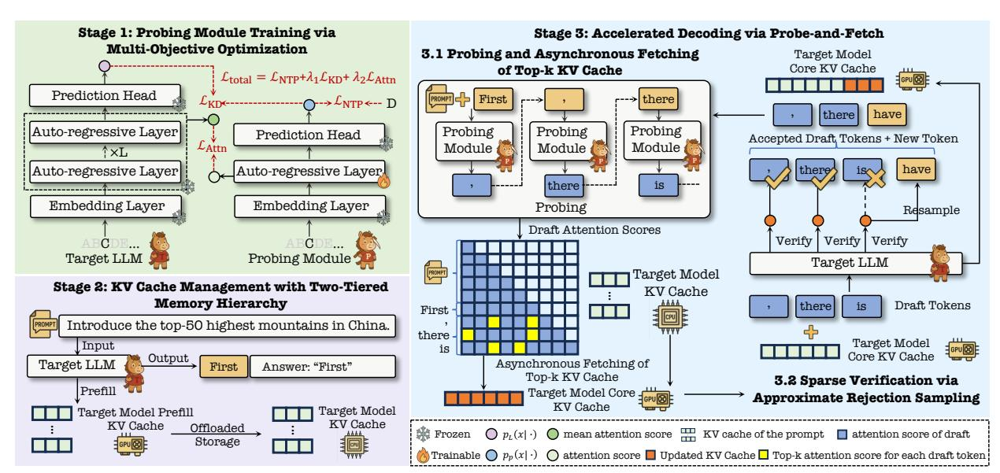
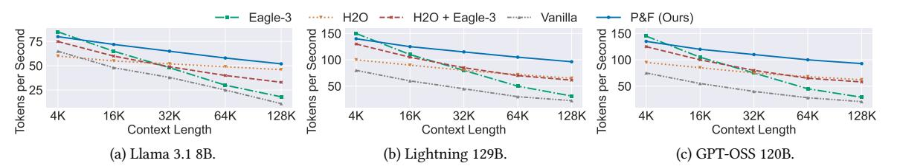
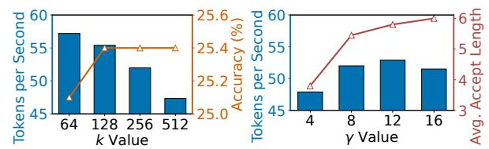

# Probe-and-Fetch: Dynamic KV Cache Pruning for Accelerated Long-Context Inference in Web-Scale AI Search

[Yuchen Li](https://orcid.org/0000-0002-3869-7881) Baidu Inc. Beijing, China Shanghai Jiao Tong University Shanghai, China yuchenli1230@gmail.com

[Rui Kong](https://orcid.org/0009-0003-2889-2266)∗ Baidu Inc. Beijing, China monster119120@gmail.com

[Xinran Chen](https://orcid.org/0009-0009-9071-1933) Baidu Inc. Beijing, China fantastique0910@gmail.com

[Chengzhe Zhang](https://orcid.org/0009-0009-4830-7144) Baidu Inc. Beijing, China zhangchengzhe@baidu.com

[Jiamin Chen](https://orcid.org/0009-0003-6674-7764) City University of Hong Kong Hong Kong, China jmchen26-c@my.cityu.edu.hk

[Cheng Deng](https://orcid.org/0000-0002-3171-823X) University of Edinburgh Edinburgh, United Kingdom davendw49@gmail.com

[Xinyu Ma](https://orcid.org/0000-0002-5511-9370) Baidu Inc. Beijing, China xinyuma2016@gmail.com

[Haojie Zhang](https://orcid.org/0009-0008-4662-1212) Baidu Inc. Beijing, China zhanghaojie03@baidu.com

[Tianhao Peng](https://orcid.org/0000-0002-9910-2298) Baidu Inc. Beijing, China pengtianhao@baidu.com

[Hengyi Cai](https://orcid.org/00000-0002-7147-5666) Baidu Inc. Beijing, China hengyi1995@gmail.com

[Shuaiqiang Wang](https://orcid.org/0000-0002-9212-1947) Baidu Inc. Beijing, China shqiang.wang@gmail.com

[Jiashu Zhao](https://orcid.org/0000-0001-9770-7616) Wilfrid Laurier University Waterloo, Canada jzhao@wlu.ca

[Yongqi Zhang](https://orcid.org/0000-0003-2085-7418) The Hong Kong University of Science and Technology (Guangzhou) Guangzhou, China yongqizhang@hkust-gz.edu.cn

[Haoyi Xiong](https://orcid.org/0000-0002-5451-3253) Baidu Inc. Beijing, China haoyi.xiong.fr@ieee.org [Jimmy Xiangji Huang](https://orcid.org/0000-0003-1292-1491) York University Toronto, Canada jhuang@yorku.ca

[Lei Chen](https://orcid.org/0000-0002-8257-5806) The Hong Kong University of Science and Technology (Guangzhou) Guangzhou, China leichen@cse.ust.hk

[Jun Wang](https://orcid.org/0000-0002-4021-4228) University College London London, United Kingdom jun.wang@cs.ucl.ac.uk

[Dawei Yin](https://orcid.org/0000-0002-0684-6205) Baidu Inc. Beijing, China yindawei@acm.org

# Abstract

Generative inference with Large Language Models (LLMs) is the cornerstone of web-scale AI search, where queries are answered using vast, heterogeneous documents retrieved via Retrieval-Augmented Generation (RAG). This paradigm is critically bottlenecked by the cost of self-attention mechanism on long context. The sheer diversity of retrieved web content (multi-sourced, multi-lingual, multifaceted) makes simple Key-Value (KV) cache optimizations with pre-fixed subsets ineffective, demanding a dynamic, content-aware

∗Corresponding author.

[This work is licensed under a Creative Commons Attribution 4.0 International License.](https://creativecommons.org/licenses/by/4.0) WWW'26, Dubai, UAE

© 2026 Copyright held by the owner/author(s). ACM ISBN 979-8-4007-2307-0/2026/04 <https://doi.org/10.1145/3774904.3792794>

approach. This challenge, however, introduces a classic chickenand-egg problem: the model cannot foresee the necessary KV entries for attention without first inferring on the content, yet doing so on the full context is prohibitively expensive. This paper introduces P&F, a unified framework that resolves this dilemma through a core "probe-and-fetch" mechanism, which ingeniously integrates with speculative decoding – an acceleration approach already adopted in web-scale AI search. The probe step repurposes the speculative draft model: while generating candidate tokens, it simultaneously probes the context to predict the most salient KV entries the large model will need for attention. The fetch step immediately acts on this prediction, asynchronously fetching these sparse entries from memory. This synergistic design piggybacks the probing step onto the drafting process, allowing the expensive gathering of a sparse KV cache to be fully masked. Crucially, this co-design breaks the sequential dependency bottleneck that cripples naive integrations of

speculative decoding and prefetching due to synchronization issues. Extensive offline evaluations across various settings and datasets demonstrate that P&F yields superior throughput and scalability compared to advanced baselines, while maintaining model quality across diverse models and scales. In online settings, P&F delivers substantial gains in throughput improvements while preserving response quality, making it well-suited for large-scale industrial deployment in real-time AI Search services.

# CCS Concepts

#### • Information systems → Information retrieval.

### Keywords

Efficient Inference; Speculative Decoding; Sparse Attention; Long Context; AI Search; Large Language Models

#### ACM Reference Format:

Yuchen Li, Rui Kong, Xinran Chen, Chengzhe Zhang, Jiamin Chen, Cheng Deng, Xinyu Ma, Haojie Zhang, Tianhao Peng, Hengyi Cai, Shuaiqiang Wang, Jiashu Zhao, Yongqi Zhang, Haoyi Xiong, Jimmy Xiangji Huang, Lei Chen, Jun Wang, and Dawei Yin. 2026. Probe-and-Fetch: Dynamic KV Cache Pruning for Accelerated Long-Context Inference in Web-Scale AI Search. In Proceedings of the ACM Web Conference 2026 (WWW '26), April 13–17, 2026, Dubai, United Arab Emirates. ACM, New York, NY, USA, [11](#page-10-0) pages. <https://doi.org/10.1145/3774904.3792794>

# 1 Introduction

Large Language Models (LLMs) are revolutionizing web-scale AI search systems by synthesizing comprehensive answers from extensive context documents retrieved for a user query [\[4,](#page-8-0) [35\]](#page-8-1). This Retrieval-Augmented Generation (RAG) [\[13\]](#page-8-2) paradigm, while powerful, has exposed the Achilles' heel of modern LLMs – the staggering cost of generative inference [\[14,](#page-8-3) [15\]](#page-8-4). In a web-scale setting, the context is not merely long but is assembled from a heterogeneous mix of multi-sourced, multi-faceted, and multi-lingual web documents [\[18,](#page-8-5) [21–](#page-8-6)[25\]](#page-8-7). This diversity makes the memory-bandwidth cost of the self-attention mechanism [\[33\]](#page-8-8)–specifically, loading the massive Key-Value (KV) cache from memory [\[11\]](#page-8-9)–the dominant performance bottleneck.

To tame the KV cache, the community has developed various sparse attention techniques [\[9,](#page-8-10) [16,](#page-8-11) [26,](#page-8-12) [28\]](#page-8-13). Methods, including StreamingLLM [\[34\]](#page-8-14), use a sliding window, while others such as H2O [\[38\]](#page-8-15) retain a mix of recent and historically important "heavyhitter" tokens. However, the sheer unpredictability of heterogeneous content retrieved for RAG means that any static or simple heuristic for KV selection is suboptimal. A truly efficient system requires a dynamic, content-aware approach to identify the most salient KV entries for the immediate context [\[32\]](#page-8-16). This requirement, however, creates a fundamental chicken-and-egg problem: to dynamically fetch the right KV entries, the system must first comprehend the content token-by-token; yet, efficiently processing that content requires having already fetched those entries.

On the other hand, speculative decoding has emerged as a powerful and widely-deployed strategy to accelerate inference by reducing the number of sequential steps [\[3,](#page-8-17) [12,](#page-8-18) [29\]](#page-8-19). This family of techniques [\[2,](#page-8-20) [19,](#page-8-21) [20,](#page-8-22) [30,](#page-8-23) [37\]](#page-8-24) employs a smaller "draft" model to propose multiple tokens, which a larger LLM then verifies in a single

parallel pass. Crucially, the presence of this lightweight draft model– a fast proxy for the full LLM–presents a unique opportunity. While the draft model processes the text before the expensive LLM verification, it could potentially be used to predict the LLM's attention patterns for KV cache pre-fetching. However, a naive integration of these two powerful techniques–for instance, layering speculative decoding on top of a sparse attention framework–unwittingly creates a new, insidious sequential dependency bottleneck. In such a hybrid, the system must first perform verification on a sparse context identified in the previous step. Only after this expensive verification is complete can the new attention scores of the LLM be analyzed to determine the salient "heavy-hitter" tokens for the next generation cycle. This expensive context selection and data gathering process remains squarely on the critical path, creating a synchronous stall at every step and severely capping the potential for acceleration.

Hereby, at least, three technical challenges should be addressed to piggyback the KV caching with speculative decoding:

- Challenge 1: Context Selection Dilemma. To perform sparse attention during the LLM's verification step, one must first identify the "top-k" salient context. Determining this with high fidelity would typically require running an expensive attention operation with the LLM itself, creating a circular dependency. A naive hybrid would verify a draft using a sparse context from the previous step, then run the LLM's expensive computation to identify the context for the next step, introducing significant serial overhead.
- Challenge 2: Data Movement Overhead. Even if the top-k indices are known, gathering these scattered KV entries from a massive cache in global memory is a notoriously expensive operation, often limited by memory bandwidth. This gathering latency can easily negate the computational savings from using a smaller context.
- Challenge 3: Fidelity-Performance Trade-off. Standard speculative decoding guarantees mathematical equivalence to autoregressive generation. Using a sparse context for verification breaks this guarantee, as the LLM's output distribution might deviate from the full-context baseline. This is no longer strict speculative decoding but an approximation. The challenge is to design an approximation that is good enough to maintain high acceptance rates and model fidelity while unlocking significant performance gains.

In this paper, we introduce P&F, a unified framework that resolves this dilemma by ingeniously piggybacking dynamic context selection onto the speculative decoding process. The pivotal insight is that the lightweight draft model is the perfect tool to break the circular dependency. Our core "probe-and-fetch" mechanism repurposes this module to perform a dual role: as it generates, or probes, the text to create a draft, it simultaneously predicts the most salient KV entries the LLM will need. This prediction immediately triggers an asynchronous fetch of these sparse entries. This synergistic design, where context prediction is piggybacked onto drafting with minimal overhead, allows the expensive data movement to be fully masked. It shatters the sequential dependency bottleneck, transforming the prohibitive overhead of dynamic context selection into a pipelined, off-critical-path task. Our contributions are as follows:

- We investigate a key open problem in web-scale RAG inference: how to jointly optimize speculative decoding and dynamic sparse attention to overcome the memory-bandwidth bottleneck of longcontext LLMs. We reveal that naive combinations of these two techniques introduce a new sequential dependency bottleneck, where sparse context selection and verification are interlocked on the critical path, thereby limiting potential acceleration.
- We propose P&F, a unified algorithm–system co-design that tightly integrates speculative decoding with dynamic sparse attention via a probe-and-fetch mechanism. A lightweight draft model is repurposed to both generate token candidates and predict salient KV entries, breaking the sequential dependency bottleneck of naive hybrid approaches. Additionally, P&F implements an asynchronous context-gathering system to hide the latency of scattered memory accesses, one of the primary inefficiencies in conventional sparse attention.
- We conduct extensive offline experiments across diverse datasets and model scales, showing that P&F consistently outperforms state-of-the-art baselines in throughput and scalability without sacrificing response quality. Moreover, large-scale online A/B testing in Baidu AI Search confirms its robustness and practical impact, achieving substantial throughput gains with preserved output quality.

# 2 Methodology

# 2.1 Problem Formulation

Autoregressive Generation and KV Cache. LLMs generate text through an autoregressive process, where at each decoding step ��, the model predicts the next token ���� based on the sequence of previously generated tokens x:��−1 = (��0, · · · , ����−1). The core component of this process is the self-attention mechanism, which enables the model to attend to relevant past tokens dynamically. Specifically, given a query vector ���� at the current decoding step, the LLM computes attention scores by comparing ���� against the set of key vectors K:�� = [��0, · · · , ���� ] corresponding to all previous tokens. These scores are then used to aggregate the associated value vectors V:�� = [��0, · · · , ���� ] through a weighted sum. To eliminate redundant computations across decoding steps, modern LLM inference systems cache the computed key and value vectors for all past tokens in high-bandwidth GPU memory. This structure, known as the KV cache, is denoted as ���� = {(���� , ����)}�� ��=0 , and grows linearly with the decoding sequence length ��. As �� increases, each self-attention operation inevitably retrieves a larger portion of this cache, leading to substantial memory bandwidth consumption. Consequently, inference latency becomes dominated by the cost of accessing the KV cache from GPU High-Bandwidth Memory (HBM), rendering the process memory-bound.

Speculative Decoding. Speculative decoding is a technique designed to accelerate autoregressive inference by reducing the number of sequential steps required. It introduces a lightweight probing module ���� that predicts a sequence of �� candidate tokens, denoted as x˜��:��+��−1, based on the current context. These candidate tokens are then collectively verified by the full LLM ���� through a single parallel forward pass. Let ���� (�� |·) and ���� (�� |·) represent the nexttoken probability distributions produced by the probing module and the full LLM, respectively. The verification step accepts the

longest prefix of the draft, denoted by length ��, that satisfies a predefined acceptance criterion, such as ���� (��˜��+��) ≥ ���� (��˜��+��) for all �� = 0, . . . , ��−1. After this prefix, a new token is sampled to continue generation. The effectiveness of speculative decoding critically depends on the ability of the verification step to faithfully reconstruct the output distribution of ����. While this technique significantly reduces the number of full-model invocations, it does not reduce the computational or memory cost of each verification pass.

KV Cache Pruning. To mitigate the memory bandwidth bottleneck, KV cache pruning techniques, such as Top-k sparse attention, aim to reduce the overhead of full self-attention by limiting attention to a small subset of the most relevant past tokens. Instead of attending to all �� tokens in the context, the model selects the top-�� tokens based on an importance metric, where �� ≪ ��. Let ��top-�� denote the indices of the selected tokens. The attention operation is then performed only over the pruned cache ��pruned = {(���� , ����) | �� ∈ ��top-�� }, significantly reducing memory accesses. In theory, this approximation lowers the complexity of each attention step from ��(�� · ���� ) to ��(�� · ���� ). However, realizing these gains in practice is challenging due to irregular memory access patterns and the overhead of identifying the top-�� tokens efficiently.

Motivation. While speculative decoding and KV cache pruning are individually effective, their naive integration introduces significant challenges. Predicting the top-k context for a future, unverified token sequence creates a circular dependency. Furthermore, gathering non-contiguous KV entries for sparse verification introduces memory access overhead that can negate the benefits, and performing verification on a pruned context can break the fidelity guarantees of standard speculative decoding. These issues motivate the need for a unified framework that co-designs the speculation and pruning mechanisms. In our research, we propose P&F to address these challenges and unlock synergistic acceleration.

# 2.2 Overall Framework Design of P&F

As depicted in Figure [1,](#page-3-0) P&F first trains a small probing module with a multi-objective loss that not only teaches it to generate plausible tokens but also to mimic the attention patterns of the large target LLM. This enables the probing module to predict which parts of the KV cache are most crucial for future decoding steps. Then, P&F establishes an efficient two-tiered memory hierarchy to manage the full KV cache for long contexts, storing the bulk of it in CPU memory while maintaining a small, active buffer on the GPU. Finally, P&F implements its core "probe-and-fetch" decoding loop. The trained probing module generates a draft of candidate tokens while simultaneously identifying the Top-k most relevant KV cache entries. These entries are then asynchronously prefetched from CPU to GPU, overlapping memory transfer with computation. The LLM then performs a single, fast verification pass using only this compact, pruned KV cache, allowing it to accept multiple tokens at once while minimizing memory bandwidth consumption.

# 2.3 Probing Module Training via Multi-Objective Optimization

The effectiveness of P&F is rooted in the design of its probing module, which fulfills two critical roles: generating plausible token sequences for speculative decoding, and accurately predicting

Figure 1: The overall framework of P&F consisting of three stages: (1) Probing Module Training via Multi-Objective Optimization, (2) KV Cache Management with Two-Tiered Memory Hierarchy, and (3) Accelerated Decoding via Probe-and-Fetch.

the attention distribution of the much larger target model ����. To support these tasks, the probing module ���� is equipped with a lightweight yet expressive architecture and is trained with a multiobjective strategy that balances language modeling with targeted knowledge distillation.

Architecture of Probing Module. The architecture of the probing module ���� is inspired by Eagle-3 [\[20\]](#page-8-22) and is designed to function as a single, lightweight transformer layer analogous to those in the target LLM ����. A core principle of its design is resource efficiency; specifically, ���� reuses the token embedding and final language model head directly from ����, both of which remain frozen throughout the training process.

The key architectural enhancement is a dedicated projection layer that integrates rich contextual signals from the target LLM ����. To achieve this, the embedding of each input token is first concatenated with a selection of hidden states drawn from multiple layers of ����, spanning both intermediate and final depths. This composite representation is then fed through the projection layer to produce the initial hidden state for the probing module. This design provides ���� with direct access to the multi-level representations learned by ����, substantially enhancing its capacity to emulate the target model's complex generative and attentional behaviors.

Multi-Objective Training. To support both token generation and attention prediction, P&F optimizes the probing module under a multi-objective training paradigm, which contains Next-Token Prediction (NTP), Distribution Distillation (KD), and Attention Pattern Mimicking tasks. Formally, the overall loss function can be formalized as Ltotal(���� ) = LNTP + ��1LKD + ��2LAttn, where ��1 and ��2 control the importance of each term, and ���� is the parameters of ���� . Moreover, LNTP is a causal language modeling loss that ensures the probing module captures core syntactic and semantic patterns, thereby enabling coherent token generation. LKD minimizes the Kullback-Leibler (KL) divergence between the next-token distributions predicted by ���� and ����. This distillation step encourages

the probing module to approximate the token-level behavior of the larger model as LKD (���� ) = Ex∼Dkd -KL ��(����/��) ∥ ��(���� /��) , where ���� and ���� are the logits from ���� and ���� , �� denotes the softmax function, and �� is a temperature scaling parameter. Furthermore, LAttn aligns the attention behaviors of the two models by minimizing the Jensen-Shannon (JS) divergence between their attention distributions aggregated over all layers and heads as LAttn (���� ) = Ex∼Dkd -JS ���� (x) ∥ ���� (x; ���� ) . This loss ensures that ���� aligns its focus with the salient tokens identified by ����, enabling effective sparse verification in downstream inference. P&F conducts the probing module training using high-quality instruction-following data. This setup ensures that the probing module generalizes across diverse generation tasks while remaining well-aligned with the target model's behavior.

### 2.4 KV Cache Management with Two-Tiered Memory Hierarchy

To support long-context decoding without exceeding GPU memory constraints, in this stage, P&F establishes a two-tiered memory hierarchy that enables dynamic and sparse access to the KV cache. This component is critical for bridging the gap between speculative token generation and high-throughput sparse verification.

Concretely, at the beginning of decoding, P&F computes the full KV cache for the input prompt using the target LLM and immediately offloads it to CPU main memory, referred to as the offloaded storage. This offload is performed asynchronously, ensuring that GPU memory is promptly released and made available for subsequent computation stages. By minimizing blocking operations during prefill, P&F maximizes GPU utilization and improves compatibility with multi-tenant serving environments. To enable fast access to relevant context during decoding, P&F maintains a fixedsize active cache in GPU HBM, which holds two classes of entries: (1) the prefetched Top-�� KV pairs identified by the probing module, and (2) the newly generated KV entries from the current decoding

steps. This active cache serves as the working set for the LLM's sparse verification stage. Crucially, the active GPU cache is continuously updated through asynchronous data movement. During each generation cycle, P&F schedules direct memory transfers of selected KV entries from CPU to GPU via dedicated CUDA streams, overlapping these transfers with ongoing token generation. This design ensures that relevant context is available on-demand for the LLM without incurring synchronous data stalls. By tightly integrating hierarchical memory layout with predictive context selection, P&F transforms the conventional KV cache into a latency-hiding structure, significantly reducing bandwidth overhead while supporting scalable sparse verification.

# 2.5 Accelerated Decoding via Probe-and-Fetch

At the heart of P&F lies a tightly pipelined decoding loop that enables high-throughput, low-latency inference by interleaving speculative token generation with asynchronous KV cache prefetching and sparse verification. This loop consists of two steps that operate in lockstep: Probing and Asynchronous Fetching of Top-k KV Cache, followed by Sparse Verification via Approximate Rejection Sampling. Probing and Asynchronous Fetching of Top-�� KV Cache. During each decoding iteration, P&F invokes the probing module ���� to autoregressively generate a draft sequence of �� candidate tokens, denoted as x˜��:��+��−1. As each token ��˜��+�� is produced, ���� simultaneously computes an attention score vector ����,��+�� over the existing context. These scores serve as a lightweight proxy for the LLM's full attention distribution and reflect the relative importance of past tokens for the current generation step. Next, P&F aggregates these attention vectors across all �� steps to identify the top-�� most relevant context tokens. Specifically, it performs a union operation over the top-�� indices selected at each probing step to form a sparse index set as

��sparse = Ø−1 ��=0 TopKIndices(����,��+�� , ��). (1)

This union-based heuristic ensures that all salient tokens, regardless of their specific position within the draft, are included in the upcoming verification pass with negligible overhead.

Once the sparse indices are selected, P&F immediately initiates an asynchronous transfer of the corresponding KV entries from the CPU-hosted offloaded cache into the GPU's active buffer. This transfer is orchestrated via dedicated CUDA memory streams that run concurrently with the probing computation. As the (�� +1)-th token is computed on the main stream, the background stream fetches KV pairs identified at step ��, thereby overlapping memory access with ongoing token generation. This tightly coupled design hides memory latency and eliminates the synchronization bottlenecks that commonly affect sparse attention implementations.

Sparse Verification via Approximate Rejection Sampling. Given the generated candidate token and prefetched sparse cache, P&F proceeds to verification using the full LLM ����. Instead of operating on the entire KV cache, P&F constrains the LLM's selfattention mechanism to only the pre-fetched compact cache ��sparse, significantly reducing computation and memory overhead.

This verification step represents a principled approximation of standard speculative decoding. By accepting a small degradation in exactness, P&F gains substantial performance improvements. The LLM performs a single forward pass over the concatenated context and draft tokens, yielding logits that are then used to validate the draft via approximate rejection sampling. The longest prefix x˜��:��+��−1 satisfying the acceptance condition is retained. At the divergence point, P&F resamples one token from a corrected distribution to restore consistency with the true LLM output as

��final(��) ∝ max 0, ���� (�� |x<��+��,��sparse) − ���� (�� |x<��+��) . (2)

Eventually, P&F commits the �� accepted tokens along with the resampled token, thereby advancing the generation window by �� + 1 tokens in a single pass. By fusing draft generation, context prediction, memory prefetching, and approximate verification into a tightly integrated pipeline, P&F delivers scalable, high-efficiency decoding that gracefully balances fidelity and speed.

# 2.6 Complexity Analysis

To formally analyze the efficiency of P&F, we denote the total context length as ��, the draft length as ��, the sparse context size as ��, the model's hidden dimension as ��, and the number of LLM layers as ��. A single generation cycle in P&F involves two main stages: (1) a low-cost probing stage by the single-layer draft model to generate �� tokens, with a complexity of O (�� · �� · ��); and (2) an efficient sparse verification stage, where the ��-layer LLM performs a parallel forward pass over the �� tokens with attention constrained to the �� sparse entries, costing O (�� · �� · �� · ��). The total amortized cost per generated token is therefore proportional to 1 ��+1 (�� ·�� ·�� +�� ·�� ·�� ·��), where �� is the number of accepted tokens. The key insight is that P&F strategically shifts the computational burden of attending to the full context �� from the expensive, ��-layer LLM to the cheap, single-layer probing module. Unlike standard speculative decoding, where the expensive verification step scales linearly with ��, our verification cost is bottlenecked only by the small, constant ��. Furthermore, by predicting the sparse context concurrently with drafting, P&F avoids the serial overhead of on-the-fly context selection that plagues naive hybrid approaches, directly explaining its superior empirical scalability.

# 3 Offline Evaluation

#### 3.1 Experimental Setup

Datasets and Benchmarks. Our experimental setup involves two distinct data components: one for training our probing module and another for benchmarking end-to-end performance. Specifically, for training the probing module, we use the ChatQA2 [\[36\]](#page-8-25) dataset, a large-scale collection of long-context supervised fine-tuning (SFT) data. From its 10B tokens of 128k-length contexts, we utilize a 2B token subset for efficient and practical training. For evaluation, we employ the comprehensive LongBench v2 benchmark, which is specifically designed to assess model capabilities in ultra-long context scenarios (up to 128k tokens). It covers a diverse range of tasks, including Single-Document QA (175 examples), Multi-Document QA (125 examples), Long In-context Learning (81 examples), Long-dialogue History Understanding (39 examples), Code Repository Understanding (50 examples), and Long Structured Data Understanding (33 examples). The benchmark features challenging questions that require deep contextual understanding rather

Figure 2: Throughput scalability with increasing context length across different models: (a) Llama 3.1 8B, (b) Lightning 129B, and (c) GPT-OSS 120B. P&F consistently demonstrates a significantly flatter performance curve, indicating superior scalability.

than simple keyword matching, presented in a multiple-choice format with carefully crafted distractors to prevent guessing. In addition to the public LongBench v2 benchmark, we also curated a private, in-house benchmark to evaluate performance under realistic, production-level conditions. This benchmark consists of 1,000 real user queries collected from Baidu Search, specifically targeting long-context scenarios. For each query, we employ a RAG pipeline to retrieve relevant documents, constructing a full 128k-token context that is then fed into the language model. This dataset serves as a critical testbed for assessing system performance on tasks directly aligned with our target application of web-scale AI search, where models must synthesize answers from vast retrieved information. Since the outputs are free-form generative text, our primary evaluation metrics on this benchmark are system performance indicators: throughput and average acceptance length.

Baselines and Evaluation Metrics. We compare P&F against a suite of strong baselines to demonstrate its advantages, including Vanilla Autoregressive (Vanilla), Speculative Decoding SOTA (Eagle-3 [\[20\]](#page-8-22)), Long-Context SOTA (H2O [\[38\]](#page-8-15)), and Direct Combination Baseline (H2O + Eagle-3). More detailed descriptions of all baselines could be found in Appendex [A.1.](#page-8-26) For the offline evaluation, we follow the LongBench v2 protocol and report Accuracy, Accuracy Length, and Throughput Per Second as the primary evaluation metrics to comprehensively assess the performance of models.

Implementation Details. We evaluate P&F on a diverse set of models to demonstrate its generalizability. Experiments are conducted on a server equipped with 8× NVIDIA A100 GPUs (80GB). The models include Llama 3.1 8B Instruct [\[10\]](#page-8-27) (run on a single GPU), and two large models deployed with 8-way tensor parallelism: a 129B Lightning model, which is a private Mixture-of-Expert (MoE) based LLM in Baidu Search, and the 120B GPT-OSS model [\[1\]](#page-8-28). The probing module's parameters are initialized with the weights from the final layer of the target large language model. For training, we utilize the AdamW optimizer with ��1 = 0.9 and ��2 = 0.95. We apply gradient clipping at a threshold of 0.5 and set the learning rate to 5e-5. During inference, all experiments are conducted with a decoding temperature of 0 to ensure deterministic outputs. Following the standard LongBench v2 setting, we do not use Chain-of-Thought prompting, and the maximum output length is set to 128 tokens.

# 3.2 End-to-End Performance and Scalability

Overall Performance. As shown in Figure [2](#page-5-0) and Table [1,](#page-6-0) P&F consistently outperforms all baselines in throughput and scalability across context lengths and model scales. Full-context methods degrade sharply at long contexts; for instance, on Llama 3.1 8B, Vanilla drops to 11.0 Tokens/s and Eagle-3 falls by 80% to 18.0 Tokens/s at 128k. While H2O maintains a flatter curve with 46.0

Tokens/s due to its sparse mechanism, its autoregressive nature limits peak throughput. Combining H2O with Eagle-3 improves long-context performance but still suffers from a sequential dependency bottleneck—KV selection and fetching remain on the critical path. Consequently, H2O+Eagle-3 reaches only 33.0 Tokens/s on Llama 3.1 8B. In contrast, P&F maintains high throughput across all scales, achieving 52.0 Tokens/s on Llama 3.1 8B (only 35% drop from peak) and outperforming Eagle-3 and H2O+Eagle-3 by 2.9× and 1.6×, respectively. Its asynchronous prefetching fully hides the cost of sparse context gathering. Moreover, P&F generalizes robustly to larger models: on Lightning 129B, it achieves 96.4 Tokens/s (1.6× over H2O+Eagle-3 and 3.1× over Eagle-3); on GPT-OSS 120B, it leads with 92.8 Tokens/s. These results confirm the growing advantage of P&F as model size and context length increase. We observe a slight reduction in acceptance length (5.45 vs. 5.58 on Llama 3.1 8B), reflecting minor fidelity loss from approximate verification. However, this is offset by significant latency savings, yielding superior end-to-end efficiency. Evaluations on our private AI Search benchmark further validate P&F 's robustness in real-world RAG workloads. It consistently delivers the best accuracy–throughput trade-off: on Llama 3.1 8B, P&F reaches 51.5 Tokens/s (3× over Eagle-3); on Lightning 129B, 95.1 Tokens/s at 94.0% accuracy—matching the original model. In contrast, other baselines incur notable accuracy degradation. These results underscore the effectiveness of our probe-and-fetch co-design in eliminating the sequential bottleneck and demonstrate P&F 's readiness for industrial deployment. More analysis of the overall performance can be found in Appendix [A.2.](#page-9-0) Model Quality and Generalization The accuracy results across all three models are remarkably consistent. P&F's accuracy is consistently on par with the vanilla autoregressive baseline, with a negligible deviation of at most 0.1%. This is a critical finding, validating that our principled trade-off of approximate verification does not degrade final output quality, making it a safe and effective optimization. By successfully applying P&F to three distinct models, spanning from 8B to 129B parameters and from open to Lightning architectures, we demonstrate its broad applicability. The performance patterns—high throughput and preserved accuracy—hold true across all scales. This indicates that the core principles of the "probe-and-fetch" co-design represent a fundamental and generalizable approach to efficient LLM inference.

# 3.3 Ablation Study of Core Mechanisms

To assess the contributions of P&F's two core components: (1) dynamic Top-k prediction and (2) asynchronous context gathering, we conduct targeted ablations using Llama 3.1 8B on 128k context. Results are shown in Table [2.](#page-6-1)

Table 1: Performance comparison across different baselines and our method on LongBench v2 and Private AI Search Benchmark (128k context). We report Accuracy Length (Len.), Throughput per second @ 128K (Tokens/s), and Accuracy (Acc.).

| Method                 | Len. | Llama 3.1 Tokens/s | 8B Acc. | Len. | LongBench Lightning Tokens/s | v2 129B Acc. | Len. | GPT-OSS Tokens/s | 120B Acc. | Len. | Llama 3.1 Tokens/s | 8B Acc. | Private Len. | AI Search Lightning Tokens/s | Benchmark 129B Acc. | Len. | GPT-OSS Tokens/s | 120B Acc. |
|------------------------|------|--------------------|---------|------|------------------------------|--------------|------|------------------|-----------|------|--------------------|---------|--------------|------------------------------|---------------------|------|------------------|-----------|
| Vanilla Autoregressive | 1.00 | 11.0               | 25.4    | 1.00 | 22.5                         | 36.8         | 1.00 | 20.6             | 50.1      | 1.00 | 10.5               | 92.5    | 1.00         | 21.9                         | 94.1                | 1.00 | 20.1             | 95.2      |
| Eagle-3                | 5.58 | 18.0               | 25.3    | 4.72 | 31.2                         | 36.7         | 5.13 | 28.9             | 50.1      | 5.51 | 17.5               | 92.4    | 4.69         | 30.8                         | 94.0                | 5.09 | 28.1             | 95.2      |
| H2O                    | 1.00 | 46.0               | 21.8    | 1.00 | 65.1                         | 30.0         | 1.00 | 62.3             | 46.3      | 1.00 | 45.0               | 88.1    | 1.00         | 64.2                         | 87.5                | 1.00 | 61.5             | 91.5      |
| H2O + Eagle-3          | 5.40 | 33.0               | 21.9    | 4.55 | 61.4                         | 30.1         | 4.91 | 58.0             | 46.3      | 5.32 | 32.0               | 88.2    | 4.51         | 60.5                         | 87.6                | 4.85 | 57.1             | 91.5      |
| P&F                    | 5.45 | 52.0               | 25.4    | 4.65 | 96.4                         | 36.7         | 5.02 | 92.8             | 50.0      | 5.40 | 51.5               | 92.5    | 4.60         | 95.1                         | 94.0                | 5.00 | 91.5             | 95.1      |

Table 2: Ablation study on the core mechanisms of P&F on LongBench v2. Both dynamic context prediction and asynchronous fetching are crucial for achieving high throughput and preserving accuracy.

| Setting |     |             |         | Len. | Tokens/s | Acc. |
|---------|-----|-------------|---------|------|----------|------|
| Our     | P&F | method      |         | 5.45 | 52.0     | 25.4 |
| P&F     | w/  | Random      | Context | 2.15 | 23.8     | 19.5 |
| P&F     | w/  | Recent      | Context | 3.50 | 36.1     | 22.1 |
| P&F     | w/o | Synchronous | Fetch   | 5.45 | 34.0     | 25.4 |

Impact of Dynamic Top-k Prediction. We first replace the probing module with simpler heuristics. In P&F w/ Random Context, the system fetches random KV entries. This causes throughput to drop by over 54%, and accuracy plummets to 19.5%, well below even the H2O baseline. The randomly selected context mismatches the LLM's needs, leading to immediate rejections (acceptance length: 2.15). In P&F w/ Recent Context, we replace prediction with a fixed sliding window over recent tokens. While better than random, it still underperforms across all metrics. Accuracy drops to 22.1% and throughput to 36.1 Tokens/s. These results confirm that simple recency or randomness is insufficient for capturing long-range, sparse dependencies, and that learned prediction is essential to the fidelity and efficiency of P&F.

Impact of Asynchronous Context Gathering. Furthermore, we disable asynchronous transfer in P&F w/o Sync Fetch. Although accuracy and acceptance length remain unchanged, since the same predicted KV entries are used, throughput drops by 35% (from 52.0 to 34.0 Tokens/s). This highlights the high cost of blocking CPU–GPU memory transfer and shows that pipelining context prediction, prefetching, and verification are crucial. Without asynchrony, sparse attention's memory overhead erodes most of the performance benefits.

#### 3.4 Sensitivity to Hyperparameters

We analyze the sensitivity of P&F to its primary hyperparameters: sparse context size �� and draft length �� with Llama 3.1 8B. All sensitivity experiments are benchmarked at a 128k context length. Impact of Sparse Context Size ��. We vary the number of attended tokens per draft step. Figure [3](#page-6-2) (left) shows that throughput increases as �� is reduced due to the lower computational cost of attention. Our default setting (�� = 256) achieves a throughput of 52.0 Tokens/s. Reducing �� to 128 boosts performance to 55.4 Tokens/s. However, accuracy on LongBench v2 remains stable for �� ≥ 128, confirming that a small but well-chosen context subset is sufficient for highfidelity approximation. A too-small context (�� = 64) results in a

Figure 3: Sensitivity to sparse context size �� (left) and draft length �� (right).

noticeable accuracy drop. �� = 256 offers a conservative yet highly efficient balance between speed and model fidelity.

Impact of Draft Length ��. We evaluate sensitivity to ��, the number of tokens drafted per cycle. Figure [3](#page-6-2) (right) shows throughput initially increasing with ��, as the amortization of verification overhead outweighs the drop in acceptance rate. Performance peaks around �� = 12 (52.9 Tokens/s). However, beyond this point, longer drafts have a significantly lower probability of being fully accepted, resulting in diminishing returns and ultimately lower throughput. Our default of �� = 8 achieves a throughput of 52.0 Tokens/s and an average acceptance of 5.45 tokens, which is consistent with the overall experimental results and provides a robust, high-performance operating point.

### 4 Online Evaluation

# 4.1 Online Deployment Details

We evaluated the real-world effectiveness of P&F through a largescale A/B test conducted in Baidu Search's production environment, using a curated set of real user queries that cover both routine and reasoning-intensive information needs.

To construct a representative and challenging evaluation set, we adopted a two-stage query selection strategy. In the first stage, GPT-4o was employed to automatically assess the complexity of historical user queries and identify those classified as knowledgeintensive and reasoning-heavy. Typical examples include queries that require multi-hop reasoning across documents, synthesis of dispersed evidence from heterogeneous sources, or interpretation of domain-specific information within long textual contexts. In the second stage, a classifier-based refinement was applied to further filter and validate candidate queries under the same criteria, ensuring consistency and diversity across reasoning patterns observed in real-world search traffic. In total, the evaluation set comprised over 10,000 deduplicated queries, drawn from approximately 8,000 GPT-identified cases and 60,000 classifier-selected candidates.

For deployment comparison, the legacy system preserved the standard serving workflow but relied solely on the target model ���� for single-pass inference, without probing, context prefetching, or sparse verification. The experimental system introduced the full probe-and-fetch mechanism by incorporating the probing module ���� alongside ���� in an adaptive inference loop. This configuration keeps the retrieval infrastructure and model capacity fixed, isolating the impact of the probing-guided inference and ensuring that the observed improvements originate from enhanced reasoning efficiency and long-context utilization rather than differences in model scale or data access.

### 4.2 Online A/B Test and Latency Issue

In the online A/B test, we focus on the metrics that are directly related to user consumption and report the improvement of P&F on the business side and user engagement metrics compared with the online legacy system. In particular, compared to the online legacy system, P&F achieves the following relative improvements: The query reformulation rate (QRR) increases by -0.65%; The number of click-through rates (CTR) increases by 0.35%; The number of average post-click dwell time (APDT) increases by 0.21%; The number of page views (PV) increases by 0.43%. All the reported values are statistically significant with �� &lt;0.05. For online inference latency, compared with the legacy system, P&F shows almost no change under short inputs (input length <8K), whereas for long-context inputs (up to 128K tokens), it reduces the average latency by 34.02%. These results suggest that the proposed model achieves substantial throughput gains while maintaining high output quality.

# 5 Related Work

Accelerating LLM Inference via Speculative Decoding. Speculative decoding methods [\[3,](#page-8-17) [6,](#page-8-29) [12,](#page-8-18) [17,](#page-8-30) [19,](#page-8-21) [20,](#page-8-22) [29,](#page-8-19) [30,](#page-8-23) [37\]](#page-8-24) achieve lossless acceleration by using a smaller, faster "draft" model to propose multiple future tokens, which are then verified in a single parallel step by the larger target model. This paradigm has several variations. Tree-based speculation [\[5,](#page-8-31) [8,](#page-8-32) [27,](#page-8-33) [31\]](#page-8-34) extends this approach by generating a tree of candidate sequences to increase the acceptance rate. Self-speculative decoding [\[7,](#page-8-35) [37\]](#page-8-24) repurposes earlier layers of the target LLM itself as the draft model, eliminating the need for a separate model. Concurrently, parallel decoding techniques [\[2,](#page-8-20) [29\]](#page-8-19) also leverage draft mechanisms to streamline generation. Despite their success in reducing the number of generation steps, these methods share a critical limitation: they do not address the escalating computational cost of each individual step. The verification phase, though less frequent, still requires the target model to process the entire KV cache. In long-context applications, this memory-bound operation becomes the dominant bottleneck, severely diminishing the returns of speculative decoding. P&F is designed to directly overcome this bottleneck by integrating a mechanism that dynamically shrinks the KV cache prior to the verification step.

Managing Long Contexts with Sparse Attention. A complementary line of research directly addresses the challenge of managing the ever-growing KV cache in long-context scenarios. A foundational approach is windowed attention, which constrains the model's focus to a fixed-size window of recent tokens. More recent work has focused on sophisticated KV cache compression techniques. Scissorhands [\[26\]](#page-8-12) leverages the observation of repetitive

attention patterns to preserve only the most important tokens based on their historical attention scores. H2O [\[38\]](#page-8-15) employs dynamic eviction policies that strategically balance the retention of recent tokens and historically significant "heavy hitters". StreamingLLM [\[34\]](#page-8-14) achieves infinite-length sequence processing without fine-tuning by using landmark tokens to stabilize the attention mechanism. SnapKV [\[16\]](#page-8-11) improves compression efficiency through a combination of attention score-based selection and clustering of critical KV positions. FastGen [\[9\]](#page-8-10) introduces an adaptive KV cache management system that customizes retention strategies on a perattention-head basis. Beyond KV pruning, alternative paradigms such as KV cache merging [\[28\]](#page-8-13) have also been explored. P&F introduces a novel co-design that synergistically synthesizes these two orthogonal research thrusts. Rather than a naive and suboptimal composition, P&F integrates speculative decoding and KV cache management at a fundamental level. It reuses speculative drafting to predict heavy-hitter tokens for KV compression and, through asynchronous execution, hides the latency of KV identification and retrieval. This tight coupling simultaneously reduces both the number of generation steps and the per-step cost, achieving efficiency gains unattainable by either technique alone.

# 6 Conclusion

In this paper, we investigate a fundamental challenge in web-scale RAG inference: jointly optimizing speculative decoding and dynamic sparse attention for long-context LLMs. We show that naively combining them creates a sequential dependency bottleneck, placing context selection and verification on the critical path and severely limiting performance. To address this, we propose P&F, an algorithm–system co-design that integrates speculative decoding and sparse attention via a probe-and-fetch mechanism. By reusing the draft model for both token generation and salient context prediction and asynchronously fetching KV entries, P&F removes the dependency bottleneck and hides memory latency. We conduct extensive offline evaluations across various settings and datasets to demonstrate that P&F yields superior throughput and scalability compared to advanced baselines, while maintaining model quality across diverse models and scales.

# Acknowledge

This work is supported by National Key Research and Development Program of China Grant No. 2023YFF0725100, NSFC under Grant No. U22B2060, Guangdong-Hong Kong Technology Innovation Joint Funding Scheme Project No. 2024A0505040012, AOE Project AoE/E-603/18, Theme-based project TRS T41-603/20R, CRF Project C2004-21G, Key Areas Special Project of Guangdong Provincial Universities 2024ZDZX1006, Guangdong Province Science and Technology Plan Project 2023A0505030011, Guangzhou municipality big data intelligence key lab, 2023A03J0012, HKUST(GZ) - CMCC(Guangzhou Branch) Metaverse Joint Innovation Lab under Grant No. P00659, Hong Kong ITC ITF grant PRP/004/22FX, Zhujiang scholar program 2021JC02X170, HKUST-Webank joint research lab.

References [1] Sandhini Agarwal, Lama Ahmad, Jason Ai, Sam Altman, Andy Applebaum, Edwin Arbus, Rahul K Arora, Yu Bai, Bowen Baker, Haiming Bao, et al. 2025. Gpt-Oss-120b & Gpt-Oss-20b Model Card. ArXiv preprint arXiv:2508.10925 (2025). [2] Tianle Cai, Yuhong Li, Zhengyang Geng, Hongwu Peng, Jason D. Lee, Deming Chen, and Tri Dao. 2024. Medusa: Simple LLM Inference Acceleration Framework with Multiple Decoding Heads. In International Conference on Machine Learning (ICML). [3] Charlie Chen, Sebastian Borgeaud, Geoffrey Irving, Jean-Baptiste Lespiau, Laurent Sifre, and John Jumper. 2023. Accelerating Large Language Model Decoding with Speculative Sampling. ArXiv preprint arXiv:2302.01318 (2023). [4] Xinran Chen, Yuchen Li, Hengyi Cai, Zhuoran Ma, Xuanang Chen, Haoyi Xiong, Shuaiqiang Wang, Ben He, Le Sun, and Dawei Yin. 2025. Multi-agent proactive information seeking with adaptive llm orchestration for non-factoid question answering. In Proceedings of the 31st ACM SIGKDD Conference on Knowledge Discovery and Data Mining V. 2. 4341–4352. [5] Zhuoming Chen, Avner May, Ruslan Svirschevski, Yuhsun Huang, Max Ryabinin, Zhihao Jia, and Beidi Chen. 2024. Sequoia: Scalable, Robust, and Hardware-Aware Speculative Decoding. In Annual Conference on Neural Information Processing Systems (NeurIPS). [6] Ziyi Chen, Xiaocong Yang, Jiacheng Lin, Chenkai Sun, Kevin Chen-Chuan Chang, and Jie Huang. 2024. Cascade Speculative Drafting for Even Faster LLM Inference. In Annual Conference on Neural Information Processing Systems (NeurIPS). [7] Mostafa Elhoushi, Akshat Shrivastava, Diana Liskovich, Basil Hosmer, Bram Wasti, Liangzhen Lai, Anas Mahmoud, Bilge Acun, Saurabh Agarwal, Ahmed Roman, et al. 2024. Layer Skip: Enabling Early Exit Inference and Self-Speculative Decoding. In Annual Meeting of the Association for Computational Linguistics (ACL). [8] Yichao Fu, Peter Bailis, Ion Stoica, and Hao Zhang. 2024. Break the Sequential Dependency of LLM Inference Using Lookahead Decoding. In International Conference on Machine Learning (ICML). [9] Suyu Ge, Yunan Zhang, Liyuan Liu, Minjia Zhang, Jiawei Han, and Jianfeng Gao. 2024. Model Tells You What to Discard: Adaptive KV Cache Compression for LLMs. In International Conference on Learning Representations (ICLR). [10] Aaron Grattafiori, Abhimanyu Dubey, Abhinav Jauhri, Abhinav Pandey, Abhishek Kadian, Ahmad Al-Dahle, Aiesha Letman, Akhil Mathur, Alan Schelten, Alex Vaughan, et al. 2024. The Llama 3 Herd of Models. ArXiv preprint arXiv:2407.21783 (2024). [11] Wonbeom Lee, Jungi Lee, Junghwan Seo, and Jaewoong Sim. 2024. InfiniGen: Efficient Generative Inference of Large Language Models with Dynamic KV Cache Management. In USENIX Symposium on Operating Systems Design and Implementation (OSDI). [12] Yaniv Leviathan, Matan Kalman, and Yossi Matias. 2023. Fast Inference from Transformers via Speculative Decoding. In International Conference on Machine Learning (ICML). [13] Patrick Lewis, Ethan Perez, Aleksandra Piktus, Fabio Petroni, Vladimir Karpukhin, Naman Goyal, Heinrich Küttler, Mike Lewis, Wen-tau Yih, Tim Rocktäschel, et al. 2020. Retrieval-Augmented Generation for Knowledge-Intensive NLP Tasks. In Annual Conference on Neural Information Processing Systems (NeurIPS). [14] Yuchen Li, Hengyi Cai, Rui Kong, Xinran Chen, Jiamin Chen, Jun Yang, Haojie Zhang, Jiayi Li, Jiayi Wu, Yiqun Chen, et al. 2025. Towards AI Search Paradigm. ArXiv preprint arXiv:2506.17188 (2025). [15] Yuchen Li, Jiamin Chen, Xinran Chen, Zhiyu Li, Haojie Zhang, Rui Kong, Jiayi Li, Xinyu Ma, Hengyi Cai, Lixin Su, Shuaiqiang Wang, Jiashu Zhao, Yongqi Zhang, Haoyi Xiong, Linghe Kong, Lei Chen, and Dawei Yin. 2026. Retain to Refine: Agent-Based Adaptive Question Answering via Query Routing and Long-Short Memory.. In Proceedings of the 32nd ACM SIGKDD Conference on Knowledge Discovery and Data Mining V. 1. 1–11. [16] Yuhong Li, Yingbing Huang, Bowen Yang, Bharat Venkitesh, Acyr Locatelli, Hanchen Ye, Tianle Cai, Patrick Lewis, and Deming Chen. 2024. SnapKV: LLM Knows What You are Looking for Before Generation. In Annual Conference on Neural Information Processing Systems (NeurIPS). [17] Yuchen Li, Rui Kong, Zhonghao Lyu, Qiyang Li, Xinran Chen, Hengyi Cai, Lingyong Yan, Shuaiqiang Wang, Jiashu Zhao, Guangxu Zhu, et al. 2026. FlexSpec: Frozen Drafts Meet Evolving Targets in Edge-Cloud Collaborative LLM Speculative Decoding. arXiv preprint arXiv:2601.00644 (2026). [18] Yuchen Li, Zhonghao Lyu, Yongqi Zhang, Hao Zhang, Tianhao Peng, Haoyi Xiong, Shuaiqiang Wang, Linghe Kong, Guihai Chen, and Dawei Yin. 2025. S3PRank: Towards Satisfaction-oriented Learning to Rank with Semi-supervised Pre-training. IEEE Transactions on Knowledge and Data Engineering (2025). [19] Yuhui Li, Fangyun Wei, Chao Zhang, and Hongyang Zhang. 2024. Eagle-2: Faster Inference of Language Models with Dynamic Draft Trees. In Conference on Empirical Methods in Natural Language Processing (EMNLP). [20] Yuhui Li, Fangyun Wei, Chao Zhang, and Hongyang Zhang. 2025. EAGLE-3: Scaling up Inference Acceleration of Large Language Models via Training-Time Test. In Annual Conference on Neural Information Processing Systems (NeurIPS). [21] Yuchen Li, Haoyi Xiong, Linghe Kong, Rui Zhang, Fanqin Xu, Guihai Chen, and Minglu Li. 2023. Mhrr: Moocs recommender service with meta hierarchical reinforced ranking. IEEE Transactions on Services Computing 16, 6 (2023), 4467– 4480. [22] Yuchen Li, Haoyi Xiong, Qingzhong Wang, Linghe Kong, Hao Liu, Haifang Li, Jiang Bian, Shuaiqiang Wang, Guihai Chen, Dejing Dou, et al. 2023. COLTR: Semi-supervised learning to rank with co-training and over-parameterization for web search. IEEE Transactions on Knowledge and Data Engineering 35, 12 (2023), 12542–12555. [23] Yuchen Li, Hao Zhang, Haojie Zhang, Hengyi Cai, Xinyu Ma, Shuaiqiang Wang, Haoyi Xiong, Zhaochun Ren, Maarten de Rijke, and Dawei Yin. 2025. Fultr: A large-scale fusion learning to rank dataset and its application for satisfactionoriented ranking. In Proceedings of the 31st ACM SIGKDD Conference on Knowledge Discovery and Data Mining V. 2. 5583–5594. [24] Yuchen Li, Hao Zhang, Yongqi Zhang, Hengyi Cai, Mingxin Cai, Shuaiqiang Wang, Haoyi Xiong, Linghe Kong, Dawei Yin, and Lei Chen. 2025. Rankexpert: A mixture of textual-and-behavioral experts for multi-objective learning-to-rank in web search. In Proceedings of the 31st ACM SIGKDD Conference on Knowledge Discovery and Data Mining V. 2. 4578–4589. [25] Yuchen Li, Hao Zhang, Yongqi Zhang, Xinyu Ma, Wenwen Ye, Naifei Song, Shuaiqiang Wang, Haoyi Xiong, Dawei Yin, and Lei Chen. 2025. M 2 oERank: Multi-Objective Mixture-of-Experts Enhanced Ranking for Satisfaction-Oriented Web Search. In 2025 IEEE 41st International Conference on Data Engineering (ICDE). IEEE, 4441–4454. [26] Zichang Liu, Aditya Desai, Fangshuo Liao, Weitao Wang, Victor Xie, Zhaozhuo Xu, Anastasios Kyrillidis, and Anshumali Shrivastava. 2023. Scissorhands: Exploiting the Persistence of Importance Hypothesis for LLM KV Cache Compression at Test Time. In Annual Conference on Neural Information Processing Systems (NeurIPS). [27] Xupeng Miao, Gabriele Oliaro, Zhihao Zhang, Xinhao Cheng, Zeyu Wang, Zhengxin Zhang, Rae Ying Yee Wong, Alan Zhu, Lijie Yang, Xiaoxiang Shi, et al. 2024. Specinfer: Accelerating Large Language Model Serving with Tree-Based Speculative Inference and Verification. In ACM International Conference on Architectural Support for Programming Languages and Operating Systems (ASPLOS). [28] Piotr Nawrot, Adrian Łańcucki, Marcin Chochowski, David Tarjan, and Edoardo M. Ponti. 2024. Dynamic Memory Compression: Retrofitting LLMs for Accelerated Inference. In International Conference on Machine Learning (ICML). [29] Mitchell Stern, Noam Shazeer, and Jakob Uszkoreit. 2018. Blockwise Parallel Decoding for Deep Autoregressive Models. In Annual Conference on Neural Information Processing Systems (NeurIPS). [30] Hanshi Sun, Zhuoming Chen, Xinyu Yang, Yuandong Tian, and Beidi Chen. 2024. Triforce: Lossless Acceleration of Long Sequence Generation with Hierarchical Speculative Decoding. In Conference on Language Modeling (COLM). [31] Ziteng Sun, Ananda Theertha Suresh, Jae Hun Ro, Ahmad Beirami, Himanshu Jain, and Felix Yu. 2024. Spectr: Fast Speculative Decoding via Optimal Transport. In Annual Conference on Neural Information Processing Systems (NeurIPS). [32] Jiaming Tang, Yilong Zhao, Kan Zhu, Guangxuan Xiao, Baris Kasikci, and Song Han. 2024. QUEST: Query-Aware Sparsity for Efficient Long-Context LLM Inference. In International Conference on Machine Learning (ICML). [33] Ashish Vaswani, Noam Shazeer, Niki Parmar, Jakob Uszkoreit, Llion Jones, Aidan N Gomez, Łukasz Kaiser, and Illia Polosukhin. 2017. Attention is All You Need. In Annual Conference on Neural Information Processing Systems (NeurIPS). [34] Guangxuan Xiao, Yuandong Tian, Beidi Chen, Song Han, and Mike Lewis. 2024. Efficient Streaming Language Models with Attention Sinks. In International Conference on Learning Representations (ICLR). [35] Haoyi Xiong, Jiang Bian, Yuchen Li, Xuhong Li, Mengnan Du, Shuaiqiang Wang, Dawei Yin, and Sumi Helal. 2024. When search engine services meet large language models: visions and challenges. IEEE Transactions on Services Computing (2024). [36] Peng Xu, Wei Ping, Xianchao Wu, Zihan Liu, Mohammad Shoeybi, and Bryan Catanzaro. 2024. ChatQA 2: Bridging the Gap to Proprietary LLMs in Long Context and RAG Capabilities. ArXiv preprint arXiv:2407.14482. [37] Jun Zhang, Jue Wang, Huan Li, Lidan Shou, Ke Chen, Gang Chen, and Sharad Mehrotra. 2024. Draft & Verify: Lossless Large Language Model Acceleration via Self-Speculative Decoding. In Annual Meeting of the Association for Computational Linguistics (ACL). [38] Zhenyu Zhang, Ying Sheng, Tianyi Zhou, Tianlong Chen, Lianmin Zheng, Ruisi Cai, Zhao Song, Yuandong Tian, Christopher Re, Clark Barrett, Zhangyang Wang, and Beidi Chen. 2023. H2O: Heavy-Hitter Oracle for Efficient Generative Inference of Large Language Models. In Annual Conference on Neural Information Processing Systems (NeurIPS). A Offline Evaluation A.1 Baselines. We compare P&F against a suite of strong baselines to demonstrate its advantages, including:

- Vanilla Autoregressive: The standard, non-optimized decoding method, serving as the fundamental performance reference.
- Speculative Decoding SOTA: We use Eagle-3 [\[20\]](#page-8-22), which represents methods that accelerate inference by reducing sequential generation steps but do not address the KV cache bottleneck.
- Long-Context SOTA: We include H2O [\[38\]](#page-8-15), a state-of-theart dynamic sparse attention mechanism that reduces the per-step computational cost but remains inherently autoregressive.
- Direct Combination Baseline: To isolate the benefits of our co-design, we implemented a strong hybrid baseline, H2O + Eagle-3, which applies Eagle-3 speculative decoding on top of the H2O framework. In each step, it verifies a draft using the sparse context identified by H2O in the previous step, then runs H2O's heavy-hitter identification to determine the context for the next verification.

### A.2 More Analysis of End-to-End Performance and Scalability

Figure [2](#page-5-0) illustrates throughput scalability as context length increases across all tested models. The results clearly and consistently establish the superior performance and scalability of P&F. As shown in the figures and the 128k context results in Table [1,](#page-6-0) the performance of full-context methods degrades sharply with longer contexts. For instance, on the Llama 3.1 8B model (Figure [2](#page-5-0) (a)), Vanilla's throughput drops to a mere 11.0 tokens/s. Eagle-3, despite its high throughput at short contexts, plummets by nearly 80% to just 18.0 tokens/s at 128k. In contrast, H2O's sparse context mechanism allows it to maintain a much flatter performance curve, retaining a respectable 46.0 tokens/s, but its absolute performance is limited by its autoregressive nature.

Our crucial H2O + Eagle-3 baseline confirms the value of combining the two paradigms, outperforming its constituent methods at longer contexts. However, its performance still degrades more steeply than P&F, reaching only 33.0 tokens/s on Llama 3.1 8B. This is a direct consequence of the sequential dependency bottleneck: the time spent identifying and fetching heavy-hitters after each verification step remains on the critical path. In stark contrast, P&F exhibits a remarkably flat performance curve across all models, consistently maintaining the highest throughput at the 128k context length. On Llama 3.1 8B, it achieves 52.0 tokens/s, representing a mere 35% drop from its peak performance, the smallest relative decline among all high-throughput methods. At 128k, P&F is 2.9× faster than Eagle-3 and 1.6× faster than the direct combination baseline. By proactively predicting the context and prefetching it asynchronously, P&F eliminates the serial data access overhead that constrains the naive hybrid.

Crucially, Table [1](#page-6-0) and Figures [2](#page-5-0) (b) and (c) show that the exceptional performance of P&F is not limited to the 8B scale but generalizes robustly and becomes even more pronounced on larger models. For the 129B Lightning model, P&F reaches a throughput of 96.4 tokens per second, achieving a 1.6× speedup over the H2O + Eagle-3 baseline and a remarkable 3.1× speedup over Eagle-3. This trend holds for the 120B GPT-OSS model, where P&F also achieves the highest throughput of 92.8 tokens per second, far surpassing

all baselines. These results confirm that as models scale and the cost of attention over the full KV cache becomes more prohibitive, the benefits of our algorithm-system co-design become even more critical. We observe a slight drop in acceptance length for P&F (e.g., 5.45) compared to Eagle-3 (5.58 on Llama 3.1 8B). This is the expected and measured cost of our approximate verification. The small discrepancy between the predicted and the true optimal sparse context leads to a slight divergence in the LLM's output probabilities, causing marginally earlier rejections. However, this minor cost is overwhelmingly compensated by the massive reduction in verification latency. This trade-off is highly effective, enabling superior end-to-end throughput and scalability, as evidenced by the performance of the H2O + Eagle-3 baseline, which fails to match our co-designed approach.

To further validate our findings in a production-oriented environment, we evaluated all methods on our private AI search benchmark, with results presented in Table [1.](#page-6-0) The performance trends observed on this real-world dataset strongly corroborate the conclusions drawn from LongBench v2. Across all tested models, P&F consistently delivers a superior trade-off, achieving state-of-the-art throughput while maintaining accuracy on par with the original model. For the Llama 3.1 8B model, P&F achieves a throughput of 51.5 tokens/s, outperforming the direct combination baseline by 61% and Eagle-3 by nearly 3×. This trend extends to larger models; on the Lightning 129B model, P&F delivers 95.1 tokens/s, a 57% improvement over the naive combination. Crucially, this state-of-the-art throughput is achieved while maintaining top-tier accuracy (e.g., 94.0% vs. 94.1% for Lightning 129B), effectively preserving the performance of the original model. In contrast, other efficiency-focused methods like H2O exhibit a notable accuracy degradation on this benchmark. This result is particularly salient as the 128k RAG context is emblematic of web-scale AI search workloads, where the ability to efficiently process vast amounts of retrieved information without sacrificing correctness is paramount. The substantial performance and accuracy gap between P&F and the H2O + Eagle-3 baseline underscores the practical impact of the sequential dependency bottleneck, which our co-designed probeand-fetch mechanism successfully eliminates. These results provide compelling evidence of P&F's practical value and readiness for deployment in demanding, large-scale inference systems.

# A.3 More Analysis of Ablation Studies

To dissect the contributions of the core components of P&F, we conduct a thorough ablation study. Our framework's primary innovations are (1) the dynamic Top-k prediction by the probing module, and (2) the asynchronous context-gathering system that hides memory latency. We isolate the impact of each by creating targeted ablations, with results summarized in Table [2.](#page-6-1) All experiments were run on Llama 3.1 8B with a 128k context length, consistent with our main results.

Impact of Dynamic Top-k Prediction. We first evaluate the necessity of the probing module's predictive capability. We replace our learned prediction mechanism with two simpler heuristics:

- Random Context: Instead of predicting, we fetch �� random KV entries from the history. As seen in Table [2,](#page-6-1) this leads to a catastrophic performance collapse. The acceptance

length plummets to 2.15, as the randomly selected context provides an extremely poor approximation for the LLM's verification pass. The mismatch between the probing module's expectations and the LLM's actual computation on this irrelevant context causes near-immediate rejections. Consequently, throughput drops by over 54%, and more critically, the model's accuracy on LongBench v2 degrades severely from 25.4% to 19.5%, falling well below even the H2O baseline.

- Recent Context: We replace the dynamic prediction with a simple sliding window, always fetching the �� most recent tokens. While this is a stronger baseline than random selection, it is still markedly inferior to our full system. The acceptance length and throughput are significantly lower, and accuracy drops to 22.1%. This highlights that a simple recency bias is insufficient for complex long-context tasks that require recalling distant, non-contiguous information.

These results unequivocally validate that the probing module's ability to accurately predict the LLM's attention is the cornerstone of P&F, essential for maintaining both high acceptance rates and model fidelity.

Impact of Asynchronous Context Gathering. Next, we quantify the system-level benefits of our asynchronous fetch design. We create an ablation variant, P&F (Synchronous Fetch), where the identified Top-k KV entries are gathered in a blocking manner. The main compute stream explicitly waits for the data transfer from CPU to GPU to complete before initiating the LLM's verification step. The results are striking. As expected, the acceptance length and final accuracy remain virtually unchanged, as the same salient context is being used for verification. However, the end-to-end throughput suffers a massive 35% reduction, dropping from 52.0 to 34.0 tokens/s. This directly exposes the severe latency penalty of on-demand, synchronous data movement, which our full system successfully hides. This ablation powerfully demonstrates that our co-design, which pipelines context prediction, data movement, and verification, is not merely an engineering convenience but a fundamental requirement for unlocking the full potential of dynamic sparse attention in a speculative decoding framework. Without asynchrony, the overhead of gathering the sparse cache negates a large portion of the gains.