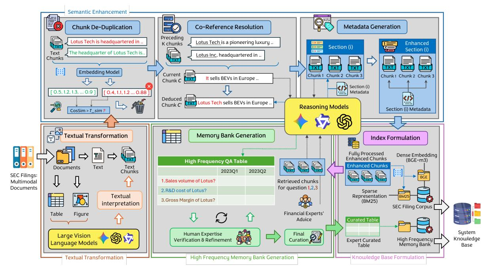
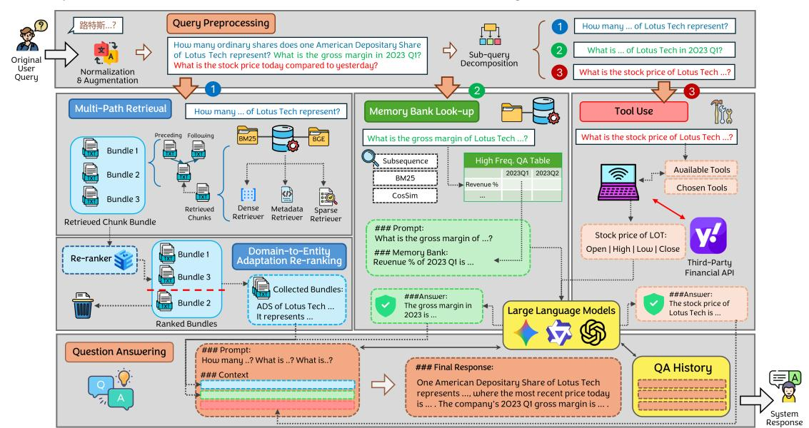
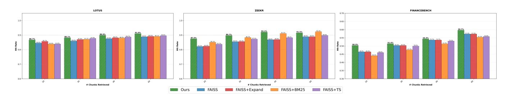

# VeritasFi: An Adaptable, Multi-tiered RAG Framework for Multi-modal Financial Question Answering

Zhenghan Tai1,2∗ , Hanwei Wu1,3∗ , Qingchen Hu1,4∗ , Jijun Chi1,2 † , Hailin He 1 † , Lei Ding 1,5 † , Tung Sum Thomas Kwok1,6 , Bohuai Xiao1 , Yuchen Hua1 , Suyuchen Wang7,8 , Peng Lu7 , Muzhi Li9 , Yihong Wu7 , Liheng Ma4,8 , Jerry Huang7,8 , Jiayi Zhang10, Gonghao Zhang11, Chaolong Jiang1 , Jingrui Tian6 , Sicheng Lyu1,4,8 , Zeyu Li1,12, Boyu Han1,13, Fengran Mo7 , Xinyue Yu7,8 , Yufei Cui4,8 , Ling Zhou14, Xinyu Wang 1,4 § ,

1SimpleWay.AI 2University of Toronto 3McMaster University 4McGill University 5University of Manitoba 6University of California, Los Angeles 7University of Montreal 8Mila 9CUHK 10HKUST(GZ) 11flab.ai

12Nanyang Technological University 13Stanford University 14CG Matrix Technology Limited

# Abstract

Retrieval-Augmented Generation (RAG) is becoming increasingly essential for Question Answering (QA) in the financial sector, where accurate and contextually grounded insights from complex public disclosures are crucial. However, existing financial RAG systems face two significant challenges: (1) they struggle to process heterogeneous data formats, such as text, tables, and figures; and (2) they encounter difficulties in balancing general-domain applicability with company-specific adaptation. To overcome these challenges, we present VeritasFi, an innovative hybrid RAG framework that incorporates a multi-modal preprocessing pipeline alongside a cutting-edge two-stage training strategy for its re-ranking component. VeritasFi enhances financial QA through three key innovations: (1) A multi-modal preprocessing pipeline that seamlessly transforms heterogeneous data into a coherent, machinereadable format. (2) A tripartite hybrid retrieval engine that operates in parallel, combining deep multi-path retrieval over a semantically indexed document corpus, real-time data acquisition through tool utilization, and an expert-curated memory bank for high-frequency questions, ensuring comprehensive scope, accuracy, and efficiency. (3) A two-stage training strategy for the document re-ranker, which initially constructs a general, domain-specific model using anonymized data, followed by rapid fine-tuning on company-specific data for targeted applications. By integrating our proposed designs, VeritasFi presents a groundbreaking framework that greatly enhances the adaptability and robustness of financial RAG systems, providing a scalable solution for both generaldomain and company-specific QA tasks. Code accompanying this work is available at https://github.com/simplew4y/VeritasFi.git.

# CCS Concepts

- Information systems → Question answering.

# Keywords

LLM, Information Retrieval, Document Pre-Processing, Large Language Models, Retrieval Augmented Generation, Generative Models, Synthetic Datasets, Generative Retrieval

# 1 Introduction

The integration of Large Language Models (LLMs) into the financial sector has catalyzed the development of sophisticated Question Answering (QA) systems, with Retrieval-Augmented Generation (RAG) rapidly emerging as a cornerstone technology [\[15,](#page-8-0) [34\]](#page-8-1).

By augmenting LLMs with external knowledge from complex corporate disclosures, such as U.S. Securities and Exchange Commission (SEC) filings, RAG frameworks aim to deliver accurate, verifiable, and context-aware insights essential for high-stakes decision-making and regulatory compliance[\[8,](#page-8-2) [12,](#page-8-3) [19,](#page-8-4) [31,](#page-8-5) [46\]](#page-8-6). For example, when financial analysts query a company's 10-K report for "risks associated with supply chain disruptions in the last fiscal year", they need more than a simple keyword match. They require a synthesized response that integrates complex textual descriptions, numerical data from tables, and potentially trends depicted in figures.

However, deploying general-purpose RAG in finance remains difficult. Two gaps persist: (i) handling the multi-modal nature of filings (text/tables/figures), and (ii) balancing general-domain knowledge with entity-specific adaptation. Many RAG pipelines and financial extractors linearize documents as flat text, leading to incomplete grounding [\[5,](#page-7-0) [15,](#page-8-0) [17,](#page-8-7) [37\]](#page-8-8). Domain shift is well documented: zero-shot general rerankers degrade across datasets [\[43\]](#page-8-9), while in-domain query generation and finetuning improve reranking [\[2,](#page-7-1) [11\]](#page-8-10); vertical models further reinforce this (biomedical [\[18,](#page-8-11) [33\]](#page-8-12), legal [\[3,](#page-7-2) [4\]](#page-7-3), finance [\[1\]](#page-7-4)).

To overcome these fundamental limitations, we introduce VeritasFi, an adaptable, hybrid RAG framework designed for robust and precise multi-modal financial question answering. At its core, VeritasFi combines a multi-modal preprocessing pipeline with a Tripartite Hybrid Retrieval (THR) engine and a two-stage Domainto-Entity re-ranking strategy. In extensive experiments, VeritasFi attains the best end-to-end performance across diverse financial QA datasets, outperforming strong baselines—including GraphRAG and LightRAG—and remaining superior even when classical retrievers (BM25/Faiss) are strengthened with our CAKC preprocessing. Beyond end-to-end accuracy, our multi-path retrieval delivers higher evidence hit rates, while the two-stage re-ranking reliably improves retrieval quality and enables rapid, low-overhead adaptation to new companies.

In summary, our key contributions are as follows:

\*Equal Contribution. winfred.tai@mail.utoronto.ca,wuh92@mcmaster.ca, qingchen.hu@mail.mcgill.ca †Core Contribution.

§ Corresponding Author - xinyu.wang5@mail.mcgill.ca .

- We propose VeritasFi, a novel, end-to-end RAG framework that integrates multi-modal data processing, hybrid retrieval, and an adaptable re-ranker to address the challenges of financial QA.
- We introduce a multi-modal preprocessing pipeline that effectively unifies disparate data formats from financial filings, which include text, tables, and figures, into a coherent, machinereadable format optimized for retrieval.
- We design a tripartite hybrid retrieval engine that combines deep multi-path retrieval, a high-frequency question-matching cache, and external tool integration to ensure comprehensive scope, low latency, and factual timeliness.
- We develop a two-staged, domain-to-entity adaptation strategy that first builds a generalized financial re-ranker and then rapidly specializes it for a target entity using automated data annotation, which promises a scalable and rapid solution to model customization for onboarding.
- The extensive experiments on both public benchmarks and inhouse company dataset showcase that VeritasFi significantly outperforms existing RAG architectures in correctness, context relevance, and overall answer quality.

#### 2 System Overview

Tackling the complexities of domain-specific financial question answering requires a system that can synthesize knowledge from highly heterogeneous sources, including multi-modal documents, structured time-series data, and real-time external information. To this end, we propose an advanced hybrid RAG framework designed to meet these demands. The core components of our system, which operate synergistically, are: i) a Context-Aware Knowledge Curation (CAKC) module to process unstructured financial filings; ii) a Tripartite Hybrid Retrieval (THR) engine that queries diverse information sources in parallel.

# 3 Context-Aware Knowledge Curation

The CAKC module converts raw, multi-modal English financial documents into structured knowledge bases optimized for efficient information retrieval. As shown in Figure [1,](#page-2-0) its primary goal is to decompose complex filings into discrete, contextually coherent information units that enable accurate and efficient indexing. The pipeline yields two complementary outputs.

- (1) SEC Filing Corpus: A primary corpus consisting of semantically enriched, self-contained English text chunks, transformed and enhanced from SEC filings.
- (2) High-frequency memory bank: A structured, factual cache containing time-stamped answers to common quantitative questions, derived from a semi-automated, human-in-the-loop process.

# 3.1 Textual Transformation of Multi-Modal Documents

Our pipeline first parses each multi-modal SEC filing document into a sequence of fixed-length chunks (200 words) with different modality (i.e., text, figure, or table), via the open-source tool MinerU [\[21,](#page-8-13) [44,](#page-8-14) [45,](#page-8-15) [52\]](#page-9-0). To create a unified textual representation suitable for LLM, we then employ GPT-4o [\[40\]](#page-8-16) to transform all non-textual content into descriptive narratives. Specifically, figures are converted into structured captions summarizing their key insights, while tables are rewritten as textual statements that capture their primary data trends and relationships.

3.1.1 Semantic Enhancements. To ensure that the resulting textual chunks are coherent and optimized for retrieval, we perform three semantic enhancements:

- (1) Similar chunk de-duplication. To reduce content redundancy and improve retrieval diversity, we conduct pair-wise comparison that discard any chunk whose dense embedding similarity with other chunks exceeds a predefined threshold ��sim. Specifically, we map each text chunk ���� to the dense vector representation of the embedding model ���� = ��������\_��3 (����), and measure pairwise semantic relationship between text chunks with cosine similarity CosSim(·, ·). The final de-duplicated corpus C ′ is then constructed by iteratively removing the subsequent similar chunk c��

C ′ = C \ {���� ∈ C | ∀�� ≠ �� : CosSim(���� , ����)) &gt; ��sim}, (1)

This mechanism alleviates redundancy in retrieval by filtering near-identical chunks, effectively conserving the generator's limited context window.

- (2) Co-reference resolution. To enhance the contextual sufficiency of each chunk, we replace the pronouns in a given chunk with their explicit antecedents, as chunks retrieved in isolation lack the necessary context to resolve pronounces, where such ambiguity leads to factual inaccuracies in generation.
- (3) Metadata generation. To ensure individual chunks retain the broader context from other chunks in the same parent section for retrieval, we generate a section-level summary with GPT-4o as a metadata attachment to every chunk. This create a shared contextual anchor that enhances retrieval accuracy for highlevel queries.

# 3.2 High Frequency Memory Bank Generation

Beyond processing unstructured financial filings, the CAKC pipeline pre-caches a High-Frequency Memory Bank to accelerate common quantitative query lookups. We structure the cache as a table where each row corresponds to different canonical, normalized questions curated by financial experts. The columns represent time points (e.g., fiscal quarters), and the cells record the value of question's subject at the specified time point. We initialize the memory bank by running our full RAG pipeline on source filings for each question, where we utilize DeepSeek R1 for questions requiring complex reasoning across multiple retrieved chunks. As the initialization is an offline process, we prioritize accuracy by increasing the number of candidate chunks from re-ranking results and employing a reasoning model without latency constraints. The initialized memory bank is then carefully reviewed and verified by in-house experts, resulting in a highly reliable, structured knowledge base for quick answer retrieval. More details regarding the canonical questions and table structure can be found in Appendix [C.](#page-9-1)

# 3.3 Knowledge Base Indexing

We index all processed text chunks in parallel for semantic retrieval. Dense representations ���� are mapped through ��������\_��3 (·) and stored

Figure 1: Context-Aware Knowledge Curation (CAKC) pipeline. Textual Transformation Module (Orange) transforms multimodal data into textual representation. Semantic Enhancement module (Blue) refines the text chunks. The Knowledge Base Formulation Module (Purple) generates the final SEC Filing Corpus from processed text chunks, and the High Frequency Memory Bank Generation Module (Green) constructs a High-Frequency Memory Bank of time-stamped answers.

in Chroma vector database [\[27\]](#page-8-17). Sparse representations are build by inverted index over the text chunks. The High-Frequency Memory Bank is indexed in a relational database to allow on-the-fly subsequence and BM25 searches against its canonical questions. The canonical questions are embedded and indexed within the vector datastore to facilitate semantic matching.

# 4 Tripartite Hybrid Retrieval

To provide comprehensive answers, we first run a Query Preprocessing stage that normalizes, disambiguates, and decomposes the user query into minimal self-contained sub-queries. Building on this, our Tripartite Hybrid Retrieval (THR) engine (Figure [2\)](#page-4-0) routes the processed request to three specialized modules in parallel to handle financial queries of different complexities and data types: (1) Multi-Path Retrieval with Domain-to-Entity Adaptation Re-ranking for deep semantic search over unstructured filings; (2) High-Frequency Memory Look-up for rapid answers from a pre-cached memory bank; and (3) Tool Use for real-time data via external APIs. Evidence from all three streams is then fused to synthesize the final answer.

# 4.1 Query Preprocessing

This module serves as the entry point to the retrieval pipeline, aims to transform complex, multi-faceted financial queries, which rely on unspoken context from previous turns, into precise, machineactionable instructions. The contextual transformation is achieved in two steps:

- (1) Query Normalization and Context Augmentation tackles the problem of incompleteness and ambiguity. We normalize the raw query by translating queries into English to align its representation with the semantic space of our English-language corpus. Next, this pipeline includes the entire conversation history for co-reference resolution and context augmentation, allowing LLM to integrate prior turns and identify users' complete intent, especially when current turn is highly elliptical or dependent on previous information.
- (2) Intent-Driven Decomposition and Retrieval Router tackles the problem of data complexity and execution efficiency. We decompose enhanced, context-rich query into smallest possible self-contained query units (sub-queries), and assign each to optimal retrieval paths using the High-Frequency Memory Bank, pre-defined Tools, deep retreival from document corpus, or direct answering using LLM's own knowledge.

# 4.2 Multi-Path Retrieval

For sub-queries that require in-depth analysis of unstructured financial filings, the system activates the Multi-Path Retrieval and Domain-to-Entity Adaptation Re-ranking stream. This pipeline is designed to maximize recall by simultaneously using diverse retrieval strategies to gather a broad set of candidate chunks.

4.2.1 Retrieval Module. The Retrieval Module executes three distinct retrieval strategies in parallel to create a comprehensive candidate set of chunks from the document corpus. Each retriever

Figure 2: The complete VeritasFi RAG pipeline. The diagram shows three concurrent knowledge retrieval paths: Multi-Path Retrieval (Blue), Memory Bank Look-up (Green) and Tool Use (Red).

manual data creation bottleneck, we use an automated annotation module where an LLM labels retrieved chunks as relevant or irrelevant. This process operates on the actual output of our Multi-path Retrieval pipeline, ensuring the training data distribution mirrors the inference-time conditions for robust model performance. The annotator's judgment is guided by a sophisticated prompt that includes few-shot examples and defines clear relevance criteria (e.g., direct answer, contextual support, fuzzy time match). This automated approach ensures the rapid, consistent, and scalable generation of high-quality training data for specializing the re-ranker to any new company. Further details on the annotation prompt are in Appendix [D.](#page-10-0)

4.3.2 Contrastive Learning Objective. Both fine-tuning stages use supervised fine-tuning (SFT) with a contrastive learning objective. For a query ��, the model is trained to assign higher scores to positive (relevant) chunks �� + than to �� negative (irrelevant) chunks {�� − ��

�� ��=1 For training, all chunks retrieved for �� are annotated: relevant chunks form the positive set P�� = {�� + , . . . , ��+ }, and irrelevant chunks form the negative set N�� = {�� − , . . . , ��− �� }. To enhance robustness, N�� combines (1) hard negatives from retriever-identified but irrelevant chunks, and (2) random negatives sampled from the corpus [\[24\]](#page-8-20). Each training quadruple is structured as

D = ⟨��, P��, N��, prompt⟩ . (4)

For each query, a mini-batch contains one positive �� + ∈ P�� and �� negatives {�� − , . . . , ��− �� } ⊂ N��, producing scores s = [�� + , ��− 1 , . . . , ��− �� ] with ���� = Score(��, ����).

The (�� + 1) candidates are treated as an ad-hoc set of classes, converting the task into classification where �� + is the positive class. The training loss is standard cross-entropy:

L = − log �� + �� + + Í�� ��=1 �� �� . (5)

This objective encourages the model to maximize �� + relative to all negatives, learning to distinguish relevant from irrelevant content.

For Stage 1, negatives in the human-annotated dataset Dhuman serve as hard negatives. Stage 2 uses hard negatives generated by our LLM-Annotator. Training is implemented with FlagEmbedding[1](#page-4-1) to fine-tune bge-reranker-v2-gemma [\[6\]](#page-7-5). Full procedure and hyperparameters are in Procedure [1](#page-3-0) and Appendix [B.](#page-9-2)

#### 4.4 Memory Bank Look-up

The Memory Bank Look-up module provides instantaneous answer to common and recurring financial queries with the pre-trained Memory Bank (Sec. [3.2\)](#page-1-0). After matching the incoming user query with the pre-compiled knowledge base verified by human expert, the system can bypass computationally intensive deep retrieval, reasoning and generation steps, hence reducing overall latency. We normalize the query to remove punctuation and irrelevant entities, and match the query to knowledge base with the three parallel algorithms: (1) Subsequence-based Similarity computes structural similarity between user's query and canonical questions. It identifies the longest contiguous matching subsequences of characters between the two strings to capture precise terminology and word order (sub-sequence). (2) Keyword-based Similarity (BM25) handles variations in phrasing by applying the BM25 algorithm on structure table. This method measures the relevancy of a canonical question based on keyword overlap with the user's query, using the

1<https://github.com/FlagOpen/FlagEmbedding>

scoring function discussed in Section [4.2.](#page-2-1) (3) Semantic Similarity tackles queries that are syntactically different but semantically equivalent as the canonical questions. We utilize the dense retrieval approach mentioned in Section [4.2](#page-2-1) to identify a match based on conceptual intent instead of lexical overlap.

We consider a canonical question ���� potential match if its score from any of the three methods �������� (��, ���� ), ������25 (��, ���� ), �������� (��, ���� ) surpasses the predefined confidence thresholds ��seq, ��bm25, and ��sem. The final matching decision for a given pair (��, ���� ) is determined by the boolean function ��(��, ���� ):

��(��, ���� ) = (��seq (��, ���� ) &gt; ��seq) ∨ (��bm25 (��, ���� ) &gt; ��bm25) ∨ (��sem(��, ���� ) &gt; ��sem). (6)

If ��(��, ���� ) is true for any ���� , the system retrieves canonical question ���� and the corresponding entry from memory bank to return the answr in a structured key-value format.

## 4.5 Tool Use

While retrieval from SEC filings covers most historical data, queries requiring real-time information, such as current stock prices or recent corporate actions, cannot be addressed without external sources. The Tool Use module addresses this gap by integrating external APIs to fetch current market information, operating asynchronously alongside other retrieval streams, and contributing realtime context that complements the historical analysis with real-time context. The module adheres to OpenAI's function-calling schema, enabling the LLM to autonomously select and invoke appropriate tools based on query requirements. Currently supported tools include real-time market data retrieval and event-specific information access (e.g., IPO details) via a third-party financial API. Upon execution, tool outputs are integrated into the conversational context as additional evidence for final answer synthesis.

# 5 Experiments

#### 5.1 Datasets and Baseline

We evaluate VeritasFi across 4 financial QA datasets: FinanceBench [\[26\]](#page-8-21), containing human-verified QA pairs with single gold reference chunks from financial filings; FinQA [\[8\]](#page-8-2), from which we use the textual reasoning subset with single reference chunks; and 2 In-House Company Dataset with multi-entity (e.g., Lotus, Zeekr) QA pairs and annotated relevance labels. We compare our model against graph-based RAG systems including GraphRAG and LightRAG [\[20\]](#page-8-22), as well as standard RAG baselines that perform direct retrieval-to-generation.

# 5.2 Experiment Settings

5.2.1 Multi-path Retrieval (MPR) settings. To evaluate the efficiency of our Multi-path Retrieval module, we perform retrieval tasks on both in-house company dataset and open-source dataset Financebench [\[26\]](#page-8-21). Preprocessing for this experiment consists of three stages: (1) segmenting financial filings into chunks using CAKC, (2) indexing the chunks in a vector store, and (3) rewriting user queries into a format optimized for RAG systems. To ensure a fair comparison across different retriever configurations, we adjust the top-k parameter for each setting to maintain a comparable total number of unique retrieved chunks. Retrieval quality is measured

by the evidence hit rate, where a retrieved chunk is classified as a hit if its cosine similarity to the ground-truth evidence exceeds a predefined threshold. We use Qwen/Qwen-Embedding-4B [\[42\]](#page-8-23) as our embedding model. For in-house dataset, this threshold is set to 1.0, as the ground-truth evidence chunks are the exact chunks selected from the vector store.

5.2.2 Domain-to-Entity Adaptation Re-ranking (DAR) settings. The re-ranker evaluation is designed to rigorously test two distinct performance objectives: general financial domain competence and target company specialization. The model performance is evaluated using standard information retrieval metrics at K=5 and K=10: NDCG@K, MRR@K, Precision@K, and Recall@K. The evaluation is structured around a two-stage benchmarking process, with specific baselines defined for each stage to quantify the performance gain. Stage 1 assesses the model's ability to generalize across financial entities. The re-ranker is trained on the union of abstracted dataset from both Lotus and Zeekr. The performance baseline for Stage 1 is the re-ranker's own pretrained version. We evaluate the three abstraction strategies and select the checkpoint with the highest Precision@5 as the optimal general model as well as the base model for Stage 2 fine-tuning. Stage 2 assesses the specialization for the target company, in which the baseline is defined by a control experiment: the re-ranker's pretrained version directly fine-tuned with LoRA [\[22\]](#page-8-24) on the company-specific dataset (the checkpoint that achieved the highest Precision@5 in this control run). This allows us to quantify the superiority of the two-stage approach over immediate specialization.

5.2.3 End-to-End response settings. We evaluate the end-to-end question-answering performance of VeritasFi against baselines using the evaluation datasets. Settings for GraphRAG and LightRAG are included in (Appendix. [G\)](#page-11-0). To provide a holistic assessment of both retrieval and generation quality, we adopt four metrics from the RAGAS framework [\[14\]](#page-8-25): Factual Correctness, which measures the factual alignment of the generated response with the reference answer; Response Relevancy, which assesses how directly the response addresses the user query; Context Recall, which quantifies the coverage of relevant information in the retrieved context; and Context Precision, which evaluates the proportion of relevant information among the retrieved passages. These metrics together capture the overall faithfulness and effectiveness of the RAG pipeline, and are detailed in Appendix [F.](#page-11-1)

## 6 Results and Analysis

# 6.1 End-to-end Response Results

We evaluate the end-to-end question-answering performance of VeritasFi against a suite of baselines using four datasets: two proprietary in-house knowledge bases (Zeekr, Lotus) and two public financial benchmarks (FinanceBench [\[26\]](#page-8-21) and FinQA Bench [\[8\]](#page-8-2)). The comprehensive results, summarized in Table [1,](#page-6-0) demonstrate the consistent superiority of our method as it achieves the highest unweighted mean (Avg.) performance across all four datasets. A key observation is that the inclusion of Context-Aware Knowledge Curation (CAKC) provides a substantial performance boost

Table 1: End-to-End Performance (top-10). Four panels (2×2). CAKC = Context-Aware Knowledge Curation; Correct. = Correctness; Resp. Rel. = Response Relevancy; Ctx. Recall/Prec. = Context Recall/Precision. Avg. is the unweighted mean of {Correct., Resp. Rel., Ctx. Recall, Ctx. Prec.}. Values are %. Our method is in bold.

| w/ CAKC | Config           | Zeekr Correct. | Resp. Rel. | Ctx. Recall | Ctx. Prec. | Avg. | w/ CAKC | Config           | Lotus Correct. | Resp. Rel. | Ctx. Recall | Ctx. Prec. | Avg. |
|---------|------------------|----------------|------------|-------------|------------|------|---------|------------------|----------------|------------|-------------|------------|------|
| No      | GraphRAG         | 23.3           | 38.9       | 0.1         | 11.7       | 18.5 |         |                  |                |            |             |            |      |
| No      | LightRAG         | 20.5           | 46.8       | 11.2        | 19.3       | 24.5 |         |                  |                |            |             |            |      |
| No      | BM25             | 6.0            | 16.2       | 3.8         | 27.2       | 13.3 |         |                  |                |            |             |            |      |
| No      | Faiss            | 3.8            | 12.0       | 2.3         | 15.7       | 8.4  |         |                  |                |            |             |            |      |
| No      | BM25+Faiss       | 5.6            | 15.0       | 3.1         | 23.2       | 11.7 |         |                  |                |            |             |            |      |
| Yes     | BM25             | 29.4           | 63.0       | 30.3        | 44.7       | 41.9 |         |                  |                |            |             |            |      |
| Yes     | Faiss            | 37.4           | 69.6       | 36.5        | 41.0       | 46.1 |         |                  |                |            |             |            |      |
| Yes     | BM25+Faiss       | 35.9           | 69.5       | 36.0        | 41.1       | 45.6 |         |                  |                |            |             |            |      |
| Yes     | VeritasFi (ours) | 64.3           | 82.0       | 59.0        | 46.3       | 62.9 |         |                  |                |            |             |            |      |
|         |                  |                |            |             |            |      | No      | GraphRAG         | 25.9           | 43.8       | 0.4         | 8.2        | 19.6 |
|         |                  |                |            |             |            |      | No      | LightRAG         | 24.8           | 58.8       | 15.9        | 28.7       | 32.1 |
|         |                  |                |            |             |            |      | No      | BM25             | 17.5           | 34.2       | 7.0         | 23.5       | 20.6 |
|         |                  |                |            |             |            |      | No      | Faiss            | 16.0           | 31.3       | 6.5         | 20.6       | 18.6 |
|         |                  |                |            |             |            |      | No      | BM25+Faiss       | 16.0           | 22.4       | 6.4         | 23.7       | 17.1 |
|         |                  |                |            |             |            |      | Yes     | BM25             | 39.6           | 79.0       | 37.2        | 44.0       | 50.0 |
|         |                  |                |            |             |            |      | Yes     | Faiss            | 39.7           | 81.4       | 45.5        | 40.4       | 51.8 |
|         |                  |                |            |             |            |      | Yes     | BM25+Faiss       | 46.5           | 77.9       | 48.2        | 46.8       | 54.9 |
|         |                  |                |            |             |            |      | Yes     | VeritasFi (ours) | 57.3           | 89.4       | 57.6        | 51.6       | 64.0 |
| w/ CAKC | Config           | Correct.       | Resp.      |             |            |      |         |                  |                |            |             |            |      |
|         |                  |                |            |             | Prec.      | Avg. |         |                  |                |            |             |            |      |
| No      | GraphRAG         | 9.2            | 6.8        | 2.6         | 2.7        | 5.33 |         |                  |                |            |             |            |      |
| No      | LightRAG         | 40.3           | 6.5        | 3.1         | 8.8        | 14.7 |         |                  |                |            |             |            |      |
| No      | BM25             | 17.7           | 54.3       | 34.6        | 39.8       | 36.6 |         |                  |                |            |             |            |      |
| No      | Faiss            | 13.7           | 51.3       | 30.4        | 40.6       | 34.0 |         |                  |                |            |             |            |      |
| No      | BM25+Faiss       | 18.6           | 53.4       | 32.5        | 46.8       | 37.8 |         |                  |                |            |             |            |      |
| Yes     | BM25             | 22.8           | 32.6       | 29.4        | 15.3       | 25.0 |         |                  |                |            |             |            |      |
| Yes     | Faiss            | 20.9           | 63.2       | 50.8        | 35.9       | 42.7 |         |                  |                |            |             |            |      |
| Yes     | BM25+Faiss       | 21.7           | 52.8       | 46.0        | 28.1       | 37.1 |         |                  |                |            |             |            |      |
| Yes     | VeritasFi (ours) | 24.7           | 75.1       | 49.2        | 37.2       | 46.5 |         |                  |                |            |             |            |      |
|         |                  |                |            |             |            |      |         | FinQA            | Bench          |            |             |            |      |
|         |                  |                |            |             |            |      | w/ CAKC | Config           | Correct.       | Resp.      |             |            |      |
|         |                  |                |            |             |            |      |         |                  |                |            |             | Prec.      | Avg. |
|         |                  |                |            |             |            |      | No      | GraphRAG         | 22.8           | 53.1       | 4.6         | 2.1        | 25.8 |
|         |                  |                |            |             |            |      | No      | LightRAG         | 29.5           | 64.1       | 34.0        | 33.4       | 40.3 |
|         |                  |                |            |             |            |      | No      | BM25             | 30.3           | 54.0       | 32.4        | 40.8       | 39.4 |
|         |                  |                |            |             |            |      | No      | Faiss            | 28.2           | 51.1       | 29.1        | 39.6       | 37.0 |
|         |                  |                |            |             |            |      | No      | BM25+Faiss       | 30.9           | 53.4       | 32.1        | 45.2       | 40.4 |
|         |                  |                |            |             |            |      | Yes     | BM25             | 31.4           | 72.6       | 73.3        | 27.8       | 51.3 |
|         |                  |                |            |             |            |      | Yes     | Faiss            | 33.4           | 76.8       | 75.7        | 29.1       | 53.7 |
|         |                  |                |            |             |            |      | Yes     | BM25+Faiss       | 32.0           | 74.8       | 74.7        | 29.6       | 52.8 |
|         |                  |                |            |             |            |      | Yes     | VeritasFi (ours) | 33.7           | 80.1       | 73.9        | 38.8       | 56.6 |

Table 2: Reranker performance on company dataset under different retrieval settings (SFT with Zeekr + Lotus Data). Green gains next to Stage 1 indicate improvements over the pretrained baseline. Dark-green gains next to S2 (Stage 2) indicate further improvements over the best S1 (Stage 1: Complete Abstraction) variant.

| Dataset Base | Training          | Data     |         |         |      |        |      | MRR@5 |        |      |     |      |      |     |      |      |     |      |      |     |      |      |      |        |      |     |      |
|--------------|-------------------|----------|---------|---------|------|--------|------|-------|--------|------|-----|------|------|-----|------|------|-----|------|------|-----|------|------|------|--------|------|-----|------|
| PT           | N/A (Baseline)    |          |         |         | 62.0 |        |      | 60.1  |        | 29.3 |     |      | 23.0 |     |      | 67.3 |     |      | 68.2 |     |      |      | 24.4 |        | 34.8 |     |      |
|              | w/ Product/Person |          | Abs. D. | 64.2    | (    | ↑ 2.2) | 62.7 | (     | ↑ 2.6) | 32.2 | ( ↑ | 2.9) | 25.8 | ( ↑ | 2.8) | 69.3 | ( ↑ | 2.0) | 69.0 | ( ↑ | 0.8) | 26.7 | (    | ↑ 2.3) | 38.5 | ( ↑ | 3.7) |
| PT+S1 Lotus  | w/ Company        | Name     | Abs.    | D. 65.1 | (    | ↑ 3.1) | 65.2 | (     | ↑ 5.1) | 31.1 | ( ↑ | 1.8) | 24.2 | ( ↑ | 1.2) | 69.5 | ( ↑ | 2.2) | 71.5 | ( ↑ | 3.3) | 25.6 | (    | ↑ 1.2) | 37.3 | ( ↑ | 2.5) |
|              | w/ Complete       | Abs.     | Dataset | 69.2    | (    | ↑ 7.2) | 69.1 | (     | ↑ 9.0) | 33.4 | ( ↑ | 4.1) | 26.1 | ( ↑ | 3.1) | 69.2 | ( ↑ | 1.9) | 71.0 | ( ↑ | 2.8) | 27.1 | (    | ↑ 2.7) | 38.4 | ( ↑ | 3.6) |
| PT+S2        | Company           | Specific | Dataset | 72.6    | (    | ↑ 3.4) | 71.5 | (     | ↑ 2.4) | 35.3 | ( ↑ | 1.9) | 27.9 | ( ↑ | 0.4) | 71.5 | ( ↑ | 2.3) | 73.4 | ( ↑ | 2.4) | 27.5 | (    | ↑ 0.4) | 39.0 | ( ↑ | 0.6) |
| PT+S1+S2     | Company           | Specific | Dataset | 75.1    | (    | ↑ 5.9) | 73.5 | (     | ↑ 4.4) | 37.4 | ( ↑ | 4.0) | 28.3 | ( ↑ | 2.2) | 75.4 | ( ↑ | 6.2) | 78.6 | ( ↑ | 7.6) | 28.1 | (    | ↑ 1.0) | 39.5 | ( ↑ | 1.1) |
| PT           | N/A (Baseline)    |          |         |         | 77.1 |        |      | 70.0  |        | 64.9 |     |      | 32.1 |     |      | 74.2 |     |      | 65.3 |     |      |      | 57.4 |        | 43.1 |     |      |
|              | w/ Product/Person |          | Abs. D. | 79.8    | (    | ↑ 2.7) | 73.4 | (     | ↑ 3.4) | 67.9 | ( ↑ | 3.0) | 34.2 | ( ↑ | 2.1) | 74.2 |     | (=)  | 66.3 | ( ↑ | 1.3) | 59.3 | (    | ↑ 1.9) | 45.7 | ( ↑ | 2.6) |
| PT+S1 Zeekr  | w/ Company        | Name     | Abs.    | D. 81.6 | (    | ↑ 4.5) | 75.1 | (     | ↑ 5.1) | 69.9 | ( ↑ | 5.0) | 35.0 | ( ↑ | 2.9) | 75.7 | ( ↑ | 1.5) | 67.4 | ( ↑ | 2.1) | 59.5 | (    | ↑ 2.1) | 44.6 | ( ↑ | 1.5) |
|              | w/ Complete       | Abs.     | Dataset | 82.6    | (    | ↑ 5.5) | 75.9 | (     | ↑ 5.9) | 71.5 | ( ↑ | 6.6) | 35.7 | ( ↑ | 3.6) | 76.3 | ( ↑ | 2.1) | 69.4 | ( ↑ | 4.1) | 59.9 | (    | ↑ 2.5) | 44.4 | ( ↑ | 1.3) |
| PT+S2        | Company           | Specific | Dataset | 84.4    | (    | ↑ 1.8) | 77.3 | (     | ↑ 1.4) | 75.5 | ( ↑ | 4.0) | 38.8 | ( ↑ | 3.1) | 76.5 | ( ↑ | 0.2) | 68.4 | ( ↓ | 1.0) | 61.5 | (    | ↑ 1.6) | 46.5 | ( ↑ | 2.1) |
| PT+S1+S2     | Company           | Specific | Dataset | 87.1    | (    | ↑ 4.5) | 83.6 | (     | ↑ 7.7) | 77.2 | ( ↑ | 5.7) | 39.0 | ( ↑ | 3.3) | 78.2 | ( ↑ | 1.9) | 70.9 | ( ↑ | 1.5) | 63.4 | (    | ↑ 3.5) | 47.1 | ( ↑ | 2.7) |

to all retrieval methods, resulting in noticeable gains across metrics, particularly in Context Recall and Factual Correctness, by enabling better integration of structured and context-comprehensive knowledge during the generation phase. Specifically, VeritasFi leads the performance on the proprietary datasets, demonstrating superior Factual Correctness and Response Relevancy on Zeekr and Lotus, respectively, confirming that the responses are highly accurate and well-aligned with user intent. Collectively, this strong performance validates the effectiveness of our integrated

architecture in achieving superior and generalizable end-to-end question-answering capability.

# 6.2 Multi-path Retrieval Results

As shown in Figure [3,](#page-7-6) our multi-path retrieval approach consistently outperforms all baseline methods across both in-house datasets (Lotus, Zeekr) and open-source (Financebench) datasets. While the Faiss-only method achieves competitive performance, retrieving

Figure 3: Hit rate comparison across multi-path retrieval (MPR) settings. Our hybrid retrieval approach consistently improves evidence hit rates across evaluation datasets in most retrieval scenarios.

most relevant evidence within the top 20 chunks, our ensemble approach combining four retrieval methods introduces greater diversity and yields 2-5% improvement in hit rate across varying chunk counts. Notably, we observe dataset-dependent performance characteristics among individual methods: Faiss+Bm25 demonstrates strong performance on Zeekr but shows degraded results on Financebench, suggesting different underlying data distributions and query patterns. This variability underscores the robustness of our multi-path ensemble, which maintains superior and consistent performance across all datasets by leveraging complementary strengths of different retrieval strategies.

# 6.3 Domain-to-entity Re-ranking Results

Table [2](#page-6-1) shows that our two-stage Domain-to-Entity adaptation strategy (See Section [4.3.1\)](#page-3-1) achieves consistent and substantial improvements across all metrics on both the Lotus and Zeekr datasets. Stage 1 delivers notable gains over the pretrained baseline, demonstrating the value of abstracted, entity-agnostic training for developing a robust financial re-ranker. Among the variants, the model trained on the Complete abstract dataset performs the best, indicating that fully masking entity mentions helps the model focus on financial semantics rather than surface-level patterns. Building on this foundation, Stage 2 further enhances performance, surpassing both Stage 1 and Direct SFT by effectively refining company-specific relevance estimation. Compared with Direct SFT, which fine-tunes solely on company-specific data, Model after DAR achieves higher accuracy on both datasets, yielding boosts of over 2.5 in NDCG@5 and 2.0 in MRR@5 on Zeekr, and similar gains on Lotus. These results demonstrate that Stage 1 establishes a transferable understanding of financial language, while Stage 2 tailors this knowledge to new entities through automated, retrieval-aligned adaptation.

# 6.4 System Latency and Cost Results

We conduct a comprehensive end-to-end analysis of the system's operational efficiency, measuring both system latency and deployment cost. This evaluation assesses the performance of every module in our processing pipeline, specifically quantifying the average execution time and the token usage for each large language model (LLM) invocation. Our analysis particularly focuses on the variable steps, such as Sub-query Answering and Tool Use, to understand how system performance scales with increasing query complexity and tool integration. For a detailed breakdown of the

time and cost associated with each processing step, please refer to Appendix [E.](#page-10-1)

# 7 Conclusion

This paper introduced VeritasFi, a practical end-to-end framework for financial QA that addresses the dual challenge of processing heterogeneous disclosures and achieving efficient company-specific adaption. Through the synergy of the Context-Aware Knowledge Curation, Tripartite Hybrid Retrieval engine and two-stage Domainto-Entity re-ranking training strategy, VeritasFi delivers strong end-to-end performance, with the largest improvement reaching +38.4 points in average on Zeekr compared to LightRAG [\[20\]](#page-8-22). Our ablation studies confirm that the three components provide complementary strengths, forming a cohesive and scalable architecture for grounded financial QA. Beyond these empirical gains, VeritasFi establishes a generalizable architectural blueprint for domain-specific RAG systems that must balance broad applicability with rapid specialization—a requirement increasingly critical across sectors beyond finance. Future work could explore extending this framework to other specialized domains (e.g., legal, healthcare) and incorporating advanced reasoning capabilities to handle complex multi-hop queries over temporal financial data.

#### References

[1] Doğu Araci. 2019. FinBERT: Financial Sentiment Analysis with Pre-trained Language Models. arXiv preprint arXiv:1908.10063 (2019). [https://arxiv.org/abs/](https://arxiv.org/abs/1908.10063) [1908.10063](https://arxiv.org/abs/1908.10063) [2] Luiz Bonifacio, Hugo Abonizio, Marzieh Fadaee, and Rodrigo Nogueira. 2022. InPars: Data Augmentation for Information Retrieval using Large Language Models. arXiv preprint arXiv:2202.05144 (2022).<https://arxiv.org/abs/2202.05144> [3] Ilias Chalkidis, Manos Fergadiotis, Prodromos Malakasiotis, Nikolaos Aletras, and Ion Androutsopoulos. 2020. LEGAL-BERT: The Muppets straight out of Law School. arXiv preprint arXiv:2010.02559 (2020).<https://arxiv.org/abs/2010.02559> [4] Ilias Chalkidis, Abhik Jana, Dirk Hartung, Michael Bommarito, Ion Androutsopoulos, Daniel Martin Katz, and Nikolaos Aletras. 2022. LexGLUE: A Benchmark Dataset for Legal Language Understanding in English. In Proceedings of the 60th Annual Meeting of the Association for Computational Linguistics (Volume 1: Long Papers). Association for Computational Linguistics, 4310–4330. [5] Shubham Chatterjee, Iain Mackie, and Jeff Dalton. 2024. DREQ: Document Re-Ranking Using Entity-based Query Understanding. arXiv[:2401.05939](https://arxiv.org/abs/2401.05939) [cs.IR] <https://arxiv.org/abs/2401.05939> [6] Jianlv Chen, Shitao Xiao, Peitian Zhang, Kun Luo, Defu Lian, and Zheng Liu. 2024. BGE M3-Embedding: Multi-Lingual, Multi-Functionality, Multi-Granularity Text Embeddings Through Self-Knowledge Distillation. arXiv[:2402.03216](https://arxiv.org/abs/2402.03216) [cs.CL] <https://arxiv.org/abs/2402.03216> [7] Yuemin Chen, Feifan Wu, Jingwei Wang, Hao Qian, Ziqi Liu, Zhiqiang Zhang, Jun Zhou, and Meng Wang. 2024. Knowledge-augmented Financial Market Analysis and Report Generation. In Proceedings of the 2024 Conference on Empirical Methods in Natural Language Processing: Industry Track, Franck Dernoncourt, Daniel Preoţiuc-Pietro, and Anastasia Shimorina (Eds.). Association for Computational

Linguistics, Miami, Florida, US, 1207–1217. [doi:10.18653/v1/2024.emnlp-industry.](https://doi.org/10.18653/v1/2024.emnlp-industry.90) [90](https://doi.org/10.18653/v1/2024.emnlp-industry.90) [8] Zhiyu Chen, Wenhu Chen, Charese Smiley, Sameena Shah, Iana Borova, Dylan Langdon, Reema Moussa, Matt Beane, Ting-Hao Huang, Bryan Routledge, and William Yang Wang. 2022. FinQA: A Dataset of Numerical Reasoning over Financial Data. arXiv[:2109.00122](https://arxiv.org/abs/2109.00122) [cs.CL]<https://arxiv.org/abs/2109.00122> [9] Zhiyu Chen, Shiyang Li, Charese Smiley, Zhiqiang Ma, Sameena Shah, and William Yang Wang. 2022. ConvFinQA: Exploring the Chain of Numerical Reasoning in Conversational Finance Question Answering. arXiv[:2210.03849](https://arxiv.org/abs/2210.03849) [cs.CL] <https://arxiv.org/abs/2210.03849> [10] Chanyeol Choi, Jihoon Kwon, Jaeseon Ha, Hojun Choi, Chaewoon Kim, Yongjae Lee, Jy yong Sohn, and Alejandro Lopez-Lira. 2025. FinDER: Financial Dataset for Question Answering and Evaluating Retrieval-Augmented Generation. arXiv[:2504.15800](https://arxiv.org/abs/2504.15800) [cs.IR]<https://arxiv.org/abs/2504.15800> [11] Zhuyun Dai, Vincent Y. Zhao, Ji Ma, Yi Luan, Jianmo Ni, Jing Lu, Anton Bakalov, Kelvin Guu, Keith B. Hall, and Ming-Wei Chang. 2022. Promptagator: Fewshot Dense Retrieval From 8 Examples. arXiv preprint arXiv:2209.11755 (2022). <https://arxiv.org/abs/2209.11755> [12] Syed Affan Daimi and Asma Iqbal. 2024. A scalable data-driven framework for systematic analysis of SEC 10-K filings using large language models. arXiv preprint arXiv:2409.17581 (2024). [13] Darren Edge, Ha Trinh, Newman Cheng, Joshua Bradley, Alex Chao, Apurva Mody, Steven Truitt, Dasha Metropolitansky, Robert Osazuwa Ness, and Jonathan Larson. 2025. From Local to Global: A Graph RAG Approach to Query-Focused Summarization. arXiv[:2404.16130](https://arxiv.org/abs/2404.16130) [cs.CL]<https://arxiv.org/abs/2404.16130> [14] Shahul Es, Jithin James, Luis Espinosa-Anke, and Steven Schockaert. 2025. Ragas: Automated Evaluation of Retrieval Augmented Generation. arXiv[:2309.15217](https://arxiv.org/abs/2309.15217) [cs.CL]<https://arxiv.org/abs/2309.15217> [15] Yunfan Gao, Yun Xiong, Xinyu Gao, Kangxiang Jia, Jinliu Pan, Yuxi Bi, Yi Dai, Jiawei Sun, Meng Wang, and Haofen Wang. 2024. Retrieval-Augmented Generation for Large Language Models: A Survey. arXiv[:2312.10997](https://arxiv.org/abs/2312.10997) [cs.CL] <https://arxiv.org/abs/2312.10997> [16] Daniel Gozman and Wendy Currie. 2014. The role of Investment Management Systems in regulatory compliance: A post-financial crisis study of displacement mechanisms. J. Inf. Technol. 29, 1 (March 2014), 44–58. [17] Benjamin Großmann, Alexandru Todor, and Adrian Paschke. 2015. Improving Semantic Search through Entity-Based Document Ranking. In Proceedings of the 5th International Conference on Web Intelligence, Mining and Semantics (Larnaca, Cyprus) (WIMS '15). Association for Computing Machinery, New York, NY, USA, Article 9, 12 pages. [doi:10.1145/2797115.2797120](https://doi.org/10.1145/2797115.2797120) [18] Yu Gu, Robert Tinn, Hao Cheng, Michael Lucas, Naoto Usuyama, Xiaodong Liu, Tristan Naumann, Jianfeng Gao, and Hoifung Poon. 2021. Domain-Specific Language Model Pretraining for Biomedical Natural Language Processing. ACM Transactions on Computing for Healthcare 3, 1, Article 2 (2021), 23 pages. [doi:10.](https://doi.org/10.1145/3458754) [1145/3458754](https://doi.org/10.1145/3458754) [19] Zirui Guo, Lianghao Xia, Yanhua Yu, Tu Ao, and Chao Huang. 2024. Lightrag: Simple and fast retrieval-augmented generation. arXiv preprint arXiv:2410.05779 (2024). [20] Zirui Guo, Lianghao Xia, Yanhua Yu, Tu Ao, and Chao Huang. 2025. LightRAG: Simple and Fast Retrieval-Augmented Generation. arXiv[:2410.05779](https://arxiv.org/abs/2410.05779) [cs.IR] <https://arxiv.org/abs/2410.05779> [21] Conghui He, Wei Li, Zhenjiang Jin, Chao Xu, Bin Wang, and Dahua Lin. 2024. Opendatalab: Empowering general artificial intelligence with open datasets. arXiv preprint arXiv:2407.13773 (2024). [22] Edward J. Hu, Yelong Shen, Phillip Wallis, Zeyuan Allen-Zhu, Yuanzhi Li, Shean Wang, Lu Wang, and Weizhu Chen. 2021. LoRA: Low-Rank Adaptation of Large Language Models. arXiv[:2106.09685](https://arxiv.org/abs/2106.09685) [cs.CL]<https://arxiv.org/abs/2106.09685> [23] Yuntong Hu, Zhihan Lei, Zheng Zhang, Bo Pan, Chen Ling, and Liang Zhao. 2025. GRAG: Graph Retrieval-Augmented Generation. arXiv[:2405.16506](https://arxiv.org/abs/2405.16506) [cs.LG] <https://arxiv.org/abs/2405.16506> [24] Jui-Ting Huang, Ashish Sharma, Shuying Sun, Li Xia, David Zhang, Philip Pronin, Janani Padmanabhan, Giuseppe Ottaviano, and Linjun Yang. 2020. Embeddingbased Retrieval in Facebook Search. In Proceedings of the 26th ACM SIGKDD International Conference on Knowledge Discovery & Data Mining (KDD '20). ACM, 2553–2561. [doi:10.1145/3394486.3403305](https://doi.org/10.1145/3394486.3403305) [25] Lei Huang, Weijiang Yu, Weitao Ma, Weihong Zhong, Zhangyin Feng, Haotian Wang, Qianglong Chen, Weihua Peng, Xiaocheng Feng, Bing Qin, and Ting Liu. 2025. A Survey on Hallucination in Large Language Models: Principles, Taxonomy, Challenges, and Open Questions. ACM Transactions on Information Systems 43, 2 (Jan. 2025), 1–55. [doi:10.1145/3703155](https://doi.org/10.1145/3703155) [26] Pranab Islam, Anand Kannappan, Douwe Kiela, Rebecca Qian, Nino Scherrer, and Bertie Vidgen. 2023. Financebench: A new benchmark for financial question answering. arXiv preprint arXiv:2311.11944 (2023). [27] Jeff Huberand, Anton Troynikov and Chroma Contributors. 2025. Chroma: The open-source vector database. Chroma. Retrieved October 5, 2025 from <https://github.com/chroma-core/chroma> [28] Jeff Johnson, Matthijs Douze, and Hervé Jégou. 2017. Billion-scale similarity search with GPUs. arXiv[:1702.08734](https://arxiv.org/abs/1702.08734) [cs.CV]<https://arxiv.org/abs/1702.08734> [29] Vladimir Karpukhin, Barlas Oğuz, Sewon Min, Patrick Lewis, Ledell Wu, Sergey Edunov, Danqi Chen, and Wen tau Yih. 2020. Dense Passage Retrieval for Open-Domain Question Answering. arXiv[:2004.04906](https://arxiv.org/abs/2004.04906) [cs.CL] [https://arxiv.org/abs/](https://arxiv.org/abs/2004.04906) [2004.04906](https://arxiv.org/abs/2004.04906) [30] Sejong Kim, Hyunseo Song, Hyunwoo Seo, and Hyunjun Kim. 2025. Optimizing Retrieval Strategies for Financial Question Answering Documents in Retrieval-Augmented Generation Systems. arXiv[:2503.15191](https://arxiv.org/abs/2503.15191) [cs.IR] [https://arxiv.org/abs/](https://arxiv.org/abs/2503.15191) [2503.15191](https://arxiv.org/abs/2503.15191) [31] Viet Dac Lai, Michael Krumdick, Charles Lovering, Varshini Reddy, Craig Schmidt, and Chris Tanner. 2024. Sec-qa: A systematic evaluation corpus for financial qa. arXiv preprint arXiv:2406.14394 (2024). [32] Joohyun Lee and Minji Roh. 2024. Multi-Reranker: Maximizing performance of retrieval-augmented generation in the FinanceRAG challenge. arXiv[:2411.16732](https://arxiv.org/abs/2411.16732) [cs.CL]<https://arxiv.org/abs/2411.16732> [33] Jinhyuk Lee, Wonjin Yoon, Sungdong Kim, Donghyeon Kim, Sunkyu Kim, Chan Ho So, and Jaewoo Kang. 2020. BioBERT: a pre-trained biomedical language representation model for biomedical text mining. Bioinformatics 36, 4 (2020), 1234–1240. [doi:10.1093/bioinformatics/btz682](https://doi.org/10.1093/bioinformatics/btz682) [34] Patrick Lewis, Ethan Perez, Aleksandra Piktus, Fabio Petroni, Vladimir Karpukhin, Naman Goyal, Heinrich Küttler, Mike Lewis, Wen tau Yih, Tim Rocktäschel, Sebastian Riedel, and Douwe Kiela. 2021. Retrieval-Augmented Generation for Knowledge-Intensive NLP Tasks. arXiv[:2005.11401](https://arxiv.org/abs/2005.11401) [cs.CL] <https://arxiv.org/abs/2005.11401> [35] Chaofan Li, Zheng Liu, Shitao Xiao, and Yingxia Shao. 2023. Making Large Language Models A Better Foundation For Dense Retrieval. arXiv[:2312.15503](https://arxiv.org/abs/2312.15503) [cs.CL] <https://arxiv.org/abs/2312.15503> [36] Chin-Yew Lin. 2004. ROUGE: A Package for Automatic Evaluation of Summaries. In Text Summarization Branches Out. Association for Computational Linguistics, Barcelona, Spain, 74–81.<https://aclanthology.org/W04-1013/> [37] Lefteris Loukas, Fabian Billert, Manos Fergadiotis, Prodromos Malakasiotis, and Ion Androutsopoulos. 2025. EDGAR-CRAWLER: From Raw Web Documents to Structured Financial NLP Datasets. In Companion Proceedings of the ACM on Web Conference 2025. 761–764. [38] Xinbei Ma, Yeyun Gong, Pengcheng He, Hai Zhao, and Nan Duan. 2023. Query Rewriting for Retrieval-Augmented Large Language Models. arXiv[:2305.14283](https://arxiv.org/abs/2305.14283) [cs.CL]<https://arxiv.org/abs/2305.14283> [39] Rodrigo Nogueira and Kyunghyun Cho. 2020. Passage Re-ranking with BERT. arXiv[:1901.04085](https://arxiv.org/abs/1901.04085) [cs.IR]<https://arxiv.org/abs/1901.04085> [40] OpenAI. 2024. Hello GPT-4o. [https://openai.com/index/hello-gpt-4o/.](https://openai.com/index/hello-gpt-4o/) Accessed: 2025-09-10. [41] Varshini Reddy, Rik Koncel-Kedziorski, Viet Dac Lai, Michael Krumdick, Charles Lovering, and Chris Tanner. 2024. DocFinQA: A Long-Context Financial Reasoning Dataset. arXiv[:2401.06915](https://arxiv.org/abs/2401.06915) [cs.CL]<https://arxiv.org/abs/2401.06915> [42] Qwen Team. 2025. Qwen3 Technical Report. arXiv[:2505.09388](https://arxiv.org/abs/2505.09388) [cs.CL] [https:](https://arxiv.org/abs/2505.09388) [//arxiv.org/abs/2505.09388](https://arxiv.org/abs/2505.09388) [43] Nandan Thakur, Nils Reimers, Andreas Rücklé, Abhishek Srivastava, and Iryna Gurevych. 2021. BEIR: A Heterogeneous Benchmark for Zero-shot Evaluation of Information Retrieval Models. arXiv preprint arXiv:2104.08663 (2021). [https:](https://arxiv.org/abs/2104.08663) [//arxiv.org/abs/2104.08663](https://arxiv.org/abs/2104.08663) [44] Bin Wang, Zhuangcheng Gu, Chao Xu, Bo Zhang, Botian Shi, and Conghui He. 2024. UniMERNet: A Universal Network for Real-World Mathematical Expression Recognition. arXiv[:2404.15254](https://arxiv.org/abs/2404.15254) [cs.CV] [45] Bin Wang, Chao Xu, Xiaomeng Zhao, Linke Ouyang, Fan Wu, Zhiyuan Zhao, Rui Xu, Kaiwen Liu, Yuan Qu, Fukai Shang, Bo Zhang, Liqun Wei, Zhihao Sui, Wei Li, Botian Shi, Yu Qiao, Dahua Lin, and Conghui He. 2024. MinerU: An Open-Source Solution for Precise Document Content Extraction. arXiv[:2409.18839](https://arxiv.org/abs/2409.18839) [cs.CV] <https://arxiv.org/abs/2409.18839> [46] Yan Wang, Yang Ren, Lingfei Qian, Xueqing Peng, Keyi Wang, Yi Han, Dongji Feng, Xiao-Yang Liu, Jimin Huang, and Qianqian Xie. 2025. FinTagging: An LLM-ready Benchmark for Extracting and Structuring Financial Information. arXiv preprint arXiv:2505.20650 (2025). [47] Qianqian Xie, Weiguang Han, Zhengyu Chen, Ruoyu Xiang, Xiao Zhang, Yueru He, Mengxi Xiao, Dong Li, Yongfu Dai, Duanyu Feng, Yijing Xu, Haoqiang Kang, Ziyan Kuang, Chenhan Yuan, Kailai Yang, Zheheng Luo, Tianlin Zhang, Zhiwei Liu, Guojun Xiong, Zhiyang Deng, Yuechen Jiang, Zhiyuan Yao, Haohang Li, Yangyang Yu, Gang Hu, Jiajia Huang, Xiao-Yang Liu, Alejandro Lopez-Lira, Benyou Wang, Yanzhao Lai, Hao Wang, Min Peng, Sophia Ananiadou, and Jimin Huang. 2024. FinBen: A Holistic Financial Benchmark for Large Language Models. arXiv[:2402.12659](https://arxiv.org/abs/2402.12659) [cs.CL]<https://arxiv.org/abs/2402.12659> [48] Noga Ben Yoash, Meni Brief, Oded Ovadia, Gil Shenderovitz, Moshik Mishaeli, Rachel Lemberg, and Eitam Sheetrit. 2025. SECQUE: A Benchmark for Evaluating Real-World Financial Analysis Capabilities. arXiv[:2504.04596](https://arxiv.org/abs/2504.04596) [cs.AI] [https:](https://arxiv.org/abs/2504.04596) [//arxiv.org/abs/2504.04596](https://arxiv.org/abs/2504.04596) [49] Jie Zhang, Changzai Pan, Kaiwen Wei, Sishi Xiong, Yu Zhao, Xiangyu Li, Jiaxin Peng, Xiaoyan Gu, Jian Yang, Wenhan Chang, Zhenhe Wu, Jiang Zhong, Shuangyong Song, Yongxiang Li, and Xuelong Li. 2025. T2R-bench: A Benchmark for Generating Article-Level Reports from Real World Industrial Tables. arXiv[:2508.19813](https://arxiv.org/abs/2508.19813) [cs.CL]<https://arxiv.org/abs/2508.19813>

[50] Yanzhao Zhang, Mingxin Li, Dingkun Long, Xin Zhang, Huan Lin, Baosong Yang, Pengjun Xie, An Yang, Dayiheng Liu, Junyang Lin, Fei Huang, and Jingren Zhou. 2025. Qwen3 Embedding: Advancing Text Embedding and Reranking Through Foundation Models. arXiv[:2506.05176](https://arxiv.org/abs/2506.05176) [cs.CL]<https://arxiv.org/abs/2506.05176> [51] Suifeng Zhao, Zhuoran Jin, Sujian Li, and Jun Gao. 2025. FinRAGBench-V: A Benchmark for Multimodal RAG with Visual Citation in the Financial Domain. arXiv[:2505.17471](https://arxiv.org/abs/2505.17471) [cs.CL]<https://arxiv.org/abs/2505.17471> [52] Zhiyuan Zhao, Hengrui Kang, Bin Wang, and Conghui He. 2024. DocLayout-YOLO: Enhancing Document Layout Analysis through Diverse Synthetic Data and Global-to-Local Adaptive Perception. arXiv[:2410.12628](https://arxiv.org/abs/2410.12628) [cs.CV] [https://arxiv.](https://arxiv.org/abs/2410.12628) [org/abs/2410.12628](https://arxiv.org/abs/2410.12628) [53] Fengbin Zhu, Wenqiang Lei, Youcheng Huang, Chao Wang, Shuo Zhang, Jiancheng Lv, Fuli Feng, and Tat-Seng Chua. 2021. TAT-QA: A Question Answering Benchmark on a Hybrid of Tabular and Textual Content in Finance. arXiv[:2105.07624](https://arxiv.org/abs/2105.07624) [cs.CL]<https://arxiv.org/abs/2105.07624>

# A Related Work

# A.1 Retrieval Augmented Generation

Large Language Models have demonstrated remarkable capabilities in natural language understanding and generation; however, they face significant challenges in knowledge-intensive tasks, primarily due to their knowledge cutoff and a propensity for hallucination [\[25\]](#page-8-26). To address this, the initial RAG framework [\[34\]](#page-8-1), built upon the Dense Passage Retrieval (DPR) model [\[29\]](#page-8-27), was introduced to augment LLM responses with relevant document chunks from an external knowledge database. While earlier models like DPR focused on extractive tasks, RAG's key innovation was extending this retrieval mechanism to generative tasks, enabling the model to produce coherent and factually grounded responses.

Modern RAG systems have evolved from simple retriever–generator architectures into sophisticated multistage pipelines comprising pre-retrieval and post-retrieval processes [\[15\]](#page-8-0). The pre-retrieval stage focuses on improving query formulation through techniques such as query rewriting [\[38\]](#page-8-28) and decomposition, while the postretrieval stage commonly employs re-ranking to refine the candidate set. Traditional cross-encoder re-rankers [\[39\]](#page-8-29) jointly encode query–document pairs for fine-grained scoring, whereas LLMbased re-rankers [\[50\]](#page-9-3) leverage generative reasoning to handle more complex ranking scenarios.

Despite recent advances, RAG systems that rely solely on unstructured text remain limited in capturing complex, multi-hop relationships between entities. To address this, GraphRAG and LightRAG frameworks [\[13,](#page-8-30) [20,](#page-8-22) [23\]](#page-8-31) integrate structured knowledge graphs into retrieval to model inter-entity dependencies and improve factual grounding. While these methods enhance reasoning and coverage, they require expensive graph construction, indexing, and maintenance, making them time-consuming and difficult to scale in dynamic domains.

# A.2 RAG in Finance

These limitations are particularly pronounced in the financial domain, where precision and timeliness are critical for regulatory compliance and investment decision-making [\[16\]](#page-8-32). Financial documents contain dense terminology, rapidly evolving information, and heterogeneous formats such as tables and reports, making retrieval especially challenging [\[10,](#page-8-33) [51\]](#page-9-4). To address these challenges, prior work explores three main directions. Some methods focus on internal document information, leveraging structural cues or

entity co-occurrence to enhance contextual retrieval [\[5,](#page-7-0) [17\]](#page-8-7). Others incorporate external knowledge, such as financial databases or knowledge graphs, to improve factual grounding and reduce hallucination [\[7\]](#page-7-7). More recently, hybrid RAG systems attempt to combine both internal and external signals through complex multistage pipelines [\[30,](#page-8-34) [32\]](#page-8-35). While effective, these approaches often require extensive graph construction, corpus refinement, and finetuning, leading to high computational cost and limited scalability across financial entities and domains.

# A.3 Financial RAG System Evaluation

The systematic evaluation of financial RAG systems is supported by a growing number of specialized benchmarks, largely centered on question answering from SEC filings. A core set of datasets, including Financebench [\[26\]](#page-8-21), FinQA [\[8\]](#page-8-2), FinDER [\[10\]](#page-8-33), and FinBen [\[47\]](#page-8-36), provide (question, context, answer) tuples with golden evidence, enabling assessment of both retrieval quality and end-to-end accuracy. To address the crucial need for quantitative analysis, benchmarks such as FinQA [\[8\]](#page-8-2), ConvFinQA [\[9\]](#page-8-37), TAT-QA [\[53\]](#page-9-5), and DocFinQA [\[41\]](#page-8-38) specifically target numerical reasoning over combined textual and tabular data. Further advancing the rigor of evaluation, recent benchmarks introduce greater complexity. T2RagBench [\[49\]](#page-8-39) uses re-created, context-independent questions to test true retrievalbased reasoning, while SECQUE [\[48\]](#page-8-40) raises the difficulty with crosscompany questions that require synthesis of information across long contexts.

Manually evaluating the outputs of a RAG system is impractical at scale, making automated evaluation essential. Traditional metrics like ROUGE [\[36\]](#page-8-41) and EM (Exact Match) are often insufficient as they rely on lexical overlap and fail to capture semantic correctness. Consequently, the field has increasingly adopted powerful LLMs as judges. This approach takes two common forms: RAGAS[\[14\]](#page-8-25) and FinDER [\[10\]](#page-8-33) prompt an LLM to evaluate a response based on a criteria tuple (faithfulness, correctness, context relevance). Alternatively, as seen in the SECQUE benchmark [\[48\]](#page-8-40), an LLM can be used to map a response directly to a holistic quality score.

# B Re-ranker Fine-tuning

We employ Low-Rank Adaptation (LoRA) [\[22\]](#page-8-24) through the FlagEmbedding framework to reduce the number of trainable parameters and enhance training efficiency. Specifically, LoRA was enabled with the rank set to 32 and the scaling factor (��) set to 64, targeting the attention projection layers (��proj, ��proj, ��proj, ��proj). The model was fine-tuned for 100 epochs. The learning rate was set to 1e-4 to ensure stable convergence. To manage memory and maintain a small effective batch size, the per-device batch size was set to 1, and gradient accumulation was enabled with gradient\_accumulation\_steps=2. Mixed precision training was employed using the bf16 setting to further optimize memory usage. The training utilized a warmup ratio of 0.1 and a weight decay of 0.1. Input sequences were configured with a train\_group\_size of 8.

# C High Frequency Memory Bank

The memory bank serves as a specialized, low-latency knowledge cache for fact-intensive queries. The illustrative example shown in Figure [4](#page-10-2) shows that the key advantage of this mechanism is its ability to directly retrieve accurate, pre-computed answers for frequently asked questions, resulting in minimal end-to-end latency for high-frequency questions.

Figure 4: An example of question-answering using memory bank.

# D Automatic Annotation

# D.1 Automatic annotation prompt template

Figure [5](#page-10-3) presents the complete prompt template used for automatic labeling for retrieved document chunks. This template is designed to guide a Large Language Model (LLM), designated with the Role of an expert financial document annotation specialist, to perform the task of determining the relevance of a given document chunk to a user query. The prompt provides detailed Relevance Assessment Criteria, clearly defining both High Relevance (including Direct Match, Contextual Support, and Fuzzy Time Period Match) and Low Relevance criteria (Generic Discussion and Incidental Mention). Crucially, the prompt incorporates Few-Shot Annotation Examples to demonstrate the expected relevance judgment and accompanying analysis. Finally, it specifies a strict two-line output format to ensure structured and reliable data generation.

# D.2 Annotation accuracy

To ensure the high quality and reliability of our in-house company datasets (Zeekr and Lotus), we adopted a rigorous annotation process based on our automatic annotation prompt template. In the first stage, we conducted a pilot annotation on a randomly selected subset of samples from both the Lotus and Zeekr datasets. The automatically generated annotations for these subsets were then subjected to manual review by domain experts. This manual quality check yielded high accuracy scores, confirming the initial effectiveness of the prompt. For challenging edge-case samples identified during this review, we further enhanced the prompt by integrating them as new few-shot examples. In the second stage, we leveraged this refined prompt template to annotate the entirety of the two datasets, ensuring consistent and high-quality relevance labels across the full data distribution. The quality assessment results are detailed in Table [3.](#page-10-4)

Table 3: Annotation Accuracy on Dataset Subsets.

Figure 5: Automatic Annotation Prompt Template (Details partially omitted due to space constraints).

Table 4: System Latency and Deployment Cost. �� and �� (�� ≥ 1) denote the number of available tools and the number of subqueries, respectively.

# E Latency and Cost Analysis

We conduct a detailed analysis of our system's operational efficiency, focusing on two critical aspects: system latency and usage cost. We first measure the average execution time for each process within our system. Crucially, we also quantify the average token usage for each call to the Chat Completion API, which serves as the primary factor in estimating the marginal deployment cost of the system. A deeper analysis is necessary for the asynchronous and variable components, particularly Sub-query Answering and Tool Use, since the system performance is dependent on the number of sub-queries executed and the number of available external tools. The system performance is detailed in Table [4.](#page-10-5)

| LLM               |                                |
|-------------------|--------------------------------|
| Parameter         | Value                          |
| Model             | deepseek-v3                    |
| Message Embedding | Caching Enabled(hash-based KV) |
| Model             | all-MiniLM-L6-v2               |
| Dimension         | 384                            |
| Max Token         | Size 8192                      |
| Batch Size        | 64                             |
| Max Async         | 4                              |
| Normalize         | True                           |
| Retrieval         | / Query                        |
| Mode              | local                          |
| Top cited Storage | chunks 10 (EVAL_TOP_CHUNKS)    |
| Vector DB         | NanoVectorDB                   |
| Graph             | Storage NetworkX + GraphML     |
| KV Storage        | JSON                           |

Table 5: Graphrag configuration

# F RAGAS

To comprehensively evaluate retrieval and generation performance, we employ the RAGAS framework [\[14\]](#page-8-25), which provides automated, reference-based metrics for RAG systems.

Factual Correctness. metric assesses the factual overlap between a generated response and a reference (ground-truth) answer. Internally, it uses an LLM as the evaluator to decompose both the response and the reference into sets of atomic claims. It then employs natural language inference to judge which response claims correspond to reference claims. A higher score indicates that the generated response preserves more ground-truth facts.

Answer Relevancy. Answer Relevancy quantifies how pertinent or directly relevant the generated answer is to the user's query. RAGAS implements it to penalize responses that are incomplete, extraneous, or tangential, awarding a higher score to answers that closely align in substance and focus with the original question.

Context Recall. Context Recall measures the extent to which the retrieved context covers all the claims needed to answer the question. In RAGAS, the reference answer is decomposed into claims, and the metric counts how many of those claims are supported by the retrieved context, using LLM-based attribution when necessary. Higher recall indicates fewer missing supports.

Context Precision. This metric evaluates how well the retriever ranks relevant information above irrelevant passages. Specifically, it measures whether the ground-truth relevant items present in the contexts are ranked higher in the retrieve list, using a mean precision@k scheme over retrieved chunks. A high CP means that relevant chunks tend to appear at top ranks rather than buried.

# G LightRAG and GraphRAG

# G.1 GraphRAG Configuration

GraphRAG is a graph-based retrieval system that uses knowledge graph representations to enhance contextual understanding. The configuration is detailed in Table [5.](#page-11-2)

| LLM                          |                       |
|------------------------------|-----------------------|
| Parameter                    | Value                 |
| Model                        | deepseek-v3           |
| Configuration Embedding      | Custom LLM model func |
| Model                        | all-MiniLM-L6-v2      |
| Dimension                    | 384                   |
| Max Token Size               | 8192                  |
| Embedding batch num          | 50                    |
| Max parallel insert Query    | 2                     |
| Mode                         | global                |
| Top_k                        | 60                    |
| Response type                | Multiple Paragraphs   |
| Only need context            | False                 |
| Max token for text unit      | 4000                  |
| Max token for global context | 4000                  |
| Max token for local context  | 4000                  |

Table 6: LightRAG Configuration

# G.2 LightRAG Configuration

LightRAG represents a more streamlined approach which prioritizes efficiency while maintaining retrieval quality. The detailed configuration is shown in Table [6.](#page-11-3)