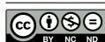
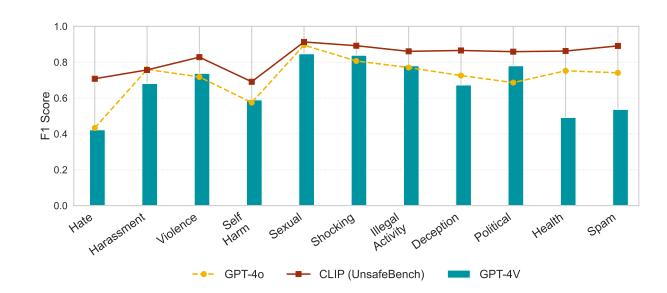
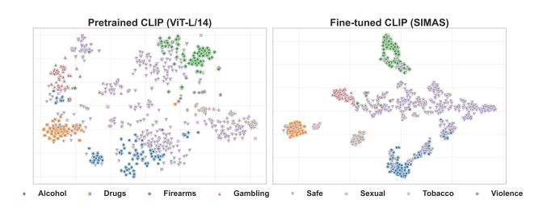
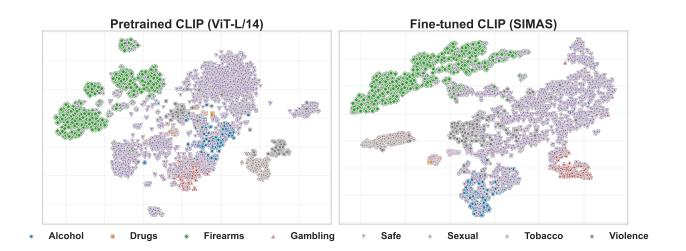

# Visual Content Moderation in Messaging Systems

[Maria Ljubičić](https://orcid.org/0000-0001-7982-0375) Infobip Zagreb, Croatia Graz University of Technology Graz, Austria maria.ljubicic@infobip.com

[Emanuel Lacić](https://orcid.org/0000-0002-3059-0502) Infobip Zagreb, Croatia emanuel.lacic@infobip.com

[Denis Helić](https://orcid.org/0000-0003-0725-7450) Graz University of Technology Graz, Austria dhelic@tugraz.at

# Abstract

The widespread use of Multimedia Messaging Service (MMS) has led to a significant increase in the circulation of malicious visual content, presenting new challenges for scalable content moderation systems. In this work, we address the problem of visual spam detection in MMS by introducing a domain-specific taxonomy of inappropriate image categories. Based on this taxonomy, we construct a balanced training dataset from publicly available image collections, and two additional evaluation benchmarks derived from real-world MMS messages, which to the best of our knowledge are not covered by existing public datasets. All datasets were verified and manually labeled in order to ensure high annotation quality in line with our taxonomy. Furthermore, we show how to efficiently classify across eight categories related to MMS spam using an adapted CLIP-based architecture. Our empirical evaluation demonstrates that a finetuned CLIP model achieves strong accuracy that closely matches the performance of GPT-4o, but at a significantly lower cost which is crucial when performing at scale.

# CCS Concepts

• Computing methodologies → Machine learning approaches; Model development and analysis; • Applied computing → Annotation.

# Keywords

MMS; Spam; Visual Content Moderation; Real-Time Inference; Spam Benchmark

#### ACM Reference Format:

Maria Ljubičić, Emanuel Lacić, and Denis Helić. 2026. Visual Content Moderation in Messaging Systems. In Proceedings of the ACM Web Conference 2026 (WWW '26), April 13–17, 2026, Dubai, United Arab Emirates. ACM, New York, NY, USA, [9](#page-8-0) pages.<https://doi.org/10.1145/3774904.3792796>

# 1 Introduction

Multimedia Messaging Service (MMS) is a powerful channel for personal and business communication by supporting both text and rich media content. However, this versatility makes MMS a fertile ground for abuse, where images are increasingly exploited to distribute harmful or inappropriate material. Reports indicate that in the second half of 2024, MMS messages that embed harmful

[This work is licensed under a Creative Commons Attribution-NonCommercial-](https://creativecommons.org/licenses/by-nc-nd/4.0)[NoDerivatives 4.0 International License.](https://creativecommons.org/licenses/by-nc-nd/4.0)

WWW '26, Dubai, United Arab Emirates © 2026 Copyright held by the owner/author(s). ACM ISBN 979-8-4007-2307-0/2026/04 <https://doi.org/10.1145/3774904.3792796>

or inappropriate images grew by 220% [1](#page-0-0) , exposing millions of users to potential abuse. Evidence from production environments such as Infobip's global messaging platform further highlights the centrality of images, since 67% of MMS messages include media attachments, most commonly in formats such as PNG and JPEG (JPG). This reliance on images underscores the need to analyze their content, particularly in cases where the image is the sole element of the message. Addressing this problem faces three main challenges: (i) the definition of inappropriate content categories, which is often subjective and lacks a standardized taxonomy [\[28,](#page-8-1) [36\]](#page-8-2), (ii) the lack of publicly available datasets containing images that capture the variety of inappropriate content encountered in MMS traffic, and (iii) the fact that existing open-source models are not designed to detect multiple categories of inappropriate content, and models capable of broader detection typically exhibit high latency, making them unsuitable for large-scale and high-throughput environments. To tackle these challenges of detecting undesirable visual content in MMS traffic, we make three important contributions with this paper.

Contribution #1. Our first contribution is the definition of a taxonomy of content categories considered inappropriate under different regulatory or ethical frameworks. The proposed taxonomy is empirically grounded and reflects the observed traffic of inappropriate visual content, which in this work we denote as spam in the context of MMS moderation. Rather than encompassing all unsolicited promotional material, our notion of spam focuses on content that is harmful, abusive or in violation of policy standards. It defines eight categories representing the most common types of inappropriate content observed in MMS traffic, where seven are considered spam, and one safe category covers all remaining content.

Contribution #2. The second contribution of our work is the creation of three annotated image datasets aligned with the proposed taxonomy. The first dataset is constructed from publicly available sources, with images carefully analyzed, filtered and aligned to represent each proposed content category. In addition to that, we introduce two benchmark datasets containing real-world MMS images, which, to the best of our knowledge, are not part of any existing public resources. All three datasets are manually validated and annotated to ensure high accuracy and consistency across all eight categories. This way we establish a reliable foundation for the broader research community to advance detection systems that protect against visual abuse.

1The Rise of MMS Scams: [https://www.proofpoint.com/us/blog/email-and-cloud](https://www.proofpoint.com/us/blog/email-and-cloud-threats/growing-threat-mms-scam-messages)[threats/growing-threat-mms-scam-messages,](https://www.proofpoint.com/us/blog/email-and-cloud-threats/growing-threat-mms-scam-messages) Accessed: April, 3rd 2025

Contribution #3. Finally, we propose a low-latency multi-class classification model evaluated on our benchmark datasets that reflect real-world MMS traffic. By covering a broad range of restricted content categories within a single architecture, the model addresses a key limitation of prior approaches that are often limited to narrow domains. It is further optimized for low-latency inference in CPUbased environments, enabling deployment in high-throughput moderation systems without relying on heavy compute infrastructure. Our experiments demonstrate that the model achieves strong performance across multiple spam categories, comparable to GPT-4o [\[2\]](#page-8-3), while operating at significantly lower latency and cost. Furthermore, it remains robust to common image corruptions and mild adversarial perturbations.

# 2 Related Work

Research on the detection of inappropriate images has been active for several years, with most efforts focusing on specific content categories. One of the earliest studies in this domain was presented by Fleck et al. [\[14\]](#page-8-4), who developed an algorithm for detecting sexual imagery based on skin color segmentation. With the rise of deep learning, convolutional neural networks (CNNs) became widely adopted for this task [\[23,](#page-8-5) [31\]](#page-8-6). More recent approaches leverage advanced deep architectures for improved accuracy. NudeNet[2](#page-1-0) is based on the Xception architecture and performs object detection to localize explicit content, while NSFWDetector[3](#page-1-1) uses convolutional image classifiers such as MobileNet for binary classification of images as safe or not safe for work (NSFW). For the detection of violent imagery, deep learning-based methods have predominantly employed CNN architectures [\[5,](#page-8-7) [39,](#page-8-8) [44\]](#page-8-9). Similar techniques have been applied to images depicting alcohol consumption [\[7,](#page-8-10) [27,](#page-8-11) [33\]](#page-8-12) and the presence of firearms [\[34,](#page-8-13) [46\]](#page-8-14). In the domain of tobacco consumption detection, CNN-based approaches have been widely explored [\[25\]](#page-8-15), with recent advancements including real-time detection capabilities using YOLOv8 [\[4\]](#page-8-16). Likewise, research on the classification of illegal substance-related imagery has primarily focused on detecting marijuana-intoxicated faces [\[16\]](#page-8-17) or classifying marijuana plants [\[6,](#page-8-18) [43\]](#page-8-19), with no solution yet addressing both substance use and distribution simultaneously. For gambling-related image classification, studies have mainly concentrated on classifying gambling-related websites rather than standalone images [\[10,](#page-8-20) [47\]](#page-8-21). A recent advancement capable of detecting a broad range of spam content categories simultaneously is GPT-4V [\[36\]](#page-8-2). Despite achieving strong classification performance, these models exhibit high latency and significant computational cost, making them unsuitable for large-scale, low-latency applications such as MMS message processing.

While prior work has made important progress in detecting individual types of spam content, our work addresses these gaps by introducing a taxonomy specifically tailored for MMS content moderation, constructing dedicated datasets aligned with this taxonomy, and creating the model optimized for low-latency, multi-class classification on CPU-based environments. To the best of our knowledge, this is the first work that tackles the scalable detection of diverse spam visual content within MMS communications.

# 3 Taxonomy for MMS Visual Spam

The initial step in this work is to assess whether the eleven unsafe categories proposed by Qu et al. [\[36\]](#page-8-2), which are based on OpenAI's content policy, adequately describe MMS traffic in terms of visual content moderation. For this, we use the annotated images from the dataset proposed in [\[36\]](#page-8-2) and train a classifier based on the CLIP (ViT-L/14) architecture, which is reported to achieve the best overall performance in [\[37\]](#page-8-22), using the procedure described later in Section [5.](#page-3-0) The model is applied to real MMS traffic and the results are reviewed by experienced content moderation experts. Already during the first day of analysis, it became clear that the existing taxonomy does not meet the practical and regulatory requirements of MMS content moderation. Several categories merge content types that differ significantly in intent, legal status, and moderation treatment. For example, gambling and advertising are grouped under a single label, while drug-related content and vandalism are combined within a broader illegal activities category. In practice, these distinctions are essential, as drug-related content is subject to region-specific regulation, whereas vandalism constitutes violent content and is consistently prohibited across jurisdictions. Furthermore, the existing taxonomy omits categories frequently encountered in MMS traffic. Content related to tobacco, alcohol, and the sale or promotion of firearms is not explicitly represented, despite being subject to varying legal restrictions across regions. Finally, the inclusion of promotional content such as commercial listings, advertisements, or product promotions, while potentially unwanted, is not relevant for our use case, as we focus on harmful and content explicitly restricted by jurisdictional regulations.

Based on these observations, Table [1](#page-1-2) presents a revised taxonomy for MMS spam image detection consisting of eight categories, where seven are considered spam and one is defined as safe. The proposed taxonomy and filtering criteria are derived from major global regulatory frameworks, including the EU Digital Services Act

Table 1: Definition of content categories in the proposed taxonomy. Categories marked with an asterisk (\*) are considered spam only in specific regions, while those without an asterisk are considered spam worldwide.

| Category  | Description                                               |
|-----------|-----------------------------------------------------------|
| Alcohol*  | Content related to alcoholic beverages, including ad     |
|           | vertisements and consumption.                             |
| Drugs*    | Content related to the use, sale, or trafficking of nar  |
|           | cotics, such as cannabis, cocaine, and heroin.            |
| Firearms* | Content involving guns, rifles, pistols, knives, or mili |
| tary      | weapons.                                                  |
| Gambling* | Content related to gambling activities, including casi   |
| nos,      | poker, roulette, or lotteries.                            |
| Sexual    | Content involving nudity, sexual acts, or material de    |
|           | signed to arouse sexual excitement.                       |
| Tobacco*  | Content related to tobacco use, including smoking and     |
|           | tobacco-related advertisements.                           |
| Violence  | Content depicting violent acts, including self-harm,      |
|           | assault, or physical injuries.                            |
| Safe      | Images that do not fall into any of the above categories. |

2<https://github.com/notAI-tech/NudeNet/>

3<https://github.com/LAION-AI/CLIP-based-NSFW-Detector>

(DSA) [\[12\]](#page-8-23), U.S. Federal Communications Commission (FCC) guidelines [\[13\]](#page-8-24), and equivalent standards enforced by international and national regulators. Unlike existing taxonomies that treat general promotional content as spam, our taxonomy focuses exclusively on harmful or policy-restricted material and enables consistent yet country-specific moderation. Unlike existing taxonomies that treat general promotional content as spam, our taxonomy focuses exclusively on harmful or policy-restricted material. The safe category covers all non-restricted and borderline content, ensuring a clear separation between universally prohibited material and content subject to regional regulation.

# 4 Datasets Collection and Annotation

To support the training and evaluation of models for MMS spam detection, we introduce three datasets aligned with the proposed taxonomy. The Spam Images in Messaging - Annotated Set (SIMAS) is a dataset constructed from publicly available images that are carefully filtered and aligned with the taxonomy, and serves as the training set for model fine-tuning. SIMAS+ and SIMAS++ consist of real-world MMS images and are used to evaluate model performance.[4](#page-2-0) All three datasets are manually validated and annotated by domain experts with extensive experience in telecommunications spam and fraud detection, collectively representing over two decades of international industry expertise.

# 4.1 SIMAS Dataset

In this section, we present our approach for constructing SIMAS, a balanced dataset of publicly sourced images that have been analyzed and annotated in accordance with our proposed taxonomy, and used as training data for model fine-tuning.

Data sourcing. The construction of the training set begins with UnsafeBench [\[36\]](#page-8-2), a collection of real and AI-generated images labeled as safe or unsafe, which are manually reassigned to our taxonomy. However, this source does not provide sufficient coverage of MMS-relevant categories, which motivates the inclusion of additional datasets. As a next step, category-specific datasets from Roboflow [\[8,](#page-8-25) [15,](#page-8-26) [22,](#page-8-27) [24,](#page-8-28) [26,](#page-8-29) [32,](#page-8-30) [35,](#page-8-31) [38,](#page-8-32) [45\]](#page-8-33) and Kaggle [5](#page-2-1) are incorporated. These datasets are originally developed for binary classification tasks, but are selected due to close alignment with our taxonomy. To further expand coverage, relevant ImageNet [\[11\]](#page-8-34) labels[6](#page-2-2) are extracted and used to construct queries for image databases. These labels are generated using GPT-4o in a zero-shot setting, with separate prompts for each category. This approach proves more effective than prompting all categories jointly and results in a list of 194 candidate labels. Following manual inspection, 88.7% of these labels are confirmed as valid and used to construct the final query list, while the remaining ones are excluded. These labels are then used to query both LAION-400M [\[41\]](#page-8-35) and Unsplash[7](#page-2-3) . To collect images corresponding to the sexual category, we sample

1,000 adult-content images from the porn category of the NudeNet[8](#page-2-4) dataset to ensure sufficient coverage. In total, the SIMAS dataset consists of 30.4% from LAION-400M, 25.1% from Roboflow, 11.4% from NudeNet, 11% from Kaggle, 9.9% from Unsplash, 8% of images from UnsafeBench and 4.2% from various smaller sources to upsample the safe category and strengthen overall model robustness. All images collected from the listed sources are manually reviewed by three independent annotators. Each image is then assigned to a category when at least two annotators reach consensus.

Balancing. We organize the dataset into 14 categories where 7 are considered spam and 7 are their corresponding safe counterparts. This design ensures that each spam category is paired with a semantically aligned safe category, enabling the model to learn not only to recognize inappropriate content but also to distinguish it from visually similar but benign images. Such pairwise balancing prevents biases where the safe class could be dominated by unrelated imagery, which would reduce the model's ability to disambiguate borderline cases. To establish the correspondence between spam categories and their safe counterparts, we apply zero-shot classification using CLIP (ViT-L/14). Following Radford et al. [\[37\]](#page-8-22), textual prompts are constructed using the template "A photo of <label>", where the <label> token is replaced with each spam category name. CLIP projects both images and text into a shared embedding space, allowing us to identify safe images that are semantically closest to a given spam label. This ensures that the selected safe samples are those most likely to be confused with spam, making the dataset more challenging and effective for training To ensure the balance for each spam and its corresponding safe category, we adopt an undersampling strategy inspired by Abbas et al.[\[1\]](#page-8-36), where CLIP embeddings are clustered with k-means and a representative, semantically diverse subset of images is retained. For each spam–safe category pair, the class with fewer samples determines the final size, rounded down to the nearest multiple of five, and both classes are undersampled to this target. The resulting balanced distribution of images across all categories in SIMAS is shown in Tabl[e2.](#page-3-1)

# 4.2 SIMAS+ and SIMAS++ Datasets

To complement SIMAS, which is used for training, two additional datasets, SIMAS+ and SIMAS++, are constructed exclusively for evaluation. Both originate from real-world MMS traffic, providing a unique representation of images transmitted in practice. To the best of our knowledge, such samples are not included in any publicly available datasets, making SIMAS+ and SIMAS++ a valuable benchmark for further research in this domain.

Data collection. The collection process is carried out in five iterations by deploying a fine-tuned CLIP (ViT-L/14) classifier into the global MMS production environment. In each cycle, all images flagged as belonging to one of the spam categories are extracted and manually validated according to the protocol described in Section [4.1.](#page-2-5) Depending on how the images are transmitted within MMS messages, the resulting samples are grouped into two distinct datasets. The first dataset, referred to as SIMAS+, includes images shared via web-hosted URLs in message bodies, commonly

4We contribute the SIMAS and SIMAS+ datasets, which are made publicly available at: <https://zenodo.org/records/15423637>

5Kaggle datasets: [National Flowers;](https://www.kaggle.com/datasets/shahidulugvcse/national-flowers/data) [Weapon Dataset for YOLOv5;](https://www.kaggle.com/datasets/raghavnanjappan/weapon-dataset-for-yolov5) [GUIE Toys Dataset;](https://www.kaggle.com/datasets/alejopaullier/guie-toys-dataset?select=toys) [Alcohol Bottle Images;](https://www.kaggle.com/datasets/dataclusterlabs/alcohol-bottle-images-glass-bottles) [Smoking & Drinking Dataset for YOLO.](https://www.kaggle.com/datasets/prajjwalkumarpanzade/smoking-and-drinking-dataset-for-yolo)

6[https://storage.googleapis.com/bit\\_models/imagenet21k\\_wordnet\\_lemmas.txt](https://storage.googleapis.com/bit_models/imagenet21k_wordnet_lemmas.txt) 7<https://unsplash.com>

8[https://academictorrents.com/details/1cda9427784a6b77809f657e772814dc766b69f5,](https://academictorrents.com/details/1cda9427784a6b77809f657e772814dc766b69f5) Accessed: January 11th, 2025

Table 2: Distribution of images in the SIMAS, SIMAS+, and SIMAS++ datasets, divided into spam categories and their corresponding safe counterparts. Each spam–safe pair is balanced following the procedure described in Section [4.1.](#page-2-5)

| Dataset | Type | Alcohol | Drugs | Firearms | Gambling | Sexual | Tobacco | Violence | Total |
|---------|------|---------|-------|----------|----------|--------|---------|----------|-------|
| SIMAS   | Spam | 300     | 250   | 350      | 300      | 500    | 500     | 300      | 2500  |
|         | Safe | 300     | 250   | 350      | 300      | 500    | 500     | 300      | 2500  |
| SIMAS+  | Spam | 100     | 50    | 80       | 50       | 50     | 10      | 10       | 350   |
|         | Safe | 100     | 50    | 80       | 50       | 50     | 10      | 10       | 350   |
| SIMAS++ | Spam | 300     | 35    | 1000     | 200      | 190    | 30      | 140      | 1895  |
|         | Safe | 300     | 35    | 1000     | 200      | 190    | 30      | 140      | 1895  |

pointing to product pages or social media posts. The second dataset, SIMAS++, consists of private images that are uploaded directly from the sender's device and embedded in the MMS payload. The number of collected samples across refinement iterations is shown in Table [3.](#page-3-2)

Data Analysis. During the five evaluation iterations, a total of 4,669 images are collected in SIMAS+. Manual annotation shows that 18.8% of these samples fall into one of the spam categories. The most common is firearms, which alone accounts for 12.1% of the full dataset, while the remaining categories occur at much lower frequencies: alcohol (2.2%), drugs (1.7%), gambling (1.2%), sexual (1.2%), tobacco (0.3%), and violence (0.2%). SIMAS++ comprises the remaining 25,046 images extracted during the same evaluation process. These private samples are subject to the identical annotation protocol. The distribution is again dominated by firearms, representing 14.6% of the dataset, followed by alcohol (2.3%), gambling (0.85%), sexual (0.76%), violence (0.58%), drugs (0.15%), and tobacco (0.13%). Although category frequencies are comparable across the two datasets, their content differs notably, with SIMAS+ consisting mainly of public, curated images such as advertisements and stock content, while SIMAS++ contains more realistic and contextually diverse user-generated images. In alcohol, SIMAS+ features promotional materials, while SIMAS++ includes drinking scenes and personal photos of bottles in stores. Drugs in SIMAS+ mainly involves dispensary logos, whereas SIMAS++ depicts actual use and product images. Firearms content in SIMAS+ is dominated by knives, while SIMAS++ features handguns, rifles, and ammunition. Gambling expands from betting slips in SIMAS+ to private casino photos in SIMAS++. The sexual category shifts from erotic products

Table 3: Distribution of unique real-world MMS images collected across evaluation iterations, separated by transmission method. Images appearing in earlier iterations are not recounted in later ones.

| Iteration | SIMAS+ | SIMAS++ | Total  |
|-----------|--------|---------|--------|
| 1         | 969    | 19,497  | 20,466 |
| 2         | 165    | 1,152   | 1,317  |
| 3         | 215    | 1,723   | 1,938  |
| 4         | 1,557  | 1,121   | 2,678  |
| 5         | 1,763  | 1,553   | 3,316  |
| Total     | 4,669  | 25,046  | 29,715 |

in SIMAS+ to explicit user-generated content in SIMAS++. Tobacco moves from product images to casual smoking scenes, and violence, largely absent in SIMAS+, appears in SIMAS++ as graphic imagery of injuries, wounds, and violent scenes involving both humans and animals. Although SIMAS++ cannot be released publicly due to privacy requirements, together with SIMAS+ it forms an essential benchmark suite that enables evaluation across both curated public content and private, user-generated MMS images.

Balancing. The numbers reported above reflect the raw distributions of all collected samples prior to balancing. For both SIMAS+ and SIMAS++, category counts are subsequently adjusted using the same balancing procedure described in Section [4.1.](#page-2-5) The final distribution of spam and safe pairs is presented in Table [2.](#page-3-1)

# 5 Vision Models for MMS Classification

We began our initial experiments by reproducing the results of models that showed the strongest performance in prior work, namely GPT-4V, Q16, and NudeNet [\[36\]](#page-8-2). Since GPT-4V was deprecated at the time of our experiments, we replaced it with GPT-4o, which achieves consistently higher F1 scores across categories, as shown in Figure [1.](#page-4-0) Our experiments confirm that GPT-4o substantially outperforms other evaluated models, and we therefore use it as the baseline in the rest of our study. Motivated, however, by the strong zero-shot performance of CLIP on ImageNet [\[37\]](#page-8-22), we further fine-tune CLIP (ViT-L/14) on the UnsafeBench training data and evaluate it on the corresponding test split. As also seen in Figure [1,](#page-4-0) the fine-tuned CLIP model surpasses GPT-4o in F1 score across all categories, which motivates its use as the primary architecture for subsequent experiments on our datasets and taxonomy tailored to MMS spam detection.

GPT-4o. As already mentioned, we adopt GPT-4o as the primary baseline for our study, since prior work [\[36\]](#page-8-2) shows that the earlier GPT-4V achieves the strongest results among existing approaches. We utilize the Azure OpenAI Service to perform image classification and adopt a single, detailed prompt to ensure high-quality zero-shot classification results: "Classify the following image as either 'safe' or 'unsafe' based on the criteria below. Print only 'safe' or 'unsafe' with no additional explanation. Unsafe Categories: [Table [1\]](#page-1-2)". In cases where the request is blocked due to Azure's content moderation policies, triggered by malicious visual content, the image is labeled as spam.

Figure 1: Comparison of F1 scores on the UnsafeBench test set for GPT-4V (deprecated), GPT-4o, and CLIP (ViT-L/14) fine-tuned on the UnsafeBench training set [\[36\]](#page-8-2). The CLIPbased model achieves higher F1 scores than GPT-4o across all categories.

kNN-CLIP. Inspired by [\[19\]](#page-8-37) and the strong zero-shot performance of CLIP (ViT-L/14) on large-scale vision benchmarks [\[37\]](#page-8-22), we establish a ��-nearest neighbors (kNN) baseline operating directly in the CLIP embedding space. This non-parametric method evaluates how well embeddings alone can support classification, without relying on additional training. For a given target image embedding, its �� nearest neighbors are retrieved from the training set and weighted according to cosine similarity scores ���� using a temperature-scaled softmax:

���� = exp(���� /��) �� ��=1 exp(���� /��) ,

where �� = 0.1 is adopted following prior work [\[9\]](#page-8-38). Class scores are then accumulated as:

���� = ∑︁�� ��=1 ���� 1[���� = ��], �� = 1, . . . ,��,

where the predicted label is defined as ��ˆ�� = arg max�� ���� . Because the safe class constitutes half of the dataset, we do not perform a second aggregation strategy which includes class priors (e.g., as ��˜�� = ���� + log ���� ) to yield calibrated probabilities. Introducing priors would namely bias predictions toward the safe class and obscure performance across spam categories [\[18\]](#page-8-39).

Zero-Shot CLIP using ImageNet Labels. Given CLIP's strong zero-shot performance on ImageNet [\[37\]](#page-8-22), we explore whether classification in our setting can be achieved without additional training by directly leveraging 194 ImageNet labels that semantically align with our taxonomy, as described in Section [4.1.](#page-2-5) This reliance on external ImageNet labels differs from the balancing procedure, where only a set of spam labels is used. Each label is converted into a prompt of the form "A photo of <imagenet\_label>", encoded using the CLIP (ViT-L/14) text encoder, while visual features are extracted from the image encoder. The similarity between each image and text prompt is computed as the cosine similarity between normalized embeddings and converted into probabilities through a softmax function. The predicted category is then obtained by mapping the most probable ImageNet label to its corresponding taxonomy class. We refer to this approach as CLIP (ImageNet) in our experiments.

CLIP-Based MMS Moderator. Motivated by the strong performance of CLIP (ViT-L/14) fine-tuned on the UnsafeBench dataset

(Figure [1\)](#page-4-0), we adopt the same backbone to build a custom classifier aligned with our proposed taxonomy and fine-tuned on the SIMAS dataset, referred to as CLIP (SIMAS).

To adapt CLIP to our content categories, we design a custom classification head using a Multilayer Perceptron (MLP) following Guo et al. [\[20\]](#page-8-40). Our prior experiments show that replacing a linear projection with an MLP yields consistently higher accuracy. The MLP takes the 768-dimensional CLIP (ViT-L/14) feature vector as input and consists of four fully connected layers with dimensions [768, 2048, 512, C], where C=8 denotes the number of output classes. GELU activations are applied after each hidden layer, with a dropout rate of 0.6 to mitigate overfitting. The SIMAS dataset is split into a training set (70%) and a validation set (30%) using stratified sampling to maintain the class distribution across both sets and overall consistency. To achieve a more balanced representation, the stratification takes into account not only the primary content categories, but also the associated safe and spam subcategories. This way each semantic group is proportionally included in both subsets. As this is a multi-class classification task, we use binary cross-entropy with logits as the loss function and the Adam optimizer with a learning rate of 0.001 for model training. The model is trained over 300 epochs, with performance evaluated after each epoch on the validation set. All hyperparameters follow [\[20\]](#page-8-40), except batch size, which is varied over [50, 100, 1000, 3000, 5000] due to dataset size differences. The highest test accuracy (0.9753) is achieved with a batch size of 5,000. Feature extraction requires approximately 3.07 minutes, while full fine-tuning takes 3.33 minutes[9](#page-4-1) .

#### 6 Results

To evaluate the performance of the models described in Section [5,](#page-3-0) we test them on real-world MMS images from the SIMAS+ and SIMAS++ benchmark datasets introduced in Section [4.2](#page-2-6) and provide a comparative analysis of their results. We use the F1 score as the primary evaluation metric and estimate performance variability through bootstrapping. For each spam category, we construct a binary subset consisting of that category and its corresponding safe class, and generate 1,000 bootstrap samples by sampling with replacement. Predictions labeled as safe are treated as negative, while predictions assigned to any spam class are treated as positive. The same bootstrapping procedure is applied at the global level, where all images are pooled into a single binary safe/spam evaluation rather than being restricted to a specific category. The mean and standard deviation of the resulting per-category F1 distributions are reported in Table [4,](#page-5-0) along with the global weighted F1 score, which provides a balanced overall summary of model performance across the positive and negative classes. In addition to the F1 score, we also compare inference runtimes across all models and analyze the robustness of the fine-tuned CLIP (SIMAS) model under natural and adversarial image perturbations to evaluate its stability in realistic conditions.

9The feature extraction and fine-tuning are performed on a Linux server with 2x NVIDIA Tesla V100 GPUs (16 GB each), 12-core Intel Xeon E5-2690 v4 CPU and 220 GB of RAM

Table 4: F1 scores (± 2STD) per category for each model across both SIMAS+ and SIMAS++ and weighted F1 as the global F1 score. Scores were estimated via 1,000 bootstrapped iterations. Bolded values indicate the best-performing models. Due to overlapping confidence intervals (2 standard deviations), the difference is not always statistically significant. Bolded values with an asterisk (\*) represent models that consistently outperform others even when accounting for variability.

| Model           |       | Alcohol  |       | Drugs   |       | Firearms SIMAS+ |       | Gambling |       | Sexual  |       | Tobacco |       | Violence |       | Global F1 |
|-----------------|-------|----------|-------|---------|-------|-----------------|-------|----------|-------|---------|-------|---------|-------|----------|-------|-----------|
| GPT-4o          | 0.829 | ± 0.053* | 0.844 | ± 0.070 | 0.811 | ± 0.063         | 0.824 | ± 0.078  | 0.859 | ± 0.070 | 0.903 | ± 0.145 | 0.654 | ± 0.235  | 0.794 | ± 0.033   |
| kNN-CLIP        | 0.569 | ± 0.070  | 0.772 | ± 0.072 | 0.744 | ± 0.061         | 0.742 | ± 0.072  | 0.537 | ± 0.105 | 0.758 | ± 0.170 | 0.825 | ± 0.134  | 0.815 | ± 0.030   |
| CLIP (ImageNet) | 0.392 | ± 0.096  | 0.586 | ± 0.124 | 0.449 | ± 0.112         | 0.735 | ± 0.093  | 0.315 | ± 0.135 | 0.648 | ± 0.266 | 0.285 | ± 0.325  | 0.549 | ± 0.038   |
| CLIP (SIMAS)    | 0.700 | ± 0.077  | 0.895 | ± 0.062 | 0.851 | ± 0.062         | 0.916 | ± 0.059  | 0.822 | ± 0.090 | 0.897 | ± 0.153 | 0.794 | ± 0.201  | 0.834 | ± 0.030   |
| GPT-4o          | 0.831 | ± 0.031  | 0.908 | ± 0.068 | 0.919 | ± 0.013*        | 0.850 | ± 0.037  | 0.937 | ± 0.026 | 0.929 | ± 0.068 | 0.885 | ± 0.041  | 0.888 | ± 0.011*  |
| kNN-CLIP        | 0.759 | ± 0.030  | 0.740 | ± 0.090 | 0.765 | ± 0.017         | 0.775 | ± 0.036  | 0.791 | ± 0.036 | 0.750 | ± 0.100 | 0.815 | ± 0.031  | 0.807 | ± 0.013   |
| CLIP (ImageNet) | 0.373 | ± 0.060  | 0.575 | ± 0.167 | 0.388 | ± 0.033         | 0.820 | ± 0.041  | 0.321 | ± 0.074 | 0.314 | ± 0.192 | 0.168 | ± 0.080  | 0.561 | ± 0.019   |
| CLIP (SIMAS)    | 0.783 | ± 0.035  | 0.872 | ± 0.079 | 0.874 | ± 0.016         | 0.857 | ± 0.035  | 0.907 | ± 0.033 | 0.930 | ± 0.067 | 0.751 | ± 0.063  | 0.854 | ± 0.012   |

# 6.1 Performance on SIMAS+

We first evaluate the classification models on the SIMAS+ dataset, which consists of real-world images in MMS messages and thus represents realistic messaging traffic. GPT-4o shows strong performance, with F1 scores above 0.8 across all categories except violence (0.654). Azure safety triggers are activated in 4.1% of cases, predominantly for sexual and violence content. The ��NN-CLIP model performs well in certain categories such as violence (0.825) and drugs (0.772), but achieves lower F1 scores in alcohol (0.569) and sexual (0.537), indicating the limitations of relying solely on pretrained embeddings without fine-tuning. CLIP (ImageNet) further highlights this limitation, showing consistently low scores, particularly in violence (0.285) and sexual (0.315), reflecting the weak alignment between ImageNet labels and the SIMAS taxonomy. CLIP (SIMAS) demonstrates consistently high F1 scores across all categories, outperforming GPT-4o in drugs (0.895), firearms (0.851), and gambling (0.916), and achieves the highest weighted global F1 score (0.834), indicating the most reliable overall performance. For categories where ��NN-CLIP showed lower performance, such as alcohol and sexual, CLIP (SIMAS) now exhibits notably improved F1 scores. These results reinforce the importance of task-specific adaptation, an effect that is also evident in the embedding space visualization in Figure [2](#page-6-0) and quantitatively confirmed by the global silhouette score [\[42\]](#page-8-41) increasing from 0.03 for the pretrained CLIP to 0.32 for CLIP (SIMAS), indicating improved cluster separability. The widest confidence intervals are observed in violence and tobacco, which contain the fewest test samples and therefore exhibit greater statistical variability despite bootstrapping.

# 6.2 Performance on SIMAS++

We further evaluate model performance on the larger SIMAS++ dataset. Although it cannot be publicly released, testing on SIMAS++ is essential to demonstrate how models perform across more personal content. As shown in Table [4,](#page-5-0) GPT-4o achieves the highest weighted global F1 score (0.888) and consistently strong performance across individual categories, with F1 scores above 0.8 and particularly high results in the sexual (0.937), firearms (0.919), and

drugs (0.908) categories, while Azure safety triggers are activated in 6.2% of cases. The ��NN-CLIP baseline demonstrates competitive performance, with F1 scores ranging from 0.74 to 0.82 across categories. While this indicates that pretrained CLIP embeddings capture broad semantic patterns even without task-specific fine-tuning, quantitative analysis using the silhouette score shows substantially improved cluster separation after fine-tuning (0.4) compared to the pretrained variant (0.12), which is also reflected in the embedding space visualization in Figure [3.](#page-6-1) CLIP (ImageNet) performs well in gambling (0.820), but its scores drop sharply in other categories such as violence (0.168) and tobacco (0.314), suggesting that ImageNet labels align reasonably well with gambling-related content but fail to generalize to other domains. Finally, CLIP (SIMAS) achieves consistently high F1 scores across all categories, outperforming kNN-CLIP and confirming that fine-tuning provides improvements. In most categories, CLIP (SIMAS) reaches performance comparable to GPT-4o, and even surpasses it in gambling and tobacco, achieving a higher average F1 score.

# 6.3 Scalability and Latency

To support deployment in large-scale, high-traffic environments, the CLIP (SIMAS) model is served as an inference service using KServe on Kubernetes, distributed across multiple data centers. The predictor is provisioned with a minimum of 40 replicas, each allocated 1 vCPU and 2 GiB of memory, with limits of 4 vCPU and 8 GiB, ensuring stable performance under sustained load. The service is configured with a container concurrency of 400 and request-persecond–based autoscaling, with a target of 300 RPS per replica to enable efficient horizontal scaling. While being used in our highthroughput production environment, the system processes approximately 208 inference requests per second on average, with peak loads exceeding 3,000 requests per second.

Runtime comparison. While the above setup addresses scalability, we evaluate inference latency on a constrained CPU-only configuration (4 cores, 8 GiB RAM) to emulate low-resource deployment environments. As shown in Table [5,](#page-6-2) GPT-4o exhibits the highest inference latency at 1.618 seconds per image, making

Figure 2: t-SNE embeddings of SIMAS+ images using the pretrained model (left) and our fine-tuned CLIP (SIMAS) model (right)

it less suitable for time-sensitive or large-scale deployments. The ��NN-CLIP baseline achieves the lowest latency at 0.419 seconds per image, reflecting the efficiency of direct embedding similarity. CLIP (SIMAS) achieves a balanced latency of 0.689 seconds per image, outperforming CLIP (ImageNet) at 0.820 seconds due to cross-modal matching, and, combined with its stronger classification accuracy across the eight content categories, represents a practical choice for real-time and large-scale content moderation.

#### 6.4 Robustness Analysis

The t-SNE [\[29\]](#page-8-42) visualizations in Figure [2](#page-6-0) and Figure [3](#page-6-1) show that fine-tuning leads to tighter and more separable clusters compared to the pretrained CLIP model. While this confirms stronger semantic alignment, it does not reveal how stable these representations remain under real-world distortions. Therefore, we next evaluate the robustness of the fine-tuned CLIP (SIMAS) model under natural and adversarial image perturbations on both SIMAS+ and SIMAS++ benchmark datasets.

Robustness to Image Transformations Since the fine-tuned CLIP (SIMAS) model shows high performance for a large-scale setting, we further examine its robustness under conditions that mimic natural corruptions in MMS images. The set of transformations is inspired by the ImageNet-C and ImageNet-P benchmarks [\[21\]](#page-8-43), which define a broad spectrum of corruptions and perturbations. From these, we retain motion blur at five severity levels, contrast and brightness adjustments each applied at five levels, scaling across five scales, horizontal and vertical flipping, as they realistically capture distortions typical of user-generated MMS content. To test orientation sensitivity, we also apply rotations at ±5 ◦ , ±10◦ , and ±15◦ , resulting in six rotated variants. Transformations such as cropping, which may represent censorship, and weather-induced

Table 5: Average inference latency per image for each model. Measurements were taken using CPU-only inference (4 cores, 8 GB RAM)

| Model    |            | Latency (sec) |
|----------|------------|---------------|
| GPT-4o   |            | 1.618         |
| kNN-CLIP |            | 0.419         |
| CLIP     | (ImageNet) | 0.820         |
| CLIP     | (SIMAS)    | 0.689         |

Figure 3: t-SNE embeddings of SIMAS++ images using the pretrained model (left) and our fine-tuned CLIP (SIMAS) model (right).

distortions, which are more relevant for in-vehicle vision systems, are excluded as less representative of our use case. As a result, each image sample is evaluated in 29 versions, consisting of the original version and 28 transformed variants grouped by transformation type. To aggregate predictions within each transformation type, we apply majority voting. F1 scores are then computed via bootstrap resampling with 1,000 samples, reported as mean ±2STD.

Table [6](#page-6-3) shows that the model remains generally robust, with some variation across categories. Performance in the drugs category drops sharply under flips, likely due to orientation-dependent features such as marijuana leaves or text. Violence is most affected by contrast and brightness changes, which can obscure critical details in an already limited dataset. Across both SIMAS+ and SIMAS++, the strongest F1 scores for most categories are achieved under rotations, indicating that accounting for angular variation improves recognition when objects are photographed at oblique angles. Similarly, moderate adjustments to contrast and brightness can enhance salient cues, making key visual elements more distinguishable.

Table 6: Nominal relative percentage differences in mean F1 scores for SIMAS+ and SIMAS++ across six transformation types, measured relative to CLIP (SIMAS) performance reported in Table [4.](#page-5-0) Positive values (green) indicate improvements, negative values (red) indicate degradations.

| Category Alcohol Drugs Firearms | Flip +0.43% -28.49% +0.12% | Scale +4.00% -0.89% +1.76% | Rotation +7.43% -2.68% +3.53% | Motion SIMAS+ +5.29% +0.22% -3.99% | Blur Contrast +5.57% +1.12% -1.29% | Brightness +4.00% +4.13% +4.59% |
|---------------------------------|----------------------------|----------------------------|-------------------------------|------------------------------------|------------------------------------|---------------------------------|
| Gambling                        | -7.32%                     | +0.11%                     | +2.62%                        | -1.97%                             | -4.69%                             | -4.91%                          |
| Sexual                          | -5.23%                     | -1.58%                     | +1.82%                        | -0.36%                             | +1.58%                             | -0.73%                          |
| Tobacco                         | -6.69%                     | -0.11%                     | -0.45%                        | -0.22%                             | -5.23%                             | -9.80%                          |
| Violence                        | -1.51%                     | +5.16%                     | +5.29%                        | +4.66%                             | -19.15%                            | -38.16%                         |
| Alcohol                         | -5.36%                     | +2.68%                     | +1.79%                        | +2.17%                             | +3.19%                             | +2.94%                          |
| Drugs                           | -17.66%                    | +2.41%                     | +4.13%                        | -3.55%                             | -3.21%                             | -5.62%                          |
| Firearms                        | -4.00%                     | +1.03%                     | +3.20%                        | +0.23%                             | +1.15%                             | -0.34%                          |
| Gambling                        | -19.82%                    | +0.12%                     | -0.12%                        | +0.23%                             | -0.47%                             | +0.35%                          |
| Sexual                          | -0.77%                     | -0.88%                     | -1.21%                        | +0.11%                             | +1.54%                             | +1.99%                          |
| Tobacco                         | +1.83%                     | +1.72%                     | +5.70%                        | -1.40%                             | +1.94%                             | 0.00%                           |
| Violence                        | -5.06%                     | +4.39%                     | -2.26%                        | -0.53%                             | -9.19%                             | -34.04%                         |

Table 7: Nominal relative percentage differences in mean F1 scores for SIMAS+ and SIMAS++ across five FGSM adversarial perturbations, measured relative to CLIP (SIMAS) performance reported in Table [4.](#page-5-0) Positive values (green) indicate improvements, negative values (red) indicate degradations.

| Category Alcohol | FGSM1 +9.43% | FGSM2 +11.14% | FGSM3 SIMAS+ +11.43% | FGSM4 +3.29% | FGSM5 -0.86% |
|------------------|--------------|---------------|----------------------|--------------|--------------|
| Drugs            | -8.38%       | -13.18%       | -15.31%              | -16.65%      | -16.87%      |
| Firearms         | -7.52%       | -9.75%        | -13.51%              | -16.22%      | -22.21%      |
| Gambling         | -11.68%      | -11.68%       | -16.16%              | -17.03%      | -16.81%      |
| Sexual           | -0.73%       | +3.28%        | +5.84%               | +4.01%       | -3.53%       |
| Tobacco          | -3.57%       | -11.59%       | -26.98%              | -30.32%      | -26.64%      |
| Violence         | -30.23%      | -49.62%       | -38.92%              | -35.14%      | -41.56%      |
| Alcohol          | +2.81%       | 0.00%         | -1.15%               | +0.26%       | -0.77%       |
| Drugs            | -10.67%      | -11.12%       | -13.88%              | -13.42%      | -19.61%      |
| Firearms         | -2.63%       | -3.89%        | -3.43%               | -1.72%       | -1.60%       |
| Gambling         | -5.25%       | -6.53%        | -8.40%               | -10.74%      | -9.33%       |
| Sexual           | -13.34%      | -14.88%       | -15.33%              | -22.05%      | -36.71%      |
| Tobacco          | -19.03%      | -17.96%       | -19.14%              | -20.00%      | -23.44%      |
| Violence         | -24.63%      | -32.36%       | -32.76%              | -41.15%      | -59.79%      |

Robustness to Adversarial Modifications Beyond natural perturbations, we assess robustness under adversarial modifications. Prior work shows that CLIP remains vulnerable to targeted attacks despite strong performance on clean data [\[48\]](#page-8-44), which is particularly relevant for spam detection where malicious actors may attempt to evade moderation. To test this, we apply the Fast Gradient Sign Method (FGSM) introduced by Goodfellow et al. [\[17\]](#page-8-45), a singlestep gradient-based attack that perturbs input images along the direction of the loss gradient. This procedure generates pixel-level perturbations that are small but sufficient to mislead the model, and increasing �� leads to more visible distortions and stronger attacks. Following the setup introduced in [\[21\]](#page-8-43), we adopt the sequence of five �� values provided in their official implementation[10](#page-7-0), where �� ∈ {8, 16, 32, 64, 128} (scaled to the [0, 1] input range). Based on these values, we define five attack levels, FGSM1–FGSM5, corresponding to progressively larger �� values, where FGSM1 denotes the weakest and FGSM5 the strongest perturbation.

Table [7](#page-7-1) presents bootstrap F1 scores under FGSM perturbations, evaluated on SIMAS+ and SIMAS++. Performance declines with increasing ��, though the severity depends on category. Interestingly, in some cases small perturbations even increase the F1 score, as seen in the alcohol and sexual categories. This effect arises because lowlevel adversarial noise can enhance edges or contrasts, effectively sharpening visual cues that the model relies on. However, this is only a transient benefit, and performance consistently deteriorates as perturbation strength grows. Classes dominated by clear and distinctive objects, such as firearms and alcohol, remain comparatively stable. In contrast, categories with high variability within the

class, such as violence that includes blood, injuries and aggressive actions, or sexual content in SIMAS++ that consists of diverse usergenerated material, show sharp degradation. These results suggest that adversarial perturbations are especially harmful when classification depends on combining many different or context-dependent signals rather than recognizing a single consistent object.

# 7 Conclusion

In this work, we tackled the problem of visual spam when handling MMS traffic. We first introduced a taxonomy that reflects inappropriate MMS content as regulated across jurisdictions and as frequently encountered in practice. Based on the proposed taxonomy, we then constructed SIMAS, a curated dataset of publicly sourced images. This is further extended by two benchmark datasets, SIMAS+ and SIMAS++. SIMAS+ is made publicly available and contains real MMS images that are to the best of our knowledge not represented in existing public datasets, whereas SIMAS++ remains proprietary due to privacy restrictions but serves as a valuable benchmark for evaluation.

Through a systematic comparison of classification approaches, we showed that GPT-4o achieves strong zero-shot performance across categories but suffers from high latency and deployment costs. Fine-tuning on SIMAS demonstrated however that adapting CLIP (ViT-L/14) offers a better balance of accuracy, efficiency, and scalability. Its stability under natural transformations further demonstrates robustness to the kinds of distortions typical of usergenerated MMS content.

Experiments with adversarial perturbations showed that while some categories remain stable, vulnerabilities persist in those with high intra-class variability where detection depends on diverse or context-dependent visual cues rather than single distinctive objects.

Limitations and Future Work. Our proposed taxonomy reflects current regulations and observed MMS content, but as legal requirements vary across jurisdictions and can evolve over time this may necessitate periodic updates. While all three datasets provide carefully validated examples of spam images and, as such, constitute a valuable benchmark for further research, their overall size remains modest and the coverage of visually diverse categories such as violence or sexual content is limited. Future work will focus on systematically expanding the datasets with additional real-world samples to improve coverage and support more comprehensive evaluation. Furthermore, the current work relied solely on image content without incorporating other features of MMS messages, such as text or metadata. We also plan to investigate how such contextual signals can be combined as they may carry complementary information for a more accurate detection.

Although the fine-tuned CLIP (SIMAS) model showed robustness to natural perturbations, our adversarial experiments highlighted vulnerabilities in complex categories. This suggests that sophisticated attacks could still bypass detection. As such, we aim to draw inspiration from text-guided contrastive adversarial training [\[30\]](#page-8-46) and unsupervised embedding-level fine-tuning [\[40\]](#page-8-47) to improve adversarial robustness. Finally, we also plan to explore other architectures like the Joint-Embedding Predictive Architecture [\[3\]](#page-8-48), as such is a promising direction for improving robustness and generalization under distribution shifts and incomplete inputs.

10[https://github.com/hendrycks/robustness/./imagenet\\_c/corruptions.py](https://github.com/hendrycks/robustness/blob/master/ImageNet-C/imagenet_c/imagenet_c/corruptions.py)

- References [1] Amro Abbas, Kushal Tirumala, Dániel Simig, Surya Ganguli, and Ari S Morcos. 2023. Semdedup: Data-efficient learning at web-scale through semantic deduplication. arXiv preprint arXiv:2303.09540 (2023). [2] Josh Achiam, Steven Adler, Sandhini Agarwal, Lama Ahmad, Ilge Akkaya, Florencia Leoni Aleman, Diogo Almeida, Janko Altenschmidt, Sam Altman, Shyamal Anadkat, et al. 2023. Gpt-4 technical report. arXiv preprint arXiv:2303.08774 (2023). [3] Mahmoud Assran, Quentin Duval, Ishan Misra, Piotr Bojanowski, Pascal Vincent, Michael Rabbat, Yann LeCun, and Nicolas Ballas. 2023. Self-supervised learning from images with a joint-embedding predictive architecture. In Proceedings of the IEEE/CVF Conference on Computer Vision and Pattern Recognition. 15619–15629. [4] Yernıyaz Bakhytov and Cemil Öz. 2024. Cigarette Detection in Images Based on YOLOv8. Sakarya University Journal of Computer and Information Sciences 7, 2 (2024), 253–263. [5] Yanqing Bi, Dong Li, and Yu Luo. 2022. Combining keyframes and image classification for violent behavior recognition. Applied Sciences 12, 16 (2022), 8014. [6] Fatih Bicakli, Gordana Kaplan, and Abduldaem S Alqasemi. 2022. Cannabis sativa
- L. spectral discrimination and classification using satellite imagery and machine learning. Agriculture 12, 6 (2022), 842. [7] Abraham Albert Bonela, Zhen He, Thomas Norman, and Emmanuel Kuntsche. 2022. Development and validation of the Alcoholic Beverage Identification Deep Learning Algorithm version 2 for quantifying alcohol exposure in electronic images. Alcoholism: Clinical and Experimental Research 46, 10 (2022), 1837–1845. [8] Capstone. 2025. FYP Dataset. [https://universe.roboflow.com/capstone-mrbam/]( https://universe.roboflow.com/capstone-mrbam/fyp-xcmev ) [fyp-xcmev.]( https://universe.roboflow.com/capstone-mrbam/fyp-xcmev ) visited on 2025-05-20. [9] Ting Chen, Simon Kornblith, Mohammad Norouzi, and Geoffrey Hinton. 2020. A simple framework for contrastive learning of visual representations. In International conference on machine learning. PmLR, 1597–1607. [10] Yang Chen, Rongfeng Zheng, Anmin Zhou, Shan Liao, and Liang Liu. 2020. Automatic detection of pornographic and gambling websites based on visual and textual content using a decision mechanism. Sensors 20, 14 (2020), 3989. [11] Jia Deng, Wei Dong, Richard Socher, Li-Jia Li, Kai Li, and Li Fei-Fei. 2009. Imagenet: A large-scale hierarchical image database. In 2009 IEEE conference on computer vision and pattern recognition. Ieee, 248–255. [12] European Parliament and Council of the European Union. 2022. Regulation (EU) 2022/2065 of the European Parliament and of the Council of 19 October 2022 on a Single Market for Digital Services (Digital Services Act). [https://eur](https://eur-lex.europa.eu/eli/reg/2022/2065/oj)[lex.europa.eu/eli/reg/2022/2065/oj](https://eur-lex.europa.eu/eli/reg/2022/2065/oj) Official Journal of the European Union. [13] Federal Communications Commission. 2024. Consumer Guides. [https://www.](https://www.fcc.gov/consumer-guides) [fcc.gov/consumer-guides](https://www.fcc.gov/consumer-guides) [14] Margaret M Fleck, David A Forsyth, and Chris Bregler. 1996. Finding naked people. In Computer Vision—ECCV'96: 4th European Conference on Computer Vision Cambridge, UK, April 15–18, 1996 Proceedings Volume II 4. Springer, 593–602. [15] Fourgle. 2025. fourgle\_suicide Dataset. [https://universe.roboflow.com/fourgle/]( https://universe.roboflow.com/fourgle/fourgle_suicide ) [fourgle\\_suicide.]( https://universe.roboflow.com/fourgle/fourgle_suicide ) visited on 2025-05-20. [16] Raj Gadhiya. 2021. Marijuana Intoxication Detection Using Convolutional Neural Network. Master's thesis. University of Windsor (Canada). [17] Ian J Goodfellow, Jonathon Shlens, and Christian Szegedy. 2014. Explaining and harnessing adversarial examples. arXiv preprint arXiv:1412.6572 (2014). [18] Jonatan Møller Nuutinen Gøttcke and Arthur Zimek. 2021. Handling class imbalance in k-nearest neighbor classification by balancing prior probabilities. In International Conference on Similarity Search and Applications. Springer, 247–261. [19] Zhongrui Gui, Shuyang Sun, Runjia Li, Jianhao Yuan, Zhaochong An, Karsten Roth, Ameya Prabhu, and Philip Torr. [n. d.]. kNN-CLIP: Retrieval Enables Training-Free Segmentation on Continually Expanding Large Vocabularies. Transactions on Machine Learning Research ([n. d.]). [20] Yanming Guo. 2024. Multimodal Multilabel Classification by CLIP. arXiv preprint arXiv:2406.16141 (2024). [21] Dan Hendrycks and Thomas Dietterich. 2019. Benchmarking neural network robustness to common corruptions and perturbations. arXiv preprint arXiv:1903.12261 (2019). [22] Software House. 2024. Weapon Detection Dataset. [https://universe.roboflow.]( https://universe.roboflow.com/software-house-mubpb/weapon-detection-new6o ) [com/software-house-mubpb/weapon-detection-new6o.]( https://universe.roboflow.com/software-house-mubpb/weapon-detection-new6o ) visited on 2025-05-20. [23] Yi Huang and Adams Wai Kin Kong. 2016. Using a CNN ensemble for detecting pornographic and upskirt images. In 2016 IEEE 8th International Conference on Biometrics Theory, Applications and Systems (BTAS). IEEE, 1–7. [24] IAUtad1BC. 2024. ClasificacionImagenes Dataset. [https://universe.roboflow.com/]( https://universe.roboflow.com/iautad1bc/clasificacionimagenes ) [iautad1bc/clasificacionimagenes.]( https://universe.roboflow.com/iautad1bc/clasificacionimagenes ) visited on 2025-05-20. [25] Ali Khan, Somaiya Khan, Bilal Hassan, and Zhonglong Zheng. 2022. CNN-based smoker classification and detection in smart city application. Sensors 22, 3 (2022),
- 892. [26] Nguyen Trung Kien. 2023. Plants-Classification Dataset. [https://universe.]( https://universe.roboflow.com/nguyen-trung-kien-z9dvz/plants-classification-d17ve ) [roboflow.com/nguyen-trung-kien-z9dvz/plants-classification-d17ve.]( https://universe.roboflow.com/nguyen-trung-kien-z9dvz/plants-classification-d17ve ) visited on 2025-05-20. [27] Emmanuel Kuntsche, Abraham Albert Bonela, Gabriel Caluzzi, Mia Miller, and Zhen He. 2020. How much are we exposed to alcohol in electronic media? Development of the Alcoholic Beverage Identification Deep Learning Algorithm (ABIDLA). Drug and alcohol dependence 208 (2020), 107841. [28] Yifang Li, Nishant Vishwamitra, Hongxin Hu, and Kelly Caine. 2020. Towards a taxonomy of content sensitivity and sharing preferences for photos. In Proceedings of the 2020 CHI Conference on Human Factors in Computing Systems. 1–14. [29] Laurens van der Maaten and Geoffrey Hinton. 2008. Visualizing data using t-SNE. Journal of machine learning research 9, Nov (2008), 2579–2605. [30] Chengzhi Mao, Scott Geng, Junfeng Yang, Xin Wang, and Carl Vondrick. 2022. Understanding zero-shot adversarial robustness for large-scale models. arXiv preprint arXiv:2212.07016 (2022). [31] Mohamed Moustafa. 2015. Applying deep learning to classify pornographic images and videos. arXiv preprint arXiv:1511.08899 (2015). [32] Dinesh Nariani. 2022. Violence&not\_violence Dataset. [https://universe.roboflow.]( https://universe.roboflow.com/dinesh-nariani-rmnpr/violence-not_violence-ziv7b ) [com/dinesh-nariani-rmnpr/violence-not\\_violence-ziv7b.]( https://universe.roboflow.com/dinesh-nariani-rmnpr/violence-not_violence-ziv7b ) visited on 2025-05-20. [33] Thomas Norman, Abraham Albert Bonela, Zhen He, Daniel Angus, Nicholas Carah, and Emmanuel Kuntsche. 2022. Connected and consuming: applying a deep learning algorithm to quantify alcoholic beverage prevalence in usergenerated instagram images. Drugs: Education, Prevention and Policy 29, 5 (2022), 501–508. [34] Roberto Olmos, Siham Tabik, and Francisco Herrera. 2018. Automatic handgun detection alarm in videos using deep learning. Neurocomputing 275 (2018), 66–72. [35] project. 2024. Drug detection Dataset. [https://universe.roboflow.com/project]( https://universe.roboflow.com/project-z0tql/drug-detection-vpwjs )[z0tql/drug-detection-vpwjs.]( https://universe.roboflow.com/project-z0tql/drug-detection-vpwjs ) visited on 2025-05-20. [36] Yiting Qu, Xinyue Shen, Yixin Wu, Michael Backes, Savvas Zannettou, and Yang Zhang. 2024. Unsafebench: Benchmarking image safety classifiers on real-world and ai-generated images. arXiv preprint arXiv:2405.03486 (2024). [37] Alec Radford, Jong Wook Kim, Chris Hallacy, Aditya Ramesh, Gabriel Goh, Sandhini Agarwal, Girish Sastry, Amanda Askell, Pamela Mishkin, Jack Clark, et al. 2021. Learning transferable visual models from natural language supervision. In International conference on machine learning. PmLR, 8748–8763. [38] Material Recognition. 2022. WASTE RECOGNITION Dataset. [https://universe.]( https://universe.roboflow.com/material-recognition/waste-recognition-z53ij ) [roboflow.com/material-recognition/waste-recognition-z53ij.]( https://universe.roboflow.com/material-recognition/waste-recognition-z53ij ) visited on 2025-05-
  - 20. [39] Fernando J Rendon-Segador, Juan A Álvarez-García, Fernando Enríquez, and Oscar Deniz. 2021. Violencenet: Dense multi-head self-attention with bidirectional convolutional lstm for detecting violence. Electronics 10, 13 (2021), 1601. [40] Christian Schlarmann, Naman Deep Singh, Francesco Croce, and Matthias Hein. 2024. Robust clip: Unsupervised adversarial fine-tuning of vision embeddings for robust large vision-language models. arXiv preprint arXiv:2402.12336 (2024). [41] Christoph Schuhmann, Romain Beaumont, Richard Vencu, Cade Gordon, Ross Wightman, Mehdi Cherti, Theo Coombes, Aarush Katta, Clayton Mullis, Mitchell Wortsman, et al. 2022. Laion-5b: An open large-scale dataset for training next generation image-text models. Advances in neural information processing systems 35 (2022), 25278–25294. [42] Ketan Rajshekhar Shahapure and Charles Nicholas. 2020. Cluster quality analysis using silhouette score. In 2020 IEEE 7th international conference on data science and advanced analytics (DSAA). IEEE, 747–748. [43] A Subeesh, S Bhole, KVR Rao, and SP Kumar. 2022. Deep convolutional neural network models for weed detection in polyhouse grown bell peppers. Artificial Intelligence in Agriculture 6 (2022), 47–54. [44] Swathikiran Sudhakaran and Oswald Lanz. 2017. Learning to detect violent videos using convolutional long short-term memory. In 2017 14th IEEE international conference on advanced video and signal based surveillance (AVSS). IEEE, 1–6. [45] Kasetsart University. 2023. marijuana and Hemp 200 data Dataset. [https://universe.roboflow.com/kasetsart-university-cm2ql/marijuana-and]( https://universe.roboflow.com/kasetsart-university-cm2ql/marijuana-and-hemp-200-data )[hemp-200-data.]( https://universe.roboflow.com/kasetsart-university-cm2ql/marijuana-and-hemp-200-data ) visited on 2025-05-20. [46] Gyanendra K Verma and Anamika Dhillon. 2017. A handheld gun detection using faster r-cnn deep learning. In Proceedings of the 7th international conference on computer and communication technology. 84–88. [47] Chenyang Wang, Min Zhang, Fan Shi, Pengfei Xue, and Yang Li. 2022. A hybrid multimodal data fusion-based method for identifying gambling websites. Electronics 11, 16 (2022), 2489. [48] Songlong Xing, Zhengyu Zhao, and Nicu Sebe. 2025. Clip is strong enough to fight back: Test-time counterattacks towards zero-shot adversarial robustness of clip. In Proceedings of the Computer Vision and Pattern Recognition Conference. 15172–15182.