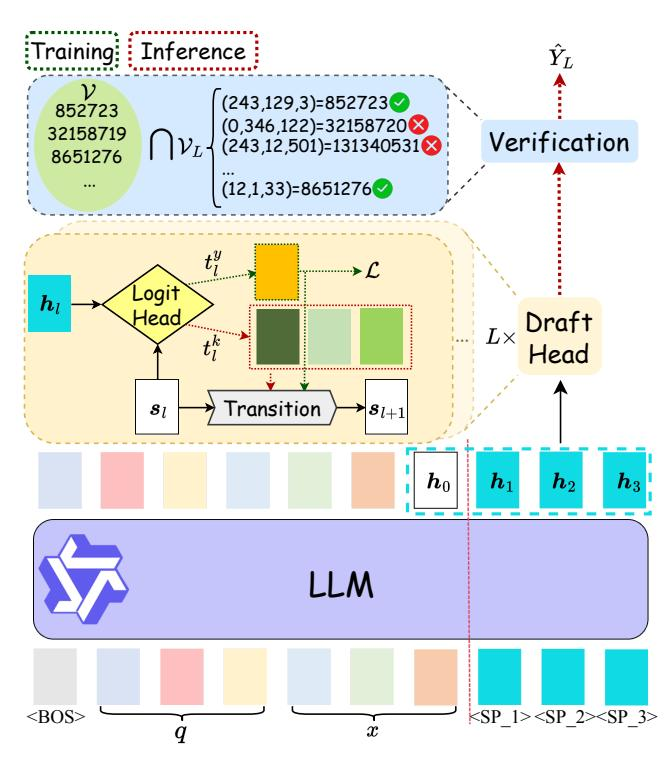
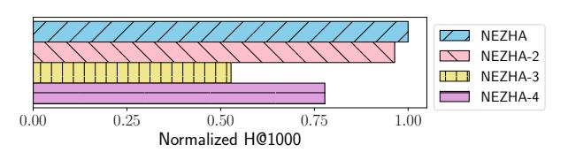

# NEZHA: A Zero-sacrifice and Hyperspeed Decoding Architecture for Generative Recommendations

Yejing Wang∗† yejing.wang@my.cityu.edu.hk City University of Hong Kong Hong Kong SAR, China

Shengyu Zhou† Alibaba Group Beijing, China

Jinyu Lu Alibaba Group Beijing, China

Ziwei Liu City University of Hong Kong Hong Kong SAR, China

Langming Liu Alibaba Group Hangzhou, China

Maolin Wang City University of Hong Kong Hong Kong SAR, China

Wenlin Zhang City University of Hong Kong Hong Kong SAR, China

Feng Li Alibaba Group Beijing, China

Wenbo Su Alibaba Group Beijing, China

Pengjie Wang Alibaba Group Beijing, China

Jian Xu Alibaba Group Beijing, China

Xiangyu Zhao‡ xianzhao@cityu.edu.hk City University of Hong Kong Hong Kong SAR, China

# Abstract

Generative Recommendation (GR), powered by Large Language Models (LLMs), represents a promising new paradigm for industrial recommender systems. However, their practical application is severely hindered by high inference latency, making them infeasible for high-throughput, real-time services and limiting their overall business impact. While Speculative Decoding (SD) has been proposed to accelerate the autoregressive generation process, existing implementations introduce new bottlenecks: they typically require separate draft models and model-based verifiers, which require additional training and increase latency overhead. In this paper, we address these challenges with NEZHA, a novel architecture that achieves hyperspeed decoding for GR systems without sacrificing recommendation quality. Specifically, NEZHA integrates a nimble autoregressive draft head directly into the primary model, enabling efficient self-drafting. This design, combined with a specialized input prompt structure, preserves the integrity of sequence-tosequence generation. Furthermore, to tackle the critical problem of hallucination—a major source of performance degradation—we introduce an efficient, model-free verifier based on a hash set. We demonstrate the effectiveness of NEZHA through extensive experiments on public datasets and have successfully deployed the system on Taobao since October 2025, achieving 1.2% business

WWW '26, Dubai, United Arab Emirates © 2026 Copyright held by the owner/author(s). ACM ISBN 979-8-4007-2307-0/2026/04 <https://doi.org/10.1145/3774904.3792797>

improvement, translating to billion-level advertising revenue and serving hundreds of millions of daily active users. The code is available at [https://github.com/Applied-Machine-Learning-](https://github.com/Applied-Machine-Learning-Lab/WWW2026_NEZHA)[Lab/WWW2026\\_NEZHA.](https://github.com/Applied-Machine-Learning-Lab/WWW2026_NEZHA)

# CCS Concepts

- Applied computing → Electronic commerce; Information systems → Information retrieval.

### Keywords

Generative Recommendations; Speculative Decoding

### ACM Reference Format:

Yejing Wang, Shengyu Zhou, Jinyu Lu, Ziwei Liu, Langming Liu, Maolin Wang, Wenlin Zhang, Feng Li, Wenbo Su, Pengjie Wang, Jian Xu, and Xiangyu Zhao. 2026. NEZHA: A Zero-sacrifice and Hyperspeed Decoding Architecture for Generative Recommendations. In Proceedings of the ACM Web Conference 2026 (WWW '26), April 13–17, 2026, Dubai, United Arab Emirates. ACM, New York, NY, USA, [10](#page-9-0) pages.<https://doi.org/10.1145/3774904.3792797>

### 1 Introduction

The extraordinary capabilities of Large Language Models (LLMs) have catalyzed a wide range of applications in recommender systems that leverage LLMs' abilities [\[47,](#page-9-1) [51,](#page-9-2) [57\]](#page-9-3), including world knowledge integration [\[12,](#page-8-0) [38\]](#page-8-1), representation learning [\[31\]](#page-8-2), and semantic understanding [\[1,](#page-8-3) [49\]](#page-9-4). Among these LLM-driven solutions, Generative Recommendation (GR) [\[13,](#page-8-4) [20,](#page-8-5) [44,](#page-9-5) [52\]](#page-9-6) has rapidly emerged as a dominant paradigm due to its outstanding performance and notable strengths in addressing the cold-start problem and enhancing recommendation diversity [\[30,](#page-8-6) [36\]](#page-8-7). Consequently, GR has seen widespread adoption in various industrial applications and production systems [\[3,](#page-8-8) [15,](#page-8-9) [37,](#page-8-10) [55,](#page-9-7) [56\]](#page-9-8).

∗Work was conducted during the internship of Yejing Wang at Alibaba.

†Yejing Wang and Shengyu Zhou contributed equally to this work..

‡Xiangyu Zhao is the corresponding author.

[This work is licensed under a Creative Commons Attribution-NonCommercial-](https://creativecommons.org/licenses/by-nc-nd/4.0)[NoDerivatives 4.0 International License.](https://creativecommons.org/licenses/by-nc-nd/4.0)

| Method  | Model Beam Size Size | Prefill | Decode | System | Total |
|---------|----------------------|---------|--------|--------|-------|
| Vanilla | 3B                   |         |        |        |       |
|         |                      | 1.58    | 6.87   | 0.96   | 9.41  |
| Vanilla | 0.6B                 | 1.0     | 2.95   | 0.91   | 4.86  |
| NEZHA   | 0.6B                 | 1.0     | 0.78   | 0.08   | 1.86  |

Table 1: Serving latency decomposition.

The typical GR deployment involves three stages [\[24\]](#page-8-11): (a) item tokenization [\[18,](#page-8-12) [35,](#page-8-13) [53\]](#page-9-9), (b) LLM training [\[7,](#page-8-14) [45\]](#page-9-10), and (c) LLM serving [\[26,](#page-8-15) [39,](#page-8-16) [40\]](#page-8-17). While the first two stages are performed offline, the serving latency of the final stage presents a formidable obstacle to large-scale industrial adoption, particularly in latency-sensitive scenarios [\[34\]](#page-8-18). For instance, in Taobao's search advertising, a business unit that accounts for over a quarter of the company's revenue, the core service requires a response time of less than 30 milliseconds. However, the latency of the current GR solution we deployed in this scenario exceeds 1 second, thus hindering the full commercial potential of real-time serving.

LLM inference proceeds in two stages: a prefill stage, where the LLM processes the input prompt in parallel, followed by a decoding stage that autoregressively generates output tokens. For GR, this decoding is typically performed using beam search [\[10\]](#page-8-19) to produce a diverse set of high-quality candidate items, leading to the excessive inference latency as identified in prior literature [\[23,](#page-8-20) [39\]](#page-8-16). For instance, Lin et al. [\[26\]](#page-8-15) reports that the decoding can consume nearly 90% of the total inference time for Llama-7B. To empirically validate this claim, we profiled the serving latency and decomposed it into three components: prefilling, decoding, and system overhead. The results are presented in Table [1,](#page-1-0) where all timings are normalized by the prefilling time of the 0.6B model for confidentiality. We benchmarked two LLMs of different sizes (0.6B and 3B) using a beam size of 512, a common setting for recall tasks in industrial practice. The first two rows reveal that decoding consistently accounts for over 60% of the total inference time (prefilling + decoding), corroborating the findings in [\[26\]](#page-8-15). Furthermore, we observe that while model compression significantly reduces the decoding time, the prefilling and system overheads remain relatively stable. These empirical observations underscore the urgent need for a dedicated solution to accelerate the decoding stage.

Algorithm-level solutions for this problem, i.e., efficient LLM inference, broadly fall into two categories [\[33\]](#page-8-21): KV-cache optimization [\[40\]](#page-8-17) and speculative decoding (SD) [\[26,](#page-8-15) [46\]](#page-9-11). However, optimizing the KV cache alone is often insufficient: these techniques, e.g., FlashAttention [\[6\]](#page-8-22), yield negligible efficiency gains when generating the extremely short sequences (e.g., 3-4 tokens) common in GR [\[5\]](#page-8-23). The results presented in Table [1,](#page-1-0) which already incorporate KV-cache enhancements, still significantly exceed the requirements of industrial applications. Consequently, this paper focuses on developing SD solutions to bridge the efficiency gap. Despite considerable efforts for efficient LLM inference [\[41,](#page-8-24) [48,](#page-9-12) [50\]](#page-9-13), a deployable solution for industrial-scale GR systems remains elusive. Existing SD frameworks tailored for applications exhibit critical shortcomings in both core stages: drafting and verification [\[48,](#page-9-12) [50\]](#page-9-13):

- Drafting: Current approaches predominantly rely on external draft models, such as smaller language models [\[26,](#page-8-15) [46\]](#page-9-11) or retrieval models [\[8,](#page-8-25) [39\]](#page-8-16). This strategy not only necessitates the costly

maintenance of an extra model but also introduces additional inference overhead, offsetting the intended speed gains.

- Verification: Prevailing methods still depend on invoking the original large model to validate the drafted tokens [\[8,](#page-8-25) [26,](#page-8-15) [39,](#page-8-16) [46\]](#page-9-11). This reliance means they fail to completely avoid the timeconsuming decoding steps of LLM, thereby placing a fundamental ceiling on the achievable acceleration.

For these reasons, we design the Nimble drafting and Efficient verification, thus propose a Zero-sacrifice and Hyperspeed decoding Architecture for industrial-scale GR systems (NEZHA). Specifically, NEZHA possesses a self-drafting capability [\[2,](#page-8-26) [25,](#page-8-27) [41\]](#page-8-24). This allows the model to efficiently predict the next item by itself, thus avoiding the training and serving of extra models. Additionally, we design a model-free verification method specific to GR problems: we attribute the poor performance of drafted results to hallucination (invalid semantic IDs) and verify the draft item using a hash set. We further boost performance by incorporating the autoregressive drafting head [\[4,](#page-8-28) [25\]](#page-8-27) and setting prompts with special tokens to enforce the sequential integrity required for GR. The proposed NEZHA achieves satisfactory performance and hyperspeed decoding, as outlined in Table [1,](#page-1-0) and has been successfully deployed in Taobao, impacting billions-level advertising revenues. We summarize the major contributions of this paper as follows:

- We identify high-latency decoding as the critical barrier to the large-scale deployment of GR systems. To address this, we propose NEZHA, an accelerated architecture designed to meet strict industrial latency requirements.
- We design a novel framework combining a nimble self-drafting mechanism with an efficient, model-free verifier. This approach preserves the high-fidelity output of autoregressive models while effectively mitigating hallucinations, thus ensuring the zerosacrifice recommendation quality.
- We conduct extensive experiments on three public datasets across two LLM backbones. The results demonstrate the superior effectiveness, efficiency, and adaptability of NEZHA.
- We validate NEZHA's performance on a large-scale industrial dataset and detail its successful deployment in Taobao, a leading ecommerce platform in China. The system now serves hundreds of millions of daily active users and drives billion-level increases in advertising revenue.

Significance. Our work establishes a pivotal advancement in deploying generative recommendation (GR) systems under stringent latency constraints, unlocking their practical viability in real-time, large-scale industrial applications. By effectively addressing the critical challenge of excessive response time that has long hindered GR adoption, we not only demonstrate a highly efficient serving framework tailored for time-sensitive scenarios but also validate its substantial business impact through successful deployment in production. This breakthrough redefines the operational boundaries of GR, transforming it from a latency-prohibitive paradigm into a scalable, high-performance solution.

### 2 Preliminary

This section provides the necessary background on the standard deployment of GR and existing acceleration techniques for autoregressive decoding, with a focus on SD.

Figure 1: An illustration of the NEZHA framework for �� = 3, �� = 3. The diagram differentiates between the training path (green dotted lines), the inference path (red dotted lines), and the shared computations (black solid lines).

methods cannot meet. Their drafting process relies on an additional model M��, while the verification process requires at least one call to the large model M�� . To address these issues, we propose NEZHA, which is based on two key innovations: eliminating the need for an independent draft model through self-drafting and verifying drafts using a hash set without calling M�� .

### 3 Methodology

This section provides a detailed exposition of our proposed method, NEZHA. We begin with a high-level overview of the framework. Subsequently, we examine its two core components: nimble drafting and efficient verification. The section concludes by detailing the training and inference pipeline.

### 3.1 Overview

The NEZHA framework, outlined in Figure [1,](#page-3-0) introduces several key modifications to the standard decoding process.

First, NEZHA uses a specialized input prompt. Instead of the default format, we append �� special placeholder tokens (e.g., "<SP\_1>" for the first ID token), visualized as cyan rectangles, to represent the positions of the ground-truth semantic ID. This unique prompt structure enables a critical optimization: with a single prefill pass, the model generates �� + 1 hidden states: one for the context and one for each placeholder. These hidden states are then fed into the draft head. The draft head consists of two components: a logit head (the yellow diamond), which predicts token probabilities, and a

transition module (the gray step), which updates the context representation after each new token is generated. The behavior of this head differs between training and inference: During training, it learns to predict the known ground-truth tokens from the offline data (L). During inference, it performs a beam search, generating the top-�� candidate tokens at each step. After �� iterative calls to the draft head, a pool of candidate items ��ˆ �� is generated. Finally, NEZHA performs a fast, model-free verification. Instead of invoking the target LLM, it simply checks the generated sequences against a pre-computed hash set of all valid item IDs V. The top-�� valid sequences with the highest cumulative probabilities are returned as the final recommendations. The figure provides an example where two of four candidates are valid (marked with checks).

### 3.2 Nimble Drafting

This section constructs the drafting framework for NEZHA, including the prompting and the autoregressive draft head.

Existing SD applications typically rely on an external draft model [\[26,](#page-8-15) [39,](#page-8-16) [46\]](#page-9-11), which introduces significant maintenance overhead and deployment complexity. To circumvent these issues, we adopt a self-drafting architecture [\[2,](#page-8-26) [41\]](#page-8-24), which empowers the target LLM itself to generate candidate tokens.

However, applying general self-drafting architectures like multitoken-prediction (MTP) head [\[2,](#page-8-26) [14\]](#page-8-33) to GR systems introduces a unique challenge: the highly structured nature of semantic IDs. Unlike free-form text, a semantic ID is a strictly ordered sequence. For an item ���� with three-digit ID [�� 1 , ���� 2 , ���� 3 ], any permutation like [�� 3 , ���� , ���� 1 ] would represent an invalid or entirely different item. The token combinations are not arbitrary but are highly constrained, creating strong sequential dependencies. This means that only a sparse subset of all possible sequences is valid. For instance, knowing the prefix [�� 1 , ���� 2 ] significantly narrows the set of possible values for the final token �� .

3 Our design for NEZHA directly addresses this structural constraint. By prompting the input with positional placeholder tokens and utilizing an autoregressive draft head, we explicitly provide the model with the positional awareness and sequential modeling capabilities necessary to generate valid, structured IDs. Specifically, NEZHA first modifies the input prompt for each training instance {(��, ��), ��}. Instead of appending the ground-truth semantic ID �� = [�� 1 , �� �� , �� �� 3 ], we append a sequence of �� special tokens as the placeholder for item ID: [<SP\_1>, . . . , <SP\_L>].

The purpose of these placeholders is twofold. First, drawing inspiration from [\[32\]](#page-8-34), they explicitly encode positional information, prompting the model to leverage its full contexts for each step of the autoregressive generation. Second, they allow the LLM to precompute the hidden states for all future token positions in a single forward pass, as visualized in the cyan block of Figure [1.](#page-3-0)

We now formally define the autoregressive draft head. Let ��0, ��1, . . . , ���� be the hidden states from the LLM's final layer, corresponding to the prefix (��0) and the �� placeholder tokens, respectively. The draft head is defined as follows:

��1 = ��0 (1)

���� = logit\_head�� (���� ,����) (2)

����+1 = Transition�� (���� , ����) (3)

Table 2: The statistics of the preprocessed datasets

| Dataset | # Users | # Items | # Intersections | Avg.length |
|---------|---------|---------|-----------------|------------|
| Yelp    | 15,719  | 11,383  | 192,214         | 12.22      |
| Beauty  | 52,204  | 57,288  | 394,908         | 7.56       |
| Games   | 64,071  | 33,614  | 568,314         | 8.87       |

just 43% to over 93%. This directly translates into a 12 percentagepoint uplift in key offline evaluation metrics. A detailed componentwise analysis using public datasets to confirm this contribution is provided in Section [4.3.](#page-6-0)

### 3.4 Training and Inference

This section details the pipeline of NEZHA, summarized in Algorithm [3,](#page-4-3) including the training and inference processes. While both processes share the architecture, their objectives differ, leading to distinct approaches for token selection and state transition.

During training, the model learns to predict the ground-truth semantic ID using a teacher-forcing approach. For a given training instance with label �� = [�� 1 , . . . , �� �� �� ]: LLM first initializes the representations with a single call(line 2). At each step ��, the model uses Equation [\(2\)](#page-3-1) to compute the probability distribution ���� (line 5). For the subsequent transition step (Equation [\(3\)](#page-3-2)), the context ���� is updated using the embedding of the ground-truth token, i.e., ���� = �� (line 6-7). This ensures the model learns the correct sequential path, regardless of its own predictions at step ��. Finally, the probability for the ground-truth token, �� , is used to compute the cross-entropy loss, which would be minimized over D (line 9-10):

L = ∑︁ ��∈D ∑︁�� ��=1 log �� �� (6)

The model parameters are optimized by minimizing the loss L using a gradient-based optimizer (e.g., Adam [\[21\]](#page-8-35)). This training procedure yields the final model as in line 12.

In contrast, the goal of inference is to find the most probable semantic IDs, which we achieve using beam search. The process begins by prefilling the specialized prompt (line 13). Then, we initialize the step index �� and the context state ��1, and set up the prediction set ��ˆ 0 and the state set S0 to track the candidate beams and their respective states (line 14). For each step, we iterate over each candidate beam (line 17), compute the probability distribution ���� , and select the top �� tokens �� �� with the highest probabilities �� �� (lines 18-19). The context state for each beam is then updated independently using the embedding of its selected token �� �� as in line 20. New beams are finally included to ��ˆ and S�� (line 21) for further pruning (line 27), where the top �� overall sequences are retained at each step based on their cumulative probabilities. Notably, the final decoding step (�� = ��) includes a crucial verification stage to filter out hallucinated (i.e., invalid) semantic IDs, rather than simply selecting the top candidates by probability (lines 23-26).

# 4 Experiment

To demonstrate the generalizability and robustness of NEZHA, this section presents an evaluation on public benchmark datasets.

### 4.1 Settings

Datasets. We evaluate NEZHA on three public datasets widely used as benchmarks for GR: Yelp, Amazon Beauty, and Amazon Games [\[35,](#page-8-13) [52\]](#page-9-6). These datasets are particularly suitable as they contain rich contextual information, such as textual item descriptions. Following standard practice in prior work, we employ a leave-oneout strategy for data splitting. For each user, the last interaction is reserved for the test, the penultimate interaction is used for validation, and remaining interactions constitute the training set.

Baselines and Backbones. We construct the generative recommender with two backbones, Llama-1B [\[9\]](#page-8-36) and QWen3-0.8B [\[43\]](#page-8-37), which have a similar size to the LLM we used in our production environments. We primarily compare with two baselines on public datasets: vanilla LLM decoding with beam search and MTP [\[14\]](#page-8-33). Other baselines, such as Medusa [\[2,](#page-8-26) [46\]](#page-9-11) and AtSpeed [\[26\]](#page-8-15), are omitted due to their excessive latency and complexity for practical use. Evaluation Metrics. We evaluate all methods using Hit Rate (HR) and Normalized Discounted Cumulative Gain (NDCG) at cutoffs of 5 and 10, yielding four accuracy metrics: H@5, H@10, N@5, and N@10. For efficiency, we also report the average generation latency (LT) in milliseconds (ms), which is the sum of the "Prefill" and "Decode" costs shown in Table [1.](#page-1-0)

Implementation Details. The evaluation on public datasets is conducted using the same GPU devices to ensure consistency. To achieve robust results, all experiments are averaged over three runs with distinct random seeds (42, 43, 44). For item tokenization, we set �� = 3 with ���� = 512 for each layer, meaning the codebook size is 512 across all layers. Item tokenization is performed using RQ-VAE [\[22\]](#page-8-31). These settings are consistent with our production environment, with the exception of ���� , which varies due to the different volumes of items. We convert item attributes into textual instructions and obtain item representations through the public API, such as text-embedding-ada-002[2](#page-5-2) . The backbone LLM is determined by the specific setting, either Llama or Qwen, and is optimized using Transformer Trainers, with the appropriate hyperparameters chosen for each test. In Equation [\(2\)](#page-3-1), the logit\_head�� represents a linear transformation layer shaped [��ℎ����,����], which is used to convert the hidden state into logits; specifically, this is sized at 1024 × 512 for each layer in our case. Additionally, we employ an RNN to update the context state, i.e., Transition�� in Equation [\(3\)](#page-3-2). For inference, the beam size �� is set as 10.

### 4.2 Overall Performance

We test NEZHA with two LLM backbones and compare it with the original beam search and efficient decoding baseline to evaluate its effectiveness. The results are listed in Table [3,](#page-6-1) which consistently NEZHA presents the satisfactory performance with outstanding efficiency. We can observe that:

- Comparison with Beam Search. The performance of NEZHA is comparable to that of beam search but with a significant increase in speed, achieving approximately a 10-fold improvement. This demonstrates its potential to effectively replace beam search for online GR serving. In certain instances, such as using Llama on Yelp, NEZHA even produces enhanced results.

2<https://platform.openai.com/docs/guides/embeddings>

Table 3: Overall performance of NEZHA. The boldface refers to beating all baselines. "\*" indicates the statistically significant improvements (i.e., one-sided t-test with �� &lt; 0.05). For performance metrics, the higher is better. For "LT", the lower is better.

| Model Finetuning | H@5    | H@10   | Beauty N@5 | N@10   | LT    | H@5     | H@10   | Games N@5 | N@10    | LT    | H@5     | H@10    | Yelp N@5 | N@10    | LT    |
|------------------|--------|--------|------------|--------|-------|---------|--------|-----------|---------|-------|---------|---------|----------|---------|-------|
| Beam Search      | 0.0392 | 0.0568 | 0.0254     | 0.0311 | 74.21 | 0.0305  | 0.0406 | 0.0224    | 0.0256  | 78.95 | 0.0176  | 0.0262  | 0.0110   | 0.0138  | 75.99 |
| MTP Llama        | 0.0378 | 0.0555 | 0.0239     | 0.0297 | 6.74  | 0.0291  | 0.0400 | 0.0212    | 0.0248  | 7.33  | 0.0140  | 0.0240  | 0.0091   | 0.0114  | 7.18  |
| NEZHA            | 0.0390 | 0.0562 | 0.0253     | 0.0304 | 7.00  | 0.0313  | 0.0410 | 0.0231    | 0.0259  | 7.52  | 0.0194* | 0.0332* | 0.0125*  | 0.0168* | 7.41  |
| Beam Search      | 0.0446 | 0.0643 | 0.0306     | 0.0370 | 47.70 | 0.0226  | 0.0305 | 0.0153    | 0.0179  | 50.06 | 0.0235  | 0.0377  | 0.0147   | 0.0192  | 48.31 |
| MTP Qwen         | 0.0422 | 0.0617 | 0.0287     | 0.0352 | 4.18  | 0.0204  | 0.0283 | 0.0136    | 0.0170  | 4.61  | 0.0229  | 0.0346  | 0.0114   | 0.0177  | 4.24  |
| NEZHA            | 0.0451 | 0.0649 | 0.0308     | 0.0377 | 4.41  | 0.0239* | 0.0314 | 0.0165*   | 0.0193* | 4.80  | 0.0235  | 0.0363  | 0.0143   | 0.0185  | 4.46  |

Table 4: Ablation study on Yelp with Llama.

|         | H@5    | H@10   | N@5    | N@10   | LT   |
|---------|--------|--------|--------|--------|------|
| NEZHA   | 0.0194 | 0.0332 | 0.0125 | 0.0168 | 7.41 |
| NEZHA-1 | 0.0044 | 0.0083 | 0.0024 | 0.0037 | 7.03 |
| NEZHA-2 | 0.0188 | 0.0309 | 0.0120 | 0.0159 | 7.41 |
| NEZHA-3 | 0.0173 | 0.0322 | 0.0110 | 0.0158 | 7.18 |
| NEZHA-4 | 0.0194 | 0.0328 | 0.0124 | 0.0167 | 7.16 |

- Comparison with MTP. Although MTP is more efficient than NEZHA in terms of lower latency (LT), it fails to deliver satisfactory performance due to its disregard for the characteristics of GR, specifically the structured semantic IDs. The parallel decoding approach used by MTP, which relies on a shared last hidden state, cannot leverage the sequential dependency inherent in the semantic ID, resulting in a failure to predict different tokens with discriminative representations.

# 4.3 Ablation Study

To validate the contribution of each key component in NEZHA, we conduct an ablation study with the following four variants:

- NEZHA-1: This variant removes the context state ���� from the logit calculation in Equation [\(2\)](#page-3-1), which also implies the removal of the transition head Transition�� (Equation [\(3\)](#page-3-2)), making the prediction of each token within a semantic ID independent of the previously generated tokens.
- NEZHA-2: This variant removes the placeholder hidden state ���� from Equation [\(2\)](#page-3-1). This allows us to measure the importance of providing positional information for effective self-drafting.
- NEZHA-3: This variant replace the RNN with simple addition for Transition�� to investigate the impact of state transition modeling.
- NEZHA-4: This variant disables the model-free verification step entirely. It is designed to demonstrate the crucial trade-off between efficiency and accuracy.

We evaluate these variants using the Llama backbone on Yelp, with the results summarized in Table [4.](#page-6-2) We find the following insights:

- NEZHA-1 suffers from performance collapse due to the absence of context and sequential dependency. This underlines the inadequacy of placeholder representations for context understanding, highlighting the necessity of maintaining a context state.

Figure 2: Ablation study on production data. We present the normalized performance for confidentiality.

- NEZHA-2 performs slightly worse than the original NEZHA, which can be attributed to the loss of placeholders. When combined with the performance of NEZHA-1, it is evident that placeholders can enhance performance by providing positional information for semantic IDs, although they are not indispensable.
- The simplification of the transition module negatively impacts the performance of NEZHA-3, indicating the importance of accurately modeling state transitions to leverage the sequential dependency patterns of GR.
- A comparison of NEZHA-4 with NEZHA shows that the slight increase in latency for verification (0.25 ms) can lead to improved performance (especially on H@10), emphasizing the effectiveness of our verification process.

Additionally, we present the ablation results on offline production data in Figure [2](#page-6-3) to further validate our conclusions. Notably, NEZHA consistently outperforms all variants. However, trends differ across specific variants compared with public data, which may stem from variations in data distribution and volume. For instance, the volume of items significantly increases in production data, resulting in greater performance degradation for NEZHA-3 and NEZHA-4. This degradation can be driven by weakening the sequential dependency and by introducing too many invalid predictions, respectively. Meanwhile, NEZHA-1 and NEZHA-2 show the consistent pattern as on public datasets: NEZHA-1 is omitted from the figure due to its limited performance, while NEZHA-2 is only slightly worse than the original version.

# 5 Real-world Deployment

The proposed method, NEZHA, is deployed in the candidate generation (recall) stage of the Taobao Search Advertising platform. The operational context is illustrated in Figure [3,](#page-7-0) which displays search results for the query "Dress". Advertisements displayed on the first page ("Ad\_1") are subject to a stringent latency constraint of 30ms. Previously, our GR system's inference time of over 1000ms

Figure 3: Illustration of the method's deployment in Taobao Search. The example shows results for the query "Dress" (top left, in the red box). Advertisements are identified by an orange label in the bottom-right corner of each product. Sensitive information has been obscured for confidentiality.

precluded its use for these prime positions, limiting its deployment to subsequent pages ("Ad\_2").

With the introduction of NEZHA, we overcome this critical limitation. As detailed in Table [1,](#page-1-0) NEZHA provides a 2.6× algorithmlevel speedup. This acceleration, coupled with system-level savings on queuing time, reduces the GR system's total latency from over 1000ms to below the 30ms threshold. Consequently, we can now deploy the GR system across all advertising slots, including the highly valuable first-page placements.

The efficacy of this deployment is confirmed through extensive experiments. Offline evaluations show an absolute increase in the hit rate on clicked items by 0.58% and 0.61% for the top 500 and 1000 results, respectively. The positive result enables the deployment of the GR system in the prime position as of October 2025, where 7-day reverse online A/B testing on 10% traffic registered a 1.2% revenue increase (billion-level improvement).

# 6 Related Works

Our work is situated at the intersection of two rapidly evolving research areas: generative recommendations, which leverage the power of LLMs for recommendation tasks, and speculative decoding, a key technique for accelerating LLM inference.

Generative Recommendations. Significant research has been devoted to advancing each stage of the GR pipeline, i.e., item tokenization, LLM training, and LLM serving. For item tokenization, beyond using multi-modal content, recent work has started to incorporate collaborative information to create more effective semantic IDs [\[35,](#page-8-13) [58\]](#page-9-15). The design of these IDs has also been extended to more complex scenarios, such as multi-domain [\[53\]](#page-9-9) and multi-behavior [\[28\]](#page-8-38) recommendations, while other approaches seek to unify the training of the tokenizer and the LLM in an end-toend framework [\[27\]](#page-8-39). For training, researchers have explored pretraining paradigms to align item semantics with the LLM's linguistic space [\[52\]](#page-9-6), as well as post-training techniques like Direct Preference Optimization (DPO) [\[29\]](#page-8-40) to fine-tune model outputs toward specific business objectives [\[7,](#page-8-14) [37\]](#page-8-10). To facilitate serving, researchers adapted

speculative decoding for top-k recommendation [\[26\]](#page-8-15), enabled outof-vocabulary inference with SpecGR [\[8\]](#page-8-25), and reformulated the system with long semantic IDs and parallel decoding in RPG [\[17\]](#page-8-41).

Despite the impressive performance, the practical deployment of GR models is severely hampered by high inference latency. The autoregressive generation requires multiple forward passes through LLMs, a process that is often too slow for industrial systems demanding real-time responses, motivating the proposal of NEZHA. Speculative Decoding. To address the high latency associated with autoregressive generation, Speculative Decoding (SD) has emerged as a leading technique for accelerating inference [\[23,](#page-8-20) [41,](#page-8-24) [50\]](#page-9-13). The standard SD framework utilizes a small, fast "draft model" to generate a sequence of candidate tokens, which is then verified in a single parallel forward pass by the larger, original "target model".

Subsequent research has explored various strategies to enhance both stages of this process. For instance, Medusa [\[2\]](#page-8-26) introduces multiple lightweight decoding "heads" attached to the target model to predict future tokens in parallel [\[14\]](#page-8-33), and it proposes tree-attention verification to validate drafts with just one call to the large model. Some researchers have replaced the parallel decoding heads with autoregressive heads, shifting from parallel multi-token drafting to token-by-token generation [\[4,](#page-8-28) [25\]](#page-8-27). Additionally, researchers also suggest using retrieval models as the draft model instead of relying solely on language models [\[16\]](#page-8-42). These innovations have led to successful deployments in various industrial applications, including travel services [\[46\]](#page-9-11) and knowledge-based recommendations [\[39\]](#page-8-16).

However, current practices still rely on separate draft models and require verification by the large target model. Our approach pioneers the exploration of self-drafting in large-scale production environments and introduces an instant and effective model-free verification specialized for GR.

### 7 Conclusion

Industrial-scale Generative Recommendation (GR) using Large Language Models (LLMs) is severely constrained by high inference latency. Existing acceleration methods, including Speculative Decoding (SD), are often impractical due to their reliance on auxiliary draft models and expensive verification steps. To overcome these limitations, we propose NEZHA, a highly efficient decoding framework for GR. NEZHA introduces two key innovations: (1) self-drafting, which allows the main LLM to generate multiple candidates in a single pass, eliminating the need for a separate draft model; and (2) model-free verification, which uses a near-instantaneous hash lookup to validate candidates, bypassing costly model-based checks. Experiments show that NEZHA achieves zero-sacrifice accuracy while reducing latency to levels suitable for large-scale deployment.

# Acknowledgments

This research was partially supported by National Natural Science Foundation of China (No.62502404), Hong Kong Research Grants Council (Research Impact Fund No.R1015-23, Collaborative Research Fund No.C1043-24GF, General Research Fund No.11218325), Institute of Digital Medicine of City University of Hong Kong (No.9229503), and Alibaba (CCF-Alimama Tech Kangaroo Fund No. 2024002).

### References

- [1] Keqin Bao, Jizhi Zhang, Wenjie Wang, Yang Zhang, Zhengyi Yang, Yanchen Luo, Chong Chen, Fuli Feng, and Qi Tian. 2025. A bi-step grounding paradigm for large language models in recommendation systems. ACM Transactions on Recommender Systems 3, 4 (2025), 1–27. [2] Tianle Cai, Yuhong Li, Zhengyang Geng, Hongwu Peng, Jason D Lee, Deming Chen, and Tri Dao. 2024. Medusa: Simple LLM Inference Acceleration Framework with Multiple Decoding Heads. In International Conference on Machine Learning. PMLR, 5209–5235. [3] Ben Chen, Xian Guo, Siyuan Wang, Zihan Liang, Yue Lv, Yufei Ma, Xinlong Xiao, Bowen Xue, Xuxin Zhang, Ying Yang, et al. 2025. OneSearch: A Preliminary Exploration of the Unified End-to-End Generative Framework for E-commerce Search. arXiv preprint arXiv:2509.03236 (2025). [4] Yunfei Cheng, Aonan Zhang, Xuanyu Zhang, Chong Wang, and Yi Wang. 2024. Recurrent drafter for fast speculative decoding in large language models. arXiv preprint arXiv:2403.09919 (2024). [5] Tri Dao. [n. d.]. FlashAttention-2: Faster Attention with Better Parallelism and Work Partitioning. In The Twelfth International Conference on Learning Representations. [6] Tri Dao, Dan Fu, Stefano Ermon, Atri Rudra, and Christopher Ré. 2022. Flashattention: Fast and memory-efficient exact attention with io-awareness. Advances in neural information processing systems 35 (2022), 16344–16359. [7] Jiaxin Deng, Shiyao Wang, Kuo Cai, Lejian Ren, Qigen Hu, Weifeng Ding, Qiang Luo, and Guorui Zhou. 2025. OneRec: Unifying Retrieve and Rank with Generative Recommender and Iterative Preference Alignment. arXiv preprint arXiv:2502.18965 (2025). [8] Yijie Ding, Yupeng Hou, Jiacheng Li, and Julian McAuley. 2024. Inductive Generative Recommendation via Retrieval-based Speculation. arXiv preprint arXiv:2410.02939 (2024). [9] Abhimanyu Dubey, Abhinav Jauhri, Abhinav Pandey, Abhishek Kadian, Ahmad Al-Dahle, Aiesha Letman, Akhil Mathur, Alan Schelten, Amy Yang, Angela Fan, et al. 2024. The llama 3 herd of models. arXiv e-prints (2024), arXiv–2407. [10] Markus Freitag and Yaser Al-Onaizan. 2017. Beam Search Strategies for Neural Machine Translation. In Proceedings of the First Workshop on Neural Machine Translation. 56–60. [11] Kairui Fu, Tao Zhang, Shuwen Xiao, Ziyang Wang, Xinming Zhang, Chenchi Zhang, Yuliang Yan, Junjun Zheng, Yu Li, Zhihong Chen, et al. 2025. Forge: Forming semantic identifiers for generative retrieval in industrial datasets. arXiv preprint arXiv:2509.20904 (2025). [12] Zichuan Fu, Xiangyang Li, Chuhan Wu, Yichao Wang, Kuicai Dong, Xiangyu Zhao, Mengchen Zhao, Huifeng Guo, and Ruiming Tang. 2025. A unified framework for multi-domain ctr prediction via large language models. ACM Transactions on Information Systems 43, 5 (2025), 1–33. [13] Jingtong Gao, Yewen Li, Shuai Mao, Peng Jiang, Nan Jiang, Yejing Wang, Qingpeng Cai, Fei Pan, Peng Jiang, Kun Gai, et al. 2025. Generative auto-bidding with value-guided explorations. In Proceedings of the 48th International ACM SIGIR Conference on Research and Development in Information Retrieval. 244–254. [14] Fabian Gloeckle, Badr Youbi Idrissi, Baptiste Rozière, David Lopez-Paz, and Gabriel Synnaeve. 2024. Better & faster large language models via multi-token prediction. In Proceedings of the 41st International Conference on Machine Learning. 15706–15734. [15] Xian Guo, Ben Chen, Siyuan Wang, Ying Yang, Chenyi Lei, Yuqing Ding, and Han
- Li. 2025. OneSug: The Unified End-to-End Generative Framework for E-commerce Query Suggestion. arXiv preprint arXiv:2506.06913 (2025). [16] Zhenyu He, Zexuan Zhong, Tianle Cai, Jason Lee, and Di He. 2024. REST: Retrieval-Based Speculative Decoding. In Proceedings of the 2024 Conference of the North American Chapter of the Association for Computational Linguistics: Human Language Technologies (Volume 1: Long Papers). 1582–1595. [17] Yupeng Hou, Jiacheng Li, Ashley Shin, Jinsung Jeon, Abhishek Santhanam, Wei Shao, Kaveh Hassani, Ning Yao, and Julian McAuley. 2025. Generating long semantic IDs in parallel for recommendation. In Proceedings of the 31st ACM SIGKDD Conference on Knowledge Discovery and Data Mining V. 2. 956–966. [18] Wenyue Hua, Shuyuan Xu, Yingqiang Ge, and Yongfeng Zhang. 2023. How to index item ids for recommendation foundation models. In Proceedings of the Annual International ACM SIGIR Conference on Research and Development in Information Retrieval in the Asia Pacific Region. 195–204. [19] Herve Jegou, Matthijs Douze, and Cordelia Schmid. 2010. Product quantization for nearest neighbor search. IEEE transactions on pattern analysis and machine intelligence 33, 1 (2010), 117–128. [20] Clark Mingxuan Ju, Liam Collins, Leonardo Neves, Bhuvesh Kumar, Louis Yufeng Wang, Tong Zhao, and Neil Shah. 2025. Generative Recommendation with Semantic IDs: A Practitioner's Handbook. In Proceedings of the 34th ACM International Conference on Information and Knowledge Management. 6420–6425. [21] Diederik P Kingma. 2014. Adam: A method for stochastic optimization. arXiv preprint arXiv:1412.6980 (2014). [22] Doyup Lee, Chiheon Kim, Saehoon Kim, Minsu Cho, and Wook-Shin Han. 2022. Autoregressive image generation using residual quantization. In Proceedings of the IEEE/CVF Conference on Computer Vision and Pattern Recognition. 11523–11532. [23] Yaniv Leviathan, Matan Kalman, and Yossi Matias. 2023. Fast inference from transformers via speculative decoding. In International Conference on Machine Learning. PMLR, 19274–19286. [24] Xiaopeng Li, Bo Chen, Junda She, Shiteng Cao, You Wang, Qinlin Jia, Haiying He, Zheli Zhou, Zhao Liu, Ji Liu, et al. 2025. A survey of generative recommendation from a tri-decoupled perspective: Tokenization, architecture, and optimization. (2025). [25] Yuhui Li, Fangyun Wei, Chao Zhang, and Hongyang Zhang. 2024. Eagle: Speculative sampling requires rethinking feature uncertainty. arXiv preprint arXiv:2401.15077 (2024). [26] Xinyu Lin, Chaoqun Yang, Wenjie Wang, Yongqi Li, Cunxiao Du, Fuli Feng, See-Kiong Ng, and Tat-Seng Chua. 2025. Efficient Inference for Large Language Modelbased Generative Recommendation. In The Thirteenth International Conference on Learning Representations. [27] Enze Liu, Bowen Zheng, Cheng Ling, Lantao Hu, Han Li, and Wayne Xin Zhao. 2024. End-to-End Learnable Item Tokenization for Generative Recommendation. arXiv preprint arXiv:2409.05546 (2024). [28] Zihan Liu, Yupeng Hou, and Julian McAuley. 2024. Multi-behavior generative recommendation. In Proceedings of the 33rd ACM International Conference on Information and Knowledge Management. 1575–1585. [29] Rafael Rafailov, Archit Sharma, Eric Mitchell, Christopher D Manning, Stefano Ermon, and Chelsea Finn. 2023. Direct preference optimization: Your language model is secretly a reward model. Advances in Neural Information Processing Systems 36 (2023), 53728–53741. [30] Shashank Rajput, Nikhil Mehta, Anima Singh, Raghunandan Hulikal Keshavan, Trung Vu, Lukasz Heldt, Lichan Hong, Yi Tay, Vinh Tran, Jonah Samost, et al. 2023. Recommender systems with generative retrieval. Advances in Neural Information Processing Systems 36 (2023), 10299–10315. [31] Xubin Ren, Wei Wei, Lianghao Xia, Lixin Su, Suqi Cheng, Junfeng Wang, Dawei Yin, and Chao Huang. 2024. Representation learning with large language models for recommendation. In Proceedings of the ACM on Web Conference 2024. 3464– 3475. [32] Mohammad Samragh, Arnav Kundu, David Harrison, Kumari Nishu, Devang Naik, Minsik Cho, and Mehrdad Farajtabar. 2025. Your LLM Knows the Future: Uncovering Its Multi-Token Prediction Potential. arXiv preprint arXiv:2507.11851 (2025). [33] Zhongwei Wan, Xin Wang, Che Liu, Samiul Alam, Yu Zheng, Jiachen Liu, Zhongnan Qu, Shen Yan, Yi Zhu, Quanlu Zhang, et al. [n. d.]. Efficient Large Language Models: A Survey. Transactions on Machine Learning Research ([n. d.]). [34] Maolin Wang, Jun Chu, Sicong Xie, Xiaoling Zang, Yao Zhao, Wenliang Zhong, and Xiangyu Zhao. 2025. Put Teacher in Student's Shoes: Cross-Distillation for Ultra-compact Model Compression Framework. In Proceedings of the 31st ACM SIGKDD Conference on Knowledge Discovery and Data Mining V. 2. 4975–4985. [35] Wenjie Wang, Honghui Bao, Xinyu Lin, Jizhi Zhang, Yongqi Li, Fuli Feng, See-Kiong Ng, and Tat-Seng Chua. 2024. Learnable item tokenization for generative recommendation. In Proceedings of the 33rd ACM International Conference on Information and Knowledge Management. 2400–2409. [36] Yejing Wang, Shengyu Zhou, Jinyu Lu, Qidong Liu, Xinhang Li, Wenlin Zhang, Feng Li, Pengjie Wang, Jian Xu, Bo Zheng, et al. 2025. GFlowGR: Fine-tuning Generative Recommendation Frameworks with Generative Flow Networks. arXiv preprint arXiv:2506.16114 (2025). [37] Zhipeng Wei, Kuo Cai, Junda She, Jie Chen, Minghao Chen, Yang Zeng, Qiang Luo, Wencong Zeng, Ruiming Tang, Kun Gai, et al. 2025. OneLoc: Geo-Aware Generative Recommender Systems for Local Life Service. arXiv preprint arXiv:2508.14646 (2025). [38] Yunjia Xi, Weiwen Liu, Jianghao Lin, Xiaoling Cai, Hong Zhu, Jieming Zhu, Bo Chen, Ruiming Tang, Weinan Zhang, and Yong Yu. 2024. Towards open-world recommendation with knowledge augmentation from large language models. In Proceedings of the 18th ACM Conference on Recommender Systems. 12–22. [39] Yunjia Xi, Hangyu Wang, Bo Chen, Jianghao Lin, Menghui Zhu, Weiwen Liu, Ruiming Tang, Zhewei Wei, Weinan Zhang, and Yong Yu. 2025. Efficiency unleashed: Inference acceleration for LLM-based recommender systems with speculative decoding. In Proceedings of the 48th International ACM SIGIR Conference on Research and Development in Information Retrieval. 1891–1901. [40] Yunjia Xi, Hangyu Wang, Bo Chen, Jianghao Lin, Menghui Zhu, Weiwen Liu, Ruiming Tang, Weinan Zhang, and Yong Yu. 2024. A decoding acceleration framework for industrial deployable LLM-based recommender systems. arXiv e-prints (2024), arXiv–2408. [41] Heming Xia, Zhe Yang, Qingxiu Dong, Peiyi Wang, Yongqi Li, Tao Ge, Tianyu Liu, Wenjie Li, and Zhifang Sui. 2024. Unlocking Efficiency in Large Language Model Inference: A Comprehensive Survey of Speculative Decoding. In ACL (Findings). [42] Yi Xu, Chaofan Fan, Jinxin Hu, Yu Zhang, Zeng Xiaoyi, and Jing Zhang. 2025. STORE: Semantic Tokenization, Orthogonal Rotation and Efficient Attention for Scaling Up Ranking Models. arXiv preprint arXiv:2511.18805 (2025). [43] An Yang, Anfeng Li, Baosong Yang, Beichen Zhang, Binyuan Hui, Bo Zheng, Bowen Yu, Chang Gao, Chengen Huang, Chenxu Lv, et al. 2025. Qwen3 technical report. arXiv preprint arXiv:2505.09388 (2025).

[44] Liu Yang, Fabian Paischer, Kaveh Hassani, Jiacheng Li, Shuai Shao, Zhang Gabriel Li, Yun He, Xue Feng, Nima Noorshams, Sem Park, et al. 2024. Unifying generative and dense retrieval for sequential recommendation. arXiv preprint arXiv:2411.18814 (2024). [45] Yuhao Yang, Zhi Ji, Zhaopeng Li, Yi Li, Zhonglin Mo, Yue Ding, Kai Chen, Zijian Zhang, Jie Li, Shuanglong Li, et al. 2025. Sparse meets dense: Unified generative recommendations with cascaded sparse-dense representations. arXiv preprint arXiv:2503.02453 (2025). [46] Daniel Zagyva, Emmanouil Stergiadis, Laurens van der Maas, Aleksandra Dokic, Eran Fainman, Ilya Gusev, and Moran Beladev. 2025. Speed without sacrifice: Fine-tuning language models with Medusa and knowledge distillation in travel applications. (2025). [47] Jiaqi Zhai, Lucy Liao, Xing Liu, Yueming Wang, Rui Li, Xuan Cao, Leon Gao, Zhaojie Gong, Fangda Gu, Jiayuan He, et al. 2024. Actions Speak Louder than Words: Trillion-Parameter Sequential Transducers for Generative Recommendations. In International Conference on Machine Learning. PMLR, 58484–58509. [48] Chen Zhang, Zhuorui Liu, and Dawei Song. 2024. Beyond the speculative game: A survey of speculative execution in large language models. arXiv preprint arXiv:2404.14897 (2024). [49] Chao Zhang, Haoxin Zhang, Shiwei Wu, Di Wu, Tong Xu, Xiangyu Zhao, Yan Gao, Yao Hu, and Enhong Chen. 2025. Notellm-2: Multimodal large representation models for recommendation. In Proceedings of the 31st ACM SIGKDD Conference on Knowledge Discovery and Data Mining V. 1. 2815–2826. [50] Lingzhe Zhang, Liancheng Fang, Chiming Duan, Minghua He, Leyi Pan, Pei Xiao, Shiyu Huang, Yunpeng Zhai, Xuming Hu, Philip S Yu, et al. 2025. A survey on parallel text generation: From parallel decoding to diffusion language models. arXiv preprint arXiv:2508.08712 (2025). [51] Zhaoqi Zhang, Haolei Pei, Jun Guo, Tianyu Wang, Yufei Feng, Hui Sun, Shaowei Liu, and Aixin Sun. 2025. OneTrans: Unified Feature Interaction and Sequence Modeling with One Transformer in Industrial Recommender. arXiv preprint arXiv:2510.26104 (2025). [52] Bowen Zheng, Yupeng Hou, Hongyu Lu, Yu Chen, Wayne Xin Zhao, Ming Chen, and Ji-Rong Wen. 2024. Adapting large language models by integrating collaborative semantics for recommendation. In 2024 IEEE 40th International Conference on Data Engineering (ICDE). IEEE, 1435–1448. [53] Bowen Zheng, Hongyu Lu, Yu Chen, Wayne Xin Zhao, and Ji-Rong Wen. 2025. Universal Item Tokenization for Transferable Generative Recommendation. arXiv preprint arXiv:2504.04405 (2025). [54] Carolina Zheng, Minhui Huang, Dmitrii Pedchenko, Kaushik Rangadurai, Siyu Wang, Fan Xia, Gaby Nahum, Jie Lei, Yang Yang, Tao Liu, et al. 2025. Enhancing embedding representation stability in recommendation systems with semantic id. In Proceedings of the Nineteenth ACM Conference on Recommender Systems. 954–957. [55] Zuowu Zheng, Ze Wang, Fan Yang, Jiangke Fan, Teng Zhang, and Xingxing Wang. 2025. EGA: A Unified End-to-End Generative Framework for Industrial Advertising Systems. arXiv preprint arXiv:2505.17549 (2025). [56] Guorui Zhou, Hengrui Hu, Hongtao Cheng, Huanjie Wang, Jiaxin Deng, Jinghao Zhang, Kuo Cai, Lejian Ren, Lu Ren, Liao Yu, et al. 2025. OneRec-V2 Technical Report. arXiv preprint arXiv:2508.20900 (2025). [57] Jie Zhu, Zhifang Fan, Xiaoxie Zhu, Yuchen Jiang, Hangyu Wang, Xintian Han, Haoran Ding, Xinmin Wang, Wenlin Zhao, Zhen Gong, et al. 2025. Rankmixer: Scaling up ranking models in industrial recommenders. In Proceedings of the 34th ACM International Conference on Information and Knowledge Management. 6309–6316. [58] Jieming Zhu, Mengqun Jin, Qijiong Liu, Zexuan Qiu, Zhenhua Dong, and Xiu Li. 2024. CoST: Contrastive Quantization based Semantic Tokenization for Generative Recommendation. In Proceedings of the 18th ACM Conference on Recommender Systems. 969–974.