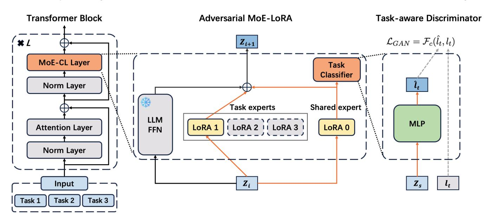
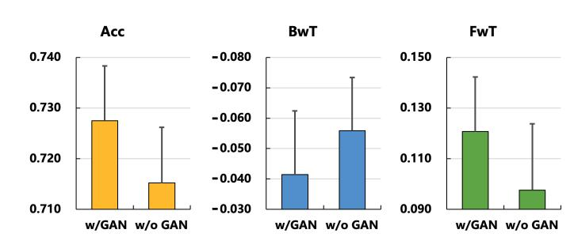

# Self-Evolving LLMs via Continual Instruction Tuning

Jiazheng Kang Beijing University of Posts and Telecommunications Beijing, China kjz@bupt.edu.cn

Le Huang Beijing University of Posts and Telecommunications Beijing, China lehuang@bupt.edu.cn

Cheng Hou Tencent AI Lab Beijing, China chenghou@tencent.com

Zhe Zhao Tencent AI Lab Beijing, China nlpzhezhao@tencent.com

ZhenXiang Yan Tencent AI Lab Beijing, China kimmoyan@tencent.com

Ting Bai\* Beijing University of Posts and Telecommunications Beijing, China baiting@bupt.edu.cn

# Abstract

In real-world industrial scenarios, large language models (LLMs) require Continuous Learning (CL) to adapt to diverse tasks as operational requirements diversify, demanding self-evolution capabilities to autonomously refine their knowledge and adapt to dynamic environments. However, existing CL approaches, such as replay-based and parameter isolation techniques, struggle with the catastrophic forgetting problem: new task training degrades performance on prior tasks due to the model's adaptation to new data distributions, which weakens its generalization to old tasks. To address this issue, we propose a novel parameter-efficient adversarial MoE framework, MoE-CL, for industrial-scale self-evolving continual instruction tuning of LLMs. Specifically, MoE-CL employs a dual-expert architecture to enable self-evolution: a dedicated LoRA expert for each task to preserve task-specific knowledge, ensuring parameter independence and mitigating forgetting, and a shared LoRA expert to facilitate cross-task knowledge transfer. Specifically, a task-aware discriminator within a Generative Adversarial Network (GAN) is integrated into the shared expert to suppress task-irrelevant noise, ensuring only task-aligned knowledge is transferred during sequential task training. Through adversarial training, the shared expert learns generalized representations that mimic the task-aware discriminator, while dedicated experts retain task-specific details, balancing knowledge retention and cross-task generalization—key to the model's self-evolution by autonomously optimizing knowledge integration across tasks. Extensive experiments on a public MTL5 benchmark and an industrial Tencent3 benchmark validate MoE-CL's effectiveness in self-evolving continual learning. In realworld A/B testing on content compliance review in the Tencent Video Platform, MoE-CL reduced manual review costs by 15.3%,

\*Corresponding author.

demonstrating its applicability for large-scale industrial deployment where self-evolution is critical for adapting to evolving operational demands. Implementation code is publicly available at [https://github.com/BAI-LAB/MoE-CL.](https://github.com/BAI-LAB/MoE-CL)

## CCS Concepts

• Do Not Use This Code → Generate the Correct Terms for Your Paper; Generate the Correct Terms for Your Paper; Generate the Correct Terms for Your Paper; Generate the Correct Terms for Your Paper.

# Keywords

Self-Evolution, Continual Learning, Mixture of Experts, Large Language Models

#### ACM Reference Format:

Jiazheng Kang, Le Huang, Cheng Hou, Zhe Zhao, ZhenXiang Yan, and Ting Bai\*. 2025. Self-Evolving LLMs via Continual Instruction Tuning. In . ACM, COEX, SEOUL, KOREA, [9](#page-8-0) pages.<https://doi.org/XXXXXXX.XXXXXXX>

## 1 Introduction

In the era of large-scale industrial AI deployment, self-evolution—the ability of large language models (LLMs) to autonomously refine knowledge integration, adapt to dynamic task patterns, and retain prior competencies without external intervention [\[7\]](#page-7-0) has become indispensable. Industrial scenarios demand LLMs to rapidly respond to evolving operational demands across diverse real-world tasks: for instance, Tencent's content compliance ecosystem, central to ensuring regulatory adherence and user safety, handles over two hundred thousand daily text reviews from fields like social platforms, news media, and e-commerce. Each domain presents distinct linguistic patterns, making self-evolution in continuous learning critical—only through autonomous adaptation can LLMs sustain performance across shifting tasks without constant human oversight. This operational complexity underscores the need for selfevolving continuous learning (CL) frameworks [\[39,](#page-8-1) [44,](#page-8-2) [49\]](#page-8-3), which empower LLMs to seamlessly integrate new knowledge via iterative tuning and adapt dynamically to evolving data distributions. However, self-evolution in continuous learning of LLMs is inherently challenged by the catastrophic forgetting problem. This phenomenon arises from the optimization dynamics of deep learning, where parameter updates during new task training unintentionally disrupt

Permission to make digital or hard copies of all or part of this work for personal or classroom use is granted without fee provided that copies are not made or distributed for profit or commercial advantage and that copies bear this notice and the full citation on the first page. Copyrights for components of this work owned by others than the author(s) must be honored. Abstracting with credit is permitted. To copy otherwise, or republish, to post on servers or to redistribute to lists, requires prior specific permission and/or a fee. Request permissions from permissions@acm.org.

Conference'25, Washington, DC, USA © 2025 Copyright held by the owner/author(s). Publication rights licensed to ACM. ACM ISBN 978-1-4503-XXXX-X/25/11 <https://doi.org/XXXXXXX.XXXXXXX>

or overwrite the neural representations acquired from prior tasks. As a result, the model suffers significant performance degradation on previously mastered tasks, as the iterative fine-tuning for new tasks undermines the stable knowledge encoding necessary for maintaining competence in previous tasks—a critical barrier to selfevolution, which requires autonomous retention of old knowledge while integrating new insights.

Existing solutions in continuous learning of LLMs fail to fully enable self-evolution, facing critical trade-offs between knowledge retention and new task adaptation. For example, replay-based methods [\[11,](#page-7-1) [33,](#page-8-4) [35\]](#page-8-5) preserve prior knowledge by reusing historical data or generating pseudo-samples, but these approaches suffer from data contamination: synthetic data often introduces noise that distorts task-specific representations. Besides, the computational overhead of storing and processing replay data renders them impractical for large-scale industrial use. Regularization techniques [\[1,](#page-7-2) [16,](#page-7-3) [21\]](#page-8-6) constrain parameter updates to protect important weights, yet they overly restrict the model's ability to specialize in new tasks with distinct requirements, limiting adaptability to operational demands in industry scenarios. On the other hand, dynamic architecture approaches, like parameter isolation techniques [\[20,](#page-8-7) [26,](#page-8-8) [34\]](#page-8-9), allocate dedicated parameters to each task, effectively preventing inter-task interference and retaining old task performance. However, such an isolationist design limits cross-task knowledge transfer, failing to leverage shared semantic patterns (e.g., common semantic features across tasks with related content information). In real-world AI deployments, this oversight limits the model's ability to generalize across domains and accumulate fine-tuning gains, leading to suboptimal scalability when handling diverse sequential tasks, which thus constitutes a major impediment to self-evolution in LLMs that rely on autonomous knowledge integration across tasks.

In our work, we introduce MoE-CL, a novel adversarial Mixture of LoRA Experts (MoE) architecture designed for self-evolving Continuous Learning (CL) in large language models. Our core objective is to enable LLMs to autonomously transfer knowledge from previously learned tasks to new ones during sequential training while minimizing the impact of new task updates on old task performance, a challenge that captures the essence of self-evolution of continuous learning in large-scale industrial deployments of LLMs. MoE-CL addresses catastrophic forgetting and enables useful knowledge transfer through an adversarial LoRA expert architecture. By allocating a dedicated LoRA expert to each task, MoE-CL ensures that training a new task does not overwrite prior parameters, inherently supporting autonomous knowledge retention. Concurrently, the shared LoRA expert serves as a self-optimizing cross-task bridge, learning generalized representations that capture common semantic patterns across tasks. Specifically, the collaborative mechanism between experts is enhanced via a Generative Adversarial Network (GAN): a task-aware discriminator suppresses task-irrelevant noise in the shared expert, ensuring only task-aligned knowledge is transferred, which enables the model to autonomously refine knowledge integration without external guidance. During inference, MoE-CL adaptively combines outputs from the shared LoRA expert and the specific LoRA expert for the fine-tuning of the new task. MoE-CL freezes the parameters of other tasks and only updates the parameters in the task-specific LoRA and the shared LoRA expert. By doing so, it minimizes the computational overhead, which makes

it well-suited for self-evolving large-scale industrial systems. The contributions of our paper are summarized as follows:

- We propose a novel adversarial mixture of LoRA experts architecture (MoE-CL) for self-evolving continual instruction tuning of LLMs. MoE-CL achieves self-evolution by maintaining parameter independence through dedicated LoRA experts and integrating common knowledge via a shared LoRA expert, thus addressing the catastrophic forgetting problem.
- We design a task-aware discriminator in a generative adversarial network, which enhances the self-evolving capability of MoE-CL. It enables the model to autonomously transfer task-relevant knowledge while suppressing task-irrelevant noise, thereby improving knowledge generalization in continual instruction tuning.
- Extensive experiments on the public MTL5 benchmark and industrial Tencent3 benchmark demonstrate that MoE-CL outperforms state-of-the-art baselines, with its self-evolving ability validated by consistent performance across diverse tasks. In particular, an offline A/B test on content compliance review in the Tencent Video Platform shows a 15.3% improvement in stripping rate, confirming its practical feasibility for large-scale industrial deployments requiring dynamic selfadaptation.

# 2 Related Work

Our MoE-CL architecture, a novel adversarial Mixture of LoRA Experts framework, connects with four related work areas, i.e., Self-Evolution of LLMs, Continual Learning, Continual Instruction Tuning, and Adversarial Learning with MoE. Our work addresses catastrophic forgetting and enables effective knowledge transfer in LLMs' continual instruction tuning for self-evolution.

# 2.1 Self-Evolution of LLMs

Self-evolution of LLMs is defined as the ability of models to autonomously adapt to dynamic tasks, integrate cross-task knowledge, and sustain performance without heavy external intervention [\[7\]](#page-7-0). Existing approaches for enabling such capability generally fall into three categories: Autonomous Learning Mechanisms, which enable self-improvement via self-generated supervision [\[45\]](#page-8-10), internal feedback [\[28\]](#page-8-11), or rewarding signals [\[38\]](#page-8-12); Dynamic Architecture Adaptation, which focuses on structural optimization, including modular design search [\[6\]](#page-7-4), workflow generation [\[14\]](#page-7-5), and finetuing architecture design [\[22\]](#page-8-13); and Knowledge Integration Frameworks, which consolidate cross-task knowledge through memory management [\[46\]](#page-8-14), tool evolution [\[25\]](#page-8-15), or domain-specific toolset creation [\[47\]](#page-8-16). Current research thus lacks a solution that balances autonomous knowledge retention and adaptive transfer, which are core challenges to self-evolution in continuous instruction tuning. Our work MoE-CL, a Mixture of LoRA Experts architecture, features dedicated experts for autonomous knowledge preservation, a shared expert for cross-task integration, and a GAN-based discriminator for noise suppression, achieving LLM self-evolution through adaptive continual instruction tuning to adapt to sequential task dynamics.

## 2.2 Continual Learning

Continual learning (CL), or termed as lifelong learning in large language models, plays a critical role in overcoming the limitations of traditional static-dataset training. The aim of continual learning is to incrementally incorporate new knowledge, adapt to diverse tasks across evolving domains, and retain previously acquired capabilities throughout the learning process. By enabling incremental learning across shifting domains and diverse tasks, continual learning ensures that LLMs not only adapt to emerging information but also maintain foundational competencies, directly addressing the critical challenge of "catastrophic forgetting" inherent in static training and allowing them to remain relevant and effective in dynamic real-world scenarios where knowledge and tasks evolve continuously. The approaches in CL can be generally categorized into three types [\[49\]](#page-8-3) based on their knowledge integration mechanisms: continual pre-training, continual fine-tuning, and external knowledge integration (including retrieval-based and tool-based methods). Continual pre-training enhances LLMs' knowledge more efficiently than full pre-training by incrementally incorporating new data streams, enabling cross-domain generalization without significant computational overhead [\[12,](#page-7-6) [19\]](#page-7-7). For example, ELLE [\[31\]](#page-8-17) uses function-preserved model expansion and pre-trained domain prompts to continuously incorporate streaming data and enhance performance. Continual fine-tuning adapts LLMs to specific tasks while preserving prior expertise through techniques, such as contrastive ensemble distillation for text classification [\[18\]](#page-7-8), incremental knowledge transfer for named entity recognition [\[30\]](#page-8-18), and constrained optimization to balance new task priorities [\[48\]](#page-8-19). External knowledge integration in CL bridges gaps in LLMs' internal representations via retrieval-based methods like optimized document retrieval [\[17\]](#page-7-9) or tool-based approaches such as Chameleon [\[24\]](#page-8-20), which integrates web search and Python functions. These techniques enhance real-time reasoning capabilities and extend model utility beyond pre-trained knowledge of LLMs.

# 2.3 Continual Instruction Tuning

Continual instruction tuning [\[13,](#page-7-10) [32,](#page-8-21) [42\]](#page-8-22) in LLMs refers to dynamically adapting LLMs through sequential task-specific instruction tuning, enabling them to incrementally incorporate new knowledge from evolving instructions and adapt to diverse tasks while retaining performance on previously learned tasks. This paradigm aims to address the limitations of static training by facilitating iterative updates aligned with new instructional inputs, thereby enhancing the model's flexibility in dynamic real-world scenarios. A critical challenge in continual instruction tuning is the catastrophic forgetting problem, where parameter updates during new task training inadvertently disrupt or overwrite the neural representations acquired from prior tasks. This leads to significant performance degradation on previously learned tasks, as the model fails to preserve the stable knowledge encoding necessary for previous tasks.

Existing approaches, such as replay-based, regularization, or architecture-based techniques, struggle to balance knowledge retention and new task adaptation. For example, the replay-based method LAMOL [\[36\]](#page-8-23) that uses generative replay to preserve past knowledge through pseudo-samples. It suffers from data noise and computational overhead. Regularization-based techniques such as

ARPER [\[29\]](#page-8-24) stabilize parameter updates via adaptive regularization. This type of method overly restricts model specialization, Architecture-based methods like TPEM [\[8\]](#page-7-11) dynamically adjust network structures to retain task relevance. The isolated parameters limit cross-task knowledge transfer. The SOTA continual instruction tuning method is MoCL [\[40\]](#page-8-25), which equips each task with a dedicated PEFT module and calculates the similarity between the input and the task vector as weights to fuse the outputs of the training task. However, it faces inherent limitations in balancing task specificity with cross-domain generalization.

Different from the above instruction tuning methods, we propose MoE-CL, which integrates dedicated task-specific experts (to preserve task-specific knowledge) and shared experts (to enable controlled knowledge transfer), mitigating catastrophic forgetting through adversarial training, alleviating task-irrelevant noise and improving efficient cross-task generalization.

## 2.4 Adversarial Learning with MoE

Learning with Generative Adversarial Networks (GAN) is a powerful technique that trains two models simultaneously: a generator that produces realistic outputs and a discriminator that distinguishes between real and generated data [\[3,](#page-7-12) [9,](#page-7-13) [10\]](#page-7-14). This adversarial process enhances the generator's ability to create outputs that are indistinguishable from real data, making it highly effective for tasks that require robustness and invariance. In recommendation systems, adversarial learning has demonstrated effectiveness in addressing biases [\[43\]](#page-8-26) and enhancing generalization by separating shared and task-specific features [\[2\]](#page-7-15). This ability to explicitly distinguish between generalizable knowledge and task-specific details aligns with the core challenges of continual learning in large language models, where there is a critical need to balance knowledge retention and adaptation to new tasks. Building on the similar foundation of disentangling generalizable and task-specific knowledge, the Mixture-of-Experts (MoE) architecture has shown promise in analogous contexts. MoE enables models to dynamically combine specialized and shared knowledge, a strategy that has proven successful in traditional multi-task learning [\[27,](#page-8-27) [37\]](#page-8-28) and general LLM fine-tuning [\[5,](#page-7-16) [23\]](#page-8-29). However, despite these advancements, the potential of MoE in addressing the catastrophic forgetting problem in LLMs' continual learning has remained underexplored.

Inspired by how adversarial learning can guide experts to learn more discriminative and task-aligned representations, our work bridges this gap by pioneering the integration of an adversarial MoE framework into LLMs' continual instruction tuning. By leveraging adversarial training to regulate interactions between dedicated taskspecific LoRA experts and a shared cross-task expert, we enable the model to retain task-specific knowledge while facilitating controlled knowledge transfer, thus addressing catastrophic forgetting in a novel way. Our approach makes a systematic exploration of MoE's capabilities in this LLM continuous learning domain, leveraging the strengths of both adversarial learning and MoE architectures to enhance the continuous learning capacity of LLMs.

Figure 1: The overall architecture of MoE-CL: An adversarial MoE-LoRA framework integrating dedicated LoRA experts (for task-specific knowledge preservation), a shared LoRA expert (for cross-task knowledge transfer), and a GAN-based task-aware discriminator (to suppress task-irrelevant noise), which collectively alleviates catastrophic forgetting in continual instruction tuning of LLMs.

## 3 Perliminary

This section introduces the key concepts in our paper, including continual learning, instruction tuning with LoRA experts in the mixture-of-experts architecture.

## 3.1 Continual Learning

Continual learning (CL) enables models to sequentially acquire new tasks while retaining prior knowledge. Our work focuses on continual instruction tuning of LLMs with a series of tasks. Given a task sequence, represented as {��1, ...,���� }. Each task ���� contains a set of learning samples {(���� , ����)} for instruction tuning, where ���� represents an input sample, ���� is the corresponding ground truth label, and �� ∈ {1, ..., ��} represents the task identifier. The continual instruction tuning of LLMs aims to optimize the average performance of all the tasks after training all tasks sequentially.

Let �� denote the parameters of the LLM. For each task ���� , we define a loss function L��(��) that measures how well the model performs on the samples of that task. The overall goal of continual instruction tuning is to find the optimal parameter set �� that minimizes the average loss across all tasks in the sequence. It is formalized as:

min 1 �� ∑︁�� ��=1 L��(��). (1)

By minimizing this average loss, we ensure that the LLM performs well not only on the most recently learned tasks but also on the entire set of tasks it has encountered during the sequential training process.

#### 3.2 Instruction Tuning with LoRA

We adopt the Parameter-Efficient Fine-Tuning (PEFT) technique, i.e., LoRA [\[15\]](#page-7-17), to allocate parameter updating for a specific task in the continual instruction tuning (i.e., supervised fine-tuning, SFT) of LLMs. LoRA adopts a low-rank decomposition technique to update the parameters of the decomposed parameter matrix to learn the data distribution of downstream tasks. It modifies the Feed-Forward Neural Network (FFN) layers in Transformer blocks by introducing low-rank parameter updates. It freezes pre-trained parameters of LLMs while training adapter modules in FFN layers, enabling efficient fine-tuning of LLMs with minimal computational overhead.

For a linear layer in FFN, which is defined as h = Wx, the update of the decomposed parameter matrix of the LoRA is:

h = Wx + ΔWx = Wx + �� BAx, (2)

where the vector x ∈ R �� encodes the input information, while W ∈ R ��×�� serves as the pre-trained parameter matrix of LLMs. In LoRA, A and B are low-rank matrices with dimensions R ��×�� and R ��×�� respectively, and the rank �� is significantly smaller than min(��,��). The parameter �� determines the scale of changes made to W. Notably, when performing fine-tuning, only the matrices A and B are adjusted, leaving other components unchanged.

In instruction tuning with the task sequence in continual learning, each task is equipped with an independent LoRA expert. These experts of all tasks form a Mixture-of-Experts LoRA (i.e., MoE-LoRA) network. By introducing low-rank matrices, the LoRA technology greatly reduces the amount of parameter updates during model training, lowering the computational cost, while maintaining the model's learning ability.

#### 4 MoE-CL

To address the catastrophic forgetting problem and meanwhile gain benefits from continual instruction tuning of all tasks, we propose a novel adversarial mixture of LoRA experts architecture (MoE-CL) for continual instruction tuning of LLMs.

#### 4.1 Overview Architecture

The overview architecture of MoE-CL is shown in Fig. [1.](#page-3-0) It is an adversarial MoE-LoRA architecture that adaptively combines taskspecific and shared experts in continual instruction tuning of LLMs. Each task is equipped with a dedicated LoRA expert to learn the taskspecific knowledge, ensuring the parameters are independently updated so as to alleviate the catastrophic forgetting problem in continual learning. Meanwhile, a shared LoRA expert is designed to extract the general knowledge across all tasks to achieve highquality cross-task knowledge transfer while minimizing interference from irrelevant information.

## 4.2 Adversarial MoE-LoRA

MoE-CL employs a generative adversarial network (GAN) with a task classifier (i.e., task-aware discriminator) to explicitly constrain the parameters in task-sharing LoRA experts.

4.2.1 The Generator in GAN. The generator in the GAN utilizes the output vector of the feed-forward layer within the transformer block as its input. The output of the generator is shared representations in the shared LoRA expert. The mathematical formulation of the generator, which transforms the feed-forward output into shared representations, is defined in Eq. [3.](#page-4-0) These shared representations are designed to encapsulate common knowledge across tasks deceive the task-aware discriminator. In response, the task-aware discriminator is designed to infer the corresponding task labels from these generated shared representations. After the training, the task-sharing LoRA expert learns high-quality cross-task sharing information, which helps the fine-tuning of subsequent tasks.

4.2.2 Task-aware Discriminator. The task-aware discriminator is a task classifier to identify the label of the learning task. Given the input vector in ��-th feed-forward layer in the transformer block, represented as z�� ∈ R �� . For the learning task ��, the task-sharing representation z�� ∈ R �� and the task-specific representation z�� ∈ �� are defined as follows:

z�� = F�������� (z�� , ���� ), (3)

z�� = F�������� (z�� , ���� ), (4)

where F�������� is the low-rank operation function in LoRA conducted on the frozen-parameters in pre-trained LLMs. ���� and ���� are the learnable parameters in task-sharing LoRA expert and specific LoRA expert for task ��.

The predicted task label in the discriminator is:

ˆ ���� = F (z�� , ��), (5)

where F is the softmax activation function, and �� is the learning parameter of the task classifier.

The loss function L������ in GAN is computed by comparing the ground truth label ���� and the predicted label from ˆ ���� , defined as:

L������ = F�� ( ˆ ���� ,���� ), (6)

where F�� is the cross-entropy loss function.

## 4.3 Instruction Tuning Optimization

After instruction tuning, the prediction for task �� is computed using a weighted combination of task-sharing and task-specific representations, which are linearly interpolated with learnable weights to produce the output representation zi+1 at layer �� of the transformer block, defined as:

zi+1 = ���� · z�� + ���� · z�� , (7)

where weight coefficients ���� and ���� of the task-sharing representation and the task-specific representation are automatically calculated by the gating network G, formulated as:

���� , ���� = G (z��). (8)

The hidden representation z��+1 is then fed into a Multi-Layer Perceptron (MLP) to obtain the prediction result. The prediction loss is defined as:

L������ = F�� (��ˆ�� , ���� ), (9)

where ���� and ��ˆ�� is the ground truth and predicted label respectively. By adding the generative adversarial loss and prediction loss in SFT, the final loss function in MoE-CL is optimized by:

L = L������ − �� ∗ L������ , (10)

where �� is a positive parameter weight ranging from 0 to 1 to adjust the weight of two losses. In an ideal scenario, the discriminator can not discriminate task labels from shared representations. Hence the negative loss in GAN is used in the final optimization.

## 5 Experiments

## 5.1 Experimental setup

5.1.1 Dataset. We conduct experiments on one public continual learning benchmark MTL5 [\[4\]](#page-7-18) and a real-world large-scale industrial dataset Tencent3. Considering that the order of tasks in continual learning may affect the overall performance, we conduct experiments on three training orders. The details of task descriptions are shown in Table [1.](#page-5-0)

- MTL5 is a far-domain benchmark that encompasses five text classification tasks across diverse domains. The significant differences between these domains render continual learning particularly challenging. We selected four tasks from this benchmark—AGnews, Amazon, DBPedia, and Yahoo—for our continual text classification experiments. Further details are provided in Table [1.](#page-5-0)
- Tencent3 evaluation benchmark contains 229,442 review samples from three business scenarios, i.e., Task1 from the Review Channel, Task2 from the Social Platform, and Task3 from the Official Content in practical applications of Tencent, for content compliance review (i.e., binary classification task).

5.1.2 Evaluation Metrics. We conduct comprehensive evaluations of the model's performance from three dimensions in continual learning [\[49\]](#page-8-3), namely Accuracy (Acc), Backward Transfer (BwT), and Forward Transfer (FwT).

Table 1: Dataset descriptions and different orders of task sequences used in continuous learning. MTL5: a public far-domain benchmark with four text classification tasks across diverse domains; Tencent3: a real industrial dataset with content compliance review samples from three business scenarios.

| Benchmark Data | #Class |           | Task Type Base | Model Order | Task Sequence           |
|----------------|--------|-----------|----------------|-------------|-------------------------|
| AGNews         | 4      | Topic     | classification |             |                         |
|                |        |           |                | Llama 2     |                         |
|                |        |           |                | 1           | DBP->Amazon->Yahoo->AGN |
| Amazon         | 5      | Sentiment | analysis       | 2           | DBP->Amazon->AGN->Yahoo |
| DBPedia        | 14     | Topic     | classification | 3           | Yahoo->Amazon->AGN->DBP |
| Yahoo          | 10     |           | Q&A            |             |                         |
| TASK1          | 2      | Text      | classification |             |                         |
|                |        |           |                | 1           | TASK1->TASK2->TASK3     |
| TASK2          | 2      | Text      | classification | 2           | TASK3->TASK1->TASK2     |
| TASK3          | 2      | Text      | classification | 3           | TASK2->TASK3->TASK1     |

- Accuracy (Acc) is the primary indicator of model performance, reflecting the overall performance after training all tasks; higher accuracy indicates better comprehensive performance of the model.
- Backward Transfer (BwT) evaluates the impact of subsequent tasks on previously learned tasks. A larger BwT (closer to or positive) indicates that learning new tasks has less negative impact (or even a positive impact) on old tasks, which is crucial for mitigating catastrophic forgetting.
- Forward Transfer (FwT) measures the benefits of knowledge transfer from prior tasks to subsequent tasks. A larger FwT means more effective knowledge reuse across tasks, enhancing the model's ability to adapt to new tasks.

5.1.3 Compared Methods. . We compare MoE-CL method with the following representative models:

- Per-task FT : trains a separate PEFT module for each task. All tasks are independent of each other, and the training order of the tasks has no impact on the results.
- Sequential FT-P: uses a shared Parameter-Efficient Fine-Tuning (PEFT) module, which is trained according to a predefined order of task sequence.
- O-LoRA [\[41\]](#page-8-30): learns tasks in orthogonal low-rank vector subspaces to minimize interference of each other in continual learning.
- MoCL [\[40\]](#page-8-25): is the current state-of-the-art method. It equips each task with a dedicated PEFT module and calculates the similarity between the input and the task vector as weights to fuse the outputs of the training task.
- MoE-CL: our adversarial MoE architecture, in which a dedicated LoRA expert is used for each task to preserve taskspecific knowledge and a shared LoRA expert to facilitate cross-task knowledge transfer.

5.1.4 Implementation Details. All methods are implemented in Py-Torch within an 8-GPU H20 environment. For each baseline method, grid search is conducted to determine optimal hyperparameters, including learning rates ranging from 0.0001 to 0.001 (stepping by 0.0001) and LoRA matrix ranks in {2, 4, 8, 16, 32}. Results reported for each method use validation-data-optimized hyperparameters. In our model, the dimension �� of task-shared and task-specific vectors matches the FFN output layer size of the base model, which is 4096. For MTL5 and Tencent3 benchmarks, the learning rate is

set to 0.0002, the LoRA matrix rank to 8, and the balance weight �� in Eq. [10](#page-4-1) to 0.1.

# 5.2 Main Results

The experimental results on MTL5 and Tencent3 evaluation benchmarks are shown in Table [3](#page-6-0) and Table [2.](#page-6-1) We have the following observations:

(1) Our proposed method MoE-CL demonstrates remarkable improvements in average accuracy (Avg.ACC) compared to all baseline approaches with minimal variance, highlighting its superior generalization performance and robust stability across diverse task complexities.

(2) Sequential FT-P exhibits inconsistent performance across two benchmarks: it achieves the worst Avg.ACC in the MTL5 benchmark due to its parameter-sharing strategy exacerbating catastrophic forgetting on highly heterogeneous tasks (e.g., topic classification, Q&A, sentiment analysis) with significant semantic gaps. Conversely, on the Tencent3 benchmark, which comprises homogeneous content compliance review classification tasks, it achieves the second-best performance after our MoE-CL.

(3) Our model achieves fewer negative effects from subsequent tasks than MoCL (BwT) and exhibits stronger Stability than Sequential FT-P on BwT and FwT, showing the effectiveness of integrating hybrid LoRA experts in a GAN-based architecture. O-LoRA performs best in the BwT metric because it reserves an orthogonal low-rank parameter space for each task that avoids interference from subsequent tasks.

(4) On the MTL5 and Tencent3 benchmarks, task sequence order significantly impacts model performance. Our method, MoE-CL, demonstrates superior Stability across different task sequence orders through its architecture of explicitly separating shared experts (handling common knowledge across tasks) and specific experts for each task. In contrast, methods like MoCL (relying on task vector similarity) and Sequential FT-P (suffering from catastrophic forgetting) showed greater sequence-order sensitivity.

(5) A significant improvement and stability have been achieved by MoE-CL in continual learning, but its implementation involves some architectural complexity. We test the inference Latency of our model in an 8-GPU H20 environment. Compared to other models, our model has a relatively higher latency, i.e., 6.3ms for a sample (with avg.length of 300 tokens), but it remains within the range imperceptible to humans and is acceptable in real industrial scenarios.

Table 2: Evalutions on Tencent3 evaluation benchmark conducted on Tencent Hunyuan foundation model. The underline represents the SOTA compared method according to the primary evaluation metric Accuracy. Bold font indicates that the model has the best comprehensive performance in terms of both Accuracy and Stability.

| Metric              | Order | Per-task FT | Sequential FT-P  | Method O-LoRA    | MoCL             | MoE-CL           |
|---------------------|-------|-------------|------------------|------------------|------------------|------------------|
| Accuracy ( ↑ )      |       |             |                  |                  |                  |                  |
|                     | Avg   | 0.5334      | 0.6071 ± 0.0220  | 0.5950 ± 0.0122  | 0.5918 ± 0.0293  | 0.6342 ± 0.0074  |
|                     | 1     | 0.5334      | 0.6365           | 0.5901           | 0.5764           | 0.6446           |
| (Primary Indicator) | 2     | 0.5334      | 0.6012           | 0.6118           | 0.6328           | 0.6280           |
|                     | 3     | 0.5334      | 0.5836           | 0.5832           | 0.5663           | 0.6299           |
| BwT ( ↓ )           |       |             |                  |                  |                  |                  |
|                     | Avg   | -0.1593     | -0.0300 ± 0.0324 | -0.0223 ± 0.0024 | -0.0485 ± 0.0249 | -0.0349 ± 0.0168 |
|                     | 1     | -0.1593     | -0.0632          | -0.0192          | -0.0747          | -0.0578          |
|                     | 2     | -0.1593     | -0.0406          | -0.0251          | -0.0150          | -0.0289          |
|                     | 3     | -0.1593     | 0.0139           | -0.0225          | -0.0559          | -0.0179          |
| FwT ( ↑ )           |       |             |                  |                  |                  |                  |
|                     | Avg   | 0.0562      | 0.0578 ± 0.0287  | 0.0106 ± 0.0078  | -0.0139 ± 0.0052 | 0.0573 ± 0.0159  |
|                     | 1     | 0.0562      | 0.0916           | -0.0003          | -0.0098          | 0.0797           |
|                     | 2     | 0.0562      | 0.0603           | 0.0173           | -0.0212          | 0.0485           |
|                     | 3     | 0.0562      | 0.0214           | 0.0147           | -0.0106          | 0.0438           |
| Latency (ms/sample) |       | 4.5ms       | 9.4ms            | 4.6ms            | 4.7ms            | 6.3ms            |

Table 3: The Accuracy on the MTL5 benchmark.

| MTL5 (Llama 2)  | Avg         |      | Orders |      |
|-----------------|-------------|------|--------|------|
|                 |             | 1    | 2      | 3    |
| Sequential FT-P | 26.7 ± 0 91 | 28.8 | 27.4   | 26.6 |
| Per-task FT     | 76.6 ± 0 00 | 76.6 | 76.6   | 76.6 |
| O-LoRA          | 76.1 ± 0 52 | 76.8 | 75.7   | 75.7 |
| MoCL            | 78.2 ± 0 33 | 78.4 | 77.7   | 78.4 |
| MoE-CL(Ours)    | 80.5 ± 1.50 | 81.1 | 81.9   | 78.4 |

Figure 2: The impact of GAN-based architecture in MoE-CL: Performance comparisons (on Accuracy, Backward Transfer, and Forward Transfer) between MoE-CL with GAN (suppressing task-irrelevant noise in shared expert) and without GAN, demonstrating GAN's role in alleviating catastrophic forgetting and enhancing cross-task generalization in continual instruction tuning on MTL5 benchmark.

# 5.3 Ablation Study

To verify the effectiveness of our adversarial MoE-LoRA architecture in addressing the catastrophic forgetting problem, we remove the GAN component in the MoE-CL (i.e., w/o GAN). The comparisons with the degraded version are shown in Fig. [2,](#page-6-2) which contrasts

Table 4: Offline A/B test measured by Stripping Rate. MoE-CL reduces 15.3% and 3.2% manual review manpower costs in real business scenarios on a Video Platform and Social Platform in Tencent Security.

| Method | Class 0 | Video Platform Class 1 | SUM     | Social Class 0 | Platform Class 1 | SUM    |
|--------|---------|------------------------|---------|----------------|------------------|--------|
| Online | 5.3%    | 8.2%                   | 13.5%   | 22.2%          | 12.0%            | 34.2%  |
| MoE-CL | 15.5%   | 13.0%                  | 28.8%   | 20.6%          | 16.8%            | 37.4%  |
| Gain   | 10.2% ↑ | 4.8% ↑                 | 15.3% ↑ | -1.6% ↓        | 4.8% ↑           | 3.2% ↑ |

performance across three key metrics for continual learning: Accuracy (Acc, overall task performance), Backward Transfer (BwT, evaluating the impact of subsequent tasks on prior ones), and Forward Transfer (FwT, measuring knowledge transfer benefits from prior to new tasks). For the three metrics, higher values are indicative of superior performance. As for BWT, it is generally negative, but less negative values (closer to 0) indicate less negative impacts: the model performs better in addressing the catastrophic forgetting problem.

We observe that our GAN-based MoE expert architecture achieves a notable improvement in the average performance across all tasks in CL: it outperforms the w/o GAN variant in Accuracy (with higher overall scores), exhibits less negative BwT (indicating reduced interference of new task training on old tasks), and yields higher FwT (showing more effective cross-task knowledge reuse). Our GAN-based MoE architecture effectively localizes task-specific information within task-specific LoRA experts by suppressing taskirrelevant noise in the shared expert through adversarial training, ensuring that only task-aligned knowledge is transferred across tasks. This strategic distribution prevents the occurrence of catastrophic forgetting, a phenomenon clearly reflected in the BwT metric—where the GAN-integrated model shows significantly smaller

performance degradation on previously learned tasks after training new ones compared to the version without GAN.

# 5.4 Offline A/B Testing

In Content Compliance Review (CCR) in Tencent Security, content samples with machine-predicted confidence scores exceeding a predefined threshold are classified into two types.

- Class 0: white. Denoting the compliant content that meets regulations (automatically approved via high-confidence model predictions).
- Class 1: black. Denoting non-compliant content that violates rules (automatically flagged or blocked via high-confidence predictions).

Either "Class 0: white" (compliant) or "Class 1: black" (non-compliant), bypassing manual human review. The effectiveness of applied algorithms is measured by the Stripping Rate, which quantifies the proportion of high-confidence samples automatically classified without manual review. The higher stripping rate reduces operational costs by minimizing the volume of content requiring human intervention. We conduct offline A/B testing to compare the stripping rate of our proposed MoE-CL method against the applied production algorithm. As presented in Table [4,](#page-6-3) MoE-CL achieved significant stripping rate improvements in the CCR task across both the Video Platform and Social Platform practical applications in Tencent. In the Video Platform scenario, it achieves a 15.3% improvement in stripping rate over the production baseline. This uplift directly reduced manual-review manpower costs by 15.3%, delivering tangible business value through operational efficiency gains and highlighting the solution's impact in real-world industrial applications.

# 6 Conclusion

We introduce MoE-CL, a novel Mixture of LoRA Experts architecture that effectively addresses catastrophic forgetting and enables robust knowledge transfer in large language models during continual instruction tuning—key to enabling the self-evolution of LLMs. By integrating dedicated LoRA experts for task-specific knowledge retention with shared LoRA experts enhanced by a GAN-based task-aware discriminator, MoE-CL not only achieves a remarkable balance between preserving prior task performance and incorporating new task knowledge but also fosters the self-evolution of LLMs by enabling autonomous adaptation to sequential tasks without heavy external intervention. Our experiments on Tencent's realworld content compliance review systems not only demonstrate the effectiveness of MoE-CL but also validate its practical viability in large-scale industrial AI deployment with sustained self-evolution capabilities.

While MoE-CL represents a significant advancement in enabling LLM self-evolution through continual learning, we acknowledge that its current implementation involves some architectural complexity. However, these challenges do not detract from its core strengths. MoE-CL maintains a comparable inference speed and achieves easier convergence in real-world scenarios at Tencent, highlighting its potential for optimization and scalability in supporting sustained self-evolution. Future work will focus on refining

these aspects to further enhance its self-evolution capabilities and broaden its applicability.

# Acknowledgments

This work is sponsored by the CCF-Tencent RAGR20240108, the National Natural Science Foundation of China under Grant No. 62236003, and the Tencent Basic Platform Technology Rhino-Bird Focused Research Program.

# References

- [1] Rahaf Aljundi, Francesca Babiloni, Mohamed Elhoseiny, Marcus Rohrbach, and Tinne Tuytelaars. 2018. Memory aware synapses: Learning what (not) to forget. In Proceedings of the European conference on computer vision (ECCV). 139–154. [2] Ting Bai, Le Huang, Yue Yu, Cheng Yang, Cheng Hou, Zhe Zhao, and Chuan Shi. 2024. Efficient Multi-task Prompt Tuning for Recommendation. arXiv preprint arXiv:2408.17214 (2024). [3] Antonia Creswell, Tom White, Vincent Dumoulin, Kai Arulkumaran, Biswa Sengupta, and Anil A Bharath. 2018. Generative adversarial networks: An overview. IEEE signal processing magazine 35, 1 (2018), 53–65. [4] Cyprien de Masson D'Autume, Sebastian Ruder, Lingpeng Kong, and Dani Yogatama. 2019. Episodic memory in lifelong language learning. Advances in Neural Information Processing Systems 32 (2019). [5] Shihan Dou, Enyu Zhou, Yan Liu, Songyang Gao, Jun Zhao, Wei Shen, Yuhao Zhou, Zhiheng Xi, Xiao Wang, Xiaoran Fan, et al. 2023. Loramoe: Revolutionizing mixture of experts for maintaining world knowledge in language model alignment. arXiv preprint arXiv:2312.09979 4, 7 (2023). [6] Shangheng Du, Jiabao Zhao, Jinxin Shi, Zhentao Xie, Xin Jiang, Yanhong Bai, and Liang He. 2025. A survey on the optimization of large language model-based agents. arXiv preprint arXiv:2503.12434 (2025). [7] Huan-ang Gao, Jiayi Geng, Wenyue Hua, Mengkang Hu, Xinzhe Juan, Hongzhang Liu, Shilong Liu, Jiahao Qiu, Xuan Qi, Yiran Wu, et al. 2025. A survey of self-evolving agents: On path to artificial super intelligence. arXiv preprint arXiv:2507.21046 (2025). [8] Binzong Geng, Fajie Yuan, Qiancheng Xu, Ying Shen, Ruifeng Xu, and Min Yang. 2021. Continual Learning for Task-oriented Dialogue System with Iterative Network Pruning, Expanding and Masking. In Proceedings of the 59th Annual Meeting of the Association for Computational Linguistics and the 11th International Joint Conference on Natural Language Processing (Volume 2: Short Papers). 517–
- 523. [9] Ian Goodfellow, Jean Pouget-Abadie, Mehdi Mirza, Bing Xu, David Warde-Farley, Sherjil Ozair, Aaron Courville, and Yoshua Bengio. 2020. Generative adversarial networks. Commun. ACM 63, 11 (2020), 139–144. [10] Ian J Goodfellow, Jean Pouget-Abadie, Mehdi Mirza, Bing Xu, David Warde-Farley, Sherjil Ozair, Aaron Courville, and Yoshua Bengio. 2014. Generative adversarial nets. Advances in neural information processing systems 27 (2014). [11] Jiafeng Guo, Changjiang Zhou, Ruqing Zhang, Jiangui Chen, Maarten de Rijke, Yixing Fan, and Xueqi Cheng. 2024. Corpusbrain++: A continual generative pre-training framework for knowledge-intensive language tasks. arXiv preprint arXiv:2402.16767 (2024). [12] Kshitij Gupta, Benjamin Thérien, Adam Ibrahim, Mats L Richter, Quentin Anthony, Eugene Belilovsky, Irina Rish, and Timothée Lesort. 2023. Continual pre-training of large language models: How to (re) warm your model? arXiv preprint arXiv:2308.04014 (2023). [13] Jinghan He, Haiyun Guo, Ming Tang, and Jinqiao Wang. 2023. Continual instruction tuning for large multimodal models. arXiv preprint arXiv:2311.16206 (2023). [14] Chia-Tung Ho, Jing Gong, Xufeng Yao, Yunsheng Bai, Abhishek B Akkur, and Haoxing Ren. 2025. Polymath: A Self-Optimizing Agent with Dynamic Hierarchical Workflow. arXiv preprint arXiv:2508.02959 (2025). [15] Edward J Hu, Yelong Shen, Phillip Wallis, Zeyuan Allen-Zhu, Yuanzhi Li, Shean Wang, Lu Wang, Weizhu Chen, et al. 2022. Lora: Low-rank adaptation of large language models. ICLR 1, 2 (2022), 3. [16] Yufan Huang, Yanzhe Zhang, Jiaao Chen, Xuezhi Wang, and Diyi Yang. 2021. Continual learning for text classification with information disentanglement based regularization. arXiv preprint arXiv:2104.05489 (2021). [17] Vladimir Karpukhin, Barlas Oguz, Sewon Min, Patrick SH Lewis, Ledell Wu, Sergey Edunov, Danqi Chen, and Wen-tau Yih. 2020. Dense Passage Retrieval for Open-Domain Question Answering.. In EMNLP (1). 6769–6781. [18] Zixuan Ke, Bing Liu, Hu Xu, and Lei Shu. 2021. CLASSIC: Continual and Contrastive Learning of Aspect Sentiment Classification Tasks. In Proceedings of 2021 Conference on Empirical Methods in Natural Language Processing (EMNLP-2021). [19] Zixuan Ke, Yijia Shao, Haowei Lin, Tatsuya Konishi, Gyuhak Kim, and Bing Liu. 2023. Continual pre-training of language models. arXiv preprint arXiv:2302.03241 (2023).

[20] Zixuan Ke, Hu Xu, and Bing Liu. 2021. Adapting BERT for continual learning of a sequence of aspect sentiment classification tasks. arXiv preprint arXiv:2112.03271 (2021). [21] James Kirkpatrick, Razvan Pascanu, Neil Rabinowitz, Joel Veness, Guillaume Desjardins, Andrei A Rusu, Kieran Milan, John Quan, Tiago Ramalho, Agnieszka Grabska-Barwinska, et al. 2017. Overcoming catastrophic forgetting in neural networks. Proceedings of the national academy of sciences 114, 13 (2017), 3521– 3526. [22] Fei Kong, Xiaohan Shan, Yanwei Hu, and Jianmin Li. 2025. PhaseNAS: Language-Model Driven Architecture Search with Dynamic Phase Adaptation. arXiv preprint arXiv:2507.20592 (2025). [23] Dengchun Li, Yingzi Ma, Naizheng Wang, Zhengmao Ye, Zhiyuan Cheng, Yinghao Tang, Yan Zhang, Lei Duan, Jie Zuo, Cal Yang, et al. 2024. Mixlora: Enhancing large language models fine-tuning with lora-based mixture of experts. arXiv preprint arXiv:2404.15159 (2024). [24] Pan Lu, Baolin Peng, Hao Cheng, Michel Galley, Kai-Wei Chang, Ying Nian Wu, Song-Chun Zhu, and Jianfeng Gao. 2023. Chameleon: Plug-and-play compositional reasoning with large language models. Advances in Neural Information Processing Systems 36 (2023), 43447–43478. [25] Jianwen Luo, Yiming Huang, Jinxiang Meng, Fangyu Lei, Shizhu He, Xiao Liu, Shanshan Jiang, Bin Dong, Jun Zhao, and Kang Liu. 2025. GATE: Graph-based Adaptive Tool Evolution Across Diverse Tasks. arXiv preprint arXiv:2502.14848 (2025). [26] Yun Luo, Xiaotian Lin, Zhen Yang, Fandong Meng, Jie Zhou, and Yue Zhang. 2023. Mitigating catastrophic forgetting in task-incremental continual learning with adaptive classification criterion. arXiv preprint arXiv:2305.12270 (2023). [27] Jiaqi Ma, Zhe Zhao, Xinyang Yi, Jilin Chen, Lichan Hong, and Ed H Chi. 2018. Modeling task relationships in multi-task learning with multi-gate mixture-ofexperts. In Proceedings of the 24th ACM SIGKDD international conference on knowledge discovery & data mining. 1930–1939. [28] Aman Madaan, Niket Tandon, Prakhar Gupta, Skyler Hallinan, Luyu Gao, Sarah Wiegreffe, Uri Alon, Nouha Dziri, Shrimai Prabhumoye, Yiming Yang, et al. 2023. Self-refine: Iterative refinement with self-feedback. Advances in Neural Information Processing Systems 36 (2023), 46534–46594. [29] Fei Mi, Liangwei Chen, Mengjie Zhao, Minlie Huang, and Boi Faltings. 2020. Continual learning for natural language generation in task-oriented dialog systems. arXiv preprint arXiv:2010.00910 (2020). [30] Natawut Monaikul, Giuseppe Castellucci, Simone Filice, and Oleg Rokhlenko. 2021. Continual learning for named entity recognition. In Proceedings of the AAAI Conference on Artificial Intelligence. 13570–13577. [31] Yujia Qin, Jiajie Zhang, Yankai Lin, Zhiyuan Liu, Peng Li, Maosong Sun, and Jie Zhou. 2022. ELLE: Efficient Lifelong Pre-training for Emerging Data. In Findings of the Association for Computational Linguistics: ACL 2022. 2789–2810. [32] Anastasia Razdaibiedina, Yuning Mao, Rui Hou, Madian Khabsa, Mike Lewis, and Amjad Almahairi. [n. d.]. Progressive Prompts: Continual Learning for Language Models. In The Eleventh International Conference on Learning Representations. [33] Sylvestre-Alvise Rebuffi, Alexander Kolesnikov, Georg Sperl, and Christoph H Lampert. 2017. icarl: Incremental classifier and representation learning. In Proceedings of the IEEE conference on Computer Vision and Pattern Recognition. 2001– 2010. [34] Andrei A Rusu, Neil C Rabinowitz, Guillaume Desjardins, Hubert Soyer, James Kirkpatrick, Koray Kavukcuoglu, Razvan Pascanu, and Raia Hadsell. 2016. Progressive neural networks. arXiv preprint arXiv:1606.04671 (2016). [35] Fan-Keng Sun, Cheng-Hao Ho, and Hung-Yi Lee. 2019. Lamol: Language modeling for lifelong language learning. arXiv preprint arXiv:1909.03329 (2019). [36] Fan-Keng Sun, Cheng-Hao Ho, and Hung-Yi Lee. 2019. Lamol: Language modeling for lifelong language learning. arXiv preprint arXiv:1909.03329 (2019). [37] Hongyan Tang, Junning Liu, Ming Zhao, and Xudong Gong. 2020. Progressive layered extraction (ple): A novel multi-task learning (mtl) model for personalized recommendations. In Proceedings of the 14th ACM conference on recommender systems. 269–278. [38] Zhengwei Tao, Ting-En Lin, Xiancai Chen, Hangyu Li, Yuchuan Wu, Yongbin Li, Zhi Jin, Fei Huang, Dacheng Tao, and Jingren Zhou. 2024. A survey on self-evolution of large language models. arXiv preprint arXiv:2404.14387 (2024). [39] Liyuan Wang, Xingxing Zhang, Hang Su, and Jun Zhu. 2024. A comprehensive survey of continual learning: Theory, method and application. IEEE Transactions on Pattern Analysis and Machine Intelligence (2024). [40] Mingyang Wang, Heike Adel, Lukas Lange, Jannik Strötgen, and Hinrich Schuetze. 2024. Rehearsal-Free Modular and Compositional Continual Learning for Language Models. In Proceedings of the 2024 Conference of the North American Chapter of the Association for Computational Linguistics: Human Language Technologies (Volume 2: Short Papers), Kevin Duh, Helena Gomez, and Steven Bethard (Eds.). Association for Computational Linguistics, Mexico City, Mexico, 469–480. [doi:10.18653/v1/2024.naacl-short.39](https://doi.org/10.18653/v1/2024.naacl-short.39) [41] Xiao Wang, Tianze Chen, Qiming Ge, Han Xia, Rong Bao, Rui Zheng, Qi Zhang, Tao Gui, and Xuanjing Huang. [n. d.]. Orthogonal Subspace Learning for Language Model Continual Learning. In The 2023 Conference on Empirical Methods in Natural Language Processing. [42] Yifan Wang, Yafei Liu, Chufan Shi, Haoling Li, Chen Chen, Haonan Lu, and Yujiu Yang. 2024. Inscl: A data-efficient continual learning paradigm for fine-tuning large language models with instructions. arXiv preprint arXiv:2403.11435 (2024). [43] Zimu Wang, Yue He, Jiashuo Liu, Wenchao Zou, Philip S Yu, and Peng Cui. 2022. Invariant preference learning for general debiasing in recommendation. In Proceedings of the 28th ACM SIGKDD Conference on Knowledge Discovery and Data Mining. 1969–1978. [44] Tongtong Wu, Linhao Luo, Yuan-Fang Li, Shirui Pan, Thuy-Trang Vu, and Gholamreza Haffari. 2024. Continual learning for large language models: A survey. arXiv preprint arXiv:2402.01364 (2024). [45] Tianhao Wu, Weizhe Yuan, Olga Golovneva, Jing Xu, Yuandong Tian, Jiantao Jiao, Jason Weston, and Sainbayar Sukhbaatar. 2024. Meta-rewarding language models: Self-improving alignment with llm-as-a-meta-judge. arXiv preprint arXiv:2407.19594 (2024). [46] Yaxiong Wu, Sheng Liang, Chen Zhang, Yichao Wang, Yongyue Zhang, Huifeng Guo, Ruiming Tang, and Yong Liu. 2025. From human memory to ai memory: A survey on memory mechanisms in the era of llms. arXiv preprint arXiv:2504.15965 (2025). [47] Qiancheng Xu, Yongqi Li, Heming Xia, Fan Liu, Min Yang, and Wenjie Li. 2025. PEToolLLM: Towards Personalized Tool Learning in Large Language Models. arXiv preprint arXiv:2502.18980 (2025). [48] Han Zhang, Yu Lei, Lin Gui, Min Yang, Yulan He, Hui Wang, and Ruifeng Xu. 2024. Cppo: Continual learning for reinforcement learning with human feedback. In The Twelfth International Conference on Learning Representations. [49] Junhao Zheng, Shengjie Qiu, Chengming Shi, and Qianli Ma. 2025. Towards lifelong learning of large language models: A survey. Comput. Surveys 57, 8 (2025), 1–35.