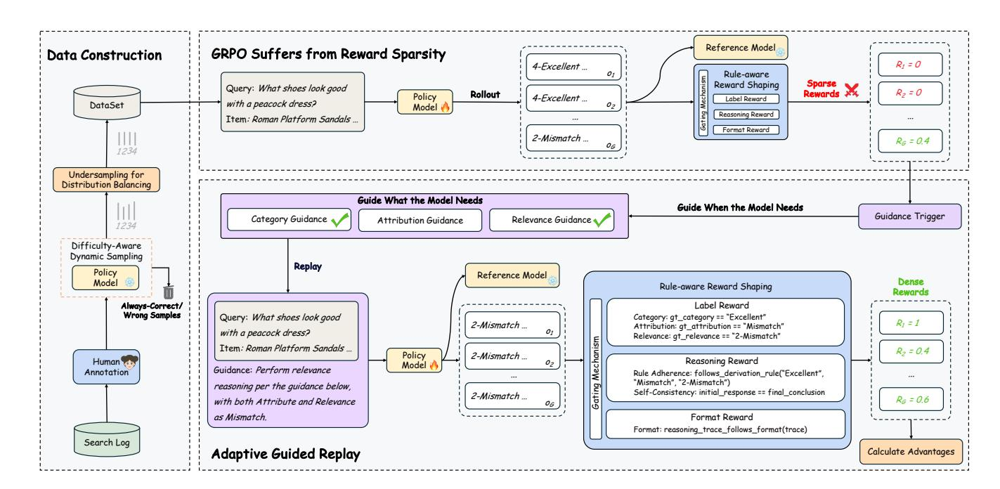
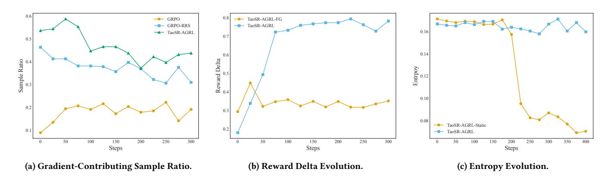

# TaoSR-AGRL: Adaptive Guided Reinforcement Learning Framework for E-commerce Search Relevance

[Jianhui Yang](https://orcid.org/0009-0004-3547-0472)∗ yangjh23@mails.tsinghua.edu.cn Tsinghua University Beijing, China Taobao & Tmall Group of Alibaba Beijing, China

[Yiming Jin](https://orcid.org/0009-0002-1786-0894)∗† enxian@alibaba-inc.com Taobao & Tmall Group of Alibaba Hangzhou, China

[Pengkun Jiao](https://orcid.org/0009-0007-0542-3482) pkjiao23@m.fudan.edu.cn Fudan University Shanghai, China Taobao & Tmall Group of Alibaba Hangzhou, China

[Chenhe Dong](https://orcid.org/0000-0002-2211-5138) dongchenhe.dch@alibaba-inc.com Taobao & Tmall Group of Alibaba Hangzhou, China

[Zerui Huang](https://orcid.org/0009-0000-6354-9242) huangzerui.hzr@taobao.com Taobao & Tmall Group of Alibaba Hangzhou, China

[Shaowei Yao](https://orcid.org/0009-0002-3216-7414) yaoshaowei@taobao.com Taobao & Tmall Group of Alibaba Hangzhou, China

[Xiaojiang Zhou](https://orcid.org/0009-0005-1927-6167) zxjbupt@163.com Taobao & Tmall Group of Alibaba Beijing, China

[Dan Ou](https://orcid.org/0009-0009-9838-5343) oudan.od@taobao.com Taobao & Tmall Group of Alibaba Hangzhou, China

[Haihong Tang](https://orcid.org/0000-0002-7103-975X) piaoxue@taobao.com Taobao & Tmall Group of Alibaba Hangzhou, China

# Abstract

Query-product relevance prediction is fundamental to e-commerce search and has become even more critical in the era of AI-powered shopping, where semantic understanding and complex reasoning directly shape the user experience and exert an indirect, yet substantial impact on business conversion. Large Language Models (LLMs) enable generative, reasoning-based approaches, typically aligned via supervised fine-tuning (SFT) or preference optimization methods like Direct Preference Optimization (DPO). However, the increasing complexity of business rules and user queries exposes the inability of existing methods to endow models with robust reasoning capacity for long-tail and challenging cases. Efforts to address this via reinforcement learning strategies like Group Relative Policy Optimization (GRPO) often suffer from sparse terminal rewards, offering insufficient guidance for multi-step reasoning, which in turn slows convergence.

To address these challenges, we propose TaoSR-AGRL, an Adaptive Guided Reinforcement Learning framework for LLM-based relevance prediction in Taobao Search Relevance. TaoSR-AGRL introduces two key innovations: (1) Rule-aware Reward Shaping, which decomposes the final relevance judgment into dense, structured rewards aligned with domain-specific relevance criteria; and (2) Adaptive Guided Replay, which identifies low-accuracy rollouts during training and injects targeted ground-truth guidance to steer the policy away from stagnant, rule-violating reasoning patterns toward compliant trajectories.

[This work is licensed under a Creative Commons Attribution 4.0 International License.](https://creativecommons.org/licenses/by/4.0)

WWW '26, Dubai, United Arab Emirates. © 2026 Copyright held by the owner/author(s). ACM ISBN 979-8-4007-2307-0/2026/04 <https://doi.org/10.1145/3774904.3792799>

TaoSR-AGRL was evaluated on large-scale datasets and through online evaluations on Taobao Search. It consistently outperforms DPO and GRPO baselines, improving relevance accuracy and rule adherence, with measurable gains in user engagement and stable training dynamics. The model has been deployed on Taobao, serving hundreds of millions of users.

# CCS Concepts

• Information systems → Language models; • Computing methodologies → Natural language processing.

# Keywords

E-commerce Relevance Search, Large Language Models, Reinforcement Learning, Reward Sparsity

#### ACM Reference Format:

Jianhui Yang, Yiming Jin, Pengkun Jiao, Chenhe Dong, Zerui Huang, Shaowei Yao, Xiaojiang Zhou, Dan Ou, and Haihong Tang. 2026. TaoSR-AGRL: Adaptive Guided Reinforcement Learning Framework for E-commerce Search Relevance. In Proceedings of the ACM Web Conference 2026 (WWW '26), April 13–17, 2026, Dubai, United Arab Emirates. ACM, New York, NY, USA, [12](#page-11-0) pages.<https://doi.org/10.1145/3774904.3792799>

# 1 Introduction

In modern e-commerce platforms like Taobao and Amazon, the core task of a search system is to efficiently retrieve and return a highly relevant set of products based on a user's query. Relevance prediction, which quantifies the match between a query and product features, is crucial for both the recall and ranking stages. As e-commerce search shifts towards an AI-powered paradigm focused on semantic understanding and complex reasoning, the importance of relevance prediction is further amplified. Accurate, interpretable, and controllable relevance predictions are becoming the cornerstone of intelligent product retrieval.

∗Equal contribution.

†Corresponding author.

Figure 1: Overview of the proposed TaoSR-AGRL for e-commerce search relevance. (1) Data Construction builds a balanced and challenging dataset. (2) Rule-aware Reward Shaping decomposes sparse final rewards into dense, structured signals covering key reasoning steps to ensure faithful and interpretable reasoning. (3) Adaptive Guided Replay selectively replays low-reward, hard samples with targeted guidance to explore higher-value reasoning trajectories.

Coinciding with this paradigm shift, both e-commerce queries and relevance rule systems are becoming significantly more complex. On one hand, user queries are becoming more open-ended and diverse, such as "what tea can I drink for a sore throat" or "snacks suitable for eating in a car". On the other hand, the platform's relevance rules are increasingly fine-grained and structured. For instance, searching for "sugared tangerine" and getting "dried sugared tangerine" is rated as 3-Related, while searching for "cranberry" and getting "dried cranberry" is rated as 4-Excellent. These new types of queries demand that models possess rich e-commerce knowledge, the ability to strictly adhere to rules, and multi-step logical reasoning capabilities, posing substantial challenges to traditional search relevance systems.

Large Language Models (LLMs)[\[7,](#page-8-0) [12,](#page-8-1) [40\]](#page-9-0) have demonstrated remarkable reasoning capabilities in complex domains like math[\[14,](#page-8-2) [20,](#page-8-3) [43\]](#page-9-1) and code generation[\[17,](#page-8-4) [30\]](#page-8-5). This has inspired their application to e-commerce search relevance, where methods like Supervised Fine-tuning (SFT) and Direct Preference Optimization (DPO)[\[28\]](#page-8-6) are used to frame the task as a generative reasoning problem. However, these approaches often exhibit poor generalization on novel, reasoning-intensive long-tail samples, as they primarily learn to mimic patterns within the training distribution rather than acquiring robust, generalizable reasoning ability. To overcome these limitations in generalization and exploration, advanced reinforcement learning (RL) strategies like Group Relative Policy Optimization (GRPO)[\[31\]](#page-8-7) represent a promising direction. Yet, when applied to our context, their effectiveness is severely

undermined by the critical challenge of reward sparsity[\[6,](#page-8-8) [8,](#page-8-9) [11\]](#page-8-10). This problem reflects both the intrinsic difficulty of the task and the suboptimal policy initialization: complex long-tail queries demand long, precise chains of reasoning under multiple constraints, making rewarding trajectories inherently rare and difficult to discover; meanwhile, the over-specialization induced by SFT or DPO yields a rigid, narrow exploratory prior, drastically reducing the already low probability of reaching valid reasoning paths. The confluence of these factors leads to exploration stagnation, ultimately crippling both training efficiency and model robustness on challenging unseen instances.

To address the aforementioned issues, we propose an Adaptive Guided Reinforcement Learning Framework in Taobao Search Relevance (TaoSR-AGRL), a reinforcement learning framework for e-commerce relevance search. Its core idea is to alleviate the exploration bottleneck on hard, long-tail samples and enhance the model's reasoning abilities through rule-aware, fine-grained reward shaping and adaptive guided trajectory resampling. TaoSR-AGRL introduces two key modules. First, Rule-aware Reward Shaping transforms the complex rule-following process into a decomposed, weighted, multi-dimensional reward signal. By explicitly modeling dimensions such as label accuracy, reasoning logic, and formatting constraints, it converts the sparse, binary objective into a dense signal that guides faithful reasoning. Second, Adaptive Guided Replay implements a corrective replay mechanism for samples where the initial rollout fails to produce valid reasoning trajectories. This mechanism identifies the model's weaknesses revealed by Ruleaware Reward Shaping and uses the corresponding ground-truth labels as guidance to perform a second rollout, helping the model explore higher-value reasoning trajectories.

We conduct our research on top of our previous work TaoSR1[\[10\]](#page-8-11), using a proprietary relevance-focused large model, TbStar, as the base model. It employs a Mixture-of-Experts (MoE) architecture with 42 billion total parameters and 3.5 billion activated parameters. We construct a test set containing four types of challenging queries to systematically evaluate TaoSR-AGRL. Offline experiments demonstrate that TaoSR-AGRL significantly outperforms baseline methods such as DPO, and GRPO. Furthermore, both online side-by-side human evaluations and A/B testing demonstrate that the framework achieves consistent improvements in retrieval relevance and user engagement in real-world business scenarios. Experiments and ablation studies confirm the effectiveness of Ruleaware Reward Shaping and Adaptive Guided Replay in mitigating reward sparsity on long-tail samples and enhancing the model's reasoning capabilities. The resulting model has been deployed on Taobao, delivering significant business benefits. The main contributions of this paper are as follows:

- We propose TaoSR-AGRL, an adaptive guided reinforcement learning framework in Taobao Search Relevance. With Ruleaware Reward Shaping and Adaptive Guided Replay, it effectively alleviates the problems of reward sparsity and exploration stagnation on hard, long-tail samples.
- Through comprehensive offline and online experiments, we systematically validate the effectiveness and robustness of TaoSR-AGRL. The resulting model has been successfully deployed on Taobao, further demonstrating the practical value of our method in an industrial setting.
- To the best of our knowledge, this is the first work to conduct an in-depth exploration and systematic optimization of reinforcement learning for enhancing LLM reasoning in a large-scale, industrial e-commerce relevance scenarios. It provides a valuable practical example for future research and application in related fields.

# 2 Related Works

# 2.1 Search Relevance

The modeling of search relevance has evolved from classical statistical models like TF-IDF [\[1\]](#page-8-12) and BM25 [\[34\]](#page-8-13), which rely on lexical matching, to the Learning to Rank (LTR) paradigm. LTR introduced models such as RankNet [\[3\]](#page-8-14) and LambdaMART [\[4\]](#page-8-15), shifting from handcrafted functions to machine-learned optimization of IR metrics. The deep learning era emphasized semantic understanding over lexical overlap. After initial efforts with shallow networks like DSSM [\[16\]](#page-8-16), the Transformer architecture [\[37\]](#page-8-17) and pre-trained models like BERT [\[9\]](#page-8-18) established two dominant architectural patterns: the efficient bi-encoder for scalable retrieval [\[19\]](#page-8-19) and the high-precision cross-encoder for re-ranking [\[24\]](#page-8-20), presenting distinct approaches to balance computational efficiency with model effectiveness. More recently, Large Language Models (LLMs) have initiated a paradigm shift, proposing a complementary perspective that frames relevance not merely as a matching problem, but as a reasoning task. Frameworks like LREF [\[35\]](#page-8-21) and TaoSR1 [\[10\]](#page-8-11) prompt

LLMs to reason about e-commerce relevance, leveraging modern alignment techniques such as SFT, DPO [\[28\]](#page-8-6), and GRPO [\[31\]](#page-8-7). Despite their power, a critical limitation remains: reward sparsity [\[44\]](#page-9-2). This issue is particularly acute in e-commerce search, as extensive alignment (SFT, DPO) for this singular task can over-specialize the model, constraining the exploratory capacity needed for GRPO to navigate the long-tail distribution. Our work, TaoSR-AGRL, introduces a novel optimization paradigm to specifically address this gap.

# 2.2 RLVR for LLM Reasoning

The paradigm for enhancing complex reasoning in Large Language Models (LLMs) has transitioned from Supervised Fine-Tuning (SFT) to Reinforcement Learning (RL). SFT excels at mimicking demonstrations but suffers from exposure bias and limited generalization [\[2,](#page-8-22) [5\]](#page-8-23). In contrast, RL fosters superior generalization and exploration through direct environmental feedback [\[46\]](#page-9-3). A key development is Reinforcement Learning from Verifiable Rewards (RLVR), which underpins frontier models like OpenAI-o1 [\[26\]](#page-8-24) and DeepSeek-R1 [\[7\]](#page-8-0). Algorithms such as GRPO use simple, outcome-based rewards to improve reasoning [\[42\]](#page-9-4). However, the efficacy of such methods is substantially limited in long-horizon tasks due to reward sparsity [\[22,](#page-8-25) [27,](#page-8-26) [36\]](#page-8-27). The low probability of discovering a correct solution through random exploration in such problems renders credit assignment highly challenging and hinders learning efficiency.

To address reward sparsity, prior work has explored two main avenues. The first, process supervision, densifies rewards by crediting intermediate steps. This is achieved by training Process Reward Models (PRMs) [\[21,](#page-8-28) [25,](#page-8-29) [39\]](#page-9-5) or using an "LLM-as-a-Judge" [\[15,](#page-8-30) [29\]](#page-8-31), though the latter can face robustness and consistency issues [\[13\]](#page-8-32). The second avenue, external guidance, simplifies the learning task via hints from a superior LLM [\[23,](#page-8-33) [47\]](#page-9-6) or partial reasoning trajectories [\[45\]](#page-9-7). Both strategies, however, incur significant computational overhead or rely on external "oracle" models. In contrast, our work differs by introducing a lightweight, on-demand guidance mechanism. It provides targeted assistance only when needed, eliminating external dependencies and fostering autonomous, efficient learning with minimal computational cost.

# 3 Methods

The e-commerce search relevance task is modeled as a four-class classification problem: 1-Irrelevant, 2-Mismatch, 3-Related and 4- Excellent. Consistent with TaoSR1, the relevance model takes the user query and the item's textual features as input. It outputs a reasoning trajectory in a "respond-then-think" format, where the relevance label is placed at the beginning of the trajectory to mitigate the effects of error accumulation. Specifically, the model first directly predicts the relevance level for the target task and then generates a complete Chain-of-Thought (CoT) reasoning path to explain the basis for its prediction. The CoT adheres to a predefined reasoning pattern, sequentially deducing the category and attribute levels before determining the final relevance level in accordance with the relevance derivation rules. As e-commerce search transitions towards an AI-powered paradigm, both user queries and rule systems are increasing in complexity. This shift gives rise to

challenging long-tail instances that require advanced reasoning to resolve.

To tackle these cases, we propose TaoSR-AGRL, a reinforcement learning framework for relevance search. The framework comprises two key modules: (1) Rule-aware Reward Shaping, which delivers fine-grained reward signals along the model's reasoning trajectory based on domain-specific relevance criteria, thereby supervising faithful reasoning; and (2) Adaptive Guided Replay, which leverages instance-specific ground-truth labels as precise guidance to resample trajectories for low-accuracy cases, enabling the model to prune the action space and explore higher-value reasoning paths. The objective function of TaoSR-AGRL is formulated as follows:

LTaoSR−AGRL (��) = E(��,��)∼D (1) " 1 �� ∑︁�� ��=1 1 |���� |���� ∑︁ ��=1 min ����,�� (��) ��ˆ ��,��, clip ����,�� (��), 1 − ��, 1 + �� ��ˆ ��,�� −����KL (���� ∥��ref)] s.t. 0 &lt; |{���� | is\_equivalent(��, ����)}| &lt; �� (2)

where:

(���� , ����) = ���� (· | ��), ��(0) , if mean {�� (0) } �� ��=1 > ��, ���� (· | ��, G (��, ��)), ��(rp) , otherwise, ����,�� (��) ≜ ���� ����,�� | ��, ����,<�� ����old ����,�� | ��, ����,<�� , ��ˆ ��,�� ≜ ���� − mean {���� } �� ��=1 std {���� } �� ��=1 . (3)

Here, �� (0) �� and �� (����) �� denote the rewards from the unguided generation and the guided replay, respectively. G (��, ��) represents the targeted guidance, and �� is the guidance trigger threshold. As illustrated in Figure [1,](#page-1-0) by adaptively deploying the guidance G (��, ��) for low-reward batches, the model is compelled to learn from expert reasoning. This process enables the discovery of high-value reasoning trajectories, ultimately fostering self-consistent reasoning on challenging long-tail samples.

# 3.1 Data Construction

To train a robust relevance model for complex, real-world scenarios, we constructed a large-scale, high-quality training dataset sourced from user search logs on Taobao. Recognizing that the raw log data suffers from class imbalance, significant noise, and a scarcity of challenging samples, we designed and implemented a sophisticated three-stage data sampling pipeline.

Initial Filtering and Human Annotation. We first identify four challenging query categories on which existing models perform poorly: negation, affordable alternatives, question-answering (Q&A), and knowledge-based queries. These initially filtered query logs were then submitted to a professional annotation team for finegrained annotation based on the query-item relevance. The output of this process is formalized as tuples of <query, item, label\_category, label\_attribute, label\_relevance>.

Difficulty-Aware Dynamic Sampling. To prioritize hard cases that provide the most informative training signal, we adopt a Difficulty-Aware Dynamic Sampling strategy, following the general principle

in [\[41\]](#page-9-8). The base model performs multiple rounds of offline prediction over the training dataset, generating diverse predicted trajectories for each instance. Samples that are consistently predicted entirely incorrectly are then subjected to manual inspection, which reveals that their annotation accuracy is considerably low, indicating a substantial level of label noise in this subset. Therefore, our sampling process is designed to remove samples predicted either perfectly correctly or consistently completely incorrectly, as these extreme cases tend to be dominated by label noise or trivial patterns. The retained subset thus consists of medium-difficulty instances, which strike a balance between informativeness and annotation reliability, and are most effective for improving the model's reasoning capacity.

Undersampling for Distribution Balancing. To mitigate the issue of skewed distribution across different relevance levels, we apply undersampling to the high-frequency classes. This process ultimately creates a dataset that is relatively balanced across all relevance levels, providing a more stable and generalizable sample structure for model training.

#### 3.2 Rule-aware Reward Shaping

The fidelity of the intermediate Chain-of-Thought (CoT) is paramount for robust reasoning. However, a critical challenge arises as the aggregation mechanism of derivation rules often masks underlying errors. Consider an instance where the ground truth reasoning involves identifying the category as Related and the attribute as Irrelevant. Under standard protocols, this combination maps to a final 2-Mismatch label. A flawed model, however, might correctly classify the category as Related while erroneously labeling the attribute as Mismatch. Crucially, despite this intermediate hallucination, the derivation logic still produces the correct final label. When the model is optimized solely on the reward from this final outcome, it is incentivized to find such shortcuts rather than master the correct reasoning process. This is a classic case of reward hacking[\[32\]](#page-8-34), yielding two severe consequences. First, it causes impaired generalization because the model fails to learn the genuine reasoning logic, rendering it brittle against out-of-distribution query-item pairs. Second, it leads to reduced trustworthiness and interpretability, as low-quality reasoning chains hinder error attribution and decision traceability in practical applications.

To address these issues, we propose Rule-aware Reward Shaping. Its core idea is to decompose the single, sparse final reward signal into a dense, composite reward that provides fine-grained, multi-dimensional supervision across the entire reasoning chain. More generally, this realizes a transferable principle for rule-driven hierarchical decision tasks, where a final decision is composed from intermediate sub-decisions via explicit rules. In such settings, shaping rewards at each level enables precise credit assignment and discourages shortcut behaviors that exploit rule aggregation. This design ensures that the model not only produces the correct output but also follows a faithful and interpretable reasoning path. Specifically, we formulate the total reward via three orthogonal components:

- Label Reward: This component enforces the factual faithfulness of the reasoning chain by anchoring deductions to ground truth. It provides fine-grained supervision for the

alignment of predicted category, attribute, and relevance labels, ensuring the final conclusion is factually sound.

- Reasoning Reward: This component enforces the logical faithfulness of the reasoning process, independent of label correctness. It comprises two sub-mechanisms: (1) Rule Adherence, which penalizes step-wise deductions that violate predefined derivation rules; and (2) Self-Consistency, which verifies that the final derived conclusion aligns with the initially generated prediction.
- Format Reward: This component enforces the structural faithfulness of the output, preserving syntactic integrity. It functions as a binary gating signal, yielding a positive reward solely when the generated CoT strictly adheres to the required schema, thereby filtering out malformed sequences.

To prevent the model from earning unearned rewards on flawed or invalid trajectories, we introduce a validity gating mechanism. This gate acts as a prerequisite for all fine-grained rewards, ensuring that credit is only assigned to reasoning paths that meet two fundamental criteria: structural integrity (correct format) and conclusive correctness (correct final relevance). This design establishes a natural curriculum learning[\[33\]](#page-8-35). The model is first compelled to master the primary task of generating well-formed and correct final answers. Only after achieving this baseline competence does it receive the detailed, step-by-step guidance necessary to refine the faithfulness of its internal reasoning process. This staged approach efficiently channels the model's learning, preventing it from getting lost optimizing flawed logic. This principle is formalized in our final reward function ��:

�� = IGate · (��cate · ��cate + ��attr · ��attr + ��reason · ��reason) (4)

where:

IGate = ( 1, if ��rele = 1 ∧ ��format = 1, 0, otherwise. (5)

Here, ��label is comprised of three fine-grained rewards: ��cate, ��attr, and ��rele, which assess the correctness of the predicted category, attribute, and final relevance labels, respectively. The gate's state depends on ��rele and ��format, which are the binary rewards for the final relevance and format correctness, respectively. The terms ��(· ) are hyperparameter weights that balance the contributions of the different reward components, providing the flexibility to tailor the training objective by adjusting the emphasis on different facets of the reasoning chain.

### 3.3 Adaptive Guided Replay

While Rule-aware Reward Shaping provides fine-grained feedback, reward sparsity remains a significant challenge, particularly for novel, long-tail queries involving composite rules. This issue is best illustrated by the asymmetry in e-commerce search rules. For instance, a cashmere clothing item is rated 4-Excellent only if its cashmere content exceeds 50%, whereas for chiffon, mere presence suffices. Such composite, asymmetric constraints demand multistep, fine-grained reasoning, yet models refined via SFT or DPO typically exhibit contracted action spaces and limited exploration. Consequently, when an LLM outputs the correct final label without articulating the intermediate logic, it receives no credit for

critical sub-tasks. The resulting learning signal becomes sparse precisely where reasoning is most demanding, thereby degrading credit assignment and hindering convergence on complex e-commerce rules.

To mitigate this issue, we propose an innovative mechanism called Adaptive Guided Replay (AGR). The core idea of this mechanism is to dynamically provide precise guidance during the training rollout phase, based on the model's immediate needs and specific weaknesses. This ensures that the model can learn efficiently from the most difficult and error-prone samples.

Guide When the Model Needs. To focus limited computational resources on the hard samples that the model most needs to learn from, we first determine when to provide guidance. We hypothesize that samples with low rewards correspond to areas where the model's capabilities are lacking. Specifically, for any sample �� in a training batch, we first allow the model to generate an initial result without guidance and calculate its rule-aware reward ��(��). When ��(��) falls below a guidance trigger threshold ��, we identify it as a sparse-reward sample and initiate the guidance process for it. This way, for "easy samples" that the model has already mastered, we avoid the overhead of unnecessary guidance and re-computation, thereby significantly improving overall training efficiency.

Guide What the Model Needs. To prevent the model from engaging in reward hacking or degrading its reasoning abilities when given complete answers, we adopt a "minimal sufficient guidance" strategy. AGR operationalizes this by performing a fine-grained, ondemand diagnosis. Leveraging the multi-dimensional signals from our rule-aware reward, AGR first calculates the in-batch average reward for each dimension (e.g., category, attribute, and relevance) and compares it against a guidance trigger threshold ��. For any dimension where the reward falls below this threshold, AGR generates targeted guidance G (��, ��) for the selected sparse-reward samples (��, ��). This guidance is then formatted into a text prompt and appended to the original input �� (��) to form an augmented prompt �� ′ (��). The model performs a "guided replay" by regenerating its output based on �� ′ (��), allowing it to explore higher-reward reasoning trajectories and fill gaps in its understanding of finegrained discriminative logic. This dimension-specific intervention effectively mitigates reward sparsity while preserving the model's autonomous reasoning process and suppressing reward hacking.

#### 4 Experiments

### 4.1 Experimental Setup

Dataset and Evaluation Metrics. The dataset was sampled from the online search logs of Taobao. To comprehensively evaluate the model's performance in complex semantic scenarios, we selected four challenging query categories: negation, affordable alternatives, question-answering (Q&A), and knowledge-based queries. The training data was obtained through the three-stage filtering process described in Section [3.1.](#page-3-0) In the initial filtering stage, millions of samples were selected from the raw logs. Subsequently, using Difficulty-Aware Dynamic Sampling, we removed samples that were either all correct or all incorrect, resulting in hundreds of thousands of samples. From this, we further applied Undersampling

Table 1: Main results on the Balanced Eval Set and In-the-Wild Eval Set.

| Method     | Class-1 | Class-2 | Class-3 Balanced | Class-4 Eval Set | Good F1 | Macro F1 | Accuracy |
|------------|---------|---------|------------------|------------------|---------|----------|----------|
| TbStar-DPO | 69.30   | 72.86   | 44.50            | 83.04            | 86.02   | 67.43    | 76.94    |
| GRPO       | 69.80   | 72.50   | 49.13            | 83.85            | 85.97   | 68.82    | 77.74    |
| GRPO-PR    | 69.88   | 73.29   | 47.11            | 83.63            | 86.16   | 68.48    | 77.64    |
| TaoSR-AGRL | 70.19   | 73.63   | 49.28            | 83.94            | 86.18   | 69.26    | 78.03    |
|            |         |         | In-the-Wild      | Eval             | Set     |          |          |
| TbStar-DPO | 44.49   | 63.26   | 45.95            | 82.59            | 86.38   | 59.07    | 73.70    |
| GRPO       | 45.41   | 62.95   | 45.93            | 82.72            | 86.49   | 59.25    | 73.83    |
| GRPO-PR    | 45.49   | 63.56   | 45.08            | 82.76            | 86.59   | 59.22    | 73.95    |
| TaoSR-AGRL | 52.77   | 64.34   | 46.22            | 82.79            | 86.60   | 61.53    | 74.28    |

for Distribution Balancing to adjust the proportions of different relevance levels, ultimately yielding a training set of tens of thousands of samples.

To more comprehensively assess model performance, we constructed two test sets with different distributions. The Balanced Eval Set (B-Eval) maintains a relatively balanced ratio across four query categories. It is designed to validate the model's performance on a balanced sample distribution. The In-the-Wild Eval Set (W-Eval) has a label distribution that approximates the real online environment and is used to examine the model's robustness and generalization capabilities in practical business scenarios.

For offline evaluation, we report per-class F1 for Class-1 (1- Irrelevant), Class-2 (2-Mismatch), Class-3 (3-Related), and Class-4 (4-Excellent), along with Good F1, Macro F1, and Accuracy. Specifically, Good F1 is computed by collapsing Class-3 and Class-4 into a single Good category. This aligns our evaluation protocol with the online business objective, where these high-relevance levels are treated as a unified Good Tier. To validate the real-world impact of our model beyond offline metrics, we conducted online side-by-side human evaluations. This rigorous process is designed to capture user-facing performance differences by directly assessing model outputs on three principal metrics:

- Good/Same/Bad (GSB): This metric quantifies the relative performance gain of our model via a pairwise comparison. For the same query, human annotators are presented with two Search Engine Result Pages (SERPs) side-by-side—one from our model and one from the baseline—and label our model's result as Good (superior), Same (equivalent), or Bad (inferior). A GSB score of +��% signifies that our model produced a superior SERP for ��% more queries compared to the baseline.
- Query Goodrate: This is a holistic, SERP-level metric assessing the absolute quality of search results. Annotators classify the overall utility of an entire SERP into Good, Mid, or Bad tiers. The final metric is the percentage of queries whose SERPs are judged as either Good or Mid, providing a high-level measure of user satisfaction per query.
- Item Goodrate: This item-level metric measures the density of highly relevant content on a SERP. It is defined as the proportion of items rated as highly relevant (i.e., 4-Excellent

or 3-Related). The final score is computed by averaging this proportion across all evaluated queries, offering a granular assessment of absolute performance at the item level.

Implementation Details. All experiments related to TaoSR-AGRL were implemented based on the open-source reinforcement learning framework ROLL[\[38\]](#page-8-36). We used a training batch size of 64, a maximum input length of 2048, and a maximum generation length of 4096. The learning rate was set to 1e-6, with 16 gradient accumulation steps. For each input sample, 16 candidate responses were generated using a sampling temperature of 0.99 and a top-k of 100. For difficulty filtering, an online difficulty threshold range of [0.01, 0.9] was used. To enhance training stability, the PPO clipping range was set to 1 ± 0.2, value function clipping to 0.5, and Advantage value clipping to ±2.0. The guidance trigger threshold �� was 0.1, and the hyperparameter weights ��cate, ��attr, and ��reasoning were set to 0.4, 0.4, and 0.2 through preliminary experiments to balance different reward components effectively.

# 4.2 Baselines

For a fair comparison, all methods are benchmarked on the TbStar-DPO backbone. We chose this DPO-aligned model over its conventional SFT counterpart, as our preliminary experiments indicated it establishes a higher performance ceiling, thus providing a more robust evaluation baseline. TbStar is Taobao's proprietary e-commerce MoE model (42B total/3.5B active parameters) with strong domain coverage. We evaluate TaoSR-AGRL against the following representative baselines:

- GRPO: A leading critic-free reinforcement learning algorithm that computes advantages using intra-group relative rewards.We used it for a third stage of training on top of TbStar-DPO to enhance the model's reasoning capabilities.
- GRPO-PR: This baseline adapts GRPO by augmenting its outcome-based reward with process-level supervision. The total reward is thus formulated as a carefully calibrated weighted sum of relevance, category, and attribute correctness. The coefficients were optimized through an extensive hyperparameter search, resulting in the following reward function:

�������������� = 0.4 · ��rele + 0.3 · ��cate + 0.3 · ��attr (6)

- TaoSR-AGRL: Our full proposed method, which integrates Rule-aware Reward Shaping with the Adaptive Guided Replay mechanism to optimize reasoning on complex queries.

#### 4.3 Offline Evaluation

The main offline evaluation results are presented in Table [1.](#page-5-0) A key finding is that while the standard GRPO algorithm provides some improvement over the DPO-finetuned TbStar model, it quickly hits a performance bottleneck in complex e-commerce search scenarios. On the W-Eval dataset, GRPO and its variant GRPO-PR only achieve a marginal Macro-F1 improvement of 0.2 pt over TbStar-DPO.

In contrast, TaoSR-AGRL successfully breaks through this performance ceiling, achieving new state-of-the-art results on both test sets. On the B-Eval, TaoSR-AGRL achieves a Macro-F1 score of 69.26. Although TaoSR-AGRL was trained on a class-balanced dataset, it demonstrates a more significant advantage on the W-Eval, which mirrors the real-world online distribution. Its Macro-F1 score reaches 61.53, widening the gap with the next-best baseline to 2.28 pt and showcasing strong robustness. Notably, Class-1 improves by 7.28 pt, indicating more calibrated rejection, reduced over-matching, and better class-boundary separation under distribution shift—thereby validating the effectiveness of the framework.

# 4.4 Ablation Study

We conducted a series of ablation studies on the W-Eval benchmark to systematically analyze the performance contributions of each component in TaoSR-AGRL. The main results are summarized in Table [2.](#page-7-0) In our analysis, the suffix -RRS denotes the variant equipped with Rule-aware Reward Shaping. The suffix -FG (Fixed Guidance) denotes a special case of our Adaptive Guided Replay where the guidance is fixed to the ground-truth relevance labels.

Synergy of Gating and Reasoning Rewards. To validate the design of Rule-aware Reward Shaping, we ablated its two pillars: the validity gate and the reasoning reward (��reason). Beyond end-task metrics, we use the Rule Adherence Rate (RAR) to measure if the model's reasoning is faithful to its own intermediate steps. Ablating the hard validity gate—either by removing or softening it—introduces reward leakage into invalid trajectories. This not only degrades end-task performance but also lowers RAR, thereby confirming that a strict gate is essential for providing a clean, focused training signal. More critically, removing ��reason causes a steep decline in RAR while leaving end-task metrics largely intact. This result provides clear evidence of reward hacking: the model learns to find the correct answer via logically flawed shortcuts. This demonstrates the synergy between our components: the hard gate ensures learning is confined to successful outcomes, while ��reason ensures the reasoning process leading to those outcomes is logically sound and faithful. A detailed breakdown of these ablations is available in Appendix [A.](#page-10-0)

Impact of Adaptive Guidance on Sample Efficiency. The effectiveness of GRPO relies on sampling correct reasoning paths. However, for a monolithic task like relevance search, where the entire reasoning process yields a single outcome, models fine-tuned with SFT and DPO often exhibit a limited exploration space. This policy confinement severely restricts the gradient-contributing sample

ratio, as many trajectories contain spurious reasoning steps despite reaching the correct final answer. GRPO-RRS validates this by significantly increasing the ratio of gradient-contributing samples, exposing a high prevalence of such "false positives" in the baseline. Building on this, TaoSR-AGRL further enhances this ratio, as shown in Figure [2a.](#page-7-1) We attribute this to the adaptive guidance replay mechanism, which specifically identifies and provides targeted assistance on challenging instances that the model would otherwise fail on, thereby steering exploration towards more productive reasoning pathways and boosting sample efficiency.

Effectiveness of Adaptive Guidance. To isolate the benefit of the adaptive guidance mechanism, we implement TaoSR-AGRL-FG, a variant with ground relevance label as guidance. As reported in Figure [2b,](#page-7-1) TaoSR-AGRL achieves a significantly higher reward delta within the same training duration. This finding highlights that our adaptive guidance, tailored to the model's evolving weaknesses, is markedly more effective at targeting and rectifying "reasoning blind spots". Consequently, this targeted adaptation accelerates convergence and enhances performance in complex inference scenarios.

Preservation of Policy Entropy. In reinforcement learning, policy entropy is a critical measure of exploration. High entropy is essential for deep reasoning tasks, as it encourages the model to explore a diverse set of inferential strategies. We compare TaoSR-AGRL against TaoSR-AGRL-Static, a variant that applies guidance indiscriminately to all samples. As illustrated in Figure [2c,](#page-7-1) TaoSR-AGRL consistently maintains a higher policy entropy. This suggests that excessive or non-adaptive guidance can lead to policy collapse[\[18\]](#page-8-37): the model becomes overly reliant on the guidance, causing its output distribution to become over-confident and collapse into a narrow set of familiar responses. This dependency ultimately stifles the model's exploratory capabilities and impairs its ability to generalize.

Impact of the Replay Trigger Threshold ��. To determine the optimal frequency of intervention, we analyze the model's overall performance across different values of the replay trigger threshold ��. As detailed in Appendix [B,](#page-10-1) performance peaks at �� = 0.1. This result highlights a fundamental trade-off between corrective intervention and policy autonomy. A low�� provides insufficient correction for challenging instances, hindering learning. Conversely, a high �� leads to over-reliance on external guidance, risking the policy collapse discussed previously. This over-reliance can impair the model's intrinsic reasoning ability, even on simpler tasks.

# 4.5 Online Evaluation

We validated real-world effectiveness via large-scale online sideby-side human evaluations in production. TaoSR1 served as the baseline bucket and TaoSR-AGRL as the test bucket. We sampled 2,000 authentic user queries and compared the top-10 retrieved results from both buckets in an item-level head-to-head comparison. As shown in Table [3,](#page-7-2) TaoSR-AGRL consistently outperformed the baseline bucket, achieving average gains of +7.11% in GSB, +1.74 pt in Query Goodrate, and +3.74 pt in Item Goodrate. Improvements are most pronounced for reasoning-intensive traffic (e.g., Q&A and knowledge-based queries), indicating that the proposed model

Figure 2: Ablation on training dynamics: Compared to its variants, TaoSR-AGRL exhibits (a) higher sample efficiency, (b) greater reward delta, and (c) stable policy entropy preservation, effectively preventing collapse.

Table 2: Ablation study results on the In-the-Wild evaluation set.

| Method        | Class-1 | Class-2 | Class-3 | Class-4 | Good F1 | Macro F1 | Accuracy |
|---------------|---------|---------|---------|---------|---------|----------|----------|
| GRPO          | 45.41   | 62.95   | 45.93   | 82.72   | 86.49   | 59.25    | 73.83    |
| GRPO-RRS      | 46.01   | 63.79   | 45.29   | 82.79   | 86.55   | 59.47    | 74.08    |
| GRPO-FG       | 48.34   | 64.02   | 43.32   | 82.72   | 86.42   | 59.60    | 74.01    |
| TaoSR-AGRL-FG | 51.28   | 62.77   | 45.79   | 81.22   | 85.42   | 60.00    | 72.41    |
| TaoSR-AGRL    | 52.77   | 64.34   | 46.22   | 82.79   | 86.60   | 61.53    | 74.28    |

Table 3: Online side-by-side human evaluations.

| Category    | GSB     | Query | Goodrate | Item  | Goodrate |
|-------------|---------|-------|----------|-------|----------|
| Q&A         | +10.57% | +3.49 | pt       | +4.85 | pt       |
| Alternative | +5.08%  | +0.76 | pt       | +2.85 | pt       |
| Negative    | +2.14%  | +0.55 | pt       | +3.64 | pt       |
| Knowledge   | +10.66% | +2.14 | pt       | +3.63 | pt       |

effectively integrates e-commerce domain knowledge with ruledriven reasoning to better resolve complex user intent and specific constraints.

To ensure production readiness for high-throughput serving, we implemented engineering optimizations targeting stable response under load, improved resource utilization, and reduced end-to-end latency. Specifically, we optimized model-level load balancing to mitigate traffic skew, reduced cross-datacenter scheduling overhead to lower tail latency, and applied model quantization to accelerate inference while maintaining ranking quality. With these optimizations, Model FLOPs Utilization (MFU) increased to 35% during training, and the P99 tail latency was reduced to ≤ 400 ms, enabling reliable large-scale inference.

Despite the relevance gains verified by human evaluation, an initial online deployment revealed a slight degradation in critical business metrics (e.g., orders and GMV). Root-cause analysis traced this issue to the upstream recall stage, which disproportionately retrieved items with strong semantic matching but low sales velocity, thereby reducing conversion efficiency. This observation highlights a common trade-off in e-commerce search: optimizing

recall purely for semantic relevance can suppress commercially competitive items whose textual matches are less explicit.

To address this misalignment, we introduced a multi-channel recall mechanism that incorporates personalized signals, along with a pre-ranking stage that jointly optimizes relevance and commercial potential. We then conducted a 4-day online A/B test on 4% traffic over eligible queries. The experiment achieved Direct Clean GMV +0.34%, Direct Clean Orders -0.72%, Direct Clean IPV +3.89%, and Exposed PV +3.86%. Overall, these results show consistent gains in user experience as measured by IPV and PV, with no material degradation of core business metrics. This underscores the necessity of co-designing recall and ranking to balance semantic quality and commercial objectives in end-to-end search systems.

# 5 Conclusion

We propose TaoSR-AGRL, an adaptive guided reinforcement learning framework that systematically addresses reward sparsity and exploration stagnation in LLM-based e-commerce search relevance. It integrates Rule-aware Reward Shaping, which transforms sparse terminal outcomes into dense rewards to encourage faithful reasoning, and Adaptive Guided Replay, which provides targeted, ondemand guidance to steer exploration toward high-value trajectories for challenging instances. Extensive offline and online evaluations show that TaoSR-AGRL consistently outperforms strong baselines, improving relevance accuracy and rule adherence while also boosting user engagement in real-world business settings. Deployed on Taobao serving hundreds of millions users, it provides a verified framework for applying reinforcement learning to build robust, industrial-scale reasoning systems.

#### References

- [1] Akiko Aizawa. 2003. An information-theoretic perspective of tf–idf measures. Information Processing & Management 39, 1 (2003), 45–65. [doi:10.1016/S0306-](https://doi.org/10.1016/S0306-4573(02)00021-3) [4573\(02\)00021-3](https://doi.org/10.1016/S0306-4573(02)00021-3) [2] Samy Bengio, Oriol Vinyals, Navdeep Jaitly, and Noam Shazeer. 2015. Scheduled Sampling for Sequence Prediction with Recurrent Neural Networks. In Advances in Neural Information Processing Systems, C. Cortes,
- N. Lawrence, D. Lee, M. Sugiyama, and R. Garnett (Eds.), Vol. 28. Curran Associates, Inc. [https://proceedings.neurips.cc/paper\\_files/paper/2015/file/](https://proceedings.neurips.cc/paper_files/paper/2015/file/e995f98d56967d946471af29d7bf99f1-Paper.pdf) [e995f98d56967d946471af29d7bf99f1-Paper.pdf](https://proceedings.neurips.cc/paper_files/paper/2015/file/e995f98d56967d946471af29d7bf99f1-Paper.pdf) [3] Chris Burges, Tal Shaked, Erin Renshaw, Ari Lazier, Matt Deeds, Nicole Hamilton, and Greg Hullender. 2005. Learning to rank using gradient descent. In Proceedings of the 22nd International Conference on Machine Learning (Bonn, Germany) (ICML '05). Association for Computing Machinery, New York, NY, USA, 89–96. [doi:10.](https://doi.org/10.1145/1102351.1102363) [1145/1102351.1102363](https://doi.org/10.1145/1102351.1102363) [4] Christopher J. C. Burges. 2010. From RankNet to LambdaRank to LambdaMART: An Overview.<https://api.semanticscholar.org/CorpusID:397316> [5] Tianzhe Chu, Yuexiang Zhai, Jihan Yang, Shengbang Tong, Saining Xie, Dale Schuurmans, Quoc V. Le, Sergey Levine, and Yi Ma. 2025. SFT Memorizes, RL Generalizes: A Comparative Study of Foundation Model Post-training. arXiv[:2501.17161](https://arxiv.org/abs/2501.17161) [cs.AI]<https://arxiv.org/abs/2501.17161> [6] Ganqu Cui, Lifan Yuan, Zefan Wang, Hanbin Wang, Wendi Li, Bingxiang He, Yuchen Fan, Tianyu Yu, Qixin Xu, Weize Chen, Jiarui Yuan, Huayu Chen, Kaiyan Zhang, Xingtai Lv, Shuo Wang, Yuan Yao, Xu Han, Hao Peng, Yu Cheng, Zhiyuan Liu, Maosong Sun, Bowen Zhou, and Ning Ding. 2025. Process Reinforcement through Implicit Rewards. arXiv[:2502.01456](https://arxiv.org/abs/2502.01456) [cs.LG] [https://arxiv.org/abs/2502.](https://arxiv.org/abs/2502.01456) [01456](https://arxiv.org/abs/2502.01456) [7] DeepSeek-AI, Daya Guo, Dejian Yang, Haowei Zhang, Junxiao Song, and Ruoyu Zhang et al. 2025. DeepSeek-R1: Incentivizing Reasoning Capability in LLMs via Reinforcement Learning. arXiv[:2501.12948](https://arxiv.org/abs/2501.12948) [cs.CL] [https:](https://arxiv.org/abs/2501.12948) [//arxiv.org/abs/2501.12948](https://arxiv.org/abs/2501.12948) [8] Rati Devidze, Parameswaran Kamalaruban, and Adish Singla. 2022. Explorationguided reward shaping for reinforcement learning under sparse rewards. In Proceedings of the 36th International Conference on Neural Information Processing Systems (New Orleans, LA, USA) (NIPS '22). Curran Associates Inc., Red Hook, NY, USA, Article 422, 14 pages. [9] Jacob Devlin, Ming-Wei Chang, Kenton Lee, and Kristina Toutanova. 2019. BERT: Pre-training of Deep Bidirectional Transformers for Language Understanding. In Proceedings of the 2019 Conference of the North American Chapter of the Association for Computational Linguistics: Human Language Technologies, Volume 1 (Long and Short Papers), Jill Burstein, Christy Doran, and Thamar Solorio (Eds.). Association for Computational Linguistics, Minneapolis, Minnesota, 4171–4186. [doi:10.18653/](https://doi.org/10.18653/v1/N19-1423) [v1/N19-1423](https://doi.org/10.18653/v1/N19-1423) [10] Chenhe Dong, Shaowei Yao, Pengkun Jiao, Jianhui Yang, Yiming Jin, Zerui Huang, Xiaojiang Zhou, Dan Ou, and Haihong Tang. 2025. TaoSR1: The Thinking Model for E-commerce Relevance Search. arXiv[:2508.12365](https://arxiv.org/abs/2508.12365) [cs.IR] [https://arxiv.org/](https://arxiv.org/abs/2508.12365) [abs/2508.12365](https://arxiv.org/abs/2508.12365) [11] Adrien Ecoffet, Joost Huizinga, Joel Lehman, Kenneth O Stanley, and Jeff Clune. 2019. Go-explore: a new approach for hard-exploration problems. arXiv preprint arXiv:1901.10995 (2019). [12] Aaron Grattafiori, Abhimanyu Dubey, Abhinav Jauhri, Abhinav Pandey, Abhishek Kadian, and Ahmad Al-Dahle et al. 2024. The Llama 3 Herd of Models. arXiv[:2407.21783](https://arxiv.org/abs/2407.21783) [cs.AI]<https://arxiv.org/abs/2407.21783> [13] Jiawei Gu, Xuhui Jiang, Zhichao Shi, Hexiang Tan, Xuehao Zhai, Chengjin Xu, Wei Li, Yinghan Shen, Shengjie Ma, Honghao Liu, Yuanzhuo Wang, and Jian Guo. 2024. A Survey on LLM-as-a-Judge. ArXiv abs/2411.15594 (2024). [https:](https://api.semanticscholar.org/CorpusID:274234014) [//api.semanticscholar.org/CorpusID:274234014](https://api.semanticscholar.org/CorpusID:274234014) [14] Alex Havrilla, Yuqing Du, Sharath Chandra Raparthy, Christoforos Nalmpantis, Jane Dwivedi-Yu, Maksym Zhuravinskyi, Eric Hambro, Sainbayar Sukhbaatar, and Roberta Raileanu. 2024. Teaching Large Language Models to Reason with Reinforcement Learning. arXiv[:2403.04642](https://arxiv.org/abs/2403.04642) [cs.LG] [https://arxiv.org/abs/2403.](https://arxiv.org/abs/2403.04642) [04642](https://arxiv.org/abs/2403.04642) [15] Arian Hosseini, Xingdi Yuan, Nikolay Malkin, Aaron C. Courville, Alessandro Sordoni, and Rishabh Agarwal. 2024. V-STaR: Training Verifiers for Self-Taught Reasoners. ArXiv abs/2402.06457 (2024). [https://api.semanticscholar.org/CorpusID:](https://api.semanticscholar.org/CorpusID:267617275) [267617275](https://api.semanticscholar.org/CorpusID:267617275) [16] Po-Sen Huang, Xiaodong He, Jianfeng Gao, Li Deng, Alex Acero, and Larry Heck. 2013. Learning deep structured semantic models for web search using clickthrough data. In Proceedings of the 22nd ACM international conference on Information & Knowledge Management. 2333–2338. [17] Binyuan Hui, Jian Yang, Zeyu Cui, Jiaxi Yang, Dayiheng Liu, Lei Zhang, Tianyu Liu, Jiajun Zhang, Bowen Yu, Keming Lu, Kai Dang, Yang Fan, Yichang Zhang, An Yang, Rui Men, Fei Huang, Bo Zheng, Yibo Miao, Shanghaoran Quan, Yunlong Feng, Xingzhang Ren, Xuancheng Ren, Jingren Zhou, and Junyang Lin. 2024. Qwen2.5-Coder Technical Report. arXiv[:2409.12186](https://arxiv.org/abs/2409.12186) [cs.CL] [https://arxiv.org/](https://arxiv.org/abs/2409.12186) [abs/2409.12186](https://arxiv.org/abs/2409.12186) [18] Arthur Juliani and Jordan T. Ash. 2024. A Study of Plasticity Loss in On-Policy Deep Reinforcement Learning. arXiv[:2405.19153](https://arxiv.org/abs/2405.19153) [cs.LG] [https://arxiv.org/abs/](https://arxiv.org/abs/2405.19153) [2405.19153](https://arxiv.org/abs/2405.19153) [19] Vladimir Karpukhin, Barlas Oguz, Sewon Min, Patrick Lewis, Ledell Wu, Sergey Edunov, Danqi Chen, and Wen-tau Yih. 2020. Dense Passage Retrieval for Open-Domain Question Answering. In Proceedings of the 2020 Conference on Empirical Methods in Natural Language Processing (EMNLP), Bonnie Webber, Trevor Cohn, Yulan He, and Yang Liu (Eds.). Association for Computational Linguistics, Online, 6769–6781. [doi:10.18653/v1/2020.emnlp-main.550](https://doi.org/10.18653/v1/2020.emnlp-main.550) [20] Xin Lai, Zhuotao Tian, Yukang Chen, Senqiao Yang, Xiangru Peng, and Jiaya Jia. 2024. Step-DPO: Step-wise Preference Optimization for Long-chain Reasoning of LLMs. arXiv[:2406.18629](https://arxiv.org/abs/2406.18629) [cs.LG]<https://arxiv.org/abs/2406.18629> [21] Shuangtao Li, Shuaihao Dong, Kexin Luan, Xinhan Di, and Chaofan Ding. 2025. Enhancing Reasoning through Process Supervision with Monte Carlo Tree Search. arXiv[:2501.01478](https://arxiv.org/abs/2501.01478) [cs.AI]<https://arxiv.org/abs/2501.01478> [22] Gongrui Nan, Siye Chen, Jing Huang, Mengyu Lu, Dexun Wang, Chunmei Xie, Weiqi Xiong, Xianzhou Zeng, Qixuan Zhou, Yadong Li, and Xingzhong Xu. 2025. NGRPO: Negative-enhanced Group Relative Policy Optimization. arXiv[:2509.18851](https://arxiv.org/abs/2509.18851) [cs.LG]<https://arxiv.org/abs/2509.18851> [23] Vaskar Nath, Elaine Lau, Anisha Gunjal, Manasi Sharma, Nikhil Baharte, and Sean Hendryx. 2025. Adaptive Guidance Accelerates Reinforcement Learning of Reasoning Models. arXiv[:2506.13923](https://arxiv.org/abs/2506.13923) [cs.LG]<https://arxiv.org/abs/2506.13923> [24] Rodrigo Nogueira and Kyunghyun Cho. 2020. Passage Re-ranking with BERT. arXiv[:1901.04085](https://arxiv.org/abs/1901.04085) [cs.IR]<https://arxiv.org/abs/1901.04085> [25] Maxwell Nye, Anders Johan Andreassen, Guy Gur-Ari, Henryk Michalewski, Jacob Austin, David Bieber, David Dohan, Aitor Lewkowycz, Maarten Bosma, David Luan, Charles Sutton, and Augustus Odena. 2021. Show Your Work: Scratchpads for Intermediate Computation with Language Models. arXiv[:2112.00114](https://arxiv.org/abs/2112.00114) [cs.LG] <https://arxiv.org/abs/2112.00114> [26] OpenAI, Aaron Jaech, Adam Kalai, Adam Lerer, Adam Richardson, and Ahmed El-Kishky et al. 2024. OpenAI o1 System Card. arXiv[:2412.16720](https://arxiv.org/abs/2412.16720) [cs.AI] [https:](https://arxiv.org/abs/2412.16720) [//arxiv.org/abs/2412.16720](https://arxiv.org/abs/2412.16720) [27] André Quadros, Cassio Silva, and Ronnie Alves. 2025. LLM-Driven Intrinsic Motivation for Sparse Reward Reinforcement Learning. arXiv[:2508.18420](https://arxiv.org/abs/2508.18420) [cs.LG] <https://arxiv.org/abs/2508.18420> [28] Rafael Rafailov, Archit Sharma, Eric Mitchell, Stefano Ermon, Christopher D. Manning, and Chelsea Finn. 2024. Direct Preference Optimization: Your Language Model is Secretly a Reward Model. arXiv[:2305.18290](https://arxiv.org/abs/2305.18290) [cs.LG] [https://arxiv.org/](https://arxiv.org/abs/2305.18290) [abs/2305.18290](https://arxiv.org/abs/2305.18290) [29] Swarnadeep Saha, Xian Li, Marjan Ghazvininejad, Jason Weston, and Tianlu Wang. 2025. Learning to Plan & Reason for Evaluation with Thinking-LLM-as-a-Judge. ArXiv abs/2501.18099 (2025). [https://api.semanticscholar.org/CorpusID:](https://api.semanticscholar.org/CorpusID:275993427) [275993427](https://api.semanticscholar.org/CorpusID:275993427) [30] ByteDance Seed, Yuyu Zhang, Jing Su, Yifan Sun, Chenguang Xi, Xia Xiao, Shen Zheng, Anxiang Zhang, Kaibo Liu, Daoguang Zan, Tao Sun, Jinhua Zhu, Shulin Xin, Dong Huang, Yetao Bai, Lixin Dong, Chao Li, Jianchong Chen, Hanzhi Zhou, Yifan Huang, Guanghan Ning, Xierui Song, Jiaze Chen, Siyao Liu, Kai Shen, Liang Xiang, and Yonghui Wu. 2025. Seed-Coder: Let the Code Model Curate Data for Itself. arXiv[:2506.03524](https://arxiv.org/abs/2506.03524) [cs.CL]<https://arxiv.org/abs/2506.03524> [31] Zhihong Shao, Peiyi Wang, Qihao Zhu, Runxin Xu, Junxiao Song, Xiao Bi, Haowei Zhang, Mingchuan Zhang, Y. K. Li, Y. Wu, and Daya Guo. 2024. DeepSeek-Math: Pushing the Limits of Mathematical Reasoning in Open Language Models. arXiv[:2402.03300](https://arxiv.org/abs/2402.03300) [cs.CL]<https://arxiv.org/abs/2402.03300> [32] Joar Skalse, Nikolaus H. R. Howe, Dmitrii Krasheninnikov, and David Krueger. 2025. Defining and Characterizing Reward Hacking. arXiv[:2209.13085](https://arxiv.org/abs/2209.13085) [cs.LG] <https://arxiv.org/abs/2209.13085> [33] Petru Soviany, Radu Tudor Ionescu, Paolo Rota, and Nicu Sebe. 2022. Curriculum learning: A survey. International Journal of Computer Vision 130, 6 (2022), 1526– 1565. [34] Krysta M. Svore and Christopher J.C. Burges. 2009. A machine learning approach for improved BM25 retrieval. In Proceedings of the 18th ACM Conference on Information and Knowledge Management (Hong Kong, China) (CIKM '09). Association for Computing Machinery, New York, NY, USA, 1811–1814. [doi:10.1145/1645953.1646237](https://doi.org/10.1145/1645953.1646237) [35] Tian Tang, Zhixing Tian, Zhenyu Zhu, Chenyang Wang, Haiqing Hu, Guoyu Tang, Lin Liu, and Sulong Xu. 2025. LREF: A Novel LLM-based Relevance Framework for E-commerce Search. In Companion Proceedings of the ACM on Web Conference 2025 (WWW '25). ACM, 468–475. [doi:10.1145/3701716.3715246](https://doi.org/10.1145/3701716.3715246) [36] Hieu Tran, Zonghai Yao, and Hong Yu. 2025. Exploiting Tree Structure for Credit Assignment in RL Training of LLMs. arXiv[:2509.18314](https://arxiv.org/abs/2509.18314) [cs.CL] [https:](https://arxiv.org/abs/2509.18314) [//arxiv.org/abs/2509.18314](https://arxiv.org/abs/2509.18314) [37] Ashish Vaswani, Noam Shazeer, Niki Parmar, Jakob Uszkoreit, Llion Jones, Aidan N. Gomez, Lukasz Kaiser, and Illia Polosukhin. 2023. Attention Is All You Need. arXiv[:1706.03762](https://arxiv.org/abs/1706.03762) [cs.CL]<https://arxiv.org/abs/1706.03762> [38] Weixun Wang, Shaopan Xiong, Gengru Chen, Wei Gao, Sheng Guo, Yancheng He, Ju Huang, Jiaheng Liu, Zhendong Li, Xiaoyang Li, Zichen Liu, Haizhou Zhao, Dakai An, Lunxi Cao, Qiyang Cao, Wanxi Deng, Feilei Du, Yiliang Gu, Jiahe Li, Xiang Li, Mingjie Liu, Yijia Luo, Zihe Liu, Yadao Wang, Pei Wang, Tianyuan Wu, Yanan Wu, Yuheng Zhao, Shuaibing Zhao, Jin Yang, Siran Yang,

Yingshui Tan, Huimin Yi, Yuchi Xu, Yujin Yuan, Xingyao Zhang, Lin Qu, Wenbo Su, Wei Wang, Jiamang Wang, and Bo Zheng. 2025. Reinforcement Learning Optimization for Large-Scale Learning: An Efficient and User-Friendly Scaling Library. arXiv[:2506.06122](https://arxiv.org/abs/2506.06122) [cs.LG]<https://arxiv.org/abs/2506.06122> [39] Xuezhi Wang, Jason Wei, Dale Schuurmans, Quoc Le, Ed Chi, Sharan Narang, Aakanksha Chowdhery, and Denny Zhou. 2023. Self-Consistency Improves Chain of Thought Reasoning in Language Models. arXiv[:2203.11171](https://arxiv.org/abs/2203.11171) [cs.CL] <https://arxiv.org/abs/2203.11171> [40] An Yang, Anfeng Li, Baosong Yang, Beichen Zhang, Binyuan Hui, Bo Zheng, Bowen Yu, Chang Gao, Chengen Huang, Chenxu Lv, Chujie Zheng, Dayiheng Liu, Fan Zhou, Fei Huang, Feng Hu, Hao Ge, Haoran Wei, Huan Lin, Jialong Tang, Jian Yang, Jianhong Tu, Jianwei Zhang, Jianxin Yang, Jiaxi Yang, Jing Zhou, Jingren Zhou, Junyang Lin, Kai Dang, Keqin Bao, Kexin Yang, Le Yu, Lianghao Deng, Mei Li, Mingfeng Xue, Mingze Li, Pei Zhang, Peng Wang, Qin Zhu, Rui Men, Ruize Gao, Shixuan Liu, Shuang Luo, Tianhao Li, Tianyi Tang, Wenbiao Yin, Xingzhang Ren, Xinyu Wang, Xinyu Zhang, Xuancheng Ren, Yang Fan, Yang Su, Yichang Zhang, Yinger Zhang, Yu Wan, Yuqiong Liu, Zekun Wang, Zeyu Cui, Zhenru Zhang, Zhipeng Zhou, and Zihan Qiu. 2025. Qwen3 Technical Report. arXiv[:2505.09388](https://arxiv.org/abs/2505.09388) [cs.CL]<https://arxiv.org/abs/2505.09388> [41] Qiying Yu, Zheng Zhang, Ruofei Zhu, Yufeng Yuan, Xiaochen Zuo, Yu Yue, Weinan Dai, Tiantian Fan, Gaohong Liu, Lingjun Liu, Xin Liu, Haibin Lin, Zhiqi Lin, Bole Ma, Guangming Sheng, Yuxuan Tong, Chi Zhang, Mofan Zhang, Wang Zhang, Hang Zhu, Jinhua Zhu, Jiaze Chen, Jiangjie Chen, Chengyi Wang, Hongli Yu, Yuxuan Song, Xiangpeng Wei, Hao Zhou, Jingjing Liu, Wei-Ying Ma, Ya-Qin Zhang, Lin Yan, Mu Qiao, Yonghui Wu, and Mingxuan Wang. 2025. DAPO: An Open-Source LLM Reinforcement Learning System at Scale. arXiv[:2503.14476](https://arxiv.org/abs/2503.14476) [cs.LG]<https://arxiv.org/abs/2503.14476> [42] Weihao Zeng, Yuzhen Huang, Qian Liu, Wei Liu, Keqing He, Zejun Ma, and Junxian He. 2025. SimpleRL-Zoo: Investigating and Taming Zero Reinforcement Learning for Open Base Models in the Wild. arXiv[:2503.18892](https://arxiv.org/abs/2503.18892) [cs.LG] [https:](https://arxiv.org/abs/2503.18892) [//arxiv.org/abs/2503.18892](https://arxiv.org/abs/2503.18892) [43] Di Zhang, Jianbo Wu, Jingdi Lei, Tong Che, Jiatong Li, Tong Xie, Xiaoshui Huang, Shufei Zhang, Marco Pavone, Yuqiang Li, Wanli Ouyang, and Dongzhan Zhou. 2024. LLaMA-Berry: Pairwise Optimization for O1-like Olympiad-Level Mathematical Reasoning. arXiv[:2410.02884](https://arxiv.org/abs/2410.02884) [cs.AI]<https://arxiv.org/abs/2410.02884> [44] Jixiao Zhang and Chunsheng Zuo. 2025. GRPO-LEAD: A Difficulty-Aware Reinforcement Learning Approach for Concise Mathematical Reasoning in Language Models. ArXiv abs/2504.09696 (2025). [https://api.semanticscholar.org/CorpusID:](https://api.semanticscholar.org/CorpusID:277780631) [277780631](https://api.semanticscholar.org/CorpusID:277780631) [45] Kaiyi Zhang, Ang Lv, Jinpeng Li, Yongbo Wang, Feng Wang, Haoyuan Hu, and Rui Yan. 2025. StepHint: Multi-level Stepwise Hints Enhance Reinforcement Learning to Reason. arXiv[:2507.02841](https://arxiv.org/abs/2507.02841) [cs.AI]<https://arxiv.org/abs/2507.02841> [46] Wenhao Zhang, Yuexiang Xie, Yuchang Sun, Yanxi Chen, Guoyin Wang, Yaliang Li, Bolin Ding, and Jingren Zhou. 2025. On-Policy RL Meets Off-Policy Experts: Harmonizing Supervised Fine-Tuning and Reinforcement Learning via Dynamic Weighting. arXiv[:2508.11408](https://arxiv.org/abs/2508.11408) [cs.LG]<https://arxiv.org/abs/2508.11408> [47] Xiaoying Zhang, Hao Sun, Yipeng Zhang, Kaituo Feng, Chaochao Lu, Chao Yang, and Helen Meng. 2025. Critique-GRPO: Advancing LLM Reasoning with Natural Language and Numerical Feedback. arXiv[:2506.03106](https://arxiv.org/abs/2506.03106) [cs.CL] [https:](https://arxiv.org/abs/2506.03106) [//arxiv.org/abs/2506.03106](https://arxiv.org/abs/2506.03106)

# A Ablation Study on Rule-aware Reward Shaping

We conducted an ablation study to validate the design of our Ruleaware Reward Shaping. The study evaluates two key components: (1) the validity gate (IGate), which selectively applies rewards, and (2) the reasoning reward (��reason), which promotes logical consistency. TaoSR-AGRL employs a hard gate (Gating Coefficient �� = 0), meaning no reward is assigned if the trajectory fails to satisfy the gating condition. To assess whether the model derives relevance in accordance with the operational rules, we report the Rule Adherence Rate (RAR). RAR measures the proportion of predictions where the final Relevance tier is consistent with the predicted Category and Attribute tiers under the Relevance Derivation Rules in Table [6.](#page-10-2) Consequently, RAR quantifies rule-following behavior and complements standard performance metrics (F1, Accuracy): a model may achieve high Accuracy while violating internal rules, a discrepancy RAR is designed to reveal.

We compare against these variants:

- Soft Gating: When the gate is closed (i.e., final answer is wrong), the reward is attenuated by a factor �� ∈ {0.2, 0.5, 0.8} instead of being nullified.
- w/o Gating: The validity gate is removed and fine-grained rewards are always applied (equivalent to setting �� = 1).
- w/o ��reason: The reasoning reward component is removed; the final reward is the average of ��cate and ��attr.

As shown in Table [4,](#page-10-3) TaoSR-AGRL outperforms all ablated variants and attains the highest RAR. We observe three consistent trends: (1) relaxing or removing the gate causes reward leakage into invalid trajectories, which not only degrades task metrics but also reduces RAR, indicating inferior rule adherence; (2) increasing the softness of the gate exacerbates this leakage and further diminishes internal consistency, underscoring the necessity of a hard gate to concentrate learning on valid reasoning chains; (3) removing ��reason yields notably lower RAR despite similar primary metrics, revealing shortcut solutions—a form of reward hacking—that bypass the intended logic. Collectively, these findings demonstrate that the hard gate provides a strict supervision boundary, while ��reason regularizes the solution space to ensure faithful, rule-consistent derivations, thereby improving both utility and reliability.

Table 4: Ablation study on the components of our Rule-aware Reward Shaping on the In-the-Wild evaluation set.

# B Impact of the Replay Trigger Threshold

Table [5](#page-10-4) presents the sensitivity analysis of the replay trigger threshold �� on the In-the-Wild evaluation set. The table reports Macro F1 and Accuracy scores as �� varies within the range of [0, 0.5], demonstrating that optimal performance is achieved at �� = 0.1.

Table 5: Sensitivity analysis of the Replay Trigger Threshold �� on the In-the-Wild evaluation set.

| Threshold ( | �� ) Macro F1 | Accuracy |
|-------------|---------------|----------|
| 0           | 60.23         | 73.58    |
| 0.1         | 61.53         | 74.28    |
| 0.2         | 59.91         | 74.10    |
| 0.3         | 59.40         | 73.77    |
| 0.4         | 59.45         | 73.64    |
| 0.5         | 58.70         | 74.27    |

# C Relevance Derivation Rules

Table [6](#page-10-2) summarizes the Relevance Derivation Rules currently employed on Taobao. Given specific Category and Attribute tiers, the corresponding relevance tier is deterministically mapped as shown.

Table 6: Relevance Derivation Rules.

| Attr       | Excellent  | Related    | Mismatch   | Irrelevant |
|------------|------------|------------|------------|------------|
| Excellent  | Excellent  | Related    | Mismatch   | Irrelevant |
| Related    | Related    | Related    | Mismatch   | Irrelevant |
| Mismatch   | Mismatch   | Mismatch   | Mismatch   | Irrelevant |
| Irrelevant | Irrelevant | Irrelevant | Irrelevant | Irrelevant |

### D Case Study

We present two examples involving intricate e-commerce business logic to illustrate the effectiveness of Adaptive Guided Replay. By providing guidance tailored to the model's needs, the model successfully learns to explore and apply distinct reasoning rules, as demonstrated in Table [7](#page-11-1) and Table [8.](#page-11-2)

Table 7: Case Study 1: Impact of Adaptive Guided Replay

| Case   | Study:      | Impact of | Adaptive  | Guided Replay on a query for “cashmere coat”.           |
|--------|-------------|-----------|-----------|---------------------------------------------------------|
|        | Original    | Prompt    |           | Response                                                |
| Query: | what        | is        | cashmere  | clothing?                                               |
| Item:  | Women’s     | Undyed    | Cashmere  | Coat                                                    |
|        |             |           |           | 1. Query: The user is looking for                       |
|        |             |           |           | 2. Item: This cashmere coat                             |
|        |             |           |           | 3. Category Match: The conclusion is Excellent.         |
|        |             |           |           | 4. Attribute Match: Undyed Cashmere Coat contains cash |
|        |             |           |           | mere The conclusion is Excellent.                       |
|        |             |           |           | 5. Judgment: Relevance label is 4-Excellent.            |
|        | Prompt with |           | Guidance  | Response                                                |
| Query: | what        | is        | cashmere  | clothing?                                               |
| Item:  | Women’s     | Undyed    | Cashmere  | Coat                                                    |
|        | Guidance:   | Perform   | relevance | reasoning per the guid                                 |
| ance   | below,      | with      | Attribute | and Relevance as Mis                                   |
|        |             |           |           | 1. Query: The user is looking for                       |
|        |             |           |           | 2. Item: This cashmere coat                             |
|        |             |           |           | 3. Category Match: The conclusion is Excellent.         |
|        |             |           |           | 4. Attribute Match: Undyed Cashmere Coat contains cash |
|        |             |           |           | mere, but the content is below 50% The conclusion is    |
|        |             |           |           | 5. Judgment: Relevance label is 2-Mismatch.             |

Table 8: Case Study 2: Impact of Adaptive Guided Replay

| Case Study: Impact of Adaptive Guided Replay on a query for | “chiffon   | dress”.   |        |            |           |                                 |
|-------------------------------------------------------------|------------|-----------|--------|------------|-----------|---------------------------------|
| Original Prompt                                             | Response   |           |        |            |           |                                 |
| Query: recommend a chiffon dress suitable for a seaside     |            |           |        |            |           |                                 |
| Item: French-style Floral Vacation Dress                    |            |           |        |            |           |                                 |
| 1.                                                          | Query:     | The       | user   | is         | looking   | for                             |
| 2.                                                          | Item:      | This      | floral |            | vacation  | dress                           |
| 3.                                                          |            | Category  | Match: |            | The       | conclusion is Excellent.        |
| 4.                                                          |            | Attribute | Match: |            | The       | dress contains chiffon, but the |
|                                                             | content    | is        | less   | than       | 50%       | The conclusion is Mismatch.     |
| 5.                                                          |            | Judgment: |        |            | Relevance | label is 2-Mismatch.            |
| Prompt with Guidance                                        | Response   |           |        |            |           |                                 |
| Query: recommend a chiffon dress suitable for a seaside     |            |           |        |            |           |                                 |
| Item: French-style Floral Vacation Dress                    |            |           |        |            |           |                                 |
| Guidance: Perform relevance reasoning per the guid         |            |           |        |            |           |                                 |
| ance below, with Attribute and Relevance as Excellent.      |            |           |        |            |           |                                 |
| 1.                                                          | Query:     | The       | user   | is         | looking   | for                             |
| 2.                                                          | Item:      | This      | floral |            | vacation  | dress                           |
| 3.                                                          |            | Category  | Match: |            | The       | conclusion is Excellent.        |
| 4.                                                          |            | Attribute | Match: |            | The       | dress contains chiffon The      |
|                                                             | conclusion |           | is     | Excellent. |           |                                 |
| 5.                                                          |            | Judgment: |        |            | Relevance | label is 4-Excellent.           |