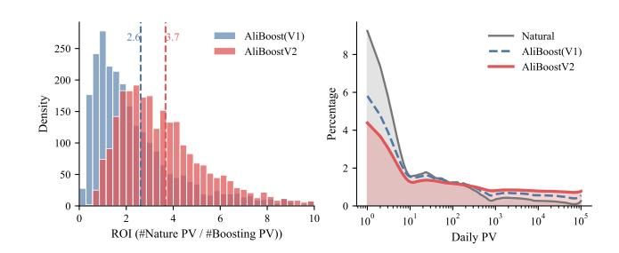
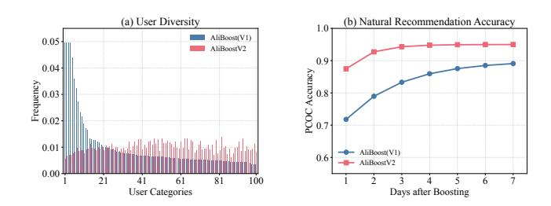
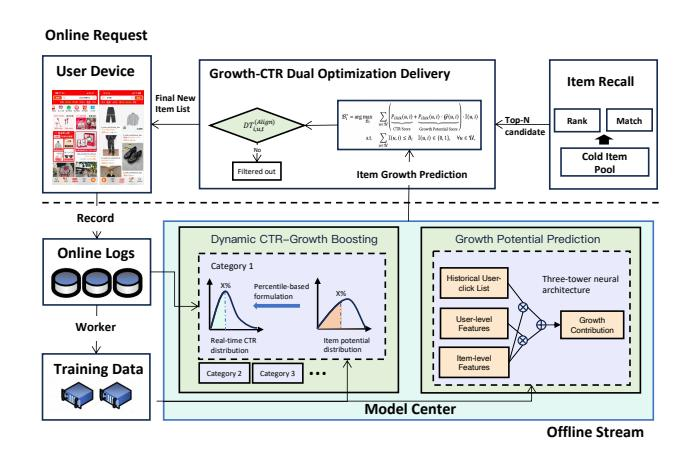
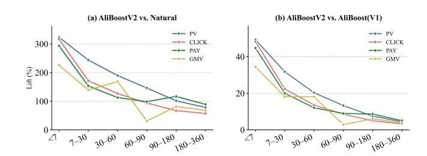
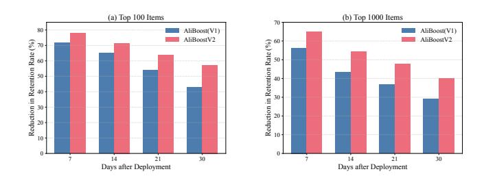

# AliBoostV2: CTR-Growth Balanced Boosting Framework in Billion-Scale Recommendation Platform

Qijie Shen∗ Alibaba Group Hangzhou, China qijie.sqj@alibaba-inc.com

Yuanchen Bei∗ Zhejiang University Hangzhou, China iyuanchenbei@gmail.com

Zihong Huang Alibaba Group Hangzhou, China huangzihong.hzh@alibaba-inc.com

Xixian Wang Jinan University Guangzhou, China ciciwang@stu2025.jnu.edu.cn

Zhibo Xiao Alibaba Group Hangzhou, China xiaozhibo.xzb@alibaba-inc.com

Dimin Wang Alibaba Group Hangzhou, China dimin.wdm@alibaba-inc.com

Jialin Zhu Alibaba Group Hangzhou, China xiafei.zjl@alibaba-inc.com

Yuning Jiang Alibaba Group Hangzhou, China mengzhu.jyn@alibaba-inc.com

Feiran Huang Beihang University Beijing, China huangfr@buaa.edu.cn

Hao Chen† City University of Macau Macao SAR, China sundaychenhao@gmail.com

# Abstract

Promoting cold items to achieve rapid growth remains a fundamental challenge in billion-scale recommendation systems, as traditional natural/organic recommendation approaches primarily focus on Click-Through Rate (CTR) optimization, which naturally limits the exposure and spread of cold items. Recently, the AliBoost (V1) framework introduced boosting strategies to promote cold items to users most likely to click them. However, it still follows the same CTR-oriented optimization approach, thereby limiting long-term ecosystem health. In this work, we present the CTR-growth balanced boosting framework AliBoostV2, which explicitly considers the growth value of boosting candidate users and selects optimal users to balance immediate CTR goals with long-term growth potential. AliBoostV2 includes two key innovations: (1) a tailored Growth Potential Prediction module using counterfactual reasoning to estimate the additional natural traffic generated by each potential boosting exposure, and (2) a Dynamic CTR-Growth Boosting strategy that dynamically captures users' different interaction patterns across various time periods and delivers to users who can both click and contribute to growth simultaneously. AliBoostV2 has been deployed in production across Alibaba and Taobao's main platforms over the past six months, successfully cold-starting over one billion new items. Compared to the AliBoost (V1) framework, our

© 2026 Copyright held by the owner/author(s). ACM ISBN 979-8-4007-2307-0/2026/04 <https://doi.org/10.1145/3774904.3792800>

approach achieves significant improvements of over 17.54% in both clicks and gross merchandise value (GMV) for cold items within a 180-day period. Extensive online analyses and rigorous A/B testing demonstrate the effectiveness of AliBoostV2 in addressing critical ecosystem challenges in billion-scale recommendation.

# CCS Concepts

• Information systems → Recommender systems; Business intelligence; Online advertising.

### Keywords

ecological boosting, cold-start recommendation, click-through rate prediction, billion-scale recommender systems

### ACM Reference Format:

Qijie Shen, Yuanchen Bei, Zihong Huang, Xixian Wang, Zhibo Xiao, Dimin Wang, Jialin Zhu, Yuning Jiang, Feiran Huang, and Hao Chen. 2026. Ali-BoostV2: CTR-Growth Balanced Boosting Framework in Billion-Scale Recommendation Platform. In Proceedings of the ACM Web Conference 2026 (WWW '26), April 13–17, 2026, Dubai, United Arab Emirates. ACM, New York, NY, USA, [10](#page-9-0) pages.<https://doi.org/10.1145/3774904.3792800>

# 1 Introduction

Boosting recommendation is essential for billion-scale recommender systems, natural/organic recommendation systems that prioritize Click-Through Rate (CTR) inherently drive more traffic to popular items [\[5,](#page-8-0) [9,](#page-8-1) [35,](#page-8-2) [37\]](#page-8-3), creating a "rich get richer" or Matthew Effect that impedes the growth of cold items [\[2,](#page-8-4) [8,](#page-8-5) [11,](#page-8-6) [29\]](#page-8-7). Boosting recommendation addresses this by providing additional exposure to cold items to accelerate their development [\[21,](#page-8-8) [23\]](#page-8-9). However, significant challenges persist in boosting design: CTR-oriented approaches present a double-edged sword for boosting recommendations. While using

∗Both authors contributed equally to this paper. †Corresponding author.

[This work is licensed under a Creative Commons Attribution 4.0 International License.](https://creativecommons.org/licenses/by/4.0/legalcode) WWW '26, April 13–17, 2026, Dubai, United Arab Emirates

Figure 1: (a) ROI histogram (the ratio of Natural Recommendation PV to Boosting PV); (b) PV distribution of cold items after 180 days.

CTR-oriented boosting may perpetuate the Matthew Effect, abandoning CTR considerations can compromise user experience and platform revenue [\[10\]](#page-8-10). Therefore, achieving an optimal balance between CTR optimization and item growth represents a critical challenge in designing boosting recommendation systems.

Existing research addresses this challenge through two key dimensions: Model-level methods focus on improving cold item exposure within natural recommendation workflows through coldstart models [\[12,](#page-8-11) [13,](#page-8-12) [20,](#page-8-13) [28\]](#page-8-14) and debiasing approaches [\[6,](#page-8-15) [26,](#page-8-16) [30,](#page-8-17) [36\]](#page-8-18). For instance, ColdLLM [\[12\]](#page-8-11) leverages large language models to enhance cold item embeddings, while MACR [\[27\]](#page-8-19) adopts causal graph learning to mitigate popularity bias. However, such model-level approaches cannot provide sufficient exposure for cold items. To address this limitation, AliBoost (V1) [\[23\]](#page-8-9) introduces the first Systemlevel boosting framework, which implements a tiered boosting structure guided by two CTR-oriented principles: Performance-Driven (higher CTR items receive larger boosting exposure budget) and Non-Disturbance (boosting is stopped when CTR falls below a specified threshold).

However, as shown on the left of [Figure 1,](#page-1-0) we present the histogram of ROI (the ratio of Natural Recommendation page views (PV) to Boosting PV). We observe that CTR-oriented principles in the boosting stage result in suboptimal ROI performance, with approximately 23.0% of items achieving ROI less than 1 and 54.2% falling below 2. This distribution reveals the inherent limitations of purely CTR-oriented boosting strategies. In contrast, incorporating growth considerations into the boosting framework directly enhances ROI effectiveness, with only 2.1% of items having ROI less than 1, demonstrating a substantial improvement in boosting efficiency. On the right, we compare the Daily PV distributions across Pure Natural recommendation, AliBoost (V1), and AliBoostV2. The results indicate that while AliBoost (V1) successfully boosts cold items compared to natural recommendation, incorporating growthoriented principles further mitigates the Matthew effect by achieving more balanced exposure distribution across items of varying popularity levels.

Although the above insight demonstrates that considering growth can better boost cold items, there are three challenges in incorporating growth considerations into the boosting framework:

- (1) Ambiguous Growth Definition: Unlike CTR which can be directly observed immediately, growth is a long-term process, making its definition inherently challenging.

- (2) Individual User Growth Prediction: Item growth is achieved through cumulative exposure and user clicks. Analyzing the growth contribution from individual users is counterfactual, which cannot be directly modeled for prediction and requires auxiliary models.
- (3) Dual CTR-Growth Optimization: Merely considering longterm growth without accounting for immediate CTR will result in disastrous negative feedback and directly eliminate the cold item. Conversely, focusing solely on CTR still leads to being trapped by the Matthew effect.

To address these challenges, we propose the CTR-Growth Balanced boosting framework AliBoostV2, which explicitly optimizes both the long-term growth potential and the immediate CTR value. Specifically, AliBoostV2 first defines the growth potential and trains auxiliary base growth prediction and marginal growth prediction models to estimate the additional natural traffic generated by each candidate boosting exposure. Then AliBoostV2 proposes a Dynamic CTR-Growth Boosting strategy that dynamically aligns the item potential distribution to the real-time user-item CTR prediction distribution to capture users' different interaction patterns across various time periods while delivering both click and growth optimal items to users. The key contributions of this paper are as follows:

- Novel Boosting Paradigm: We introduce the first CTR-Growth balance framework that explicitly improves the previous CTRoriented boosting structure in terms of long-term growth and prosperity.
- Growth Prediction with Counterfactual Reasoning: We develop coupled base growth prediction and marginal growth prediction models to evaluate the user growth value in helping items acquire more future traffic.
- Dynamic CTR-Growth Boosting: We propose a dynamic aligning structure to ensure the item potential prediction distribution can match real-time user behavior and interest, while considering the growth potential that candidate users can provide.
- Large-Scale Deployment and Validation: AliBoostV2 has been deployed across Alibaba and Taobao's main platforms for six months, successfully launching over one billion new items. AliBoostV2 achieves improvements over AliBoost (V1) of over 17.54% in both clicks and GMV for cold items within 180 days, with extensive A/B testing validating its effectiveness.

# 2 Related Works

# 2.1 Model-level Cold-Start Recommendation

Cold-start recommendation constitutes a fundamental challenge in modern recommender systems, arising when new users or items lack sufficient interactions to support reliable preference modeling [\[1,](#page-8-20) [33,](#page-8-21) [34\]](#page-8-22). This problem has significant implications, including decreased user engagement [\[7,](#page-8-23) [16\]](#page-8-24), missed opportunities for personalization [\[17,](#page-8-25) [40\]](#page-8-26), and potential reinforcement of biases [\[27,](#page-8-19) [33\]](#page-8-21). To this end, on the one hand, several model-level studies employ contrastive learning [\[28,](#page-8-14) [38\]](#page-8-27), meta-learning [\[18,](#page-8-28) [39\]](#page-8-29), or knowledge distillation [\[13,](#page-8-12) [25\]](#page-8-30) to transfer the information encoded in warm embeddings to initialized cold embeddings, enabling these cold embeddings to rapidly adapt to the recommender's existing behavior patterns. On the other hand, some recent works learn the representations of cold items by generating and synthesizing high-quality

Figure 2: Comparison between AliBoost (V1) and AliBoostV2: (a) AliBoostV2 achieves broader user exploration beyond high-CTR audiences; (b) it enables more accurate quality estimation through diverse feedback accumulation.

interactions for them from a behavioral perspective [\[12,](#page-8-11) [19,](#page-8-31) [20\]](#page-8-13). These model-level approaches mainly synthesize representations or behavioral patterns for new items at the early stage of their lifecycle. Nevertheless, they largely overlook the longitudinal evaluation of cold items across their entire lifecycle and lack systematic mechanisms to assess quality during subsequent growth phases.

### 2.2 System-level Boosting Recommendation

To support the growth of newly launched items at the system-level, a traditional line of studies leverages real-time bidding (RTB) recommendations to provide dynamic exposure and traffic allocation [\[24\]](#page-8-32). RTB is a market-driven framework in which heterogeneous bidders, such as advertisers, merchants, or content creators, compete for limited impression opportunities in the online platform [\[3,](#page-8-33) [15,](#page-8-34) [22\]](#page-8-35). With the convergence of recommender systems and online advertising, RTB has been extended beyond display ads to various content-distribution settings, including news feeds, search ranking, and short-video platforms [\[4,](#page-8-36) [14,](#page-8-37) [32\]](#page-8-38). However, most of these approaches focus on immediate bidding efficiency while neglecting the long-term value potential of items. To mitigate this limitation, AliBoost (V1) [\[23\]](#page-8-9) introduces a life-cycle-aware boosting mechanism that continuously promotes new items from their initial cold-start phase to maturity. Yet, it remains largely rule-based value estimation, highlighting the need for more principled, learningdriven traffic optimization frameworks.

### 3 Methodology

In this section, we first discuss the overall framework of the Ali-BoostV2. Subsequently, we introduce the Growth Value Prediction and how to train and predict with coupled base and marginal prediction models. Furthermore, we present the Dynamic CTR-Growth Boosting to ensure each new item can obtain suitable user views to boost its preference.

### 3.1 Overall Framework

As shown in [Figure 2](#page-2-0) (a), we present the histogram of user diversity under CTR-oriented AliBoost (V1) and the CTR-growth balanced AliBoostV2. The user diversity of AliBoostV2 is significantly better than AliBoost (V1), indicating that merely considering CTR will fall into a narrow user scope, while considering future growth during the boosting stage will broaden the user scope. In [Figure 2](#page-2-0) (b), we present the natural recommendation accuracy of the CTR model after boosting. As observed from this figure, boosting with CTRgrowth balanced strategies will significantly increase the PCOC accuracy (Post-Click Outcome Conversion, measuring the prediction accuracy of user engagement after initial clicks). Thus, boosting while considering growth potential is of vital importance.

Motivated by this, we design the objective of the CTR-growth boosting, where each candidate user will be computed respectively. Let B�� denote the boosting strategy for item ��. The optimization objective can be formulated as:

B ∗ �� = arg max B�� ∑︁ ��∈U © « ��click (��,��) | {z } CTR Score +��click (��,��) · G (��,��) | {z } Growth Potential Score ª ® ® ® ¬ · I(��,��) s.t. ∑︁ ��∈U I(��,��) ≤ ���� I(��,��) ∈ {0, 1}, ∀�� ∈ U, (1)

where ��click (��,��) represents the predicted click-through probability for user �� and item ��, G (��,��) represents the growth potential score given by user �� to item ��. I(��,��) = 1 indicates delivery and I(��,��) = 0 otherwise. ���� represents the total boosting budget (number of exposures) allocated to item ��.

Specifically, the design of the above objective follows two principles: Principle 1: Personalized User Potential Value. Each user has a different potential value for a given cold item. For instance, exposure to key opinion leaders (KOLs) or highly influential users typically has a greater long-term impact through social amplification and credibility signaling. Principle 2: Click-Through Rate Constraints. The boosting should balance CTR as well as growth. Thus, we multiply the CTR by the growth potential to serve as a critical feasibility constraint in exposure delivery.

In the following subsections, we will elaborate on how to compute the Growth Potential Score and how to deliver the new items to users while considering the CTR-growth constraints.

### 3.2 Growth Potential Prediction

As illustrated in the overall framework, the core of AliBoostV2 lies in estimating the Growth Potential Score G (��,��), which quantifies the long-term traffic uplift a new item �� gains when exposed to a user �� who clicks it. Accurate modeling of G (��,��) is essential for the optimization in Equation [1,](#page-2-1) as it bridges immediate click engagement with future natural traffic potential.

Problem Formulation (Marginal Growth Contribution). We view an item's growth process as a sequential accumulation of userdriven signals. Let log10 ����,�� denote the predicted traffic volume of an item on day ��, and ����,��−1 denote all user click events that item �� received before day ��.

While log10 ����,�� aggregates the collective effect of all prior clicks for prediction, the practical goal of growth prediction is to disentangle the marginal impact of a specific user's click on future traffic, that is, how much the next-day traffic would change if the focal click occurred (vs. not occurred). Formally, we define the marginal growth contribution of user ��'s click as:

Δ�� (��) ��,�� = T (����,��−1 − {��}, ��,��). (2)

where DT(Align) ��,��,�� is the adaptive delivery threshold that balances growth contribution and click probability for user-item pair (��,��) at time ��. The multiplicative formulation ��click (��,��) × (1+ G (����, ����)) is derived with reference to Equation [1,](#page-2-1) which naturally integrates baseline engagement probability with incremental long-term growth potential, filtering out user-item pairs with either negligible growth potential or prohibitively low engagement probability.

Our strategy consists of two synergistic components that work together to determine DT(Align) ��,��,�� through distribution alignment:

Item Growth Potential Distribution. We employ the coldstart CTR model [\[23\]](#page-8-9) to predict click-through rates ��click (��,��) for each new item �� across a diverse user sample Usample of size �� drawn from offline data. Due to observed diversity in user behaviors across item categories, we denote I�� as the set of items belonging to category ��. To quantify the growth potential of item ��, we compute the expected CTR across all sampled users. For each item �� ∈ I�� , the expected CTR is calculated as:

(Item) �� = E��∈Usample [��click (��,��)], (7)

resulting in a category-specific item expected CTR distribution:

DI�� = {E (Item) : �� ∈ I�� }. (8)

To enhance system stability and mitigate the impact of prediction errors, we utilize the percentile rank of E (Item) �� within DI�� as the evaluation metric for item potential. We define the percentile rank of item �� ∈ I�� , denoted as �� (Item) �� , as the percentage of items with expected CTR values lower than or equal to E (Item) :

�� (Item) = |{ �� ∈ I�� : E (Item) ≤ E (Item) |Ic | × 100%. (9)

This percentile-based formulation provides robustness against model miscalibration and ensures consistent interpretation across categories with different CTR distributions.

Real-Time Dynamic User Distribution Alignment. To ensure the distribution accurately reflects current user preferences, we construct a real-time CTR distribution for each category ��:

D (Online) I�� = {�� (Online) click (��,��) : (��,��) ∈ S�� −1, �� ∈ I�� }, (10)

where S�� −1 denotes the set of user-item exposure records from the past hour, and �� (Online) click (��,��) represents the real-time click-through probability for user �� and item ��. This distribution is refreshed every five minutes using a one-hour sliding window, balancing temporal responsiveness with statistical stability.

Having established both the offline item potential distribution DI�� and the real-time CTR distribution D (Online) I�� , we determine the delivery threshold through distribution alignment. For a new item �� ∈ I�� with percentile rank �� (Item) , we compute the delivery threshold DT(Align) ��,��,�� at time �� as the �� (Item) �� -th percentile of the realtime CTR distribution:

DT(Align) ��,��,�� = �� −1 (Online) �� (Item) �� 100% ! , (11)

where �� −1 D (Online) (·) denotes the quantile function (inverse Cumulative Distribution Function) of the real-time CTR distribution

Figure 4: The system architecture for online deployment.

D (Online) I�� . This distribution alignment mechanism ensures that high-potential items are preferentially allocated to users exhibiting correspondingly strong engagement signals in their real-time behavioral context. Because D (Online) I�� is dynamically updated every five minutes, the threshold DT(Align) ��,��,�� adapts continuously to evolving traffic patterns—such as promotional CTR surges during flash sales or temporal engagement fluctuations across different time periods—thereby maintaining optimal allocation quality under dynamic operational conditions.

### 3.4 Industrial Implementation

As illustrated in Figure [4,](#page-4-0) the presented system architecture is capable of handling 120,000 QPS at traffic peak and typically responds within 20 milliseconds. It currently serves the main traffic pipeline of Taobao, providing recommendation services to hundreds of millions of users over billions of items on a daily basis. The overall system consists of two major components: an offline pipeline and an online deployment module.

(1) Offline Pipeline. The offline pipeline comprises two key submodules: the Growth Potential Model and Dynamic CTR-Growth Boosting. The Growth Potential Model is retrained daily using the latest training data to maintain an up-to-date estimation of each item's long-term growth potential. In the Dynamic CTR-Growth Boosting module, the offline distribution is refreshed once per day: for every newly launched item, we compute its expected CTR by scoring it with the CTR model over a representative 0.01% sample of the entire user base and averaging the predictions to obtain a robust estimate of its population-level CTR. These CTR estimates are then used to rank all new items within their respective categories, yielding a category-wise offline distribution that serves as the baseline for subsequent online alignment.

(2) Online Deployment. The online deployment stage integrates real-time growth potential estimation and online–offline distribution alignment. When a user request arrives, all recalled user–item pairs involving newly launched items are evaluated using the Growth Potential Model (executed in parallel with the CTR model) to estimate each pair's growth value. Meanwhile, the system continuously

collects real-time CTR model scores within the past hour, aggregates them by category, and constructs an online category-wise distribution. For each recalled new item, the system performs online–offline distribution alignment to determine its dynamic serving threshold. Given this threshold and the predicted growth values of user–item pairs, the system jointly optimizes Growth–CTR Dual Optimization Delivery, selecting the most valuable subset of users within each item's budgeted PV constraint to maximize overall growth-oriented exposure.

### 4 Experiments

In this section, we conduct experiments on the Alibaba platform, aiming to address the following research questions: RQ1: Comparing to exiting boosting system, how does AliBoostV2 improve the ecological environment of Alibaba? RQ2: How does AliBoostV2 compare with the AliBoost (V1) in further traffic? RQ3: How does the growth potential prediction model perform? RQ4: How does AliBoostV2 impact different item categories in Alibaba?

# 4.1 Experimental Setup

4.1.1 Datasets and Online Environment. Our Growth Potential Prediction model is trained on data collected from Taobao's homepage feed, the largest recommendation scenario within Alibaba Group. The dataset comprises cold-start items during their initial 7-day boosting period, with each sample corresponding to a cold item on a given day over the past 180 days. For each item-day pair, the label is defined as the logarithm of the item's exposure page views (PV) on the following day, which serves as a proxy for its short-term growth potential. Logarithmic transformation is applied to stabilize the heavy-tailed distribution of PV counts.

On average, approximately 4 million cold-start items enter the boosting pool daily, resulting in a total of around 7.2 billion training samples. Due to the extreme data sparsity in early stages, cold items have interacted with only about 10 users on average by day 3 and 35 users by day 5. The prediction task poses significant challenges in learning reliable signals from limited historical engagement. This setting reflects the real-world cold-start regime where effective growth forecasting must rely on minimal early feedback.

All online experiments are conducted on Alibaba's primary online system. The online A/B testing environment supports largescale experiments, with daily metrics including daily 0.3 billion users, daily 1 million items, and daily 10 billion interactions.

4.1.2 Evaluation Metrics. We evaluate our approach using two categories of metrics: effectiveness metrics and growth metrics. For the effectiveness metrics, we include Page Views (PV), Click-Through Rate (CTR), Click, Pay, and Gross Merchandise Value (GMV) [\[31\]](#page-8-39). For the growth metrics, we include Traffic Share, Return on Investment (ROI), and Hot Item Count. These complementary measures enable us to assess both the immediate performance and long-term sustainability of the recommendation system. Details of these metrics are shown in Appendix [A.1.](#page-9-1)

4.1.3 Implementation Settings. For all models, the embedding size is fixed to 256 for fair recommendations. For the user A/B test, we randomly hashed and divided users into buckets, with specific

buckets designated as the control group and others as the experiment group. This setup was designed to evaluate model accuracy improvements, aligning with the standard A/B testing paradigm used in most recommendation systems. For the item A/B test, we randomly hashed and divided items into buckets, with specific buckets serving as the control group and others as the experiment group. This approach was well-suited to observe the long-term growth performance of items under different mechanisms.

### 4.2 Main Results (RQ1 & RQ2)

4.2.1 Comparing Overall Platform Improvement. To evaluate the holistic impact of AliBoostV2, we conducted a large-scale online A/B test on Alibaba's main recommendation platforms, comparing AliBoostV2 against both the natural (organic) recommendation baseline and the AliBoost (V1) framework. As summarized in Table [1,](#page-6-0) AliBoostV2 delivers consistent and statistically significant improvements across all key business metrics at the platform level. Specifically, compared to the natural recommendation, AliBoostV2 achieves a +2.75% increase in PV, +5.25% in CLICK, +4.75% in PAY, and +5.45% in GMV.

More importantly, when directly benchmarked against the previous cold-start boosting system AliBoost (V1), AliBoostV2 still yields notable gains: +1.13% in PV, +1.84% in CLICK, +1.52% in PAY, and +2.07% in GMV. These results validate that AliBoostV2 not only addresses the cold-start problem more effectively but also generates positive externalities that ripple through the entire recommendation ecosystem. The consistent uplift across all metrics demonstrates that AliBoostV2 's fine-grained control over user targeting and traffic allocation translates into tangible platform-wide value, reinforcing its scalability in billion-scale industrial settings.

4.2.2 Comparing Cold Items Improvement. We further dissect the performance of AliBoostV2 on cold items across their lifecycle, from initial launch to long-term maturity. As shown in Table [1,](#page-6-0) AliBoostV2 consistently outperforms both natural recommendation and AliBoost (V1) at every time horizon, with the advantage widening as items age, highlighting its ability to foster sustained growth rather than short-lived spikes.

In the short term (within 3 days of launch), AliBoostV2 already shows strong activation capability, delivering +19.52% PV, +11.23% CLICK, +9.41% PAY, and +21.04% GMV over natural recommendation. Crucially, it improves upon AliBoost (V1) by +4.16% in PV and +4.58% in GMV, indicating more effective early-stage exposure. By 30 days, the cumulative effect becomes pronounced: AliBoostV2 achieves +50.21% PV and +49.83% CLICK over natural recommendation, and surpasses AliBoost (V1) by +9.57% in PV and +10.54% in GMV. This demonstrates that AliBoostV2 's quality-aware boosting strategy successfully seeds items for organic propagation. In the mid-term (90 days), gains continue to compound. AliBoostV2 attains +64.22% CLICK and +65.34% GMV versus natural recommendation, with a +15.27% and +15.61% advantage over AliBoost (V1), respectively. This confirms that the initial boosting decisions made by AliBoostV2 lead to stronger long-term engagement and monetization. Finally, in the long-term (180 days), AliBoostV2 reaches its peak effectiveness: it boosts cold items to +72.51% higher PV, +82.04% more clicks, +79.82% more payments, and +78.53% higher GMV compared to natural recommendation. Most impressively,

Table 1: Performance improvement of AliBoostV2 in Alibaba. We first compare the overall platform improvements and then analyze the impact of boosting based on the launch time of cold items over different time periods.

| Metric   |     |         |             | PV                |             | CLICK             |             | PAY               |             | GMV               |
|----------|-----|---------|-------------|-------------------|-------------|-------------------|-------------|-------------------|-------------|-------------------|
|          |     |         | vs. Natural | vs. Aliboost (V1) | vs. Natural | vs. Aliboost (V1) | vs. Natural | vs. Aliboost (V1) | vs. Natural | vs. Aliboost (V1) |
| Platform |     | Overall | +2.75%      | +1.13%            | +5.25%      | +1.84%            | +4.75%      | +1.52%            | +5.45%      | +2.07%            |
| Boosted  | 3   | Days    | +19.52%     | +4.16%            | +11.23%     | +2.83%            | +9.41%      | +2.41%            | +21.04%     | +4.58%            |
| Boosted  | 7   | Days    | +33.05%     | +6.59%            | +23.52%     | +5.62%            | +22.03%     | +5.04%            | +29.24%     | +7.25%            |
| Boosted  | 30  | Days    | +50.21%     | +9.57%            | +49.83%     | +10.23%           | +45.52%     | +9.21%            | +46.05%     | +10.54%           |
| Boosted  | 60  | Days    | +52.03%     | +11.36%           | +61.54%     | +13.88%           | +62.82%     | +13.05%           | +58.63%     | +13.59%           |
| Boosted  | 90  | Days    | +58.51%     | +12.82%           | +64.22%     | +15.27%           | +61.73%     | +11.83%           | +65.34%     | +15.61%           |
| Boosted  | 120 | Days    | +66.02%     | +15.09%           | +68.53%     | +17.04%           | +72.54%     | +16.26%           | +74.85%     | +18.53%           |
| Boosted  | 150 | Days    | +70.24%     | +16.58%           | +79.02%     | +19.22%           | +69.33%     | +14.37%           | +76.25%     | +19.06%           |
| Boosted  | 180 | Days    | +72.51%     | +17.85%           | +82.04%     | +20.13%           | +79.82%     | +17.54%           | +78.53%     | +20.58%           |

Figure 5: Relative changes in recommendation metrics for items with different release days on Taobao before and after the full-scale deployment of AliBoostV2.

it maintains a +17.85%–20.58% margin over AliBoost (V1) across all metrics, validating that fine-grained optimization of boosting quality and traffic allocation yields durable, compounding benefits. These results collectively confirm that AliBoostV2 not only mitigates the cold-start problem more effectively than prior art but also redefines how boosting should be conceptualized: not as a CTR-maximization task, but as a strategic investment in future organic growth. The sustained gains across time horizons underscore AliBoostV2 's role as a foundational component for building resilient, growth-oriented recommender systems at scale.

4.2.3 Freshness Improvement in the Alibaba Recommendation System. We evaluate the impact of AliBoostV2 on system freshness, which is defined as the traffic share of newly published items across six item age cohorts.

As shown in [Figure 5,](#page-6-1) AliBoostV2 substantially outperforms both baselines. Compared to natural recommendation, it achieves a +324% lift in PV for items younger than 7 days, with strong gains in CLICK (+309%), PAY (+294%), and GMV (+226%). Furthermore, Ali-BoostV2 also delivers significant improvements over AliBoost (V1) itself. For the &lt;7-day cohort, it provides an additional +50.5% PV lift, +41.0% CLICK lift, +45.9% PAY lift, and +34.3% GMV lift. These gains remain positive across all age groups, demonstrating that AliBoostV2 's fine-grained boosting quality control enables more effective traffic allocation than previous CTR-oriented strategies. These results confirm that AliBoostV2 not only solves the cold-start problem but also cultivates a fresher, more vibrant recommendation ecosystem in Alibaba. More results on AliBoostV2's ability in

reducing the potential Matthew effect within the ecosystem can be found in Appendix [A.2.](#page-9-2)

### 4.3 Effectiveness of the Growth Potential Prediction Module (RQ3)

To validate the effectiveness of our Sequential Uplift Modeling approach for potential prediction, we conduct both offline and online experiments against three representative baselines that reflect key design choices in cold-start systems:

No Potential Model (Vanilla Recommender): This baseline does not employ any growth potential prediction module. Cold-start items are allocated traffic using the platform's default recommendation policy (e.g., based on item popularity or a standard CTR model). This setup serves as the true production baseline and

isolates the value of introducing any cold-start potential modeling. Uniform Attribution: This model adopts a simplified twotower architecture (user and item towers only) and assumes that each historical click contributes equally to the next-day traffic. During training, the label ���� is divided by the number of clicks on day �� − 1 to obtain a per-click traffic label, and the model learns to predict this uniform per-click value. This approach ignores user heterogeneity and the non-linear aggregation of social proof, making it unable to capture high-impact "seed" clicks. It serves as the weakest modeling baseline.

Joint Regression: This model uses the same three-tower architecture (user, historical user list, and item towers) as our proposed method but does not distinguish between control and treatment samples during training. All towers are updated jointly to directly regress the next-day traffic ���� . Crucially, because the historical user list tower is never trained in isolation to model the base traffic ����, the model fails to disentangle the contribution of the historical click context from that of the current focal click. As a result, it cannot accurately estimate the marginal uplift �� (��) of a single click.

Offline Test Set Construction. To fairly evaluate the accuracy of per-click growth potential prediction, we construct a specialized offline test set consisting of new items that received exactly one click on their first day after entering the recommendation pool. Note that the No Potential Model baseline is not evaluated offline, as it does not produce per-click predictions. For the other models, the single click provides unambiguous ground truth for the marginal

Table 2: Offline and online performance comparison. Offline metrics (left) are absolute (lower better). Online metrics (right) show relative improvement over No Potential Model.

| Model                    | MSE ↓ | MAE ↓ | PV ↑  | CLICK ↑ | PAY ↑ | ROI ↑ | Traffic Share ↑ | Hot Item Count ↑ |
|--------------------------|-------|-------|-------|---------|-------|-------|-----------------|------------------|
| No Potential Model       | —     | —     | —     | —       | —     | —     | —               | —                |
| Uniform Attribution      | 0.915 | 0.683 | +3.1% | +3.1%   | +2.9% | +3.0% | +2.4%           | +5.2%            |
| Joint Regression         | 0.842 | 0.612 | +4.2% | +4.9%   | +4.6% | +4.7% | +3.0%           | +7.3%            |
| Ours (Sequential Uplift) | 0.763 | 0.541 | +4.5% | +6.8%   | +6.7% | +6.8% | +3.9%           | +8.7%            |

Table 3: PV Gain across representative item categories relative to different system baselines.

|             | Category   |               | 7-Day vs. Natural | PV Gain (%) vs. Aliboost | 30-Day (V1) vs. Natural | PV Gain (%) vs. Aliboost (V1) |
|-------------|------------|---------------|-------------------|--------------------------|-------------------------|-------------------------------|
| Apparel     |            | & Fashion     | 35.12             | 12.34                    | 48.76                   | 18.90                         |
| Fast        | Moving     | Consumer      | 42.87             | 15.67                    | 65.21                   | 25.43                         |
| Sports      | &          | Outdoor       | 82.56             | 30.22                    | 115.34                  | 42.50                         |
| Food        | &          | Fresh         | 105.11            | 38.99                    | 128.78                  | 48.11                         |
| Toys        | &          | Hobbies       | -15.33            | -7.10                    | 55.67                   | 20.88                         |
| Jewelry     |            | & Accessories | 95.78             | 35.15                    | 155.23                  | 58.65                         |
| Home        | Furnishing |               | -12.45            | -6.05                    | 55.89                   | 21.05                         |
| 3C          | & Digital  |               | -18.90            | -9.23                    | -22.50                  | -11.33                        |
| Automobiles |            |               | 78.11             | 28.50                    | 148.99                  | 55.40                         |
| Fresh       | Flowers    | & Plants      | 30.67             | 11.22                    | 75.12                   | 28.01                         |
| Pets        |            |               | 88.55             | 32.10                    | 220.66                  | 80.99                         |
| Industrial  |            | Products      | 65.33             | 24.56                    | 78.90                   | 29.87                         |
| Health      |            |               | 45.90             | 17.11                    | 110.23                  | 40.56                         |
| Small       | Appliances |               | 60.10             | 22.33                    | 70.89                   | 26.50                         |
| Commercial  |            | Agriculture   | 65.78             | 24.99                    | 138.45                  | 52.10                         |
| Education   |            |               | 50.15             | 18.50                    | 75.60                   | 28.30                         |
| Auctions    |            |               | 98.76             | 36.12                    | 240.50                  | 90.25                         |
| Customized  |            | Products      | -40.50            | -18.25                   | 70.10                   | 26.88                         |
| Overall     |            |               | 55.23             | 18.75                    | 70.45                   | 30.12                         |

effect, with the label being the actual traffic (e.g., PV) observed on day 2. The observations are listed as follows.

Key Observations. Table [2](#page-7-0) summarizes the performance. Offline metrics (MSE, MAE) are reported for models that make per-click predictions; online metrics show relative lift over the No Potential Model from a 14-day A/B test (all �� &lt; 0.01):

- The Growth Potential Module is Essential: Simply adding any potential prediction model yields substantial gains. Compared to No Potential Model, even the naive Uniform Attribution improves Hot Item Count by +5.2% and CLICK by +3.1%, confirming that explicit cold-start modeling is valuable.
- Offline Accuracy Correlates with Online Gains: Our model achieves the lowest MSE and MAE, and also delivers the largest online lifts: +8.7% Hot Item Count and +6.8% CLICK over No Potential Model. In contrast, Joint Regression's higher error translates to weaker gains (+2.1% Hot Item Count), validating that accurate marginal uplift estimation is key.
- Causal Disentanglement Matters: The gap between Joint Regression and our method in the results highlights the importance of counterfactual learning for disentanglement. By separating control (historical clicks only) and treatment (with new clicks) phases, our model isolates the true incremental value of a click, enabling more precise allocation.

# 4.4 Category-Specific Performance (RQ4)

We analyze the 7-day and 30-day PV gains of AliBoostV2 across major item categories, comparing against both natural recommendation and AliBoost (V1). The results are illustrated in Table [3.](#page-7-1) From the results, we can have the following observations:

- Categories with high user interest but low organic exposure, such as Jewelry & Accessories, Pets, Sports & Outdoor, Food & Fresh, and Auctions, benefit most from AliBoostV2. For example, Auctions sees a +90.25% gain over AliBoost (V1) at 30 days, and Pets achieves +80.99%, demonstrating AliBoostV2 's superior ability to surface niche yet high-potential items.
- 3C & Digital shows negative PV gains (-9.23% at 7 days, -11.33% at 30 days vs. AliBoost (V1), consistent with AliBoost (V1)'s trend. However, internal metrics confirm a +7.2% increase in PCTR, indicating that AliBoostV2 further refines exposure quality by reducing inefficient impressions.
- Specialized categories like Toys & Hobbies and Customized Products exhibit short-term PV drops but strong long-term recovery (e.g., +20.88% and +26.88% at 30 days vs. AliBoost (V1). This reflects AliBoostV2 's adaptive boosting strategy: it quickly exits low-PCTR items from aggressive promotion, enabling more accurate organic growth over time.

# 5 Conclusion

In this paper, we presented AliBoostV2, a CTR–growth balanced boosting framework designed to promote cold items and ensure sustainable ecosystem growth in billion-scale recommendation systems. Unlike conventional CTR-oriented approaches, AliBoostV2 explicitly models the long-term growth potential of each boosting exposure through a counterfactual Growth Potential Prediction module and dynamically balances CTR and growth via Dynamic CTR-Growth Boosting. We also provide a clear online implementation scheme of AliBoostV2's real-world usage. The system has successfully bootstrapped over one billion new items, achieving more than 17.54% improvements in both clicks and GMV for cold items within 180 days. Extensive online experiments and A/B testing confirm that AliBoostV2 effectively bridges short-term engagement and long-term growth, offering a principled and scalable solution for the next generation of growth-oriented recommendation systems.

# Acknowledgments

This work was supported in part by the Funding Scheme for Research and Innovation of FDCT (No. 0021/2025/ITP1), the National Natural Science Foundation of China (No. 62272200, 62502008), and the Fundamental Research Funds for the Central Universities (No. 21624329, 12625611).

References [1] Yuanchen Bei, Weizhi Zhang, Siwen Wang, Weizhi Chen, Sheng Zhou, Hao Chen, Yong Li, Jiajun Bu, Shirui Pan, Yizhou Yu, et al. 2025. Graphs Meet AI Agents: Taxonomy, Progress, and Future Opportunities. arXiv preprint arXiv:2506.18019 (2025). [2] Ludovico Boratto, Francesco Fabbri, Gianni Fenu, Mirko Marras, and Giacomo Medda. 2024. Fair augmentation for graph collaborative filtering. In Proceedings of the 18th ACM Conference on Recommender Systems. 158–168. [3] Han Cai, Kan Ren, Weinan Zhang, Kleanthis Malialis, Jun Wang, Yong Yu, and Defeng Guo. 2017. Real-time bidding by reinforcement learning in display advertising. In Proceedings of the tenth ACM international conference on web search and data mining. 661–670. [4] Carlos Carrion, Zenan Wang, Harikesh Nair, Xianghong Luo, Yulin Lei, Peiqin Gu, Xiliang Lin, Wenlong Chen, Junsheng Jin, Fanan Zhu, et al. 2023. Blending advertising with organic content in e-commerce via virtual bids. In Proceedings of the AAAI Conference on Artificial Intelligence, Vol. 37. 15476–15484. [5] Hao Chen, Yuanchen Bei, Qijie Shen, Yue Xu, Sheng Zhou, Wenbing Huang, Feiran Huang, Senzhang Wang, and Xiao Huang. 2024. Macro graph neural networks for online billion-scale recommender systems. In Proceedings of the ACM web conference 2024. 3598–3608. [6] Jiawei Chen, Hande Dong, Xiang Wang, Fuli Feng, Meng Wang, and Xiangnan He. 2023. Bias and debias in recommender system: A survey and future directions. ACM Transactions on Information Systems 41, 3 (2023), 1–39. [7] Giovanni Luca Ciampaglia, Azadeh Nematzadeh, Filippo Menczer, and Alessandro Flammini. 2018. How algorithmic popularity bias hinders or promotes quality. Scientific reports 8, 1 (2018), 15951. [8] Francesco Fabbri, Maria Luisa Croci, Francesco Bonchi, and Carlos Castillo. 2022. Exposure inequality in people recommender systems: the long-term effects. In Proceedings of the International AAAI Conference on Web and Social Media, Vol. 16. 194–204. [9] Chen Gao, Yu Zheng, Nian Li, Yinfeng Li, Yingrong Qin, Jinghua Piao, Yuhan Quan, Jianxin Chang, Depeng Jin, Xiangnan He, et al. 2023. A survey of graph neural networks for recommender systems: Challenges, methods, and directions. ACM Transactions on Recommender Systems 1, 1 (2023), 1–51. [10] Yingqiang Ge, Xiaoting Zhao, Lucia Yu, Saurabh Paul, Diane Hu, Chu-Cheng Hsieh, and Yongfeng Zhang. 2022. Toward pareto efficient fairness-utility tradeoff in recommendation through reinforcement learning. In Proceedings of the fifteenth ACM international conference on web search and data mining. 316–324. [11] Fabrizio Germano, Vicenç Gómez, and Gaël Le Mens. 2019. The few-get-richer: a surprising consequence of popularity-based rankings?. In The World Wide Web Conference. 2764–2770. [12] Feiran Huang, Yuanchen Bei, Zhenghang Yang, Junyi Jiang, Hao Chen, Qijie Shen, Senzhang Wang, Fakhri Karray, and Philip S Yu. 2025. Large Language Model Simulator for Cold-Start Recommendation. In Proceedings of the Eighteenth ACM International Conference on Web Search and Data Mining. 261–270. [13] Feiran Huang, Zefan Wang, Xiao Huang, Yufeng Qian, Zhetao Li, and Hao Chen. 2023. Aligning distillation for cold-start item recommendation. In Proceedings of the 46th International ACM SIGIR Conference on Research and Development in Information Retrieval. 1147–1157. [14] Geng Ji, Wentao Jiang, Jiang Li, Fahmid Morshed Fahid, Zhengxing Chen, Yinghua Li, Jun Xiao, Chongxi Bao, and Zheqing Zhu. 2024. Learning to bid and rank together in recommendation systems. Machine Learning 113, 5 (2024), 2559–2573. [15] Junqi Jin, Chengru Song, Han Li, Kun Gai, Jun Wang, and Weinan Zhang. 2018. Real-time bidding with multi-agent reinforcement learning in display advertising. In Proceedings of the 27th ACM international conference on information and knowledge management. 2193–2201. [16] Anastasiia Klimashevskaia, Mehdi Elahi, Dietmar Jannach, Lars Skjærven, Astrid Tessem, and Christoph Trattner. 2023. Evaluating The Effects of Calibrated Popularity Bias Mitigation: A Field Study. In Proceedings of the 17th ACM Conference on Recommender Systems. 1084–1089. [17] Anastasiia Klimashevskaia, Dietmar Jannach, Mehdi Elahi, and Christoph Trattner. 2024. A survey on popularity bias in recommender systems. User Modeling and User-Adapted Interaction 34, 5 (2024), 1777–1834. [18] Hoyeop Lee, Jinbae Im, Seongwon Jang, Hyunsouk Cho, and Sehee Chung. 2019. Melu: Meta-learned user preference estimator for cold-start recommendation. In Proceedings of the 25th ACM SIGKDD International Conference on Knowledge Discovery & Data Mining. 1073–1082. [19] Ruochen Liu, Hao Chen, Yuanchen Bei, Qijie Shen, Fangwei Zhong, Senzhang Wang, and Jianxin Wang. 2024. Fine Tuning Out-of-Vocabulary Item Recommendation with User Sequence Imagination. In The Thirty-eighth Annual Conference on Neural Information Processing Systems. 8930–8955. [20] Taichi Liu, Chen Gao, Zhenyu Wang, Dong Li, Jianye Hao, Depeng Jin, and Yong Li. 2023. Uncertainty-aware Consistency Learning for Cold-Start Item Recommendation. In Proceedings of the 46th International ACM SIGIR Conference on Research and Development in Information Retrieval. 2466–2470. [21] Athanasios N Nikolakopoulos and George Karypis. 2020. Boosting item-based collaborative filtering via nearly uncoupled random walks. ACM Transactions on Knowledge Discovery from Data (TKDD) 14, 6 (2020), 1–26. [22] Weitong Ou, Bo Chen, Xinyi Dai, Weinan Zhang, Weiwen Liu, Ruiming Tang, and Yong Yu. 2023. A survey on bid optimization in real-time bidding display advertising. ACM Transactions on Knowledge Discovery from Data 18, 3 (2023), 1–31. [23] Qijie Shen, Yuanchen Bei, Zihong Huang, Jialin Zhu, Keqin Xu, Boya Du, Jiawei Tang, Yuning Jiang, Feiran Huang, Xiao Huang, et al. 2025. AliBoost: Ecological Boosting Framework in Alibaba Platform. In Proceedings of the 31st ACM SIGKDD Conference on Knowledge Discovery and Data Mining V. 2. 4827–4838. [24] Xiaoli Tang and Han Yu. 2025. Towards trustworthy AI-empowered real-time bidding for online advertisement auctioning. Comput. Surveys 57, 6 (2025), 1–36. [25] Shuai Wang, Kun Zhang, Le Wu, Haiping Ma, Richang Hong, and Meng Wang. 2021. Privileged graph distillation for cold start recommendation. In Proceedings of the 44th International ACM SIGIR Conference on Research and Development in Information Retrieval. 1187–1196. [26] Wenjie Wang, Fuli Feng, Xiangnan He, Xiang Wang, and Tat-Seng Chua. 2021. Deconfounded recommendation for alleviating bias amplification. In Proceedings of the 27th ACM SIGKDD conference on knowledge discovery & data mining. 1717– 1725. [27] Tianxin Wei, Fuli Feng, Jiawei Chen, Ziwei Wu, Jinfeng Yi, and Xiangnan He. 2021. Model-agnostic counterfactual reasoning for eliminating popularity bias in recommender system. In Proceedings of the 27th ACM SIGKDD conference on knowledge discovery & data mining. 1791–1800. [28] Yinwei Wei, Xiang Wang, Qi Li, Liqiang Nie, Yan Li, Xuanping Li, and Tat-Seng Chua. 2021. Contrastive learning for cold-start recommendation. In Proceedings of the 29th ACM International Conference on Multimedia. 5382–5390. [29] Hongyi Wen, Xinyang Yi, Tiansheng Yao, Jiaxi Tang, Lichan Hong, and Ed H Chi. 2022. Distributionally-robust recommendations for improving worst-case user experience. In Proceedings of the ACM Web Conference 2022. 3606–3610. [30] Yuhao Yang, Chao Huang, Lianghao Xia, Chunzhen Huang, Da Luo, and Kangyi Lin. 2023. Debiased contrastive learning for sequential recommendation. In Proceedings of the ACM web conference 2023. 1063–1073. [31] Eva Zangerle and Christine Bauer. 2022. Evaluating recommender systems: survey and framework. ACM computing surveys 55, 8 (2022), 1–38. [32] Haoqi Zhang, Lvyin Niu, Zhenzhe Zheng, Zhilin Zhang, Shan Gu, Fan Wu, Chuan Yu, Jian Xu, Guihai Chen, and Bo Zheng. 2023. A personalized automated bidding framework for fairness-aware online advertising. In Proceedings of the 29th ACM SIGKDD Conference on Knowledge Discovery and Data Mining. 5544–5553. [33] Weizhi Zhang, Yuanchen Bei, Liangwei Yang, Henry Peng Zou, Peilin Zhou, Aiwei Liu, Yinghui Li, Hao Chen, Jianling Wang, Yu Wang, et al. 2025. Cold-Start Recommendation towards the Era of Large Language Models (LLMs): A Comprehensive Survey and Roadmap. arXiv preprint arXiv:2501.01945 (2025). [34] Yijie Zhang, Yuanchen Bei, Hao Chen, Qijie Shen, Zheng Yuan, Huan Gong, Senzhang Wang, Feiran Huang, and Xiao Huang. 2024. Multi-behavior collaborative filtering with partial order graph convolutional networks. In Proceedings of the 30th ACM SIGKDD Conference on Knowledge Discovery and Data Mining. 6257–6268. [35] Mark Zhao, Niket Agarwal, Aarti Basant, Buğra Gedik, Satadru Pan, Mustafa Ozdal, Rakesh Komuravelli, Jerry Pan, Tianshu Bao, Haowei Lu, et al. 2022. Understanding data storage and ingestion for large-scale deep recommendation model training: Industrial product. In Proceedings of the 49th annual international symposium on computer architecture. 1042–1057. [36] Chang Zhou, Jianxin Ma, Jianwei Zhang, Jingren Zhou, and Hongxia Yang. 2021. Contrastive learning for debiased candidate generation in large-scale recommender systems. In Proceedings of the 27th ACM SIGKDD Conference on Knowledge Discovery & Data Mining. 3985–3995. [37] Guorui Zhou, Xiaoqiang Zhu, Chenru Song, Ying Fan, Han Zhu, Xiao Ma, Yanghui Yan, Junqi Jin, Han Li, and Kun Gai. 2018. Deep interest network for click-through rate prediction. In Proceedings of the 24th ACM SIGKDD international conference on knowledge discovery & data mining. 1059–1068. [38] Zhihui Zhou, Lilin Zhang, and Ning Yang. 2023. Contrastive collaborative filtering for cold-start item recommendation. In Proceedings of the ACM Web Conference 2023. 928–937. [39] Yongchun Zhu, Ruobing Xie, Fuzhen Zhuang, Kaikai Ge, Ying Sun, Xu Zhang, Leyu Lin, and Juan Cao. 2021. Learning to warm up cold item embeddings for coldstart recommendation with meta scaling and shifting networks. In Proceedings of the 44th International ACM SIGIR Conference on Research and Development in Information Retrieval. 1167–1176. [40] Ziwei Zhu, Yun He, Xing Zhao, Yin Zhang, Jianling Wang, and James Caverlee. 2021. Popularity-opportunity bias in collaborative filtering. In Proceedings of the 14th ACM International Conference on Web Search and Data Mining. 85–93.

Figure 6: Reduction in retention rate of top-exposed items under AliBoost (V1) and AliBoostV2 at 7, 14, 21, and 30 days after deployment. Higher values indicate stronger mitigation of the Matthew Effect. AliBoostV2 consistently achieves greater reductions across both Top 100 and Top 1000 item sets, demonstrating enhanced exposure diversification.

# A Additional Experimental Details

## A.1 Evaluation Metric Details

(i) Effectiveness Metrics. To quantify the immediate impact of recommendations, we employ four key performance indicators:

- Page Views (PV): The total number of times recommended items are displayed to users, representing the reach of our system.
- Click-Through Rate (CTR): The ratio of user clicks to page views, calculated as:

CTR = Number of Clicks Page Views × 100%. (12)

- Click: The number of the user clicking.
- Pay: The number of the payments.
- Gross Merchandise Value (GMV): The total monetary value generated through recommended purchases, directly measuring business impact.

(ii) Growth Metrics. To evaluate the long-term sustainability and item discovery capabilities, we monitor:

- Traffic Share: The exposure proportion of newly listed items within the organic recommendation pipeline:

Traffic Share = cold item PV Total PV × 100%. (13)

- Return on Investment (ROI): The efficiency of our boosting strategy for cold items:

ROI = Natural Recommendation PV for cold items Boost PV for cold items . (14)

- Hot Item Count: The number of items achieving substantial daily exposure (exceeding 10,000 page views), demonstrating the system's ability to identify and promote trending content effectively.

# A.2 Mitigation of the Matthew Effect

Building upon AliBoost (V1), AliBoostV2 further enhances the mitigation of the Matthew Effect by introducing more adaptive exploration mechanisms that dynamically balance exploitation and exploration across user segments. As illustrated in Figure [6,](#page-9-3) Ali-BoostV2 achieves a significantly greater reduction in the retention of top-exposed items compared to AliBoost (V1).

Specifically, for items ranked in the Top 100 by daily PV exposure, AliBoostV2 reduces their 7-day retention rate by 77.9%, outperforming AliBoost (V1)'s 71.6% reduction. This advantage persists and grows over time: after 30 days, AliBoostV2 achieves a 57.3% reduction versus AliBoost (V1)'s 42.7%. A similar pattern holds for the Top 1000 items, where AliBoostV2 consistently delivers stronger reductions across all evaluation horizons (e.g., 64.8% vs. 56.3% at 7 days). These results demonstrate that AliBoostV2 not only preserves the exposure diversification capability of AliBoost (V1) but also amplifies it through more effective cold-start exploration and feedback utilization. By accelerating the turnover of highly exposed items, AliBoostV2 further disrupts the self-reinforcing dynamics of the Matthew Effect, thereby promoting a more dynamic and equitable recommendation ecosystem.