# Smart Eye: LLM-Guided Proposer–Verifier Framework for Industrial-Scale Log Anomaly Detection

| Changhua Pei ∗                      |                                     |
|-------------------------------------|-------------------------------------|
| Computer Network Information        |                                     |
| Center, Chinese Academy of Sciences |                                     |
| Beijing, China                      |                                     |
| Hang                                | Cui †                               |
| Computer Network                    | Information                         |
| Center, Chinese                     | Academy of Sciences                 |
| Beijing,                            | China                               |
|                                     | Jingjing Li                         |
|                                     | Computer Network Information        |
|                                     | Center, Chinese Academy of Sciences |
|                                     | Beijing, China                      |
| Yuxuan Li                           |                                     |
| Computer Network Information        |                                     |
| Center, Chinese Academy of Sciences |                                     |
| Beijing, China                      |                                     |
| Zihan                               | Liu                                 |
| Computer Network                    | Information                         |
| Center, Chinese                     | Academy of Sciences                 |
| Beijing,                            | China                               |
|                                     | Xinyuan Liao                        |
|                                     | CloudCore, Huawei Technologies Ltd  |
|                                     | Beijing, China                      |
| Cenjie Hu                           |                                     |
| Shenyang Institute of Automation,   |                                     |
| Chinese Academy of Sciences         |                                     |
| Shenyang, China                     |                                     |
| Jiabao                              | Wang                                |
| CloudCore, Huawei                   | Technologies Ltd                    |
| Beijing,                            | China                               |
|                                     | Zheyuan Li                          |
|                                     | Zexin Wang                          |
|                                     | Computer Network Information        |
|                                     | Center, Chinese Academy of Sciences |
|                                     | Beijing, China                      |
| Haotian Si                          |                                     |
| Ke Xiang                            |                                     |
| Computer Network Information        |                                     |
| Center, Chinese Academy of Sciences |                                     |
| Beijing, China                      |                                     |
| Gaogang                             | Xie                                 |
| Computer Network                    | Information                         |
| Center, Chinese                     | Academy of Sciences                 |
| Beijing,                            | China                               |
|                                     | Dan Pei                             |
|                                     | Tsinghua University                 |
|                                     | Beijing, China                      |

# Abstract

A practical log anomaly detection system for large-scale web services, suitable for real industrial deployment, should exhibit three key characteristics: fidelity to decisive lexical cues, human-auditable explanations, and low inference latency. Existing approaches often compromise one or more of these requirements by discarding crucial tokens during parsing, obscuring decisions through dense embeddings, or incurring heavy computational costs. We introduce Smart Eye , a deployable two-stage key pattern retrieval framework that employs large language models (LLMs) strictly as proposal engines, coupled with a deterministic verifier. In Stage I, the system enhances recall of anomalous logs under a configurable false positive budget using budgeted maximum coverage selection. In Stage II, precision is monotonically improved by refining parent patterns into specialized child patterns and introducing targeted exclusions. These essential patterns, extracted by LLMs and then confirmed, will be formulated into regular expressions to enable

© 2026 Copyright held by the owner/author(s). ACM ISBN 979-8-4007-2307-0/2026/04 <https://doi.org/10.1145/3774904.3792804>

efficient online matching of anomalous logs. We provide both theoretical justification and a practical implementation that runs efficiently on commodity CPUs. When evaluated on three real world Huawei Cloud Core log datasets, Smart Eye achieves state-of-the-art anomaly detection with a average F1 score of 0.9877, outperforming the strongest neural baseline. Moreover, it produces human interpretable evidence chains and supports low latency inference. These results demonstrate that combining LLM-guided proposal generation with deterministic verification forms a robust and deployable alternative to traditional end to end embedding pipelines for industrial log analysis.

## CCS Concepts

• Networks → Network monitoring; • Computing methodologies → Temporal reasoning.

# Keywords

Web services system anomaly detection, Log anomaly detection, Information retrieval, Large Language Model

### ACM Reference Format:

Changhua Pei, Hang Cui, Jingjing Li, Yuxuan Li, Zihan Liu, Xinyuan Liao, Cenjie Hu, Jiabao Wang, Zheyuan Li, Zexin Wang, Haotian Si, Ke Xiang, Gaogang Xie, and Dan Pei. 2026. Smart Eye: LLM-Guided Proposer–Verifier Framework for Industrial-Scale Log Anomaly Detection. In Proceedings of the ACM Web Conference 2026 (WWW '26), April 13–17, 2026, Dubai, United

∗Corresponding author. Also with Hangzhou Institute for Advanced Study, University of Chinese Academy of Sciences.

†Also with University of Chinese Academy of Sciences.

[This work is licensed under a Creative Commons Attribution 4.0 International License.](https://creativecommons.org/licenses/by/4.0) WWW '26, Dubai, United Arab Emirates

Arab Emirates. ACM, New York, NY, USA, [11](#page-10-0) pages. [https://doi.org/10.1145/](https://doi.org/10.1145/3774904.3792804) [3774904.3792804](https://doi.org/10.1145/3774904.3792804)

### 1 Introduction

Modern large-scale web service systems, from microservice-based cloud backends to distributed Infrastructure and edge fleets, produce enormous volumes of textual logs [\[13,](#page-8-0) [18,](#page-8-1) [24\]](#page-8-2). As shown in Figure [1,](#page-1-0) for site reliability engineers (SREs) and automated pipelines, logs are the primary evidence used to detect incidents and trigger remediation. These log streams record a wide variety of events: database errors, container lifecycle messages, dependency call stacks, and so on [\[22,](#page-8-3) [36,](#page-8-4) [38\]](#page-8-5). As a concrete example, Huawei Cloud's Data Center Network operates over ��(106 ) servers and ��(105 ) switches spanning 17 regions and 63 availability zones worldwide. Each month, this infrastructure generates more than 20,000 incident tickets, representing a substantial challenge to service reliability [\[1,](#page-8-6) [8,](#page-8-7) [21\]](#page-8-8). At this scale, effective and efficient log management is increasingly critical.

Historically, research and industry have converged on a common engineering pattern [\[12,](#page-8-9) [16,](#page-8-10) [17\]](#page-8-11): first, parse raw log text into structured tokens; then, embed the parsed tokens into dense vectors and feed them to learned classifiers or sequence models. Log parsing reduces syntactic variability and yields structured input for trained models. Embeddings aim to generalize beyond surface strings by capturing semantic similarity. This approach has driven impressive benchmark results and opened the door to transfer and few-shot learning for heterogeneous log[\[14,](#page-8-12) [26,](#page-8-13) [29\]](#page-8-14).

However, as shown in Fig. [2,](#page-2-0) important operational challenge remain between research successes and industry monitoring needs in real world.

- Challenge 1. Log parsing can be brittle and absence of key cues: Many parsers normalize, redact, or collapse tokens to reduce noise such as timestamps, short error tags[\[23,](#page-8-15) [28,](#page-8-16) [33\]](#page-8-17). However, in many production environments, small lexical clues are the decisive evidence for a failure, and operators expect detectors that preserve these cues verbatim. When parsers remove or rewrite such cues, downstream detectors can miss those key cues and real anomalies.
- Challenge 2. Dense embeddings achieve semantic power at the cost of explainability: Dense representations and deep classifiers produce confidence scores but rarely explain which token or field triggered a high anomaly score[\[27,](#page-8-18) [35,](#page-8-19) [37\]](#page-8-20). For SREs who must understand alerts under time pressure, black-box signals lack the evidence needed to act quickly and confidently.
- Challenge 3. The inference cost of embedding pipelines impede deployment: Embedding pipelines require model serving, accelerated hardware or costly GPU cycles, and additional infrastructure complexity[\[4,](#page-8-21) [7,](#page-8-22) [30\]](#page-8-23). In high-throughput environments, per-line embedding and model inference may be high latency and simply slow down alerting.

Motivated by these operational realities, we revisit the utility of explicit lexical patterns for detection. Pattern-based systems such as handcrafted regexes, keyword lists, or mined templates offer an attractive alternative: they are transparent, easy to inspect, and inexpensive to evaluate.[\[5\]](#page-8-24) Their weakness has been twofold: (1)

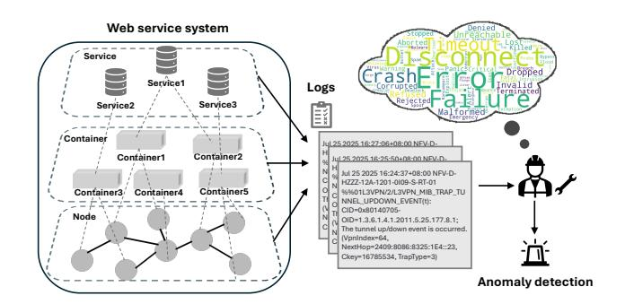

Figure 1: A distributed web service emits logs across nodes, containers, and services, which are aggregated for analysis.

manual rule creation is labor-intensive and brittle; (2) automated rule mining often generates overly specific or noisy patterns that do not generalize.

Recent advances in large language models (LLMs) create a new design space: LLMs can propose semantically informed candidate anomalous log patterns from small sets of abnormal and normal examples, substantially reducing the human effort in rule discovery. Yet LLM proposals alone are unsafe to deploy: they may hallucinate plausible yet empirically ineffective patterns, or produce overly general rules that cause cascading false alarms[\[2,](#page-8-25) [15,](#page-8-26) [25\]](#page-8-27).

To address these challenges and motivated by these operational realities, we propose Smart Eye , a practical paradigm that combines the generative strengths of LLMs with deterministic, data-driven selection and refinement to produce compact, interpretable, and low-latency log detectors. These detectors operate as structured rule sets for identifying abnormal logs, which are compiled into regular expressions and deployed for online inference. Smart Eye treats LLMs strictly as proposal engines: each candidate pattern for anomalous log is parsed and then validated on sampled labeled data using explicit rules for the trade-off between false positives (FP) and false negatives (FN). We further refine accepted parent rules into child rules or targeted exclusion rules using robust heuristics and secondary LLM proposals, producing a small set of precise detectors ready for deployment. Concretely, Smart Eye is guided by three design principles: Our contributions are:

- Rethinking log anomaly detection for industrial requirements. Based on the practical needs of log anomaly detection in industrial web service systems, we analyze the primary defects of current deep learning based pipelines: missing keywords caused by parsing, the black-box predicament of embedding models, and the high cost of deployment. Motivated by these issues, we rethink the role of explicit pattern detectors and discover that integrating LLMs into traditional critical pattern discovery yields a promising new industrial route for log anomaly detection.
- A practical key pattern paradigm for web service system. Smart Eye implements a two-stage algorithm that includes a parent with child derivation heuristic and explicit acceptance rules to control and rank LLM proposals. These mechanisms allow the system to produce compact and highprecision detectors suitable for operational use.

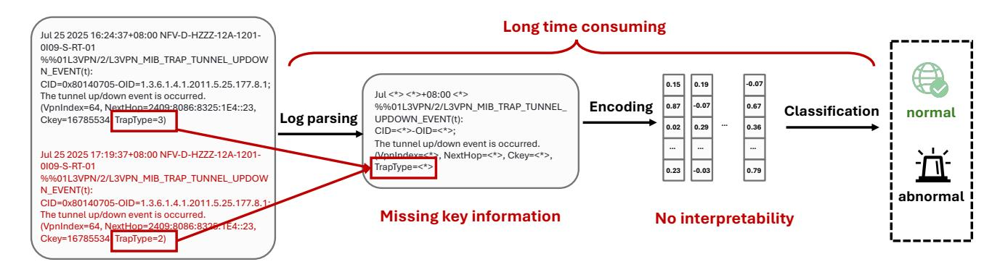

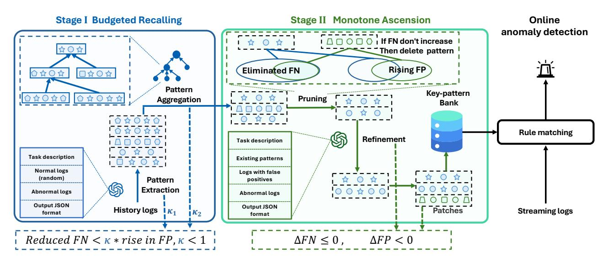

Table 1: Performance comparison of log anomaly detection methods.

| Method     | Precision | Eo Recall | F1-score | Precision | Messages Recall | F1-score | Precision | Route Recall | F1-score | avg-F1 |
|------------|-----------|-----------|----------|-----------|-----------------|----------|-----------|--------------|----------|--------|
| Deeplog    | 0.7895    | 0.8174    | 0.8032   | 0.5772    | 0.9021          | 0.7040   | 0.9762    | 0.4596       | 0.6250   | 0.7107 |
| neurallog  | 0.9721    | 0.5051    | 0.4939   | 0.9003    | 0.8501          | 0.8873   | 0.9296    | 0.7593       | 0.8126   | 0.7313 |
| LightAD    | 0.8182    | 0.4186    | 0.5538   | 0.8158    | 0.8158          | 0.8158   | 0.9709    | 0.7752       | 0.8621   | 0.7439 |
| Logcae     | 0.8732    | 0.5327    | 0.6617   | 0.8231    | 0.7289          | 0.7731   | 0.9362    | 0.7313       | 0.8212   | 0.7520 |
| Robustlog  | 0.4383    | 0.5126    | 0.4726   | 1.0000    | 0.7791          | 0.8758   | 1.0000    | 0.8434       | 0.9150   | 0.7545 |
| Loganomaly | 0.8892    | 0.8747    | 0.8819   | 0.5333    | 0.8112          | 0.6436   | 0.9863    | 0.8072       | 0.8878   | 0.8044 |
| Logformer  | 1.0000    | 0.8376    | 0.9116   | 1.0000    | 0.7558          | 0.8609   | 1.0000    | 0.8494       | 0.9186   | 0.8970 |
| LogCNN     | 0.9289    | 0.8989    | 0.9026   | 1.0000    | 0.8488          | 0.9182   | 0.9376    | 0.7835       | 0.8725   | 0.9044 |
| PLElog     | 0.9544    | 0.8520    | 0.9056   | 1.0000    | 0.7907          | 0.8831   | 1.0000    | 0.8675       | 0.9290   | 0.9059 |
| MIDLog     | 0.9763    | 0.8332    | 0.8991   | 1.0000    | 0.8286          | 0.9063   | 0.9695    | 0.8753       | 0.9199   | 0.9084 |
| Logbert    | 1.0000    | 0.8592    | 0.9243   | 1.0000    | 0.8086          | 0.8976   | 1.0000    | 0.8253       | 0.9043   | 0.9087 |
| Smart Eye  | 1.0000    | 1.0000    | 1.0000   | 1.0000    | 1.0000          | 1.0000   | 1.0000    | 0.8732       | 0.9323   | 0.9774 |

# 4 Experiments

# 4.1 Experimental Setups

4.1.1 Dataset. In order to better evaluate the operation and maintenance effect of log detection models on real web service systems, we evaluate the log anomaly detector three large-scale industrial log scenarios from Huawei Cloud Core 5G: EO (106 ), Message (5 × 107 ), and Route ( 2 × 107 ) using the experimental protocol and headings consistent with practice.

EO(sensor alarms). Structured, fielded records from server BMC/hardware monitors (e.g., DIMM presence, power, temperature). Alarms are high-frequency with low semantic entropy. This corpus reflects hardware-health observability at the physical layer of the 5G core.

Message (syslog). Semi-structured Linux/system-service traces (e.g., ntpd, security and daemon facilities). These logs provide OS/service-level context used by SREs for audit.

Route (data-plane state). Highly standardized control-plane messages marking distributed state transitions, e.g., BEGIN or END of synchronization windows and trap reports with typed fields.

4.1.2 Experiment Setting. All runs execute on commodity CPU servers (Python 3.9; no GPUs required at inference).

Dataset Splits. For each scenario we use a chronological split to avoid leakage: early window for training/selection, strictly later window for testing.

Data Preprocessing. We read raw lines (strip trailing newline only). No tokenization, parsing, or template mining is applied prior to training/inference—by design, KeyPattern preserves lexical fidelity and works directly on raw text.

LLM Selection. To minimize token cost and align with in-house deployment, the Huawei internal Qwen-3-32b endpoint is used as the proposal engine.

4.1.3 Evaluation Metric. We report Precision, Recall, and F1 perscenario, and the macro average across the three scenarios. Metrics are computed at the line level against ground-truth indices; all

counts use exact set operations on TP, FP, FN produced by the detector.

Precision = TP TP + FP , Recall = TP TP + FN , F1 = 2 Precision · Recall Precision + Recall

4.1.4 Baselines. We compare against widely used log anomaly detectors representative of parser embedder, CNN, RNN, and transformer based designs, including DeepLog[\[6\]](#page-8-28), NeuralLog[\[3\]](#page-8-29), LightAD[\[34\]](#page-8-30), Logcae[\[31\]](#page-8-31), RobustLog[\[39\]](#page-8-32), LogAnomaly[\[20\]](#page-8-33), LogCNN[\[19\]](#page-8-34), LogFormer[\[9\]](#page-8-35), PLELog[\[32\]](#page-8-36), LogBERT[\[10\]](#page-8-37), MIDLog[\[11\]](#page-8-38). Each baseline is run per scenario on the same train and test split and tuned per papers' recommendations, including parser configuration, window stride, embedding dimensionality, and learning rates. Where a baseline requires parsed templates, we use its own parser or preprocessor as released to avoid cross method bias.

### 4.2 Main Results

Across three industrial scenarios, Smart Eye attains the strongest line-level detection accuracy among all baselines (Table [1\)](#page-5-0). On EO and Messages, it achieves perfect F1 score 1.0), eliminating false negatives while incurring no false positives. On Route, Smart Eye reaches 0.9630 F1 with 1.0000 precision, 0.8732 recall, outperforming the best baseline PLElog, 0.9290 F1 by 3.4% and improving recall without collapsing precision. In macro average F1 score, Smart Eye yields 0.9877 F1 versus the strongest baseline (LogBERT with 0.9087), a 8% relative gain. EO and Messages are dominated by needle tokens (e.g., hardware faults, kernel I/O failure signatures). Stage I reliably surfaces such tokens and their comma-templates, driving recall to 1.0 without measurable precision loss. Route contains near-duplicate admin transitions with subtle parameter shifts; Stage II reduces spurious matches while retaining true tunnel-event alarms, yielding the best F1 overall.

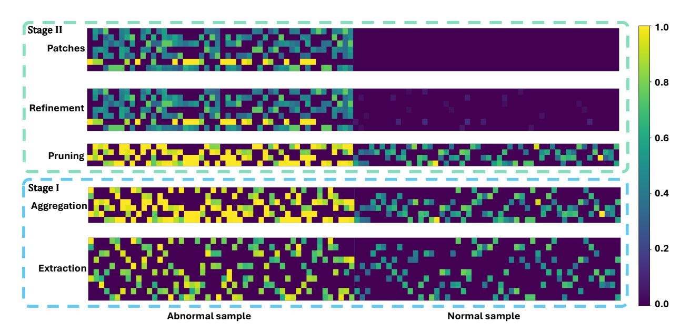

Figure 4: Attention heatmaps for key information retrieval. Bottom: Key pattern attention over 2000 samples where abnormal in left half and normal in right half. Top: Exclusion attention over the same samples.

# 4.3 Key information Retrieval

We treat key information retrieval as discovering and validating compact textual witnesses tokens or fielded templates whose presence is sufficient evidence of anomaly. Smart Eye realizes this as a two-stage, verifier guarded retrieval process.

Figure [4](#page-6-0) visualizes how Smart Eye retrieves decisive textual evidence and suppresses irrelevant retrieval cues.

The bottom panel Key Patterns shows attention from 20 representative anomaly key patterns across 2000 samples including left half 1000 abnormal and right half 1000 normal. Bright, vertically aligned streaks concentrate in the abnormal block, indicating compact, semantically stable tokens that repeatedly co-occur with failures. Limited, intentional overlap across patterns ensures robustness to heterogeneous fault expressions without inflating false positives. Occasional, low-amplitude responses on a small subset of normal lines reflect ambiguous phrases that appear in routine system activity. The top panel Exclusions demonstrates how those ambiguous normals are neutralized. Exclusion templates activate strongly on the same normal lines highlighted below, while remaining near-zero on abnormals. This pairing preserves high recall from the key patterns and restores precision by absorbing spillover into a controlled, human auditable exclusion set. It is worth noting that, as indicated by the white rectangle, even if key patten has false positives for normal samples, they will be corrected by exclusions

## 4.4 Interpretability

Figure [5](#page-6-1) shows how Smart Eye turns each alert into a compact, auditable explanation that aligns with operator mental models.

Stage I: Eliminate false negatives. The first highlight isolates the shortest phrase that is sufficient to explain the alert here. This witness is human readable and stable under benign template drift. Presenting the minimal trigger makes the decision easy to verify

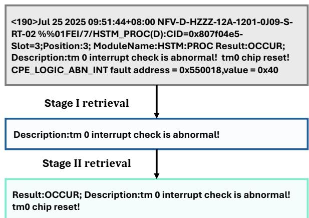

Figure 5: Interpretable evidence chain. From the raw log , Smart Eye surfaces a minimal key word pattern and then contextualizes it with corroborative fields.

and to act on, while avoiding unnecessary tokens that can blur responsibility.

Stage II: Eliminate false positives. The second highlight augments, not replaces, the witness with corroborative signals that practitioners already rely on. This widens semantic coverage for heterogeneous fault phrasing without sacrificing clarity, the alert still points to the same decisive root phrase and now flanked by confirmatory fields that justify escalation priority.

The staged evidence chain is practical in industrial scenarios: Triagability: alerts quote exactly the tokens engineers map to runbooks, reducing mean time to acknowledge; Auditability: each decision is tied to concrete fields rather than opaque embeddings, so

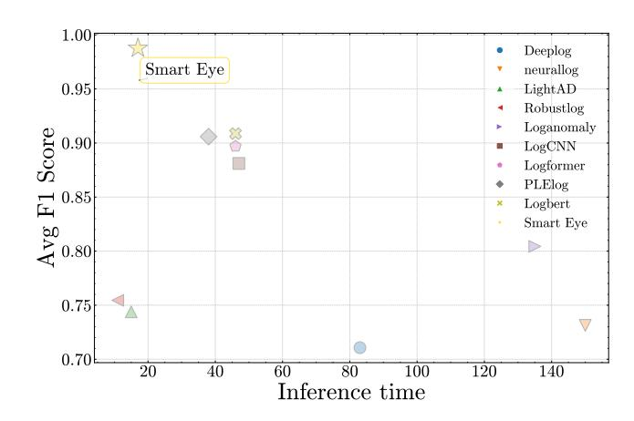

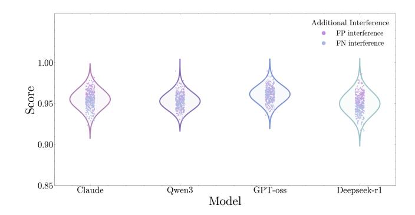

Figure 6: Average F1 score vs. Inference time

reviews and compliance checks are straightforward; Robustness to drift: because evidence is anchored to semantically stable tokens, routine wording changes do not degrade explanations; Safe iteration: teams can refine what counts as decisive or benign by editing visible patterns, preserving recall while trimming noise; Error forensics: when a case is disputed, the exact tokens that triggered the alert are visible, enabling targeted fixes instead of heuristic guesswork.

### 4.5 Time Consumption

The score and time landscape shows a clear separation. Classical pattern-driven baselines achieve short inference but plateau at moderate accuracy, while heavy neural log parsers improve accuracy at a significant latency cost. Smart Eye extends the frontier: it achieves state-of-the-art accuracy while maintaining lightweight inference. Positioned in the optimal high accuracy, low latency region of the figure [6,](#page-7-0) it eliminates the classic trade off between detection quality and system throughput. In practical terms, this means operators receive near-perfect alerts with minimal delay ideal for high volume, real time log pipelines.

### 4.6 Robustness to LLM

Stage I of Smart Eye uses an LLM strictly as a proposal engine; Stage II is a deterministic verifier that accepts a proposal only when it improves recall within a configured FP budget or strictly reduces FP without harming FN. We ask whether the overall detector is robust to the specific LLM API. We freeze datasets splits, prompts, and the verifier. For each LLM API we run Smart Eye with identical prompts, temperature 0, and a fixed token budget; we then verify on the same subsampled pools and deploy the accepted patterns.

| API                | Precision | Recall | F1-score |
|--------------------|-----------|--------|----------|
| GPT-oss-20b        | 1.0000    | 0.9720 | 0.9858   |
| Claude-sonet-4-20b | 1.0000    | 0.9673 | 0.9834   |
| Deepseek-r1-32b    | 1.0000    | 0.9626 | 0.9809   |
| Qwen-3-32b         | 1.0000    | 0.9577 | 0.9774   |

Table 2: Smart Eye is robust to the choice of proposal LLM: leading to a narrow F1 range.

Figure 7: Interference testing for deployment

Across APIs, precision is invariant at 1.0000, reflecting that hallucinated or overly general proposals are rejected by Stage II's guarded tests. The only measurable variation is recall, which tracks how richly each LLM surfaces synonymic templates and edge case witnesses; the resulting F1 spread is small, where absolute range 0.0084. These results support our design claim: with LLM as proposer and verifier-as-arbiter, Smart Eye 's end to end behavior is largely decoupled from the specific LLM API.

To account for differences in false positive and false negative tendencies across LLM APIs, we introduce controlled interference tests. These tests inject random FP and FN perturbations to evaluate system robustness under noisy conditions. As shown in Figure [7,](#page-7-1) performance remains tightly clustered across all models, underscoring Smart Eye 's stability under real deployment scenarios.

### 5 Conclusion

This work revisits web service system log anomaly detection through the lens of LLM information retrieval and shows that explicit, auditable lexical detectors when discovered with LLM assistance but accepted only by measured FP or FN deltas can satisfy the central operational desiderata of modern SRE practice. Smart Eye integrates a recall expanding stage cast as budgeted maximum coverage, and a precision enhancing refinement stage based on specialization and exclusions. The verifier, not the LLM, is the arbiter: proposals are adopted only when they improve recall within a configurable FP budget or strictly reduce FP without harming FN. This division of labor yields compact rule sets that preserve decisive tokens, offer line level justifications, and run at CPU only, low latency inference. Empirically, across real industrial scenarios of Huawei Cloud Core Network, Smart Eye attains superior F1 while producing explanations that align with operator mental models and runbook triggers. Qualitatively, the staged evidence chain transforms each alert into a minimal witness optionally contextualized by corroborating fields. Smart Eye extends the score latency frontier: it reaches higher accuracy than embedding heavy baselines without their inference costs.

### 6 ACKNOWLEDGMENTS

This work was supported by the National Key R&D Program of China (Young Scientist Program) (Grant No. 2025YFB3110000 ) and the National Natural Science Foundation of China-Research Grants Council (RGC) Joint Research Scheme (62321166652).

### References

[1] Alibaba. 2025. Alibaba Cloud Health Dashboard. [https://status.aliyun.com/#/](https://status.aliyun.com/##/historyEvent) [historyEvent.](https://status.aliyun.com/##/historyEvent) [2] Yinfang Chen, Huaibing Xie, Minghua Ma, Yu Kang, Xin Gao, Liu Shi, Yunjie Cao, Xuedong Gao, Hao Fan, Ming Wen, et al. 2024. Automatic root cause analysis via large language models for cloud incidents. In Proceedings of the Nineteenth European Conference on Computer Systems. 674–688. [3] Zeming Chen, Qiyue Gao, and Lawrence S Moss. 2021. NeuralLog: Natural language inference with joint neural and logical reasoning. arXiv preprint arXiv:2105.14167 (2021). [4] Hang Cui, Jingjing Li, Haotian Si, Quan Zhou, Changhua Pei, Gaogang Xie, and Dan Pei. 2025. TShape: Rescuing Machine Learning Models from Complex Shapelet Anomalies. In 2025 IEEE 36th International Symposium on Software Reliability Engineering Workshops (ISSREW). 9–14. [doi:10.1109/ISSREW67781.](https://doi.org/10.1109/ISSREW67781.2025.00038) [2025.00038](https://doi.org/10.1109/ISSREW67781.2025.00038) [5] Tianyu Cui, Shiyu Ma, Ziang Chen, Tong Xiao, Chenyu Zhao, Shimin Tao, Yilun Liu, Shenglin Zhang, Duoming Lin, Changchang Liu, et al. 2025. LogEval: A comprehensive benchmark suite for LLMs in log analysis. Empirical Software Engineering 30, 6 (2025), 173. [6] Min Du, Feifei Li, Guineng Zheng, and Vivek Srikumar. 2017. Deeplog: Anomaly detection and diagnosis from system logs through deep learning. In Proceedings of the 2017 ACM SIGSAC conference on computer and communications security. 1285–1298. [7] Evgeniy Gabrilovich and Shaul Markovitch. 2004. Text categorization with many redundant features: Using aggressive feature selection to make SVMs competitive with C4. 5. In Proceedings of the twenty-first international conference on Machine learning. 41. [8] Google. 2023. Google Cloud Services Hit by Outage in Paris. [https://thenewstack.](https://thenewstack.io/google-cloud-services-hit-by-outage-in-paris/) [io/google-cloud-services-hit-by-outage-in-paris/.](https://thenewstack.io/google-cloud-services-hit-by-outage-in-paris/) [9] Hongcheng Guo, Jian Yang, Jiaheng Liu, Jiaqi Bai, Boyang Wang, Zhoujun Li, Tieqiao Zheng, Bo Zhang, Junran Peng, and Qi Tian. 2024. Logformer: A pretrain and tuning pipeline for log anomaly detection. In Proceedings of the AAAI conference on artificial intelligence, Vol. 38. 135–143. [10] Haixuan Guo, Shuhan Yuan, and Xintao Wu. 2021. Logbert: Log anomaly detection via bert. In 2021 international joint conference on neural networks (IJCNN). IEEE, 1–8. [11] Minghua He, Tong Jia, Chiming Duan, Huaqian Cai, Ying Li, and Gang Huang. 2025. Weakly-Supervised Log-Based Anomaly Detection with Inexact Labels via Multi-Instance Learning. In Proceedings of the IEEE/ACM 47th International Conference on Software Engineering (Ottawa, Ontario, Canada) (ICSE '25). IEEE Press, 2918–2930. [doi:10.1109/ICSE55347.2025.00189](https://doi.org/10.1109/ICSE55347.2025.00189) [12] Shilin He, Jieming Zhu, Pinjia He, and Michael R Lyu. 2016. Experience report: System log analysis for anomaly detection. In 2016 IEEE 27th international symposium on software reliability engineering (ISSRE). IEEE, 207–218. [13] Junjie Huang, Zhihan Jiang, Zhuangbin Chen, and Michael Lyu. 2025. No More Labelled Examples? An Unsupervised Log Parser with LLMs. Proc. ACM Softw. Eng. 2, FSE, Article FSE107 (June 2025), 24 pages. [doi:10.1145/3729377](https://doi.org/10.1145/3729377) [14] Yintong Huo, Yichen Li, Yuxin Su, Pinjia He, Zifan Xie, and Michael R Lyu. 2023. Autolog: A log sequence synthesis framework for anomaly detection. In 2023 38th IEEE/ACM International Conference on Automated Software Engineering (ASE). IEEE, 497–509. [15] Soyeong Jeong, Jinheon Baek, Sukmin Cho, Sung Ju Hwang, and Jong C Park. 2024. Adaptive-rag: Learning to adapt retrieval-augmented large language models through question complexity. arXiv preprint arXiv:2403.14403 (2024). [16] Max Landauer, Sebastian Onder, Florian Skopik, and Markus Wurzenberger. 2023. Deep learning for anomaly detection in log data: A survey. Machine Learning with Applications 12 (2023), 100470. [17] Max Landauer, Florian Skopik, and Markus Wurzenberger. 2024. A critical review of common log data sets used for evaluation of sequence-based anomaly detection techniques. Proceedings of the ACM on Software Engineering 1, FSE (2024), 1354–1375. [18] Jinyang Liu, Junjie Huang, Yintong Huo, Zhihan Jiang, Jiazhen Gu, Zhuangbin Chen, Cong Feng, Minzhi Yan, and Michael R Lyu. 2023. Log-based Anomaly Detection based on EVT Theory with feedback. arXiv preprint arXiv:2306.05032 (2023). [19] Siyang Lu, Xiang Wei, Yandong Li, and Liqiang Wang. 2018. Detecting anomaly in big data system logs using convolutional neural network. In 2018 IEEE 16th Intl Conf on Dependable, Autonomic and Secure Computing, 16th Intl Conf on Pervasive Intelligence and Computing, 4th Intl Conf on Big Data Intelligence and Computing and Cyber Science and Technology Congress (DASC/PiCom/DataCom/CyberSciTech). IEEE, 151–158. [20] Weibin Meng, Ying Liu, Yichen Zhu, Shenglin Zhang, Dan Pei, Yuqing Liu, Yihao Chen, Ruizhi Zhang, Shimin Tao, Pei Sun, et al. 2019. Loganomaly: Unsupervised detection of sequential and quantitative anomalies in unstructured logs.. In IJCAI, Vol. 19. 4739–4745. [21] Microsoft. 2025. Microsoft's Azure networking takes a worldwide tumble. [https:](https://www.theregister.com/2024/07/30/microsofts_azure_portal_outage/) [//www.theregister.com/2024/07/30/microsofts\\_azure\\_portal\\_outage/.](https://www.theregister.com/2024/07/30/microsofts_azure_portal_outage/) [22] Xiaohui Nie, Hang Cui, Changhua Pei, Haotian Si, Ke Xiang, Jingjing Li, Yanbiao Li, Gaogang Xie, and Dan Pei. 2025. DeST: An Unsupervised Decoupled Spatio-Temporal Framework for Microservice Incident Management. In 2025 IEEE 36th International Symposium on Software Reliability Engineering (ISSRE). 335–346. [doi:10.1109/ISSRE66568.2025.00042](https://doi.org/10.1109/ISSRE66568.2025.00042) [23] Changhua Pei, Zihan Liu, Jianhui Li, Erhan Zhang, Le Zhang, Haiming Zhang, Wei Chen, Dan Pei, and Gaogang Xie. 2024. Self-evolutionary group-wise log parsing based on large language model. In 2024 IEEE 35th International Symposium on Software Reliability Engineering (ISSRE). IEEE, 49–60. [24] Jiaxing Qi, Shaohan Huang, Zhongzhi Luan, Shu Yang, Carol Fung, Hailong Yang, Depei Qian, Jing Shang, Zhiwen Xiao, and Zhihui Wu. 2023. Loggpt: Exploring chatgpt for log-based anomaly detection. In 2023 IEEE International Conference on High Performance Computing & Communications, Data Science & Systems, Smart City & Dependability in Sensor, Cloud & Big Data Systems & Application (HPCC/DSS/SmartCity/DependSys). IEEE, 273–280. [25] Yujia Qin, Shihao Liang, Yining Ye, Kunlun Zhu, Lan Yan, Yaxi Lu, Yankai Lin, Xin Cong, Xiangru Tang, Bill Qian, et al. 2023. Toolllm: Facilitating large language models to master 16000+ real-world apis. arXiv preprint arXiv:2307.16789 (2023). [26] Komal Sarda, Zakeya Namrud, Marin Litoiu, Larisa Shwartz, and Ian Watts. 2024. Leveraging large language models for the auto-remediation of microservice applications: An experimental study. In Companion Proceedings of the 32nd ACM International Conference on the Foundations of Software Engineering. 358–369. [27] Yicheng Sui, Yuzhe Zhang, Jianjun Sun, Ting Xu, Shenglin Zhang, Zhengdan Li, Yongqian Sun, Fangrui Guo, Junyu Shen, Yuzhi Zhang, et al. 2023. Logkg: Log failure diagnosis through knowledge graph. IEEE Transactions on Services Computing 16, 5 (2023), 3493–3507. [28] Yongqian Sun, Shiyu Ma, Tong Xiao, Yongxin Zhao, Xuhui Cai, Wei Dong, Yue Shen, Yao Zhao, Shenglin Zhang, Jing Han, et al. 2025. Accurate and Interpretable Log-Based Fault Diagnosis using Large Language Models. IEEE Transactions on Services Computing (2025). [29] Yongqian Sun, Tinghua Zheng, Xidao Wen, Weihua Kuang, Heng Liu, Shenglin Zhang, Chao Shen, Bo Wu, and Dan Pei. 2025. A Multimodal Intelligent Change Assessment Framework for Microservice Systems Based on Large Language Models. In Proceedings of the 33rd ACM International Conference on the Foundations of Software Engineering. 378–388. [30] Robert West, Evgeniy Gabrilovich, Kevin Murphy, Shaohua Sun, Rahul Gupta, and Dekang Lin. 2014. Knowledge base completion via search-based question answering. In Proceedings of the 23rd international conference on World wide web. 515–526. [31] Pei Xiao, Tong Jia, Chiming Duan, Huaqian Cai, Ying Li, and Gang Huang. 2024. LogCAE: An Approach for Log-based Anomaly Detection with Active Learning and Contrastive Learning. In 2024 IEEE 35th International Symposium on Software Reliability Engineering (ISSRE). 144–155. [doi:10.1109/ISSRE62328.2024.00024](https://doi.org/10.1109/ISSRE62328.2024.00024) [32] Lin Yang, Junjie Chen, Zan Wang, Weijing Wang, Jiajun Jiang, Xuyuan Dong, and Wenbin Zhang. 2021. Plelog: Semi-supervised log-based anomaly detection via probabilistic label estimation. In 2021 IEEE/ACM 43rd International Conference on Software Engineering: Companion Proceedings (ICSE-Companion). IEEE, 230–231. [33] Zhenhe Yao, Haowei Ye, Changhua Pei, Guang Cheng, Guangpei Wang, Zhiwei Liu, Hongwei Chen, Hang Cui, Zeyan Li, Jianhui Li, et al. 2024. SparseRCA: Unsupervised Root Cause Analysis in Sparse Microservice Testing Traces. In 2024 IEEE 35th International Symposium on Software Reliability Engineering (ISSRE). IEEE, 391–402. [34] Boxi Yu, Jiayi Yao, Qiuai Fu, Zhiqing Zhong, Haotian Xie, Yaoliang Wu, Yuchi Ma, and Pinjia He. 2024. Deep learning or classical machine learning? an empirical study on log-based anomaly detection. In Proceedings of the 46th IEEE/ACM international conference on software engineering. 1–13. [35] Delvin Ce Zhang and Hady Lauw. 2022. Dynamic topic models for temporal document networks. In International Conference on Machine Learning. PMLR, 26281–26292. [36] Delvin Ce Zhang and Hady W Lauw. 2021. Semi-supervised semantic visualization for networked documents. In Joint European Conference on Machine Learning and Knowledge Discovery in Databases. Springer, 762–778. [37] Shenglin Zhang, Yuhe Ji, Jiaqi Luan, Xiaohui Nie, Ziang Chen, Minghua Ma, Yongqian Sun, and Dan Pei. 2024. End-to-end automl for unsupervised log anomaly detection. In Proceedings of the 39th IEEE/ACM International Conference on Automated Software Engineering. 1680–1692. [38] Shenglin Zhang, Dongwen Li, Zhenyu Zhong, Jun Zhu, Minghan Liang, Jiexi Luo, Yongqian Sun, Ya Su, Sibo Xia, Zhongyou Hu, et al. 2022. Robust system instance clustering for large-scale web services. In Proceedings of the ACM Web Conference 2022. 1785–1796. [39] Xu Zhang, Yong Xu, Qingwei Lin, Bo Qiao, Hongyu Zhang, Yingnong Dang, Chunyu Xie, Xinsheng Yang, Qian Cheng, Ze Li, et al. 2019. Robust log-based anomaly detection on unstable log data. In Proceedings of the 2019 27th ACM joint meeting on European software engineering conference and symposium on the foundations of software engineering. 807–817.

### A Related work

Research on log anomaly detection has progressed along three intertwined lines: (i) sequence models over parsed log keys, (ii) neural representation learning from raw or parsed logs, and (iii) pretrained and adapt transformers pipelines. We briefly review representative systems in each family and clarify how our approach differs.

Sequence models with template parsing. DeepLog[\[6\]](#page-8-28) established the modern parse, sequence model and next event prediction recipe. Logs are first parsed into templates and parameters; an LSTM then learns normal transition patterns and flags unlikely events. The strength of this paradigm is its ability to model temporal dependencies in service workflows. Subsequent variants retain this overall structure while replacing the backbone or the scoring rule. Related methods such as LogAnomaly[\[20\]](#page-8-33) extend the sequential view with quantitative deviations in parameters, improving sensitivity to value shifts but still inheriting the parser's failure modes. Their weakness is brittle dependence on parsing quality small lexical cues that operators regard as decisive can be normalized away by parsers, leading to missed alerts.

Convolutional feature learners. LogCNN[\[19\]](#page-8-34) applies convolutional encoders to capture local n gram style regularities in tokenized logs, a choice that improves inference throughput over recurrent models and can be robust to moderate template drift. LightAD[\[34\]](#page-8-30) targets deployment efficiency via compact architectures and streamlined features, prioritizing low latency while trading some headroom in accuracy on heterogeneous, real-world corpora. Both methods exemplify the speed and accuracy space we analyze empirically.

Robustness oriented pipelines. RobustLog[\[39\]](#page-8-32) emphasizes resilience to noise and template variability in industrial logging, typically via stronger denoising, feature selection, or rule stabilization before the learner. Such systems aim to reduce false positives under drift but continue to funnel evidence through embeddings that are hard to audit line by line. Our results include RobustLog as a robustness-focused baseline on the same splits and settings.

Pretrained transformers for logs. LogBERT[\[10\]](#page-8-37) imported masked token pretraining to the log domain, yielding strong generalization across services and vendors; LogFormer[\[9\]](#page-8-35) extended this line with a pretrain and tune pipeline tailored to log semantics. These transformer baselines typically deliver higher F1 than shallow encoders but at the cost of heavier inference and reduced transparency, since decisions emerge from dense embeddings rather than explicit textual evidence. Both are among the strongest neural baselines in our study.

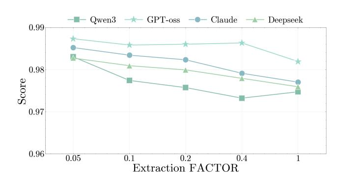

Neural symbolic and prompt driven detectors. NeuralLog[\[3\]](#page-8-29) represents a hybrid line of work that blends neural encoders with logical operators; when adapted to logs, the goal is to capture rule like structure while retaining statistical flexibility. PLELog[\[32\]](#page-8-36) reflects a complementary trend that leverages prompt or pattern learning to better align detectors with human readable cues. However, in practice their alarms still pass through distributed representations, limiting per line auditability. Each appears in our baseline panel with paper-recommended settings.

Unlike the above families which either depend on fragile parsing or hide decisions behind embeddings, we treat LLMs strictly as proposal engines and elevate a deterministic verifier to arbiter. Concretely, we retrieve compact key textual witnesses under an explicit false positive and false negative budget, then monotonically refine them via specialization and exclusions; the resulting detector quotes the exact tokens that triggered the alert and runs at CPUonly, low latency. This division of labor preserves decisive lexical cues and yields human auditable evidence chains while matching or exceeding the accuracy of embedding heavy baselines on industrial corpora.

### B Hyperparameter sensitivity

We make the three acceptance factors explicit so their roles and interactions are transparent.

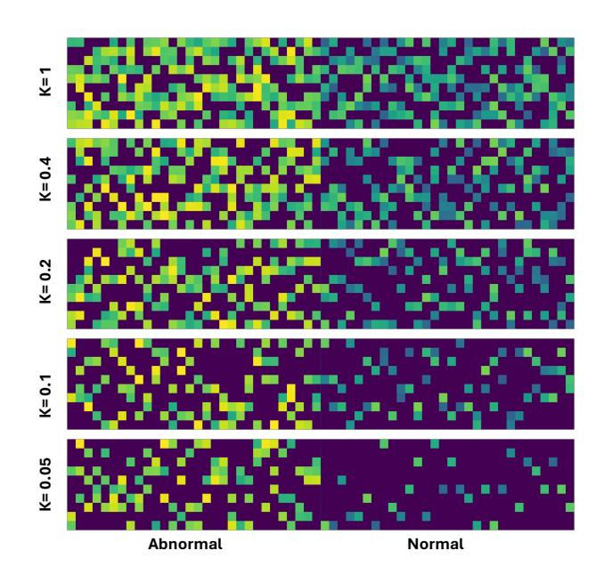

Figure 8: Attention heatmaps for ��1 robustness testing

Figure 9: Robustness testing for ��1 extraction

Stage I Pattern Extraction (��1). A candidate extraction pattern �� is accepted when it improves recall without disproportionate false positives (FP). Operationally, we require ΔFN ≤ 0 and bound the tolerated FP increase by the dropped FN:

ΔFN ≤ ��1ΔFP

Smaller ��1 is more conservative; larger ��1 accelerates recall growth but can inflate intermediate FP counts before aggregation and refinement.

Sensitivity to ��1 (Pattern Extraction). Figure [9](#page-9-0) summarizes the curves (values as provided in the figure data). We sweep ��1 ∈ {0.05, 0.1, 0.2, 0.4, 1.0}. Across model families (Qwen3, GPT-oss, Claude, DeepSeek), macro-F1 exhibits a broad plateau for ��1 ∈ [0.1, 0.4], with mild degradation at the extremes. Consistently, the attention maps in Figure [8](#page-9-1) show sharper focus on decisive fields in this mid range, while overly large ��1 diffuses attention to non discriminative context, explaining the observed precision drift.

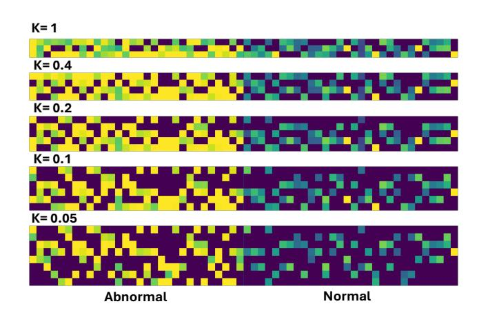

Figure 10: Attention heatmaps for ��2 robustness testing

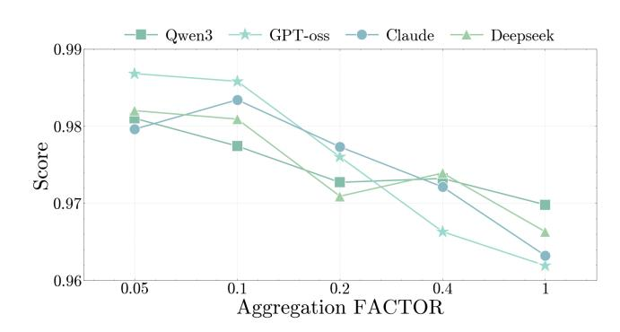

Figure 11: Robustness testing for ��2 aggregation

Stage I Pattern Aggregation (budget ��2). Aggregation considers broader parent patterns that unify several children under a budget. We apply the same guarded trade-off:

ΔFN ≤ ��2ΔFP,

and also enforce a per volume cap so that cumulative FP growth per 100k normal lines never exceed sviolently in a round. This prevents recall gains from being realized via a single overly permissive parent.

Sensitivity to��2 (Pattern Aggregation). We sweep��2 ∈ {0.05, 0.1, 0.2, 0.4, 1.0}. Aggregation is slightly more brittle than extraction (Figure [11\)](#page-10-1): permissive settings compress many children into a parent at the cost of measurable precision loss on noisier services; conservative settings maintain precision but leave some recall unrealized until Stage II. The heatmaps in Figure [10](#page-10-2) corroborate this trend: tighter budgets concentrate attention on parent defining tokens, whereas permissive ��2 spreads attention onto irrelevant fields, aligning with the precision drop.

### C Robustness to In-Context Example Count

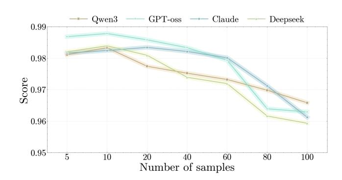

Figure 12: Effect of in context example count �� on F1 score across different models.

We study how the number of in context abnormal examples per proposal round (m) affects Smart Eye . Unless noted, we reuse the chronological splits, metrics, and implementation in [4](#page-5-1) and fix hyperparameters at the recommended defaults from [§B.](#page-9-2) For each �� ∈ {5, 10, 20, 40, 60, 80, 100}, we prompt four LLMs (Qwen3, GPToss, Claude, Deepseek) with�� label balanced exemplars drawn from the same round's positives and hard negatives, keeping proposal batch size and temperature unchanged.

Increasing �� beyond 40 reduces F1 for every model (e.g., GPToss drops from 0.9878 at �� =10 to 0.9629 at �� =100), consistent with prompt bloat, redundant or conflicting exemplars, and weaker inductive bias once salient contrasts are diluted. The inter-model spread near optimum is small, but variance widens at large ��, indicating sensitivity to example quality when the prompt is crowded.

These studies indicate that our method is robust and deployment ready in real industrial settings. The ��1 and ��2 sweeps reveal a wide operating plateau. Meanwhile moderate extraction and aggregation strictness maintains macro-F1 within a narrow band across model families. Varying the number of in context examples, our method has always remained within a very high, industrially acceptable range of F1 scores, which demonstrates favorable accuracy and interpretability, supporting reliable operation in industrial environments.