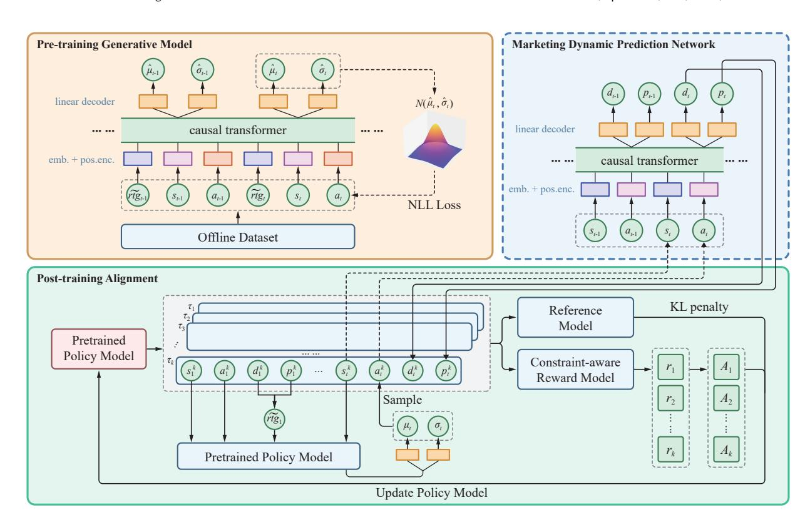

# **GAM: A Generative Auto-Marketing Framework in Online E-commerce Platforms**

Yuejia Dou∗ douyuejia@ruc.edu.cn Gaoling School of Artificial Intelligence, Renmin University of China Beijing, China

Shuai Dou doushuai.ds@alibaba-inc.com Alibaba Group Beijing, China

Yuchao Ma yc.ma@ruc.edu.cn Gaoling School of Artificial Intelligence, Renmin University of China Beijing, China

Bingzhe Wang wbz2022@ruc.edu.cn Gaoling School of Artificial Intelligence, Renmin University of China Beijing, China

Tianyu Wang yves.wty@alibaba-inc.com Alibaba Group Beijing, China

Zhilin Zhang zhangzhilin.pt@alibaba-inc.com Alibaba Group Beijing, China

Chuan Yu yuchuan.yc@alibaba-inc.com Alibaba Group Beijing, China

Jian Xu xiyu.xj@alibaba-inc.com Alibaba Group Beijing, China

Qi Qi†‡§ qi.qi@ruc.edu.cn Gaoling School of Artificial Intelligence, Renmin University of China Beijing, China

# **Abstract**

Auto-bidding plays an essential role in online advertising, allowing agents to automatically adjust bids for advertisers. Recently, the rise of Marketing Management service in e-commerce platforms has driven the evolution from auto-bidding to auto-marketing, enabling merchants to delegate their advertising bidding and product's coupon discounting decisions to agents. Auto-marketing requires agents to jointly decide on bidding and coupon discounting. Furthermore, compared to classic static constraints, auto-marketing agent faces a self-funding constraint (where the budget for both bidding and coupon discounting is entirely derived from the agent's commission revenue). Existing rule-based or RL-based methods often struggle with dynamic environments and complex sequential dependencies. To overcome these limitations, we propose a Generative Auto-Marketing framework (GAM), designed for performing joint sequential decisions on bidding and coupon discounting, and optimizing business objectives through post-training alignment. Furthermore, GAM employs a flexible, constraint-aware reward alignment module, and utilizes Group Relative Policy Optimization (GRPO) to align the pre-trained model, thus empirically balancing objective maximization and constraint satisfaction. We construct

∗Work is done during the internship at Alibaba Group.

‡Also with Beijing Key Laboratory of Research on Large Models and Intelligent Governance.

§Also with Engineering Research Center of Next-Generation Intelligent Search and Recommendation, MOE.

This [work is licensed under a Creative Commons Attribution 4.0 International License.](https://creativecommons.org/licenses/by/4.0) *WWW '26, Dubai, United Arab Emirates*

© 2026 Copyright held by the owner/author(s). ACM ISBN 979-8-4007-2307-0/2026/04 <https://doi.org/10.1145/3774904.3792805>

an offline simulation environment based on large-scale real-world dataset, and demonstrate the effectiveness of GAM through extensive experimental results.

# **CCS Concepts**

• **Information systems** → **Computational advertising**; • **Applied computing** → *Marketing*; *Online auctions*.

### **Keywords**

Generative Model, Preference Alignment, Auto-marketing

### **ACM Reference Format:**

Yuejia Dou, Shuai Dou, Yuchao Ma, Bingzhe Wang, Tianyu Wang, Zhilin Zhang, Chuan Yu, Jian Xu, and Qi Qi. 2026. GAM: A Generative Auto-Marketing Framework in Online E-commerce Platforms. In *Proceedings of the ACM Web Conference 2026 (WWW '26), April 13–17, 2026, Dubai, United Arab Emirates.* ACM, New York, NY, USA, [10](#page-9-0) pages. [https://doi.org/10.1145/](https://doi.org/10.1145/3774904.3792805) [3774904.3792805](https://doi.org/10.1145/3774904.3792805)

### **1 Introduction**

In recent years, online e-commerce platforms have experienced rapid growth[\[11](#page-8-0)]. With the increasing multi-channelization and personalization of marketing services, coordinating marketing strategies across channels (e.g., online advertising and coupon discounting) has become a key challenge for merchants, promoting the demand for automated marketing services. Auto-bidding, a classic automated marketing service, allows agents to automatically adjust ad bids on behalf of advertisers, greatly simplifying the advertising process [[1,](#page-8-1) [2\]](#page-8-2). However, auto-bidding only focuses on bidding and fails to include coupon discounting[\[33\]](#page-8-3), which is another essential marketing channel.This consequently requires merchants to spend effort coordinating bidding and coupon discounting strategies, inevitably leading to a reduction in operational efficiency [[15](#page-8-4)].

†Corresponding author.

Recently, Marketing Management service has emerged in major e-commerce platforms to further improve marketing efficiency, driving the evolution from auto-bidding to auto-marketing. Marketing Management service has been deployed on major e-commerce platforms, managing marketing strategies for hundreds of thousands of products daily while generating millions of transactions. Auto-marketing allows merchants to delegate their advertising bidding and product's coupon discounting decisions to agents, reducing the operational burden caused by separate configuration. In previous automated marketing services like auto-bidding, although agents could adaptively adjust bidding strategies, they still require merchants to pre-set static budgets or Key Performance Indicator (KPI) constraints to control risks [[2](#page-8-2), [16\]](#page-8-5). This leads to two main issues: first, setting appropriate static constraints for each channel is itself a complex task; second, static constraints lack flexibility, limiting the agent's capacity to adjust strategies based on real-time situations.

To address these issues, we propose a self-funding constraint in auto-marketing scenario, which better aligns with the essence of automated marketing services. Self-funding constraint requires that the agent's marketing costs (for bidding and coupon discounting) must be covered by commissions from product transactions, rather than obtaining pre-allocated budgets or KPI constraints from the merchant. Specifically, during the auto-marketing service, the agent automatically adjusts bids and coupon discounts on behalf of the merchant, and pays the corresponding costs. Simultaneously, auto-marketing agent collects a commission (usually a fixed percentage of the product's price) from the merchant per transaction to cover the marketing expenditure.The introduction of self-funding constraint shifts the burden of setting budgets and constraints from merchants to agents, effectively freeing merchants from complex marketing operations and granting agents greater decision-making autonomy.

Nevertheless, auto-marketing faces several inherent challenges. First, auto-marketing requires the agent to jointly decide on bidding and coupon discounting to maximize the cumulative value of won impressions. However, the decisions for ad bidding and coupon discounting are highly coupled, jointly impacting marketing performance. Second, the self-funding constraint requires the agent to balance costs and commissions throughout marketing period. Violating this constraint would result in platform deficits. Commonly used rule-based [[9](#page-8-6), [44\]](#page-8-7) or Reinforcement Learning (RL) methods [\[7,](#page-8-8) [43\]](#page-8-9) fail to solve these challenges. While rule-based methods lack adaptability to the dynamic online e-commerce environment [[7](#page-8-8)], while RL-based methods rely on the Markov assumption, failing to capture sequential historical dependencies and temporal correlations [\[8](#page-8-10), [13,](#page-8-11) [27](#page-8-12)].

The above methods are limited by their lack of flexibility and inability to capture value dependencies and temporal correlations. The rise of the generative paradigm, especially the successful application of Decision Transformer (DT) [[8\]](#page-8-10) in offline reinforcement learning, offers an innovative solution for complex sequential decisionmaking tasks. By reframing the decision process as a conditional sequence modeling task, DT effectively captures the context and temporal dependencies of historical marketing decisions.

However, directly deploying DT in the auto-marketing faces several critical challenges. First, limited by the quality and coverage

of the training dataset, DT may fail to learn the optimal strategy solely through offline training. Second, the standard DT paradigm conditions its policy on Return-To-Go (RTG) during training. However, using only reward-based RTG fails to express the objective of maximizing the marketing objective while ensuring constraint satisfaction [[15](#page-8-4), [16](#page-8-5)]. Third, existing research generally overlooks post-training alignment of DTs, resulting in reliance on periodic retraining of the foundation model to adapt to changing business needs, which leads to training overhead and resource waste.

To overcome these limitations, we propose a DT-based Generative Auto-Marketing framework (GAM), which provides an end-toend generative solution for the auto-marketing problem, supporting the alignment of pretrained policy model to adapt to marketing objectives. First, we reframe the auto-marketing problem as a joint sequential decision-making task [[34\]](#page-8-13) and adopt DT to jointly optimize bidding and coupon discounting decisions. By learning a stochastic policy, we provide the policy model with effective exploration capability to mitigate out-of-distribution risk. Second, we propose a constraint-aware reward preference alignment paradigm, using reinforcement learning to optimize pretrained policy model in the post-training phase. Specifically, we first introduce a Marketing Dynamic Prediction Network (MDPN) for offline evaluation of the policy model. Next, to guide policy updates, we construct a Constraint-Aware Reward Model (CARM) to transform the self-funding constraint into a component of the reward signal. Finally, we utilize Group Relative Policy Optimization (GRPO) [\[32](#page-8-14)]for efficient fine-tuning, thereby avoiding the expensive overhead of repeatedly retraining the foundation model, which offers important practical significance.

In summary, our contributions are:

- We introduce an innovative marketing service Marketing Management in online e-commerce platforms, and are the first to study the auto-marketing problem in this scenario, providing a novel research perspective.
- We model the auto-marketing problem as a sequential decisionmaking problem and propose an end-to-end generative framework, GAM. GAM leverages DT to jointly optimize bidding and coupon discounting decisions, effectively addressing the limitations of commonly used methods. Furthermore, GAM employs reinforcement learning to align pretrained generative model with complex business objectives.
- We validate the effectiveness and adaptability of our proposed approach through extensive experiments.

## **2 Related Work**

# **2.1 Auto-bidding and Coupon Discounting**

Auto-bidding helps advertisers maximize their advertising objectives under constraints by adaptively optimizing bids for each impression [[16](#page-8-5), [41\]](#page-8-15). Early approaches primarily rely on predefined rules [[9](#page-8-6), [44](#page-8-7)] and online feedback [[42](#page-8-16), [45](#page-9-1)]to adjust bidding strategies. With the increasing complexity of online bidding environments, reinforcement learning has become crucial for auto-bidding. USCB [[16\]](#page-8-5)proposes a unified RL solution for the constrained autobidding problem. With the emergence of the generative paradigm, works such as Diffbid [\[15](#page-8-4)], CBD [[26](#page-8-17)], GAVE [\[13\]](#page-8-11), and GRAD [[24](#page-8-18)]

utilize diffusion models and transformers to optimize bidding trajectories.

Coupon discounting is a core marketing strategy in e-commerce platforms for incentivizing consumption [\[5\]](#page-8-19). Prior approaches model this as an online knapsack problem [\[3](#page-8-20), [14](#page-8-21), [25\]](#page-8-22)or utilize bandit feedback for strategy optimization [\[19,](#page-8-23) [28,](#page-8-24) [35,](#page-8-25) [36](#page-8-26)]. Current mainstream paradigms involve using machine learning [[47,](#page-9-2) [49,](#page-9-3) [50\]](#page-9-4)and reinforcement learning [[38,](#page-8-27) [39,](#page-8-28) [46\]](#page-9-5) for end-to-end optimization of coupon distribution strategies.

### **2.2 Offline Reinforcement Learning and Decision Transformer**

Offline reinforcement learning focuses on learning effective policies from a static dataset without requiring online interaction, with methods like BCQ [[12\]](#page-8-29)and CQL [\[23\]](#page-8-30) effectively solve the issue of value function overestimation, and IQL [[22](#page-8-31)] reduces distribution shift through implicit policy improvement. However, RL-based methods rely on the Markov assumption, limiting their ability to model sequential dependencies. Generative models, represented by Decision Transformer (DT) [\[8\]](#page-8-10), overcome this limitation by reframing offline RL as a conditional sequence modeling task. Methods like QT [\[17\]](#page-8-32), QCS [\[20\]](#page-8-33) enhance DT's ability to extract high-return policies from dataset, and ODT [\[48\]](#page-9-6) introduces a sample-efficient online learning framework.

# **2.3 Preference Alignment**

Preference alignment aims to fine-tune a pretrained generative model to specific preferences, thereby guiding the model to generate outputs that align with human preferences. RLHF [\[30\]](#page-8-34) optimizes model generation quality by using human feedback as reward signal. DPO [[31](#page-8-35)] and its extensions [[4,](#page-8-36) [10](#page-8-37), [29,](#page-8-38) [40\]](#page-8-39) directly optimize the base model using human preference datasets. GRPO [\[32\]](#page-8-14) improves the stability and efficiency of fine-tuning by adopting group-relative advantage estimation and reward functions. To the best of our knowledge, we are the first to explore reward preference alignment for DT-based generative models, enabling them to adapt to different preferences without costly retraining.

### **3 Preliminary**

# **3.1 Auto-Marketing Problem Formulation**

We consider the auto-marketing problem, where an auto-marketing agent automatically adjusts marketing decisions on behalf of merchant. In a certain period of time, assume that �� impression opportunities arrive sequentially, indexed by �� ∈ [�� ]. The auto-marketing agent participates in real-time competition by submitting a bid ���� and a coupon discount ���� for each opportunity, aiming to maximize the cumulative value of won impressions. The agent wins impression �� if its bid ���� exceeds the highest bid from other participants. Upon winning, the merchant obtains a value ���� and the agent pays the bidding cost ���� and the coupon cost ���� ���� . Under a generalized second-price auction mechanism, bidding cost ���� equals the second-highest bid. The objective of the auto-marketing agent is to maximize the cumulative value of won ad impressions within this period:

max ∑ �� �������� (1)

where ���� ∈ {0, 1} is a binary indicator denoting whether the agent wins impression ��. The value ���� of impression �� is calculated using metrics such as conversion rate and click-through rate.

The agent's coupon discount ���� affects���� by influencing the user's purchase propensity towards the advertised product. Specifically, a higher ���� typically enhances the user's purchase propensity, thereby increasing click-through rate and conversion rate, ultimately leading to higher impression value.

Simultaneously, the auto-marketing agent must satisfy the selffunding constraint to control marketing expenditure.This constraint requires that the total cost incurred by the agent for bidding and coupon discounting must not exceed the total commission revenue obtained from the value of won impressions during that period. Compared to merchants manually setting static budgets and KPI constraints, the self-funding constraint alleviates the operational burden on merchants and provides the agent with a more flexible decision space. Specifically, for all �� impression opportunities in this period, the agent's commission rate is fixed at ��. For a won impression ��, the agent pays the bidding cost ���� and the coupon cost ���� ���� , while receiving a commission revenue of ������ . The self-funding constraint can be formalized as:

∑ �� �������� + ∑ �� ���� �������� ≤ ∑ �� ���������� (2)

Therefore, considering the marketing objective and the self-funding constraint, the entire process can be represented as:

max ���� ,���� ∑ �� �������� s.t. ∑ �� �������� + ∑ �� ���� �������� ≤ ∑ �� ���������� (3)

### **3.2 Generative Auto-Marketing**

The challenges in solving the auto-marketing problem primarily stem from the uncertainty of future marketing performance, and the complex coupling of the joint decision between bid ���� and coupon discount ���� . For this complex joint decision problem, a straightforward online learning solution introduces an independence assumption, decoupling the original problem into a two-stage optimization of coupon discounting and bidding. The intuition behind this decoupled paradigm is to set the coupon discount �� at the initial step and keep it fixed in the period to determine the upper bound of the bidding constraint. This simplifies the bidding decision in the period to a sub-problem: maximize the cumulative value of won impressions under a KPI constraint, which yields an optimal uniform bidding coefficient �� ∗ . However, this two-stage paradigm, based on the decoupling assumption, cannot guarantee the global optimality of its solution because it fails to directly learn from the joint distribution of bidding and coupon discounting.

Moreover, for the highly dynamic online e-commerce platform, the optimal marketing decision should be adjusted iteratively to maximize the cumulative value[[27](#page-8-12)]. This leads us to formulate the auto-marketing problem as a sequential decision-making task. Commonly used approaches for solving such tasks rely on rule-based strategies or RL techniques. However, rule-based strategies often fail to adapt to the high dynamism and uncertainty of the online ecommerce environment. Furthermore, the Markov property of RL

In each episode of the simulation environment, the auto-marketing agent predicts the marketing decison ���� (i.e., the uniform bidding parameter ���� and coupon discount ���� ) at timestep ��. Subsequently, MDPN evaluates the agent's policy based on the agent's decision and the historical state-action sequence of the current episode, returning an estimated transaction volume ���� and marketing cost ���� for time period ��.

### 5.1.2 Evaluation Metrics. Based on the objective of auto-marketing, we use the following metrics to evaluate performance:

- **Average Return on Investment (ROI):** The ratio of the total commission revenue to the total marketing cost for the agent over the entire simulation period, defined as

ROI = ∑�� ∑�� ���� ∑�� ∑�� ���� (16)

- **Average Reward (AR):**The average transaction volume obtained by the agent in each episode over the entire simulation period, defined as:

AR = 1 �� ∑ �� ∑ �� ���� (17)

- **Average Score (AS):** We use the score-based reward in Equation
  - [\(13\)](#page-5-1) to compute the average score obtained by the agent in each episode, where �� = 2:

AS = 1 �� ∑ �� ℙ(BCR��)∑ �� ���� (18)

5.1.3 Baselines. To validate the effectiveness of GAM in the simulation experiments, we compare it against a series of baselines:

- **Two-Stage Optimization (TSO)**: TSO decouples the joint decision problem in auto-marketing into a two-stage optimization of coupon discounting and bidding.
- **IQL**[\[22\]](#page-8-31): IQL performs implicit policy evaluation by applying expectile regression, thereby avoiding distribution shift without requiring access to out-of-scope actions.
- **DT**[[8\]](#page-8-10): DT employs the Transformer architecture for sequential decision-making modeling. In our implementation, we refer to the modification in Equation ([7\)](#page-3-2) to integrate the constraint into the pre-training stage.
- **GAVE**[\[13\]](#page-8-11): GAVE enhances DTs for offline generative auto-bidding through value-guided explorations.
- **GAS**[[27](#page-8-12)]: GAS implements a DT-based offline bidding framework with post-training search by applying Monte Carlo Tree Search (MCTS)[\[21\]](#page-8-42).

5.1.4 Implementation. We deploy the baseline models following the standard implementation, with necessary modifications made to suit the experiment requirements, such as extending the action space to accommodate joint decision-making. All experiments are conducted on NVIDIA A100 GPUs using the PyTorch framework, with the batch size set to 256. GAM's base policy model follows the standard DT implementation, adopting a Causal Transformer architecture with 8 attention layers and 16 attention heads, and setting the hidden layer size to 512. During training, we optimize the model parameters using the AdamW optimizer with a learning rate of 1e-5. The MDPN within GAM shares a largely identical architecture and parameter setting with the base policy model. However, MDPN generates deterministic outputs instead of a stochastic distribution and does not use RTG as input during training. We implemented the GRPO algorithm to be compatible with the DT architecture by referencing the original paper [\[32\]](#page-8-14) and a public implementation [[37](#page-8-43)], and we set the hyperparameters based on default values. Unlike standard GRPO practice, GAM's rollout procedure requires the next state at the current timestep to depend on the model's action output and the simulation environment's feedback. This necessitated modifying the standard practice's output generation and policy probability calculation components.

### **5.2 Experimental Results**

We conducted a comprehensive comparison of GAM's performance against various baseline methods in the simulation experiments, demonstrating the effectiveness of GAM over the baselines. The experimental results are summarized in Table [1](#page-6-0).

**Table 1: Comparison of GAM with baselines in the simulation experiment. The best performance is highlighted in bold.**

| Model | ROI     | AS    | AR    |
|-------|---------|-------|-------|
| TSO   | 82.77%  | 18.70 | 20.77 |
| IQL   | 72.05%  | 9.96  | 19.83 |
| DT    | 70.57%  | 14.78 | 19.41 |
| GAVE  | 88.63%  | 15.98 | 19.82 |
| GAS   | 92.45%  | 16.66 | 20.81 |
| GAM   | 109.16% | 22.22 | 23.63 |

Our results show that the rule-based TSO method exhibits competitive performance due to its intuitive heuristic design. However, it is limited by policy adjustment latency caused by decoupling bidding and coupon discounting decisions, making it difficult to reach global optimality. Furthermore, DT-based methods (DT, GAVE, and GAS) significantly outperform the traditional RL method (IQL), further validating the effectiveness of generative architectures in solving complex sequential decision-making problems. Notably, GAM achieves superior performance across all metrics compared to advanced baselines like GAVE and GAS. This confirms that by utilizing joint decision optimization and combining the pre-trained generative model with post-training alignment techniques, GAM effectively overcomes the limitations of existing methods and successfully aligns with complex business objectives.

# **5.3 Alignment Analysis**

One of the core challenges in auto-marketing is achieving a balance between optimizing business objectives and satisfying selffunding constraint, which necessitates adjusting the policy model's optimization objective according to business scenarios. GAM addresses this by employing a flexible reward model CARM, which allows the policy model to be aligned with various optimization objectives during the post-training phase.

We investigate GAM's performance under different optimization objectives and evaluation metrics to verify its adaptability and flexibility to various business scenarios. Specifically, we consider three optimization objectives by modifying the reward function settings in Equation ([13](#page-5-1)), defined as follows:

{ ��1 = ∑�� ���� ��2 = min {(������)2 , 1} ⋅ ∑�� ���� ��3 = min {(������)5 , 1} ⋅ ∑�� ���� (19)

Similarly, we modify the Average Score (AS) evaluation metric using the same modification, yielding the corresponding evaluation metrics AS1 ,AS2 , and AS3 . AS1 only considers the optimization of the business objective, representing business scenarios with no constraint restriction. AS2 is the default implementation in GAM, applying an appropriate penalty for constraint violation, representing the standard business scenario. AS3 further increases the penalty coefficient for constraint violation, representing business scenarios with strict restrictions on self-funding constraint satisfaction.

**Table 2: Alignment performance with different preferences.**

The results, presented in Table [2,](#page-7-0) show that GAM achieves highest performance when its training objective is precisely aligned with the evaluation metric. This finding highlights the importance of aligning the post-training objective with business preferences to achieve optimal performance, and further demonstrates GAM's ability to flexibly adapt to various optimization objectives through the incorporation of CARM.

## **5.4 Ablation Study**

To evaluate the effectiveness of each component within GAM, we conducted an ablation study by evaluating the following modified versions of GAM:

- **GAM w/o Post-training:** To evaluate the contribution of the post-training alignment step to GAM's performance, we remove the post-training module from GAM and only run the pre-trained policy model to predict marketing decisions.
- **GAM w/o MDPN:** To assess the necessity of constructing an offline policy evaluation environment, we remove MDPN from GAM and replace it with a rule-based predictor. This predictor does not rely on the model's actual action-state trajectory; instead, it directly uses the average transaction volume ̄ ���� and average marketing cost ��̄ �� up to timestep �� in the test dataset as the estimation of marketing dynamics.
- **GAM w/o CARM:** To evaluate the effectiveness of introducing the constraint signal into the reward preference alignment,

we remove CARM from GAM and only use the marketing objective as the reward signal during the post-training phase, i.e., �� = ∑�� ���� .

**Table 3: Ablation Study**

The results in Table [3](#page-7-1) demonstrate that all core modules of GAM are indispensable for achieving optimal performance. Specifically, GAM w/o Post-training significantly underperforms GAM, confirming the importance of preference alignment in post-training. Simultaneously, GAM w/o CARM yields inflated AR at the expense of a precipitous ROI and AS decline, this indicates that CARM's translation of the self-funding constraint into a constraint-aware reward is decisive for guiding policy updates toward constraintcompliant regions. Furthermore, the performance degradation of GAM w/o MDPN validates MDPN's indispensability as a sequenceaware dynamic prediction network for providing high-quality, actiondependent rollout evaluation for post-training.

### **6 Conclusion**

This paper introduces Marketing Management, an innovative marketing service in e-commerce platforms, and is the first to study the auto-marketing problem in this scenario, addressing the limitations of classic auto-bidding. We model the auto-marketing problem as a sequential decision-making problem and propose a novel generative auto-marketing framework, GAM, addressesing the dual challenges in auto-marketing:the self-funding constraint and the joint decision of bidding and coupon discounting. GAM utilizes DT architecture to reframe the joint decision-making as conditional auto-regressive sequential modeling, thereby effectively capturing the coupled dependencies between bidding and coupon discounting. Furthermore, by integrating a constraint-aware preference alignment module into GAM, we guide the model to achieve a balance between maximizing the business objective and constraint sanctification. Through extensive experiments, we demonstrate the effectiveness and adaptability of GAM, providing a general solution for automatically optimizing marketing activities on e-commerce platforms.

### **Acknowledgments**

This work was supported by National Natural Science Foundation of China (No. 62472428), Public Computing Cloud, Renmin University of China, the fund for building world-class universities (disciplines) of Renmin University of China and Alibaba Group through the Alibaba Research Intern Program.

### **References**

- [1] Gagan Aggarwal, Ashwinkumar Badanidiyuru, Santiago R Balseiro, Kshipra Bhawalkar, Yuan Deng, Zhe Feng, Gagan Goel, Christopher Liaw, Haihao Lu, Mohammad Mahdian, et al. 2024. Auto-bidding and auctions in online advertising: A survey. *ACM SIGecom Exchanges* 22, 1 (2024), 159–183. [2] Gagan Aggarwal, Ashwinkumar Badanidiyuru, and Aranyak Mehta. 2019. Autobidding with constraints. In *International Conference on Web and Internet Economics*. Springer, 17–30. [3] Javier Albert and Dmitri Goldenberg. 2022. E-commerce promotions personalization via online multiple-choice knapsack with uplift modeling. In *Proceedings of the 31st ACM International Conference on Information & Knowledge Management*. 2863–2872. [4] Mohammad Gheshlaghi Azar, Zhaohan Daniel Guo, Bilal Piot, Remi Munos, Mark Rowland, Michal Valko, and Daniele Calandriello. 2024. A general theoretical paradigm to understand learning from human preferences. In *International Conference on Artificial Intelligence and Statistics*. PMLR, 4447–4455. [5] Helmut Bester and Emmanuel Petrakis. 1996. Coupons and oligopolistic price discrimination. *International journal of industrial organization* 14, 2 (1996), 227–
- 242. [6] Robert C Blattberg and Abel P Jeuland. 1981. A micromodeling approach to investigate the advertising-sales relationship. *Management Science* 27, 9 (1981), 988–1005. [7] Han Cai, Kan Ren, Weinan Zhang, Kleanthis Malialis, Jun Wang, Yong Yu, and Defeng Guo. 2017. Real-time bidding by reinforcement learning in display advertising. In *Proceedings of the tenth ACM international conference on web search and data mining*. 661–670. [8] Lili Chen, Kevin Lu, Aravind Rajeswaran, Kimin Lee, Aditya Grover, Misha Laskin, Pieter Abbeel, Aravind Srinivas, and Igor Mordatch. 2021. Decision transformer: Reinforcement learning via sequence modeling. *Advances in neural information processing systems* 34 (2021), 15084–15097. [9] Ye Chen, Pavel Berkhin, Bo Anderson, and Nikhil R Devanur. 2011. Real-time bidding algorithms for performance-based display ad allocation. In *Proceedings of the 17th ACM SIGKDD international conference on Knowledge discovery and data mining*. 1307–1315. [10] Kawin Ethayarajh, Winnie Xu, Niklas Muennighoff, Dan Jurafsky, and Douwe Kiela. 2024. Kto: Model alignment as prospect theoretic optimization. *arXiv preprint arXiv:2402.01306* (2024). [11] David S Evans. 2009. The online advertising industry: Economics, evolution, and privacy. *Journal of economic perspectives* 23, 3 (2009), 37–60. [12] Scott Fujimoto, David Meger, and Doina Precup. 2019. Off-policy deep reinforcement learning without exploration. In *International conference on machine learning*. PMLR, 2052–2062. [13] Jingtong Gao, Yewen Li, Shuai Mao, Peng Jiang, Nan Jiang, Yejing Wang, Qingpeng Cai, Fei Pan, Peng Jiang, Kun Gai, et al. 2025. Generative Auto-Bidding with Value-Guided Explorations. In *Proceedings of the 48th International ACM SIGIR Conference on Research and Development in Information Retrieval*. 244–254. [14] Dmitri Goldenberg, Javier Albert, Lucas Bernardi, and Pablo Estevez. 2020. Free lunch! retrospective uplift modeling for dynamic promotions recommendation within roi constraints. In *Proceedings of the 14th ACM Conference on Recommender Systems*. 486–491. [15] Jiayan Guo, Yusen Huo, Zhilin Zhang, Tianyu Wang, Chuan Yu, Jian Xu, Bo Zheng, and Yan Zhang. 2024. Generative auto-bidding via conditional diffusion modeling. In *Proceedings of the 30th ACM SIGKDD Conference on Knowledge Discovery and Data Mining*. 5038–5049. [16] Yue He, Xiujun Chen, Di Wu, Junwei Pan, Qing Tan, Chuan Yu, Jian Xu, and Xiaoqiang Zhu. 2021. A unified solution to constrained bidding in online display advertising. In *Proceedings of the 27th ACM SIGKDD Conference on Knowledge Discovery & Data Mining*. 2993–3001. [17] Shengchao Hu, Ziqing Fan, Chaoqin Huang, Li Shen, Ya Zhang, Yanfeng Wang, and Dacheng Tao. 2024. Q-value regularized transformer for offline reinforcement learning. *arXiv preprint arXiv:2405.17098* (2024). [18] Jiahao Ji, Tianyu Wang, Yeshu Li, Yusen Huo, Zhilin Zhang, Chuan Yu, Jian Xu, and Bo Zheng. 2025. Bid2X: Revealing Dynamics of Bidding Environment in Online Advertising from A Foundation Model Lens. In *Proceedings of the 31st ACM SIGKDD Conference on Knowledge Discovery and Data Mining V. 2*. 4543– 4554. [19] Thorsten Joachims, Adith Swaminathan, and Maarten De Rijke. 2018. Deep learning with logged bandit feedback. In *International Conference on Learning Representations*. [20] Jeonghye Kim, Suyoung Lee, Woojun Kim, and Youngchul Sung. 2024. Adaptive ��-aid for conditional supervised learning in offline reinforcement learning. *Advances in Neural Information Processing Systems* 37 (2024), 87104–87135. [21] Levente Kocsis and Csaba Szepesvári. 2006. Bandit based monte-carlo planning. In *European conference on machine learning*. Springer, 282–293. [22] Ilya Kostrikov, Ashvin Nair, and Sergey Levine. 2021. Offline reinforcement learning with implicit q-learning. *arXiv preprint arXiv:2110.06169* (2021). [23] Aviral Kumar, Aurick Zhou, George Tucker, and Sergey Levine. 2020. Conservative q-learning for offline reinforcement learning. *Advances in neural information processing systems* 33 (2020), 1179–1191. [24] Yu Lei, Jiayang Zhao, Yilei Zhao, Zhaoqi Zhang, Linyou Cai, Qianlong Xie, and Xingxing Wang. 2025. Generative Large-Scale Pre-trained Models for Automated Ad Bidding Optimization. *arXiv preprint arXiv:2508.02002* (2025). [25] Liangwei Li, Liucheng Sun, Chenwei Weng, Chengfu Huo, and Weijun Ren. 2020. Spending money wisely: Online electronic coupon allocation based on real-time user intent detection. In *Proceedings of the 29th ACM International Conference on Information & Knowledge Management*. 2597–2604. [26] Yewen Li, Jingtong Gao, Nan Jiang, Shuai Mao, Ruyi An, Fei Pan, Xiangyu Zhao, Bo An, Qingpeng Cai, and Peng Jiang. 2025. Generative Auto-Bidding in Large-Scale Competitive Auctions via Diffusion Completer-Aligner. *arXiv preprint arXiv:2509.03348* (2025). [27] Yewen Li, Shuai Mao, Jingtong Gao, Nan Jiang, Yunjian Xu, Qingpeng Cai, Fei Pan, Peng Jiang, and Bo An. 2025. GAS: Generative Auto-bidding with Posttraining Search. In *Companion Proceedings of the ACM on Web Conference 2025*. 315–324. [28] Ying-Chun Lin, Chi-Hsuan Huang, Chu-Cheng Hsieh, Yu-Chen Shu, and Kun-Ta Chuang. 2017. Monetary discount strategies for real-time promotion campaign. In *Proceedings of the 26th International Conference on World Wide Web*. 1123– 1132. [29] Yu Meng, Mengzhou Xia, and Danqi Chen. 2024. Simpo: Simple preference optimization with a reference-free reward. *Advances in Neural Information Processing Systems* 37 (2024), 124198–124235. [30] Long Ouyang, Jeffrey Wu, Xu Jiang, Diogo Almeida, Carroll Wainwright, Pamela Mishkin, Chong Zhang, Sandhini Agarwal, Katarina Slama, Alex Ray, et al. 2022. Training language models to follow instructions with human feedback. *Advances in neural information processing systems* 35 (2022), 27730–27744. [31] Rafael Rafailov, Archit Sharma, Eric Mitchell, Christopher D Manning, Stefano Ermon, and Chelsea Finn. 2023. Direct preference optimization: Your language model is secretly a reward model. *Advances in neural information processing systems* 36 (2023), 53728–53741. [32] Zhihong Shao, Peiyi Wang, Qihao Zhu, Runxin Xu, Junxiao Song, Xiao Bi, Haowei Zhang, Mingchuan Zhang, YK Li, Yang Wu, et al. 2024. Deepseekmath: Pushing the limits of mathematical reasoning in open language models. *arXiv preprint arXiv:2402.03300* (2024). [33] Weiran Shen, Pingzhong Tang, Xun Wang, Yadong Xu, and Xiwang Yang. 2021. Coupon design in advertising systems. In *Proceedings of the AAAI Conference on Artificial Intelligence*, Vol. 35. 5717–5725. [34] Kefan Su, Yusen Huo, Zhilin Zhang, Shuai Dou, Chuan Yu, Jian Xu, Zongqing Lu, and Bo Zheng. 2024. Auctionnet: A novel benchmark for decision-making in large-scale games. *Advances in Neural Information Processing Systems* 37 (2024), 94428–94452. [35] Adith Swaminathan and Thorsten Joachims. 2015. Batch learning from logged bandit feedback through counterfactual risk minimization. *The Journal of Machine Learning Research* 16, 1 (2015), 1731–1755. [36] Adith Swaminathan and Thorsten Joachims. 2015. Counterfactual risk minimization: Learning from logged bandit feedback. In *International conference on machine learning*. PMLR, 814–823. [37] Leandro von Werra, Younes Belkada, Lewis Tunstall, Edward Beeching, Tristan Thrush, Nathan Lambert, Shengyi Huang, Kashif Rasul, and Quentin Gallouédec. 2020. TRL: Transformer Reinforcement Learning. [https://github.com/](https://github.com/huggingface/trl) [huggingface/trl](https://github.com/huggingface/trl). [38] Shuai Xiao, Le Guo, Zaifan Jiang, Lei Lv, Yuanbo Chen, Jun Zhu, and Shuang Yang. 2019. Model-based constrained MDP for budget allocation in sequential incentive marketing. In *Proceedings of the 28th ACM International Conference on Information and Knowledge Management*. 971–980. [39] Yidan Xing, Haoqi Zhang, Yangsu Liu, Dagui Chen, Zhenzhe Zheng, and Fan Wu. 2025. An Auto-Coupon Framework for Advertiser Retention in Online Advertising. In *Proceedings of the 31st ACM SIGKDD Conference on Knowledge Discovery and Data Mining V. 2*. 5095–5105. [40] Haoran Xu, Amr Sharaf, Yunmo Chen, Weiting Tan, Lingfeng Shen, Benjamin Van Durme, Kenton Murray, and Young Jin Kim. 2024. Contrastive preference optimization: Pushing the boundaries of llm performance in machine translation. *arXiv preprint arXiv:2401.08417* (2024). [41] Jian Xu, Zhilin Zhang, Zongqing Lu, Xiaotie Deng, Michael P Wellman, Chuan Yu, Shuai Dou, Yusen Huo, Zhiwei Xu, Zhijian Duan, et al. 2024. Auto-Bidding in Large-Scale Auctions: Learning Decision-Making in Uncertain and Competitive Games. In *NeurIPS 2024 Competition Track*. [42] Xun Yang, Yasong Li, Hao Wang, Di Wu, Qing Tan, Jian Xu, and Kun Gai. 2019. Bid optimization by multivariable control in display advertising. In *Proceedings of the 25th ACM SIGKDD international conference on knowledge discovery & data mining*. 1966–1974. [43] Yujian Ye, Dawei Qiu, Mingyang Sun, Dimitrios Papadaskalopoulos, and Goran Strbac. 2019. Deep reinforcement learning for strategic bidding in electricity markets. *IEEE Transactions on Smart Grid* 11, 2 (2019), 1343–1355. [44] Hao Yu, Michael Neely, and Xiaohan Wei. 2017. Online convex optimization with stochastic constraints. *Advances in Neural Information Processing Systems* 30 (2017).

[45] Weinan Zhang, Yifei Rong, Jun Wang, Tianchi Zhu, and Xiaofan Wang. 2016. Feedback control of real-time display advertising. In *Proceedings of the Ninth ACM International Conference on Web Search and Data Mining*. 407–416. [46] Yang Zhang, Bo Tang, Qingyu Yang, Dou An, Hongyin Tang, Chenyang Xi, Xueying Li, and Feiyu Xiong. 2021. BCORLE (��): An Offline Reinforcement Learning and Evaluation Framework for Coupons Allocation in E-commerce Market. *Advances in Neural Information Processing Systems* 34 (2021), 20410– 20422. [47] Kui Zhao, Junhao Hua, Ling Yan, Qi Zhang, Huan Xu, and Cheng Yang. 2019. A unified framework for marketing budget allocation. In *Proceedings of the 25th ACM SIGKDD International Conference on Knowledge Discovery & Data Mining*. 1820–1830. [48] Qinqing Zheng, Amy Zhang, and Aditya Grover. 2022. Online decision transformer. In *international conference on machine learning*. PMLR, 27042–27059. [49] Hao Zhou, Rongxiao Huang, Shaoming Li, Guibin Jiang, Jiaqi Zheng, Bing Cheng, and Wei Lin. 2024. Decision focused causal learning for direct counterfactual marketing optimization. In *Proceedings of the 30th ACM SIGKDD Conference on Knowledge Discovery and Data Mining*. 6368–6379. [50] Hao Zhou, Shaoming Li, Guibin Jiang, Jiaqi Zheng, and Dong Wang. 2023. Direct heterogeneous causal learning for resource allocation problems in marketing. In *Proceedings of the AAAI Conference on Artificial Intelligence*, Vol. 37. 5446–5454.