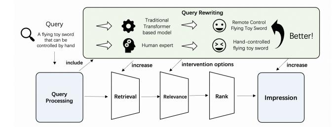
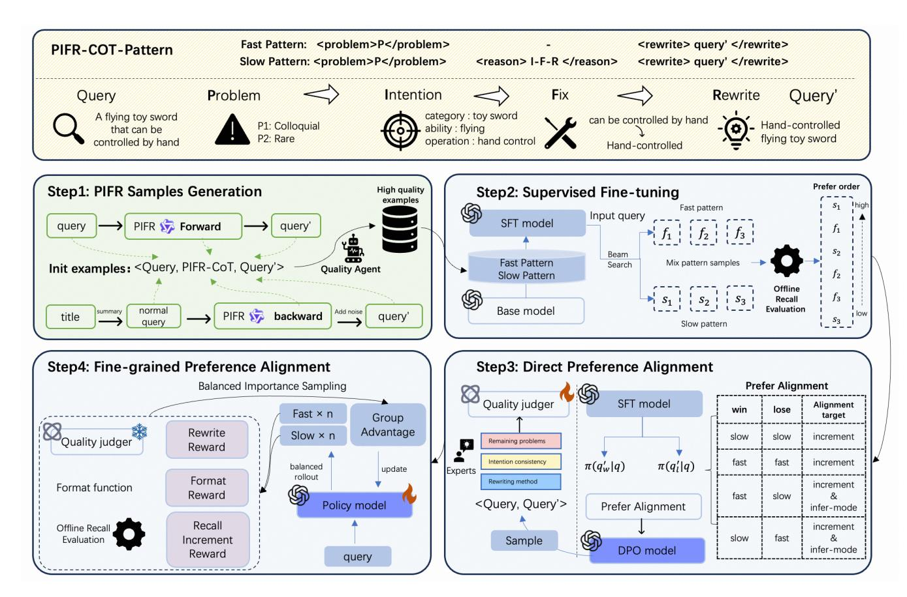

# Aligning Query Rewriting with Human Cognition and Preference in E-Commerce Search

Ruize Ou∗ Alibaba Group Hangzhou, Zhejiang, China ouruize.orz@taobao.com

Kai Wang∗ Alibaba Group Hangzhou, Zhejiang, China fanyuan.wk@alibaba-inc.com

Jianzhi Shao Alibaba Group Hangzhou, Zhejiang, China sjz250796@alibaba-inc.com

Tao Zhang† Alibaba Group Hangzhou, Zhejiang, China guyan.zt@taobao.com

Chengfu Huo Alibaba Group Hangzhou, Zhejiang, China chengfu.huocf@alibaba-inc.com

# Abstract

In e-commerce search, the diverse ways in which users express intentions lead to lexical and semantic gaps between queries and product descriptions, making query rewriting (QR) indispensable for improving matching efficiency. With the development of LLMs, QR has evolved from discriminative approaches to various LLM-based alignment methods. However, these methods typically treat all queries uniformly, without fundamentally distinguishing their rewriting difficulty or underlying linguistic issues, making the rewritten query deviate from human expectations. To address this limitation, we propose AWHCP (Aligning with Human Cognition and Preference), a novel framework that adopts a human-centric perspective and introduces the Problem–Intention–Fix–Rewrite (PIFR) paradigm. Built upon PIFR, AWHCP establishes a multi-granularity alignment training framework that simultaneously aligns with both system retrieval preferences and human rewriting behaviors. First, we construct high-quality PIFR-structured data and perform supervised fine-tuning to enable the model to learn human-like rewriting patterns. Second, we apply beam search to generate multiple candidates and leverage system-side feedback signals to conduct coarsegrained direct preference alignment, endowing the model with initial difficulty-aware reasoning capabilities. Third, we introduce a multi-dimensional rewrite quality judgment model trained via Group Relative Policy Optimization (GRPO), enabling fine-grained alignment with nuanced human rewriting preferences. Deployed on 1688's main search engine since August 2025, AWHCP has demonstrated strong effectiveness through extensive offline evaluations and large-scale online A/B tests, leading to a +3.9% gain in UV-L2O.

# CCS Concepts

• Information systems → Query reformulation; • Computing methodologies → Natural language generation.

### Keywords

Query Rewriting, Large Language Models, Reinforcement Learning, E-commerce Search, Chain-of-Thoughts

### ACM Reference Format:

Ruize Ou, Kai Wang, Jianzhi Shao, Tao Zhang, and Chengfu Huo. 2026. Aligning Query Rewriting with Human Cognition and Preference in E-Commerce Search. In Proceedings of the ACM Web Conference 2026 (WWW '26), April 13–17, 2026, Dubai, United Arab Emirates. ACM, New York, NY, USA, [10](#page-9-0) pages.<https://doi.org/10.1145/3774904.3792806>

# 1 Introduction

On e-commerce platforms, there exists a vast amount of user queries that are difficult to understand, including colloquial expressions, negations, zero or minimal utterances, ambiguous intents, and complex or redundant formulations. In most cases, search systems struggle to properly interpret such queries, leading to users failing to find their desired products. For instance, users may use vague and uniformly phrased queries such as "wall that leaves no trace" to search for products, which are better described as "wallpaper that does not damage walls". Apparently, the latter is a clearer, more standardized, and effective expression. To address the above issues, query rewriting (QR) is essential for transforming the original queries into semantically equivalent or similar rewritten queries, helping the system bridge the gap between user language and product language[\[6,](#page-8-0) [16\]](#page-8-1). As illustrated in fig. [1,](#page-1-0) the rewriting result is then applied in downstream stages of the search pipeline to improve both the richness and relevance of retrieval results.

Traditional discriminative methods [\[14,](#page-8-2) [31\]](#page-8-3) and seq2seq models with limited parameters[\[13,](#page-8-4) [22\]](#page-8-5) struggle in handling the types of problematic queries we have outlined above. Recently, the rapid advancement of Large Language Models (LLMs) in world knowledge, semantic understanding, and generative capabilities has spurred growing interest in leveraging LLMs for e-commerce query rewriting. Given that LLM performance is highly dependent on domainspecific knowledge of downstream tasks, most existing approaches [\[19,](#page-8-6) [21,](#page-8-7) [38\]](#page-8-8) fine-tune pre-trained LLMs via supervised fine-tuning (SFT) or reinforcement learning (RL). Nevertheless, many existing methods process all queries in a uniform manner, without distinguishing the inherent problems within each query, and thus do not adopt a divide-and-conquer strategy. In contrast, human experts tend to pay close attention to these aspects when performing rewriting tasks.

∗Both authors contributed equally to this research. †Corresponding author.

[This work is licensed under a Creative Commons Attribution 4.0 International License.](https://creativecommons.org/licenses/by/4.0) WWW '26, Dubai, United Arab Emirates © 2026 Copyright held by the owner/author(s). ACM ISBN 979-8-4007-2307-0/2026/04 <https://doi.org/10.1145/3774904.3792806>

Many prior works directly generate rewritten queries from input queries, paying little attention to the underlying reasoning process that guides effective rewriting. In contrast, human experts typically approach query rewriting systematically. By analyzing this expert cognition process, we derive a principled rewriting paradigm: Problem identification-Intent understanding-Fix problems-Rewrite (PIFR). Inspired by the recent advances in reasoning-oriented models such as OpenAI O1[\[12\]](#page-8-9), DeepSeek-R1[\[11\]](#page-8-10), and Qwen3[\[35\]](#page-8-11), we train LLMs to align with human expert thinking by explicitly generating Chain-of-Thought (CoT) in accordance with PIFR, and subsequently generating rewritten queries based on these intermediate steps, which offers greater interpretability compared to conventional "black-box" rewriting methods. Furthermore, it can improve the model's ability to handle the complex query rewriting task. To better balance reasoning depth and computational efficiency, we propose adaptive thinking, a reasoning mechanism that enables models to mimic human-like behavior in query rewriting: quickly processing simple queries, while carefully reasoning through complex ones, thus avoiding redundant computation on simple queries while retaining strong performance on challenging queries.

To enable models to reason through rewriting tasks with a similarly human-like perspective, we propose the framework to Align Query Rewriting with Human Cognition and Preference (AWHCP, illustrated in fig. [2\)](#page-2-0). The AWHCP framework involves four stages: PIFR samples generation, SFT and DPO, and fine-grained preference alignment. Specifically, in the first stage, we generate PIFR rewrites with forward inference and backward construction using noise augmentation, and filter them with a quality evaluation agent to build a clean, diverse training dataset. Next, we apply supervised finetuning (SFT) to emulate human expert rewriting behavior, equipping it with both fast and slow PIFR reasoning capabilities. Using beam search, we generate multiple rewriting candidates, which are then ranked by an offline recall scoring function to identify preferred outputs. Based on these rankings, we construct chosenrejected pairs to perform Direct Preference Optimization (DPO), aligning the model not only with system-level retrieval gains but also with latent human-like reasoning preferences. Ultimately, towards fine-grained alignment with the cognitive preferences of human experts in the rewriting process, we define rewrite quality, format matching, and recall-increment rewards and apply GRPO for iterative policy improvement.

The main contributions of this work are listed as follows:

- We propose a novel rewriting Chain-of-Thought (CoT) paradigm named PIFR that mimics the cognitive process of human experts and is conducive to adaptively handling complex query scenarios, providing a new direction for optimizing query rewriting.
- We propose a three-stage training framework comprising supervised fine-tuning, direct preference alignment, and fine-grained preference alignment, each targeting a distinct dimension of reasoning and rewriting enhancement.
- We demonstrate the effectiveness through both offline and online experiments, showcasing improvements in user experience and increases in platform revenue.

Figure 1: The role of query rewriting in the 1688 search system.

### 2 Related Works

### 2.1 Query Rewriting

Query rewriting is a critical component in modern search systems, particularly within e-commerce search, whose primary objective is to bridge the semantic gap between users' colloquial, everyday queries and merchants' standardized, professional product descriptions, thereby enhancing search recall and user experience [\[21\]](#page-8-7). The paradigm of query rewriting techniques in e-commerce has undergone a significant shift following the introduction of large language models (LLMs).

Traditional approaches primarily include discriminative methods and end-to-end generative methods. Discriminative methods generate candidate rewrites using techniques such as Pseudo-Relevance Feedback (PRF) [\[3,](#page-8-12) [30,](#page-8-13) [31\]](#page-8-3), search logs [\[1,](#page-8-14) [5,](#page-8-15) [14,](#page-8-2) [17\]](#page-8-16), and synonym dictionaries [\[2,](#page-8-17) [18\]](#page-8-18). End-to-end generative methods [\[13,](#page-8-4) [22,](#page-8-5) [27\]](#page-8-19) directly generate rewritten queries. However, due to their limited parameter size, these methods exhibit insufficient semantic understanding and generation capabilities compared to LLM-based approaches, particularly in handling the diverse expressions found in long-tail queries. LLM-based methods [\[10,](#page-8-20) [19,](#page-8-6) [21,](#page-8-7) [32,](#page-8-21) [38\]](#page-8-8) typically leverage pre-trained LLMs and enhance their query and product understanding capabilities through prompt engineering or posttraining techniques like Supervised Fine-Tuning (SFT) and Reinforcement Learning (RL). This leads to improved performance in e-commerce rewriting tasks. Nevertheless, these methods often lack detailed decomposition of the rewriting process and fail to fully exploit the reasoning capabilities inherent in modern models.

# 2.2 Alignment Methods of LLM

To align LLM outputs with human preferences, RL techniques have been integrated into LLM training to learn preference orderings between different outputs [\[4,](#page-8-22) [20,](#page-8-23) [28\]](#page-8-24). OpenAI's adoption of the Proximal Policy Optimization (PPO) algorithm [\[24\]](#page-8-25) for alignment training garnered significant attention. However, PPO faces challenges including difficult reward modeling and high training costs. Consequently, offline preference alignment algorithms represented by Direct Preference Optimization (DPO) [\[7,](#page-8-26) [23,](#page-8-27) [26,](#page-8-28) [36\]](#page-8-29) simplify the process to a single step of supervised fine-tuning, eliminating the need for separate reward and value model training. While DPO achieves preference alignment at lower cost, it struggles to model complex, fine-grained rewards when multiple dimensions of preference coexist, relying solely on pairwise comparisons. Group Relative Policy Optimization (GRPO) [\[25\]](#page-8-30) was subsequently introduced

Figure 2: Framework of AWHCP. Step1, generate samples conforming to the PIFR paradigm via both forward and backward generation. Step2, perform SFT training and use beam search to sample rewrite pairs, then obtain their offline feedback. Step3, construct a dataset from the offline feedback for DPO training to align preferences on recall increment and reasoning mode; collect additional samples and combine them with manual annotations to train a quality-judger model. Step4, apply GRPO training with fine-grained rewards to obtain the final model.

to address the high cost and difficulty of training value models in PPO, while also supporting more fine-grained reward function design. Therefore, we adopt a two-step alignment approach combining DPO and GRPO to perform coarse-grained and fine-grained alignment respectively, effectively mitigating the cost and training issues associated with PPO.

# 2.3 Chain-of-Thought

The Chain-of-Thought (CoT) paradigm, where LLMs perform intermediate reasoning steps before generating a final answer, has proven effective for complex reasoning tasks [\[12,](#page-8-9) [33\]](#page-8-31). Prior work in e-commerce rewriting has overlooked this potential. However, compared to direct answer generation, reasoning-based models generate a chain of thought even for simple instances, which not only introduces additional computational overhead but may also accumulate errors [\[9,](#page-8-32) [29\]](#page-8-33), leading to increased latency. Recently, hybrid reasoning has emerged as an effective solution, dynamically adapting the reasoning path (short answer or CoT) based on task difficulty [\[8,](#page-8-34) [15,](#page-8-35) [34,](#page-8-36) [37\]](#page-8-37), allowing the model to autonomously select its reasoning behavior without manual intervention. Inspired by

this concept, we enable the IFR steps within the PIFR paradigm to dynamically suppress their intermediate reasoning output based on the specific input query.

### 3 Method

### 3.1 Framework Overview

To humanize query rewriting, we propose the PIFR reasoning paradigm (Problem Identification, Intention Understanding, Fix Problems, and Rewriting), which decomposes rewriting into explicit reasoning stages and adaptively selects between fast and slow thinking according to query complexity. To realize this adaptive mechanism and align model preferences with human cognition, as shown in fig. [2,](#page-2-0) we design a framework for data construction and model training: (1)By bidirectional sample generation and quality filtering, we first construct a dataset with PIFR reasoning of two reasoning modes. (2) We employ SFT to equip the model with basic rewriting capabilities, followed by DPO using offline preference pairs based on recall increment to learn initial rewrite quality and reasoning mode preference. (3) Finally, we perform fine-grained

alignment using GRPO, with multi-dimensional rewards including quality scores from a dedicated judgment model, and adjust importance sampling to ensure balanced exploration of both inference modes, enabling adaptive thinking.

### 3.2 PIFR and Samples Generation

3.2.1 PIFR reasoning paradigm. Inspired by expert annotation practices in e-commerce query rewriting, we formulate PIFR (Problem Identification, Intention Understanding, Fix Problems, and Rewriting), a structured Chain-of-Thought (CoT) reasoning paradigm. In the Problem Identification step, it adopts a divide-and-conquer approach to categorize common problems in user queries into four distinct types: ambiguous phrasing, redundant phrasing, colloquial phrasing, and rare phrasing, to enable targeted fixes in later steps; during the Intention Understanding step, it understands the user's stated intentions and infers potential needs or objectives; in the Fix Problems step, appropriate corrections are applied according to the identified problem category; and finally, the Rewriting step generates a clear and standardized query that conforms to the intention through the replacement of synonyms based on the fixed query. This explicit decomposition not only mirrors the systematic reasoning of human experts but also enhances model consistency during inference when explicitly prompted, leading to outputs that better align with expert-level quality.

3.2.2 Samples Generation. The first stage of our pipeline is the generation of a dataset consisting of �� triplets {(���� , ���� , ��′ �� )}�� ��=1 , where �� is the original query, �� denotes the PIFR-guided Chain-of-Thought reasoning, and �� ′ is the corresponding rewritten query. To this end, we propose a bidirectional data generation strategy leveraging a general-purpose large language model (LLM), consisting of three components: two complementary generation procedures and a filter that retains high-quality samples.

Forward Generation. We begin by collecting an initial set of longtail queries through multi-dimensional filtering criteria, including syntactic irregularities, semantic ambiguity (e.g., synonymy/hypernymy confusion), suboptimal retrieval performance, and observed inefficiencies in real systems. Each filtered query is then processed by a general-purpose LLM conditioned on a PIFR-structured prompt and augmented with domain-specific knowledge via a RAG-enabled retrieval module. For each original query ��, the model generates multiple (��, ��′ ) pairs, where �� denotes the PIFR-guided Chain-of-Thought reasoning steps and �� ′ is the corresponding rewritten query.

Backward Generation. As single forward generation may lead to imbalanced distributions of query problem types and insufficient coverage of product knowledge across the entire product pool, we introduce a backward generation procedure that synthesizes query-rewrite pairs from a representative sample of products. We first prompt the LLM to generate a canonical query that accurately and naturally expresses the item's key attributes. Subsequently, we derive non-canonical source queries through controlled perturbations, such as omission, lexical substitution, or syntactic distortion based on the product title. This inverse process ensures that every target rewrite is semantically anchored in real product space to enrich the dataset. Importantly, different strategies for constructing non-canonical queries correspond to specific categories of query

issues, aligning with the Problem Identification and Fix Problem stages in the PIFR paradigm.

Quality Filtering. Due to the inherent variability in LLM generations, especially as we intentionally increase both sampling size and generation temperature to explore a wider solution diversity, the synthesized dataset contains samples of varying quality. As query rewriting is inherently open-ended (i.e., no ground truth), we prioritize diverse exploration during generation, and in order to ensure data reliability, we adopt a rejection-sampling mechanism. Specifically, we employ a LLM with few-shot prompting as a filter within a rejection sampling framework, guiding the selection of high-quality rewrite pairs. The LLM evaluates each pair based on reasoning criteria that align with the quality judgment principles detailed in section [3.4.1.](#page-4-0)

### 3.3 SFT and DPO

While the extended chain-of-thought reasoning in PIFR substantially improves the stability and quality of query rewriting, it also introduces non-trivial computational overhead. To strike a balance between quality and efficiency, we introduce an adaptive thinking mechanism, just like humans carefully analyze complex queries while quickly handling simple ones. In this mechanism, complex queries are processed via the full PIFR reasoning paradigm for rewrite generation, referred to as slow thinking, whereas simple queries are handled using only the Problem Identification step (i.e. the P in PIFR) as an intermediate representation, referred to as fast thinking. We operationalize this mechanism through the whole training pipeline.

3.3.1 Supervised Fine-tuning (SFT). Starting with the dataset processed from PIFR Samples Generation, we randomly mask the IFR steps of the reasoning chain in half of the samples as fast thinking. This strategy equips the model with fundamental rewriting capabilities under both fast and slow thinking modes, without inducing mode bias. The SFT training objective is the minimization of the negative log-likelihood over this mixed-mode dataset:

LSFT(��) = −E(��,��)∼D "∑︁ �� ��=1 log ���� ���� | ��, ��<�� # (1)

It is important to note that the input prompt templates for the two reasoning modes are identical; we do not explicitly provide reasoning-mode information in the input (i.e. �� in eq. [\(1\)](#page-3-0)). This is because the model's eventual ability to decide whether or not to engage in slow reasoning is designed to be adaptive. During the SFT stage, our objective is to train the model to focus on mastering query rewriting under the slow-PIFR or fast-P paradigms, without adding any preference toward either mode.

3.3.2 Beam Search. We employ beam search on the well-trained model to generate multiple candidate rewritten queries. Crucially, to ensure equitable coverage of both reasoning modes in the candidate pool, we enforce deterministic control over the reasoning generation. The token immediately following </reason> is constrained to be either <reason>, prompting further inference (slow path), or <rewrite>, triggering direct output rewritten queries (fast path). Beam search with a beam size B=3 is executed independently

under each enforced mode, thereby generating candidate rewritten queries representative of both reasoning modes.

3.3.3 Offline Feedback and Direct Preference Optimization (DPO). To align the rewriting model with the downstream retrieval objectives and to quantitatively assess its effectiveness, it is necessary to define explicit preference objectives and align the model accordingly. We employ the high-relevance tiered product incremental score, which measures the increment to which a rewritten query compared to the original query can retrieve additional highrelevance products. Intuitively, rewrites that surface a richer set of relevant products should receive higher incremental scores. Formally, we define an incremental scoring function:

incre(��, ��′ ) = �� (��,Z��′ \Z��;�� ) �� (��,Z��;�� ) , �� (��, Z��; ��) &gt; 0 �� (��, Z�� ′ ; ��), �� (��, Z��; ��) = 0 (2)

where Z�� denotes the set of products retrieved from the candidate pool by the query ��, and �� (��, Z; ��) denotes the number of products in the set Z whose relevance score to the query �� is greater than the threshold ��. The relevance score is computed by the relevance computation function of the search system.

We then generate 2�� candidate rewrites �� ′ per input query �� using beam search, comprising �� outputs from the fast-thinking mode and �� from the slow-thinking mode, and compute {incre(��, ��′ �� )}2�� ��=1 for each candidate �� ′ �� . Based on these results, we construct pairwise preference data by choosing pairs from all possible (2��) (2�� − 1) ordered pairs of candidates (�� ′ ��, ��′ ). A pair is included in the DPO dataset only if the chosen rewrite �� ′ �� demonstrates a significantly higher incremental score than the rejected one �� ′ :

incre(��, ��′ ��) &gt; �� · incre(��, ��′ ) (3)

where �� &gt; 1 acts as a margin threshold to ensure meaningful preference signals and reduce noise from marginal differences.

Crucially, to encode our prior that slow thinking should generally produce superior rewrites due to deeper reasoning, we incorporate reasoning-mode bias into ��. Specifically:

- When the chosen candidate comes from fast thinking and the rejected from slow thinking, we apply a lower threshold �� = 1.2, allowing such counterintuitive but empirically strong fast rewrites to still be recognized.
- In all other cases including slow-vs-fast, fast-vs-fast, and slow-vs-slow, we use a stricter threshold �� = 1.5.

Based on this preference signal, we perform DPO to align the model's output distribution with the desired objective.

This asymmetric design enables the model to learn not only what constitutes a semantically better rewrite in terms of retrieval impact, but also to internalize implicit preferences over reasoning strategies. The resulting DPO dataset thus contains comparisons across diverse reasoning paths, enabling the model to distill both what makes a good rewrite and how it should ideally be produced.

### 3.4 Fine-grained Preference Alignment

3.4.1 Quality Judgment Model. To reduce rewrites deemed lowquality from user or expert perspective, based on the textual and semantic correctness, we design a quality judgment model that

incorporates three complementary dimensions of quality criteria beyond incremental performance.

- Remaining phrasing problems: Whether the rewritten query fails to fix or introduces problems in expression, including ambiguous phrasing, redundant phrasing, colloquial phrasing, or rare phrasing.
- Rewriting method: Whether the rewrite employs low-value strategies that lack semantic transformation, such as merely adding words, reordering terms, or simply deleting words without meaningful refinement.
- Intention consistency: Whether the user intention is altered after rewriting, particularly in cases where the deletion or substitution of critical modifiers or the core product category occurs.

Each of these dimensions is formulated as a binary judgment indicating the presence or absence of a quality issue. Based on these principles, we use SFT to train a dedicated quality judgment model. For dataset construction, we first employed prompt-based annotation using a general-purpose LLM, followed by rigorous human review and correction to ensure label accuracy, and finally built the dataset by integrating annotations from all three tasks.

The well-trained quality judgment model demonstrates strong performance on this benchmark and is subsequently deployed in downstream stages. The quality judgment model serves two key purposes:

- Filtering candidates during the PIFR Sample Generation phase.
- Contributing to the reward signal in GRPO training to enable fine-grained optimization of the rewriting model.

3.4.2 Group Relative Policy Optimization (GRPO). Given that query rewriting admits no unique optimum and that fine-grained rewards increase value-function complexity, we adopt GRPO rather than PPO for fine-grained preference alignment. The GRPO reward comprises:

- Quality score: weighted averaged across expression, intention, and method dimensions using the quality judgment model.

��quality = ��1��expression + ��2��intention + ��3��method (4)

where ��1 = ��2 = 0.25 and ��3 = 0.5.

- Format score: a bonus when the output conforms to the PIFR slow-reasoning format or fast-reasoning format.

��format = ( 1, if ������������ matches regular expression �� 0, otherwise (5)

- Recall-increment score: in analogy to incre(��, ��′ ) presented in eq. [\(2\)](#page-4-1), the recall increment score is normalized to ensure it falls within the range [0, 1] .

��incre = �� (��, Z�� ′ \ Z��; ��) �� (��, Z�� ∪ Z�� ′ ; ��) (6)

The overall reward function combines the three scores via a weighted average:

��total = ��1��quality + ��2��format + ��3��incre (7)

where ��1 = 0.3, ��2 = 0.1, ��3 = 0.6.

Table 2: Overall performance across training stages

| Method Baselines         | Infer Mode | Δ mean | Relevant P(0) | Recall P(0.05) | Increment P(0.1) | P(0.2) | Average expression | Quality method | Score intention | Overall Score |
|--------------------------|------------|--------|---------------|----------------|------------------|--------|--------------------|----------------|-----------------|---------------|
| Qwen2.5-Max              | PE         | 12.94  | 25.97         | 13.15          | 10.67            | 8.23   | 0.700              | 0.708          | 0.815           | 0.385         |
| Qwen3-235B-A22B          | PE         | 13.65  | 26.01         | 13.25          | 11.11            | 9.06   | 0.741              | 0.612          | 0.844           | 0.385         |
| Deepseek-V3              | PE         | 12.46  | 24.89         | 12.51          | 10.39            | 8.19   | 0.673              | 0.613          | 0.876           | 0.369         |
| AWHCP Main Stages        |            |        |               |                |                  |        |                    |                |                 |               |
| AWHCP-base               | fast       | 13.01  | 23.40         | 12.38          | 10.21            | 8.07   | 0.693              | 0.689          | 0.840           | 0.383         |
|                          | slow       | 13.26  | 23.50         | 12.44          | 10.27            | 8.11   | 0.690              | 0.715          | 0.837           | 0.389         |
|                          | fast       | 24.87  | 30.28         | 18.67          | 15.85            | 13.01  | 0.534              | 0.626          | 0.795           | 0.468         |
| AWHCP-DPO                | slow       | 25.04  | 30.44         | 19.04          | 16.44            | 13.48  | 0.602              | 0.627          | 0.810           | 0.479         |
|                          | mix        | 25.29  | 30.72         | 18.96          | 16.25            | 13.50  | 0.600              | 0.635          | 0.808           | 0.482         |
|                          | fast       | 30.24  | 35.69         | 22.79          | 19.54            | 16.33  | 0.735              | 0.670          | 0.802           | 0.550         |
| AWHCP                    | slow       | 31.67  | 36.09         | 23.03          | 19.87            | 16.40  | 0.747              | 0.682          | 0.804           | 0.563         |
|                          | mix        | 31.43  | 36.09         | 23.04          | 19.73            | 16.33  | 0.760              | 0.688          | 0.809           | 0.564         |
| Ablation Studies         |            |        |               |                |                  |        |                    |                |                 |               |
| AWHCP-base w/o PIFR      | direct     | 12.83  | 23.58         | 12.30          | 10.03            | 7.77   | 0.694              | 0.680          | 0.848           | 0.379         |
| AWHCP w/o DPO            |            |        |               |                |                  |        |                    |                |                 |               |
|                          | fast       | 24.31  | 30.72         | 17.99          | 15.35            | 12.48  | 0.884              | 0.748          | 0.829           | 0.513         |
|                          | slow       | 24.88  | 29.89         | 17.87          | 15.23            | 12.52  | 0.882              | 0.754          | 0.833           | 0.518         |
|                          | mix        | 25.41  | 30.65         | 18.35          | 15.59            | 12.71  | 0.883              | 0.749          | 0.829           | 0.522         |
| AWHCP w/o quality reward |            |        |               |                |                  |        |                    |                |                 |               |
|                          | fast       | 27.61  | 32.53         | 20.91          | 18.21            | 15.11  | 0.546              | 0.541          | 0.861           | 0.492         |
|                          | slow       | 28.50  | 33.56         | 21.91          | 19.05            | 15.71  | 0.538              | 0.522          | 0.855           | 0.498         |
|                          | mix        | 28.96  | 33.67         | 21.74          | 18.89            | 15.56  | 0.539              | 0.516          | 0.857           | 0.499         |

Table 3: Performance and throughput of SFT model training from different base models

| Base      | Model Relevant Δ mean | Recall P(0) | Increment P(0.2) | fast  | Throughput (samples/s) slow |
|-----------|-----------------------|-------------|------------------|-------|-----------------------------|
| Qwen3-4B  | 10.60                 | 21.14       | 6.61             | 185.2 | 52.1                        |
| Qwen3-8B  | 10.34                 | 23.24       | 7.52             | 128.2 | 38.6                        |
| Qwen3-14B | 11.20                 | 23.68       | 7.95             | 78.7  | 25.6                        |

Note: Throughput is measured on a single NVIDIA H20 GPU under batch size 1024.

closed-source model Qwen2.5-Max on the evaluation set. Following the prompt-engineering guidelines described in section [3.2.2,](#page-3-1) each model generates multiple candidate rewrites for every query, from which one candidate is randomly selected for evaluation. As shown in table [2,](#page-6-0) Qwen3-235B-A22B achieves superior performance compared with the other models. Consequently, we also employ Qwen3-235B-A22B as the general-purpose LLM for forward data generation in our dataset construction pipeline.

# 4.4 Offline Experiment

4.4.1 Results of Different LLMs. Due to copyright restrictions, we exclusively employ models from the Qwen3 [\[35\]](#page-8-11) series. To balance model capability and efficiency, we take model parameter size into consideration. As shown in table [3,](#page-6-1) we present a comparison of Qwen3 models of different sizes trained on the same subset of the SFT dataset. The results indicate that performance consistently improves as the parameter count increases, albeit at the cost of slower inference speed. Ultimately, within an acceptable latency range, we select the largest available Qwen3-8B model as our deployment choice.

### 4.4.2 Ablation Study.

Effect of PIFR paradigm. We evaluate the impact of PIFR-based chain-of-thought reasoning on model performance during the SFT stage. As shown in table [2,](#page-6-0) when trained with identical hyperparameters and dataset, the model whose training objective includes only the final rewrite (without PIFR reasoning) underperforms the full PIFR-augmented model on nearly all recall increment metrics. This demonstrates the effectiveness of the PIFR paradigm, particularly in increasing the number of queries that experience meaningful improvements after rewriting.

The necessity of the DPO stage. We conduct an ablation study in which the GRPO training is applied directly to the SFT-trained model, bypassing DPO. As shown in table [2,](#page-6-0) the SFT+GRPO model exhibits a notable drop in overall capability compared with the full three-stage training pipeline, indicating that DPO provides a significant boost to the model's performance ceiling. Furthermore, relative to the DPO-trained model, the ablated model yields fewer queries that achieve retrieval increments through rewriting. This may be attributed to the finer-grained training objectives in the GRPO stage, whereas DPO focuses solely on the increment metric. Effect of Quality Judger Reward. To assess the impact of the quality judgment model's reward on rewriting performance, we remove the quality-reward component during the GRPO stage while

keeping the proportions of the other rewards unchanged, thereby obtaining the AWHCP w/o quality reward model. As shown in table [2,](#page-6-0) compared with the base model AWHCP-DPO, the ablated model improved recall-increment capability and better intent consistency, but exhibits a substantial decline in expression quality and rewriting method quality. Our analysis reveals that the model produces more conservative rewrites, such as simply adding or removing words that are patterns we aim to avoid. Moreover, the recall-increment metric of the ablated model remains lower than that of the full-reward GRPO-trained model. These findings underscore both the necessity and the effectiveness of incorporating the quality judger reward into GRPO training.

### 4.4.3 Main Results.

Effect of DPO and GRPO stages. In table [2,](#page-6-0) we compare the performance of models across different training stages. Compared to the SFT-trained model, the DPO-trained model achieves a significant improvement in relevant recall increment, but exhibits degradation across several quality metrics. This suggests that part of the observed gain is driven by rewrites that, while increasing retrieval coverage, may lack linguistic or semantic fidelity. With GRPO training, the model further enhances its ability to improve recall increment, while mitigating quality decline.

Effect of adaptive thinking. In table [2,](#page-6-0) we analyze the performance of models under mixed inference, which are equipped with adaptive thinking capabilities. As shown, mixed inference outperforms both purely fast and purely slow reasoning across metrics, with slow reasoning generally surpassing fast reasoning. We attribute this to the greater stability of slow reasoning, which ensures reliable improvements in most cases, but on certain queries, fast reasoning can produce more concise or creative rewrites that better match user intention, particularly when minimal modification is sufficient. By adaptively selecting the appropriate mode for each query, mixed inference effectively combines the strengths of both strategies: the robustness of slow thinking and the agility of fast thinking, leading to superior overall performance.

Stability changes after GRPO. We compare the DPO-trained model and the GRPO-trained model under both single-generation and triple-generation settings. For each query, we select the rewrite with the highest relevant recall increment among the three results and compare it with the single-sample result. As shown in table [4,](#page-7-0) while the upper bound of the DPO model's capability is comparable to that of the GRPO model, its single-sample overall increment is substantially lower. This indicates that, beyond improving the quality metrics emphasized in section [3.4.1,](#page-4-0) GRPO training also enhances the stability of model outputs. In query rewriting scenarios where only a single inference is allowed, such stability yields a markedly better overall user experience.

### 4.5 Online Experiment

We deploy the AWHCP framework in an online A/B test on the 1688 search platform using a hybrid nearline and offline deployment strategy. Specifically, we maintain a cache that stores both queries that do not require rewriting and previously rewritten query–rewrite pairs. For queries not present in the cache, the model performs real-time inference and writes the results to the cache.

Table 4: Performance Difference between Single Sampling and Triple Sampling with Selection

| Infer Mode | Method | Δ mean @1 | Δ mean @3 | Δ @3 − Δ @1 |
|------------|--------|-----------|-----------|-------------|
| fast       | DPO    | 24.87     | 38.05     | 13.18       |
|            | GRPO   | 30.24     | 38.70     | 8.46        |
| slow       | DPO    | 25.04     | 39.07     | 14.03       |
|            | GRPO   | 31.67     | 40.22     | 8.55        |

Table 5: Online A/B test of AWHCP on 1688 Main Search

| Strategy              | PV-Rate | UV-CTR | UV-L2O  | GMV     |
|-----------------------|---------|--------|---------|---------|
| Retrieval Only        | 13.83%  | +3.24% | +3.94%  | +17.96% |
| Retrieval & Relevance | 0.021%  | +9.83% | +10.28% | +78.69% |

The rewritten query takes effect starting from the second page of search results to avoid introducing perceptible latency.

We compare two application strategies:

- Retrieval-only: Adding the rewrite as an additional retrieval path.
- Retrieval & relevance: In addition to recall, incorporating rewrites into relevance calculation, where the relevance score of a product is taken as the maximum of its scores against the original query and the rewritten query.

Notably, the retrieval & relevance is only activated when the model detects that the query contains specific types of problems. For the A/B test, the total traffic of the 1688 search system is split evenly into three buckets: baseline, retrieval-only, and retrieval & relevance. The experiment runs for 7 days. During this period, as shown in table [5,](#page-7-1) both experimental groups achieve statistically significant improvements on the effective traffic across multiple business metrics. These results demonstrate that the AWHCP framework effectively rewrites problematic queries, thereby enhancing overall user experience.

### 5 Conclusion

In this paper, we propose AWHCP, a human-centric query rewriting framework for e-commerce search. By introducing the PIFR (Problem–Intention–Fix–Rewrite) reasoning paradigm, our approach mimics expert cognition to systematically analyze and rewrite queries. AWHCP employs a three-stage training pipeline that combines supervised fine-tuning, DPO for coarse alignment, and GRPO with a multi-dimensional reward model to align rewrites with both system performance and human preferences. The adaptive thinking mechanism enables efficient handling of simple queries while deeply reasoning over complex ones. Deployed on Alibaba's 1688 search platform, AWHCP achieves a +3.9% improvement in UV-L2O in online A/B tests, demonstrating its effectiveness in enhancing user experience and business outcomes. This work highlights the importance of aligning LLM-based rewriting with human cognition for real-world search systems.

### References

- [1] Ioannis Antonellis, Hector Garcia-Molina, and Chi-Chao Chang. 2008. Simrank++ query rewriting through link analysis of the clickgraph (poster). In Proceedings of the 17th international conference on World Wide Web. 1177–1178. [2] Jagdev Bhogal, Andrew MacFarlane, and Peter Smith. 2007. A review of ontology based query expansion. Information processing & management 43, 4 (2007), 866–
- 886. [3] Guihong Cao, Jian-Yun Nie, Jianfeng Gao, and Stephen Robertson. 2008. Selecting good expansion terms for pseudo-relevance feedback. In Proceedings of the 31st annual international ACM SIGIR conference on Research and development in information retrieval. 243–250. [4] Paul F Christiano, Jan Leike, Tom Brown, Miljan Martic, Shane Legg, and Dario Amodei. 2017. Deep reinforcement learning from human preferences. Advances in neural information processing systems 30 (2017). [5] Hang Cui, Ji-Rong Wen, Jian-Yun Nie, and Wei-Ying Ma. 2002. Probabilistic query expansion using query logs. In Proceedings of the 11th international conference on World Wide Web. 325–332. [6] Aijun Dai, Zhenyu Zhu, Haiqing Hu, Guoyu Tang, Lin Liu, and Sulong Xu. 2024. Enhancing E-Commerce Query Rewriting: A Large Language Model Approach with Domain-Specific Pre-Training and Reinforcement Learning. In Proceedings of the 33rd ACM International Conference on Information and Knowledge Management. 4439–4445. [7] Kawin Ethayarajh, Winnie Xu, Niklas Muennighoff, Dan Jurafsky, and Douwe Kiela. 2024. Kto: Model alignment as prospect theoretic optimization. arXiv preprint arXiv:2402.01306 (2024). [8] Gongfan Fang, Xinyin Ma, and Xinchao Wang. 2025. Thinkless: Llm learns when to think. arXiv preprint arXiv:2505.13379 (2025). [9] Sicheng Feng, Gongfan Fang, Xinyin Ma, and Xinchao Wang. 2025. Efficient reasoning models: A survey. arXiv preprint arXiv:2504.10903 (2025). [10] Yunling Feng, Gui Ling, Yue Jiang, Jianfeng Huang, Dan Ou, Qingwen Liu, Fuyu Lv, and Yajing Xu. 2025. Complicated Semantic Alignment for Long-Tail Query Rewriting in Taobao Search Based on Large Language Model. In Proceedings of the 31st ACM SIGKDD Conference on Knowledge Discovery and Data Mining V. 2. 4435–4446. [11] Daya Guo, Dejian Yang, Haowei Zhang, Junxiao Song, Ruoyu Zhang, Runxin Xu, Qihao Zhu, Shirong Ma, Peiyi Wang, Xiao Bi, et al. 2025. Deepseek-r1: Incentivizing reasoning capability in llms via reinforcement learning. arXiv preprint arXiv:2501.12948 (2025). [12] Aaron Jaech, Adam Kalai, Adam Lerer, Adam Richardson, Ahmed El-Kishky, Aiden Low, Alec Helyar, Aleksander Madry, Alex Beutel, Alex Carney, et al. 2024. Openai o1 system card. arXiv preprint arXiv:2412.16720 (2024). [13] Mu-Chu Lee, Bin Gao, and Ruofei Zhang. 2018. Rare query expansion through generative adversarial networks in search advertising. In Proceedings of the 24th acm sigkdd international conference on knowledge discovery & data mining. 500–
- 508. [14] Sen Li, Fuyu Lv, Taiwei Jin, Guiyang Li, Yukun Zheng, Tao Zhuang, Qingwen Liu, Xiaoyi Zeng, James Kwok, and Qianli Ma. 2022. Query rewriting in taobao search. In Proceedings of the 31st ACM International Conference on Information & Knowledge Management. 3262–3271. [15] Chenwei Lou, Zewei Sun, Xinnian Liang, Meng Qu, Wei Shen, Wenqi Wang, Yuntao Li, Qingping Yang, and Shuangzhi Wu. 2025. AdaCoT: Pareto-Optimal Adaptive Chain-of-Thought Triggering via Reinforcement Learning. arXiv preprint arXiv:2505.11896 (2025). [16] Iain Mackie, Shubham Chatterjee, and Jeffrey Dalton. 2023. Generative relevance feedback with large language models. In Proceedings of the 46th international ACM SIGIR conference on research and development in information retrieval. 2026–2031. [17] Saurav Manchanda, Mohit Sharma, and George Karypis. 2019. Intent term weighting in e-commerce queries. In Proceedings of the 28th ACM International Conference on Information and Knowledge Management. 2345–2348. [18] Aritra Mandal, Ishita K Khan, and Prathyusha Senthil Kumar. 2019. Query Rewriting using Automatic Synonym Extraction for E-commerce Search.. In eCOM@ SIGIR. [19] Duy A Nguyen, Rishi Kesav Mohan, Shimeng Yang, Pritom Saha Akash, and Kevin Chen-Chuan Chang. 2025. MiniELM: A Lightweight and Adaptive Query Rewriting Framework for E-Commerce Search Optimization. In Findings of the Association for Computational Linguistics: ACL 2025. 6952–6964. [20] Long Ouyang, Jeffrey Wu, Xu Jiang, Diogo Almeida, Carroll Wainwright, Pamela Mishkin, Chong Zhang, Sandhini Agarwal, Katarina Slama, Alex Ray, et al. 2022. Training language models to follow instructions with human feedback. Advances in neural information processing systems 35 (2022), 27730–27744. [21] Wenjun Peng, Guiyang Li, Yue Jiang, Zilong Wang, Dan Ou, Xiaoyi Zeng, Derong Xu, Tong Xu, and Enhong Chen. 2024. Large language model based long-tail query rewriting in taobao search. In Companion Proceedings of the ACM Web Conference 2024. 20–28. [22] Yiming Qiu, Kang Zhang, Han Zhang, Songlin Wang, Sulong Xu, Yun Xiao, Bo Long, and Wen-Yun Yang. 2021. Query rewriting via cycle-consistent translation for e-commerce search. In 2021 IEEE 37th International Conference on Data Engineering (ICDE). IEEE, 2435–2446. [23] Rafael Rafailov, Archit Sharma, Eric Mitchell, Christopher D Manning, Stefano Ermon, and Chelsea Finn. 2023. Direct preference optimization: Your language model is secretly a reward model. Advances in neural information processing systems 36 (2023), 53728–53741. [24] John Schulman, Filip Wolski, Prafulla Dhariwal, Alec Radford, and Oleg Klimov. 2017. Proximal policy optimization algorithms. arXiv preprint arXiv:1707.06347 (2017). [25] Zhihong Shao, Peiyi Wang, Qihao Zhu, Runxin Xu, Junxiao Song, Xiao Bi, Haowei Zhang, Mingchuan Zhang, YK Li, Yang Wu, et al. 2024. Deepseekmath: Pushing the limits of mathematical reasoning in open language models. arXiv preprint arXiv:2402.03300 (2024). [26] Feifan Song, Bowen Yu, Minghao Li, Haiyang Yu, Fei Huang, Yongbin Li, and Houfeng Wang. 2024. Preference ranking optimization for human alignment. In Proceedings of the AAAI Conference on Artificial Intelligence, Vol. 38. 18990–18998. [27] Zhenqiao Song, Jiaze Chen, Hao Zhou, and Lei Li. 2021. Triangular bidword generation for sponsored search auction. In Proceedings of the 14th ACM International Conference on Web Search and Data Mining. 707–715. [28] Nisan Stiennon, Long Ouyang, Jeffrey Wu, Daniel Ziegler, Ryan Lowe, Chelsea Voss, Alec Radford, Dario Amodei, and Paul F Christiano. 2020. Learning to summarize with human feedback. Advances in neural information processing systems 33 (2020), 3008–3021. [29] Yang Sui, Yu-Neng Chuang, Guanchu Wang, Jiamu Zhang, Tianyi Zhang, Jiayi Yuan, Hongyi Liu, Andrew Wen, Shaochen Zhong, Hanjie Chen, et al. 2025. Stop overthinking: A survey on efficient reasoning for large language models. arXiv preprint arXiv:2503.16419 (2025). [30] Tao Tao and ChengXiang Zhai. 2006. Regularized estimation of mixture models for robust pseudo-relevance feedback. In Proceedings of the 29th annual international ACM SIGIR conference on Research and development in information retrieval. 162–169. [31] Xiao Wang, Craig Macdonald, Nicola Tonellotto, and Iadh Ounis. 2021. Pseudorelevance feedback for multiple representation dense retrieval. In Proceedings of the 2021 ACM SIGIR International Conference on Theory of Information Retrieval. 297–306. [32] Yaxuan Wang, Hanqing Lu, Yunwen Xu, Rahul Goutam, Yiwei Song, and Bing Yin. 2021. Queen: Neural query rewriting in e-commerce. (2021). [33] Jason Wei, Xuezhi Wang, Dale Schuurmans, Maarten Bosma, Fei Xia, Ed Chi, Quoc V Le, Denny Zhou, et al. 2022. Chain-of-thought prompting elicits reasoning in large language models. Advances in neural information processing systems 35 (2022), 24824–24837. [34] Xingyu Wu, Yuchen Yan, Shangke Lyu, Linjuan Wu, Yiwen Qiu, Yongliang Shen, Weiming Lu, Jian Shao, Jun Xiao, and Yueting Zhuang. 2025. Lapo: Internalizing reasoning efficiency via length-adaptive policy optimization. arXiv preprint arXiv:2507.15758 (2025). [35] An Yang, Anfeng Li, Baosong Yang, Beichen Zhang, Binyuan Hui, Bo Zheng, Bowen Yu, Chang Gao, Chengen Huang, Chenxu Lv, et al. 2025. Qwen3 technical report. arXiv preprint arXiv:2505.09388 (2025). [36] Zheng Yuan, Hongyi Yuan, Chuanqi Tan, Wei Wang, Songfang Huang, and Fei Huang. 2023. Rrhf: Rank responses to align language models with human feedback without tears. arXiv preprint arXiv:2304.05302 (2023). [37] Jiajie Zhang, Nianyi Lin, Lei Hou, Ling Feng, and Juanzi Li. 2025. Adaptthink: Reasoning models can learn when to think. arXiv preprint arXiv:2505.13417 (2025). [38] Qi Zheng, Mingjie Zhong, Saisai Gong, Huimin Jiang, Kaixin Wu, Hong Liu, Jia Xu, and Linjian Mo. 2025. MAAQR: An LLM-based Multi-Agent Framework for Adaptive Query Rewriting in Alipay Search. In Proceedings of the 48th International ACM SIGIR Conference on Research and Development in Information Retrieval. 4289–4293. A Information for Reproducibility A.1 Training Implementation Details All training experiments were conducted on a cluster of 4 NVIDIA H20 GPUs. The complete training pipeline required approximately 140 hours, with the SFT, DPO, and the Fine-grained Preference Alignment stages taking approximately 72 hours, 48 hours, and 20 hours, respectively. We selected Qwen3-8B as the base model for both the rewriting model and the quality judgment model. For computational efficiency, we employed the LoRA (Low-Rank Adap-

tation) strategy for all training stages except the GRPO phase. The

AdamW optimizer was utilized across all phases, with the maximum input sequence length truncated to 1,024 tokens. The specific training hyperparameters are detailed as follows:

Supervised Fine-tuning (SFT). The learning rate was set to 1e-5 with a global batch size of 128. We utilized a cosine decay scheduler with a warmup ratio of 0.1. The LoRA rank was set to 16, and the model was trained for 3 epochs.

Direct Preference Optimization (DPO). The learning rate was adjusted to 5e-6, and the global batch size was set to 64. The KL penalty coefficient �� was set to 0.1. All other configurations remained consistent with the SFT stage.

Group Relative Policy Optimization (GRPO). The learning rate was set to 1e-6. We set the group size to�� = 8, meaning 8 responses were sampled per query for group normalization. The global training batch size (for generating sampled trajectories) was set to 128, while the mini-batch size for updating the actor model parameters was set to 32. We employed the K3 estimator for KL loss calculation, with a KL loss coefficient of 0.001.

Quality Judgment Model Training. The global batch size was set to 32. All other configurations remained consistent with the SFT stage.

# A.2 Deployment of AWHCP

Deployment and Inference. For nearline inference, we allocated 10 NVIDIA H20 GPUs. To reduce latency, we enabled the fast inference mode, achieving a latency of less than 500 ms and a success rate of over 99%. Offline inference utilizes the same computational resources but operates in adaptive inference mode (mixing fast and slow reasoning). This setup is capable of processing approximately 10 million queries every 24 hours.

Application Strategy Activation. Regarding application strategies, the retrieval & relevance strategy is selectively activated only when the model detects that the query contains specific types of problems. Specifically, since both fast and slow inference modes incorporate the Problem Identification stage of the PIFR paradigm, we leverage this diagnosis for gating. The retrieval & relevance strategy is triggered if and only if the identified problem types are strictly limited to part of redundant or colloquial phrasing. In all other cases (e.g., ambiguous queries or queries with no identified problems), this strategy is disabled, as applying relevance matching is either unnecessary or poses a risk of introducing semantic errors that could negatively impact the user experience.In the A/B test shown in table [5,](#page-7-1) for the retrieval & relevance bucket, we exclusively utilized the offline inference results via the cache and did not deploy the nearline processing.

### B Additional Analysis

### B.1 Dataset Characteristics

This work focuses on addressing long-tail queries that exhibit syntactic irregularities, retrieval inefficiencies, or suboptimal performance. We constructed a query pool possessing these characteristics by filtering historical user logs via tokenization and rule-based constraints. Both the SFT-forward and Evaluation datasets listed in table [1](#page-5-0) were sampled from this filtered collection. Through manual annotation of problem types on the Evaluation dataset, we observed that normal (problem-free) queries constitute the largest segment (37.3%), followed by ambiguous (29.5%) and rare (25.7%) queries. Colloquial and redundant queries appear less frequently, accounting for 4.8% and 2.7%, respectively.

# B.2 Human Evaluation Results

We conducted a manual evaluation of the rewrite results and reasoning processes generated by the final AWHCP model. The observed ratio of fast to slow inference modes is approximately 2:1. In contrast to the base model used during GRPO training, which operated under a balanced distribution, the AWHCP model has successfully acquired an adaptive reasoning preference. Furthermore, manual assessment reveals that 85.6% of the AWHCP-generated rewrites meet human expert rewriting standards, demonstrating a high degree of alignment between the final model and human cognition.