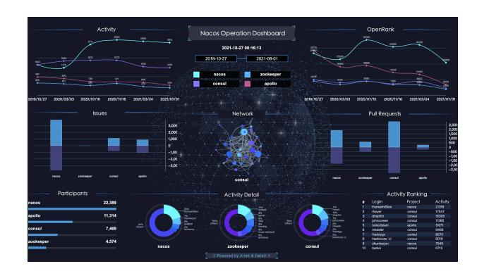
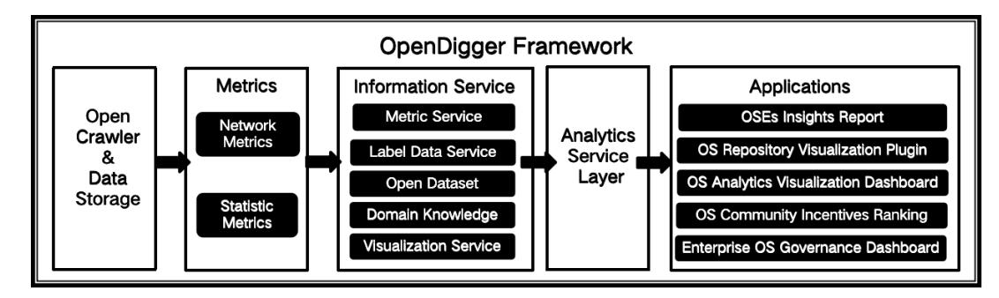
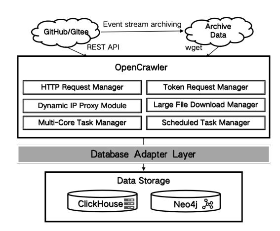
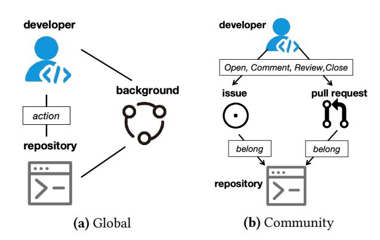
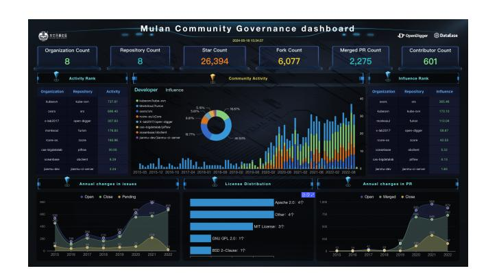
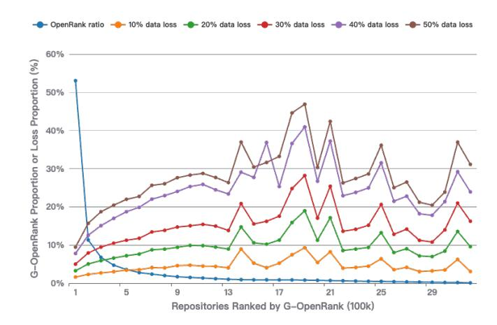

# OpenDigger: A Practical Framework for Assessing Community Health and Sustainability in Open Source Collaboration Platforms

[Wei Wang](https://orcid.org/0000-0002-5940-5518)∗ East China Normal University Shanghai, China wwang@dase.ecnu.edu.cn

[Fanyu Han](https://orcid.org/0009-0001-4663-0441)∗ East China Normal University Shanghai, China fanyu@stu.ecnu.edu.cn

[Shengyu Zhao](https://orcid.org/0009-0004-7226-5996) Tongji University Shanghai, China frank\_zsy@tongji.edu.cn

[Xuan Zhou](https://orcid.org/0000-0001-8426-9450) East China Normal University Shanghai, China xzhou@dase.ecnu.edu.cn

[Weining Qian](https://orcid.org/0000-0002-4132-8630) East China Normal University Shanghai, China wnqian@dase.ecnu.edu.cn

[Aoying Zhou](https://orcid.org/0000-0002-4665-7302) East China Normal University Shanghai, China ayzhou@dase.ecnu.edu.cn

[Xiaoya Xia](https://orcid.org/0000-0002-0736-1904) Ant Group Hangzhou, China xiaxiaoya.xxy@antgroup.com

[Liyun Yang](https://orcid.org/0009-0003-5406-195X) China Electronics Standardization Institute Beijing, China yangly@cesi.cn

[Rong Wang](https://orcid.org/0009-0006-3475-2325) Alibaba Group Hangzhou, China tunan.wr@alibaba-inc.com

[Ning Jiang](https://orcid.org/0009-0002-1651-1721) Apache Software Foundation Beijing, China ningjiang@apache.org

[Moming Duan](https://orcid.org/0000-0001-5402-6634) East China Normal University Shanghai, China mmduan@dase.ecnu.edu.cn

# Abstract

The rapid development and widespread adoption of open source software, facilitated and accelerated by the web, have fostered a vibrant ecosystem for collaborative development and innovation. GitHub, a leading platform for collaborative software development, currently hosts more than 100 million registered users, creating a substantial ecosystem for examining open source community behaviors. Existing tools for measuring open source communities primarily focus on metrics such as issue response time, pull request response time, or incremental stars to provide insights into community activity. However, these tools are limited in their ability to assess the influence of communities from the perspective of collaboration networks. Moreover, current data collection solutions offer fixed functionalities and lack the flexibility to support multisource, fine-grained, and customizable data acquisition, which is essential for comprehensive analysis of Open Source Ecosystems (OSEs). In this paper, we present OpenDigger, a framework for multi-dimensional assessment of collaboration activities in OSEs. To enable scalable, modular, and continuous acquisition of OSE data, we developed OpenCrawler, a one-line service providing customizable, fine-grained control over data collection. Using the collected data, OpenDigger computes 20 statistical and 2 network-based metrics, and our empirical analysis further verifies their effectiveness

∗Both authors contributed equally to this research.

[This work is licensed under a Creative Commons Attribution 4.0 International License.](https://creativecommons.org/licenses/by/4.0) WWW '26, Dubai, United Arab Emirates.

© 2026 Copyright held by the owner/author(s). ACM ISBN 979-8-4007-2307-0/2026/04 <https://doi.org/10.1145/3774904.3792807>

in enabling a comprehensive assessment of trends in OSEs. By continuously collecting logs from GitHub and Gitee, OpenDigger has now accumulated over 9 billion records. Our framework has already been deployed across multiple industrial environments, including Alibaba Group, Ant Group, Apache Foundation, and Mulan Open Source Community.

# CCS Concepts

#### • Information systems → Data extraction and integration.

#### Keywords

Open Source Ecosystem, Web Data Analytics, Collaboration Networks, Open Source Software

#### ACM Reference Format:

Wei Wang, Fanyu Han, Shengyu Zhao, Xuan Zhou, Weining Qian, Aoying Zhou, Xiaoya Xia, Liyun Yang, Rong Wang, Ning Jiang, and Moming Duan. 2026. OpenDigger: A Practical Framework for Assessing Community Health and Sustainability in Open Source Collaboration Platforms. In Proceedings of the ACM Web Conference 2026 (WWW '26), April 13–17, 2026, Dubai, United Arab Emirates. ACM, New York, NY, USA, [12](#page-11-0) pages. [https://doi.org/10.1145/](https://doi.org/10.1145/3774904.3792807) [3774904.3792807](https://doi.org/10.1145/3774904.3792807)

#### Resource Availability:

The source code of this paper has been made publicly available at [https:](https://doi.org/10.5281/zenodo.18310465) [//doi.org/10.5281/zenodo.18310465.](https://doi.org/10.5281/zenodo.18310465)

#### 1 Introduction

In recent years, with the continuous evolution of the web and digital infrastructure, open source software has attracted significant global attention and sustained scholarly interest [\[20,](#page-8-0) [34,](#page-8-1) [44\]](#page-8-2). As a

cornerstone of digital innovation and transformation, open source software increasingly consolidates its role in safeguarding digital sovereignty across organizations of all scales, a consensus widely acknowledged in both academia and industry [\[6,](#page-8-3) [12,](#page-8-4) [42\]](#page-8-5). Among the many collaborative platforms, GitHub stands out as a leading hub for software development, which, according to official reports, currently hosts more than 100 million registered users and thus constitutes a substantial Open Source Ecosystem (OSE) for the empirical study of open source community behaviors [\[27,](#page-8-6) [28,](#page-8-7) [38\]](#page-8-8). The vast behavioral data generated by developers in this ecosystem offer rich insights into individual contributions, collective collaboration patterns, community health, development trajectories, and even strategic business value [\[26,](#page-8-9) [33,](#page-8-10) [41\]](#page-8-11).

Complementary to this, the World of Code (WoC) project offers a global-scale version control data infrastructure that enables the systematic analysis of cross-project code flows, technical dependencies, and collaboration networks [\[23\]](#page-8-12). However, WoC remains limited by its lack of social and collaborative behavioral data and does not incorporate an operationalized system of metrics. In this regard, measuring open source communities from multi-dimensional perspectives provides a more comprehensive understanding of their development status, which can further support enterprise open source program offices in community operations and enhance repository recommendation for developers. In parallel, the CHAOSS (Community Health Analytics Open Source Software)[1](#page-1-0) initiative, under the Linux Foundation, is a multidisciplinary international research community dedicated to the quantification of open source community health. By establishing standardized metric taxonomies, CHAOSS systematically evaluates sustainability, contributor diversity, and governance effectiveness in open source projects. Furthermore, platforms such as OSSInsight [\[14\]](#page-8-13), built on the complete stream of GitHub event data, extend these efforts by enabling real-time analytics, ad-hoc SQL-based exploration, and the generation of trends and rankings within the broader OSEs. Despite these advances, statistical metrics remain susceptible to manipulation and often lack robustness, particularly under substantial data sparsity.

In this paper, we propose OpenDigger, a framework that integrates a modular and extensible data collection tool while supporting the implementation of both statistical and network-based metrics. To this end, we implemented OpenCrawler, a framework that facilitates customization and fine-grained control in the data collection process through the integration of multiple modules, including the HTTP Request Manager, Dynamic IP Proxy Module, Scheduled Task Manager, etc. This modular architecture allows the application layer to efficiently deliver continuous collection services across diverse data sources. Building on the collaboration log data gathered by OpenCrawler, OpenDigger implements 20 statistical metrics and 2 network-based metrics. The statistical metrics provide insights into community activity and development dynamics, while the network-based metrics, compared with purely statistical ones, are more effective in uncovering the collaborative value of open source projects.

OpenDigger has already been deployed in industrial scenarios, including Alibaba Group, Ant Group, the Apache Software Foundation, and the Mulan Open Source Community. OpenDigger

Figure 1: Nacos Operation Dashboard

metrics data can also be used to serve open source insight dashboards for enterprises, communities, foundations, and individual developers, providing open source data insights for practitioners of OSPO (Open Source Program Office) and open source project operations managers. As shown in Figure [1,](#page-1-1) Alibaba applied OpenDigger's data analytics services with the DataV visualization platform to the Nacos project. The dashboard was initiated in October 2023 and has been in continuous use ever since, and it displays trends in Activity and OpenRank, participant counts, issue and pull request statuses, and collaboration networks for Nacos and its competitors. Without a robust, unified labeling system, monitoring such large-scale projects and conducting comparative analyses would be challenging. The main contributions of this work are summarized as follows:

- We propose OpenDigger, an industry-ready framework that enables the assessment of open source community health and sustainability using multi-source collaboration data.
- By implementing 20 statistical metrics and 2 network-based metrics, our proposed framework offers a comprehensive and more robust measurement of open source communities.
- Our framework has already been deployed across multiple industrial environments with open APIs. All code and data are publicly available and well-documented[2](#page-1-2) .

# 2 Related Work

Data mining and analysis of developer collaboration behaviors represent an active and prominent field within software engineering [\[16\]](#page-8-14). Yuan et al. have identified instances where primary developers frequently engage in collaborative actions during the project development process, often forming a network of contributors [\[43\]](#page-8-15). Several researchers have evaluated projects and revealed potential collaboration opportunities among developers by examining the social dynamics of GitHub [\[9\]](#page-8-16). Marlow et al. made an intriguing observation that developers typically use information from developer profiles, such as skills and social connections, to establish an initial understanding of both developers and projects [\[24\]](#page-8-17). Furthermore, Sri et al. explore how developers define the concept of an "expert" among themselves, and delve into the reasons behind their decisions to contribute or abstain from contributing to online

1[CHAOSS a Linux Foundation®](https://chaoss.community/) project

2<https://github.com/X-lab2017/open-digger>

collaborative platforms [\[35\]](#page-8-18). Oliveira et al. model the collaborations among GitHub developers in a heterogeneous network, considering three key aspects: social collaboration, collaboration duration within a repository, and technical characteristics [\[30\]](#page-8-19). Aakash et al. investigate the collaborative architecting between humans and bots, aiming to synergize the outputs of ChatGPT with architects' decisions to automate architecture-centric software engineering [\[2\]](#page-8-20).

Data analysis in software engineering is a thriving research area [\[17,](#page-8-21) [36\]](#page-8-22). Early efforts, like the SQO-OSS model by Samoladas [\[32\]](#page-8-23) et al., used data from software development and community operations to evaluate source code and documentation quality. However, these methods were complex and hard to automate. Yet, they primarily focused on internal software quality, neglecting usability and performance. Zou [\[45\]](#page-8-24) et al. proposed a method to measure software quality using user reviews and sentiment analysis, covering various aspects of software quality. As open source communities like Open Source China and StackOverflow have grown, researchers have delved into valuable data mining opportunities within user questions and answers. Allamanis [\[3\]](#page-8-25) et al. discovered that these communities span diverse programming languages and topics. Furthermore, data mining has been applied to various aspects of software development, such as code comment generation [\[37\]](#page-8-26), API documentation retrieval [\[10\]](#page-8-27), and the integration of knowledge-sharing communities [\[5\]](#page-8-28).

OSEs data systems play a crucial role in providing data services to developers and supporting the sustainable development of open source software. Among these systems, GHArchive[3](#page-2-0) stands out as an open data service project that records the GitHub public timeline. GHArchive captures all GitHub events and stores them in a collection of JSON files, enabling offline processing. Similarly, the GHTorrent [\[15\]](#page-8-29) project monitors GitHub's public event timeline, retrieving detailed content and dependencies for each event. However, these systems primarily focus on offering public data and do not consider the cross-references between projects or developers within the open source software ecosystem. World of Code [\[22\]](#page-8-30), on the other hand, is a comprehensive and frequently updated version control dataset. It contains cross-reference information among various entities, including authors, projects, commit details, and Blobs. This dataset enables data correction, expansion, querying, and analysis. Additionally, OSS Insight [\[14\]](#page-8-13) leverages TiDB to provide real-time viewing and analysis of GitHub trends. It analyzes billions of GitHub event data and offers in-depth analysis capabilities for individual GitHub repositories and developers. Recently, many researchers have also conducted research on the OSE from the perspectives of supply chain [\[7,](#page-8-31) [19,](#page-8-32) [29\]](#page-8-33) and cooperative driving automation [\[40\]](#page-8-34). Compared with these systems, OpenDigger offers a more comprehensive data foundation by integrating multiple platforms, incorporating both statistical and network-based metrics, and enabling fine-grained ecosystem analysis.

#### 3 OpenDigger Framework Design

#### 3.1 Overview

The OpenDigger framework is designed to provide a comprehensive infrastructure for collecting, processing, and analyzing data

from OSEs. As illustrated in Figure [2,](#page-3-0) the framework is composed of five core modules: OpenCrawler, Metrics, Information Service, Analytics Service Layer, and Applications.

The OpenCrawler module is responsible for collecting collaboration log data from multiple Git-based platforms within OSEs. Building upon these data, the Metrics module implements the computation of both statistical metrics and network-based metrics. In addition to these metric services, OpenDigger incorporates an Information Service that integrates diverse auxiliary resources, including label data, collaboration dataset, domain knowledge, and visualization utilities. For a detailed description of the labels and usage instructions, please refer to Appendix [A.1.](#page-9-0) Building on these components, the Analytics Service Layer provides metric query services, interactive data analysis tools, and online metric access, offering three complementary modes of data acquisition for downstream industrial and research applications. The remainder of this section elaborates on each module in detail.

# 3.2 OpenCrawler

This section presents OpenCrawler, a data collection tool designed to offer customizable and fine-grained control over the acquisition process through a set of integrated modules. As shown in Figure [3,](#page-3-1) six core modules work in coordination to support reliable and efficient large-scale data collection, including:

HTTP Request Manager. Given the scale and heterogeneity of data sources within OSEs, this module provides a unified mechanism for managing HTTP/HTTPS requests across diverse platforms. It supports the request onion model, concurrency control, customized failure recovery, dynamic request generation, and seamless integration with token and proxy mechanisms. By ensuring robust and adaptable request execution under high-frequency and high-volume conditions, it serves as the entry point for stable data acquisition, upon which downstream modules such as token pooling, proxy management, and file downloading can further operate.

Token Pooling Manager. In the context of OSEs, where largescale data acquisition frequently depends on public APIs with strict rate limits and quota constraints, this module provides centralized pooling and dynamic scheduling of authentication tokens. Taking the GitHub REST API as an example, fine-grained personal access tokens are limited to a maximum of 50 per account, with each token restricted to 5,000 requests per hour[4](#page-2-1) . The module continuously monitors the state of each token, including availability, remaining quota, and expected refresh intervals, thereby ensuring sustainable and uninterrupted access under high-frequency workloads. Allocated tokens are then passed to the HTTP Request Manager for stable request execution, enabling seamless operation of downstream modules such as proxy management.

Dynamic IP Proxy Module. Within OSEs, where frequent API requests and web crawling may trigger access restrictions or rate-limiting, this module ensures stable and uninterrupted data collection by dynamically managing IP proxies. Operating in coordination with the HTTP Request Manager, it automatically integrates with mainstream proxy platforms, updates the proxy pool, and configures whitelists. Proxies are pre-validated through content

3<https://www.gharchive.org/>

4<https://docs.github.com/en/rest/using-the-rest-api/rate-limits-for-the-rest-api>

Figure 2: OpenDigger Framework

Figure 3: Overview of OpenCrawler

analysis of returned responses, and invalid proxies are promptly replaced, with failed requests automatically retried.

Large File Download Manager: Retrieving large static files, such as the hourly GHArchive dumps from GitHub, via the HTTP Request Manager often faces frequent failures and repeated attempts due to network instability or large file sizes. These challenges increase overall time costs and may lead to excessive memory usage, as file contents are initially loaded into memory before persistence. To address this, the Large File Download Manager enables concurrent, disk-oriented streaming and supports resumable downloads, thereby mitigating network-induced failures and redundant re-downloads. It operates in coordination with the Dynamic IP Proxy Module to maintain stable and uninterrupted download connections. The downloaded files are then provided as input for subsequent in-memory decompression, data validation, and transformation tasks managed by the Multi-Core Task Manager.

Multi-Core Task Manager: To enable efficient parallel processing, it is essential to distribute computational tasks across multiple CPU cores. This capability is particularly critical for highconcurrency, CPU-intensive operations such as in-memory streaming decompression, file format validation, and data transformation. The Multi-Core Task Manager automatically detects the underlying

hardware environment and orchestrates task distribution and result aggregation, thereby enhancing both the scalability and overall efficiency of large-scale data collection workflows.

Task Scheduling Manager: The Task Scheduling Manager in OpenCrawler orchestrates recurring offline tasks using the widely adopted cron format. It coordinates the periodic collection of essential OSE data, including GitHub event logs, repository metadata, and developer profiles. By automating these operations, the module guarantees timeliness in acquiring the most recent data and consistency in executing repeated collection tasks, ensuring that datasets remain complete and reliable over extended periods. This functionality is crucial for large-scale, long-running data acquisition, providing organized inputs for subsequent processing modules and minimizing the need for manual intervention.

Taking GitHub platform as an example, the log data acquisition component of OpenCrawler utilizes GHArchive as its data source. GHArchive service automatically archives global log data from GitHub event API and publishes it hourly in gzip-compressed JSONL format. Data not included in log files, such as developer's profile, is collected using the GitHub REST API. Consequently, OpenCrawler uses task scheduling manager to execute a data import task every hour. This task initially determines the periods of data absence based on the local file status, followed by the utilization of the large file download manager to retrieve all missing GHArchive compressed files. Subsequently, multi-core task manager initiates concurrent operations for in-memory decompression, data format validation, and database importation. Given that there are over 80,000 historical files in the GitHub log data, concurrent task management is crucial, as single-threaded data processing times are impractical in engineering practices. On the other hand, GitHub user information is collected via the API, employing the token pooling manager to pool and centrally manage dozens of GitHub Tokens. This setup enables seamless, high-throughput data collection at the business layer. Additionally, to prevent access restrictions due to frequent visits from a single IP, requests are automatically equipped with dynamic IP proxies, ensuring stable and efficient high-frequency data collection.

#### 3.3 Data Storage

As of September 2025, the categories of OSE data collected are summarized in Table [1.](#page-4-0) OpenCrawler has accumulated more than 9 billion activity records encompassing platforms such as GitHub

Table 1: Volume of OSEs Data Collected by OpenDigger

| Data          | Source   | Platform      |       | Data Size     |
|---------------|----------|---------------|-------|---------------|
| Cargo         | package  | repository    | data  | 121,000       |
| CVE           | security | vulnerability | data  | 200,000       |
| NuGet         | package  | repository    | data  | 364,000       |
| PyPI          | package  | repository    | data  | 449,000       |
| Maven         | package  | repository    | data  | 559,000       |
| Go            | language | module        | data  | 1,020,000     |
| NPM           | package  | repository    | data  | 2,470,000     |
| StackOverflow |          | Q&A           | posts | 25,000,000    |
| Gitee         |          |               |       | 36,337,157    |
| GitHub        |          |               |       | 9,655,977,166 |

and Gitee. Derived from active repositories and developers across multiple open source collaboration platforms, this dataset has been integrated into the graph database, comprising approximately 800 million nodes and 1.9 billion edges.

Given the massive and heterogeneous nature of GitHub log data, traditional relational databases are inefficient for large-scale aggregation and analysis. Log entries are continuously appended, with historical records primarily queried without updates, and many events utilize only a subset of columns, resulting in sparse storage. To address these characteristics, OpenDigger employs ClickHouse [\[8\]](#page-8-35) for efficient columnar-based OLAP operations and Neo4j [\[4,](#page-8-36) [25\]](#page-8-37) to support graph-based modeling and analysis of collaborative networks among developers and repositories.

#### 3.4 Metrics

OpenDigger integrates 20 statistical metrics and 2 network metrics to evaluate repositories and developers. Table [2](#page-5-0) compares several representative OSE insight tools in terms of statistical metrics, network metrics, and their data sources. Network metrics capture the relationships and interactions between developers and repositories, providing insights that go beyond simple counts of commits or issues. Among existing tools, OpenDigger stands out in that it integrates both statistical and network-based metrics while continuously collecting data across multiple platforms. This design enables comprehensive and large-scale analyses of OSEs. By contrast, tools such as OSSInsight, OSS Compass, GrimoireLab, World of Code, and Augur primarily emphasize trend monitoring or community health assessment and typically lack the capacity to generate networkoriented insights at a comparable scale.

3.4.1 Network Metrics. For event data on platforms such as GitHub, where each record corresponds to a specific action by a developer at a given time within a repository, a time-sequenced heterogeneous collaboration network can be constructed by modeling developers and repositories as nodes, and developers' actions as edges. OpenDigger has introduced two new network-based metrics, namely Global OpenRank (G-OpenRank) and Community Open-Rank (C-OpenRank). Details of the OpenRank algorithm implementation are provided in [A.2.](#page-9-1)

G-OpenRank constructs a collaboration network by leveraging the relationships among all global developers and repositories, and evaluates these entities using the OpenRank algorithm. As illustrated in Figure [4\(](#page-4-1)a), G-OpenRank metric builds a global collaboration network where developers and repositories act as nodes, while the Activity metric that quantifies developers' engagement with

Figure 4: Basic Network Model

repositories serves as edges. Drawing inspiration from the design of LeaderRank [\[21\]](#page-8-38), a global background node is incorporated into the network and connected bidirectionally to all developer nodes and repository nodes. This integration ensures that the entire collaboration network achieves strong connectivity. Different from the classic PageRank algorithm, G-OpenRank enables nodes to partially depend on their initial values during the process of centrality calculation. In calculating OpenRank, OpenDigger constructs the global collaboration network on a monthly basis, and the calculation allows all nodes to use the results from the previous month as their initial values.

C-OpenRank metric extends G-OpenRank to individual projects by constructing intra-project collaboration networks and computing OpenRank values to estimate each developer's contribution within a project. In contrast to G-OpenRank, which emphasizes the global connectivity of developers and repositories, C-OpenRank places greater emphasis on the depth of individual developers' contributions to a specific project. Within a repository, Issues and Pull Requests are employed as the fundamental collaboration units, where discussions occurring within the same Issue or Pull Request are regarded as instances of collaboration. As shown in Figure [4\(](#page-4-1)b), the algorithm constructs the collaboration network of a project by utilizing data from Issues, Pull Requests, and other intra-project collaborative activities.

3.4.2 Statistical Metrics. OpenDigger builds upon prior research to implement a set of metrics, drawing in particular from the work of the CHAOSS open source community under the Linux Foundation, which has focused on developing standardized metrics and models for evaluating the health and sustainability of open source communities. As of April 2022, CHAOSS had released 75 metrics organized into five working groups. Metrics from the Common and Evolution working groups are especially amenable to quantitative analysis and statistical presentation based on development activity data, whereas metrics from the Diversity & Inclusion, Risk, and Value working groups tend to emphasize qualitative assessment. By systematically analyzing GitHub log data in conjunction with the CHAOSS framework, OpenDigger has implemented 17 quantitative data-driven metrics, as summarized in [A.3.](#page-9-2)

In addition to the health metrics defined by the CHAOSS community, we also implements the star metric, which captures the

Table 2: Comparison of OSEs insight tools

| Tool          | Statistical |         |                                                        |                                                                        |
|---------------|-------------|---------|--------------------------------------------------------|------------------------------------------------------------------------|
|               |             | Metrics | Source Data                                            | Features / Positioning                                                 |
| OpenDigger    | 20          | 2       | GitHub, Gitee, NPM, PyPI, CVE, security, and more.     | Integrated network metrics; continuous multi-platform data collection. |
| OSSInsight    | ∼ 20        | 0       | GitHub                                                 | Focus on real-time GitHub trends; dashboards + SQL interface.          |
| OSS Compass   | 20+         | 0       | GitHub, Gitee                                          | Focus on community health and governance; initiated by LF APAC.        |
| GrimoireLab   | ∼ 30–50     | 0       | GitHub, GitLab, Gerrit, mailing lists, Jira, and more. | OSS stack; flexible and extensible; widely used by OSPOs.              |
| World of Code | 0           | 0       | GitHub                                                 | Emphasizes global dependency; suitable for large-scale research.       |
| Augur         | ∼ 30        | 0       | GitHub, GitLab, mailing lists, Slack, Discourse, etc.  | Backed by CHAOSS; focus on community health and risk management.       |

increment in project stars over a specific period, and the participant metric, which measures the number of developers actively engaged in issues or pull requests. OpenDigger also introduces a scalable multidimensional Activity quantification metric, computed as a weighted aggregation of developer behaviors derived from GitHub event counts [\[39\]](#page-8-39). Compared with simple statistical indicators, Activity metric enables the observation of community projects or developers' activity at a macro level. The implementation details are provided in [A.4](#page-9-3)

#### 3.5 Analytics Service Layer

The Analytics Service Layer of OpenDigger provides comprehensive support for metric retrieval, interactive analysis, and online access. It includes a Metric Query Interface that allows flexible queries over organizations, repositories, developers, or custom labels without writing SQL, Interactive Data Service Tools in Node.js and Python Jupyter Notebooks as well as a CLI for analysis and visualization, and an Online Metrics Access Service that publishes static, regularly updated metric datasets for public use. For detailed descriptions, please refer to Appendix [A.5.](#page-10-0)

#### 4 Experiments

# 4.1 Comparison with Existing Tools

To demonstrate the advantages of OpenCrawler in collecting OSE data, we compare it with mainstream data collection tools, as listed in Table [3,](#page-5-1) including:

- Scrapy [\[31\]](#page-8-40): A powerful Python framework well-suited for building and managing complex web scraping projects.
- BeautifulSoup: Primarily used for parsing HTML and XML, it is suitable for beginners and small-scale data extraction tasks.
- Selenium [\[11\]](#page-8-41): An automation testing tool supporting browser interactions, making it suitable for scraping dynamic content and AJAX-loaded pages.
- Puppeteer [\[13\]](#page-8-42): Puppeteer is particularly useful for handling dynamic content and JavaScript-rendered pages.
- Octoparse [\[18\]](#page-8-43): A commercial, no-code data scraping tool that offers a visual workflow design for scraping, making it accessible to non-technical users.
- ParseHub [\[1\]](#page-8-44): It supports dynamic content scraping and is suited for users needing a fast, easy-to-use setup.

In comparing popular data collection tools, distinct differences emerge in their support for core functionalities essential for robust data collection. As shown in Table [3,](#page-5-1) most tools support data cleaning and parsing (DCP) and error handling (EH), which are

Table 3: Comparison of Data Collection Tools

| Tool          | DCP DF | IPS RRC | EH MTH | ST |
|---------------|--------|---------|--------|----|
| Scrapy        | ✓ ✓    | ✓ ✓     | ✓      | ✓  |
| BeautifulSoup | ✓ ✓    |         | ✓      |    |
| Selenium      | ✓      | ✓ ✓     | ✓      |    |
| Puppeteer     | ✓      | ✓ ✓     | ✓      |    |
| Octoparse     | ✓ ✓    |         | ✓      | ✓  |
| ParseHub      | ✓ ✓    |         | ✓      | ✓  |
| OpenCrawler   | ✓ ✓    | ✓ ✓     | ✓ ✓    | ✓  |

DCP: Data Cleaning & Parsing, DF: Data Format, IPS: IP Proxy Support, RRC: Request Rate Control, EH: Error Handling, MTH: Multi-token Handling, ST: Scheduling Tasks

essential for extracting and formatting data with minimal manual intervention. Scrapy, Selenium, and Puppeteer offer IP proxy support (IPS) and request rate control (RRC), which are critical for large-scale web scraping tasks where handling restrictions and avoiding IP bans are necessary. However, only OpenCrawler among these tools demonstrates comprehensive support across all functionalities listed, including multi-token handling (MTH) and scheduling tasks (ST), two advanced capabilities.

OpenCrawler's design is notably advantageous for complex data collection needs. Its built-in support for multi-token handling allows it to manage high request volumes more efficiently by distributing load across multiple tokens, which is particularly valuable for platforms with strict rate limits like GitHub. Furthermore, Open-Crawler's scheduling capabilities enable automated, recurrent data collection tasks, facilitating continuous data acquisition without requiring manual intervention. These features make OpenCrawler a reliable solution for scalable and resilient OSE data collection.

# 4.2 Correlation Analysis of Metrics

To better understand the relationships between Activity, OpenRank variants, and other behavioral metrics, we compute Spearman's correlation coefficients across a set of representative metrics. We utilized developer behavior data from the GitHub platform in August 2025. Based on the G-OpenRank metric, the top 1,000 repositories were extracted, with each repository characterized by 10 associated metrics. Table [4](#page-6-0) presents the results, highlighting the comparative roles of C-OpenRank and G-OpenRank.

Both C-OpenRank and G-OpenRank exhibit strong correlations with Activity, which confirms that these OpenRank variants effectively capture overall developer engagement. Moreover, C-OpenRank demonstrates stronger associations with issue- and PR-related metrics (e.g., Open PR, Close PR, PR Review), indicating its emphasis on the depth of contributions within specific communities. By contrast, G-OpenRank shows higher alignment with Participants, consistent

Table 4: Spearman's Correlation of Metrics (All correlations in the table are significant, with �� &lt; 0.01)

|            | Activity | C-OpenRank | G-OpenRank | Participants | Open Issue | Close Issue | Issue Comment | Open PR | Close PR | PR Review |
|------------|----------|------------|------------|--------------|------------|-------------|---------------|---------|----------|-----------|
| Activity   | 1        | 0.88       | 0.83       | 0.902        | 0.694      | 0.466       | 0.814         | 0.51    | 0.658    | 0.421     |
| C-OpenRank | 0.88     | 1          | 0.81       | 0.72         | 0.63       | 0.61        | 0.79          | 0.68    | 0.65     | 0.70      |
| G-OpenRank | 0.83     | 0.81       | 1          | 0.693        | 0.49       | 0.585       | 0.708         | 0.64    | 0.479    | 0.531     |

Table 5: Comparative Analysis of Metrics

| Repository                             | Activity | Rank �� | G-OpenRank | Rank �� | C-OpenRank | Rank �� | Participants | Contributors | Open Issue | Open PR |
|----------------------------------------|----------|---------|------------|---------|------------|---------|--------------|--------------|------------|---------|
| firstcontributions/first-contributions | 2384     | #9      | 315        | #44     | 2942       | #32     | 876          | 733          | 9          | 882     |
| alibaba/ice                            | 9        | #6472   | 5          | #28283  | 20         | #7293   | 1            | 0            | 1          | 2       |
| cityofaustin/atd-data-tech             | 160      | #616    | 92         | #345    | 1346       | #181    | 41           | 0            | 237        | 0       |
| coinhall/yacar                         | 27       | #4757   | –          | –       | –          | –       | 1            | 0            | 0          | 152     |
| pytorch/pytorch                        | 1840     | #13     | 834        | #6      | 5348       | #12     | 750          | 2            | 342        | 947     |
| tensorflow/tensorflow                  | 251      | #281    | 40         | #1344   | 1855       | #61     | 121          | 9            | 57         | 790     |
| huggingface/transformers               | 976      | #35     | 326        | #40     | 1924       | #57     | 494          | 85           | 114        | 305     |
| NVIDIA/TensorRT-LLM                    | 1005     | #34     | 333        | #39     | 2213       | #47     | 282          | 122          | 50         | 418     |
| openai/codex                           | 1195     | #26     | 195        | #78     | 2478       | #42     | 806          | 31           | 306        | 406     |
| apache/gravitino                       | 324      | #202    | 85         | #386    | 786        | #201    | 95           | 44           | 106        | 158     |

with its design to emphasize global influence across broader networks of developers and repositories.

Finding 1: The two OpenRank variants capture complementary dimensions of developer behavior, with C-OpenRank emphasizing sustained, intensive engagement within specific projects and G-OpenRank reflecting broader influence across the global developer community.

#### 4.3 Comparative Analysis of Metrics

To systematically examine the multifaceted health of open source repositories, this section conducts a comparative analysis of representative metrics, aiming to reveal how different metrics capture distinct aspects of repository activity and influence. Using collaboration behavior data collected by OpenDigger in August 2025, we computed a set of metrics and selected ten representative repositories for case analysis. The sample includes both top-ranked and lower-activity repositories, along with projects that perform strongly on specific metrics.

As shown in Table [5,](#page-6-1) the comparative results highlight the complementary nature of Activity, G-OpenRank, and C-OpenRank across different types of repositories. High-profile repositories such as pytorch/pytorch, huggingface/transformers, and NVIDIA/TensorRT-LLM combine strong activity levels with high rankings in both OpenRank variants, indicating both global influence and community depth. In contrast, tensorflow/tensorflow shows moderate activity but relatively high C-OpenRank, suggesting a smaller but more engaged contributor base. Repositories such as firstcontributions/firstcontributions exhibit exceptionally high C-OpenRank despite lower global influence, reflecting their role as entry points for community engagement and contributor onboarding. Meanwhile, openai/codex demonstrates high activity but lower G-OpenRank, highlighting that volume of contributions does not necessarily translate into global network influence. Mid-level repositories such as apache/gravitino and cityofaustin/atd-data-tech display modest performance across all metrics, reflecting more localized collaboration

dynamics. Finally, repositories like alibaba/ice and coinhall/yacar record very low activity and OpenRank values, representing longtail repositories with minimal ongoing engagement. Collectively, these cases illustrate how the three metrics capture distinct but interrelated perspectives: Activity reflects the scale of contributions, G-OpenRank emphasizes global influence, and C-OpenRank captures the intensity of localized community engagement.

Finding 2: A comprehensive assessment of repository health benefits from examining multiple complementary metrics, as each metric highlights different aspects of activity, influence, and engagement. Within this framework, G-OpenRank and C-OpenRank are particularly valuable, providing insights into global network influence and depth of community involvement, respectively.

#### 4.4 Robustness Analysis of Network Metrics

In real-world data research, data integrity is crucial for ensuring the accuracy and reliability of research results. However, due to various reasons such as equipment failures, collection errors, or platform interface issues, missing data is a common occurrence. For instance, due to a service outage, GHArchive experienced 171 hours of data loss in October 2021, which means approximately 23% of the original data for that month was lost, and linear statistical metrics would also exhibit corresponding losses, creating an anomaly. We uses the G-OpenRank metric results for all repository from January to June 2025 to analyze G-OpenRank's robustness to data loss. Figure [5](#page-7-0) shows the G-OpenRank distribution and loss among 3.2 million repository during this period. All repositories and developers were sorted and grouped, with each group containing 100,000 nodes, to observe the impact of original data loss on different segments of G-OpenRank.

It can be observed that G-OpenRank exhibits a pronounced power-law distribution. Specifically, the top 100,000 nodes account for 53.02% of the total G-OpenRank value (blue line), and the top 500,000 nodes account for more than two-thirds of the total G-OpenRank value. Notably, nodes with high G-OpenRank values

Figure 5: Impact of Data Loss on Repository' G-OpenRank

are relatively insensitive to data loss. This is primarily because G-OpenRank is computed based on the extraction of collaboration relationships, with limited reliance on the intensity of individual collaborations. Consequently, for top repositories with extensive and stable collaboration networks, the impact of missing data on the results is relatively minor. In contrast, lower-ranked nodes, which exhibit less frequent collaborations, may experience substantial alterations in local network structures due to data loss, leading to larger reductions in G-OpenRank.

Finding 3: The G-OpenRank metric exhibits strong robustness to moderate data loss, especially among top-ranked repositories. By relying on the existence of collaboration relationships rather than their intensity, it maintains stable rankings despite partial data unavailability, highlighting its effectiveness for large-scale open source network analysis.

# 5 Applications

As introduced in the [1](#page-0-0) Introduction, OpenDigger has been applied to the Nacos project from Alibaba. In addition, OpenDigger has been deployed within the open source community, specifically the Mulan Open Source Community, which actively supports the incubation and governance of open source projects in China. The community leverages OpenDigger to collect data across all hosted projects and presents various project metrics through a dashboard interface, as shown in Figure [6.](#page-7-1) Since its deployment in October 2021, the service has maintained continuous data updates. OpenDigger provides a comprehensive governance dashboard and a rich set of open source project metrics, enabling multi-dimensional observation of project development within the community.

The OpenAtom Foundation is China's first open source software foundation. In addition to hosting and incubating open source projects, the foundation plays a pivotal role in advancing the nation's OSEs. In close collaboration with OpenDigger, it leverages OpenDigger's data capabilities to construct a global open source collaboration dashboard[5](#page-7-2) , launched in February 2024 and continuously updated since. This dashboard regularly publishes rankings

Figure 6: Mulan Community Governance Dashboard

based on the G-OpenRank metric, including lists of top enterprises, developers, and Chinese projects. Furthermore, OpenDigger's data capabilities are employed to generate exclusive global collaboration data, which underpins the construction of a 3D global collaboration network map[6](#page-7-3) . By applying tags such as company, foundation, and country, OpenDigger provides rankings from multiple perspectives, thereby enabling more comprehensive analysis of OSEs.

The Apache Software Foundation (ASF) is one of the earliest and most influential software foundations worldwide. Leveraging OpenDigger's metric data files together with ASF's project metadata, a dedicated project insights website[7](#page-7-4) was launched in September 2022 and maintained until December 2024. This website enables users to explore a wide range of project metrics. The out-of-the-box, authentication-free repository metrics provided by OpenDigger are highly developer-friendly, greatly simplifying and accelerating the construction of data dashboards required by ASF.

# 6 Conclusion

We presented OpenDigger, a practical framework for assessing community health and sustainability in open source collaboration platforms. Built on top of OpenCrawler, which supports customizable and fine-grained data collection, OpenDigger integrates 20 statistical metrics and 2 network-based metrics. Our empirical analyses demonstrate that these metrics capture diverse aspects of repository dynamics, enabling more comprehensive evaluations of project health. The case of G-OpenRank further highlights the robustness of network-based metrics under data loss. Finally, through applications across industry, communities, and foundations, we showed the effectiveness of OpenDigger in supporting OSE governance, thereby contributing a systematic foundation for future empirical studies and policy-making in the sustainable development of OSEs.

# Acknowledgments

This research is sponsored by Shanghai Pujiang Programme (Award No. 25PJA029) and National Natural Science Foundation of China (Award No. 62137001, 62277017, and 61977026).

5[https://openatom-dashboard.x-lab.info/\(](https://openatom-dashboard.x-lab.info/)Only provide Chinese version)

6[https://openatom-galaxy.x-lab.info/\(](https://openatom-galaxy.x-lab.info/)Only provide Chinese version) 7<https://willemjiang.github.io/Insight/>

#### References

- [1] Deandra Abiantoro and Dana Sulistyo Kusumo. 2020. Analysis of Web Content Quality Information on the Koseeker Website Using the Web Content Audit Method and ParseHub Tools. In 2020 8th International Conference on Information and Communication Technology (ICoICT). IEEE, 1–6. [2] Aakash Ahmad, Muhammad Waseem, Peng Liang, Mahdi Fahmideh, Mst Shamima Aktar, and Tommi Mikkonen. 2023. Towards human-bot collaborative software architecting with chatgpt. In Proceedings of the 27th International Conference on Evaluation and Assessment in Software Engineering. 279–285. [3] Miltiadis Allamanis and Charles Sutton. 2013. Why, when, and what: analyzing stack overflow questions by topic, type, and code. In 2013 10th Working conference on mining software repositories (MSR). IEEE, 53–56. [4] Renzo Angles. 2012. A comparison of current graph database models. In 2012 IEEE 28th International Conference on Data Engineering Workshops. IEEE, 171–177. [5] Alberto Bacchelli, Luca Ponzanelli, and Michele Lanza. 2012. Harnessing stack overflow for the ide. In 2012 Third International Workshop on Recommendation Systems for Software Engineering (RSSE). IEEE, 26–30. [6] Dennis Biström, Kristoffer Kuvaja Adolfsson, and Matteo Stocchetti. 2024. Open-Source Software and Digital Sovereignty: A Technical Case Study on Alternatives to Mainstream Tools. In International Conference on Smart Technologies & Education. Springer, 106–113. [7] Bradley C Boehmke and Benjamin T Hazen. 2017. The future of supply chain information systems: The open source ecosystem. Global Journal of Flexible Systems Management 18 (2017), 163–168. [8] Surajit Chaudhuri and Umeshwar Dayal. 1997. An overview of data warehousing and OLAP technology. ACM Sigmod record 26, 1 (1997), 65–74. [9] Kleber Constantino, Marco Souza, Shichao Zhou, Fernando Figueira Filho, Igor Steinmacher, and Marco Aur'elio Gerosa. 2023. Perceptions of open-source software developers on collaborations: An interview and survey study. Journal of Software: Evolution and Process 35, 5 (2023), e2393. [10] Barth'elemy Dagenais and Martin P Robillard. 2012. Recovering traceability links between an API and its learning resources. In 2012 34th International Conference on Software Engineering (ICSE). IEEE, 47–57. [11] Krzysztof Drążek and Maria Skublewska-Paszkowska. 2018. Performance comparison of automatic tests written in Selenium WebDriver and HP UFT. Journal of Computer Sciences Institute 8 (2018), 298–301. [12] Moming Duan, Mingzhe Du, Rui Zhao, Mengying Wang, Yinghui Wu, Nigel Shadbolt, and Bingsheng He. 2025. Position: Current Model Licensing Practices are Dragging Us into a Quagmire of Legal Noncompliance. In Forty-second International Conference on Machine Learning Position Paper Track (ICML). [13] Boni García, Jose M del Alamo, Maurizio Leotta, and Filippo Ricca. 2024. Exploring browser automation: A comparative study of selenium, cypress, puppeteer, and playwright. In International Conference on the Quality of Information and Communications Technology. Springer, 142–149. [14] Ahmad Ghazal, Zhiyuan Liang, Sunny Bains, and Hanumath Maduri. 2024. OS-SInsight: Scalable GitHub Analysis. Proceedings of the VLDB Endowment 17, 12 (2024), 4321–4324. [15] Georgios Gousios, Bogdan Vasilescu, Alexander Serebrenik, and Andy Zaidman. 2014. Lean GHTorrent: GitHub data on demand. In Proceedings of the 11th working conference on mining software repositories. 384–387. [16] Fanyu Han, Shengyu Zhao, Wei Wang, Jiaheng Peng, and Xiaoya Xia. 2026. OpenRank: A centrality algorithm for high-dimensional heterogeneous networks in open source collaboration. Information Sciences 730 (2026), 122893. [doi:10.](https://doi.org/10.1016/j.ins.2025.122893) [1016/j.ins.2025.122893](https://doi.org/10.1016/j.ins.2025.122893) [17] Fanyu Han, Shengyu Zhao, Xiaoya Xia, and Wei Wang. 2026. Are cloud providers exploiting open-source? An exploratory study of Redis license change. Information and Software Technology 190 (2026), 107951. [doi:10.1016/j.infsof.2025.107951](https://doi.org/10.1016/j.infsof.2025.107951) [18] LB Kirwan, E O'Sullivan, S Hogan, F Douglas, and D'O Kelly. 2024. From Bytes to Bites; Advancing Data Collection Methodologies for Enhanced Branded Food Insights. Proceedings of the Nutrition Society 83, OCE4 (2024), E486. [19] Piergiorgio Ladisa, Henrik Plate, Matias Martinez, and Olivier Barais. 2023. Sok: Taxonomy of attacks on open-source software supply chains. In 2023 IEEE Symposium on Security and Privacy (SP). IEEE, 1509–1526. [20] Xuetao Li, Yuxia Zhang, Cailean Osborne, Minghui Zhou, Zhi Jin, and Hui Liu. 2025. Systematic literature review of commercial participation in open source software. ACM Transactions on Software Engineering and Methodology 34, 2 (2025), 1–31. [21] Linyuan Lü, Yi-Cheng Zhang, Chi Ho Yeung, and Tao Zhou. 2011. Leaders in social networks, the delicious case. PloS one 6, 6 (2011), e21202. [22] Y. Ma, C. Bogart, S. Amreen, et al. 2019. World of code: an infrastructure for mining the universe of open source VCS data. In 2019 IEEE/ACM 16th International Conference on Mining Software Repositories (MSR). 143–154. [23] Yuxing Ma, Tapajit Dey, Chris Bogart, Sadika Amreen, Marat Valiev, Adam Tutko, David Kennard, Russell Zaretzki, and Audris Mockus. 2021. World of code: Enabling a research workflow for mining and analyzing the universe of open source vcs data. Empirical Software Engineering 26, 2 (2021), 1–42. [24] Jennifer Marlow, Laura Dabbish, and James Herbsleb. 2013. Impression formation in online peer production: activity traces and personal profiles in github. In Proceedings of the 2013 conference on Computer supported cooperative work. 117–
  - 128. [25] Jim Webber Miller. 2013. Graph database applications and concepts with Neo4j. In Proceedings of the southern association for information systems conference, Atlanta, GA, USA, Vol. 2324. 141–147. [26] Audris Mockus, Roy T Fielding, and James D Herbsleb. 2002. Two case studies of open source software development: Apache and Mozilla. ACM Transactions on Software Engineering and Methodology (TOSEM) 11, 3 (2002), 309–346. [27] Haris Mumtaz, Paramvir Singh, and Kelly Blincoe. 2022. Analyzing the relationship between community and design smells in open-source software projects: An empirical study. In Proceedings of the 16th ACM/IEEE International Symposium on Empirical Software Engineering and Measurement. 23–33. [28] Olivier Nourry, Yutaro Kashiwa, Weiyi Shang, Honglin Shu, and Yasutaka Kamei. 2025. My fuzzers won't build: An empirical study of fuzzing build failures. ACM Transactions on Software Engineering and Methodology 34, 2 (2025), 1–30. [29] Marc Ohm, Henrik Plate, Arnold Sykosch, and Michael Meier. 2020. Backstabber's knife collection: A review of open source software supply chain attacks. In Detection of Intrusions and Malware, and Vulnerability Assessment: 17th International Conference, DIMVA 2020, Lisbon, Portugal, June 24–26, 2020, Proceedings 17. Springer, 23–43. [30] Gabriel P Oliveira, Ana Flávia C Moura, Natércia A Batista, Michele A Brandão, Andre Hora, and Mirella M Moro. 2023. How do developers collaborate? Investigating GitHub heterogeneous networks. Software Quality Journal 31, 1 (2023), 211–241. [31] Yanfei Qi. 2022. Construction of Online English Corpus Based on Web Crawler Technology. Wireless Communications and Mobile Computing 2022, 1 (2022), 7589727. [32] Ioannis Samoladas, Georgios Gousios, Diomidis Spinellis, and Ioannis Stamelos. 2008. The SQO-OSS quality model: measurement based open source software evaluation. In Open Source Development, Communities and Quality: IFIP 20th World Computer Congress, Working Group 2.3 on Open Source Software, September 7-10, 2008, Milano, Italy 4. Springer, 237–248. [33] Damian A Tamburri, Fabio Palomba, Alexander Serebrenik, and Andy Zaidman. 2019. Discovering community patterns in open-source: a systematic approach and its evaluation. Empirical Software Engineering 24, 3 (2019), 1369–1417. [34] Konrad Turek. 2025. Accelerating social science knowledge production with the coordinated open-source model. Quality & Quantity 59, Suppl 2 (2025), 767–795. [35] Sri Lakshmi Vadlamani and Olga Baysal. 2020. Studying software developer expertise and contributions in Stack Overflow and GitHub. In 2020 IEEE International Conference on Software Maintenance and Evolution (ICSME). IEEE, 312–323. [36] Mengying Wang, Moming Duan, Yicong Huang, Chen Li, Bingsheng He, and Yinghui Wu. 2025. ML-Asset Management: Curation, Discovery, and Utilization. Proceedings of the VLDB Endowment 18, 12 (2025), 5493–5498. [37] Edmund Wong, Jinqiu Yang, and Lin Tan. 2013. Autocomment: Mining question and answer sites for automatic comment generation. In 2013 28th IEEE/ACM International Conference on Automated Software Engineering (ASE). IEEE, 562–
  - 567. [38] Boming Xia, Tingting Bi, Zhenchang Xing, Qinghua Lu, and Liming Zhu. 2023. An empirical study on software bill of materials: Where we stand and the road ahead. In 2023 IEEE/ACM 45th International Conference on Software Engineering (ICSE). IEEE, 2630–2642. [39] Xiaoya Xia, Zhenjie Weng, Wei Wang, and Shengyu Zhao. 2022. Exploring activity and contributors on GitHub: Who, what, when, and where. In 2022 29th Asia-Pacific Software Engineering Conference (APSEC). IEEE, 11–20. [40] Runsheng Xu, Hao Xiang, Xu Han, Xin Xia, Zonglin Meng, Chia-Ju Chen, Camila Correa-Jullian, and Jiaqi Ma. 2023. The opencda open-source ecosystem for cooperative driving automation research. IEEE Transactions on Intelligent Vehicles (2023). [41] Zhou Yang, Chenyu Wang, Jieke Shi, Thong Hoang, Pavneet Kochhar, Qinghua Lu, Zhenchang Xing, and David Lo. 2023. What do users ask in open-source AI repositories? An empirical study of GitHub issues. In 2023 IEEE/ACM 20th International Conference on Mining Software Repositories (MSR). IEEE, 79–91. [42] Yunwen Ye and Kouichi Kishida. 2003. Toward an understanding of the motivation of open source software developers. In 25th International Conference on Software Engineering, 2003. Proceedings. IEEE, 419–429. [43] Lin Yuan, Huai-Min Wang, Gang Yin, Dian-Xi Shi, and Xiang Li. 2010. Mining and analyzing behavioral characteristic of developers in open source software. Jisuanji Xuebao(Chinese Journal of Computers) 33, 10 (2010), 1909–1918. [44] Yuxia Zhang, Minghui Zhou, Klaas-Jan Stol, Jianyu Wu, and Zhi Jin. 2020. How do companies collaborate in open source ecosystems? an empirical study of openstack. In Proceedings of the ACM/IEEE 42nd International Conference on Software Engineering. 1196–1208. [45] Yue Zou, Chunrong Liu, Yan Jin, Ling Feng, and Xiaowei Huang. 2013. Assessing software quality through web comment search and analysis. In Safe and Secure Software Reuse: 13th International Conference on Software Reuse, ICSR 2013, Pisa, June 18-20. Proceedings 13. Springer Berlin Heidelberg, 208–223.

#### A Appendix

#### A.1 Labels

To enable more flexible querying and aggregation, OpenDigger provides repository- and developer-level label data, such as initiating companies and technical categories, which are not directly available from collaboration log data. This label data can be employed to filter and aggregate repositories in metric-based analyses. The currently supported label types in OpenDigger include initiating companies, foundations, communities, projects, countries of origin, and technical categories. Part of the label construction is achieved through the integration of existing resources; for instance, foundation labels are derived from official project lists published by major foundations[8](#page-9-4) , while company labels are extracted from organizational information associated with repositories on hosting platforms. Other labels, such as the technical domain of a repository, are inferred with the assistance of large language models (LLMs) by taking the repository's README, description, and topics as inputs, and are subsequently validated through manual inspection. As of September 2025, OpenDigger has incorporated a total of 619 label data integrations, comprising 144 initiating company labels, 101 technical category labels, 344 project labels, and 15 foundation labels. These integrations cover 413 GitHub/Gitee organizations and more than 10,000 repositories.

A.1.1 Label Data Construction. OpenDigger provides a rule-based label file that organizes label data into a hierarchical structure through corresponding references. Each label entry is defined by the following fields:

- id: the unique identifier of the label entry;
- name: the human-readable name of the label;
- type: the categorical type of the label;
- platforms: platform-specific information associated with the label, including GitHub/Gitee organization identifiers, repository identifiers, developer identifiers, and related metadata;
- labels: references to child labels through their corresponding label identifiers, enabling the representation of hierarchical label structures.

A.1.2 Label Data Operations. OpenDigger provides label data operations that support label computation based on label data IDs or types, including basic set computations such as intersection, union and difference. For example, the intersection of labels can be used to obtain projects initiated in China and donated to foundations, implemented as follows:

labelUtil.intersection(":regions/CN", "Foundation")

Here, the Chinese projects are directly specified by the label data ID, while the foundation utilizes the foundation type, thereby incorporating all the various foundation label data. Similarly, to obtain projects initiated in China and donated to the Apache Foundation, the implementation would be:

labelUtil.intersection(":regions/CN", ":foundations/apache")

Both the country and foundation utilize label data IDs for label data operations. Other examples like all the projects initiated by Google and Meta:

labelUtil.union(":companies/google", ":companies/meta")

Or all the projects initiated in US but not by any company:

labelUtil.difference(":regions/US", "Company")

A.1.3 Customized Label Data. In practical industrial applications, users of OpenDigger may require supplementary public label data to support data filtering and aggregation. To address this need, OpenDigger provides the capability to incorporate customized label data into metric queries. Users can construct customized label datasets in compliance with the prescribed label data format specification, and subsequently integrate them with the built-in label data of OpenDigger. These customized labels can then be utilized either in combination with the native labels for joint computations or independently through the metric query interface to facilitate targeted data analysis.

# A.2 OpenRank algorithm

We adopt an algorithm inspired by PageRank to estimate the centrality of both Issues/PRs and developers, which serves as a measure of contribution value. Unlike PageRank, OpenRank incorporates not only the topology of the collaboration network but also the intrinsic value of each node. As a result, OpenRank does not constitute a Markov process, and its convergence therefore requires additional theoretical justification, which is provided in the supplementary materials.

Formally, the OpenRank value of a node ���� at each iteration is defined as:

���� = (1 − ����) ∑︁ |�� | ��=1 ������ ���� �� ���� + ������0 (1)

where ��0 denotes the initial value of the node, ���� controls the extent to which the node depends on its initial value, ���� �� is the weighted out-degree of node ��, and ������ is the weight of the edge from node �� to node ��. Let �� denote the matrix composed of normalized weights ������/���� �� , and let �� be a diagonal matrix with ���� as its diagonal entries. According to the convergence analysis, the OpenRank values of all nodes converge to the following vector:

�� = lim ��→∞ �� (��) = lim ��→∞ [������ (��−1) + (�� − ��)�� (0) ] = lim ��→∞ [(����) �� �� (0) + �� ∑︁−1 ��=0 (����) (�� − ��)�� (0) = (�� − ����) −1 (�� − ��)�� (0) (2)

# A.3 OpenDigger CHAOSS metrics

The details of CHAOSS metrics are shown in Table [6.](#page-10-1)

#### A.4 Activity Metric

For a dataset �� within a certain time period (from ������������ to �������� ), a set of behaviors ���� can influence the activity of GitHub developer ��. The AGGREGATE function groups and aggregates ��'s behaviors

8https://projects.apache.org/projects.html

Table 6: CHAOSS metrics implemented by OpenDigger

|        | Metric                    |              | Description |          |              |          |          |             |            |              |                                                           |
|--------|---------------------------|--------------|-------------|----------|--------------|----------|----------|-------------|------------|--------------|-----------------------------------------------------------|
| Active | dates and times           |              | When are    |          | contributor  |          | active   | dates and   |            | timestamps?  |                                                           |
|        | Technical fork            | How          | many        |          | technical    | forks    | does     | an open     |            | source       | project have on a code hosting platform?                  |
| New    | contributors              | How          | many        |          | contributors |          | make     | their first |            | contribution | to a given project, and who are they?                     |
|        | Inactive contributors     | How          | many        |          | contributors |          | are      | inactive    | during     | a            | specific time period?                                     |
|        | Contributor absence       | factor       | What is     | the risk | if           | the most |          | active      | developers |              | leave the project?                                        |
| Issues | new                       | How          | many        | new      | issues       | are      | created  | within      | a          | specific     | period?                                                   |
| Issues | closed                    | How          | many        |          | issues are   |          | closed   | within a    | specific   |              | period?                                                   |
| Issue  | response time             | How          | long        | does     | it           | take for | a        | contributor | to         | respond      | to an issue from its creation?                            |
| Issue  | resolution duration       | How          | long        | does     | it           | take to  | resolve  | an          | issue?     |              |                                                           |
| Issue  | age                       | How          | long        | do       | unresolved   |          | issues   | remain      | open?      |              |                                                           |
| Code   | change lines              |              | What is     | the      | sum of       | lines    | touched  | in all      | code       |              | changes within a period (sum of added and removed lines)? |
|        | Change requests †         | How          | many        | new      |              | change   | requests | for         | source     | code         | occur within a specific period?                           |
|        | Change requests accepted  | How          | many        |          | change       | requests | are      | accepted    |            | within       | a specific period?                                        |
|        | Change requests reviews   | How          | many        |          | reviews      | of       | change   | requests    |            | created      | within a specific period?                                 |
|        | Change request response   | time How     | long        | does     | it           | take for | a        | contributor | to         | respond      | to a change request from its creation?                    |
|        | Change request resolution | duration How | long        | does     | it           | take to  | accept   | or close    | a          | change       | request?                                                  |
|        | Change request age        | How          | long        | do       | change       |          | requests | remain      | open?      |              |                                                           |

† According to CHAOSS, "Change Requests" corresponds to "Pull Requests" in the case of GitHub.

in dataset ��. Different weight values ������ are assigned based on the importance of each behavior. Activity metric of �� is the average over the specified time period, calculated by dividing the weighted sum of behaviors by the number of days.

������������������ = Í�� ��=1���������������������� ��(����, ��) �������� − ������������ (3)

And correspondingly, Activity metric of any repository �� is the sum of the square roots of all the developers' Activity metric value who collaborated during the time period. The calculation of the square root is intended to mitigate the impact of excessively high activity levels from individual developers, such as automated accounts, thereby indirectly incorporating the number of active developers within the community into this metric.

������������������ = ∑︁√︁ ������������������ (4)

The sets of behaviors and their corresponding weights are intentionally defined in an abstract manner. For the purpose of simplification, this study heuristically selects six specific collaboration behaviors ���� = {��1, . . . , ��6}, namely Open Issue, Close Issue, Issue Comment, Open PR, Close PR, and PR Review, to comprehensively quantify developers' activity within the pull-based workflow. These 6 behaviors cover most collaboration scenarios when contributing on GitHub or Gitee.

To determine the weights, we employed the Analytic Hierarchy Process (AHP), a widely used method in operations research. Given the subjective nature of weight assignment, particularly relying on the expertise of experienced open-source developers, we asked seven maintainers from the participating projects to evaluate the AHP pairwise comparison matrix using a 5-point scale. The final weights were computed using the geometric mean, and the resulting weights for each collaboration behavior are reported in the last column of Table [7.](#page-11-1)

# A.5 Analytics Service Layer

A.5.1 Metric Query Interface. As an information service module, OpenDigger implements the core logic for metrics and analytical

functions that operate between the ClickHouse database and the application layer. This design enables the application layer to invoke metrics and analytical functions directly, without the necessity of constructing complex SQL queries. All metrics and analytical functions implemented in OpenDigger are exposed through retrieval interfaces that accept the parameters specified in Table [8.](#page-11-2)

Leveraging these parameters, the application layer can query metrics across arbitrary ranges of companies, repositories, developers, or specific labels. OpenDigger further supports temporal segmentation with a minimum granularity of one month, user-defined aggregation methods, injection of customized label data, as well as flexible result configuration including custom sorting and limits on the number of returned entries. In this way, OpenDigger provides a high degree of customizability for upper-layer applications, while simultaneously abstracting away the inherent complexity of SQL query construction.

A.5.2 Interactive Data Service Tools. OpenDigger provides three categories of interactive data service tools to facilitate advanced data analysis:

- Node.js-based Jupyter Notebook: OpenDigger integrates a complete API within Node.js Jupyter Notebook environments. This implementation incorporates Plotly.js to support chart visualization, label data access, and direct interaction with the underlying database in official Notebook instances.
- Python-based Jupyter Notebook: In parallel with the Node.js implementation, OpenDigger offers a comprehensive set of Python APIs and preconfigured Notebook instances that enable interactive data analysis in Python. Furthermore, a Python Jupyter Notebook Docker container can be directly launched through OpenDigger scripts, ensuring portability and ease of deployment.
- Command-Line Interface (CLI) Tool: OpenDigger also provides a CLI-based tool that allows users to perform data queries, filtering, sorting, aggregation, statistical analysis, and basic chart generation directly from the terminal. This tool embeds predefined metrics and analytical models, thereby offering an efficient, flexible, and scalable mechanism for raw data access and analytical service delivery.

Table 7: AHP Evaluation Matrix and Weight Results.

|       | Behavior | Open PR | Open Issue | Close PR | Close Issue PR | Review Issue/PR | Comment | Weight(%) |
|-------|----------|---------|------------|----------|----------------|-----------------|---------|-----------|
| Open  | PR       | 1       | 3          | 3        | 4              | 5               | 5       | 40.679    |
| Open  | Issue    | 0.333   | 1          | 2        | 3              | 3               | 4       | 22.235    |
| Close | PR       | 0.333   | 0.5        | 1        | 2              | 2               | 3       | 14.695    |
| Close | Issue    | 0.25    | 0.333      | 0.5      | 1              | 2               | 2       | 9.712     |
| PR    | Review   | 0.2     | 0.333      | 0.5      | 0.5            | 1               | 2       | 7.427     |
| Issue | Comment  | 0.2     | 0.25       | 0.333    | 0.5            | 0.5             | 1       | 5.252     |

Table 8: Data interface parameters

| Parameter      |         | Description    |              |                |             |             |            |             |           |               |
|----------------|---------|----------------|--------------|----------------|-------------|-------------|------------|-------------|-----------|---------------|
| startYear      | Start   | year           | of the       | current        | data        |             | query,     | default     | is 2015   |               |
| endYear        | End     | year of        | the          | current        | data        | query,      |            | default is  | the       | current year  |
| startMonth     | Start   | month          | applied      | to             | the         | start       | year,      | default     | is 1      |               |
| endMonth       | End     | month          | applied      | to             | the         | end         | year,      | default     | is        | the current   |
| idOrNames      |         | Organizations, |              | repositories   |             | or          | developers |             | IDs or    | names on      |
| label          | Label   | data to        | use for      | data           | filter,     |             | support    | ID,         | type or a | computed      |
|                | label   | object         |              |                |             |             |            |             |           |               |
| order          | Sorting | order,         |              | descending     |             | (“DESC”)    |            | or          | ascending | (“ASC”),      |
|                | default | is             | “ASC”        |                |             |             |            |             |           |               |
| orderOption    | Sorting | option         | when         |                | multiple    | time        |            | periods     | exist,    | sort by the   |
|                | latest  | time           | period       | (“latest”)     |             | or sum      | of         | all time    | periods   | (“all”),      |
|                | default | is             | “latest”     |                |             |             |            |             |           |               |
| limit          |         | Number of      | rows to      | return,        |             | default     | is         | 10          |           |               |
| limitOption    | Return  | limit          | option       | when           |             | multiple    |            | time        | periods   | exist, total  |
|                | return  | limit          | (“all”)      | or limit       | per         | time        |            | period      | (“each”), | default is    |
| groupBy        |         | Aggregation    |              | granularity    | for         |             | queried    | metric      | data,     | supports      |
|                |         | organization   | (“org”)      | or             | any         | label       | type       | like        | company   | or tech      |
|                | nical   | category,      |              | default        | is          | empty       | which      |             | returns   | data at the   |
|                |         | repository     | granularity  |                |             |             |            |             |           |               |
| groupTimeRange | Time    |                | aggregation  |                | granularity |             | when       | returning   |           | multiple time |
|                |         | periods,       | supports     | yearly         |             | aggregation |            | (“year”),   |           | quarterly ag |
|                |         | gregation      | (“quarter”), |                | and         | monthly     |            | aggregation |           | (“month”),    |
|                | default | is             | empty        | which          |             | aggregates  | all        | time        | periods   | into one      |
|                | data    | point          |              |                |             |             |            |             |           |               |
| precision      |         | Precision for  |              | floating-point |             | type        | metrics,   |             | default   | is 2, which   |
|                | retains | 2              | decimal      | places         |             |             |            |             |           |               |
| options        | Other   | options        | related      | to             |             | specific    | metrics    |             |           |               |

A.5.3 Online Metrics Access Service. For researchers and developers who only require the results of implemented metrics for academic studies or application development, without the need for direct access to the underlying database, OpenDigger provides exported and publicly accessible metric online datasets available to anyone. OpenDigger employs the OpenRank metric to identify top repositories and developers with the highest influence on GitHub and Gitee, and continuously computes all implemented metrics on a monthly basis, with results aggregated at monthly, quarterly, and annual granularities. These results are regularly updated each month and published as static data metric files accessible online for public use. For instance, the stars metric of microsoft/vscode can be directly accessed at [https://oss.open-digger.cn/github/microsoft/](https://oss.open-digger.cn/github/microsoft/vscode/stars.json) [vscode/stars.json.](https://oss.open-digger.cn/github/microsoft/vscode/stars.json)

All static metric files include CORS and expiration time settings in the response headers to ensure that the data can be seamlessly integrated into any online application, while minimizing network overhead. A complete list of exported metrics and visualization demonstrations is available in the OpenDigger documentation[9](#page-11-3) .

9<https://open-digger.cn/en/docs/user-docs/intro>