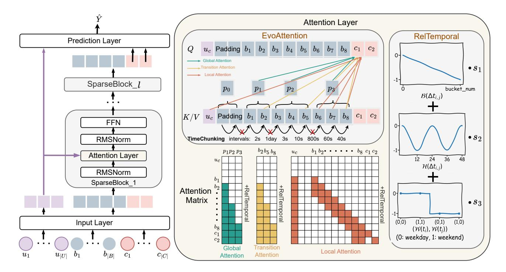
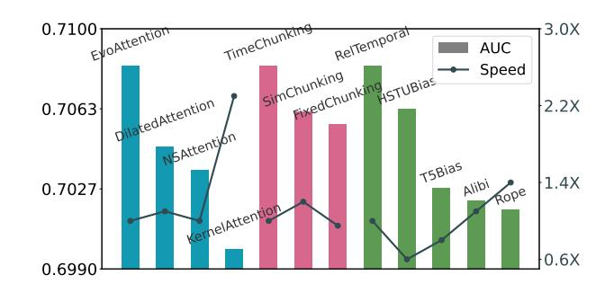
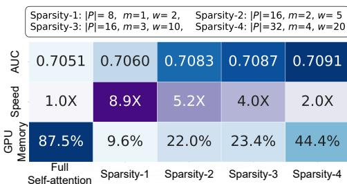
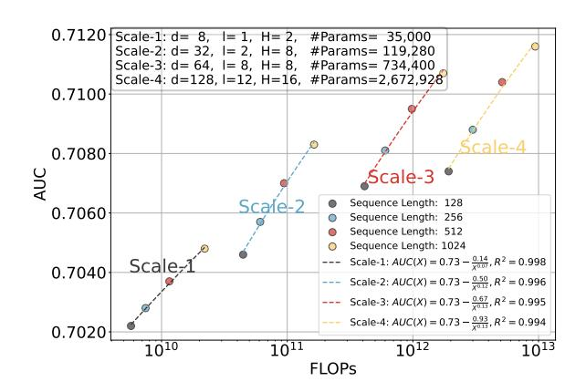

# Unleashing the Potential of Sparse Attention on Long-term Behaviors for CTR Prediction

Weijiang Lai Institute of Software, Chinese Academy of Sciences University of Chinese Academy of Sciences, Beijing, China laiweijiang22@otcaix.iscas.ac.cn

Beihong Jin† Institute of Software, Chinese Academy of Sciences University of Chinese Academy of Sciences, Beijing, China Beihong@iscas.ac.cn

Di Zhang Meituan Beijing, China zhangdi77@meituan.com

Siru Chen Meituan Beijing, China chensiru02@meituan.com

Jiongyan Zhang Meituan Beijing, China zhangjiongyan@meituan.com

Yuhang Gou Meituan Beijing, China gouyuhang@meituan.com

Jian Dong Meituan Beijing, China dongjian03@meituan.com

Xingxing Wang Meituan Beijing, China wangxingxing04@meituan.com

### Abstract

In recent years, the success of large language models (LLMs) has driven the exploration of scaling laws in recommender systems. However, models that demonstrate scaling laws are actually challenging to deploy in industrial settings for modeling long sequences of user behaviors, due to the high computational complexity of the standard self-attention mechanism. Despite various sparse selfattention mechanisms proposed in other fields, they are not fully suited for recommendation scenarios. This is because user behaviors exhibit personalization and temporal characteristics: different users have distinct behavior patterns, and these patterns change over time, with data from these users differing significantly from data in other fields in terms of distribution. To address these challenges, we propose SparseCTR, an efficient and effective model specifically designed for long-term behaviors of users. To be precise, we first segment behavior sequences into chunks in a personalized manner to avoid separating continuous behaviors and enable parallel processing of sequences. Based on these chunks, we propose a three-branch sparse self-attention mechanism to jointly identify users' global interests, interest transitions, and short-term interests. Furthermore, we design a composite relative temporal encoding via learnable, head-specific bias coefficients, better capturing sequential and periodic relationships among user behaviors. Extensive experimental results show that SparseCTR not only improves efficiency but also outperforms state-of-the-art methods. More importantly, it exhibits an obvious scaling law phenomenon, maintaining performance improvements across three orders

† Corresponding author.

© 2026 Copyright held by the owner/author(s). ACM ISBN 979-8-4007-2307-0/2026/04 <https://doi.org/10.1145/3774904.3792808>

of magnitude in FLOPs. In online A/B testing, SparseCTR increased CTR by 1.72% and CPM by 1.41%. Our source code is available at https://github.com/laiweijiang/SparseCTR.

## CCS Concepts

- Information systems → Recommender systems; Online advertising; Learning to rank.

### Keywords

CTR Prediction; Sparse Self-attention; Scaling Law

### ACM Reference Format:

Weijiang Lai, Beihong Jin† , Di Zhang, Siru Chen, Jiongyan Zhang, Yuhang Gou, Jian Dong, and Xingxing Wang. 2026. Unleashing the Potential of Sparse Attention on Long-term Behaviors for CTR Prediction. In Proceedings of the ACM Web Conference 2026 (WWW '26), April 13–17, 2026, Dubai, United Arab Emirates. ACM, New York, NY, USA, [10](#page-9-0) pages. [https://doi.org/10.1145/](https://doi.org/10.1145/3774904.3792808) [3774904.3792808](https://doi.org/10.1145/3774904.3792808)

# 1 Introduction

With the Transformer and LLMs demonstrating impressive performance in various fields [\[1,](#page-8-0) [8,](#page-8-1) [20,](#page-8-2) [25,](#page-8-3) [34\]](#page-8-4), the recommender systems community has increasingly explored architectures with selfattention [\[21,](#page-8-5) [41\]](#page-8-6). Recent studies have shown that these systems not only achieve high performance but also adhere to scaling laws to varying degrees; that is, the system performance will continue to improve as FLOPs (Floating Point Operations) increase [\[35\]](#page-8-7). However, the computational complexity of self-attention increases quadratically with the length of the input sequence, hindering efficiency in modeling long-term user behaviors and preventing the system from being deployed online.

To deal with this issue, some models resort to randomly sampling user behaviors or focusing only on short-term behaviors to model user interests [\[74,](#page-9-1) [77\]](#page-9-2), which inevitably leads to the loss of information and limits the potential of models. Others adopt

[This work is licensed under a Creative Commons Attribution 4.0 International License.](https://creativecommons.org/licenses/by/4.0) WWW '26, Dubai, United Arab Emirates

sparse self-attention [\[39\]](#page-8-8), but these are borrowed from computer vision [\[16,](#page-8-9) [60\]](#page-9-3) or natural language processing [\[55,](#page-9-4) [72\]](#page-9-5) fields, which are not well-suited for recommender systems. For instance, dilated or fixed-length chunk sparse self-attention methods [\[16,](#page-8-9) [72\]](#page-9-5) typically assume that the input data are uniformly distributed or locally continuous. However, these assumptions do not hold for user behaviors in recommender systems, resulting in the suboptimality of these methods.

We note that in recommendation scenarios, user behaviors often exhibit highly personalized and non-uniform temporal characteristics. Differences in behavior distribution exist not only between different users but also within the same user at different times. Specifically, behaviors within the same period reflect user interests during that period, while substantial variation across different periods indicates shifts in user preferences. Therefore, capturing these personalized dynamics will help aggregate redundant behaviors and identify key behaviors for sparse self-attention. Furthermore, given that user behaviors inherently possess sequential and periodic dependencies, explicitly incorporating temporal signals into attention computation enhances the modeling of behavioral interactions.

In this paper, we propose SparseCTR, a model to efficiently and effectively handle long-term behaviors in CTR scenarios. The model primarily consists of stacked SparseBlocks, where EvoAttention (Evolutionary Sparse Self-attention) progressively captures relationships among user behaviors. EvoAttention first employs a personalized time-aware chunking method named TimeChunking to segment behavior sequences according to time intervals of user behaviors. Based on these chunks, EvoAttention designs global, transition, and local attention mechanisms to model long-term interests, interest transitions, and short-term interests, respectively. Additionally, RelTemporal (Relative Temporal Encoding), an efficient relative encoding method, is proposed and incorporated into the attention computation to enable more accurate modeling of complex temporal relationships between behaviors.

Our contributions are summarized as follows:

- We propose a personalized method, TimeChunking, to divide different user behavior sequences into the same number of varied-length chunks, maintaining high cohesion within each chunk and low coupling between different chunks, and enabling parallel processing of sequences.
- We propose an efficient method, RelTemporal, to encode the relative time between two behaviors (i.e., time duration, hour, and weekend information) through learnable, headspecific bias coefficients, forming the basis for capturing the sequential and periodic relationships among user behaviors.
- We present a novel sparse self-attention mechanism, EvoAttention, for chunks of user behaviors with relative time encoding. The mechanism models user interests from multiple perspectives using global, transition, and local attention.
- We conduct extensive offline experiments on three realworld datasets and online A/B testing. The results show that SparseCTR achieves state-of-the-art performance while maintaining high efficiency, and exhibits obvious scaling laws; that is, the AUC consistently improves as the FLOPs of SparseCTR increase over three orders of magnitude.

### 2 Related Work

### 2.1 Long-term Behavior Modeling

In recent years, CTR prediction has focused on modeling user long-term behaviors to fully capture user interests. Mainstream approaches include one-stage methods [\[9,](#page-8-10) [39\]](#page-8-8), which optimize attention for comprehensive modeling, and two-stage methods [\[10–](#page-8-11) [12,](#page-8-12) [40,](#page-8-13) [47,](#page-9-6) [57\]](#page-9-7), where the newly-added first stage retrieves subsequences for subsequent processing. Inspired by the success of LLMs [\[4,](#page-8-14) [6,](#page-8-15) [26,](#page-8-16) [42,](#page-8-17) [62\]](#page-9-8), many recent studies extensively explore scaling laws in recommender systems [\[17,](#page-8-18) [56,](#page-9-9) [79\]](#page-9-10). For instance, scaling laws have been studied in some sequential recommendation models (e.g., LSRM) [\[32,](#page-8-19) [77,](#page-9-2) [84\]](#page-9-11) and CTR models (e.g., SUAN) [\[3,](#page-8-20) [10,](#page-8-11) [28,](#page-8-21) [39,](#page-8-8) [66,](#page-9-12) [75\]](#page-9-13). In addition, methods exemplified by HSTU [\[22,](#page-8-22) [49,](#page-9-14) [74,](#page-9-1) [78,](#page-9-15) [81\]](#page-9-16) unify retrieval and ranking stages. Despite their promising performance and scalability, deploying these models for long sequences remains challenging due to the high computational cost of selfattention, often necessitating strategies to compress the input or model [\[29,](#page-8-23) [39\]](#page-8-8).

# 2.2 Sparse Self-attention Mechanisms

To address the high time complexity of self-attention [\[63\]](#page-9-17) when modeling long sequences, various sparse self-attention methods have been proposed [\[59\]](#page-9-18). Some methods select a subset of elements for attention computation based on positional or structural information [\[2,](#page-8-24) [27,](#page-8-25) [71,](#page-9-19) [80\]](#page-9-20). For example, Longformer [\[5,](#page-8-26) [16\]](#page-8-9) introduces dilated attention, where each query attends only to keys at fixed intervals. BigBird [\[73\]](#page-9-21) proposes random attention by sampling keys randomly. Recent methods such as NSA and MoBA [\[44,](#page-9-22) [72\]](#page-9-5) divide sequences into fixed-length chunks, where each query first attends to chunk representations and then interacts with elements in the top-�� chunks. However, these methods often assume uniform or locally continuous data distributions, which differ from the highly non-uniform user behavior characteristics observed in recommendation scenarios. Besides, clustering attention [\[52,](#page-9-23) [64,](#page-9-24) [67\]](#page-9-25) allows each query to attend only to similar elements that are identified by clustering techniques. A representative case is Reformer [\[38\]](#page-8-27), which employs hash encoding [\[46\]](#page-9-26) to group elements in a sequence. However, these methods disrupt the original sequence order and are not suitable for order-sensitive scenarios.

Another line of research forms kernelized attention. Some methods [\[18,](#page-8-28) [61,](#page-9-27) [69\]](#page-9-28), such as Linformer and Performer, approximate attention by projecting �� and �� into lower-dimensional spaces using kernel functions or matrix decomposition. Some methods [\[36,](#page-8-29) [43,](#page-8-30) [45,](#page-9-29) [83\]](#page-9-30), such as Nyströmformer, reduce complexity by using kernel functions �� to approximate softmax(����⊤)�� as �� (��) (�� (��) ⊤�� ), thus avoiding the quadratic-order computational cost. However, these methods are in essence approximations of full attention and are difficult to extend with relative information encoding.

# 2.3 Relative Information Encoding

Relative position encoding is a key technique in attention mechanisms [\[24\]](#page-8-31). Unlike absolute position encoding [\[63,](#page-9-17) [65\]](#page-9-31), it captures the relative distances between elements in a sequence, thereby improving model performance. Shaw et al. [\[53\]](#page-9-32) first introduce learnable relative position embeddings for each query-key pair, which

### 3.6 Prediction Layer

In the prediction layer, we extract the embeddings of the target candidates �� (��) �� from the mixed sequence output of the ��-th SparseBlock, fuse the user feature vector ���� with the candidate representation and feed the fused result into an MLP for CTR prediction. The computations are as follows:

��ˆ = MLP(ReLU(�� �� ��4) ⊙ sigmoid(������5)), (17)

where ��4 ∈ R ��×�� and ��5 ∈ R |�� |��×�� are learnable parameter matrices. The model is optimized using the binary cross-entropy loss over all target candidates:

L = − 1 �� |��| ∑︁�� ��=1 ∑︁ |��| ��=1 ������ log��ˆ���� + (1 − ������) log(1 − ��ˆ����) , (18)

where �� is the number of samples in a batch, |��| is the number of target candidates per sample. ������ and ��ˆ���� denote the ground-truth label and the predicted value for the ��-th candidates in the ��-th sample, respectively.

# 3.7 Complexity Analysis

3.7.1 Time Complexity. The time complexity of SparseCTR is primarily composed of the stacked �� SparseBlocks. The main computational cost in SparseBlocks comes from EvoAttention, whose time complexity is �� (B��(��|�� |�� + ����|�� |�� + ������)), where B is the batch size. Since |�� |,��,�� ≪ ��, the overall complexity is significantly lower than that of full attention, which is ��(B����2��).

3.7.2 Space Complexity. In addition to the embedding table, the learnable parameters in SparseCTR mainly come from the Sparse-Blocks. Specifically, the parameters are primarily from EvoAttention and FFN, with complexities of ��(4����2 + 3����) and ��(9����2 ), respectively. Compared to full attention, our model introduces fewer additional parameters.

### 4 Experiments

# 4.1 Experimental Settings

4.1.1 Datasets. We select one industrial dataset and two public datasets to conduct experiments. The statistics of three datasets are shown in Table [1.](#page-5-0)

- Industry: This dataset involves over 86 million users who were active in 7 days prior to behavior recording, containing the historical behaviors of these users over the past 2 years.
- Alibaba[1](#page-5-1) : This dataset, released by Alibaba, collects user behavior data of 22 days from its display advertising system.
- Ele.me[2](#page-5-2) : This dataset is derived from the click logs of the ele.me service, containing user behaviors over 30 days.

4.1.2 Competitors. We select ten representative models from different research lines as baselines. Two of them, i.e., DIN [\[82\]](#page-9-39) and CAN [\[7\]](#page-8-39), focus on modeling behavior feature interactions (assigned to Group I). The other eight methods, i.e., SoftSIM, HardSIM, ETA [\[12\]](#page-8-12), TWIN-V2 [\[11\]](#page-8-40), BST [\[13\]](#page-8-41), HSTU [\[74\]](#page-9-1), LONGER [\[10\]](#page-8-11), and SUAN [\[39\]](#page-8-8), adopt behavior sequence modeling, where SoftSIM

Table 1: Statistics of the datasets.

| Datasets | #Users     | #Items     | #Samples      |
|----------|------------|------------|---------------|
| Industry | 86,722,000 | 20,241,000 | 1,455,722,000 |
| Alibaba  | 1,141,729  | 461,527    | 700,000,000   |
| Ele.me   | 14,427,689 | 7,446,116  | 128,000,000   |

and HardSIM are different variants of SIM [\[47\]](#page-9-6), employing embedding similarity retrieval and category retrieval, respectively. Of these eight methods, the first four are designed for long sequences (assigned to Group II), while the last four are not (Group III).

4.1.3 Evaluation Metrics. In our offline experiments, we use the widely adopted area under the ROC curve (AUC) metric to evaluate model performance, where a higher AUC indicates better results. Additionally, following [\[70,](#page-9-40) [82\]](#page-9-39), we employ the relative improvement (RelImpr) metric to compare performance gains between models. For the online A/B tests, we use CTR, cost per mille (CPM), and inference time as evaluation metrics.

4.1.4 Implementation Details. All models are implemented using TensorFlow. For fairness, all models are configured to have parameters of the same order of magnitude. In the overall performance experiments, the embedding size is set to 32 for all models, and the MLP in the prediction layer is configured as [32, 1] with Relu as the activation function. For our model and the models in Group III, the encoder consists of 2 layers and uses 8 attention heads.

Due to the varying lengths of user behavior sequences across different datasets, the sequence length is set to 1024 for all models on the industry and Alibaba datasets, and to 50 for the Ele.me dataset. All models are trained on NVIDIA A100-80G GPUs. Each model is trained for one epoch using the Adam optimizer.

### 4.2 Overall Performance

Table [2](#page-6-0) presents the performance results of the competitors and SparseCTR across the three datasets. Each value is the average of the results obtained from repeating the same experiment three times. We also provide the standard deviation of AUCs of SparseCTR. It is worth noting that, in CTR prediction tasks, an AUC improvement at the 0.001 level is considered significant [\[11,](#page-8-40) [68\]](#page-9-41). Besides, we conduct a ��-test on the AUCs of SparseCTR and each baseline using a significance level of 0.05, and the fact that all ��-values are less than 0.05 demonstrates that the performance differences between SparseCTR and the baselines are statistically significant.

Group II outperforms Group I, indicating that models designed for long-term behaviors attain better results on long sequences. Compared to Groups I and II, Group III achieves better results, confirming the effectiveness of self-attention mechanisms in modeling complex user behaviors. However, due to their high computational complexity, such models are challenging to deploy in real-world online systems.

SparseCTR outperforms all the baselines, indicating that our model not only significantly reduces computational complexity compared to the models in Group III, but also delivers superior AUCs. This advantage is primarily attributed to the EvoAttention and RelTemporal mechanisms, which effectively capture the sequential and periodic relationships among user behaviors.

1https://tianchi.aliyun.com/dataset/56

2https://tianchi.aliyun.com/dataset/131047

Table 2: Performance comparison. For each row, the highest and second-highest AUCs are denoted by bold and underlined text, respectively. The DIN model serves as the base model for computing RelaImpr.

| Dataset  | Metric   | DIN    | Group I CAN | SoftSIM | HardSIM | Group II ETA | TWIN-V2 | BST    | HSTU   | Group III LONGER | SUAN   |        | SparseCTR |
|----------|----------|--------|-------------|---------|---------|--------------|---------|--------|--------|------------------|--------|--------|-----------|
| Industry | AUC      | 0.6920 | 0.6918      | 0.6936  | 0.6931  | 0.6944       | 0.6948  | 0.6969 | 0.7002 | 0.7007           | 0.7040 | 0.7083 | ± 0.00004 |
|          | RelaImpr | 0.00%  | -0.10%      | 0.83%   | 0.57%   | 1.25%        | 1.45%   | 2.55%  | 4.27%  | 4.53%            | 6.25%  | 8.49%  | ± 0.02%   |
| Alibaba  | AUC      | 0.6209 | 0.6198      | 0.6227  | 0.6247  | 0.6231       | 0.6237  | 0.6422 | 0.6448 | 0.6457           | 0.6479 | 0.6530 | ± 0.00014 |
|          | RelaImpr | 0.00%  | -0.91%      | 1.49%   | 3.14%   | 1.82%        | 2.32%   | 17.62% | 19.77% | 20.51%           | 22.33% | 26.55% | ± 0.12%   |
| Ele.me   | AUC      | 0.6378 | 0.6382      | 0.6414  | 0.6405  | 0.6410       | 0.6423  | 0.6616 | 0.6645 | 0.6650           | 0.6673 | 0.6725 | ± 0.00025 |
|          | RelaImpr | 0.00%  | 0.29%       | 2.61%   | 1.96%   | 2.32%        | 3.27%   | 17.28% | 19.38% | 19.74%           | 21.41% | 25.18% | ± 0.18%   |

Table 3: Results of the ablation study.

|           | Model | Industry | Alibaba | Ele.me |
|-----------|-------|----------|---------|--------|
| SparseCTR |       | 0.7083   | 0.6530  | 0.6725 |
| Variant   | A1    | 0.7051   | 0.6502  | 0.6707 |
| Variant   | A2    | 0.7023   | 0.6469  | 0.6674 |
| Variant   | A3    | 0.7030   | 0.6482  | 0.6681 |
| Variant   | A4    | 0.7067   | 0.6510  | 0.6699 |
| Variant   | B1    | 0.7015   | 0.6461  | 0.6651 |
| Variant   | B2    | 0.7043   | 0.6473  | 0.6676 |
| Variant   | B3    | 0.7069   | 0.6511  | 0.6708 |
| Variant   | B4    | 0.7062   | 0.6517  | 0.6704 |

### 4.3 Ablation Study

We construct two groups of variants of SparseCTR to evaluate the impact of each component in EvoAttention and RelTemporal on AUC. In the first group, variant A1 replaces the entire EvoAttention with standard full self-attention, while variants A2, A3, and A4 remove the global, transition, and local attention branches from EvoAttention, respectively. In the second group, variant B1 removes the complete RelTemporal, and variants B2, B3, and B4 exclude the relative time, hour, and weekend encodings, respectively.

The results are shown in Table [3.](#page-6-1) All variant models perform worse than SparseCTR. For EvoAttention, both global and transition attention have a notable impact on performance. Removing local attention (variant A4) results in a small performance drop, presumably because transition attention can partially compensate for the absence of local attention. From the performance of variants in the second group, we find that RelTemporal indeed makes a substantial contribution to model performance, particularly through the relative time encoding. However, removing the relative hour or weekend encodings, both of which are used to capture periodic relationships among user behaviors, has only a limited effect on overall performance.

# 4.4 Different Alternatives Comparison

4.4.1 Comparison of Different Sparse Self-attention Methods. We compare EvoAttention with three representative sparse self-attention mechanisms, that is, the dilated attention (DilatedAttention) [\[16\]](#page-8-9), the native sparse attention (NSAttention) [\[72\]](#page-9-5), and the kernelized attention method (KernelAttention) [\[69\]](#page-9-28). Clustering attention [\[38\]](#page-8-27) is

Figure 2: Comparison with existing sparse self-attention, chunking, and relative encoding methods.

excluded as it does not support causal modeling. To ensure fairness, we tune the hyperparameters so that EvoAttention, DilatedAttention, and NSAttention achieve comparable speeds. We record AUCs and speeds on the industrial dataset, where the speed is calculated based on the inference time of EvoAttention.

The results in the left section of Figure [2](#page-6-2) show that EvoAttention outperforms both the DilatedAttention and NSAttention, as it accounts for user behavior distribution specific to recommender systems, making it more effective to model long-term user behaviors. Although KernelAttention achieves the highest efficiency, its AUC is significantly lower, as it is a simplified version of standard full self-attention and cannot incorporate relative time encoding.

4.4.2 Comparison of Different Chunking Methods. We compare personalized TimeChunking with the similarity-aware chunking (SimChunking), and fixed-length chunking (FixedChunking) [\[72\]](#page-9-5) methods. The SimChunking method is similar to TimeChunking, except it uses embedding similarity as the criterion for chunking instead of time intervals. We also record AUCs and speeds on the industrial dataset, where the speed is calculated based on the inference time of TimeChunking.

As shown in the middle section of Figure [2,](#page-6-2) TimeChunking achieves optimal performance with minimal computational overhead. This effectiveness is attributed to the personalized and temporal characteristics of user behaviors, allowing the TimeChunking to compress consecutive behaviors efficiently.

4.4.3 Comparison of Different Relative Encoding Methods. We compare RelTemporal to four relative information encoding methods,

Figure 3: Performance of EvoAttention under different configurations in terms of AUC, speed, and GPU memory.

i.e., the attention bias approaches used in HSTU [\[74\]](#page-9-1) and T5 [\[50\]](#page-9-33), as well as Alibi [\[48\]](#page-9-34) and RoPE [\[58\]](#page-9-35).

The experimental results are shown in the right section of Figure [2.](#page-6-2) The results indicate that T5Bias, Alibi, and RoPE, each of which only considers relative positional relationships between behaviors, thereby show low AUCs. In contrast, HSTUBias, which incorporates relative time information, significantly improves performance but greatly reduces efficiency. RelTemporal not only achieves the highest AUC, but also maintains relatively high efficiency.

### 4.5 Sparsity of Attention Analysis

We tune the hyperparameters to obtain different configurations of EvoAttention with varying sparsity, as shown in the top line of Figure [3,](#page-7-0) where |�� | denotes the number of chunks, �� denotes the number of transition behaviors per chunk, and �� denotes the number of local behaviors. Then we run SparseCTR equipped with EvoAttention of varying sparsity and standard full self-attention on the industrial dataset, taking sequences of length 1024 as input, and record their AUCs, speeds, and GPU memory consumption.

From the results of Figure [3,](#page-7-0) we find that all configurations of EvoAttention achieve higher AUC than standard full self-attention. This can be attributed to the fact that user behavior sequences often contain noise, and directly attending to all behaviors may lead to suboptimal results. More importantly, EvoAttention achieves up to an 8.9× speedup while using less GPU memory. This paves the way for large-scale deployment of long-sequence user modeling models in real-world systems.

### 4.6 Scaling Law Analysis

We conduct experiments on the industrial dataset to verify whether SparseCTR exhibits scaling laws. Specifically, we construct four models with different scales (with detailed configurations provided in the legend of Figure [4\)](#page-7-1), each modeling user behavior sequences of varying lengths ([128, 256, 512, 1024]), so that our experiments span three orders of magnitude in FLOPs. Since AUC is a more meaningful metric in our scenario, we follow [\[31,](#page-8-42) [39,](#page-8-8) [84\]](#page-9-11) and fit the AUCs to a power-law function ������(��) = �� − ��/�� , where �� denotes the FLOPs, and �� and �� are coefficients to be fitted. Here, �� can be interpreted as the potential upper bound of AUC values on these training samples.

In the results shown in Figure [4,](#page-7-1) we use the least squares method to fit the AUCs to a nonlinear curve, and the coefficients of determination (�� 2 ) are close to 1, indicating a good fit. This demonstrates

Figure 4: Scaling laws on the industrial dataset: AUC under different FLOPs, with FLOPs determined by sequence length and model scale (#Params is the number of non-embedding parameters).

that SparseCTR preserves the key property that AUC increases as computational cost increases, highlighting the practical value of our model for real-world deployment. Furthermore, the fitted powerlaw functions provide insights into model scalability strategies; for example, simultaneously increasing both sequence length and model scale yields greater efficiency gains than increasing either one alone.

### 4.7 Online A/B Test

We conducted an online A/B test by deploying our SparseCTR model in a live production environment for 7 days, directing 1% of the total traffic to it. The baseline, serving the list advertising scenario, is a well-established model that incorporates DIN, SIM, SUAN, and a standard full-attention component based on HSTU ( with sequence length 128), and other components, and has undergone several rounds of optimization. In the A/B test, we enhanced the baseline by replacing the online model's full-attention component with SparseCTR (with sequence length 1024). As a result, CTR improved by 1.72% and CPM increased by 1.41%, while the inference time maintains 40 ms.

### 5 Conclusion

In this paper, we propose the SparseCTR model for the CTR prediction task. The model learns user interests from diverse temporal views within long-term user behaviors and presents a three-branch sparse attention mechanism, thereby avoiding the computational complexity that scales quadratically with the sequence length. Notably, SparseCTR exhibits the obvious scaling law phenomenon, enabling it to support longer sequences and larger parameters under the same computational resources, and achieving superior online performance.

# Acknowledgments

This work was supported by the National Natural Science Foundation of China under Grant No. 62072450 and Meituan.

### References

[1] Josh Achiam, Steven Adler, Sandhini Agarwal, Lama Ahmad, Ilge Akkaya, Florencia Leoni Aleman, Diogo Almeida, Janko Altenschmidt, Sam Altman, Shyamal Anadkat, et al. 2023. Gpt-4 technical report. arXiv preprint arXiv:2303.08774 (2023). [2] Joshua Ainslie, Santiago Ontanon, Chris Alberti, Vaclav Cvicek, Zachary Fisher, Philip Pham, Anirudh Ravula, Sumit Sanghai, Qifan Wang, and Li Yang. 2020. ETC: Encoding Long and Structured Inputs in Transformers. In Proceedings of the 2020 Conference on Empirical Methods in Natural Language Processing (EMNLP). Association for Computational Linguistics. [3] Newsha Ardalani, Carole-Jean Wu, Zeliang Chen, Bhargav Bhushanam, and Adnan Aziz. 2022. Understanding scaling laws for recommendation models. arXiv preprint arXiv:2208.08489 (2022). [4] Jinze Bai, Shuai Bai, Yunfei Chu, Zeyu Cui, Kai Dang, Xiaodong Deng, Yang Fan, Wenbin Ge, Yu Han, Fei Huang, et al. 2023. Qwen technical report. arXiv preprint arXiv:2309.16609 (2023). [5] Iz Beltagy, Matthew E Peters, and Arman Cohan. 2020. Longformer: The longdocument transformer. arXiv preprint arXiv:2004.05150 (2020). [6] Xiao Bi, Deli Chen, Guanting Chen, Shanhuang Chen, Damai Dai, Chengqi Deng, Honghui Ding, Kai Dong, Qiushi Du, Zhe Fu, et al. 2024. Deepseek llm: Scaling open-source language models with longtermism. arXiv preprint arXiv:2401.02954 (2024). [7] Weijie Bian, Kailun Wu, Lejian Ren, Qi Pi, Yujing Zhang, Can Xiao, Xiang-Rong Sheng, Yong-Nan Zhu, Zhangming Chan, Na Mou, et al. 2022. CAN: feature co-action network for click-through rate prediction. In Proceedings of the fifteenth ACM international conference on web search and data mining. 57–65. [8] Tom B Brown, Benjamin Mann, Nick Ryder, Melanie Subbiah, Jared Kaplan, Prafulla Dhariwal, Arvind Neelakantan, Pranav Shyam, Girish Sastry, Amanda Askell, et al. 2020. Language models are few-shot learners. In Proceedings of the 34th International Conference on Neural Information Processing Systems. 1877– 1901. [9] Yue Cao, Xiaojiang Zhou, Jiaqi Feng, Peihao Huang, Yao Xiao, Dayao Chen, and Sheng Chen. 2022. Sampling is all you need on modeling long-term user behaviors for CTR prediction. In Proceedings of the 31st ACM International Conference on Information & Knowledge Management. 2974–2983. [10] Zheng Chai, Qin Ren, Xijun Xiao, Huizhi Yang, Bo Han, Sijun Zhang, Di Chen, Hui Lu, Wenlin Zhao, Lele Yu, et al. 2025. Longer: Scaling up long sequence modeling in industrial recommenders. In Proceedings of the Nineteenth ACM Conference on Recommender Systems. 247–256. [11] Jianxin Chang, Chenbin Zhang, Zhiyi Fu, Xiaoxue Zang, Lin Guan, Jing Lu, Yiqun Hui, Dewei Leng, Yanan Niu, Yang Song, et al. 2023. TWIN: TWo-stage interest network for lifelong user behavior modeling in CTR prediction at kuaishou. In Proceedings of the 29th ACM SIGKDD Conference on Knowledge Discovery and Data Mining. 3785–3794. [12] Qiwei Chen, Changhua Pei, Shanshan Lv, Chao Li, Junfeng Ge, and Wenwu Ou. 2021. End-to-end user behavior retrieval in click-through rate prediction model. arXiv preprint arXiv:2108.04468 (2021). [13] Qiwei Chen, Huan Zhao, Wei Li, Pipei Huang, and Wenwu Ou. 2019. Behavior sequence transformer for e-commerce recommendation in alibaba. In Proceedings of the 1st international workshop on deep learning practice for high-dimensional sparse data. 1–4. [14] Ta-Chung Chi, Ting-Han Fan, Peter J Ramadge, and Alexander Rudnicky. 2022. Kerple: Kernelized relative positional embedding for length extrapolation. Advances in Neural Information Processing Systems 35 (2022), 8386–8399. [15] Ta Chung Chi, Ting Han Fan, Alexander I Rudnicky, and Peter J Ramadge. 2023. Dissecting Transformer Length Extrapolation via The Lens of Receptive Field Analysis. In 61st Annual Meeting of the Association for Computational Linguistics, ACL 2023. Association for Computational Linguistics (ACL), 13522–13537. [16] Rewon Child, Scott Gray, Alec Radford, and Ilya Sutskever. 2019. Generating long sequences with sparse transformers. arXiv preprint arXiv:1904.10509 (2019). [17] Sharad Chitlangia, Krishna Reddy Kesari, and Rajat Agarwal. 2023. Scaling generative pre-training for user ad activity sequences. In KDD 2023 Workshop on Artificial Intelligence for Computational Advertising (Ad-KDD). [https://www.amazon.science/publications/scaling-generative-pre](https://www.amazon.science/publications/scaling-generative-pre-training-for-user-ad-activity-sequences)[training-for-user-ad-activity-sequences](https://www.amazon.science/publications/scaling-generative-pre-training-for-user-ad-activity-sequences) [18] Krzysztof Choromanski, Valerii Likhosherstov, David Dohan, Xingyou Song, Andreea Gane, Tamas Sarlos, Peter Hawkins, Jared Davis, Afroz Mohiuddin, Lukasz Kaiser, et al. 2020. Rethinking attention with performers. arXiv preprint arXiv:2009.14794 (2020). [19] Zihang Dai, Zhilin Yang, Yiming Yang, Jaime Carbonell, Quoc Le, and Ruslan Salakhutdinov. 2019. Transformer-XL: Attentive Language Models beyond a Fixed-Length Context. In Proceedings of the 57th Annual Meeting of the Association for Computational Linguistics. Association for Computational Linguistics. [20] Mostafa Dehghani, Josip Djolonga, Basil Mustafa, Piotr Padlewski, Jonathan Heek, Justin Gilmer, Andreas Peter Steiner, Mathilde Caron, Robert Geirhos, Ibrahim Alabdulmohsin, et al. 2023. Scaling vision transformers to 22 billion parameters. In International Conference on Machine Learning. PMLR, 7480–7512. [21] Yashar Deldjoo, Zhankui He, Julian McAuley, Anton Korikov, Scott Sanner, Arnau Ramisa, René Vidal, Maheswaran Sathiamoorthy, Atoosa Kasirzadeh, and Silvia Milano. 2024. A review of modern recommender systems using generative models (gen-recsys). In Proceedings of the 30th ACM SIGKDD conference on Knowledge Discovery and Data Mining. 6448–6458. [22] Jiaxin Deng, Shiyao Wang, Kuo Cai, Lejian Ren, Qigen Hu, Weifeng Ding, Qiang Luo, and Guorui Zhou. 2025. Onerec: Unifying retrieve and rank with generative recommender and iterative preference alignment. arXiv preprint arXiv:2502.18965 (2025). [23] Yiran Ding, Li Lyna Zhang, Chengruidong Zhang, Yuanyuan Xu, Ning Shang, Jiahang Xu, Fan Yang, and Mao Yang. 2024. LongRoPE: Extending LLM Context Window Beyond 2 Million Tokens. In International Conference on Machine Learning. PMLR, 11091–11104. [24] Philipp Dufter, Martin Schmitt, and Hinrich Schütze. 2022. Position information in transformers: An overview. Computational Linguistics 48, 3 (2022), 733–763. [25] Yan Fang, Jingtao Zhan, Qingyao Ai, Jiaxin Mao, Weihang Su, Jia Chen, and Yiqun Liu. 2024. Scaling laws for dense retrieval. In Proceedings of the 47th International ACM SIGIR Conference on Research and Development in Information Retrieval. 1339–1349. [26] Daya Guo, Dejian Yang, Haowei Zhang, Junxiao Song, Peiyi Wang, Qihao Zhu, Runxin Xu, Ruoyu Zhang, Shirong Ma, Xiao Bi, et al. 2025. DeepSeek-R1 incentivizes reasoning in LLMs through reinforcement learning. Nature 645, 8081 (2025), 633–638. [27] Qipeng Guo, Xipeng Qiu, Pengfei Liu, Yunfan Shao, Xiangyang Xue, and Zheng Zhang. 2019. Star-Transformer. In Proceedings of NAACL-HLT. 1315–1325. [28] Xingzhuo Guo, Junwei Pan, Ximei Wang, Baixu Chen, Jie Jiang, and Mingsheng Long. 2024. On the embedding collapse when scaling up recommendation models. In Proceedings of the 41st International Conference on Machine Learning. 16891– 16909. [29] Ruidong Han, Bin Yin, Shangyu Chen, He Jiang, Fei Jiang, Xiang Li, Chi Ma, Mincong Huang, Xiaoguang Li, Chunzhen Jing, et al. 2025. MTGR: Industrial-Scale Generative Recommendation Framework in Meituan. arXiv preprint arXiv:2505.18654 (2025). [30] Pengcheng He, Xiaodong Liu, Jianfeng Gao, and Weizhu Chen. 2020. Deberta: Decoding-enhanced bert with disentangled attention. arXiv preprint arXiv:2006.03654 (2020). [31] Jordan Hoffmann, Sebastian Borgeaud, Arthur Mensch, Elena Buchatskaya, Trevor Cai, Eliza Rutherford, Diego de Las Casas, Lisa Anne Hendricks, Johannes Welbl, Aidan Clark, et al. 2022. Training compute-optimal large language models. In Proceedings of the 36th International Conference on Neural Information Processing Systems. 30016–30030. [32] Yupeng Hou, Jianmo Ni, Zhankui He, Noveen Sachdeva, Wang-Cheng Kang, Ed H Chi, Julian McAuley, and Derek Zhiyuan Cheng. 2025. ActionPiece: Contextually Tokenizing Action Sequences for Generative Recommendation. In Forty-second International Conference on Machine Learning. [33] Cheng-Zhi Anna Huang, Ashish Vaswani, Jakob Uszkoreit, Noam Shazeer, Ian Simon, Curtis Hawthorne, Andrew M Dai, Matthew D Hoffman, Monica Dinculescu, and Douglas Eck. 2018. Music transformer. arXiv preprint arXiv:1809.04281 (2018). [34] Chao Jia, Yinfei Yang, Ye Xia, Yi-Ting Chen, Zarana Parekh, Hieu Pham, Quoc Le, Yun-Hsuan Sung, Zhen Li, and Tom Duerig. 2021. Scaling up visual and visionlanguage representation learning with noisy text supervision. In International conference on machine learning. PMLR, 4904–4916. [35] Jared Kaplan, Sam McCandlish, Tom Henighan, Tom B Brown, Benjamin Chess, Rewon Child, Scott Gray, Alec Radford, Jeffrey Wu, and Dario Amodei. 2020. Scaling laws for neural language models. arXiv preprint arXiv:2001.08361 (2020). [36] Angelos Katharopoulos, Apoorv Vyas, Nikolaos Pappas, and François Fleuret. 2020. Transformers are rnns: Fast autoregressive transformers with linear attention. In International conference on machine learning. PMLR, 5156–5165. [37] Guolin Ke, Di He, and Tie-Yan Liu. [n. d.]. Rethinking Positional Encoding in Language Pre-training. In International Conference on Learning Representations. [38] Nikita Kitaev, Lukasz Kaiser, and Anselm Levskaya. [n. d.]. Reformer: The Efficient Transformer. In International Conference on Learning Representations. [39] Weijiang Lai, Beihong Jin, Jiongyan Zhang, Yiyuan Zheng, Jian Dong, Jia Cheng, Jun Lei, and Xingxing Wang. 2025. Exploring Scaling Laws of CTR Model for Online Performance Improvement. In Proceedings of the Nineteenth ACM Conference on Recommender Systems. 114–123. [40] Weijiang Lai, Beihong Jin, Yapeng Zhang, Yiyuan Zheng, Rui Zhao, Jian Dong, Jun Lei, and Xingxing Wang. 2025. Modeling Long-term User Behaviors with Diffusion-driven Multi-interest Network for CTR Prediction. In Proceedings of the Nineteenth ACM Conference on Recommender Systems. 289–298. [41] Jianghao Lin, Xinyi Dai, Yunjia Xi, Weiwen Liu, Bo Chen, Hao Zhang, Yong Liu, Chuhan Wu, Xiangyang Li, Chenxu Zhu, et al. 2025. How can recommender systems benefit from large language models: A survey. ACM Transactions on Information Systems 43, 2 (2025), 1–47. [42] Aixin Liu, Bei Feng, Bing Xue, Bingxuan Wang, Bochao Wu, Chengda Lu, Chenggang Zhao, Chengqi Deng, Chenyu Zhang, Chong Ruan, et al. 2024. Deepseek-v3 technical report. arXiv preprint arXiv:2412.19437 (2024). [43] Langming Liu, Liu Cai, Chi Zhang, Xiangyu Zhao, Jingtong Gao, Wanyu Wang, Yifu Lv, Wenqi Fan, Yiqi Wang, Ming He, et al. 2023. Linrec: Linear attention

mechanism for long-term sequential recommender systems. In Proceedings of the 46th International ACM SIGIR Conference on Research and Development in Information Retrieval. 289–299. [44] Enzhe Lu, Zhejun Jiang, Jingyuan Liu, Yulun Du, Tao Jiang, Chao Hong, Shaowei Liu, Weiran He, Enming Yuan, Yuzhi Wang, et al. 2025. Moba: Mixture of block attention for long-context llms. arXiv preprint arXiv:2502.13189 (2025). [45] Xuezhe Ma, Xiang Kong, Sinong Wang, Chunting Zhou, Jonathan May, Hao Ma, and Luke Zettlemoyer. 2021. Luna: Linear unified nested attention. Advances in Neural Information Processing Systems 34 (2021), 2441–2453. [46] Gurmeet Singh Manku, Arvind Jain, and Anish Das Sarma. 2007. Detecting nearduplicates for web crawling. In Proceedings of the 16th international conference on World Wide Web. 141–150. [47] Qi Pi, Guorui Zhou, Yujing Zhang, Zhe Wang, Lejian Ren, Ying Fan, Xiaoqiang Zhu, and Kun Gai. 2020. Search-based user interest modeling with lifelong sequential behavior data for click-through rate prediction. In Proceedings of the 29th ACM International Conference on Information & Knowledge Management. 2685–2692. [48] Ofir Press, Noah A Smith, and Mike Lewis. 2022. Train Short, Test Long: Attention with Linear Biases Enables Input Length Extrapolation. In ICLR. [49] Junyan Qiu, Ze Wang, Fan Zhang, Zuowu Zheng, Jile Zhu, Jiangke Fan, Teng Zhang, Haitao Wang, and Xingxing Wang. 2025. One Model to Rank Them All: Unifying Online Advertising with End-to-End Learning. arXiv preprint arXiv:2505.19755 (2025). [50] Colin Raffel, Noam Shazeer, Adam Roberts, Katherine Lee, Sharan Narang, Michael Matena, Yanqi Zhou, Wei Li, and Peter J Liu. 2020. Exploring the limits of transfer learning with a unified text-to-text transformer. Journal of machine learning research 21, 140 (2020), 1–67. [51] Prajit Ramachandran, Barret Zoph, and Quoc V Le. 2017. Searching for activation functions. arXiv preprint arXiv:1710.05941 (2017). [52] Aurko Roy, Mohammad Saffar, Ashish Vaswani, and David Grangier. 2021. Efficient content-based sparse attention with routing transformers. Transactions of the Association for Computational Linguistics 9 (2021), 53–68. [53] Peter Shaw, Jakob Uszkoreit, and Ashish Vaswani. 2018. Self-attention with relative position representations. arXiv preprint arXiv:1803.02155 (2018). [54] Noam Shazeer. 2020. GLU variants improve transformer. arXiv preprint arXiv:2002.05202 (2020). [55] Boheng Sheng, Jiacheng Yao, Meicong Zhang, and Guoxiu He. 2025. Dynamic Chunking and Selection for Reading Comprehension of Ultra-Long Context in Large Language Models. In Proceedings of the 63rd Annual Meeting of the Association for Computational Linguistics. 31857–31876. [56] Kyuyong Shin, Hanock Kwak, Su Young Kim, Max Nihlén Ramström, Jisu Jeong, Jung-Woo Ha, and Kyung-Min Kim. 2023. Scaling law for recommendation models: Towards general-purpose user representations. In Proceedings of the AAAI Conference on Artificial Intelligence, Vol. 37. 4596–4604. [57] Zihua Si, Lin Guan, Zhongxiang Sun, Xiaoxue Zang, Jing Lu, Yiqun Hui, Xingchao Cao, Zeyu Yang, Yichen Zheng, Dewei Leng, Kai Zheng, Chenbin Zhang, Yanan Niu, Yang Song, and Kun Gai. 2024. TWIN V2: Scaling Ultra-Long User Behavior Sequence Modeling for Enhanced CTR Prediction at Kuaishou. In Proceedings of the 33rd ACM International Conference on Information and Knowledge Management. 4890–4897. [58] Jianlin Su, Murtadha Ahmed, Yu Lu, Shengfeng Pan, Wen Bo, and Yunfeng Liu. 2024. Roformer: Enhanced transformer with rotary position embedding. Neurocomputing 568 (2024), 127063. [59] Yutao Sun, Zhenyu Li, Yike Zhang, Tengyu Pan, Bowen Dong, Yuyi Guo, and Jianyong Wang. 2025. Efficient Attention Mechanisms for Large Language Models: A Survey. arXiv preprint arXiv:2507.19595 (2025). [60] Keda Tao, Can Qin, Haoxuan You, Yang Sui, and Huan Wang. 2025. DyCoke: Dynamic Compression of Tokens for Fast Video Large Language Models. In Proceedings of the Computer Vision and Pattern Recognition Conference. 18992– 19001. [61] Yi Tay, Dara Bahri, Donald Metzler, Da-Cheng Juan, Zhe Zhao, and Che Zheng. 2021. Synthesizer: Rethinking self-attention for transformer models. In International conference on machine learning. PMLR, 10183–10192. [62] Hugo Touvron, Thibaut Lavril, Gautier Izacard, Xavier Martinet, Marie-Anne Lachaux, Timothée Lacroix, Baptiste Rozière, Naman Goyal, Eric Hambro, Faisal Azhar, et al. 2023. LLaMA: Open and efficient foundation language models. arXiv preprint arXiv:2302.13971 (2023). [63] A Vaswani. 2017. Attention is all you need. Advances in Neural Information Processing Systems (2017). [64] Apoorv Vyas, Angelos Katharopoulos, and François Fleuret. 2020. Fast transformers with clustered attention. Advances in Neural Information Processing Systems 33 (2020), 21665–21674. [65] Benyou Wang, Donghao Zhao, Christina Lioma, Qiuchi Li, Peng Zhang, et al. 2020. Encoding Word Order in Complex Embeddings. In ICLR 2020-Proceedings of Eighth International Conference on Learning Representations. [66] Chunqi Wang, Bingchao Wu, Zheng Chen, Lei Shen, Bing Wang, and Xiaoyi Zeng. 2025. Scaling transformers for discriminative recommendation via generative pretraining. In Proceedings of the 31st ACM SIGKDD Conference on Knowledge Discovery and Data Mining V. 2. 2893–2903. [67] Ningning Wang, Guobing Gan, Peng Zhang, Shuai Zhang, Junqiu Wei, Qun Liu, and Xin Jiang. 2022. ClusterFormer: Neural clustering attention for efficient and effective transformer. In Proceedings of the 60th Annual Meeting of the Association for Computational Linguistics (Volume 1: Long Papers). 2390–2402. [68] Ruoxi Wang, Bin Fu, Gang Fu, and Mingliang Wang. 2017. Deep & cross network for ad click predictions. In Proceedings of the ADKDD'17. 1–7. [69] Sinong Wang, Belinda Z Li, Madian Khabsa, Han Fang, and Hao Ma. 2020. Linformer: Self-attention with linear complexity. arXiv preprint arXiv:2006.04768 (2020). [70] Ling Yan, Wu-Jun Li, Gui-Rong Xue, and Dingyi Han. 2014. Coupled group lasso for web-scale ctr prediction in display advertising. In International conference on machine learning. PMLR, 802–810. [71] Zihao Ye, Qipeng Guo, Quan Gan, Xipeng Qiu, and Zheng Zhang. 2019. Bptransformer: Modelling long-range context via binary partitioning. arXiv preprint arXiv:1911.04070 (2019). [72] Jingyang Yuan, Huazuo Gao, Damai Dai, Junyu Luo, Liang Zhao, Zhengyan Zhang, Zhenda Xie, Yuxing Wei, Lean Wang, Zhiping Xiao, Yuqing Wang, Chong Ruan, Ming Zhang, Wenfeng Liang, and Wangding Zeng. 2025. Native Sparse Attention: Hardware-Aligned and Natively Trainable Sparse Attention. In Proceedings of the 63rd Annual Meeting of the Association for Computational Linguistics. 23078– 23097. [73] Manzil Zaheer, Guru Guruganesh, Kumar Avinava Dubey, Joshua Ainslie, Chris Alberti, Santiago Ontanon, Philip Pham, Anirudh Ravula, Qifan Wang, Li Yang, et al. 2020. Big bird: Transformers for longer sequences. Advances in neural information processing systems 33 (2020), 17283–17297. [74] Jiaqi Zhai, Lucy Liao, Xing Liu, Yueming Wang, Rui Li, Xuan Cao, Leon Gao, Zhaojie Gong, Fangda Gu, Jiayuan He, et al. 2024. Actions speak louder than words: trillion-parameter sequential transducers for generative recommendations. In Proceedings of the 41st International Conference on Machine Learning. 58484– 58509. [75] Buyun Zhang, Liang Luo, Yuxin Chen, Jade Nie, Xi Liu, Shen Li, Yanli Zhao, Yuchen Hao, Yantao Yao, Ellie Dingqiao Wen, et al. 2024. Wukong: towards a scaling law for large-scale recommendation. In Proceedings of the 41st International Conference on Machine Learning. 59421–59434. [76] Biao Zhang and Rico Sennrich. 2019. Root mean square layer normalization. Advances in Neural Information Processing Systems 32 (2019). [77] Gaowei Zhang, Yupeng Hou, Hongyu Lu, Yu Chen, Wayne Xin Zhao, and Ji-Rong Wen. 2024. Scaling law of large sequential recommendation models. In Proceedings of the 18th ACM Conference on Recommender Systems. 444–453. [78] Luankang Zhang, Kenan Song, Yi Quan Lee, Wei Guo, Hao Wang, Yawen Li, Huifeng Guo, Yong Liu, Defu Lian, and Enhong Chen. 2025. Killing two birds with one stone: Unifying retrieval and ranking with a single generative recommendation model. In Proceedings of the 48th International ACM SIGIR Conference on Research and Development in Information Retrieval. 2224–2234. [79] Pengtao Zhang and Junlin Zhang. 2023. MemoNet: Memorizing All Cross Features' Representations Efficiently via Multi-Hash Codebook Network for CTR Prediction. In Proceedings of the 32nd ACM International Conference on Information and Knowledge Management. 3154–3163. [80] Guangxiang Zhao, Junyang Lin, Zhiyuan Zhang, Xuancheng Ren, Qi Su, and Xu Sun. 2019. Explicit sparse transformer: Concentrated attention through explicit selection. arXiv preprint arXiv:1912.11637 (2019). [81] Guorui Zhou, Jiaxin Deng, Jinghao Zhang, Kuo Cai, Lejian Ren, Qiang Luo, Qianqian Wang, Qigen Hu, Rui Huang, Shiyao Wang, et al. 2025. OneRec Technical Report. arXiv preprint arXiv:2506.13695 (2025). [82] Guorui Zhou, Xiaoqiang Zhu, Chenru Song, Ying Fan, Han Zhu, Xiao Ma, Yanghui Yan, Junqi Jin, Han Li, and Kun Gai. 2018. Deep interest network for click-through rate prediction. In Proceedings of the 24th ACM SIGKDD international conference on knowledge discovery & data mining. 1059–1068. [83] Shen Zhuoran, Zhang Mingyuan, Zhao Haiyu, Yi Shuai, and Li Hongsheng. 2021. Efficient Attention: Attention with Linear Complexities. In 2021 IEEE Winter Conference on Applications of Computer Vision (WACV). IEEE, 3530–3538. [84] Pablo Zivic, Hernan Vazquez, and Jorge Sánchez. 2024. Scaling Sequential Recommendation Models with Transformers. In Proceedings of the 47th International ACM SIGIR Conference on Research and Development in Information Retrieval. 1567–1577.