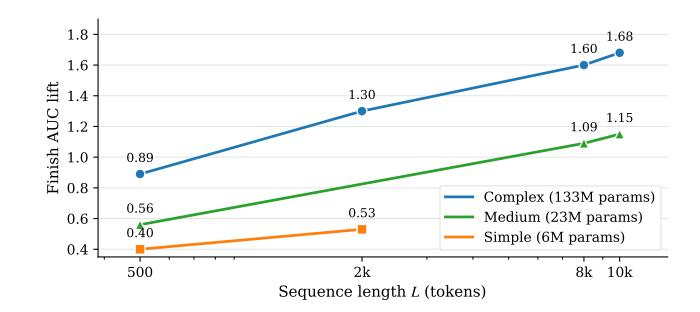
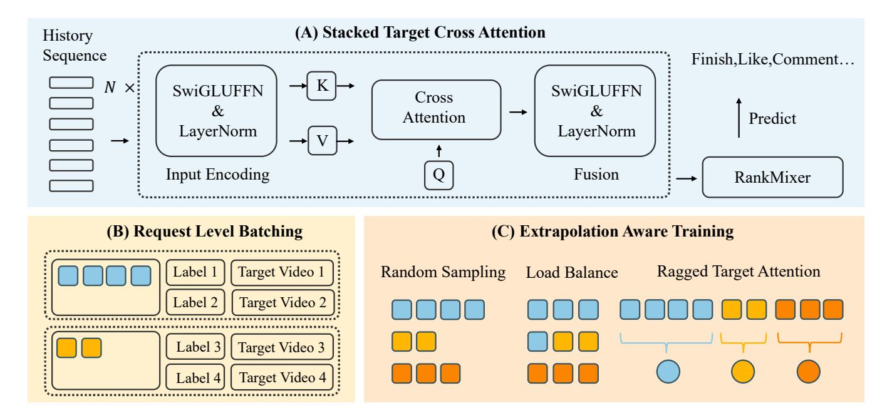
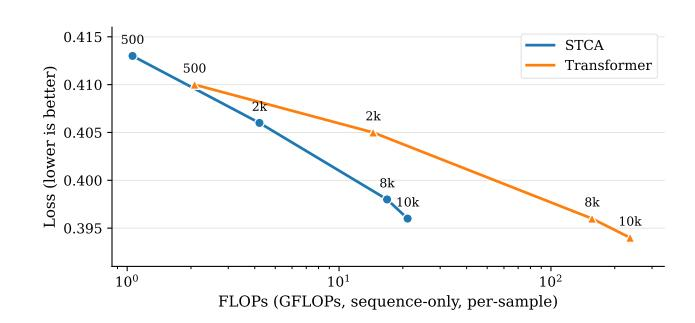

# Make It Long, Keep It Fast: End-to-End 10k-Sequence Modeling at Billion Scale on Douyin

| Lin Guan ∗       |                           |
|------------------|---------------------------|
| Beijing, China   |                           |
| Jia-Qi           | Yang ∗                    |
| Shanghai,        | China                     |
|                  | Zhishan Zhao ∗            |
|                  | Beijing, China            |
| Beichuan Zhang ∗ |                           |
| Beijing, China   |                           |
| Bo               | Sun                       |
| San Jose,        | CA, USA                   |
|                  | Xuanyuan Luo              |
|                  | Hangzhou, Zhejiang, China |
| Jinan Ni         |                           |
| Shanghai, China  |                           |
| Xiaowen          | Li                        |
| Beijing,         | China                     |
|                  | Yuhang Qi                 |
|                  | Hangzhou, Zhejiang, China |
| Zhifang Fan      |                           |
| Shanghai, China  |                           |
| Hangyu           | Wang                      |
| Shanghai,        | China                     |
|                  | Qiwei Chen †              |
|                  | Shanghai, China           |
| Yi Cheng         |                           |
| Beijing, China   |                           |
| Feng             | Zhang                     |
| Shanghai,        | China                     |
|                  | Xiao Yang                 |
|                  | Beijing, China            |

# Abstract

Short-video recommenders such as Douyin must exploit extremely long user histories without breaking latency or cost budgets. We present an end-to-end system that scales long-sequence modeling to 10k-length histories in production. First, we introduce Stacked Target-to-History Cross Attention (STCA), which replaces history self-attention with stacked cross-attention from the target to the history, reducing complexity from quadratic to linear in sequence length and enabling efficient end-to-end training. Second, we propose Request Level Batching (RLB), a user-centric batching scheme that aggregates multiple targets for the same user/request to share the user-side encoding, substantially lowering sequence-related storage, communication, and compute without changing the learning objective. Third, we design a length-extrapolative training strategy train on shorter windows, infer on much longer ones—so the model generalizes to 10k histories without additional training cost. Across offline and online experiments, we observe predictable, monotonic

© 2026 Copyright held by the owner/author(s). ACM ISBN 979-8-4007-2307-0/2026/04 <https://doi.org/10.1145/3774904.3792811>

gains as we scale history length and model capacity, mirroring the scaling law behavior observed in large language models. Deployed at full traffic on Douyin, our system delivers significant improvements on key engagement metrics while meeting production latency, demonstrating a practical path to scaling end-to-end long-sequence recommendation to the 10k regime.

# CCS Concepts

• Information systems → Recommender systems.

## Keywords

Recommender systems, long-sequence modeling, scaling laws

### ACM Reference Format:

Lin Guan, Jia-Qi Yang, Zhishan Zhao, Beichuan Zhang, Bo Sun, Xuanyuan Luo, Jinan Ni, Xiaowen Li, Yuhang Qi, Zhifang Fan, Hangyu Wang, Qiwei Chen, Yi Cheng, Feng Zhang, and Xiao Yang. 2026. Make It Long, Keep It Fast: End-to-End 10k-Sequence Modeling at Billion Scale on Douyin. In Proceedings of the ACM Web Conference 2026 (WWW '26), April 13–17, 2026, Dubai, United Arab Emirates. ACM, New York, NY, USA, [10](#page-9-0) pages. <https://doi.org/10.1145/3774904.3792811>

# 1 Introduction

Deep neural networks have become the backbone of modern recommender systems, powering applications in e-commerce, news feeds, and short-video platforms[\[4,](#page-7-0) [5,](#page-7-1) [8,](#page-7-2) [38\]](#page-8-0). A key reason is their ability to leverage user behavior sequences, as past interactions provide

∗Contributed equally.

†Corresponding author.

[This work is licensed under a Creative Commons Attribution 4.0 International License.](https://creativecommons.org/licenses/by/4.0) WWW '26, Dubai, United Arab Emirates

essential signals for inferring preferences[\[10,](#page-7-3) [16\]](#page-8-1). In short-video recommendation such as Douyin[\[41\]](#page-8-2), user histories are often thousands of videos long. If effectively utilized, these long sequences can substantially improve ranking performance[\[13,](#page-8-3) [33,](#page-8-4) [40\]](#page-8-5).

The importance of modeling longer sequences relates to the scaling law of deep learning: performance tends to improve predictably with more data, parameters, and compute[\[11,](#page-7-4) [14\]](#page-8-6). Unlike NLP/CV where scaling often comes from enlarging datasets, recommendation is constrained by user-generated data[\[20,](#page-8-7) [30\]](#page-8-8). A natural way to expose more information is to use longer histories[\[3,](#page-7-5) [9,](#page-7-6) [17\]](#page-8-9). However, most systems adopt a two-stage paradigm[\[2,](#page-7-7) [25,](#page-8-10) [27,](#page-8-11) [31\]](#page-8-12): retrieve a small set similar to the target and feed the truncated sequence to the ranker. While efficient, this breaks end-to-end optimization and discards valuable interactions. Our empirical results (Fig. [1\)](#page-1-0) show that when the architecture and system support true end-to-end long-sequence training and inference, model quality scales smoothly with both sequence length and sequence-module capacity, echoing scaling-law behavior in other modalities.

To truly unlock scaling for large recommendation models, endto-end training over long sequences must coexist with strict online latency and cost budgets[\[15,](#page-8-13) [35\]](#page-8-14). Designs must allocate computation selectively, and longer histories amplify storage, communication, and compute in distributed training[\[19,](#page-8-15) [21,](#page-8-16) [22\]](#page-8-17). To this end, we combine: (i) a target-centric, single-query cross-attention model (STCA) with per-layer cost linear in sequence length; (ii) Request Level Batching (RLB), which amortizes user-side encoding across multiple targets within a request and can be extended to share across multiple requests for the same user/session, offering further efficiency gains; and (iii) a "train sparsely/infer densely" regimen: we train on sequences with an average length of around 2k tokens, yet extrapolate to 10k at serving, preserving end-to-end modeling without increasing training compute. Together these components enable predictable gains with increasing length and capacity, consistent with scaling-law behavior (Figure [1\)](#page-1-0).

Our contributions. We make three contributions toward practical end-to-end long-sequence recommendation:

- Sequence-efficient architecture. We propose Stacked Targetto-History Cross Attention (STCA), which prioritizes cross-attention between the target item and the history while omitting history self-attention, reducing complexity from ��(�� 2 ) to ��(��) in sequence length ��. Stacking multiple layers captures higher-order dependencies via target-conditioned fusion.
- Scalable training via user-centric batching. We introduce Request Level Batching (RLB), aggregating samples from the same user to share one user-side encoding across multiple targets. Beyond a single request, RLB naturally extends to multi-request sharing for the same user/session, further cutting memory, communication, and computation (up to 8× reduction reported under request-level sharing) while remaining an unbiased estimator of empirical risk.
- Train sparsely, infer densely. We adopt a length-extrapolative regimen that trains on sequences with an average length of ∼2k but serves on sequences up to 10k, decoupling training cost from deployment-time context length and realizing long-sequence gains without additional training compute.

Figure 1: Scaling with sequence length and model capacity. Finish AUC lift (percentage points) for the sequence module (STCA) as we increase user sequence length (500→10k tokens) and sequence-module capacity (Simple: 6M, Medium: 23M, Complex: 133M parameters).

These innovations provide a practical framework for scaling along the sequence dimension under production constraints. Deployed in a large-scale short-video platform, our methods deliver significant online gains across multiple business metrics.

# 2 Background and Notations

Notation. We use the following symbols throughout. The user interaction history is H = {(���� , ����)}�� ��=1 of length ��, where ���� is the feature vector of the ��-th historical video and ���� is its interaction type; �� denotes the candidate (target) video to be ranked. Embeddings are x�� for (���� , ����) and x�� for ��. Let �� be the embedding dimensionality, �� the expansion ratio in the SwiGLUFFN width, ℎ the number of attention heads, and �� the number of stacked cross-attention layers. The model outputs ��ˆ ∈ [0, 1], the predicted finish probability for ��, and �� ∈ {0, 1} is the ground-truth finish label. We refer to each historical interaction (���� , ����) as a token; thus the sequence length �� denotes the number of history interactions (tokens).

Task. We consider large-scale short-video recommendation (e.g., Douyin / TikTok), where the system ranks a set of candidate videos for a user. In practice, the final score may combine multiple objectives (finish, click, etc.); for clarity we focus on predicting the finish rate. Given input (H, ��), the ranking model outputs a scalar ��ˆ ∈ [0, 1], the estimated probability that the user finishes �� conditioned on H. This notation will be used throughout when introducing the model and training strategies.

# 3 Method

We develop an end-to-end framework for long-sequence modeling in short-video ranking that couples a sequence-efficient architecture, a user-centric batching strategy, and a length-extrapolative training regimen as depicted in Figure [2.](#page-2-0)

# 3.1 Stacked Target Cross Attention (STCA)

In ranking, the principal signal for predicting the user's response to �� arises from direct interactions between �� and the user's historical behaviors, whereas second-order relations among historical items are comparatively less informative. Yet Transformer-style

Stochastic Length Sampling. We sample a stochastic training length ��train ∈ [�� min train, ��max train] using a U-shaped Beta distribution over the normalized ratio, so that the curriculum mixes very short windows with occasional long windows while keeping the average length at �� avg train (thereby controlling SS and ��extra). This length sampling acts as a data curriculum; the end-to-end objective remains the same BCE loss in Eq. [\(10\)](#page-3-1). We defer the exact sampling formula, expectation constraint, and hardware-alignment details to Appendix [A.4.](#page-9-2)

Element Selection Policy. Given ��train, we select the corresponding number of items from the user's full history (truncated to ��infer at inference). Empirical results show that retaining the most recent ��train interactions—i.e., the temporal suffix—consistently yields optimal accuracy.

3.3.2 Batch-Level Load Balancing. Variable-length ��train can cause batch-level workload imbalance (step time dominated by the longest sequence). We therefore apply a batch-level load-balancing operator that keeps the total token budget close to �� · �� avg train (batch size ��), and compacts sequences to reduce padding while preserving the stochastic-length curriculum. We implement the resulting ragged computation with an index-based target-attention kernel to avoid padding overhead. Full operator details and the ragged attention implementation are provided in Appendix [A.4.](#page-9-2)

### 4 Experiments

### 4.1 Offline Comparison on Douyin

4.1.1 Setup. We evaluate sequence encoders on the Douyin offline dataset for three objectives—finish (completion), skip (quick skip), and head (creator-page click)—reporting AUC (higher is better) and NLL (lower is better). To keep the comparison conservative, all baselines are augmented with TWIN(10k)[\[31\]](#page-8-12) (a retrieval-style block built from a 10k-length behavior search), whereas our method removes TWIN(10k) and relies purely on end-to-end long-history modeling. This setup is intentionally conservative and favors the baselines, since they receive extra retrieval signals. Our claim is that STCA+RLB+Ext can replace such a heavy retrieval block at comparable end-to-end cost while preserving full differentiability over long histories. [1](#page-4-0) Importantly, we compare under roughly matched compute: per-sample sequence FLOPs and step-time are aligned across methods. For quadratic-cost encoders (Transformer, HSTU), we reduce depth/width to keep their total compute comparable to STCA, ensuring fair comparisons.

We compare Single-layer target attention, DIN, Transformer (selfattention), and HSTU against our STCA (stacked target→history cross attention) with RLB and Train Sparsely / Infer Densely ("Ext"). Table cells report % changes vs. a production baseline: RankMixer + Single-layer Target Attention + TWIN(10k); positive ΔAUC and negative ΔNLL are better.

4.1.2 Results and discussion. In Table [1,](#page-4-1) STCA+RLB+Ext achieves the strongest improvements on all tasks despite using no TWIN(10k): +0.49/-1.16 (finish), +0.71/-1.14 (skip), and +0.39/-1.41 (head). Baselines also improve under the matched-compute setting—DIN

Table 1: Offline results on Douyin. All values are in %.

| Model    | Δ AUC | ↑  | Finish Δ NLL | ↓  | Δ AUC | ↑  | Skip Δ NLL | ↓  | Δ AUC | ↑  | Head Δ NLL | ↓  |
|----------|-------|----|--------------|----|-------|----|------------|----|-------|----|------------|----|
| Baseline | 0     | 00 | 0            | 00 | 0     | 00 | 0          | 00 | 0     | 00 | 0          | 00 |
| DIN      | + 0   | 19 | − 0          | 17 | + 0   | 23 | − 0        | 18 | + 0   | 19 | − 0        | 21 |
| Trans    | + 0   | 25 | − 0          | 46 | + 0   | 27 | − 0        | 36 | + 0   | 38 | − 0        | 27 |
| HSTU     | + 0   | 31 | − 0          | 86 | + 0   | 52 | − 0        | 62 | + 0   | 36 | − 0        | 43 |
| Ours     | + 0   | 49 | − 1          | 16 | + 0   | 71 | − 1        | 14 | + 0   | 39 | − 1        | 41 |

up to +0.23/-0.21, Transformer up to +0.38/-0.46, HSTU up to +0.52/-0.86—yet our method consistently delivers the largest lifts, especially in NLL (e.g., head -1.41).

The gains align with our design: retrieval features pre-select and lose information and end-to-end gradients; STCA performs exact softmax attention over the full history with ��(��) cost per target, RLB removes redundant user encodings across targets, and Train Sparsely / Infer Densely exposes a calibrated tail of long contexts to enable multi-thousand-token inference without fulllength training.

Takeaway. Under identical non-sequence features and matched compute, STCA+RLB+Ext improves both ranking and calibration while simplifying the stack (no TWIN(10k)), providing a practical path to accurate, deployable long-sequence modeling on Douyin.

# 4.2 Ablation: Accuracy vs. Model Complexity

Setup and metrics. We evaluate the end-to-end stack STCA → RankMixer with RLB (��=8) and single-query cross-attention (Sec. [3\)](#page-1-1). Unless noted, training and evaluation use ��=512; we report finish AUC lift (%) over a strong RankMixer-only baseline trained with identical non-sequence features and optimization.

Where the gains come from. Ablations in Table [2](#page-5-1) indicate that adding a token-wise FFN on the sequence path and deepening STCA from 2L→4L provides the largest single boost (+0.18%). Upgrading FFNs to SwiGLU yields a further +0.11%. Enlarging sparse ID embeddings (+0.08%) and introducing time-delta side information (+0.08%) both contribute meaningfully. Increasing attention heads from 8→16 offers a modest but positive gain (+0.05%). Finally, the query fusion mechanism (Eq. [7\)](#page-3-2) adds +0.06% by reinjecting lower-layer summaries into higher layers for target-conditioned reasoning.

Compute–quality scaling. Figure [3](#page-5-2) couples compute (FLOPs) with quality (NLL) under matched depth/width. Two points stand out:

- Linear vs. quadratic in ��. STCA's sequence-side FLOPs grow linearly; Transformer's grow quadratically. From ��=500→10k, STCA rises 1.06→21.06 GFLOPs (∼19.9×), while Transformer rises 2.08→236.26 GFLOPs (∼113.6×).
- Better frontier at long ��. At similar NLL (≈0.396), STCA runs at ��=10k with 21.06 GFLOPs, whereas Transformer needs ��=8k and 156.24 GFLOPs (∼7.4× higher).

1All models share identical non-sequence features, optimizers, and data splits; only the sequence encoder and the use of TWIN(10k) differ.

Table 2: Ablation of the 4L complex STCA at 512 tokens.

| Component                              | Δ AUC   | Notes                                                                         |
|----------------------------------------|---------|-------------------------------------------------------------------------------|
| Enlarge sparse ID embedding: 128 → 320 | + 0 08% | Video-ID embedding width. Use smaller init range and LR to avoid instability. |
| Add sequence-side FFN; depth 2 → 4     | + 0 18% | Token-wise FFN on the history path; then double STCA depth from 2L to 4L.     |
| FFN → SwiGLU                           | + 0 11% | Upgrade FFNs to SwiGLU; widen hidden by × 2.                                  |
| Attention heads: 8 → 16                | + 0 05% | More heads improve target-conditioned selectivity with modest cost.           |
| Query fusion                           | + 0 06% | At layer �� + 1, concatenate [ o                                              |
|                                        |         | ( 1 )                                                                         |
|                                        |         | ( �� )                                                                        |
|                                        |         | , x �� ] then apply SwiGLU (Eq. 7)                                            |
| Time-delta side info                   | + 0 08% | Add per-token feature: request time minus item timestamp (recency prior).     |

Figure 3: Compute–quality scaling of STCA vs Transformer. X-axis: per-sample sequence-only forward FLOPs (log scale). Y-axis: NLL (lower is better). Markers show �� ∈ {500, 2k, 8k, 10k}. Both use 4 layers with ��=256, ℎ=8, ��=4.

These results align with our broader findings: STCA removes history self-attention and focuses compute on target↔history relevance (near-linear scaling), RLB amortizes the user path (and extends across requests/sessions), and train sparsely / infer densely trains at ∼2k but serves up to 10k. Combined, they provide a practical scale-up path: STCA sustains longer contexts at similar or lower FLOPs while preserving or improving ranking quality.

# 4.3 Request-Level Batching (RLB)

Setup. RLB realizes user-centric batching at the request boundary: for each request containing one user history and multiple targets, we transmit and encode the shared user/context payload once, reuse it for all targets, and aggregate gradients at the request level before synchronization. Unless otherwise noted, the stack is STCA→RankMixer with RLB enabled (Sec. [3\)](#page-1-1), trained on the same data, optimizer, and batch size as the point-wise baseline. Reported bandwidth figures include all non-sequence features (profile/context, content, creator, etc.), i.e., end-to-end payloads.

Bandwidth footprint. RLB substantially cuts inter-module traffic by amortizing the ��(��) user/history payload across targets: the measured reduction is 77% at history length ��=512 and 84% at ��=2k (both including all existing features). The larger saving at longer �� follows directly from avoiding per-target retransmission of the same history.

Throughput and scalability. Relative to a point-wise baseline (1×), RLB delivers a 2.2× end-to-end training throughput gain. With further kernel optimizations—specialized batched matmul for the

Table 3: Effect of maximum training length.

reordered single-query attention, high-throughput SwiGLU, and optimized LayerNorm—the speedup reaches 5.1×. Under the same infrastructure, amortizing per-target activations and payload also raises the maximum trainable sequence length by roughly 8× (workloads that were memory/IO bound at length �� become trainable at ≈ 8��).

Parameter server and inter-module costs. At synchronization and feature-serving boundaries, RLB further lowers overhead: we observe a 50% reduction in Parameter Server (PS) CPU usage during training and a 50% reduction in data↔training communication bandwidth; training-side PS CPU load likewise drops by 50%.

Discussion. These gains complement STCA's architectural efficiency. STCA removes the quadratic dependence on history length via single-query cross attention (��(��)), while RLB eliminates redundant movement and re-encoding of the same user/history across targets. Together they yield higher samples-per-second, lower PS contention, and much larger feasible sequence lengths, enabling long-context models within fixed latency and hardware budgets.

# 4.4 Extrapolation: Train Sparsely, Infer Densely

Experimental Setup. We evaluate the proposed extrapolation framework using STCA encoder with single-query optimization. The user token z is fed into RankMixer (Sec. [3\)](#page-1-1) with RLB training (��=8). During training, history length ��train is randomized following Sec. [3.3.1.](#page-3-3) All results report finish AUC improvements versus a fixed 2k-token baseline. Unless otherwise specified, inference uses ��infer = 10k.

The impact of the maximum length (Table [3\)](#page-5-3). Progressively increasing �� max train from 2k to 10k yields a corresponding improvement in the AUC lift, which rises from a marginal +0.03% to a more substantial +0.21%. These results confirm that to ensure robust generalization to long contexts, the training regime must expose the model to sequence lengths that closely match or approximate those encountered during inference.

Sequence Sparsity Optimization. Table [4](#page-6-0) shows the efficiencyaccuracy trade-off. Increasing �� avg train from 1.0k to 2.5k improves AUC lift from +0.09% to +0.22% while increasing sequence sparsity

Table 4: Effect of average training length.

Table 5: Beta distribution shape parameter analysis.

(SS) from 10% to 25%. The diminishing returns beyond ��¯ = 2.0k confirm that SS ≈ 20% provides the optimal balance. Compared to SL in HSTU (SS=57.6%) [\[37\]](#page-8-18), we achieve better computational efficiency.

Subsequence Selection Strategy Validation. Retaining the most recent interactions (greedy) achieves +0.21% AUC improvement, while random sampling yields no gain, strongly supporting the importance of temporal locality.

Beta Distribution Shape Analysis. Table [5](#page-6-1) validates our distribution design: the U-shaped distribution (�� = 0.02) achieves superior performance (+0.21%) compared to decreasing (+0.11%) and skewed (+0.08%) distributions, confirming that bimodal sampling optimizes the training curriculum.

Efficiency-Accuracy Trade-off. Our approach achieves +0.23% offline AUC improvement at 10k inference, capturing ∼ 80% of the full 10k training gain (+0.30%) at one-third computational cost. Online A/B tests confirm production viability (+0.17% finish AUC).

Discussion. The results comprehensively validate our methodology: (1) Stochastic training with U-shaped Beta distribution enables effective extrapolation; (2) Temporal suffix selection preserves sequential patterns; (3) Load-balancing ensures training efficiency. Under our default setting of �� avg train = 2k, �� max train = 10k, and ��infer = 10k (��extra = 5). Compared to HSTU's SL (SS=57.6%), we reduce SS to 20% while maintaining accuracy, demonstrating superior computational efficiency.

# 4.5 Online A/B Results

Setup. We deployed STCA + RLB + Extrapolation (Sec. [3\)](#page-1-1) for one month on Douyin and Douyin Lite, replacing TWIN(10k) augmented retrieval features with our single-query target→history encoder while keeping all other components unchanged. We report percentage lifts over control on 30-day Activeness, App Stay Time, Finish, Comment, and Like, overall and by user-activity segment (Table [6\)](#page-7-8).

Inference cost. In our internal accounting, removing TWIN increases GPU cost by +33% but reduces CPU cost by −16%, leading to an estimated net total cost change of about +17%, which we consider acceptable given the online gains.

Findings. Our method delivers consistent and sizable online gains across both products and all segments. Overall, Finish and App Stay Time improve together, and interactive signals (Comment, Like) rise markedly. Gains are strongest for low/medium-activity users, indicating better personalization under sparse/noisy recent behavior, while 30-day Activeness also increases modestly yet consistently. The improvements stem from (i) STCA focusing compute on exact target→history interactions over long contexts, (ii) RLB amortizing user encoding to keep serving costs within budget, and (iii) Train Sparsely/Infer Densely exposing a calibrated tail of long sequences during training. Together, these make end-to-end long-history modeling both accurate and deployable at scale.

# 5 Related Work and Discussion

# 5.1 Modeling User Behavior Sequences

Early systems modeled sequences with non-deep methods such as item-to-item CF and Markov transitions [\[18,](#page-8-19) [29\]](#page-8-20). Deep learning then brought session-based RNNs and industrial two-stage stacks (e.g., YouTube) [\[5,](#page-7-1) [10\]](#page-7-3). Attention/Transformer models became dominant: DIN/DIEN condition history on the candidate to emphasize target-aware selection [\[39,](#page-8-21) [40\]](#page-8-5), while SASRec/BERT4Rec provide strong self-attention baselines that model temporal dependencies through bidirectional or unidirectional attention [\[13,](#page-8-3) [33\]](#page-8-4); BST further demonstrated online deployment in an industrial feed-ranking setting [\[3\]](#page-7-5). In parallel, multi-interest modeling explicitly captures diverse user intents and has become widely used in large-scale platforms [\[16\]](#page-8-1).

Recent production work emphasizes long histories and system compatibility: user-representation approaches (e.g., PinnerFormer) compress long-term behaviors into condensed memories, and realtime/batch fusion (e.g., TransAct) merges streaming signals with precomputed features for latency-aware serving [\[24,](#page-8-22) [34,](#page-8-23) [35\]](#page-8-14). To scale further, two-stage paradigms retrieve a target-relevant slice before fine modeling (SIM, UBR4CTR) [\[25,](#page-8-10) [27\]](#page-8-11), or engineer sparse memories/hierarchies (SAMN, TWIN/TWIN-V2) to bound the cost of processing very long logs [\[2,](#page-7-7) [17,](#page-8-9) [31\]](#page-8-12). These designs typically trade exact end-to-end gradients over the full sequence for efficiency via truncation, retrieval, or summarization. Compared with these, our STCA performs single-query target→history cross attention end-toend over the full sequence, achieving linear complexity in �� and avoiding retrieval/truncation. This yields a practical path to very long histories in production while maintaining differentiability through all observed interactions.

### 5.2 Organizing Training Samples

Classic training formulations include pointwise/pairwise learning (e.g., BPR) [\[28\]](#page-8-24), large-batch CTR pipelines (DLRM, production systems) [\[22,](#page-8-17) [23\]](#page-8-25), and session-parallel batching for sequences [\[10\]](#page-7-3). At industrial scale, training is often I/O/memory bound rather than FLOP bound [\[21\]](#page-8-16), motivating truncation or retrieval-first construction [\[25,](#page-8-10) [27\]](#page-8-11) and engineering for ultra-long contexts [\[2,](#page-7-7) [17,](#page-8-9) [31\]](#page-8-12). Modern stacks (e.g., TorchRec) provide jagged tensors and sharding to better utilize hardware and manage sparsity [\[12\]](#page-8-26), and production systems mix real-time/batch signals to balance freshness and stability [\[24,](#page-8-22) [34\]](#page-8-23). Against this backdrop, our Request Level Batching (RLB) reorganizes data at the user/request granularity: compute the

Table 6: One-month online A/B lifts (%) over control on Douyin and Douyin Lite.

| Segment   | 30-day  | Act. Stay | Douyin Time Finish | Comment | Like    | 30-day  | Act. Stay | Douyin Lite Time Finish | Comment | Like    |
|-----------|---------|-----------|--------------------|---------|---------|---------|-----------|-------------------------|---------|---------|
| Low       | 0.3659% | 2.0070%   | 5.4987%            | 2.6848% | 2.4367% | 0.3575% | 1.3888%   | 6.2808%                 | 6.3385% | 3.1623% |
| Medium    | 0.3788% | 1.7065%   | 5.2062%            | 0.7028% | 2.3779% | 0.2832% | 1.3172%   | 5.9688%                 | 5.7934% | 5.6372% |
| High      | 0.1396% | 1.1262%   | 3.7973%            | 1.4012% | 2.1455% | 0.1604% | 0.9872%   | 4.9922%                 | 2.8496% | 3.1752% |
| All Users | 0.1161% | 0.9266%   | 3.3454%            | 1.5678% | 1.8282% | 0.1281% | 0.8467%   | 4.2275%                 | 2.6167% | 2.3828% |

user/history encoder once per request and reuse it across �� targets, cutting the per-target user-path cost from ��(��) to ≈ ��(��/��) while keeping the empirical-risk objective unbiased. Unlike truncation/retrieval, RLB preserves the full history and amortizes movement and recomputation, directly addressing the dominant I/O and activation bottlenecks at scale [\[21\]](#page-8-16). It is orthogonal to retrieval, kernel-level speedups, and sharding (e.g., jagged tensors in [\[12\]](#page-8-26)) and aligns with request-level grouping in production, improving bandwidth, peak memory, and kernel efficiency without changing the loss.

# 5.3 Length Extrapolation

LLMs show that "train sparsely, infer densely" is feasible via positional designs (ALiBi, RoPE) and memory/attention patterns (Transformer - XL, Longformer, BigBird) that enable generalization beyond the training window [\[1,](#page-7-9) [6,](#page-7-10) [26,](#page-8-27) [32,](#page-8-28) [36\]](#page-8-29). Our approach adapts this spirit to recommendation by (i) replacing quadratic history selfattention with exact single-query cross attention (STCA), and (ii) reorganizing training via RLB to amortize user encoding. Unlike retrieval pipelines [\[2,](#page-7-7) [25,](#page-8-10) [27,](#page-8-11) [31\]](#page-8-12), we keep end-to-end gradients over the full history; unlike kernel/sparsity methods [\[1,](#page-7-9) [36\]](#page-8-29), we directly match the target-over-history interaction while aligning with production constraints [\[12,](#page-8-26) [21,](#page-8-16) [24,](#page-8-22) [34\]](#page-8-23).

Concretely, we use stochastic-length sampling during training to keep the average sequence length short while exposing a calibrated tail of longer contexts, and we serve at much longer histories at inference. This regimen leverages STCA's linear-in-�� compute and RLB's amortization to make extrapolation practical in production, without truncation or surrogate memories.

### 6 Conclusion

We present an end-to-end recipe for long-sequence recommendation that is simultaneously architectural, system, and training efficient. Architecturally, STCA replaces history self-attention with single-query target→history cross-attention, yielding linear (��(��)) complexity in sequence length. System-wise, RLB reuses the userside encoding at the request level, eliminating redundant transfers and computation. Training-wise, a "train sparsely / infer densely" regimen enables dense inference on long histories at modest training cost. Offline and online experiments show stable, substantial gains and scaling-law–like improvements as sequence length and sequence-module capacity grow. Key findings include: single-query attention is sufficient for short-video ranking while preserving ��(��) cost; stochastic-length sampling with a small-�� Beta achieves

roughly 80% of the 10k-window benefit at about one-third the training cost; parameter budget is best spent on the sequence path via SwiGLU, cross-layer query fusion, and time-delta features—whose impact increases with longer contexts; and system levers are decisive for deployability—at (��=2k), RLB reduces end-to-end bandwidth by up to 84%, halves PS CPU usage, delivers 2.2× throughput, and expands the maximum trainable sequence length by 8×. In production, we observe a 1.6% increase in the average number of clustered content categories per user, suggesting slightly higher diversity.

In practice, a strong operating point couples a 4-layer STCA (with SwiGLU and query fusion) with time-delta features, RLB, and stochastic-length training (small ��, training mean ≈ 2k) and inference length 10k (a 5× extrapolation ratio). This configuration provides monotonic improvements with both sequence length and sequence-module capacity while keeping training and serving within budget, offering a production-ready path to accurate long-sequence recommendation.

### References

[1] Iz Beltagy, Matthew E. Peters, and Arman Cohan. 2020. Longformer: The Long-Document Transformer. arXiv[:2004.05150](https://arxiv.org/abs/2004.05150) [2] Jianxin Chang, Chenbin Zhang, Zhiyi Fu, Xiaoxue Zang, Lin Guan, Jing Lu, Yiqun Hui, Dewei Leng, Yanan Niu, Yang Song, and Kun Gai. 2023. TWIN: TWo-stage Interest Network for Lifelong User Behavior Modeling in CTR Prediction at Kuaishou. In KDD. [3] Qiwei Chen, Huan Zhao, Wei Li, Pipei Huang, and Wenwu Ou. 2019. Behavior Sequence Transformer for E-commerce Recommendation in Alibaba. arXiv[:1905.06874](https://arxiv.org/abs/1905.06874) [4] Heng-Tze Cheng, Levent Koc, Jeremiah Harmsen, Tal Shaked, Tushar Chandra, Hrishi Aradhye, Glen Anderson, Greg Corrado, Wei Chai, Mustafa Ispir, Rohan Anil, Zakaria Haque, Lichan Hong, Vihan Jain, Xiaobing Liu, and Hemal Shah. 2016. Wide & Deep Learning for Recommender Systems. In DLRS@RecSys. [5] Paul Covington, Jay Adams, and Emre Sargin. 2016. Deep Neural Networks for YouTube Recommendations. In RecSys. [6] Zihang Dai, Zhilin Yang, Yiming Yang, Jaime G. Carbonell, Quoc Viet Le, and Ruslan Salakhutdinov. 2019. Transformer-XL: Attentive Language Models beyond a Fixed-Length Context. In ACL. [7] Tri Dao, Daniel Y. Fu, Stefano Ermon, Atri Rudra, and Christopher Ré. 2022. FlashAttention: Fast and Memory-Efficient Exact Attention with IO-Awareness. In NeurIPS. [8] Xiangnan He, Lizi Liao, Hanwang Zhang, Liqiang Nie, Xia Hu, and Tat-Seng Chua. 2017. Neural Collaborative Filtering. In WWW. [9] Zhicheng He, Weiwen Liu, Wei Guo, Jiarui Qin, Yingxue Zhang, Yaochen Hu, and Ruiming Tang. 2023. A Survey on User Behavior Modeling in Recommender Systems. In IJCAI. [10] Balázs Hidasi, Alexandros Karatzoglou, Linas Baltrunas, and Domonkos Tikk. 2016. Session-based Recommendations with Recurrent Neural Networks. In ICLR. [11] Jordan Hoffmann, Sebastian Borgeaud, Arthur Mensch, Elena Buchatskaya, Trevor Cai, Eliza Rutherford, Diego de Las Casas, Lisa Anne Hendricks, Johannes Welbl, Aidan Clark, Tom Hennigan, Eric Noland, Katie Millican, George van den Driessche, Bogdan Damoc, Aurelia Guy, Simon Osindero, Karen Simonyan, Erich Elsen, Jack W. Rae, Oriol Vinyals, and Laurent Sifre. 2022. Training Compute-Optimal Large Language Models. arXiv[:2203.15556](https://arxiv.org/abs/2203.15556)

[12] Dmytro Ivchenko, Dennis Van Der Staay, Colin Taylor, Xing Liu, Will Feng, Rahul Kindi, Anirudh Sudarshan, and Shahin Sefati. 2022. TorchRec: a PyTorch Domain Library for Recommendation Systems. In RecSys. [13] Wang-Cheng Kang and Julian J. McAuley. 2018. Self-Attentive Sequential Recommendation. In ICDM. [14] Jared Kaplan, Sam McCandlish, Tom Henighan, Tom B. Brown, Benjamin Chess, Rewon Child, Scott Gray, Alec Radford, Jeffrey Wu, and Dario Amodei. 2020. Scaling Laws for Neural Language Models. arXiv[:2001.08361](https://arxiv.org/abs/2001.08361) [15] Barrie Kersbergen, Olivier Sprangers, and Sebastian Schelter. 2022. Serenade - Low-Latency Session-Based Recommendation in e-Commerce at Scale. In SIG-MOD. [16] Chao Li, Zhiyuan Liu, Mengmeng Wu, Yuchi Xu, Huan Zhao, Pipei Huang, Guoliang Kang, Qiwei Chen, Wei Li, and Dik Lun Lee. 2019. Multi-Interest Network with Dynamic Routing for Recommendation at Tmall. In CIKM. [17] Qianying Lin, Wen-Ji Zhou, Yanshi Wang, Qing Da, Qing-Guo Chen, and Bing Wang. 2022. Sparse Attentive Memory Network for Click-through Rate Prediction with Long Sequences. In CIKM. [18] Greg Linden, Brent Smith, and Jeremy York. 2003. Amazon.com Recommendations: Item-to-Item Collaborative Filtering. IEEE Internet Comput. 7, 1 (2003), 76–80. [19] Liang Luo, Buyun Zhang, Michael Tsang, Yinbin Ma, Ching-Hsiang Chu, Yuxin Chen, Shen Li, Yuchen Hao, Yanli Zhao, Guna Lakshminarayanan, Ellie Wen, Jongsoo Park, Dheevatsa Mudigere, and Maxim Naumov. 2024. Disaggregated Multi-Tower: Topology-aware Modeling Technique for Efficient Large Scale Recommendation. In MLSys. [20] Benjamin M. Marlin, Richard S. Zemel, Sam T. Roweis, and Malcolm Slaney. 2007. Collaborative Filtering and the Missing at Random Assumption. In UAI. [21] Dheevatsa Mudigere, Yuchen Hao, Jianyu Huang, Zhihao Jia, Andrew Tulloch, Srinivas Sridharan, Xing Liu, Mustafa Ozdal, Jade Nie, Jongsoo Park, Liang Luo, Jie Amy Yang, Leon Gao, Dmytro Ivchenko, Aarti Basant, Yuxi Hu, Jiyan Yang, Ehsan K. Ardestani, Xiaodong Wang, Rakesh Komuravelli, Ching-Hsiang Chu, Serhat Yilmaz, Huayu Li, Jiyuan Qian, Zhuobo Feng, Yinbin Ma, Junjie Yang, Ellie Wen, Hong Li, Lin Yang, Chonglin Sun, Whitney Zhao, Dimitry Melts, Krishna Dhulipala, K. R. Kishore, Tyler Graf, Assaf Eisenman, Kiran Kumar Matam, Adi Gangidi, Guoqiang Jerry Chen, Manoj Krishnan, Avinash Nayak, Krishnakumar Nair, Bharath Muthiah, Mahmoud khorashadi, Pallab Bhattacharya, Petr Lapukhov, Maxim Naumov, Ajit Mathews, Lin Qiao, Mikhail Smelyanskiy, Bill Jia, and Vijay Rao. 2022. Software-hardware co-design for fast and scalable training of deep learning recommendation models. In ISCA. [22] Maxim Naumov, John Kim, Dheevatsa Mudigere, Srinivas Sridharan, Xiaodong Wang, Whitney Zhao, Serhat Yilmaz, Changkyu Kim, Hector Yuen, Mustafa Ozdal, Krishnakumar Nair, Isabel Gao, Bor-Yiing Su, Jiyan Yang, and Mikhail Smelyanskiy. 2020. Deep Learning Training in Facebook Data Centers: Design of Scale-up and Scale-out Systems. arXiv[:2003.09518](https://arxiv.org/abs/2003.09518) [23] Maxim Naumov, Dheevatsa Mudigere, Hao-Jun Michael Shi, Jianyu Huang, Narayanan Sundaraman, Jongsoo Park, Xiaodong Wang, Udit Gupta, Carole-Jean Wu, Alisson G. Azzolini, Dmytro Dzhulgakov, Andrey Mallevich, Ilia Cherniavskii, Yinghai Lu, Raghuraman Krishnamoorthi, Ansha Yu, Volodymyr Kondratenko, Stephanie Pereira, Xianjie Chen, Wenlin Chen, Vijay Rao, Bill Jia, Liang Xiong, and Misha Smelyanskiy. 2019. Deep Learning Recommendation Model for Personalization and Recommendation Systems. arXiv[:1906.00091](https://arxiv.org/abs/1906.00091) [24] Nikil Pancha, Andrew Zhai, Jure Leskovec, and Charles Rosenberg. 2022. Pinner-Former: Sequence Modeling for User Representation at Pinterest. In KDD. [25] Qi Pi, Guorui Zhou, Yujing Zhang, Zhe Wang, Lejian Ren, Ying Fan, Xiaoqiang Zhu, and Kun Gai. 2020. Search-based User Interest Modeling with Lifelong Sequential Behavior Data for Click-Through Rate Prediction. In CIKM. [26] Ofir Press, Noah A. Smith, and Mike Lewis. 2022. Train Short, Test Long: Attention with Linear Biases Enables Input Length Extrapolation. In ICLR. [27] Jiarui Qin, Weinan Zhang, Xin Wu, Jiarui Jin, Yuchen Fang, and Yong Yu. 2020. User Behavior Retrieval for Click-Through Rate Prediction. In SIGIR. [28] Steffen Rendle, Christoph Freudenthaler, Zeno Gantner, and Lars Schmidt-Thieme. 2009. BPR: Bayesian Personalized Ranking from Implicit Feedback. In UAI. [29] Steffen Rendle, Christoph Freudenthaler, and Lars Schmidt-Thieme. 2010. Factorizing personalized Markov chains for next-basket recommendation. In WWW. [30] Tobias Schnabel, Adith Swaminathan, Ashudeep Singh, Navin Chandak, and Thorsten Joachims. 2016. Recommendations as Treatments: Debiasing Learning and Evaluation. In ICML. [31] Zihua Si, Lin Guan, Zhongxiang Sun, Xiaoxue Zang, Jing Lu, Yiqun Hui, Xingchao Cao, Zeyu Yang, Yichen Zheng, Dewei Leng, Kai Zheng, Chenbin Zhang, Yanan Niu, Yang Song, and Kun Gai. 2024. TWIN V2: Scaling Ultra-Long User Behavior Sequence Modeling for Enhanced CTR Prediction at Kuaishou. In CIKM. [32] Jianlin Su, Murtadha H. M. Ahmed, Yu Lu, Shengfeng Pan, Wen Bo, and Yunfeng Liu. 2024. RoFormer: Enhanced transformer with Rotary Position Embedding. Neurocomputing 568 (2024), 127063. [33] Fei Sun, Jun Liu, Jian Wu, Changhua Pei, Xiao Lin, Wenwu Ou, and Peng Jiang. 2019. BERT4Rec: Sequential Recommendation with Bidirectional Encoder Representations from Transformer. In CIKM, Wenwu Zhu, Dacheng Tao, Xueqi Cheng, Peng Cui, Elke A. Rundensteiner, David Carmel, Qi He, and Jeffrey Xu Yu (Eds.). [34] Xue Xia, Pong Eksombatchai, Nikil Pancha, Dhruvil Deven Badani, Po-Wei Wang, Neng Gu, Saurabh Vishwas Joshi, Nazanin Farahpour, Zhiyuan Zhang, and Andrew Zhai. 2023. TransAct: Transformer-based Realtime User Action Model for Recommendation at Pinterest. In KDD. [35] Xue Xia, Saurabh Vishwas Joshi, Kousik Rajesh, Kangnan Li, Yangyi Lu, Nikil Pancha, Dhruvil Deven Badani, Jiajing Xu, and Pong Eksombatchai. 2025. Trans-Act V2: Lifelong User Action Sequence Modeling on Pinterest Recommendation. arXiv[:2506.02267](https://arxiv.org/abs/2506.02267) [36] Manzil Zaheer, Guru Guruganesh, Kumar Avinava Dubey, Joshua Ainslie, Chris Alberti, Santiago Ontañón, Philip Pham, Anirudh Ravula, Qifan Wang, Li Yang, and Amr Ahmed. 2020. Big Bird: Transformers for Longer Sequences. In NeurIPS. [37] Jiaqi Zhai, Lucy Liao, Xing Liu, Yueming Wang, Rui Li, Xuan Cao, Leon Gao, Zhaojie Gong, Fangda Gu, Jiayuan He, Yinghai Lu, and Yu Shi. 2024. Actions Speak Louder than Words: Trillion-Parameter Sequential Transducers for Generative Recommendations. In ICML. [38] Shuai Zhang, Lina Yao, Aixin Sun, and Yi Tay. 2019. Deep Learning Based Recommender System: A Survey and New Perspectives. ACM Comput. Surv. 52, 1 (2019), 5:1–5:38. [39] Guorui Zhou, Na Mou, Ying Fan, Qi Pi, Weijie Bian, Chang Zhou, Xiaoqiang Zhu, and Kun Gai. 2019. Deep Interest Evolution Network for Click-Through Rate Prediction. In AAAI. 5941–5948. [40] Guorui Zhou, Xiaoqiang Zhu, Chengru Song, Ying Fan, Han Zhu, Xiao Ma, Yanghui Yan, Junqi Jin, Han Li, and Kun Gai. 2018. Deep Interest Network for Click-Through Rate Prediction. In KDD. [41] Jie Zhu, Zhifang Fan, Xiaoxie Zhu, Yuchen Jiang, Hangyu Wang, Xintian Han, Haoran Ding, Xinmin Wang, Wenlin Zhao, Zhen Gong, Huizhi Yang, Zheng Chai, Zhe Chen, Yuchao Zheng, Qiwei Chen, Feng Zhang, Xun Zhou, Peng Xu, Xiao Yang, Di Wu, and Zuotao Liu. 2025. RankMixer: Scaling Up Ranking Models in Industrial Recommenders. arXiv[:2507.15551](https://arxiv.org/abs/2507.15551) A Additional Implementation and System Details This appendix provides additional implementation and system details that are omitted from the main text for brevity. We organize the material as follows: (i) training pipeline and modular integration, (ii) STCA implementation details and attention efficiency, (iii) request-level batching (RLB) as a sample-organization primitive, and (iv) the full extrapolation procedure, including Beta sampling and batch-level load balancing. A.1 Training Pipeline and Modular Integration Directly training at long contexts can be unstable (e.g., ��=2048). We therefore adopt a simple curriculum: (i) pretrain at ��=512 to establish robust token-level filters and attention patterns; (ii) continue training at ��=2048. During architecture iteration, we prototype at ��=512 for faster convergence and lower resource use. For integration into a larger production stack, we first train the sequence sub-network to convergence, load its parameters into the composite model, and finally perform joint finetuning. This staging mitigates vanishing gradients along the sequence path when the rest of the stack is already strong. A.2 STCA Details: Robustness and Attention Efficiency A.2.1 Generalization and robustness of STCA. STCA generalizes well across sequence lengths because each history token is processed independently conditioned on the target, making the architecture naturally length-agnostic; stacking enables information aggregation to scale smoothly as �� increases. By filtering history through the target at every layer, STCA is less sensitive to irrelevant or noisy behaviors common in real logs. This improves robustness to variable-length sequences and heterogeneous user patterns, which is crucial for industrial deployment at scale.

