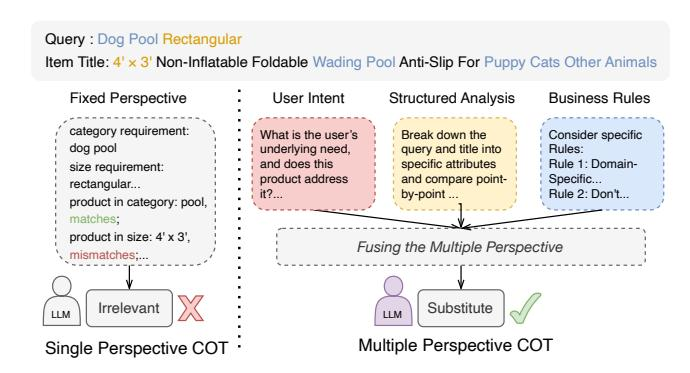
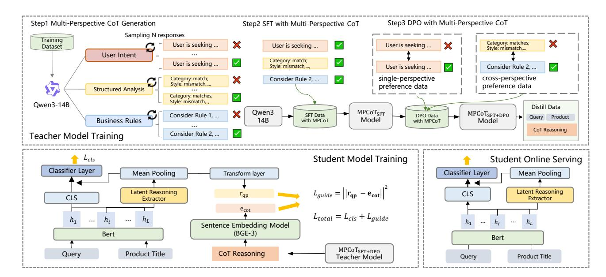
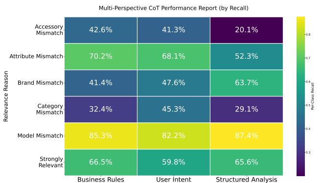
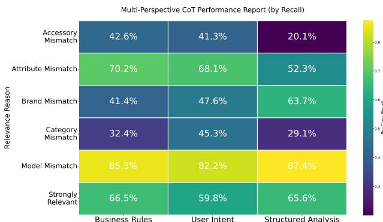
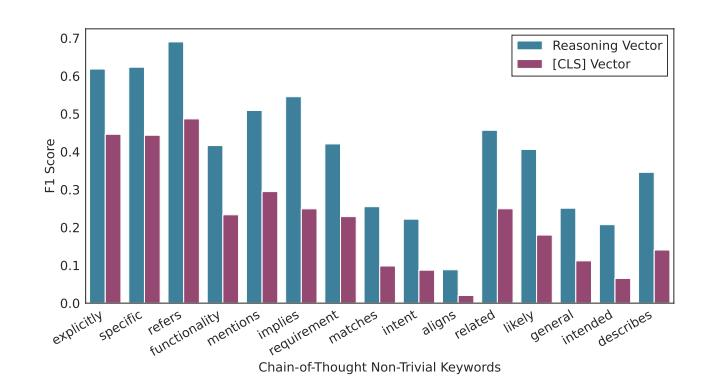
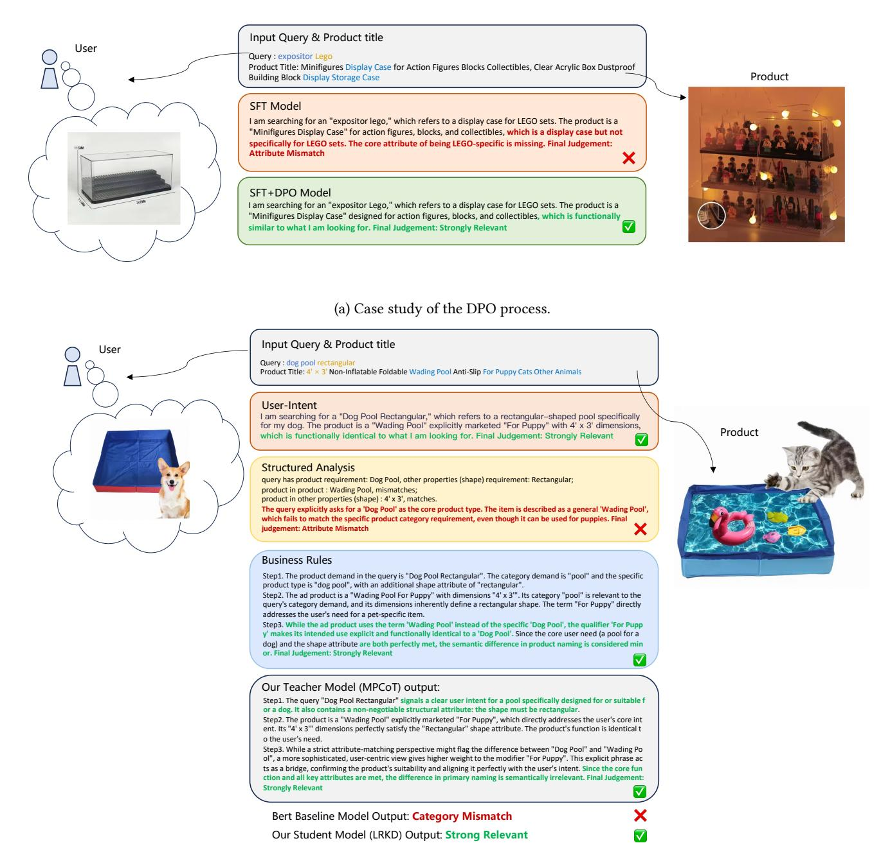

# Thinking Broad, Acting Fast: Latent Reasoning Distillation from Multi-Perspective Chain-of-Thought for E-Commerce Relevance

[Baopu Qiu](https://orcid.org/0009-0003-6872-4312)∗ [Hao Chen](https://orcid.org/0009-0008-9029-8571)∗ qiubaopu.qbp@alibaba-inc.com ryan.ch@alibaba-inc.com Alibaba International Digital Commerce Group Hangzhou, China

[Yuanrong Wu](https://orcid.org/0009-0003-0404-7594)† wuyr23@zju.edu.cn Zhejiang University Hangzhou, China

[Changtong Zan](https://orcid.org/0000-0002-5467-0937) zanchangtong.zct@alibaba-inc.com Alibaba International Digital Commerce Group Hangzhou, China

[Chao Wei](https://orcid.org/0009-0006-2417-6029)‡ weichao.wc@alibaba-inc.com Alibaba International Digital Commerce Group Hangzhou, China

[Weiru Zhang](https://orcid.org/0009-0007-8496-3638) weiru.zwr@alibaba-inc.com Alibaba International Digital Commerce Group Hangzhou, China

[Xiaoyi Zeng](https://orcid.org/0000-0002-3742-4910) yuanhan@taobao.com Alibaba International Digital Commerce Group Hangzhou, China

### Abstract

Effective relevance modeling is crucial for e-commerce search, as it aligns search results with user intent and enhances customer experience. Recent work has leveraged large language models (LLMs) to address the limitations of traditional relevance models, particularly their inability to handle long-tail and ambiguous queries. By incorporating Chain-of-Thought (CoT) reasoning, these approaches further improve both accuracy and interpretability through explicit, multi-step reasoning pathways. However, two key limitations remain: (1) most existing approaches rely on single-perspective CoT reasoning, which fails to capture the multifaceted nature of e-commerce relevance (e.g., user intent vs. attribute-level matching vs. business-specific rules); and (2) although CoT-enhanced LLMs offer rich reasoning capabilities, their high inference latency necessitates knowledge distillation for real-time deployment, yet current distillation methods discard the CoT rationale structure at inference, using it only as a transient auxiliary signal and thereby forfeiting its reasoning utility for online serving. To address these challenges, we propose a novel framework that better exploits CoT semantics throughout the optimization pipeline. Specifically, the teacher model leverages Multi-Perspective CoT (MPCoT) to generate diverse rationales and combines Supervised Fine-Tuning (SFT) with Direct Preference Optimization (DPO) to construct a more robust reasoner. For distillation, we introduce Latent Reasoning Knowledge Distillation (LRKD), which endows a student model with a lightweight inference-time latent reasoning extractor, allowing efficient and low-latency internalization of the LLM's sophisticated reasoning capabilities. Evaluated through offline experiments and

†Work done during internship at Alibaba International Digital Commerce Group. ‡Corresponding author.

[This work is licensed under a Creative Commons Attribution 4.0 International License.](https://creativecommons.org/licenses/by/4.0) WWW '26, Dubai, United Arab Emirates

© 2026 Copyright held by the owner/author(s). ACM ISBN 979-8-4007-2307-0/2026/04 <https://doi.org/10.1145/3774904.3792812>

online A/B tests on an e-commerce search advertising platform serving tens of millions of users daily, our method delivers significant offline gains, along with a 1.42% online improvement in Revenue Per Mille (RPM) and a 0.4% increase in relevance satisfaction score (RS), demonstrating clear benefits in both commercial performance and user experience.

#### CCS Concepts

• Information systems → Relevance assessment; Similarity measures; Language models; Sponsored search advertising; • Computing methodologies → Natural language processing.

# Keywords

Relevance Modeling, Large Language Model, Knowledge Distillation, E-Commerce Search

#### ACM Reference Format:

Baopu Qiu, Hao Chen, Yuanrong Wu, Changtong Zan, Chao Wei, Weiru Zhang, and Xiaoyi Zeng. 2026. Thinking Broad, Acting Fast: Latent Reasoning Distillation from Multi-Perspective Chain-of-Thought for E-Commerce Relevance. In Proceedings of the ACM Web Conference 2026 (WWW '26), April 13–17, 2026, Dubai, United Arab Emirates. ACM, New York, NY, USA, [12](#page-11-0) pages.<https://doi.org/10.1145/3774904.3792812>

### 1 Introduction

Relevance classification in e-commerce generally refers to the task of estimating how well an item product satisfies a user's query, which is fundamental to deliver accurate search results, enhance user experience, and drive business outcomes. In large-scale platforms such as Amazon[1](#page-0-0) and AliExpress[2](#page-0-1) , this task must simultaneously achieve high accuracy and computational efficiency to handle massive daily traffic and thousands of candidate items per query. The field has evolved significantly, progressing from early statistical methods [\[16,](#page-8-0) [20\]](#page-8-1) to neural approaches [\[8](#page-8-2)[–11,](#page-8-3) [14,](#page-8-4) [19\]](#page-8-5) that better capture deep semantic matching. However, while these models effectively handle 80–90% of user queries, the remaining 10%+

∗Both authors contributed equally to this research.

1<https://www.amazon.com>

2<https://www.aliexpress.com>

Item Title: 4' × 3' Non-Inflatable Foldable Wading Pool Anti-Slip For Puppy Cats Other Animals specific attributes Consider specific Specific... However, existing approaches suffer from two key limitations in the context of e-commerce relevance modeling. First, they often rely on single-perspective reasoning, where the LLM generates relevance judgments from a single, monolithic viewpoint and ignores the multifaceted nature of e-commerce relevance. In practice, different perspectives yield complementary insights: for instance, a User Intent perspective focuses on functional needs and use-case alignment (e.g., "Will this product serve my purpose?"), while an Structured Analysis perspective systematically verifies point-wise matches between query specifications and product attributes (e.g., size, color, category), and a Business Rule perspective enforces platform-specific heuristics to resolve ambiguities (e.g., distinguishing main products from accessories). As illustrated in Figure 1, these diverse reasoning paths often lead to divergent conclusions, and fusing them adaptively is crucial for robust relevance judgment. Second, current distillation methods that leverage LLM-generated rationales typically discard the rationale structure at inference time, which reduces it to a transient training signal and limits their online utility in the deployed student model.

Figure 1: From Single to Multiple Perspectives in Reasoning

comprising long-tail and ambiguous cases are still challenging, as they require more sophisticated reasoning. Critically, these hard cases often correspond to high-intent user journeys, where accurate understanding directly determines satisfaction and trust. Therefore, reliably resolving them is not only vital for user experience but also a key differentiator among competitive e-commerce platforms. To address these limitations, recent work has explored large language models (LLMs) for relevance classification [\[5,](#page-8-6) 13, 26, 28], showing substantial gains via prompting or fine-tuning. Nevertheless, the high latency and computational cost of LLMs render them impractical for real-time serving, making knowledge distillation a standard approach to transfer their capabilities to efficient student models [32]. Recent efforts further distill LLM-generated rationales into student models to preserve reasoning semantics [1, 32].

To address these gaps, we propose a framework that thinks broad during training and acts fast at inference. Our main contributions can be summarized as follows:

- (1) We introduce Multi-Perspective Chain-of-Thought (MPCoT), a novel reasoning framework that generates diverse and complementary rationales from distinct perspective to capture the multifaceted nature of e-commerce relevance more comprehensively than single-perspective CoT approaches.

- (2) We propose Latent Reasoning Knowledge Distillation (LRKD), which distills the reasoning semantics of MPCoT-enhanced LLMs into a lightweight student model (e.g., BERT) via a trainable latent reasoning extractor. Unlike prior methods that discard rationales at inference, LRKD retains reasoning capabilities in a compact, non-generative form by aligning latent representations with CoT embeddings.
- (3) Extensive offline experiments on multilingual e-commerce datasets (AliExpress and ESCI) demonstrate that the combination of MPCoT and LRKD consistently outperforms strong baselines, with ablation and probing studies confirming that the extractor captures high-level reasoning beyond surface lexical cues. We further validate real-world impact through a large-scale online A/B test on AliExpress's search advertising platform, achieving statistically significant gains of +1.42% in Revenue Per Mille (RPM), +0.48% in Click-Through Rate(CTR), and +0.4% in relevance satisfaction (RS) score.

#### 2 Related Works

# 2.1 Relevance Modeling for E-Commerce

Relevance modeling is a core component of e-commerce search, which aims to estimate the semantic match between user queries and items. Early approaches relied on statistical methods like TF-IDF [16] and BM25 [\[20\]](#page-8-1), which are efficient but limited in capturing deep semantic relationships. With the development of deep learning, neural methods have been applied in the relevance modeling task. The first wave involves learning dense representations for queries and items using the dual-encoder model [\[8,](#page-8-2) [14\]](#page-8-4), but their potential is constrained by the weak interaction between the query and item representations. This limitation was addressed by interaction-based models such as BERT[\[10\]](#page-8-11), Colbert[\[11\]](#page-8-3) and PolyEncoder [\[9\]](#page-8-12), which explore token-level interaction through cross-attention or dedicated interaction modules, yielding strong relevance performance in ecommerce search. Despite their success, bert-style models remain constrained on long-tail or ambiguous queries, motivating recent efforts to leverage Large Language Models (LLMs) for more robust and reasoning-aware relevance judgment.

#### 2.2 LLM for Relevance

Large Language Models (LLMs) have shown strong performance for e-commerce relevance via prompting or fine-tuning in recent works [5, [13,](#page-8-7) [26,](#page-8-8) [28\]](#page-8-9). However, treating LLMs as black-box annotators limits transparency and hinders advanced optimization (e.g., reinforcement learning [\[15,](#page-8-13) [21\]](#page-8-14)). To improve interpretability, recent approaches elicit Chain-of-Thought (CoT) alongside predictions [27]. For example, Zhao et al. [\[32\]](#page-8-10) models relevance as an interpretable CoT reasoning process and distills both rationales and score distributions from an explainable LLM to improve student models' semantic interaction, while Tang et al. [\[24\]](#page-8-16) employs a multi-stage SFT with diverse CoT strategies to guide the model in their LREF framework. Other works improve LLM reasoning via external signals or reinforcement learning, including incorporating user behavior [\[3\]](#page-8-17), applying DPO to reduce optimistic bias [\[15,](#page-8-13) [24\]](#page-8-16), or using GRPO to mitigate reasoning hallucinations [\[4,](#page-8-18) [23\]](#page-8-19).

Figure 3: Performance comparison of Chain-of-Thought (CoT) generated from different perspectives on the AliExpress dataset.

(e.g., Qwen3-14B) to generate a relevance judgment along with a rationale. This was done independently for three perspectives:

- User Intent Perspective. Simulates a shopper's intuitive thought process, focusing on use-case scenarios and functional needs.
- Structured Analysis Perspective. Mimics an expert annotator by performing a systematic, attribute-by-attribute analysis of the product against the query.
- Business Rule Perspective. Applies a set of heuristics to resolve common ambiguous cases in e-commerce, such as distinguishing a main product from its accessories.

As shown in Figure [3,](#page-3-0) our analysis of the in-house AliExpress dataset reveals that each perspective exhibits distinct and complementary strengths in handling different relevance issues. For instance, the User Intent perspective is highly effective at identifying Category Mismatch issues, reflecting a user's high sensitivity to whether a product belongs to the correct category. Conversely, the Structured Analysis perspective excels at identifying Model Mismatch and Brand Mismatch through systematic checks, yet it interestingly struggles with fine-grained Attribute Mismatch. This struggle arises because judging such cases often requires specific business rules. The Business Rule perspective is better suited for this and, in turn, effectively resolves Accessory Mismatch ambiguities.

To isolate the benefit of perspective diversity from merely increasing the number of generation attempts, we conducted a controlled experiment. First, we established a multi-perspective oracle by prompting the base LLM (Qwen3-14B) independently in few-shot setting with each of the three perspectives; an input was considered correctly classified if any of the three outputs was correct. This oracle achieved an accuracy of 77.52%. For a fair comparison, we created a strong control baseline: a single-perspective pass@3, which also generates three outputs but uses the same top-performing single perspective (User Intent) for all attempts. The multi-perspective oracle significantly outperforms not only the single-pass baseline (User Intent, 64.61%) but also, more critically, the pass@3 control (72.59%). This result provides strong evidence that the performance

gain is attributable to genuine perspective diversity, not simply an increased generation budget.

3.2.1 SFT with Multi-Perspective CoT. Our approach to Supervised Fine-Tuning (SFT) is designed to endow the teacher model with robust, multi-faceted reasoning capabilities. Unlike methods that rely on extensive data filtering or knowledge distillation from much larger models, we introduce a self-enhancement training loop that leverages the model's own reasoning abilities, enriched by our multi-perspective framework. The process consists of two stages: Multi-Perspective CoT Data Generation and Fine-tuning.

Multi-Perspective CoT Data Generation. We begin with our humanannotated seed dataset D = {(���� , ���� , ����)}�� ��=1 . For each sample (��, ��), we prompt the base model M to generate a CoT-augmented output (����,��ˆ�� ) for each of the three perspectives �� ∈ {User, Struct, Rule}. To ensure the quality of these generated rationales, we apply a consistency-based filtering step. We only retain outputs where the model's predicted label ��ˆ�� matches the ground-truth label ��:

DCoT �� = {(���� , ���� , ������, ����) | (������,��ˆ���� ) = M (���� , ���� , prompt�� )∧��ˆ���� = ���� } (1)

This results in three high-quality, perspective-specific datasets.

Fine-tuning on Aggregated Knowledge. We then create a training dataset DSFT by aggregating all the perspective-specific data:

DSFT = Ø �� ∈ {User, Struct., Rule} DCoT �� (2)

The model is fine-tuned on this aggregated dataset using a standard "think-then-respond" format. A unified instruction prompt is used for all samples, which instruct the model to generate the correct rationale and label (��, ��) without specifying which perspective to adopt. The objective is to minimize the negative log-likelihood:

LSFT = − ∑︁ (��,��,��,��) ∈DSFT log �� (��, �� | ��, ��; ��) (3)

This process trains the model on a diverse corpus of valid reasoning paths, forcing it to internalize the nuances of different relevance criteria and thereby enhancing its adaptability.

3.2.2 DPO with Multi-Perspective CoT. While the SFT model trained with multi-perspective CoT data possesses diverse reasoning capabilities, it does not explicitly learn how to choose the optimal perspective for a given query-product context. To address this, we introduce a DPO strategy that leverages our multi-perspective framework to refine the model's preference alignment on challenging cases, particularly those that result in conflicting predictions among the perspectives.

Our approach first identifies samples with conflicting predictions, defined as any sample misclassified by at least one of the three perspectives. This set, Dconflict, is the union of erroneously predicted samples from each perspective �� ∈ {User, Struct, Rules}:

Dconflict = {(��, ��, ��) | ∃��,MSFT(��, ��, prompt�� ) → ��ˆ�� ≠ ��} (4)

For each sample in this set, we employ a cross-perspective preference construction method. We designate an incorrect rationale from one of the failing perspectives as the "rejected" response (�� − ). The "chosen" response (�� + ) is then sourced from a correct rationale found within multiple generation attempts (pass@5) across all three

perspectives. This strategy is particularly effective for guiding the model on how to weigh conflicting signals. For example, consider a sample misclassified by the User Intent perspective but correctly classified by the Structured Analysis perspective. By pairing the incorrect User Intent rationale as �� − and the correct attribute-based Structured Analysis rationale as �� + , the model learns to prioritize the latter in this context.

We construct the full preference dataset DDPO in this manner. The model is then fine-tuned by minimizing the standard DPO loss:

LDPO = −E(��,��,��+,��− )∼DDPO log �� ���� (�� + |��, ��) − ���� (�� − |��, ��) (5)

This DPO process guides the model to learn the subtle, contextdependent preferences for different reasoning styles. This effectively trains the model to better reconcile its own diverse viewpoints when making a final judgment.

#### 3.3 Latent Reasoning Knowledge Distillation

We propose Latent Reasoning Knowledge Distillation (LRKD), a framework that transfers the semantic content of LLM-generated Chain-of-Thought (CoT) into lightweight cross-encoders for finegrained e-commerce relevance classification. Unlike binary scorebased distillation, which relies on ��Good/(��Good +��Bad) ratios and is inapplicable to our multi-class setting, LRKD distills full rationale semantics without requiring text generation during training or inference.

3.3.1 Model Structure. Our student model consists of two components, as in Figure [2:](#page-2-0)(1) A BERT-based cross encoder that encodes the concatenated input [��; ��] into a sequence of contextualized token representations H ∈ R ��×�� , where �� is the sequence length and �� is the hidden dimension; (2) A trainable latent reasoning extractor R (·) maps H to a structured latent reasoning vector:

r���� = R (H, M���� ) ∈ R �� , (6)

where M���� is the attention mask for the query-item title sequence. Separately, we use a frozen high-performance sentence embedding model (e.g., BGE-M3) to encode an LLM-generated chain of thought (CoT) reasoning �� for the same pair (��, ��): ecot = BGE(��) ∈ R �� , which serves as a semantic guidance signal that captures the LLM's reasoning intent in a dense vector space. We explore several lightweight extractor architectures, including MLP, Graph Attention Network (GAT) [\[25\]](#page-8-28) and Poly-Encoder [\[9\]](#page-8-12), all of which operate on contextualized token representations from the BERT encoder. These designs vary in how they aggregate token-level signals into a structured latent reasoning vector, and we empirically compare their effectiveness in Section [4.](#page-4-2) Full mathematical formulations are provided in the Appendix [A.](#page-8-29)

3.3.2 Training Objective. The training objective combines two losses:

(1) Multi-Class Relevance Classification Loss. A standard categorical cross-entropy loss over �� relevance classes:

Lcls = − 1 �� ∑︁�� ��=1 ∑︁�� ��=1 ⊮(���� = ��) · log exp(����,�� ) Í�� �� ′=1 exp(����,��′ ) ! , (7)

where ⊮(·) is the indicator function, and final logits z�� ∈ R �� are obtained by projecting hfuse, which concatenates the BERT [CLS] representation hcls and the latent reasoning vector r���� through a linear classification head.

(2) Latent Reasoning Guidance Loss. A mean squared error (MSE) loss that guides the student's latent reasoning representation toward the teacher's CoT embedding:

Lguide = ∥r���� − ecot ∥ 2 2 . (8)

The full training objective is a weighted sum:

Ltotal = Lcls + ��Lguide, (9)

where �� ≥ 0 is a hyperparameter that controls the strength of latent reasoning guidance. LRKD retains the latent reasoning extractor at inference time, which directly contributes to final predictions.

#### 4 Experiments

#### 4.1 Dataset

We conducted experiments on public and in-house datasets respectively, which were collected from real-world e-commerce platforms.

- Amazon Shopping Queries ESCI Dataset[\[18\]](#page-8-30).[3](#page-4-3) This dataset contains manually labeled query–product relevance judgments from the Amazon online marketplace in three languages: English (US), Spanish (ES) and Japanese (JP), which introduces a fine-grained four-class relevance schema: {Exact(E), Substitute(S), Complement(C), Irrelevant(I)}. We sample 100K training and 10K test samples from the large version dataset for SFT and DPO training, as the same setting Agrawal et al. [\[1\]](#page-7-0) mentioned.
- AliExpress Dataset. This multilingual dataset is collected from AliExpress, a cross-border e-commerce platform operated by Alibaba. To compare with the ESCI dataset at similar magnitude, we sample approximately 100K query–product pairs for training and 20K for testing. The dataset covers six major languages: English (EN), Spanish (ES), Korean (KO), Japanese (JP), Portuguese (PT), and French (FR), and uses a six-class fine-grained relevance schema: {Strongly Relevant, Brand Mismatch, Category Mismatch, Model Mismatch, Attribute Mismatch, Accessory Mismatch}. Note this sampled distribution does not reflect actual online traffic patterns.

Both datasets are used consistently throughout the SFT, DPO, and knowledge distillation stages. For a fair comparison between teacher and student models, we employ the same training and test splits during distillation as those used for teacher model training.

#### 4.2 Baseline and Evaluation Metrics

4.2.1 Baselines. We compare our framework against a set of representative baselines across different stages of the LLM-to-deployablemodel pipeline: During the teacher training stage, we compare our multi-perspective teacher model against its strongest singleperspective counterparts, which are established by selecting the topperforming model among the three perspectives (User, Struct., and Rules) at each training phase: (1) Best-SingleCoTfew-shot, the top performer using few-shot prompting; (2) Best-SingleCoTSFT, the top performer after the SFT stage; and (3) Best-SingleCoTSFT+DPO, the top performer after the full SFT+DPO pipeline, where the DPO stage is trained on preference pairs constructed from 5 generation 3<https://github.com/amazon-science/esci-data>

Table 1: Comparison of different methods on AliExpress and ESCI test sets.

| Model Teacher          | Model:          | ACC        | AliExpress F1 | ACC   | ESCI-US F1 | ACC   | ESCI-JP F1 | ACC   | ESCI-ES F1 |
|------------------------|-----------------|------------|---------------|-------|------------|-------|------------|-------|------------|
| Best-SingleCoT         | few-shot        | 54.92      | 47.01         | 59.39 | 48.05      | 58.72 | 48.90      | 58.95 | 52.88      |
| Best-SingleCoT         | SFT             | 59.81      | 53.87         | 63.20 | 50.21      | 60.11 | 49.97      | 60.62 | 55.28      |
| Best-SingleCoT         | SFT+DPO         | 64.83      | 58.26         | 69.49 | 50.08      | 65.39 | 51.14      | 68.10 | 58.21      |
| ProgressiveCoT         | SFT [24]        | 61.47      | 54.22         | 62.86 | 48.45      | 62.33 | 50.01      | 61.03 | 54.05      |
| MPCoT                  | few-shot        | 55.86      | 48.00         | 57.51 | 45.09      | 55.82 | 45.61      | 57.62 | 49.49      |
| MPCoT                  | SFT             | 64.45      | 62.18         | 64.26 | 49.48      | 64.17 | 48.06      | 61.37 | 56.02      |
| MPCoT                  | SFT+DPO         | 68.36      | 65.90         | 70.23 | 51.85      | 69.72 | 53.69      | 67.32 | 60.31      |
| Deployable             | Model Baseline: |            |               |       |            |       |            |       |            |
| BERT-multilingual-base |                 | [10] 53.17 | 49.34         | 66.83 | 41.38      | 62.36 | 42.60      | 64.50 | 53.25      |
| Student                | Model:          |            |               |       |            |       |            |       |            |
| CED-KD                 | [1]             | 56.82      | 50.87         | 67.49 | 43.71      | 62.94 | 43.10      | 64.51 | 53.61      |
| MKD                    | [32]            | 55.93      | 50.65         | 68.34 | 42.45      | 62.50 | 43.17      | 65.64 | 54.93      |
| LRKD                   | MLP             | 56.04      | 50.98         | 66.94 | 42.61      | 62.19 | 42.96      | 64.99 | 54.61      |
| LRKD                   | Poly            | 56.92      | 51.37         | 67.92 | 44.33      | 63.44 | 45.27      | 65.89 | 55.47      |
| LRKD                   | GAT             | 57.36      | 52.29         | 68.73 | 45.83      | 63.96 | 47.21      | 66.30 | 55.89      |

passes. For a broader comparison, we also include (4) an external baseline, ProgressiveCoTSFT, inspired by the curriculum-based SFT approach of Tang et al. [\[24\]](#page-8-16).

During the distillation stage, We compare against three representative baselines: (1) BERT-multilingual-base[\[10\]](#page-8-11), a standard multilingual BERT model fine-tuned on human-annotated query–item pairs for relevance classification without any rationale distillation; (2) Cross-Encoder-Decoder Knowledge Distillation (CED-KD) [\[1\]](#page-7-0), which trains a BERT cross-encoder alongside an auxiliary decoder to reconstruct LLM-generated rationales during training—the decoder is discarded at inference; and (3) Multi-Dimensional Knowledge Distillation (MKD) [\[32\]](#page-8-10), which extracts the LLM's CoTs into token-level BIO tags and guides the student model to recover them via a CRF-based distillation loss.

4.2.2 Evaluation Metrics. For offline evaluation, we adopt Accuracy (ACC) and macro-F1 score (F1) as our core metrics, which are widely recognized in e-commerce relevance evaluation. For online evaluation, we deploy our model in a large-scale A/B test on AliExpress's search advertising platform. Key online metrics include: (1) Revenue Per Mille (RPM), defined as the revenue generated per thousand ad impressions; (2) Click-Through Rate (CTR), the ratio of ad clicks to impressions; and (3) Relevance Satisfaction Score (RS), a human-evaluated metric based on expert annotations of randomly sampled query–ad item pairs from live traffic.

# 4.3 Implementation Details

All teacher models are based on Qwen3-14B[\[29\]](#page-8-31) with LoRA for SFT (3 epochs, lr=5×10−5 , batch=32) and DPO (3 epochs, lr=5×10−6 , batch=64). All student models use BERT-multilingual-base[\[10\]](#page-8-11) as the backbone and trained for 5 epochs (lr=2×10−6 , batch=256) with 128-token input. In LRKD, the guidance loss weight is set to �� = 0.1. Full details for reproducibility are provided in the Appendix [B.](#page-9-0)

#### 4.4 Performance

Overall Performance. As shown in Table [1,](#page-5-0) our complete framework, encompassing the MPCoT teacher and the LRKD student, achieves state-of-the-art results across nearly all datasets. The multiperspective-based SFT and DPO forge a powerful teacher model that learns to adaptively select the optimal reasoning path based on the context. This expert model is then effectively distilled into a compact student using our LRKD framework. In particular, our stronger LRKD variants including GAT and Poly-encoder consistently outperform previous state-of-the-art distillation methods, demonstrating the framework's superior ability to distill the teacher's sophisticated and multi-faceted relevance reasoning from the CoT. Further analysis and case study are detailed in Appendices [C,](#page-9-1) [D,](#page-9-2) and [E.](#page-10-0)

4.4.1 Effectiveness of MPCoT. Table [1](#page-5-0) clearly illustrates the stepby-step effectiveness of our multi-perspective training pipeline.A key initial finding is the remarkable effectiveness of the base LLM, as the few-shot model achieves performance competitive with a fully-trained BERT baseline on several datasets. Building on this, a consistent performance gain is observed through the SFT and DPO stages for both single- and multi-perspective models.

The comparison between the multi- and single-perspective approaches, however, reveals a more critical insight: While the multiperspective model is not always superior in the few-shot setting, it progressively improves and ultimately surpasses the best singleperspective model after the DPO stage. Our final teacher model MPCoTSFT+DPO consistently achieves the highest performance among all teacher models, surpassing the strongest single-perspective baseline (Best-SingleCoTSFT+DPO) by an average of +1.96 points in accuracy and +3.5 points in F1 across all datasets. This significant improvement suggests that our SFT and DPO stages successfully train the model to resolve conflicts and adaptively select the most relevant reasoning path from multiple viewpoints, leading to more

robust and accurate judgments. Notably, our approach also outperforms ProgressiveCoTSFT, an external baseline inspired by the curriculum-based SFT strategy of Tang et al. [\[24\]](#page-8-16) using progressively complex CoTs. This suggests that empowering the model to adaptively select among diverse reasoning perspectives is more effective than guiding it through a fixed curriculum of reasoning complexity.

4.4.2 Effectiveness of LRKD. As shown in Table [1,](#page-5-0) all of our LRKD variants consistently outperform the BERT baseline [\[10\]](#page-8-11) in both accuracy and macro F1. In particular, the GAT-based extractor with attention mechanisms performs best, improving accuracy by +2.37 points and F1 by +3.91 points on average over the baseline, suggesting that explicit modeling of token-level interactions through graph-based message passing better captures the implicit reasoning structure embedded in LLM-generated rationales. LRKD outperforms MKD[\[32\]](#page-8-10) by +1.15 points in accuracy and +2.49 points in F1 because MKD trains the student to predict token-level BIO tags derived from rationales, restricting distillation to explicit and surface-level text matching, which fails to capture deeper semantic reasoning. LRKD also exceeds CED-KD [\[1\]](#page-7-0) by +0.98 points in accuracy and +2.5 points in F1. This highlights a key limitation of training a decoder to regenerate rationales, while only using its gradient to update the encoder does not preserve much reasoning capabilities at inference time. By retaining a lightweight latent reasoning extractor in the training and inference stage, LRKD efficiently internalizes LLM reasoning in the embedding space, achieving stronger performance without text generation.

Table 2: Comparison of the model efficiency.

| Model                  |      |            |      | Params  | Infer Time (ms) |
|------------------------|------|------------|------|---------|-----------------|
| Teacher                |      | Model:     |      |         |                 |
| MPCoT                  |      |            |      | 14B     | 46800           |
| Student                |      | Model:     |      |         |                 |
| BERT-multilingual-base |      |            | [10] | 168.15M | 132.22          |
| +                      | LRKD | lextractor | MLP  | 169.33M | 134.02          |
| +                      | LRKD | lextractor | Poly | 168.18M | 132.68          |
| +                      | LRKD | lextractor | GAT  | 168.74M | 148.76          |

4.4.3 Model Complexity. To assess practicality in real-world deployment, we analyze model complexity and inference efficiency in terms of parameter count and latency. Here, inference time (ms) represents the averaged processing time for 100 query–item pairs per batch on an NVIDIA A100 GPU. As shown in Table [2,](#page-6-0) the results reveal that the introduction of our LRKD framework leads to only a marginal increase in both model parameters and inference latency compared to the BERT-multilingual-base baseline model. The Poly-Encoder-based variant is extremely efficient, adding merely 0.03M parameters with almost no latency increase (+0.46ms). Furthermore, The GAT-based extractor (+0.59M) incurs a higher latency cost (+16.54ms), which is a trade-off for its superior performance as shown in Table [1.](#page-5-0) This minimal overhead is a direct result of our design philosophy: the latent reasoning extractor is a lightweight, non-autoregressive module that operates solely in the embedding

space. In contrast, the teacher LLM (MPCoT, 14B parameters) exhibits an inference time that is orders of magnitude slower (46,800 ms vs. 132 ms), rendering it infeasible for real-time applications. This highlights the core value of our distillation framework: it successfully internalizes the sophisticated reasoning capabilities of a massive LLM into a compact and efficient student model, achieving a compelling balance between performance and deployability.

#### 4.5 Ablation Study

To better understand the contribution of each component in our MPCoT and LRKD framework, we conduct a series of ablation studies. For brevity, we present results on the AliExpress and ESCI-US test sets; similar improvements are consistently observed on ESCI-JP and ESCI-ES test sets (see Appendix [C](#page-9-1) for details).

Table 3: Ablation study of multi-perspective SFT on AliExpress and ESCI-US test sets.

|            | Model      |              | ACC       | AliExpress F1 | ACC    | ESCI-US F1 |
|------------|------------|--------------|-----------|---------------|--------|------------|
| User       | Intent     | SFT          | 58.49     | 51.96         | 63.20  | 50.21      |
| +          | User       | Intent DPO   | +4.46     | +3.98         | +5.12  | -0.14      |
| +          | MPCoT      | DPO          | +3.08     | +3.11         | +2.95  | -1.45      |
| Structured |            | Analysis SFT | 57.81     | 51.02         | 62.63  | 48.05      |
| +          | Structured | Analysis     | DPO +4.89 | +4.01         | +4.78  | +2.00      |
| +          | MPCoT      | DPO          | +3.44     | +2.12         | +5.79  | +0.30      |
| Business   |            | Rules SFT    | 59.81     | 53.87         | 56.89  | 45.06      |
| +          | Business   | Rules DPO    | +5.02     | +4.39         | +12.60 | +5.02      |
| +          | MPCoT      | DPO          | +3.88     | +2.01         | +9.63  | +2.56      |
| MPCoT      | SFT+DPO    |              | 68.36     | 65.90         | 70.23  | 51.85      |

Table 4: Ablation study of LRKD on AliExpress and ESCI-US test sets.

| Model                       | ACC   | AliExpress F1 | ESCI-US ACC | F1    |
|-----------------------------|-------|---------------|-------------|-------|
| LRKD Poly                   | 56.92 | 51.37         | 67.92       | 44.33 |
| w/o latent reason extractor | -1.49 | -0.89         | -1.73       | -1.35 |
| w/o guidance loss           | -1.38 | -1.04         | -1.98       | -1.55 |
| LRKD GAT                    | 57.36 | 52.29         | 68.73       | 45.83 |
| w/o latent reason extractor | -1.35 | -1.15         | -1.09       | -1.11 |
| w/o guidance loss           | -1.42 | -1.13         | -2.14       | -2.06 |

4.5.1 Ablation Study on Multi-Perspective SFT. We first claim that a multi-perspective approach is crucial throughout the entire SFTto-DPO training pipeline. To validate this, we conduct an ablation in which we fine-tune single-perspective SFT models using multiperspective DPO data (+ MPCoT DPO). As shown in Table [3,](#page-6-1) this approach consistently yields suboptimal results, often inferior to fine-tuning with perspective-aligned DPO data. This indicates that a single-perspective SFT model lacks the foundation to synthesize

diverse reasoning styles, failing to leverage multi-perspective signals introduced at the DPO stage. Interestingly, the Business Rules gains the most from its perspective-aligned DPO, validating DPO's effectiveness in teaching the model to leverage structured rules.

4.5.2 Ablation Study on Perspective Diversity in DPO. To isolate the benefit of perspective diversity from the increased number of preference pairs generated during DPO, we compare MPCoT against a size-matched single-perspective baseline. As shown in Appendix [D.1,](#page-9-3) MPCoT still outperforms, confirming its benefit comes from diverse reasoning perspectives rather than more data.

4.5.3 Ablation Study on Latent Reasoning Guidance. To assess the contribution of the latent reasoning extractor and the reasoningguided loss, we test two key variants: (1) w/o latent reasoning extractor, where the latent reasoning vector is replaced with the BERT [CLS] representation hcls; and (2) w/o reasoning guidance loss, where the latent reasoning extractor is retained but the MSE-based alignment loss is removed. As shown in Table [4,](#page-6-2) both variants degrade performance, with the removal of the guidance loss causing a more significant drop. This indicates the extractor's performance gain stems not from more parameters, but from its ability to learn meaningful reasoning signals. Moreover, the larger drop when using only hcls for both classification and reasoning suggests a representation overload, thereby validating the necessity of maintaining a dedicated latent reasoning extractor. We also compare LRKD against basic ensemble approaches, which combine multiple independently trained models. The results in Appendix [D.2](#page-9-4) show our unified model achieves competitive performance while requiring only a single teacher model for distillation, thus avoiding the substantial training overhead of multi-teacher baselines.

4.5.4 Probing for Reasoning-Specific Semantics. To verify that our latent reasoning vector captures reasoning-specific semantics rather than lexical overlaps, we design a probing task using LLM-generated CoTs on ESCI-US test dataset. We first extract the most frequent semantic keywords from CoTs and exclude any keyword appearing in the query or item title to ensure the probe cannot rely on surface matching. To assess whether our latent reasoning extractor internalizes abstract reasoning signals that are absent from the raw query–item title pair, we evaluate its ability to predict the presence of non-trivial keywords. Specifically, for each such keyword, we train a probe on either the latent reasoning vector or the [CLS] representation. As shown in Figure [4,](#page-7-1) on the top 15 non-trivial keywords, the latent reasoning vector achieves an average F1 score of 0.403, an 81.8% relative improvement over the [CLS] representation (0.221). This gain is statistically significant across all 15 keywords (paired t-test, �� &lt; 0.05 over 10 runs). Notably, the concept extractor successfully encodes abstract functional reasoning words such as "mentions", "implies", and "likely", which semantic signals are absent from the query-item title pair, but are crucial to the LLM's relevance judgment. These results confirm that our latent reasoning extractor internalizes the intent of LLM reasoning in a structured, deployable form, going beyond surface-level lexical matching. tising system, assigning 10% of user traffic to our distilled model explicitly

# 4.6 Online Evaluation

We conducted a 7-day online A/B test on AliExpress's search adver-

Figure 4: Probe F1 scores for top non-trivial CoT keywords

with latent reasoning capability and 10% to an equivalent student model without such reasoning components. In online deployment, the relevance model outputs a relevance score for each query–item pair, which is then assigned to a discrete numeric relevance level (e.g., 0 to 4, representing Irrelevant to Exact) based on predefined business rules and calibrated thresholds. Query-item pairs assigned to the low relevance tiers(e.g., tier 0 or 1) are filtered before the ranking module. Our approach achieved consistent and statistically significant improvements: +1.42% in RPM, +0.48% in CTR and +0.4% in human-evaluated RS score. These gains confirm that our framework delivers more intent-aligned ads, enhances user experience, improves ad exposure efficiency, and ultimately boosts commercial performance in our search advertising pipeline.

### 5 Conclusion

In this paper, we propose a novel framework that enhances ecommerce relevance modeling through Multi-Perspective Chainof-Thought (MPCoT) and Latent Reasoning Knowledge Distillation (LRKD). First, MPCoT enables the teacher LLM model to generate diverse, complementary rationales from user intent, structured analysis, and business rule perspectives, improving both interpretability and accuracy. Second, LRKD distills this rich reasoning into a lightweight student model via a trainable latent reasoning extractor operating in embedding space, which preserves reasoning semantics without text generation at inference. Extensive offline and online experiments demonstrate consistent gains in relevance accuracy, user satisfaction, and commercial metrics. These results validate that our framework successfully bridges the gap between the sophisticated reasoning capabilities of LLMs and the stringent latency and efficiency requirements of real-world deployment, enabling systems to "think broad, act fast." We hope this work will inspire future efforts to develop more effective methods for deploying the reasoning capabilities of large language models in e-commerce, particularly in building explainable and high-performance AI systems for tasks such as product retrieval, query understanding, and personalized ranking.

# References

[1] Sanjay Agrawal, Faizan Ahemad, and Vivek Varadarajan Sembium. 2025. Rationale-Guided Distillation for E-Commerce Relevance Classification: Bridging Large Language Models and Lightweight Cross-Encoders. In Proceedings of the 31st International Conference on Computational Linguistics: Industry Track,

Owen Rambow, Leo Wanner, Marianna Apidianaki, Hend Al-Khalifa, Barbara Di Eugenio, Steven Schockaert, Kareem Darwish, and Apoorv Agarwal (Eds.). Association for Computational Linguistics, Abu Dhabi, UAE, 136–148. <https://aclanthology.org/2025.coling-industry.12/> [2] Jianlyu Chen, Shitao Xiao, Peitian Zhang, Kun Luo, Defu Lian, and Zheng Liu. 2024. M3-Embedding: Multi-Linguality, Multi-Functionality, Multi-Granularity Text Embeddings Through Self-Knowledge Distillation. In Findings of the Association for Computational Linguistics: ACL 2024, Lun-Wei Ku, Andre Martins, and Vivek Srikumar (Eds.). Association for Computational Linguistics, Bangkok, Thailand, 2318–2335. [doi:10.18653/v1/2024.findings-acl.137](https://doi.org/10.18653/v1/2024.findings-acl.137) [3] Zeyuan Chen, Haiyan Wu, Kaixin Wu, Wei Chen, Mingjie Zhong, Jia Xu, Zhongyi Liu, and Wei Zhang. 2025. Towards Boosting LLMs-driven Relevance Modeling with Progressive Retrieved Behavior-augmented Prompting. In Proceedings of the 31st International Conference on Computational Linguistics: Industry Track. 784–793. [4] Chenhe Dong, Shaowei Yao, Pengkun Jiao, Jianhui Yang, Yiming Jin, Zerui Huang, Xiaojiang Zhou, Dan Ou, and Haihong Tang. 2025. TaoSR1: The Thinking Model for E-commerce Relevance Search. arXiv[:2508.12365 \[cs\]](https://arxiv.org/abs/2508.12365 [cs]) [doi:10.48550/arXiv.2508.](https://doi.org/10.48550/arXiv.2508.12365) [12365](https://doi.org/10.48550/arXiv.2508.12365) [5] Guglielmo Faggioli, Laura Dietz, Charles L. A. Clarke, Gianluca Demartini, Matthias Hagen, Claudia Hauff, Noriko Kando, Evangelos Kanoulas, Martin Potthast, Benno Stein, and Henning Wachsmuth. 2023. Perspectives on Large Language Models for Relevance Judgment. In Proceedings of the 2023 ACM SI-GIR International Conference on Theory of Information Retrieval (Taipei, Taiwan) (ICTIR '23). Association for Computing Machinery, New York, NY, USA, 39–50. [doi:10.1145/3578337.3605136](https://doi.org/10.1145/3578337.3605136) [6] Geoffrey Hinton, Oriol Vinyals, and Jeff Dean. 2015. Distilling the knowledge in a neural network. arXiv preprint arXiv:1503.02531 (2015). [7] Sebastian Hofstätter, Sophia Althammer, Michael Schröder, Mete Sertkan, and Allan Hanbury. 2020. Improving efficient neural ranking models with crossarchitecture knowledge distillation. arXiv preprint arXiv:2010.02666 (2020). [8] Po-Sen Huang, Xiaodong He, Jianfeng Gao, Li Deng, Alex Acero, and Larry Heck. 2013. Learning deep structured semantic models for web search using clickthrough data. In Proceedings of the 22nd ACM International Conference on Information & Knowledge Management (San Francisco, California, USA) (CIKM '13). Association for Computing Machinery, New York, NY, USA, 2333–2338. [doi:10.1145/2505515.2505665](https://doi.org/10.1145/2505515.2505665) [9] Samuel Humeau, Kurt Shuster, Marie-Anne Lachaux, and Jason Weston. 2020. Poly-encoders: Architectures and Pre-training Strategies for Fast and Accurate Multi-sentence Scoring. In International Conference on Learning Representations. [10] Jacob Devlin Ming-Wei Chang Kenton and Lee Kristina Toutanova. 2019. BERT: Pre-training of Deep Bidirectional Transformers for Language Understanding. In Proceedings of NAACL-HLT. 4171–4186. [11] Omar Khattab and Matei Zaharia. 2020. Colbert: Efficient and effective passage search via contextualized late interaction over bert. In Proceedings of the 43rd International ACM SIGIR conference on research and development in Information Retrieval. 39–48. [12] Ziyang Liu, Chaokun Wang, Hao Feng, Lingfei Wu, and Liqun Yang. 2022. Knowledge Distillation based Contextual Relevance Matching for E-commerce Product Search. In Proceedings of the 2022 Conference on Empirical Methods in Natural Language Processing: Industry Track. 63–76. [13] Navid Mehrdad, Hrushikesh Mohapatra, Mossaab Bagdouri, Prijith Chandran, Alessandro Magnani, Xunfan Cai, Ajit Puthenputhussery, Sachin Yadav, Tony Lee, ChengXiang Zhai, et al. 2024. Large language models for relevance judgment in product search. arXiv preprint arXiv:2406.00247 (2024). [14] Hamid Palangi, Li Deng, Yelong Shen, Jianfeng Gao, Xiaodong He, Jianshu Chen, Xinying Song, and Rabab Kreidieh Ward. 2014. Semantic Modelling with Long-Short-Term Memory for Information Retrieval. ArXiv abs/1412.6629 (2014). <https://api.semanticscholar.org/CorpusID:16272942> [15] Rafael Rafailov, Archit Sharma, Eric Mitchell, Christopher D Manning, Stefano Ermon, and Chelsea Finn. 2023. Direct preference optimization: Your language model is secretly a reward model. Advances in neural information processing systems 36 (2023), 53728–53741. [16] Juan Ramos et al. 2003. Using tf-idf to determine word relevance in document queries. In Proceedings of the first instructional conference on machine learning, Vol. 242. New Jersey, USA, 29–48. [17] Sashank Reddi, Rama Kumar Pasumarthi, Aditya Menon, Ankit Singh Rawat, Felix Yu, Seungyeon Kim, Andreas Veit, and Sanjiv Kumar. 2021. Rankdistil: Knowledge distillation for ranking. In International Conference on Artificial Intelligence and Statistics. PMLR, 2368–2376. [18] Chandan K. Reddy, Lluís Màrquez, Fran Valero, Nikhil Rao, Hugo Zaragoza, Sambaran Bandyopadhyay, Arnab Biswas, Anlu Xing, and Karthik Subbian. 2022. Shopping Queries Dataset: A Large-Scale ESCI Benchmark for Improving Product Search. arXiv[:2206.06588](https://arxiv.org/abs/2206.06588) [cs.IR]<https://arxiv.org/abs/2206.06588> [19] Nils Reimers and Iryna Gurevych. 2019. Sentence-BERT: Sentence Embeddings using Siamese BERT-Networks. In Proceedings of the 2019 Conference on Empirical Methods in Natural Language Processing and the 9th International Joint Conference on Natural Language Processing (EMNLP-IJCNLP). 3982–3992. [20] Stephen Robertson, Hugo Zaragoza, et al. 2009. The probabilistic relevance framework: BM25 and beyond. Foundations and Trends® in Information Retrieval 3, 4 (2009), 333–389. [21] John Schulman, Filip Wolski, Prafulla Dhariwal, Alec Radford, and Oleg Klimov. 2017. Proximal policy optimization algorithms. arXiv preprint arXiv:1707.06347 (2017). [22] Hongwei Shang, Nguyen Vo, Nitin Yadav, Tian Zhang, Ajit Puthenputhussery, Xunfan Cai, Shuyi Chen, Prijith Chandran, and Changsung Kang. 2025. Knowledge Distillation for Enhancing Walmart E-commerce Search Relevance Using Large Language Models. In Companion Proceedings of the ACM on Web Conference 2025. 449–457. [23] Zhihong Shao, Peiyi Wang, Qihao Zhu, Runxin Xu, Junxiao Song, Xiao Bi, Haowei Zhang, Mingchuan Zhang, YK Li, et al. 2024. Deepseekmath: Pushing the limits of mathematical reasoning in open language models. arXiv preprint arXiv:2402.03300 (2024). [24] Tian Tang, Zhixing Tian, Zhenyu Zhu, Chenyang Wang, Haiqing Hu, Guoyu Tang, Lin Liu, and Sulong Xu. 2025. LREF: A Novel LLM-based Relevance Framework for E-commerce Search. In Companion Proceedings of the ACM on Web Conference 2025 (WWW '25). ACM, 468–475. [doi:10.1145/3701716.3715246](https://doi.org/10.1145/3701716.3715246) [25] Petar Velickovic, Guillem Cucurull, Arantxa Casanova, Adriana Romero, Pietro Lio, Yoshua Bengio, et al. 2017. Graph attention networks. stat 1050, 20 (2017), 10–48550. [26] Han Wang, Alex Whitworth, Pak Ming Cheung, Zhenjie Zhang, and Krishna Kamath. 2025. LLM-based Relevance Assessment for Web-Scale Search Evaluation at Pinterest. arXiv preprint arXiv:2509.03764 (2025). [27] Jason Wei, Xuezhi Wang, Dale Schuurmans, Maarten Bosma, Fei Xia, Ed Chi, Quoc V Le, Denny Zhou, et al. 2022. Chain-of-thought prompting elicits reasoning in large language models. Advances in neural information processing systems 35 (2022), 24824–24837. [28] Le Yan, Zhen Qin, Honglei Zhuang, Rolf Jagerman, Xuanhui Wang, Michael Bendersky, and Harrie Oosterhuis. 2024. Consolidating Ranking and Relevance Predictions of Large Language Models through Post-Processing. In Proceedings of the 2024 Conference on Empirical Methods in Natural Language Processing. 410–423. [29] An Yang, Anfeng Li, Baosong Yang, Beichen Zhang, Binyuan Hui, Bo Zheng, Bowen Yu, Chang Gao, Chengen Huang, Chenxu Lv, et al. 2025. Qwen3 technical report. arXiv preprint arXiv:2505.09388 (2025). [30] Dezhi Ye, Junwei Hu, Jiabin Fan, Bowen Tian, Jie Liu, Haijin Liang, and Jin Ma. 2025. Best Practices for Distilling Large Language Models into BERT for Web Search Ranking. In Proceedings of the 31st International Conference on Computational Linguistics: Industry Track. 128–135. [31] Dezhi Ye, Jie Liu, Junwei Hu, Jiabin Fan, Bowen Tian, Haijin Liang, and Jin Ma. 2025. Applying Large Language Model For Relevance Search In Tencent. In Proceedings of the 31st ACM SIGKDD Conference on Knowledge Discovery and Data Mining V. 2. 5171–5181. [32] Gang Zhao, Ximing Zhang, Chenji Lu, Hui Zhao, Tianshu Wu, Pengjie Wang, Jian Xu, and Bo Zheng. 2025. Explainable LLM-driven Multi-dimensional Distillation for E-Commerce Relevance Learning. In Companion Proceedings of the ACM on Web Conference 2025 (WWW '25). ACM, 631–640. [doi:10.1145/3701716.3715222](https://doi.org/10.1145/3701716.3715222) [33] Honglei Zhuang, Zhen Qin, Shuguang Han, Xuanhui Wang, Michael Bendersky, and Marc Najork. 2021. Ensemble distillation for bert-based ranking models. In Proceedings of the 2021 ACM SIGIR International Conference on Theory of Information Retrieval. 131–136. A Latent Reasoning Extractor Architectures Let contextualized token representations be denoted as H ∈ R ��×�� and �� ∈ {0, 1} �� be the attention mask indicating valid tokens. The latent reasoning extractor is a learnable function �� that outputs a latent reasoning vector �� = ��(H, ��). Below we detail three representative implementations used in our experiments: MLP-Based Extractor. Each token is transformed independently via an MLP, followed by masked mean pooling: H˜ = MLP(H) ∈ R ��×�� , (10) �� = 1 Í �� ���� ∑︁�� ��=1 ���� · h˜ �� . (11)

Poly-Encoder-Based Extractor [\[9\]](#page-8-12). We introduce �� learnable context codes �� = [��1, . . . , ���� ] ⊤ ∈ R ��×�� . Attention weights are computed as:

�� = softmax H�� ⊤ √ �� + �� ∈ R ��×�� , (12)

where ������ = 0 if ���� = 1, otherwise −∞. The final vector is the average over �� aggregated heads:

��heads = �� ⊤H ∈ R ��×�� , �� = 1 �� ∑︁�� ��=1 ���� . (13)

GAT-Based Extractor [\[25\]](#page-8-28). We construct a graph where nodes correspond to valid tokens (�� = {�� | ���� = 1}). Edge attention scores are:

������ = LeakyReLU �� ⊤ [�� h�� ∥ �� h��] , (14)

�� ′ �� = ∑︁ �� ∈N (��) softmax�� (������) ·�� h�� , (15)

where �� is a learnable projection and N (��) denotes neighbors of node �� (here, all valid tokens). The final reasoning vector is the mean of all node representations:

�� = 1 |�� | ∑︁ ��∈�� �� ′ . (16)

### B Implementation Details

LLM-based Teacher Model Training Setup. All teacher model variants are built upon Qwen3-14B [\[29\]](#page-8-31) as the shared backbone architecture to ensure a fair comparison. For the initial few-shot CoT generation, we sample 5 rationales for each input using a temperature of 0.7, a top-p of 0.99, and a top-k of 50. During the SFT stage, we employ LoRA for parameter-efficient fine-tuning. The model is trained for 3.0 epochs with a global batch size of 32 (8 per device across 4 A100 GPUs), a maximum sequence length of 3072, and a learning rate of 5e-5, managed by a cosine scheduler. In the subsequent DPO stage, training is conducted for 3.0 epochs with an effective batch size of 64 (achieved with a per-device batch size of 1 and 16 gradient accumulation steps across 4 NVIDIA A100 GPUs). The learning rate is set to 5.0e-6 with a cosine scheduler and a warmup ratio of 0.1, and the training is performed using bf16 precision.

Student Model Knowledge Distillation Setup. For fair comparison, we conducted offline experiments using BERT-multilingualbase[\[10\]](#page-8-11) as the shared backbone architecture across all variants in the classification task. In LRKD, the LLM-generated CoT is encoded into a fixed semantic target using the frozen BGE-M3[\[2\]](#page-8-32) sentence encoder with max sequence length 1024, while the input query–item title pair is truncated to a maximum length of 128 tokens. The student model is optimized using the AdamW optimizer with a learning rate of 2e-6 and trained for 5 epochs with 256 batch size on NVIDIA A100 GPUs. The weighting coefficient �� for the loss of latent reasoning guidance is set to 0.1. For the extractor architectures, we set the hidden dimension to 128 across the board: the MLP uses 2 layers, the GAT uses 1 layer, and the Poly-Encoder

employs 32 learnable context codes. The rival methods MKD [\[32\]](#page-8-10) and CED-KD [\[1\]](#page-7-0), are implemented following the settings described in their respective papers.

#### C Detail Ablation Results of MPCoT and LRKD

Table [5](#page-10-1) details the performance of all model variants for both the teacher (MPCoT) and student (LRKD) frameworks across all evaluation datasets.

#### D Further Ablation Results

#### D.1 Effect of Perspective Diversity in DPO

In our main results (Table [1\)](#page-5-0), our final model MPCoTSFT+DPO consistently outperforms its best single-perspective counterpart. Since MPCoT constructs preference pairs by comparing correct and incorrect rationales across different perspectives, it naturally yields more training examples than single-perspective approaches. A critical question is whether this gain stems from the richer crossperspective reasoning signals or simply from the larger DPO dataset that MPCoT inherently produces. To investigate this, we trained a single-perspective teacher on a dataset expanded to match the size of our MPCoT training set, denoted as S-CoTSFT+DPO.

The results in Table [6](#page-10-2) show that our MPCoT teacher outperforms this size-matched baseline. This confirms that the performance gains are attributable to the diverse reasoning traces provided by our framework, not simply data quantity. This finding, coupled with the observation from Section [4.5.1](#page-6-3) that a multi-perspective foundation is crucial from the SFT stage, validates that the synergy between diverse SFT and DPO stages is the key driver of our model's superior performance.

### D.2 Architectural Efficiency of LRKD

To evaluate the architectural design of LRKD, we compare it against two straightforward alternatives that also aim to incorporate multiperspective signals:

- (1) Avg. Ensemble: A simple baseline that trains three separate BERT models (one per perspective) and averages their final predictions at inference.
- (2) LRKD-Combined: A variant that applies LRKD to a fused signal from three independent single-perspective teachers. Specifically, if ��1, ��2, ��3 are the CoTs from the three teachers, they are concatenated with a separator token encoded into a unified embedding vector:

ecombined = BGE(��1, ��2, ��3) ∈ R ��

As shown in Table [6,](#page-10-2) our unified LRKD-GAT model outperforms the Avg. Ensemble despite using only a single student and a single multi-perspective teacher. Although LRKD-Combined achieves competitive results, it incurs approximately three times the offline teacher-training cost, highlighting the efficiency of our unified multi-perspective distillation framework. This tradeoff starkly highlights the superior efficiency of our integrated MPCoT-to-LRKD pipeline, which delivers strong performance without resorting to costly multi-teacher or multi-model architectures.

Table 5: Detail Ablation Results of MPCoT and LRKD.

| Model      |             |                  | ACC       | AliExpress F1 | ACC    | ESCI-US F1 | ACC    | ESCI-JP F1 | ACC    | ESCI-ES F1 |
|------------|-------------|------------------|-----------|---------------|--------|------------|--------|------------|--------|------------|
| User       | Intent      | SFT              | 58.49     | 51.96         | 63.20  | 50.21      | 60.11  | 49.97      | 60.62  | 55.28      |
| +          | User Intent | DPO              | +4.46     | +3.98         | +5.12  | -0.14      | +5.28  | +1.17      | +7.48  | +2.93      |
| +          | MPCoT       | DPO              | +3.08     | +3.11         | +2.95  | -1.45      | +3.63  | +0.14      | +4.79  | -1.29      |
| Structured |             | Analysis SFT     | 57.81     | 51.02         | 62.63  | 48.05      | 59.67  | 47.61      | 59.95  | 51.48      |
| +          | Structured  | Analysis         | DPO +4.89 | +4.01         | +4.78  | +2.00      | +6.45  | +1.45      | +7.48  | +6.19      |
| +          | MPCoT       | DPO              | +3.44     | +2.12         | +5.79  | +0.30      | +3.76  | -0.19      | +2.92  | +0.06      |
| Business   | Rules       | SFT              | 59.81     | 53.87         | 56.89  | 45.06      | 55.53  | 46.90      | 55.07  | 49.92      |
| +          | Business    | Rules DPO        | +5.02     | +4.39         | +12.60 | +5.02      | +11.35 | +2.08      | +12.27 | +7.63      |
| +          | MPCoT       | DPO              | +3.88     | +2.01         | +9.63  | +2.56      | +8.59  | +1.02      | +7.94  | +3.22      |
| MPCoT      | SFT+DPO     |                  | 68.36     | 65.90         | 70.23  | 51.85      | 69.72  | 53.69      | 67.32  | 60.31      |
| LRKD       | Poly        |                  | 56.92     | 51.37         | 67.92  | 44.33      | 63.44  | 45.27      | 65.89  | 55.47      |
| w/o        | latent      | reason extractor | -1.49     | -0.89         | -1.73  | -1.35      | -2.34  | -0.98      | -1.92  | -1.40      |
| w/o        | guidance    | loss             | -1.38     | -1.04         | -1.98  | -1.55      | -2.39  | -1.03      | -2.95  | -1.51      |
| LRKD       | GAT         |                  | 57.36     | 52.29         | 68.73  | 45.83      | 63.96  | 47.21      | 66.30  | 55.89      |
| w/o        | latent      | reason extractor | -1.35     | -1.15         | -1.09  | -1.11      | -1.76  | -0.95      | -2.41  | -1.22      |
| w/o        | guidance    | loss             | -1.42     | -1.13         | -2.14  | -2.06      | -3.03  | -1.62      | -2.88  | -1.34      |

Table 6: Ablation studies on perspective diversity and architectural efficiency.

| Model Teacher |                      | ACC   | AliExpress F1 | ACC   | ESCI-US F1 |
|---------------|----------------------|-------|---------------|-------|------------|
| S-CoT         | SFT+DPO (size-match) | 66.49 | 62.50         | 69.98 | 50.05      |
| MPCoT Student | SFT+DPO              | 68.36 | 65.91         | 70.23 | 51.85      |
| Avg.          | Ensemble             | 55.10 | 50.01         | 68.05 | 42.33      |
| LRKD-Combined |                      | 57.28 | 51.86         | 68.76 | 45.02      |
| LRKD-GAT      | (Ours)               | 57.36 | 52.29         | 68.73 | 45.83      |

#### E Case Study

To provide qualitative insights into our framework, we present two case studies in Figure [5.](#page-11-1) First, we illustrate the importance of the DPO process in refining the model's understanding of domainspecific nuances, such as functional substitution, as shown in Figure [5\(](#page-11-1)a). For the query "expositor Lego," the SFT-only model adheres to strict semantic matching and incorrectly classifies the product

as Attribute Mismatch because the "Lego" brand name is absent. In contrast, after the DPO phase, the model learns to prioritize functional intent over literal keyword matching. It correctly identifies the product as Strongly Relevant by recognizing that it is "functionally similar" to the user's need, demonstrating that DPO is essential for endowing the model with this real-world e-commerce reasoning capability.

Next, Figure [5\(](#page-11-1)b) illustrates the effectiveness of the full MPCoT and LRKD framework on a challenging example. The task involves a query for a "dog pool rectangular" and an ad titled "Wading Pool...For Puppy." A standard BERT model fails to recognize their functional similarity and misclassifies the pair as Category Mismatch. This difficulty is further exacerbated by conflicting signals from single-perspective reasoning: the rigid Structured Analysis perspective fails, whereas the more flexible User Intent and Business Rules perspectives correctly identify relevance. Our MPCoT teacher resolves this conflict by synthesizing multiple viewpoints and prioritizing functional intent over literal naming discrepancies, yielding a correct Strongly Relevant judgment. This correct reasoning is then successfully distilled into our LRKD student model, which mirrors the teacher's conclusion, demonstrating the effectiveness of our end-to-end framework.

(b) Case study of the multi-perspective CoT.

Figure 5: Case studies from the AliExpress Dataset.